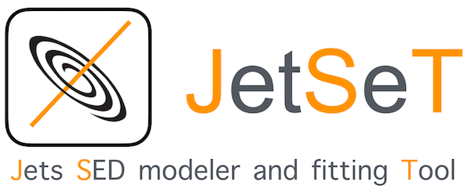

JetSeT is  an open source  C/Python   framework  to reproduce radiative and accelerative processes acting in relativistic jets,  
allowing to fit the numerical models to observed data. The main features of this framework are: 

 * handling observed data: re-binning, definition of data sets, bindings to astropy tables and quantities
   definition of complex numerical radiative scenarios: Synchrotron Self-Compton (SSC), external Compton (EC) and EC 
   against the CMB 
 
 * Constraining of the model in the pre-fitting stage, based on accurate  and already published phenomenological trends. 
   In particular, starting from phenomenological parameters, such as spectral indices, peak fluxes and frequencies, and 
   spectral  curvatures, that the code evaluates automatically, the pre-fitting algorithm is able to provide a good 
   starting model,following the phenomenological trends that I have implemented. fitting of multiwavelength SEDs using  
   both frequentist approach (iminuit) and bayesian MCMC sampling (emcee)
 
 * Self-consistent temporal evolution of the plasma under the effect of radiative, accelerative processes, and adiabatic expansion. Both first order and second order (stochastic acceleration) processes are implemented.


## Acknowledgements

If you use this code in any kind of scientific publication please cite the following papers:

* `Tramacere A. 2020`  https://ui.adsabs.harvard.edu/abs/2020ascl.soft09001T/abstract
* `Tramacere A. et al. 2011` http://adsabs.harvard.edu/abs/2011ApJ...739...66T
* `Tramacere A. et al. 2009` http://adsabs.harvard.edu/abs/2009A%26A...501..879T
* `Massaro E. et. al 2006`   http://adsabs.harvard.edu/abs/2006A%26A...448..861M

## Licence

JetSeT is released under a 3-clause BSD  license,  for deatils see
[License](https://github.com/andreatramacere/jetset/blob/master/LICENSE.txt) file 


# Documentation
visit: https://jetset.readthedocs.io/en/latest/

run the notebook on binder: 
[](https://mybinder.org/v2/gh/andreatramacere/jetset/master)
# Installation 
> **_NOTE:_** Starting from version 1.1.0, python 2 is not supported anymore. Python >=3.8 is suggested, older python 3 versions (< 3.8) should work.

## Install  JetSeT from Anaconda 
 
 - create a virtual environment (not necessary, but suggested): 
 
    `conda create --name jetset python=3.9 ipython jupyter`
    
     `conda activate jetset`
     
- install the code:
  
  `conda install -c andreatramacere jetset`
  
  if conda fails with dependencies you can try
    
   `conda install -c andreatramacere -c astropy -c conda-forge 'jetset>=1.2'`

## Install  JetSeT from pip 
- MacOS
  - create a virtual environment (not necessary, but suggested): 
  `pip install jetset`

- Linux
  > **_NOTE:_** currently, pip binaries for linux are not provided, so pip will build the binary on the fly. Hence:
  
  - install swig with of these [methods](swig.md) and check that you have a C compiler (gcc) 
  
  - `pip install jetset`
  
  if fails, use one of the following methods 

  1) Use anaconda
  
  OR

  2) Install from source
  
  OR

  3) Install the git release binaries [from git releases](install_git_releases.md)

## Install  JetSeT GitHub binaries
Install the git release binaries [from git releases](install_git_releases.md)

## run the test
```bash
pytest --disable-warnings  --pyargs  -vvv jetset.tests.test_users::TestUser
 ```  


## Install the JetSeT from source 


### Download the code
   - Get the source code from: 

     - https://github.com/andreatramacere/jetset/archive/stable.tar.gz

   - Uncompress the  archive  `jetset-stable.tar.gz`
   
   - cd to  the dir 
    
     - `cd jetset-stable` 

### Installation from source using Anaconda 
 
 - Install requirements, run on the command line:
    - `conda install --yes  swig">=3.0.0"`
    - `conda install -c astropy -c conda-forge --file requirements.txt`
  
   
if anaconda fails to install swig, you can try one of the following alternative [methods](swig.md)

   
 - run on the command line: 
     * `python setup.py clean`
     * `python setup.py install`

 - run the test (optional, **run all the examples outside  the installation dir**)
```bash
cd ~/
mkdir test_jetset
cd test_jetset
pytest  --pyargs  -vvv jetset.tests.test_users::TestUser
 ```  


### Installation from source using PIP 
 
 - Install requirements, run on the command line:
   * `pip install swig>=3.0.0 `
   * `pip install -r requirements.txt `
    
   if pip fails to install swig, you can try one of the following alternative [methods](swig.md)
  
  - run on the command line: 
    * `python setup.py clean`
    * `python setup.py install`

 - run the test (optional, **run all the examples outside  the installation dir**)
```bash
cd ~/
mkdir test_jetset
cd test_jetset
pytest  --pyargs  -vvv jetset.tests.test_users::TestUser
 ```    
      
   


##  Requirements
The following python packages are required:

        python =3.9 (python 3.9 is suggested, older python 3 versions should  work, python 2 is not supported any more from version>=1.1.0)
        setuptools
        scipy
        numpy
        astropy
        matplotlib
        swig
        future
        iminuit
        corner
        six
        emcee
        pyyaml
        numba
        sherpa
         


A C compiler is also necessary, plus the SWIG wrapper generator.

All the dependencies are installed following the Anaconda method 
 **OR** the pip method, as described above.

# jetset code repoistory

The code is hosted here: 
 -  https://github.com/andreatramacere/jetset
 


 


