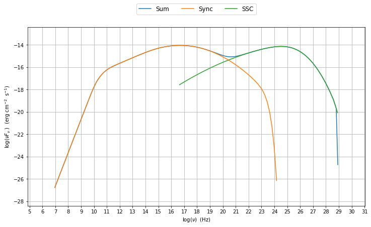

.. contents:: :local:

.. toctree::

jet\_model user guide
=====================

In this section we describe how to use the module  :mod:`.jet_model`
to buil a model of jet able to reproduce SSC/EC emission processes.
The :mod:`.jet_model`  allows to build a jet  model  providing an interface 
to call the C numerical code that provides an accurate and fast computation of the synchrotron and inverse Compoton processes.  The python wrappper is  built using SWIG framework. 

basic setup
-----------

A jet can be built using the  the :class:`.Jet` class, istanciating a jet object.

.. code:: ipython2

    %matplotlib inline
    from jetset import jet_model
    myJet=jet_model.Jet(name='test',electron_distribution='lppl',)

.. parsed-literal::

    directory .//test_jet_prod/ already existing
    removing existing dir
    the directory .//test_jet_prod/ has been created

This instruction will create:
    * a ``Jet`` object with ``name`` **test**,
    * using as electron distribution the **lppl** model, that is a log-parabola witha low-energy power-law branch.
    * using as wokring directory **test_jet_prod**

For a list of possible distribution refer to :func:`.jet_model.build_electron_distribution_dic`
    
The parameters of the model are accessible throug the instruction

.. code:: ipython2

    myJet.parameters.show_pars()

.. parsed-literal::

    --------------------------------------------------------------------------------------------------------------
    model parameters:
     Name             | Type                     | Units            | value         | phys. boundaries
    --------------------------------------------------------------------------------------------------------------
     gmax             | high-energy-cut-off      | Lorentz-factor   | +1.000000e+08 | [+1.000000e+00,No           ]  
     gmin             | low-energy-cut-off       | Lorentz-factor   | +2.000000e+00 | [+1.000000e+00,No           ]  
     N                | electron_density         | cm^-3            | +1.000000e+02 | [+0.000000e+00,No           ]  
     s                | LE_spectral_slope        |                  | +2.000000e+00 | [-1.000000e+01,+1.000000e+01]  
     r                | spectral_curvature       |                  | +4.000000e-01 | [-1.000000e+01,+1.000000e+01]  
     gamma0_log_parab | turn-over-energy         | Lorentz-factor   | +1.000000e+04 | [+1.000000e+00,No           ]  
     z_cosm           | redshift                 |                  | +1.000000e-01 | [+0.000000e+00,No           ]  
     B                | magnetic_field           | G                | +1.000000e-01 | [+0.000000e+00,No           ]  
     R                | region_size              | cm               | +3.000000e+15 | [+0.000000e+00,No           ]  
     beam_obj         | beaming                  |                  | +1.000000e+01 | [+1.000000e+00,No           ]  
    --------------------------------------------------------------------------------------------------------------

Each parameter has default values. All the parameters listed are handled by :class:`.ModelParameterArray`, and each parameter is an instance of the the :class:`.JetParameter`.

setting the parameters
~~~~~~~~~~~~~~~~~~~~~~

assume you want to change some of the parameters in your model:

.. code:: ipython2

    myJet.set_par('B',val=0.2)
    myJet.set_par('gamma0_log_parab',val=5E3)
    myJet.set_par('gmin',val=1E2)
    myJet.set_par('R',val=5E14)
    myJet.set_par('N',val=1E3)

evaluate and plot the model
---------------------------

At this point we can evaluate the emission for this jet model using the
instruction

.. code:: ipython2

    myJet.eval()

.. parsed-literal::

    ('fill name', 'Sum')
    ('fill name', 'Sync')
    ('fill name', 'SSC')

and plot the corresponding SED:

.. code:: ipython2

    from jetset.plot_sedfit import Plot
    
    my_plot=Plot()
    
    my_plot=myJet.plot_model(plot_obj=my_plot,autoscale=True)

.. parsed-literal::

    running PyLab in interactive mode

.. image:: Jet_example_files/Jet_example_16_1.png

alternatively, you can call the ``plot_model`` method without passing a
``Plot`` object

.. code:: ipython2

    my_plot=myJet.plot_model(autoscale=True)

.. parsed-literal::

    running PyLab in interactive mode

the ``my_plot`` objet returned will be built on the fly by the
``plot_model`` method

rescale the plot
~~~~~~~~~~~~~~~~

it is possible to rescale the your plot in the following way

.. code:: ipython2

    my_plot=Plot()
    my_plot=myJet.plot_model(plot_obj=my_plot,autoscale=True)
    
    my_plot.y_min=-20
    my_plot.y_max=-12
    my_plot.x_max=30
    my_plot.x_min=8
    
    my_plot.rescale()

.. parsed-literal::

    running PyLab in interactive mode

.. image:: Jet_example_files/Jet_example_22_1.png

comparing models on the same plot
~~~~~~~~~~~~~~~~~~~~~~~~~~~~~~~~~

to compare the same model after changing a parameter

.. code:: ipython2

    myPlot=Plot()
    
    myJet.plot_model(myPlot,label='gamma0_log_parab=1E4',autoscale=True,comp='Sum')
    myJet.set_par('gamma0_log_parab',val=1.0E5)
    
    myJet.eval()
    myJet.plot_model(myPlot,label='gamma0_log_parab=1E5',autoscale=True,comp='Sum')

.. parsed-literal::

    running PyLab in interactive mode
    ('fill name', 'Sum')
    ('fill name', 'Sync')
    ('fill name', 'SSC')

.. parsed-literal::

    <jetset.plot_sedfit.Plot at 0x181e2d2250>

.. image:: Jet_example_files/Jet_example_25_2.png

saving a plot
~~~~~~~~~~~~~

to save the plot

.. code:: ipython2

    myPlot.save('jet1.png')

set N from observed Flux
------------------------

It is possible to set the density of emitting particle starting from some observed Luminosity (see the method     :meth:`.Jet.set_N_from_nuFnu`)

.. code:: ipython2

    myJet=jet_model.Jet(name='test',electron_distribution='lppl')

.. parsed-literal::

    directory .//test_jet_prod/ already existing
    removing existing dir
    the directory .//test_jet_prod/ has been created

this is the initial value of N

.. code:: ipython2

    myJet.get_par_by_name('N').val

.. parsed-literal::

    100.0

.. code:: ipython2

    
    myJet.set_N_from_nuFnu(nuFnu_obs=1E-14,nu_obs=1E12)

This is the updated value of N, obtained in order to match the given
flux at the given frequencies

.. code:: ipython2

    myJet.get_par_by_name('N').val

.. parsed-literal::

    30781.15088279897

.. code:: ipython2

    myJet.parameters.show_pars()

.. parsed-literal::

    --------------------------------------------------------------------------------------------------------------
    model parameters:
     Name             | Type                     | Units            | value         | phys. boundaries
    --------------------------------------------------------------------------------------------------------------
     gmax             | high-energy-cut-off      | Lorentz-factor   | +1.000000e+08 | [+1.000000e+00,No           ]  
     gmin             | low-energy-cut-off       | Lorentz-factor   | +2.000000e+00 | [+1.000000e+00,No           ]  
     N                | electron_density         | cm^-3            | +3.078115e+04 | [+0.000000e+00,No           ]  
     s                | LE_spectral_slope        |                  | +2.000000e+00 | [-1.000000e+01,+1.000000e+01]  
     r                | spectral_curvature       |                  | +4.000000e-01 | [-1.000000e+01,+1.000000e+01]  
     gamma0_log_parab | turn-over-energy         | Lorentz-factor   | +1.000000e+04 | [+1.000000e+00,No           ]  
     z_cosm           | redshift                 |                  | +1.000000e-01 | [+0.000000e+00,No           ]  
     B                | magnetic_field           | G                | +1.000000e-01 | [+0.000000e+00,No           ]  
     R                | region_size              | cm               | +3.000000e+15 | [+0.000000e+00,No           ]  
     beam_obj         | beaming                  |                  | +1.000000e+01 | [+1.000000e+00,No           ]  
    --------------------------------------------------------------------------------------------------------------

.. code:: ipython2

    myJet.eval()
    myPlot=Plot()
    myJet.plot_model(myPlot,autoscale=True,label='set N from F=1E-14')

.. parsed-literal::

    ('fill name', 'Sum')
    ('fill name', 'Sync')
    ('fill name', 'SSC')
    running PyLab in interactive mode

.. parsed-literal::

    <jetset.plot_sedfit.Plot at 0x181c69f9d0>

.. image:: Jet_example_files/Jet_example_38_2.png

.. code:: ipython2

    
    myPlot=Plot()
    
    myPlot.y_min=-18
    myPlot.y_max=-9
    myPlot.x_max=30
    myPlot.x_min=10
    
    
    myPlot=myJet.plot_model(myPlot,autoscale=False,label='set N from F=1E-14')
    myPlot.rescale()

.. parsed-literal::

    running PyLab in interactive mode

.. image:: Jet_example_files/Jet_example_39_1.png

.. code:: ipython2

    myPlot.rescale()

setting beaming factor
----------------------

It is possible to set the bemaing factor according to the realativistic
BulkFactor and viewing angle, this can be done by setting the
``beaming_expr`` kw in the Jet constructor, possbile choiches are

-  ``delta`` to provide directly the beaming factor (default)
-  ``bulk_theta`` to provide the BulkFactor and the jet viewing angle

.. code:: ipython2

    myJet=jet_model.Jet(name='test',electron_distribution='lppl',beaming_expr='bulk_theta')

.. parsed-literal::

    directory .//test_jet_prod/ already existing
    removing existing dir
    the directory .//test_jet_prod/ has been created

.. code:: ipython2

    myJet.parameters.show_pars()

.. parsed-literal::

    --------------------------------------------------------------------------------------------------------------
    model parameters:
     Name             | Type                     | Units            | value         | phys. boundaries
    --------------------------------------------------------------------------------------------------------------
     gmax             | high-energy-cut-off      | Lorentz-factor   | +1.000000e+08 | [+1.000000e+00,No           ]  
     gmin             | low-energy-cut-off       | Lorentz-factor   | +2.000000e+00 | [+1.000000e+00,No           ]  
     N                | electron_density         | cm^-3            | +1.000000e+02 | [+0.000000e+00,No           ]  
     s                | LE_spectral_slope        |                  | +2.000000e+00 | [-1.000000e+01,+1.000000e+01]  
     r                | spectral_curvature       |                  | +4.000000e-01 | [-1.000000e+01,+1.000000e+01]  
     gamma0_log_parab | turn-over-energy         | Lorentz-factor   | +1.000000e+04 | [+1.000000e+00,No           ]  
     z_cosm           | redshift                 |                  | +1.000000e-01 | [+0.000000e+00,No           ]  
     theta            | jet-viewing-angle        | deg              | +1.000000e-01 | [+0.000000e+00,No           ]  
     B                | magnetic_field           | G                | +1.000000e-01 | [+0.000000e+00,No           ]  
     R                | region_size              | cm               | +3.000000e+15 | [+0.000000e+00,No           ]  
     BulkFactor       | jet-bulk-factor          | Lorentz-factor   | +1.000000e+01 | [+1.000000e+00,No           ]  
    --------------------------------------------------------------------------------------------------------------

the actual value of the beaming factor che be obatained using the :meth:`.Jet.get_beaming`

.. code:: ipython2

    print 'beaming factor=',myJet.get_beaming()

.. parsed-literal::

    beaming factor= 19.9438447326

We can change the value of ``theta`` and get the updated value of the beaming factor

.. code:: ipython2

    myJet.set_par('theta',val=10.)

.. code:: ipython2

    print 'beaming factor=',myJet.get_beaming()

.. parsed-literal::

    beaming factor= 4.96804114089

of course setting `beaming_expr=delta` we get the same beaming expression as in the default case

.. code:: ipython2

    myJet=jet_model.Jet(name='test',electron_distribution='lppl',beaming_expr='delta')

.. parsed-literal::

    directory .//test_jet_prod/ already existing
    removing existing dir
    the directory .//test_jet_prod/ has been created

.. code:: ipython2

    myJet.parameters.show_pars()

.. parsed-literal::

    --------------------------------------------------------------------------------------------------------------
    model parameters:
     Name             | Type                     | Units            | value         | phys. boundaries
    --------------------------------------------------------------------------------------------------------------
     gmax             | high-energy-cut-off      | Lorentz-factor   | +1.000000e+08 | [+1.000000e+00,No           ]  
     gmin             | low-energy-cut-off       | Lorentz-factor   | +2.000000e+00 | [+1.000000e+00,No           ]  
     N                | electron_density         | cm^-3            | +1.000000e+02 | [+0.000000e+00,No           ]  
     s                | LE_spectral_slope        |                  | +2.000000e+00 | [-1.000000e+01,+1.000000e+01]  
     r                | spectral_curvature       |                  | +4.000000e-01 | [-1.000000e+01,+1.000000e+01]  
     gamma0_log_parab | turn-over-energy         | Lorentz-factor   | +1.000000e+04 | [+1.000000e+00,No           ]  
     z_cosm           | redshift                 |                  | +1.000000e-01 | [+0.000000e+00,No           ]  
     B                | magnetic_field           | G                | +1.000000e-01 | [+0.000000e+00,No           ]  
     R                | region_size              | cm               | +3.000000e+15 | [+0.000000e+00,No           ]  
     beam_obj         | beaming                  |                  | +1.000000e+01 | [+1.000000e+00,No           ]  
    --------------------------------------------------------------------------------------------------------------

accessing individual components
-------------------------------

It is possible to access specific spectral components of oura model

.. code:: ipython2

    myJet.eval()

.. parsed-literal::

    ('fill name', 'Sum')
    ('fill name', 'Sync')
    ('fill name', 'SSC')

the on-screen message is telling us which components have been
evaluated.

We can obtain this information anytime using the :meth:`.Jet.list_spectral_components` method

.. code:: ipython2

    myJet.list_spectral_components()

.. parsed-literal::

    Sum
    Sync
    SSC

and we cann access a specific component using the :meth:`.Jet.get_spectral_component_by_name` method

.. code:: ipython2

    Sync=myJet.get_spectral_component_by_name('Sync')

and from the ``SED`` object we can extract both the nu and nuFnu array

.. code:: ipython2

    nu_sync=Sync.SED.nu
    nuFnu_sync=Sync.SED.nuFnu

.. code:: ipython2

    print nuFnu_sync

.. parsed-literal::

    [  8.46279238e-28   2.63777772e-27   8.28684281e-27   2.68144376e-26
       9.19336698e-26   3.41103684e-25   1.35710410e-24   5.57914715e-24
       2.30797994e-23   9.55091537e-23   3.95238541e-22   1.63558289e-21
       6.76822974e-21   2.79998997e-20   1.15465943e-19   4.58936127e-19
       1.39707126e-18   2.62852367e-18   3.73095658e-18   4.78316149e-18
       5.93958206e-18   7.30508485e-18   8.95882299e-18   1.09775314e-17
       1.34479553e-17   1.64715691e-17   2.01746246e-17   2.47088865e-17
       3.02602181e-17   3.70553927e-17   4.53707521e-17   5.55423063e-17
       6.79774557e-17   8.31681334e-17   1.01704847e-16   1.24290694e-16
       1.51753052e-16   1.85049332e-16   2.25260870e-16   2.73565425e-16
       3.31176324e-16   3.99234531e-16   4.78643710e-16   5.69857565e-16
       6.72661410e-16   7.86030653e-16   9.08151879e-16   1.03659564e-15
       1.16849794e-15   1.30062847e-15   1.42941186e-15   1.55102317e-15
       1.66155845e-15   1.75723466e-15   1.83460305e-15   1.89075454e-15
       1.92349898e-15   1.93150843e-15   1.91440507e-15   1.87278950e-15
       1.80820743e-15   1.72305195e-15   1.62041569e-15   1.50390548e-15
       1.37742816e-15   1.24497446e-15   1.11041276e-15   9.77306137e-16
       8.48768387e-16   7.27362175e-16   6.15043686e-16   5.13152395e-16
       4.22438503e-16   3.43122309e-16   2.74976193e-16   2.17417312e-16
       1.69604758e-16   1.30532482e-16   9.91119266e-17   7.42414127e-17
       5.48600792e-17   3.99862911e-17   2.87417713e-17   2.03632926e-17
       1.42046413e-17   9.73173425e-18   6.51375123e-18   4.21350512e-18
       2.57945643e-18   1.43901226e-18   6.86457287e-19   2.53115496e-19
       6.18665052e-20   7.96917563e-21   3.85187712e-22   4.21337257e-24
       4.91052563e-27]

Numerical computation fine-tuning
---------------------------------

Changing the grid size for the electron distribution
~~~~~~~~~~~~~~~~~~~~~~~~~~~~~~~~~~~~~~~~~~~~~~~~~~~~

It is possible to change the size of the grid for the electron distribution. It is worth noting that at lower values of the grid size the speed will increase, but it is not recommended to go below 100.
The acutual value of the grid size is returned by the :meth:`.Jet.get_gamma_grid_size`

.. code:: ipython2

    myJet.get_gamma_grid_size()

.. parsed-literal::

    1001L

and this value can be changed using the method :meth:`.Jet.set_gamma_grid_size`. In the following we show the result for a grid of size=10, as anticiapted the final integration will be not satisfactory

.. code:: ipython2

    myJet.set_gamma_grid_size(10)
    myJet.eval()
    myJet.plot_model()

.. parsed-literal::

    ('fill name', 'Sum')
    ('fill name', 'Sync')
    ('fill name', 'SSC')
    running PyLab in interactive mode

.. parsed-literal::

    <jetset.plot_sedfit.Plot at 0x181c97dd50>

.. image:: Jet_example_files/Jet_example_66_2.png

.. code:: ipython2

    myJet.set_gamma_grid_size(100)
    myJet.eval()
    myJet.plot_model()

.. parsed-literal::

    ('fill name', 'Sum')
    ('fill name', 'Sync')
    ('fill name', 'SSC')
    running PyLab in interactive mode

.. parsed-literal::

    <jetset.plot_sedfit.Plot at 0x181ea99710>

.. image:: Jet_example_files/Jet_example_67_2.png

.. code:: ipython2

    myJet.set_gamma_grid_size(1000)
    myJet.eval()
    myJet.plot_model()

.. parsed-literal::

    ('fill name', 'Sum')
    ('fill name', 'Sync')
    ('fill name', 'SSC')
    running PyLab in interactive mode

.. parsed-literal::

    <jetset.plot_sedfit.Plot at 0x10f312150>

.. image:: Jet_example_files/Jet_example_68_2.png

.. code:: ipython2

    myJet.set_gamma_grid_size(10000)
    myJet.eval()
    myJet.plot_model()

.. parsed-literal::

    ('fill name', 'Sum')
    ('fill name', 'Sync')
    ('fill name', 'SSC')
    running PyLab in interactive mode

.. parsed-literal::

    <jetset.plot_sedfit.Plot at 0x181ebd0690>

.. image:: Jet_example_files/Jet_example_69_2.png

Changing the grid size for the seed photons
~~~~~~~~~~~~~~~~~~~~~~~~~~~~~~~~~~~~~~~~~~~

.. code:: ipython2

    myJet=jet_model.Jet(name='test',electron_distribution='lppl',)

.. parsed-literal::

    directory .//test_jet_prod/ already existing
    removing existing dir
    the directory .//test_jet_prod/ has been created

.. code:: ipython2

    myJet.get_seed_nu_size()

.. parsed-literal::

    100L

.. code:: ipython2

    myJet.set_seed_nu_size(10)
    myJet.eval()
    myJet.plot_model()

.. parsed-literal::

    ('fill name', 'Sum')
    ('fill name', 'Sync')
    ('fill name', 'SSC')
    running PyLab in interactive mode

.. parsed-literal::

    <jetset.plot_sedfit.Plot at 0x181c97d8d0>

.. image:: Jet_example_files/Jet_example_73_2.png

Changing the grid size for the IC process spectra
~~~~~~~~~~~~~~~~~~~~~~~~~~~~~~~~~~~~~~~~~~~~~~~~~

.. code:: ipython2

    myJet=jet_model.Jet(name='test',electron_distribution='lppl',)

.. parsed-literal::

    directory .//test_jet_prod/ already existing
    removing existing dir
    the directory .//test_jet_prod/ has been created

.. code:: ipython2

    myJet.get_IC_nu_size()

.. parsed-literal::

    50L

.. code:: ipython2

    myJet.set_IC_nu_size(10)
    myJet.eval()
    myJet.plot_model()

.. parsed-literal::

    ('fill name', 'Sum')
    ('fill name', 'Sync')
    ('fill name', 'SSC')
    running PyLab in interactive mode

.. parsed-literal::

    <jetset.plot_sedfit.Plot at 0x181fca8cd0>

.. image:: Jet_example_files/Jet_example_77_2.png

.. code:: ipython2

    myJet.set_IC_nu_size(100)
    myJet.eval()
    myJet.plot_model()

.. parsed-literal::

    ('fill name', 'Sum')
    ('fill name', 'Sync')
    ('fill name', 'SSC')
    running PyLab in interactive mode

.. parsed-literal::

    <jetset.plot_sedfit.Plot at 0x18201be310>

.. image:: Jet_example_files/Jet_example_78_2.png

External Compotn
----------------

Broad Line Region
~~~~~~~~~~~~~~~~~

.. code:: ipython2

    myJet=jet_model.Jet(name='BLR example',electron_distribution='bkn')
    myJet.add_EC_component('BLR')
    myJet.set_gamma_grid_size(1000)
    myJet.show_model()

.. parsed-literal::

    directory .//BLR example_jet_prod/ already existing
    removing existing dir
    the directory .//BLR example_jet_prod/ has been created
    -----------------------------------------------------------------------------------------
    model parameters for jet model:
    
    electron distribution type = bkn  
    --------------------------------------------------------------------------------------------------------------
    model parameters:
     Name             | Type                     | Units            | value         | phys. boundaries
    --------------------------------------------------------------------------------------------------------------
     gmax             | high-energy-cut-off      | Lorentz-factor   | +1.000000e+08 | [+1.000000e+00,No           ]  
     gmin             | low-energy-cut-off       | Lorentz-factor   | +2.000000e+00 | [+1.000000e+00,No           ]  
     N                | electron_density         | cm^-3            | +1.000000e+02 | [+0.000000e+00,No           ]  
     gamma_break      | turn-over-energy         | Lorentz-factor   | +1.000000e+04 | [+1.000000e+00,No           ]  
     p                | LE_spectral_slope        |                  | +2.000000e+00 | [-1.000000e+01,+1.000000e+01]  
     p_1              | HE_spectral_slope        |                  | +3.000000e+00 | [-1.000000e+01,+1.000000e+01]  
     z_cosm           | redshift                 |                  | +1.000000e-01 | [+0.000000e+00,No           ]  
     B                | magnetic_field           | G                | +1.000000e-01 | [+0.000000e+00,No           ]  
     R                | region_size              | cm               | +3.000000e+15 | [+0.000000e+00,No           ]  
     beam_obj         | beaming                  |                  | +1.000000e+01 | [+1.000000e+00,No           ]  
     T_disk_max       | Disk                     | K                | +1.000000e+05 | [+0.000000e+00,No           ]  
     R_BLR_in         | BLR                      | cm               | +1.000000e+18 | [+0.000000e+00,No           ]  
     R_ext_Sw         | Disk                     | Sw. radii        | +5.000000e+02 | [+0.000000e+00,No           ]  
     R_inner_Sw       | Disk                     | Sw. radii        | +3.000000e+00 | [+0.000000e+00,No           ]  
     R_BLR_out        | BLR                      | cm               | +2.000000e+18 | [+0.000000e+00,No           ]  
     tau_BLR          | BLR                      |                  | +1.000000e-01 | [+0.000000e+00,+1.000000e+00]  
     accr_eff         | Disk                     |                  | +1.000000e-01 | [+0.000000e+00,No           ]  
     R_H              | Disk                     | cm               | +1.000000e+17 | [+0.000000e+00,No           ]  
     L_disk           | Disk                     | erg/s            | +1.000000e+47 | [+0.000000e+00,No           ]  
    --------------------------------------------------------------------------------------------------------------
    -----------------------------------------------------------------------------------------

.. code:: ipython2

    myJet.set_par('L_disk',val=1E46)
    myJet.set_par('gmax',val=1E5)
    myJet.set_par('gmin',val=2.)
    
    myJet.set_par('p',val=1.5)
    myJet.set_par('p_1',val=3.5)
    myJet.set_par('R',val=5E15)
    myJet.set_par('B',val=1.0)
    myJet.set_par('z_cosm',val=0.6)
    myJet.set_par('beam_obj',val=25)
    myJet.set_par('gamma_break',val=5E2)
    
    myJet.set_N_from_nuFnu(nuFnu_obs=1E-12,nu_obs=1E12)
    
    myJet.eval()
    
    
    my_plot=Plot()
    my_plot=myJet.plot_model(plot_obj=my_plot,autoscale=True)
    
    my_plot.y_min=-15
    my_plot.y_max=-10
    my_plot.x_max=26
    my_plot.x_min=10
    
    my_plot.rescale()

.. parsed-literal::

    ('fill name', 'Sum')
    ('fill name', 'Sync')
    ('fill name', 'SSC')
    ('fill name', 'EC_BLR')
    ('fill name', 'Disk')
    running PyLab in interactive mode

.. image:: Jet_example_files/Jet_example_82_1.png

Dusty Torus
~~~~~~~~~~~

.. code:: ipython2

    myJet.add_EC_component('DT')
    myJet.show_model()

.. parsed-literal::

    -----------------------------------------------------------------------------------------
    model parameters for jet model:
    
    electron distribution type = bkn  
    --------------------------------------------------------------------------------------------------------------
    model parameters:
     Name             | Type                     | Units            | value         | phys. boundaries
    --------------------------------------------------------------------------------------------------------------
     gmax             | high-energy-cut-off      | Lorentz-factor   | +1.000000e+05 | [+1.000000e+00,No           ]  
     gmin             | low-energy-cut-off       | Lorentz-factor   | +2.000000e+00 | [+1.000000e+00,No           ]  
     N                | electron_density         | cm^-3            | +8.514734e+03 | [+0.000000e+00,No           ]  
     gamma_break      | turn-over-energy         | Lorentz-factor   | +5.000000e+02 | [+1.000000e+00,No           ]  
     p                | LE_spectral_slope        |                  | +1.500000e+00 | [-1.000000e+01,+1.000000e+01]  
     p_1              | HE_spectral_slope        |                  | +3.500000e+00 | [-1.000000e+01,+1.000000e+01]  
     z_cosm           | redshift                 |                  | +6.000000e-01 | [+0.000000e+00,No           ]  
     B                | magnetic_field           | G                | +1.000000e+00 | [+0.000000e+00,No           ]  
     R                | region_size              | cm               | +5.000000e+15 | [+0.000000e+00,No           ]  
     beam_obj         | beaming                  |                  | +2.500000e+01 | [+1.000000e+00,No           ]  
     T_disk_max       | Disk                     | K                | +1.000000e+05 | [+0.000000e+00,No           ]  
     R_BLR_in         | BLR                      | cm               | +1.000000e+18 | [+0.000000e+00,No           ]  
     R_ext_Sw         | Disk                     | Sw. radii        | +5.000000e+02 | [+0.000000e+00,No           ]  
     R_inner_Sw       | Disk                     | Sw. radii        | +3.000000e+00 | [+0.000000e+00,No           ]  
     R_BLR_out        | BLR                      | cm               | +2.000000e+18 | [+0.000000e+00,No           ]  
     tau_BLR          | BLR                      |                  | +1.000000e-01 | [+0.000000e+00,+1.000000e+00]  
     accr_eff         | Disk                     |                  | +1.000000e-01 | [+0.000000e+00,No           ]  
     R_H              | Disk                     | cm               | +1.000000e+17 | [+0.000000e+00,No           ]  
     L_disk           | Disk                     | erg/s            | +1.000000e+46 | [+0.000000e+00,No           ]  
     R_DT             | DT                       | cm               | +5.000000e+18 | [+0.000000e+00,No           ]  
     T_DT             | DT                       | K                | +1.000000e+02 | [+0.000000e+00,No           ]  
     tau_DT           | DT                       |                  | +1.000000e-01 | [+0.000000e+00,+1.000000e+00]  
    --------------------------------------------------------------------------------------------------------------
    -----------------------------------------------------------------------------------------

.. code:: ipython2

    
    myJet.eval()
    
    
    my_plot=Plot()
    my_plot=myJet.plot_model(plot_obj=my_plot,autoscale=True)
    
    my_plot.y_min=-15
    my_plot.y_max=-10
    my_plot.x_max=26
    my_plot.x_min=10
    
    my_plot.rescale()

.. parsed-literal::

    ('fill name', 'Sum')
    ('fill name', 'Sync')
    ('fill name', 'SSC')
    ('fill name', 'EC_BLR')
    ('fill name', 'Disk')
    ('fill name', 'EC_DT')
    ('fill name', 'DT')
    running PyLab in interactive mode

.. image:: Jet_example_files/Jet_example_85_1.png

