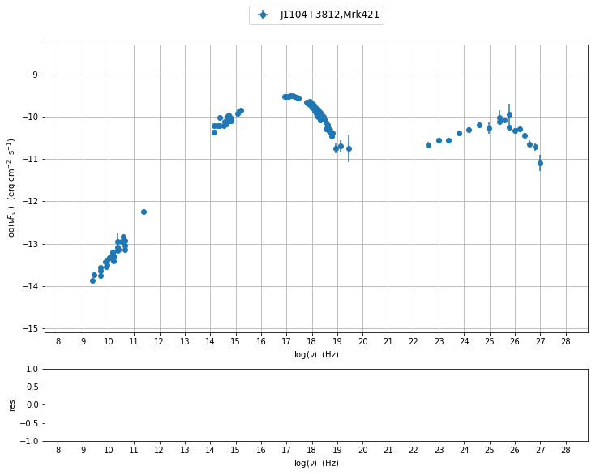
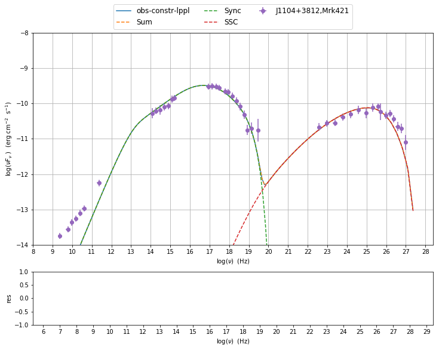

.. toctree::

.. code:: ipython2

    import matplotlib.pylab as plt
    %matplotlib inline

Basic Concepts
==============

work place
----------

The first step is to import the package, and to set a work place:

.. code:: ipython2

    import BlazarSEDFit as SEDFit
    
    SEDFit.set_workplace(out_dir='test-Mrk421',flag='Mrk421')

.. parsed-literal::

    directory test-Mrk421 already existing
    removing existing dir
    the directory test-Mrk421 has been created

the latter command will set the output directory to ``./test-Mrk421``
and will add a flag ``Mrk421`` to the output products

data format
-----------

The SED data can be stored in ASCII file in a quite flexible way, but
some requirements are needed:

-  you must provide at least two columns for frequencies and fluxes
-  frequencies are in *Hz*
-  fluxes are in *cgs*, .....

The header of the file can contain some meta-data that are sourced when
the data are loaded. The meta-data available are :

-  z : redhsift
-  resframe: restframe of the data ``src`` or ``obs``
-  data\_scale: scale of the data ``lin-lin`` or ``log-log``
-  dataType: structure of the comumns with the SED data

the meaning of these meta-data is explained in detail in :class:`BlazarSEDFit.data_loader.ObsData` class 
documentation. The meta-data can be included in the header with  line like:

.. code:: ipython2

    # metadata
    # md z  0.0308
    # md restframe  obs
    # md data_scale  lin-lin
    # md col_types x,y,dy,data_set
    # md obj_name     J1104+3812,Mrk421
    #

A typical structure of SED data file, including meta-data declaration is
the following:

::

    # metadata
    # md z  0.0308
    # md restframe  obs
    # md data_scale  lin-lin
    # md col_types x,y,dy,data_set
    # md obj_name     J1104+3812,Mrk421
    #
    # Frequency [Hz]  EnergyFlux [erg/cm2/s]
    #  Xval           Yval       YvalError    data_set-flag
    2.299540e+09 1.340900e-14 3.910000e-16    campaing-2009
    2.639697e+09 1.793088e-14 3.231099e-26    campaing-2009
    4.799040e+09 2.313600e-14 2.400000e-16    campaing-2009
    4.805039e+09 1.773414e-14 1.773414e-15    campaing-2009
    4.843552e+09 2.776140e-14 2.615339e-26    campaing-2009
    7.698460e+09 3.696000e-14 4.620000e-16    campaing-2009
    8.267346e+09 2.836267e-14 2.836267e-15    campaing-2009
    8.331867e+09 3.989630e-14 3.627671e-26    campaing-2009
    8.388659e+09 3.163450e-14 1.931495e-15    campaing-2009
    8.399994e+09 4.000500e-14 5.041094e-15    campaing-2009
    1.044892e+10 4.626737e-14 3.297726e-26    campaing-2009
    1.109778e+10 4.617600e-14 6.660000e-16    campaing-2009
    1.456571e+10 5.628417e-14 4.453463e-26    campaing-2009

Loading SEDs
------------

The most effective way to import the SED data is to create an object 
instance of :class:`BlazarSEDFit.data_loader.ObsData` class 
(see the documentation for the :doc:`data_loader <../../modules_doc/data_loader>` module)
The package provides some test SEDs, accessible as follows:

.. code:: ipython2

    SEDFit.test_SEDs

.. parsed-literal::

    ['/Users/orion/anaconda2/lib/python2.7/site-packages/BlazarSEDFit/test_data/SEDs_data/SED_3C345.dat',
     '/Users/orion/anaconda2/lib/python2.7/site-packages/BlazarSEDFit/test_data/SEDs_data/SED_MW_Mrk421.dat',
     '/Users/orion/anaconda2/lib/python2.7/site-packages/BlazarSEDFit/test_data/SEDs_data/SED_MW_Mrk501.dat']

to load the SED of Mrk 421, the first one in the list:

.. code:: ipython2

    mySED=SEDFit.test_SEDs[1]
    
    mySEDdata=SEDFit.ObsData(data_file=mySED)

.. parsed-literal::

    =============================================================================================
    
    *** getting meta-data from file header
    set md z  to 0.0308
    set md restframe  to obs
    set md data_scale  to lin-lin
    set md col_types  to x,y,dy,data_set
    set md obj_name  to J1104+3812,Mrk421
    =============================================================================================
    
    []
    =============================================================================================
    
    *** loading data ***
    ---> loading data for file=/Users/orion/anaconda2/lib/python2.7/site-packages/BlazarSEDFit/test_data/SEDs_data/SED_MW_Mrk421.dat
    ---> found these col ID=[0, 1, 2, 3] and names=['x', 'y', 'dy', 'data_set']:
    ---> z=3.080000e-02
    ---> restframe=obs
    ---> obj_name=J1104+3812,Mrk421 
    ---> data_scale=lin-lin 
    nu_data x
    nuFnu_data y
    dnuFnu_data dy
    data_set data_set
    ---> data len=112
    ---> Settin  UL for val 0
    ---> Settin  UL for val 0.2
    5, [  9.36164097   9.42155408   9.68115437   9.68169692   9.68516397
       9.88640386   9.91736611   9.92074233   9.92369254   9.92427898
      10.0190714   10.04523611  10.16333166  10.17390881  10.1760817
      10.1760817   10.18645992  10.34241814  10.34626611  10.36192473
      10.37657221  10.5049378   10.56820172  10.63557281  10.63560386
      10.63560386  11.36172784  14.1476145   14.15218006  14.26561016
      14.38080202  14.38216623  14.52014291  14.57266033  14.6374482
      14.6374482   14.66196206  14.67335245  14.67335245  14.71633712
      14.73737611  14.73737611  14.79796843  14.82244074  14.83619856
      15.07948442  15.14089503  15.21226353  16.92176631  17.00176529
      17.08176448  17.16176318  17.24176233  17.32176139  17.40176041
      17.48175942  17.78669947  17.86408387  17.92210689  17.94146835
      17.96990766  18.01301302  18.01885272  18.0522706   18.08831544
      18.0962372   18.12163796  18.15262433  18.17362151  18.18158322
      18.20876615  18.23437984  18.25100615  18.25859802  18.28156602
      18.30340775  18.32422976  18.32839041  18.34412395  18.36317069
      18.39833139  18.44734257  18.504513    18.55857838  18.5680578
      18.61315063  18.62373708  18.68230197  18.69856453  18.77824476
      18.81555424  18.93170083  19.14680748  19.46704604  22.58329129
      22.98330593  23.38348378  23.78346513  24.18345036  24.58345553
      24.9834565   25.38242592  25.38345486  25.58242622  25.78242697
      25.78345384  25.98242651  26.18242635  26.38242592  26.58242622
      26.78242697  26.98242651]
    =============================================================================================
    

As you can see the all the meta-data have been properly sourced from the
SED file header. You also get information on the lenght of the data,
before and after elimination of duplicated entries, and upper limits
These meta-data are parameters needed by the

:class:`BlazarSEDFit.data_loader.ObsData` constructor. 

Plotting data
-------------

We can now plot our SED using the :class:`BlazarSEDFit.plot_sedfit.Plot` class 
(see the documentation for the :doc:`plot_sedfit <../../modules_doc/plot_sedfit>` module)

.. code:: ipython2

    myPlot=SEDFit.Plot(mySEDdata,interactive=True)
    
    myPlot.add_data_plot(mySEDdata,autoscale=True)

.. parsed-literal::

    running PyLab in interactive mode

grouping data
-------------

As you can see, due to the overlapping of different instruments and to
different time snapshots, some points have multiple values. Although
this is not a problem for the fit process, you might want to rebin your
data. This can be obtained with the following command:

.. code:: ipython2

    mySEDdata.group_data(bin_width=0.2)

.. parsed-literal::

    =============================================================================================
    
    ***  binning data  ***
    ---> N bins= 89
    ---> bin_widht= 0.2
    =============================================================================================
    

handling errors and systematics
-------------------------------

Another important issues when dealing with fitting of data, is the
proper handling of errors. Typically one might need to add systematics
for different reasons:

-  data are not really simultaneous, and you want to add systematics to
   take this into account
-  data (typically IR up to UV), might have very small errors compared
   to those at higher energies. This might bias the minimizer to
   accomodate the parameters in order to fit 'better' the low
   frequencies branch.

For these reasons the package offer the possibility to add systematics

.. code:: ipython2

    mySEDdata.add_systematics(0.2,[10.**6,10.**29])
    myPlot=SEDFit.Plot(interactive=True)
    myPlot.add_data_plot(mySEDdata,label='grouped+syst',autoscale=True)

.. parsed-literal::

    running PyLab in interactive mode

.. image:: basic_files/basic_22_1.png

with this command we add 20% systematics for data between :math:`10^{6}<\nu<10^{29}` Hz

SEDShape: Spectral indices
--------------------------

.. code:: ipython2

    SEDShape=SEDFit.SEDShape(mySEDdata)
    SEDShape.eval_indices()

.. parsed-literal::

    =============================================================================================
    
    *** evaluating spectral indices for data ***
    ---> range for indexradio updated to [6.000000,10.000000]
    the directory test-Mrk421/spectral-indices-best-fit/ has been created
    minim function calls=10, res=-0.016464, chisq=0.369494
    res check 0.0402652596909 0.36841820873
    ---> 1000000.0 10000000000.0 100
    ---> name = radio            range=[6.000 ,10.000] log(Hz)  photon.val=-1.402754e+00, err=1.250721e-01 
    
    **************************************************************************************************
    Fit report
    
    Model: spectral-indices-best-fit
    --------------------------------------------------------------------------------------------------------------
    model parameters:
     Name             | Type                     | Units            | value         | phys. boundaries
    --------------------------------------------------------------------------------------------------------------
     alpha            | spectral-slope           |                  | +5.972462e-01 | [-1.000000e+01,+1.000000e+01]  
     K                | flux-const               | erg cm^-2 s^-1   | -1.935759e+01 | [-3.000000e+01,+0.000000e+00]  
    --------------------------------------------------------------------------------------------------------------
    
    converged=1
    calls=13
    mesg=Both actual and predicted relative reductions in the sum of squares
      are at most 0.000000
    dof=1
    chisq=0.368418, chisq/red=0.368418 null hypothesis sig=0.543868
    
    best fit pars
    ---------------------------------------------------------------------------------------------------
    best-fit parameters:
      Name            | best-fit value| best-fit err  | start value   | fit boundaries
    ---------------------------------------------------------------------------------------------------
     alpha            | +5.972462e-01 | +1.250721e-01 | -1.000000e+00 | [-1.000000e+01,+1.000000e+01]
     K                | -1.935759e+01 | +1.212602e+00 | -1.000000e+01 | [-3.000000e+01,+0.000000e+00]
    ---------------------------------------------------------------------------------------------------
    **************************************************************************************************
    
    
    
    ---> range for indexradio_mm updated to [10.000000,11.000000]
    directory test-Mrk421/spectral-indices-best-fit/ already existing
    removing existing dir
    the directory test-Mrk421/spectral-indices-best-fit/ has been created
    minim function calls=10, res=-0.074093, chisq=0.015776
    res check 3.47694095737e-13 0.0139462498263
    ---> 10000000000.0 1e+11 100
    ---> name = radio_mm         range=[10.000,11.000] log(Hz)  photon.val=-1.290348e+00, err=3.549105e-02 
    
    **************************************************************************************************
    Fit report
    
    Model: spectral-indices-best-fit
    --------------------------------------------------------------------------------------------------------------
    model parameters:
     Name             | Type                     | Units            | value         | phys. boundaries
    --------------------------------------------------------------------------------------------------------------
     alpha            | spectral-slope           |                  | +7.096521e-01 | [-1.000000e+01,+1.000000e+01]  
     K                | flux-const               | erg cm^-2 s^-1   | -2.047668e+01 | [-3.000000e+01,+0.000000e+00]  
    --------------------------------------------------------------------------------------------------------------
    
    converged=3
    calls=13
    mesg=Both actual and predicted relative reductions in the sum of squares
      are at most 0.000000 and the relative error between two consecutive iterates is at 
      most 0.000000
    dof=1
    chisq=0.013946, chisq/red=0.013946 null hypothesis sig=0.905993
    
    best fit pars
    ---------------------------------------------------------------------------------------------------
    best-fit parameters:
      Name            | best-fit value| best-fit err  | start value   | fit boundaries
    ---------------------------------------------------------------------------------------------------
     alpha            | +7.096521e-01 | +3.549105e-02 | -1.000000e+00 | [-1.000000e+01,+1.000000e+01]
     K                | -2.047668e+01 | +3.689495e-01 | -1.000000e+01 | [-3.000000e+01,+0.000000e+00]
    ---------------------------------------------------------------------------------------------------
    **************************************************************************************************
    
    
    
    ---> range for indexmm_IR updated to [10.300000,13.700000]
    directory test-Mrk421/spectral-indices-best-fit/ already existing
    removing existing dir
    the directory test-Mrk421/spectral-indices-best-fit/ has been created
    minim function calls=10, res=-0.052342, chisq=0.171012
    res check 0.00565037767325 0.169889454723
    ---> 19952623149.7 5.01187233627e+13 100
    ---> name = mm_IR            range=[10.300,13.700] log(Hz)  photon.val=-1.109667e+00, err=5.233777e-02 
    
    **************************************************************************************************
    Fit report
    
    Model: spectral-indices-best-fit
    --------------------------------------------------------------------------------------------------------------
    model parameters:
     Name             | Type                     | Units            | value         | phys. boundaries
    --------------------------------------------------------------------------------------------------------------
     alpha            | spectral-slope           |                  | +8.903325e-01 | [-1.000000e+01,+1.000000e+01]  
     K                | flux-const               | erg cm^-2 s^-1   | -2.236816e+01 | [-3.000000e+01,+0.000000e+00]  
    --------------------------------------------------------------------------------------------------------------
    
    converged=3
    calls=13
    mesg=Both actual and predicted relative reductions in the sum of squares
      are at most 0.000000 and the relative error between two consecutive iterates is at 
      most 0.000000
    dof=1
    chisq=0.169889, chisq/red=0.169889 null hypothesis sig=0.680210
    
    best fit pars
    ---------------------------------------------------------------------------------------------------
    best-fit parameters:
      Name            | best-fit value| best-fit err  | start value   | fit boundaries
    ---------------------------------------------------------------------------------------------------
     alpha            | +8.903325e-01 | +5.233777e-02 | -1.000000e+00 | [-1.000000e+01,+1.000000e+01]
     K                | -2.236816e+01 | +5.632765e-01 | -1.000000e+01 | [-3.000000e+01,+0.000000e+00]
    ---------------------------------------------------------------------------------------------------
    **************************************************************************************************
    
    
    
    ---> range for indexIR_Opt updated to [12.500000,14.500000]
    directory test-Mrk421/spectral-indices-best-fit/ already existing
    removing existing dir
    the directory test-Mrk421/spectral-indices-best-fit/ has been created
    minim function calls=10, res=-0.064843, chisq=0.032499
    res check -0.0659593422521 0.0324982619
    ---> 3.16227766017e+12 3.16227766017e+14 100
    ---> name = IR_Opt           range=[12.500,14.500] log(Hz)  photon.val=-1.778730e+00, err=8.336742e-02 
    
    **************************************************************************************************
    Fit report
    
    Model: spectral-indices-best-fit
    --------------------------------------------------------------------------------------------------------------
    model parameters:
     Name             | Type                     | Units            | value         | phys. boundaries
    --------------------------------------------------------------------------------------------------------------
     alpha            | spectral-slope           |                  | +2.212697e-01 | [-1.000000e+01,+1.000000e+01]  
     K                | flux-const               | erg cm^-2 s^-1   | -1.337693e+01 | [-3.000000e+01,+0.000000e+00]  
    --------------------------------------------------------------------------------------------------------------
    
    converged=2
    calls=13
    mesg=The relative error between two consecutive iterates is at most 0.000000
    dof=1
    chisq=0.032498, chisq/red=0.032498 null hypothesis sig=0.856938
    
    best fit pars
    ---------------------------------------------------------------------------------------------------
    best-fit parameters:
      Name            | best-fit value| best-fit err  | start value   | fit boundaries
    ---------------------------------------------------------------------------------------------------
     alpha            | +2.212697e-01 | +8.336742e-02 | -1.000000e+00 | [-1.000000e+01,+1.000000e+01]
     K                | -1.337693e+01 | +1.190161e+00 | -1.000000e+01 | [-3.000000e+01,+0.000000e+00]
    ---------------------------------------------------------------------------------------------------
    **************************************************************************************************
    
    
    
    ---> range for indexOpt_UV updated to [14.000000,16.000000]
    directory test-Mrk421/spectral-indices-best-fit/ already existing
    removing existing dir
    the directory test-Mrk421/spectral-indices-best-fit/ has been created
    minim function calls=10, res=-0.051644, chisq=1.170535
    res check -0.044459533445 1.17052755017
    ---> 1e+14 1e+16 100
    ---> name = Opt_UV           range=[14.000,16.000] log(Hz)  photon.val=-1.621180e+00, err=4.761716e-02 
    
    **************************************************************************************************
    Fit report
    
    Model: spectral-indices-best-fit
    --------------------------------------------------------------------------------------------------------------
    model parameters:
     Name             | Type                     | Units            | value         | phys. boundaries
    --------------------------------------------------------------------------------------------------------------
     alpha            | spectral-slope           |                  | +3.788195e-01 | [-1.000000e+01,+1.000000e+01]  
     K                | flux-const               | erg cm^-2 s^-1   | -1.563698e+01 | [-3.000000e+01,+0.000000e+00]  
    --------------------------------------------------------------------------------------------------------------
    
    converged=3
    calls=16
    mesg=Both actual and predicted relative reductions in the sum of squares
      are at most 0.000000 and the relative error between two consecutive iterates is at 
      most 0.000000
    dof=5
    chisq=1.170528, chisq/red=0.234106 null hypothesis sig=0.947673
    
    best fit pars
    ---------------------------------------------------------------------------------------------------
    best-fit parameters:
      Name            | best-fit value| best-fit err  | start value   | fit boundaries
    ---------------------------------------------------------------------------------------------------
     alpha            | +3.788195e-01 | +4.761716e-02 | -1.000000e+00 | [-1.000000e+01,+1.000000e+01]
     K                | -1.563698e+01 | +7.022031e-01 | -1.000000e+01 | [-3.000000e+01,+0.000000e+00]
    ---------------------------------------------------------------------------------------------------
    **************************************************************************************************
    
    
    
    ---> range for indexBBB updated to [14.800000,16.200000]
    directory test-Mrk421/spectral-indices-best-fit/ already existing
    removing existing dir
    the directory test-Mrk421/spectral-indices-best-fit/ has been created
    minim function calls=10, res=-0.044621, chisq=0.162573
    res check 0.0277778923605 0.160822681203
    ---> 6.3095734448e+14 1.58489319246e+16 100
    ---> name = BBB              range=[14.800,16.200] log(Hz)  photon.val=-1.273282e+00, err=1.558348e-01 
    
    **************************************************************************************************
    Fit report
    
    Model: spectral-indices-best-fit
    --------------------------------------------------------------------------------------------------------------
    model parameters:
     Name             | Type                     | Units            | value         | phys. boundaries
    --------------------------------------------------------------------------------------------------------------
     alpha            | spectral-slope           |                  | +7.267178e-01 | [-1.000000e+01,+1.000000e+01]  
     K                | flux-const               | erg cm^-2 s^-1   | -2.088315e+01 | [-3.000000e+01,+0.000000e+00]  
    --------------------------------------------------------------------------------------------------------------
    
    converged=1
    calls=13
    mesg=Both actual and predicted relative reductions in the sum of squares
      are at most 0.000000
    dof=1
    chisq=0.160823, chisq/red=0.160823 null hypothesis sig=0.688400
    
    best fit pars
    ---------------------------------------------------------------------------------------------------
    best-fit parameters:
      Name            | best-fit value| best-fit err  | start value   | fit boundaries
    ---------------------------------------------------------------------------------------------------
     alpha            | +7.267178e-01 | +1.558348e-01 | -1.000000e+00 | [-1.000000e+01,+1.000000e+01]
     K                | -2.088315e+01 | +2.348493e+00 | -1.000000e+01 | [-3.000000e+01,+0.000000e+00]
    ---------------------------------------------------------------------------------------------------
    **************************************************************************************************
    
    
    
    ---> range for indexUV_X updated to [15.000000,17.500000]
    directory test-Mrk421/spectral-indices-best-fit/ already existing
    removing existing dir
    the directory test-Mrk421/spectral-indices-best-fit/ has been created
    minim function calls=10, res=-0.017536, chisq=1.130575
    res check -0.0186684356928 1.13057464794
    ---> 1e+15 3.16227766017e+17 100
    ---> name = UV_X             range=[15.000,17.500] log(Hz)  photon.val=-1.845844e+00, err=1.974304e-02 
    
    **************************************************************************************************
    Fit report
    
    Model: spectral-indices-best-fit
    --------------------------------------------------------------------------------------------------------------
    model parameters:
     Name             | Type                     | Units            | value         | phys. boundaries
    --------------------------------------------------------------------------------------------------------------
     alpha            | spectral-slope           |                  | +1.541556e-01 | [-1.000000e+01,+1.000000e+01]  
     K                | flux-const               | erg cm^-2 s^-1   | -1.218864e+01 | [-3.000000e+01,+0.000000e+00]  
    --------------------------------------------------------------------------------------------------------------
    
    converged=1
    calls=13
    mesg=Both actual and predicted relative reductions in the sum of squares
      are at most 0.000000
    dof=4
    chisq=1.130575, chisq/red=0.282644 null hypothesis sig=0.889391
    
    best fit pars
    ---------------------------------------------------------------------------------------------------
    best-fit parameters:
      Name            | best-fit value| best-fit err  | start value   | fit boundaries
    ---------------------------------------------------------------------------------------------------
     alpha            | +1.541556e-01 | +1.974304e-02 | -1.000000e+00 | [-1.000000e+01,+1.000000e+01]
     K                | -1.218864e+01 | +3.278425e-01 | -1.000000e+01 | [-3.000000e+01,+0.000000e+00]
    ---------------------------------------------------------------------------------------------------
    **************************************************************************************************
    
    
    
    ---> range for indexX updated to [16.000000,19.000000]
    directory test-Mrk421/spectral-indices-best-fit/ already existing
    removing existing dir
    the directory test-Mrk421/spectral-indices-best-fit/ has been created
    minim function calls=10, res=14.789254, chisq=45.375460
    res check -1.11424683221 21.9306413132
    ---> 1e+16 1e+19 100
    ---> name = X                range=[16.000,19.000] log(Hz)  photon.val=-2.458173e+00, err=7.557517e-02 
    
    **************************************************************************************************
    Fit report
    
    Model: spectral-indices-best-fit
    --------------------------------------------------------------------------------------------------------------
    model parameters:
     Name             | Type                     | Units            | value         | phys. boundaries
    --------------------------------------------------------------------------------------------------------------
     alpha            | spectral-slope           |                  | -4.581728e-01 | [-1.000000e+01,+1.000000e+01]  
     K                | flux-const               | erg cm^-2 s^-1   | -1.599716e+00 | [-3.000000e+01,+0.000000e+00]  
    --------------------------------------------------------------------------------------------------------------
    
    converged=1
    calls=16
    mesg=Both actual and predicted relative reductions in the sum of squares
      are at most 0.000000
    dof=9
    chisq=21.930641, chisq/red=2.436738 null hypothesis sig=0.009101
    
    best fit pars
    ---------------------------------------------------------------------------------------------------
    best-fit parameters:
      Name            | best-fit value| best-fit err  | start value   | fit boundaries
    ---------------------------------------------------------------------------------------------------
     alpha            | -4.581728e-01 | +7.557517e-02 | -1.000000e+00 | [-1.000000e+01,+1.000000e+01]
     K                | -1.599716e+00 | +1.345853e+00 | -1.000000e+01 | [-3.000000e+01,+0.000000e+00]
    ---------------------------------------------------------------------------------------------------
    **************************************************************************************************
    
    
    
    ---> range for indexFermi updated to [22.380000,25.380000]
    directory test-Mrk421/spectral-indices-best-fit/ already existing
    removing existing dir
    the directory test-Mrk421/spectral-indices-best-fit/ has been created
    minim function calls=10, res=-0.155500, chisq=1.214222
    res check -0.152092242882 1.21422039067
    ---> 2.39883291902e+22 2.39883291902e+25 100
    ---> name = Fermi            range=[22.380,25.380] log(Hz)  photon.val=-1.795555e+00, err=1.996363e-02 
    
    **************************************************************************************************
    Fit report
    
    Model: spectral-indices-best-fit
    --------------------------------------------------------------------------------------------------------------
    model parameters:
     Name             | Type                     | Units            | value         | phys. boundaries
    --------------------------------------------------------------------------------------------------------------
     alpha            | spectral-slope           |                  | +2.044447e-01 | [-1.000000e+01,+1.000000e+01]  
     K                | flux-const               | erg cm^-2 s^-1   | -1.527441e+01 | [-3.000000e+01,+0.000000e+00]  
    --------------------------------------------------------------------------------------------------------------
    
    converged=1
    calls=13
    mesg=Both actual and predicted relative reductions in the sum of squares
      are at most 0.000000
    dof=6
    chisq=1.214220, chisq/red=0.202370 null hypothesis sig=0.976176
    
    best fit pars
    ---------------------------------------------------------------------------------------------------
    best-fit parameters:
      Name            | best-fit value| best-fit err  | start value   | fit boundaries
    ---------------------------------------------------------------------------------------------------
     alpha            | +2.044447e-01 | +1.996363e-02 | -1.000000e+00 | [-1.000000e+01,+1.000000e+01]
     K                | -1.527441e+01 | +4.752426e-01 | -1.000000e+01 | [-3.000000e+01,+0.000000e+00]
    ---------------------------------------------------------------------------------------------------
    **************************************************************************************************
    
    
    
    =============================================================================================
    

.. code:: ipython2

    myPlot=SEDFit.Plot(mySEDdata,interactive=True)
    
    for model in SEDShape.index_models:
        myPlot.add_model_plot(model,label=model.name,line_style='--',autoscale=True)
    
    myPlot.add_data_plot(mySEDdata,autoscale=True,label='data',color='red')
    myPlot.rescale(y_min=-14,y_max=-8,x_min=8)

.. parsed-literal::

    running PyLab in interactive mode

.. image:: basic_files/basic_26_1.png

SEDShape: Log-Log Polynomila fit
--------------------------------

.. code:: ipython2

    myPlot.save('SED_indices_rebinned.png')
    
    
    SEDShape.sync_fit(check_host_gal_template=True)

.. parsed-literal::

    =============================================================================================
    
    *** Log-Polynomial fitting of the synchrotron component ***
    ---> first blind fit run, log-cubic fit range: [9, 19]
    --------------------------------------------------------------------------------------------------------------
    model parameters:
     Name             | Type                     | Units            | value         | phys. boundaries
    --------------------------------------------------------------------------------------------------------------
     b                | curvature                |                  | -1.000000e+00 | [-1.000000e+01,+0.000000e+00]  
     c                | third-degree             |                  | -1.000000e+00 | [-1.000000e+01,+1.000000e+01]  
     Ep               | peak freq                | Hz               | +1.400000e+01 | [+0.000000e+00,+3.000000e+01]  
     Sp               | peak flux                | erg cm^-2 s^-1   | -1.000000e+01 | [-3.000000e+01,+0.000000e+00]  
    --------------------------------------------------------------------------------------------------------------
    the directory test-Mrk421/sync-shape-fit/ has been created
    minim function calls=10, res=2716.505338, chisq=421616.964355
    minim function calls=20, res=122.820362, chisq=2160.064156
    minim function calls=30, res=0.988245, chisq=14.005639
    res check -0.653068653967 13.7330978665
    ---> 1000000000.0 1e+19 100
    directory test-Mrk421/sync-shape-fit/ already existing
    removing existing dir
    the directory test-Mrk421/sync-shape-fit/ has been created
    minim function calls=10, res=1640.081276, chisq=150207.291050
    minim function calls=20, res=345.553362, chisq=31425.628454
    minim function calls=30, res=-86.732146, chisq=10013.760450
    minim function calls=40, res=-123.758176, chisq=2245.317432
    minim function calls=50, res=-1.180630, chisq=120.422889
    minim function calls=60, res=-6.674315, chisq=16.672144
    minim function calls=70, res=-0.965520, chisq=12.857937
    minim function calls=80, res=-0.983958, chisq=12.755929
    minim function calls=90, res=-0.669867, chisq=12.681773
    minim function calls=100, res=-0.645531, chisq=12.476967
    minim function calls=110, res=-0.848268, chisq=12.484670
    minim function calls=120, res=-0.804663, chisq=12.470268
    minim function calls=130, res=-0.811955, chisq=12.469534
    minim function calls=140, res=-0.811759, chisq=12.467549
    minim function calls=150, res=-0.820070, chisq=12.464733
    minim function calls=160, res=-0.820684, chisq=12.464354
    minim function calls=170, res=-0.835263, chisq=12.462286
    minim function calls=180, res=-0.832090, chisq=12.460302
    minim function calls=190, res=-0.832950, chisq=12.460230
    minim function calls=200, res=-0.833079, chisq=12.460126
    minim function calls=210, res=-0.833791, chisq=12.460093
    minim function calls=220, res=-0.833810, chisq=12.459992
    minim function calls=230, res=-0.833481, chisq=12.459976
    minim function calls=240, res=-0.833753, chisq=12.459941
    minim function calls=250, res=-0.833943, chisq=12.459888
    minim function calls=260, res=-0.834217, chisq=12.459883
    minim function calls=270, res=-0.834316, chisq=12.459859
    minim function calls=280, res=-0.834172, chisq=12.459848
    minim function calls=290, res=-0.834190, chisq=12.459841
    minim function calls=300, res=-0.834227, chisq=12.459841
    minim function calls=310, res=-0.834210, chisq=12.459838
    res check -0.834229214569 12.4598378901
    ---> 1000000000.0 1e+19 100
    
    **************************************************************************************************
    Fit report
    
    Model: sync-shape-fit
    --------------------------------------------------------------------------------------------------------------
    model parameters:
     Name             | Type                     | Units            | value         | phys. boundaries
    --------------------------------------------------------------------------------------------------------------
     b                | curvature                |                  | -1.610595e-01 | [-1.000000e+01,+0.000000e+00]  
     c                | third-degree             |                  | -1.120659e-02 | [-1.000000e+01,+1.000000e+01]  
     Ep               | peak freq                | Hz               | +1.671935e+01 | [+0.000000e+00,+3.000000e+01]  
     Sp               | peak flux                | erg cm^-2 s^-1   | -9.491676e+00 | [-3.000000e+01,+0.000000e+00]  
     nuFnu_p_host     | nuFnu-scale              | erg cm^-2 s^-1   | -1.092246e+01 | [-2.000000e+01,+2.000000e+01]  
     nu_scale         | nu-scale                 | Hz               | -2.424798e-01 | [-2.000000e+00,+2.000000e+00]  
    --------------------------------------------------------------------------------------------------------------
    
    converged=2
    calls=309
    mesg=The relative error between two consecutive iterates is at most 0.000000
    dof=19
    chisq=12.459838, chisq/red=0.655781 null hypothesis sig=0.865041
    
    best fit pars
    ---------------------------------------------------------------------------------------------------
    best-fit parameters:
      Name            | best-fit value| best-fit err  | start value   | fit boundaries
    ---------------------------------------------------------------------------------------------------
     b                | -1.610595e-01 | +7.727514e-03 | -1.000000e+00 | [-1.000000e+01,+0.000000e+00]
     c                | -1.120659e-02 | +1.084310e-03 | -1.000000e+00 | [-1.000000e+01,+1.000000e+01]
     Ep               | +1.671935e+01 | +4.368315e-02 | +1.400000e+01 | [+0.000000e+00,+3.000000e+01]
     Sp               | -9.491676e+00 | +2.799411e-02 | -1.000000e+01 | [-3.000000e+01,+0.000000e+00]
     nuFnu_p_host     | -1.092246e+01 | +4.586788e-01 | -9.484348e+00 | [-1.148435e+01,-7.484348e+00]
     nu_scale         | -2.424798e-01 | +3.575422e-02 | +0.000000e+00 | [-5.000000e-01,+5.000000e-01]
    ---------------------------------------------------------------------------------------------------
    **************************************************************************************************
    
    ---> class:  HSP
    ---> sync       nu_p=+1.671935e+01 (err=+4.368315e-02)  nuFnu_p=-9.491676e+00 (err=+2.799411e-02) curv.=-1.610595e-01 (err=+7.727514e-03)

.. code:: ipython2

    SEDShape.IC_fit()

.. parsed-literal::

    =============================================================================================
    
    *** Log-Polynomial fitting of the IC component ***
    ---> log-cubic fit range: [22, 28]
    --------------------------------------------------------------------------------------------------------------
    model parameters:
     Name             | Type                     | Units            | value         | phys. boundaries
    --------------------------------------------------------------------------------------------------------------
     b                | curvature                |                  | -1.000000e+00 | [-1.000000e+01,+0.000000e+00]  
     c                | third-degree             |                  | -1.000000e+00 | [-1.000000e+01,+1.000000e+01]  
     Ep               | peak freq                | Hz               | +2.525747e+01 | [+0.000000e+00,+3.000000e+01]  
     Sp               | peak flux                | erg cm^-2 s^-1   | -1.000000e+01 | [-3.000000e+01,+0.000000e+00]  
    --------------------------------------------------------------------------------------------------------------
    the directory test-Mrk421/IC-shape-fit/ has been created
    minim function calls=10, res=41.217378, chisq=263.542180
    minim function calls=20, res=-0.672484, chisq=3.440593
    res check -0.742062424495 3.43991311663
    ---> 1e+22 1e+28 100
    
    **************************************************************************************************
    Fit report
    
    Model: IC-shape-fit
    --------------------------------------------------------------------------------------------------------------
    model parameters:
     Name             | Type                     | Units            | value         | phys. boundaries
    --------------------------------------------------------------------------------------------------------------
     b                | curvature                |                  | -2.055906e-01 | [-1.000000e+01,+0.000000e+00]  
     c                | third-degree             |                  | -4.987520e-02 | [-1.000000e+01,+1.000000e+01]  
     Ep               | peak freq                | Hz               | +2.525892e+01 | [+0.000000e+00,+3.000000e+01]  
     Sp               | peak flux                | erg cm^-2 s^-1   | -1.012219e+01 | [-3.000000e+01,+0.000000e+00]  
    --------------------------------------------------------------------------------------------------------------
    
    converged=3
    calls=26
    mesg=Both actual and predicted relative reductions in the sum of squares
      are at most 0.000000 and the relative error between two consecutive iterates is at 
      most 0.000000
    dof=12
    chisq=3.439913, chisq/red=0.286659 null hypothesis sig=0.991561
    
    best fit pars
    ---------------------------------------------------------------------------------------------------
    best-fit parameters:
      Name            | best-fit value| best-fit err  | start value   | fit boundaries
    ---------------------------------------------------------------------------------------------------
     b                | -2.055906e-01 | +2.142008e-02 | -1.000000e+00 | [-1.000000e+01,+0.000000e+00]
     c                | -4.987520e-02 | +8.368629e-03 | -1.000000e+00 | [-1.000000e+01,+1.000000e+01]
     Ep               | +2.525892e+01 | +5.759093e-02 | +2.525747e+01 | [+0.000000e+00,+3.000000e+01]
     Sp               | -1.012219e+01 | +2.552594e-02 | -1.000000e+01 | [-3.000000e+01,+0.000000e+00]
    ---------------------------------------------------------------------------------------------------
    **************************************************************************************************
    
    ---> IC         nu_p=+2.525892e+01 (err=+5.759093e-02)  nuFnu_p=-1.012219e+01 (err=+2.552594e-02) curv.=-2.055906e-01 (err=+2.142008e-02)
    =============================================================================================
    

.. code:: ipython2

    myPlot=SEDFit.Plot(mySEDdata,interactive=True)
    
    
    myPlot.add_model_plot(SEDShape.sync_fit,label='sync, poly-fit')
    
    myPlot.add_model_plot(SEDShape.host_gal,label='host-gal')
    
    myPlot.add_model_plot(SEDShape.sync_fit_model,label='sync+host, poly-fit')
    myPlot.add_model_plot(SEDShape.IC_fit_model,label='IC, poly-fit')
    myPlot.add_data_plot(mySEDdata,autoscale=True)
    myPlot.rescale(y_min=-14,y_max=-8,x_min=8)

.. parsed-literal::

    running PyLab in interactive mode
    <bound method SEDShape.sync_fit of <BlazarSEDFit.sed_shaper.SEDShape object at 0x1a1b5e0610>> !!! Error has no SED instance or something wrong in get_model_points()

.. image:: basic_files/basic_30_1.png

.. code:: ipython2

    SEDShape.show_values()

.. parsed-literal::

    =============================================================================================
    
    *** SEDShape values ***
    ---> spectral inidces values
    ---> name = radio            range=[6.000 ,10.000] log(Hz)  photon.val=-1.402754e+00, err=1.250721e-01 
    ---> name = radio_mm         range=[10.000,11.000] log(Hz)  photon.val=-1.290348e+00, err=3.549105e-02 
    ---> name = mm_IR            range=[10.300,13.700] log(Hz)  photon.val=-1.109667e+00, err=5.233777e-02 
    ---> name = IR_Opt           range=[12.500,14.500] log(Hz)  photon.val=-1.778730e+00, err=8.336742e-02 
    ---> name = Opt_UV           range=[14.000,16.000] log(Hz)  photon.val=-1.621180e+00, err=4.761716e-02 
    ---> name = BBB              range=[14.800,16.200] log(Hz)  photon.val=-1.273282e+00, err=1.558348e-01 
    ---> name = UV_X             range=[15.000,17.500] log(Hz)  photon.val=-1.845844e+00, err=1.974304e-02 
    ---> name = X                range=[16.000,19.000] log(Hz)  photon.val=-2.458173e+00, err=7.557517e-02 
    ---> name = Fermi            range=[22.380,25.380] log(Hz)  photon.val=-1.795555e+00, err=1.996363e-02 
    
    
    ---> S/IC peak values
    ---> sync       nu_p=+1.671935e+01 (err=+4.368315e-02)  nuFnu_p=-9.491676e+00 (err=+2.799411e-02) curv.=-1.610595e-01 (err=+7.727514e-03)
    
    ---> IC         nu_p=+2.525892e+01 (err=+5.759093e-02)  nuFnu_p=-1.012219e+01 (err=+2.552594e-02) curv.=-2.055906e-01 (err=+2.142008e-02)
    
    
    =============================================================================================
    

Constraining SSC/EC model
-------------------------

.. code:: ipython2

    SED_obspar=SEDFit.ObsConstrain(beaming=25,B_range=[0.01,0.1],distr_e='lppl',t_var_sec=3*86400,nu_cut_IR=9.0E12,SEDShape=SEDShape)

.. code:: ipython2

    jet_model=SED_obspar.constrain_SSC_model()

.. parsed-literal::

    =============================================================================================
    
    ***  constrains parameters from observable ***
    
    the directory test-Mrk421/obs_constrain_lppl/ has been created
    the directory test-Mrk421/lppl_BalzarSED_prod/ has been created
    directory test-Mrk421/obs_constrain_lppl/ already existing
    removing existing dir
    the directory test-Mrk421/obs_constrain_lppl/ has been created
    -----------------------------------------------------------------------------------------
    model parameters for jet model:
    
    electron distribution type = lppl  
    --------------------------------------------------------------------------------------------------------------
    model parameters:
     Name             | Type                     | Units            | value         | phys. boundaries
    --------------------------------------------------------------------------------------------------------------
     gmax             | high-energy-cut-off      | Lorentz-factor   | +1.000000e+08 | [+1.000000e+00,No           ]  
     gmin             | low-energy-cut-off       | Lorentz-factor   | +2.000000e+00 | [+1.000000e+00,No           ]  
     N                | electron_density         | cm^-3            | +1.000000e+02 | [+0.000000e+00,No           ]  
     s                | LE_spectral_slope        |                  | +2.000000e+00 | [-1.000000e+01,+1.000000e+01]  
     r                | spectral_curvature       |                  | +4.000000e-01 | [-1.000000e+01,+1.000000e+01]  
     gamma0_log_parab | turn-over-energy         | Lorentz-factor   | +1.000000e+04 | [+1.000000e+00,No           ]  
     z_cosm           | redshift                 |                  | +1.000000e-01 | [+0.000000e+00,No           ]  
     B                | magnetic_field           | G                | +1.000000e-01 | [+0.000000e+00,No           ]  
     R                | region_size              | cm               | +3.000000e+15 | [+0.000000e+00,No           ]  
     beam_obj         | beaming                  |                  | +1.000000e+01 | [+1.000000e+00,No           ]  
    --------------------------------------------------------------------------------------------------------------
    -----------------------------------------------------------------------------------------
    ---> ***  emitting region parameters  ***
    ---> name = beam_obj          type = beaming                   units =                   val = +2.500000e+01  phys-bounds = [+1.000000e+00,No           ]  
    ---> setting par type redshift, corresponding to par z_cosm
    --->  name = z_cosm            type = redshift                  units =                   val = +3.080000e-02  phys-bounds = [+0.000000e+00,No           ]  
    
    ---> setting par type magnetic_field, corresponding to par B
    --->  name = B                 type = magnetic_field            units = G                 val = +5.500000e-02  phys-bounds = [+0.000000e+00,No           ]  
    
    ---> setting par type region_size, corresponding to par R
    --->  name = R                 type = region_size               units = cm                val = +1.884609e+17  phys-bounds = [+0.000000e+00,No           ]  
    
    
    ---> *** electron distribution parameters ***
    ---> distribution type:  lppl
    ---> r elec. spec. curvature =8.052977e-01
    ---> setting par type curvature, corresponding to par r
    --->  name = r                 type = spectral_curvature        units =                   val = +8.052977e-01  phys-bounds = [-1.000000e+01,+1.000000e+01]  
    
    ---> s_radio_mm -0.290347851672 1.58069570334
    ---> s_X 3.91634563802
    ---> s_Fermi 1.67288843433
    ---> s_UV_X 2.69168888009
    ---> s_Opt_UV -0.621180474873 2.24236094975
    ---> s from synch log-log fit -1.0
    ---> s from (s_Fermi + s_UV)/2
    ---> power-law index s, class obj=HSP s chosen is 2.182289
    ---> setting par type LE_spectral_slope, corresponding to par s
    --->  name = s                 type = LE_spectral_slope         units =                   val = +2.182289e+00  phys-bounds = [-1.000000e+01,+1.000000e+01]  
    
    ---> gamma_3p_Sync= 1.030414e+05, assuming B=5.500000e-02
    ---> gamma_max=1.315786e+06 from nu_max_Sync= 8.544779e+18, using B=5.500000e-02
    ---> setting par type high-energy-cut-off, corresponding to par gmax
    --->  name = gmax              type = high-energy-cut-off       units = Lorentz-factor    val = +1.315786e+06  phys-bounds = [+1.000000e+00,No           ]  
    
    ---> setting par type low-energy-cut-off, corresponding to par gmin
    --->  name = gmin              type = low-energy-cut-off        units = Lorentz-factor    val = +1.350381e+03  phys-bounds = [+1.000000e+00,No           ]  
    
    ---> setting par type turn-over energy, corresponding to par gamma0_log_parab
    ---> using gamma_3p_Sync= 103041.449202
    --->  name = gamma0_log_parab  type = turn-over-energy          units = Lorentz-factor    val = +3.201138e+04  phys-bounds = [+1.000000e+00,No           ]  
    
    nu_p_seed_blob 2.16066944164e+15
    COMP FACTOR 1.80188052755 24815.4593326
    ---> gamma_3p_SSCc= %e 161721.968548
    ---> setting par type turn-over energy, corresponding to par gamma0_log_parab
    ---> using gamma_3p_SSC= 161721.968548
    --->  name = gamma0_log_parab  type = turn-over-energy          units = Lorentz-factor    val = +5.024138e+04  phys-bounds = [+1.000000e+00,No           ]  
    
    
    ('fill name', 'Sum')
    ('fill name', 'Sync')
    ('fill name', 'SSC')
    ('fill name', 'Sum')
    ('fill name', 'Sync')
    ('fill name', 'SSC')
    ---> setting par type electron_density, corresponding to par N
    ---> B from nu_p_S=2.232794e-02
    ---> get B from best matching of nu_p_IC
    ('fill name', 'Sum')
    ('fill name', 'Sync')
    ('fill name', 'SSC')
    ('fill name', 'Sum')
    ('fill name', 'Sync')
    ('fill name', 'SSC')
    ('fill name', 'Sum')
    ('fill name', 'Sync')
    ('fill name', 'SSC')
    ('fill name', 'Sum')
    ('fill name', 'Sync')
    ('fill name', 'SSC')
    ('fill name', 'Sum')
    ('fill name', 'Sync')
    ('fill name', 'SSC')
    ('fill name', 'Sum')
    ('fill name', 'Sync')
    ('fill name', 'SSC')
    ('fill name', 'Sum')
    ('fill name', 'Sync')
    ('fill name', 'SSC')
    ('fill name', 'Sum')
    ('fill name', 'Sync')
    ('fill name', 'SSC')
    ('fill name', 'Sum')
    ('fill name', 'Sync')
    ('fill name', 'SSC')
    ('fill name', 'Sum')
    ('fill name', 'Sync')
    ('fill name', 'SSC')
    ---> B=4.198840e-01, out of boundaries 1.000000e-02 1.000000e-01, rejected
         Best B not found, (temporary set to 1.000000e-01)
    ---> setting par type magnetic_field, corresponding to par B
    --->  name = B                 type = magnetic_field            units = G                 val = +1.000000e-01  phys-bounds = [+0.000000e+00,No           ]  
    
    ---> constrain failed, B set to:  name = B                 type = magnetic_field            units = G                 val = +1.000000e-01  phys-bounds = [+0.000000e+00,No           ]  
    
    
    ---> update pars for new B 
    ---> setting par type low-energy-cut-off, corresponding to par gmin
    --->  name = gmin              type = low-energy-cut-off        units = Lorentz-factor    val = +1.001469e+03  phys-bounds = [+1.000000e+00,No           ]  
    
    ---> setting par type low-energy-cut-off, corresponding to par gamma0_log_parab
    ---> using gamma_3p_Sync= 76417.5839683
    --->  name = gamma0_log_parab  type = turn-over-energy          units = Lorentz-factor    val = +2.374028e+04  phys-bounds = [+1.000000e+00,No           ]  
    
    ---> gamma_max=9.758134e+05 from nu_max_Sync= 8.544779e+18, using B=1.000000e-01
    ---> setting par type high-energy-cut-off, corresponding to par gmax
    --->  name = gmax              type = high-energy-cut-off       units = Lorentz-factor    val = +9.758134e+05  phys-bounds = [+1.000000e+00,No           ]  
    
    ('fill name', 'Sum')
    ('fill name', 'Sync')
    ('fill name', 'SSC')
    ('fill name', 'Sum')
    ('fill name', 'Sync')
    ('fill name', 'SSC')
    ---> setting par type electron_density, corresponding to par N
    ---> get R from Compoton Dominance (CD)
    ('fill name', 'Sum')
    ('fill name', 'Sync')
    ('fill name', 'SSC')
    ('fill name', 'Sum')
    ('fill name', 'Sync')
    ('fill name', 'SSC')
    ('fill name', 'Sum')
    ('fill name', 'Sync')
    ('fill name', 'SSC')
    ('fill name', 'Sum')
    ('fill name', 'Sync')
    ('fill name', 'SSC')
    ('fill name', 'Sum')
    ('fill name', 'Sync')
    ('fill name', 'SSC')
    ('fill name', 'Sum')
    ('fill name', 'Sync')
    ('fill name', 'SSC')
    ('fill name', 'Sum')
    ('fill name', 'Sync')
    ('fill name', 'SSC')
    ('fill name', 'Sum')
    ('fill name', 'Sync')
    ('fill name', 'SSC')
    ('fill name', 'Sum')
    ('fill name', 'Sync')
    ('fill name', 'SSC')
    ('fill name', 'Sum')
    ('fill name', 'Sync')
    ('fill name', 'SSC')
    ('fill name', 'Sum')
    ('fill name', 'Sync')
    ('fill name', 'SSC')
    ('fill name', 'Sum')
    ('fill name', 'Sync')
    ('fill name', 'SSC')
    ('fill name', 'Sum')
    ('fill name', 'Sync')
    ('fill name', 'SSC')
    ('fill name', 'Sum')
    ('fill name', 'Sync')
    ('fill name', 'SSC')
    ('fill name', 'Sum')
    ('fill name', 'Sync')
    ('fill name', 'SSC')
    ('fill name', 'Sum')
    ('fill name', 'Sync')
    ('fill name', 'SSC')
    ('fill name', 'Sum')
    ('fill name', 'Sync')
    ('fill name', 'SSC')
    ('fill name', 'Sum')
    ('fill name', 'Sync')
    ('fill name', 'SSC')
    ('fill name', 'Sum')
    ('fill name', 'Sync')
    ('fill name', 'SSC')
    ('fill name', 'Sum')
    ('fill name', 'Sync')
    ('fill name', 'SSC')
    ('fill name', 'Sum')
    ('fill name', 'Sync')
    ('fill name', 'SSC')
    ('fill name', 'Sum')
    ('fill name', 'Sync')
    ('fill name', 'SSC')
    ('fill name', 'Sum')
    ('fill name', 'Sync')
    ('fill name', 'SSC')
    ('fill name', 'Sum')
    ('fill name', 'Sync')
    ('fill name', 'SSC')
    ('fill name', 'Sum')
    ('fill name', 'Sync')
    ('fill name', 'SSC')
    ('fill name', 'Sum')
    ('fill name', 'Sync')
    ('fill name', 'SSC')
    ('fill name', 'Sum')
    ('fill name', 'Sync')
    ('fill name', 'SSC')
    ('fill name', 'Sum')
    ('fill name', 'Sync')
    ('fill name', 'SSC')
    ('fill name', 'Sum')
    ('fill name', 'Sync')
    ('fill name', 'SSC')
    ('fill name', 'Sum')
    ('fill name', 'Sync')
    ('fill name', 'SSC')
         Best R=1.596382e+16
    ---> setting par type region_size, corresponding to par R
    --->  name = R                 type = region_size               units = cm                val = +1.596382e+16  phys-bounds = [+0.000000e+00,No           ]  
    
    ('fill name', 'Sum')
    ('fill name', 'Sync')
    ('fill name', 'SSC')
    ('fill name', 'Sum')
    ('fill name', 'Sync')
    ('fill name', 'SSC')
    ---> setting par type electron_density, corresponding to par N
    ---> t_var (days) 0.254118754751
    
    show pars
    -----------------------------------------------------------------------------------------
    model parameters for jet model:
    
    electron distribution type = lppl  
    --------------------------------------------------------------------------------------------------------------
    model parameters:
     Name             | Type                     | Units            | value         | phys. boundaries
    --------------------------------------------------------------------------------------------------------------
     gmax             | high-energy-cut-off      | Lorentz-factor   | +9.758134e+05 | [+1.000000e+00,No           ]  
     gmin             | low-energy-cut-off       | Lorentz-factor   | +1.001469e+03 | [+1.000000e+00,No           ]  
     N                | electron_density         | cm^-3            | +8.354168e-01 | [+0.000000e+00,No           ]  
     s                | LE_spectral_slope        |                  | +2.182289e+00 | [-1.000000e+01,+1.000000e+01]  
     r                | spectral_curvature       |                  | +8.052977e-01 | [-1.000000e+01,+1.000000e+01]  
     gamma0_log_parab | turn-over-energy         | Lorentz-factor   | +2.374028e+04 | [+1.000000e+00,No           ]  
     z_cosm           | redshift                 |                  | +3.080000e-02 | [+0.000000e+00,No           ]  
     B                | magnetic_field           | G                | +1.000000e-01 | [+0.000000e+00,No           ]  
     R                | region_size              | cm               | +1.596382e+16 | [+0.000000e+00,No           ]  
     beam_obj         | beaming                  |                  | +2.500000e+01 | [+1.000000e+00,No           ]  
    --------------------------------------------------------------------------------------------------------------
    -----------------------------------------------------------------------------------------
    eval_model
    ('fill name', 'Sum')
    ('fill name', 'Sync')
    ('fill name', 'SSC')
    directory test-Mrk421/lppl_BalzarSED_prod/ already existing
    removing existing dir
    the directory test-Mrk421/lppl_BalzarSED_prod/ has been created
    
    =============================================================================================
    

.. code:: ipython2

    constr_Plot=SEDFit.Plot(mySEDdata,interactive=False)
    constr_Plot.add_model_plot(jet_model,label='obs-constr-lppl',autoscale=False,update=False)
    for c in jet_model.spectral_components:
        constr_Plot.add_model_plot(c.SED,line_style='--')
    constr_Plot.add_data_plot(mySEDdata,autoscale=True)
    constr_Plot.rescale(y_min=-14,y_max=-8,x_min=8)
    constr_Plot.add_residual_plot(jet_model,autoscale=True)

.. parsed-literal::

    <BlazarSEDFit.jet_model.Jet object at 0x1a1bef9050> has no residuals

SSC/EC fitting
--------------

.. code:: ipython2

    SEDModel=SEDFit.FitModel( jet=jet_model, name='SSC-best-fit',  template=SEDShape.host_gal)
    
    SEDModel.set('z_cosm','frozen')
    
    SEDModel.set('beam_obj','frozen')
    
    SEDModel.set('nuFnu_p_host','frozen')
    
    #SEDModel.set('L_host',fit_range=[-10.5,-9.5])
    
    SEDModel.show_pars()
        
    best_fit=SEDFit.fit_SED(SEDModel,mySEDdata,10.0**11 ,10**28.0,fitname='SSC-best-fit-lppl')

.. parsed-literal::

    --------------------------------------------------------------------------------------------------------------
    model parameters:
     Name             | Type                     | Units            | value         | phys. boundaries
    --------------------------------------------------------------------------------------------------------------
     gmax             | high-energy-cut-off      | Lorentz-factor   | +9.758134e+05 | [+1.000000e+00,No           ]  
     gmin             | low-energy-cut-off       | Lorentz-factor   | +1.001469e+03 | [+1.000000e+00,No           ]  
     N                | electron_density         | cm^-3            | +8.354168e-01 | [+0.000000e+00,No           ]  
     s                | LE_spectral_slope        |                  | +2.182289e+00 | [-1.000000e+01,+1.000000e+01]  
     r                | spectral_curvature       |                  | +8.052977e-01 | [-1.000000e+01,+1.000000e+01]  
     gamma0_log_parab | turn-over-energy         | Lorentz-factor   | +2.374028e+04 | [+1.000000e+00,No           ]  
     z_cosm           | redshift                 |                  | +3.080000e-02 | [+0.000000e+00,No           ]  
     B                | magnetic_field           | G                | +1.000000e-01 | [+0.000000e+00,No           ]  
     R                | region_size              | cm               | +1.596382e+16 | [+0.000000e+00,No           ]  
     beam_obj         | beaming                  |                  | +2.500000e+01 | [+1.000000e+00,No           ]  
     nuFnu_p_host     | nuFnu-scale              | erg cm^-2 s^-1   | -1.092246e+01 | [-2.000000e+01,+2.000000e+01]  
     nu_scale         | nu-scale                 | Hz               | -2.424798e-01 | [-2.000000e+00,+2.000000e+00]  
    --------------------------------------------------------------------------------------------------------------
    the directory test-Mrk421/SSC-best-fit-lppl/ has been created
    directory test-Mrk421/SSC-best-fit-lppl/ already existing
    removing existing dir
    the directory test-Mrk421/SSC-best-fit-lppl/ has been created
    filtering data in fit range = [1.000000e+11,1.000000e+28]
    data length 37
    =============================================================================================
    
    *** start fit process ***
    initial pars: 
    --------------------------------------------------------------------------------------------------------------
    model parameters:
     Name             | Type                     | Units            | value         | phys. boundaries
    --------------------------------------------------------------------------------------------------------------
     gmax             | high-energy-cut-off      | Lorentz-factor   | +9.758134e+05 | [+1.000000e+00,No           ]  
     gmin             | low-energy-cut-off       | Lorentz-factor   | +1.001469e+03 | [+1.000000e+00,No           ]  
     N                | electron_density         | cm^-3            | +8.354168e-01 | [+0.000000e+00,No           ]  
     s                | LE_spectral_slope        |                  | +2.182289e+00 | [-1.000000e+01,+1.000000e+01]  
     r                | spectral_curvature       |                  | +8.052977e-01 | [-1.000000e+01,+1.000000e+01]  
     gamma0_log_parab | turn-over-energy         | Lorentz-factor   | +2.374028e+04 | [+1.000000e+00,No           ]  
     z_cosm           | redshift                 |                  | +3.080000e-02 | [+0.000000e+00,No           ]  
     B                | magnetic_field           | G                | +1.000000e-01 | [+0.000000e+00,No           ]  
     R                | region_size              | cm               | +1.596382e+16 | [+0.000000e+00,No           ]  
     beam_obj         | beaming                  |                  | +2.500000e+01 | [+1.000000e+00,No           ]  
     nuFnu_p_host     | nuFnu-scale              | erg cm^-2 s^-1   | -1.092246e+01 | [-2.000000e+01,+2.000000e+01]  
     nu_scale         | nu-scale                 | Hz               | -2.424798e-01 | [-2.000000e+00,+2.000000e+00]  
    --------------------------------------------------------------------------------------------------------------
    minim function calls=10, res=6.254838, chisq=51.023390
    minim function calls=20, res=20.427053, chisq=42.442316
    minim function calls=30, res=13.536695, chisq=27.941047
    minim function calls=40, res=6.346978, chisq=25.133479
    minim function calls=50, res=6.515088, chisq=24.474775
    minim function calls=60, res=6.432289, chisq=23.939057
    minim function calls=70, res=6.463441, chisq=23.917825
    minim function calls=80, res=6.469671, chisq=23.921373
    res check 6.46344851638 23.9178376853
    
    **************************************************************************************************
    Fit report
    
    Model: SSC-best-fit-lppl
    --------------------------------------------------------------------------------------------------------------
    model parameters:
     Name             | Type                     | Units            | value         | phys. boundaries
    --------------------------------------------------------------------------------------------------------------
     gmax             | high-energy-cut-off      | Lorentz-factor   | +1.916934e+10 | [+1.000000e+00,No           ]  
     gmin             | low-energy-cut-off       | Lorentz-factor   | +8.376770e+02 | [+1.000000e+00,No           ]  
     N                | electron_density         | cm^-3            | +7.597617e-01 | [+0.000000e+00,No           ]  
     s                | LE_spectral_slope        |                  | +2.199129e+00 | [-1.000000e+01,+1.000000e+01]  
     r                | spectral_curvature       |                  | +1.133504e+00 | [-1.000000e+01,+1.000000e+01]  
     gamma0_log_parab | turn-over-energy         | Lorentz-factor   | +5.274453e+04 | [+1.000000e+00,No           ]  
     z_cosm           | redshift                 |                  | +3.080000e-02 | [+0.000000e+00,No           ]  
     B                | magnetic_field           | G                | +6.257517e-02 | [+0.000000e+00,No           ]  
     R                | region_size              | cm               | +2.110445e+16 | [+0.000000e+00,No           ]  
     beam_obj         | beaming                  |                  | +2.500000e+01 | [+1.000000e+00,No           ]  
     nuFnu_p_host     | nuFnu-scale              | erg cm^-2 s^-1   | -1.092246e+01 | [-2.000000e+01,+2.000000e+01]  
     nu_scale         | nu-scale                 | Hz               | -2.254570e-01 | [-2.000000e+00,+2.000000e+00]  
    --------------------------------------------------------------------------------------------------------------
    
    converged=2
    calls=86
    mesg=The relative error between two consecutive iterates is at most 0.000000
    dof=28
    chisq=23.917572, chisq/red=0.854199 null hypothesis sig=0.685879
    
    best fit pars
    ---------------------------------------------------------------------------------------------------
    best-fit parameters:
      Name            | best-fit value| best-fit err  | start value   | fit boundaries
    ---------------------------------------------------------------------------------------------------
     gmax             | +1.916934e+10 | +1.838393e+16 | +9.758134e+05 | [+1.000000e+00,No           ]
     gmin             | +8.376770e+02 | +1.747311e+04 | +1.001469e+03 | [+1.000000e+00,No           ]
     N                | +7.597617e-01 | +1.851366e+01 | +8.354168e-01 | [+0.000000e+00,No           ]
     s                | +2.199129e+00 | +1.147699e-01 | +2.182289e+00 | [-1.000000e+01,+1.000000e+01]
     r                | +1.133504e+00 | +1.882519e-01 | +8.052977e-01 | [-1.000000e+01,+1.000000e+01]
     gamma0_log_parab | +5.274453e+04 | +2.338585e+04 | +2.374028e+04 | [+1.000000e+00,No           ]
     z_cosm           | Frozen        | Frozen        | +3.080000e-02 | [+0.000000e+00,No           ]
     B                | +6.257517e-02 | +2.401991e-02 | +1.000000e-01 | [+0.000000e+00,No           ]
     R                | +2.110445e+16 | +8.287825e+15 | +1.596382e+16 | [+0.000000e+00,No           ]
     beam_obj         | Frozen        | Frozen        | +2.500000e+01 | [+1.000000e+00,No           ]
     nuFnu_p_host     | Frozen        | Frozen        | -1.092246e+01 | [-1.148435e+01,-7.484348e+00]
     nu_scale         | -2.254570e-01 | +2.615069e-02 | -2.424798e-01 | [-5.000000e-01,+5.000000e-01]
    ---------------------------------------------------------------------------------------------------
    **************************************************************************************************
    
    ---> 1e+11 1e+28 100
    ('fill name', 'Sum')
    ('fill name', 'Sync')
    ('fill name', 'SSC')
    =============================================================================================
    

.. code:: ipython2

    fit_Plot=SEDFit.Plot(mySEDdata,interactive=True)
    fit_Plot.add_model_plot(SEDModel,label='SSC-best-fit')
    fit_Plot.autoscale()
    fit_Plot.rescale(y_min=-14,y_max=-8,x_min=9.0,x_max=30)
    fit_Plot.x_min_res=5.5
    fit_Plot.x_max_res=30
    for c in SEDModel.components[0].spectral_components:
        fit_Plot.add_model_plot(c.SED,autoscale=False,line_style='--')
    
    for c in SEDModel.components:
        fit_Plot.add_model_plot(c.SED,autoscale=False,line_style='--')
        
    fit_Plot.add_data_plot(mySEDdata,autoscale=False,color='b')
    
    
    fit_Plot.add_residual_plot(SEDModel)

.. parsed-literal::

    running PyLab in interactive mode

.. image:: basic_files/basic_38_1.png

