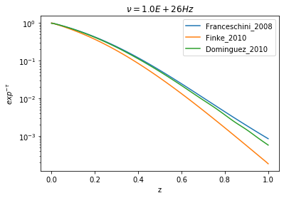

.. _ebl_model:

EBL
===

.. warning::
    This model is still experimental, so any feedback that you can provide is welcome

EBL models are implemented using a 2D interpolation where the x and y axes represent the redshift and the frequency, and the z axes represents the value of :math:`e^{-\tau}`

Included models are 

- Franceschini 2008 :cite:`Franceschini2008`
- Finke 2010 :cite:`Finke2010` 
- Dominguez 2011 :cite:`Dominguez2011`

.. code:: ipython3

    from jetset.template_2Dmodel import EBLAbsorptionTemplate
    ebl_dominguez=EBLAbsorptionTemplate.from_name('Dominguez_2010')
    ebl_finke=EBLAbsorptionTemplate.from_name('Finke_2010')
    ebl_franceschini=EBLAbsorptionTemplate.from_name('Franceschini_2008')

.. code:: ipython3

    z=0.1
    nu=np.logspace(23,30,100)
    ebl_dominguez.parameters.z_cosm.val=z
    ebl_dominguez.eval(nu=nu)
    ebl_finke.parameters.z_cosm.val=z
    ebl_finke.eval(nu=nu)
    ebl_franceschini.parameters.z_cosm.val=z
    ebl_franceschini.eval(nu=nu)
    p=ebl_dominguez.plot_model()
    ebl_finke.plot_model(p)
    ebl_franceschini.plot_model(p)
    p.rescale(y_min=-10,x_max=29)

.. image:: EBL_files/EBL_6_0.png

.. code:: ipython3

    nu=1E26
    z_range=np.linspace(0.001,1,100)
    y_fr = np.zeros(z_range.size)
    y_fi = np.zeros(z_range.size)
    y_do = np.zeros(z_range.size)
    for ID,z in enumerate(z_range):
        ebl_franceschini.parameters.z_cosm.val=z
        ebl_finke.parameters.z_cosm.val=z
        ebl_dominguez.parameters.z_cosm.val=z
        y_fr[ID]=ebl_franceschini.eval(nu=nu,get_model=True)
        y_fi[ID]=ebl_finke.eval(nu=nu,get_model=True)
        y_do[ID]=ebl_dominguez.eval(nu=nu,get_model=True)
    
    
    plt.plot(z_range,y_fr,label='%s'%ebl_franceschini.name)
    plt.plot(z_range,y_fi,label='%s'%ebl_finke.name)
    plt.plot(z_range,y_do,label='%s'%ebl_dominguez.name)
    
    plt.xlabel('z')
    plt.ylabel(r'$exp^{-\tau}$')
    plt.legend()
    plt.semilogy()
    t=plt.title(r'$\nu=%1.1E Hz$'%nu)

.. code:: ipython3

    %matplotlib inline
    z_range=np.linspace(0.001,1,100)
    y_fr = np.zeros(z_range.size)
    y_fi = np.zeros(z_range.size)
    y_do = np.zeros(z_range.size)
    nu=1E27
    for ID,z in enumerate(z_range):
        ebl_franceschini.parameters.z_cosm.val=z
        ebl_finke.parameters.z_cosm.val=z
        ebl_dominguez.parameters.z_cosm.val=z
        y_fr[ID]=ebl_franceschini.eval(nu=nu,get_model=True)
        y_fi[ID]=ebl_finke.eval(nu=nu,get_model=True)
        y_do[ID]=ebl_dominguez.eval(nu=nu,get_model=True)
    
    
    plt.plot(z_range,y_fr,label='%s'%ebl_franceschini.name)
    plt.plot(z_range,y_fi,label='%s'%ebl_finke.name)
    plt.plot(z_range,y_do,label='%s'%ebl_dominguez.name)
    
    plt.xlabel('z')
    plt.ylabel(r'$exp^{-\tau}$')
    plt.legend()
    plt.semilogy()
    t=plt.title(r'$\nu=%1.1E Hz$'%nu)

.. image:: EBL_files/EBL_8_0.png

Combine a Jet model with the EBL model
--------------------------------------

To  apply the EBL model to a Jet model we need to define a composite model, read the section :ref:`composite_models`  for more information regarding the composite models. 

We start by combining a Jet model with the EBL absorption model. Please, keep in mind that the EBL absorption model  is a multiplicative  model, i.e. it has to multiplied and not added to the Jet model. 

As first step, we define our Jet model

.. code:: ipython3

    from jetset.jet_model import Jet
    from jetset.model_manager import FitModel
    
    my_jet=Jet(electron_distribution='lppl',name='jet_leptonic')

As second stop, we define the EBL model, and we use in this case the `Franceschini_2008` model

.. code:: ipython3

    from jetset.template_2Dmodel import EBLAbsorptionTemplate
    ebl_franceschini=EBLAbsorptionTemplate.from_name('Franceschini_2008')

As thierd step, we add the components models to the the :class:`.FitModel` class, using the :class:`.FitModel.add_component()` method 

.. code:: ipython3

    composite_model=FitModel(nu_size=500,name='EBL corrected')
    composite_model.add_component(my_jet)
    composite_model.add_component(ebl_franceschini)

.. parsed-literal::

    /Users/orion/anaconda3/envs/jetset/lib/python3.7/site-packages/jetset-1.1.2-py3.7-macosx-10.9-x86_64.egg/jetset/model_manager.py:160: UserWarning: no cosmology defined, using default FlatLambdaCDM(name="Planck13", H0=67.8 km / (Mpc s), Om0=0.307, Tcmb0=2.725 K, Neff=3.05, m_nu=[0.   0.   0.06] eV, Ob0=0.0483)
      warnings.warn('no cosmology defined, using default %s'%self.cosmo)

.. code:: ipython3

    composite_model.show_pars()

.. parsed-literal::

        model name          name             par type           units          val      phys. bound. min phys. bound. max  log  frozen
    ----------------- ---------------- ------------------- --------------- ------------ ---------------- ---------------- ----- ------
         jet_leptonic             gmin  low-energy-cut-off lorentz-factor* 2.000000e+00     1.000000e+00     1.000000e+09 False  False
         jet_leptonic             gmax high-energy-cut-off lorentz-factor* 1.000000e+06     1.000000e+00     1.000000e+15 False  False
         jet_leptonic                N    emitters_density         1 / cm3 1.000000e+02     0.000000e+00               -- False  False
         jet_leptonic                s   LE_spectral_slope                 2.000000e+00    -1.000000e+01     1.000000e+01 False  False
         jet_leptonic                r  spectral_curvature                 4.000000e-01    -1.500000e+01     1.500000e+01 False  False
         jet_leptonic gamma0_log_parab    turn-over-energy lorentz-factor* 1.000000e+04     1.000000e+00     1.000000e+09 False  False
         jet_leptonic                R         region_size              cm 5.000000e+15     1.000000e+03     1.000000e+30 False  False
         jet_leptonic              R_H     region_position              cm 1.000000e+17     0.000000e+00               -- False   True
         jet_leptonic                B      magnetic_field               G 1.000000e-01     0.000000e+00               -- False  False
         jet_leptonic         beam_obj             beaming Lorentz-factor* 1.000000e+01     1.000000e-04               -- False  False
         jet_leptonic           z_cosm            redshift                 1.000000e-01     0.000000e+00               -- False  False
    Franceschini_2008           z_cosm            redshift                 1.000000e+00     0.000000e+00               -- False   True

Since, both the Jet model the EBL share the same parameter, i.e. the
redshift, we link the two parameters

.. code:: ipython3

    composite_model.link_par(par_name='z_cosm',model_name_list=['jet_leptonic'],root_model_name='Franceschini_2008')

.. code:: ipython3

    composite_model.show_pars()

.. parsed-literal::

        model name                name                  par type           units          val      phys. bound. min phys. bound. max  log  frozen
    ----------------- --------------------------- ------------------- --------------- ------------ ---------------- ---------------- ----- ------
         jet_leptonic                        gmin  low-energy-cut-off lorentz-factor* 2.000000e+00     1.000000e+00     1.000000e+09 False  False
         jet_leptonic                        gmax high-energy-cut-off lorentz-factor* 1.000000e+06     1.000000e+00     1.000000e+15 False  False
         jet_leptonic                           N    emitters_density         1 / cm3 1.000000e+02     0.000000e+00               -- False  False
         jet_leptonic                           s   LE_spectral_slope                 2.000000e+00    -1.000000e+01     1.000000e+01 False  False
         jet_leptonic                           r  spectral_curvature                 4.000000e-01    -1.500000e+01     1.500000e+01 False  False
         jet_leptonic            gamma0_log_parab    turn-over-energy lorentz-factor* 1.000000e+04     1.000000e+00     1.000000e+09 False  False
         jet_leptonic                           R         region_size              cm 5.000000e+15     1.000000e+03     1.000000e+30 False  False
         jet_leptonic                         R_H     region_position              cm 1.000000e+17     0.000000e+00               -- False   True
         jet_leptonic                           B      magnetic_field               G 1.000000e-01     0.000000e+00               -- False  False
         jet_leptonic                    beam_obj             beaming Lorentz-factor* 1.000000e+01     1.000000e-04               -- False  False
         jet_leptonic z_cosm(L,Franceschini_2008)            redshift                           --               --               -- False   True
    Franceschini_2008                   z_cosm(R)            redshift                 1.000000e+00     0.000000e+00               -- False   True

As you can see, now the parameter `z_cosm` in `Franceschini_2008` is the root paramters (flagge by the R in parenthesis), and the one belonging to the `jet_flaring` component is the linked one (flagged by the L in parenthesis).

These methods are alternative ways to set a parameter in a composite
model

.. code:: ipython3

    composite_model.jet_leptonic.parameters.z_cosm.val=0.1
    composite_model.set_par('jet_leptonic','z_cosm',0.1)
    composite_model.set_par(my_jet,'z_cosm',0.1)

Since as default, added components are summed together, so we need to
define the correct multiplicative for for the composite model.

This can be done just by writing the mathematical expression as a
string, using the model names reported in the model description table,
and that’s it!

.. code:: ipython3

    composite_model.show_model_components()

.. parsed-literal::

    
    -------------------------------------------------------------------------------------------------------------------
    Composite model description
    -------------------------------------------------------------------------------------------------------------------
    name: EBL corrected  
    type: composite_model  
    components models:
     -model name: jet_leptonic model type: jet
     -model name: Franceschini_2008 model type: table2D
    
    -------------------------------------------------------------------------------------------------------------------

.. code:: ipython3

    composite_model.composite_expr='jet_leptonic*Franceschini_2008'

.. code:: ipython3

    composite_model.jet_leptonic.IC_nu_size=150
    composite_model.eval()
    p=composite_model.plot_model()
    p.rescale(y_max=-12)

.. image:: EBL_files/EBL_29_0.png

.. bibliography:: references.bib

