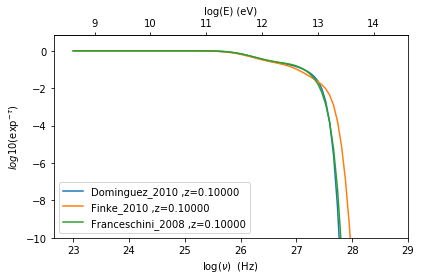
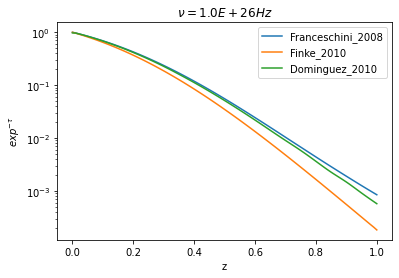
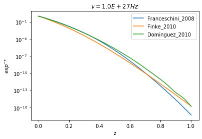
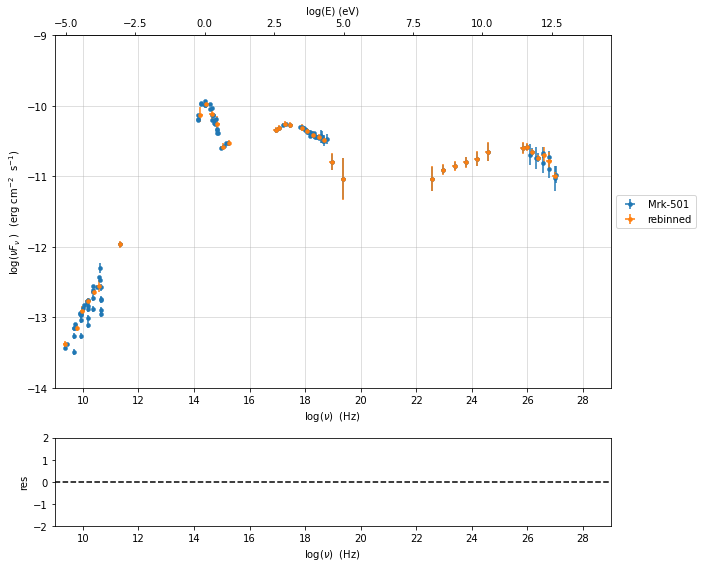
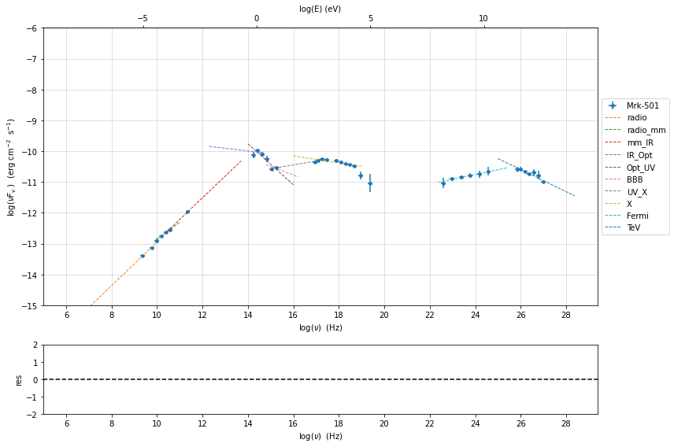
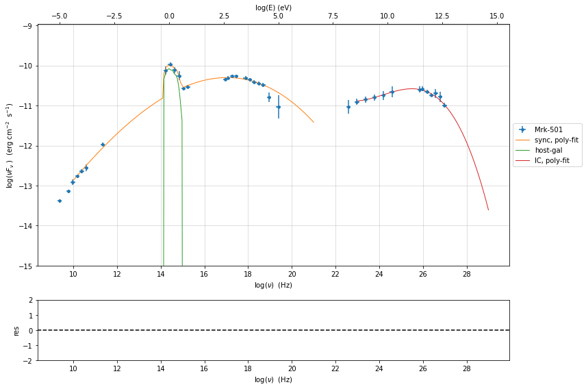
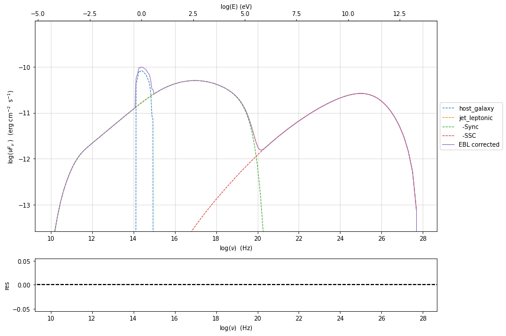
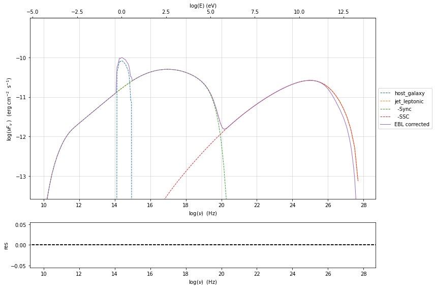
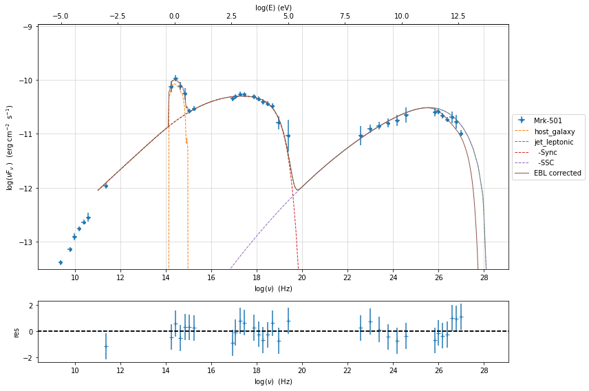

.. _ebl_model:

EBL
===

.. code:: ipython3

    import jetset
    print('tested on jetset',jetset.__version__)

.. parsed-literal::

    tested on jetset 1.2.0

EBL models are implemented using a 2D interpolation where the x and y axes represent the redshift and the frequency, and the z axes represents the value of :math:`e^{-\tau}`

Included models are 

- Franceschini et al. (2008) [Franceschini2008]_
- Finke et al. (2010) [Finke2010]_ 
- Dominguez et al. (2011) [Dominguez2011]_

.. code:: ipython3

    from jetset.template_2Dmodel import EBLAbsorptionTemplate
    ebl_dominguez=EBLAbsorptionTemplate.from_name('Dominguez_2010')
    ebl_finke=EBLAbsorptionTemplate.from_name('Finke_2010')
    ebl_franceschini=EBLAbsorptionTemplate.from_name('Franceschini_2008')

.. code:: ipython3

    z=0.1
    nu=np.logspace(23,30,100)
    ebl_dominguez.parameters.z_cosm.val=z
    ebl_dominguez.eval(nu=nu)
    ebl_finke.parameters.z_cosm.val=z
    ebl_finke.eval(nu=nu)
    ebl_franceschini.parameters.z_cosm.val=z
    ebl_franceschini.eval(nu=nu)
    p=ebl_dominguez.plot_model()
    ebl_finke.plot_model(p)
    ebl_franceschini.plot_model(p)
    p.setlim(y_min=1E-10,x_max=1E29)

.. code:: ipython3

    nu=1E26
    z_range=np.linspace(0.001,1,100)
    y_fr = np.zeros(z_range.size)
    y_fi = np.zeros(z_range.size)
    y_do = np.zeros(z_range.size)
    for ID,z in enumerate(z_range):
        ebl_franceschini.parameters.z_cosm.val=z
        ebl_finke.parameters.z_cosm.val=z
        ebl_dominguez.parameters.z_cosm.val=z
        y_fr[ID]=ebl_franceschini.eval(nu=nu,get_model=True)
        y_fi[ID]=ebl_finke.eval(nu=nu,get_model=True)
        y_do[ID]=ebl_dominguez.eval(nu=nu,get_model=True)
    
    
    plt.plot(z_range,y_fr,label='%s'%ebl_franceschini.name)
    plt.plot(z_range,y_fi,label='%s'%ebl_finke.name)
    plt.plot(z_range,y_do,label='%s'%ebl_dominguez.name)
    
    plt.xlabel('z')
    plt.ylabel(r'$exp^{-\tau}$')
    plt.legend()
    plt.semilogy()
    t=plt.title(r'$\nu=%1.1E Hz$'%nu)

.. code:: ipython3

    %matplotlib inline
    z_range=np.linspace(0.001,1,100)
    y_fr = np.zeros(z_range.size)
    y_fi = np.zeros(z_range.size)
    y_do = np.zeros(z_range.size)
    nu=1E27
    for ID,z in enumerate(z_range):
        ebl_franceschini.parameters.z_cosm.val=z
        ebl_finke.parameters.z_cosm.val=z
        ebl_dominguez.parameters.z_cosm.val=z
        y_fr[ID]=ebl_franceschini.eval(nu=nu,get_model=True)
        y_fi[ID]=ebl_finke.eval(nu=nu,get_model=True)
        y_do[ID]=ebl_dominguez.eval(nu=nu,get_model=True)
    
    
    plt.plot(z_range,y_fr,label='%s'%ebl_franceschini.name)
    plt.plot(z_range,y_fi,label='%s'%ebl_finke.name)
    plt.plot(z_range,y_do,label='%s'%ebl_dominguez.name)
    
    plt.xlabel('z')
    plt.ylabel(r'$exp^{-\tau}$')
    plt.legend()
    plt.semilogy()
    t=plt.title(r'$\nu=%1.1E Hz$'%nu)

Combine a Jet model with the EBL model
--------------------------------------

To  apply the EBL model to a Jet model we need to define a composite model, read the section :ref:`composite_models`  for more information regarding the composite models. 

We start by combining a Jet model with the EBL absorption model. Please, keep in mind that the EBL absorption model  is a multiplicative  model, i.e. it has to multiplied and not added to the Jet model. 

As first step, we define our Jet model

.. code:: ipython3

    from jetset.jet_model import Jet
    from jetset.model_manager import FitModel
    
    my_jet=Jet(electron_distribution='lppl',name='jet_leptonic')

As second step, we define the EBL model, and we use in this case the `Franceschini_2008` model

.. code:: ipython3

    from jetset.template_2Dmodel import EBLAbsorptionTemplate
    ebl_franceschini=EBLAbsorptionTemplate.from_name('Franceschini_2008')

As third step, we add the components models to the the :class:`.FitModel` class, using the :class:`.FitModel.add_component()` method 

.. code:: ipython3

    composite_model=FitModel(nu_size=500,name='EBL corrected')
    composite_model.add_component(my_jet)
    composite_model.add_component(ebl_franceschini)

.. parsed-literal::

    /Users/orion/anaconda3/envs/jetset/lib/python3.8/site-packages/jetset/model_manager.py:147: UserWarning: no cosmology defined, using default FlatLambdaCDM(name="Planck13", H0=67.8 km / (Mpc s), Om0=0.307, Tcmb0=2.725 K, Neff=3.05, m_nu=[0.   0.   0.06] eV, Ob0=0.0483)
      warnings.warn('no cosmology defined, using default %s'%self.cosmo)

.. code:: ipython3

    composite_model.show_pars()

.. raw:: html

    <i>Table length=12</i>
    <table id="table140261291118896-693634" class="table-striped table-bordered table-condensed">
    <thead><tr><th>model name</th><th>name</th><th>par type</th><th>units</th><th>val</th><th>phys. bound. min</th><th>phys. bound. max</th><th>log</th><th>frozen</th></tr></thead>
    <tr><td>jet_leptonic</td><td>R</td><td>region_size</td><td>cm</td><td>5.000000e+15</td><td>1.000000e+03</td><td>1.000000e+30</td><td>False</td><td>False</td></tr>
    <tr><td>jet_leptonic</td><td>R_H</td><td>region_position</td><td>cm</td><td>1.000000e+17</td><td>0.000000e+00</td><td>--</td><td>False</td><td>True</td></tr>
    <tr><td>jet_leptonic</td><td>B</td><td>magnetic_field</td><td>gauss</td><td>1.000000e-01</td><td>0.000000e+00</td><td>--</td><td>False</td><td>False</td></tr>
    <tr><td>jet_leptonic</td><td>beam_obj</td><td>beaming</td><td>lorentz-factor*</td><td>1.000000e+01</td><td>1.000000e-04</td><td>--</td><td>False</td><td>False</td></tr>
    <tr><td>jet_leptonic</td><td>z_cosm</td><td>redshift</td><td></td><td>1.000000e-01</td><td>0.000000e+00</td><td>--</td><td>False</td><td>False</td></tr>
    <tr><td>jet_leptonic</td><td>gmin</td><td>low-energy-cut-off</td><td>lorentz-factor*</td><td>2.000000e+00</td><td>1.000000e+00</td><td>1.000000e+09</td><td>False</td><td>False</td></tr>
    <tr><td>jet_leptonic</td><td>gmax</td><td>high-energy-cut-off</td><td>lorentz-factor*</td><td>1.000000e+06</td><td>1.000000e+00</td><td>1.000000e+15</td><td>False</td><td>False</td></tr>
    <tr><td>jet_leptonic</td><td>N</td><td>emitters_density</td><td>1 / cm3</td><td>1.000000e+02</td><td>0.000000e+00</td><td>--</td><td>False</td><td>False</td></tr>
    <tr><td>jet_leptonic</td><td>gamma0_log_parab</td><td>turn-over-energy</td><td>lorentz-factor*</td><td>1.000000e+04</td><td>1.000000e+00</td><td>1.000000e+09</td><td>False</td><td>False</td></tr>
    <tr><td>jet_leptonic</td><td>s</td><td>LE_spectral_slope</td><td></td><td>2.000000e+00</td><td>-1.000000e+01</td><td>1.000000e+01</td><td>False</td><td>False</td></tr>
    <tr><td>jet_leptonic</td><td>r</td><td>spectral_curvature</td><td></td><td>4.000000e-01</td><td>-1.500000e+01</td><td>1.500000e+01</td><td>False</td><td>False</td></tr>
    <tr><td>Franceschini_2008</td><td>z_cosm</td><td>redshift</td><td></td><td>1.000000e+00</td><td>0.000000e+00</td><td>--</td><td>False</td><td>True</td></tr>
    </table>
    

.. important::
    Starting from version 1.2.0 we have changed the syntax of ``link_par``, please update your scripts

Since, both the Jet model the EBL share the same parameter, i.e. the
redshift, we link the two parameters

.. code:: ipython3

    composite_model.link_par(par_name='z_cosm', from_model='Franceschini_2008', to_model='jet_leptonic')

.. parsed-literal::

    ==> par: z_cosm from model: Franceschini_2008 linked to same parameter in model jet_leptonic

.. code:: ipython3

    composite_model.show_pars()

.. raw:: html

    <i>Table length=12</i>
    <table id="table140261303401344-911815" class="table-striped table-bordered table-condensed">
    <thead><tr><th>model name</th><th>name</th><th>par type</th><th>units</th><th>val</th><th>phys. bound. min</th><th>phys. bound. max</th><th>log</th><th>frozen</th></tr></thead>
    <tr><td>jet_leptonic</td><td>R</td><td>region_size</td><td>cm</td><td>5.000000e+15</td><td>1.000000e+03</td><td>1.000000e+30</td><td>False</td><td>False</td></tr>
    <tr><td>jet_leptonic</td><td>R_H</td><td>region_position</td><td>cm</td><td>1.000000e+17</td><td>0.000000e+00</td><td>--</td><td>False</td><td>True</td></tr>
    <tr><td>jet_leptonic</td><td>B</td><td>magnetic_field</td><td>gauss</td><td>1.000000e-01</td><td>0.000000e+00</td><td>--</td><td>False</td><td>False</td></tr>
    <tr><td>jet_leptonic</td><td>beam_obj</td><td>beaming</td><td>lorentz-factor*</td><td>1.000000e+01</td><td>1.000000e-04</td><td>--</td><td>False</td><td>False</td></tr>
    <tr><td>jet_leptonic</td><td>z_cosm(M)</td><td>redshift</td><td></td><td>1.000000e-01</td><td>0.000000e+00</td><td>--</td><td>False</td><td>False</td></tr>
    <tr><td>jet_leptonic</td><td>gmin</td><td>low-energy-cut-off</td><td>lorentz-factor*</td><td>2.000000e+00</td><td>1.000000e+00</td><td>1.000000e+09</td><td>False</td><td>False</td></tr>
    <tr><td>jet_leptonic</td><td>gmax</td><td>high-energy-cut-off</td><td>lorentz-factor*</td><td>1.000000e+06</td><td>1.000000e+00</td><td>1.000000e+15</td><td>False</td><td>False</td></tr>
    <tr><td>jet_leptonic</td><td>N</td><td>emitters_density</td><td>1 / cm3</td><td>1.000000e+02</td><td>0.000000e+00</td><td>--</td><td>False</td><td>False</td></tr>
    <tr><td>jet_leptonic</td><td>gamma0_log_parab</td><td>turn-over-energy</td><td>lorentz-factor*</td><td>1.000000e+04</td><td>1.000000e+00</td><td>1.000000e+09</td><td>False</td><td>False</td></tr>
    <tr><td>jet_leptonic</td><td>s</td><td>LE_spectral_slope</td><td></td><td>2.000000e+00</td><td>-1.000000e+01</td><td>1.000000e+01</td><td>False</td><td>False</td></tr>
    <tr><td>jet_leptonic</td><td>r</td><td>spectral_curvature</td><td></td><td>4.000000e-01</td><td>-1.500000e+01</td><td>1.500000e+01</td><td>False</td><td>False</td></tr>
    <tr><td>Franceschini_2008</td><td>z_cosm(L,jet_leptonic)</td><td>redshift</td><td></td><td>--</td><td>--</td><td>--</td><td>False</td><td>True</td></tr>
    </table>
    

As you can see, now the parameter `z_cosm` in `Franceschini_2008` is the `linked` paramter (flagge by the L in parenthesis), and the one belonging to the `jet_flaring` component is the `master`  one (flagged by the M in parenthesis).

These methods are alternative ways to set a parameter in a composite
model

.. code:: ipython3

    composite_model.jet_leptonic.parameters.z_cosm.val=0.1
    composite_model.set_par('jet_leptonic','z_cosm',0.1)
    composite_model.set_par(my_jet,'z_cosm',0.1)

Since as default, added components are summed together, so we need to
define the correct multiplicative for for the composite model.

.. code:: ipython3

    composite_model.show_model_components()

.. parsed-literal::

    
    --------------------------------------------------------------------------------
    Composite model description
    --------------------------------------------------------------------------------
    name: EBL corrected  
    type: composite_model  
    components models:
     -model name: jet_leptonic model type: jet
     -model name: Franceschini_2008 model type: table2D
    
    --------------------------------------------------------------------------------

This can be done just by writing the mathematical expression as a
string, using the model names reported in the model description table,
and that’s it!

.. code:: ipython3

    composite_model.composite_expr='jet_leptonic*Franceschini_2008'

.. code:: ipython3

    composite_model.jet_leptonic.IC_nu_size=150
    composite_model.eval()
    p=composite_model.plot_model()
    p.setlim(y_max=1E-12)

.. image:: EBL_files/EBL_31_0.png

if you want to remove the link from the parameter

.. code:: ipython3

    composite_model.parameters.reset_dependencies()

.. code:: ipython3

    composite_model.parameters

.. raw:: html

    <i>Table length=12</i>
    <table id="table140261273650224-723655" class="table-striped table-bordered table-condensed">
    <thead><tr><th>model name</th><th>name</th><th>par type</th><th>units</th><th>val</th><th>phys. bound. min</th><th>phys. bound. max</th><th>log</th><th>frozen</th></tr></thead>
    <tr><td>jet_leptonic</td><td>R</td><td>region_size</td><td>cm</td><td>5.000000e+15</td><td>1.000000e+03</td><td>1.000000e+30</td><td>False</td><td>False</td></tr>
    <tr><td>jet_leptonic</td><td>R_H</td><td>region_position</td><td>cm</td><td>1.000000e+17</td><td>0.000000e+00</td><td>--</td><td>False</td><td>True</td></tr>
    <tr><td>jet_leptonic</td><td>B</td><td>magnetic_field</td><td>gauss</td><td>1.000000e-01</td><td>0.000000e+00</td><td>--</td><td>False</td><td>False</td></tr>
    <tr><td>jet_leptonic</td><td>beam_obj</td><td>beaming</td><td>lorentz-factor*</td><td>1.000000e+01</td><td>1.000000e-04</td><td>--</td><td>False</td><td>False</td></tr>
    <tr><td>jet_leptonic</td><td>z_cosm</td><td>redshift</td><td></td><td>1.000000e-01</td><td>0.000000e+00</td><td>--</td><td>False</td><td>False</td></tr>
    <tr><td>jet_leptonic</td><td>gmin</td><td>low-energy-cut-off</td><td>lorentz-factor*</td><td>2.000000e+00</td><td>1.000000e+00</td><td>1.000000e+09</td><td>False</td><td>False</td></tr>
    <tr><td>jet_leptonic</td><td>gmax</td><td>high-energy-cut-off</td><td>lorentz-factor*</td><td>1.000000e+06</td><td>1.000000e+00</td><td>1.000000e+15</td><td>False</td><td>False</td></tr>
    <tr><td>jet_leptonic</td><td>N</td><td>emitters_density</td><td>1 / cm3</td><td>1.000000e+02</td><td>0.000000e+00</td><td>--</td><td>False</td><td>False</td></tr>
    <tr><td>jet_leptonic</td><td>gamma0_log_parab</td><td>turn-over-energy</td><td>lorentz-factor*</td><td>1.000000e+04</td><td>1.000000e+00</td><td>1.000000e+09</td><td>False</td><td>False</td></tr>
    <tr><td>jet_leptonic</td><td>s</td><td>LE_spectral_slope</td><td></td><td>2.000000e+00</td><td>-1.000000e+01</td><td>1.000000e+01</td><td>False</td><td>False</td></tr>
    <tr><td>jet_leptonic</td><td>r</td><td>spectral_curvature</td><td></td><td>4.000000e-01</td><td>-1.500000e+01</td><td>1.500000e+01</td><td>False</td><td>False</td></tr>
    <tr><td>Franceschini_2008</td><td>z_cosm</td><td>redshift</td><td></td><td>1.000000e-01</td><td>0.000000e+00</td><td>--</td><td>False</td><td>True</td></tr>
    </table>
    

.. parsed-literal::

    None

now the two ``z_cosm`` parameters are not linkend anymore

.. bibliography:: references.bib

Example of model fitting with EBL
---------------------------------

.. code:: ipython3

    from jetset.test_data_helper import  test_SEDs
    from jetset.data_loader import ObsData,Data

.. code:: ipython3

    test_SEDs

.. parsed-literal::

    ['/Users/orion/anaconda3/envs/jetset/lib/python3.8/site-packages/jetset/test_data/SEDs_data/SED_3C345.ecsv',
     '/Users/orion/anaconda3/envs/jetset/lib/python3.8/site-packages/jetset/test_data/SEDs_data/SED_MW_Mrk421_EBL_DEABS.ecsv',
     '/Users/orion/anaconda3/envs/jetset/lib/python3.8/site-packages/jetset/test_data/SEDs_data/SED_MW_Mrk501_EBL_ABS.ecsv',
     '/Users/orion/anaconda3/envs/jetset/lib/python3.8/site-packages/jetset/test_data/SEDs_data/SED_MW_Mrk501_EBL_DEABS.ecsv']

.. code:: ipython3

    %matplotlib inline
    data=Data.from_file(test_SEDs[2])
    sed_data=ObsData(data_table=data)
    myPlot=sed_data.plot_sed()
    
    sed_data.group_data(bin_width=0.2)
    sed_data.add_systematics(0.1,[10.**6,10.**29])
    myPlot.add_data_plot(sed_data,label='rebinned')
    myPlot.setlim(y_min=1E-14,y_max=1E-9,x_min=1E9,x_max=1E29)

.. parsed-literal::

    ================================================================================
    
    ***  binning data  ***
    ---> N bins= 90
    ---> bin_widht= 0.2
    ================================================================================
    

.. parsed-literal::

    /Users/orion/anaconda3/envs/jetset/lib/python3.8/site-packages/astropy/table/table.py:1187: FutureWarning: Using a non-tuple sequence for multidimensional indexing is deprecated; use `arr[tuple(seq)]` instead of `arr[seq]`. In the future this will be interpreted as an array index, `arr[np.array(seq)]`, which will result either in an error or a different result.
      newcol = col[slice_]

.. code:: ipython3

    from jetset.sed_shaper import  SEDShape
    my_shape=SEDShape(sed_data)
    my_shape.eval_indices(silent=True)
    p=my_shape.plot_indices()
    p.setlim(y_min=1E-15,y_max=1E-6)

.. parsed-literal::

    ================================================================================
    
    *** evaluating spectral indices for data ***
    ================================================================================
    

.. code:: ipython3

    mm,best_fit=my_shape.sync_fit(check_host_gal_template=True,
                      Ep_start=None,
                      minimizer='lsb',
                      silent=True,
                      fit_range=[10,21])

.. parsed-literal::

    ================================================================================
    
    *** Log-Polynomial fitting of the synchrotron component ***
    ---> first blind fit run,  fit range: [10, 21]
    ---> class:  HSP
    
    ---> class:  HSP
    
    

.. raw:: html

    <i>Table length=6</i>
    <table id="table140261273650848-719717" class="table-striped table-bordered table-condensed">
    <thead><tr><th>model name</th><th>name</th><th>val</th><th>bestfit val</th><th>err +</th><th>err -</th><th>start val</th><th>fit range min</th><th>fit range max</th><th>frozen</th></tr></thead>
    <tr><td>LogCubic</td><td>b</td><td>-6.411143e-02</td><td>-6.411143e-02</td><td>7.838958e-03</td><td>--</td><td>-4.778764e-02</td><td>-1.000000e+01</td><td>0.000000e+00</td><td>False</td></tr>
    <tr><td>LogCubic</td><td>c</td><td>-1.751705e-03</td><td>-1.751705e-03</td><td>1.127020e-03</td><td>--</td><td>3.576201e-03</td><td>-1.000000e+01</td><td>1.000000e+01</td><td>False</td></tr>
    <tr><td>LogCubic</td><td>Ep</td><td>1.703747e+01</td><td>1.703747e+01</td><td>9.437333e-02</td><td>--</td><td>1.626870e+01</td><td>0.000000e+00</td><td>3.000000e+01</td><td>False</td></tr>
    <tr><td>LogCubic</td><td>Sp</td><td>-1.030068e+01</td><td>-1.030068e+01</td><td>1.884116e-02</td><td>--</td><td>-1.025412e+01</td><td>-3.000000e+01</td><td>0.000000e+00</td><td>False</td></tr>
    <tr><td>host_galaxy</td><td>nuFnu_p_host</td><td>-1.006556e+01</td><td>-1.006556e+01</td><td>5.462500e-02</td><td>--</td><td>-1.025412e+01</td><td>-1.225412e+01</td><td>-8.254123e+00</td><td>False</td></tr>
    <tr><td>host_galaxy</td><td>nu_scale</td><td>1.730750e-02</td><td>1.730750e-02</td><td>3.694838e-03</td><td>--</td><td>0.000000e+00</td><td>-5.000000e-01</td><td>5.000000e-01</td><td>False</td></tr>
    </table>
    

.. parsed-literal::

    ---> sync       nu_p=+1.703747e+01 (err=+9.437333e-02)  nuFnu_p=-1.030068e+01 (err=+1.884116e-02) curv.=-6.411143e-02 (err=+7.838958e-03)
    ================================================================================
    

.. code:: ipython3

    my_shape.IC_fit(fit_range=[23,29],minimizer='minuit')
    p=my_shape.plot_shape_fit()
    p.setlim(y_min=1E-15)

.. parsed-literal::

    ================================================================================
    
    *** Log-Polynomial fitting of the IC component ***
    ---> fit range: [23, 29]
    ---> LogCubic fit
    -------------------------------------------------------------------------
    Fit report
    
    Model: IC-shape-fit

.. raw:: html

    <i>Table length=4</i>
    <table id="table140260791450832-282369" class="table-striped table-bordered table-condensed">
    <thead><tr><th>model name</th><th>name</th><th>par type</th><th>units</th><th>val</th><th>phys. bound. min</th><th>phys. bound. max</th><th>log</th><th>frozen</th></tr></thead>
    <tr><td>LogCubic</td><td>b</td><td>curvature</td><td></td><td>-1.565399e-01</td><td>-1.000000e+01</td><td>0.000000e+00</td><td>False</td><td>False</td></tr>
    <tr><td>LogCubic</td><td>c</td><td>third-degree</td><td></td><td>-4.351917e-02</td><td>-1.000000e+01</td><td>1.000000e+01</td><td>False</td><td>False</td></tr>
    <tr><td>LogCubic</td><td>Ep</td><td>peak freq</td><td>Hz</td><td>2.529709e+01</td><td>0.000000e+00</td><td>3.000000e+01</td><td>True</td><td>False</td></tr>
    <tr><td>LogCubic</td><td>Sp</td><td>peak flux</td><td>erg / (cm2 s)</td><td>-1.058825e+01</td><td>-3.000000e+01</td><td>0.000000e+00</td><td>True</td><td>False</td></tr>
    </table>
    

.. parsed-literal::

    
    converged=True
    calls=50
    mesg=

.. raw:: html

    <table>
        <tr>
            <td colspan="2" style="text-align:left" title="Minimum value of function"> FCN = 2.632 </td>
            <td colspan="3" style="text-align:center" title="No. of function evaluations in last call and total number"> Nfcn = 50 </td>
        </tr>
        <tr>
            <td colspan="2" style="text-align:left" title="Estimated distance to minimum and goal"> EDM = 1.7e-06 (Goal: 0.0002) </td>
            <td colspan="3" style="text-align:center" title="No. of gradient evaluations in last call and total number">  </td>
        </tr>
        <tr>
            <td style="text-align:center;background-color:#92CCA6;color:black"> Valid Minimum </td>
            <td style="text-align:center;background-color:#92CCA6;color:black"> Valid Parameters </td>
            <td colspan="3" style="text-align:center;background-color:#92CCA6;color:black"> No Parameters at limit </td>
        </tr>
        <tr>
            <td colspan="2" style="text-align:center;background-color:#92CCA6;color:black"> Below EDM threshold (goal x 10) </td>
            <td colspan="3" style="text-align:center;background-color:#92CCA6;color:black"> Below call limit </td>
        </tr>
        <tr>
            <td style="text-align:center;background-color:#92CCA6;color:black"> Covariance </td>
            <td style="text-align:center;background-color:#92CCA6;color:black"> Hesse ok </td>
            <td style="text-align:center;background-color:#92CCA6;color:black" title="Is covariance matrix accurate?"> Accurate </td>
            <td style="text-align:center;background-color:#92CCA6;color:black" title="Is covariance matrix positive definite?"> Pos. def. </td>
            <td style="text-align:center;background-color:#92CCA6;color:black" title="Was positive definiteness enforced by Minuit?"> Not forced </td>
        </tr>
    </table><table>
        <tr>
            <td></td>
            <th title="Variable name"> Name </th>
            <th title="Value of parameter"> Value </th>
            <th title="Hesse error"> Hesse Error </th>
            <th title="Minos lower error"> Minos Error- </th>
            <th title="Minos upper error"> Minos Error+ </th>
            <th title="Lower limit of the parameter"> Limit- </th>
            <th title="Upper limit of the parameter"> Limit+ </th>
            <th title="Is the parameter fixed in the fit"> Fixed </th>
        </tr>
        <tr>
            <th> 0 </th>
            <td> par_0 </td>
            <td> -0.157 </td>
            <td> 0.026 </td>
            <td>  </td>
            <td>  </td>
            <td> -10 </td>
            <td> 0 </td>
            <td>  </td>
        </tr>
        <tr>
            <th> 1 </th>
            <td> par_1 </td>
            <td> -0.044 </td>
            <td> 0.020 </td>
            <td>  </td>
            <td>  </td>
            <td> -10 </td>
            <td> 10 </td>
            <td>  </td>
        </tr>
        <tr>
            <th> 2 </th>
            <td> par_2 </td>
            <td> 25.30 </td>
            <td> 0.18 </td>
            <td>  </td>
            <td>  </td>
            <td> 0 </td>
            <td> 30 </td>
            <td>  </td>
        </tr>
        <tr>
            <th> 3 </th>
            <td> par_3 </td>
            <td> -10.59 </td>
            <td> 0.05 </td>
            <td>  </td>
            <td>  </td>
            <td> -30 </td>
            <td> 0 </td>
            <td>  </td>
        </tr>
    </table><table>
        <tr>
            <td></td>
            <th> par_0 </th>
            <th> par_1 </th>
            <th> par_2 </th>
            <th> par_3 </th>
        </tr>
        <tr>
            <th> par_0 </th>
            <td> 0.000651 </td>
            <td style="background-color:rgb(250,155,155);color:black"> 0.00033 <strong>(0.636)</strong> </td>
            <td style="background-color:rgb(169,169,250);color:black"> -0.00289 <strong>(-0.622)</strong> </td>
            <td style="background-color:rgb(240,240,250);color:black"> -9.45e-05 <strong>(-0.073)</strong> </td>
        </tr>
        <tr>
            <th> par_1 </th>
            <td style="background-color:rgb(250,155,155);color:black"> 0.00033 <strong>(0.636)</strong> </td>
            <td> 0.000413 </td>
            <td style="background-color:rgb(128,128,250);color:black"> -0.00348 <strong>(-0.942)</strong> </td>
            <td style="background-color:rgb(250,165,165);color:black"> 0.000582 <strong>(0.567)</strong> </td>
        </tr>
        <tr>
            <th> par_2 </th>
            <td style="background-color:rgb(169,169,250);color:black"> -0.00289 <strong>(-0.622)</strong> </td>
            <td style="background-color:rgb(128,128,250);color:black"> -0.00348 <strong>(-0.942)</strong> </td>
            <td> 0.033 </td>
            <td style="background-color:rgb(163,163,250);color:black"> -0.00612 <strong>(-0.667)</strong> </td>
        </tr>
        <tr>
            <th> par_3 </th>
            <td style="background-color:rgb(240,240,250);color:black"> -9.45e-05 <strong>(-0.073)</strong> </td>
            <td style="background-color:rgb(250,165,165);color:black"> 0.000582 <strong>(0.567)</strong> </td>
            <td style="background-color:rgb(163,163,250);color:black"> -0.00612 <strong>(-0.667)</strong> </td>
            <td> 0.00255 </td>
        </tr>
    </table>

.. parsed-literal::

    dof=7
    chisq=2.631978, chisq/red=0.375997 null hypothesis sig=0.916836
    
    stats without the UL
    dof  UL=7
    chisq=2.631978, chisq/red=0.375997 null hypothesis sig=0.916836
    
    
    best fit pars

.. raw:: html

    <i>Table length=4</i>
    <table id="table140260802710544-597042" class="table-striped table-bordered table-condensed">
    <thead><tr><th>model name</th><th>name</th><th>val</th><th>bestfit val</th><th>err +</th><th>err -</th><th>start val</th><th>fit range min</th><th>fit range max</th><th>frozen</th></tr></thead>
    <tr><td>LogCubic</td><td>b</td><td>-1.565399e-01</td><td>-1.565399e-01</td><td>2.551779e-02</td><td>--</td><td>-1.000000e+00</td><td>-1.000000e+01</td><td>0.000000e+00</td><td>False</td></tr>
    <tr><td>LogCubic</td><td>c</td><td>-4.351917e-02</td><td>-4.351917e-02</td><td>2.032066e-02</td><td>--</td><td>-1.000000e+00</td><td>-1.000000e+01</td><td>1.000000e+01</td><td>False</td></tr>
    <tr><td>LogCubic</td><td>Ep</td><td>2.529709e+01</td><td>2.529709e+01</td><td>1.817241e-01</td><td>--</td><td>2.536916e+01</td><td>0.000000e+00</td><td>3.000000e+01</td><td>False</td></tr>
    <tr><td>LogCubic</td><td>Sp</td><td>-1.058825e+01</td><td>-1.058825e+01</td><td>5.046950e-02</td><td>--</td><td>-1.000000e+01</td><td>-3.000000e+01</td><td>0.000000e+00</td><td>False</td></tr>
    </table>
    

.. parsed-literal::

    -------------------------------------------------------------------------
    
    
    

.. raw:: html

    <i>Table length=4</i>
    <table id="table140260803196000-597766" class="table-striped table-bordered table-condensed">
    <thead><tr><th>model name</th><th>name</th><th>val</th><th>bestfit val</th><th>err +</th><th>err -</th><th>start val</th><th>fit range min</th><th>fit range max</th><th>frozen</th></tr></thead>
    <tr><td>LogCubic</td><td>b</td><td>-1.565399e-01</td><td>-1.565399e-01</td><td>2.551779e-02</td><td>--</td><td>-1.000000e+00</td><td>-1.000000e+01</td><td>0.000000e+00</td><td>False</td></tr>
    <tr><td>LogCubic</td><td>c</td><td>-4.351917e-02</td><td>-4.351917e-02</td><td>2.032066e-02</td><td>--</td><td>-1.000000e+00</td><td>-1.000000e+01</td><td>1.000000e+01</td><td>False</td></tr>
    <tr><td>LogCubic</td><td>Ep</td><td>2.529709e+01</td><td>2.529709e+01</td><td>1.817241e-01</td><td>--</td><td>2.536916e+01</td><td>0.000000e+00</td><td>3.000000e+01</td><td>False</td></tr>
    <tr><td>LogCubic</td><td>Sp</td><td>-1.058825e+01</td><td>-1.058825e+01</td><td>5.046950e-02</td><td>--</td><td>-1.000000e+01</td><td>-3.000000e+01</td><td>0.000000e+00</td><td>False</td></tr>
    </table>
    

.. parsed-literal::

    ---> IC         nu_p=+2.529709e+01 (err=+1.817241e-01)  nuFnu_p=-1.058825e+01 (err=+5.046950e-02) curv.=-1.565399e-01 (err=+2.551779e-02)
    ================================================================================
    

.. code:: ipython3

    from jetset.obs_constrain import ObsConstrain
    from jetset.model_manager import  FitModel
    sed_obspar=ObsConstrain(beaming=25,
                            B_range=[0.001,0.1],
                            distr_e='lppl',
                            t_var_sec=3*86400,
                            nu_cut_IR=1E11,
                            SEDShape=my_shape)
    
    
    prefit_jet=sed_obspar.constrain_SSC_model(electron_distribution_log_values=False, silent=True)
    prefit_jet.save_model('prefit_jet_gal_templ.pkl')

.. parsed-literal::

    ================================================================================
    
    ***  constrains parameters from observable ***
    

.. parsed-literal::

    /Users/orion/anaconda3/envs/jetset/lib/python3.8/site-packages/jetset/obs_constrain.py:650: RankWarning: Polyfit may be poorly conditioned
      return func(*args, **kwargs),completed

.. raw:: html

    <i>Table length=11</i>
    <table id="table140261304170768-847391" class="table-striped table-bordered table-condensed">
    <thead><tr><th>model name</th><th>name</th><th>par type</th><th>units</th><th>val</th><th>phys. bound. min</th><th>phys. bound. max</th><th>log</th><th>frozen</th></tr></thead>
    <tr><td>jet_leptonic</td><td>R</td><td>region_size</td><td>cm</td><td>1.057086e+16</td><td>1.000000e+03</td><td>1.000000e+30</td><td>False</td><td>False</td></tr>
    <tr><td>jet_leptonic</td><td>R_H</td><td>region_position</td><td>cm</td><td>1.000000e+17</td><td>0.000000e+00</td><td>--</td><td>False</td><td>True</td></tr>
    <tr><td>jet_leptonic</td><td>B</td><td>magnetic_field</td><td>gauss</td><td>5.050000e-02</td><td>0.000000e+00</td><td>--</td><td>False</td><td>False</td></tr>
    <tr><td>jet_leptonic</td><td>beam_obj</td><td>beaming</td><td>lorentz-factor*</td><td>2.500000e+01</td><td>1.000000e-04</td><td>--</td><td>False</td><td>False</td></tr>
    <tr><td>jet_leptonic</td><td>z_cosm</td><td>redshift</td><td></td><td>3.360000e-02</td><td>0.000000e+00</td><td>--</td><td>False</td><td>False</td></tr>
    <tr><td>jet_leptonic</td><td>gmin</td><td>low-energy-cut-off</td><td>lorentz-factor*</td><td>1.487509e+02</td><td>1.000000e+00</td><td>1.000000e+09</td><td>False</td><td>False</td></tr>
    <tr><td>jet_leptonic</td><td>gmax</td><td>high-energy-cut-off</td><td>lorentz-factor*</td><td>2.310708e+06</td><td>1.000000e+00</td><td>1.000000e+15</td><td>False</td><td>False</td></tr>
    <tr><td>jet_leptonic</td><td>N</td><td>emitters_density</td><td>1 / cm3</td><td>2.989977e+01</td><td>0.000000e+00</td><td>--</td><td>False</td><td>False</td></tr>
    <tr><td>jet_leptonic</td><td>gamma0_log_parab</td><td>turn-over-energy</td><td>lorentz-factor*</td><td>1.045836e+04</td><td>1.000000e+00</td><td>1.000000e+09</td><td>False</td><td>False</td></tr>
    <tr><td>jet_leptonic</td><td>s</td><td>LE_spectral_slope</td><td></td><td>2.248787e+00</td><td>-1.000000e+01</td><td>1.000000e+01</td><td>False</td><td>False</td></tr>
    <tr><td>jet_leptonic</td><td>r</td><td>spectral_curvature</td><td></td><td>3.205571e-01</td><td>-1.500000e+01</td><td>1.500000e+01</td><td>False</td><td>False</td></tr>
    </table>
    

.. parsed-literal::

    
    ================================================================================
    

.. code:: ipython3

    composite_model=FitModel(nu_size=500,name='EBL corrected',template=my_shape.host_gal)
    composite_model.add_component(prefit_jet)
    composite_model.eval()
    composite_model.plot_model()

.. parsed-literal::

    /Users/orion/anaconda3/envs/jetset/lib/python3.8/site-packages/jetset/model_manager.py:147: UserWarning: no cosmology defined, using default FlatLambdaCDM(name="Planck13", H0=67.8 km / (Mpc s), Om0=0.307, Tcmb0=2.725 K, Neff=3.05, m_nu=[0.   0.   0.06] eV, Ob0=0.0483)
      warnings.warn('no cosmology defined, using default %s'%self.cosmo)

.. parsed-literal::

    <jetset.plot_sedfit.PlotSED at 0x7f912144a850>

.. code:: ipython3

    from jetset.template_2Dmodel import EBLAbsorptionTemplate
    ebl_franceschini=EBLAbsorptionTemplate.from_name('Franceschini_2008')
    composite_model.add_component(ebl_franceschini)

.. code:: ipython3

    composite_model.link_par(par_name='z_cosm', from_model='Franceschini_2008', to_model='jet_leptonic')
    composite_model.composite_expr='(jet_leptonic+host_galaxy)*Franceschini_2008'

.. parsed-literal::

    ==> par: z_cosm from model: Franceschini_2008 linked to same parameter in model jet_leptonic

.. code:: ipython3

    composite_model.show_model()

.. parsed-literal::

    
    --------------------------------------------------------------------------------
    Composite model description
    --------------------------------------------------------------------------------
    name: EBL corrected  
    type: composite_model  
    components models:
     -model name: host_galaxy model type: template
     -model name: jet_leptonic model type: jet
     -model name: Franceschini_2008 model type: table2D
    
    --------------------------------------------------------------------------------
    individual component description
    
    --------------------------------------------------------------------------------
    model description
    --------------------------------------------------------------------------------
    name: host_galaxy  
    type: template  
    
    --------------------------------------------------------------------------------

.. raw:: html

    <i>Table length=2</i>
    <table id="table140260803219952-623621" class="table-striped table-bordered table-condensed">
    <thead><tr><th>model name</th><th>name</th><th>par type</th><th>units</th><th>val</th><th>phys. bound. min</th><th>phys. bound. max</th><th>log</th><th>frozen</th></tr></thead>
    <tr><td>host_galaxy</td><td>nuFnu_p_host</td><td>nuFnu-scale</td><td>erg / (cm2 s)</td><td>-1.006556e+01</td><td>-2.000000e+01</td><td>2.000000e+01</td><td>False</td><td>False</td></tr>
    <tr><td>host_galaxy</td><td>nu_scale</td><td>nu-scale</td><td>Hz</td><td>1.730750e-02</td><td>-2.000000e+00</td><td>2.000000e+00</td><td>False</td><td>False</td></tr>
    </table>
    

.. parsed-literal::

    --------------------------------------------------------------------------------
    
    --------------------------------------------------------------------------------
    jet model description
    --------------------------------------------------------------------------------
    name: jet_leptonic  
    
    electrons distribution:
     type: lppl  
     gamma energy grid size:  201
     gmin grid : 1.487509e+02
     gmax grid : 2.310708e+06
     normalization  True
     log-values  False
    
    radiative fields:
     seed photons grid size:  100
     IC emission grid size:  100
     source emissivity lower bound :  1.000000e-120
     spectral components:
       name:Sum, state: on
       name:Sync, state: self-abs
       name:SSC, state: on
    external fields transformation method: blob
    
    SED info:
     nu grid size jetkernel: 1000
     nu size: 500
     nu mix (Hz): 1.000000e+06
     nu max (Hz): 1.000000e+30
    
    flux plot lower bound   :  1.000000e-30
    
    --------------------------------------------------------------------------------

.. raw:: html

    <i>Table length=11</i>
    <table id="table140261296887072-29179" class="table-striped table-bordered table-condensed">
    <thead><tr><th>model name</th><th>name</th><th>par type</th><th>units</th><th>val</th><th>phys. bound. min</th><th>phys. bound. max</th><th>log</th><th>frozen</th></tr></thead>
    <tr><td>jet_leptonic</td><td>R</td><td>region_size</td><td>cm</td><td>1.057086e+16</td><td>1.000000e+03</td><td>1.000000e+30</td><td>False</td><td>False</td></tr>
    <tr><td>jet_leptonic</td><td>R_H</td><td>region_position</td><td>cm</td><td>1.000000e+17</td><td>0.000000e+00</td><td>--</td><td>False</td><td>True</td></tr>
    <tr><td>jet_leptonic</td><td>B</td><td>magnetic_field</td><td>gauss</td><td>5.050000e-02</td><td>0.000000e+00</td><td>--</td><td>False</td><td>False</td></tr>
    <tr><td>jet_leptonic</td><td>beam_obj</td><td>beaming</td><td>lorentz-factor*</td><td>2.500000e+01</td><td>1.000000e-04</td><td>--</td><td>False</td><td>False</td></tr>
    <tr><td>jet_leptonic</td><td>z_cosm(M)</td><td>redshift</td><td></td><td>3.360000e-02</td><td>0.000000e+00</td><td>--</td><td>False</td><td>False</td></tr>
    <tr><td>jet_leptonic</td><td>gmin</td><td>low-energy-cut-off</td><td>lorentz-factor*</td><td>1.487509e+02</td><td>1.000000e+00</td><td>1.000000e+09</td><td>False</td><td>False</td></tr>
    <tr><td>jet_leptonic</td><td>gmax</td><td>high-energy-cut-off</td><td>lorentz-factor*</td><td>2.310708e+06</td><td>1.000000e+00</td><td>1.000000e+15</td><td>False</td><td>False</td></tr>
    <tr><td>jet_leptonic</td><td>N</td><td>emitters_density</td><td>1 / cm3</td><td>2.989977e+01</td><td>0.000000e+00</td><td>--</td><td>False</td><td>False</td></tr>
    <tr><td>jet_leptonic</td><td>gamma0_log_parab</td><td>turn-over-energy</td><td>lorentz-factor*</td><td>1.045836e+04</td><td>1.000000e+00</td><td>1.000000e+09</td><td>False</td><td>False</td></tr>
    <tr><td>jet_leptonic</td><td>s</td><td>LE_spectral_slope</td><td></td><td>2.248787e+00</td><td>-1.000000e+01</td><td>1.000000e+01</td><td>False</td><td>False</td></tr>
    <tr><td>jet_leptonic</td><td>r</td><td>spectral_curvature</td><td></td><td>3.205571e-01</td><td>-1.500000e+01</td><td>1.500000e+01</td><td>False</td><td>False</td></tr>
    </table>
    

.. parsed-literal::

    --------------------------------------------------------------------------------
    
    --------------------------------------------------------------------------------
    model description
    --------------------------------------------------------------------------------
    name: Franceschini_2008  
    type: table2D  
    
    --------------------------------------------------------------------------------

.. raw:: html

    <i>Table length=1</i>
    <table id="table140261299981040-249599" class="table-striped table-bordered table-condensed">
    <thead><tr><th>model name</th><th>name</th><th>par type</th><th>units</th><th>val</th><th>phys. bound. min</th><th>phys. bound. max</th><th>log</th><th>frozen</th></tr></thead>
    <tr><td>Franceschini_2008</td><td>z_cosm(L,jet_leptonic)</td><td>redshift</td><td></td><td>--</td><td>--</td><td>--</td><td>False</td><td>True</td></tr>
    </table>
    

.. parsed-literal::

    --------------------------------------------------------------------------------
    --------------------------------------------------------------------------------

.. code:: ipython3

    composite_model.eval()
    composite_model.plot_model()

.. parsed-literal::

    <jetset.plot_sedfit.PlotSED at 0x7f91211a72b0>

.. code:: ipython3

    from jetset.minimizer import ModelMinimizer
    from jetset.model_manager import  FitModel
    from jetset.jet_model import Jet
    
    
    
    composite_model.freeze(prefit_jet,'z_cosm')
    composite_model.freeze(prefit_jet,'R_H')
    composite_model.jet_leptonic.parameters.beam_obj.fit_range=[5,50]
    composite_model.jet_leptonic.parameters.R.fit_range=[10**15.5,10**17.5]
    composite_model.jet_leptonic.parameters.gmax.fit_range=[1E4,1E8]
    composite_model.jet_leptonic.parameters.z_cosm.val=0.03
    
    
    composite_model.host_galaxy.parameters.nuFnu_p_host.frozen=False
    composite_model.host_galaxy.parameters.nu_scale.frozen=True
    composite_model.jet_leptonic.nu_size=200
    composite_model.jet_leptonic.IC_nu_size=100
    model_minimizer_lsb=ModelMinimizer('lsb')
    best_fit=model_minimizer_lsb.fit(composite_model,sed_data,1E11,1E29,fitname='SSC-best-fit-lsb',repeat=3)

.. parsed-literal::

    filtering data in fit range = [1.000000e+11,1.000000e+29]
    data length 31
    ================================================================================
    
    *** start fit process ***
    ----- 
    fit run: 0

.. parsed-literal::

    0it [00:00, ?it/s]

.. parsed-literal::

    - best chisq=8.63153e+00
    
    fit run: 1
    - old chisq=8.63153e+00

.. parsed-literal::

    0it [00:00, ?it/s]

.. parsed-literal::

    - best chisq=8.39958e+00
    
    fit run: 2
    - old chisq=8.39958e+00

.. parsed-literal::

    0it [00:00, ?it/s]

.. parsed-literal::

    - best chisq=8.38164e+00
    
    -------------------------------------------------------------------------
    Fit report
    
    Model: SSC-best-fit-lsb

.. raw:: html

    <i>Table length=14</i>
    <table id="table140261303402448-210315" class="table-striped table-bordered table-condensed">
    <thead><tr><th>model name</th><th>name</th><th>par type</th><th>units</th><th>val</th><th>phys. bound. min</th><th>phys. bound. max</th><th>log</th><th>frozen</th></tr></thead>
    <tr><td>host_galaxy</td><td>nuFnu_p_host</td><td>nuFnu-scale</td><td>erg / (cm2 s)</td><td>-1.005576e+01</td><td>-2.000000e+01</td><td>2.000000e+01</td><td>False</td><td>False</td></tr>
    <tr><td>host_galaxy</td><td>nu_scale</td><td>nu-scale</td><td>Hz</td><td>1.730750e-02</td><td>-2.000000e+00</td><td>2.000000e+00</td><td>False</td><td>True</td></tr>
    <tr><td>jet_leptonic</td><td>R</td><td>region_size</td><td>cm</td><td>1.308285e+16</td><td>1.000000e+03</td><td>1.000000e+30</td><td>False</td><td>False</td></tr>
    <tr><td>jet_leptonic</td><td>R_H</td><td>region_position</td><td>cm</td><td>1.000000e+17</td><td>0.000000e+00</td><td>--</td><td>False</td><td>True</td></tr>
    <tr><td>jet_leptonic</td><td>B</td><td>magnetic_field</td><td>gauss</td><td>1.395828e-02</td><td>0.000000e+00</td><td>--</td><td>False</td><td>False</td></tr>
    <tr><td>jet_leptonic</td><td>beam_obj</td><td>beaming</td><td>lorentz-factor*</td><td>3.942301e+01</td><td>1.000000e-04</td><td>--</td><td>False</td><td>False</td></tr>
    <tr><td>jet_leptonic</td><td>z_cosm(M)</td><td>redshift</td><td></td><td>3.000000e-02</td><td>0.000000e+00</td><td>--</td><td>False</td><td>True</td></tr>
    <tr><td>jet_leptonic</td><td>gmin</td><td>low-energy-cut-off</td><td>lorentz-factor*</td><td>1.194493e+02</td><td>1.000000e+00</td><td>1.000000e+09</td><td>False</td><td>False</td></tr>
    <tr><td>jet_leptonic</td><td>gmax</td><td>high-energy-cut-off</td><td>lorentz-factor*</td><td>2.053776e+06</td><td>1.000000e+00</td><td>1.000000e+15</td><td>False</td><td>False</td></tr>
    <tr><td>jet_leptonic</td><td>N</td><td>emitters_density</td><td>1 / cm3</td><td>2.226129e+01</td><td>0.000000e+00</td><td>--</td><td>False</td><td>False</td></tr>
    <tr><td>jet_leptonic</td><td>gamma0_log_parab</td><td>turn-over-energy</td><td>lorentz-factor*</td><td>6.987685e+03</td><td>1.000000e+00</td><td>1.000000e+09</td><td>False</td><td>False</td></tr>
    <tr><td>jet_leptonic</td><td>s</td><td>LE_spectral_slope</td><td></td><td>2.193263e+00</td><td>-1.000000e+01</td><td>1.000000e+01</td><td>False</td><td>False</td></tr>
    <tr><td>jet_leptonic</td><td>r</td><td>spectral_curvature</td><td></td><td>2.363414e-01</td><td>-1.500000e+01</td><td>1.500000e+01</td><td>False</td><td>False</td></tr>
    <tr><td>Franceschini_2008</td><td>z_cosm(L,jet_leptonic)</td><td>redshift</td><td></td><td>--</td><td>--</td><td>--</td><td>False</td><td>True</td></tr>
    </table>
    

.. parsed-literal::

    
    converged=True
    calls=42
    mesg=

.. parsed-literal::

    'The relative error between two consecutive iterates is at most 0.000000'

.. parsed-literal::

    dof=21
    chisq=8.381643, chisq/red=0.399126 null hypothesis sig=0.993302
    
    best fit pars

.. raw:: html

    <i>Table length=14</i>
    <table id="table140261303886992-971533" class="table-striped table-bordered table-condensed">
    <thead><tr><th>model name</th><th>name</th><th>val</th><th>bestfit val</th><th>err +</th><th>err -</th><th>start val</th><th>fit range min</th><th>fit range max</th><th>frozen</th></tr></thead>
    <tr><td>host_galaxy</td><td>nuFnu_p_host</td><td>-1.005576e+01</td><td>-1.005576e+01</td><td>3.293807e-02</td><td>--</td><td>-1.006556e+01</td><td>-1.225412e+01</td><td>-8.254123e+00</td><td>False</td></tr>
    <tr><td>host_galaxy</td><td>nu_scale</td><td>1.730750e-02</td><td>--</td><td>--</td><td>--</td><td>1.730750e-02</td><td>-5.000000e-01</td><td>5.000000e-01</td><td>True</td></tr>
    <tr><td>jet_leptonic</td><td>R</td><td>1.308285e+16</td><td>1.308285e+16</td><td>2.008852e+16</td><td>--</td><td>1.057086e+16</td><td>3.162278e+15</td><td>3.162278e+17</td><td>False</td></tr>
    <tr><td>jet_leptonic</td><td>R_H</td><td>1.000000e+17</td><td>--</td><td>--</td><td>--</td><td>1.000000e+17</td><td>0.000000e+00</td><td>--</td><td>True</td></tr>
    <tr><td>jet_leptonic</td><td>B</td><td>1.395828e-02</td><td>1.395828e-02</td><td>7.922503e-03</td><td>--</td><td>5.050000e-02</td><td>0.000000e+00</td><td>--</td><td>False</td></tr>
    <tr><td>jet_leptonic</td><td>beam_obj</td><td>3.942301e+01</td><td>3.942301e+01</td><td>2.288258e+01</td><td>--</td><td>2.500000e+01</td><td>5.000000e+00</td><td>5.000000e+01</td><td>False</td></tr>
    <tr><td>jet_leptonic</td><td>z_cosm(M)</td><td>3.000000e-02</td><td>--</td><td>--</td><td>--</td><td>3.000000e-02</td><td>0.000000e+00</td><td>--</td><td>True</td></tr>
    <tr><td>jet_leptonic</td><td>gmin</td><td>1.194493e+02</td><td>1.194493e+02</td><td>1.744072e+02</td><td>--</td><td>1.487509e+02</td><td>1.000000e+00</td><td>1.000000e+09</td><td>False</td></tr>
    <tr><td>jet_leptonic</td><td>gmax</td><td>2.053776e+06</td><td>2.053776e+06</td><td>1.141163e+06</td><td>--</td><td>2.310708e+06</td><td>1.000000e+04</td><td>1.000000e+08</td><td>False</td></tr>
    <tr><td>jet_leptonic</td><td>N</td><td>2.226129e+01</td><td>2.226129e+01</td><td>8.102002e+00</td><td>--</td><td>2.989977e+01</td><td>0.000000e+00</td><td>--</td><td>False</td></tr>
    <tr><td>jet_leptonic</td><td>gamma0_log_parab</td><td>6.987685e+03</td><td>6.987685e+03</td><td>1.308427e+04</td><td>--</td><td>1.045836e+04</td><td>1.000000e+00</td><td>1.000000e+09</td><td>False</td></tr>
    <tr><td>jet_leptonic</td><td>s</td><td>2.193263e+00</td><td>2.193263e+00</td><td>2.558336e-01</td><td>--</td><td>2.248787e+00</td><td>-1.000000e+01</td><td>1.000000e+01</td><td>False</td></tr>
    <tr><td>jet_leptonic</td><td>r</td><td>2.363414e-01</td><td>2.363414e-01</td><td>4.730739e-02</td><td>--</td><td>3.205571e-01</td><td>-1.500000e+01</td><td>1.500000e+01</td><td>False</td></tr>
    <tr><td>Franceschini_2008</td><td>z_cosm(L,jet_leptonic)</td><td>3.000000e-02</td><td>--</td><td>--</td><td>--</td><td>--</td><td>0.000000e+00</td><td>--</td><td>True</td></tr>
    </table>
    

.. parsed-literal::

    -------------------------------------------------------------------------
    
    ================================================================================
    

.. code:: ipython3

    composite_model.nu_min=1E8
    composite_model.jet_leptonic.nu_min=1E8
    composite_model.eval()
    p=composite_model.plot_model(sed_data=sed_data)

