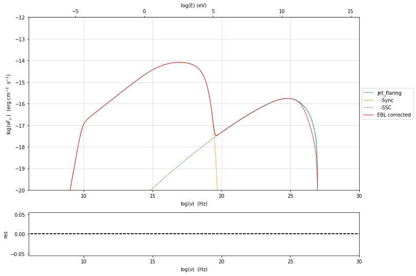

.. _composite_models:

Composite Models and depending pars
===================================

.. code:: ipython3

    from jetset.jet_model import Jet
    from jetset.plot_sedfit import PlotSED
    from jetset.model_manager import FitModel

Composite models allow to combine together different models, such as Jet, and templates, including additive or multiplicative models, and give to the user the possibility to define the functional form of the model composition using a very simple and intuitive form such as:
.. code-block:: python
   'jet1+jet2'*Franceschini_2008

that sums two jet models SEDs, and apply to both of them the `Franceschini_2008` EBL absorption.

Building composite models it is very easy. Composite models are handled by   the :class:`.FitModel` class, as shown by the following examples. 

Combine a Jet model with the EBL model (Multiplicative case)
------------------------------------------------------------

We start by combining a Jet model with the EBL absorption model, i.e. a
multiplicative model. First, we define our Jet model

.. code:: ipython3

    from jetset.jet_model import Jet
    my_jet=Jet(electron_distribution='lppl',name='jet_flaring')

Second, we define the EBL model, and we use in this case the `Franceschini_2008` model ( read the section :ref:`ebl_model`  for more info regarding the EBL models)

.. code:: ipython3

    from jetset.template_2Dmodel import EBLAbsorptionTemplate
    ebl_franceschini=EBLAbsorptionTemplate.from_name('Franceschini_2008')

Now we add the components models to the the :class:`.FitModel` class, using the :class:`.FitModel.add_component()` method 

.. code:: ipython3

    composite_model=FitModel(nu_size=500,name='EBL corrected')
    composite_model.add_component(my_jet)
    composite_model.add_component(ebl_franceschini)

.. parsed-literal::

    /Users/orion/anaconda3/envs/jetset/lib/python3.8/site-packages/jetset/model_manager.py:147: UserWarning: no cosmology defined, using default FlatLambdaCDM(name="Planck13", H0=67.8 km / (Mpc s), Om0=0.307, Tcmb0=2.725 K, Neff=3.05, m_nu=[0.   0.   0.06] eV, Ob0=0.0483)
      warnings.warn('no cosmology defined, using default %s'%self.cosmo)

the waring message is just telling that you are not passing any specific
cosmology model to the ``FitModel`` class, so it is using a default one

.. code:: ipython3

    composite_model.show_pars()

.. raw:: html

    <i>Table length=12</i>
    <table id="table140657529666912-374034" class="table-striped table-bordered table-condensed">
    <thead><tr><th>model name</th><th>name</th><th>par type</th><th>units</th><th>val</th><th>phys. bound. min</th><th>phys. bound. max</th><th>log</th><th>frozen</th></tr></thead>
    <tr><td>jet_flaring</td><td>R</td><td>region_size</td><td>cm</td><td>5.000000e+15</td><td>1.000000e+03</td><td>1.000000e+30</td><td>False</td><td>False</td></tr>
    <tr><td>jet_flaring</td><td>R_H</td><td>region_position</td><td>cm</td><td>1.000000e+17</td><td>0.000000e+00</td><td>--</td><td>False</td><td>True</td></tr>
    <tr><td>jet_flaring</td><td>B</td><td>magnetic_field</td><td>gauss</td><td>1.000000e-01</td><td>0.000000e+00</td><td>--</td><td>False</td><td>False</td></tr>
    <tr><td>jet_flaring</td><td>beam_obj</td><td>beaming</td><td>lorentz-factor*</td><td>1.000000e+01</td><td>1.000000e-04</td><td>--</td><td>False</td><td>False</td></tr>
    <tr><td>jet_flaring</td><td>z_cosm</td><td>redshift</td><td></td><td>1.000000e-01</td><td>0.000000e+00</td><td>--</td><td>False</td><td>False</td></tr>
    <tr><td>jet_flaring</td><td>gmin</td><td>low-energy-cut-off</td><td>lorentz-factor*</td><td>2.000000e+00</td><td>1.000000e+00</td><td>1.000000e+09</td><td>False</td><td>False</td></tr>
    <tr><td>jet_flaring</td><td>gmax</td><td>high-energy-cut-off</td><td>lorentz-factor*</td><td>1.000000e+06</td><td>1.000000e+00</td><td>1.000000e+15</td><td>False</td><td>False</td></tr>
    <tr><td>jet_flaring</td><td>N</td><td>emitters_density</td><td>1 / cm3</td><td>1.000000e+02</td><td>0.000000e+00</td><td>--</td><td>False</td><td>False</td></tr>
    <tr><td>jet_flaring</td><td>gamma0_log_parab</td><td>turn-over-energy</td><td>lorentz-factor*</td><td>1.000000e+04</td><td>1.000000e+00</td><td>1.000000e+09</td><td>False</td><td>False</td></tr>
    <tr><td>jet_flaring</td><td>s</td><td>LE_spectral_slope</td><td></td><td>2.000000e+00</td><td>-1.000000e+01</td><td>1.000000e+01</td><td>False</td><td>False</td></tr>
    <tr><td>jet_flaring</td><td>r</td><td>spectral_curvature</td><td></td><td>4.000000e-01</td><td>-1.500000e+01</td><td>1.500000e+01</td><td>False</td><td>False</td></tr>
    <tr><td>Franceschini_2008</td><td>z_cosm</td><td>redshift</td><td></td><td>1.000000e+00</td><td>0.000000e+00</td><td>--</td><td>False</td><td>True</td></tr>
    </table>
    

Since, both the Jet model the EBL share the same parameter, i.e. the
redshift, we link the two parameters

.. code:: ipython3

    composite_model.link_par(par_name='z_cosm',from_model=['Franceschini_2008'],to_model='jet_flaring')

.. parsed-literal::

    ==> par: z_cosm from model: Franceschini_2008 linked to same parameter in model jet_flaring

.. code:: ipython3

    composite_model.show_pars()

.. raw:: html

    <i>Table length=12</i>
    <table id="table140657529666720-615225" class="table-striped table-bordered table-condensed">
    <thead><tr><th>model name</th><th>name</th><th>par type</th><th>units</th><th>val</th><th>phys. bound. min</th><th>phys. bound. max</th><th>log</th><th>frozen</th></tr></thead>
    <tr><td>jet_flaring</td><td>R</td><td>region_size</td><td>cm</td><td>5.000000e+15</td><td>1.000000e+03</td><td>1.000000e+30</td><td>False</td><td>False</td></tr>
    <tr><td>jet_flaring</td><td>R_H</td><td>region_position</td><td>cm</td><td>1.000000e+17</td><td>0.000000e+00</td><td>--</td><td>False</td><td>True</td></tr>
    <tr><td>jet_flaring</td><td>B</td><td>magnetic_field</td><td>gauss</td><td>1.000000e-01</td><td>0.000000e+00</td><td>--</td><td>False</td><td>False</td></tr>
    <tr><td>jet_flaring</td><td>beam_obj</td><td>beaming</td><td>lorentz-factor*</td><td>1.000000e+01</td><td>1.000000e-04</td><td>--</td><td>False</td><td>False</td></tr>
    <tr><td>jet_flaring</td><td>z_cosm(M)</td><td>redshift</td><td></td><td>1.000000e-01</td><td>0.000000e+00</td><td>--</td><td>False</td><td>False</td></tr>
    <tr><td>jet_flaring</td><td>gmin</td><td>low-energy-cut-off</td><td>lorentz-factor*</td><td>2.000000e+00</td><td>1.000000e+00</td><td>1.000000e+09</td><td>False</td><td>False</td></tr>
    <tr><td>jet_flaring</td><td>gmax</td><td>high-energy-cut-off</td><td>lorentz-factor*</td><td>1.000000e+06</td><td>1.000000e+00</td><td>1.000000e+15</td><td>False</td><td>False</td></tr>
    <tr><td>jet_flaring</td><td>N</td><td>emitters_density</td><td>1 / cm3</td><td>1.000000e+02</td><td>0.000000e+00</td><td>--</td><td>False</td><td>False</td></tr>
    <tr><td>jet_flaring</td><td>gamma0_log_parab</td><td>turn-over-energy</td><td>lorentz-factor*</td><td>1.000000e+04</td><td>1.000000e+00</td><td>1.000000e+09</td><td>False</td><td>False</td></tr>
    <tr><td>jet_flaring</td><td>s</td><td>LE_spectral_slope</td><td></td><td>2.000000e+00</td><td>-1.000000e+01</td><td>1.000000e+01</td><td>False</td><td>False</td></tr>
    <tr><td>jet_flaring</td><td>r</td><td>spectral_curvature</td><td></td><td>4.000000e-01</td><td>-1.500000e+01</td><td>1.500000e+01</td><td>False</td><td>False</td></tr>
    <tr><td>Franceschini_2008</td><td>z_cosm(L,jet_flaring)</td><td>redshift</td><td></td><td>--</td><td>--</td><td>--</td><td>False</td><td>True</td></tr>
    </table>
    

As you can see, now the paramter ``z_cosm`` in ``jet_flaring`` is the
``master`` parameter (flagged by the M in parenthesis), and the one
belonging to the ``Franceschini_2008`` component is the linked one
(flagged by the L in parenthesis).

Setting parameters
------------------

.. note::
   with the new implementation of composite model  (`FitModel` class) to set parameters you have to specify the model component, this is different from versions<1.2.0

These methods are alternative and equivalent ways to set a parameter in
a composite model:

a) accessing the model component member of the

b) using ``set_par`` and passing as first argument the model component
   name

c) using ``set_par`` and passing as first argument the model component
   object

.. code:: ipython3

    #a
    composite_model.jet_flaring.parameters.z_cosm.val=0.1
    #b
    composite_model.set_par('jet_flaring','z_cosm',0.1)
    #c
    composite_model.set_par(my_jet,'z_cosm',0.1)

And now, we can define the functional form of the model composition,
just by writing the mathematical expression as a string, using the model
names reported in the model description table, and that’s it!

.. code:: ipython3

    composite_model.show_model_components()

.. parsed-literal::

    
    --------------------------------------------------------------------------------
    Composite model description
    --------------------------------------------------------------------------------
    name: EBL corrected  
    type: composite_model  
    components models:
     -model name: jet_flaring model type: jet
     -model name: Franceschini_2008 model type: table2D
    
    --------------------------------------------------------------------------------

.. code:: ipython3

    composite_model.composite_expr='jet_flaring*Franceschini_2008'

.. code:: ipython3

    composite_model.jet_flaring.IC_nu_size=150
    composite_model.eval()
    p=composite_model.plot_model()
    p.rescale(y_max=-12)

Sum of two jets (steady and flaring) and application of the EBL absorption to both (Multiplicative and additive)
----------------------------------------------------------------------------------------------------------------

Assume that now we want to sum to jet models (a steady and flaring
component) and apply to both of them the EBL absorption.

.. code:: ipython3

    composite_model=FitModel(nu_size=500,name='EBL corrected flaring+steady')
    composite_model.add_component(my_jet)
    composite_model.add_component(ebl_franceschini)

.. parsed-literal::

    /Users/orion/anaconda3/envs/jetset/lib/python3.8/site-packages/jetset/model_manager.py:147: UserWarning: no cosmology defined, using default FlatLambdaCDM(name="Planck13", H0=67.8 km / (Mpc s), Om0=0.307, Tcmb0=2.725 K, Neff=3.05, m_nu=[0.   0.   0.06] eV, Ob0=0.0483)
      warnings.warn('no cosmology defined, using default %s'%self.cosmo)

.. code:: ipython3

    steady_jet=Jet(electron_distribution='plc',name='steady_jet')
    composite_model.add_component(steady_jet)
    composite_model.show_model_components()

.. parsed-literal::

    
    --------------------------------------------------------------------------------
    Composite model description
    --------------------------------------------------------------------------------
    name: EBL corrected flaring+steady  
    type: composite_model  
    components models:
     -model name: jet_flaring model type: jet
     -model name: Franceschini_2008 model type: table2D
     -model name: steady_jet model type: jet
    
    --------------------------------------------------------------------------------

now we link the same parameter ``z_cosm`` from the ``steady_jet`` to the
same ``master`` parameter used for the ``EBL`` model, i.e. to the
``jet_flaring`` model

.. code:: ipython3

    composite_model.link_par(par_name='z_cosm',from_model=['steady_jet'],to_model='jet_flaring') 

.. parsed-literal::

    ==> par: z_cosm from model: steady_jet linked to same parameter in model jet_flaring

.. code:: ipython3

    composite_model.show_pars()

.. raw:: html

    <i>Table length=22</i>
    <table id="table140657011807664-565188" class="table-striped table-bordered table-condensed">
    <thead><tr><th>model name</th><th>name</th><th>par type</th><th>units</th><th>val</th><th>phys. bound. min</th><th>phys. bound. max</th><th>log</th><th>frozen</th></tr></thead>
    <tr><td>jet_flaring</td><td>R</td><td>region_size</td><td>cm</td><td>5.000000e+15</td><td>1.000000e+03</td><td>1.000000e+30</td><td>False</td><td>False</td></tr>
    <tr><td>jet_flaring</td><td>R_H</td><td>region_position</td><td>cm</td><td>1.000000e+17</td><td>0.000000e+00</td><td>--</td><td>False</td><td>True</td></tr>
    <tr><td>jet_flaring</td><td>B</td><td>magnetic_field</td><td>gauss</td><td>1.000000e-01</td><td>0.000000e+00</td><td>--</td><td>False</td><td>False</td></tr>
    <tr><td>jet_flaring</td><td>beam_obj</td><td>beaming</td><td>lorentz-factor*</td><td>1.000000e+01</td><td>1.000000e-04</td><td>--</td><td>False</td><td>False</td></tr>
    <tr><td>jet_flaring</td><td>z_cosm(M)</td><td>redshift</td><td></td><td>1.000000e-01</td><td>0.000000e+00</td><td>--</td><td>False</td><td>False</td></tr>
    <tr><td>jet_flaring</td><td>gmin</td><td>low-energy-cut-off</td><td>lorentz-factor*</td><td>2.000000e+00</td><td>1.000000e+00</td><td>1.000000e+09</td><td>False</td><td>False</td></tr>
    <tr><td>jet_flaring</td><td>gmax</td><td>high-energy-cut-off</td><td>lorentz-factor*</td><td>1.000000e+06</td><td>1.000000e+00</td><td>1.000000e+15</td><td>False</td><td>False</td></tr>
    <tr><td>jet_flaring</td><td>N</td><td>emitters_density</td><td>1 / cm3</td><td>1.000000e+02</td><td>0.000000e+00</td><td>--</td><td>False</td><td>False</td></tr>
    <tr><td>jet_flaring</td><td>gamma0_log_parab</td><td>turn-over-energy</td><td>lorentz-factor*</td><td>1.000000e+04</td><td>1.000000e+00</td><td>1.000000e+09</td><td>False</td><td>False</td></tr>
    <tr><td>jet_flaring</td><td>s</td><td>LE_spectral_slope</td><td></td><td>2.000000e+00</td><td>-1.000000e+01</td><td>1.000000e+01</td><td>False</td><td>False</td></tr>
    <tr><td>jet_flaring</td><td>r</td><td>spectral_curvature</td><td></td><td>4.000000e-01</td><td>-1.500000e+01</td><td>1.500000e+01</td><td>False</td><td>False</td></tr>
    <tr><td>Franceschini_2008</td><td>z_cosm(L,jet_flaring)</td><td>redshift</td><td></td><td>--</td><td>--</td><td>--</td><td>False</td><td>True</td></tr>
    <tr><td>steady_jet</td><td>R</td><td>region_size</td><td>cm</td><td>5.000000e+15</td><td>1.000000e+03</td><td>1.000000e+30</td><td>False</td><td>False</td></tr>
    <tr><td>steady_jet</td><td>R_H</td><td>region_position</td><td>cm</td><td>1.000000e+17</td><td>0.000000e+00</td><td>--</td><td>False</td><td>True</td></tr>
    <tr><td>steady_jet</td><td>B</td><td>magnetic_field</td><td>gauss</td><td>1.000000e-01</td><td>0.000000e+00</td><td>--</td><td>False</td><td>False</td></tr>
    <tr><td>steady_jet</td><td>beam_obj</td><td>beaming</td><td>lorentz-factor*</td><td>1.000000e+01</td><td>1.000000e-04</td><td>--</td><td>False</td><td>False</td></tr>
    <tr><td>steady_jet</td><td>z_cosm(L,jet_flaring)</td><td>redshift</td><td></td><td>--</td><td>--</td><td>--</td><td>False</td><td>True</td></tr>
    <tr><td>steady_jet</td><td>gmin</td><td>low-energy-cut-off</td><td>lorentz-factor*</td><td>2.000000e+00</td><td>1.000000e+00</td><td>1.000000e+09</td><td>False</td><td>False</td></tr>
    <tr><td>steady_jet</td><td>gmax</td><td>high-energy-cut-off</td><td>lorentz-factor*</td><td>1.000000e+06</td><td>1.000000e+00</td><td>1.000000e+15</td><td>False</td><td>False</td></tr>
    <tr><td>steady_jet</td><td>N</td><td>emitters_density</td><td>1 / cm3</td><td>1.000000e+02</td><td>0.000000e+00</td><td>--</td><td>False</td><td>False</td></tr>
    <tr><td>steady_jet</td><td>gamma_cut</td><td>turn-over-energy</td><td>lorentz-factor*</td><td>1.000000e+04</td><td>1.000000e+00</td><td>1.000000e+09</td><td>False</td><td>False</td></tr>
    <tr><td>steady_jet</td><td>p</td><td>LE_spectral_slope</td><td></td><td>2.000000e+00</td><td>-1.000000e+01</td><td>1.000000e+01</td><td>False</td><td>False</td></tr>
    </table>
    

.. code:: ipython3

    composite_model.steady_jet.IC_nu_size=150

.. code:: ipython3

    composite_model.composite_expr='(jet_flaring + steady_jet) * Franceschini_2008'

.. code:: ipython3

    composite_model.eval()
    p=composite_model.plot_model()
    p.rescale(y_max=-12)

.. image:: Composite_model_files/Composite_model_34_0.png

