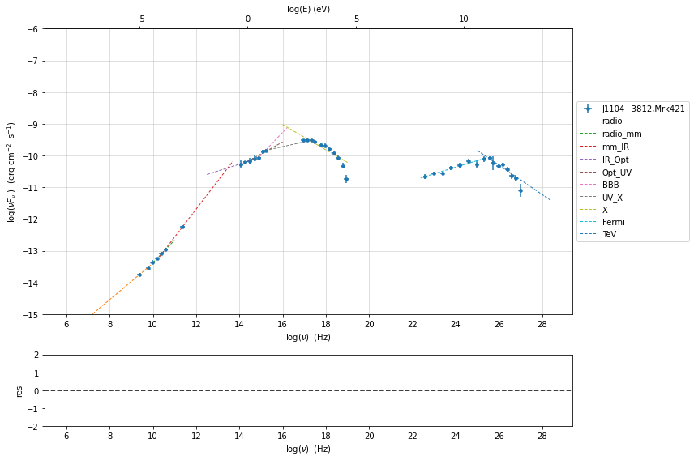

.. _depending_parameters_guide:

.. code:: ipython3

    import warnings
    warnings.filterwarnings('ignore')

.. code:: ipython3

    import jetset
    print('tested on jetset',jetset.__version__)

.. parsed-literal::

    tested on jetset 1.2.0rc4

Depending parameters
====================

example: depending pars for bkn power-law emitters
--------------------------------------------------

.. code:: ipython3

    from jetset.jet_emitters import EmittersDistribution
    import numpy as np
    
    
    
    from jetset.jet_model import Jet
    
    j = Jet(emitters_distribution='bkn')
    
    
    j.parameters

.. raw:: html

    <i>Table length=11</i>
    <table id="table140307572641744-302212" class="table-striped table-bordered table-condensed">
    <thead><tr><th>model name</th><th>name</th><th>par type</th><th>units</th><th>val</th><th>phys. bound. min</th><th>phys. bound. max</th><th>log</th><th>frozen</th></tr></thead>
    <tr><td>jet_leptonic</td><td>R</td><td>region_size</td><td>cm</td><td>5.000000e+15</td><td>1.000000e+03</td><td>1.000000e+30</td><td>False</td><td>False</td></tr>
    <tr><td>jet_leptonic</td><td>R_H</td><td>region_position</td><td>cm</td><td>1.000000e+17</td><td>0.000000e+00</td><td>--</td><td>False</td><td>True</td></tr>
    <tr><td>jet_leptonic</td><td>B</td><td>magnetic_field</td><td>gauss</td><td>1.000000e-01</td><td>0.000000e+00</td><td>--</td><td>False</td><td>False</td></tr>
    <tr><td>jet_leptonic</td><td>beam_obj</td><td>beaming</td><td>lorentz-factor*</td><td>1.000000e+01</td><td>1.000000e-04</td><td>--</td><td>False</td><td>False</td></tr>
    <tr><td>jet_leptonic</td><td>z_cosm</td><td>redshift</td><td></td><td>1.000000e-01</td><td>0.000000e+00</td><td>--</td><td>False</td><td>False</td></tr>
    <tr><td>jet_leptonic</td><td>gmin</td><td>low-energy-cut-off</td><td>lorentz-factor*</td><td>2.000000e+00</td><td>1.000000e+00</td><td>1.000000e+09</td><td>False</td><td>False</td></tr>
    <tr><td>jet_leptonic</td><td>gmax</td><td>high-energy-cut-off</td><td>lorentz-factor*</td><td>1.000000e+06</td><td>1.000000e+00</td><td>1.000000e+15</td><td>False</td><td>False</td></tr>
    <tr><td>jet_leptonic</td><td>N</td><td>emitters_density</td><td>1 / cm3</td><td>1.000000e+02</td><td>0.000000e+00</td><td>--</td><td>False</td><td>False</td></tr>
    <tr><td>jet_leptonic</td><td>gamma_break</td><td>turn-over-energy</td><td>lorentz-factor*</td><td>1.000000e+04</td><td>1.000000e+00</td><td>1.000000e+09</td><td>False</td><td>False</td></tr>
    <tr><td>jet_leptonic</td><td>p</td><td>LE_spectral_slope</td><td></td><td>2.500000e+00</td><td>-1.000000e+01</td><td>1.000000e+01</td><td>False</td><td>False</td></tr>
    <tr><td>jet_leptonic</td><td>p_1</td><td>HE_spectral_slope</td><td></td><td>3.500000e+00</td><td>-1.000000e+01</td><td>1.000000e+01</td><td>False</td><td>False</td></tr>
    </table>
    

.. parsed-literal::

    None

.. code:: ipython3

    j.make_dependent_par(par='p_1',depends_on=['p'],par_expr='1 + p')
    j.parameters.p.val=2
    np.testing.assert_allclose(j.parameters.p_1.val, j.parameters.p.val + 1)
    j.parameters

.. parsed-literal::

    ==> par p_1 is now depending on ['p'] according to expr 1 + p

.. raw:: html

    <i>Table length=11</i>
    <table id="table140307572641744-528659" class="table-striped table-bordered table-condensed">
    <thead><tr><th>model name</th><th>name</th><th>par type</th><th>units</th><th>val</th><th>phys. bound. min</th><th>phys. bound. max</th><th>log</th><th>frozen</th></tr></thead>
    <tr><td>jet_leptonic</td><td>R</td><td>region_size</td><td>cm</td><td>5.000000e+15</td><td>1.000000e+03</td><td>1.000000e+30</td><td>False</td><td>False</td></tr>
    <tr><td>jet_leptonic</td><td>R_H</td><td>region_position</td><td>cm</td><td>1.000000e+17</td><td>0.000000e+00</td><td>--</td><td>False</td><td>True</td></tr>
    <tr><td>jet_leptonic</td><td>B</td><td>magnetic_field</td><td>gauss</td><td>1.000000e-01</td><td>0.000000e+00</td><td>--</td><td>False</td><td>False</td></tr>
    <tr><td>jet_leptonic</td><td>beam_obj</td><td>beaming</td><td>lorentz-factor*</td><td>1.000000e+01</td><td>1.000000e-04</td><td>--</td><td>False</td><td>False</td></tr>
    <tr><td>jet_leptonic</td><td>z_cosm</td><td>redshift</td><td></td><td>1.000000e-01</td><td>0.000000e+00</td><td>--</td><td>False</td><td>False</td></tr>
    <tr><td>jet_leptonic</td><td>gmin</td><td>low-energy-cut-off</td><td>lorentz-factor*</td><td>2.000000e+00</td><td>1.000000e+00</td><td>1.000000e+09</td><td>False</td><td>False</td></tr>
    <tr><td>jet_leptonic</td><td>gmax</td><td>high-energy-cut-off</td><td>lorentz-factor*</td><td>1.000000e+06</td><td>1.000000e+00</td><td>1.000000e+15</td><td>False</td><td>False</td></tr>
    <tr><td>jet_leptonic</td><td>N</td><td>emitters_density</td><td>1 / cm3</td><td>1.000000e+02</td><td>0.000000e+00</td><td>--</td><td>False</td><td>False</td></tr>
    <tr><td>jet_leptonic</td><td>gamma_break</td><td>turn-over-energy</td><td>lorentz-factor*</td><td>1.000000e+04</td><td>1.000000e+00</td><td>1.000000e+09</td><td>False</td><td>False</td></tr>
    <tr><td>jet_leptonic</td><td>p(M)</td><td>LE_spectral_slope</td><td></td><td>2.000000e+00</td><td>-1.000000e+01</td><td>1.000000e+01</td><td>False</td><td>False</td></tr>
    <tr><td>jet_leptonic</td><td>*p_1(D,p)</td><td>HE_spectral_slope</td><td></td><td>3.000000e+00</td><td>-1.000000e+01</td><td>1.000000e+01</td><td>False</td><td>True</td></tr>
    </table>
    

.. parsed-literal::

    None

.. code:: ipython3

    j.save_model('jet.pkl')
    new_jet=Jet.load_model('jet.pkl')

.. parsed-literal::

    ==> par p_1 is now depending on ['p'] according to expr 1 + p

.. raw:: html

    <i>Table length=11</i>
    <table id="table140307596073664-132589" class="table-striped table-bordered table-condensed">
    <thead><tr><th>model name</th><th>name</th><th>par type</th><th>units</th><th>val</th><th>phys. bound. min</th><th>phys. bound. max</th><th>log</th><th>frozen</th></tr></thead>
    <tr><td>jet_leptonic</td><td>gmin</td><td>low-energy-cut-off</td><td>lorentz-factor*</td><td>2.000000e+00</td><td>1.000000e+00</td><td>1.000000e+09</td><td>False</td><td>False</td></tr>
    <tr><td>jet_leptonic</td><td>gmax</td><td>high-energy-cut-off</td><td>lorentz-factor*</td><td>1.000000e+06</td><td>1.000000e+00</td><td>1.000000e+15</td><td>False</td><td>False</td></tr>
    <tr><td>jet_leptonic</td><td>N</td><td>emitters_density</td><td>1 / cm3</td><td>1.000000e+02</td><td>0.000000e+00</td><td>--</td><td>False</td><td>False</td></tr>
    <tr><td>jet_leptonic</td><td>gamma_break</td><td>turn-over-energy</td><td>lorentz-factor*</td><td>1.000000e+04</td><td>1.000000e+00</td><td>1.000000e+09</td><td>False</td><td>False</td></tr>
    <tr><td>jet_leptonic</td><td>p(M)</td><td>LE_spectral_slope</td><td></td><td>2.000000e+00</td><td>-1.000000e+01</td><td>1.000000e+01</td><td>False</td><td>False</td></tr>
    <tr><td>jet_leptonic</td><td>*p_1(D,p)</td><td>HE_spectral_slope</td><td></td><td>3.000000e+00</td><td>-1.000000e+01</td><td>1.000000e+01</td><td>False</td><td>True</td></tr>
    <tr><td>jet_leptonic</td><td>R</td><td>region_size</td><td>cm</td><td>5.000000e+15</td><td>1.000000e+03</td><td>1.000000e+30</td><td>False</td><td>False</td></tr>
    <tr><td>jet_leptonic</td><td>R_H</td><td>region_position</td><td>cm</td><td>1.000000e+17</td><td>0.000000e+00</td><td>--</td><td>False</td><td>True</td></tr>
    <tr><td>jet_leptonic</td><td>B</td><td>magnetic_field</td><td>gauss</td><td>1.000000e-01</td><td>0.000000e+00</td><td>--</td><td>False</td><td>False</td></tr>
    <tr><td>jet_leptonic</td><td>beam_obj</td><td>beaming</td><td>lorentz-factor*</td><td>1.000000e+01</td><td>1.000000e-04</td><td>--</td><td>False</td><td>False</td></tr>
    <tr><td>jet_leptonic</td><td>z_cosm</td><td>redshift</td><td></td><td>1.000000e-01</td><td>0.000000e+00</td><td>--</td><td>False</td><td>False</td></tr>
    </table>
    

.. code:: ipython3

    new_jet.parameters.p.val=2.5
    np.testing.assert_allclose(new_jet.parameters.p_1.val, new_jet.parameters.p.val + 1)
    new_jet.parameters

.. raw:: html

    <i>Table length=11</i>
    <table id="table140307596073664-1972" class="table-striped table-bordered table-condensed">
    <thead><tr><th>model name</th><th>name</th><th>par type</th><th>units</th><th>val</th><th>phys. bound. min</th><th>phys. bound. max</th><th>log</th><th>frozen</th></tr></thead>
    <tr><td>jet_leptonic</td><td>gmin</td><td>low-energy-cut-off</td><td>lorentz-factor*</td><td>2.000000e+00</td><td>1.000000e+00</td><td>1.000000e+09</td><td>False</td><td>False</td></tr>
    <tr><td>jet_leptonic</td><td>gmax</td><td>high-energy-cut-off</td><td>lorentz-factor*</td><td>1.000000e+06</td><td>1.000000e+00</td><td>1.000000e+15</td><td>False</td><td>False</td></tr>
    <tr><td>jet_leptonic</td><td>N</td><td>emitters_density</td><td>1 / cm3</td><td>1.000000e+02</td><td>0.000000e+00</td><td>--</td><td>False</td><td>False</td></tr>
    <tr><td>jet_leptonic</td><td>gamma_break</td><td>turn-over-energy</td><td>lorentz-factor*</td><td>1.000000e+04</td><td>1.000000e+00</td><td>1.000000e+09</td><td>False</td><td>False</td></tr>
    <tr><td>jet_leptonic</td><td>p(M)</td><td>LE_spectral_slope</td><td></td><td>2.500000e+00</td><td>-1.000000e+01</td><td>1.000000e+01</td><td>False</td><td>False</td></tr>
    <tr><td>jet_leptonic</td><td>*p_1(D,p)</td><td>HE_spectral_slope</td><td></td><td>3.500000e+00</td><td>-1.000000e+01</td><td>1.000000e+01</td><td>False</td><td>True</td></tr>
    <tr><td>jet_leptonic</td><td>R</td><td>region_size</td><td>cm</td><td>5.000000e+15</td><td>1.000000e+03</td><td>1.000000e+30</td><td>False</td><td>False</td></tr>
    <tr><td>jet_leptonic</td><td>R_H</td><td>region_position</td><td>cm</td><td>1.000000e+17</td><td>0.000000e+00</td><td>--</td><td>False</td><td>True</td></tr>
    <tr><td>jet_leptonic</td><td>B</td><td>magnetic_field</td><td>gauss</td><td>1.000000e-01</td><td>0.000000e+00</td><td>--</td><td>False</td><td>False</td></tr>
    <tr><td>jet_leptonic</td><td>beam_obj</td><td>beaming</td><td>lorentz-factor*</td><td>1.000000e+01</td><td>1.000000e-04</td><td>--</td><td>False</td><td>False</td></tr>
    <tr><td>jet_leptonic</td><td>z_cosm</td><td>redshift</td><td></td><td>1.000000e-01</td><td>0.000000e+00</td><td>--</td><td>False</td><td>False</td></tr>
    </table>
    

.. parsed-literal::

    None

example: linked paramters for EBL
---------------------------------

.. code:: ipython3

    from jetset.jet_model import Jet
    from jetset.template_2Dmodel import EBLAbsorptionTemplate
    from jetset.model_manager import FitModel
    
    my_jet = Jet(electron_distribution='lppl', name='jet_flaring')
    my_jet.parameters.z_cosm.val = 0.01
    
    ebl_franceschini = EBLAbsorptionTemplate.from_name('Franceschini_2008')
    
    composite_model = FitModel(nu_size=500, name='EBL corrected')
    composite_model.add_component(my_jet)
    composite_model.add_component(ebl_franceschini)
    
    composite_model.show_pars()
    
    composite_model.link_par(par_name='z_cosm', from_model='Franceschini_2008', to_model='jet_flaring')
    v=0.03001
    my_jet.parameters.z_cosm.val = v
    assert (composite_model.Franceschini_2008.parameters.z_cosm.val==v)
    assert (composite_model.Franceschini_2008.parameters.z_cosm.linked==True)
    
    composite_model.composite_expr = '%s*%s'%(my_jet.name,ebl_franceschini.name)
    composite_model.eval()
    
    #if plot is True:
    #    composite_model.plot_model()
    
    composite_model.save_model('ebl_jet.pkl')
    new_composite_model=FitModel.load_model('ebl_jet.pkl')
    new_composite_model.show_pars()
    v=2.0
    new_composite_model.jet_flaring.parameters.z_cosm.val=v
    print(new_composite_model.Franceschini_2008.parameters.z_cosm.val,v)
    assert (new_composite_model.Franceschini_2008.parameters.z_cosm.val == v)
    assert (new_composite_model.Franceschini_2008.parameters.z_cosm.linked == True)

.. raw:: html

    <i>Table length=12</i>
    <table id="table140307583819488-921957" class="table-striped table-bordered table-condensed">
    <thead><tr><th>model name</th><th>name</th><th>par type</th><th>units</th><th>val</th><th>phys. bound. min</th><th>phys. bound. max</th><th>log</th><th>frozen</th></tr></thead>
    <tr><td>jet_flaring</td><td>R</td><td>region_size</td><td>cm</td><td>5.000000e+15</td><td>1.000000e+03</td><td>1.000000e+30</td><td>False</td><td>False</td></tr>
    <tr><td>jet_flaring</td><td>R_H</td><td>region_position</td><td>cm</td><td>1.000000e+17</td><td>0.000000e+00</td><td>--</td><td>False</td><td>True</td></tr>
    <tr><td>jet_flaring</td><td>B</td><td>magnetic_field</td><td>gauss</td><td>1.000000e-01</td><td>0.000000e+00</td><td>--</td><td>False</td><td>False</td></tr>
    <tr><td>jet_flaring</td><td>beam_obj</td><td>beaming</td><td>lorentz-factor*</td><td>1.000000e+01</td><td>1.000000e-04</td><td>--</td><td>False</td><td>False</td></tr>
    <tr><td>jet_flaring</td><td>z_cosm</td><td>redshift</td><td></td><td>1.000000e-02</td><td>0.000000e+00</td><td>--</td><td>False</td><td>False</td></tr>
    <tr><td>jet_flaring</td><td>gmin</td><td>low-energy-cut-off</td><td>lorentz-factor*</td><td>2.000000e+00</td><td>1.000000e+00</td><td>1.000000e+09</td><td>False</td><td>False</td></tr>
    <tr><td>jet_flaring</td><td>gmax</td><td>high-energy-cut-off</td><td>lorentz-factor*</td><td>1.000000e+06</td><td>1.000000e+00</td><td>1.000000e+15</td><td>False</td><td>False</td></tr>
    <tr><td>jet_flaring</td><td>N</td><td>emitters_density</td><td>1 / cm3</td><td>1.000000e+02</td><td>0.000000e+00</td><td>--</td><td>False</td><td>False</td></tr>
    <tr><td>jet_flaring</td><td>gamma0_log_parab</td><td>turn-over-energy</td><td>lorentz-factor*</td><td>1.000000e+04</td><td>1.000000e+00</td><td>1.000000e+09</td><td>False</td><td>False</td></tr>
    <tr><td>jet_flaring</td><td>s</td><td>LE_spectral_slope</td><td></td><td>2.000000e+00</td><td>-1.000000e+01</td><td>1.000000e+01</td><td>False</td><td>False</td></tr>
    <tr><td>jet_flaring</td><td>r</td><td>spectral_curvature</td><td></td><td>4.000000e-01</td><td>-1.500000e+01</td><td>1.500000e+01</td><td>False</td><td>False</td></tr>
    <tr><td>Franceschini_2008</td><td>z_cosm</td><td>redshift</td><td></td><td>1.000000e+00</td><td>0.000000e+00</td><td>--</td><td>False</td><td>True</td></tr>
    </table>
    

.. parsed-literal::

    ==> par: z_cosm from model: Franceschini_2008 linked to same parameter in model jet_flaring
    ==> par: z_cosm from model: Franceschini_2008 linked to same parameter in model jet_flaring

.. raw:: html

    <i>Table length=12</i>
    <table id="table140307140766832-169537" class="table-striped table-bordered table-condensed">
    <thead><tr><th>model name</th><th>name</th><th>par type</th><th>units</th><th>val</th><th>phys. bound. min</th><th>phys. bound. max</th><th>log</th><th>frozen</th></tr></thead>
    <tr><td>jet_flaring</td><td>gmin</td><td>low-energy-cut-off</td><td>lorentz-factor*</td><td>2.000000e+00</td><td>1.000000e+00</td><td>1.000000e+09</td><td>False</td><td>False</td></tr>
    <tr><td>jet_flaring</td><td>gmax</td><td>high-energy-cut-off</td><td>lorentz-factor*</td><td>1.000000e+06</td><td>1.000000e+00</td><td>1.000000e+15</td><td>False</td><td>False</td></tr>
    <tr><td>jet_flaring</td><td>N</td><td>emitters_density</td><td>1 / cm3</td><td>1.000000e+02</td><td>0.000000e+00</td><td>--</td><td>False</td><td>False</td></tr>
    <tr><td>jet_flaring</td><td>gamma0_log_parab</td><td>turn-over-energy</td><td>lorentz-factor*</td><td>1.000000e+04</td><td>1.000000e+00</td><td>1.000000e+09</td><td>False</td><td>False</td></tr>
    <tr><td>jet_flaring</td><td>s</td><td>LE_spectral_slope</td><td></td><td>2.000000e+00</td><td>-1.000000e+01</td><td>1.000000e+01</td><td>False</td><td>False</td></tr>
    <tr><td>jet_flaring</td><td>r</td><td>spectral_curvature</td><td></td><td>4.000000e-01</td><td>-1.500000e+01</td><td>1.500000e+01</td><td>False</td><td>False</td></tr>
    <tr><td>jet_flaring</td><td>R</td><td>region_size</td><td>cm</td><td>5.000000e+15</td><td>1.000000e+03</td><td>1.000000e+30</td><td>False</td><td>False</td></tr>
    <tr><td>jet_flaring</td><td>R_H</td><td>region_position</td><td>cm</td><td>1.000000e+17</td><td>0.000000e+00</td><td>--</td><td>False</td><td>True</td></tr>
    <tr><td>jet_flaring</td><td>B</td><td>magnetic_field</td><td>gauss</td><td>1.000000e-01</td><td>0.000000e+00</td><td>--</td><td>False</td><td>False</td></tr>
    <tr><td>jet_flaring</td><td>beam_obj</td><td>beaming</td><td>lorentz-factor*</td><td>1.000000e+01</td><td>1.000000e-04</td><td>--</td><td>False</td><td>False</td></tr>
    <tr><td>jet_flaring</td><td>z_cosm(M)</td><td>redshift</td><td></td><td>3.001000e-02</td><td>0.000000e+00</td><td>--</td><td>False</td><td>False</td></tr>
    <tr><td>Franceschini_2008</td><td>z_cosm(L,jet_flaring)</td><td>redshift</td><td></td><td>--</td><td>--</td><td>--</td><td>False</td><td>True</td></tr>
    </table>
    

.. parsed-literal::

    2.0 2.0

example depending par: Building a Jet model with B function of R_H and R_0
--------------------------------------------------------------------------

.. code:: ipython3

    jet=Jet(emitters_distribution='plc')
    fit_model_lsb=FitModel( jet=jet, name='SSC-best-fit-lsb',template=None)
    fit_model_lsb.jet_leptonic.parameters.beam_obj.fit_range = [5, 50]
    fit_model_lsb.jet_leptonic.parameters.R_H.val=5E17
    fit_model_lsb.jet_leptonic.parameters.R_H.frozen=False
    fit_model_lsb.jet_leptonic.parameters.R_H.fit_range = [1E15, 1E19]
    fit_model_lsb.jet_leptonic.parameters.R.fit_range = [10 ** 15.5, 10 ** 17.5]
    
    fit_model_lsb.jet_leptonic.add_user_par(name='B0',units='G',val=1E3,val_min=0,val_max=None)
    fit_model_lsb.jet_leptonic.add_user_par(name='R0', units='cm', val=5E13, val_min=0, val_max=None)
    fit_model_lsb.jet_leptonic.parameters.R0.frozen=True
    fit_model_lsb.jet_leptonic.parameters.B0.frozen=True
    
    par_expr = 'B0*np.power((R0/R_H),1.1)'
    
    fit_model_lsb.jet_leptonic.make_dependent_par(par='B', depends_on=['B0', 'R0', 'R_H'], par_expr=par_expr)
    
    B0=fit_model_lsb.jet_leptonic.parameters.B0.val
    R0 = fit_model_lsb.jet_leptonic.parameters.R0.val
    R_H = fit_model_lsb.jet_leptonic.parameters.R_H.val
    
    np.testing.assert_allclose(fit_model_lsb.jet_leptonic.parameters.B.val, eval(par_expr))

.. parsed-literal::

    ==> par B is now depending on ['B0', 'R0', 'R_H'] according to expr B0*np.power((R0/R_H),1.1)

.. code:: ipython3

    fit_model_lsb.jet_leptonic.parameters

.. raw:: html

    <i>Table length=12</i>
    <table id="table140307130520624-647593" class="table-striped table-bordered table-condensed">
    <thead><tr><th>model name</th><th>name</th><th>par type</th><th>units</th><th>val</th><th>phys. bound. min</th><th>phys. bound. max</th><th>log</th><th>frozen</th></tr></thead>
    <tr><td>jet_leptonic</td><td>R</td><td>region_size</td><td>cm</td><td>5.000000e+15</td><td>1.000000e+03</td><td>1.000000e+30</td><td>False</td><td>False</td></tr>
    <tr><td>jet_leptonic</td><td>R_H(M)</td><td>region_position</td><td>cm</td><td>5.000000e+17</td><td>0.000000e+00</td><td>--</td><td>False</td><td>False</td></tr>
    <tr><td>jet_leptonic</td><td>*B(D,R_H)</td><td>magnetic_field</td><td>gauss</td><td>3.981072e-02</td><td>0.000000e+00</td><td>--</td><td>False</td><td>True</td></tr>
    <tr><td>jet_leptonic</td><td>beam_obj</td><td>beaming</td><td>lorentz-factor*</td><td>1.000000e+01</td><td>1.000000e-04</td><td>--</td><td>False</td><td>False</td></tr>
    <tr><td>jet_leptonic</td><td>z_cosm</td><td>redshift</td><td></td><td>1.000000e-01</td><td>0.000000e+00</td><td>--</td><td>False</td><td>False</td></tr>
    <tr><td>jet_leptonic</td><td>gmin</td><td>low-energy-cut-off</td><td>lorentz-factor*</td><td>2.000000e+00</td><td>1.000000e+00</td><td>1.000000e+09</td><td>False</td><td>False</td></tr>
    <tr><td>jet_leptonic</td><td>gmax</td><td>high-energy-cut-off</td><td>lorentz-factor*</td><td>1.000000e+06</td><td>1.000000e+00</td><td>1.000000e+15</td><td>False</td><td>False</td></tr>
    <tr><td>jet_leptonic</td><td>N</td><td>emitters_density</td><td>1 / cm3</td><td>1.000000e+02</td><td>0.000000e+00</td><td>--</td><td>False</td><td>False</td></tr>
    <tr><td>jet_leptonic</td><td>gamma_cut</td><td>turn-over-energy</td><td>lorentz-factor*</td><td>1.000000e+04</td><td>1.000000e+00</td><td>1.000000e+09</td><td>False</td><td>False</td></tr>
    <tr><td>jet_leptonic</td><td>p</td><td>LE_spectral_slope</td><td></td><td>2.000000e+00</td><td>-1.000000e+01</td><td>1.000000e+01</td><td>False</td><td>False</td></tr>
    <tr><td>jet_leptonic</td><td>B0(M)</td><td>user_defined</td><td>G</td><td>1.000000e+03</td><td>0.000000e+00</td><td>--</td><td>False</td><td>True</td></tr>
    <tr><td>jet_leptonic</td><td>R0(M)</td><td>user_defined</td><td>cm</td><td>5.000000e+13</td><td>0.000000e+00</td><td>--</td><td>False</td><td>True</td></tr>
    </table>
    

.. parsed-literal::

    None

.. code:: ipython3

    fit_model_lsb.jet_leptonic.parameters

.. raw:: html

    <i>Table length=12</i>
    <table id="table140307130520624-767923" class="table-striped table-bordered table-condensed">
    <thead><tr><th>model name</th><th>name</th><th>par type</th><th>units</th><th>val</th><th>phys. bound. min</th><th>phys. bound. max</th><th>log</th><th>frozen</th></tr></thead>
    <tr><td>jet_leptonic</td><td>R</td><td>region_size</td><td>cm</td><td>5.000000e+15</td><td>1.000000e+03</td><td>1.000000e+30</td><td>False</td><td>False</td></tr>
    <tr><td>jet_leptonic</td><td>R_H(M)</td><td>region_position</td><td>cm</td><td>5.000000e+17</td><td>0.000000e+00</td><td>--</td><td>False</td><td>False</td></tr>
    <tr><td>jet_leptonic</td><td>*B(D,R_H)</td><td>magnetic_field</td><td>gauss</td><td>3.981072e-02</td><td>0.000000e+00</td><td>--</td><td>False</td><td>True</td></tr>
    <tr><td>jet_leptonic</td><td>beam_obj</td><td>beaming</td><td>lorentz-factor*</td><td>1.000000e+01</td><td>1.000000e-04</td><td>--</td><td>False</td><td>False</td></tr>
    <tr><td>jet_leptonic</td><td>z_cosm</td><td>redshift</td><td></td><td>1.000000e-01</td><td>0.000000e+00</td><td>--</td><td>False</td><td>False</td></tr>
    <tr><td>jet_leptonic</td><td>gmin</td><td>low-energy-cut-off</td><td>lorentz-factor*</td><td>2.000000e+00</td><td>1.000000e+00</td><td>1.000000e+09</td><td>False</td><td>False</td></tr>
    <tr><td>jet_leptonic</td><td>gmax</td><td>high-energy-cut-off</td><td>lorentz-factor*</td><td>1.000000e+06</td><td>1.000000e+00</td><td>1.000000e+15</td><td>False</td><td>False</td></tr>
    <tr><td>jet_leptonic</td><td>N</td><td>emitters_density</td><td>1 / cm3</td><td>1.000000e+02</td><td>0.000000e+00</td><td>--</td><td>False</td><td>False</td></tr>
    <tr><td>jet_leptonic</td><td>gamma_cut</td><td>turn-over-energy</td><td>lorentz-factor*</td><td>1.000000e+04</td><td>1.000000e+00</td><td>1.000000e+09</td><td>False</td><td>False</td></tr>
    <tr><td>jet_leptonic</td><td>p</td><td>LE_spectral_slope</td><td></td><td>2.000000e+00</td><td>-1.000000e+01</td><td>1.000000e+01</td><td>False</td><td>False</td></tr>
    <tr><td>jet_leptonic</td><td>B0(M)</td><td>user_defined</td><td>G</td><td>1.000000e+03</td><td>0.000000e+00</td><td>--</td><td>False</td><td>True</td></tr>
    <tr><td>jet_leptonic</td><td>R0(M)</td><td>user_defined</td><td>cm</td><td>5.000000e+13</td><td>0.000000e+00</td><td>--</td><td>False</td><td>True</td></tr>
    </table>
    

.. parsed-literal::

    None

.. code:: ipython3

    fit_model_lsb.save_model('test.pkl')

.. code:: ipython3

    fit_model_lsb=FitModel.load_model('test.pkl')

.. parsed-literal::

    ==> par B is now depending on ['B0', 'R0', 'R_H'] according to expr B0*np.power((R0/R_H),1.1)

example depending par: fitting with a Jet model with depending pars
-------------------------------------------------------------------

.. code:: ipython3

    from jetset.test_data_helper import  test_SEDs
    from jetset.data_loader import ObsData,Data
    from jetset.plot_sedfit import PlotSED
    from jetset.test_data_helper import  test_SEDs

.. code:: ipython3

    data=Data.from_file(test_SEDs[1])

.. code:: ipython3

    sed_data=ObsData(data_table=data)
    sed_data.group_data(bin_width=0.2)
    
    sed_data.add_systematics(0.1,[10.**6,10.**29])
    p=sed_data.plot_sed()

.. parsed-literal::

    ================================================================================
    
    ***  binning data  ***
    ---> N bins= 89
    ---> bin_widht= 0.2
    ================================================================================
    

.. image:: depending_pars_files/depending_pars_20_1.png

.. code:: ipython3

    from jetset.sed_shaper import  SEDShape
    my_shape=SEDShape(sed_data)
    my_shape.eval_indices(minimizer='lsb',silent=True)
    p=my_shape.plot_indices()
    p.rescale(y_min=-15,y_max=-6)

.. parsed-literal::

    ================================================================================
    
    *** evaluating spectral indices for data ***
    ================================================================================
    

.. code:: ipython3

    mm,best_fit=my_shape.sync_fit(check_host_gal_template=False,
                      Ep_start=None,
                      minimizer='lsb',
                      silent=True,
                      fit_range=[10.,21.])

.. parsed-literal::

    ================================================================================
    
    *** Log-Polynomial fitting of the synchrotron component ***
    ---> first blind fit run,  fit range: [10.0, 21.0]
    ---> class:  HSP
    
    
    

.. raw:: html

    <i>Table length=4</i>
    <table id="table140307138846624-264688" class="table-striped table-bordered table-condensed">
    <thead><tr><th>model name</th><th>name</th><th>val</th><th>bestfit val</th><th>err +</th><th>err -</th><th>start val</th><th>fit range min</th><th>fit range max</th><th>frozen</th></tr></thead>
    <tr><td>LogCubic</td><td>b</td><td>-1.545300e-01</td><td>-1.545300e-01</td><td>9.534795e-03</td><td>--</td><td>-1.000000e+00</td><td>-1.000000e+01</td><td>0.000000e+00</td><td>False</td></tr>
    <tr><td>LogCubic</td><td>c</td><td>-1.023245e-02</td><td>-1.023245e-02</td><td>1.433073e-03</td><td>--</td><td>-1.000000e+00</td><td>-1.000000e+01</td><td>1.000000e+01</td><td>False</td></tr>
    <tr><td>LogCubic</td><td>Ep</td><td>1.672267e+01</td><td>1.672267e+01</td><td>4.139942e-02</td><td>--</td><td>1.667039e+01</td><td>0.000000e+00</td><td>3.000000e+01</td><td>False</td></tr>
    <tr><td>LogCubic</td><td>Sp</td><td>-9.491659e+00</td><td>-9.491659e+00</td><td>2.515285e-02</td><td>--</td><td>-1.000000e+01</td><td>-3.000000e+01</td><td>0.000000e+00</td><td>False</td></tr>
    </table>
    

.. parsed-literal::

    ---> sync       nu_p=+1.672267e+01 (err=+4.139942e-02)  nuFnu_p=-9.491659e+00 (err=+2.515285e-02) curv.=-1.545300e-01 (err=+9.534795e-03)
    ================================================================================
    

.. code:: ipython3

    my_shape.IC_fit(fit_range=[23.,29.],minimizer='minuit',silent=True)
    p=my_shape.plot_shape_fit()
    p.rescale(y_min=-15)

.. parsed-literal::

    ================================================================================
    
    *** Log-Polynomial fitting of the IC component ***
    ---> fit range: [23.0, 29.0]
    ---> LogCubic fit
    
    

.. raw:: html

    <i>Table length=4</i>
    <table id="table140307138792272-803021" class="table-striped table-bordered table-condensed">
    <thead><tr><th>model name</th><th>name</th><th>val</th><th>bestfit val</th><th>err +</th><th>err -</th><th>start val</th><th>fit range min</th><th>fit range max</th><th>frozen</th></tr></thead>
    <tr><td>LogCubic</td><td>b</td><td>-2.098186e-01</td><td>-2.098186e-01</td><td>3.133100e-02</td><td>--</td><td>-1.000000e+00</td><td>-1.000000e+01</td><td>0.000000e+00</td><td>False</td></tr>
    <tr><td>LogCubic</td><td>c</td><td>-4.661867e-02</td><td>-4.661867e-02</td><td>2.178435e-02</td><td>--</td><td>-1.000000e+00</td><td>-1.000000e+01</td><td>1.000000e+01</td><td>False</td></tr>
    <tr><td>LogCubic</td><td>Ep</td><td>2.524926e+01</td><td>2.524926e+01</td><td>1.147802e-01</td><td>--</td><td>2.529412e+01</td><td>0.000000e+00</td><td>3.000000e+01</td><td>False</td></tr>
    <tr><td>LogCubic</td><td>Sp</td><td>-1.011085e+01</td><td>-1.011085e+01</td><td>3.498963e-02</td><td>--</td><td>-1.000000e+01</td><td>-3.000000e+01</td><td>0.000000e+00</td><td>False</td></tr>
    </table>
    

.. parsed-literal::

    ---> IC         nu_p=+2.524926e+01 (err=+1.147802e-01)  nuFnu_p=-1.011085e+01 (err=+3.498963e-02) curv.=-2.098186e-01 (err=+3.133100e-02)
    ================================================================================
    

.. image:: depending_pars_files/depending_pars_23_3.png

.. code:: ipython3

    from jetset.obs_constrain import ObsConstrain
    from jetset.model_manager import  FitModel
    sed_obspar=ObsConstrain(beaming=25,
                            B_range=[0.001,0.1],
                            distr_e='lppl',
                            t_var_sec=3*86400,
                            nu_cut_IR=1E12,
                            SEDShape=my_shape)
    
    
    prefit_jet=sed_obspar.constrain_SSC_model(electron_distribution_log_values=False,silent=True)
    prefit_jet.save_model('prefit_jet.pkl')

.. parsed-literal::

    ================================================================================
    
    ***  constrains parameters from observable ***
    

.. raw:: html

    <i>Table length=11</i>
    <table id="table140307572988896-537348" class="table-striped table-bordered table-condensed">
    <thead><tr><th>model name</th><th>name</th><th>par type</th><th>units</th><th>val</th><th>phys. bound. min</th><th>phys. bound. max</th><th>log</th><th>frozen</th></tr></thead>
    <tr><td>jet_leptonic</td><td>R</td><td>region_size</td><td>cm</td><td>3.117075e+16</td><td>1.000000e+03</td><td>1.000000e+30</td><td>False</td><td>False</td></tr>
    <tr><td>jet_leptonic</td><td>R_H</td><td>region_position</td><td>cm</td><td>1.000000e+17</td><td>0.000000e+00</td><td>--</td><td>False</td><td>True</td></tr>
    <tr><td>jet_leptonic</td><td>B</td><td>magnetic_field</td><td>gauss</td><td>5.050000e-02</td><td>0.000000e+00</td><td>--</td><td>False</td><td>False</td></tr>
    <tr><td>jet_leptonic</td><td>beam_obj</td><td>beaming</td><td>lorentz-factor*</td><td>2.500000e+01</td><td>1.000000e-04</td><td>--</td><td>False</td><td>False</td></tr>
    <tr><td>jet_leptonic</td><td>z_cosm</td><td>redshift</td><td></td><td>3.080000e-02</td><td>0.000000e+00</td><td>--</td><td>False</td><td>False</td></tr>
    <tr><td>jet_leptonic</td><td>gmin</td><td>low-energy-cut-off</td><td>lorentz-factor*</td><td>4.697542e+02</td><td>1.000000e+00</td><td>1.000000e+09</td><td>False</td><td>False</td></tr>
    <tr><td>jet_leptonic</td><td>gmax</td><td>high-energy-cut-off</td><td>lorentz-factor*</td><td>1.373160e+06</td><td>1.000000e+00</td><td>1.000000e+15</td><td>False</td><td>False</td></tr>
    <tr><td>jet_leptonic</td><td>N</td><td>emitters_density</td><td>1 / cm3</td><td>9.048159e-01</td><td>0.000000e+00</td><td>--</td><td>False</td><td>False</td></tr>
    <tr><td>jet_leptonic</td><td>gamma0_log_parab</td><td>turn-over-energy</td><td>lorentz-factor*</td><td>3.188500e+04</td><td>1.000000e+00</td><td>1.000000e+09</td><td>False</td><td>False</td></tr>
    <tr><td>jet_leptonic</td><td>s</td><td>LE_spectral_slope</td><td></td><td>2.181578e+00</td><td>-1.000000e+01</td><td>1.000000e+01</td><td>False</td><td>False</td></tr>
    <tr><td>jet_leptonic</td><td>r</td><td>spectral_curvature</td><td></td><td>7.726502e-01</td><td>-1.500000e+01</td><td>1.500000e+01</td><td>False</td><td>False</td></tr>
    </table>
    

.. parsed-literal::

    
    ================================================================================
    

.. code:: ipython3

    from jetset.minimizer import fit_SED,ModelMinimizer
    
    from jetset.model_manager import  FitModel
    from jetset.jet_model import Jet

.. code:: ipython3

    fit_model_lsb=FitModel( jet=prefit_jet, name='SSC-best-fit-lsb',template=None)
    fit_model_lsb.parameters

.. raw:: html

    <i>Table length=11</i>
    <table id="table140307138791216-339062" class="table-striped table-bordered table-condensed">
    <thead><tr><th>model name</th><th>name</th><th>par type</th><th>units</th><th>val</th><th>phys. bound. min</th><th>phys. bound. max</th><th>log</th><th>frozen</th></tr></thead>
    <tr><td>jet_leptonic</td><td>R</td><td>region_size</td><td>cm</td><td>3.117075e+16</td><td>1.000000e+03</td><td>1.000000e+30</td><td>False</td><td>False</td></tr>
    <tr><td>jet_leptonic</td><td>R_H</td><td>region_position</td><td>cm</td><td>1.000000e+17</td><td>0.000000e+00</td><td>--</td><td>False</td><td>True</td></tr>
    <tr><td>jet_leptonic</td><td>B</td><td>magnetic_field</td><td>gauss</td><td>5.050000e-02</td><td>0.000000e+00</td><td>--</td><td>False</td><td>False</td></tr>
    <tr><td>jet_leptonic</td><td>beam_obj</td><td>beaming</td><td>lorentz-factor*</td><td>2.500000e+01</td><td>1.000000e-04</td><td>--</td><td>False</td><td>False</td></tr>
    <tr><td>jet_leptonic</td><td>z_cosm</td><td>redshift</td><td></td><td>3.080000e-02</td><td>0.000000e+00</td><td>--</td><td>False</td><td>False</td></tr>
    <tr><td>jet_leptonic</td><td>gmin</td><td>low-energy-cut-off</td><td>lorentz-factor*</td><td>4.697542e+02</td><td>1.000000e+00</td><td>1.000000e+09</td><td>False</td><td>False</td></tr>
    <tr><td>jet_leptonic</td><td>gmax</td><td>high-energy-cut-off</td><td>lorentz-factor*</td><td>1.373160e+06</td><td>1.000000e+00</td><td>1.000000e+15</td><td>False</td><td>False</td></tr>
    <tr><td>jet_leptonic</td><td>N</td><td>emitters_density</td><td>1 / cm3</td><td>9.048159e-01</td><td>0.000000e+00</td><td>--</td><td>False</td><td>False</td></tr>
    <tr><td>jet_leptonic</td><td>gamma0_log_parab</td><td>turn-over-energy</td><td>lorentz-factor*</td><td>3.188500e+04</td><td>1.000000e+00</td><td>1.000000e+09</td><td>False</td><td>False</td></tr>
    <tr><td>jet_leptonic</td><td>s</td><td>LE_spectral_slope</td><td></td><td>2.181578e+00</td><td>-1.000000e+01</td><td>1.000000e+01</td><td>False</td><td>False</td></tr>
    <tr><td>jet_leptonic</td><td>r</td><td>spectral_curvature</td><td></td><td>7.726502e-01</td><td>-1.500000e+01</td><td>1.500000e+01</td><td>False</td><td>False</td></tr>
    </table>
    

.. parsed-literal::

    None

.. code:: ipython3

    fit_model_lsb.jet_leptonic.parameters.beam_obj.fit_range = [5, 50]
    fit_model_lsb.jet_leptonic.parameters.R_H.val=5E17
    fit_model_lsb.jet_leptonic.parameters.R_H.frozen=False
    fit_model_lsb.jet_leptonic.parameters.R_H.fit_range = [1E15, 1E19]
    fit_model_lsb.jet_leptonic.parameters.R.fit_range = [10 ** 15.5, 10 ** 17.5]
    fit_model_lsb.jet_leptonic.add_user_par(name='B0',units='G',val=1E3,val_min=0,val_max=None)
    fit_model_lsb.jet_leptonic.add_user_par(name='R0', units='cm', val=5E13, val_min=0, val_max=None)
    fit_model_lsb.jet_leptonic.parameters.R0.frozen=True
    fit_model_lsb.jet_leptonic.parameters.B0.frozen=True
    
    fit_model_lsb.jet_leptonic.make_dependent_par(par='B',depends_on=['B0','R0','R_H'],par_expr='B0*(R0/R_H)')
    fit_model_lsb.parameters

.. parsed-literal::

    ==> par B is now depending on ['B0', 'R0', 'R_H'] according to expr B0*(R0/R_H)

.. raw:: html

    <i>Table length=13</i>
    <table id="table140307135321568-381887" class="table-striped table-bordered table-condensed">
    <thead><tr><th>model name</th><th>name</th><th>par type</th><th>units</th><th>val</th><th>phys. bound. min</th><th>phys. bound. max</th><th>log</th><th>frozen</th></tr></thead>
    <tr><td>jet_leptonic</td><td>R</td><td>region_size</td><td>cm</td><td>3.117075e+16</td><td>1.000000e+03</td><td>1.000000e+30</td><td>False</td><td>False</td></tr>
    <tr><td>jet_leptonic</td><td>R_H(M)</td><td>region_position</td><td>cm</td><td>5.000000e+17</td><td>0.000000e+00</td><td>--</td><td>False</td><td>False</td></tr>
    <tr><td>jet_leptonic</td><td>*B(D,R_H)</td><td>magnetic_field</td><td>gauss</td><td>1.000000e-01</td><td>0.000000e+00</td><td>--</td><td>False</td><td>True</td></tr>
    <tr><td>jet_leptonic</td><td>beam_obj</td><td>beaming</td><td>lorentz-factor*</td><td>2.500000e+01</td><td>1.000000e-04</td><td>--</td><td>False</td><td>False</td></tr>
    <tr><td>jet_leptonic</td><td>z_cosm</td><td>redshift</td><td></td><td>3.080000e-02</td><td>0.000000e+00</td><td>--</td><td>False</td><td>False</td></tr>
    <tr><td>jet_leptonic</td><td>gmin</td><td>low-energy-cut-off</td><td>lorentz-factor*</td><td>4.697542e+02</td><td>1.000000e+00</td><td>1.000000e+09</td><td>False</td><td>False</td></tr>
    <tr><td>jet_leptonic</td><td>gmax</td><td>high-energy-cut-off</td><td>lorentz-factor*</td><td>1.373160e+06</td><td>1.000000e+00</td><td>1.000000e+15</td><td>False</td><td>False</td></tr>
    <tr><td>jet_leptonic</td><td>N</td><td>emitters_density</td><td>1 / cm3</td><td>9.048159e-01</td><td>0.000000e+00</td><td>--</td><td>False</td><td>False</td></tr>
    <tr><td>jet_leptonic</td><td>gamma0_log_parab</td><td>turn-over-energy</td><td>lorentz-factor*</td><td>3.188500e+04</td><td>1.000000e+00</td><td>1.000000e+09</td><td>False</td><td>False</td></tr>
    <tr><td>jet_leptonic</td><td>s</td><td>LE_spectral_slope</td><td></td><td>2.181578e+00</td><td>-1.000000e+01</td><td>1.000000e+01</td><td>False</td><td>False</td></tr>
    <tr><td>jet_leptonic</td><td>r</td><td>spectral_curvature</td><td></td><td>7.726502e-01</td><td>-1.500000e+01</td><td>1.500000e+01</td><td>False</td><td>False</td></tr>
    <tr><td>jet_leptonic</td><td>B0(M)</td><td>user_defined</td><td>G</td><td>1.000000e+03</td><td>0.000000e+00</td><td>--</td><td>False</td><td>True</td></tr>
    <tr><td>jet_leptonic</td><td>R0(M)</td><td>user_defined</td><td>cm</td><td>5.000000e+13</td><td>0.000000e+00</td><td>--</td><td>False</td><td>True</td></tr>
    </table>
    

.. parsed-literal::

    None

.. code:: ipython3

    %matplotlib inline
    plt.figure(dpi=150)
    R_H_array=np.logspace(13,18,100)
    B_array=np.zeros(R_H_array.shape)
    for ID,R_H in enumerate(R_H_array):
        fit_model_lsb.jet_leptonic.parameters.R_H.val=R_H
        B_array[ID]=fit_model_lsb.jet_leptonic.parameters.B.val
    
    plt.loglog(R_H_array,B_array)
    plt.xlabel('R_H (cm)')
    plt.ylabel('B (G)')

.. parsed-literal::

    Text(0, 0.5, 'B (G)')

.. image:: depending_pars_files/depending_pars_28_1.png

.. code:: ipython3

    fit_model_lsb.jet_leptonic.parameters.R_H.val=5E17

.. code:: ipython3

    fit_model_lsb.parameters

.. raw:: html

    <i>Table length=13</i>
    <table id="table140307134652272-189994" class="table-striped table-bordered table-condensed">
    <thead><tr><th>model name</th><th>name</th><th>par type</th><th>units</th><th>val</th><th>phys. bound. min</th><th>phys. bound. max</th><th>log</th><th>frozen</th></tr></thead>
    <tr><td>jet_leptonic</td><td>R</td><td>region_size</td><td>cm</td><td>3.117075e+16</td><td>1.000000e+03</td><td>1.000000e+30</td><td>False</td><td>False</td></tr>
    <tr><td>jet_leptonic</td><td>R_H(M)</td><td>region_position</td><td>cm</td><td>5.000000e+17</td><td>0.000000e+00</td><td>--</td><td>False</td><td>False</td></tr>
    <tr><td>jet_leptonic</td><td>*B(D,R_H)</td><td>magnetic_field</td><td>gauss</td><td>1.000000e-01</td><td>0.000000e+00</td><td>--</td><td>False</td><td>True</td></tr>
    <tr><td>jet_leptonic</td><td>beam_obj</td><td>beaming</td><td>lorentz-factor*</td><td>2.500000e+01</td><td>1.000000e-04</td><td>--</td><td>False</td><td>False</td></tr>
    <tr><td>jet_leptonic</td><td>z_cosm</td><td>redshift</td><td></td><td>3.080000e-02</td><td>0.000000e+00</td><td>--</td><td>False</td><td>False</td></tr>
    <tr><td>jet_leptonic</td><td>gmin</td><td>low-energy-cut-off</td><td>lorentz-factor*</td><td>4.697542e+02</td><td>1.000000e+00</td><td>1.000000e+09</td><td>False</td><td>False</td></tr>
    <tr><td>jet_leptonic</td><td>gmax</td><td>high-energy-cut-off</td><td>lorentz-factor*</td><td>1.373160e+06</td><td>1.000000e+00</td><td>1.000000e+15</td><td>False</td><td>False</td></tr>
    <tr><td>jet_leptonic</td><td>N</td><td>emitters_density</td><td>1 / cm3</td><td>9.048159e-01</td><td>0.000000e+00</td><td>--</td><td>False</td><td>False</td></tr>
    <tr><td>jet_leptonic</td><td>gamma0_log_parab</td><td>turn-over-energy</td><td>lorentz-factor*</td><td>3.188500e+04</td><td>1.000000e+00</td><td>1.000000e+09</td><td>False</td><td>False</td></tr>
    <tr><td>jet_leptonic</td><td>s</td><td>LE_spectral_slope</td><td></td><td>2.181578e+00</td><td>-1.000000e+01</td><td>1.000000e+01</td><td>False</td><td>False</td></tr>
    <tr><td>jet_leptonic</td><td>r</td><td>spectral_curvature</td><td></td><td>7.726502e-01</td><td>-1.500000e+01</td><td>1.500000e+01</td><td>False</td><td>False</td></tr>
    <tr><td>jet_leptonic</td><td>B0(M)</td><td>user_defined</td><td>G</td><td>1.000000e+03</td><td>0.000000e+00</td><td>--</td><td>False</td><td>True</td></tr>
    <tr><td>jet_leptonic</td><td>R0(M)</td><td>user_defined</td><td>cm</td><td>5.000000e+13</td><td>0.000000e+00</td><td>--</td><td>False</td><td>True</td></tr>
    </table>
    

.. parsed-literal::

    None

.. code:: ipython3

    model_minimizer_lsb=ModelMinimizer('lsb')

.. code:: ipython3

    best_fit_lsb=model_minimizer_lsb.fit(fit_model_lsb,
                                         sed_data,
                                         1E11,
                                         1E29,
                                         fitname='SSC-best-fit-minuit',
                                         repeat=3)

.. parsed-literal::

    filtering data in fit range = [1.000000e+11,1.000000e+29]
    data length 35
    ================================================================================
    
    *** start fit process ***
    ----- 
    fit run: 0

.. parsed-literal::

    0it [00:00, ?it/s]

.. parsed-literal::

    
    - best chisq=4.61764e+01
    fit run: 1
    - old chisq=4.61764e+01

.. parsed-literal::

    0it [00:00, ?it/s]

.. parsed-literal::

    
    - best chisq=4.46880e+01
    fit run: 2
    - old chisq=4.46880e+01

.. parsed-literal::

    0it [00:00, ?it/s]

.. parsed-literal::

    
    - best chisq=4.46880e+01
    -------------------------------------------------------------------------
    Fit report
    
    Model: SSC-best-fit-minuit

.. raw:: html

    <i>Table length=13</i>
    <table id="table140307140103568-618771" class="table-striped table-bordered table-condensed">
    <thead><tr><th>model name</th><th>name</th><th>par type</th><th>units</th><th>val</th><th>phys. bound. min</th><th>phys. bound. max</th><th>log</th><th>frozen</th></tr></thead>
    <tr><td>jet_leptonic</td><td>R</td><td>region_size</td><td>cm</td><td>3.017734e+16</td><td>1.000000e+03</td><td>1.000000e+30</td><td>False</td><td>False</td></tr>
    <tr><td>jet_leptonic</td><td>R_H(M)</td><td>region_position</td><td>cm</td><td>1.159858e+18</td><td>0.000000e+00</td><td>--</td><td>False</td><td>False</td></tr>
    <tr><td>jet_leptonic</td><td>*B(D,R_H)</td><td>magnetic_field</td><td>gauss</td><td>4.310872e-02</td><td>0.000000e+00</td><td>--</td><td>False</td><td>True</td></tr>
    <tr><td>jet_leptonic</td><td>beam_obj</td><td>beaming</td><td>lorentz-factor*</td><td>4.231090e+01</td><td>1.000000e-04</td><td>--</td><td>False</td><td>False</td></tr>
    <tr><td>jet_leptonic</td><td>z_cosm</td><td>redshift</td><td></td><td>7.156064e-02</td><td>0.000000e+00</td><td>--</td><td>False</td><td>False</td></tr>
    <tr><td>jet_leptonic</td><td>gmin</td><td>low-energy-cut-off</td><td>lorentz-factor*</td><td>4.763953e+02</td><td>1.000000e+00</td><td>1.000000e+09</td><td>False</td><td>False</td></tr>
    <tr><td>jet_leptonic</td><td>gmax</td><td>high-energy-cut-off</td><td>lorentz-factor*</td><td>7.382877e+05</td><td>1.000000e+00</td><td>1.000000e+15</td><td>False</td><td>False</td></tr>
    <tr><td>jet_leptonic</td><td>N</td><td>emitters_density</td><td>1 / cm3</td><td>1.137528e+00</td><td>0.000000e+00</td><td>--</td><td>False</td><td>False</td></tr>
    <tr><td>jet_leptonic</td><td>gamma0_log_parab</td><td>turn-over-energy</td><td>lorentz-factor*</td><td>4.095750e+04</td><td>1.000000e+00</td><td>1.000000e+09</td><td>False</td><td>False</td></tr>
    <tr><td>jet_leptonic</td><td>s</td><td>LE_spectral_slope</td><td></td><td>2.286343e+00</td><td>-1.000000e+01</td><td>1.000000e+01</td><td>False</td><td>False</td></tr>
    <tr><td>jet_leptonic</td><td>r</td><td>spectral_curvature</td><td></td><td>7.291923e-01</td><td>-1.500000e+01</td><td>1.500000e+01</td><td>False</td><td>False</td></tr>
    <tr><td>jet_leptonic</td><td>B0(M)</td><td>user_defined</td><td>G</td><td>1.000000e+03</td><td>0.000000e+00</td><td>--</td><td>False</td><td>True</td></tr>
    <tr><td>jet_leptonic</td><td>R0(M)</td><td>user_defined</td><td>cm</td><td>5.000000e+13</td><td>0.000000e+00</td><td>--</td><td>False</td><td>True</td></tr>
    </table>
    

.. parsed-literal::

    
    converged=True
    calls=22
    mesg=

.. parsed-literal::

    'The relative error between two consecutive iterates is at most 0.000000'

.. parsed-literal::

    dof=25
    chisq=44.688023, chisq/red=1.787521 null hypothesis sig=0.009074
    
    best fit pars

.. raw:: html

    <i>Table length=13</i>
    <table id="table140307139263504-971376" class="table-striped table-bordered table-condensed">
    <thead><tr><th>model name</th><th>name</th><th>val</th><th>bestfit val</th><th>err +</th><th>err -</th><th>start val</th><th>fit range min</th><th>fit range max</th><th>frozen</th></tr></thead>
    <tr><td>jet_leptonic</td><td>R</td><td>3.017734e+16</td><td>3.017734e+16</td><td>3.955169e+17</td><td>--</td><td>3.117075e+16</td><td>3.162278e+15</td><td>3.162278e+17</td><td>False</td></tr>
    <tr><td>jet_leptonic</td><td>R_H(M)</td><td>1.159858e+18</td><td>1.159858e+18</td><td>1.648745e+18</td><td>--</td><td>5.000000e+17</td><td>1.000000e+15</td><td>1.000000e+19</td><td>False</td></tr>
    <tr><td>jet_leptonic</td><td>*B(D,R_H)</td><td>4.310872e-02</td><td>--</td><td>--</td><td>--</td><td>1.000000e-01</td><td>0.000000e+00</td><td>--</td><td>True</td></tr>
    <tr><td>jet_leptonic</td><td>beam_obj</td><td>4.231090e+01</td><td>4.231090e+01</td><td>5.348247e+01</td><td>--</td><td>2.500000e+01</td><td>5.000000e+00</td><td>5.000000e+01</td><td>False</td></tr>
    <tr><td>jet_leptonic</td><td>z_cosm</td><td>7.156064e-02</td><td>7.156064e-02</td><td>8.812778e-01</td><td>--</td><td>3.080000e-02</td><td>0.000000e+00</td><td>--</td><td>False</td></tr>
    <tr><td>jet_leptonic</td><td>gmin</td><td>4.763953e+02</td><td>4.763953e+02</td><td>7.669914e+02</td><td>--</td><td>4.697542e+02</td><td>1.000000e+00</td><td>1.000000e+09</td><td>False</td></tr>
    <tr><td>jet_leptonic</td><td>gmax</td><td>7.382877e+05</td><td>7.382877e+05</td><td>9.969415e+05</td><td>--</td><td>1.373160e+06</td><td>1.000000e+00</td><td>1.000000e+15</td><td>False</td></tr>
    <tr><td>jet_leptonic</td><td>N</td><td>1.137528e+00</td><td>1.137528e+00</td><td>1.671422e+01</td><td>--</td><td>9.048159e-01</td><td>0.000000e+00</td><td>--</td><td>False</td></tr>
    <tr><td>jet_leptonic</td><td>gamma0_log_parab</td><td>4.095750e+04</td><td>4.095750e+04</td><td>6.954578e+04</td><td>--</td><td>3.188500e+04</td><td>1.000000e+00</td><td>1.000000e+09</td><td>False</td></tr>
    <tr><td>jet_leptonic</td><td>s</td><td>2.286343e+00</td><td>2.286343e+00</td><td>1.461970e-01</td><td>--</td><td>2.181578e+00</td><td>-1.000000e+01</td><td>1.000000e+01</td><td>False</td></tr>
    <tr><td>jet_leptonic</td><td>r</td><td>7.291923e-01</td><td>7.291923e-01</td><td>3.215752e-01</td><td>--</td><td>7.726502e-01</td><td>-1.500000e+01</td><td>1.500000e+01</td><td>False</td></tr>
    <tr><td>jet_leptonic</td><td>B0(M)</td><td>1.000000e+03</td><td>--</td><td>--</td><td>--</td><td>1.000000e+03</td><td>0.000000e+00</td><td>--</td><td>True</td></tr>
    <tr><td>jet_leptonic</td><td>R0(M)</td><td>5.000000e+13</td><td>--</td><td>--</td><td>--</td><td>5.000000e+13</td><td>0.000000e+00</td><td>--</td><td>True</td></tr>
    </table>
    

.. parsed-literal::

    -------------------------------------------------------------------------
    
    ================================================================================
    

.. code:: ipython3

    fit_model_lsb.jet_leptonic.parameters.B._depending_par_expr

.. parsed-literal::

    'B0*(R0/R_H)'

.. code:: ipython3

    fit_model_lsb.save_model('test.pkl')

.. code:: ipython3

    from jetset.model_manager import  FitModel
    
    new_fit_model_lsb=FitModel.load_model('test.pkl')

.. parsed-literal::

    ==> par B is now depending on ['B0', 'R0', 'R_H'] according to expr B0*(R0/R_H)

.. code:: ipython3

    new_fit_model_lsb.parameters

.. raw:: html

    <i>Table length=13</i>
    <table id="table140307611345488-669430" class="table-striped table-bordered table-condensed">
    <thead><tr><th>model name</th><th>name</th><th>par type</th><th>units</th><th>val</th><th>phys. bound. min</th><th>phys. bound. max</th><th>log</th><th>frozen</th></tr></thead>
    <tr><td>jet_leptonic</td><td>gmin</td><td>low-energy-cut-off</td><td>lorentz-factor*</td><td>4.763953e+02</td><td>1.000000e+00</td><td>1.000000e+09</td><td>False</td><td>False</td></tr>
    <tr><td>jet_leptonic</td><td>gmax</td><td>high-energy-cut-off</td><td>lorentz-factor*</td><td>7.382877e+05</td><td>1.000000e+00</td><td>1.000000e+15</td><td>False</td><td>False</td></tr>
    <tr><td>jet_leptonic</td><td>N</td><td>emitters_density</td><td>1 / cm3</td><td>1.137528e+00</td><td>0.000000e+00</td><td>--</td><td>False</td><td>False</td></tr>
    <tr><td>jet_leptonic</td><td>gamma0_log_parab</td><td>turn-over-energy</td><td>lorentz-factor*</td><td>4.095750e+04</td><td>1.000000e+00</td><td>1.000000e+09</td><td>False</td><td>False</td></tr>
    <tr><td>jet_leptonic</td><td>s</td><td>LE_spectral_slope</td><td></td><td>2.286343e+00</td><td>-1.000000e+01</td><td>1.000000e+01</td><td>False</td><td>False</td></tr>
    <tr><td>jet_leptonic</td><td>r</td><td>spectral_curvature</td><td></td><td>7.291923e-01</td><td>-1.500000e+01</td><td>1.500000e+01</td><td>False</td><td>False</td></tr>
    <tr><td>jet_leptonic</td><td>R</td><td>region_size</td><td>cm</td><td>3.017734e+16</td><td>1.000000e+03</td><td>1.000000e+30</td><td>False</td><td>False</td></tr>
    <tr><td>jet_leptonic</td><td>R_H(M)</td><td>region_position</td><td>cm</td><td>1.159858e+18</td><td>0.000000e+00</td><td>--</td><td>False</td><td>False</td></tr>
    <tr><td>jet_leptonic</td><td>*B(D,R_H)</td><td>magnetic_field</td><td>gauss</td><td>4.310872e-02</td><td>0.000000e+00</td><td>--</td><td>False</td><td>True</td></tr>
    <tr><td>jet_leptonic</td><td>beam_obj</td><td>beaming</td><td>lorentz-factor*</td><td>4.231090e+01</td><td>1.000000e-04</td><td>--</td><td>False</td><td>False</td></tr>
    <tr><td>jet_leptonic</td><td>z_cosm</td><td>redshift</td><td></td><td>7.156064e-02</td><td>0.000000e+00</td><td>--</td><td>False</td><td>False</td></tr>
    <tr><td>jet_leptonic</td><td>B0(M)</td><td>user_defined</td><td>G</td><td>1.000000e+03</td><td>0.000000e+00</td><td>--</td><td>False</td><td>True</td></tr>
    <tr><td>jet_leptonic</td><td>R0(M)</td><td>user_defined</td><td>cm</td><td>5.000000e+13</td><td>0.000000e+00</td><td>--</td><td>False</td><td>True</td></tr>
    </table>
    

.. parsed-literal::

    None

.. code:: ipython3

    new_fit_model_lsb.jet_leptonic.parameters.reset_dependencies()

.. code:: ipython3

    new_fit_model_lsb.parameters

.. raw:: html

    <i>Table length=13</i>
    <table id="table140307584012592-238362" class="table-striped table-bordered table-condensed">
    <thead><tr><th>model name</th><th>name</th><th>par type</th><th>units</th><th>val</th><th>phys. bound. min</th><th>phys. bound. max</th><th>log</th><th>frozen</th></tr></thead>
    <tr><td>jet_leptonic</td><td>gmin</td><td>low-energy-cut-off</td><td>lorentz-factor*</td><td>4.763953e+02</td><td>1.000000e+00</td><td>1.000000e+09</td><td>False</td><td>False</td></tr>
    <tr><td>jet_leptonic</td><td>gmax</td><td>high-energy-cut-off</td><td>lorentz-factor*</td><td>7.382877e+05</td><td>1.000000e+00</td><td>1.000000e+15</td><td>False</td><td>False</td></tr>
    <tr><td>jet_leptonic</td><td>N</td><td>emitters_density</td><td>1 / cm3</td><td>1.137528e+00</td><td>0.000000e+00</td><td>--</td><td>False</td><td>False</td></tr>
    <tr><td>jet_leptonic</td><td>gamma0_log_parab</td><td>turn-over-energy</td><td>lorentz-factor*</td><td>4.095750e+04</td><td>1.000000e+00</td><td>1.000000e+09</td><td>False</td><td>False</td></tr>
    <tr><td>jet_leptonic</td><td>s</td><td>LE_spectral_slope</td><td></td><td>2.286343e+00</td><td>-1.000000e+01</td><td>1.000000e+01</td><td>False</td><td>False</td></tr>
    <tr><td>jet_leptonic</td><td>r</td><td>spectral_curvature</td><td></td><td>7.291923e-01</td><td>-1.500000e+01</td><td>1.500000e+01</td><td>False</td><td>False</td></tr>
    <tr><td>jet_leptonic</td><td>R</td><td>region_size</td><td>cm</td><td>3.017734e+16</td><td>1.000000e+03</td><td>1.000000e+30</td><td>False</td><td>False</td></tr>
    <tr><td>jet_leptonic</td><td>R_H</td><td>region_position</td><td>cm</td><td>1.159858e+18</td><td>0.000000e+00</td><td>--</td><td>False</td><td>False</td></tr>
    <tr><td>jet_leptonic</td><td>B</td><td>magnetic_field</td><td>gauss</td><td>4.310872e-02</td><td>0.000000e+00</td><td>--</td><td>False</td><td>True</td></tr>
    <tr><td>jet_leptonic</td><td>beam_obj</td><td>beaming</td><td>lorentz-factor*</td><td>4.231090e+01</td><td>1.000000e-04</td><td>--</td><td>False</td><td>False</td></tr>
    <tr><td>jet_leptonic</td><td>z_cosm</td><td>redshift</td><td></td><td>7.156064e-02</td><td>0.000000e+00</td><td>--</td><td>False</td><td>False</td></tr>
    <tr><td>jet_leptonic</td><td>B0</td><td>user_defined</td><td>G</td><td>1.000000e+03</td><td>0.000000e+00</td><td>--</td><td>False</td><td>True</td></tr>
    <tr><td>jet_leptonic</td><td>R0</td><td>user_defined</td><td>cm</td><td>5.000000e+13</td><td>0.000000e+00</td><td>--</td><td>False</td><td>True</td></tr>
    </table>
    

.. parsed-literal::

    None

.. code:: ipython3

    new_fit_model_lsb.jet_leptonic.make_dependent_par(par='B',depends_on=['B0','R0','R_H'],par_expr='B0*(R0/R_H)**1.2')

.. parsed-literal::

    ==> par B is now depending on ['B0', 'R0', 'R_H'] according to expr B0*(R0/R_H)**1.2

.. code:: ipython3

    new_fit_model_lsb.parameters

.. raw:: html

    <i>Table length=13</i>
    <table id="table140307571350400-494977" class="table-striped table-bordered table-condensed">
    <thead><tr><th>model name</th><th>name</th><th>par type</th><th>units</th><th>val</th><th>phys. bound. min</th><th>phys. bound. max</th><th>log</th><th>frozen</th></tr></thead>
    <tr><td>jet_leptonic</td><td>gmin</td><td>low-energy-cut-off</td><td>lorentz-factor*</td><td>4.763953e+02</td><td>1.000000e+00</td><td>1.000000e+09</td><td>False</td><td>False</td></tr>
    <tr><td>jet_leptonic</td><td>gmax</td><td>high-energy-cut-off</td><td>lorentz-factor*</td><td>7.382877e+05</td><td>1.000000e+00</td><td>1.000000e+15</td><td>False</td><td>False</td></tr>
    <tr><td>jet_leptonic</td><td>N</td><td>emitters_density</td><td>1 / cm3</td><td>1.137528e+00</td><td>0.000000e+00</td><td>--</td><td>False</td><td>False</td></tr>
    <tr><td>jet_leptonic</td><td>gamma0_log_parab</td><td>turn-over-energy</td><td>lorentz-factor*</td><td>4.095750e+04</td><td>1.000000e+00</td><td>1.000000e+09</td><td>False</td><td>False</td></tr>
    <tr><td>jet_leptonic</td><td>s</td><td>LE_spectral_slope</td><td></td><td>2.286343e+00</td><td>-1.000000e+01</td><td>1.000000e+01</td><td>False</td><td>False</td></tr>
    <tr><td>jet_leptonic</td><td>r</td><td>spectral_curvature</td><td></td><td>7.291923e-01</td><td>-1.500000e+01</td><td>1.500000e+01</td><td>False</td><td>False</td></tr>
    <tr><td>jet_leptonic</td><td>R</td><td>region_size</td><td>cm</td><td>3.017734e+16</td><td>1.000000e+03</td><td>1.000000e+30</td><td>False</td><td>False</td></tr>
    <tr><td>jet_leptonic</td><td>R_H(M)</td><td>region_position</td><td>cm</td><td>1.159858e+18</td><td>0.000000e+00</td><td>--</td><td>False</td><td>False</td></tr>
    <tr><td>jet_leptonic</td><td>*B(D,R_H)</td><td>magnetic_field</td><td>gauss</td><td>5.774019e-03</td><td>0.000000e+00</td><td>--</td><td>False</td><td>True</td></tr>
    <tr><td>jet_leptonic</td><td>beam_obj</td><td>beaming</td><td>lorentz-factor*</td><td>4.231090e+01</td><td>1.000000e-04</td><td>--</td><td>False</td><td>False</td></tr>
    <tr><td>jet_leptonic</td><td>z_cosm</td><td>redshift</td><td></td><td>7.156064e-02</td><td>0.000000e+00</td><td>--</td><td>False</td><td>False</td></tr>
    <tr><td>jet_leptonic</td><td>B0(M)</td><td>user_defined</td><td>G</td><td>1.000000e+03</td><td>0.000000e+00</td><td>--</td><td>False</td><td>True</td></tr>
    <tr><td>jet_leptonic</td><td>R0(M)</td><td>user_defined</td><td>cm</td><td>5.000000e+13</td><td>0.000000e+00</td><td>--</td><td>False</td><td>True</td></tr>
    </table>
    

.. parsed-literal::

    None

