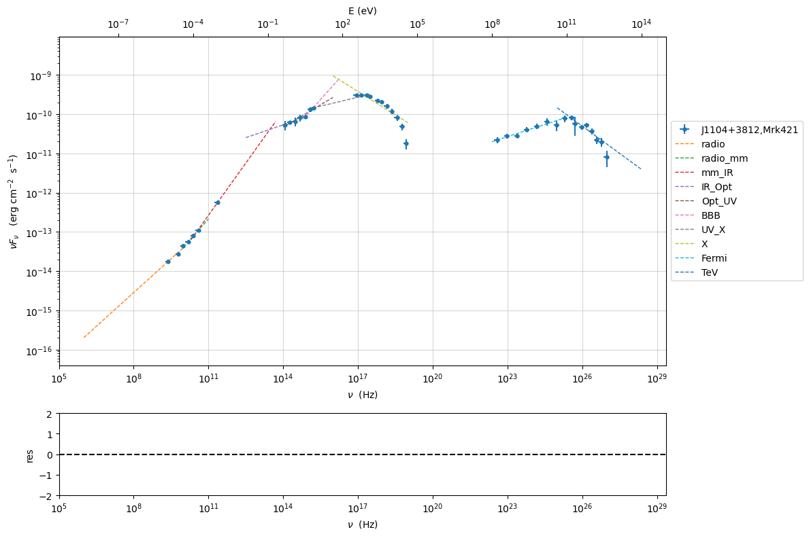
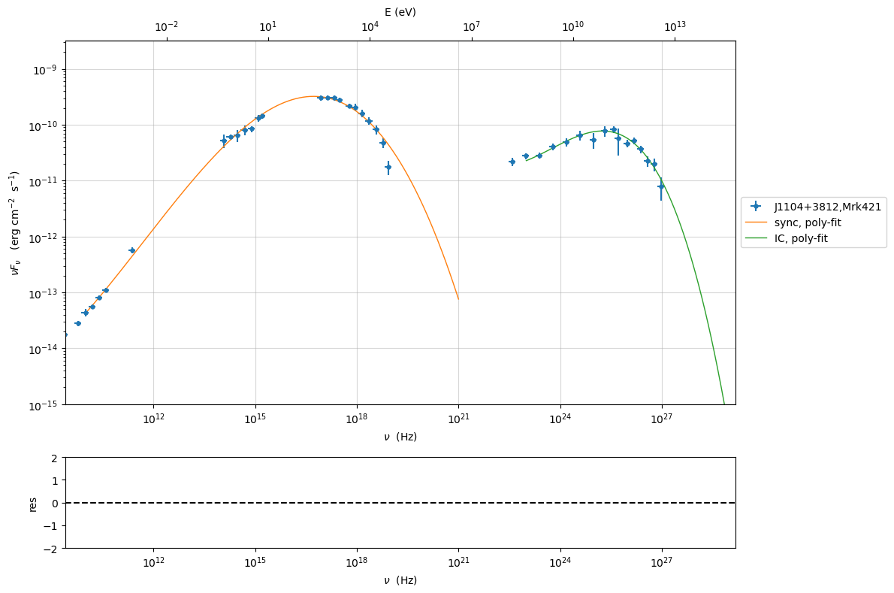

.. code:: ipython3

    import warnings
    warnings.filterwarnings('ignore')

.. code:: ipython3

    import numpy as np

.. code:: ipython3

    import jetset
    print('tested on jetset',jetset.__version__)

.. parsed-literal::

    tested on jetset 1.2.0

.. _depending_parameters:

Depending parameters
====================

In the following we show how to link parameters in the same model or
among different models, and how to make a paramter depending on other
parameters according to a mathematical expression.

Example: linked paramters for EBL
---------------------------------

.. code:: ipython3

    from jetset.jet_model import Jet
    from jetset.template_2Dmodel import EBLAbsorptionTemplate
    from jetset.model_manager import FitModel
    
    my_jet = Jet(electron_distribution='lppl', name='jet_flaring')
    my_jet.parameters.z_cosm.val = 0.01
    
    ebl_franceschini = EBLAbsorptionTemplate.from_name('Franceschini_2008')
    
    composite_model = FitModel(nu_size=500, name='EBL corrected')
    composite_model.add_component(my_jet)
    composite_model.add_component(ebl_franceschini)
    
    composite_model.show_pars()
    
    composite_model.link_par(par_name='z_cosm', from_model='Franceschini_2008', to_model='jet_flaring')
    v=0.03001
    my_jet.parameters.z_cosm.val = v
    assert (composite_model.Franceschini_2008.parameters.z_cosm.val==v)
    assert (composite_model.Franceschini_2008.parameters.z_cosm.linked==True)
    
    composite_model.composite_expr = '%s*%s'%(my_jet.name,ebl_franceschini.name)
    composite_model.eval()
    
    #if plot is True:
    #    composite_model.plot_model()
    
    composite_model.save_model('ebl_jet.pkl')
    new_composite_model=FitModel.load_model('ebl_jet.pkl')
    new_composite_model.show_pars()
    v=2.0
    new_composite_model.jet_flaring.parameters.z_cosm.val=v
    print('new_composite_model.Franceschini_2008.parameters.z_cosm.val',new_composite_model.Franceschini_2008.parameters.z_cosm.val,'v',v)
    assert (new_composite_model.Franceschini_2008.parameters.z_cosm.val == v)
    assert (new_composite_model.Franceschini_2008.parameters.z_cosm.linked == True)

.. raw:: html

    <i>Table length=12</i>
    <table id="table140214755501728-769597" class="table-striped table-bordered table-condensed">
    <thead><tr><th>model name</th><th>name</th><th>par type</th><th>units</th><th>val</th><th>phys. bound. min</th><th>phys. bound. max</th><th>log</th><th>frozen</th></tr></thead>
    <tr><td>jet_flaring</td><td>R</td><td>region_size</td><td>cm</td><td>5.000000e+15</td><td>1.000000e+03</td><td>1.000000e+30</td><td>False</td><td>False</td></tr>
    <tr><td>jet_flaring</td><td>R_H</td><td>region_position</td><td>cm</td><td>1.000000e+17</td><td>0.000000e+00</td><td>--</td><td>False</td><td>True</td></tr>
    <tr><td>jet_flaring</td><td>B</td><td>magnetic_field</td><td>gauss</td><td>1.000000e-01</td><td>0.000000e+00</td><td>--</td><td>False</td><td>False</td></tr>
    <tr><td>jet_flaring</td><td>beam_obj</td><td>beaming</td><td>lorentz-factor*</td><td>1.000000e+01</td><td>1.000000e-04</td><td>--</td><td>False</td><td>False</td></tr>
    <tr><td>jet_flaring</td><td>z_cosm</td><td>redshift</td><td></td><td>1.000000e-02</td><td>0.000000e+00</td><td>--</td><td>False</td><td>False</td></tr>
    <tr><td>jet_flaring</td><td>gmin</td><td>low-energy-cut-off</td><td>lorentz-factor*</td><td>2.000000e+00</td><td>1.000000e+00</td><td>1.000000e+09</td><td>False</td><td>False</td></tr>
    <tr><td>jet_flaring</td><td>gmax</td><td>high-energy-cut-off</td><td>lorentz-factor*</td><td>1.000000e+06</td><td>1.000000e+00</td><td>1.000000e+15</td><td>False</td><td>False</td></tr>
    <tr><td>jet_flaring</td><td>N</td><td>emitters_density</td><td>1 / cm3</td><td>1.000000e+02</td><td>0.000000e+00</td><td>--</td><td>False</td><td>False</td></tr>
    <tr><td>jet_flaring</td><td>gamma0_log_parab</td><td>turn-over-energy</td><td>lorentz-factor*</td><td>1.000000e+04</td><td>1.000000e+00</td><td>1.000000e+09</td><td>False</td><td>False</td></tr>
    <tr><td>jet_flaring</td><td>s</td><td>LE_spectral_slope</td><td></td><td>2.000000e+00</td><td>-1.000000e+01</td><td>1.000000e+01</td><td>False</td><td>False</td></tr>
    <tr><td>jet_flaring</td><td>r</td><td>spectral_curvature</td><td></td><td>4.000000e-01</td><td>-1.500000e+01</td><td>1.500000e+01</td><td>False</td><td>False</td></tr>
    <tr><td>Franceschini_2008</td><td>z_cosm</td><td>redshift</td><td></td><td>1.000000e+00</td><td>0.000000e+00</td><td>--</td><td>False</td><td>True</td></tr>
    </table>
    

.. parsed-literal::

    ==> par: z_cosm from model: Franceschini_2008 linked to same parameter in model jet_flaring
    ==> par: z_cosm from model: Franceschini_2008 linked to same parameter in model jet_flaring

.. raw:: html

    <i>Table length=12</i>
    <table id="table140214775576848-115138" class="table-striped table-bordered table-condensed">
    <thead><tr><th>model name</th><th>name</th><th>par type</th><th>units</th><th>val</th><th>phys. bound. min</th><th>phys. bound. max</th><th>log</th><th>frozen</th></tr></thead>
    <tr><td>jet_flaring</td><td>gmin</td><td>low-energy-cut-off</td><td>lorentz-factor*</td><td>2.000000e+00</td><td>1.000000e+00</td><td>1.000000e+09</td><td>False</td><td>False</td></tr>
    <tr><td>jet_flaring</td><td>gmax</td><td>high-energy-cut-off</td><td>lorentz-factor*</td><td>1.000000e+06</td><td>1.000000e+00</td><td>1.000000e+15</td><td>False</td><td>False</td></tr>
    <tr><td>jet_flaring</td><td>N</td><td>emitters_density</td><td>1 / cm3</td><td>1.000000e+02</td><td>0.000000e+00</td><td>--</td><td>False</td><td>False</td></tr>
    <tr><td>jet_flaring</td><td>gamma0_log_parab</td><td>turn-over-energy</td><td>lorentz-factor*</td><td>1.000000e+04</td><td>1.000000e+00</td><td>1.000000e+09</td><td>False</td><td>False</td></tr>
    <tr><td>jet_flaring</td><td>s</td><td>LE_spectral_slope</td><td></td><td>2.000000e+00</td><td>-1.000000e+01</td><td>1.000000e+01</td><td>False</td><td>False</td></tr>
    <tr><td>jet_flaring</td><td>r</td><td>spectral_curvature</td><td></td><td>4.000000e-01</td><td>-1.500000e+01</td><td>1.500000e+01</td><td>False</td><td>False</td></tr>
    <tr><td>jet_flaring</td><td>R</td><td>region_size</td><td>cm</td><td>5.000000e+15</td><td>1.000000e+03</td><td>1.000000e+30</td><td>False</td><td>False</td></tr>
    <tr><td>jet_flaring</td><td>R_H</td><td>region_position</td><td>cm</td><td>1.000000e+17</td><td>0.000000e+00</td><td>--</td><td>False</td><td>True</td></tr>
    <tr><td>jet_flaring</td><td>B</td><td>magnetic_field</td><td>gauss</td><td>1.000000e-01</td><td>0.000000e+00</td><td>--</td><td>False</td><td>False</td></tr>
    <tr><td>jet_flaring</td><td>beam_obj</td><td>beaming</td><td>lorentz-factor*</td><td>1.000000e+01</td><td>1.000000e-04</td><td>--</td><td>False</td><td>False</td></tr>
    <tr><td>jet_flaring</td><td>z_cosm(M)</td><td>redshift</td><td></td><td>3.001000e-02</td><td>0.000000e+00</td><td>--</td><td>False</td><td>False</td></tr>
    <tr><td>Franceschini_2008</td><td>z_cosm(L,jet_flaring)</td><td>redshift</td><td></td><td>--</td><td>--</td><td>--</td><td>False</td><td>True</td></tr>
    </table>
    

.. parsed-literal::

    new_composite_model.Franceschini_2008.parameters.z_cosm.val 2.0 v 2.0

Example: depending pars for bkn power-law emitters
--------------------------------------------------

here we create a custom ``bkn`` distribution where we impose a
functional dependence among the low and high-energy spectral index.

.. code:: ipython3

    from jetset.jet_emitters import EmittersDistribution
    import numpy as np
    
    
    
    from jetset.jet_model import Jet
    
    j = Jet(emitters_distribution='bkn')
    
    
    j.parameters

.. raw:: html

    <i>Table length=11</i>
    <table id="table140214780671360-654432" class="table-striped table-bordered table-condensed">
    <thead><tr><th>model name</th><th>name</th><th>par type</th><th>units</th><th>val</th><th>phys. bound. min</th><th>phys. bound. max</th><th>log</th><th>frozen</th></tr></thead>
    <tr><td>jet_leptonic</td><td>R</td><td>region_size</td><td>cm</td><td>5.000000e+15</td><td>1.000000e+03</td><td>1.000000e+30</td><td>False</td><td>False</td></tr>
    <tr><td>jet_leptonic</td><td>R_H</td><td>region_position</td><td>cm</td><td>1.000000e+17</td><td>0.000000e+00</td><td>--</td><td>False</td><td>True</td></tr>
    <tr><td>jet_leptonic</td><td>B</td><td>magnetic_field</td><td>gauss</td><td>1.000000e-01</td><td>0.000000e+00</td><td>--</td><td>False</td><td>False</td></tr>
    <tr><td>jet_leptonic</td><td>beam_obj</td><td>beaming</td><td>lorentz-factor*</td><td>1.000000e+01</td><td>1.000000e-04</td><td>--</td><td>False</td><td>False</td></tr>
    <tr><td>jet_leptonic</td><td>z_cosm</td><td>redshift</td><td></td><td>1.000000e-01</td><td>0.000000e+00</td><td>--</td><td>False</td><td>False</td></tr>
    <tr><td>jet_leptonic</td><td>gmin</td><td>low-energy-cut-off</td><td>lorentz-factor*</td><td>2.000000e+00</td><td>1.000000e+00</td><td>1.000000e+09</td><td>False</td><td>False</td></tr>
    <tr><td>jet_leptonic</td><td>gmax</td><td>high-energy-cut-off</td><td>lorentz-factor*</td><td>1.000000e+06</td><td>1.000000e+00</td><td>1.000000e+15</td><td>False</td><td>False</td></tr>
    <tr><td>jet_leptonic</td><td>N</td><td>emitters_density</td><td>1 / cm3</td><td>1.000000e+02</td><td>0.000000e+00</td><td>--</td><td>False</td><td>False</td></tr>
    <tr><td>jet_leptonic</td><td>gamma_break</td><td>turn-over-energy</td><td>lorentz-factor*</td><td>1.000000e+04</td><td>1.000000e+00</td><td>1.000000e+09</td><td>False</td><td>False</td></tr>
    <tr><td>jet_leptonic</td><td>p</td><td>LE_spectral_slope</td><td></td><td>2.500000e+00</td><td>-1.000000e+01</td><td>1.000000e+01</td><td>False</td><td>False</td></tr>
    <tr><td>jet_leptonic</td><td>p_1</td><td>HE_spectral_slope</td><td></td><td>3.500000e+00</td><td>-1.000000e+01</td><td>1.000000e+01</td><td>False</td><td>False</td></tr>
    </table>
    

.. parsed-literal::

    None

the functional dependence can be provided by a python function, where
the argument (``p`` in this case) is the same name as the parameter:

.. code:: ipython3

    def f_p(p):
        return p+1
    j.make_dependent_par(par='p_1',depends_on=['p'],par_expr=f_p)
    j.parameters.p.val=2
    np.testing.assert_allclose(j.parameters.p_1.val, j.parameters.p.val + 1)
    j.parameters

.. parsed-literal::

    ==> par p_1 is now depending on ['p'] according to expr:p_1 =
    def f_p(p):
        return p+1
    

.. raw:: html

    <i>Table length=11</i>
    <table id="table140214780671360-266093" class="table-striped table-bordered table-condensed">
    <thead><tr><th>model name</th><th>name</th><th>par type</th><th>units</th><th>val</th><th>phys. bound. min</th><th>phys. bound. max</th><th>log</th><th>frozen</th></tr></thead>
    <tr><td>jet_leptonic</td><td>R</td><td>region_size</td><td>cm</td><td>5.000000e+15</td><td>1.000000e+03</td><td>1.000000e+30</td><td>False</td><td>False</td></tr>
    <tr><td>jet_leptonic</td><td>R_H</td><td>region_position</td><td>cm</td><td>1.000000e+17</td><td>0.000000e+00</td><td>--</td><td>False</td><td>True</td></tr>
    <tr><td>jet_leptonic</td><td>B</td><td>magnetic_field</td><td>gauss</td><td>1.000000e-01</td><td>0.000000e+00</td><td>--</td><td>False</td><td>False</td></tr>
    <tr><td>jet_leptonic</td><td>beam_obj</td><td>beaming</td><td>lorentz-factor*</td><td>1.000000e+01</td><td>1.000000e-04</td><td>--</td><td>False</td><td>False</td></tr>
    <tr><td>jet_leptonic</td><td>z_cosm</td><td>redshift</td><td></td><td>1.000000e-01</td><td>0.000000e+00</td><td>--</td><td>False</td><td>False</td></tr>
    <tr><td>jet_leptonic</td><td>gmin</td><td>low-energy-cut-off</td><td>lorentz-factor*</td><td>2.000000e+00</td><td>1.000000e+00</td><td>1.000000e+09</td><td>False</td><td>False</td></tr>
    <tr><td>jet_leptonic</td><td>gmax</td><td>high-energy-cut-off</td><td>lorentz-factor*</td><td>1.000000e+06</td><td>1.000000e+00</td><td>1.000000e+15</td><td>False</td><td>False</td></tr>
    <tr><td>jet_leptonic</td><td>N</td><td>emitters_density</td><td>1 / cm3</td><td>1.000000e+02</td><td>0.000000e+00</td><td>--</td><td>False</td><td>False</td></tr>
    <tr><td>jet_leptonic</td><td>gamma_break</td><td>turn-over-energy</td><td>lorentz-factor*</td><td>1.000000e+04</td><td>1.000000e+00</td><td>1.000000e+09</td><td>False</td><td>False</td></tr>
    <tr><td>jet_leptonic</td><td>p(M)</td><td>LE_spectral_slope</td><td></td><td>2.000000e+00</td><td>-1.000000e+01</td><td>1.000000e+01</td><td>False</td><td>False</td></tr>
    <tr><td>jet_leptonic</td><td>*p_1(D,p)</td><td>HE_spectral_slope</td><td></td><td>3.000000e+00</td><td>-1.000000e+01</td><td>1.000000e+01</td><td>False</td><td>True</td></tr>
    </table>
    

.. parsed-literal::

    None

as you can notice, now a message is shown describing the dependence of
the parameters

It is also possible to set the dependence function as a string that can
be evaluated

.. code:: ipython3

    j.make_dependent_par(par='p_1',depends_on=['p'],par_expr='p+1')
    j.parameters.p.val=2
    np.testing.assert_allclose(j.parameters.p_1.val, j.parameters.p.val + 1)
    j.parameters

.. parsed-literal::

    ==> par p_1 is now depending on ['p'] according to expr:p_1 =
    p+1

.. raw:: html

    <i>Table length=11</i>
    <table id="table140214780671360-979576" class="table-striped table-bordered table-condensed">
    <thead><tr><th>model name</th><th>name</th><th>par type</th><th>units</th><th>val</th><th>phys. bound. min</th><th>phys. bound. max</th><th>log</th><th>frozen</th></tr></thead>
    <tr><td>jet_leptonic</td><td>R</td><td>region_size</td><td>cm</td><td>5.000000e+15</td><td>1.000000e+03</td><td>1.000000e+30</td><td>False</td><td>False</td></tr>
    <tr><td>jet_leptonic</td><td>R_H</td><td>region_position</td><td>cm</td><td>1.000000e+17</td><td>0.000000e+00</td><td>--</td><td>False</td><td>True</td></tr>
    <tr><td>jet_leptonic</td><td>B</td><td>magnetic_field</td><td>gauss</td><td>1.000000e-01</td><td>0.000000e+00</td><td>--</td><td>False</td><td>False</td></tr>
    <tr><td>jet_leptonic</td><td>beam_obj</td><td>beaming</td><td>lorentz-factor*</td><td>1.000000e+01</td><td>1.000000e-04</td><td>--</td><td>False</td><td>False</td></tr>
    <tr><td>jet_leptonic</td><td>z_cosm</td><td>redshift</td><td></td><td>1.000000e-01</td><td>0.000000e+00</td><td>--</td><td>False</td><td>False</td></tr>
    <tr><td>jet_leptonic</td><td>gmin</td><td>low-energy-cut-off</td><td>lorentz-factor*</td><td>2.000000e+00</td><td>1.000000e+00</td><td>1.000000e+09</td><td>False</td><td>False</td></tr>
    <tr><td>jet_leptonic</td><td>gmax</td><td>high-energy-cut-off</td><td>lorentz-factor*</td><td>1.000000e+06</td><td>1.000000e+00</td><td>1.000000e+15</td><td>False</td><td>False</td></tr>
    <tr><td>jet_leptonic</td><td>N</td><td>emitters_density</td><td>1 / cm3</td><td>1.000000e+02</td><td>0.000000e+00</td><td>--</td><td>False</td><td>False</td></tr>
    <tr><td>jet_leptonic</td><td>gamma_break</td><td>turn-over-energy</td><td>lorentz-factor*</td><td>1.000000e+04</td><td>1.000000e+00</td><td>1.000000e+09</td><td>False</td><td>False</td></tr>
    <tr><td>jet_leptonic</td><td>p(M)</td><td>LE_spectral_slope</td><td></td><td>2.000000e+00</td><td>-1.000000e+01</td><td>1.000000e+01</td><td>False</td><td>False</td></tr>
    <tr><td>jet_leptonic</td><td>*p_1(D,p)</td><td>HE_spectral_slope</td><td></td><td>3.000000e+00</td><td>-1.000000e+01</td><td>1.000000e+01</td><td>False</td><td>True</td></tr>
    </table>
    

.. parsed-literal::

    None

In principle, you can use strings for short expressions, and functions
for more complicated formulas.

You can print the actual expression/function for the depending parameter
using the ``print_par_expr`` method:

.. code:: ipython3

    j.parameters.p_1.print_par_expr

.. parsed-literal::

    ==> par p_1 is depending on ['p'] according to expr:   p_1 =
    p+1

.. code:: ipython3

    j.save_model('jet.pkl')
    new_jet=Jet.load_model('jet.pkl')

.. parsed-literal::

    ==> par p_1 is now depending on ['p'] according to expr:p_1 =
    p+1

.. raw:: html

    <i>Table length=11</i>
    <table id="table140214780205136-871756" class="table-striped table-bordered table-condensed">
    <thead><tr><th>model name</th><th>name</th><th>par type</th><th>units</th><th>val</th><th>phys. bound. min</th><th>phys. bound. max</th><th>log</th><th>frozen</th></tr></thead>
    <tr><td>jet_leptonic</td><td>gmin</td><td>low-energy-cut-off</td><td>lorentz-factor*</td><td>2.000000e+00</td><td>1.000000e+00</td><td>1.000000e+09</td><td>False</td><td>False</td></tr>
    <tr><td>jet_leptonic</td><td>gmax</td><td>high-energy-cut-off</td><td>lorentz-factor*</td><td>1.000000e+06</td><td>1.000000e+00</td><td>1.000000e+15</td><td>False</td><td>False</td></tr>
    <tr><td>jet_leptonic</td><td>N</td><td>emitters_density</td><td>1 / cm3</td><td>1.000000e+02</td><td>0.000000e+00</td><td>--</td><td>False</td><td>False</td></tr>
    <tr><td>jet_leptonic</td><td>gamma_break</td><td>turn-over-energy</td><td>lorentz-factor*</td><td>1.000000e+04</td><td>1.000000e+00</td><td>1.000000e+09</td><td>False</td><td>False</td></tr>
    <tr><td>jet_leptonic</td><td>p(M)</td><td>LE_spectral_slope</td><td></td><td>2.000000e+00</td><td>-1.000000e+01</td><td>1.000000e+01</td><td>False</td><td>False</td></tr>
    <tr><td>jet_leptonic</td><td>*p_1(D,p)</td><td>HE_spectral_slope</td><td></td><td>3.000000e+00</td><td>-1.000000e+01</td><td>1.000000e+01</td><td>False</td><td>True</td></tr>
    <tr><td>jet_leptonic</td><td>R</td><td>region_size</td><td>cm</td><td>5.000000e+15</td><td>1.000000e+03</td><td>1.000000e+30</td><td>False</td><td>False</td></tr>
    <tr><td>jet_leptonic</td><td>R_H</td><td>region_position</td><td>cm</td><td>1.000000e+17</td><td>0.000000e+00</td><td>--</td><td>False</td><td>True</td></tr>
    <tr><td>jet_leptonic</td><td>B</td><td>magnetic_field</td><td>gauss</td><td>1.000000e-01</td><td>0.000000e+00</td><td>--</td><td>False</td><td>False</td></tr>
    <tr><td>jet_leptonic</td><td>beam_obj</td><td>beaming</td><td>lorentz-factor*</td><td>1.000000e+01</td><td>1.000000e-04</td><td>--</td><td>False</td><td>False</td></tr>
    <tr><td>jet_leptonic</td><td>z_cosm</td><td>redshift</td><td></td><td>1.000000e-01</td><td>0.000000e+00</td><td>--</td><td>False</td><td>False</td></tr>
    </table>
    

.. code:: ipython3

    new_jet.parameters.p.val=2.5
    np.testing.assert_allclose(new_jet.parameters.p_1.val, new_jet.parameters.p.val + 1)
    new_jet.parameters

.. raw:: html

    <i>Table length=11</i>
    <table id="table140214780205136-920281" class="table-striped table-bordered table-condensed">
    <thead><tr><th>model name</th><th>name</th><th>par type</th><th>units</th><th>val</th><th>phys. bound. min</th><th>phys. bound. max</th><th>log</th><th>frozen</th></tr></thead>
    <tr><td>jet_leptonic</td><td>gmin</td><td>low-energy-cut-off</td><td>lorentz-factor*</td><td>2.000000e+00</td><td>1.000000e+00</td><td>1.000000e+09</td><td>False</td><td>False</td></tr>
    <tr><td>jet_leptonic</td><td>gmax</td><td>high-energy-cut-off</td><td>lorentz-factor*</td><td>1.000000e+06</td><td>1.000000e+00</td><td>1.000000e+15</td><td>False</td><td>False</td></tr>
    <tr><td>jet_leptonic</td><td>N</td><td>emitters_density</td><td>1 / cm3</td><td>1.000000e+02</td><td>0.000000e+00</td><td>--</td><td>False</td><td>False</td></tr>
    <tr><td>jet_leptonic</td><td>gamma_break</td><td>turn-over-energy</td><td>lorentz-factor*</td><td>1.000000e+04</td><td>1.000000e+00</td><td>1.000000e+09</td><td>False</td><td>False</td></tr>
    <tr><td>jet_leptonic</td><td>p(M)</td><td>LE_spectral_slope</td><td></td><td>2.500000e+00</td><td>-1.000000e+01</td><td>1.000000e+01</td><td>False</td><td>False</td></tr>
    <tr><td>jet_leptonic</td><td>*p_1(D,p)</td><td>HE_spectral_slope</td><td></td><td>3.500000e+00</td><td>-1.000000e+01</td><td>1.000000e+01</td><td>False</td><td>True</td></tr>
    <tr><td>jet_leptonic</td><td>R</td><td>region_size</td><td>cm</td><td>5.000000e+15</td><td>1.000000e+03</td><td>1.000000e+30</td><td>False</td><td>False</td></tr>
    <tr><td>jet_leptonic</td><td>R_H</td><td>region_position</td><td>cm</td><td>1.000000e+17</td><td>0.000000e+00</td><td>--</td><td>False</td><td>True</td></tr>
    <tr><td>jet_leptonic</td><td>B</td><td>magnetic_field</td><td>gauss</td><td>1.000000e-01</td><td>0.000000e+00</td><td>--</td><td>False</td><td>False</td></tr>
    <tr><td>jet_leptonic</td><td>beam_obj</td><td>beaming</td><td>lorentz-factor*</td><td>1.000000e+01</td><td>1.000000e-04</td><td>--</td><td>False</td><td>False</td></tr>
    <tr><td>jet_leptonic</td><td>z_cosm</td><td>redshift</td><td></td><td>1.000000e-01</td><td>0.000000e+00</td><td>--</td><td>False</td><td>False</td></tr>
    </table>
    

.. parsed-literal::

    None

Example depending par: Building a Jet model with B function of R_H and R_0
--------------------------------------------------------------------------

In this example we create a fuctional dependence among the paramters
``B``, ``R_H`` introducing user custom pararameters. Wewant that the
value of the mangentic field in the jet is a function or ``R_H``, and of
the initial value of ``B=B0`` at ``R=R_H0``, according to the
expression:

:math:`B=B_0(R_0/R_H)^{1.1}`

.. code:: ipython3

    jet=Jet(emitters_distribution='plc')
    fit_model_lsb=FitModel( jet=jet, name='SSC-best-fit-lsb',template=None)
    fit_model_lsb.jet_leptonic.parameters.beam_obj.fit_range = [5, 50]
    fit_model_lsb.jet_leptonic.parameters.R_H.val=5E17
    fit_model_lsb.jet_leptonic.parameters.R_H.frozen=False
    fit_model_lsb.jet_leptonic.parameters.R_H.fit_range = [1E15, 1E19]
    fit_model_lsb.jet_leptonic.parameters.R.fit_range = [10 ** 15.5, 10 ** 17.5]
    
    fit_model_lsb.jet_leptonic.add_user_par(name='B0',units='G',val=1E3,val_min=0,val_max=None)
    fit_model_lsb.jet_leptonic.add_user_par(name='R0', units='cm', val=5E13, val_min=0, val_max=None)
    fit_model_lsb.jet_leptonic.add_user_par(name='m_B', val=1, val_min=1, val_max=2)
    fit_model_lsb.jet_leptonic.parameters.R0.frozen=True
    fit_model_lsb.jet_leptonic.parameters.B0.frozen=True
    
    def par_func(R0,B0,R_H,m_B): 
        return B0*np.power((R0/R_H),m_B)
    
    fit_model_lsb.jet_leptonic.make_dependent_par(par='B', depends_on=['B0', 'R0', 'R_H','m_B'], par_expr=par_func)
    
    B0=fit_model_lsb.jet_leptonic.parameters.B0.val
    R0 = fit_model_lsb.jet_leptonic.parameters.R0.val
    R_H = fit_model_lsb.jet_leptonic.parameters.R_H.val
    m_B= fit_model_lsb.jet_leptonic.parameters.m_B.val
    
    np.testing.assert_allclose(fit_model_lsb.jet_leptonic.parameters.B.val, par_func(R0,B0,R_H,m_B))

.. parsed-literal::

    ==> par B is now depending on ['B0', 'R0', 'R_H', 'm_B'] according to expr:B =
    def par_func(R0,B0,R_H,m_B): 
        return B0*np.power((R0/R_H),m_B)
    

.. code:: ipython3

    
    fit_model_lsb.jet_leptonic.parameters

.. raw:: html

    <i>Table length=13</i>
    <table id="table140214780671840-279462" class="table-striped table-bordered table-condensed">
    <thead><tr><th>model name</th><th>name</th><th>par type</th><th>units</th><th>val</th><th>phys. bound. min</th><th>phys. bound. max</th><th>log</th><th>frozen</th></tr></thead>
    <tr><td>jet_leptonic</td><td>R</td><td>region_size</td><td>cm</td><td>5.000000e+15</td><td>1.000000e+03</td><td>1.000000e+30</td><td>False</td><td>False</td></tr>
    <tr><td>jet_leptonic</td><td>R_H(M)</td><td>region_position</td><td>cm</td><td>5.000000e+17</td><td>0.000000e+00</td><td>--</td><td>False</td><td>False</td></tr>
    <tr><td>jet_leptonic</td><td>*B(D,m_B)</td><td>magnetic_field</td><td>gauss</td><td>1.000000e-01</td><td>0.000000e+00</td><td>--</td><td>False</td><td>True</td></tr>
    <tr><td>jet_leptonic</td><td>beam_obj</td><td>beaming</td><td>lorentz-factor*</td><td>1.000000e+01</td><td>1.000000e-04</td><td>--</td><td>False</td><td>False</td></tr>
    <tr><td>jet_leptonic</td><td>z_cosm</td><td>redshift</td><td></td><td>1.000000e-01</td><td>0.000000e+00</td><td>--</td><td>False</td><td>False</td></tr>
    <tr><td>jet_leptonic</td><td>gmin</td><td>low-energy-cut-off</td><td>lorentz-factor*</td><td>2.000000e+00</td><td>1.000000e+00</td><td>1.000000e+09</td><td>False</td><td>False</td></tr>
    <tr><td>jet_leptonic</td><td>gmax</td><td>high-energy-cut-off</td><td>lorentz-factor*</td><td>1.000000e+06</td><td>1.000000e+00</td><td>1.000000e+15</td><td>False</td><td>False</td></tr>
    <tr><td>jet_leptonic</td><td>N</td><td>emitters_density</td><td>1 / cm3</td><td>1.000000e+02</td><td>0.000000e+00</td><td>--</td><td>False</td><td>False</td></tr>
    <tr><td>jet_leptonic</td><td>gamma_cut</td><td>turn-over-energy</td><td>lorentz-factor*</td><td>1.000000e+04</td><td>1.000000e+00</td><td>1.000000e+09</td><td>False</td><td>False</td></tr>
    <tr><td>jet_leptonic</td><td>p</td><td>LE_spectral_slope</td><td></td><td>2.000000e+00</td><td>-1.000000e+01</td><td>1.000000e+01</td><td>False</td><td>False</td></tr>
    <tr><td>jet_leptonic</td><td>B0(M)</td><td>user_defined</td><td>G</td><td>1.000000e+03</td><td>0.000000e+00</td><td>--</td><td>False</td><td>True</td></tr>
    <tr><td>jet_leptonic</td><td>R0(M)</td><td>user_defined</td><td>cm</td><td>5.000000e+13</td><td>0.000000e+00</td><td>--</td><td>False</td><td>True</td></tr>
    <tr><td>jet_leptonic</td><td>m_B(M)</td><td>user_defined</td><td></td><td>1.000000e+00</td><td>1.000000e+00</td><td>2.000000e+00</td><td>False</td><td>False</td></tr>
    </table>
    

.. parsed-literal::

    None

.. code:: ipython3

    fit_model_lsb.jet_leptonic.parameters

.. raw:: html

    <i>Table length=13</i>
    <table id="table140214780810288-197152" class="table-striped table-bordered table-condensed">
    <thead><tr><th>model name</th><th>name</th><th>par type</th><th>units</th><th>val</th><th>phys. bound. min</th><th>phys. bound. max</th><th>log</th><th>frozen</th></tr></thead>
    <tr><td>jet_leptonic</td><td>R</td><td>region_size</td><td>cm</td><td>5.000000e+15</td><td>1.000000e+03</td><td>1.000000e+30</td><td>False</td><td>False</td></tr>
    <tr><td>jet_leptonic</td><td>R_H(M)</td><td>region_position</td><td>cm</td><td>5.000000e+17</td><td>0.000000e+00</td><td>--</td><td>False</td><td>False</td></tr>
    <tr><td>jet_leptonic</td><td>*B(D,m_B)</td><td>magnetic_field</td><td>gauss</td><td>1.000000e-01</td><td>0.000000e+00</td><td>--</td><td>False</td><td>True</td></tr>
    <tr><td>jet_leptonic</td><td>beam_obj</td><td>beaming</td><td>lorentz-factor*</td><td>1.000000e+01</td><td>1.000000e-04</td><td>--</td><td>False</td><td>False</td></tr>
    <tr><td>jet_leptonic</td><td>z_cosm</td><td>redshift</td><td></td><td>1.000000e-01</td><td>0.000000e+00</td><td>--</td><td>False</td><td>False</td></tr>
    <tr><td>jet_leptonic</td><td>gmin</td><td>low-energy-cut-off</td><td>lorentz-factor*</td><td>2.000000e+00</td><td>1.000000e+00</td><td>1.000000e+09</td><td>False</td><td>False</td></tr>
    <tr><td>jet_leptonic</td><td>gmax</td><td>high-energy-cut-off</td><td>lorentz-factor*</td><td>1.000000e+06</td><td>1.000000e+00</td><td>1.000000e+15</td><td>False</td><td>False</td></tr>
    <tr><td>jet_leptonic</td><td>N</td><td>emitters_density</td><td>1 / cm3</td><td>1.000000e+02</td><td>0.000000e+00</td><td>--</td><td>False</td><td>False</td></tr>
    <tr><td>jet_leptonic</td><td>gamma_cut</td><td>turn-over-energy</td><td>lorentz-factor*</td><td>1.000000e+04</td><td>1.000000e+00</td><td>1.000000e+09</td><td>False</td><td>False</td></tr>
    <tr><td>jet_leptonic</td><td>p</td><td>LE_spectral_slope</td><td></td><td>2.000000e+00</td><td>-1.000000e+01</td><td>1.000000e+01</td><td>False</td><td>False</td></tr>
    <tr><td>jet_leptonic</td><td>B0(M)</td><td>user_defined</td><td>G</td><td>1.000000e+03</td><td>0.000000e+00</td><td>--</td><td>False</td><td>True</td></tr>
    <tr><td>jet_leptonic</td><td>R0(M)</td><td>user_defined</td><td>cm</td><td>5.000000e+13</td><td>0.000000e+00</td><td>--</td><td>False</td><td>True</td></tr>
    <tr><td>jet_leptonic</td><td>m_B(M)</td><td>user_defined</td><td></td><td>1.000000e+00</td><td>1.000000e+00</td><td>2.000000e+00</td><td>False</td><td>False</td></tr>
    </table>
    

.. parsed-literal::

    None

.. code:: ipython3

    fit_model_lsb.save_model('test.pkl')

.. code:: ipython3

    fit_model_lsb=FitModel.load_model('test.pkl')

.. parsed-literal::

    ==> par B is now depending on ['B0', 'R0', 'R_H', 'm_B'] according to expr:B =
    def par_func(R0,B0,R_H,m_B): 
        return B0*np.power((R0/R_H),m_B)
    

.. code:: ipython3

    B0=fit_model_lsb.jet_leptonic.parameters.B0.val
    R0 = fit_model_lsb.jet_leptonic.parameters.R0.val
    R_H = fit_model_lsb.jet_leptonic.parameters.R_H.val
    m_B= fit_model_lsb.jet_leptonic.parameters.m_B.val
    
    np.testing.assert_allclose(fit_model_lsb.jet_leptonic.parameters.B.val, par_func(R0,B0,R_H,m_B))

Example depending par: fitting with a Jet model with depending pars
-------------------------------------------------------------------

In this example we show how to use the previous model during a Fit

.. code:: ipython3

    from jetset.test_data_helper import  test_SEDs
    from jetset.data_loader import ObsData,Data
    from jetset.plot_sedfit import PlotSED
    from jetset.test_data_helper import  test_SEDs

.. code:: ipython3

    data=Data.from_file(test_SEDs[1])

.. code:: ipython3

    sed_data=ObsData(data_table=data)
    sed_data.group_data(bin_width=0.2)
    
    sed_data.add_systematics(0.1,[10.**6,10.**29])
    p=sed_data.plot_sed()

.. parsed-literal::

    ================================================================================
    
    ***  binning data  ***
    ---> N bins= 89
    ---> bin_widht= 0.2
    ================================================================================
    

.. image:: depending_pars_files/depending_pars_34_1.png

.. code:: ipython3

    from jetset.sed_shaper import  SEDShape
    my_shape=SEDShape(sed_data)
    my_shape.eval_indices(minimizer='lsb',silent=True)
    p=my_shape.plot_indices()

.. parsed-literal::

    ================================================================================
    
    *** evaluating spectral indices for data ***
    ================================================================================
    

.. code:: ipython3

    mm,best_fit=my_shape.sync_fit(check_host_gal_template=False,
                      Ep_start=None,
                      minimizer='lsb',
                      silent=True,
                      fit_range=[10.,21.])

.. parsed-literal::

    ================================================================================
    
    *** Log-Polynomial fitting of the synchrotron component ***
    ---> first blind fit run,  fit range: [10.0, 21.0]
    ---> class:  HSP
    
    
    

.. raw:: html

    <i>Table length=4</i>
    <table id="table140214770685600-358884" class="table-striped table-bordered table-condensed">
    <thead><tr><th>model name</th><th>name</th><th>val</th><th>bestfit val</th><th>err +</th><th>err -</th><th>start val</th><th>fit range min</th><th>fit range max</th><th>frozen</th></tr></thead>
    <tr><td>LogCubic</td><td>b</td><td>-1.545300e-01</td><td>-1.545300e-01</td><td>9.534795e-03</td><td>--</td><td>-1.000000e+00</td><td>-1.000000e+01</td><td>0.000000e+00</td><td>False</td></tr>
    <tr><td>LogCubic</td><td>c</td><td>-1.023245e-02</td><td>-1.023245e-02</td><td>1.433073e-03</td><td>--</td><td>-1.000000e+00</td><td>-1.000000e+01</td><td>1.000000e+01</td><td>False</td></tr>
    <tr><td>LogCubic</td><td>Ep</td><td>1.672267e+01</td><td>1.672267e+01</td><td>4.139942e-02</td><td>--</td><td>1.667039e+01</td><td>0.000000e+00</td><td>3.000000e+01</td><td>False</td></tr>
    <tr><td>LogCubic</td><td>Sp</td><td>-9.491659e+00</td><td>-9.491659e+00</td><td>2.515285e-02</td><td>--</td><td>-1.000000e+01</td><td>-3.000000e+01</td><td>0.000000e+00</td><td>False</td></tr>
    </table>
    

.. parsed-literal::

    ---> sync       nu_p=+1.672267e+01 (err=+4.139942e-02)  nuFnu_p=-9.491659e+00 (err=+2.515285e-02) curv.=-1.545300e-01 (err=+9.534795e-03)
    ================================================================================
    

.. code:: ipython3

    my_shape.IC_fit(fit_range=[23.,29.],minimizer='minuit',silent=True)
    p=my_shape.plot_shape_fit()
    p.setlim(y_min=1E-15)

.. parsed-literal::

    ================================================================================
    
    *** Log-Polynomial fitting of the IC component ***
    ---> fit range: [23.0, 29.0]
    ---> LogCubic fit
    
    

.. raw:: html

    <i>Table length=4</i>
    <table id="table140214780812544-389981" class="table-striped table-bordered table-condensed">
    <thead><tr><th>model name</th><th>name</th><th>val</th><th>bestfit val</th><th>err +</th><th>err -</th><th>start val</th><th>fit range min</th><th>fit range max</th><th>frozen</th></tr></thead>
    <tr><td>LogCubic</td><td>b</td><td>-2.098186e-01</td><td>-2.098186e-01</td><td>3.133032e-02</td><td>--</td><td>-1.000000e+00</td><td>-1.000000e+01</td><td>0.000000e+00</td><td>False</td></tr>
    <tr><td>LogCubic</td><td>c</td><td>-4.661868e-02</td><td>-4.661868e-02</td><td>2.178352e-02</td><td>--</td><td>-1.000000e+00</td><td>-1.000000e+01</td><td>1.000000e+01</td><td>False</td></tr>
    <tr><td>LogCubic</td><td>Ep</td><td>2.524926e+01</td><td>2.524926e+01</td><td>1.147759e-01</td><td>--</td><td>2.529412e+01</td><td>0.000000e+00</td><td>3.000000e+01</td><td>False</td></tr>
    <tr><td>LogCubic</td><td>Sp</td><td>-1.011085e+01</td><td>-1.011085e+01</td><td>3.498963e-02</td><td>--</td><td>-1.000000e+01</td><td>-3.000000e+01</td><td>0.000000e+00</td><td>False</td></tr>
    </table>
    

.. parsed-literal::

    ---> IC         nu_p=+2.524926e+01 (err=+1.147759e-01)  nuFnu_p=-1.011085e+01 (err=+3.498963e-02) curv.=-2.098186e-01 (err=+3.133032e-02)
    ================================================================================
    

.. code:: ipython3

    from jetset.obs_constrain import ObsConstrain
    from jetset.model_manager import  FitModel
    sed_obspar=ObsConstrain(beaming=25,
                            B_range=[0.001,0.1],
                            distr_e='lppl',
                            t_var_sec=3*86400,
                            nu_cut_IR=1E12,
                            SEDShape=my_shape)
    
    
    prefit_jet=sed_obspar.constrain_SSC_model(electron_distribution_log_values=False,silent=True)
    prefit_jet.save_model('prefit_jet.pkl')

.. parsed-literal::

    ================================================================================
    
    ***  constrains parameters from observable ***
    

.. raw:: html

    <i>Table length=11</i>
    <table id="table140214300841728-359429" class="table-striped table-bordered table-condensed">
    <thead><tr><th>model name</th><th>name</th><th>par type</th><th>units</th><th>val</th><th>phys. bound. min</th><th>phys. bound. max</th><th>log</th><th>frozen</th></tr></thead>
    <tr><td>jet_leptonic</td><td>R</td><td>region_size</td><td>cm</td><td>3.112712e+16</td><td>1.000000e+03</td><td>1.000000e+30</td><td>False</td><td>False</td></tr>
    <tr><td>jet_leptonic</td><td>R_H</td><td>region_position</td><td>cm</td><td>1.000000e+17</td><td>0.000000e+00</td><td>--</td><td>False</td><td>True</td></tr>
    <tr><td>jet_leptonic</td><td>B</td><td>magnetic_field</td><td>gauss</td><td>5.050000e-02</td><td>0.000000e+00</td><td>--</td><td>False</td><td>False</td></tr>
    <tr><td>jet_leptonic</td><td>beam_obj</td><td>beaming</td><td>lorentz-factor*</td><td>2.500000e+01</td><td>1.000000e-04</td><td>--</td><td>False</td><td>False</td></tr>
    <tr><td>jet_leptonic</td><td>z_cosm</td><td>redshift</td><td></td><td>3.080000e-02</td><td>0.000000e+00</td><td>--</td><td>False</td><td>False</td></tr>
    <tr><td>jet_leptonic</td><td>gmin</td><td>low-energy-cut-off</td><td>lorentz-factor*</td><td>4.697542e+02</td><td>1.000000e+00</td><td>1.000000e+09</td><td>False</td><td>False</td></tr>
    <tr><td>jet_leptonic</td><td>gmax</td><td>high-energy-cut-off</td><td>lorentz-factor*</td><td>1.373160e+06</td><td>1.000000e+00</td><td>1.000000e+15</td><td>False</td><td>False</td></tr>
    <tr><td>jet_leptonic</td><td>N</td><td>emitters_density</td><td>1 / cm3</td><td>9.060842e-01</td><td>0.000000e+00</td><td>--</td><td>False</td><td>False</td></tr>
    <tr><td>jet_leptonic</td><td>gamma0_log_parab</td><td>turn-over-energy</td><td>lorentz-factor*</td><td>3.188500e+04</td><td>1.000000e+00</td><td>1.000000e+09</td><td>False</td><td>False</td></tr>
    <tr><td>jet_leptonic</td><td>s</td><td>LE_spectral_slope</td><td></td><td>2.181578e+00</td><td>-1.000000e+01</td><td>1.000000e+01</td><td>False</td><td>False</td></tr>
    <tr><td>jet_leptonic</td><td>r</td><td>spectral_curvature</td><td></td><td>7.726502e-01</td><td>-1.500000e+01</td><td>1.500000e+01</td><td>False</td><td>False</td></tr>
    </table>
    

.. parsed-literal::

    
    ================================================================================
    

.. code:: ipython3

    from jetset.minimizer import fit_SED,ModelMinimizer
    
    from jetset.model_manager import  FitModel
    from jetset.jet_model import Jet
    prefit_jet=Jet.load_model('prefit_jet.pkl')

.. raw:: html

    <i>Table length=11</i>
    <table id="table140214305792112-238333" class="table-striped table-bordered table-condensed">
    <thead><tr><th>model name</th><th>name</th><th>par type</th><th>units</th><th>val</th><th>phys. bound. min</th><th>phys. bound. max</th><th>log</th><th>frozen</th></tr></thead>
    <tr><td>jet_leptonic</td><td>gmin</td><td>low-energy-cut-off</td><td>lorentz-factor*</td><td>4.697542e+02</td><td>1.000000e+00</td><td>1.000000e+09</td><td>False</td><td>False</td></tr>
    <tr><td>jet_leptonic</td><td>gmax</td><td>high-energy-cut-off</td><td>lorentz-factor*</td><td>1.373160e+06</td><td>1.000000e+00</td><td>1.000000e+15</td><td>False</td><td>False</td></tr>
    <tr><td>jet_leptonic</td><td>N</td><td>emitters_density</td><td>1 / cm3</td><td>9.060842e-01</td><td>0.000000e+00</td><td>--</td><td>False</td><td>False</td></tr>
    <tr><td>jet_leptonic</td><td>gamma0_log_parab</td><td>turn-over-energy</td><td>lorentz-factor*</td><td>3.188500e+04</td><td>1.000000e+00</td><td>1.000000e+09</td><td>False</td><td>False</td></tr>
    <tr><td>jet_leptonic</td><td>s</td><td>LE_spectral_slope</td><td></td><td>2.181578e+00</td><td>-1.000000e+01</td><td>1.000000e+01</td><td>False</td><td>False</td></tr>
    <tr><td>jet_leptonic</td><td>r</td><td>spectral_curvature</td><td></td><td>7.726502e-01</td><td>-1.500000e+01</td><td>1.500000e+01</td><td>False</td><td>False</td></tr>
    <tr><td>jet_leptonic</td><td>R</td><td>region_size</td><td>cm</td><td>3.112712e+16</td><td>1.000000e+03</td><td>1.000000e+30</td><td>False</td><td>False</td></tr>
    <tr><td>jet_leptonic</td><td>R_H</td><td>region_position</td><td>cm</td><td>1.000000e+17</td><td>0.000000e+00</td><td>--</td><td>False</td><td>True</td></tr>
    <tr><td>jet_leptonic</td><td>B</td><td>magnetic_field</td><td>gauss</td><td>5.050000e-02</td><td>0.000000e+00</td><td>--</td><td>False</td><td>False</td></tr>
    <tr><td>jet_leptonic</td><td>beam_obj</td><td>beaming</td><td>lorentz-factor*</td><td>2.500000e+01</td><td>1.000000e-04</td><td>--</td><td>False</td><td>False</td></tr>
    <tr><td>jet_leptonic</td><td>z_cosm</td><td>redshift</td><td></td><td>3.080000e-02</td><td>0.000000e+00</td><td>--</td><td>False</td><td>False</td></tr>
    </table>
    

.. code:: ipython3

    fit_model=FitModel( jet=prefit_jet, name='SSC-best-fit-lsb',template=None)
    fit_model.parameters

.. raw:: html

    <i>Table length=11</i>
    <table id="table140214301558288-493576" class="table-striped table-bordered table-condensed">
    <thead><tr><th>model name</th><th>name</th><th>par type</th><th>units</th><th>val</th><th>phys. bound. min</th><th>phys. bound. max</th><th>log</th><th>frozen</th></tr></thead>
    <tr><td>jet_leptonic</td><td>gmin</td><td>low-energy-cut-off</td><td>lorentz-factor*</td><td>4.697542e+02</td><td>1.000000e+00</td><td>1.000000e+09</td><td>False</td><td>False</td></tr>
    <tr><td>jet_leptonic</td><td>gmax</td><td>high-energy-cut-off</td><td>lorentz-factor*</td><td>1.373160e+06</td><td>1.000000e+00</td><td>1.000000e+15</td><td>False</td><td>False</td></tr>
    <tr><td>jet_leptonic</td><td>N</td><td>emitters_density</td><td>1 / cm3</td><td>9.060842e-01</td><td>0.000000e+00</td><td>--</td><td>False</td><td>False</td></tr>
    <tr><td>jet_leptonic</td><td>gamma0_log_parab</td><td>turn-over-energy</td><td>lorentz-factor*</td><td>3.188500e+04</td><td>1.000000e+00</td><td>1.000000e+09</td><td>False</td><td>False</td></tr>
    <tr><td>jet_leptonic</td><td>s</td><td>LE_spectral_slope</td><td></td><td>2.181578e+00</td><td>-1.000000e+01</td><td>1.000000e+01</td><td>False</td><td>False</td></tr>
    <tr><td>jet_leptonic</td><td>r</td><td>spectral_curvature</td><td></td><td>7.726502e-01</td><td>-1.500000e+01</td><td>1.500000e+01</td><td>False</td><td>False</td></tr>
    <tr><td>jet_leptonic</td><td>R</td><td>region_size</td><td>cm</td><td>3.112712e+16</td><td>1.000000e+03</td><td>1.000000e+30</td><td>False</td><td>False</td></tr>
    <tr><td>jet_leptonic</td><td>R_H</td><td>region_position</td><td>cm</td><td>1.000000e+17</td><td>0.000000e+00</td><td>--</td><td>False</td><td>True</td></tr>
    <tr><td>jet_leptonic</td><td>B</td><td>magnetic_field</td><td>gauss</td><td>5.050000e-02</td><td>0.000000e+00</td><td>--</td><td>False</td><td>False</td></tr>
    <tr><td>jet_leptonic</td><td>beam_obj</td><td>beaming</td><td>lorentz-factor*</td><td>2.500000e+01</td><td>1.000000e-04</td><td>--</td><td>False</td><td>False</td></tr>
    <tr><td>jet_leptonic</td><td>z_cosm</td><td>redshift</td><td></td><td>3.080000e-02</td><td>0.000000e+00</td><td>--</td><td>False</td><td>False</td></tr>
    </table>
    

.. parsed-literal::

    None

.. code:: ipython3

    fit_model.jet_leptonic.parameters.beam_obj.fit_range = [5, 50]
    fit_model.jet_leptonic.parameters.R_H.val=5E17
    fit_model.jet_leptonic.parameters.R_H.frozen=False
    fit_model.jet_leptonic.parameters.R_H.fit_range = [1E15, 1E19]
    fit_model.jet_leptonic.parameters.R.fit_range = [10 ** 15.5, 10 ** 17.5]
    fit_model.jet_leptonic.parameters.gamma0_log_parab.fit_range = [1E3,1E6]
    fit_model.jet_leptonic.parameters.gmin.fit_range = [10,1000]
    fit_model.jet_leptonic.parameters.gmax.fit_range = [1E5,1E8]
    
    fit_model.jet_leptonic.add_user_par(name='B0',units='G',val=1E3,val_min=0,val_max=None)
    fit_model.jet_leptonic.add_user_par(name='R0', units='cm', val=5E13, val_min=0, val_max=None)
    fit_model.jet_leptonic.add_user_par(name='m_B', val=1, val_min=1, val_max=2)
    fit_model.jet_leptonic.parameters.R0.frozen=True
    fit_model.jet_leptonic.parameters.B0.frozen=True
    
    def par_func(R0,B0,R_H,m_B): 
        return B0*np.power((R0/R_H),m_B)
    
    fit_model.jet_leptonic.make_dependent_par(par='B', depends_on=['B0', 'R0', 'R_H','m_B'], par_expr=par_func)
    fit_model.parameters

.. parsed-literal::

    ==> par B is now depending on ['B0', 'R0', 'R_H', 'm_B'] according to expr:B =
    def par_func(R0,B0,R_H,m_B): 
        return B0*np.power((R0/R_H),m_B)
    

.. raw:: html

    <i>Table length=14</i>
    <table id="table140214301558432-609837" class="table-striped table-bordered table-condensed">
    <thead><tr><th>model name</th><th>name</th><th>par type</th><th>units</th><th>val</th><th>phys. bound. min</th><th>phys. bound. max</th><th>log</th><th>frozen</th></tr></thead>
    <tr><td>jet_leptonic</td><td>gmin</td><td>low-energy-cut-off</td><td>lorentz-factor*</td><td>4.697542e+02</td><td>1.000000e+00</td><td>1.000000e+09</td><td>False</td><td>False</td></tr>
    <tr><td>jet_leptonic</td><td>gmax</td><td>high-energy-cut-off</td><td>lorentz-factor*</td><td>1.373160e+06</td><td>1.000000e+00</td><td>1.000000e+15</td><td>False</td><td>False</td></tr>
    <tr><td>jet_leptonic</td><td>N</td><td>emitters_density</td><td>1 / cm3</td><td>9.060842e-01</td><td>0.000000e+00</td><td>--</td><td>False</td><td>False</td></tr>
    <tr><td>jet_leptonic</td><td>gamma0_log_parab</td><td>turn-over-energy</td><td>lorentz-factor*</td><td>3.188500e+04</td><td>1.000000e+00</td><td>1.000000e+09</td><td>False</td><td>False</td></tr>
    <tr><td>jet_leptonic</td><td>s</td><td>LE_spectral_slope</td><td></td><td>2.181578e+00</td><td>-1.000000e+01</td><td>1.000000e+01</td><td>False</td><td>False</td></tr>
    <tr><td>jet_leptonic</td><td>r</td><td>spectral_curvature</td><td></td><td>7.726502e-01</td><td>-1.500000e+01</td><td>1.500000e+01</td><td>False</td><td>False</td></tr>
    <tr><td>jet_leptonic</td><td>R</td><td>region_size</td><td>cm</td><td>3.112712e+16</td><td>1.000000e+03</td><td>1.000000e+30</td><td>False</td><td>False</td></tr>
    <tr><td>jet_leptonic</td><td>R_H(M)</td><td>region_position</td><td>cm</td><td>5.000000e+17</td><td>0.000000e+00</td><td>--</td><td>False</td><td>False</td></tr>
    <tr><td>jet_leptonic</td><td>*B(D,m_B)</td><td>magnetic_field</td><td>gauss</td><td>1.000000e-01</td><td>0.000000e+00</td><td>--</td><td>False</td><td>True</td></tr>
    <tr><td>jet_leptonic</td><td>beam_obj</td><td>beaming</td><td>lorentz-factor*</td><td>2.500000e+01</td><td>1.000000e-04</td><td>--</td><td>False</td><td>False</td></tr>
    <tr><td>jet_leptonic</td><td>z_cosm</td><td>redshift</td><td></td><td>3.080000e-02</td><td>0.000000e+00</td><td>--</td><td>False</td><td>False</td></tr>
    <tr><td>jet_leptonic</td><td>B0(M)</td><td>user_defined</td><td>G</td><td>1.000000e+03</td><td>0.000000e+00</td><td>--</td><td>False</td><td>True</td></tr>
    <tr><td>jet_leptonic</td><td>R0(M)</td><td>user_defined</td><td>cm</td><td>5.000000e+13</td><td>0.000000e+00</td><td>--</td><td>False</td><td>True</td></tr>
    <tr><td>jet_leptonic</td><td>m_B(M)</td><td>user_defined</td><td></td><td>1.000000e+00</td><td>1.000000e+00</td><td>2.000000e+00</td><td>False</td><td>False</td></tr>
    </table>
    

.. parsed-literal::

    None

.. code:: ipython3

    %matplotlib inline
    import matplotlib.pyplot as plt
    
    plt.figure(dpi=150)
    R_H_array=np.logspace(13,18,100)
    B_array=np.zeros(R_H_array.shape)
    for ID,R_H in enumerate(R_H_array):
        fit_model_lsb.jet_leptonic.parameters.R_H.val=R_H
        B_array[ID]=fit_model_lsb.jet_leptonic.parameters.B.val
    
    plt.loglog(R_H_array,B_array)
    plt.xlabel('R_H (cm)')
    plt.ylabel('B (G)')

.. parsed-literal::

    Text(0, 0.5, 'B (G)')

.. image:: depending_pars_files/depending_pars_42_1.png

.. code:: ipython3

    fit_model.jet_leptonic.parameters.R_H.val=5E17

.. code:: ipython3

    fit_model.parameters

.. raw:: html

    <i>Table length=14</i>
    <table id="table140214301377584-532919" class="table-striped table-bordered table-condensed">
    <thead><tr><th>model name</th><th>name</th><th>par type</th><th>units</th><th>val</th><th>phys. bound. min</th><th>phys. bound. max</th><th>log</th><th>frozen</th></tr></thead>
    <tr><td>jet_leptonic</td><td>gmin</td><td>low-energy-cut-off</td><td>lorentz-factor*</td><td>4.697542e+02</td><td>1.000000e+00</td><td>1.000000e+09</td><td>False</td><td>False</td></tr>
    <tr><td>jet_leptonic</td><td>gmax</td><td>high-energy-cut-off</td><td>lorentz-factor*</td><td>1.373160e+06</td><td>1.000000e+00</td><td>1.000000e+15</td><td>False</td><td>False</td></tr>
    <tr><td>jet_leptonic</td><td>N</td><td>emitters_density</td><td>1 / cm3</td><td>9.060842e-01</td><td>0.000000e+00</td><td>--</td><td>False</td><td>False</td></tr>
    <tr><td>jet_leptonic</td><td>gamma0_log_parab</td><td>turn-over-energy</td><td>lorentz-factor*</td><td>3.188500e+04</td><td>1.000000e+00</td><td>1.000000e+09</td><td>False</td><td>False</td></tr>
    <tr><td>jet_leptonic</td><td>s</td><td>LE_spectral_slope</td><td></td><td>2.181578e+00</td><td>-1.000000e+01</td><td>1.000000e+01</td><td>False</td><td>False</td></tr>
    <tr><td>jet_leptonic</td><td>r</td><td>spectral_curvature</td><td></td><td>7.726502e-01</td><td>-1.500000e+01</td><td>1.500000e+01</td><td>False</td><td>False</td></tr>
    <tr><td>jet_leptonic</td><td>R</td><td>region_size</td><td>cm</td><td>3.112712e+16</td><td>1.000000e+03</td><td>1.000000e+30</td><td>False</td><td>False</td></tr>
    <tr><td>jet_leptonic</td><td>R_H(M)</td><td>region_position</td><td>cm</td><td>5.000000e+17</td><td>0.000000e+00</td><td>--</td><td>False</td><td>False</td></tr>
    <tr><td>jet_leptonic</td><td>*B(D,m_B)</td><td>magnetic_field</td><td>gauss</td><td>1.000000e-01</td><td>0.000000e+00</td><td>--</td><td>False</td><td>True</td></tr>
    <tr><td>jet_leptonic</td><td>beam_obj</td><td>beaming</td><td>lorentz-factor*</td><td>2.500000e+01</td><td>1.000000e-04</td><td>--</td><td>False</td><td>False</td></tr>
    <tr><td>jet_leptonic</td><td>z_cosm</td><td>redshift</td><td></td><td>3.080000e-02</td><td>0.000000e+00</td><td>--</td><td>False</td><td>False</td></tr>
    <tr><td>jet_leptonic</td><td>B0(M)</td><td>user_defined</td><td>G</td><td>1.000000e+03</td><td>0.000000e+00</td><td>--</td><td>False</td><td>True</td></tr>
    <tr><td>jet_leptonic</td><td>R0(M)</td><td>user_defined</td><td>cm</td><td>5.000000e+13</td><td>0.000000e+00</td><td>--</td><td>False</td><td>True</td></tr>
    <tr><td>jet_leptonic</td><td>m_B(M)</td><td>user_defined</td><td></td><td>1.000000e+00</td><td>1.000000e+00</td><td>2.000000e+00</td><td>False</td><td>False</td></tr>
    </table>
    

.. parsed-literal::

    None

As a resuslt of the best fit modeling, we are able to determine the
value of ``R_H``. We now perform the fit with minuit to get a better
estimate of the errors

.. code:: ipython3

    model_minimizer_minuit=ModelMinimizer('minuit')

.. code:: ipython3

    best_fit_minuit=model_minimizer_minuit.fit(fit_model,
                                         sed_data,
                                         1E11,
                                         1E29,
                                         fitname='SSC-best-fit-minuit',
                                         repeat=3)

.. parsed-literal::

    filtering data in fit range = [1.000000e+11,1.000000e+29]
    data length 35
    ================================================================================
    
    *** start fit process ***
    ----- 
    fit run: 0

.. parsed-literal::

    0it [00:00, ?it/s]

.. parsed-literal::

    - best chisq=1.55264e+01
    
    fit run: 1
    - old chisq=1.55264e+01

.. parsed-literal::

    0it [00:00, ?it/s]

.. parsed-literal::

    - best chisq=1.55263e+01
    
    fit run: 2
    - old chisq=1.55263e+01

.. parsed-literal::

    0it [00:00, ?it/s]

.. parsed-literal::

    - best chisq=1.55263e+01
    
    -------------------------------------------------------------------------
    Fit report
    
    Model: SSC-best-fit-minuit

.. raw:: html

    <i>Table length=14</i>
    <table id="table140214273883200-20425" class="table-striped table-bordered table-condensed">
    <thead><tr><th>model name</th><th>name</th><th>par type</th><th>units</th><th>val</th><th>phys. bound. min</th><th>phys. bound. max</th><th>log</th><th>frozen</th></tr></thead>
    <tr><td>jet_leptonic</td><td>gmin</td><td>low-energy-cut-off</td><td>lorentz-factor*</td><td>5.707170e+02</td><td>1.000000e+00</td><td>1.000000e+09</td><td>False</td><td>False</td></tr>
    <tr><td>jet_leptonic</td><td>gmax</td><td>high-energy-cut-off</td><td>lorentz-factor*</td><td>6.628146e+05</td><td>1.000000e+00</td><td>1.000000e+15</td><td>False</td><td>False</td></tr>
    <tr><td>jet_leptonic</td><td>N</td><td>emitters_density</td><td>1 / cm3</td><td>9.096259e-01</td><td>0.000000e+00</td><td>--</td><td>False</td><td>False</td></tr>
    <tr><td>jet_leptonic</td><td>gamma0_log_parab</td><td>turn-over-energy</td><td>lorentz-factor*</td><td>3.542531e+04</td><td>1.000000e+00</td><td>1.000000e+09</td><td>False</td><td>False</td></tr>
    <tr><td>jet_leptonic</td><td>s</td><td>LE_spectral_slope</td><td></td><td>2.275366e+00</td><td>-1.000000e+01</td><td>1.000000e+01</td><td>False</td><td>False</td></tr>
    <tr><td>jet_leptonic</td><td>r</td><td>spectral_curvature</td><td></td><td>7.219607e-01</td><td>-1.500000e+01</td><td>1.500000e+01</td><td>False</td><td>False</td></tr>
    <tr><td>jet_leptonic</td><td>R</td><td>region_size</td><td>cm</td><td>3.022039e+16</td><td>1.000000e+03</td><td>1.000000e+30</td><td>False</td><td>False</td></tr>
    <tr><td>jet_leptonic</td><td>R_H(M)</td><td>region_position</td><td>cm</td><td>6.570078e+17</td><td>0.000000e+00</td><td>--</td><td>False</td><td>False</td></tr>
    <tr><td>jet_leptonic</td><td>*B(D,m_B)</td><td>magnetic_field</td><td>gauss</td><td>4.997430e-02</td><td>0.000000e+00</td><td>--</td><td>False</td><td>True</td></tr>
    <tr><td>jet_leptonic</td><td>beam_obj</td><td>beaming</td><td>lorentz-factor*</td><td>4.643401e+01</td><td>1.000000e-04</td><td>--</td><td>False</td><td>False</td></tr>
    <tr><td>jet_leptonic</td><td>z_cosm</td><td>redshift</td><td></td><td>9.556801e-02</td><td>0.000000e+00</td><td>--</td><td>False</td><td>False</td></tr>
    <tr><td>jet_leptonic</td><td>B0(M)</td><td>user_defined</td><td>G</td><td>1.000000e+03</td><td>0.000000e+00</td><td>--</td><td>False</td><td>True</td></tr>
    <tr><td>jet_leptonic</td><td>R0(M)</td><td>user_defined</td><td>cm</td><td>5.000000e+13</td><td>0.000000e+00</td><td>--</td><td>False</td><td>True</td></tr>
    <tr><td>jet_leptonic</td><td>m_B(M)</td><td>user_defined</td><td></td><td>1.044348e+00</td><td>1.000000e+00</td><td>2.000000e+00</td><td>False</td><td>False</td></tr>
    </table>
    

.. parsed-literal::

    
    converged=True
    calls=187
    mesg=

.. raw:: html

    <table>
        <tr>
            <td colspan="2" style="text-align:left" title="Minimum value of function"> FCN = 15.53 </td>
            <td colspan="3" style="text-align:center" title="No. of function evaluations in last call and total number"> Nfcn = 187 </td>
        </tr>
        <tr>
            <td colspan="2" style="text-align:left" title="Estimated distance to minimum and goal"> EDM = 0.000156 (Goal: 0.0002) </td>
            <td colspan="3" style="text-align:center" title="No. of gradient evaluations in last call and total number">  </td>
        </tr>
        <tr>
            <td style="text-align:center;background-color:#92CCA6;color:black"> Valid Minimum </td>
            <td style="text-align:center;background-color:#92CCA6;color:black"> Valid Parameters </td>
            <td colspan="3" style="text-align:center;background-color:#92CCA6;color:black"> No Parameters at limit </td>
        </tr>
        <tr>
            <td colspan="2" style="text-align:center;background-color:#92CCA6;color:black"> Below EDM threshold (goal x 10) </td>
            <td colspan="3" style="text-align:center;background-color:#92CCA6;color:black"> Below call limit </td>
        </tr>
        <tr>
            <td style="text-align:center;background-color:#92CCA6;color:black"> Covariance </td>
            <td style="text-align:center;background-color:#92CCA6;color:black"> Hesse ok </td>
            <td style="text-align:center;background-color:#FFF79A;color:black" title="Is covariance matrix accurate?"> APPROXIMATE </td>
            <td style="text-align:center;background-color:#c15ef7;color:black" title="Is covariance matrix positive definite?"> NOT pos. def. </td>
            <td style="text-align:center;background-color:#c15ef7;color:black" title="Was positive definiteness enforced by Minuit?"> FORCED </td>
        </tr>
    </table><table>
        <tr>
            <td></td>
            <th title="Variable name"> Name </th>
            <th title="Value of parameter"> Value </th>
            <th title="Hesse error"> Hesse Error </th>
            <th title="Minos lower error"> Minos Error- </th>
            <th title="Minos upper error"> Minos Error+ </th>
            <th title="Lower limit of the parameter"> Limit- </th>
            <th title="Upper limit of the parameter"> Limit+ </th>
            <th title="Is the parameter fixed in the fit"> Fixed </th>
        </tr>
        <tr>
            <th> 0 </th>
            <td> par_0 </td>
            <td> 571 </td>
            <td> 18 </td>
            <td>  </td>
            <td>  </td>
            <td> 10 </td>
            <td> 1E+03 </td>
            <td>  </td>
        </tr>
        <tr>
            <th> 1 </th>
            <td> par_1 </td>
            <td> 0.663e6 </td>
            <td> 0.011e6 </td>
            <td>  </td>
            <td>  </td>
            <td> 1E+05 </td>
            <td> 1E+08 </td>
            <td>  </td>
        </tr>
        <tr>
            <th> 2 </th>
            <td> par_2 </td>
            <td> 0.910 </td>
            <td> 0.029 </td>
            <td>  </td>
            <td>  </td>
            <td> 0 </td>
            <td>  </td>
            <td>  </td>
        </tr>
        <tr>
            <th> 3 </th>
            <td> par_3 </td>
            <td> 35.4e3 </td>
            <td> 3.3e3 </td>
            <td>  </td>
            <td>  </td>
            <td> 1E+03 </td>
            <td> 1E+06 </td>
            <td>  </td>
        </tr>
        <tr>
            <th> 4 </th>
            <td> par_4 </td>
            <td> 2.275 </td>
            <td> 0.015 </td>
            <td>  </td>
            <td>  </td>
            <td> -10 </td>
            <td> 10 </td>
            <td>  </td>
        </tr>
        <tr>
            <th> 5 </th>
            <td> par_5 </td>
            <td> 0.72 </td>
            <td> 0.04 </td>
            <td>  </td>
            <td>  </td>
            <td> -15 </td>
            <td> 15 </td>
            <td>  </td>
        </tr>
        <tr>
            <th> 6 </th>
            <td> par_6 </td>
            <td> 30.2e15 </td>
            <td> 0.6e15 </td>
            <td>  </td>
            <td>  </td>
            <td> 3.16E+15 </td>
            <td> 3.16E+17 </td>
            <td>  </td>
        </tr>
        <tr>
            <th> 7 </th>
            <td> par_7 </td>
            <td> 0.66e18 </td>
            <td> 0.06e18 </td>
            <td>  </td>
            <td>  </td>
            <td> 1E+15 </td>
            <td> 1E+19 </td>
            <td>  </td>
        </tr>
        <tr>
            <th> 8 </th>
            <td> par_8 </td>
            <td> 46.4 </td>
            <td> 0.5 </td>
            <td>  </td>
            <td>  </td>
            <td> 5 </td>
            <td> 50 </td>
            <td>  </td>
        </tr>
        <tr>
            <th> 9 </th>
            <td> par_9 </td>
            <td> 0.0956 </td>
            <td> 0.0020 </td>
            <td>  </td>
            <td>  </td>
            <td> 0 </td>
            <td>  </td>
            <td>  </td>
        </tr>
        <tr>
            <th> 10 </th>
            <td> par_10 </td>
            <td> 1.044 </td>
            <td> 0.008 </td>
            <td>  </td>
            <td>  </td>
            <td> 1 </td>
            <td> 2 </td>
            <td>  </td>
        </tr>
    </table><table>
        <tr>
            <td></td>
            <th> par_0 </th>
            <th> par_1 </th>
            <th> par_2 </th>
            <th> par_3 </th>
            <th> par_4 </th>
            <th> par_5 </th>
            <th> par_6 </th>
            <th> par_7 </th>
            <th> par_8 </th>
            <th> par_9 </th>
            <th> par_10 </th>
        </tr>
        <tr>
            <th> par_0 </th>
            <td> 314 </td>
            <td style="background-color:rgb(223,223,250);color:black"> -4.13e+04 <strong>(-0.207)</strong> </td>
            <td style="background-color:rgb(202,202,250);color:black"> -0.19 <strong>(-0.367)</strong> </td>
            <td style="background-color:rgb(250,174,174);color:black"> 3.01e+04 <strong>(0.510)</strong> </td>
            <td style="background-color:rgb(250,164,164);color:black"> 0.157 <strong>(0.575)</strong> </td>
            <td style="background-color:rgb(250,238,238);color:black"> 0.0518 <strong>(0.081)</strong> </td>
            <td style="background-color:rgb(250,205,205);color:black"> 3.01e+15 <strong>(0.299)</strong> </td>
            <td style="background-color:rgb(250,158,158);color:black"> 6.09e+17 <strong>(0.617)</strong> </td>
            <td style="background-color:rgb(218,218,250);color:black"> -2.3 <strong>(-0.246)</strong> </td>
            <td style="background-color:rgb(250,219,219);color:black"> 0.00721 <strong>(0.204)</strong> </td>
            <td style="background-color:rgb(175,175,250);color:black"> -0.0841 <strong>(-0.573)</strong> </td>
        </tr>
        <tr>
            <th> par_1 </th>
            <td style="background-color:rgb(223,223,250);color:black"> -4.13e+04 <strong>(-0.207)</strong> </td>
            <td> 1.27e+08 </td>
            <td style="background-color:rgb(250,226,226);color:black"> 52.7 <strong>(0.160)</strong> </td>
            <td style="background-color:rgb(225,225,250);color:black"> -7.33e+06 <strong>(-0.195)</strong> </td>
            <td style="background-color:rgb(229,229,250);color:black"> -28.7 <strong>(-0.165)</strong> </td>
            <td style="background-color:rgb(250,250,250);color:black"> -1.24 <strong>(-0.003)</strong> </td>
            <td style="background-color:rgb(226,226,250);color:black"> -1.17e+18 <strong>(-0.183)</strong> </td>
            <td style="background-color:rgb(232,232,250);color:black"> -8.6e+19 <strong>(-0.137)</strong> </td>
            <td style="background-color:rgb(250,244,244);color:black"> 227 <strong>(0.038)</strong> </td>
            <td style="background-color:rgb(242,242,250);color:black"> -1.32 <strong>(-0.059)</strong> </td>
            <td style="background-color:rgb(250,235,235);color:black"> 9.53 <strong>(0.102)</strong> </td>
        </tr>
        <tr>
            <th> par_2 </th>
            <td style="background-color:rgb(202,202,250);color:black"> -0.19 <strong>(-0.367)</strong> </td>
            <td style="background-color:rgb(250,226,226);color:black"> 52.7 <strong>(0.160)</strong> </td>
            <td> 0.000853 </td>
            <td style="background-color:rgb(235,235,250);color:black"> -11.3 <strong>(-0.116)</strong> </td>
            <td style="background-color:rgb(247,247,250);color:black"> -1.06e-05 <strong>(-0.024)</strong> </td>
            <td style="background-color:rgb(248,248,250);color:black"> -1.51e-05 <strong>(-0.014)</strong> </td>
            <td style="background-color:rgb(214,214,250);color:black"> -4.56e+12 <strong>(-0.275)</strong> </td>
            <td style="background-color:rgb(225,225,250);color:black"> -3.1e+14 <strong>(-0.191)</strong> </td>
            <td style="background-color:rgb(247,247,250);color:black"> -0.000306 <strong>(-0.020)</strong> </td>
            <td style="background-color:rgb(250,240,240);color:black"> 3.7e-06 <strong>(0.064)</strong> </td>
            <td style="background-color:rgb(250,220,220);color:black"> 4.78e-05 <strong>(0.198)</strong> </td>
        </tr>
        <tr>
            <th> par_3 </th>
            <td style="background-color:rgb(250,174,174);color:black"> 3.01e+04 <strong>(0.510)</strong> </td>
            <td style="background-color:rgb(225,225,250);color:black"> -7.33e+06 <strong>(-0.195)</strong> </td>
            <td style="background-color:rgb(235,235,250);color:black"> -11.3 <strong>(-0.116)</strong> </td>
            <td> 1.11e+07 </td>
            <td style="background-color:rgb(250,125,125);color:black"> 42.8 <strong>(0.834)</strong> </td>
            <td style="background-color:rgb(250,170,170);color:black"> 64.2 <strong>(0.531)</strong> </td>
            <td style="background-color:rgb(250,162,162);color:black"> 1.11e+18 <strong>(0.586)</strong> </td>
            <td style="background-color:rgb(250,130,130);color:black"> 1.49e+20 <strong>(0.800)</strong> </td>
            <td style="background-color:rgb(216,216,250);color:black"> -455 <strong>(-0.258)</strong> </td>
            <td style="background-color:rgb(250,218,218);color:black"> 1.44 <strong>(0.216)</strong> </td>
            <td style="background-color:rgb(150,150,250);color:black"> -21.2 <strong>(-0.770)</strong> </td>
        </tr>
        <tr>
            <th> par_4 </th>
            <td style="background-color:rgb(250,164,164);color:black"> 0.157 <strong>(0.575)</strong> </td>
            <td style="background-color:rgb(229,229,250);color:black"> -28.7 <strong>(-0.165)</strong> </td>
            <td style="background-color:rgb(247,247,250);color:black"> -1.06e-05 <strong>(-0.024)</strong> </td>
            <td style="background-color:rgb(250,125,125);color:black"> 42.8 <strong>(0.834)</strong> </td>
            <td> 0.000238 </td>
            <td style="background-color:rgb(250,212,212);color:black"> 0.00014 <strong>(0.250)</strong> </td>
            <td style="background-color:rgb(250,153,153);color:black"> 5.68e+12 <strong>(0.649)</strong> </td>
            <td style="background-color:rgb(250,126,126);color:black"> 7.08e+14 <strong>(0.824)</strong> </td>
            <td style="background-color:rgb(223,223,250);color:black"> -0.00171 <strong>(-0.209)</strong> </td>
            <td style="background-color:rgb(250,222,222);color:black"> 5.84e-06 <strong>(0.190)</strong> </td>
            <td style="background-color:rgb(147,147,250);color:black"> -0.000101 <strong>(-0.790)</strong> </td>
        </tr>
        <tr>
            <th> par_5 </th>
            <td style="background-color:rgb(250,238,238);color:black"> 0.0518 <strong>(0.081)</strong> </td>
            <td style="background-color:rgb(250,250,250);color:black"> -1.24 <strong>(-0.003)</strong> </td>
            <td style="background-color:rgb(248,248,250);color:black"> -1.51e-05 <strong>(-0.014)</strong> </td>
            <td style="background-color:rgb(250,170,170);color:black"> 64.2 <strong>(0.531)</strong> </td>
            <td style="background-color:rgb(250,212,212);color:black"> 0.00014 <strong>(0.250)</strong> </td>
            <td> 0.00132 </td>
            <td style="background-color:rgb(250,232,232);color:black"> 2.46e+12 <strong>(0.119)</strong> </td>
            <td style="background-color:rgb(250,221,221);color:black"> 3.9e+14 <strong>(0.193)</strong> </td>
            <td style="background-color:rgb(250,248,248);color:black"> 0.00025 <strong>(0.013)</strong> </td>
            <td style="background-color:rgb(250,241,241);color:black"> 4.33e-06 <strong>(0.060)</strong> </td>
            <td style="background-color:rgb(215,215,250);color:black"> -8.1e-05 <strong>(-0.269)</strong> </td>
        </tr>
        <tr>
            <th> par_6 </th>
            <td style="background-color:rgb(250,205,205);color:black"> 3.01e+15 <strong>(0.299)</strong> </td>
            <td style="background-color:rgb(226,226,250);color:black"> -1.17e+18 <strong>(-0.183)</strong> </td>
            <td style="background-color:rgb(214,214,250);color:black"> -4.56e+12 <strong>(-0.275)</strong> </td>
            <td style="background-color:rgb(250,162,162);color:black"> 1.11e+18 <strong>(0.586)</strong> </td>
            <td style="background-color:rgb(250,153,153);color:black"> 5.68e+12 <strong>(0.649)</strong> </td>
            <td style="background-color:rgb(250,232,232);color:black"> 2.46e+12 <strong>(0.119)</strong> </td>
            <td> 3.23e+29 </td>
            <td style="background-color:rgb(250,151,151);color:black"> 2.08e+31 <strong>(0.657)</strong> </td>
            <td style="background-color:rgb(208,208,250);color:black"> -9.7e+13 <strong>(-0.323)</strong> </td>
            <td style="background-color:rgb(250,202,202);color:black"> 3.66e+11 <strong>(0.323)</strong> </td>
            <td style="background-color:rgb(170,170,250);color:black"> -2.89e+12 <strong>(-0.613)</strong> </td>
        </tr>
        <tr>
            <th> par_7 </th>
            <td style="background-color:rgb(250,158,158);color:black"> 6.09e+17 <strong>(0.617)</strong> </td>
            <td style="background-color:rgb(232,232,250);color:black"> -8.6e+19 <strong>(-0.137)</strong> </td>
            <td style="background-color:rgb(225,225,250);color:black"> -3.1e+14 <strong>(-0.191)</strong> </td>
            <td style="background-color:rgb(250,130,130);color:black"> 1.49e+20 <strong>(0.800)</strong> </td>
            <td style="background-color:rgb(250,126,126);color:black"> 7.08e+14 <strong>(0.824)</strong> </td>
            <td style="background-color:rgb(250,221,221);color:black"> 3.9e+14 <strong>(0.193)</strong> </td>
            <td style="background-color:rgb(250,151,151);color:black"> 2.08e+31 <strong>(0.657)</strong> </td>
            <td> 3.11e+33 </td>
            <td style="background-color:rgb(217,217,250);color:black"> -7.51e+15 <strong>(-0.255)</strong> </td>
            <td style="background-color:rgb(250,219,219);color:black"> 2.32e+13 <strong>(0.209)</strong> </td>
            <td style="background-color:rgb(126,126,250);color:black"> -4.42e+14 <strong>(-0.956)</strong> </td>
        </tr>
        <tr>
            <th> par_8 </th>
            <td style="background-color:rgb(218,218,250);color:black"> -2.3 <strong>(-0.246)</strong> </td>
            <td style="background-color:rgb(250,244,244);color:black"> 227 <strong>(0.038)</strong> </td>
            <td style="background-color:rgb(247,247,250);color:black"> -0.000306 <strong>(-0.020)</strong> </td>
            <td style="background-color:rgb(216,216,250);color:black"> -455 <strong>(-0.258)</strong> </td>
            <td style="background-color:rgb(223,223,250);color:black"> -0.00171 <strong>(-0.209)</strong> </td>
            <td style="background-color:rgb(250,248,248);color:black"> 0.00025 <strong>(0.013)</strong> </td>
            <td style="background-color:rgb(208,208,250);color:black"> -9.7e+13 <strong>(-0.323)</strong> </td>
            <td style="background-color:rgb(217,217,250);color:black"> -7.51e+15 <strong>(-0.255)</strong> </td>
            <td> 0.279 </td>
            <td style="background-color:rgb(250,235,235);color:black"> 0.000108 <strong>(0.102)</strong> </td>
            <td style="background-color:rgb(250,202,202);color:black"> 0.0014 <strong>(0.321)</strong> </td>
        </tr>
        <tr>
            <th> par_9 </th>
            <td style="background-color:rgb(250,219,219);color:black"> 0.00721 <strong>(0.204)</strong> </td>
            <td style="background-color:rgb(242,242,250);color:black"> -1.32 <strong>(-0.059)</strong> </td>
            <td style="background-color:rgb(250,240,240);color:black"> 3.7e-06 <strong>(0.064)</strong> </td>
            <td style="background-color:rgb(250,218,218);color:black"> 1.44 <strong>(0.216)</strong> </td>
            <td style="background-color:rgb(250,222,222);color:black"> 5.84e-06 <strong>(0.190)</strong> </td>
            <td style="background-color:rgb(250,241,241);color:black"> 4.33e-06 <strong>(0.060)</strong> </td>
            <td style="background-color:rgb(250,202,202);color:black"> 3.66e+11 <strong>(0.323)</strong> </td>
            <td style="background-color:rgb(250,219,219);color:black"> 2.32e+13 <strong>(0.209)</strong> </td>
            <td style="background-color:rgb(250,235,235);color:black"> 0.000108 <strong>(0.102)</strong> </td>
            <td> 3.98e-06 </td>
            <td style="background-color:rgb(214,214,250);color:black"> -4.61e-06 <strong>(-0.279)</strong> </td>
        </tr>
        <tr>
            <th> par_10 </th>
            <td style="background-color:rgb(175,175,250);color:black"> -0.0841 <strong>(-0.573)</strong> </td>
            <td style="background-color:rgb(250,235,235);color:black"> 9.53 <strong>(0.102)</strong> </td>
            <td style="background-color:rgb(250,220,220);color:black"> 4.78e-05 <strong>(0.198)</strong> </td>
            <td style="background-color:rgb(150,150,250);color:black"> -21.2 <strong>(-0.770)</strong> </td>
            <td style="background-color:rgb(147,147,250);color:black"> -0.000101 <strong>(-0.790)</strong> </td>
            <td style="background-color:rgb(215,215,250);color:black"> -8.1e-05 <strong>(-0.269)</strong> </td>
            <td style="background-color:rgb(170,170,250);color:black"> -2.89e+12 <strong>(-0.613)</strong> </td>
            <td style="background-color:rgb(126,126,250);color:black"> -4.42e+14 <strong>(-0.956)</strong> </td>
            <td style="background-color:rgb(250,202,202);color:black"> 0.0014 <strong>(0.321)</strong> </td>
            <td style="background-color:rgb(214,214,250);color:black"> -4.61e-06 <strong>(-0.279)</strong> </td>
            <td> 6.86e-05 </td>
        </tr>
    </table>

.. parsed-literal::

    dof=24
    chisq=15.526262, chisq/red=0.646928 null hypothesis sig=0.904412
    
    best fit pars

.. raw:: html

    <i>Table length=14</i>
    <table id="table140214301301440-604763" class="table-striped table-bordered table-condensed">
    <thead><tr><th>model name</th><th>name</th><th>val</th><th>bestfit val</th><th>err +</th><th>err -</th><th>start val</th><th>fit range min</th><th>fit range max</th><th>frozen</th></tr></thead>
    <tr><td>jet_leptonic</td><td>gmin</td><td>5.707170e+02</td><td>5.707170e+02</td><td>1.770879e+01</td><td>--</td><td>4.697542e+02</td><td>1.000000e+01</td><td>1.000000e+03</td><td>False</td></tr>
    <tr><td>jet_leptonic</td><td>gmax</td><td>6.628146e+05</td><td>6.628146e+05</td><td>1.128277e+04</td><td>--</td><td>1.373160e+06</td><td>1.000000e+05</td><td>1.000000e+08</td><td>False</td></tr>
    <tr><td>jet_leptonic</td><td>N</td><td>9.096259e-01</td><td>9.096259e-01</td><td>2.920374e-02</td><td>--</td><td>9.060842e-01</td><td>0.000000e+00</td><td>--</td><td>False</td></tr>
    <tr><td>jet_leptonic</td><td>gamma0_log_parab</td><td>3.542531e+04</td><td>3.542531e+04</td><td>3.330848e+03</td><td>--</td><td>3.188500e+04</td><td>1.000000e+03</td><td>1.000000e+06</td><td>False</td></tr>
    <tr><td>jet_leptonic</td><td>s</td><td>2.275366e+00</td><td>2.275366e+00</td><td>1.541557e-02</td><td>--</td><td>2.181578e+00</td><td>-1.000000e+01</td><td>1.000000e+01</td><td>False</td></tr>
    <tr><td>jet_leptonic</td><td>r</td><td>7.219607e-01</td><td>7.219607e-01</td><td>3.630592e-02</td><td>--</td><td>7.726502e-01</td><td>-1.500000e+01</td><td>1.500000e+01</td><td>False</td></tr>
    <tr><td>jet_leptonic</td><td>R</td><td>3.022039e+16</td><td>3.022039e+16</td><td>5.684398e+14</td><td>--</td><td>3.112712e+16</td><td>3.162278e+15</td><td>3.162278e+17</td><td>False</td></tr>
    <tr><td>jet_leptonic</td><td>R_H(M)</td><td>6.570078e+17</td><td>6.570078e+17</td><td>5.574426e+16</td><td>--</td><td>5.000000e+17</td><td>1.000000e+15</td><td>1.000000e+19</td><td>False</td></tr>
    <tr><td>jet_leptonic</td><td>*B(D,m_B)</td><td>4.997430e-02</td><td>--</td><td>--</td><td>--</td><td>1.000000e-01</td><td>0.000000e+00</td><td>--</td><td>True</td></tr>
    <tr><td>jet_leptonic</td><td>beam_obj</td><td>4.643401e+01</td><td>4.643401e+01</td><td>5.282534e-01</td><td>--</td><td>2.500000e+01</td><td>5.000000e+00</td><td>5.000000e+01</td><td>False</td></tr>
    <tr><td>jet_leptonic</td><td>z_cosm</td><td>9.556801e-02</td><td>9.556801e-02</td><td>1.995728e-03</td><td>--</td><td>3.080000e-02</td><td>0.000000e+00</td><td>--</td><td>False</td></tr>
    <tr><td>jet_leptonic</td><td>B0(M)</td><td>1.000000e+03</td><td>--</td><td>--</td><td>--</td><td>1.000000e+03</td><td>0.000000e+00</td><td>--</td><td>True</td></tr>
    <tr><td>jet_leptonic</td><td>R0(M)</td><td>5.000000e+13</td><td>--</td><td>--</td><td>--</td><td>5.000000e+13</td><td>0.000000e+00</td><td>--</td><td>True</td></tr>
    <tr><td>jet_leptonic</td><td>m_B(M)</td><td>1.044348e+00</td><td>1.044348e+00</td><td>8.281168e-03</td><td>--</td><td>1.000000e+00</td><td>1.000000e+00</td><td>2.000000e+00</td><td>False</td></tr>
    </table>
    

.. parsed-literal::

    -------------------------------------------------------------------------
    
    ================================================================================
    

.. code:: ipython3

    fit_model.plot_model(sed_data=sed_data)

.. parsed-literal::

    <jetset.plot_sedfit.PlotSED at 0x7f862f9f1190>

.. image:: depending_pars_files/depending_pars_48_1.png

.. code:: ipython3

    %matplotlib inline
    plt.figure(dpi=150)
    R_H_array=np.logspace(13,18,100)
    B_array=np.zeros(R_H_array.shape)
    for ID,R_H in enumerate(R_H_array):
        fit_model_lsb.jet_leptonic.parameters.R_H.val=R_H
        B_array[ID]=fit_model_lsb.jet_leptonic.parameters.B.val
    
    plt.loglog(R_H_array,B_array)
    plt.xlabel('R_H (cm)')
    plt.ylabel('B (G)')

.. parsed-literal::

    Text(0, 0.5, 'B (G)')

.. image:: depending_pars_files/depending_pars_49_1.png

.. code:: ipython3

    fit_model.save_model('test.pkl')

.. code:: ipython3

    from jetset.model_manager import  FitModel
    
    new_fit_model=FitModel.load_model('test.pkl')

.. parsed-literal::

    ==> par B is now depending on ['B0', 'R0', 'R_H', 'm_B'] according to expr:B =
    def par_func(R0,B0,R_H,m_B): 
        return B0*np.power((R0/R_H),m_B)
    

.. code:: ipython3

    new_fit_model.parameters

.. raw:: html

    <i>Table length=14</i>
    <table id="table140214300011296-268330" class="table-striped table-bordered table-condensed">
    <thead><tr><th>model name</th><th>name</th><th>par type</th><th>units</th><th>val</th><th>phys. bound. min</th><th>phys. bound. max</th><th>log</th><th>frozen</th></tr></thead>
    <tr><td>jet_leptonic</td><td>gmin</td><td>low-energy-cut-off</td><td>lorentz-factor*</td><td>5.707170e+02</td><td>1.000000e+00</td><td>1.000000e+09</td><td>False</td><td>False</td></tr>
    <tr><td>jet_leptonic</td><td>gmax</td><td>high-energy-cut-off</td><td>lorentz-factor*</td><td>6.628146e+05</td><td>1.000000e+00</td><td>1.000000e+15</td><td>False</td><td>False</td></tr>
    <tr><td>jet_leptonic</td><td>N</td><td>emitters_density</td><td>1 / cm3</td><td>9.096259e-01</td><td>0.000000e+00</td><td>--</td><td>False</td><td>False</td></tr>
    <tr><td>jet_leptonic</td><td>gamma0_log_parab</td><td>turn-over-energy</td><td>lorentz-factor*</td><td>3.542531e+04</td><td>1.000000e+00</td><td>1.000000e+09</td><td>False</td><td>False</td></tr>
    <tr><td>jet_leptonic</td><td>s</td><td>LE_spectral_slope</td><td></td><td>2.275366e+00</td><td>-1.000000e+01</td><td>1.000000e+01</td><td>False</td><td>False</td></tr>
    <tr><td>jet_leptonic</td><td>r</td><td>spectral_curvature</td><td></td><td>7.219607e-01</td><td>-1.500000e+01</td><td>1.500000e+01</td><td>False</td><td>False</td></tr>
    <tr><td>jet_leptonic</td><td>R</td><td>region_size</td><td>cm</td><td>3.022039e+16</td><td>1.000000e+03</td><td>1.000000e+30</td><td>False</td><td>False</td></tr>
    <tr><td>jet_leptonic</td><td>R_H(M)</td><td>region_position</td><td>cm</td><td>6.570078e+17</td><td>0.000000e+00</td><td>--</td><td>False</td><td>False</td></tr>
    <tr><td>jet_leptonic</td><td>*B(D,m_B)</td><td>magnetic_field</td><td>gauss</td><td>4.997430e-02</td><td>0.000000e+00</td><td>--</td><td>False</td><td>True</td></tr>
    <tr><td>jet_leptonic</td><td>beam_obj</td><td>beaming</td><td>lorentz-factor*</td><td>4.643401e+01</td><td>1.000000e-04</td><td>--</td><td>False</td><td>False</td></tr>
    <tr><td>jet_leptonic</td><td>z_cosm</td><td>redshift</td><td></td><td>9.556801e-02</td><td>0.000000e+00</td><td>--</td><td>False</td><td>False</td></tr>
    <tr><td>jet_leptonic</td><td>B0(M)</td><td>user_defined</td><td>G</td><td>1.000000e+03</td><td>0.000000e+00</td><td>--</td><td>False</td><td>True</td></tr>
    <tr><td>jet_leptonic</td><td>R0(M)</td><td>user_defined</td><td>cm</td><td>5.000000e+13</td><td>0.000000e+00</td><td>--</td><td>False</td><td>True</td></tr>
    <tr><td>jet_leptonic</td><td>m_B(M)</td><td>user_defined</td><td></td><td>1.044348e+00</td><td>1.000000e+00</td><td>2.000000e+00</td><td>False</td><td>False</td></tr>
    </table>
    

.. parsed-literal::

    None

.. code:: ipython3

    new_fit_model.jet_leptonic.parameters.reset_dependencies()

.. code:: ipython3

    new_fit_model.parameters

.. raw:: html

    <i>Table length=14</i>
    <table id="table140214300011344-850805" class="table-striped table-bordered table-condensed">
    <thead><tr><th>model name</th><th>name</th><th>par type</th><th>units</th><th>val</th><th>phys. bound. min</th><th>phys. bound. max</th><th>log</th><th>frozen</th></tr></thead>
    <tr><td>jet_leptonic</td><td>gmin</td><td>low-energy-cut-off</td><td>lorentz-factor*</td><td>5.707170e+02</td><td>1.000000e+00</td><td>1.000000e+09</td><td>False</td><td>False</td></tr>
    <tr><td>jet_leptonic</td><td>gmax</td><td>high-energy-cut-off</td><td>lorentz-factor*</td><td>6.628146e+05</td><td>1.000000e+00</td><td>1.000000e+15</td><td>False</td><td>False</td></tr>
    <tr><td>jet_leptonic</td><td>N</td><td>emitters_density</td><td>1 / cm3</td><td>9.096259e-01</td><td>0.000000e+00</td><td>--</td><td>False</td><td>False</td></tr>
    <tr><td>jet_leptonic</td><td>gamma0_log_parab</td><td>turn-over-energy</td><td>lorentz-factor*</td><td>3.542531e+04</td><td>1.000000e+00</td><td>1.000000e+09</td><td>False</td><td>False</td></tr>
    <tr><td>jet_leptonic</td><td>s</td><td>LE_spectral_slope</td><td></td><td>2.275366e+00</td><td>-1.000000e+01</td><td>1.000000e+01</td><td>False</td><td>False</td></tr>
    <tr><td>jet_leptonic</td><td>r</td><td>spectral_curvature</td><td></td><td>7.219607e-01</td><td>-1.500000e+01</td><td>1.500000e+01</td><td>False</td><td>False</td></tr>
    <tr><td>jet_leptonic</td><td>R</td><td>region_size</td><td>cm</td><td>3.022039e+16</td><td>1.000000e+03</td><td>1.000000e+30</td><td>False</td><td>False</td></tr>
    <tr><td>jet_leptonic</td><td>R_H</td><td>region_position</td><td>cm</td><td>6.570078e+17</td><td>0.000000e+00</td><td>--</td><td>False</td><td>False</td></tr>
    <tr><td>jet_leptonic</td><td>B</td><td>magnetic_field</td><td>gauss</td><td>4.997430e-02</td><td>0.000000e+00</td><td>--</td><td>False</td><td>True</td></tr>
    <tr><td>jet_leptonic</td><td>beam_obj</td><td>beaming</td><td>lorentz-factor*</td><td>4.643401e+01</td><td>1.000000e-04</td><td>--</td><td>False</td><td>False</td></tr>
    <tr><td>jet_leptonic</td><td>z_cosm</td><td>redshift</td><td></td><td>9.556801e-02</td><td>0.000000e+00</td><td>--</td><td>False</td><td>False</td></tr>
    <tr><td>jet_leptonic</td><td>B0</td><td>user_defined</td><td>G</td><td>1.000000e+03</td><td>0.000000e+00</td><td>--</td><td>False</td><td>True</td></tr>
    <tr><td>jet_leptonic</td><td>R0</td><td>user_defined</td><td>cm</td><td>5.000000e+13</td><td>0.000000e+00</td><td>--</td><td>False</td><td>True</td></tr>
    <tr><td>jet_leptonic</td><td>m_B</td><td>user_defined</td><td></td><td>1.044348e+00</td><td>1.000000e+00</td><td>2.000000e+00</td><td>False</td><td>False</td></tr>
    </table>
    

.. parsed-literal::

    None

