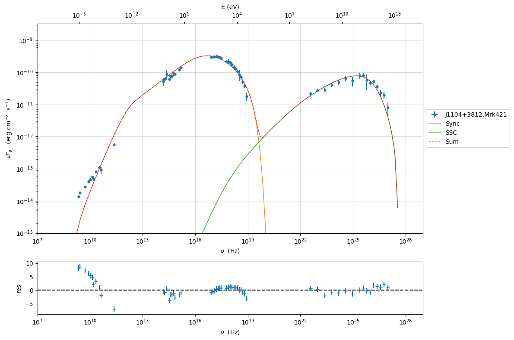
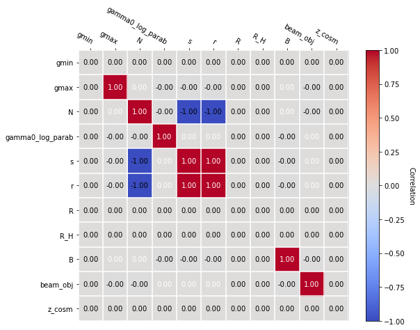

.. _gammapy_plugin:

.. warning::
    This plugin is still experimental, so any feedback that you can provide is welcome. 
    
    **It has been tested against Gamma-py version 0.19. Please, take into account that might break if Gamma-py changes interface**

Example to use the Gamma-py plugin with the JeSeT interface
===========================================================

In this tutorial we show how to import a jetset model into Gamma-py, and
finally we perform a model fitting with Gamma-py. To run this plugin you
have to install Gamma-py
https://docs.gammapy.org/0.19/getting-started/install.html

.. code:: ipython3

    import astropy.units as u
    import  numpy as np
    import matplotlib.pyplot as plt
    
    from jetset.gammapy_plugin import GammapyJetsetModelFactory
    from jetset.jet_model import Jet
    from jetset.test_data_helper import  test_SEDs
    from jetset.data_loader import ObsData,Data
    from jetset.plot_sedfit import PlotSED
    from jetset.test_data_helper import  test_SEDs
    from gammapy.modeling.models import SPECTRAL_MODEL_REGISTRY

Importing a jetset model into gammapy
-------------------------------------

.. code:: ipython3

    jet=Jet()

.. code:: ipython3

    jet.parameters

.. raw:: html

    <i>Table length=10</i>
    <table id="table140283478399968-301335" class="table-striped table-bordered table-condensed">
    <thead><tr><th>model name</th><th>name</th><th>par type</th><th>units</th><th>val</th><th>phys. bound. min</th><th>phys. bound. max</th><th>log</th><th>frozen</th></tr></thead>
    <tr><td>jet_leptonic</td><td>R</td><td>region_size</td><td>cm</td><td>5.000000e+15</td><td>1.000000e+03</td><td>1.000000e+30</td><td>False</td><td>False</td></tr>
    <tr><td>jet_leptonic</td><td>R_H</td><td>region_position</td><td>cm</td><td>1.000000e+17</td><td>0.000000e+00</td><td>--</td><td>False</td><td>True</td></tr>
    <tr><td>jet_leptonic</td><td>B</td><td>magnetic_field</td><td>gauss</td><td>1.000000e-01</td><td>0.000000e+00</td><td>--</td><td>False</td><td>False</td></tr>
    <tr><td>jet_leptonic</td><td>beam_obj</td><td>beaming</td><td>lorentz-factor*</td><td>1.000000e+01</td><td>1.000000e-04</td><td>--</td><td>False</td><td>False</td></tr>
    <tr><td>jet_leptonic</td><td>z_cosm</td><td>redshift</td><td></td><td>1.000000e-01</td><td>0.000000e+00</td><td>--</td><td>False</td><td>False</td></tr>
    <tr><td>jet_leptonic</td><td>gmin</td><td>low-energy-cut-off</td><td>lorentz-factor*</td><td>2.000000e+00</td><td>1.000000e+00</td><td>1.000000e+09</td><td>False</td><td>False</td></tr>
    <tr><td>jet_leptonic</td><td>gmax</td><td>high-energy-cut-off</td><td>lorentz-factor*</td><td>1.000000e+06</td><td>1.000000e+00</td><td>1.000000e+15</td><td>False</td><td>False</td></tr>
    <tr><td>jet_leptonic</td><td>N</td><td>emitters_density</td><td>1 / cm3</td><td>1.000000e+02</td><td>0.000000e+00</td><td>--</td><td>False</td><td>False</td></tr>
    <tr><td>jet_leptonic</td><td>gamma_cut</td><td>turn-over-energy</td><td>lorentz-factor*</td><td>1.000000e+04</td><td>1.000000e+00</td><td>1.000000e+09</td><td>False</td><td>False</td></tr>
    <tr><td>jet_leptonic</td><td>p</td><td>LE_spectral_slope</td><td></td><td>2.000000e+00</td><td>-1.000000e+01</td><td>1.000000e+01</td><td>False</td><td>False</td></tr>
    </table>
    

.. parsed-literal::

    None

.. code:: ipython3

    gammapy_jet_model=GammapyJetsetModelFactory(jet)
    gammapy_jet_model.parameters.to_table()

.. raw:: html

    
<i>Table length=9</i>
    <table id="table140283478598128" class="table-striped table-bordered table-condensed">
    <thead><tr><th>type</th><th>name</th><th>value</th><th>unit</th><th>error</th><th>min</th><th>max</th><th>frozen</th><th>link</th></tr></thead>
    <thead><tr><th>str8</th><th>str9</th><th>float64</th><th>str4</th><th>int64</th><th>float64</th><th>float64</th><th>bool</th><th>str1</th></tr></thead>
    <tr><td>spectral</td><td>gmin</td><td>2.0000e+00</td><td></td><td>0.000e+00</td><td>1.000e+00</td><td>1.000e+09</td><td>False</td><td></td></tr>
    <tr><td>spectral</td><td>gmax</td><td>1.0000e+06</td><td></td><td>0.000e+00</td><td>1.000e+00</td><td>1.000e+15</td><td>False</td><td></td></tr>
    <tr><td>spectral</td><td>N</td><td>1.0000e+02</td><td>cm-3</td><td>0.000e+00</td><td>0.000e+00</td><td>nan</td><td>False</td><td></td></tr>
    <tr><td>spectral</td><td>gamma_cut</td><td>1.0000e+04</td><td></td><td>0.000e+00</td><td>1.000e+00</td><td>1.000e+09</td><td>False</td><td></td></tr>
    <tr><td>spectral</td><td>R</td><td>5.0000e+15</td><td>cm</td><td>0.000e+00</td><td>1.000e+03</td><td>1.000e+30</td><td>False</td><td></td></tr>
    <tr><td>spectral</td><td>R_H</td><td>1.0000e+17</td><td>cm</td><td>0.000e+00</td><td>0.000e+00</td><td>nan</td><td>True</td><td></td></tr>
    <tr><td>spectral</td><td>B</td><td>1.0000e-01</td><td>G</td><td>0.000e+00</td><td>0.000e+00</td><td>nan</td><td>False</td><td></td></tr>
    <tr><td>spectral</td><td>beam_obj</td><td>1.0000e+01</td><td></td><td>0.000e+00</td><td>1.000e-04</td><td>nan</td><td>False</td><td></td></tr>
    <tr><td>spectral</td><td>z_cosm</td><td>1.0000e-01</td><td></td><td>0.000e+00</td><td>0.000e+00</td><td>nan</td><td>False</td><td></td></tr>
    </table>

.. code:: ipython3

    print(gammapy_jet_model)

.. parsed-literal::

    GammapyJetsetModel
    
      type      name     value    unit   error      min       max    frozen link
    -------- --------- ---------- ---- --------- --------- --------- ------ ----
    spectral      gmin 2.0000e+00      0.000e+00 1.000e+00 1.000e+09  False     
    spectral      gmax 1.0000e+06      0.000e+00 1.000e+00 1.000e+15  False     
    spectral         N 1.0000e+02 cm-3 0.000e+00 0.000e+00       nan  False     
    spectral gamma_cut 1.0000e+04      0.000e+00 1.000e+00 1.000e+09  False     
    spectral         R 5.0000e+15   cm 0.000e+00 1.000e+03 1.000e+30  False     
    spectral       R_H 1.0000e+17   cm 0.000e+00 0.000e+00       nan   True     
    spectral         B 1.0000e-01    G 0.000e+00 0.000e+00       nan  False     
    spectral  beam_obj 1.0000e+01      0.000e+00 1.000e-04       nan  False     
    spectral    z_cosm 1.0000e-01      0.000e+00 0.000e+00       nan  False     

let’s verify that parameters are updated

.. code:: ipython3

    gammapy_jet_model.R.value=1E15
    gammapy_jet_model.N.value=1E4
    
    gammapy_jet_model.p.value=1.5

.. code:: ipython3

    gammapy_jet_model.parameters.to_table()

.. raw:: html

    
<i>Table length=9</i>
    <table id="table140283846408272" class="table-striped table-bordered table-condensed">
    <thead><tr><th>type</th><th>name</th><th>value</th><th>unit</th><th>error</th><th>min</th><th>max</th><th>frozen</th><th>link</th></tr></thead>
    <thead><tr><th>str8</th><th>str9</th><th>float64</th><th>str4</th><th>int64</th><th>float64</th><th>float64</th><th>bool</th><th>str1</th></tr></thead>
    <tr><td>spectral</td><td>gmin</td><td>2.0000e+00</td><td></td><td>0.000e+00</td><td>1.000e+00</td><td>1.000e+09</td><td>False</td><td></td></tr>
    <tr><td>spectral</td><td>gmax</td><td>1.0000e+06</td><td></td><td>0.000e+00</td><td>1.000e+00</td><td>1.000e+15</td><td>False</td><td></td></tr>
    <tr><td>spectral</td><td>N</td><td>1.0000e+04</td><td>cm-3</td><td>0.000e+00</td><td>0.000e+00</td><td>nan</td><td>False</td><td></td></tr>
    <tr><td>spectral</td><td>gamma_cut</td><td>1.0000e+04</td><td></td><td>0.000e+00</td><td>1.000e+00</td><td>1.000e+09</td><td>False</td><td></td></tr>
    <tr><td>spectral</td><td>R</td><td>1.0000e+15</td><td>cm</td><td>0.000e+00</td><td>1.000e+03</td><td>1.000e+30</td><td>False</td><td></td></tr>
    <tr><td>spectral</td><td>R_H</td><td>1.0000e+17</td><td>cm</td><td>0.000e+00</td><td>0.000e+00</td><td>nan</td><td>True</td><td></td></tr>
    <tr><td>spectral</td><td>B</td><td>1.0000e-01</td><td>G</td><td>0.000e+00</td><td>0.000e+00</td><td>nan</td><td>False</td><td></td></tr>
    <tr><td>spectral</td><td>beam_obj</td><td>1.0000e+01</td><td></td><td>0.000e+00</td><td>1.000e-04</td><td>nan</td><td>False</td><td></td></tr>
    <tr><td>spectral</td><td>z_cosm</td><td>1.0000e-01</td><td></td><td>0.000e+00</td><td>0.000e+00</td><td>nan</td><td>False</td><td></td></tr>
    </table>

plotting with gammapy
~~~~~~~~~~~~~~~~~~~~~

.. code:: ipython3

    p=gammapy_jet_model.plot(energy_bounds=[1E-18, 10] * u.TeV,energy_power=2)

.. image:: gammapy_plugin_files/gammapy_plugin_14_0.png

plotting with jetset
~~~~~~~~~~~~~~~~~~~~

.. code:: ipython3

    gammapy_jet_model.jetset_model.plot_model()

.. parsed-literal::

    <jetset.plot_sedfit.PlotSED at 0x7f9660f92490>

.. image:: gammapy_plugin_files/gammapy_plugin_16_1.png

Model fitting with gammapy
--------------------------

.. code:: ipython3

    %matplotlib inline
    data=Data.from_file(test_SEDs[1])
    sed_data=ObsData(data_table=data)
    sed_data.group_data(bin_width=0.1)
    
    sed_data.add_systematics(0.1,[10.**6,10.**29])
    p=sed_data.plot_sed()

.. parsed-literal::

    ================================================================================
    
    ***  binning data  ***
    ---> N bins= 179
    ---> bin_widht= 0.1
    ================================================================================
    

.. parsed-literal::

    /Users/orion/anaconda3/envs/gammapy/lib/python3.9/site-packages/astropy/table/table.py:1407: FutureWarning: Using a non-tuple sequence for multidimensional indexing is deprecated; use `arr[tuple(seq)]` instead of `arr[seq]`. In the future this will be interpreted as an array index, `arr[np.array(seq)]`, which will result either in an error or a different result.
      newcol = col[slice_]

.. image:: gammapy_plugin_files/gammapy_plugin_18_2.png

.. code:: ipython3

    from jetset.sed_shaper import  SEDShape
    my_shape=SEDShape(sed_data)
    my_shape.eval_indices(minimizer='lsb',silent=True)
    p=my_shape.plot_indices()
    p.setlim(y_min=1E-15,y_max=1E-6)

.. parsed-literal::

    ================================================================================
    
    *** evaluating spectral indices for data ***
    ================================================================================
    

.. image:: gammapy_plugin_files/gammapy_plugin_19_1.png

.. code:: ipython3

    mm,best_fit=my_shape.sync_fit(check_host_gal_template=False,
                      Ep_start=None,
                      minimizer='lsb',
                      silent=True,
                      fit_range=[10.,21.])

.. parsed-literal::

    ================================================================================
    
    *** Log-Polynomial fitting of the synchrotron component ***
    ---> first blind fit run,  fit range: [10.0, 21.0]
    ---> class:  HSP
    
    
    

.. raw:: html

    <i>Table length=4</i>
    <table id="table140283357015728-944710" class="table-striped table-bordered table-condensed">
    <thead><tr><th>model name</th><th>name</th><th>val</th><th>bestfit val</th><th>err +</th><th>err -</th><th>start val</th><th>fit range min</th><th>fit range max</th><th>frozen</th></tr></thead>
    <tr><td>LogCubic</td><td>b</td><td>-1.624004e-01</td><td>-1.624004e-01</td><td>6.476287e-03</td><td>--</td><td>-1.000000e+00</td><td>-1.000000e+01</td><td>0.000000e+00</td><td>False</td></tr>
    <tr><td>LogCubic</td><td>c</td><td>-1.152224e-02</td><td>-1.152224e-02</td><td>9.546081e-04</td><td>--</td><td>-1.000000e+00</td><td>-1.000000e+01</td><td>1.000000e+01</td><td>False</td></tr>
    <tr><td>LogCubic</td><td>Ep</td><td>1.673089e+01</td><td>1.673089e+01</td><td>2.573962e-02</td><td>--</td><td>1.668212e+01</td><td>0.000000e+00</td><td>3.000000e+01</td><td>False</td></tr>
    <tr><td>LogCubic</td><td>Sp</td><td>-9.484256e+00</td><td>-9.484256e+00</td><td>1.783365e-02</td><td>--</td><td>-1.000000e+01</td><td>-3.000000e+01</td><td>0.000000e+00</td><td>False</td></tr>
    </table>
    

.. parsed-literal::

    ---> sync       nu_p=+1.673089e+01 (err=+2.573962e-02)  nuFnu_p=-9.484256e+00 (err=+1.783365e-02) curv.=-1.624004e-01 (err=+6.476287e-03)
    ================================================================================
    

.. code:: ipython3

    my_shape.IC_fit(fit_range=[23.,29.],minimizer='minuit',silent=True)
    p=my_shape.plot_shape_fit()
    p.setlim(y_min=1E-15)

.. parsed-literal::

    ================================================================================
    
    *** Log-Polynomial fitting of the IC component ***
    ---> fit range: [23.0, 29.0]
    ---> LogCubic fit
    
    

.. raw:: html

    <i>Table length=4</i>
    <table id="table140283387841024-616991" class="table-striped table-bordered table-condensed">
    <thead><tr><th>model name</th><th>name</th><th>val</th><th>bestfit val</th><th>err +</th><th>err -</th><th>start val</th><th>fit range min</th><th>fit range max</th><th>frozen</th></tr></thead>
    <tr><td>LogCubic</td><td>b</td><td>-2.104700e-01</td><td>-2.104700e-01</td><td>3.125009e-02</td><td>--</td><td>-1.000000e+00</td><td>-1.000000e+01</td><td>0.000000e+00</td><td>False</td></tr>
    <tr><td>LogCubic</td><td>c</td><td>-4.685169e-02</td><td>-4.685169e-02</td><td>2.175617e-02</td><td>--</td><td>-1.000000e+00</td><td>-1.000000e+01</td><td>1.000000e+01</td><td>False</td></tr>
    <tr><td>LogCubic</td><td>Ep</td><td>2.525001e+01</td><td>2.525001e+01</td><td>1.144759e-01</td><td>--</td><td>2.529805e+01</td><td>0.000000e+00</td><td>3.000000e+01</td><td>False</td></tr>
    <tr><td>LogCubic</td><td>Sp</td><td>-1.010998e+01</td><td>-1.010998e+01</td><td>3.513736e-02</td><td>--</td><td>-1.000000e+01</td><td>-3.000000e+01</td><td>0.000000e+00</td><td>False</td></tr>
    </table>
    

.. parsed-literal::

    ---> IC         nu_p=+2.525001e+01 (err=+1.144759e-01)  nuFnu_p=-1.010998e+01 (err=+3.513736e-02) curv.=-2.104700e-01 (err=+3.125009e-02)
    ================================================================================
    

.. image:: gammapy_plugin_files/gammapy_plugin_21_3.png

.. code:: ipython3

    from jetset.obs_constrain import ObsConstrain
    from jetset.model_manager import  FitModel
    sed_obspar=ObsConstrain(beaming=25,
                            B_range=[0.001,0.1],
                            distr_e='lppl',
                            t_var_sec=3*86400,
                            nu_cut_IR=1E12,
                            SEDShape=my_shape)
    
    
    prefit_jet=sed_obspar.constrain_SSC_model(electron_distribution_log_values=False,silent=True)
    prefit_jet.save_model('prefit_jet.pkl')

.. parsed-literal::

    ================================================================================
    
    ***  constrains parameters from observable ***
    

.. parsed-literal::

    /Users/orion/anaconda3/envs/gammapy/lib/python3.9/site-packages/jetset/obs_constrain.py:650: RankWarning: Polyfit may be poorly conditioned
      return func(*args, **kwargs),completed

.. raw:: html

    <i>Table length=11</i>
    <table id="table140283395898000-409177" class="table-striped table-bordered table-condensed">
    <thead><tr><th>model name</th><th>name</th><th>par type</th><th>units</th><th>val</th><th>phys. bound. min</th><th>phys. bound. max</th><th>log</th><th>frozen</th></tr></thead>
    <tr><td>jet_leptonic</td><td>R</td><td>region_size</td><td>cm</td><td>3.105858e+16</td><td>1.000000e+03</td><td>1.000000e+30</td><td>False</td><td>False</td></tr>
    <tr><td>jet_leptonic</td><td>R_H</td><td>region_position</td><td>cm</td><td>1.000000e+17</td><td>0.000000e+00</td><td>--</td><td>False</td><td>True</td></tr>
    <tr><td>jet_leptonic</td><td>B</td><td>magnetic_field</td><td>gauss</td><td>5.050000e-02</td><td>0.000000e+00</td><td>--</td><td>False</td><td>False</td></tr>
    <tr><td>jet_leptonic</td><td>beam_obj</td><td>beaming</td><td>lorentz-factor*</td><td>2.500000e+01</td><td>1.000000e-04</td><td>--</td><td>False</td><td>False</td></tr>
    <tr><td>jet_leptonic</td><td>z_cosm</td><td>redshift</td><td></td><td>3.080000e-02</td><td>0.000000e+00</td><td>--</td><td>False</td><td>False</td></tr>
    <tr><td>jet_leptonic</td><td>gmin</td><td>low-energy-cut-off</td><td>lorentz-factor*</td><td>4.697542e+02</td><td>1.000000e+00</td><td>1.000000e+09</td><td>False</td><td>False</td></tr>
    <tr><td>jet_leptonic</td><td>gmax</td><td>high-energy-cut-off</td><td>lorentz-factor*</td><td>1.373160e+06</td><td>1.000000e+00</td><td>1.000000e+15</td><td>False</td><td>False</td></tr>
    <tr><td>jet_leptonic</td><td>N</td><td>emitters_density</td><td>1 / cm3</td><td>8.476131e-01</td><td>0.000000e+00</td><td>--</td><td>False</td><td>False</td></tr>
    <tr><td>jet_leptonic</td><td>gamma0_log_parab</td><td>turn-over-energy</td><td>lorentz-factor*</td><td>3.327955e+04</td><td>1.000000e+00</td><td>1.000000e+09</td><td>False</td><td>False</td></tr>
    <tr><td>jet_leptonic</td><td>s</td><td>LE_spectral_slope</td><td></td><td>2.163414e+00</td><td>-1.000000e+01</td><td>1.000000e+01</td><td>False</td><td>False</td></tr>
    <tr><td>jet_leptonic</td><td>r</td><td>spectral_curvature</td><td></td><td>8.120021e-01</td><td>-1.500000e+01</td><td>1.500000e+01</td><td>False</td><td>False</td></tr>
    </table>
    

.. parsed-literal::

    
    ================================================================================
    

.. code:: ipython3

    pl=prefit_jet.plot_model(sed_data=sed_data)
    pl.add_model_residual_plot(prefit_jet,sed_data)
    pl.setlim(y_min=1E-15,x_min=1E7,x_max=1E29)

setting gammapy jetset model
~~~~~~~~~~~~~~~~~~~~~~~~~~~~

we import the model to gammapy and we set min/max values. Notice that
gammapy has not fit_range, but uses only min/max

.. code:: ipython3

    
    
    jet=Jet.load_model('prefit_jet.pkl')
    jet.parameters.z_cosm.freeze()
    jet.parameters.gmin.freeze()
    jet.parameters.R.freeze()
    jet.parameters.gmax.set(val_min=1E5, val_max=1E7)
    jet.parameters.N.set(val_min=0.001, val_max=3)
    jet.parameters.R.set(val_min=1E15,val_max=1E17)
    jet.parameters.B.set(val_min=0.0001,val_max=1)
    jet.parameters.beam_obj.set(val_min=5,val_max=30)
    jet.parameters.gamma0_log_parab.set(val_min=1E3,val_max=1E5)
    jet.parameters.s.set(val_min=1,val_max=3)
    
    jet.parameters.r.set(val_min=0.1,val_max=2)
    jet.parameters.R_H.set(val_min=1E17,val_max=1E19)
    jet.parameters.z_cosm.set(val_min=0.0,val_max=1)
    
    gammapy_jet_model=GammapyJetsetModelFactory(jet)
    SPECTRAL_MODEL_REGISTRY.append(gammapy_jet_model)

.. raw:: html

    <i>Table length=11</i>
    <table id="table140283327778576-138689" class="table-striped table-bordered table-condensed">
    <thead><tr><th>model name</th><th>name</th><th>par type</th><th>units</th><th>val</th><th>phys. bound. min</th><th>phys. bound. max</th><th>log</th><th>frozen</th></tr></thead>
    <tr><td>jet_leptonic</td><td>gmin</td><td>low-energy-cut-off</td><td>lorentz-factor*</td><td>4.697542e+02</td><td>1.000000e+00</td><td>1.000000e+09</td><td>False</td><td>False</td></tr>
    <tr><td>jet_leptonic</td><td>gmax</td><td>high-energy-cut-off</td><td>lorentz-factor*</td><td>1.373160e+06</td><td>1.000000e+00</td><td>1.000000e+15</td><td>False</td><td>False</td></tr>
    <tr><td>jet_leptonic</td><td>N</td><td>emitters_density</td><td>1 / cm3</td><td>8.476131e-01</td><td>0.000000e+00</td><td>--</td><td>False</td><td>False</td></tr>
    <tr><td>jet_leptonic</td><td>gamma0_log_parab</td><td>turn-over-energy</td><td>lorentz-factor*</td><td>3.327955e+04</td><td>1.000000e+00</td><td>1.000000e+09</td><td>False</td><td>False</td></tr>
    <tr><td>jet_leptonic</td><td>s</td><td>LE_spectral_slope</td><td></td><td>2.163414e+00</td><td>-1.000000e+01</td><td>1.000000e+01</td><td>False</td><td>False</td></tr>
    <tr><td>jet_leptonic</td><td>r</td><td>spectral_curvature</td><td></td><td>8.120021e-01</td><td>-1.500000e+01</td><td>1.500000e+01</td><td>False</td><td>False</td></tr>
    <tr><td>jet_leptonic</td><td>R</td><td>region_size</td><td>cm</td><td>3.105858e+16</td><td>1.000000e+03</td><td>1.000000e+30</td><td>False</td><td>False</td></tr>
    <tr><td>jet_leptonic</td><td>R_H</td><td>region_position</td><td>cm</td><td>1.000000e+17</td><td>0.000000e+00</td><td>--</td><td>False</td><td>True</td></tr>
    <tr><td>jet_leptonic</td><td>B</td><td>magnetic_field</td><td>gauss</td><td>5.050000e-02</td><td>0.000000e+00</td><td>--</td><td>False</td><td>False</td></tr>
    <tr><td>jet_leptonic</td><td>beam_obj</td><td>beaming</td><td>lorentz-factor*</td><td>2.500000e+01</td><td>1.000000e-04</td><td>--</td><td>False</td><td>False</td></tr>
    <tr><td>jet_leptonic</td><td>z_cosm</td><td>redshift</td><td></td><td>3.080000e-02</td><td>0.000000e+00</td><td>--</td><td>False</td><td>False</td></tr>
    </table>
    

.. code:: ipython3

    gammapy_jet_model.parameters.to_table()

.. raw:: html

    
<i>Table length=11</i>
    <table id="table140283351312944" class="table-striped table-bordered table-condensed">
    <thead><tr><th>type</th><th>name</th><th>value</th><th>unit</th><th>error</th><th>min</th><th>max</th><th>frozen</th><th>link</th></tr></thead>
    <thead><tr><th>str8</th><th>str16</th><th>float64</th><th>str4</th><th>int64</th><th>float64</th><th>float64</th><th>bool</th><th>str1</th></tr></thead>
    <tr><td>spectral</td><td>gmin</td><td>4.6975e+02</td><td></td><td>0.000e+00</td><td>1.000e+00</td><td>1.000e+09</td><td>True</td><td></td></tr>
    <tr><td>spectral</td><td>gmax</td><td>1.3732e+06</td><td></td><td>0.000e+00</td><td>1.000e+05</td><td>1.000e+07</td><td>False</td><td></td></tr>
    <tr><td>spectral</td><td>N</td><td>8.4761e-01</td><td>cm-3</td><td>0.000e+00</td><td>1.000e-03</td><td>3.000e+00</td><td>False</td><td></td></tr>
    <tr><td>spectral</td><td>gamma0_log_parab</td><td>3.3280e+04</td><td></td><td>0.000e+00</td><td>1.000e+03</td><td>1.000e+05</td><td>False</td><td></td></tr>
    <tr><td>spectral</td><td>s</td><td>2.1634e+00</td><td></td><td>0.000e+00</td><td>1.000e+00</td><td>3.000e+00</td><td>False</td><td></td></tr>
    <tr><td>spectral</td><td>r</td><td>8.1200e-01</td><td></td><td>0.000e+00</td><td>1.000e-01</td><td>2.000e+00</td><td>False</td><td></td></tr>
    <tr><td>spectral</td><td>R</td><td>3.1059e+16</td><td>cm</td><td>0.000e+00</td><td>1.000e+15</td><td>1.000e+17</td><td>True</td><td></td></tr>
    <tr><td>spectral</td><td>R_H</td><td>1.0000e+17</td><td>cm</td><td>0.000e+00</td><td>1.000e+17</td><td>1.000e+19</td><td>True</td><td></td></tr>
    <tr><td>spectral</td><td>B</td><td>5.0500e-02</td><td>G</td><td>0.000e+00</td><td>1.000e-04</td><td>1.000e+00</td><td>False</td><td></td></tr>
    <tr><td>spectral</td><td>beam_obj</td><td>2.5000e+01</td><td></td><td>0.000e+00</td><td>5.000e+00</td><td>3.000e+01</td><td>False</td><td></td></tr>
    <tr><td>spectral</td><td>z_cosm</td><td>3.0800e-02</td><td></td><td>0.000e+00</td><td>0.000e+00</td><td>1.000e+00</td><td>True</td><td></td></tr>
    </table>

.. code:: ipython3

    _=gammapy_jet_model.evaluate()

.. code:: ipython3

    p=gammapy_jet_model.jetset_model.plot_model(sed_data=sed_data)
    p.add_model_residual_plot(data=sed_data, model=jet,fit_range=[1E11,1E30])
    p.setlim(x_min=1E8,y_min=1E-14)

.. image:: gammapy_plugin_files/gammapy_plugin_29_0.png

importing data to gammapy
~~~~~~~~~~~~~~~~~~~~~~~~~

.. code:: ipython3

    from gammapy.estimators import FluxPoints
    
    fp=FluxPoints.from_table(sed_data.gammapy_table,sed_type='e2dnde')
    p=fp.plot(sed_type='e2dnde')
    p=gammapy_jet_model.plot(energy_bounds=[1E-18, 10] * u.TeV,energy_power=2)
    
    plt.show()

.. parsed-literal::

    No reference model set for FluxMaps. Assuming point source with E^-2 spectrum.

.. image:: gammapy_plugin_files/gammapy_plugin_31_1.png

.. code:: ipython3

    p=fp.plot(sed_type='dnde')
    p=gammapy_jet_model.plot(energy_bounds=[1E-18, 10] * u.TeV,energy_power=0)
    
    plt.show()

.. image:: gammapy_plugin_files/gammapy_plugin_32_0.png

building gammapy SkyModel
~~~~~~~~~~~~~~~~~~~~~~~~~

we build the SkyModel, and we degrade the pre-fit model quality

.. code:: ipython3

    from gammapy.modeling.models import SkyModel
    model = SkyModel(name="SSC model Mrk 421", spectral_model=gammapy_jet_model)
    gammapy_jet_model.N.value=2
    gammapy_jet_model.r.value=0.5
    gammapy_jet_model.beam_obj.value=20
    
    print(model)
    gammapy_jet_model.evaluate()
    p=gammapy_jet_model.jetset_model.plot_model(sed_data=sed_data)
    p.add_model_residual_plot(data=sed_data, model=gammapy_jet_model.jetset_model,fit_range=[1E11,1E30])
    

.. parsed-literal::

    SkyModel
    
      Name                      : SSC model Mrk 421
      Datasets names            : None
      Spectral model type       : GammapyJetsetModel
      Spatial  model type       : 
      Temporal model type       : 
      Parameters:
        gmin         (frozen)   :    469.754                   
        gmax                    : 1373159.756  +/-    0.00             
        N                       :      2.000   +/-    0.00 1 / cm3     
        gamma0_log_parab            :  33279.546   +/-    0.00             
        s                       :      2.163   +/-    0.00             
        r                       :      0.500   +/-    0.00             
        R            (frozen)   : 31058584282107640.000      cm          
        R_H          (frozen)   : 100000000000000000.000       cm          
        B                       :      0.051   +/-    0.00 gauss       
        beam_obj                :     20.000   +/-    0.00             
        z_cosm       (frozen)   :      0.031                   
    
    

.. image:: gammapy_plugin_files/gammapy_plugin_35_1.png

setting gammapy Datasets and Fit classes, and running the fit
~~~~~~~~~~~~~~~~~~~~~~~~~~~~~~~~~~~~~~~~~~~~~~~~~~~~~~~~~~~~~

.. code:: ipython3

    from gammapy.datasets import FluxPointsDataset,Datasets
    dataset_mrk421 = FluxPointsDataset(data=fp,models=model)
    # do not use frequency point below 1e11 Hz, affected by non-blazar emission
    E_min_fit = (1e11 * u.Hz).to("eV", equivalencies=u.spectral())
    dataset_mrk421.mask_fit = dataset_mrk421.data.energy_ref > E_min_fit
    datasets=Datasets([dataset_mrk421])

.. code:: ipython3

    from gammapy.modeling import Fit
    
    fitter = Fit(backend='minuit')

.. code:: ipython3

    results = fitter.run(datasets=datasets)

.. code:: ipython3

    print(results)
    print(results.parameters.to_table())

.. parsed-literal::

    OptimizeResult
    
    	backend    : minuit
    	method     : migrad
    	success    : False
    	message    : Optimization failed. Estimated distance to minimum too large.
    	nfev       : 1460
    	total stat : 57.98
    
    OptimizeResult
    
    	backend    : minuit
    	method     : migrad
    	success    : False
    	message    : Optimization failed. Estimated distance to minimum too large.
    	nfev       : 1460
    	total stat : 57.98
    
    
      type         name         value    unit   error      min       max    frozen link
    -------- ---------------- ---------- ---- --------- --------- --------- ------ ----
    spectral             gmin 4.6975e+02      0.000e+00 1.000e+00 1.000e+09   True     
    spectral             gmax 8.8519e+05      2.298e-01 1.000e+05 1.000e+07  False     
    spectral                N 1.0987e+00 cm-3 1.902e-06 1.000e-03 3.000e+00  False     
    spectral gamma0_log_parab 5.0485e+04      1.480e-06 1.000e+03 1.000e+05  False     
    spectral                s 2.1768e+00      2.005e-07 1.000e+00 3.000e+00  False     
    spectral                r 8.8931e-01      8.676e-02 1.000e-01 2.000e+00  False     
    spectral                R 3.1059e+16   cm 0.000e+00 1.000e+15 1.000e+17   True     
    spectral              R_H 1.0000e+17   cm 0.000e+00 1.000e+17 1.000e+19   True     
    spectral                B 7.1542e-02    G 2.212e-08 1.000e-04 1.000e+00  False     
    spectral         beam_obj 1.8433e+01      1.071e-06 5.000e+00 3.000e+01  False     
    spectral           z_cosm 3.0800e-02      0.000e+00 0.000e+00 1.000e+00   True     

.. code:: ipython3

    gammapy_jet_model.covariance.plot_correlation()
    plt.show()

.. code:: ipython3

    fp.plot(sed_type='e2dnde')
    gammapy_jet_model.plot(energy_bounds=[1E-18, 10] * u.TeV,energy_power=2)
    plt.show()

.. image:: gammapy_plugin_files/gammapy_plugin_42_0.png

.. code:: ipython3

    gammapy_jet_model.jetset_model.eval()
    p=gammapy_jet_model.jetset_model.plot_model(sed_data=sed_data)
    p.add_model_residual_plot(data=sed_data, model=gammapy_jet_model.jetset_model,
                                             fit_range=[1E11,1E30])

.. image:: gammapy_plugin_files/gammapy_plugin_43_0.png

