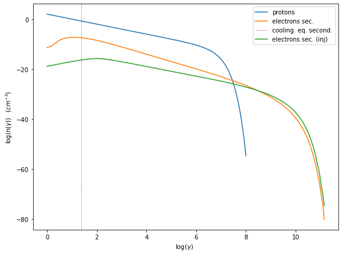
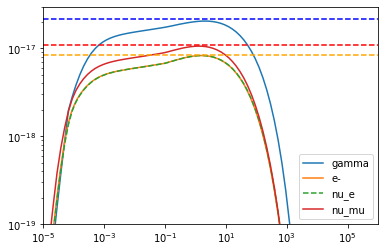

.. _hadronic_pp_jet_guide:

.. code:: ipython3

    def get_component(j_name,nu_name):
        j_nu_ptr=getattr(j._blob,j_name)
        nu_ptr=getattr(j._blob,nu_name)
        xg=np.zeros(j._blob.nu_grid_size)
        yg=np.zeros(j._blob.nu_grid_size)
        for i in range(j._blob.nu_grid_size):
            xg[i]=jetkernel.get_spectral_array(nu_ptr,j._blob,i)
            yg[i]=jetkernel.get_spectral_array(j_nu_ptr,j._blob,i)
        
        m=yg>0
    
        xg=xg[m]
        yg=yg[m]
        yg=yg*xg
        yg=yg*jetkernel.erg_to_TeV
    
        xg=xg*jetkernel.HPLANCK_TeV
        
        return xg,yg
    

Jet pp Consistency with Kelner 2006
===================================

.. code:: ipython3

    from jetset.jet_model import Jet
    from jetset.jetkernel import jetkernel
    from astropy import constants as const
    from jetset.jet_emitters_factory import EmittersFactory

.. code:: ipython3

    import jetset
    print('tested on jetset',jetset.__version__)

.. parsed-literal::

    tested on jetset 1.2.0rc4

.. code:: ipython3

    j=Jet(emitters_distribution='plc',verbose=False,emitters_type='protons')

.. code:: ipython3

    
    j.parameters.z_cosm.val=z=0.001
    j.parameters.beam_obj.val=10
    j.parameters.gamma_cut.val=1000/(jetkernel.MPC2_TeV)
    j.parameters.NH_pp.val=1
    j.parameters.N.val=1
    j.parameters.p.val=2.0
    j.parameters.B.val=1.0
    j.parameters.R.val=1E18
    j.parameters.gmin.val=1
    j.parameters.gmax.val=1E8
    j.set_emiss_lim(1E-60)
    j.set_IC_nu_size(100)
    j.gamma_grid_size=200
    j.nu_max=1E31

.. code:: ipython3

    gamma_sec_evovled=np.copy(j.emitters_distribution.gamma_e)
    n_gamma_sec_evovled=np.copy(j.emitters_distribution.n_gamma_e)
    gamma_sec_inj=np.copy(j.emitters_distribution.gamma_e_second_inj)
    n_gamma_sec_inj=np.copy(j.emitters_distribution.n_gamma_e_second_inj)

.. code:: ipython3

    gmin=1.0/jetkernel.MPC2_TeV
    j.set_N_from_U_emitters(1.0, gmin=gmin)
    j.eval()
    j.show_model()

.. parsed-literal::

    
    --------------------------------------------------------------------------------
    jet model description
    --------------------------------------------------------------------------------
    name: jet_hadronic_pp  
    
    protons distribution:
     type: plc  
     gamma energy grid size:  201
     gmin grid : 1.000000e+00
     gmax grid : 1.000000e+08
     normalization  True
     log-values  False
    
    radiative fields:
     seed photons grid size:  100
     IC emission grid size:  100
     source emissivity lower bound :  1.000000e-60
     spectral components:
       name:Sum, state: on
       name:Sync, state: self-abs
       name:SSC, state: on
       name:PP_gamma, state: on
       name:PP_neutrino_tot, state: on
       name:PP_neutrino_mu, state: on
       name:PP_neutrino_e, state: on
       name:Bremss_ep, state: on
    external fields transformation method: blob
    
    SED info:
     nu grid size jetkernel: 1000
     nu grid size: 500
     nu mix (Hz): 1.000000e+06
     nu max (Hz): 1.000000e+31
    
    flux plot lower bound   :  1.000000e-120
    
    --------------------------------------------------------------------------------

.. raw:: html

    <i>Table length=11</i>
    <table id="table140512693000416-601336" class="table-striped table-bordered table-condensed">
    <thead><tr><th>model name</th><th>name</th><th>par type</th><th>units</th><th>val</th><th>phys. bound. min</th><th>phys. bound. max</th><th>log</th><th>frozen</th></tr></thead>
    <tr><td>jet_hadronic_pp</td><td>R</td><td>region_size</td><td>cm</td><td>1.000000e+18</td><td>1.000000e+03</td><td>1.000000e+30</td><td>False</td><td>False</td></tr>
    <tr><td>jet_hadronic_pp</td><td>R_H</td><td>region_position</td><td>cm</td><td>1.000000e+17</td><td>0.000000e+00</td><td>--</td><td>False</td><td>True</td></tr>
    <tr><td>jet_hadronic_pp</td><td>B</td><td>magnetic_field</td><td>gauss</td><td>1.000000e+00</td><td>0.000000e+00</td><td>--</td><td>False</td><td>False</td></tr>
    <tr><td>jet_hadronic_pp</td><td>beam_obj</td><td>beaming</td><td>lorentz-factor*</td><td>1.000000e+01</td><td>1.000000e-04</td><td>--</td><td>False</td><td>False</td></tr>
    <tr><td>jet_hadronic_pp</td><td>z_cosm</td><td>redshift</td><td></td><td>1.000000e-03</td><td>0.000000e+00</td><td>--</td><td>False</td><td>False</td></tr>
    <tr><td>jet_hadronic_pp</td><td>gmin</td><td>low-energy-cut-off</td><td>lorentz-factor*</td><td>1.000000e+00</td><td>1.000000e+00</td><td>1.000000e+09</td><td>False</td><td>False</td></tr>
    <tr><td>jet_hadronic_pp</td><td>gmax</td><td>high-energy-cut-off</td><td>lorentz-factor*</td><td>1.000000e+08</td><td>1.000000e+00</td><td>1.000000e+15</td><td>False</td><td>False</td></tr>
    <tr><td>jet_hadronic_pp</td><td>N</td><td>emitters_density</td><td>1 / cm3</td><td>1.058009e+02</td><td>0.000000e+00</td><td>--</td><td>False</td><td>False</td></tr>
    <tr><td>jet_hadronic_pp</td><td>NH_pp</td><td>target_density</td><td>1 / cm3</td><td>1.000000e+00</td><td>0.000000e+00</td><td>--</td><td>False</td><td>False</td></tr>
    <tr><td>jet_hadronic_pp</td><td>gamma_cut</td><td>turn-over-energy</td><td>lorentz-factor*</td><td>1.065789e+06</td><td>1.000000e+00</td><td>1.000000e+09</td><td>False</td><td>False</td></tr>
    <tr><td>jet_hadronic_pp</td><td>p</td><td>LE_spectral_slope</td><td></td><td>2.000000e+00</td><td>-1.000000e+01</td><td>1.000000e+01</td><td>False</td><td>False</td></tr>
    </table>
    

.. parsed-literal::

    --------------------------------------------------------------------------------

.. code:: ipython3

    
    m=j.emitters_distribution.gamma_p>=gmin
    print('U(p) (erg/cm3) =',j.emitters_distribution.eval_U(gmin=gmin))

.. parsed-literal::

    U(p) (erg/cm3) = 1.0

.. code:: ipython3

    %matplotlib inline
    p=j.emitters_distribution.plot()

.. code:: ipython3

    %matplotlib widget
    p=j.plot_model()

.. parsed-literal::

    Canvas(toolbar=Toolbar(toolitems=[('Home', 'Reset original view', 'home', 'home'), ('Back', 'Back to previous …

.. code:: ipython3

    #Fig 12 Kelner 2006
    %matplotlib inline
    
    
    #j_nu_pp rate
    xg,yg= get_component('j_pp_gamma','nu_pp_gamma')
    x_nu_e,y_nu_e= get_component('j_pp_neutrino_e','nu_pp_neutrino_e')
    x_nu_mu,y_nu_mu= get_component('j_pp_neutrino_mu','nu_pp_neutrino_mu')
    x_nu_tot,y_nu_tot= get_component('j_pp_neutrino_tot','nu_pp_neutrino_tot')
    x_nu_mu_2=x_nu_mu
    y_nu_2=(y_nu_tot-y_nu_mu)*np.pi*4
    x_nu_mu_1=x_nu_mu
    y_nu_mu_1=(y_nu_mu-y_nu_2)*np.pi*4
    
    yg=yg*np.pi*4
    y_nu_mu=y_nu_mu*np.pi*4
    y_nu_e=y_nu_e*np.pi*4
    #e-  rate
    x_inj=np.copy(j.emitters_distribution.gamma_e_second_inj)
    y_inj=np.copy(j.emitters_distribution.n_gamma_e_second_inj)
    y_e=y_inj*x_inj*x_inj*jetkernel.MEC2_TeV
    x_e=x_inj*0.5E6/1E12
    
    plt.loglog(xg,yg,label='gamma')
    plt.loglog(x_e,y_e,label='e-')
    plt.loglog(x_nu_e,y_nu_e,'--',label='nu_e')
    plt.loglog(x_nu_mu,y_nu_mu,label='nu_mu')
    
    #plt.loglog(x_nu_mu_1,y_nu_mu_1,label='nu_mu_1')
    
    plt.ylim(1E-19,3E-17)#
    plt.xlim(1E-5,1E6)
    
    plt.legend()
    plt.axhline(2.15E-17,ls='--',c='b')
    plt.axhline(8.5E-18,ls='--',c='orange')
    plt.axhline(1.1E-17,ls='--',c='r')

.. parsed-literal::

    <matplotlib.lines.Line2D at 0x7fc2d3e1dd30>

.. code:: ipython3

    #Fig 14 left panel
    %matplotlib inline
    y1=yg/(xg*xg)
    plt.plot(xg*1E6,y1/y1.max(),label='gamma')
    
    y1=y_e/(x_e*x_e)
    m=y_e>0
    plt.plot(x_e[m]*1E6,2*y1[m]/y1[m].max(),label='e-')
    
    #y1=y_nu_tot/(x_nu_tot*x_nu_tot)
    #m=y1>0
    #plt.plot(x_nu_tot[m]*1E6,3*y1[m]/y1[m].max(),label='nu_tot')
    y1=y_nu_mu_1/(x_nu_mu_1*x_nu_mu_1)
    m=y1>0
    plt.plot(x_nu_mu_1[m]*1E6,4*y1[m]/y1[m].max(),label='nu_mu_1')
    
    y1=y_nu_mu/(x_nu_mu*x_nu_mu)
    m=y1>0
    plt.plot(x_nu_mu[m]*1E6,5*y1[m]/y1[m].max(),label='nu_mu')
    
    #plt.xlim(1E-5,2E2)
    plt.axvline(70)
    plt.axvline(50)
    plt.axvline(30)
    plt.legend()
    plt.xlim(10,175)

.. parsed-literal::

    (10.0, 175.0)

.. image:: hadornic_files/hadornic_13_1.png

