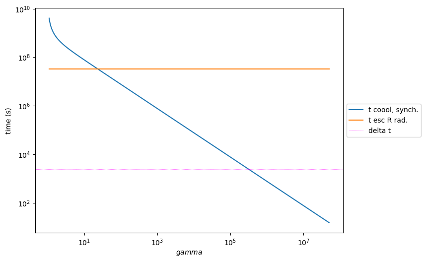
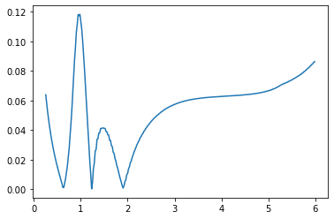

.. \_hadronic_pp_jet_validation_guide:

.. code:: ipython3

    def get_component(j_name,nu_name):
        j_nu_ptr=getattr(j._blob,j_name)
        nu_ptr=getattr(j._blob,nu_name)
        xg=np.zeros(j._blob.nu_grid_size)
        yg=np.zeros(j._blob.nu_grid_size)
        for i in range(j._blob.nu_grid_size):
            xg[i]=jetkernel.get_spectral_array(nu_ptr,j._blob,i)
            yg[i]=jetkernel.get_spectral_array(j_nu_ptr,j._blob,i)
        
        m=yg>0
    
        xg=xg[m]
        yg=yg[m]
        yg=yg*xg
        yg=yg*jetkernel.erg_to_TeV
    
        xg=xg*jetkernel.HPLANCK_TeV
        
        return xg,yg
    

Jet pp Consistency with Kelner 2006
===================================

.. code:: ipython3

    from jetset.jet_model import Jet
    from jetset.jetkernel import jetkernel
    from astropy import constants as const
    from jetset.jet_emitters_factory import EmittersFactory
    from jetset.jet_emitters import InjEmittersArrayDistribution

.. code:: ipython3

    import jetset
    print('tested on jetset',jetset.__version__)

.. parsed-literal::

    tested on jetset 1.2.0rc13

.. code:: ipython3

    j=Jet(emitters_distribution='plc',verbose=False,emitters_type='protons')

.. code:: ipython3

    
    j.parameters.z_cosm.val=z=0.001
    j.parameters.beam_obj.val=1
    j.parameters.gamma_cut.val=1000/(jetkernel.MPC2_TeV)
    j.parameters.NH_pp.val=1
    j.parameters.N.val=1
    j.parameters.p.val=2.0
    j.parameters.B.val=.5
    j.parameters.R.val=1E18
    j.parameters.gmin.val=1
    j.parameters.gmax.val=1E4
    j.set_emiss_lim(1E-60)
    j.set_IC_nu_size(100)
    j.gamma_grid_size=200
    j.eval()

.. code:: ipython3

    gmin=1.0/jetkernel.MPC2_TeV
    j.set_N_from_U_emitters(1.0, gmin=gmin)
    j.eval()
    
    #j.show_model()
    
    m=j.emitters_distribution.gamma_p>gmin
    print('U N(p) p>1 TeV=%e erg/cm-3'%(jetkernel.MPC2*np.trapz(j.emitters_distribution.n_gamma_p[m]*j.emitters_distribution.gamma_p[m],j.emitters_distribution.gamma_p[m])))

.. parsed-literal::

    U N(p) p>1 TeV=9.999992e-01 erg/cm-3

.. code:: ipython3

    %matplotlib inline
    j.emitters_distribution.plot()

.. parsed-literal::

    <jetset.plot_sedfit.PlotPdistr at 0x7fd18ccaadf0>

.. image:: hadornic_validate_temp_ev_files/hadornic_validate_temp_ev_8_1.png

.. code:: ipython3

    j.save_model('hadronic.pkl')

.. code:: ipython3

    from jetset.jet_model import Jet
    j=Jet.load_model('hadronic.pkl')

.. raw:: html

    <i>Table length=11</i>
    <table id="table140538009036880-962051" class="table-striped table-bordered table-condensed">
    <thead><tr><th>model name</th><th>name</th><th>par type</th><th>units</th><th>val</th><th>phys. bound. min</th><th>phys. bound. max</th><th>log</th><th>frozen</th></tr></thead>
    <tr><td>jet_hadronic_pp</td><td>gmin</td><td>low-energy-cut-off</td><td>lorentz-factor*</td><td>1.000000e+00</td><td>1.000000e+00</td><td>1.000000e+09</td><td>False</td><td>False</td></tr>
    <tr><td>jet_hadronic_pp</td><td>gmax</td><td>high-energy-cut-off</td><td>lorentz-factor*</td><td>1.000000e+04</td><td>1.000000e+00</td><td>1.000000e+15</td><td>False</td><td>False</td></tr>
    <tr><td>jet_hadronic_pp</td><td>N</td><td>emitters_density</td><td>1 / cm3</td><td>3.022554e+02</td><td>0.000000e+00</td><td>--</td><td>False</td><td>False</td></tr>
    <tr><td>jet_hadronic_pp</td><td>NH_pp</td><td>target_density</td><td>1 / cm3</td><td>1.000000e+00</td><td>0.000000e+00</td><td>--</td><td>False</td><td>False</td></tr>
    <tr><td>jet_hadronic_pp</td><td>gamma_cut</td><td>turn-over-energy</td><td>lorentz-factor*</td><td>1.065789e+06</td><td>1.000000e+00</td><td>1.000000e+09</td><td>False</td><td>False</td></tr>
    <tr><td>jet_hadronic_pp</td><td>p</td><td>LE_spectral_slope</td><td></td><td>2.000000e+00</td><td>-1.000000e+01</td><td>1.000000e+01</td><td>False</td><td>False</td></tr>
    <tr><td>jet_hadronic_pp</td><td>R</td><td>region_size</td><td>cm</td><td>1.000000e+18</td><td>1.000000e+03</td><td>1.000000e+30</td><td>False</td><td>False</td></tr>
    <tr><td>jet_hadronic_pp</td><td>R_H</td><td>region_position</td><td>cm</td><td>1.000000e+17</td><td>0.000000e+00</td><td>--</td><td>False</td><td>True</td></tr>
    <tr><td>jet_hadronic_pp</td><td>B</td><td>magnetic_field</td><td>gauss</td><td>5.000000e-01</td><td>0.000000e+00</td><td>--</td><td>False</td><td>False</td></tr>
    <tr><td>jet_hadronic_pp</td><td>beam_obj</td><td>beaming</td><td>lorentz-factor*</td><td>1.000000e+00</td><td>1.000000e-04</td><td>--</td><td>False</td><td>False</td></tr>
    <tr><td>jet_hadronic_pp</td><td>z_cosm</td><td>redshift</td><td></td><td>1.000000e-03</td><td>0.000000e+00</td><td>--</td><td>False</td><td>False</td></tr>
    </table>
    

.. code:: ipython3

    gamma_sec_evovled=np.copy(j.emitters_distribution.gamma_e)
    n_gamma_sec_evovled=np.copy(j.emitters_distribution.n_gamma_e)
    gamma_sec_inj=np.copy(j.emitters_distribution.gamma_e_second_inj)
    n_gamma_sec_inj=np.copy(j.emitters_distribution.n_gamma_e_second_inj)

.. code:: ipython3

    from jetset.jet_emitters_factory import EmittersFactory
    from jetset.jet_emitters import InjEmittersArrayDistribution
    q_inj=InjEmittersArrayDistribution(name='array_distr',emitters_type='electrons',gamma_array=gamma_sec_inj,n_gamma_array=n_gamma_sec_inj,normalize=False)

.. code:: ipython3

    q_inj.parameters

.. raw:: html

    <i>Table length=3</i>
    <table id="table140537895686000-749539" class="table-striped table-bordered table-condensed">
    <thead><tr><th>name</th><th>par type</th><th>units</th><th>val</th><th>phys. bound. min</th><th>phys. bound. max</th><th>log</th><th>frozen</th></tr></thead>
    <tr><td>gmin</td><td>low-energy-cut-off</td><td>lorentz-factor*</td><td>1.000000e+00</td><td>1.000000e+00</td><td>1.000000e+09</td><td>False</td><td>False</td></tr>
    <tr><td>gmax</td><td>high-energy-cut-off</td><td>lorentz-factor*</td><td>1.836150e+07</td><td>1.000000e+00</td><td>1.000000e+15</td><td>False</td><td>False</td></tr>
    <tr><td>Q</td><td>emitters_density</td><td>1 / (cm3 s)</td><td>1.000000e+00</td><td>0.000000e+00</td><td>--</td><td>False</td><td>False</td></tr>
    </table>
    

.. parsed-literal::

    None

.. code:: ipython3

    %matplotlib inline
    p=q_inj.plot()
    p.ax.plot(gamma_sec_inj, n_gamma_sec_inj,'.',ms=1.5)
    

.. parsed-literal::

    [<matplotlib.lines.Line2D at 0x7fd18eb21d30>]

.. image:: hadornic_validate_temp_ev_files/hadornic_validate_temp_ev_14_1.png

.. code:: ipython3

    from jetset.jet_timedep import JetTimeEvol
    from jetset.jet_model import Jet
    
    temp_ev=JetTimeEvol(jet_rad=j,Q_inj=q_inj,only_radiation=True,inplace=True)

.. parsed-literal::

    /Users/orion/anaconda3/envs/jetset/lib/python3.8/site-packages/jetset/model_manager.py:147: UserWarning: no cosmology defined, using default FlatLambdaCDM(name="Planck13", H0=67.8 km / (Mpc s), Om0=0.307, Tcmb0=2.725 K, Neff=3.05, m_nu=[0.   0.   0.06] eV, Ob0=0.0483)
      warnings.warn('no cosmology defined, using default %s'%self.cosmo)

.. code:: ipython3

    temp_ev.Q_inj.parameters.Q.val

.. parsed-literal::

    1

we use the acc region with escape time equal to radiative region

.. code:: ipython3

    duration=5E9
    duration_acc=0
    T_SIZE=np.int(2E6)
    
    temp_ev.parameters.duration.val=duration
    
    temp_ev.parameters.TStart_Inj.val=0
    temp_ev.parameters.TStop_Inj.val=duration
    temp_ev.parameters.T_esc_rad.val= 1
    
    
    temp_ev.parameters.Esc_Index_rad.val=0
    temp_ev.parameters.t_size.val=T_SIZE
    temp_ev.parameters.num_samples.val=500
    temp_ev.IC_cooling='off'
    temp_ev.parameters.L_inj.val=0
    
    temp_ev.parameters.gmin_grid.val=1.1
    temp_ev.parameters.gmax_grid.val=5E7
    temp_ev.parameters.gamma_grid_size.val=400
    
    temp_ev.init_TempEv()
    temp_ev.region_expansion='off'
    temp_ev.show_model()

.. parsed-literal::

    --------------------------------------------------------------------------------
    JetTimeEvol model description
    --------------------------------------------------------------------------------
     
    physical setup: 
    
    --------------------------------------------------------------------------------

.. raw:: html

    <i>Table length=12</i>
    <table id="table140537034329968-251237" class="table-striped table-bordered table-condensed">
    <thead><tr><th>name</th><th>par type</th><th>val</th><th>units</th><th>val*</th><th>units*</th><th>log</th></tr></thead>
    <tr><td>delta t</td><td>time</td><td>2.500000e+03</td><td>s</td><td>7.494811449999999e-05</td><td>R/c</td><td>False</td></tr>
    <tr><td>log. sampling</td><td>time</td><td>0.000000e+00</td><td></td><td>None</td><td></td><td>False</td></tr>
    <tr><td>R/c</td><td>time</td><td>3.335641e+07</td><td>s</td><td>1.0</td><td>R/c</td><td>False</td></tr>
    <tr><td>IC cooling</td><td></td><td>off</td><td></td><td>None</td><td></td><td>False</td></tr>
    <tr><td>Sync cooling</td><td></td><td>on</td><td></td><td>None</td><td></td><td>False</td></tr>
    <tr><td>Adiab. cooling</td><td></td><td>on</td><td></td><td>None</td><td></td><td>False</td></tr>
    <tr><td>Reg. expansion</td><td></td><td>off</td><td></td><td>None</td><td></td><td>False</td></tr>
    <tr><td>Tesc rad</td><td>time</td><td>3.335641e+07</td><td>s</td><td>1.0</td><td>R/c</td><td>False</td></tr>
    <tr><td>R_rad rad start</td><td>region_position</td><td>1.000000e+18</td><td>cm</td><td>None</td><td></td><td>False</td></tr>
    <tr><td>R_H rad start</td><td>region_position</td><td>1.000000e+17</td><td>cm</td><td>None</td><td></td><td>False</td></tr>
    <tr><td>T min. synch. cooling</td><td></td><td>1.547600e+01</td><td>s</td><td>None</td><td></td><td>False</td></tr>
    <tr><td>L inj (electrons)</td><td>injected lum.</td><td>7.490407e+38</td><td>erg/s</td><td>None</td><td></td><td>False</td></tr>
    </table>
    

.. parsed-literal::

    
    model parameters: 
    
    --------------------------------------------------------------------------------

.. raw:: html

    <i>Table length=17</i>
    <table id="table140537542288672-998633" class="table-striped table-bordered table-condensed">
    <thead><tr><th>model name</th><th>name</th><th>par type</th><th>units</th><th>val</th><th>phys. bound. min</th><th>phys. bound. max</th><th>log</th><th>frozen</th></tr></thead>
    <tr><td>jet_time_ev</td><td>duration</td><td>time_grid</td><td>s</td><td>5.000000e+09</td><td>0.000000e+00</td><td>--</td><td>False</td><td>True</td></tr>
    <tr><td>jet_time_ev</td><td>gmin_grid</td><td>gamma_grid</td><td></td><td>1.100000e+00</td><td>0.000000e+00</td><td>--</td><td>False</td><td>True</td></tr>
    <tr><td>jet_time_ev</td><td>gmax_grid</td><td>gamma_grid</td><td></td><td>5.000000e+07</td><td>0.000000e+00</td><td>--</td><td>False</td><td>True</td></tr>
    <tr><td>jet_time_ev</td><td>gamma_grid_size</td><td>gamma_grid</td><td></td><td>4.000000e+02</td><td>0.000000e+00</td><td>--</td><td>False</td><td>True</td></tr>
    <tr><td>jet_time_ev</td><td>TStart_Inj</td><td>time_grid</td><td>s</td><td>0.000000e+00</td><td>0.000000e+00</td><td>--</td><td>False</td><td>True</td></tr>
    <tr><td>jet_time_ev</td><td>TStop_Inj</td><td>time_grid</td><td>s</td><td>5.000000e+09</td><td>0.000000e+00</td><td>--</td><td>False</td><td>True</td></tr>
    <tr><td>jet_time_ev</td><td>T_esc_rad</td><td>escape_time</td><td>(R/c)*</td><td>1.000000e+00</td><td>--</td><td>--</td><td>False</td><td>True</td></tr>
    <tr><td>jet_time_ev</td><td>Esc_Index_rad</td><td>fp_coeff_index</td><td></td><td>0.000000e+00</td><td>--</td><td>--</td><td>False</td><td>True</td></tr>
    <tr><td>jet_time_ev</td><td>R_rad_start</td><td>region_size</td><td>cm</td><td>1.000000e+18</td><td>0.000000e+00</td><td>--</td><td>False</td><td>True</td></tr>
    <tr><td>jet_time_ev</td><td>R_H_rad_start</td><td>region_position</td><td>cm</td><td>1.000000e+17</td><td>0.000000e+00</td><td>--</td><td>False</td><td>True</td></tr>
    <tr><td>jet_time_ev</td><td>m_B</td><td>magnetic_field_index</td><td></td><td>1.000000e+00</td><td>1.000000e+00</td><td>2.000000e+00</td><td>False</td><td>True</td></tr>
    <tr><td>jet_time_ev</td><td>t_jet_exp</td><td>exp_start_time</td><td>s</td><td>1.000000e+05</td><td>0.000000e+00</td><td>--</td><td>False</td><td>True</td></tr>
    <tr><td>jet_time_ev</td><td>beta_exp_R</td><td>beta_expansion</td><td>v/c*</td><td>1.000000e+00</td><td>0.000000e+00</td><td>1.000000e+00</td><td>False</td><td>True</td></tr>
    <tr><td>jet_time_ev</td><td>B_rad</td><td>magnetic_field</td><td>G</td><td>5.000000e-01</td><td>0.000000e+00</td><td>--</td><td>False</td><td>True</td></tr>
    <tr><td>jet_time_ev</td><td>t_size</td><td>time_grid</td><td></td><td>2.000000e+06</td><td>0.000000e+00</td><td>--</td><td>False</td><td>True</td></tr>
    <tr><td>jet_time_ev</td><td>num_samples</td><td>time_ev_output</td><td></td><td>5.000000e+02</td><td>0.000000e+00</td><td>--</td><td>False</td><td>True</td></tr>
    <tr><td>jet_time_ev</td><td>L_inj</td><td>inj_luminosity</td><td>erg / s</td><td>0.000000e+00</td><td>0.000000e+00</td><td>--</td><td>False</td><td>True</td></tr>
    </table>
    

.. code:: ipython3

    p=temp_ev.plot_pre_run_plot(dpi=100)

.. code:: ipython3

    p=temp_ev.plot_time_profile()

.. image:: hadornic_validate_temp_ev_files/hadornic_validate_temp_ev_20_0.png

.. code:: ipython3

    temp_ev.run(only_injection=True,cache_SEDs_acc=False,do_injection=True,cache_SEDs_rad=False)

.. parsed-literal::

    temporal evolution running

.. parsed-literal::

      0%|          | 0/2000000 [00:00<?, ?it/s]

.. parsed-literal::

    temporal evolution completed

we use the acc region with escape time equal to radiative region

.. code:: ipython3

    p=temp_ev.plot_tempev_emitters(region='rad',loglog=False,energy_unit='gamma',pow=0,plot_Q_inj=True)
    p.ax.plot(gamma_sec_evovled,n_gamma_sec_evovled,'-',label='analytical solution',lw=4,color='gray',alpha=0.75,zorder=0)
    p.ax.legend()
    p.setlim(y_min=1E-30,y_max=1E-2)

.. image:: hadornic_validate_temp_ev_files/hadornic_validate_temp_ev_23_0.png

.. code:: ipython3

    m=n_gamma_sec_evovled>0
    x_analytical=np.log10(gamma_sec_evovled[m])
    y_analytical=np.log10(n_gamma_sec_evovled[m])
    
    m=temp_ev.rad_region.time_sampled_emitters.n_gamma[-1]>0
    x_num=np.log10(temp_ev.rad_region.time_sampled_emitters.gamma[m])
    y_num=np.log10(temp_ev.rad_region.time_sampled_emitters.n_gamma[-1][m])
    
    y_analytical_interp = np.interp(x_num, x_analytical,y_analytical, left=np.nan, right=np.nan)
    
    m=~np.isnan(y_analytical_interp)
    m=np.logical_and(m,x_num>0.25)
    m=np.logical_and(m,x_num<6)
    
    y_analytical_interp=10**y_analytical_interp[m]
    x_out=x_num[m]
    y_num=10**y_num[m]

.. code:: ipython3

    
    d=np.fabs(y_analytical_interp-y_num)/y_num
    assert(all(d<0.25))

.. code:: ipython3

    plt.plot(x_out,d)

.. parsed-literal::

    [<matplotlib.lines.Line2D at 0x7fd1526e72b0>]

