.. \_hadronic_pp_jet_guide:

.. code:: ipython3

    def get_component(j_name,nu_name):
        j_nu_ptr=getattr(j._blob,j_name)
        nu_ptr=getattr(j._blob,nu_name)
        xg=np.zeros(j._blob.nu_grid_size)
        yg=np.zeros(j._blob.nu_grid_size)
        for i in range(j._blob.nu_grid_size):
            xg[i]=jetkernel.get_spectral_array(nu_ptr,j._blob,i)
            yg[i]=jetkernel.get_spectral_array(j_nu_ptr,j._blob,i)
        
        m=yg>0
    
        xg=xg[m]
        yg=yg[m]
        yg=yg*xg
        yg=yg*jetkernel.erg_to_TeV
    
        xg=xg*jetkernel.HPLANCK_TeV
        
        return xg,yg
    

Jet pp Consistency with Kelner 2006
===================================

.. code:: ipython3

    from jetset.jet_model import Jet
    from jetset.jetkernel import jetkernel
    from astropy import constants as const
    from jetset.jet_emitters_factory import EmittersFactory
    from jetset.jet_emitters import InjEmittersArrayDistribution

.. code:: ipython3

    import jetset
    print('tested on jetset',jetset.__version__)

.. parsed-literal::

    tested on jetset 1.2.0rc4

.. code:: ipython3

    j=Jet(emitters_distribution='plc',verbose=False,emitters_type='protons')

.. code:: ipython3

    
    j.parameters.z_cosm.val=z=0.001
    j.parameters.beam_obj.val=1
    j.parameters.gamma_cut.val=1000/(jetkernel.MPC2_TeV)
    j.parameters.NH_pp.val=1
    j.parameters.N.val=1
    j.parameters.p.val=2.0
    j.parameters.B.val=1.0
    j.parameters.R.val=1E18
    j.parameters.gmin.val=1
    j.parameters.gmax.val=1E4
    j.set_emiss_lim(1E-60)
    j.set_IC_nu_size(100)
    j.gamma_grid_size=200
    

.. code:: ipython3

    gamma_sec_evovled=np.copy(j.emitters_distribution.gamma_e)
    n_gamma_sec_evovled=np.copy(j.emitters_distribution.n_gamma_e)
    gamma_sec_inj=np.copy(j.emitters_distribution.gamma_e_second_inj)
    n_gamma_sec_inj=np.copy(j.emitters_distribution.n_gamma_e_second_inj)

.. code:: ipython3

    %matplotlib widget
    j.emitters_distribution.plot()

.. parsed-literal::

    Canvas(toolbar=Toolbar(toolitems=[('Home', 'Reset original view', 'home', 'home'), ('Back', 'Back to previous …

.. parsed-literal::

    <jetset.plot_sedfit.PlotPdistr at 0x7f9b27e3bdf0>

.. code:: ipython3

    gmin=1.0/jetkernel.MPC2_TeV
    j.set_N_from_U_emitters(1.0, gmin=gmin)
    j.eval()
    
    #j.show_model()
    
    m=j.emitters_distribution.gamma_p>gmin
    print('U N(p) p>1 TeV=%e erg/cm-3'%(jetkernel.MPC2*np.trapz(j.emitters_distribution.n_gamma_p[m]*j.emitters_distribution.gamma_p[m],j.emitters_distribution.gamma_p[m])))

.. parsed-literal::

    U N(p) p>1 TeV=9.869680e-01 erg/cm-3

.. code:: ipython3

    %matplotlib widget
    j.emitters_distribution.plot()

.. parsed-literal::

    Canvas(toolbar=Toolbar(toolitems=[('Home', 'Reset original view', 'home', 'home'), ('Back', 'Back to previous …

.. code:: ipython3

    q_inj=InjEmittersArrayDistribution(name='array_distr',emitters_type='electrons',gamma_array=gamma_sec_inj,n_gamma_array=n_gamma_sec_inj,normalize=False)

.. code:: ipython3

    q_inj.parameters

.. raw:: html

    <i>Table length=3</i>
    <table id="table140304736218896-888800" class="table-striped table-bordered table-condensed">
    <thead><tr><th>name</th><th>par type</th><th>units</th><th>val</th><th>phys. bound. min</th><th>phys. bound. max</th><th>log</th><th>frozen</th></tr></thead>
    <tr><td>gmin</td><td>low-energy-cut-off</td><td>lorentz-factor*</td><td>2.000000e+00</td><td>1.000000e+00</td><td>1.000000e+09</td><td>False</td><td>False</td></tr>
    <tr><td>gmax</td><td>high-energy-cut-off</td><td>lorentz-factor*</td><td>1.836150e+09</td><td>1.000000e+00</td><td>1.000000e+15</td><td>False</td><td>False</td></tr>
    <tr><td>Q</td><td>emitters_density</td><td>1 / (cm3 s)</td><td>1.000000e+00</td><td>0.000000e+00</td><td>--</td><td>False</td><td>False</td></tr>
    </table>
    

.. parsed-literal::

    None

.. code:: ipython3

    %matplotlib widget
    p=q_inj.plot()
    p.ax.plot(np.log10(gamma_sec_inj),np.log10(n_gamma_sec_inj),'.')
    

.. parsed-literal::

    Canvas(toolbar=Toolbar(toolitems=[('Home', 'Reset original view', 'home', 'home'), ('Back', 'Back to previous …

.. parsed-literal::

    <ipython-input-12-516781b9a646>:3: RuntimeWarning: divide by zero encountered in log10
      p.ax.plot(np.log10(gamma_sec_inj),np.log10(n_gamma_sec_inj),'.')

.. parsed-literal::

    [<matplotlib.lines.Line2D at 0x7f9b4067c640>]

.. code:: ipython3

    from jetset.jet_timedep import JetTimeEvol
    
    temp_ev_acc=JetTimeEvol(jet=j,Q_inj=q_inj,inplace=True)

.. parsed-literal::

    /Users/orion/anaconda3/envs/jetset/lib/python3.8/site-packages/jetset/jet_timedep.py:24: TqdmExperimentalWarning: Using `tqdm.autonotebook.tqdm` in notebook mode. Use `tqdm.tqdm` instead to force console mode (e.g. in jupyter console)
      from tqdm.autonotebook import tqdm

.. code:: ipython3

    duration=1E7
    duration_acc=0
    T_SIZE=np.int(5E5)
    
    temp_ev_acc.parameters.duration.val=duration
    temp_ev_acc.parameters.TStart_Acc.val=0
    temp_ev_acc.parameters.TStop_Acc.val=duration_acc
    temp_ev_acc.parameters.TStart_Inj.val=0
    temp_ev_acc.parameters.TStop_Inj.val=duration
    temp_ev_acc.parameters.T_esc.val= 1
    temp_ev_acc.parameters.t_D0.val=4000
    temp_ev_acc.parameters.t_A0.val=2000
    temp_ev_acc.parameters.Esc_Index.val=0
    temp_ev_acc.parameters.Acc_Index.val=1
    temp_ev_acc.parameters.Diff_Index.val=2
    temp_ev_acc.parameters.T_SIZE.val=T_SIZE
    temp_ev_acc.parameters.NUM_SET.val=200
    temp_ev_acc._temp_ev.do_Compton_cooling=0
    temp_ev_acc.parameters.L_inj.val=0
    temp_ev_acc.parameters.LOG_SET.val=0
    
    temp_ev_acc.parameters.gmin_grid.val=1.1
    temp_ev_acc.parameters.gmax_grid.val=5E7
    temp_ev_acc.parameters.gamma_grid_size.val=1000
    temp_ev_acc.init_TempEv()
    
    temp_ev_acc.show_model()

.. parsed-literal::

    --------------------------------------------------------------------------------
    JetTimeEvol model description
    --------------------------------------------------------------------------------
     
    physical setup: 
    
    --------------------------------------------------------------------------------

.. raw:: html

    <i>Table length=19</i>
    <table id="table140304278295408-746493" class="table-striped table-bordered table-condensed">
    <thead><tr><th>name</th><th>par type</th><th>val</th><th>units</th><th>val*</th><th>units*</th><th>log</th></tr></thead>
    <tr><td>delta t</td><td>time</td><td>20.0</td><td>s</td><td>5.99584916e-07</td><td>R/c</td><td>False</td></tr>
    <tr><td>R/c</td><td>time</td><td>33356409.519815207</td><td>s</td><td>1.0</td><td>R/c</td><td>False</td></tr>
    <tr><td>Diff coeff</td><td></td><td>0.00025</td><td>s-1</td><td>None</td><td></td><td>False</td></tr>
    <tr><td>Acc coeff</td><td></td><td>0.0005</td><td>s-1</td><td>None</td><td></td><td>False</td></tr>
    <tr><td>Diff index</td><td></td><td>2.0</td><td></td><td>None</td><td></td><td>False</td></tr>
    <tr><td>Acc index</td><td></td><td>1.0</td><td>s-1</td><td>None</td><td></td><td>False</td></tr>
    <tr><td>Tesc</td><td>time</td><td>33356409.519815207</td><td>s</td><td>1.0</td><td>R/c</td><td>False</td></tr>
    <tr><td>T_A0=1/ACC_COEFF</td><td>time</td><td>2000.0</td><td>s</td><td>5.99584916e-05</td><td>R/c</td><td>False</td></tr>
    <tr><td>T_D0=1/DIFF_COEFF</td><td>time</td><td>4000.0</td><td>s</td><td>0.0001199169832</td><td>R/c</td><td>False</td></tr>
    <tr><td>T_DA0=1/(2*DIFF_COEFF)</td><td>time</td><td>2000.0</td><td>s</td><td>5.99584916e-05</td><td>R/c</td><td>False</td></tr>
    <tr><td>gamma Lambda Turb.  max</td><td></td><td>586679088020.182</td><td></td><td>None</td><td></td><td>False</td></tr>
    <tr><td>gamma Lambda Coher. max</td><td></td><td>58667908802.018196</td><td></td><td>None</td><td></td><td>False</td></tr>
    <tr><td>gamma eq Syst. Acc (synch. cool)</td><td></td><td>776198.4296403759</td><td></td><td>None</td><td></td><td>False</td></tr>
    <tr><td>gamma eq Diff. Acc (synch. cool)</td><td></td><td>195922.28622675352</td><td></td><td>None</td><td></td><td>False</td></tr>
    <tr><td>T cooling(gamma_eq=gamma_eq_Diff)</td><td></td><td>3949.5251276087265</td><td>s</td><td>None</td><td></td><td>False</td></tr>
    <tr><td>T cooling(gamma_eq=gamma_eq_Sys)</td><td></td><td>996.9100206125781</td><td>s</td><td>None</td><td></td><td>False</td></tr>
    <tr><td>T min. synch. cooling</td><td></td><td>15.475999849819075</td><td>s</td><td>None</td><td></td><td>False</td></tr>
    <tr><td>L inj (electrons)</td><td>injected lum.</td><td>2.284692877213478e+37</td><td>erg/s</td><td>None</td><td></td><td>False</td></tr>
    <tr><td>E_inj (electrons)</td><td></td><td>9.138771508853912e+39</td><td>erg</td><td>None</td><td></td><td>False</td></tr>
    </table>
    

.. parsed-literal::

    
    model parameters: 
    
    --------------------------------------------------------------------------------

.. raw:: html

    <i>Table length=20</i>
    <table id="table140304736662864-640192" class="table-striped table-bordered table-condensed">
    <thead><tr><th>model name</th><th>name</th><th>par type</th><th>units</th><th>val</th><th>phys. bound. min</th><th>phys. bound. max</th><th>log</th><th>frozen</th></tr></thead>
    <tr><td>jet_time_ev</td><td>duration</td><td>time_grid</td><td>s</td><td>1.000000e+07</td><td>0.000000e+00</td><td>--</td><td>False</td><td>True</td></tr>
    <tr><td>jet_time_ev</td><td>gmin_grid</td><td>gamma_grid</td><td></td><td>1.100000e+00</td><td>0.000000e+00</td><td>--</td><td>False</td><td>True</td></tr>
    <tr><td>jet_time_ev</td><td>gmax_grid</td><td>gamma_grid</td><td></td><td>5.000000e+07</td><td>0.000000e+00</td><td>--</td><td>False</td><td>True</td></tr>
    <tr><td>jet_time_ev</td><td>gamma_grid_size</td><td>gamma_grid</td><td></td><td>1.000000e+03</td><td>0.000000e+00</td><td>--</td><td>False</td><td>True</td></tr>
    <tr><td>jet_time_ev</td><td>TStart_Acc</td><td>time_grid</td><td>s</td><td>0.000000e+00</td><td>0.000000e+00</td><td>--</td><td>False</td><td>True</td></tr>
    <tr><td>jet_time_ev</td><td>TStop_Acc</td><td>time_grid</td><td>s</td><td>0.000000e+00</td><td>0.000000e+00</td><td>--</td><td>False</td><td>True</td></tr>
    <tr><td>jet_time_ev</td><td>TStart_Inj</td><td>time_grid</td><td>s</td><td>0.000000e+00</td><td>0.000000e+00</td><td>--</td><td>False</td><td>True</td></tr>
    <tr><td>jet_time_ev</td><td>TStop_Inj</td><td>time_grid</td><td>s</td><td>1.000000e+07</td><td>0.000000e+00</td><td>--</td><td>False</td><td>True</td></tr>
    <tr><td>jet_time_ev</td><td>T_esc</td><td>escape_time</td><td>(R/c)*</td><td>1.000000e+00</td><td>--</td><td>--</td><td>False</td><td>True</td></tr>
    <tr><td>jet_time_ev</td><td>Esc_Index</td><td>fp_coeff_index</td><td></td><td>0.000000e+00</td><td>--</td><td>--</td><td>False</td><td>True</td></tr>
    <tr><td>jet_time_ev</td><td>t_D0</td><td>acceleration_time</td><td>s</td><td>4.000000e+03</td><td>0.000000e+00</td><td>--</td><td>False</td><td>True</td></tr>
    <tr><td>jet_time_ev</td><td>t_A0</td><td>acceleration_time</td><td>s</td><td>2.000000e+03</td><td>0.000000e+00</td><td>--</td><td>False</td><td>True</td></tr>
    <tr><td>jet_time_ev</td><td>Diff_Index</td><td>fp_coeff_index</td><td>s</td><td>2.000000e+00</td><td>0.000000e+00</td><td>--</td><td>False</td><td>True</td></tr>
    <tr><td>jet_time_ev</td><td>Acc_Index</td><td>fp_coeff_index</td><td></td><td>1.000000e+00</td><td>--</td><td>--</td><td>False</td><td>True</td></tr>
    <tr><td>jet_time_ev</td><td>Lambda_max_Turb</td><td>turbulence_scale</td><td>cm</td><td>1.000000e+15</td><td>0.000000e+00</td><td>--</td><td>False</td><td>True</td></tr>
    <tr><td>jet_time_ev</td><td>Lambda_choer_Turb_factor</td><td>turbulence_scale</td><td>cm</td><td>1.000000e-01</td><td>0.000000e+00</td><td>--</td><td>False</td><td>True</td></tr>
    <tr><td>jet_time_ev</td><td>T_SIZE</td><td>time_grid</td><td></td><td>5.000000e+05</td><td>0.000000e+00</td><td>--</td><td>False</td><td>True</td></tr>
    <tr><td>jet_time_ev</td><td>NUM_SET</td><td>time_ev_output</td><td></td><td>2.000000e+02</td><td>0.000000e+00</td><td>--</td><td>False</td><td>True</td></tr>
    <tr><td>jet_time_ev</td><td>LOG_SET</td><td>time_ev_output</td><td></td><td>0.000000e+00</td><td>0.000000e+00</td><td>--</td><td>False</td><td>True</td></tr>
    <tr><td>jet_time_ev</td><td>L_inj</td><td>inj_luminosity</td><td>erg / s</td><td>0.000000e+00</td><td>0.000000e+00</td><td>--</td><td>False</td><td>True</td></tr>
    </table>
    

.. code:: ipython3

    p=temp_ev_acc.plot_pre_run_plot(dpi=100)
    p.ax.legend()

.. parsed-literal::

    Canvas(toolbar=Toolbar(toolitems=[('Home', 'Reset original view', 'home', 'home'), ('Back', 'Back to previous …

.. parsed-literal::

    <matplotlib.legend.Legend at 0x7f9b3df6e520>

.. code:: ipython3

    p=temp_ev_acc.plot_time_profile()

.. parsed-literal::

    Canvas(toolbar=Toolbar(toolitems=[('Home', 'Reset original view', 'home', 'home'), ('Back', 'Back to previous …

.. code:: ipython3

    temp_ev_acc.run(only_injection=True)

.. parsed-literal::

    temporal evolution running

.. parsed-literal::

      0%|          | 0/500000 [00:00<?, ?it/s]

.. parsed-literal::

    temporal evolution completed

.. code:: ipython3

    p=temp_ev_acc.plot_TempEv_emitters(loglog=False,energy_unit='gamma',pow=0)
    p.ax.plot(gamma_sec_evovled,n_gamma_sec_evovled,'.')
    p.ax.plot(gamma_sec_inj,n_gamma_sec_inj,'.')
    p.ax.axvline(temp_ev_acc._temp_ev.gamma_eq_t_A, ls='--')
    p.ax.axvline(temp_ev_acc._temp_ev.gamma_eq_t_D, ls='--')

.. parsed-literal::

    Canvas(toolbar=Toolbar(toolitems=[('Home', 'Reset original view', 'home', 'home'), ('Back', 'Back to previous …

.. parsed-literal::

    <matplotlib.lines.Line2D at 0x7f9b3df66a30>

.. code:: ipython3

    %matplotlib notebook
    p=j.plot_model()

.. parsed-literal::

    Warning: Cannot change to a different GUI toolkit: notebook. Using widget instead.

.. parsed-literal::

    Canvas(toolbar=Toolbar(toolitems=[('Home', 'Reset original view', 'home', 'home'), ('Back', 'Back to previous …

.. code:: ipython3

    p=temp_ev_acc.plot_TempEv_emitters(loglog=False,energy_unit='gamma',pow=1)
    p.ax.axvline(temp_ev_acc._temp_ev.gamma_eq_t_A, ls='--')
    p.ax.axvline(temp_ev_acc._temp_ev.gamma_eq_t_D, ls='--')
    #p.rescale(x_max=1E8,x_min=1,y_min=1E-4,y_max=1E4)

.. parsed-literal::

    Canvas(toolbar=Toolbar(toolitems=[('Home', 'Reset original view', 'home', 'home'), ('Back', 'Back to previous …

.. parsed-literal::

    <matplotlib.lines.Line2D at 0x7f9b27a09be0>

.. code:: ipython3

    j.emitters_distribution.n_gamma_e_second_inj

.. parsed-literal::

    array([3.04434782e-19, 3.60543784e-19, 4.21202154e-19, 4.98722657e-19,
           5.82495124e-19, 6.89507000e-19, 8.05090488e-19, 9.52654510e-19,
           1.11193954e-18, 1.31515579e-18, 1.53434581e-18, 1.81375180e-18,
           2.11483959e-18, 2.49824623e-18, 2.91093793e-18, 3.43580466e-18,
           3.99998901e-18, 4.71644505e-18, 5.48530311e-18, 6.45990244e-18,
           7.50371891e-18, 8.82397629e-18, 1.02346538e-17, 1.20142888e-17,
           1.39104269e-17, 1.62950619e-17, 1.88272332e-17, 2.19999683e-17,
           2.53554531e-17, 2.95412339e-17, 3.39469199e-17, 3.94139093e-17,
           4.51352941e-17, 5.21904911e-17, 5.95237270e-17, 6.84988861e-17,
           7.77516380e-17, 8.89742287e-17, 1.00429914e-16, 1.14172647e-16,
           1.28031733e-16, 1.44433648e-16, 1.60725834e-16, 1.79679267e-16,
           1.98143279e-16, 2.19146970e-16, 2.39083972e-16, 2.61078595e-16,
           2.81207191e-16, 3.02443138e-16, 3.20824331e-16, 3.38863935e-16,
           3.53014456e-16, 3.65014095e-16, 3.72337635e-16, 3.75710232e-16,
           3.74260316e-16, 3.67600244e-16, 3.56916002e-16, 3.40747112e-16,
           3.22263449e-16, 2.99088316e-16, 2.76068508e-16, 2.50550584e-16,
           2.27500236e-16, 2.03541659e-16, 1.82862480e-16, 1.62057913e-16,
           1.44528985e-16, 1.27208455e-16, 1.12817529e-16, 9.87542794e-17,
           8.71767804e-17, 7.59514295e-17, 6.67746201e-17, 5.79330625e-17,
           5.07474263e-17, 4.38621899e-17, 3.82954966e-17, 3.29875964e-17,
           2.87161436e-17, 2.46611444e-17, 2.14115598e-17, 1.83387521e-17,
           1.58854284e-17, 1.35736437e-17, 1.17339854e-17, 1.00057763e-17,
           8.63447609e-18, 7.34970082e-18, 6.33281397e-18, 5.38230176e-18,
           4.63161168e-18, 3.93132404e-18, 3.37928414e-18, 2.86519011e-18,
           2.46057085e-18, 2.08431237e-18, 1.78857559e-18, 1.51390552e-18,
           1.29826183e-18, 1.09818668e-18, 9.41256486e-19, 7.95781132e-19,
           6.81767156e-19, 5.76150893e-19, 4.93429972e-19, 4.16847258e-19,
           3.56897488e-19, 3.01423235e-19, 2.58016153e-19, 2.17864884e-19,
           1.86459152e-19, 1.57417680e-19, 1.34707839e-19, 1.13713343e-19,
           9.72992882e-20, 8.21276119e-20, 7.02681154e-20, 5.93078026e-20,
           5.07412826e-20, 4.28250792e-20, 3.66383226e-20, 3.09216258e-20,
           2.64537605e-20, 2.23258433e-20, 1.91000017e-20, 1.61191563e-20,
           1.37899776e-20, 1.16376437e-20, 9.95560425e-21, 8.40148035e-21,
           7.18690504e-21, 6.06469381e-21, 5.18763331e-21, 4.37727099e-21,
           3.74390851e-21, 3.15846034e-21, 2.70107461e-21, 2.27824402e-21,
           1.94769999e-21, 1.64232250e-21, 1.40358420e-21, 1.18282149e-21,
           1.01041316e-21, 8.50967453e-22, 7.23277987e-22, 5.99490349e-22,
           5.03840969e-22, 4.16504484e-22, 3.49113121e-22, 2.87679564e-22,
           2.40366128e-22, 1.97328877e-22, 1.64264216e-22, 1.34268929e-22,
           1.11292698e-22, 9.05169187e-23, 7.46592117e-23, 6.03751980e-23,
           4.95179980e-23, 3.97821884e-23, 3.24181257e-23, 2.58492649e-23,
           2.09088716e-23, 1.65288575e-23, 1.32564813e-23, 1.03759226e-23,
           8.24043372e-24, 6.37625996e-24, 5.00675480e-24, 3.82289291e-24,
           2.96241110e-24, 2.22710280e-24, 1.69934875e-24, 1.25448658e-24,
           9.39946166e-25, 6.79092323e-25, 4.97935127e-25, 3.50608814e-25,
           2.50486379e-25, 1.70970841e-25, 1.18342461e-25, 7.77462991e-26,
           5.17429935e-26, 3.24017691e-26, 2.05153451e-26, 1.20763410e-26,
           7.16158625e-27, 3.88034915e-27, 2.10332457e-27, 1.01367378e-27,
           4.81739967e-28, 1.94136682e-28, 7.46456856e-29, 2.20876983e-29,
           5.68722443e-30, 8.63659454e-31, 7.72062129e-32, 0.00000000e+00,
           0.00000000e+00])

.. code:: ipython3

    #Fig 12 Kelner 2006
    %matplotlib widget
    
    
    #j_nu_pp rate
    xg,yg= get_component('j_pp_gamma','nu_pp_gamma')
    x_nu_e,y_nu_e= get_component('j_pp_neutrino_e','nu_pp_neutrino_e')
    x_nu_mu,y_nu_mu= get_component('j_pp_neutrino_mu','nu_pp_neutrino_mu')
    x_nu_tot,y_nu_tot= get_component('j_pp_neutrino_tot','nu_pp_neutrino_tot')
    x_nu_mu_2=x_nu_mu
    y_nu_2=(y_nu_tot-y_nu_mu)*np.pi*4
    x_nu_mu_1=x_nu_mu
    y_nu_mu_1=(y_nu_mu-y_nu_2)*np.pi*4
    
    yg=yg*np.pi*4
    y_nu_mu=y_nu_mu*np.pi*4
    y_nu_e=y_nu_e*np.pi*4
    #e-  rate
    x_inj=np.copy(j.emitters_distribution.gamma_e_second_inj)
    y_inj=np.copy(j.emitters_distribution.n_gamma_e_second_inj)
    y_e=y_inj*x_inj*x_inj*jetkernel.MEC2_TeV
    x_e=x_inj*0.5E6/1E12
    
    plt.loglog(xg,yg,label='gamma')
    plt.loglog(x_e,y_e,label='e-')
    plt.loglog(x_nu_e,y_nu_e,'--',label='nu_e')
    plt.loglog(x_nu_mu,y_nu_mu,label='nu_mu')
    
    #plt.loglog(x_nu_mu_1,y_nu_mu_1,label='nu_mu_1')
    
    plt.ylim(1E-19,3E-17)#
    plt.xlim(1E-5,1E6)
    
    plt.legend()
    plt.axhline(2.15E-17,ls='--',c='b')
    plt.axhline(8.5E-18,ls='--',c='orange')
    plt.axhline(1.1E-17,ls='--',c='r')

.. parsed-literal::

    Canvas(toolbar=Toolbar(toolitems=[('Home', 'Reset original view', 'home', 'home'), ('Back', 'Back to previous …

.. parsed-literal::

    <matplotlib.lines.Line2D at 0x7f9b191f2790>

.. code:: ipython3

    %matplotlib widget
    
    plt.plot(np.log10(x_nu_mu*1000),(y_nu_tot-y_nu_mu)/yg,label='nu_e')
    plt.plot(np.log10(x_nu_mu*1000),(y_nu_mu)/yg,label='nu_mu')
    plt.xlim(0,7)
    plt.ylim(0,2)
    plt.legend()

.. parsed-literal::

    Canvas(toolbar=Toolbar(toolitems=[('Home', 'Reset original view', 'home', 'home'), ('Back', 'Back to previous …

.. parsed-literal::

    <matplotlib.legend.Legend at 0x7f909c2b5130>

.. code:: ipython3

    #Fig 14 left panel
    %matplotlib widget
    y1=yg/(xg*xg)
    plt.plot(xg*1E6,y1/y1.max(),label='gamma')
    
    y1=y_e/(x_e*x_e)
    m=y_e>0
    plt.plot(x_e[m]*1E6,2*y1[m]/y1[m].max(),label='e-')
    
    #y1=y_nu_tot/(x_nu_tot*x_nu_tot)
    #m=y1>0
    #plt.plot(x_nu_tot[m]*1E6,3*y1[m]/y1[m].max(),label='nu_tot')
    y1=y_nu_mu_1/(x_nu_mu_1*x_nu_mu_1)
    m=y1>0
    plt.plot(x_nu_mu_1[m]*1E6,4*y1[m]/y1[m].max(),label='nu_mu_1')
    
    y1=y_nu_mu/(x_nu_mu*x_nu_mu)
    m=y1>0
    plt.plot(x_nu_mu[m]*1E6,5*y1[m]/y1[m].max(),label='nu_mu')
    
    #plt.xlim(1E-5,2E2)
    plt.axvline(70)
    plt.axvline(50)
    plt.axvline(30)
    plt.legend()
    plt.xlim(10,175)

.. parsed-literal::

    Canvas(toolbar=Toolbar(toolitems=[('Home', 'Reset original view', 'home', 'home'), ('Back', 'Back to previous …

.. parsed-literal::

    (10.0, 175.0)

Testing kernel functions with python

.. code:: ipython3

    from scipy.integrate import quad,trapz,quadrature
    
    m_pi0=0.0001349766
    m_pic=0.000139
    m_mu=0.000100565
    m_e=0.000000510998910

.. code:: ipython3

    def heaviside(x):
        return (np.sign(x) + 1) / 2.0
    def sigma_inel( Ep):
        Eth = 1.22e-3
        L = np.log(Ep)
        sigma = 34.3 + 1.88 * L + 0.25 * L ** 2
        m=Ep<=0.1
        sigma[m] *= (1 - (Eth / Ep[m]) ** 4) ** 2 * heaviside(Ep[m] - Eth)
        #if Ep <= 0.1:
        #    Eth = 1.22e-3
        #    sigma *= (1 - (Eth / Ep) ** 4) ** 2 * heaviside(Ep - Eth)
        #m=Ep<=Eth
        sigma[Ep<=Eth]=0.
        return sigma * 1e-27  # convert from mbarn to cm2

.. code:: ipython3

    def Np(E,alpha=2.0):
        return np.exp(-E/1000)*E**-alpha

.. code:: ipython3

    #F_e
    def f_integrand_e(Epi):
        Ep0 = jetkernel.MPC2 + Epi / 0.17
        qi=(jetkernel.vluce_cm* sigma_inel(Ep0)*Np(Ep0) )
        return qi/np.sqrt((Epi**2 -m_pi0**2))
    
    def eval_Emin_e(Egamma):
        psida=  1.0 - (m_mu*m_mu)/(m_pi0*m_pi0)*0.75;
        return (Egamma/psida)+(m_pi0*m_pi0)*psida/ (4 * Egamma);
        

.. code:: ipython3

    #F_gamma
    def f_integrand_g(Epi):
        Ep0 = jetkernel.MPC2 + Epi / 0.17
        qi=(jetkernel.vluce_cm* sigma_inel(Ep0)*Np(Ep0) )
        x= Epi**2 - m_pi0**2
        res =qi/np.sqrt(x)
    
        return res
    
    def eval_Emin_g(Egamma):
        psida=  1.0
        return (Egamma/psida)+(m_pi0 *m_pi0)*psida/ (4 * Egamma);

.. code:: ipython3

    #F_nu_1
    def f_integrand_nu_1(Epi):
        Ep0 = (jetkernel.MPC2 + Epi / 0.17)
        qi=(jetkernel.vluce_cm* sigma_inel(Ep0)*Np(Ep0) )
        return qi/np.sqrt((Epi**2 - m_pi0**2))
    
    def eval_Emin_nu_1(Egamma):
        psida=  1.0 - (m_mu*m_mu)/(m_pi0*m_pi0);
        return (Egamma/psida)+(m_pi0 *m_pi0)*psida/ (4 * Egamma);

.. code:: ipython3

    #F_nu_1_c
    def f_integrand_nu_1_c(Epi):
        j._blob.MPI_kernel_delta=jetkernel.MPI0C2_TeV;
        j._blob.MPI_kernel_delta_Emin=jetkernel.MPI0C2_TeV;
        return jetkernel.pp_neutrino_mu_1_kernel_delta(j._blob,Epi)
       
    
    def eval_Emin_nu_1_c(Egamma):
        j._blob.MPI_kernel_delta=jetkernel.MPI0C2_TeV;
        j._blob.MPI_kernel_delta_Emin=jetkernel.MPI0C2_TeV;
        return jetkernel.E_min_neutrino_mu_1_pp(Egamma,j._blob)
    
    

.. code:: ipython3

    
    def integrate_f(f_integrand,eval_Emin,Egamma,integ_size=100000):
        Emin=eval_Emin(Egamma)*1.00001
        Emax=Emin*1000
        x_=1.5
        #return quadrature(f_integrand,Emin,Emax,maxiter=100,rtol=1E-22)[0]
        #x=np.linspace(Emin,10**E_max,integ_size)
        x1=np.logspace(np.log10(Emin),np.log10(x_*Emin),integ_size)
        x2=np.logspace(np.log10(x_*Emin),Emax,integ_size)
        x=np.concatenate((x1,x2))
        #y=np.zeros(integ_size*2)
        #for ID in range(integ_size):
        y=f_integrand(x)
        return trapz(y,x)

.. code:: ipython3

    
    def integrate_f_c(j,f_integrand,eval_Emin,Egamma,integ_size=1000000):
        j._blob.MPI_kernel_delta=jetkernel.MPI0C2_TeV;
        j._blob.MPI_kernel_delta_Emin=jetkernel.MPI0C2_TeV;
        Emin=eval_Emin(Egamma)
        Emax=jetkernel.E_max_neutrino_mu_1_pp(j._blob)
        x_=1.1
        #return quadrature(f_integrand,Emin,Emax,maxiter=100,rtol=1E-22)[0]
        #x=np.linspace(Emin,10**E_max,integ_size)
        x1=np.logspace(np.log10(Emin),np.log10(x_*Emin),500)
        x2=np.logspace(np.log10(x_*Emin),np.log10(Emax),10000)
        x=np.concatenate((x1,x2))
        y=np.zeros(x1.size+x2.size)
        for ID in range(integ_size):
            y[ID]=f_integrand(x[ID])
        return trapz(y,x)

.. code:: ipython3

    %matplotlib widget
    
    size=1000
    E_out=np.linspace(10E6/1E12,150E6/1E12,size)
    res=np.zeros(size)
    for integ_size in (2000,):
        
        for ID in range(size):
            res[ID]=integrate_f(f_integrand_e,eval_Emin_e,E_out[ID],integ_size=integ_size)
    
        plt.plot(E_out*1E6,res)
    plt.axvline(40)

.. parsed-literal::

    Canvas(toolbar=Toolbar(toolitems=[('Home', 'Reset original view', 'home', 'home'), ('Back', 'Back to previous …

.. parsed-literal::

    <matplotlib.lines.Line2D at 0x7f909adbda90>

.. code:: ipython3

    %matplotlib widget
    
    size=100
    E_out=np.linspace(10E6/1E12,250E6/1E12,size)
    res=np.zeros(size)
    for integ_size in (500,1000,5000):
        
        for ID in range(size):
            res[ID]=integrate_f(f_integrand_g,eval_Emin_g,E_out[ID],integ_size=integ_size)
    
        plt.plot(E_out*1E6,res)
    plt.axvline(70)

.. parsed-literal::

    Canvas(toolbar=Toolbar(toolitems=[('Home', 'Reset original view', 'home', 'home'), ('Back', 'Back to previous …

.. parsed-literal::

    <matplotlib.lines.Line2D at 0x7f9095aad2e0>

.. code:: ipython3

    %matplotlib widget
    
    size=1000
    E_out=np.linspace(10E6/1E12,250E6/1E12,size)
    res=np.zeros(size)
    for ID in range(size):
        res[ID]=integrate_f(f_integrand_nu_1,eval_Emin_nu_1,E_out[ID],integ_size=size)
    
    plt.plot(E_out*1E6,res)
    plt.axvline(30)

.. parsed-literal::

    Canvas(toolbar=Toolbar(toolitems=[('Home', 'Reset original view', 'home', 'home'), ('Back', 'Back to previous …

.. parsed-literal::

    <matplotlib.lines.Line2D at 0x7f9095c60880>

.. code:: ipython3

    %matplotlib widget
    
    size=1000
    E_out=np.linspace(10E6/1E12,250E6/1E12,size)
    res=np.zeros(size)
    for ID in range(size):
        res[ID]=integrate_f_c(j,f_integrand_nu_1_c,eval_Emin_nu_1_c,E_out[ID],integ_size=size)
    
    plt.plot(E_out*1E6,res)
    plt.axvline(30)

.. parsed-literal::

    Canvas(toolbar=Toolbar(toolitems=[('Home', 'Reset original view', 'home', 'home'), ('Back', 'Back to previous …

.. parsed-literal::

    <matplotlib.lines.Line2D at 0x7f9095c60760>

.. code:: ipython3

    %matplotlib widget
    size=100
    x=np.logspace(-7,0,size)
    y=np.zeros(size)
    Ep=0.0000000001
    for ID in range(size):
        y[ID]=x[ID]**2*jetkernel.F_gamma(x[ID],Ep)
    plt.loglog(x,y,label='gamma')
    
    y=np.zeros(size)
    for ID in range(size):
        y[ID]=x[ID]**2*jetkernel.F_electrons(x[ID],Ep)
    plt.loglog(x,y,label='e-')
    print(y)
    y=np.zeros(size)
    for ID in range(size):
        y[ID]=x[ID]**2*jetkernel.F_neutrino_mu_1(x[ID],Ep)
    plt.loglog(x,y,label='mu_1')
    
    
    y=np.zeros(size)
    for ID in range(size):
        y[ID]=x[ID]**2*jetkernel.F_neutrino_mu_1(x[ID],Ep)
        y[ID]+=x[ID]**2*jetkernel.F_electrons(x[ID],Ep)
    plt.loglog(x,y,label='mu_tot')
    plt.legend()
    plt.axhline(5.5E-2,ls='--',c='b')
    plt.axhline(2E-2,ls='--',c='orange')
    plt.axhline(3.5E-2,ls='--',c='r')
    plt.axhline(1.6E-2,ls='--',c='green')
    
    plt.ylim(1E-3,6E-2)

.. parsed-literal::

    Canvas(toolbar=Toolbar(toolitems=[('Home', 'Reset original view', 'home', 'home'), ('Back', 'Back to previous …

.. parsed-literal::

    [ 0.  0.  0.  0.  0.  0.  0.  0.  0.  0.  0.  0.  0.  0.  0.  0.  0.  0.
      0.  0.  0.  0.  0.  0.  0.  0.  0.  0.  0.  0.  0.  0.  0.  0.  0.  0.
      0.  0.  0.  0.  0.  0.  0.  0.  0.  0.  0.  0.  0.  0.  0.  0.  0.  0.
      0.  0.  0. nan nan nan nan nan nan nan nan nan nan nan nan nan nan nan
     nan nan nan nan nan nan nan nan nan nan nan nan nan nan nan nan nan nan
     nan nan nan nan nan nan nan nan nan -0.]

.. parsed-literal::

    (0.001, 0.06)

.. code:: ipython3

    jetkernel.F_gamma(0.001,.00000000001)

.. parsed-literal::

    5136.037677798283

.. code:: ipython3

    %matplotlib widget
    def E_min(E_out):
        
         return E_out   +(m_pic*m_pic)/(4 * E_out);
    
    size=100
    E_out=np.logspace(-15,1,size)
    y=np.zeros(size)
    for Ep in np.logspace(-3,0,10):
        y=np.zeros(size)
        x=E_out/Ep
        for ID in range(size):
            if Ep>0.0 and x[ID]>1E-3:
                y[ID]=x[ID]**2*jetkernel.F_electrons(x[ID],Ep)
            else:
                y[ID]=0
        m=np.isnan(y)
        if np.sum(m)>0:
            print('Ep=%2.2e'%Ep,'gamma=%2.2e'%(Ep*1000),'nan',x[m].min(),x[m].max(),m.sum())
        else:
             print('Ep=%2.2e'%Ep,'gamma=%2.2e'%(Ep*1000),x.min(),x.max())
        plt.loglog(x,y,label='Ep=%2.2e'%Ep)
    plt.legend()

.. parsed-literal::

    Ep=1.00e-03 gamma=1.00e+00 nan 0.001123324032978031 10000.0 44

.. parsed-literal::

    Canvas(toolbar=Toolbar(toolitems=[('Home', 'Reset original view', 'home', 'home'), ('Back', 'Back to previous …

.. parsed-literal::

    Ep=2.15e-03 gamma=2.15e+00 nan 0.0010974987654930556 4641.588833612777 42
    Ep=4.64e-03 gamma=4.64e+00 nan 0.0010722672220103244 2154.4346900318847 40
    Ep=1.00e-02 gamma=1.00e+01 nan 0.0010476157527896663 1000.0 38
    Ep=2.15e-02 gamma=2.15e+01 nan 0.0010235310218990284 464.158883361278 36
    Ep=4.64e-02 gamma=4.64e+01 2.1544346900318847e-14 215.44346900318845
    Ep=1.00e-01 gamma=1.00e+02 1e-14 100.0
    Ep=2.15e-01 gamma=2.15e+02 4.6415888336127825e-15 46.41588833612782
    Ep=4.64e-01 gamma=4.64e+02 2.1544346900318847e-15 21.544346900318843
    Ep=1.00e+00 gamma=1.00e+03 1e-15 10.0

.. parsed-literal::

    <matplotlib.legend.Legend at 0x7f8c94617310>

.. code:: ipython3

    j.eval()
    p=j.plot_model()
    p.rescale(y_min=-35)

.. parsed-literal::

    Canvas(toolbar=Toolbar(toolitems=[('Home', 'Reset original view', 'home', 'home'), ('Back', 'Back to previous …

.. code:: ipython3

    y=j.emitters_distribution.n_gamma_p
    x=j.emitters_distribution.gamma_p*(const.c**2*const.m_p).to('TeV')
    plt.loglog(x,y,label='protons')
    y=j.emitters_distribution.n_gamma_e
    x=j.emitters_distribution.gamma_e*(const.c**2*const.m_p).to('TeV')
    plt.loglog(x,y,label='e-')
    
    plt.axvline(1000)
    plt.axvline(1)
    plt.legend()
    plt.ylim(1E-50,None)

.. parsed-literal::

    (1e-50, 27607.37143392456)

.. image:: hadornic_validate_temp_ev_files/hadornic_validate_temp_ev_47_1.png

.. code:: ipython3

    jetkernel.CooolingEquilibrium(j._blob,1E16/3E10)
    y=j.emitters_distribution.n_gamma_p
    x=j.emitters_distribution.gamma_p*(const.c**2*const.m_p).to('TeV')
    plt.loglog(x,y,label='protons')
    y=j.emitters_distribution.n_gamma_e
    x=j.emitters_distribution.gamma_e*(const.c**2*const.m_p).to('TeV')
    plt.loglog(x,y,label='e-')
    
    plt.axvline(1000)
    plt.axvline(1)
    plt.legend()
    plt.ylim(1E-50,None)

.. parsed-literal::

    (1e-50, 27607.37143392456)

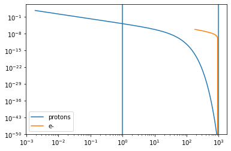

.. code:: ipython3

    j.eval()
    p=j.plot_model()

.. parsed-literal::

    /Users/orion/anaconda3/envs/jetset/lib/python3.8/site-packages/jetset-1.2.0-py3.8-macosx-10.9-x86_64.egg/jetset/jet_spectral_components.py:197: RuntimeWarning: divide by zero encountered in log10
      f_interp = interpolate.interp1d(log10(x), log10(y), bounds_error=False, kind=interp)

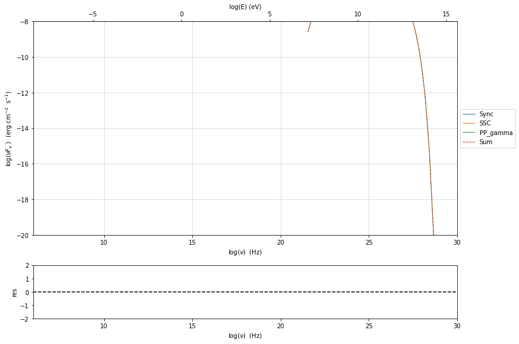

.. code:: ipython3

    j._blob.g

.. parsed-literal::

    0.9990388294313726

.. code:: ipython3

    y=j.emitters_distribution.n_gamma_p
    x=j.emitters_distribution.gamma_p*(const.c**2*const.m_p).to('TeV')
    plt.loglog(x,y,label='protons')
    y=j.emitters_distribution.n_gamma_e
    x=j.emitters_distribution.gamma_e*(const.c**2*const.m_p).to('TeV')
    plt.loglog(x,y,label='e-')
    
    plt.axvline(1000)
    plt.axvline(1)
    plt.legend()
    plt.ylim(1E-50,None)

.. parsed-literal::

    (1e-50, 1.0618501458514672e+19)

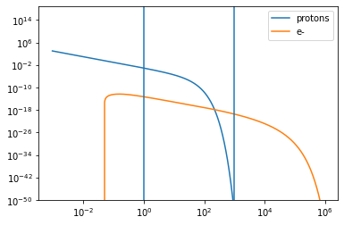

.. code:: ipython3

    p=j.emitters_distribution.plot()
    p.ax.set_ylim(None,10)
    p.ax.set_xlim(0,9)

.. parsed-literal::

    ==> Init_Np_Ne_pp

.. parsed-literal::

    (0.0, 9.0)

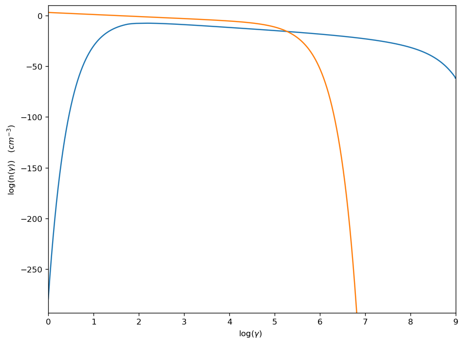

.. code:: ipython3

    x=j.emitters_distribution.gamma_e
    y=j.emitters_distribution.n_gamma_
    m=x>1E12/938E6
    print(np.trapz(y[m],x[m]**2)*(const.c**2*const.m_p).to('erg'))
    print('%e'%x[m].min(),m)

::

    ---------------------------------------------------------------------------

    AttributeError                            Traceback (most recent call last)

    <ipython-input-45-0b2cb3f6a5eb> in <module>
          1 x=j.emitters_distribution.gamma_e
    ----> 2 y=j.emitters_distribution.n_gamma_
          3 m=x>1E12/938E6
          4 print(np.trapz(y[m],x[m]**2)*(const.c**2*const.m_p).to('erg'))
          5 print('%e'%x[m].min(),m)

    AttributeError: 'JetkernelEmittersDistribution' object has no attribute 'n_gamma_'

.. code:: ipython3

    1000/(const.c**2*const.m_p).to('TeV'),j.parameters.gamma_cut.val,1E12/938E6,x[m].min()

.. parsed-literal::

    (<Quantity 1065788.92478889 1 / TeV>,
     1066098.0810234542,
     1066.0980810234541,
     1.021158714696652)

.. code:: ipython3

    x[x>1E12/938E6].min()

.. parsed-literal::

    1079.178409377536

.. code:: ipython3

    j.energetic_report()

.. parsed-literal::

    -----------------------------------------------------------------------------------------
    jet eneregetic report:
         name                   type               units        val     
    -------------- ----------------------------- --------- -------------
               U_e Energy dens. blob rest. frame erg / cm3  4.944831e-11
          U_p_cold Energy dens. blob rest. frame erg / cm3  1.503276e-03
               U_B Energy dens. blob rest. frame erg / cm3  3.978874e-04
               U_p Energy dens. blob rest. frame erg / cm3  2.119494e+00
        U_p_target Energy dens. blob rest. frame erg / cm3 2.215543e-314
           U_Synch Energy dens. blob rest. frame erg / cm3  1.469628e-11
       U_Synch_DRF Energy dens. disk rest. frame erg / cm3  1.469628e-11
            U_Disk Energy dens. blob rest. frame erg / cm3  0.000000e+00
             U_BLR Energy dens. blob rest. frame erg / cm3  0.000000e+00
              U_DT Energy dens. blob rest. frame erg / cm3  0.000000e+00
             U_CMB Energy dens. blob rest. frame erg / cm3  0.000000e+00
        U_Disk_DRF Energy dens. disk rest. frame erg / cm3  0.000000e+00
         U_BLR_DRF Energy dens. disk rest. frame erg / cm3  0.000000e+00
          U_DT_DRF Energy dens. disk rest. frame erg / cm3  0.000000e+00
         U_CMB_DRF Energy dens. disk rest. frame erg / cm3  0.000000e+00
         L_Sync_rf         Lum. blob rest. frme.   erg / s  2.952818e+33
          L_SSC_rf         Lum. blob rest. frme.   erg / s  1.031094e+25
      L_EC_Disk_rf         Lum. blob rest. frme.   erg / s  0.000000e+00
       L_EC_BLR_rf         Lum. blob rest. frme.   erg / s  0.000000e+00
        L_EC_DT_rf         Lum. blob rest. frme.   erg / s  0.000000e+00
       L_EC_CMB_rf         Lum. blob rest. frme.   erg / s  0.000000e+00
     L_pp_gamma_rf         Lum. blob rest. frme.   erg / s  1.215046e+36
        jet_L_Sync                      jet Lum.   erg / s  7.382044e+34
         jet_L_SSC                      jet Lum.   erg / s  2.577736e+26
     jet_L_EC_Disk                      jet Lum.   erg / s  0.000000e+00
      jet_L_EC_BLR                      jet Lum.   erg / s  0.000000e+00
       jet_L_EC_DT                      jet Lum.   erg / s  0.000000e+00
      jet_L_EC_CMB                      jet Lum.   erg / s  0.000000e+00
    jet_L_pp_gamma                      jet Lum.   erg / s  3.037614e+37
         jet_L_rad                      jet Lum.   erg / s  3.044996e+37
         jet_L_kin                      jet Lum.   erg / s  3.180155e+46
         jet_L_tot                      jet Lum.   erg / s  3.180752e+46
           jet_L_e                      jet Lum.   erg / s  7.414120e+35
           jet_L_B                      jet Lum.   erg / s  5.965795e+42
      jet_L_p_cold                      jet Lum.   erg / s  2.253964e+43
           jet_L_p                      jet Lum.   erg / s  3.177901e+46
    -----------------------------------------------------------------------------------------

.. code:: ipython3

    jetkernel.erg_to_TeV

.. parsed-literal::

    0.6241512

.. code:: ipython3

    j.emitters_distribution.update()

.. code:: ipython3

    j.emitters_distribution.plot2p(energy_unit='TeV')

.. parsed-literal::

    <jetset.plot_sedfit.PlotPdistr at 0x7fbfe0e73d30>

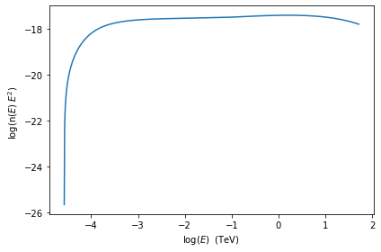

.. code:: ipython3

    from astropy import units as u
    from astropy import constants as const

.. code:: ipython3

    #ng=nH
    #ns=4nH
    
    #vs= 300 km/s 3E7 cm/s assumed constant
    #vd= 200 km/s ????
    #hd= 100 pc
    #omega 2-2.5 Eq. 8 Lamastra 2017
    #Mach nomber
    
    def N_H(N_H0,r):
        """
        -N_H0 1/cm^3
        -r  cm
        """
        
        return N_H0/(r*r)
    
    def L_AGN(M_BH_dot,eta=0.1):
        """
        -M_BH_dot M_sun/year
        -eta eff
        """
        
        return (eta*M_BH_dot*const.M_sun.cgs*const.c.cgs).value
    
    
    def L_SB_kin():
        
        return eps_SN*nu_SN*E_SN
    
    
    def tau_pp(ng,Ep):
        """
        - ng 1/cm^3
        - Ep GeV
        return tau pp in seconds
        """
            sig_pp=30*(0.95 +0.06*np.log(Ep) )*1E-27 #cm-2
        return 1.0/(0.5*ng*sig_pp*const.c.to('cm s-1')).value
        
    def tau_dyn(Rs,vs):
        """
        - Rs cm
        - vs cm/s
        return tau dyn in seconds
        """
        return Rs/vs
    
    def Rs(MachN,t,vd):
        """
        M 
        return 
        """
        return 0.9*M*vd*t
        
    def B_ISM(Sigma_gas,a):
        """
        - Sigma_gas grams/cm^2
        - a index, range [0.4,1]
        return B ISM in Gauss
        """
        return 6*(Sigma_gas/0.0025)*1E6
    
    
    def B_shock(ns,Ts,epsB):
        """
        - ns shocked gas density = 4nH
        - Ts shocked gas Temperature 
        return shock magnetic field
        """
        
        return np.sqrt(8*np.pi*ns*Ts*const.k_B.cgs.value)
        
    
        
        
    def Ts(vs):
        """
        -vs shock velocity cm/s
        """
        
        return (3/16)*const.m_p.cgs.value*const.c.cgs.value**2/(const.k_B.cgs.value)
        
        
        
        
    def N_p_pars(vs_kms,tau_age_kyrs,B_mug):
        
        return 0.5*(vs_kms/1000)**2*tau_age_kyrs*B_mug/(const.m_p*const.c**2).to('TeV').value
    
    def eval_t_inj(L_kin,N_H,R):
        pass
    
    def eval_Rho_R(R,alpha_index):
        return R**(-alpha_index)

.. code:: ipython3

    const.k_B.cgs

.. math::

    1.380649 \times 10^{-16} \; \mathrm{\frac{erg}{K}}

.. code:: ipython3

    Ep=np.logspace(1,6,100)
    plt.loglog(Ep,tau_pp(1E4,Ep)/86400/365)

.. parsed-literal::

    [<matplotlib.lines.Line2D at 0x7fa55a9a7040>]

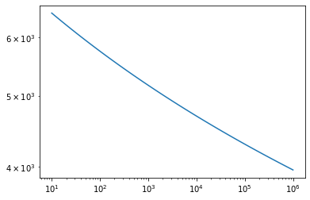

.. code:: ipython3

    N_p_pars(300,1000,50)

.. parsed-literal::

    2398025.0807750127

.. code:: ipython3

    def rho_g_2(R,Lb,Rvir):
        rg=np.zeros(R.size)
        rho_0=1000*const.m_p.to('g').value*(Lb/(1E45))**(1/3)
        msk=R<Rvir
        rg[msk]=rho_0/(1+(R[msk]/(100*const.pc.to('cm').value))**2)
        rg[~msk]=rho_0/(1+(Rvir/(100*const.pc.to('cm').value))**2)
        return rg/const.m_p.to('g').value
    
    def rho_g_1(R,Lb,Rvir):
        Rdisk=0.04*Rvir
        rg=np.zeros(R.size)
        rho_0=1000*const.m_p.to('g').value*(Lb/(1E45))**(1/3)
        msk=R<Rdisk
        msk1=R>Rvir
        rg[msk] = rho_0/(1+(R[msk]/(100*const.pc.to('cm').value))**2)
        rg[~msk]= rho_0/(1+(Rdisk/(100*const.pc.to('cm').value))**2)*(R[~msk]/Rdisk)**-3.95
        rg[msk1]= rho_0/(1+(Rvir/(100*const.pc.to('cm').value))**2)*(Rvir/Rdisk)**-3.95
        return rg/const.m_p.to('g').value

.. code:: ipython3

    R=np.logspace(-1,5.5,100)*u.pc.to('cm')
    plt.loglog(R/const.pc.to('cm'),rho_g_1(R,1E42,5000*const.pc.to('cm').value))
    plt.loglog(R/const.pc.to('cm'),rho_g_1(R,1E45,5000*const.pc.to('cm').value))
    plt.loglog(R/const.pc.to('cm'),rho_g_1(R,1E48,5000*const.pc.to('cm').value))
    
    plt.ylim(1E-6,1E5)

.. parsed-literal::

    (1e-06, 100000.0)

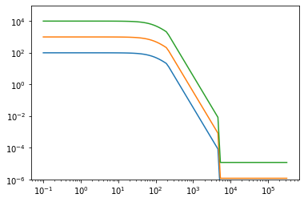

.. code:: ipython3

    (100*const.pc.to('km')/(1000*u.km/u.s)).to('yr')/1E5

.. math::

    0.97779222 \; \mathrm{yr}

.. code:: ipython3

    tau_pp(1E4,10)*u.s.to('yr')/1E5

.. parsed-literal::

    0.06475797605229375

.. parsed-literal::

    [<matplotlib.lines.Line2D at 0x7fc4fbeb0a00>]

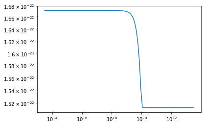

.. code:: ipython3

    from jetset.jet_model import Jetpp,Jet
    from jetset.plot_sedfit import PlotSED
    from jetset.model_manager import FitModel
    
    from astropy import units as u
    
    
    from jetset.template_2Dmodel import EBLAbsorptionTemplate
    ebl_dominguez=EBLAbsorptionTemplate.from_name('Dominguez_2010')
    ebl_finke=EBLAbsorptionTemplate.from_name('Finke_2010')
    ebl_franceschini=EBLAbsorptionTemplate.from_name('Franceschini_2008')
    p_index=1.9
    jp=Jetpp(proton_distribution='plc',name='jet_pp',T_esc_e_second=None)
    jp.parameters.z_cosm.val=z=0.0033
    jp.parameters.R.val=100*u.pc.to('cm')
    jp.parameters.beam_obj.val=1
    jp.parameters.gamma_cut.val=1E5
    jp.parameters.NH_pp.val=4*1E4
    jp.parameters.N.val=0.1E-9
    
    jp.parameters.p.val=2.0
    jp.parameters.B.val=1
    jp.parameters.gmin.val=1
    jp.parameters.gmax.val=1E8
    jp._blob.N0_e_pp_factor =1E1
    

.. parsed-literal::

    ==> _set_blob Init_Np_Ne_pp

.. code:: ipython3

    composite_model=FitModel(nu_size=500,name='EBL corrected')
    composite_model.add_component(jp)
    composite_model.add_component(ebl_franceschini)
    ebl_franceschini.parameters.z_cosm.val=0.0033
    composite_model.link_par(par_name='z_cosm',model_name_list=['jet_pp'],root_model_name='Franceschini_2008')
    composite_model.composite_expr='jet_pp*Franceschini_2008'
    
    composite_model.jet_pp.parameters.p.val=2.5
    composite_model.eval()
    p=composite_model.jet_pp.plot_model(label='%f'%composite_model.jet_pp.parameters.p.val)
    jp.energetic_report(verbose=False)
    print(jp.energetic_dict['U_p']*jp._blob.Vol_sphere/1E5)
    
    composite_model.jet_pp.parameters.p.val=2.2
    composite_model.eval()
    p=composite_model.jet_pp.plot_model(plot_obj=p,label='%f'%composite_model.jet_pp.parameters.p.val)
    jp.energetic_report(verbose=False)
    print(jp.energetic_dict['U_p']*jp._blob.Vol_sphere/1E5)
    
    composite_model.jet_pp.parameters.p.val=1.9
    composite_model.eval()
    p=composite_model.jet_pp.plot_model(plot_obj=p,label='%f'%composite_model.jet_pp.parameters.p.val)
    jp.energetic_report(verbose=False)
    print(jp.energetic_dict['U_p']*jp._blob.Vol_sphere/3E5)
    p.rescale(x_min=10,y_min=-26,y_max=-10)

.. parsed-literal::

    ==>Init lin_fun
    ==> T_esc_e_second 10292712505.353258

.. parsed-literal::

    /Users/orion/anaconda3/envs/jetset/lib/python3.8/site-packages/jetset-1.2.0-py3.8-macosx-10.9-x86_64.egg/jetset/model_manager.py:160: UserWarning: no cosmology defined, using default FlatLambdaCDM(name="Planck13", H0=67.8 km / (Mpc s), Om0=0.307, Tcmb0=2.725 K, Neff=3.05, m_nu=[0.   0.   0.06] eV, Ob0=0.0483)
      warnings.warn('no cosmology defined, using default %s'%self.cosmo)

.. parsed-literal::

    ==>update lin_fun
    ==> _set_blob Init_Np_Ne_pp
    5.516639534505116e+44
    ==>Init lin_fun
    ==> T_esc_e_second 10292712505.353258
    ==>update lin_fun
    ==> _set_blob Init_Np_Ne_pp
    9.80636425185256e+44
    ==>Init lin_fun
    ==> T_esc_e_second 10292712505.353258
    ==>update lin_fun
    ==> _set_blob Init_Np_Ne_pp
    1.1148790789631726e+45

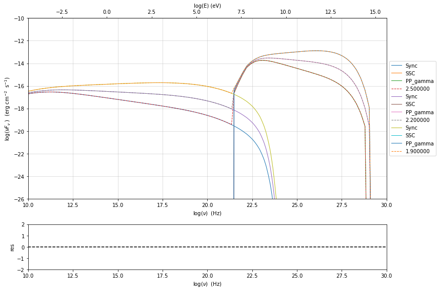

.. code:: ipython3

    jp._blob.T_esc_e_second/1E9

.. parsed-literal::

    10.292712505353258

.. code:: ipython3

    from astropy import units as u

.. code:: ipython3

    u.pc.to('cm')

.. parsed-literal::

    3.0856775814671913e+18

.. code:: ipython3

    jp.energetic_report(verbose=False)

.. code:: ipython3

    E_tot_p=1.6E-3*jp.parameters.NH_pp.val*(4/3)*np.pi*jp.parameters.R.val**3
    E_tot_p_k=1.6E-24*(100*1E5)**2*jp.parameters.NH_pp.val*(4/3)*np.pi*jp.parameters.R.val**3
    print('%e'%E_tot_p)
    print('%e'%E_tot_p_k)
    
    vw=100*1E5 #(cm/s)
    R_out=jp.parameters.R.val
    t_out=R_out/vw
    print('t_out=%e'%(t_out/(86400*365)))
    print('%e'%(E_tot_p/1E42/(86400*365)))
    print('t_inj=%e'%(E_tot_p_k/1E42/(86400*365)))
    
    print('vw=%e'%vw)

.. parsed-literal::

    1.809557e+61
    1.809557e+54
    t_out=9.512938e+05
    5.738069e+11
    t_inj=5.738069e+04
    vw=1.000000e+07

.. code:: ipython3

    je=Jet(electron_distribution='bkn')
    je.add_EC_component('EC_DT')
    je.set_gamma_grid_size(200)
    je.parameters.z_cosm.val=z=1.054000
    je.parameters.R.val=5E17
    je.parameters.R_H.val=3.5E23
    je.parameters.L_Disk.val=4E46
    je.parameters.T_Disk.val=12000
    je.parameters.T_DT.val=300
    je.parameters.R_DT.val=1.5E18
    je.parameters.beam_obj.val=25
    je.parameters.gamma_break.val=300
    je.parameters.p.val=2.5
    je.parameters.p_1.val=3.4
    je.parameters.B.val=.05
    je.parameters.N.val=6
    je.parameters.gmin.val=50
    je.parameters.gmax.val=1E8
    je.eval()
    p=je.plot_model(sed_data=None)
    p.rescale(y_min=-18,y_max=-9)

.. parsed-literal::

    ==> _set_blob InitNe
    ==> _set_blob InitNe
    ==>Init lin_fun
    ==>update lin_fun
    ==> _set_blob InitNe

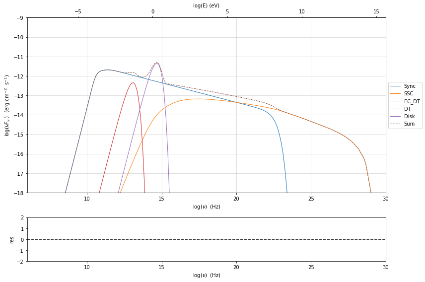

.. code:: ipython3

    %matplotlib inline
    p=jp.plot_model(sed_data=sed_data)
    p.add_model_plot(j)

::

    ---------------------------------------------------------------------------

    NameError                                 Traceback (most recent call last)

    <ipython-input-11-b97a24c769a1> in <module>
          1 get_ipython().run_line_magic('matplotlib', 'inline')
    ----> 2 p=jp.plot_model(sed_data=sed_data)
          3 p.add_model_plot(j)

    NameError: name 'jp' is not defined

.. code:: ipython3

    1.6E-3*jp.parameters.NH_pp.val*(4/3)*np.pi*jp.parameters.R.val**3

.. parsed-literal::

    1.809557368467721e+61

.. code:: ipython3

    j=Jet()

.. code:: ipython3

    j.show_model()

.. parsed-literal::

    
    -------------------------------------------------------------------------------------------------------------------
    jet model description
    -------------------------------------------------------------------------------------------------------------------
    name: jet_leptonic  
    
    electrons distribution:
     type: pl  
     gamma energy grid size:  1001
     gmin grid : 2.000000e+00
     gmax grid : 1.000000e+06
     normalization  True
     log-values  False
    
    radiative fields:
     seed photons grid size:  100
     IC emission grid size:  50
     source emissivity lower bound :  1.000000e-120
     spectral components:
       name:Sum, state: on
       name:Sync, state: self-abs
       name:SSC, state: on
    external fields transformation method: blob
    
    SED info:
     nu grid size :200
     nu mix (Hz): 1.000000e+06
     nu max (Hz): 1.000000e+30
    
    flux plot lower bound   :  1.000000e-120
    
     model name    name         par type           units          val      phys. bound. min phys. bound. max  log  frozen
    ------------ -------- ------------------- --------------- ------------ ---------------- ---------------- ----- ------
    jet_leptonic     gmin  low-energy-cut-off lorentz-factor* 2.000000e+00     1.000000e+00     1.000000e+09 False  False
    jet_leptonic     gmax high-energy-cut-off lorentz-factor* 1.000000e+06     1.000000e+00     1.000000e+15 False  False
    jet_leptonic        N    emitters_density         1 / cm3 1.000000e+02     0.000000e+00               -- False  False
    jet_leptonic        p   HE_spectral_slope                 2.000000e+00    -1.000000e+01     1.000000e+01 False  False
    jet_leptonic        R         region_size              cm 5.000000e+15     1.000000e+03     1.000000e+30 False  False
    jet_leptonic      R_H     region_position              cm 1.000000e+17     0.000000e+00               -- False   True
    jet_leptonic        B      magnetic_field               G 1.000000e-01     0.000000e+00               -- False  False
    jet_leptonic beam_obj             beaming Lorentz-factor* 1.000000e+01     1.000000e-04               -- False  False
    jet_leptonic   z_cosm            redshift                 1.000000e-01     0.000000e+00               -- False  False
    -------------------------------------------------------------------------------------------------------------------

.. code:: ipython3

    j.set_IC_nu_size(300)
    j.set_gamma_grid_size(100)
    j.spectral_components.Sync.state='on'

.. code:: ipython3

    %prun j.eval()

.. parsed-literal::

     

.. code:: ipython3

    j.plot_model()

.. parsed-literal::

    <jetset.plot_sedfit.PlotSED at 0x7fa55b9623a0>

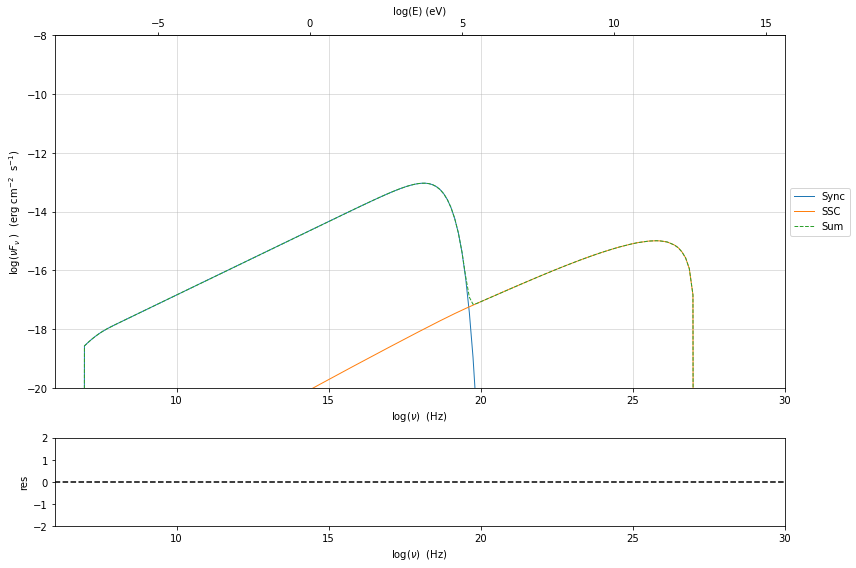

.. code:: ipython3

    from jetset.jet_model import Jet
    j = Jet(proton_distribution='plc')
    j.parameters.gmin.val = 2
    j.parameters.gmax.val = 1E8
    j.parameters.NH_pp.val = 1E10
    j.parameters.N.val = 1E1
    j.parameters.B.val = 80
    
    j.parameters.p.val = 2.5
    j.eval()
    j.show_model()
    sum1=j.spectral_components.Sum.SED.nuFnu
    
    j.plot_model()

.. parsed-literal::

    
    -------------------------------------------------------------------------------------------------------------------
    jet model description
    -------------------------------------------------------------------------------------------------------------------
    name: jet_hadronic_pp  
    
    protons distribution:
     type: plc  
     gamma energy grid size:  201
     gmin grid : 2.000000e+00
     gmax grid : 1.000000e+08
     normalization  True
     log-values  False
    
    radiative fields:
     seed photons grid size:  100
     IC emission grid size:  100
     source emissivity lower bound :  1.000000e-120
     spectral components:
       name:Sum, state: on
       name:Sync, state: self-abs
       name:SSC, state: on
       name:PP_gamma, state: on
       name:PP_neutrino_tot, state: on
       name:PP_neutrino_mu, state: on
       name:PP_neutrino_e, state: on
       name:Bremss_ep, state: on
    external fields transformation method: blob
    
    SED info:
     nu grid size jetkernel: 1000
     nu grid size: 500
     nu mix (Hz): 1.000000e+06
     nu max (Hz): 1.000000e+30
    
    flux plot lower bound   :  1.000000e-120
    

.. raw:: html

    <i>Table length=11</i>
    <table id="table140398422345904" class="table-striped table-bordered table-condensed">
    <thead><tr><th>model name</th><th>name</th><th>par type</th><th>units</th><th>val</th><th>phys. bound. min</th><th>phys. bound. max</th><th>log</th><th>frozen</th></tr></thead>
    <thead><tr><th>str15</th><th>str9</th><th>str19</th><th>object</th><th>float64</th><th>float64</th><th>float64</th><th>bool</th><th>bool</th></tr></thead>
    <tr><td>jet_hadronic_pp</td><td>R</td><td>region_size</td><td>cm</td><td>5.000000e+15</td><td>1.000000e+03</td><td>1.000000e+30</td><td>False</td><td>False</td></tr>
    <tr><td>jet_hadronic_pp</td><td>R_H</td><td>region_position</td><td>cm</td><td>1.000000e+17</td><td>0.000000e+00</td><td>--</td><td>False</td><td>True</td></tr>
    <tr><td>jet_hadronic_pp</td><td>B</td><td>magnetic_field</td><td>gauss</td><td>8.000000e+01</td><td>0.000000e+00</td><td>--</td><td>False</td><td>False</td></tr>
    <tr><td>jet_hadronic_pp</td><td>beam_obj</td><td>beaming</td><td>lorentz-factor*</td><td>1.000000e+01</td><td>1.000000e-04</td><td>--</td><td>False</td><td>False</td></tr>
    <tr><td>jet_hadronic_pp</td><td>z_cosm</td><td>redshift</td><td></td><td>1.000000e-01</td><td>0.000000e+00</td><td>--</td><td>False</td><td>False</td></tr>
    <tr><td>jet_hadronic_pp</td><td>gmin</td><td>low-energy-cut-off</td><td>lorentz-factor*</td><td>2.000000e+00</td><td>1.000000e+00</td><td>1.000000e+09</td><td>False</td><td>False</td></tr>
    <tr><td>jet_hadronic_pp</td><td>gmax</td><td>high-energy-cut-off</td><td>lorentz-factor*</td><td>1.000000e+08</td><td>1.000000e+00</td><td>1.000000e+15</td><td>False</td><td>False</td></tr>
    <tr><td>jet_hadronic_pp</td><td>N</td><td>emitters_density</td><td>1 / cm3</td><td>1.000000e+01</td><td>0.000000e+00</td><td>--</td><td>False</td><td>False</td></tr>
    <tr><td>jet_hadronic_pp</td><td>NH_pp</td><td>target_density</td><td>1 / cm3</td><td>1.000000e+10</td><td>0.000000e+00</td><td>--</td><td>False</td><td>False</td></tr>
    <tr><td>jet_hadronic_pp</td><td>gamma_cut</td><td>turn-over-energy</td><td>lorentz-factor*</td><td>1.000000e+04</td><td>1.000000e+00</td><td>1.000000e+09</td><td>False</td><td>False</td></tr>
    <tr><td>jet_hadronic_pp</td><td>p</td><td>LE_spectral_slope</td><td></td><td>2.500000e+00</td><td>-1.000000e+01</td><td>1.000000e+01</td><td>False</td><td>False</td></tr>
    </table>

.. parsed-literal::

    -------------------------------------------------------------------------------------------------------------------

.. parsed-literal::

    <jetset.plot_sedfit.PlotSED at 0x7fb10e165cd0>

.. image:: hadornic_validate_temp_ev_files/hadornic_validate_temp_ev_85_4.png

.. code:: ipython3

    j.save_model('test_jet_hadronic.pkl')
    j_new = Jet.load_model('test_jet_hadronic.pkl')
    j_new.eval()
    j_new.plot_model()
    
    sum2 = j_new.spectral_components.Sum.SED.nuFnu
    np.testing.assert_allclose(sum2,sum1, rtol=1E-5)

.. raw:: html

    <i>Table length=11</i>
    <table id="table140398426862448" class="table-striped table-bordered table-condensed">
    <thead><tr><th>model name</th><th>name</th><th>par type</th><th>units</th><th>val</th><th>phys. bound. min</th><th>phys. bound. max</th><th>log</th><th>frozen</th></tr></thead>
    <thead><tr><th>str15</th><th>str9</th><th>str19</th><th>object</th><th>float64</th><th>float64</th><th>float64</th><th>bool</th><th>bool</th></tr></thead>
    <tr><td>jet_hadronic_pp</td><td>gmin</td><td>low-energy-cut-off</td><td>lorentz-factor*</td><td>2.000000e+00</td><td>1.000000e+00</td><td>1.000000e+09</td><td>False</td><td>False</td></tr>
    <tr><td>jet_hadronic_pp</td><td>gmax</td><td>high-energy-cut-off</td><td>lorentz-factor*</td><td>1.000000e+08</td><td>1.000000e+00</td><td>1.000000e+15</td><td>False</td><td>False</td></tr>
    <tr><td>jet_hadronic_pp</td><td>N</td><td>emitters_density</td><td>1 / cm3</td><td>1.000000e+01</td><td>0.000000e+00</td><td>--</td><td>False</td><td>False</td></tr>
    <tr><td>jet_hadronic_pp</td><td>NH_pp</td><td>target_density</td><td>1 / cm3</td><td>1.000000e+10</td><td>0.000000e+00</td><td>--</td><td>False</td><td>False</td></tr>
    <tr><td>jet_hadronic_pp</td><td>gamma_cut</td><td>turn-over-energy</td><td>lorentz-factor*</td><td>1.000000e+04</td><td>1.000000e+00</td><td>1.000000e+09</td><td>False</td><td>False</td></tr>
    <tr><td>jet_hadronic_pp</td><td>p</td><td>LE_spectral_slope</td><td></td><td>2.500000e+00</td><td>-1.000000e+01</td><td>1.000000e+01</td><td>False</td><td>False</td></tr>
    <tr><td>jet_hadronic_pp</td><td>R</td><td>region_size</td><td>cm</td><td>5.000000e+15</td><td>1.000000e+03</td><td>1.000000e+30</td><td>False</td><td>False</td></tr>
    <tr><td>jet_hadronic_pp</td><td>R_H</td><td>region_position</td><td>cm</td><td>1.000000e+17</td><td>0.000000e+00</td><td>--</td><td>False</td><td>True</td></tr>
    <tr><td>jet_hadronic_pp</td><td>B</td><td>magnetic_field</td><td>gauss</td><td>8.000000e+01</td><td>0.000000e+00</td><td>--</td><td>False</td><td>False</td></tr>
    <tr><td>jet_hadronic_pp</td><td>beam_obj</td><td>beaming</td><td>lorentz-factor*</td><td>1.000000e+01</td><td>1.000000e-04</td><td>--</td><td>False</td><td>False</td></tr>
    <tr><td>jet_hadronic_pp</td><td>z_cosm</td><td>redshift</td><td></td><td>1.000000e-01</td><td>0.000000e+00</td><td>--</td><td>False</td><td>False</td></tr>
    </table>

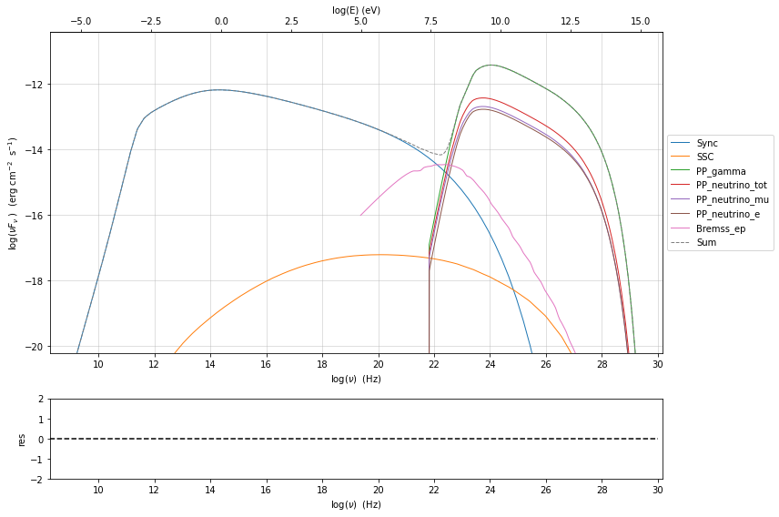

.. code:: ipython3

    j_new._blob.T_esc_e_second

.. parsed-literal::

    6.93575010000274e-310

.. code:: ipython3

    x=sum2/sum1

.. code:: ipython3

    x.min()

.. math::

    1.5479709 \times 10^{-108} \; \mathrm{}

