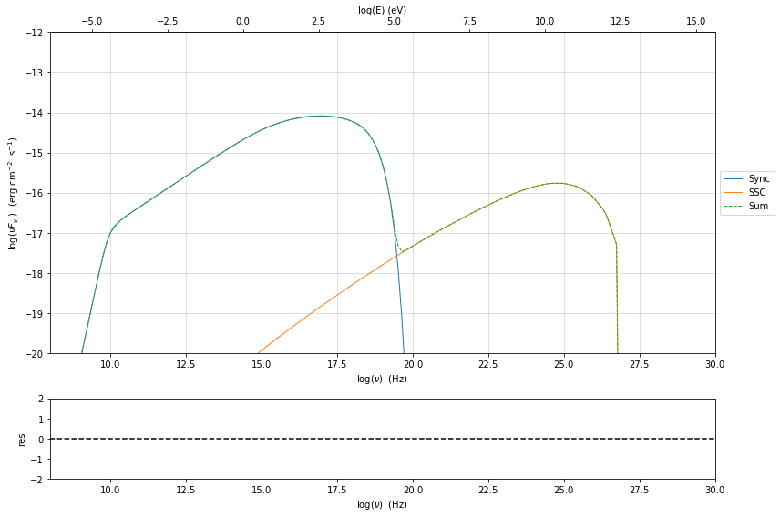
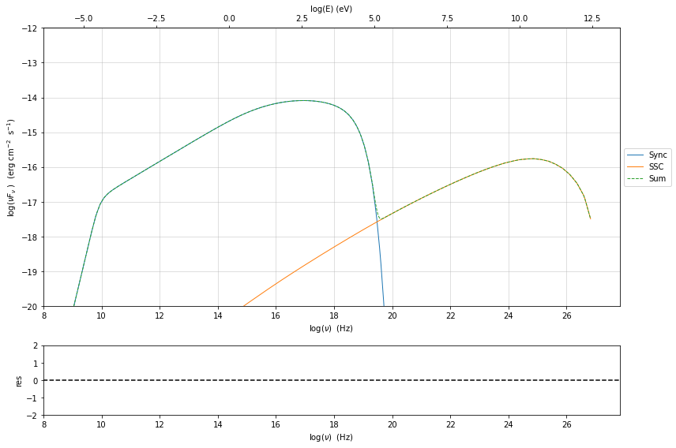
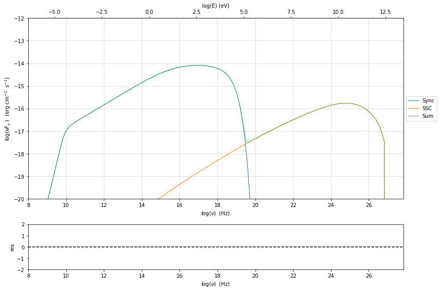
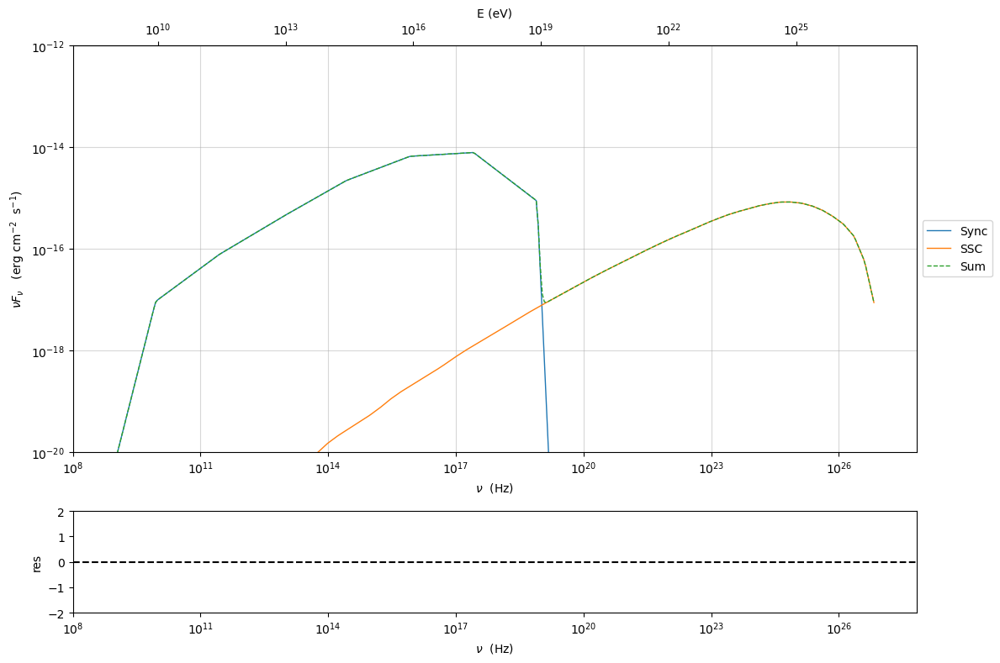
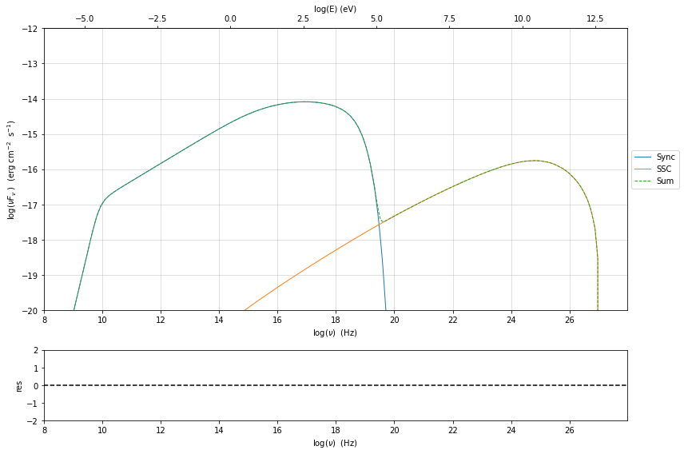

.. _jet_numerical_guide:

Numerical setup
===============

.. code:: ipython3

    import jetset
    print('tested on jetset',jetset.__version__)

.. parsed-literal::

    tested on jetset 1.2.0rc6

Changing the grid size for the electron distribution
----------------------------------------------------

.. code:: ipython3

    from jetset.jet_model import Jet
    my_jet=Jet(name='test',electron_distribution='lppl',)
    my_jet.show_model()

.. parsed-literal::

    
    --------------------------------------------------------------------------------
    jet model description
    --------------------------------------------------------------------------------
    name: test  
    
    electrons distribution:
     type: lppl  
     gamma energy grid size:  201
     gmin grid : 2.000000e+00
     gmax grid : 1.000000e+06
     normalization  True
     log-values  False
    
    radiative fields:
     seed photons grid size:  100
     IC emission grid size:  100
     source emissivity lower bound :  1.000000e-120
     spectral components:
       name:Sum, state: on
       name:Sync, state: self-abs
       name:SSC, state: on
    external fields transformation method: blob
    
    SED info:
     nu grid size jetkernel: 1000
     nu grid size: 500
     nu mix (Hz): 1.000000e+06
     nu max (Hz): 1.000000e+30
    
    flux plot lower bound   :  1.000000e-120
    
    --------------------------------------------------------------------------------

.. raw:: html

    <i>Table length=11</i>
    <table id="table140393533601440-542086" class="table-striped table-bordered table-condensed">
    <thead><tr><th>model name</th><th>name</th><th>par type</th><th>units</th><th>val</th><th>phys. bound. min</th><th>phys. bound. max</th><th>log</th><th>frozen</th></tr></thead>
    <tr><td>test</td><td>R</td><td>region_size</td><td>cm</td><td>5.000000e+15</td><td>1.000000e+03</td><td>1.000000e+30</td><td>False</td><td>False</td></tr>
    <tr><td>test</td><td>R_H</td><td>region_position</td><td>cm</td><td>1.000000e+17</td><td>0.000000e+00</td><td>--</td><td>False</td><td>True</td></tr>
    <tr><td>test</td><td>B</td><td>magnetic_field</td><td>gauss</td><td>1.000000e-01</td><td>0.000000e+00</td><td>--</td><td>False</td><td>False</td></tr>
    <tr><td>test</td><td>beam_obj</td><td>beaming</td><td>lorentz-factor*</td><td>1.000000e+01</td><td>1.000000e-04</td><td>--</td><td>False</td><td>False</td></tr>
    <tr><td>test</td><td>z_cosm</td><td>redshift</td><td></td><td>1.000000e-01</td><td>0.000000e+00</td><td>--</td><td>False</td><td>False</td></tr>
    <tr><td>test</td><td>gmin</td><td>low-energy-cut-off</td><td>lorentz-factor*</td><td>2.000000e+00</td><td>1.000000e+00</td><td>1.000000e+09</td><td>False</td><td>False</td></tr>
    <tr><td>test</td><td>gmax</td><td>high-energy-cut-off</td><td>lorentz-factor*</td><td>1.000000e+06</td><td>1.000000e+00</td><td>1.000000e+15</td><td>False</td><td>False</td></tr>
    <tr><td>test</td><td>N</td><td>emitters_density</td><td>1 / cm3</td><td>1.000000e+02</td><td>0.000000e+00</td><td>--</td><td>False</td><td>False</td></tr>
    <tr><td>test</td><td>gamma0_log_parab</td><td>turn-over-energy</td><td>lorentz-factor*</td><td>1.000000e+04</td><td>1.000000e+00</td><td>1.000000e+09</td><td>False</td><td>False</td></tr>
    <tr><td>test</td><td>s</td><td>LE_spectral_slope</td><td></td><td>2.000000e+00</td><td>-1.000000e+01</td><td>1.000000e+01</td><td>False</td><td>False</td></tr>
    <tr><td>test</td><td>r</td><td>spectral_curvature</td><td></td><td>4.000000e-01</td><td>-1.500000e+01</td><td>1.500000e+01</td><td>False</td><td>False</td></tr>
    </table>
    

.. parsed-literal::

    --------------------------------------------------------------------------------

It is possible to change the size of the grid for the electron
distributions. It is worth noting that at lower values of the grid size
the speed will increase, **but it is not recommended to go below 100**.

The actual value of the grid size is returned by the :meth:`.Jet.gamma_grid_size`

.. code:: ipython3

    print (my_jet.gamma_grid_size)

.. parsed-literal::

    201

and this value can be changed using the method :meth:`.Jet.set_gamma_grid_size`. In the following we show the result for a grid of size=10, as anticipated the final integration will be not satisfactory

.. code:: ipython3

    my_jet.set_gamma_grid_size(10)
    my_jet.eval()
    sed_plot=my_jet.plot_model()
    sed_plot.rescale(x_min=8,y_min=-20,y_max=-12)

.. code:: ipython3

    my_jet.set_gamma_grid_size(100)
    my_jet.eval()
    sed_plot=my_jet.plot_model()
    sed_plot.rescale(x_min=8,y_min=-20,y_max=-12)

.. code:: ipython3

    my_jet.flux_plot_lim=1E-200
    my_jet.set_gamma_grid_size(100)
    my_jet.eval()
    sed_plot=my_jet.plot_model()
    sed_plot.rescale(x_min=8,y_min=-20,y_max=-12)

.. image:: Jet_example_num_files/Jet_example_num_11_0.png

.. code:: ipython3

    my_jet.set_gamma_grid_size(1000)
    my_jet.eval()
    sed_plot=my_jet.plot_model()
    sed_plot.rescale(x_min=8,y_min=-20,y_max=-12)

Changing the grid size for the seed photons
-------------------------------------------

.. code:: ipython3

    my_jet=Jet(name='test',electron_distribution='lppl',)
    my_jet.show_model()

.. parsed-literal::

    
    --------------------------------------------------------------------------------
    jet model description
    --------------------------------------------------------------------------------
    name: test  
    
    electrons distribution:
     type: lppl  
     gamma energy grid size:  201
     gmin grid : 2.000000e+00
     gmax grid : 1.000000e+06
     normalization  True
     log-values  False
    
    radiative fields:
     seed photons grid size:  100
     IC emission grid size:  100
     source emissivity lower bound :  1.000000e-120
     spectral components:
       name:Sum, state: on
       name:Sync, state: self-abs
       name:SSC, state: on
    external fields transformation method: blob
    
    SED info:
     nu grid size jetkernel: 1000
     nu grid size: 500
     nu mix (Hz): 1.000000e+06
     nu max (Hz): 1.000000e+30
    
    flux plot lower bound   :  1.000000e-120
    
    --------------------------------------------------------------------------------

.. raw:: html

    <i>Table length=11</i>
    <table id="table140393560969856-974824" class="table-striped table-bordered table-condensed">
    <thead><tr><th>model name</th><th>name</th><th>par type</th><th>units</th><th>val</th><th>phys. bound. min</th><th>phys. bound. max</th><th>log</th><th>frozen</th></tr></thead>
    <tr><td>test</td><td>R</td><td>region_size</td><td>cm</td><td>5.000000e+15</td><td>1.000000e+03</td><td>1.000000e+30</td><td>False</td><td>False</td></tr>
    <tr><td>test</td><td>R_H</td><td>region_position</td><td>cm</td><td>1.000000e+17</td><td>0.000000e+00</td><td>--</td><td>False</td><td>True</td></tr>
    <tr><td>test</td><td>B</td><td>magnetic_field</td><td>gauss</td><td>1.000000e-01</td><td>0.000000e+00</td><td>--</td><td>False</td><td>False</td></tr>
    <tr><td>test</td><td>beam_obj</td><td>beaming</td><td>lorentz-factor*</td><td>1.000000e+01</td><td>1.000000e-04</td><td>--</td><td>False</td><td>False</td></tr>
    <tr><td>test</td><td>z_cosm</td><td>redshift</td><td></td><td>1.000000e-01</td><td>0.000000e+00</td><td>--</td><td>False</td><td>False</td></tr>
    <tr><td>test</td><td>gmin</td><td>low-energy-cut-off</td><td>lorentz-factor*</td><td>2.000000e+00</td><td>1.000000e+00</td><td>1.000000e+09</td><td>False</td><td>False</td></tr>
    <tr><td>test</td><td>gmax</td><td>high-energy-cut-off</td><td>lorentz-factor*</td><td>1.000000e+06</td><td>1.000000e+00</td><td>1.000000e+15</td><td>False</td><td>False</td></tr>
    <tr><td>test</td><td>N</td><td>emitters_density</td><td>1 / cm3</td><td>1.000000e+02</td><td>0.000000e+00</td><td>--</td><td>False</td><td>False</td></tr>
    <tr><td>test</td><td>gamma0_log_parab</td><td>turn-over-energy</td><td>lorentz-factor*</td><td>1.000000e+04</td><td>1.000000e+00</td><td>1.000000e+09</td><td>False</td><td>False</td></tr>
    <tr><td>test</td><td>s</td><td>LE_spectral_slope</td><td></td><td>2.000000e+00</td><td>-1.000000e+01</td><td>1.000000e+01</td><td>False</td><td>False</td></tr>
    <tr><td>test</td><td>r</td><td>spectral_curvature</td><td></td><td>4.000000e-01</td><td>-1.500000e+01</td><td>1.500000e+01</td><td>False</td><td>False</td></tr>
    </table>
    

.. parsed-literal::

    --------------------------------------------------------------------------------

we can get the current value of the seed photons grid size using attribute :meth:`.Jet.nu_seed_size`

**in the current version there is lit of the size to 1000**

.. code:: ipython3

    print (my_jet.nu_seed_size)

.. parsed-literal::

    100

and this value can be changed using the method :meth:`.Jet.set_seed_nu_size`. In the following we show the result for a grid of nu_size=10

.. code:: ipython3

    my_jet.nu_seed_size=10
    my_jet.eval()
    sed_plot=my_jet.plot_model()
    sed_plot.rescale(x_min=8,y_min=-20,y_max=-12)

.. image:: Jet_example_num_files/Jet_example_num_19_0.png

Changing the grid size for the IC process spectra
-------------------------------------------------

**in the current version there is a limit of the size to 1000**

.. code:: ipython3

    my_jet=Jet(name='test',electron_distribution='lppl',)
    my_jet.show_model()

.. parsed-literal::

    
    --------------------------------------------------------------------------------
    jet model description
    --------------------------------------------------------------------------------
    name: test  
    
    electrons distribution:
     type: lppl  
     gamma energy grid size:  201
     gmin grid : 2.000000e+00
     gmax grid : 1.000000e+06
     normalization  True
     log-values  False
    
    radiative fields:
     seed photons grid size:  100
     IC emission grid size:  100
     source emissivity lower bound :  1.000000e-120
     spectral components:
       name:Sum, state: on
       name:Sync, state: self-abs
       name:SSC, state: on
    external fields transformation method: blob
    
    SED info:
     nu grid size jetkernel: 1000
     nu grid size: 500
     nu mix (Hz): 1.000000e+06
     nu max (Hz): 1.000000e+30
    
    flux plot lower bound   :  1.000000e-120
    
    --------------------------------------------------------------------------------

.. raw:: html

    <i>Table length=11</i>
    <table id="table140393570244352-621978" class="table-striped table-bordered table-condensed">
    <thead><tr><th>model name</th><th>name</th><th>par type</th><th>units</th><th>val</th><th>phys. bound. min</th><th>phys. bound. max</th><th>log</th><th>frozen</th></tr></thead>
    <tr><td>test</td><td>R</td><td>region_size</td><td>cm</td><td>5.000000e+15</td><td>1.000000e+03</td><td>1.000000e+30</td><td>False</td><td>False</td></tr>
    <tr><td>test</td><td>R_H</td><td>region_position</td><td>cm</td><td>1.000000e+17</td><td>0.000000e+00</td><td>--</td><td>False</td><td>True</td></tr>
    <tr><td>test</td><td>B</td><td>magnetic_field</td><td>gauss</td><td>1.000000e-01</td><td>0.000000e+00</td><td>--</td><td>False</td><td>False</td></tr>
    <tr><td>test</td><td>beam_obj</td><td>beaming</td><td>lorentz-factor*</td><td>1.000000e+01</td><td>1.000000e-04</td><td>--</td><td>False</td><td>False</td></tr>
    <tr><td>test</td><td>z_cosm</td><td>redshift</td><td></td><td>1.000000e-01</td><td>0.000000e+00</td><td>--</td><td>False</td><td>False</td></tr>
    <tr><td>test</td><td>gmin</td><td>low-energy-cut-off</td><td>lorentz-factor*</td><td>2.000000e+00</td><td>1.000000e+00</td><td>1.000000e+09</td><td>False</td><td>False</td></tr>
    <tr><td>test</td><td>gmax</td><td>high-energy-cut-off</td><td>lorentz-factor*</td><td>1.000000e+06</td><td>1.000000e+00</td><td>1.000000e+15</td><td>False</td><td>False</td></tr>
    <tr><td>test</td><td>N</td><td>emitters_density</td><td>1 / cm3</td><td>1.000000e+02</td><td>0.000000e+00</td><td>--</td><td>False</td><td>False</td></tr>
    <tr><td>test</td><td>gamma0_log_parab</td><td>turn-over-energy</td><td>lorentz-factor*</td><td>1.000000e+04</td><td>1.000000e+00</td><td>1.000000e+09</td><td>False</td><td>False</td></tr>
    <tr><td>test</td><td>s</td><td>LE_spectral_slope</td><td></td><td>2.000000e+00</td><td>-1.000000e+01</td><td>1.000000e+01</td><td>False</td><td>False</td></tr>
    <tr><td>test</td><td>r</td><td>spectral_curvature</td><td></td><td>4.000000e-01</td><td>-1.500000e+01</td><td>1.500000e+01</td><td>False</td><td>False</td></tr>
    </table>
    

.. parsed-literal::

    --------------------------------------------------------------------------------

.. code:: ipython3

    print(my_jet.IC_nu_size)

.. parsed-literal::

    100

.. code:: ipython3

    my_jet.IC_nu_size=20
    my_jet.eval()
    sed_plot=my_jet.plot_model()
    sed_plot.rescale(x_min=8,y_min=-20,y_max=-12)

.. code:: ipython3

    my_jet.IC_nu_size=100
    my_jet.eval()
    sed_plot=my_jet.plot_model()
    sed_plot.rescale(x_min=8,y_min=-20,y_max=-12)

.. code:: ipython3

    my_jet.IC_nu_size=200
    my_jet.eval()
    sed_plot=my_jet.plot_model()
    sed_plot.rescale(x_min=8,y_min=-20,y_max=-12)

.. code:: ipython3

    my_jet._blob.IC_adaptive_e_binning
    my_jet.IC_nu_size=100
    my_jet.eval()
    sed_plot=my_jet.plot_model()
    sed_plot.rescale(x_min=8,y_min=-20,y_max=-12)

.. code:: ipython3

    my_jet.parameters.beam_obj.val=15
    my_jet.eval()

.. code:: ipython3

    my_jet._blob.BulkFactor

.. parsed-literal::

    15.0

.. code:: ipython3

    my_jet=Jet(name='test',electron_distribution='lppl',beaming_expr='bulk_theta')
    my_jet.parameters

.. raw:: html

    <i>Table length=12</i>
    <table id="table140393560438048-748319" class="table-striped table-bordered table-condensed">
    <thead><tr><th>model name</th><th>name</th><th>par type</th><th>units</th><th>val</th><th>phys. bound. min</th><th>phys. bound. max</th><th>log</th><th>frozen</th></tr></thead>
    <tr><td>test</td><td>R</td><td>region_size</td><td>cm</td><td>5.000000e+15</td><td>1.000000e+03</td><td>1.000000e+30</td><td>False</td><td>False</td></tr>
    <tr><td>test</td><td>R_H</td><td>region_position</td><td>cm</td><td>1.000000e+17</td><td>0.000000e+00</td><td>--</td><td>False</td><td>True</td></tr>
    <tr><td>test</td><td>B</td><td>magnetic_field</td><td>gauss</td><td>1.000000e-01</td><td>0.000000e+00</td><td>--</td><td>False</td><td>False</td></tr>
    <tr><td>test</td><td>theta</td><td>jet-viewing-angle</td><td>deg</td><td>1.000000e-01</td><td>0.000000e+00</td><td>--</td><td>False</td><td>False</td></tr>
    <tr><td>test</td><td>BulkFactor</td><td>jet-bulk-factor</td><td>lorentz-factor*</td><td>1.000000e+01</td><td>1.000000e+00</td><td>--</td><td>False</td><td>False</td></tr>
    <tr><td>test</td><td>z_cosm</td><td>redshift</td><td></td><td>1.000000e-01</td><td>0.000000e+00</td><td>--</td><td>False</td><td>False</td></tr>
    <tr><td>test</td><td>gmin</td><td>low-energy-cut-off</td><td>lorentz-factor*</td><td>2.000000e+00</td><td>1.000000e+00</td><td>1.000000e+09</td><td>False</td><td>False</td></tr>
    <tr><td>test</td><td>gmax</td><td>high-energy-cut-off</td><td>lorentz-factor*</td><td>1.000000e+06</td><td>1.000000e+00</td><td>1.000000e+15</td><td>False</td><td>False</td></tr>
    <tr><td>test</td><td>N</td><td>emitters_density</td><td>1 / cm3</td><td>1.000000e+02</td><td>0.000000e+00</td><td>--</td><td>False</td><td>False</td></tr>
    <tr><td>test</td><td>gamma0_log_parab</td><td>turn-over-energy</td><td>lorentz-factor*</td><td>1.000000e+04</td><td>1.000000e+00</td><td>1.000000e+09</td><td>False</td><td>False</td></tr>
    <tr><td>test</td><td>s</td><td>LE_spectral_slope</td><td></td><td>2.000000e+00</td><td>-1.000000e+01</td><td>1.000000e+01</td><td>False</td><td>False</td></tr>
    <tr><td>test</td><td>r</td><td>spectral_curvature</td><td></td><td>4.000000e-01</td><td>-1.500000e+01</td><td>1.500000e+01</td><td>False</td><td>False</td></tr>
    </table>
    

.. parsed-literal::

    None

.. code:: ipython3

    my_jet.eval()

.. code:: ipython3

    my_jet.parameters.BulkFactor.val=20

.. code:: ipython3

    my_jet._blob.BulkFactor

.. parsed-literal::

    20.0

.. code:: ipython3

    my_jet.energetic_report()

.. raw:: html

    <i>Table length=37</i>
    <table id="table140393549151872-605684" class="table-striped table-bordered table-condensed">
    <thead><tr><th>name</th><th>type</th><th>units</th><th>val</th></tr></thead>
    <tr><td>U_e</td><td>Energy dens. blob rest. frame</td><td>erg / cm3</td><td>1.736635e-03</td></tr>
    <tr><td>U_p_cold</td><td>Energy dens. blob rest. frame</td><td>erg / cm3</td><td>0.000000e+00</td></tr>
    <tr><td>U_B</td><td>Energy dens. blob rest. frame</td><td>erg / cm3</td><td>3.978874e-04</td></tr>
    <tr><td>U_p</td><td>Energy dens. blob rest. frame</td><td>erg / cm3</td><td>0.000000e+00</td></tr>
    <tr><td>U_p_target</td><td>Energy dens. blob rest. frame</td><td>erg / cm3</td><td>0.000000e+00</td></tr>
    <tr><td>U_Synch</td><td>Energy dens. blob rest. frame</td><td>erg / cm3</td><td>5.494838e-05</td></tr>
    <tr><td>U_Synch_DRF</td><td>Energy dens. disk rest. frame</td><td>erg / cm3</td><td>1.396358e+02</td></tr>
    <tr><td>U_Disk</td><td>Energy dens. blob rest. frame</td><td>erg / cm3</td><td>0.000000e+00</td></tr>
    <tr><td>U_BLR</td><td>Energy dens. blob rest. frame</td><td>erg / cm3</td><td>0.000000e+00</td></tr>
    <tr><td>U_DT</td><td>Energy dens. blob rest. frame</td><td>erg / cm3</td><td>0.000000e+00</td></tr>
    <tr><td>U_CMB</td><td>Energy dens. blob rest. frame</td><td>erg / cm3</td><td>0.000000e+00</td></tr>
    <tr><td>U_Disk_DRF</td><td>Energy dens. disk rest. frame</td><td>erg / cm3</td><td>0.000000e+00</td></tr>
    <tr><td>U_BLR_DRF</td><td>Energy dens. disk rest. frame</td><td>erg / cm3</td><td>0.000000e+00</td></tr>
    <tr><td>U_DT_DRF</td><td>Energy dens. disk rest. frame</td><td>erg / cm3</td><td>0.000000e+00</td></tr>
    <tr><td>U_CMB_DRF</td><td>Energy dens. disk rest. frame</td><td>erg / cm3</td><td>0.000000e+00</td></tr>
    <tr><td>L_Sync_rf</td><td>Lum. blob rest. frme.</td><td>erg / s</td><td>1.073958e+37</td></tr>
    <tr><td>L_SSC_rf</td><td>Lum. blob rest. frme.</td><td>erg / s</td><td>2.093242e+35</td></tr>
    <tr><td>L_EC_Disk_rf</td><td>Lum. blob rest. frme.</td><td>erg / s</td><td>0.000000e+00</td></tr>
    <tr><td>L_EC_BLR_rf</td><td>Lum. blob rest. frme.</td><td>erg / s</td><td>0.000000e+00</td></tr>
    <tr><td>L_EC_DT_rf</td><td>Lum. blob rest. frme.</td><td>erg / s</td><td>0.000000e+00</td></tr>
    <tr><td>L_EC_CMB_rf</td><td>Lum. blob rest. frme.</td><td>erg / s</td><td>0.000000e+00</td></tr>
    <tr><td>L_pp_gamma_rf</td><td>Lum. blob rest. frme.</td><td>erg / s</td><td>0.000000e+00</td></tr>
    <tr><td>jet_L_Sync</td><td>jet Lum.</td><td>erg / s</td><td>1.073958e+39</td></tr>
    <tr><td>jet_L_SSC</td><td>jet Lum.</td><td>erg / s</td><td>2.093242e+37</td></tr>
    <tr><td>jet_L_EC_Disk</td><td>jet Lum.</td><td>erg / s</td><td>0.000000e+00</td></tr>
    <tr><td>jet_L_EC_BLR</td><td>jet Lum.</td><td>erg / s</td><td>0.000000e+00</td></tr>
    <tr><td>jet_L_EC_DT</td><td>jet Lum.</td><td>erg / s</td><td>0.000000e+00</td></tr>
    <tr><td>jet_L_EC_CMB</td><td>jet Lum.</td><td>erg / s</td><td>0.000000e+00</td></tr>
    <tr><td>jet_L_pp_gamma</td><td>jet Lum.</td><td>erg / s</td><td>0.000000e+00</td></tr>
    <tr><td>jet_L_rad</td><td>jet Lum.</td><td>erg / s</td><td>1.094891e+39</td></tr>
    <tr><td>jet_L_kin</td><td>jet Lum.</td><td>erg / s</td><td>1.633562e+42</td></tr>
    <tr><td>jet_L_tot</td><td>jet Lum.</td><td>erg / s</td><td>2.008928e+42</td></tr>
    <tr><td>jet_L_e</td><td>jet Lum.</td><td>erg / s</td><td>1.633562e+42</td></tr>
    <tr><td>jet_L_B</td><td>jet Lum.</td><td>erg / s</td><td>3.742719e+41</td></tr>
    <tr><td>jet_L_p_cold</td><td>jet Lum.</td><td>erg / s</td><td>0.000000e+00</td></tr>
    <tr><td>jet_L_p</td><td>jet Lum.</td><td>erg / s</td><td>0.000000e+00</td></tr>
    <tr><td>BulkLorentzFactor</td><td></td><td></td><td>2.000000e+01</td></tr>
    </table>
    

.. code:: ipython3

    my_jet=Jet(name='test',electron_distribution='lppl',beaming_expr='delta')
    my_jet.parameters.beam_obj.val=15
    my_jet.energetic_report()

.. raw:: html

    <i>Table length=37</i>
    <table id="table140393538896368-750163" class="table-striped table-bordered table-condensed">
    <thead><tr><th>name</th><th>type</th><th>units</th><th>val</th></tr></thead>
    <tr><td>U_e</td><td>Energy dens. blob rest. frame</td><td>erg / cm3</td><td>1.736635e-03</td></tr>
    <tr><td>U_p_cold</td><td>Energy dens. blob rest. frame</td><td>erg / cm3</td><td>0.000000e+00</td></tr>
    <tr><td>U_B</td><td>Energy dens. blob rest. frame</td><td>erg / cm3</td><td>3.978874e-04</td></tr>
    <tr><td>U_p</td><td>Energy dens. blob rest. frame</td><td>erg / cm3</td><td>0.000000e+00</td></tr>
    <tr><td>U_p_target</td><td>Energy dens. blob rest. frame</td><td>erg / cm3</td><td>0.000000e+00</td></tr>
    <tr><td>U_Synch</td><td>Energy dens. blob rest. frame</td><td>erg / cm3</td><td>0.000000e+00</td></tr>
    <tr><td>U_Synch_DRF</td><td>Energy dens. disk rest. frame</td><td>erg / cm3</td><td>0.000000e+00</td></tr>
    <tr><td>U_Disk</td><td>Energy dens. blob rest. frame</td><td>erg / cm3</td><td>0.000000e+00</td></tr>
    <tr><td>U_BLR</td><td>Energy dens. blob rest. frame</td><td>erg / cm3</td><td>0.000000e+00</td></tr>
    <tr><td>U_DT</td><td>Energy dens. blob rest. frame</td><td>erg / cm3</td><td>0.000000e+00</td></tr>
    <tr><td>U_CMB</td><td>Energy dens. blob rest. frame</td><td>erg / cm3</td><td>0.000000e+00</td></tr>
    <tr><td>U_Disk_DRF</td><td>Energy dens. disk rest. frame</td><td>erg / cm3</td><td>0.000000e+00</td></tr>
    <tr><td>U_BLR_DRF</td><td>Energy dens. disk rest. frame</td><td>erg / cm3</td><td>0.000000e+00</td></tr>
    <tr><td>U_DT_DRF</td><td>Energy dens. disk rest. frame</td><td>erg / cm3</td><td>0.000000e+00</td></tr>
    <tr><td>U_CMB_DRF</td><td>Energy dens. disk rest. frame</td><td>erg / cm3</td><td>0.000000e+00</td></tr>
    <tr><td>L_Sync_rf</td><td>Lum. blob rest. frme.</td><td>erg / s</td><td>0.000000e+00</td></tr>
    <tr><td>L_SSC_rf</td><td>Lum. blob rest. frme.</td><td>erg / s</td><td>0.000000e+00</td></tr>
    <tr><td>L_EC_Disk_rf</td><td>Lum. blob rest. frme.</td><td>erg / s</td><td>0.000000e+00</td></tr>
    <tr><td>L_EC_BLR_rf</td><td>Lum. blob rest. frme.</td><td>erg / s</td><td>0.000000e+00</td></tr>
    <tr><td>L_EC_DT_rf</td><td>Lum. blob rest. frme.</td><td>erg / s</td><td>0.000000e+00</td></tr>
    <tr><td>L_EC_CMB_rf</td><td>Lum. blob rest. frme.</td><td>erg / s</td><td>0.000000e+00</td></tr>
    <tr><td>L_pp_gamma_rf</td><td>Lum. blob rest. frme.</td><td>erg / s</td><td>0.000000e+00</td></tr>
    <tr><td>jet_L_Sync</td><td>jet Lum.</td><td>erg / s</td><td>0.000000e+00</td></tr>
    <tr><td>jet_L_SSC</td><td>jet Lum.</td><td>erg / s</td><td>0.000000e+00</td></tr>
    <tr><td>jet_L_EC_Disk</td><td>jet Lum.</td><td>erg / s</td><td>0.000000e+00</td></tr>
    <tr><td>jet_L_EC_BLR</td><td>jet Lum.</td><td>erg / s</td><td>0.000000e+00</td></tr>
    <tr><td>jet_L_EC_DT</td><td>jet Lum.</td><td>erg / s</td><td>0.000000e+00</td></tr>
    <tr><td>jet_L_EC_CMB</td><td>jet Lum.</td><td>erg / s</td><td>0.000000e+00</td></tr>
    <tr><td>jet_L_pp_gamma</td><td>jet Lum.</td><td>erg / s</td><td>0.000000e+00</td></tr>
    <tr><td>jet_L_rad</td><td>jet Lum.</td><td>erg / s</td><td>0.000000e+00</td></tr>
    <tr><td>jet_L_kin</td><td>jet Lum.</td><td>erg / s</td><td>9.179824e+41</td></tr>
    <tr><td>jet_L_tot</td><td>jet Lum.</td><td>erg / s</td><td>1.128305e+42</td></tr>
    <tr><td>jet_L_e</td><td>jet Lum.</td><td>erg / s</td><td>9.179824e+41</td></tr>
    <tr><td>jet_L_B</td><td>jet Lum.</td><td>erg / s</td><td>2.103226e+41</td></tr>
    <tr><td>jet_L_p_cold</td><td>jet Lum.</td><td>erg / s</td><td>0.000000e+00</td></tr>
    <tr><td>jet_L_p</td><td>jet Lum.</td><td>erg / s</td><td>0.000000e+00</td></tr>
    <tr><td>BulkLorentzFactor</td><td></td><td></td><td>1.500000e+01</td></tr>
    </table>
    

