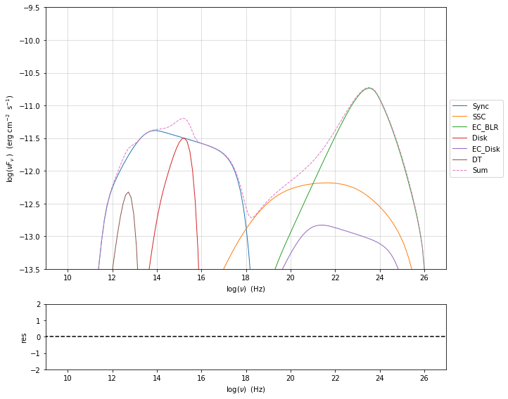
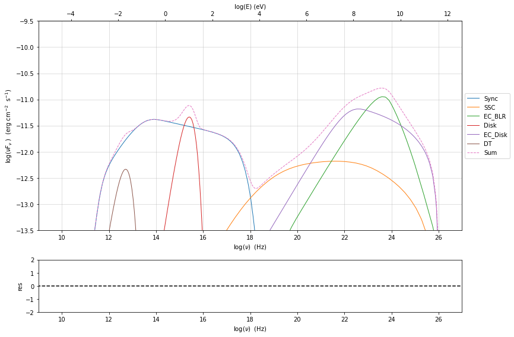
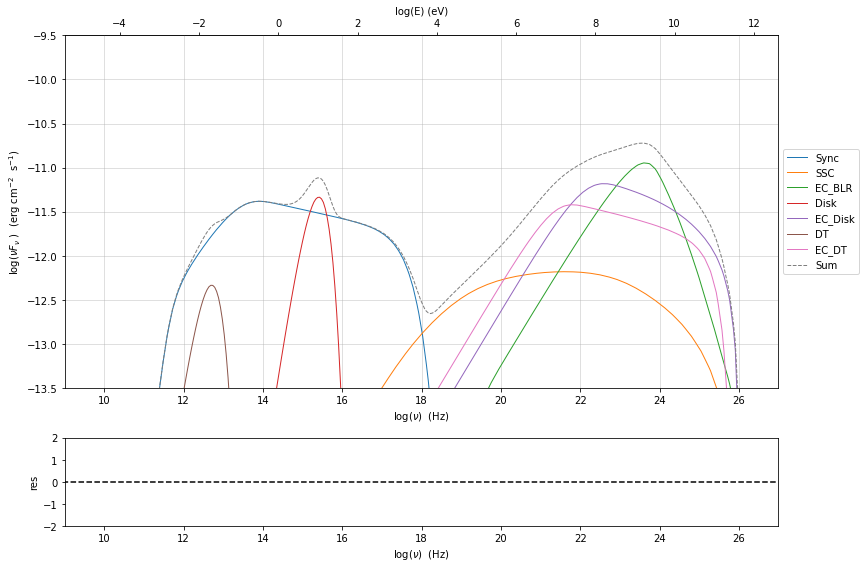
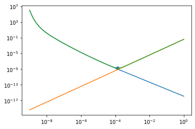
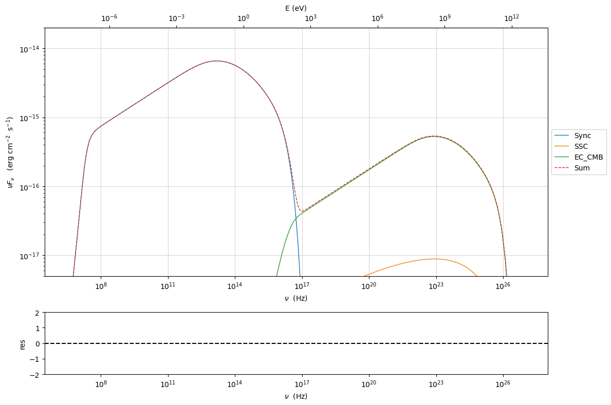

.. _jet_physical_guide_EC:

External Compton
----------------

The external Compton implementation  gives you the possibility to use a double approach
 
* transformation of the external  fields to the blob rest frame Dermer and Schlickeiser (2002) [Dermer2002]_, Dermer and Menon (2009) [DermerMenon2009]_

* transformation of the electron emitting distribution from the blob restframe to
  disk/BH restframe Dermer(1995) [Dermer95]_ and Georganopoulos, Kirk, and Mastichiadis (2001) [GKM01]_, Dermer and Menon (2009) [DermerMenon2009]_

The implemented external radiative fields are 
 
* Broad Line Region radiative field using the approach of Donea & Protheroe (2003) [Donea2003]_

* Dusty torus implemented as a uniform BB field within `R_DT`

* accretion disk (mono-energetic, single-temperature BB or a multi-temperature BB)

* Cosmic Microwave Background (CMB)

Please read :ref:`jet_physical_guide_SSC` if you skipped it.

.. figure:: jetset_EC_scheme.png
   :alt: EC scheme

   EC scheme

Broad Line Region
~~~~~~~~~~~~~~~~~

.. image::jetset_EC_scheme.png
  :width: 400
  :alt: EC scheme

.. code:: ipython3

    import jetset
    print('tested on jetset',jetset.__version__)

.. parsed-literal::

    tested on jetset 1.2.0

.. code:: ipython3

    from jetset.jet_model import Jet
    my_jet=Jet(name='EC_example',electron_distribution='bkn',beaming_expr='bulk_theta')
    my_jet.add_EC_component(['EC_BLR','EC_Disk'],disk_type='BB')

The ``show_model`` method provides, among other information, information
concerning the accretion disk, in this case we use a mono temperature
black body ``BB``

.. code:: ipython3

    my_jet.show_model()

.. parsed-literal::

    
    --------------------------------------------------------------------------------
    jet model description
    --------------------------------------------------------------------------------
    name: EC_example  
    
    electrons distribution:
     type: bkn  
     gamma energy grid size:  201
     gmin grid : 2.000000e+00
     gmax grid : 1.000000e+06
     normalization  True
     log-values  False
    
    accretion disk:
     disk Type: BB
     L disk: 1.000000e+45 (erg/s)
     T disk: 1.000000e+05 (K)
     nu peak disk: 8.171810e+15 (Hz)
    
    radiative fields:
     seed photons grid size:  100
     IC emission grid size:  100
     source emissivity lower bound :  1.000000e-120
     spectral components:
       name:Sum, state: on
       name:Sync, state: self-abs
       name:SSC, state: on
       name:EC_BLR, state: on
       name:Disk, state: on
       name:EC_Disk, state: on
    external fields transformation method: blob
    
    SED info:
     nu grid size jetkernel: 1000
     nu size: 500
     nu mix (Hz): 1.000000e+06
     nu max (Hz): 1.000000e+30
    
    flux plot lower bound   :  1.000000e-30
    
    --------------------------------------------------------------------------------

.. raw:: html

    <i>Table length=17</i>
    <table id="table140371796991136-660401" class="table-striped table-bordered table-condensed">
    <thead><tr><th>model name</th><th>name</th><th>par type</th><th>units</th><th>val</th><th>phys. bound. min</th><th>phys. bound. max</th><th>log</th><th>frozen</th></tr></thead>
    <tr><td>EC_example</td><td>R</td><td>region_size</td><td>cm</td><td>5.000000e+15</td><td>1.000000e+03</td><td>1.000000e+30</td><td>False</td><td>False</td></tr>
    <tr><td>EC_example</td><td>R_H</td><td>region_position</td><td>cm</td><td>1.000000e+17</td><td>0.000000e+00</td><td>--</td><td>False</td><td>True</td></tr>
    <tr><td>EC_example</td><td>B</td><td>magnetic_field</td><td>gauss</td><td>1.000000e-01</td><td>0.000000e+00</td><td>--</td><td>False</td><td>False</td></tr>
    <tr><td>EC_example</td><td>theta</td><td>jet-viewing-angle</td><td>deg</td><td>1.000000e-01</td><td>0.000000e+00</td><td>--</td><td>False</td><td>False</td></tr>
    <tr><td>EC_example</td><td>BulkFactor</td><td>jet-bulk-factor</td><td>lorentz-factor*</td><td>1.000000e+01</td><td>1.000000e+00</td><td>--</td><td>False</td><td>False</td></tr>
    <tr><td>EC_example</td><td>z_cosm</td><td>redshift</td><td></td><td>1.000000e-01</td><td>0.000000e+00</td><td>--</td><td>False</td><td>False</td></tr>
    <tr><td>EC_example</td><td>gmin</td><td>low-energy-cut-off</td><td>lorentz-factor*</td><td>2.000000e+00</td><td>1.000000e+00</td><td>1.000000e+09</td><td>False</td><td>False</td></tr>
    <tr><td>EC_example</td><td>gmax</td><td>high-energy-cut-off</td><td>lorentz-factor*</td><td>1.000000e+06</td><td>1.000000e+00</td><td>1.000000e+15</td><td>False</td><td>False</td></tr>
    <tr><td>EC_example</td><td>N</td><td>emitters_density</td><td>1 / cm3</td><td>1.000000e+02</td><td>0.000000e+00</td><td>--</td><td>False</td><td>False</td></tr>
    <tr><td>EC_example</td><td>gamma_break</td><td>turn-over-energy</td><td>lorentz-factor*</td><td>1.000000e+04</td><td>1.000000e+00</td><td>1.000000e+09</td><td>False</td><td>False</td></tr>
    <tr><td>EC_example</td><td>p</td><td>LE_spectral_slope</td><td></td><td>2.500000e+00</td><td>-1.000000e+01</td><td>1.000000e+01</td><td>False</td><td>False</td></tr>
    <tr><td>EC_example</td><td>p_1</td><td>HE_spectral_slope</td><td></td><td>3.500000e+00</td><td>-1.000000e+01</td><td>1.000000e+01</td><td>False</td><td>False</td></tr>
    <tr><td>EC_example</td><td>tau_BLR</td><td>BLR</td><td></td><td>1.000000e-01</td><td>0.000000e+00</td><td>1.000000e+00</td><td>False</td><td>False</td></tr>
    <tr><td>EC_example</td><td>R_BLR_in</td><td>BLR</td><td>cm</td><td>1.000000e+18</td><td>0.000000e+00</td><td>--</td><td>False</td><td>True</td></tr>
    <tr><td>EC_example</td><td>R_BLR_out</td><td>BLR</td><td>cm</td><td>2.000000e+18</td><td>0.000000e+00</td><td>--</td><td>False</td><td>True</td></tr>
    <tr><td>EC_example</td><td>L_Disk</td><td>Disk</td><td>erg / s</td><td>1.000000e+45</td><td>0.000000e+00</td><td>--</td><td>False</td><td>False</td></tr>
    <tr><td>EC_example</td><td>T_Disk</td><td>Disk</td><td>K</td><td>1.000000e+05</td><td>0.000000e+00</td><td>--</td><td>False</td><td>False</td></tr>
    </table>
    

.. parsed-literal::

    --------------------------------------------------------------------------------

change Disk type
~~~~~~~~~~~~~~~~

the disk type can be set as a more realistic multi temperature black
body (MultiBB). In this case the ``show_model`` method provides physical
parameters regarding the multi temperature black body accretion disk:

-  the Schwarzschild (Sw radius)

-  the Eddington luminosity (L Edd.)

-  the accretion rate (accr_rate)

-  the Eddington accretion rate (accr_rate Edd.)

.. code:: ipython3

    my_jet.add_EC_component(['EC_BLR','EC_Disk'],disk_type='MultiBB')
    my_jet.set_par('L_Disk',val=1E46)
    my_jet.set_par('gmax',val=5E4)
    my_jet.set_par('gmin',val=2.)
    my_jet.set_par('R_H',val=3E17)
    
    my_jet.set_par('p',val=1.5)
    my_jet.set_par('p_1',val=3.2)
    my_jet.set_par('R',val=3E15)
    my_jet.set_par('B',val=1.5)
    my_jet.set_par('z_cosm',val=0.6)
    my_jet.set_par('BulkFactor',val=20)
    my_jet.set_par('theta',val=1)
    my_jet.set_par('gamma_break',val=5E2)
    my_jet.set_N_from_nuLnu(nu_src=3E13,nuLnu_src=5E45)
    my_jet.set_IC_nu_size(100)
    my_jet.show_model()

.. parsed-literal::

    
    --------------------------------------------------------------------------------
    jet model description
    --------------------------------------------------------------------------------
    name: EC_example  
    
    electrons distribution:
     type: bkn  
     gamma energy grid size:  201
     gmin grid : 2.000000e+00
     gmax grid : 5.000000e+04
     normalization  True
     log-values  False
    
    accretion disk:
     disk Type: MultiBB
     L disk: 1.000000e+46 (erg/s)
     T disk: 5.015768e+04 (K)
     nu peak disk: 4.098790e+15 (Hz)
     Sw radius 2.953539e+14 (cm)
     L Edd. 1.666723e+47 (erg/s)
     accr_rate: 2.205171e+00 (M_sun/yr)
     accr_rate Edd.: 3.675409e+01 (M_sun/yr)
    
    radiative fields:
     seed photons grid size:  100
     IC emission grid size:  100
     source emissivity lower bound :  1.000000e-120
     spectral components:
       name:Sum, state: on
       name:Sync, state: self-abs
       name:SSC, state: on
       name:EC_BLR, state: on
       name:Disk, state: on
       name:EC_Disk, state: on
    external fields transformation method: blob
    
    SED info:
     nu grid size jetkernel: 1000
     nu size: 500
     nu mix (Hz): 1.000000e+06
     nu max (Hz): 1.000000e+30
    
    flux plot lower bound   :  1.000000e-30
    
    --------------------------------------------------------------------------------

.. raw:: html

    <i>Table length=20</i>
    <table id="table140371796966368-447497" class="table-striped table-bordered table-condensed">
    <thead><tr><th>model name</th><th>name</th><th>par type</th><th>units</th><th>val</th><th>phys. bound. min</th><th>phys. bound. max</th><th>log</th><th>frozen</th></tr></thead>
    <tr><td>EC_example</td><td>R</td><td>region_size</td><td>cm</td><td>3.000000e+15</td><td>1.000000e+03</td><td>1.000000e+30</td><td>False</td><td>False</td></tr>
    <tr><td>EC_example</td><td>R_H</td><td>region_position</td><td>cm</td><td>3.000000e+17</td><td>0.000000e+00</td><td>--</td><td>False</td><td>True</td></tr>
    <tr><td>EC_example</td><td>B</td><td>magnetic_field</td><td>gauss</td><td>1.500000e+00</td><td>0.000000e+00</td><td>--</td><td>False</td><td>False</td></tr>
    <tr><td>EC_example</td><td>theta</td><td>jet-viewing-angle</td><td>deg</td><td>1.000000e+00</td><td>0.000000e+00</td><td>--</td><td>False</td><td>False</td></tr>
    <tr><td>EC_example</td><td>BulkFactor</td><td>jet-bulk-factor</td><td>lorentz-factor*</td><td>2.000000e+01</td><td>1.000000e+00</td><td>--</td><td>False</td><td>False</td></tr>
    <tr><td>EC_example</td><td>z_cosm</td><td>redshift</td><td></td><td>6.000000e-01</td><td>0.000000e+00</td><td>--</td><td>False</td><td>False</td></tr>
    <tr><td>EC_example</td><td>gmin</td><td>low-energy-cut-off</td><td>lorentz-factor*</td><td>2.000000e+00</td><td>1.000000e+00</td><td>1.000000e+09</td><td>False</td><td>False</td></tr>
    <tr><td>EC_example</td><td>gmax</td><td>high-energy-cut-off</td><td>lorentz-factor*</td><td>5.000000e+04</td><td>1.000000e+00</td><td>1.000000e+15</td><td>False</td><td>False</td></tr>
    <tr><td>EC_example</td><td>N</td><td>emitters_density</td><td>1 / cm3</td><td>4.171189e+03</td><td>0.000000e+00</td><td>--</td><td>False</td><td>False</td></tr>
    <tr><td>EC_example</td><td>gamma_break</td><td>turn-over-energy</td><td>lorentz-factor*</td><td>5.000000e+02</td><td>1.000000e+00</td><td>1.000000e+09</td><td>False</td><td>False</td></tr>
    <tr><td>EC_example</td><td>p</td><td>LE_spectral_slope</td><td></td><td>1.500000e+00</td><td>-1.000000e+01</td><td>1.000000e+01</td><td>False</td><td>False</td></tr>
    <tr><td>EC_example</td><td>p_1</td><td>HE_spectral_slope</td><td></td><td>3.200000e+00</td><td>-1.000000e+01</td><td>1.000000e+01</td><td>False</td><td>False</td></tr>
    <tr><td>EC_example</td><td>tau_BLR</td><td>BLR</td><td></td><td>1.000000e-01</td><td>0.000000e+00</td><td>1.000000e+00</td><td>False</td><td>False</td></tr>
    <tr><td>EC_example</td><td>R_BLR_in</td><td>BLR</td><td>cm</td><td>1.000000e+18</td><td>0.000000e+00</td><td>--</td><td>False</td><td>True</td></tr>
    <tr><td>EC_example</td><td>R_BLR_out</td><td>BLR</td><td>cm</td><td>2.000000e+18</td><td>0.000000e+00</td><td>--</td><td>False</td><td>True</td></tr>
    <tr><td>EC_example</td><td>R_inner_Sw</td><td>Disk</td><td>Sw. radii*</td><td>3.000000e+00</td><td>0.000000e+00</td><td>--</td><td>False</td><td>False</td></tr>
    <tr><td>EC_example</td><td>R_ext_Sw</td><td>Disk</td><td>Sw. radii*</td><td>5.000000e+02</td><td>0.000000e+00</td><td>--</td><td>False</td><td>False</td></tr>
    <tr><td>EC_example</td><td>accr_eff</td><td>Disk</td><td></td><td>8.000000e-02</td><td>0.000000e+00</td><td>--</td><td>False</td><td>False</td></tr>
    <tr><td>EC_example</td><td>M_BH</td><td>Disk</td><td>M_sun*</td><td>1.000000e+09</td><td>0.000000e+00</td><td>--</td><td>False</td><td>False</td></tr>
    <tr><td>EC_example</td><td>L_Disk</td><td>Disk</td><td>erg / s</td><td>1.000000e+46</td><td>0.000000e+00</td><td>--</td><td>False</td><td>False</td></tr>
    </table>
    

.. parsed-literal::

    --------------------------------------------------------------------------------

now we set some parameter for the model

.. code:: ipython3

    my_jet.eval()

.. code:: ipython3

    p=my_jet.plot_model(frame='obs')
    p.setlim(y_min=1E-13,y_max=5E-11,x_min=1E9,x_max=1E27)

Dusty Torus
~~~~~~~~~~~

.. code:: ipython3

    my_jet.add_EC_component('DT')
    my_jet.show_model()

.. parsed-literal::

    
    --------------------------------------------------------------------------------
    jet model description
    --------------------------------------------------------------------------------
    name: EC_example  
    
    electrons distribution:
     type: bkn  
     gamma energy grid size:  201
     gmin grid : 2.000000e+00
     gmax grid : 5.000000e+04
     normalization  True
     log-values  False
    
    accretion disk:
     disk Type: BB
     L disk: 1.000000e+46 (erg/s)
     T disk: 5.015768e+04 (K)
     nu peak disk: 4.098790e+15 (Hz)
    
    radiative fields:
     seed photons grid size:  100
     IC emission grid size:  100
     source emissivity lower bound :  1.000000e-120
     spectral components:
       name:Sum, state: on
       name:Sync, state: self-abs
       name:SSC, state: on
       name:EC_BLR, state: on
       name:Disk, state: on
       name:EC_Disk, state: on
       name:DT, state: on
    external fields transformation method: blob
    
    SED info:
     nu grid size jetkernel: 1000
     nu size: 500
     nu mix (Hz): 1.000000e+06
     nu max (Hz): 1.000000e+30
    
    flux plot lower bound   :  1.000000e-30
    
    --------------------------------------------------------------------------------

.. raw:: html

    <i>Table length=20</i>
    <table id="table140371796966416-101569" class="table-striped table-bordered table-condensed">
    <thead><tr><th>model name</th><th>name</th><th>par type</th><th>units</th><th>val</th><th>phys. bound. min</th><th>phys. bound. max</th><th>log</th><th>frozen</th></tr></thead>
    <tr><td>EC_example</td><td>R</td><td>region_size</td><td>cm</td><td>3.000000e+15</td><td>1.000000e+03</td><td>1.000000e+30</td><td>False</td><td>False</td></tr>
    <tr><td>EC_example</td><td>R_H</td><td>region_position</td><td>cm</td><td>3.000000e+17</td><td>0.000000e+00</td><td>--</td><td>False</td><td>True</td></tr>
    <tr><td>EC_example</td><td>B</td><td>magnetic_field</td><td>gauss</td><td>1.500000e+00</td><td>0.000000e+00</td><td>--</td><td>False</td><td>False</td></tr>
    <tr><td>EC_example</td><td>theta</td><td>jet-viewing-angle</td><td>deg</td><td>1.000000e+00</td><td>0.000000e+00</td><td>--</td><td>False</td><td>False</td></tr>
    <tr><td>EC_example</td><td>BulkFactor</td><td>jet-bulk-factor</td><td>lorentz-factor*</td><td>2.000000e+01</td><td>1.000000e+00</td><td>--</td><td>False</td><td>False</td></tr>
    <tr><td>EC_example</td><td>z_cosm</td><td>redshift</td><td></td><td>6.000000e-01</td><td>0.000000e+00</td><td>--</td><td>False</td><td>False</td></tr>
    <tr><td>EC_example</td><td>gmin</td><td>low-energy-cut-off</td><td>lorentz-factor*</td><td>2.000000e+00</td><td>1.000000e+00</td><td>1.000000e+09</td><td>False</td><td>False</td></tr>
    <tr><td>EC_example</td><td>gmax</td><td>high-energy-cut-off</td><td>lorentz-factor*</td><td>5.000000e+04</td><td>1.000000e+00</td><td>1.000000e+15</td><td>False</td><td>False</td></tr>
    <tr><td>EC_example</td><td>N</td><td>emitters_density</td><td>1 / cm3</td><td>4.171189e+03</td><td>0.000000e+00</td><td>--</td><td>False</td><td>False</td></tr>
    <tr><td>EC_example</td><td>gamma_break</td><td>turn-over-energy</td><td>lorentz-factor*</td><td>5.000000e+02</td><td>1.000000e+00</td><td>1.000000e+09</td><td>False</td><td>False</td></tr>
    <tr><td>EC_example</td><td>p</td><td>LE_spectral_slope</td><td></td><td>1.500000e+00</td><td>-1.000000e+01</td><td>1.000000e+01</td><td>False</td><td>False</td></tr>
    <tr><td>EC_example</td><td>p_1</td><td>HE_spectral_slope</td><td></td><td>3.200000e+00</td><td>-1.000000e+01</td><td>1.000000e+01</td><td>False</td><td>False</td></tr>
    <tr><td>EC_example</td><td>tau_BLR</td><td>BLR</td><td></td><td>1.000000e-01</td><td>0.000000e+00</td><td>1.000000e+00</td><td>False</td><td>False</td></tr>
    <tr><td>EC_example</td><td>R_BLR_in</td><td>BLR</td><td>cm</td><td>1.000000e+18</td><td>0.000000e+00</td><td>--</td><td>False</td><td>True</td></tr>
    <tr><td>EC_example</td><td>R_BLR_out</td><td>BLR</td><td>cm</td><td>2.000000e+18</td><td>0.000000e+00</td><td>--</td><td>False</td><td>True</td></tr>
    <tr><td>EC_example</td><td>T_Disk</td><td>Disk</td><td>K</td><td>5.015768e+04</td><td>0.000000e+00</td><td>--</td><td>False</td><td>False</td></tr>
    <tr><td>EC_example</td><td>T_DT</td><td>DT</td><td>K</td><td>1.000000e+02</td><td>0.000000e+00</td><td>--</td><td>False</td><td>False</td></tr>
    <tr><td>EC_example</td><td>R_DT</td><td>DT</td><td>cm</td><td>5.000000e+18</td><td>0.000000e+00</td><td>--</td><td>False</td><td>False</td></tr>
    <tr><td>EC_example</td><td>tau_DT</td><td>DT</td><td></td><td>1.000000e-01</td><td>0.000000e+00</td><td>1.000000e+00</td><td>False</td><td>False</td></tr>
    <tr><td>EC_example</td><td>L_Disk</td><td>Disk</td><td>erg / s</td><td>1.000000e+46</td><td>0.000000e+00</td><td>--</td><td>False</td><td>False</td></tr>
    </table>
    

.. parsed-literal::

    --------------------------------------------------------------------------------

.. code:: ipython3

    my_jet.eval()

.. code:: ipython3

    p=my_jet.plot_model()
    p.setlim(y_min=1E-13,y_max=5E-11,x_min=1E9,x_max=1E27)

.. code:: ipython3

    my_jet.add_EC_component('EC_DT')
    my_jet.eval()

.. code:: ipython3

    p=my_jet.plot_model()
    p.setlim(y_min=1E-13,y_max=5E-11,x_min=1E9,x_max=1E27)

.. code:: ipython3

    my_jet.save_model('test_EC_model.pkl')
    my_jet=Jet.load_model('test_EC_model.pkl')

.. raw:: html

    <i>Table length=20</i>
    <table id="table140371840512976-731462" class="table-striped table-bordered table-condensed">
    <thead><tr><th>model name</th><th>name</th><th>par type</th><th>units</th><th>val</th><th>phys. bound. min</th><th>phys. bound. max</th><th>log</th><th>frozen</th></tr></thead>
    <tr><td>EC_example</td><td>gmin</td><td>low-energy-cut-off</td><td>lorentz-factor*</td><td>2.000000e+00</td><td>1.000000e+00</td><td>1.000000e+09</td><td>False</td><td>False</td></tr>
    <tr><td>EC_example</td><td>gmax</td><td>high-energy-cut-off</td><td>lorentz-factor*</td><td>5.000000e+04</td><td>1.000000e+00</td><td>1.000000e+15</td><td>False</td><td>False</td></tr>
    <tr><td>EC_example</td><td>N</td><td>emitters_density</td><td>1 / cm3</td><td>4.171189e+03</td><td>0.000000e+00</td><td>--</td><td>False</td><td>False</td></tr>
    <tr><td>EC_example</td><td>gamma_break</td><td>turn-over-energy</td><td>lorentz-factor*</td><td>5.000000e+02</td><td>1.000000e+00</td><td>1.000000e+09</td><td>False</td><td>False</td></tr>
    <tr><td>EC_example</td><td>p</td><td>LE_spectral_slope</td><td></td><td>1.500000e+00</td><td>-1.000000e+01</td><td>1.000000e+01</td><td>False</td><td>False</td></tr>
    <tr><td>EC_example</td><td>p_1</td><td>HE_spectral_slope</td><td></td><td>3.200000e+00</td><td>-1.000000e+01</td><td>1.000000e+01</td><td>False</td><td>False</td></tr>
    <tr><td>EC_example</td><td>tau_BLR</td><td>BLR</td><td></td><td>1.000000e-01</td><td>0.000000e+00</td><td>1.000000e+00</td><td>False</td><td>False</td></tr>
    <tr><td>EC_example</td><td>R_BLR_in</td><td>BLR</td><td>cm</td><td>1.000000e+18</td><td>0.000000e+00</td><td>--</td><td>False</td><td>True</td></tr>
    <tr><td>EC_example</td><td>R_BLR_out</td><td>BLR</td><td>cm</td><td>2.000000e+18</td><td>0.000000e+00</td><td>--</td><td>False</td><td>True</td></tr>
    <tr><td>EC_example</td><td>T_DT</td><td>DT</td><td>K</td><td>1.000000e+02</td><td>0.000000e+00</td><td>--</td><td>False</td><td>False</td></tr>
    <tr><td>EC_example</td><td>R_DT</td><td>DT</td><td>cm</td><td>5.000000e+18</td><td>0.000000e+00</td><td>--</td><td>False</td><td>False</td></tr>
    <tr><td>EC_example</td><td>tau_DT</td><td>DT</td><td></td><td>1.000000e-01</td><td>0.000000e+00</td><td>1.000000e+00</td><td>False</td><td>False</td></tr>
    <tr><td>EC_example</td><td>L_Disk</td><td>Disk</td><td>erg / s</td><td>1.000000e+46</td><td>0.000000e+00</td><td>--</td><td>False</td><td>False</td></tr>
    <tr><td>EC_example</td><td>T_Disk</td><td>Disk</td><td>K</td><td>5.015768e+04</td><td>0.000000e+00</td><td>--</td><td>False</td><td>False</td></tr>
    <tr><td>EC_example</td><td>R</td><td>region_size</td><td>cm</td><td>3.000000e+15</td><td>1.000000e+03</td><td>1.000000e+30</td><td>False</td><td>False</td></tr>
    <tr><td>EC_example</td><td>R_H</td><td>region_position</td><td>cm</td><td>3.000000e+17</td><td>0.000000e+00</td><td>--</td><td>False</td><td>True</td></tr>
    <tr><td>EC_example</td><td>B</td><td>magnetic_field</td><td>gauss</td><td>1.500000e+00</td><td>0.000000e+00</td><td>--</td><td>False</td><td>False</td></tr>
    <tr><td>EC_example</td><td>theta</td><td>jet-viewing-angle</td><td>deg</td><td>1.000000e+00</td><td>0.000000e+00</td><td>--</td><td>False</td><td>False</td></tr>
    <tr><td>EC_example</td><td>BulkFactor</td><td>jet-bulk-factor</td><td>lorentz-factor*</td><td>2.000000e+01</td><td>1.000000e+00</td><td>--</td><td>False</td><td>False</td></tr>
    <tr><td>EC_example</td><td>z_cosm</td><td>redshift</td><td></td><td>6.000000e-01</td><td>0.000000e+00</td><td>--</td><td>False</td><td>False</td></tr>
    </table>
    

setting the BLR and DT radius as a function of the disk luminosity
~~~~~~~~~~~~~~~~~~~~~~~~~~~~~~~~~~~~~~~~~~~~~~~~~~~~~~~~~~~~~~~~~~

Using the depending parameters (see :ref:`depending_parameters`, for more details) we can set the BLR and DT radius, as a function of the disk luminosity

.. code:: ipython3

    #kaspi+ 2007:https://iopscience.iop.org/article/10.1086/512094/pdf
    my_jet.make_dependent_par(par='R_BLR_in', depends_on=['L_Disk'], par_expr='1E17*(L_Disk/1E45)**0.5')
    
    my_jet.make_dependent_par(par='R_BLR_out', depends_on=['R_BLR_in'], par_expr='R_BLR_in*1.1')
    
    #Cleary+ 2007:https://iopscience.iop.org/article/10.1086/511969/pdf
    my_jet.make_dependent_par(par='R_DT', depends_on=['L_Disk'], par_expr='2.5E18*(L_Disk/1E45)**0.5')

.. parsed-literal::

    ==> par R_BLR_in is now depending on ['L_Disk'] according to expr:R_BLR_in =
    1E17*(L_Disk/1E45)**0.5
    ==> par R_BLR_out is now depending on ['R_BLR_in'] according to expr:R_BLR_out =
    R_BLR_in*1.1
    ==> par R_DT is now depending on ['L_Disk'] according to expr:R_DT =
    2.5E18*(L_Disk/1E45)**0.5

.. code:: ipython3

    my_jet.parameters.L_Disk.val=5E45

.. code:: ipython3

    my_jet.parameters

.. raw:: html

    <i>Table length=20</i>
    <table id="table140371838223408-877458" class="table-striped table-bordered table-condensed">
    <thead><tr><th>model name</th><th>name</th><th>par type</th><th>units</th><th>val</th><th>phys. bound. min</th><th>phys. bound. max</th><th>log</th><th>frozen</th></tr></thead>
    <tr><td>EC_example</td><td>gmin</td><td>low-energy-cut-off</td><td>lorentz-factor*</td><td>2.000000e+00</td><td>1.000000e+00</td><td>1.000000e+09</td><td>False</td><td>False</td></tr>
    <tr><td>EC_example</td><td>gmax</td><td>high-energy-cut-off</td><td>lorentz-factor*</td><td>5.000000e+04</td><td>1.000000e+00</td><td>1.000000e+15</td><td>False</td><td>False</td></tr>
    <tr><td>EC_example</td><td>N</td><td>emitters_density</td><td>1 / cm3</td><td>4.171189e+03</td><td>0.000000e+00</td><td>--</td><td>False</td><td>False</td></tr>
    <tr><td>EC_example</td><td>gamma_break</td><td>turn-over-energy</td><td>lorentz-factor*</td><td>5.000000e+02</td><td>1.000000e+00</td><td>1.000000e+09</td><td>False</td><td>False</td></tr>
    <tr><td>EC_example</td><td>p</td><td>LE_spectral_slope</td><td></td><td>1.500000e+00</td><td>-1.000000e+01</td><td>1.000000e+01</td><td>False</td><td>False</td></tr>
    <tr><td>EC_example</td><td>p_1</td><td>HE_spectral_slope</td><td></td><td>3.200000e+00</td><td>-1.000000e+01</td><td>1.000000e+01</td><td>False</td><td>False</td></tr>
    <tr><td>EC_example</td><td>tau_BLR</td><td>BLR</td><td></td><td>1.000000e-01</td><td>0.000000e+00</td><td>1.000000e+00</td><td>False</td><td>False</td></tr>
    <tr><td>EC_example</td><td>*R_BLR_in(D,L_Disk)</td><td>BLR</td><td>cm</td><td>2.236068e+17</td><td>0.000000e+00</td><td>--</td><td>False</td><td>True</td></tr>
    <tr><td>EC_example</td><td>*R_BLR_out(D,R_BLR_in)</td><td>BLR</td><td>cm</td><td>2.459675e+17</td><td>0.000000e+00</td><td>--</td><td>False</td><td>True</td></tr>
    <tr><td>EC_example</td><td>T_DT</td><td>DT</td><td>K</td><td>1.000000e+02</td><td>0.000000e+00</td><td>--</td><td>False</td><td>False</td></tr>
    <tr><td>EC_example</td><td>*R_DT(D,L_Disk)</td><td>DT</td><td>cm</td><td>5.590170e+18</td><td>0.000000e+00</td><td>--</td><td>False</td><td>True</td></tr>
    <tr><td>EC_example</td><td>tau_DT</td><td>DT</td><td></td><td>1.000000e-01</td><td>0.000000e+00</td><td>1.000000e+00</td><td>False</td><td>False</td></tr>
    <tr><td>EC_example</td><td>L_Disk(M)</td><td>Disk</td><td>erg / s</td><td>5.000000e+45</td><td>0.000000e+00</td><td>--</td><td>False</td><td>False</td></tr>
    <tr><td>EC_example</td><td>T_Disk</td><td>Disk</td><td>K</td><td>5.015768e+04</td><td>0.000000e+00</td><td>--</td><td>False</td><td>False</td></tr>
    <tr><td>EC_example</td><td>R</td><td>region_size</td><td>cm</td><td>3.000000e+15</td><td>1.000000e+03</td><td>1.000000e+30</td><td>False</td><td>False</td></tr>
    <tr><td>EC_example</td><td>R_H</td><td>region_position</td><td>cm</td><td>3.000000e+17</td><td>0.000000e+00</td><td>--</td><td>False</td><td>True</td></tr>
    <tr><td>EC_example</td><td>B</td><td>magnetic_field</td><td>gauss</td><td>1.500000e+00</td><td>0.000000e+00</td><td>--</td><td>False</td><td>False</td></tr>
    <tr><td>EC_example</td><td>theta</td><td>jet-viewing-angle</td><td>deg</td><td>1.000000e+00</td><td>0.000000e+00</td><td>--</td><td>False</td><td>False</td></tr>
    <tr><td>EC_example</td><td>BulkFactor</td><td>jet-bulk-factor</td><td>lorentz-factor*</td><td>2.000000e+01</td><td>1.000000e+00</td><td>--</td><td>False</td><td>False</td></tr>
    <tr><td>EC_example</td><td>z_cosm</td><td>redshift</td><td></td><td>6.000000e-01</td><td>0.000000e+00</td><td>--</td><td>False</td><td>False</td></tr>
    </table>
    

.. parsed-literal::

    None

.. code:: ipython3

    my_jet.eval()
    p=my_jet.plot_model()
    p.setlim(y_min=1E-13,y_max=5E-11,x_min=1E9,x_max=1E27)

.. image:: Jet_example_phys_EC_files/Jet_example_phys_EC_28_0.png

Changing the external field transformation
~~~~~~~~~~~~~~~~~~~~~~~~~~~~~~~~~~~~~~~~~~

Default method, is the transformation of the external photon field from
the disk/BH frame to the relativistic blob

.. code:: ipython3

    my_jet.set_external_field_transf('blob')

Alternatively, in the case of istropric fields as the CMB or the BLR and
DT within the BLR radius, and DT radius, respectively, it is possible to
transform the the electron distribution, moving the blob to the disk/BH
frame.

.. code:: ipython3

    my_jet.set_external_field_transf('disk')

**Anyhow, the ``disk`` transformation is valid only for isotropic
external fields, suchs as the CMB, or the BLR and Dusty torus seed
photons whitin the DT radius and BLR radius, respectively. Beyond the
isotropic region, the code will switch automatically to the ``blob``
transformation, even if ``disk`` is used**

External photon field energy density along the jet
~~~~~~~~~~~~~~~~~~~~~~~~~~~~~~~~~~~~~~~~~~~~~~~~~~

.. code:: ipython3

    def iso_field_transf(L,R,BulckFactor):
        beta=1.0 - 1/(BulckFactor*BulckFactor)
        return L/(4*np.pi*R*R*3E10)*BulckFactor*BulckFactor*(1+((beta**2)/3))
    
    def external_iso_behind_transf(L,R,BulckFactor):
        beta=1.0 - 1/(BulckFactor*BulckFactor)
        return L/((4*np.pi*R*R*3E10)*(BulckFactor*BulckFactor*(1+beta)**2))

EC seed photon fields, in the Disk rest frame

.. code:: ipython3

    %matplotlib inline
    fig = plt.figure(figsize=(8,6))
    ax=fig.subplots(1)
    N=50
    G=1
    R_range=np.logspace(13,25,N)
    y=np.zeros((8,N))
    my_jet.set_verbosity(0)
    
    for ID,R in enumerate(R_range):
        my_jet.set_par('R_H',val=R)
        my_jet.set_external_fields()
        my_jet.energetic_report(verbose=False)
        
        y[1,ID]=my_jet.energetic_dict['U_BLR_DRF']
        y[0,ID]=my_jet.energetic_dict['U_Disk_DRF']
        y[2,ID]=my_jet.energetic_dict['U_DT_DRF']
        
    y[4,:]=iso_field_transf(my_jet._blob.L_Disk_radiative*my_jet.parameters.tau_DT.val,my_jet.parameters.R_DT.val,G)
    y[3,:]=iso_field_transf(my_jet._blob.L_Disk_radiative*my_jet.parameters.tau_BLR.val,my_jet.parameters.R_BLR_in.val,G)
    y[5,:]=external_iso_behind_transf(my_jet._blob.L_Disk_radiative*my_jet.parameters.tau_BLR.val,R_range,G)
    y[6,:]=external_iso_behind_transf(my_jet._blob.L_Disk_radiative*my_jet.parameters.tau_DT.val,R_range,G)
    y[7,:]=external_iso_behind_transf(my_jet._blob.L_Disk_radiative,R_range,G)
    
    ax.plot(np.log10(R_range),np.log10(y[0,:]),label='Disk')
    ax.plot(np.log10(R_range),np.log10(y[1,:]),'-',label='BLR')
    ax.plot(np.log10(R_range),np.log10(y[2,:]),label='DT')
    ax.plot(np.log10(R_range),np.log10(y[3,:]),'--',label='BLR uniform')
    ax.plot(np.log10(R_range),np.log10(y[4,:]),'--',label='DT uniform')
    ax.plot(np.log10(R_range),np.log10(y[5,:]),'--',label='BLR 1/R2')
    ax.plot(np.log10(R_range),np.log10(y[6,:]),'--',label='DT 1/R2')
    ax.plot(np.log10(R_range),np.log10(y[7,:]),'--',label='Disk 1/R2')
    ax.set_xlabel('log(R_H) cm')
    ax.set_ylabel('log(Uph) erg cm-3 s-1')
    
    ax.legend()

.. parsed-literal::

    <matplotlib.legend.Legend at 0x7faadc2f52e0>

.. code:: ipython3

    %matplotlib inline
    
    fig = plt.figure(figsize=(8,6))
    ax=fig.subplots(1)
    
    L_Disk=1E45
    N=50
    G=my_jet.parameters.BulkFactor.val
    R_range=np.logspace(15,22,N)
    y=np.zeros((8,N))
    my_jet.set_par('L_Disk',val=L_Disk)
    my_jet._blob.theta_n_int=100
    my_jet._blob.l_n_int=100
    my_jet._blob.theta_n_int=100
    my_jet._blob.l_n_int=100
    for ID,R in enumerate(R_range):
        my_jet.set_par('R_H',val=R)
        
        my_jet.set_external_fields()
        my_jet.energetic_report(verbose=False)
        
        y[1,ID]=my_jet.energetic_dict['U_BLR']
        y[0,ID]=my_jet.energetic_dict['U_Disk']
        y[2,ID]=my_jet.energetic_dict['U_DT']
        
    
    
    y[4,:]=iso_field_transf(my_jet._blob.L_Disk_radiative*my_jet.parameters.tau_DT.val,my_jet.parameters.R_DT.val,G)
    y[3,:]=iso_field_transf(my_jet._blob.L_Disk_radiative*my_jet.parameters.tau_BLR.val,my_jet.parameters.R_BLR_in.val,G)
    y[5,:]=external_iso_behind_transf(my_jet._blob.L_Disk_radiative*my_jet.parameters.tau_BLR.val,R_range,G)
    y[6,:]=external_iso_behind_transf(my_jet._blob.L_Disk_radiative*my_jet.parameters.tau_DT.val,R_range,G)
    y[7,:]=external_iso_behind_transf(my_jet._blob.L_Disk_radiative,R_range,G)
    
    ax.plot(np.log10(R_range),np.log10(y[0,:]),label='Disk')
    ax.plot(np.log10(R_range),np.log10(y[1,:]),'-',label='BLR')
    ax.plot(np.log10(R_range),np.log10(y[2,:]),'-',label='DT')
    ax.plot(np.log10(R_range),np.log10(y[3,:]),'--',label='BLR uniform')
    ax.plot(np.log10(R_range),np.log10(y[4,:]),'--',label='DT uniform')
    ax.plot(np.log10(R_range),np.log10(y[5,:]),'--',label='BLR 1/R2')
    ax.plot(np.log10(R_range),np.log10(y[6,:]),'--',label='DT 1/R2')
    ax.plot(np.log10(R_range),np.log10(y[7,:]),'--',label='Disk 1/R2')
    ax.axvline(np.log10( my_jet.parameters.R_DT.val ))
    ax.axvline(np.log10( my_jet.parameters.R_BLR_out.val))
    
    ax.set_xlabel('log(R_H) cm')
    ax.set_ylabel('log(Uph`) erg cm-3 s-1')
    
    ax.legend()

.. parsed-literal::

    <matplotlib.legend.Legend at 0x7faadbe3e8e0>

IC against the CMB
~~~~~~~~~~~~~~~~~~

.. code:: ipython3

    my_jet=Jet(name='test_equipartition',electron_distribution='lppl',beaming_expr='bulk_theta')
    my_jet.set_par('R',val=1E21)
    my_jet.set_par('z_cosm',val= 0.651)
    my_jet.set_par('B',val=2E-5)
    my_jet.set_par('gmin',val=50)
    my_jet.set_par('gamma0_log_parab',val=35.0E3)
    my_jet.set_par('gmax',val=30E5)
    my_jet.set_par('theta',val=12.0)
    my_jet.set_par('BulkFactor',val=3.5)
    my_jet.set_par('s',val=2.58)
    my_jet.set_par('r',val=0.42)
    my_jet.set_N_from_nuFnu(5E-15,1E12)
    my_jet.add_EC_component('EC_CMB')

We can now compare the different beaming pattern for the EC emission if
the CMB, and realize that the beaming pattern is different. This is very
important in the case of radio galaxies. The ``src`` transformation is
the one to use in the case of radio galaxies or misaligned AGNs in
general, and gives a more accurate results for the beaming patter of an
isotropic external field.

.. code:: ipython3

    from jetset.plot_sedfit import PlotSED
    p=PlotSED()
    
    my_jet.set_external_field_transf('blob')
    c= ['k', 'g', 'r', 'c'] 
    for ID,theta in enumerate(np.linspace(2,20,4)):
        my_jet.parameters.theta.val=theta
        my_jet.eval()
        my_jet.plot_model(plot_obj=p,comp='Sum',label='blob, theta=%2.2f'%theta,line_style='--',color=c[ID])
    
    my_jet.set_external_field_transf('disk')
    for ID,theta in enumerate(np.linspace(2,20,4)):
        my_jet.parameters.theta.val=theta
        my_jet.eval()
        my_jet.plot_model(plot_obj=p,comp='Sum',label='disk, theta=%2.2f'%theta,line_style='',color=c[ID])
    
    p.setlim(y_min=5E-18,y_max=5E-13,x_max=1E28)

.. image:: Jet_example_phys_EC_files/Jet_example_phys_EC_43_0.png

Equipartition
-------------

It is also possible to set our jet at the equipartition, that is
achieved not using analytical approximation, but by numerically finding
the equipartition value over a grid. We have to provide the value of the
observed flux (``nuFnu_obs``) at a given observed frequency
(``nu_obs``), the minimum value of B (``B_min``), and the number of grid
points (``N_pts``)

.. code:: ipython3

    my_jet.parameters.theta.val=12
    B_min,b_grid,U_B,U_e=my_jet.set_B_eq(nuFnu_obs=5E-15,nu_obs=1E12,B_min=1E-9,N_pts=50,plot=True)
    my_jet.show_pars()
    
    my_jet.eval()

.. parsed-literal::

    B grid min  1e-09
    B grid max  1.0
    grid points 50

.. image:: Jet_example_phys_EC_files/Jet_example_phys_EC_46_1.png

.. parsed-literal::

    setting B to  0.0001389495494373139
    setting N to  9.160733610838076e-06

.. raw:: html

    <i>Table length=14</i>
    <table id="table140371810927568-882898" class="table-striped table-bordered table-condensed">
    <thead><tr><th>model name</th><th>name</th><th>par type</th><th>units</th><th>val</th><th>phys. bound. min</th><th>phys. bound. max</th><th>log</th><th>frozen</th></tr></thead>
    <tr><td>test_equipartition</td><td>R</td><td>region_size</td><td>cm</td><td>1.000000e+21</td><td>1.000000e+03</td><td>1.000000e+30</td><td>False</td><td>False</td></tr>
    <tr><td>test_equipartition</td><td>R_H</td><td>region_position</td><td>cm</td><td>1.000000e+17</td><td>0.000000e+00</td><td>--</td><td>False</td><td>True</td></tr>
    <tr><td>test_equipartition</td><td>B</td><td>magnetic_field</td><td>gauss</td><td>1.389495e-04</td><td>0.000000e+00</td><td>--</td><td>False</td><td>False</td></tr>
    <tr><td>test_equipartition</td><td>theta</td><td>jet-viewing-angle</td><td>deg</td><td>1.200000e+01</td><td>0.000000e+00</td><td>--</td><td>False</td><td>False</td></tr>
    <tr><td>test_equipartition</td><td>BulkFactor</td><td>jet-bulk-factor</td><td>lorentz-factor*</td><td>3.500000e+00</td><td>1.000000e+00</td><td>--</td><td>False</td><td>False</td></tr>
    <tr><td>test_equipartition</td><td>z_cosm</td><td>redshift</td><td></td><td>6.510000e-01</td><td>0.000000e+00</td><td>--</td><td>False</td><td>False</td></tr>
    <tr><td>test_equipartition</td><td>gmin</td><td>low-energy-cut-off</td><td>lorentz-factor*</td><td>5.000000e+01</td><td>1.000000e+00</td><td>1.000000e+09</td><td>False</td><td>False</td></tr>
    <tr><td>test_equipartition</td><td>gmax</td><td>high-energy-cut-off</td><td>lorentz-factor*</td><td>3.000000e+06</td><td>1.000000e+00</td><td>1.000000e+15</td><td>False</td><td>False</td></tr>
    <tr><td>test_equipartition</td><td>N</td><td>emitters_density</td><td>1 / cm3</td><td>9.160734e-06</td><td>0.000000e+00</td><td>--</td><td>False</td><td>False</td></tr>
    <tr><td>test_equipartition</td><td>gamma0_log_parab</td><td>turn-over-energy</td><td>lorentz-factor*</td><td>3.500000e+04</td><td>1.000000e+00</td><td>1.000000e+09</td><td>False</td><td>False</td></tr>
    <tr><td>test_equipartition</td><td>s</td><td>LE_spectral_slope</td><td></td><td>2.580000e+00</td><td>-1.000000e+01</td><td>1.000000e+01</td><td>False</td><td>False</td></tr>
    <tr><td>test_equipartition</td><td>r</td><td>spectral_curvature</td><td></td><td>4.200000e-01</td><td>-1.500000e+01</td><td>1.500000e+01</td><td>False</td><td>False</td></tr>
    <tr><td>test_equipartition</td><td>L_Disk</td><td>Disk</td><td>erg / s</td><td>1.000000e+45</td><td>0.000000e+00</td><td>--</td><td>False</td><td>False</td></tr>
    <tr><td>test_equipartition</td><td>T_Disk</td><td>Disk</td><td>K</td><td>1.000000e+05</td><td>0.000000e+00</td><td>--</td><td>False</td><td>False</td></tr>
    </table>
    

.. code:: ipython3

    p=my_jet.plot_model()
    p.setlim(y_min=5E-18,y_max=2E-14,x_max=1E28)

.. bibliography:: ../../refs.bib

