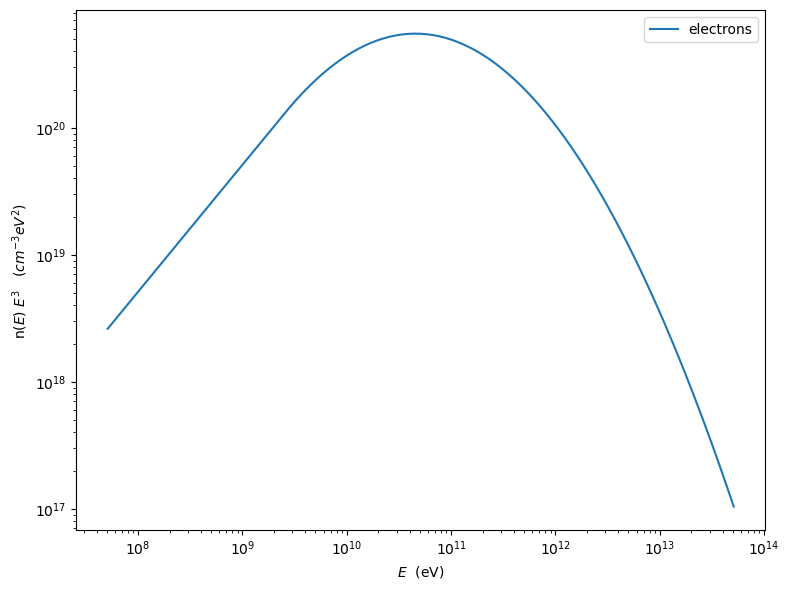
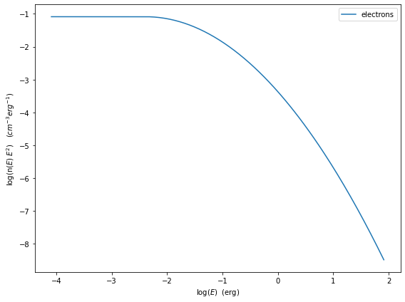
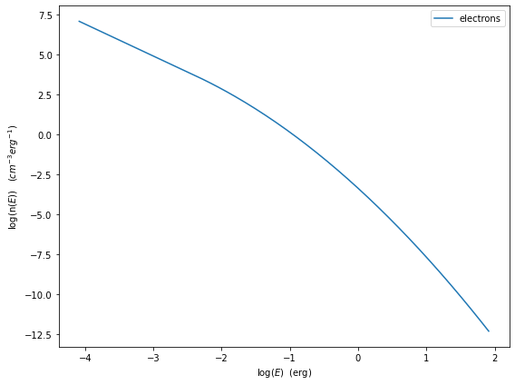
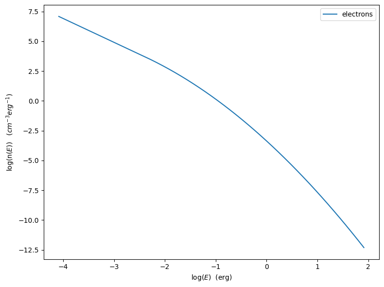
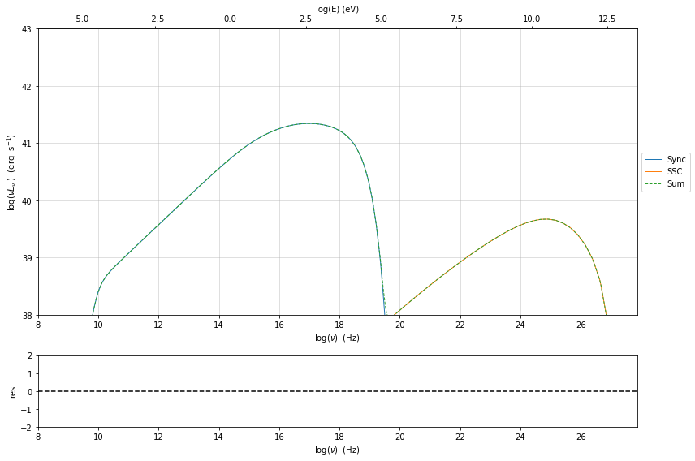
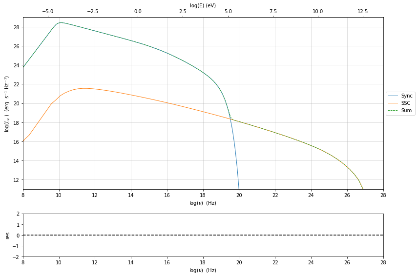
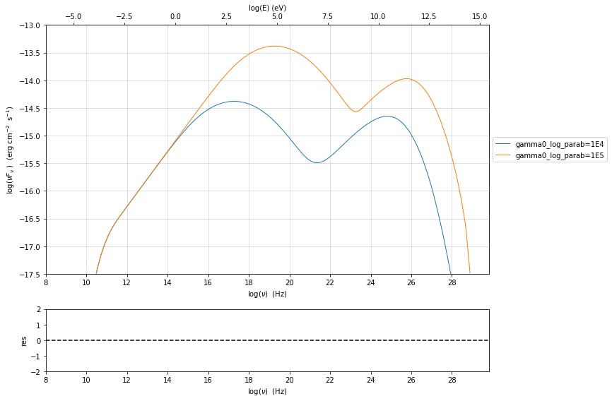
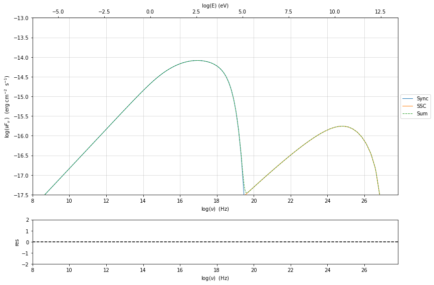
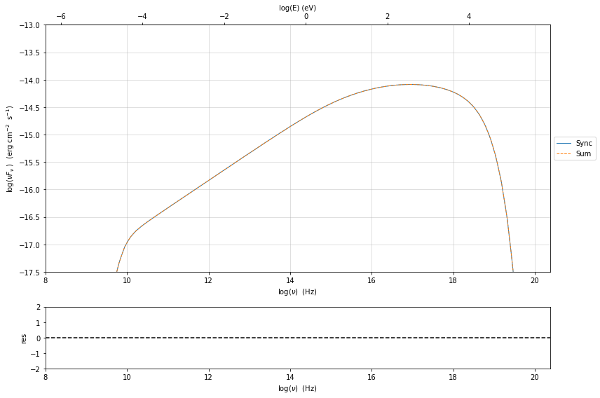

.. _jet_physical_guide:

Physical setup
==============

.. code:: ipython3

    import jetset
    print('tested on jetset',jetset.__version__)

.. parsed-literal::

    tested on jetset 1.2.0rc6

In this section we describe how  to build a model of jet able to reproduce SSC/EC emission processes, using the :class:`.Jet` class from the :mod:`.jet_model` module. to This class through a flexible and intuitive interface allows to access the C numerical code that provides an accurate and fast computation of the synchrotron and inverse Compton processes.  

Basic setup
-----------

A jet instance can be built using the  the :class:`.Jet` class, instantiating the object in the following way:

.. code:: ipython3

    from jetset.jet_model import Jet
    my_jet=Jet(name='test',electron_distribution='lppl',)

This instruction will create:
    * a ``Jet`` object with ``name`` **test**,
    * using as electron distribution the **lppl** model, that is a log-parabola with a low-energy power-law branch.

(a  working directory ``jet_wd`` will be created, this directory can be deleted when all the processes of your script are done)

For a list of possible distribution you can run the command 

.. code:: ipython3

    Jet.available_electron_distributions()

.. parsed-literal::

    lp: log-parabola
    pl: powerlaw
    lppl: log-parabola with low-energy powerlaw branch
    lpep: log-parabola defined by peak energy
    plc: powerlaw with cut-off
    bkn: broken powerlaw
    superexp: powerlaw with super-exp cut-off

to view all the paramters:

custom electron distributions can be created by the user as described in this section of the tutorial :ref:`custom_emitters_guide` 

.. code:: ipython3

    my_jet.show_pars()

.. raw:: html

    <i>Table length=11</i>
    <table id="table140249336673280-61347" class="table-striped table-bordered table-condensed">
    <thead><tr><th>model name</th><th>name</th><th>par type</th><th>units</th><th>val</th><th>phys. bound. min</th><th>phys. bound. max</th><th>log</th><th>frozen</th></tr></thead>
    <tr><td>test</td><td>R</td><td>region_size</td><td>cm</td><td>5.000000e+15</td><td>1.000000e+03</td><td>1.000000e+30</td><td>False</td><td>False</td></tr>
    <tr><td>test</td><td>R_H</td><td>region_position</td><td>cm</td><td>1.000000e+17</td><td>0.000000e+00</td><td>--</td><td>False</td><td>True</td></tr>
    <tr><td>test</td><td>B</td><td>magnetic_field</td><td>gauss</td><td>1.000000e-01</td><td>0.000000e+00</td><td>--</td><td>False</td><td>False</td></tr>
    <tr><td>test</td><td>beam_obj</td><td>beaming</td><td>lorentz-factor*</td><td>1.000000e+01</td><td>1.000000e-04</td><td>--</td><td>False</td><td>False</td></tr>
    <tr><td>test</td><td>z_cosm</td><td>redshift</td><td></td><td>1.000000e-01</td><td>0.000000e+00</td><td>--</td><td>False</td><td>False</td></tr>
    <tr><td>test</td><td>gmin</td><td>low-energy-cut-off</td><td>lorentz-factor*</td><td>2.000000e+00</td><td>1.000000e+00</td><td>1.000000e+09</td><td>False</td><td>False</td></tr>
    <tr><td>test</td><td>gmax</td><td>high-energy-cut-off</td><td>lorentz-factor*</td><td>1.000000e+06</td><td>1.000000e+00</td><td>1.000000e+15</td><td>False</td><td>False</td></tr>
    <tr><td>test</td><td>N</td><td>emitters_density</td><td>1 / cm3</td><td>1.000000e+02</td><td>0.000000e+00</td><td>--</td><td>False</td><td>False</td></tr>
    <tr><td>test</td><td>gamma0_log_parab</td><td>turn-over-energy</td><td>lorentz-factor*</td><td>1.000000e+04</td><td>1.000000e+00</td><td>1.000000e+09</td><td>False</td><td>False</td></tr>
    <tr><td>test</td><td>s</td><td>LE_spectral_slope</td><td></td><td>2.000000e+00</td><td>-1.000000e+01</td><td>1.000000e+01</td><td>False</td><td>False</td></tr>
    <tr><td>test</td><td>r</td><td>spectral_curvature</td><td></td><td>4.000000e-01</td><td>-1.500000e+01</td><td>1.500000e+01</td><td>False</td><td>False</td></tr>
    </table>
    

Each parameter has default values. All the parameters listed are handled by :class:`.ModelParameterArray`, and each parameter is an instance of the the :class:`.JetParameter`. class. These parameters can be visualized by the command 

.. code:: ipython3

    my_jet.parameters

.. raw:: html

    <i>Table length=11</i>
    <table id="table140249336673280-653697" class="table-striped table-bordered table-condensed">
    <thead><tr><th>model name</th><th>name</th><th>par type</th><th>units</th><th>val</th><th>phys. bound. min</th><th>phys. bound. max</th><th>log</th><th>frozen</th></tr></thead>
    <tr><td>test</td><td>R</td><td>region_size</td><td>cm</td><td>5.000000e+15</td><td>1.000000e+03</td><td>1.000000e+30</td><td>False</td><td>False</td></tr>
    <tr><td>test</td><td>R_H</td><td>region_position</td><td>cm</td><td>1.000000e+17</td><td>0.000000e+00</td><td>--</td><td>False</td><td>True</td></tr>
    <tr><td>test</td><td>B</td><td>magnetic_field</td><td>gauss</td><td>1.000000e-01</td><td>0.000000e+00</td><td>--</td><td>False</td><td>False</td></tr>
    <tr><td>test</td><td>beam_obj</td><td>beaming</td><td>lorentz-factor*</td><td>1.000000e+01</td><td>1.000000e-04</td><td>--</td><td>False</td><td>False</td></tr>
    <tr><td>test</td><td>z_cosm</td><td>redshift</td><td></td><td>1.000000e-01</td><td>0.000000e+00</td><td>--</td><td>False</td><td>False</td></tr>
    <tr><td>test</td><td>gmin</td><td>low-energy-cut-off</td><td>lorentz-factor*</td><td>2.000000e+00</td><td>1.000000e+00</td><td>1.000000e+09</td><td>False</td><td>False</td></tr>
    <tr><td>test</td><td>gmax</td><td>high-energy-cut-off</td><td>lorentz-factor*</td><td>1.000000e+06</td><td>1.000000e+00</td><td>1.000000e+15</td><td>False</td><td>False</td></tr>
    <tr><td>test</td><td>N</td><td>emitters_density</td><td>1 / cm3</td><td>1.000000e+02</td><td>0.000000e+00</td><td>--</td><td>False</td><td>False</td></tr>
    <tr><td>test</td><td>gamma0_log_parab</td><td>turn-over-energy</td><td>lorentz-factor*</td><td>1.000000e+04</td><td>1.000000e+00</td><td>1.000000e+09</td><td>False</td><td>False</td></tr>
    <tr><td>test</td><td>s</td><td>LE_spectral_slope</td><td></td><td>2.000000e+00</td><td>-1.000000e+01</td><td>1.000000e+01</td><td>False</td><td>False</td></tr>
    <tr><td>test</td><td>r</td><td>spectral_curvature</td><td></td><td>4.000000e-01</td><td>-1.500000e+01</td><td>1.500000e+01</td><td>False</td><td>False</td></tr>
    </table>
    

.. parsed-literal::

    None

and the corresponding astropy table with units can be accessed by:
``my_jet.parameters.par_table``

This means that you can easily convert the values in the table using the units module of astropy. 

.. warning::
    Please note, that the table is built on the fly from the  :class:`.ModelParameterArray` and each modification you do to this table will not be reflected on the actual parameters values

To get a full description of the model you can use the instruction

.. code:: ipython3

    my_jet.show_model()

.. parsed-literal::

    
    --------------------------------------------------------------------------------
    jet model description
    --------------------------------------------------------------------------------
    name: test  
    
    electrons distribution:
     type: lppl  
     gamma energy grid size:  201
     gmin grid : 2.000000e+00
     gmax grid : 1.000000e+06
     normalization  True
     log-values  False
    
    radiative fields:
     seed photons grid size:  100
     IC emission grid size:  100
     source emissivity lower bound :  1.000000e-120
     spectral components:
       name:Sum, state: on
       name:Sync, state: self-abs
       name:SSC, state: on
    external fields transformation method: blob
    
    SED info:
     nu grid size jetkernel: 1000
     nu grid size: 500
     nu mix (Hz): 1.000000e+06
     nu max (Hz): 1.000000e+30
    
    flux plot lower bound   :  1.000000e-120
    
    --------------------------------------------------------------------------------

.. raw:: html

    <i>Table length=11</i>
    <table id="table140249392324672-650405" class="table-striped table-bordered table-condensed">
    <thead><tr><th>model name</th><th>name</th><th>par type</th><th>units</th><th>val</th><th>phys. bound. min</th><th>phys. bound. max</th><th>log</th><th>frozen</th></tr></thead>
    <tr><td>test</td><td>R</td><td>region_size</td><td>cm</td><td>5.000000e+15</td><td>1.000000e+03</td><td>1.000000e+30</td><td>False</td><td>False</td></tr>
    <tr><td>test</td><td>R_H</td><td>region_position</td><td>cm</td><td>1.000000e+17</td><td>0.000000e+00</td><td>--</td><td>False</td><td>True</td></tr>
    <tr><td>test</td><td>B</td><td>magnetic_field</td><td>gauss</td><td>1.000000e-01</td><td>0.000000e+00</td><td>--</td><td>False</td><td>False</td></tr>
    <tr><td>test</td><td>beam_obj</td><td>beaming</td><td>lorentz-factor*</td><td>1.000000e+01</td><td>1.000000e-04</td><td>--</td><td>False</td><td>False</td></tr>
    <tr><td>test</td><td>z_cosm</td><td>redshift</td><td></td><td>1.000000e-01</td><td>0.000000e+00</td><td>--</td><td>False</td><td>False</td></tr>
    <tr><td>test</td><td>gmin</td><td>low-energy-cut-off</td><td>lorentz-factor*</td><td>2.000000e+00</td><td>1.000000e+00</td><td>1.000000e+09</td><td>False</td><td>False</td></tr>
    <tr><td>test</td><td>gmax</td><td>high-energy-cut-off</td><td>lorentz-factor*</td><td>1.000000e+06</td><td>1.000000e+00</td><td>1.000000e+15</td><td>False</td><td>False</td></tr>
    <tr><td>test</td><td>N</td><td>emitters_density</td><td>1 / cm3</td><td>1.000000e+02</td><td>0.000000e+00</td><td>--</td><td>False</td><td>False</td></tr>
    <tr><td>test</td><td>gamma0_log_parab</td><td>turn-over-energy</td><td>lorentz-factor*</td><td>1.000000e+04</td><td>1.000000e+00</td><td>1.000000e+09</td><td>False</td><td>False</td></tr>
    <tr><td>test</td><td>s</td><td>LE_spectral_slope</td><td></td><td>2.000000e+00</td><td>-1.000000e+01</td><td>1.000000e+01</td><td>False</td><td>False</td></tr>
    <tr><td>test</td><td>r</td><td>spectral_curvature</td><td></td><td>4.000000e-01</td><td>-1.500000e+01</td><td>1.500000e+01</td><td>False</td><td>False</td></tr>
    </table>
    

.. parsed-literal::

    --------------------------------------------------------------------------------

as you can notice, you can now access further information regarding the model, such as numerical configuration of the grid. These parameters will be discussed 
in the :ref:`jet_numerical_guide' section

If you want to use a cosmology model different from the default one please read the :ref:`cosmology` section.

.. warning::
    Starting from version 1.1.0, the `R` parameter as default is linear and not logarithmic, please update your old scripts
    setting `R` with linear values.   
   

Setting the parameters
----------------------

assume you want to change some of the parameters in your model, you can use two methods: 

1) using the :class:`.Jet.set_par()` method 

.. code:: ipython3

    my_jet.set_par('B',val=0.2)
    my_jet.set_par('gamma0_log_parab',val=5E3)
    my_jet.set_par('gmin',val=1E2)
    my_jet.set_par('gmax',val=1E8)
    my_jet.set_par('R',val=1E15)
    my_jet.set_par('N',val=1E3)

2) accessing directly the parameter 

.. code:: ipython3

    my_jet.parameters.B.val=0.2
    my_jet.parameters.r.val=0.4

Investigating the electron distribution
---------------------------------------

for setting custom electron distributions can be created by the user as described in this section of the tutorial :ref:`custom_emitters_guide` 

.. code:: ipython3

    my_jet.show_electron_distribution()

.. parsed-literal::

    --------------------------------------------------------------------------------
    electrons distribution:
     type: lppl  
     gamma energy grid size:  201
     gmin grid : 2.000000e+00
     gmax grid : 1.000000e+06
     normalization  True
     log-values  False
    

.. raw:: html

    <i>Table length=11</i>
    <table id="table140249392324672-770640" class="table-striped table-bordered table-condensed">
    <thead><tr><th>model name</th><th>name</th><th>par type</th><th>units</th><th>val</th><th>phys. bound. min</th><th>phys. bound. max</th><th>log</th><th>frozen</th></tr></thead>
    <tr><td>test</td><td>B</td><td>magnetic_field</td><td>gauss</td><td>2.000000e-01</td><td>0.000000e+00</td><td>--</td><td>False</td><td>False</td></tr>
    <tr><td>test</td><td>N</td><td>emitters_density</td><td>1 / cm3</td><td>1.000000e+03</td><td>0.000000e+00</td><td>--</td><td>False</td><td>False</td></tr>
    <tr><td>test</td><td>R</td><td>region_size</td><td>cm</td><td>1.000000e+15</td><td>1.000000e+03</td><td>1.000000e+30</td><td>False</td><td>False</td></tr>
    <tr><td>test</td><td>R_H</td><td>region_position</td><td>cm</td><td>1.000000e+17</td><td>0.000000e+00</td><td>--</td><td>False</td><td>True</td></tr>
    <tr><td>test</td><td>beam_obj</td><td>beaming</td><td>lorentz-factor*</td><td>1.000000e+01</td><td>1.000000e-04</td><td>--</td><td>False</td><td>False</td></tr>
    <tr><td>test</td><td>gamma0_log_parab</td><td>turn-over-energy</td><td>lorentz-factor*</td><td>5.000000e+03</td><td>1.000000e+00</td><td>1.000000e+09</td><td>False</td><td>False</td></tr>
    <tr><td>test</td><td>gmax</td><td>high-energy-cut-off</td><td>lorentz-factor*</td><td>1.000000e+08</td><td>1.000000e+00</td><td>1.000000e+15</td><td>False</td><td>False</td></tr>
    <tr><td>test</td><td>gmin</td><td>low-energy-cut-off</td><td>lorentz-factor*</td><td>1.000000e+02</td><td>1.000000e+00</td><td>1.000000e+09</td><td>False</td><td>False</td></tr>
    <tr><td>test</td><td>r</td><td>spectral_curvature</td><td></td><td>4.000000e-01</td><td>-1.500000e+01</td><td>1.500000e+01</td><td>False</td><td>False</td></tr>
    <tr><td>test</td><td>s</td><td>LE_spectral_slope</td><td></td><td>2.000000e+00</td><td>-1.000000e+01</td><td>1.000000e+01</td><td>False</td><td>False</td></tr>
    <tr><td>test</td><td>z_cosm</td><td>redshift</td><td></td><td>1.000000e-01</td><td>0.000000e+00</td><td>--</td><td>False</td><td>False</td></tr>
    </table>
    

.. code:: ipython3

    p=my_jet.electron_distribution.plot3p()

.. image:: Jet_example_phys_SSC_files/Jet_example_phys_SSC_29_0.png

.. code:: ipython3

    p=my_jet.electron_distribution.plot3p(energy_unit='eV')

.. code:: ipython3

    p=my_jet.electron_distribution.plot2p(energy_unit='erg')

.. code:: ipython3

    p=my_jet.electron_distribution.plot(energy_unit='erg')

.. code:: ipython3

    import numpy as np
    p=None
    for r in np.linspace(0.3,1,10):
        my_jet.parameters.r.val=r
        _l='r=%2.2f'%r
        if p is None:
            p=my_jet.electron_distribution.plot3p(label=_l)
        else:
            p=my_jet.electron_distribution.plot3p(p,label=_l)

Using log values for electron distribution parameters
~~~~~~~~~~~~~~~~~~~~~~~~~~~~~~~~~~~~~~~~~~~~~~~~~~~~~

.. code:: ipython3

    my_jet=Jet(name='test',electron_distribution='lppl',electron_distribution_log_values=True)
    my_jet.show_model()

.. parsed-literal::

    
    --------------------------------------------------------------------------------
    jet model description
    --------------------------------------------------------------------------------
    name: test  
    
    electrons distribution:
     type: lppl  
     gamma energy grid size:  201
     gmin grid : 2.000000e+00
     gmax grid : 1.000000e+06
     normalization  True
     log-values  True
    
    radiative fields:
     seed photons grid size:  100
     IC emission grid size:  100
     source emissivity lower bound :  1.000000e-120
     spectral components:
       name:Sum, state: on
       name:Sync, state: self-abs
       name:SSC, state: on
    external fields transformation method: blob
    
    SED info:
     nu grid size jetkernel: 1000
     nu grid size: 500
     nu mix (Hz): 1.000000e+06
     nu max (Hz): 1.000000e+30
    
    flux plot lower bound   :  1.000000e-120
    
    --------------------------------------------------------------------------------

.. raw:: html

    <i>Table length=11</i>
    <table id="table140249400262768-881261" class="table-striped table-bordered table-condensed">
    <thead><tr><th>model name</th><th>name</th><th>par type</th><th>units</th><th>val</th><th>phys. bound. min</th><th>phys. bound. max</th><th>log</th><th>frozen</th></tr></thead>
    <tr><td>test</td><td>R</td><td>region_size</td><td>cm</td><td>5.000000e+15</td><td>1.000000e+03</td><td>1.000000e+30</td><td>False</td><td>False</td></tr>
    <tr><td>test</td><td>R_H</td><td>region_position</td><td>cm</td><td>1.000000e+17</td><td>0.000000e+00</td><td>--</td><td>False</td><td>True</td></tr>
    <tr><td>test</td><td>B</td><td>magnetic_field</td><td>gauss</td><td>1.000000e-01</td><td>0.000000e+00</td><td>--</td><td>False</td><td>False</td></tr>
    <tr><td>test</td><td>beam_obj</td><td>beaming</td><td>lorentz-factor*</td><td>1.000000e+01</td><td>1.000000e-04</td><td>--</td><td>False</td><td>False</td></tr>
    <tr><td>test</td><td>z_cosm</td><td>redshift</td><td></td><td>1.000000e-01</td><td>0.000000e+00</td><td>--</td><td>False</td><td>False</td></tr>
    <tr><td>test</td><td>gmin</td><td>low-energy-cut-off</td><td>lorentz-factor*</td><td>3.010300e-01</td><td>0.000000e+00</td><td>9.000000e+00</td><td>True</td><td>False</td></tr>
    <tr><td>test</td><td>gmax</td><td>high-energy-cut-off</td><td>lorentz-factor*</td><td>6.000000e+00</td><td>0.000000e+00</td><td>1.500000e+01</td><td>True</td><td>False</td></tr>
    <tr><td>test</td><td>N</td><td>emitters_density</td><td>1 / cm3</td><td>1.000000e+02</td><td>0.000000e+00</td><td>--</td><td>False</td><td>False</td></tr>
    <tr><td>test</td><td>gamma0_log_parab</td><td>turn-over-energy</td><td>lorentz-factor*</td><td>4.000000e+00</td><td>0.000000e+00</td><td>9.000000e+00</td><td>True</td><td>False</td></tr>
    <tr><td>test</td><td>s</td><td>LE_spectral_slope</td><td></td><td>2.000000e+00</td><td>-1.000000e+01</td><td>1.000000e+01</td><td>False</td><td>False</td></tr>
    <tr><td>test</td><td>r</td><td>spectral_curvature</td><td></td><td>4.000000e-01</td><td>-1.500000e+01</td><td>1.500000e+01</td><td>False</td><td>False</td></tr>
    </table>
    

.. parsed-literal::

    --------------------------------------------------------------------------------

Evaluate and plot the model
---------------------------

At this point we can evaluate the emission for this jet model using the
instruction

.. code:: ipython3

    my_jet.eval()

.. code:: ipython3

    my_jet.show_pars()

.. raw:: html

    <i>Table length=11</i>
    <table id="table140249401095792-673033" class="table-striped table-bordered table-condensed">
    <thead><tr><th>model name</th><th>name</th><th>par type</th><th>units</th><th>val</th><th>phys. bound. min</th><th>phys. bound. max</th><th>log</th><th>frozen</th></tr></thead>
    <tr><td>test</td><td>R</td><td>region_size</td><td>cm</td><td>5.000000e+15</td><td>1.000000e+03</td><td>1.000000e+30</td><td>False</td><td>False</td></tr>
    <tr><td>test</td><td>R_H</td><td>region_position</td><td>cm</td><td>1.000000e+17</td><td>0.000000e+00</td><td>--</td><td>False</td><td>True</td></tr>
    <tr><td>test</td><td>B</td><td>magnetic_field</td><td>gauss</td><td>1.000000e-01</td><td>0.000000e+00</td><td>--</td><td>False</td><td>False</td></tr>
    <tr><td>test</td><td>beam_obj</td><td>beaming</td><td>lorentz-factor*</td><td>1.000000e+01</td><td>1.000000e-04</td><td>--</td><td>False</td><td>False</td></tr>
    <tr><td>test</td><td>z_cosm</td><td>redshift</td><td></td><td>1.000000e-01</td><td>0.000000e+00</td><td>--</td><td>False</td><td>False</td></tr>
    <tr><td>test</td><td>gmin</td><td>low-energy-cut-off</td><td>lorentz-factor*</td><td>3.010300e-01</td><td>0.000000e+00</td><td>9.000000e+00</td><td>True</td><td>False</td></tr>
    <tr><td>test</td><td>gmax</td><td>high-energy-cut-off</td><td>lorentz-factor*</td><td>6.000000e+00</td><td>0.000000e+00</td><td>1.500000e+01</td><td>True</td><td>False</td></tr>
    <tr><td>test</td><td>N</td><td>emitters_density</td><td>1 / cm3</td><td>1.000000e+02</td><td>0.000000e+00</td><td>--</td><td>False</td><td>False</td></tr>
    <tr><td>test</td><td>gamma0_log_parab</td><td>turn-over-energy</td><td>lorentz-factor*</td><td>4.000000e+00</td><td>0.000000e+00</td><td>9.000000e+00</td><td>True</td><td>False</td></tr>
    <tr><td>test</td><td>s</td><td>LE_spectral_slope</td><td></td><td>2.000000e+00</td><td>-1.000000e+01</td><td>1.000000e+01</td><td>False</td><td>False</td></tr>
    <tr><td>test</td><td>r</td><td>spectral_curvature</td><td></td><td>4.000000e-01</td><td>-1.500000e+01</td><td>1.500000e+01</td><td>False</td><td>False</td></tr>
    </table>
    

and plot the corresponding SED:

.. code:: ipython3

    from jetset.plot_sedfit import PlotSED
    my_plot=PlotSED()
    my_jet.plot_model(plot_obj=my_plot)
    my_plot.rescale(y_max=-13,y_min=-17.5,x_min=8)

.. image:: Jet_example_phys_SSC_files/Jet_example_phys_SSC_41_0.png

alternatively, you can call the ``plot_model`` method without passing a
``Plot`` object

.. code:: ipython3

    my_plot=my_jet.plot_model()
    my_plot.rescale(y_max=-13,y_min=-17.5,x_min=8)

.. image:: Jet_example_phys_SSC_files/Jet_example_phys_SSC_43_0.png

If you want to have more points on the IC spectrum you can set the numerical  parameters for radiative fields(see :ref:`jet_numerical_guide' section for more details):

.. code:: ipython3

    my_jet.set_IC_nu_size(100)

.. code:: ipython3

    my_jet.eval()
    my_plot=my_jet.plot_model()
    my_plot.rescale(y_max=-13,y_min=-17.5,x_min=8)

.. image:: Jet_example_phys_SSC_files/Jet_example_phys_SSC_46_0.png

you can access the same plot, but in the rest frame of the black hole,
or accretion disk, hence plotting the isotropic luminosity, by simply
passing the ``frame`` kw to ``src``

.. code:: ipython3

    my_plot=my_jet.plot_model(frame='src')
    my_plot.rescale(y_max=43,y_min=38,x_min=8)

the ``my_plot`` object returned will be built on the fly by the
``plot_model`` method

Starting from version 1.2.0 you can also plot in the ``Fnu`` or ``Lnu``
representation adding the ``density=True`` keyword to the
``plot_model command``

.. code:: ipython3

    my_plot=my_jet.plot_model(frame='src',density=True)
    my_plot.rescale(y_max=29,y_min=11,x_min=8,x_max=28)

if you wanto to have interacitve plot:

1) in a jupyter notebook use:

.. code-block:: no

    %matplotlib notebook

2) in jupyter lab:
  .. code-block:: no

    %matplotlib widget
    (visit this url to setup and install: https://github.com/matplotlib/ipympl)

3) in an ipython terminal

.. code-block:: python
    
    from matplotlib import pylab as plt
    plt.ion()

Comparing models on the same plot
---------------------------------

to compare the same model after changing a parameter

.. code:: ipython3

    my_jet=Jet(name='test',electron_distribution='lppl',)
    my_jet.set_par('B',val=0.2)
    my_jet.set_par('gamma0_log_parab',val=5E3)
    my_jet.set_par('gmin',val=1E2)
    my_jet.set_par('gmax',val=1E8)
    my_jet.set_par('R',val=10**14.5)
    my_jet.set_par('N',val=1E3)
    
    my_jet.parameters.gamma0_log_parab.val=1E4
    my_jet.eval()
    my_plot=my_jet.plot_model(label='gamma0_log_parab=1E4',comp='Sum')
    my_jet.set_par('gamma0_log_parab',val=1.0E5)
    my_jet.eval()
    my_plot=my_jet.plot_model(my_plot,label='gamma0_log_parab=1E5',comp='Sum')
    my_plot.rescale(y_max=-13,y_min=-17.5,x_min=8)

Saving a plot
-------------

to save the plot

.. code:: ipython3

    my_plot.save('jet1.png')

Saving and loading a model
--------------------------

.. warning::
    starting from version 1.1.0 the saved model format has changed, if you have models saved with version<1.1.0,  
    please update them the new models by loading the old models with the :meth:`.Jet.load_old_model`  
    and then saving them again.

.. code:: ipython3

    my_jet.save_model('test_model.pkl')

.. code:: ipython3

    my_jet_new=Jet.load_model('test_model.pkl')

.. raw:: html

    <i>Table length=11</i>
    <table id="table140249317264400-629016" class="table-striped table-bordered table-condensed">
    <thead><tr><th>model name</th><th>name</th><th>par type</th><th>units</th><th>val</th><th>phys. bound. min</th><th>phys. bound. max</th><th>log</th><th>frozen</th></tr></thead>
    <tr><td>test</td><td>gmin</td><td>low-energy-cut-off</td><td>lorentz-factor*</td><td>1.000000e+02</td><td>1.000000e+00</td><td>1.000000e+09</td><td>False</td><td>False</td></tr>
    <tr><td>test</td><td>gmax</td><td>high-energy-cut-off</td><td>lorentz-factor*</td><td>1.000000e+08</td><td>1.000000e+00</td><td>1.000000e+15</td><td>False</td><td>False</td></tr>
    <tr><td>test</td><td>N</td><td>emitters_density</td><td>1 / cm3</td><td>1.000000e+03</td><td>0.000000e+00</td><td>--</td><td>False</td><td>False</td></tr>
    <tr><td>test</td><td>gamma0_log_parab</td><td>turn-over-energy</td><td>lorentz-factor*</td><td>1.000000e+05</td><td>1.000000e+00</td><td>1.000000e+09</td><td>False</td><td>False</td></tr>
    <tr><td>test</td><td>s</td><td>LE_spectral_slope</td><td></td><td>2.000000e+00</td><td>-1.000000e+01</td><td>1.000000e+01</td><td>False</td><td>False</td></tr>
    <tr><td>test</td><td>r</td><td>spectral_curvature</td><td></td><td>4.000000e-01</td><td>-1.500000e+01</td><td>1.500000e+01</td><td>False</td><td>False</td></tr>
    <tr><td>test</td><td>R</td><td>region_size</td><td>cm</td><td>3.162278e+14</td><td>1.000000e+03</td><td>1.000000e+30</td><td>False</td><td>False</td></tr>
    <tr><td>test</td><td>R_H</td><td>region_position</td><td>cm</td><td>1.000000e+17</td><td>0.000000e+00</td><td>--</td><td>False</td><td>True</td></tr>
    <tr><td>test</td><td>B</td><td>magnetic_field</td><td>gauss</td><td>2.000000e-01</td><td>0.000000e+00</td><td>--</td><td>False</td><td>False</td></tr>
    <tr><td>test</td><td>beam_obj</td><td>beaming</td><td>lorentz-factor*</td><td>1.000000e+01</td><td>1.000000e-04</td><td>--</td><td>False</td><td>False</td></tr>
    <tr><td>test</td><td>z_cosm</td><td>redshift</td><td></td><td>1.000000e-01</td><td>0.000000e+00</td><td>--</td><td>False</td><td>False</td></tr>
    </table>
    

Switching on/off the particle distribution normalization
--------------------------------------------------------

As default the electron distributions are normalized, i.e. are multiplied by a constant ``N_0``, in such a way that :

:math:`\int_{\gamma_{min}}^{\gamma_{max}} n(\gamma) d\gamma =1`, 

it means the the value `N`, refers to the actual density of emitters.
If you want to chance this behavior, you can start looking at the sate of ``Norm_distr`` flag with the following command

.. code:: ipython3

    my_jet.Norm_distr

.. parsed-literal::

    True

and then you can switch off the normalization withe command

.. code:: ipython3

    my_jet.switch_Norm_distr_OFF()

OR

.. code:: ipython3

    my_jet.Norm_distr=0

.. code:: ipython3

    my_jet.switch_Norm_distr_ON()

OR

.. code:: ipython3

    my_jet.Norm_distr=1

Setting the particle density from observed Fluxes or Luminosities
-----------------------------------------------------------------

It is possible to set the density of emitting particle starting from some observed luminosity or flux (see the method     :meth:`.Jet.set_N_from_nuFnu`, and  :meth:`.Jet.set_N_from_nuLnu`)

.. code:: ipython3

    my_jet=Jet(name='test',electron_distribution='lppl')

this is the initial value of N

.. code:: ipython3

    my_jet.parameters.N.val

.. parsed-literal::

    100.0

we now want to set the value of ``N`` in order that the observed synchrotron flux at a given frequency matches a desired value. 
For example, assume that we wish to set ``N`` in order that  the synchrotron flux at :math:`10^{15}` Hz is exactly matching the desired value of :math:`10^{-14}` ergs cm-2 s-1. We can accomplish this by using the  method :meth:`.Jet.set_N_from_nuFnu()` as follows: 

.. code:: ipython3

    
    my_jet.set_N_from_nuFnu(nuFnu_obs=1E-14,nu_obs=1E15)

This is the updated value of ``N``, obtained in order to match the given
flux at the given frequency

.. code:: ipython3

    my_jet.get_par_by_name('N').val

.. parsed-literal::

    272.37555111028803

OR

.. code:: ipython3

    my_jet.parameters.N.val

.. parsed-literal::

    272.37555111028803

.. code:: ipython3

    my_jet.parameters.show_pars()

.. raw:: html

    <i>Table length=11</i>
    <table id="table140249421675920-702431" class="table-striped table-bordered table-condensed">
    <thead><tr><th>model name</th><th>name</th><th>par type</th><th>units</th><th>val</th><th>phys. bound. min</th><th>phys. bound. max</th><th>log</th><th>frozen</th></tr></thead>
    <tr><td>test</td><td>R</td><td>region_size</td><td>cm</td><td>5.000000e+15</td><td>1.000000e+03</td><td>1.000000e+30</td><td>False</td><td>False</td></tr>
    <tr><td>test</td><td>R_H</td><td>region_position</td><td>cm</td><td>1.000000e+17</td><td>0.000000e+00</td><td>--</td><td>False</td><td>True</td></tr>
    <tr><td>test</td><td>B</td><td>magnetic_field</td><td>gauss</td><td>1.000000e-01</td><td>0.000000e+00</td><td>--</td><td>False</td><td>False</td></tr>
    <tr><td>test</td><td>beam_obj</td><td>beaming</td><td>lorentz-factor*</td><td>1.000000e+01</td><td>1.000000e-04</td><td>--</td><td>False</td><td>False</td></tr>
    <tr><td>test</td><td>z_cosm</td><td>redshift</td><td></td><td>1.000000e-01</td><td>0.000000e+00</td><td>--</td><td>False</td><td>False</td></tr>
    <tr><td>test</td><td>gmin</td><td>low-energy-cut-off</td><td>lorentz-factor*</td><td>2.000000e+00</td><td>1.000000e+00</td><td>1.000000e+09</td><td>False</td><td>False</td></tr>
    <tr><td>test</td><td>gmax</td><td>high-energy-cut-off</td><td>lorentz-factor*</td><td>1.000000e+06</td><td>1.000000e+00</td><td>1.000000e+15</td><td>False</td><td>False</td></tr>
    <tr><td>test</td><td>N</td><td>emitters_density</td><td>1 / cm3</td><td>2.723756e+02</td><td>0.000000e+00</td><td>--</td><td>False</td><td>False</td></tr>
    <tr><td>test</td><td>gamma0_log_parab</td><td>turn-over-energy</td><td>lorentz-factor*</td><td>1.000000e+04</td><td>1.000000e+00</td><td>1.000000e+09</td><td>False</td><td>False</td></tr>
    <tr><td>test</td><td>s</td><td>LE_spectral_slope</td><td></td><td>2.000000e+00</td><td>-1.000000e+01</td><td>1.000000e+01</td><td>False</td><td>False</td></tr>
    <tr><td>test</td><td>r</td><td>spectral_curvature</td><td></td><td>4.000000e-01</td><td>-1.500000e+01</td><td>1.500000e+01</td><td>False</td><td>False</td></tr>
    </table>
    

.. code:: ipython3

    my_jet.eval()
    my_plot=my_jet.plot_model(label='set N from F=1E-14')
    my_plot.rescale(y_max=-13,y_min=-17.5,x_min=8)

.. image:: Jet_example_phys_SSC_files/Jet_example_phys_SSC_87_0.png

as you can see, the synchrotron flux at :math:`10^{15}` Hz is exactly matching the desired value of :math:`10^{-14}` ergs cm-2 s-1.
Alternatively, the value of N  can be obtained using the rest-frame luminosity and  frequency, using the method :meth:`.Jet.set_N_from_nuLnu`

.. code:: ipython3

    my_jet.set_N_from_nuLnu(nuLnu_src=1E43,nu_src=1E15)

where ``nuLnu_src`` is the source rest-frame isotropic luminosity in erg/s at the rest-frame frequency ``nu_src`` in Hz.

Setting the beaming factor and expression
-----------------------------------------

.. important::
    Starting from version 1.2.0, when using ``delta`` expression, the value of delta used to copute jet luminosities will be set to ``beam_obj``. In previous version a reference value of 10 was used. In any case, if you are interseted in evaluating jet luminosities you should use the ``beaming_expr`` method

It is possible to set the beaming factor according to the relativistic BulkFactor and viewing angle, this can be done by setting the ``beaming_expr`` kw in the Jet constructor, possible choices are

* `delta` to provide directly the beaming factor (default)
* `bulk_theta` to provide the BulkFactor and the jet  viewing angle 

.. code:: ipython3

    my_jet=Jet(name='test',electron_distribution='lppl',beaming_expr='bulk_theta')

.. code:: ipython3

    my_jet.parameters.show_pars()

.. raw:: html

    <i>Table length=12</i>
    <table id="table140249419629664-530503" class="table-striped table-bordered table-condensed">
    <thead><tr><th>model name</th><th>name</th><th>par type</th><th>units</th><th>val</th><th>phys. bound. min</th><th>phys. bound. max</th><th>log</th><th>frozen</th></tr></thead>
    <tr><td>test</td><td>R</td><td>region_size</td><td>cm</td><td>5.000000e+15</td><td>1.000000e+03</td><td>1.000000e+30</td><td>False</td><td>False</td></tr>
    <tr><td>test</td><td>R_H</td><td>region_position</td><td>cm</td><td>1.000000e+17</td><td>0.000000e+00</td><td>--</td><td>False</td><td>True</td></tr>
    <tr><td>test</td><td>B</td><td>magnetic_field</td><td>gauss</td><td>1.000000e-01</td><td>0.000000e+00</td><td>--</td><td>False</td><td>False</td></tr>
    <tr><td>test</td><td>theta</td><td>jet-viewing-angle</td><td>deg</td><td>1.000000e-01</td><td>0.000000e+00</td><td>--</td><td>False</td><td>False</td></tr>
    <tr><td>test</td><td>BulkFactor</td><td>jet-bulk-factor</td><td>lorentz-factor*</td><td>1.000000e+01</td><td>1.000000e+00</td><td>--</td><td>False</td><td>False</td></tr>
    <tr><td>test</td><td>z_cosm</td><td>redshift</td><td></td><td>1.000000e-01</td><td>0.000000e+00</td><td>--</td><td>False</td><td>False</td></tr>
    <tr><td>test</td><td>gmin</td><td>low-energy-cut-off</td><td>lorentz-factor*</td><td>2.000000e+00</td><td>1.000000e+00</td><td>1.000000e+09</td><td>False</td><td>False</td></tr>
    <tr><td>test</td><td>gmax</td><td>high-energy-cut-off</td><td>lorentz-factor*</td><td>1.000000e+06</td><td>1.000000e+00</td><td>1.000000e+15</td><td>False</td><td>False</td></tr>
    <tr><td>test</td><td>N</td><td>emitters_density</td><td>1 / cm3</td><td>1.000000e+02</td><td>0.000000e+00</td><td>--</td><td>False</td><td>False</td></tr>
    <tr><td>test</td><td>gamma0_log_parab</td><td>turn-over-energy</td><td>lorentz-factor*</td><td>1.000000e+04</td><td>1.000000e+00</td><td>1.000000e+09</td><td>False</td><td>False</td></tr>
    <tr><td>test</td><td>s</td><td>LE_spectral_slope</td><td></td><td>2.000000e+00</td><td>-1.000000e+01</td><td>1.000000e+01</td><td>False</td><td>False</td></tr>
    <tr><td>test</td><td>r</td><td>spectral_curvature</td><td></td><td>4.000000e-01</td><td>-1.500000e+01</td><td>1.500000e+01</td><td>False</td><td>False</td></tr>
    </table>
    

the actual value of the beaming factor can be obtained using the :meth:`.Jet.get_beaming`

.. code:: ipython3

    my_jet.get_beaming()

.. parsed-literal::

    19.943844732554165

We can change the value of ``theta`` and get the updated value of the beaming factor

.. code:: ipython3

    my_jet.set_par('theta',val=10.)

.. code:: ipython3

    my_jet.get_beaming()

.. parsed-literal::

    4.968041140891955

of course setting ``beaming_expr=delta`` we get the same beaming
expression as in the default case

.. code:: ipython3

    my_jet=Jet(name='test',electron_distribution='lppl',beaming_expr='delta')

.. code:: ipython3

    my_jet.parameters.show_pars()

.. raw:: html

    <i>Table length=11</i>
    <table id="table140249419788976-747384" class="table-striped table-bordered table-condensed">
    <thead><tr><th>model name</th><th>name</th><th>par type</th><th>units</th><th>val</th><th>phys. bound. min</th><th>phys. bound. max</th><th>log</th><th>frozen</th></tr></thead>
    <tr><td>test</td><td>R</td><td>region_size</td><td>cm</td><td>5.000000e+15</td><td>1.000000e+03</td><td>1.000000e+30</td><td>False</td><td>False</td></tr>
    <tr><td>test</td><td>R_H</td><td>region_position</td><td>cm</td><td>1.000000e+17</td><td>0.000000e+00</td><td>--</td><td>False</td><td>True</td></tr>
    <tr><td>test</td><td>B</td><td>magnetic_field</td><td>gauss</td><td>1.000000e-01</td><td>0.000000e+00</td><td>--</td><td>False</td><td>False</td></tr>
    <tr><td>test</td><td>beam_obj</td><td>beaming</td><td>lorentz-factor*</td><td>1.000000e+01</td><td>1.000000e-04</td><td>--</td><td>False</td><td>False</td></tr>
    <tr><td>test</td><td>z_cosm</td><td>redshift</td><td></td><td>1.000000e-01</td><td>0.000000e+00</td><td>--</td><td>False</td><td>False</td></tr>
    <tr><td>test</td><td>gmin</td><td>low-energy-cut-off</td><td>lorentz-factor*</td><td>2.000000e+00</td><td>1.000000e+00</td><td>1.000000e+09</td><td>False</td><td>False</td></tr>
    <tr><td>test</td><td>gmax</td><td>high-energy-cut-off</td><td>lorentz-factor*</td><td>1.000000e+06</td><td>1.000000e+00</td><td>1.000000e+15</td><td>False</td><td>False</td></tr>
    <tr><td>test</td><td>N</td><td>emitters_density</td><td>1 / cm3</td><td>1.000000e+02</td><td>0.000000e+00</td><td>--</td><td>False</td><td>False</td></tr>
    <tr><td>test</td><td>gamma0_log_parab</td><td>turn-over-energy</td><td>lorentz-factor*</td><td>1.000000e+04</td><td>1.000000e+00</td><td>1.000000e+09</td><td>False</td><td>False</td></tr>
    <tr><td>test</td><td>s</td><td>LE_spectral_slope</td><td></td><td>2.000000e+00</td><td>-1.000000e+01</td><td>1.000000e+01</td><td>False</td><td>False</td></tr>
    <tr><td>test</td><td>r</td><td>spectral_curvature</td><td></td><td>4.000000e-01</td><td>-1.500000e+01</td><td>1.500000e+01</td><td>False</td><td>False</td></tr>
    </table>
    

Switch ON/OFF Synchrotron sefl-absorption and IC emission
---------------------------------------------------------

.. code:: ipython3

    my_jet.show_model()

.. parsed-literal::

    
    --------------------------------------------------------------------------------
    jet model description
    --------------------------------------------------------------------------------
    name: test  
    
    electrons distribution:
     type: lppl  
     gamma energy grid size:  201
     gmin grid : 2.000000e+00
     gmax grid : 1.000000e+06
     normalization  True
     log-values  False
    
    radiative fields:
     seed photons grid size:  100
     IC emission grid size:  100
     source emissivity lower bound :  1.000000e-120
     spectral components:
       name:Sum, state: on
       name:Sync, state: self-abs
       name:SSC, state: on
    external fields transformation method: blob
    
    SED info:
     nu grid size jetkernel: 1000
     nu grid size: 500
     nu mix (Hz): 1.000000e+06
     nu max (Hz): 1.000000e+30
    
    flux plot lower bound   :  1.000000e-120
    
    --------------------------------------------------------------------------------

.. raw:: html

    <i>Table length=11</i>
    <table id="table140249419673024-891337" class="table-striped table-bordered table-condensed">
    <thead><tr><th>model name</th><th>name</th><th>par type</th><th>units</th><th>val</th><th>phys. bound. min</th><th>phys. bound. max</th><th>log</th><th>frozen</th></tr></thead>
    <tr><td>test</td><td>R</td><td>region_size</td><td>cm</td><td>5.000000e+15</td><td>1.000000e+03</td><td>1.000000e+30</td><td>False</td><td>False</td></tr>
    <tr><td>test</td><td>R_H</td><td>region_position</td><td>cm</td><td>1.000000e+17</td><td>0.000000e+00</td><td>--</td><td>False</td><td>True</td></tr>
    <tr><td>test</td><td>B</td><td>magnetic_field</td><td>gauss</td><td>1.000000e-01</td><td>0.000000e+00</td><td>--</td><td>False</td><td>False</td></tr>
    <tr><td>test</td><td>beam_obj</td><td>beaming</td><td>lorentz-factor*</td><td>1.000000e+01</td><td>1.000000e-04</td><td>--</td><td>False</td><td>False</td></tr>
    <tr><td>test</td><td>z_cosm</td><td>redshift</td><td></td><td>1.000000e-01</td><td>0.000000e+00</td><td>--</td><td>False</td><td>False</td></tr>
    <tr><td>test</td><td>gmin</td><td>low-energy-cut-off</td><td>lorentz-factor*</td><td>2.000000e+00</td><td>1.000000e+00</td><td>1.000000e+09</td><td>False</td><td>False</td></tr>
    <tr><td>test</td><td>gmax</td><td>high-energy-cut-off</td><td>lorentz-factor*</td><td>1.000000e+06</td><td>1.000000e+00</td><td>1.000000e+15</td><td>False</td><td>False</td></tr>
    <tr><td>test</td><td>N</td><td>emitters_density</td><td>1 / cm3</td><td>1.000000e+02</td><td>0.000000e+00</td><td>--</td><td>False</td><td>False</td></tr>
    <tr><td>test</td><td>gamma0_log_parab</td><td>turn-over-energy</td><td>lorentz-factor*</td><td>1.000000e+04</td><td>1.000000e+00</td><td>1.000000e+09</td><td>False</td><td>False</td></tr>
    <tr><td>test</td><td>s</td><td>LE_spectral_slope</td><td></td><td>2.000000e+00</td><td>-1.000000e+01</td><td>1.000000e+01</td><td>False</td><td>False</td></tr>
    <tr><td>test</td><td>r</td><td>spectral_curvature</td><td></td><td>4.000000e-01</td><td>-1.500000e+01</td><td>1.500000e+01</td><td>False</td><td>False</td></tr>
    </table>
    

.. parsed-literal::

    --------------------------------------------------------------------------------

as you see the state of Sync emission is ``self-abs``, we can check
accessing the specific spectral component state, and get the allowed
states value

.. code:: ipython3

    my_jet.spectral_components.Sync.show()

.. parsed-literal::

    name                : Sync
    var name            : do_Sync
    state               : self-abs
    allowed states : ['on', 'off', 'self-abs']

.. code:: ipython3

    my_jet.spectral_components.Sync.state='on'

now the sate is ‘on’ with no ‘self-abs’

.. code:: ipython3

    my_jet.eval()
    p=my_jet.plot_model()
    p.rescale(y_max=-13,y_min=-17.5,x_min=8)

to re-enable

.. code:: ipython3

    my_jet.spectral_components.Sync.state='self-abs'
    my_jet.eval()
    p=my_jet.plot_model()
    p.rescale(y_max=-13,y_min=-17.5,x_min=8)

.. image:: Jet_example_phys_SSC_files/Jet_example_phys_SSC_113_0.png

.. code:: ipython3

    my_jet.spectral_components.SSC.show()

.. parsed-literal::

    name                : SSC
    var name            : do_SSC
    state               : on
    allowed states : ['on', 'off']

.. code:: ipython3

    my_jet.spectral_components.SSC.state='off'
    my_jet.eval()
    p=my_jet.plot_model()
    p.rescale(y_max=-13,y_min=-17.5,x_min=8)

to re-enable

.. code:: ipython3

    my_jet.spectral_components.SSC.state='on'
    my_jet.eval()
    p=my_jet.plot_model()
    p.rescale(y_max=-13,y_min=-17.5,x_min=8)

Accessing individual spectral components
----------------------------------------

It is possible to access specific spectral components of our model

.. code:: ipython3

    my_jet=Jet(name='test',electron_distribution='lppl',beaming_expr='bulk_theta')
    my_jet.eval()

We can obtain this information anytime using the :meth:`.Jet.list_spectral_components` method

.. code:: ipython3

    
    my_jet.list_spectral_components()

.. parsed-literal::

    Sum
    Sync
    SSC

the on-screen message is telling us which components have been
evaluated.

and we cann access a specific component using the :meth:`.Jet.get_spectral_component_by_name` method

.. code:: ipython3

    Sync=my_jet.get_spectral_component_by_name('Sync')

OR

.. code:: ipython3

    Sync=my_jet.spectral_components.Sync

and from the ``SED`` object we can extract both the nu and nuFnu array

.. code:: ipython3

    nu_sync=Sync.SED.nu
    nuFnu_sync=Sync.SED.nuFnu

.. code:: ipython3

    print (nuFnu_sync[::10])

.. parsed-literal::

    [0.00000000e+00 0.00000000e+00 0.00000000e+00 6.04250670e-26
     2.16351829e-24 9.84432972e-23 4.74613296e-21 2.28931297e-19
     1.09662087e-17 1.83733916e-16 4.11135769e-16 7.21745036e-16
     1.25581697e-15 2.18363181e-15 3.79383567e-15 6.57833387e-15
     1.13501032e-14 1.93585563e-14 3.21429895e-14 5.06938061e-14
     7.36908738e-14 9.77112603e-14 1.17645633e-13 1.28621805e-13
     1.26850509e-13 1.10646286e-13 7.82537850e-14 3.17631756e-14
     2.39710785e-15 8.88519981e-19 7.47780581e-29 0.00000000e+00
     0.00000000e+00 0.00000000e+00 0.00000000e+00 0.00000000e+00
     0.00000000e+00 0.00000000e+00 0.00000000e+00 0.00000000e+00
     0.00000000e+00 0.00000000e+00 0.00000000e+00 0.00000000e+00
     0.00000000e+00 0.00000000e+00 0.00000000e+00 0.00000000e+00
     0.00000000e+00 0.00000000e+00] erg / (cm2 s)

or for the ``src`` rest frame (isotropic luminosity)

.. code:: ipython3

    nu_sync_src=Sync.SED.nu_src
    nuLnu_sync_src=Sync.SED.nuLnu_src

.. code:: ipython3

    print (nuLnu_sync_src[::10])

.. parsed-literal::

    [0.00000000e+00 0.00000000e+00 0.00000000e+00 1.63219228e+30
     5.84406112e+31 2.65913465e+33 1.28201787e+35 6.18385569e+36
     2.96217481e+38 4.96299126e+39 1.11055338e+40 1.94956618e+40
     3.39219277e+40 5.89839143e+40 1.02478484e+41 1.77692906e+41
     3.06587177e+41 5.22910236e+41 8.68241307e+41 1.36933301e+42
     1.99052613e+42 2.63936099e+42 3.17782509e+42 3.47431170e+42
     3.42646573e+42 2.98875984e+42 2.11377876e+42 8.57981835e+41
     6.47502951e+40 2.40005601e+37 2.01989298e+27 0.00000000e+00
     0.00000000e+00 0.00000000e+00 0.00000000e+00 0.00000000e+00
     0.00000000e+00 0.00000000e+00 0.00000000e+00 0.00000000e+00
     0.00000000e+00 0.00000000e+00 0.00000000e+00 0.00000000e+00
     0.00000000e+00 0.00000000e+00 0.00000000e+00 0.00000000e+00
     0.00000000e+00 0.00000000e+00] erg / s

Moreover, you can access the corresponding astropy table

.. code:: ipython3

    my_jet.spectral_components.build_table(restframe='obs')
    t_obs=my_jet.spectral_components.table

.. code:: ipython3

    t_obs[::10]

.. raw:: html

    <i>Table length=50</i>
    <table id="table140249426591504" class="table-striped table-bordered table-condensed">
    <thead><tr><th>nu</th><th>Sum</th><th>Sync</th><th>SSC</th></tr></thead>
    <thead><tr><th>Hz</th><th>erg / (cm2 s)</th><th>erg / (cm2 s)</th><th>erg / (cm2 s)</th></tr></thead>
    <thead><tr><th>float64</th><th>float64</th><th>float64</th><th>float64</th></tr></thead>
    <tr><td>1000000.0</td><td>0.0</td><td>0.0</td><td>0.0</td></tr>
    <tr><td>3026648.059395689</td><td>0.0</td><td>0.0</td><td>0.0</td></tr>
    <tr><td>9160598.47544371</td><td>0.0</td><td>0.0</td><td>0.0</td></tr>
    <tr><td>27725907.59860481</td><td>6.042506698961876e-26</td><td>6.042506698961876e-26</td><td>0.0</td></tr>
    <tr><td>83916564.42830162</td><td>2.1635183262103024e-24</td><td>2.1635182921864927e-24</td><td>3.4023433519560716e-32</td></tr>
    <tr><td>253985906.87807292</td><td>9.844329885880581e-23</td><td>9.844329720868366e-23</td><td>1.6498676086277722e-30</td></tr>
    <tr><td>768725952.1663721</td><td>4.7461330192800106e-21</td><td>4.746132957910235e-21</td><td>6.136928342027515e-29</td></tr>
    <tr><td>2326662911.331458</td><td>2.289313003537184e-19</td><td>2.289312967845199e-19</td><td>3.569167611890846e-27</td></tr>
    <tr><td>7041989785.449296</td><td>1.096620888827693e-17</td><td>1.0966208685756238e-17</td><td>2.0247793809032263e-25</td></tr>
    <tr><td>...</td><td>...</td><td>...</td><td>...</td></tr>
    <tr><td>1.7317171337233599e+25</td><td>2.727651989047602e-15</td><td>0.0</td><td>2.727651989047602e-15</td></tr>
    <tr><td>5.2412983022060615e+25</td><td>2.2657229497733764e-15</td><td>0.0</td><td>2.2657229497733764e-15</td></tr>
    <tr><td>1.5863565335085865e+26</td><td>1.376097972965168e-15</td><td>0.0</td><td>1.376097972965168e-15</td></tr>
    <tr><td>4.801342923653465e+26</td><td>5.034239483778965e-16</td><td>0.0</td><td>5.034239483778965e-16</td></tr>
    <tr><td>1.4531975242368953e+27</td><td>3.2430360747827925e-96</td><td>0.0</td><td>3.2430360747827925e-96</td></tr>
    <tr><td>4.3983174666502106e+27</td><td>0.0</td><td>0.0</td><td>0.0</td></tr>
    <tr><td>1.3312159025043105e+28</td><td>0.0</td><td>0.0</td><td>0.0</td></tr>
    <tr><td>4.029122027951344e+28</td><td>0.0</td><td>0.0</td><td>0.0</td></tr>
    <tr><td>1.2194734366967333e+29</td><td>0.0</td><td>0.0</td><td>0.0</td></tr>
    <tr><td>3.690916910662782e+29</td><td>0.0</td><td>0.0</td><td>0.0</td></tr>
    </table>

and also in the ``src`` restframe

.. code:: ipython3

    my_jet.spectral_components.build_table(restframe='src')
    t_src=my_jet.spectral_components.table

.. code:: ipython3

    t_src[::10]

.. raw:: html

    <i>Table length=50</i>
    <table id="table140249427087072" class="table-striped table-bordered table-condensed">
    <thead><tr><th>nu</th><th>Sum</th><th>Sync</th><th>SSC</th></tr></thead>
    <thead><tr><th>Hz</th><th>erg / s</th><th>erg / s</th><th>erg / s</th></tr></thead>
    <thead><tr><th>float64</th><th>float64</th><th>float64</th><th>float64</th></tr></thead>
    <tr><td>1100000.0</td><td>0.0</td><td>0.0</td><td>0.0</td></tr>
    <tr><td>3329312.865335258</td><td>0.0</td><td>0.0</td><td>0.0</td></tr>
    <tr><td>10076658.322988082</td><td>0.0</td><td>0.0</td><td>0.0</td></tr>
    <tr><td>30498498.35846529</td><td>1.6321922754264707e+30</td><td>1.6321922754264707e+30</td><td>0.0</td></tr>
    <tr><td>92308220.8711318</td><td>5.844061207893652e+31</td><td>5.84406111598908e+31</td><td>9.190355615766844e+23</td></tr>
    <tr><td>279384497.56588024</td><td>2.659134693097609e+33</td><td>2.659134648524772e+33</td><td>4.456596079142524e+25</td></tr>
    <tr><td>845598547.3830093</td><td>1.2820178839927871e+35</td><td>1.2820178674156813e+35</td><td>1.6576972991066742e+27</td></tr>
    <tr><td>2559329202.464604</td><td>6.183855784634422e+36</td><td>6.183855688223801e+36</td><td>9.64097864687752e+28</td></tr>
    <tr><td>7746188763.994226</td><td>2.9621748605150595e+38</td><td>2.9621748058104933e+38</td><td>5.469301780866571e+30</td></tr>
    <tr><td>...</td><td>...</td><td>...</td><td>...</td></tr>
    <tr><td>1.904888847095696e+25</td><td>7.367890063473198e+40</td><td>0.0</td><td>7.367890063473198e+40</td></tr>
    <tr><td>5.765428132426668e+25</td><td>6.120134707524491e+40</td><td>0.0</td><td>6.120134707524491e+40</td></tr>
    <tr><td>1.744992186859445e+26</td><td>3.71709390423953e+40</td><td>0.0</td><td>3.71709390423953e+40</td></tr>
    <tr><td>5.2814772160188116e+26</td><td>1.3598407428299007e+40</td><td>0.0</td><td>1.3598407428299007e+40</td></tr>
    <tr><td>1.598517276660585e+27</td><td>8.760037338641687e-41</td><td>0.0</td><td>8.760037338641687e-41</td></tr>
    <tr><td>4.838149213315232e+27</td><td>0.0</td><td>0.0</td><td>0.0</td></tr>
    <tr><td>1.4643374927547416e+28</td><td>0.0</td><td>0.0</td><td>0.0</td></tr>
    <tr><td>4.432034230746478e+28</td><td>0.0</td><td>0.0</td><td>0.0</td></tr>
    <tr><td>1.3414207803664067e+29</td><td>0.0</td><td>0.0</td><td>0.0</td></tr>
    <tr><td>4.060008601729061e+29</td><td>0.0</td><td>0.0</td><td>0.0</td></tr>
    </table>

Of cousrse, since these colums have units, you can easily convert the
units of the Synchrotron luminostity form erg/s to GeV/s

.. code:: ipython3

    t_src['Sync'][::10].to('GeV/s')

.. math::

    [0,~0,~0,~1.0187343 \times 10^{33},~3.647576 \times 10^{34},~1.6597013 \times 10^{36},~8.0017262 \times 10^{37},~3.8596591 \times 10^{39},~1.8488441 \times 10^{41},~3.0976555 \times 10^{42},~6.931529 \times 10^{42},~1.2168235 \times 10^{43},~2.1172402 \times 10^{43},~3.6814864 \times 10^{43},~6.3962039 \times 10^{43},~1.1090719 \times 10^{44},~1.9135666 \times 10^{44},~3.263749 \times 10^{44},~5.419136 \times 10^{44},~8.5467044 \times 10^{44},~1.2423887 \times 10^{45},~1.6473596 \times 10^{45},~1.9834424 \times 10^{45},~2.1684948 \times 10^{45},~2.1386317 \times 10^{45},~1.8654372 \times 10^{45},~1.3193169 \times 10^{45},~5.3551014 \times 10^{44},~4.0413955 \times 10^{43},~1.4979971 \times 10^{40},~1.260718 \times 10^{30},~0,~0,~0,~0,~0,~0,~0,~0,~0,~0,~0,~0,~0,~0,~0,~0,~0,~0,~0] \; \mathrm{\frac{GeV}{s}}

the table can be easily saved as an ascii file

.. code:: ipython3

    t_src.write('test_SED.txt',format='ascii.ecsv',overwrite=True)

or in fits format

.. code:: ipython3

    t_src.write('test_SED.fits',format='fits',overwrite=True)

.. parsed-literal::

    WARNING: VerifyWarning: Keyword name 'restframe' is greater than 8 characters or contains characters not allowed by the FITS standard; a HIERARCH card will be created. [astropy.io.fits.card]

Energetic report
----------------

It is possible to get an energetic report of the jet model (updated each
time that you evaluate the model). This report gives energy densities
(``U_``) (both in the blob end disk restframe), the luminosities of the
emitted components in the blob restframe (``L_``), and the luminosity
carried by the jet (``jet_L``) for the radiative components, the
electrons, the magnetic fields, and for the cold protons in the jet.

.. code:: ipython3

    my_jet.energetic_report()

.. raw:: html

    <i>Table length=37</i>
    <table id="table140248916390624-200231" class="table-striped table-bordered table-condensed">
    <thead><tr><th>name</th><th>type</th><th>units</th><th>val</th></tr></thead>
    <tr><td>U_e</td><td>Energy dens. blob rest. frame</td><td>erg / cm3</td><td>1.736635e-03</td></tr>
    <tr><td>U_p_cold</td><td>Energy dens. blob rest. frame</td><td>erg / cm3</td><td>0.000000e+00</td></tr>
    <tr><td>U_B</td><td>Energy dens. blob rest. frame</td><td>erg / cm3</td><td>3.978874e-04</td></tr>
    <tr><td>U_p</td><td>Energy dens. blob rest. frame</td><td>erg / cm3</td><td>0.000000e+00</td></tr>
    <tr><td>U_p_target</td><td>Energy dens. blob rest. frame</td><td>erg / cm3</td><td>0.000000e+00</td></tr>
    <tr><td>U_Synch</td><td>Energy dens. blob rest. frame</td><td>erg / cm3</td><td>5.494838e-05</td></tr>
    <tr><td>U_Synch_DRF</td><td>Energy dens. disk rest. frame</td><td>erg / cm3</td><td>8.693415e+00</td></tr>
    <tr><td>U_Disk</td><td>Energy dens. blob rest. frame</td><td>erg / cm3</td><td>0.000000e+00</td></tr>
    <tr><td>U_BLR</td><td>Energy dens. blob rest. frame</td><td>erg / cm3</td><td>0.000000e+00</td></tr>
    <tr><td>U_DT</td><td>Energy dens. blob rest. frame</td><td>erg / cm3</td><td>0.000000e+00</td></tr>
    <tr><td>U_CMB</td><td>Energy dens. blob rest. frame</td><td>erg / cm3</td><td>0.000000e+00</td></tr>
    <tr><td>U_Disk_DRF</td><td>Energy dens. disk rest. frame</td><td>erg / cm3</td><td>0.000000e+00</td></tr>
    <tr><td>U_BLR_DRF</td><td>Energy dens. disk rest. frame</td><td>erg / cm3</td><td>0.000000e+00</td></tr>
    <tr><td>U_DT_DRF</td><td>Energy dens. disk rest. frame</td><td>erg / cm3</td><td>0.000000e+00</td></tr>
    <tr><td>U_CMB_DRF</td><td>Energy dens. disk rest. frame</td><td>erg / cm3</td><td>0.000000e+00</td></tr>
    <tr><td>L_Sync_rf</td><td>Lum. blob rest. frme.</td><td>erg / s</td><td>1.725018e+38</td></tr>
    <tr><td>L_SSC_rf</td><td>Lum. blob rest. frme.</td><td>erg / s</td><td>3.362216e+36</td></tr>
    <tr><td>L_EC_Disk_rf</td><td>Lum. blob rest. frme.</td><td>erg / s</td><td>0.000000e+00</td></tr>
    <tr><td>L_EC_BLR_rf</td><td>Lum. blob rest. frme.</td><td>erg / s</td><td>0.000000e+00</td></tr>
    <tr><td>L_EC_DT_rf</td><td>Lum. blob rest. frme.</td><td>erg / s</td><td>0.000000e+00</td></tr>
    <tr><td>L_EC_CMB_rf</td><td>Lum. blob rest. frme.</td><td>erg / s</td><td>0.000000e+00</td></tr>
    <tr><td>L_pp_gamma_rf</td><td>Lum. blob rest. frme.</td><td>erg / s</td><td>0.000000e+00</td></tr>
    <tr><td>jet_L_Sync</td><td>jet Lum.</td><td>erg / s</td><td>4.312544e+39</td></tr>
    <tr><td>jet_L_SSC</td><td>jet Lum.</td><td>erg / s</td><td>8.405541e+37</td></tr>
    <tr><td>jet_L_EC_Disk</td><td>jet Lum.</td><td>erg / s</td><td>0.000000e+00</td></tr>
    <tr><td>jet_L_EC_BLR</td><td>jet Lum.</td><td>erg / s</td><td>0.000000e+00</td></tr>
    <tr><td>jet_L_EC_DT</td><td>jet Lum.</td><td>erg / s</td><td>0.000000e+00</td></tr>
    <tr><td>jet_L_EC_CMB</td><td>jet Lum.</td><td>erg / s</td><td>0.000000e+00</td></tr>
    <tr><td>jet_L_pp_gamma</td><td>jet Lum.</td><td>erg / s</td><td>0.000000e+00</td></tr>
    <tr><td>jet_L_rad</td><td>jet Lum.</td><td>erg / s</td><td>4.396600e+39</td></tr>
    <tr><td>jet_L_kin</td><td>jet Lum.</td><td>erg / s</td><td>4.068522e+41</td></tr>
    <tr><td>jet_L_tot</td><td>jet Lum.</td><td>erg / s</td><td>5.044643e+41</td></tr>
    <tr><td>jet_L_e</td><td>jet Lum.</td><td>erg / s</td><td>4.068522e+41</td></tr>
    <tr><td>jet_L_B</td><td>jet Lum.</td><td>erg / s</td><td>9.321554e+40</td></tr>
    <tr><td>jet_L_p_cold</td><td>jet Lum.</td><td>erg / s</td><td>0.000000e+00</td></tr>
    <tr><td>jet_L_p</td><td>jet Lum.</td><td>erg / s</td><td>0.000000e+00</td></tr>
    <tr><td>BulkLorentzFactor</td><td></td><td></td><td>1.000000e+01</td></tr>
    </table>
    

If you want to evaluate the energetic report in non verbose mode:

.. code:: ipython3

    my_jet.energetic_report(verbose=False)

.. code:: ipython3

    my_jet.energetic_dict

.. parsed-literal::

    {'U_e': 0.001736634756190472,
     'U_p_cold': 0.0,
     'U_B': 0.00039788735772973844,
     'U_p': 0.0,
     'U_p_target': 0.0,
     'U_Synch': 5.4948380795748906e-05,
     'U_Synch_DRF': 8.693415496816337,
     'U_Disk': 0.0,
     'U_BLR': 0.0,
     'U_DT': 0.0,
     'U_CMB': 0.0,
     'U_Disk_DRF': 0.0,
     'U_BLR_DRF': 0.0,
     'U_DT_DRF': 0.0,
     'U_CMB_DRF': 0.0,
     'L_Sync_rf': 1.7250177084192923e+38,
     'L_SSC_rf': 3.362216361563782e+36,
     'L_EC_Disk_rf': 0.0,
     'L_EC_BLR_rf': 0.0,
     'L_EC_DT_rf': 0.0,
     'L_EC_CMB_rf': 0.0,
     'L_pp_gamma_rf': 0.0,
     'jet_L_Sync': 4.3125442710482305e+39,
     'jet_L_SSC': 8.405540903909454e+37,
     'jet_L_EC_Disk': 0.0,
     'jet_L_EC_BLR': 0.0,
     'jet_L_EC_DT': 0.0,
     'jet_L_EC_CMB': 0.0,
     'jet_L_pp_gamma': 0.0,
     'jet_L_rad': 4.396599680087325e+39,
     'jet_L_kin': 4.068522013146244e+41,
     'jet_L_tot': 5.0446434144762236e+41,
     'jet_L_e': 4.068522013146244e+41,
     'jet_L_B': 9.321554045291063e+40,
     'jet_L_p_cold': 0.0,
     'jet_L_p': 0.0}

.. code:: ipython3

    my_jet.energetic_report_table

.. raw:: html

    <i>Table length=37</i>
    <table id="table140248916393312" class="table-striped table-bordered table-condensed">
    <thead><tr><th>name</th><th>type</th><th>units</th><th>val</th></tr></thead>
    <thead><tr><th>str17</th><th>str29</th><th>object</th><th>float64</th></tr></thead>
    <tr><td>U_e</td><td>Energy dens. blob rest. frame</td><td>erg / cm3</td><td>1.736635e-03</td></tr>
    <tr><td>U_p_cold</td><td>Energy dens. blob rest. frame</td><td>erg / cm3</td><td>0.000000e+00</td></tr>
    <tr><td>U_B</td><td>Energy dens. blob rest. frame</td><td>erg / cm3</td><td>3.978874e-04</td></tr>
    <tr><td>U_p</td><td>Energy dens. blob rest. frame</td><td>erg / cm3</td><td>0.000000e+00</td></tr>
    <tr><td>U_p_target</td><td>Energy dens. blob rest. frame</td><td>erg / cm3</td><td>0.000000e+00</td></tr>
    <tr><td>U_Synch</td><td>Energy dens. blob rest. frame</td><td>erg / cm3</td><td>5.494838e-05</td></tr>
    <tr><td>U_Synch_DRF</td><td>Energy dens. disk rest. frame</td><td>erg / cm3</td><td>8.693415e+00</td></tr>
    <tr><td>U_Disk</td><td>Energy dens. blob rest. frame</td><td>erg / cm3</td><td>0.000000e+00</td></tr>
    <tr><td>U_BLR</td><td>Energy dens. blob rest. frame</td><td>erg / cm3</td><td>0.000000e+00</td></tr>
    <tr><td>U_DT</td><td>Energy dens. blob rest. frame</td><td>erg / cm3</td><td>0.000000e+00</td></tr>
    <tr><td>...</td><td>...</td><td>...</td><td>...</td></tr>
    <tr><td>jet_L_EC_CMB</td><td>jet Lum.</td><td>erg / s</td><td>0.000000e+00</td></tr>
    <tr><td>jet_L_pp_gamma</td><td>jet Lum.</td><td>erg / s</td><td>0.000000e+00</td></tr>
    <tr><td>jet_L_rad</td><td>jet Lum.</td><td>erg / s</td><td>4.396600e+39</td></tr>
    <tr><td>jet_L_kin</td><td>jet Lum.</td><td>erg / s</td><td>4.068522e+41</td></tr>
    <tr><td>jet_L_tot</td><td>jet Lum.</td><td>erg / s</td><td>5.044643e+41</td></tr>
    <tr><td>jet_L_e</td><td>jet Lum.</td><td>erg / s</td><td>4.068522e+41</td></tr>
    <tr><td>jet_L_B</td><td>jet Lum.</td><td>erg / s</td><td>9.321554e+40</td></tr>
    <tr><td>jet_L_p_cold</td><td>jet Lum.</td><td>erg / s</td><td>0.000000e+00</td></tr>
    <tr><td>jet_L_p</td><td>jet Lum.</td><td>erg / s</td><td>0.000000e+00</td></tr>
    <tr><td>BulkLorentzFactor</td><td></td><td></td><td>1.000000e+01</td></tr>
    </table>

