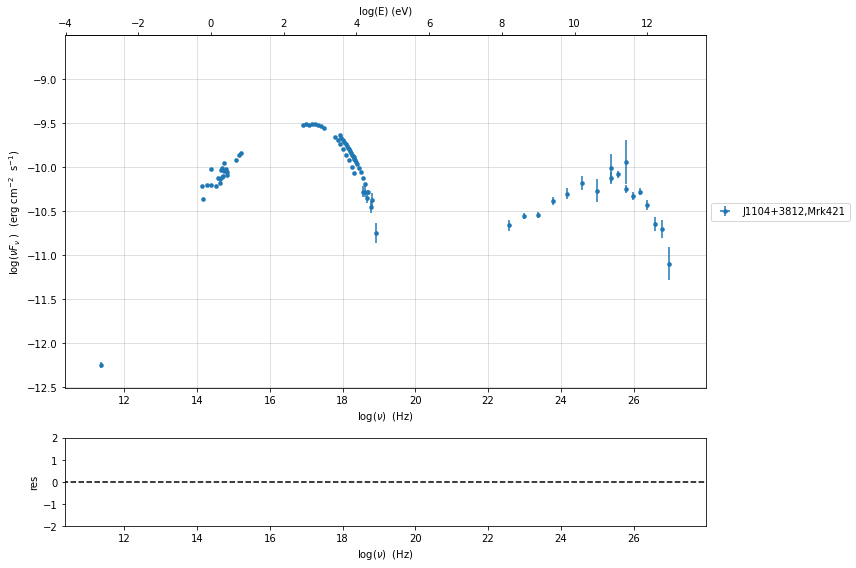
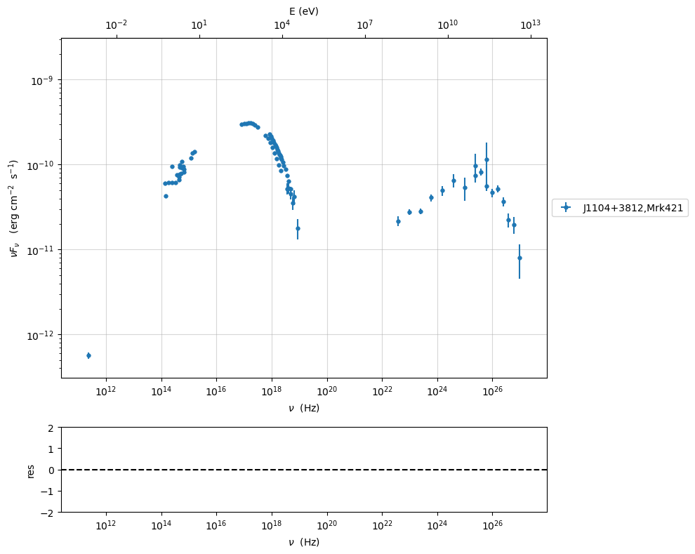
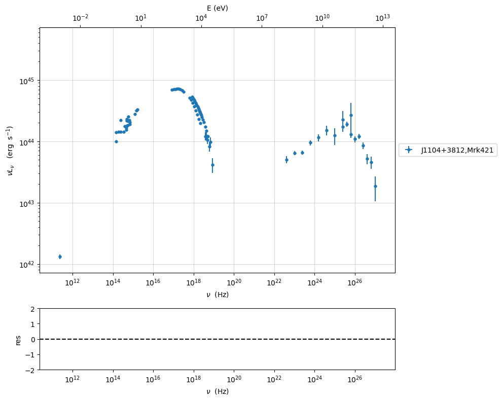
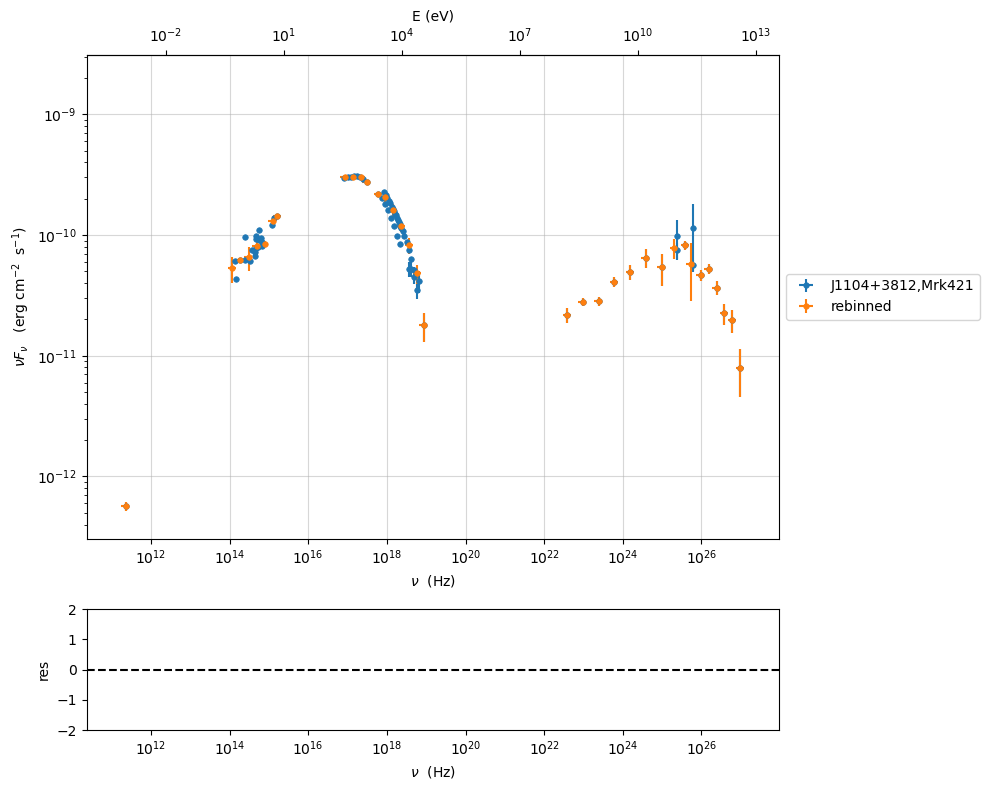
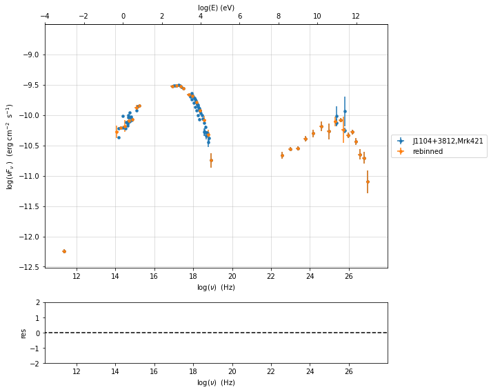
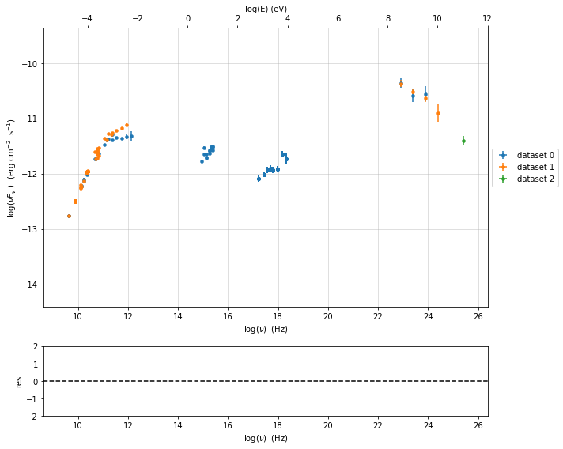
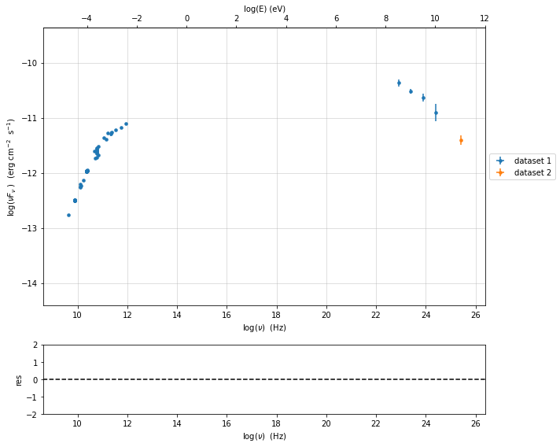
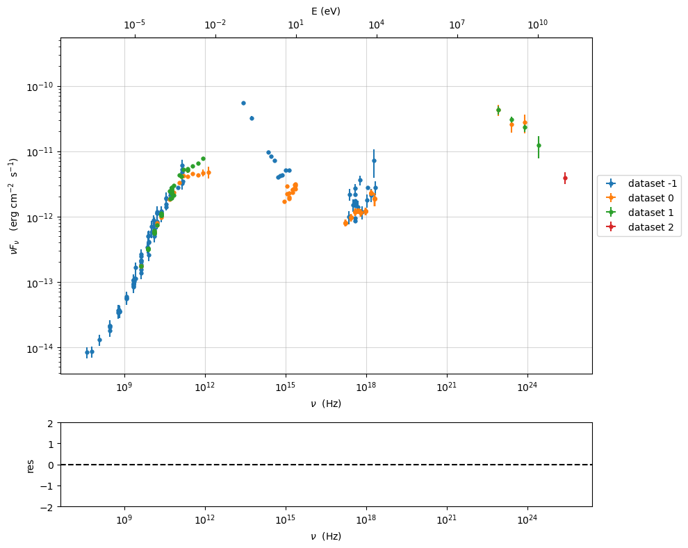

.. _data-format:

Data format and SED data
========================

The data are treated using two classes from the module :mod:`.data_loader`

- :class:`jetset.data_loader.Data` class 
- :class:`jetset.data_loader.ObsData` class 

The class :class:`jetset.data_loader.Data` is in charge of storing the data, giving access to the I/O functionalities, and provides an interface  to the astropy Table class (see the  `astropy table <https://docs.astropy.org/en/stable/table/>`_. documentation, for further information)

The class :class:`jetset.data_loader.ObsData` uses the information stored in :class:`jetset.data_loader.Data`, and can perform several operations 
This is the class to use for model fitting and in general in Jetset
 
 - rebinning (grouping) of the data
 - selection of time ranges
 - selection of datasets
 - transformation from linear to logarithmic representation
 - handling of errors and systematics

.. note::
    old version of data file in non `ecsv` astropy table format, can be easily converted by importing them using the method described 
    in :ref:`import` and saving them

.. code:: ipython3

    import jetset
    print('tested on jetset',jetset.__version__)

.. code:: ipython3

    import warnings
    warnings.filterwarnings('ignore')
    
    import matplotlib
    import numpy as np
    import matplotlib.pyplot as plt
    %matplotlib inline  

Data format for Data object
---------------------------

The SED data are internally stored as astropy tables, but it is very
easy to import from

1. ascii files
2. numpy array in general

once that is clear the data format. The easiest way to understand the
data format is to build an empty table to have a look at the structure
of the table:

.. code:: ipython3

    from jetset.data_loader import Data
    data=Data(n_rows=10)

we can easily access the astropy table

.. code:: ipython3

    data.table

.. raw:: html

    <i>Table length=10</i>
    <table id="table140538418063536" class="table-striped table-bordered table-condensed">
    <thead><tr><th>x</th><th>dx</th><th>y</th><th>dy</th><th>T_start</th><th>T_stop</th><th>UL</th><th>data_set</th></tr></thead>
    <thead><tr><th>Hz</th><th>Hz</th><th>erg / (cm2 s)</th><th>erg / (cm2 s)</th><th>MJD</th><th>MJD</th><th></th><th></th></tr></thead>
    <thead><tr><th>float64</th><th>float64</th><th>float64</th><th>float64</th><th>float64</th><th>float64</th><th>bool</th><th>bytes16</th></tr></thead>
    <tr><td>0.0</td><td>0.0</td><td>0.0</td><td>0.0</td><td>0.0</td><td>0.0</td><td>False</td><td>0.0</td></tr>
    <tr><td>0.0</td><td>0.0</td><td>0.0</td><td>0.0</td><td>0.0</td><td>0.0</td><td>False</td><td>0.0</td></tr>
    <tr><td>0.0</td><td>0.0</td><td>0.0</td><td>0.0</td><td>0.0</td><td>0.0</td><td>False</td><td>0.0</td></tr>
    <tr><td>0.0</td><td>0.0</td><td>0.0</td><td>0.0</td><td>0.0</td><td>0.0</td><td>False</td><td>0.0</td></tr>
    <tr><td>0.0</td><td>0.0</td><td>0.0</td><td>0.0</td><td>0.0</td><td>0.0</td><td>False</td><td>0.0</td></tr>
    <tr><td>0.0</td><td>0.0</td><td>0.0</td><td>0.0</td><td>0.0</td><td>0.0</td><td>False</td><td>0.0</td></tr>
    <tr><td>0.0</td><td>0.0</td><td>0.0</td><td>0.0</td><td>0.0</td><td>0.0</td><td>False</td><td>0.0</td></tr>
    <tr><td>0.0</td><td>0.0</td><td>0.0</td><td>0.0</td><td>0.0</td><td>0.0</td><td>False</td><td>0.0</td></tr>
    <tr><td>0.0</td><td>0.0</td><td>0.0</td><td>0.0</td><td>0.0</td><td>0.0</td><td>False</td><td>0.0</td></tr>
    <tr><td>0.0</td><td>0.0</td><td>0.0</td><td>0.0</td><td>0.0</td><td>0.0</td><td>False</td><td>0.0</td></tr>
    </table>

-  ``x`` column is reserved to frequencies (mandatory)
-  ``y`` columm is reserved to fluxes (mandatory)
-  ``dx`` columm is reserved to the error on the frequency,or bin width
-  ``dy`` columm is reserved to the error on the fluxes
-  ``UL`` columm is reserved to the flag for Upper Limit
-  ``T_start`` and ``T_stop`` are used to identify the time range to
   select data using the class ``ObsData``
-  ``data_set``

.. code:: ipython3

    data.table['x']

.. raw:: html

    &lt;Column name=&apos;x&apos; dtype=&apos;float64&apos; unit=&apos;Hz&apos; length=10&gt;
    <table>
    <tr><td>0.0</td></tr>
    <tr><td>0.0</td></tr>
    <tr><td>0.0</td></tr>
    <tr><td>0.0</td></tr>
    <tr><td>0.0</td></tr>
    <tr><td>0.0</td></tr>
    <tr><td>0.0</td></tr>
    <tr><td>0.0</td></tr>
    <tr><td>0.0</td></tr>
    <tr><td>0.0</td></tr>
    </table>

columns with units are implemented using the ``Units`` module of astropy
(https://docs.astropy.org/en/stable/units/).

and we can easily access the metadata

.. code:: ipython3

    data.metadata

.. parsed-literal::

    OrderedDict([('z', 0),
                 ('UL_CL', 0.95),
                 ('restframe', 'obs'),
                 ('data_scale', 'lin-lin'),
                 ('obj_name', 'new-src')])

-  ``z``: the redshift of the object
-  ``UL_CL``: the CL for the UL
-  ``restframe``: possible values\ ``obs`` or ``src``, indicating if the
   data are observed flux, or luminosities, respectively
-  ``data_scale``: possible values\ ``lin-lin`` or ``log-log``,
   indicating if the data are in linear or logarithmic scale,
   respectively
-  ``obj_name``: the name of the object

.. note::
   starting from version 1.1.0 ``src`` to ``obs`` transformation is available

Loading from astropy table
~~~~~~~~~~~~~~~~~~~~~~~~~~

you can use the default SEDs distributed with the package to get
familiar with data handling

.. code:: ipython3

    from jetset.test_data_helper import  test_SEDs
    test_SEDs

.. parsed-literal::

    ['/Users/orion/anaconda3/envs/jetset/lib/python3.8/site-packages/jetset/test_data/SEDs_data/SED_3C345.ecsv',
     '/Users/orion/anaconda3/envs/jetset/lib/python3.8/site-packages/jetset/test_data/SEDs_data/SED_MW_Mrk421_EBL_DEABS.ecsv',
     '/Users/orion/anaconda3/envs/jetset/lib/python3.8/site-packages/jetset/test_data/SEDs_data/SED_MW_Mrk501_EBL_ABS.ecsv',
     '/Users/orion/anaconda3/envs/jetset/lib/python3.8/site-packages/jetset/test_data/SEDs_data/SED_MW_Mrk501_EBL_DEABS.ecsv']

As you can see there are three 3 files. We use in this example the file for Mrk 421, and we use class:`jetset.data_loader.Data` class  

.. code:: ipython3

    from jetset.data_loader import Data

.. code:: ipython3

    data=Data.from_file(data_table=test_SEDs[1])

.. code:: ipython3

    data.table

.. raw:: html

    <i>Table length=110</i>
    <table id="table140538442366640" class="table-striped table-bordered table-condensed">
    <thead><tr><th>x</th><th>dx</th><th>y</th><th>dy</th><th>T_start</th><th>T_stop</th><th>UL</th><th>data_set</th></tr></thead>
    <thead><tr><th>Hz</th><th>Hz</th><th>erg / (cm2 s)</th><th>erg / (cm2 s)</th><th>MJD</th><th>MJD</th><th></th><th></th></tr></thead>
    <thead><tr><th>float64</th><th>float64</th><th>float64</th><th>float64</th><th>float64</th><th>float64</th><th>bool</th><th>str13</th></tr></thead>
    <tr><td>2299540000.0</td><td>0.0</td><td>1.3409e-14</td><td>3.91e-16</td><td>0.0</td><td>0.0</td><td>False</td><td>campaing-2009</td></tr>
    <tr><td>2639697000.0</td><td>0.0</td><td>1.793088e-14</td><td>3.231099e-26</td><td>0.0</td><td>0.0</td><td>False</td><td>campaing-2009</td></tr>
    <tr><td>4799040000.0</td><td>0.0</td><td>2.3136e-14</td><td>2.4e-16</td><td>0.0</td><td>0.0</td><td>False</td><td>campaing-2009</td></tr>
    <tr><td>4805039000.0</td><td>0.0</td><td>1.773414e-14</td><td>1.773414e-15</td><td>0.0</td><td>0.0</td><td>False</td><td>campaing-2009</td></tr>
    <tr><td>4843552000.0</td><td>0.0</td><td>2.77614e-14</td><td>2.615339e-26</td><td>0.0</td><td>0.0</td><td>False</td><td>campaing-2009</td></tr>
    <tr><td>7698460000.0</td><td>0.0</td><td>3.696e-14</td><td>4.62e-16</td><td>0.0</td><td>0.0</td><td>False</td><td>campaing-2009</td></tr>
    <tr><td>8267346000.0</td><td>0.0</td><td>2.836267e-14</td><td>2.836267e-15</td><td>0.0</td><td>0.0</td><td>False</td><td>campaing-2009</td></tr>
    <tr><td>8331867000.0</td><td>0.0</td><td>3.98963e-14</td><td>3.627671e-26</td><td>0.0</td><td>0.0</td><td>False</td><td>campaing-2009</td></tr>
    <tr><td>8388659000.0</td><td>0.0</td><td>3.16345e-14</td><td>1.931495e-15</td><td>0.0</td><td>0.0</td><td>False</td><td>campaing-2009</td></tr>
    <tr><td>...</td><td>...</td><td>...</td><td>...</td><td>...</td><td>...</td><td>...</td><td>...</td></tr>
    <tr><td>2.417992e+25</td><td>0.0</td><td>9.754259e-11</td><td>3.560456e-11</td><td>0.0</td><td>0.0</td><td>False</td><td>campaing-2009</td></tr>
    <tr><td>3.823193e+25</td><td>0.0</td><td>8.199207e-11</td><td>7.050657e-12</td><td>0.0</td><td>0.0</td><td>False</td><td>campaing-2009</td></tr>
    <tr><td>6.059363e+25</td><td>0.0</td><td>5.614334e-11</td><td>5.793969e-12</td><td>0.0</td><td>0.0</td><td>False</td><td>campaing-2009</td></tr>
    <tr><td>6.073707e+25</td><td>0.0</td><td>1.14705e-10</td><td>6.573696e-11</td><td>0.0</td><td>0.0</td><td>False</td><td>campaing-2009</td></tr>
    <tr><td>9.603433e+25</td><td>0.0</td><td>4.662219e-11</td><td>5.097912e-12</td><td>0.0</td><td>0.0</td><td>False</td><td>campaing-2009</td></tr>
    <tr><td>1.522041e+26</td><td>0.0</td><td>5.221583e-11</td><td>4.89063e-12</td><td>0.0</td><td>0.0</td><td>False</td><td>campaing-2009</td></tr>
    <tr><td>2.41227e+26</td><td>0.0</td><td>3.66834e-11</td><td>4.682033e-12</td><td>0.0</td><td>0.0</td><td>False</td><td>campaing-2009</td></tr>
    <tr><td>3.823193e+26</td><td>0.0</td><td>2.247871e-11</td><td>4.343216e-12</td><td>0.0</td><td>0.0</td><td>False</td><td>campaing-2009</td></tr>
    <tr><td>6.059363e+26</td><td>0.0</td><td>1.972081e-11</td><td>4.407365e-12</td><td>0.0</td><td>0.0</td><td>False</td><td>campaing-2009</td></tr>
    <tr><td>9.603433e+26</td><td>0.0</td><td>7.994215e-12</td><td>3.469109e-12</td><td>0.0</td><td>0.0</td><td>False</td><td>campaing-2009</td></tr>
    </table>

.. code:: ipython3

    data.metadata

.. parsed-literal::

    OrderedDict([('z', 0.0308),
                 ('restframe', 'obs'),
                 ('data_scale', 'lin-lin'),
                 ('obj_name', 'J1104+3812,Mrk421')])

this is an extract of the  astropy table saved in the format ``ascii.ecsv`` 

::

   # %ECSV 0.9
   # ---
   # datatype:
   # - {name: x, unit: Hz, datatype: float64}
   # - {name: dx, unit: Hz, datatype: float64}
   # - {name: y, unit: erg / (cm2 s), datatype: float64}
   # - {name: dy, unit: erg / (cm2 s), datatype: float64}
   # - {name: T_start, unit: MJD, datatype: float64}
   # - {name: T_stop, unit: MJD, datatype: float64}
   # - {name: UL, datatype: bool}
   # - {name: data_set, datatype: string}
   # meta: !!omap
   # - {z: 0.0308}
   # - {restframe: obs}
   # - {data_scale: lin-lin}
   # - {obj_name: 'J1104+3812,Mrk421'}
   # schema: astropy-2.0
   x dx y dy T_start T_stop UL data_set
   2299540000.0 0.0 1.3409e-14 3.91e-16 0.0 0.0 False campaing-2009
   2639697000.0 0.0 1.793088e-14 3.231099e-26 0.0 0.0 False campaing-2009
   4799040000.0 0.0 2.3136e-14 2.4e-16 0.0 0.0 False campaing-2009

Saving Data object to a file
~~~~~~~~~~~~~~~~~~~~~~~~~~~~

.. code:: ipython3

    data.save_file('test.ecsv')

the data can be loaded from the saved table

.. code:: ipython3

    data=Data.from_file('test.ecsv')

.. code:: ipython3

    data.table

.. raw:: html

    <i>Table length=110</i>
    <table id="table140538418063152" class="table-striped table-bordered table-condensed">
    <thead><tr><th>x</th><th>dx</th><th>y</th><th>dy</th><th>T_start</th><th>T_stop</th><th>UL</th><th>data_set</th></tr></thead>
    <thead><tr><th>Hz</th><th>Hz</th><th>erg / (cm2 s)</th><th>erg / (cm2 s)</th><th>MJD</th><th>MJD</th><th></th><th></th></tr></thead>
    <thead><tr><th>float64</th><th>float64</th><th>float64</th><th>float64</th><th>float64</th><th>float64</th><th>bool</th><th>str13</th></tr></thead>
    <tr><td>2299540000.0</td><td>0.0</td><td>1.3409e-14</td><td>3.91e-16</td><td>0.0</td><td>0.0</td><td>False</td><td>campaing-2009</td></tr>
    <tr><td>2639697000.0</td><td>0.0</td><td>1.793088e-14</td><td>3.231099e-26</td><td>0.0</td><td>0.0</td><td>False</td><td>campaing-2009</td></tr>
    <tr><td>4799040000.0</td><td>0.0</td><td>2.3136e-14</td><td>2.4e-16</td><td>0.0</td><td>0.0</td><td>False</td><td>campaing-2009</td></tr>
    <tr><td>4805039000.0</td><td>0.0</td><td>1.773414e-14</td><td>1.773414e-15</td><td>0.0</td><td>0.0</td><td>False</td><td>campaing-2009</td></tr>
    <tr><td>4843552000.0</td><td>0.0</td><td>2.77614e-14</td><td>2.615339e-26</td><td>0.0</td><td>0.0</td><td>False</td><td>campaing-2009</td></tr>
    <tr><td>7698460000.0</td><td>0.0</td><td>3.696e-14</td><td>4.62e-16</td><td>0.0</td><td>0.0</td><td>False</td><td>campaing-2009</td></tr>
    <tr><td>8267346000.0</td><td>0.0</td><td>2.836267e-14</td><td>2.836267e-15</td><td>0.0</td><td>0.0</td><td>False</td><td>campaing-2009</td></tr>
    <tr><td>8331867000.0</td><td>0.0</td><td>3.98963e-14</td><td>3.627671e-26</td><td>0.0</td><td>0.0</td><td>False</td><td>campaing-2009</td></tr>
    <tr><td>8388659000.0</td><td>0.0</td><td>3.16345e-14</td><td>1.931495e-15</td><td>0.0</td><td>0.0</td><td>False</td><td>campaing-2009</td></tr>
    <tr><td>...</td><td>...</td><td>...</td><td>...</td><td>...</td><td>...</td><td>...</td><td>...</td></tr>
    <tr><td>2.417992e+25</td><td>0.0</td><td>9.754259e-11</td><td>3.560456e-11</td><td>0.0</td><td>0.0</td><td>False</td><td>campaing-2009</td></tr>
    <tr><td>3.823193e+25</td><td>0.0</td><td>8.199207e-11</td><td>7.050657e-12</td><td>0.0</td><td>0.0</td><td>False</td><td>campaing-2009</td></tr>
    <tr><td>6.059363e+25</td><td>0.0</td><td>5.614334e-11</td><td>5.793969e-12</td><td>0.0</td><td>0.0</td><td>False</td><td>campaing-2009</td></tr>
    <tr><td>6.073707e+25</td><td>0.0</td><td>1.14705e-10</td><td>6.573696e-11</td><td>0.0</td><td>0.0</td><td>False</td><td>campaing-2009</td></tr>
    <tr><td>9.603433e+25</td><td>0.0</td><td>4.662219e-11</td><td>5.097912e-12</td><td>0.0</td><td>0.0</td><td>False</td><td>campaing-2009</td></tr>
    <tr><td>1.522041e+26</td><td>0.0</td><td>5.221583e-11</td><td>4.89063e-12</td><td>0.0</td><td>0.0</td><td>False</td><td>campaing-2009</td></tr>
    <tr><td>2.41227e+26</td><td>0.0</td><td>3.66834e-11</td><td>4.682033e-12</td><td>0.0</td><td>0.0</td><td>False</td><td>campaing-2009</td></tr>
    <tr><td>3.823193e+26</td><td>0.0</td><td>2.247871e-11</td><td>4.343216e-12</td><td>0.0</td><td>0.0</td><td>False</td><td>campaing-2009</td></tr>
    <tr><td>6.059363e+26</td><td>0.0</td><td>1.972081e-11</td><td>4.407365e-12</td><td>0.0</td><td>0.0</td><td>False</td><td>campaing-2009</td></tr>
    <tr><td>9.603433e+26</td><td>0.0</td><td>7.994215e-12</td><td>3.469109e-12</td><td>0.0</td><td>0.0</td><td>False</td><td>campaing-2009</td></tr>
    </table>

.. _import:

Importing from an arbitrary ascii file or numpy array to Data object
~~~~~~~~~~~~~~~~~~~~~~~~~~~~~~~~~~~~~~~~~~~~~~~~~~~~~~~~~~~~~~~~~~~~

Assume that your data are stored in an ASCII file named
‘test-ascii.txt’, with - ``x`` in the first column with frequency in
``Hz`` , - ``y`` in the second column with fluxes in erg ``cm-2 s-1``, -
``dy`` in the third column with the same units as ``y`` - the data are
in ``log-log`` scale

**of course the column number depends on the file that you are using,
this is only an example**

.. code:: ipython3

    from jetset.data_loader import Data
    import numpy as np
    
    d=np.genfromtxt('test-ascii.txt')
    data=Data(n_rows=d.shape[0])
    data.set_field('x',d[:,0])
    data.set_field('y',d[:,1])
    data.set_field('dy',value=d[:,2])

then you can set the meatdata as follows

.. code:: ipython3

    data.set_meta_data('z',1.02)
    data.set_meta_data('restframe','obs')
    data.set_meta_data('data_scale','log-log')

of course this method applies if you have a generic 2-dim numpy array.

.. code:: ipython3

    data.table

.. raw:: html

    <i>Table length=20</i>
    <table id="table140538442408240" class="table-striped table-bordered table-condensed">
    <thead><tr><th>x</th><th>dx</th><th>y</th><th>dy</th><th>T_start</th><th>T_stop</th><th>UL</th><th>data_set</th></tr></thead>
    <thead><tr><th>Hz</th><th>Hz</th><th>erg / (cm2 s)</th><th>erg / (cm2 s)</th><th>MJD</th><th>MJD</th><th></th><th></th></tr></thead>
    <thead><tr><th>float64</th><th>float64</th><th>float64</th><th>float64</th><th>float64</th><th>float64</th><th>bool</th><th>bytes16</th></tr></thead>
    <tr><td>24.161967</td><td>0.0</td><td>-12.497324</td><td>0.334376</td><td>0.0</td><td>0.0</td><td>False</td><td>0.0</td></tr>
    <tr><td>25.161967</td><td>0.0</td><td>-12.512137</td><td>0.636293</td><td>0.0</td><td>0.0</td><td>False</td><td>0.0</td></tr>
    <tr><td>23.161967</td><td>0.0</td><td>-12.444346</td><td>0.38048</td><td>0.0</td><td>0.0</td><td>False</td><td>0.0</td></tr>
    <tr><td>23.684845</td><td>0.0</td><td>-12.257916</td><td>0.164397</td><td>0.0</td><td>0.0</td><td>False</td><td>0.0</td></tr>
    <tr><td>22.684845</td><td>0.0</td><td>-12.000541</td><td>0.0</td><td>0.0</td><td>0.0</td><td>False</td><td>0.0</td></tr>
    <tr><td>15.2900346113625</td><td>0.0</td><td>-13.3225755622988</td><td>0.127157926321555</td><td>0.0</td><td>0.0</td><td>False</td><td>0.0</td></tr>
    <tr><td>15.1105897102992</td><td>0.0</td><td>-12.7495312032995</td><td>0.40748532657827</td><td>0.0</td><td>0.0</td><td>False</td><td>0.0</td></tr>
    <tr><td>15.1105897102992</td><td>0.0</td><td>-12.8808101179388</td><td>0.410904985836407</td><td>0.0</td><td>0.0</td><td>False</td><td>0.0</td></tr>
    <tr><td>14.6702458530741</td><td>0.0</td><td>-12.477274153289</td><td>0.0</td><td>0.0</td><td>0.0</td><td>False</td><td>0.0</td></tr>
    <tr><td>14.5888317255942</td><td>0.0</td><td>-12.875874154363</td><td>0.0</td><td>0.0</td><td>0.0</td><td>False</td><td>0.0</td></tr>
    <tr><td>10.644439</td><td>0.0</td><td>-12.515761</td><td>0.090508</td><td>0.0</td><td>0.0</td><td>False</td><td>0.0</td></tr>
    <tr><td>10.477121</td><td>0.0</td><td>-12.665868</td><td>0.072712</td><td>0.0</td><td>0.0</td><td>False</td><td>0.0</td></tr>
    <tr><td>10.2988530764097</td><td>0.0</td><td>-13.2322481107094</td><td>0.486627579841286</td><td>0.0</td><td>0.0</td><td>False</td><td>0.0</td></tr>
    <tr><td>10.1760912590557</td><td>0.0</td><td>-13.3326058184618</td><td>0.935000421715186</td><td>0.0</td><td>0.0</td><td>False</td><td>0.0</td></tr>
    <tr><td>9.93449845124357</td><td>0.0</td><td>-13.6367199590836</td><td>0.0</td><td>0.0</td><td>0.0</td><td>False</td><td>0.0</td></tr>
    <tr><td>9.92427928606188</td><td>0.0</td><td>-13.5500291112572</td><td>0.0</td><td>0.0</td><td>0.0</td><td>False</td><td>0.0</td></tr>
    <tr><td>9.68574173860226</td><td>0.0</td><td>-13.7561818857395</td><td>0.427742607163214</td><td>0.0</td><td>0.0</td><td>False</td><td>0.0</td></tr>
    <tr><td>9.36172783601759</td><td>0.0</td><td>-14.121068671527</td><td>0.0</td><td>0.0</td><td>0.0</td><td>False</td><td>0.0</td></tr>
    <tr><td>9.14612803567824</td><td>0.0</td><td>-14.5547242324656</td><td>0.682147390735292</td><td>0.0</td><td>0.0</td><td>False</td><td>0.0</td></tr>
    <tr><td>7.86805636182304</td><td>0.0</td><td>-15.4827165132972</td><td>0.025977834481891</td><td>0.0</td><td>0.0</td><td>False</td><td>0.0</td></tr>
    </table>

Importing to Data object from a generic astropy table mapping columns
~~~~~~~~~~~~~~~~~~~~~~~~~~~~~~~~~~~~~~~~~~~~~~~~~~~~~~~~~~~~~~~~~~~~~

If you want to use a ``TABLE`` with arbitrary column names, you can use
an import dictionary, mapping the input name to the target. E.g. assume
that you column in the input table column named ``freq`` that should
target the ``x`` column, and another named ``freq err`` associated to
``dx`` you can simply pass the dictionary to the ``from_file`` method:

.. code:: python

   data=Data.from_file(data_table='your-file',import_dictionary={'freq':'x','freq err':'dx'})

Importing from the ASI ssdc sedtool to Data object
~~~~~~~~~~~~~~~~~~~~~~~~~~~~~~~~~~~~~~~~~~~~~~~~~~

To import data from a data file downloaded from the asi ssdc sedtool:
https://tools.ssdc.asi.it/SED/

we can use the importing tool in the :class:`jetset.data_loader.Data`. We just need to have the file downloaded from the asi ssdc sedtool, and to know the redshift of the object, the scale we selected (lin-lin, or log-log).
Assume that we downloaded the data for Mrk421, in observed fluxes and linear scale, and the data are saved in the file 'MRK421_asdc.txt', we only have to do:

.. code:: ipython3

    from jetset.data_loader import Data
    data=Data.from_asdc(asdc_sed_file='MRK421_asdc.txt',obj_name='Mrk421',restframe='obs',data_scale='lin-lin',z=0.038)

.. note::
   starting from version 1.1.0 ``src`` to ``obs`` transformation is available

.. code:: ipython3

    data.table

.. raw:: html

    <i>Table length=3550</i>
    <table id="table140538417879792" class="table-striped table-bordered table-condensed">
    <thead><tr><th>x</th><th>dx</th><th>y</th><th>dy</th><th>T_start</th><th>T_stop</th><th>UL</th><th>data_set</th></tr></thead>
    <thead><tr><th>Hz</th><th>Hz</th><th>erg / (cm2 s)</th><th>erg / (cm2 s)</th><th>MJD</th><th>MJD</th><th></th><th></th></tr></thead>
    <thead><tr><th>float64</th><th>float64</th><th>float64</th><th>float64</th><th>float64</th><th>float64</th><th>bool</th><th>bytes16</th></tr></thead>
    <tr><td>1.395e+17</td><td>2.077e+16</td><td>1.3665e-10</td><td>7.8618e-12</td><td>50569.13745</td><td>50569.61257</td><td>False</td><td>0.0</td></tr>
    <tr><td>1.883e+17</td><td>2.805e+16</td><td>1.3231e-10</td><td>5.2986e-12</td><td>50569.13745</td><td>50569.61257</td><td>False</td><td>0.0</td></tr>
    <tr><td>2.542e+17</td><td>3.786e+16</td><td>1.2801e-10</td><td>4.5958e-12</td><td>50569.13745</td><td>50569.61257</td><td>False</td><td>0.0</td></tr>
    <tr><td>3.432e+17</td><td>5.111e+16</td><td>1.1696e-10</td><td>4.4475e-12</td><td>50569.13745</td><td>50569.61257</td><td>False</td><td>0.0</td></tr>
    <tr><td>4.633e+17</td><td>6.901e+16</td><td>1.0488e-10</td><td>2.8152e-12</td><td>50569.13745</td><td>50569.61257</td><td>False</td><td>0.0</td></tr>
    <tr><td>6.255e+17</td><td>9.316e+16</td><td>8.8421e-11</td><td>2.2462e-12</td><td>50569.13745</td><td>50569.61257</td><td>False</td><td>0.0</td></tr>
    <tr><td>8.444e+17</td><td>1.258e+17</td><td>7.2995e-11</td><td>2.3614e-12</td><td>50569.13745</td><td>50569.61257</td><td>False</td><td>0.0</td></tr>
    <tr><td>1.14e+18</td><td>1.698e+17</td><td>5.7982e-11</td><td>2.5232e-12</td><td>50569.13745</td><td>50569.61257</td><td>False</td><td>0.0</td></tr>
    <tr><td>1.539e+18</td><td>2.292e+17</td><td>4.52e-11</td><td>2.9633e-12</td><td>50569.13745</td><td>50569.61257</td><td>False</td><td>0.0</td></tr>
    <tr><td>...</td><td>...</td><td>...</td><td>...</td><td>...</td><td>...</td><td>...</td><td>...</td></tr>
    <tr><td>4850000000.0</td><td>0.0</td><td>2.9604e-14</td><td>2.425e-17</td><td>0.0</td><td>0.0</td><td>False</td><td>0.0</td></tr>
    <tr><td>1400000000.0</td><td>0.0</td><td>5.0638e-16</td><td>2.31e-18</td><td>49078.5</td><td>49443.5</td><td>False</td><td>0.0</td></tr>
    <tr><td>1400000000.0</td><td>0.0</td><td>1.68e-17</td><td>2.296e-18</td><td>49078.5</td><td>49443.5</td><td>False</td><td>0.0</td></tr>
    <tr><td>1400000000.0</td><td>0.0</td><td>8.0331e-15</td><td>2.31e-18</td><td>49078.5</td><td>49443.5</td><td>False</td><td>0.0</td></tr>
    <tr><td>408000000.0</td><td>0.0</td><td>4.692e-15</td><td>0.0</td><td>0.0</td><td>0.0</td><td>False</td><td>0.0</td></tr>
    <tr><td>2700000000.0</td><td>0.0</td><td>2.079e-14</td><td>0.0</td><td>0.0</td><td>0.0</td><td>False</td><td>0.0</td></tr>
    <tr><td>10700000000.0</td><td>0.0</td><td>8.453e-14</td><td>0.0</td><td>0.0</td><td>0.0</td><td>False</td><td>0.0</td></tr>
    <tr><td>5000000000.0</td><td>0.0</td><td>3.625e-14</td><td>0.0</td><td>0.0</td><td>0.0</td><td>False</td><td>0.0</td></tr>
    <tr><td>8460000000.0</td><td>0.0</td><td>5.3433e-14</td><td>3.384e-17</td><td>47941.5</td><td>47941.5</td><td>False</td><td>0.0</td></tr>
    <tr><td>8400000000.0</td><td>0.0</td><td>5.3054e-14</td><td>0.0</td><td>0.0</td><td>0.0</td><td>False</td><td>0.0</td></tr>
    </table>

.. note::
   When importing data from the ``src`` frame, the Data constructor will not convert units, but will assume that input units are erg/s. If this is not the case an error message will be displayed

Building the SED the ObsData object
-----------------------------------

Once we have a data table built with the class:`jetset.data_loader.Data`, following  one of the method described above, you can create  SED data using the  :class:`jetset.data_loader.ObsData` class.
In the example we use one of the test SEDs provided by the package:

We start to loading  the SED of  Mrk 421, and we pass to ``ObsData`` directly the path to the file, because this is already in the format that we need and that we have discussed above.

.. code:: ipython3

    from jetset.data_loader import Data
    from jetset.data_loader import ObsData
    from jetset.test_data_helper import  test_SEDs
    
    data_table=Data.from_file(test_SEDs[1])
    sed_data=ObsData(data_table=data_table)

if you want to use a cosmology model different from the default one please read the :ref:`cosmology` section

As you can see all the meta-data have been properly sourced from the SED
file header. You also get information on the length of the data, before
and after elimination of duplicated entries, and upper limits

.. code:: ipython3

    sed_data.table

.. raw:: html

    <i>Table length=110</i>
    <table id="table140538444373344" class="table-striped table-bordered table-condensed">
    <thead><tr><th>nu_data</th><th>dnu_data</th><th>nuFnu_data</th><th>dnuFnu_data</th><th>nu_data_log</th><th>dnu_data_log</th><th>nuFnu_data_log</th><th>dnuFnu_data_log</th><th>dnuFnu_fake</th><th>dnuFnu_fake_log</th><th>UL</th><th>zero_error</th><th>T_start</th><th>T_stop</th><th>data_set</th></tr></thead>
    <thead><tr><th>Hz</th><th>Hz</th><th>erg / (cm2 s)</th><th>erg / (cm2 s)</th><th>Hz</th><th>Hz</th><th>erg / (cm2 s)</th><th>erg / (cm2 s)</th><th>erg / (cm2 s)</th><th></th><th></th><th></th><th>MJD</th><th>MJD</th><th></th></tr></thead>
    <thead><tr><th>float64</th><th>float64</th><th>float64</th><th>float64</th><th>float64</th><th>float64</th><th>float64</th><th>float64</th><th>float64</th><th>float64</th><th>bool</th><th>bool</th><th>float64</th><th>float64</th><th>str13</th></tr></thead>
    <tr><td>2299540000.0</td><td>0.0</td><td>1.3409e-14</td><td>3.91e-16</td><td>9.361640968434164</td><td>0.0</td><td>-13.872603609223393</td><td>0.012663818511758627</td><td>2.6818000000000003e-15</td><td>0.2</td><td>False</td><td>False</td><td>0.0</td><td>0.0</td><td>campaing-2009</td></tr>
    <tr><td>2639697000.0</td><td>0.0</td><td>1.793088e-14</td><td>3.231099e-26</td><td>9.421554078847052</td><td>0.0</td><td>-13.746398395894273</td><td>7.825876176646739e-13</td><td>3.586176e-15</td><td>0.2</td><td>False</td><td>False</td><td>0.0</td><td>0.0</td><td>campaing-2009</td></tr>
    <tr><td>4799040000.0</td><td>0.0</td><td>2.3136e-14</td><td>2.4e-16</td><td>9.681154369792159</td><td>0.0</td><td>-13.635711724385564</td><td>0.0045051294803241885</td><td>4.627200000000001e-15</td><td>0.2</td><td>False</td><td>False</td><td>0.0</td><td>0.0</td><td>campaing-2009</td></tr>
    <tr><td>4805039000.0</td><td>0.0</td><td>1.773414e-14</td><td>1.773414e-15</td><td>9.68169691696108</td><td>0.0</td><td>-13.751189867373059</td><td>0.04342944819032518</td><td>3.546828e-15</td><td>0.2</td><td>False</td><td>False</td><td>0.0</td><td>0.0</td><td>campaing-2009</td></tr>
    <tr><td>4843552000.0</td><td>0.0</td><td>2.77614e-14</td><td>2.615339e-26</td><td>9.68516396664987</td><td>0.0</td><td>-13.556558636309997</td><td>4.091390549490907e-13</td><td>5.55228e-15</td><td>0.2</td><td>False</td><td>False</td><td>0.0</td><td>0.0</td><td>campaing-2009</td></tr>
    <tr><td>7698460000.0</td><td>0.0</td><td>3.696e-14</td><td>4.62e-16</td><td>9.886403857589054</td><td>0.0</td><td>-13.43226803745193</td><td>0.005428681023790648</td><td>7.392e-15</td><td>0.2</td><td>False</td><td>False</td><td>0.0</td><td>0.0</td><td>campaing-2009</td></tr>
    <tr><td>8267346000.0</td><td>0.0</td><td>2.836267e-14</td><td>2.836267e-15</td><td>9.917366113839973</td><td>0.0</td><td>-13.547252888027566</td><td>0.043429448190325175</td><td>5.672534000000001e-15</td><td>0.2</td><td>False</td><td>False</td><td>0.0</td><td>0.0</td><td>campaing-2009</td></tr>
    <tr><td>8331867000.0</td><td>0.0</td><td>3.98963e-14</td><td>3.627671e-26</td><td>9.920742328771254</td><td>0.0</td><td>-13.399067379102538</td><td>3.948931348171262e-13</td><td>7.97926e-15</td><td>0.2</td><td>False</td><td>False</td><td>0.0</td><td>0.0</td><td>campaing-2009</td></tr>
    <tr><td>8388659000.0</td><td>0.0</td><td>3.16345e-14</td><td>1.931495e-15</td><td>9.92369254063231</td><td>0.0</td><td>-13.499839025404517</td><td>0.026516544289422034</td><td>6.3268999999999995e-15</td><td>0.2</td><td>False</td><td>False</td><td>0.0</td><td>0.0</td><td>campaing-2009</td></tr>
    <tr><td>...</td><td>...</td><td>...</td><td>...</td><td>...</td><td>...</td><td>...</td><td>...</td><td>...</td><td>...</td><td>...</td><td>...</td><td>...</td><td>...</td><td>...</td></tr>
    <tr><td>2.417992e+25</td><td>0.0</td><td>9.754259e-11</td><td>3.560456e-11</td><td>25.38345485965064</td><td>0.0</td><td>-10.010805716985434</td><td>0.15852422965797036</td><td>1.9508518000000003e-11</td><td>0.2</td><td>False</td><td>False</td><td>0.0</td><td>0.0</td><td>campaing-2009</td></tr>
    <tr><td>3.823193e+25</td><td>0.0</td><td>8.199207e-11</td><td>7.050657e-12</td><td>25.582426222350527</td><td>0.0</td><td>-10.086228149101405</td><td>0.03734582416192853</td><td>1.6398414000000002e-11</td><td>0.2</td><td>False</td><td>False</td><td>0.0</td><td>0.0</td><td>campaing-2009</td></tr>
    <tr><td>6.059363e+25</td><td>0.0</td><td>5.614334e-11</td><td>5.793969e-12</td><td>25.78242697068017</td><td>0.0</td><td>-10.250701754501332</td><td>0.044819007294872405</td><td>1.1228668000000001e-11</td><td>0.2</td><td>False</td><td>False</td><td>0.0</td><td>0.0</td><td>campaing-2009</td></tr>
    <tr><td>6.073707e+25</td><td>0.0</td><td>1.14705e-10</td><td>6.573696e-11</td><td>25.78345383740898</td><td>0.0</td><td>-9.94041765075539</td><td>0.24889236724724106</td><td>2.2941000000000003e-11</td><td>0.2</td><td>False</td><td>False</td><td>0.0</td><td>0.0</td><td>campaing-2009</td></tr>
    <tr><td>9.603433e+25</td><td>0.0</td><td>4.662219e-11</td><td>5.097912e-12</td><td>25.982426510793527</td><td>0.0</td><td>-10.33140733007377</td><td>0.04748801055523926</td><td>9.324438000000001e-12</td><td>0.2</td><td>False</td><td>False</td><td>0.0</td><td>0.0</td><td>campaing-2009</td></tr>
    <tr><td>1.522041e+26</td><td>0.0</td><td>5.221583e-11</td><td>4.89063e-12</td><td>26.1824263514056</td><td>0.0</td><td>-10.282197814249994</td><td>0.04067681433064456</td><td>1.0443166e-11</td><td>0.2</td><td>False</td><td>False</td><td>0.0</td><td>0.0</td><td>campaing-2009</td></tr>
    <tr><td>2.41227e+26</td><td>0.0</td><td>3.66834e-11</td><td>4.682033e-12</td><td>26.38242591580127</td><td>0.0</td><td>-10.43553041856344</td><td>0.05543055158433863</td><td>7.33668e-12</td><td>0.2</td><td>False</td><td>False</td><td>0.0</td><td>0.0</td><td>campaing-2009</td></tr>
    <tr><td>3.823193e+26</td><td>0.0</td><td>2.247871e-11</td><td>4.343216e-12</td><td>26.582426222350527</td><td>0.0</td><td>-10.648228615520983</td><td>0.08391205467368516</td><td>4.495742000000001e-12</td><td>0.2</td><td>False</td><td>False</td><td>0.0</td><td>0.0</td><td>campaing-2009</td></tr>
    <tr><td>6.059363e+26</td><td>0.0</td><td>1.972081e-11</td><td>4.407365e-12</td><td>26.78242697068017</td><td>0.0</td><td>-10.705075251093293</td><td>0.09705961870904517</td><td>3.944162e-12</td><td>0.2</td><td>False</td><td>False</td><td>0.0</td><td>0.0</td><td>campaing-2009</td></tr>
    <tr><td>9.603433e+26</td><td>0.0</td><td>7.994215e-12</td><td>3.469109e-12</td><td>26.982426510793527</td><td>0.0</td><td>-11.097224175808465</td><td>0.18846314438889974</td><td>1.598843e-12</td><td>0.2</td><td>False</td><td>False</td><td>0.0</td><td>0.0</td><td>campaing-2009</td></tr>
    </table>

.. code:: ipython3

    sed_data.metadata

.. parsed-literal::

    z :  0.0308
    obj_name :  J1104+3812,Mrk421
    restframe :  obs
    data_scale :  lin-lin
    UL_CL :  0.95

Plotting ObsData
~~~~~~~~~~~~~~~~

We can now plot our SED using the :class:`BlazarSEDFit.plot_sedfit.Plot` class 

.. code:: ipython3

    from jetset.plot_sedfit import PlotSED
    myPlot=PlotSED(sed_data)

.. image:: Jet_example_load_data_files/Jet_example_load_data_60_0.png

or you can create the object to plot on the fly in this way

.. code:: ipython3

    myPlot=sed_data.plot_sed()

you can rescale your plot

.. code:: ipython3

    myPlot=sed_data.plot_sed()
    myPlot.rescale(x_min=1E7,x_max=1E28,y_min=1E-15,y_max=1E-9)

.. parsed-literal::

    !!!!!!!!!!!!!!!!!!!!!!!!!!!!!!!!!!!!!!!!!!!!!!!!!!!!!!!!!!!!!!!!!!!!!!
    The rescale method as been replaced by the setlim method
    please notice that now jetset uses log axis rather than loglog plots
    so, the correct way to use it is rescale(x_min=8)->setlim(x_min=1E8)
    !!!!!!!!!!!!!!!!!!!!!!!!!!!!!!!!!!!!!!!!!!!!!!!!!!!!!!!!!!!!!!!!!!!!!!

plotting in the ``src`` restframe

.. code:: ipython3

    myPlot=sed_data.plot_sed(frame='src')
    myPlot.rescale(x_min=1E7,x_max=1E28,y_min=1E40,y_max=1E46)

.. parsed-literal::

    !!!!!!!!!!!!!!!!!!!!!!!!!!!!!!!!!!!!!!!!!!!!!!!!!!!!!!!!!!!!!!!!!!!!!!
    The rescale method as been replaced by the setlim method
    please notice that now jetset uses log axis rather than loglog plots
    so, the correct way to use it is rescale(x_min=8)->setlim(x_min=1E8)
    !!!!!!!!!!!!!!!!!!!!!!!!!!!!!!!!!!!!!!!!!!!!!!!!!!!!!!!!!!!!!!!!!!!!!!

**to have interactive plot in jupyter**

if you want to to have interacitve plot in a jupyter notebook use:

.. code-block:: no

::

   %matplotlib notebook

to have interactive plot in jupyter lab use:

.. code-block:: no

::

   %matplotlib widget

Grouping data
~~~~~~~~~~~~~

As you can see, due to the overlapping of different instruments and to
different time snapshots, some points have multiple values. Although
this is not a problem for the fit process, you might want to rebin
(group) your data. This can be obtained with the following command:

.. code:: ipython3

    %matplotlib inline
    
    myPlot=sed_data.plot_sed()
    sed_data.group_data(bin_width=0.2)
    myPlot.add_data_plot(sed_data,label='rebinned')
    myPlot.rescale(x_min=1E7,x_max=1E28,y_min=1E-15,y_max=1E-9)

.. parsed-literal::

    ================================================================================
    
    ***  binning data  ***
    ---> N bins= 89
    ---> bin_widht= 0.2
    ================================================================================
    
    !!!!!!!!!!!!!!!!!!!!!!!!!!!!!!!!!!!!!!!!!!!!!!!!!!!!!!!!!!!!!!!!!!!!!!
    The rescale method as been replaced by the setlim method
    please notice that now jetset uses log axis rather than loglog plots
    so, the correct way to use it is rescale(x_min=8)->setlim(x_min=1E8)
    !!!!!!!!!!!!!!!!!!!!!!!!!!!!!!!!!!!!!!!!!!!!!!!!!!!!!!!!!!!!!!!!!!!!!!

Handling errors and systematics
~~~~~~~~~~~~~~~~~~~~~~~~~~~~~~~

Another important issue when dealing with fitting of data, is the proper
handling of errors. Typically one might need to add systematics for
different reasons:

-  data are not really simultaneous, and you want to add systematics to
   take this into account
-  data (typically IR up to UV), might have very small errors compared
   to those at higher energies. This might bias the minimizer to
   accommodate the parameters in order to fit ‘better’ the low
   frequencies branch.

For these reasons the package offer the possibility to add systematics

.. code:: ipython3

    sed_data.add_systematics(0.2,[10.**6,10.**29])
    myPlot=sed_data.plot_sed()
    myPlot.rescale(x_min=1E7,x_max=1E28,y_min=1E-15,y_max=1E-9)

.. parsed-literal::

    !!!!!!!!!!!!!!!!!!!!!!!!!!!!!!!!!!!!!!!!!!!!!!!!!!!!!!!!!!!!!!!!!!!!!!
    The rescale method as been replaced by the setlim method
    please notice that now jetset uses log axis rather than loglog plots
    so, the correct way to use it is rescale(x_min=8)->setlim(x_min=1E8)
    !!!!!!!!!!!!!!!!!!!!!!!!!!!!!!!!!!!!!!!!!!!!!!!!!!!!!!!!!!!!!!!!!!!!!!

with this command we add 20% systematics for data between :math:`10^{6}<\nu<10^{29}` Hz

Filtering data sets
~~~~~~~~~~~~~~~~~~~

we use the ``show_data_sets()`` method to have know wich data sets are
defined in our table

.. code:: ipython3

    sed_data.show_data_sets()

.. parsed-literal::

    current datasets
    dataset 0.0

we use ``show_dataset=True`` to have the legend of all the datasets

.. code:: ipython3

    data=Data.from_file(test_SEDs[0])
    sed_data=ObsData(data_table=data)
    %matplotlib inline
    p=sed_data.plot_sed(show_dataset=True)

.. image:: Jet_example_load_data_files/Jet_example_load_data_78_0.png

.. code:: ipython3

    sed_data.show_data_sets()

.. parsed-literal::

    current datasets
    dataset -1
    dataset 0
    dataset 1
    dataset 2

we filter out the data set ``-1`` using the ``filter_data_set()``
method. Please not with ``exclude=True`` we exclude dataset in
``filters``

.. code:: ipython3

    sed_data.filter_data_set(filters='-1',exclude=True)
    sed_data.show_data_sets()
    p=sed_data.plot_sed(show_dataset=True)

.. parsed-literal::

    ---> excluding  data_set/s ['-1']
    filter -1 192
    current datasets
    dataset 0
    dataset 1
    dataset 2
    ---> data sets left after filtering None
    ---> data len after filtering=192
    current datasets
    dataset 0
    dataset 1
    dataset 2

.. image:: Jet_example_load_data_files/Jet_example_load_data_81_1.png

we can pass more datasets, comma separated

.. code:: ipython3

    sed_data.filter_data_set(filters='-1,0',exclude=True)
    sed_data.show_data_sets()
    p=sed_data.plot_sed(show_dataset=True)

.. parsed-literal::

    ---> excluding  data_set/s ['-1', '0']
    filter -1 192
    filter 0 57
    current datasets
    dataset 1
    dataset 2
    ---> data sets left after filtering None
    ---> data len after filtering=57
    current datasets
    dataset 1
    dataset 2

we can also use ``filter_data_set`` to exclude *only* the datasets in
``filters`` with ``exclude=False``

.. code:: ipython3

    sed_data.filter_data_set(filters='-1',exclude=True)
    sed_data.show_data_sets()
    p=sed_data.plot_sed(show_dataset=True)

.. parsed-literal::

    ---> excluding  data_set/s ['-1']
    filter -1 192
    current datasets
    dataset 0
    dataset 1
    dataset 2
    ---> data sets left after filtering None
    ---> data len after filtering=192
    current datasets
    dataset 0
    dataset 1
    dataset 2

we can revert ``sed_data`` to the original state with the
``reset_data()`` method

.. code:: ipython3

    sed_data.reset_data()

.. code:: ipython3

    sed_data.show_data_sets()
    p=sed_data.plot_sed(show_dataset=True)

.. parsed-literal::

    current datasets
    dataset -1
    dataset 0
    dataset 1
    dataset 2

Saving sed_data and loading
~~~~~~~~~~~~~~~~~~~~~~~~~~~

you can save and relaod you sed_data

.. code:: ipython3

    sed_data.save('3C454_data.pkl')

.. code:: ipython3

    sed_data=ObsData.load('3C454_data.pkl')

.. code:: ipython3

    p=sed_data.plot_sed(show_dataset=True)

