.. _model_fitting_1:

Model fitting 1: Only SSC
=========================

.. code:: ipython3

    import warnings
    warnings.filterwarnings('ignore')
    
    import matplotlib.pylab as plt
    import jetset
    from jetset.test_data_helper import  test_SEDs
    from jetset.data_loader import ObsData,Data
    from jetset.plot_sedfit import PlotSED
    from jetset.test_data_helper import  test_SEDs

.. code:: ipython3

    test_SEDs

.. parsed-literal::

    ['/Users/orion/anaconda3/envs/jetset/lib/python3.8/site-packages/jetset/test_data/SEDs_data/SED_3C345.ecsv',
     '/Users/orion/anaconda3/envs/jetset/lib/python3.8/site-packages/jetset/test_data/SEDs_data/SED_MW_Mrk421_EBL_DEABS.ecsv',
     '/Users/orion/anaconda3/envs/jetset/lib/python3.8/site-packages/jetset/test_data/SEDs_data/SED_MW_Mrk501_EBL_ABS.ecsv',
     '/Users/orion/anaconda3/envs/jetset/lib/python3.8/site-packages/jetset/test_data/SEDs_data/SED_MW_Mrk501_EBL_DEABS.ecsv']

Loading data
------------

see the :ref:`data_format` user guide for further information about loading data 

.. code:: ipython3

    print(test_SEDs[1])
    data=Data.from_file(test_SEDs[1])

.. parsed-literal::

    /Users/orion/anaconda3/envs/jetset/lib/python3.8/site-packages/jetset/test_data/SEDs_data/SED_MW_Mrk421_EBL_DEABS.ecsv

.. code:: ipython3

    %matplotlib inline
    sed_data=ObsData(data_table=data)
    sed_data.group_data(bin_width=0.2)
    
    sed_data.add_systematics(0.1,[10.**6,10.**29])
    p=sed_data.plot_sed()

.. parsed-literal::

    ================================================================================
    
    ***  binning data  ***
    ---> N bins= 89
    ---> bin_widht= 0.2
    ================================================================================
    

.. image:: Jet_example_model_fit_files/Jet_example_model_fit_7_1.png

.. code:: ipython3

    sed_data.save('Mrk_401.pkl')

phenomenological model constraining
-----------------------------------

see the :ref:`phenom_constr` user guide for further information about phenomenological constraining 

spectral indices
~~~~~~~~~~~~~~~~

.. code:: ipython3

    from jetset.sed_shaper import  SEDShape
    my_shape=SEDShape(sed_data)
    my_shape.eval_indices(minimizer='lsb',silent=True)
    p=my_shape.plot_indices()
    p.rescale(y_min=-15,y_max=-6)

.. parsed-literal::

    ================================================================================
    
    *** evaluating spectral indices for data ***
    ================================================================================
    

.. image:: Jet_example_model_fit_files/Jet_example_model_fit_12_1.png

sed shaper
~~~~~~~~~~

.. code:: ipython3

    mm,best_fit=my_shape.sync_fit(check_host_gal_template=False,
                      Ep_start=None,
                      minimizer='lsb',
                      silent=True,
                      fit_range=[10.,21.])

.. parsed-literal::

    ================================================================================
    
    *** Log-Polynomial fitting of the synchrotron component ***
    ---> first blind fit run,  fit range: [10.0, 21.0]
    ---> class:  HSP
    
    
    

.. raw:: html

    <i>Table length=4</i>
    <table id="table140448551276992-867899" class="table-striped table-bordered table-condensed">
    <thead><tr><th>model name</th><th>name</th><th>val</th><th>bestfit val</th><th>err +</th><th>err -</th><th>start val</th><th>fit range min</th><th>fit range max</th><th>frozen</th></tr></thead>
    <tr><td>LogCubic</td><td>b</td><td>-1.545300e-01</td><td>-1.545300e-01</td><td>9.534795e-03</td><td>--</td><td>-1.000000e+00</td><td>-1.000000e+01</td><td>0.000000e+00</td><td>False</td></tr>
    <tr><td>LogCubic</td><td>c</td><td>-1.023245e-02</td><td>-1.023245e-02</td><td>1.433073e-03</td><td>--</td><td>-1.000000e+00</td><td>-1.000000e+01</td><td>1.000000e+01</td><td>False</td></tr>
    <tr><td>LogCubic</td><td>Ep</td><td>1.672267e+01</td><td>1.672267e+01</td><td>4.139942e-02</td><td>--</td><td>1.667039e+01</td><td>0.000000e+00</td><td>3.000000e+01</td><td>False</td></tr>
    <tr><td>LogCubic</td><td>Sp</td><td>-9.491659e+00</td><td>-9.491659e+00</td><td>2.515285e-02</td><td>--</td><td>-1.000000e+01</td><td>-3.000000e+01</td><td>0.000000e+00</td><td>False</td></tr>
    </table>
    

.. parsed-literal::

    ---> sync       nu_p=+1.672267e+01 (err=+4.139942e-02)  nuFnu_p=-9.491659e+00 (err=+2.515285e-02) curv.=-1.545300e-01 (err=+9.534795e-03)
    ================================================================================
    

.. code:: ipython3

    my_shape.IC_fit(fit_range=[23.,29.],minimizer='minuit',silent=True)
    p=my_shape.plot_shape_fit()
    p.rescale(y_min=-15)

.. parsed-literal::

    ================================================================================
    
    *** Log-Polynomial fitting of the IC component ***
    ---> fit range: [23.0, 29.0]
    ---> LogCubic fit
    
    

.. raw:: html

    <i>Table length=4</i>
    <table id="table140448546631792-468972" class="table-striped table-bordered table-condensed">
    <thead><tr><th>model name</th><th>name</th><th>val</th><th>bestfit val</th><th>err +</th><th>err -</th><th>start val</th><th>fit range min</th><th>fit range max</th><th>frozen</th></tr></thead>
    <tr><td>LogCubic</td><td>b</td><td>-2.098186e-01</td><td>-2.098186e-01</td><td>3.133100e-02</td><td>--</td><td>-1.000000e+00</td><td>-1.000000e+01</td><td>0.000000e+00</td><td>False</td></tr>
    <tr><td>LogCubic</td><td>c</td><td>-4.661867e-02</td><td>-4.661867e-02</td><td>2.178435e-02</td><td>--</td><td>-1.000000e+00</td><td>-1.000000e+01</td><td>1.000000e+01</td><td>False</td></tr>
    <tr><td>LogCubic</td><td>Ep</td><td>2.524926e+01</td><td>2.524926e+01</td><td>1.147802e-01</td><td>--</td><td>2.529412e+01</td><td>0.000000e+00</td><td>3.000000e+01</td><td>False</td></tr>
    <tr><td>LogCubic</td><td>Sp</td><td>-1.011085e+01</td><td>-1.011085e+01</td><td>3.498963e-02</td><td>--</td><td>-1.000000e+01</td><td>-3.000000e+01</td><td>0.000000e+00</td><td>False</td></tr>
    </table>
    

.. parsed-literal::

    ---> IC         nu_p=+2.524926e+01 (err=+1.147802e-01)  nuFnu_p=-1.011085e+01 (err=+3.498963e-02) curv.=-2.098186e-01 (err=+3.133100e-02)
    ================================================================================
    

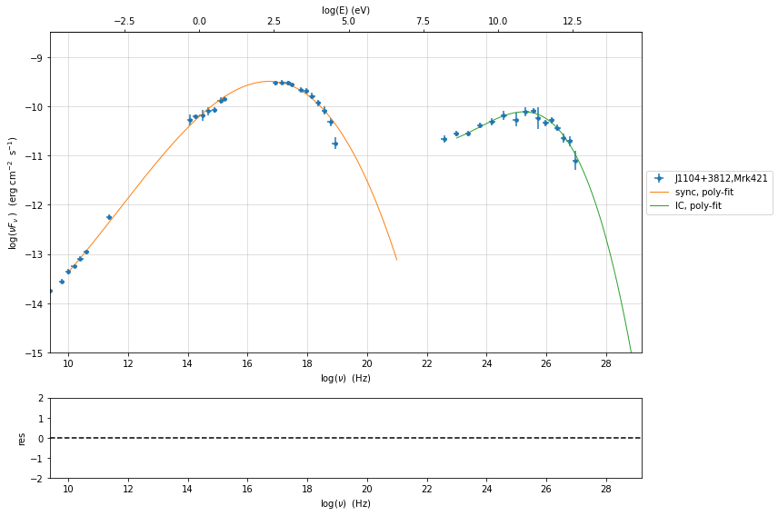

Model constraining
~~~~~~~~~~~~~~~~~~

In this step we are not fitting the model, we are just obtaining the
phenomenological ``pre_fit`` model, that will be fitted in using minuit
ore least-square bound, as shown below

.. code:: ipython3

    from jetset.obs_constrain import ObsConstrain
    from jetset.model_manager import  FitModel
    sed_obspar=ObsConstrain(beaming=25,
                            B_range=[0.001,0.1],
                            distr_e='lppl',
                            t_var_sec=3*86400,
                            nu_cut_IR=1E12,
                            SEDShape=my_shape)
    
    
    prefit_jet=sed_obspar.constrain_SSC_model(electron_distribution_log_values=False,silent=True)
    prefit_jet.save_model('prefit_jet.pkl')

.. parsed-literal::

    ================================================================================
    
    ***  constrains parameters from observable ***
    

.. raw:: html

    <i>Table length=11</i>
    <table id="table140448499879744-586650" class="table-striped table-bordered table-condensed">
    <thead><tr><th>model name</th><th>name</th><th>par type</th><th>units</th><th>val</th><th>phys. bound. min</th><th>phys. bound. max</th><th>log</th><th>frozen</th></tr></thead>
    <tr><td>jet_leptonic</td><td>R</td><td>region_size</td><td>cm</td><td>3.112712e+16</td><td>1.000000e+03</td><td>1.000000e+30</td><td>False</td><td>False</td></tr>
    <tr><td>jet_leptonic</td><td>R_H</td><td>region_position</td><td>cm</td><td>1.000000e+17</td><td>0.000000e+00</td><td>--</td><td>False</td><td>True</td></tr>
    <tr><td>jet_leptonic</td><td>B</td><td>magnetic_field</td><td>gauss</td><td>5.050000e-02</td><td>0.000000e+00</td><td>--</td><td>False</td><td>False</td></tr>
    <tr><td>jet_leptonic</td><td>beam_obj</td><td>beaming</td><td>lorentz-factor*</td><td>2.500000e+01</td><td>1.000000e-04</td><td>--</td><td>False</td><td>False</td></tr>
    <tr><td>jet_leptonic</td><td>z_cosm</td><td>redshift</td><td></td><td>3.080000e-02</td><td>0.000000e+00</td><td>--</td><td>False</td><td>False</td></tr>
    <tr><td>jet_leptonic</td><td>gmin</td><td>low-energy-cut-off</td><td>lorentz-factor*</td><td>4.697542e+02</td><td>1.000000e+00</td><td>1.000000e+09</td><td>False</td><td>False</td></tr>
    <tr><td>jet_leptonic</td><td>gmax</td><td>high-energy-cut-off</td><td>lorentz-factor*</td><td>1.373160e+06</td><td>1.000000e+00</td><td>1.000000e+15</td><td>False</td><td>False</td></tr>
    <tr><td>jet_leptonic</td><td>N</td><td>emitters_density</td><td>1 / cm3</td><td>9.060843e-01</td><td>0.000000e+00</td><td>--</td><td>False</td><td>False</td></tr>
    <tr><td>jet_leptonic</td><td>gamma0_log_parab</td><td>turn-over-energy</td><td>lorentz-factor*</td><td>3.188500e+04</td><td>1.000000e+00</td><td>1.000000e+09</td><td>False</td><td>False</td></tr>
    <tr><td>jet_leptonic</td><td>s</td><td>LE_spectral_slope</td><td></td><td>2.181578e+00</td><td>-1.000000e+01</td><td>1.000000e+01</td><td>False</td><td>False</td></tr>
    <tr><td>jet_leptonic</td><td>r</td><td>spectral_curvature</td><td></td><td>7.726502e-01</td><td>-1.500000e+01</td><td>1.500000e+01</td><td>False</td><td>False</td></tr>
    </table>
    

.. parsed-literal::

    
    ================================================================================
    

.. code:: ipython3

    pl=prefit_jet.plot_model(sed_data=sed_data)
    pl.add_residual_plot(prefit_jet,sed_data)
    pl.rescale(y_min=-15,x_min=7,x_max=29)

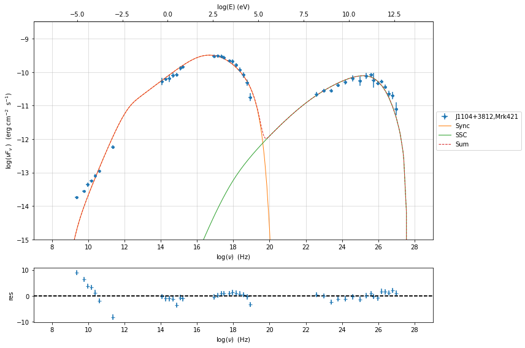

Model fitting procedure
-----------------------

We remind that we can use different ``minimizers`` for the model fitting. In the following we will use the ``minuit`` minimizer and the ``lsb`` (least square bound scipy minimizer). Using ``minuit`` we notice that sometimes the fit will converge, but the quality  will not be enough (``valid==false``) to run ``minos``. Anyhow, as shown in the :ref:`MCMC sampling`, it still possible to estimate asymmetric errors by means of MCMC sampling

We freeze some parameters, and we also set some `fit_range` values. Setting fit_range can speed-up the fit convergence but should be judged by the user each time according to the physics of the particular source.

When using ``minuit`` the best strategy is to set the `fit_range` for most of the free parameters

A good strategy is to run first a `lsb` fit and then, using the same `fit_model`, run a fit with `minuit`

Model fitting with LSB
~~~~~~~~~~~~~~~~~~~~~~

see the :ref:`composite_models` user guide for further information about the new implementation of `FitModel`, in particular for parameter setting

.. code:: ipython3

    from jetset.minimizer import fit_SED,ModelMinimizer
    
    from jetset.model_manager import  FitModel
    from jetset.jet_model import Jet

if you want to fit the ``prefit_model`` you can load the saved one (this
allows you to save time) ad pass it to the ``FitModel`` class

.. code:: ipython3

    prefit_jet=Jet.load_model('prefit_jet.pkl')
    fit_model_lsb=FitModel( jet=prefit_jet, name='SSC-best-fit-lsb',template=None) 

.. raw:: html

    <i>Table length=11</i>
    <table id="table140448573284112-897359" class="table-striped table-bordered table-condensed">
    <thead><tr><th>model name</th><th>name</th><th>par type</th><th>units</th><th>val</th><th>phys. bound. min</th><th>phys. bound. max</th><th>log</th><th>frozen</th></tr></thead>
    <tr><td>jet_leptonic</td><td>gmin</td><td>low-energy-cut-off</td><td>lorentz-factor*</td><td>4.697542e+02</td><td>1.000000e+00</td><td>1.000000e+09</td><td>False</td><td>False</td></tr>
    <tr><td>jet_leptonic</td><td>gmax</td><td>high-energy-cut-off</td><td>lorentz-factor*</td><td>1.373160e+06</td><td>1.000000e+00</td><td>1.000000e+15</td><td>False</td><td>False</td></tr>
    <tr><td>jet_leptonic</td><td>N</td><td>emitters_density</td><td>1 / cm3</td><td>9.060843e-01</td><td>0.000000e+00</td><td>--</td><td>False</td><td>False</td></tr>
    <tr><td>jet_leptonic</td><td>gamma0_log_parab</td><td>turn-over-energy</td><td>lorentz-factor*</td><td>3.188500e+04</td><td>1.000000e+00</td><td>1.000000e+09</td><td>False</td><td>False</td></tr>
    <tr><td>jet_leptonic</td><td>s</td><td>LE_spectral_slope</td><td></td><td>2.181578e+00</td><td>-1.000000e+01</td><td>1.000000e+01</td><td>False</td><td>False</td></tr>
    <tr><td>jet_leptonic</td><td>r</td><td>spectral_curvature</td><td></td><td>7.726502e-01</td><td>-1.500000e+01</td><td>1.500000e+01</td><td>False</td><td>False</td></tr>
    <tr><td>jet_leptonic</td><td>R</td><td>region_size</td><td>cm</td><td>3.112712e+16</td><td>1.000000e+03</td><td>1.000000e+30</td><td>False</td><td>False</td></tr>
    <tr><td>jet_leptonic</td><td>R_H</td><td>region_position</td><td>cm</td><td>1.000000e+17</td><td>0.000000e+00</td><td>--</td><td>False</td><td>True</td></tr>
    <tr><td>jet_leptonic</td><td>B</td><td>magnetic_field</td><td>gauss</td><td>5.050000e-02</td><td>0.000000e+00</td><td>--</td><td>False</td><td>False</td></tr>
    <tr><td>jet_leptonic</td><td>beam_obj</td><td>beaming</td><td>lorentz-factor*</td><td>2.500000e+01</td><td>1.000000e-04</td><td>--</td><td>False</td><td>False</td></tr>
    <tr><td>jet_leptonic</td><td>z_cosm</td><td>redshift</td><td></td><td>3.080000e-02</td><td>0.000000e+00</td><td>--</td><td>False</td><td>False</td></tr>
    </table>
    

OR use the one generated above

.. code:: ipython3

    fit_model_lsb=FitModel( jet=prefit_jet, name='SSC-best-fit-lsb',template=None) 

.. code:: ipython3

    fit_model_lsb.show_model_components()

.. parsed-literal::

    
    --------------------------------------------------------------------------------
    Composite model description
    --------------------------------------------------------------------------------
    name: SSC-best-fit-lsb  
    type: composite_model  
    components models:
     -model name: jet_leptonic model type: jet
    
    --------------------------------------------------------------------------------

There is only one component, whit name ``jet_leptonic``, that refers to
the ``prefit_jet`` model component

We now set the gamma grid size to 200, ad we set ``composite_expr``,
anyhow, since we have only one component this step could be skipped

.. code:: ipython3

    fit_model_lsb.jet_leptonic.set_gamma_grid_size(200)
    fit_model_lsb.composite_expr='jet_leptonic'

Freezeing parameters and setting fit_range intervals
~~~~~~~~~~~~~~~~~~~~~~~~~~~~~~~~~~~~~~~~~~~~~~~~~~~~

.. note::
   With the new implementation of composite model  (`FitModel` class) to set parameters you have to specify the model component, this is different from versions<1.1.2,
   and this holds also for the `freeze` method and for setting  `fit_range` intervals, and for the methods relate to parameters setting in general.
   See the :ref:`composite_models` user guide for further information about the new implementation of `FitModel`, in particular for parameter setting

These methods are alternative and equivalent ways to access a model
component for setting parameters state and values

a) passing as first argument, of the method, the model component
   ``name``

b) passing as first argument, of the method, the model component
   ``object``

c) accessing the model component member of the composite model class

.. code:: ipython3

    #a
    fit_model_lsb.freeze('jet_leptonic','z_cosm')
    fit_model_lsb.freeze('jet_leptonic','R_H')
    #b
    fit_model_lsb.freeze(prefit_jet,'R')
    #c
    fit_model_lsb.jet_leptonic.parameters.R.fit_range=[10**15.5,10**17.5]
    fit_model_lsb.jet_leptonic.parameters.beam_obj.fit_range=[5., 50.]

Building the ModelMinimizer object
~~~~~~~~~~~~~~~~~~~~~~~~~~~~~~~~~~

Now we build a ``lsb`` model minimizer and run the fit method

.. note::
   starting from version 1.1.2 the `fit` method allows to repeat the fit process, setting the parameter `repeat`. This will provide a better fit convergence.
   Setting `repeat=3` the fit process will be repeated 3 times

.. code:: ipython3

    model_minimizer_lsb=ModelMinimizer('lsb')
    best_fit_lsb=model_minimizer_lsb.fit(fit_model_lsb,
                                         sed_data,
                                         1E11,
                                         1E29,
                                         fitname='SSC-best-fit-minuit',
                                         repeat=3)

.. parsed-literal::

    filtering data in fit range = [1.000000e+11,1.000000e+29]
    data length 35
    ================================================================================
    
    *** start fit process ***
    ----- 
    fit run: 0

.. parsed-literal::

    0it [00:00, ?it/s]

.. parsed-literal::

    
    - best chisq=5.24047e+01
    fit run: 1
    - old chisq=5.24047e+01

.. parsed-literal::

    0it [00:00, ?it/s]

.. parsed-literal::

    
    - best chisq=5.16902e+01
    fit run: 2
    - old chisq=5.16902e+01

.. parsed-literal::

    0it [00:00, ?it/s]

.. parsed-literal::

    
    - best chisq=5.04336e+01
    -------------------------------------------------------------------------
    Fit report
    
    Model: SSC-best-fit-minuit

.. raw:: html

    <i>Table length=11</i>
    <table id="table140448070328128-68357" class="table-striped table-bordered table-condensed">
    <thead><tr><th>model name</th><th>name</th><th>par type</th><th>units</th><th>val</th><th>phys. bound. min</th><th>phys. bound. max</th><th>log</th><th>frozen</th></tr></thead>
    <tr><td>jet_leptonic</td><td>gmin</td><td>low-energy-cut-off</td><td>lorentz-factor*</td><td>4.877517e+02</td><td>1.000000e+00</td><td>1.000000e+09</td><td>False</td><td>False</td></tr>
    <tr><td>jet_leptonic</td><td>gmax</td><td>high-energy-cut-off</td><td>lorentz-factor*</td><td>9.155123e+05</td><td>1.000000e+00</td><td>1.000000e+15</td><td>False</td><td>False</td></tr>
    <tr><td>jet_leptonic</td><td>N</td><td>emitters_density</td><td>1 / cm3</td><td>9.123778e-01</td><td>0.000000e+00</td><td>--</td><td>False</td><td>False</td></tr>
    <tr><td>jet_leptonic</td><td>gamma0_log_parab</td><td>turn-over-energy</td><td>lorentz-factor*</td><td>4.519487e+04</td><td>1.000000e+00</td><td>1.000000e+09</td><td>False</td><td>False</td></tr>
    <tr><td>jet_leptonic</td><td>s</td><td>LE_spectral_slope</td><td></td><td>2.194458e+00</td><td>-1.000000e+01</td><td>1.000000e+01</td><td>False</td><td>False</td></tr>
    <tr><td>jet_leptonic</td><td>r</td><td>spectral_curvature</td><td></td><td>7.725934e-01</td><td>-1.500000e+01</td><td>1.500000e+01</td><td>False</td><td>False</td></tr>
    <tr><td>jet_leptonic</td><td>R</td><td>region_size</td><td>cm</td><td>3.112712e+16</td><td>1.000000e+03</td><td>1.000000e+30</td><td>False</td><td>True</td></tr>
    <tr><td>jet_leptonic</td><td>R_H</td><td>region_position</td><td>cm</td><td>1.000000e+17</td><td>0.000000e+00</td><td>--</td><td>False</td><td>True</td></tr>
    <tr><td>jet_leptonic</td><td>B</td><td>magnetic_field</td><td>gauss</td><td>5.000450e-02</td><td>0.000000e+00</td><td>--</td><td>False</td><td>False</td></tr>
    <tr><td>jet_leptonic</td><td>beam_obj</td><td>beaming</td><td>lorentz-factor*</td><td>2.335973e+01</td><td>1.000000e-04</td><td>--</td><td>False</td><td>False</td></tr>
    <tr><td>jet_leptonic</td><td>z_cosm</td><td>redshift</td><td></td><td>3.080000e-02</td><td>0.000000e+00</td><td>--</td><td>False</td><td>True</td></tr>
    </table>
    

.. parsed-literal::

    
    converged=True
    calls=64
    mesg=

.. parsed-literal::

    'The relative error between two consecutive iterates is at most 0.000000'

.. parsed-literal::

    dof=27
    chisq=50.433624, chisq/red=1.867912 null hypothesis sig=0.004054
    
    best fit pars

.. raw:: html

    <i>Table length=11</i>
    <table id="table140448070327168-51922" class="table-striped table-bordered table-condensed">
    <thead><tr><th>model name</th><th>name</th><th>val</th><th>bestfit val</th><th>err +</th><th>err -</th><th>start val</th><th>fit range min</th><th>fit range max</th><th>frozen</th></tr></thead>
    <tr><td>jet_leptonic</td><td>gmin</td><td>4.877517e+02</td><td>4.877517e+02</td><td>6.501616e+02</td><td>--</td><td>4.839453e+02</td><td>1.000000e+00</td><td>1.000000e+09</td><td>False</td></tr>
    <tr><td>jet_leptonic</td><td>gmax</td><td>9.155123e+05</td><td>9.155123e+05</td><td>1.115877e+05</td><td>--</td><td>9.168777e+05</td><td>1.000000e+00</td><td>1.000000e+15</td><td>False</td></tr>
    <tr><td>jet_leptonic</td><td>N</td><td>9.123778e-01</td><td>9.123778e-01</td><td>1.306186e+00</td><td>--</td><td>9.106489e-01</td><td>0.000000e+00</td><td>--</td><td>False</td></tr>
    <tr><td>jet_leptonic</td><td>gamma0_log_parab</td><td>4.519487e+04</td><td>4.519487e+04</td><td>1.363282e+04</td><td>--</td><td>4.515437e+04</td><td>1.000000e+00</td><td>1.000000e+09</td><td>False</td></tr>
    <tr><td>jet_leptonic</td><td>s</td><td>2.194458e+00</td><td>2.194458e+00</td><td>1.091468e-01</td><td>--</td><td>2.195953e+00</td><td>-1.000000e+01</td><td>1.000000e+01</td><td>False</td></tr>
    <tr><td>jet_leptonic</td><td>r</td><td>7.725934e-01</td><td>7.725934e-01</td><td>8.790054e-02</td><td>--</td><td>7.718981e-01</td><td>-1.500000e+01</td><td>1.500000e+01</td><td>False</td></tr>
    <tr><td>jet_leptonic</td><td>R</td><td>3.112712e+16</td><td>--</td><td>--</td><td>--</td><td>3.112712e+16</td><td>3.162278e+15</td><td>3.162278e+17</td><td>True</td></tr>
    <tr><td>jet_leptonic</td><td>R_H</td><td>1.000000e+17</td><td>--</td><td>--</td><td>--</td><td>1.000000e+17</td><td>0.000000e+00</td><td>--</td><td>True</td></tr>
    <tr><td>jet_leptonic</td><td>B</td><td>5.000450e-02</td><td>5.000450e-02</td><td>1.217919e-02</td><td>--</td><td>4.993353e-02</td><td>0.000000e+00</td><td>--</td><td>False</td></tr>
    <tr><td>jet_leptonic</td><td>beam_obj</td><td>2.335973e+01</td><td>2.335973e+01</td><td>3.222586e+00</td><td>--</td><td>2.352651e+01</td><td>5.000000e+00</td><td>5.000000e+01</td><td>False</td></tr>
    <tr><td>jet_leptonic</td><td>z_cosm</td><td>3.080000e-02</td><td>--</td><td>--</td><td>--</td><td>3.080000e-02</td><td>0.000000e+00</td><td>--</td><td>True</td></tr>
    </table>
    

.. parsed-literal::

    -------------------------------------------------------------------------
    
    ================================================================================
    

we can obtain the best fit astropy table

.. code:: ipython3

    best_fit_lsb.bestfit_table

.. raw:: html

    <i>Table length=11</i>
    <table id="table140448046125456" class="table-striped table-bordered table-condensed">
    <thead><tr><th>model name</th><th>name</th><th>val</th><th>bestfit val</th><th>err +</th><th>err -</th><th>start val</th><th>fit range min</th><th>fit range max</th><th>frozen</th></tr></thead>
    <thead><tr><th>str12</th><th>str16</th><th>float64</th><th>float64</th><th>float64</th><th>float64</th><th>float64</th><th>float64</th><th>float64</th><th>bool</th></tr></thead>
    <tr><td>jet_leptonic</td><td>gmin</td><td>4.877517e+02</td><td>4.877517e+02</td><td>6.501616e+02</td><td>--</td><td>4.839453e+02</td><td>1.000000e+00</td><td>1.000000e+09</td><td>False</td></tr>
    <tr><td>jet_leptonic</td><td>gmax</td><td>9.155123e+05</td><td>9.155123e+05</td><td>1.115877e+05</td><td>--</td><td>9.168777e+05</td><td>1.000000e+00</td><td>1.000000e+15</td><td>False</td></tr>
    <tr><td>jet_leptonic</td><td>N</td><td>9.123778e-01</td><td>9.123778e-01</td><td>1.306186e+00</td><td>--</td><td>9.106489e-01</td><td>0.000000e+00</td><td>--</td><td>False</td></tr>
    <tr><td>jet_leptonic</td><td>gamma0_log_parab</td><td>4.519487e+04</td><td>4.519487e+04</td><td>1.363282e+04</td><td>--</td><td>4.515437e+04</td><td>1.000000e+00</td><td>1.000000e+09</td><td>False</td></tr>
    <tr><td>jet_leptonic</td><td>s</td><td>2.194458e+00</td><td>2.194458e+00</td><td>1.091468e-01</td><td>--</td><td>2.195953e+00</td><td>-1.000000e+01</td><td>1.000000e+01</td><td>False</td></tr>
    <tr><td>jet_leptonic</td><td>r</td><td>7.725934e-01</td><td>7.725934e-01</td><td>8.790054e-02</td><td>--</td><td>7.718981e-01</td><td>-1.500000e+01</td><td>1.500000e+01</td><td>False</td></tr>
    <tr><td>jet_leptonic</td><td>R</td><td>3.112712e+16</td><td>--</td><td>--</td><td>--</td><td>3.112712e+16</td><td>3.162278e+15</td><td>3.162278e+17</td><td>True</td></tr>
    <tr><td>jet_leptonic</td><td>R_H</td><td>1.000000e+17</td><td>--</td><td>--</td><td>--</td><td>1.000000e+17</td><td>0.000000e+00</td><td>--</td><td>True</td></tr>
    <tr><td>jet_leptonic</td><td>B</td><td>5.000450e-02</td><td>5.000450e-02</td><td>1.217919e-02</td><td>--</td><td>4.993353e-02</td><td>0.000000e+00</td><td>--</td><td>False</td></tr>
    <tr><td>jet_leptonic</td><td>beam_obj</td><td>2.335973e+01</td><td>2.335973e+01</td><td>3.222586e+00</td><td>--</td><td>2.352651e+01</td><td>5.000000e+00</td><td>5.000000e+01</td><td>False</td></tr>
    <tr><td>jet_leptonic</td><td>z_cosm</td><td>3.080000e-02</td><td>--</td><td>--</td><td>--</td><td>3.080000e-02</td><td>0.000000e+00</td><td>--</td><td>True</td></tr>
    </table>

saving fit model, model minimizer
---------------------------------

We can save all the fit products to be used later.

.. code:: ipython3

    best_fit_lsb.save_report('SSC-best-fit-lsb.txt')
    model_minimizer_lsb.save_model('model_minimizer_lsb.pkl')
    fit_model_lsb.save_model('fit_model_lsb.pkl')

.. code:: ipython3

    %matplotlib inline
    fit_model_lsb.set_nu_grid(1E6,1E30,200)
    fit_model_lsb.eval()
    p2=fit_model_lsb.plot_model(sed_data=sed_data)
    p2.rescale(y_min=-13,x_min=6,x_max=28.5)

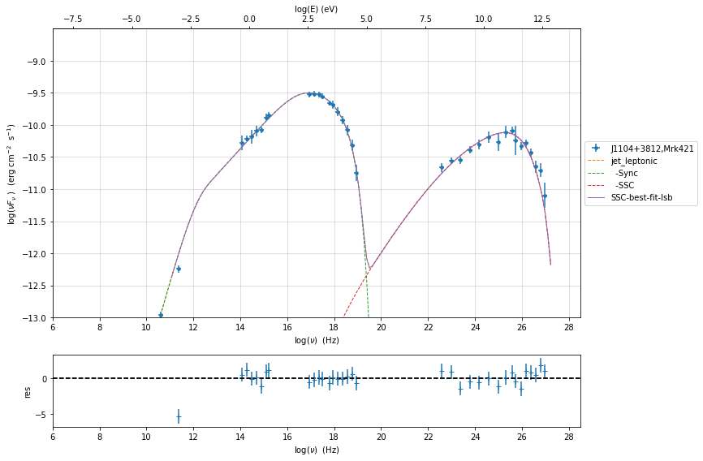

Model fitting with Minuit
-------------------------

To run the ``minuit`` minimizer we will use the best-fit results from
``lsb`` to set the boundaries for our parameters.

.. code:: ipython3

    from jetset.minimizer import fit_SED,ModelMinimizer
    from jetset.model_manager import  FitModel
    from jetset.jet_model import Jet
    
    jet_minuit=Jet.load_model('prefit_jet.pkl')
    jet_minuit.set_gamma_grid_size(200)
    #fit_model_minuit=fit_model_lsb
    fit_model_minuit=FitModel( jet=jet_minuit, name='SSC-best-fit-minuit',template=None) 

.. raw:: html

    <i>Table length=11</i>
    <table id="table140448551833408-706871" class="table-striped table-bordered table-condensed">
    <thead><tr><th>model name</th><th>name</th><th>par type</th><th>units</th><th>val</th><th>phys. bound. min</th><th>phys. bound. max</th><th>log</th><th>frozen</th></tr></thead>
    <tr><td>jet_leptonic</td><td>gmin</td><td>low-energy-cut-off</td><td>lorentz-factor*</td><td>4.697542e+02</td><td>1.000000e+00</td><td>1.000000e+09</td><td>False</td><td>False</td></tr>
    <tr><td>jet_leptonic</td><td>gmax</td><td>high-energy-cut-off</td><td>lorentz-factor*</td><td>1.373160e+06</td><td>1.000000e+00</td><td>1.000000e+15</td><td>False</td><td>False</td></tr>
    <tr><td>jet_leptonic</td><td>N</td><td>emitters_density</td><td>1 / cm3</td><td>9.060843e-01</td><td>0.000000e+00</td><td>--</td><td>False</td><td>False</td></tr>
    <tr><td>jet_leptonic</td><td>gamma0_log_parab</td><td>turn-over-energy</td><td>lorentz-factor*</td><td>3.188500e+04</td><td>1.000000e+00</td><td>1.000000e+09</td><td>False</td><td>False</td></tr>
    <tr><td>jet_leptonic</td><td>s</td><td>LE_spectral_slope</td><td></td><td>2.181578e+00</td><td>-1.000000e+01</td><td>1.000000e+01</td><td>False</td><td>False</td></tr>
    <tr><td>jet_leptonic</td><td>r</td><td>spectral_curvature</td><td></td><td>7.726502e-01</td><td>-1.500000e+01</td><td>1.500000e+01</td><td>False</td><td>False</td></tr>
    <tr><td>jet_leptonic</td><td>R</td><td>region_size</td><td>cm</td><td>3.112712e+16</td><td>1.000000e+03</td><td>1.000000e+30</td><td>False</td><td>False</td></tr>
    <tr><td>jet_leptonic</td><td>R_H</td><td>region_position</td><td>cm</td><td>1.000000e+17</td><td>0.000000e+00</td><td>--</td><td>False</td><td>True</td></tr>
    <tr><td>jet_leptonic</td><td>B</td><td>magnetic_field</td><td>gauss</td><td>5.050000e-02</td><td>0.000000e+00</td><td>--</td><td>False</td><td>False</td></tr>
    <tr><td>jet_leptonic</td><td>beam_obj</td><td>beaming</td><td>lorentz-factor*</td><td>2.500000e+01</td><td>1.000000e-04</td><td>--</td><td>False</td><td>False</td></tr>
    <tr><td>jet_leptonic</td><td>z_cosm</td><td>redshift</td><td></td><td>3.080000e-02</td><td>0.000000e+00</td><td>--</td><td>False</td><td>False</td></tr>
    </table>
    

.. code:: ipython3

    fit_model_minuit.show_model_components()

.. parsed-literal::

    
    --------------------------------------------------------------------------------
    Composite model description
    --------------------------------------------------------------------------------
    name: SSC-best-fit-minuit  
    type: composite_model  
    components models:
     -model name: jet_leptonic model type: jet
    
    --------------------------------------------------------------------------------

.. code:: ipython3

    
    fit_model_minuit.freeze('jet_leptonic','z_cosm')
    fit_model_minuit.freeze('jet_leptonic','R_H')
    fit_model_minuit.jet_leptonic.parameters.R.fit_range=[5E15,1E17]
    fit_model_minuit.jet_leptonic.parameters.gmin.fit_range=[10,1000]
    fit_model_minuit.jet_leptonic.parameters.gmax.fit_range=[5E5,1E7]
    fit_model_minuit.jet_leptonic.parameters.gamma0_log_parab.fit_range=[1E3,1E5]
    
    fit_model_minuit.jet_leptonic.parameters.beam_obj.fit_range=[5,50]

.. code:: ipython3

    model_minimizer_minuit=ModelMinimizer('minuit')
    best_fit_minuit=model_minimizer_minuit.fit(fit_model_minuit,sed_data,10**11.,10**29.0,fitname='SSC-best-fit-minuit',repeat=2)

.. parsed-literal::

    filtering data in fit range = [1.000000e+11,1.000000e+29]
    data length 35
    ================================================================================
    
    *** start fit process ***
    ----- 
    fit run: 0

.. parsed-literal::

    0it [00:00, ?it/s]

.. parsed-literal::

    
    - best chisq=4.49773e+01
    fit run: 1
    - old chisq=4.49773e+01

.. parsed-literal::

    0it [00:00, ?it/s]

.. parsed-literal::

    
    - best chisq=3.73621e+01
    -------------------------------------------------------------------------
    Fit report
    
    Model: SSC-best-fit-minuit

.. raw:: html

    <i>Table length=11</i>
    <table id="table140448115493280-863014" class="table-striped table-bordered table-condensed">
    <thead><tr><th>model name</th><th>name</th><th>par type</th><th>units</th><th>val</th><th>phys. bound. min</th><th>phys. bound. max</th><th>log</th><th>frozen</th></tr></thead>
    <tr><td>jet_leptonic</td><td>gmin</td><td>low-energy-cut-off</td><td>lorentz-factor*</td><td>4.696233e+02</td><td>1.000000e+00</td><td>1.000000e+09</td><td>False</td><td>False</td></tr>
    <tr><td>jet_leptonic</td><td>gmax</td><td>high-energy-cut-off</td><td>lorentz-factor*</td><td>9.753500e+05</td><td>1.000000e+00</td><td>1.000000e+15</td><td>False</td><td>False</td></tr>
    <tr><td>jet_leptonic</td><td>N</td><td>emitters_density</td><td>1 / cm3</td><td>8.562561e-01</td><td>0.000000e+00</td><td>--</td><td>False</td><td>False</td></tr>
    <tr><td>jet_leptonic</td><td>gamma0_log_parab</td><td>turn-over-energy</td><td>lorentz-factor*</td><td>3.243055e+04</td><td>1.000000e+00</td><td>1.000000e+09</td><td>False</td><td>False</td></tr>
    <tr><td>jet_leptonic</td><td>s</td><td>LE_spectral_slope</td><td></td><td>2.097027e+00</td><td>-1.000000e+01</td><td>1.000000e+01</td><td>False</td><td>False</td></tr>
    <tr><td>jet_leptonic</td><td>r</td><td>spectral_curvature</td><td></td><td>7.289243e-01</td><td>-1.500000e+01</td><td>1.500000e+01</td><td>False</td><td>False</td></tr>
    <tr><td>jet_leptonic</td><td>R</td><td>region_size</td><td>cm</td><td>3.042521e+16</td><td>1.000000e+03</td><td>1.000000e+30</td><td>False</td><td>False</td></tr>
    <tr><td>jet_leptonic</td><td>R_H</td><td>region_position</td><td>cm</td><td>1.000000e+17</td><td>0.000000e+00</td><td>--</td><td>False</td><td>True</td></tr>
    <tr><td>jet_leptonic</td><td>B</td><td>magnetic_field</td><td>gauss</td><td>5.156315e-02</td><td>0.000000e+00</td><td>--</td><td>False</td><td>False</td></tr>
    <tr><td>jet_leptonic</td><td>beam_obj</td><td>beaming</td><td>lorentz-factor*</td><td>2.244392e+01</td><td>1.000000e-04</td><td>--</td><td>False</td><td>False</td></tr>
    <tr><td>jet_leptonic</td><td>z_cosm</td><td>redshift</td><td></td><td>3.080000e-02</td><td>0.000000e+00</td><td>--</td><td>False</td><td>True</td></tr>
    </table>
    

.. parsed-literal::

    
    converged=True
    calls=815
    mesg=

.. raw:: html

    <table>
        <tr>
            <td colspan="2" style="text-align:left" title="Minimum value of function"> FCN = 37.36 </td>
            <td colspan="3" style="text-align:center" title="No. of calls in last algorithm and total number of calls"> Ncalls = 815 (815 total) </td>
        </tr>
        <tr>
            <td colspan="2" style="text-align:left" title="Estimated distance to minimum and goal"> EDM = 0.000262 (Goal: 0.0002) </td>
            <td colspan="3" style="text-align:center" title="Increase in FCN which corresponds to 1 standard deviation"> up = 1.0 </td>
        </tr>
        <tr>
            <td style="text-align:center;background-color:#92CCA6;color:black"> Valid Minimum </td>
            <td style="text-align:center;background-color:#92CCA6;color:black"> Valid Parameters </td>
            <td colspan="3" style="text-align:center;background-color:#FFF79A;color:black"> SOME Parameters at limit </td>
        </tr>
        <tr>
            <td colspan="2" style="text-align:center;background-color:#92CCA6;color:black"> Below EDM threshold (goal x 10) </td>
            <td colspan="3" style="text-align:center;background-color:#92CCA6;color:black"> Below call limit </td>
        </tr>
        <tr>
            <td style="text-align:center;background-color:#92CCA6;color:black"> Hesse ok </td>
            <td style="text-align:center;background-color:#92CCA6;color:black"> Has Covariance </td>
            <td style="text-align:center;background-color:#92CCA6;color:black" title="Is covariance matrix accurate?"> Accurate </td>
            <td style="text-align:center;background-color:#92CCA6;color:black" title="Is covariance matrix positive definite?"> Pos. def. </td>
            <td style="text-align:center;background-color:#92CCA6;color:black" title="Was positive definiteness enforced by Minuit?"> Not forced </td>
        </tr>
    </table><table>
        <tr>
            <td></td>
            <th title="Variable name"> Name </th>
            <th title="Value of parameter"> Value </th>
            <th title="Hesse error"> Hesse Error </th>
            <th title="Minos lower error"> Minos Error- </th>
            <th title="Minos upper error"> Minos Error+ </th>
            <th title="Lower limit of the parameter"> Limit- </th>
            <th title="Upper limit of the parameter"> Limit+ </th>
            <th title="Is the parameter fixed in the fit"> Fixed </th>
        </tr>
        <tr>
            <th> 0 </th>
            <td> par_0 </td>
            <td> 469.623333 </td>
            <td> 0.000028 </td>
            <td>  </td>
            <td>  </td>
            <td> 10 </td>
            <td> 1E+03 </td>
            <td>  </td>
        </tr>
        <tr>
            <th> 1 </th>
            <td> par_1 </td>
            <td> 975.4e3 </td>
            <td> 1.5e3 </td>
            <td>  </td>
            <td>  </td>
            <td> 5E+05 </td>
            <td> 1E+07 </td>
            <td>  </td>
        </tr>
        <tr>
            <th> 2 </th>
            <td> par_2 </td>
            <td> 856.2561e-3 </td>
            <td> 0.0005e-3 </td>
            <td>  </td>
            <td>  </td>
            <td> 0 </td>
            <td>  </td>
            <td>  </td>
        </tr>
        <tr>
            <th> 3 </th>
            <td> par_3 </td>
            <td> 32.430549e3 </td>
            <td> 0.000028e3 </td>
            <td>  </td>
            <td>  </td>
            <td> 1E+03 </td>
            <td> 1E+05 </td>
            <td>  </td>
        </tr>
        <tr>
            <th> 4 </th>
            <td> par_4 </td>
            <td> 2.0970268 </td>
            <td> 0.0000023 </td>
            <td>  </td>
            <td>  </td>
            <td> -10 </td>
            <td> 10 </td>
            <td>  </td>
        </tr>
        <tr>
            <th> 5 </th>
            <td> par_5 </td>
            <td> 728.92426e-3 </td>
            <td> 0.00019e-3 </td>
            <td>  </td>
            <td>  </td>
            <td> -15 </td>
            <td> 15 </td>
            <td>  </td>
        </tr>
        <tr>
            <th> 6 </th>
            <td> par_6 </td>
            <td> 30.425209e15 </td>
            <td> 0.000005e15 </td>
            <td>  </td>
            <td>  </td>
            <td> 5E+15 </td>
            <td> 1E+17 </td>
            <td>  </td>
        </tr>
        <tr>
            <th> 7 </th>
            <td> par_7 </td>
            <td> 51.563145e-3 </td>
            <td> 0.000026e-3 </td>
            <td>  </td>
            <td>  </td>
            <td> 0 </td>
            <td>  </td>
            <td>  </td>
        </tr>
        <tr>
            <th> 8 </th>
            <td> par_8 </td>
            <td> 22.443924 </td>
            <td> 0.000014 </td>
            <td>  </td>
            <td>  </td>
            <td> 5 </td>
            <td> 50 </td>
            <td>  </td>
        </tr>
    </table>

.. parsed-literal::

    dof=26
    chisq=37.362081, chisq/red=1.437003 null hypothesis sig=0.069318
    
    best fit pars

.. raw:: html

    <i>Table length=11</i>
    <table id="table140448084481648-636051" class="table-striped table-bordered table-condensed">
    <thead><tr><th>model name</th><th>name</th><th>val</th><th>bestfit val</th><th>err +</th><th>err -</th><th>start val</th><th>fit range min</th><th>fit range max</th><th>frozen</th></tr></thead>
    <tr><td>jet_leptonic</td><td>gmin</td><td>4.696233e+02</td><td>4.696233e+02</td><td>2.841476e-05</td><td>--</td><td>4.697542e+02</td><td>1.000000e+01</td><td>1.000000e+03</td><td>False</td></tr>
    <tr><td>jet_leptonic</td><td>gmax</td><td>9.753500e+05</td><td>9.753500e+05</td><td>1.529901e+03</td><td>--</td><td>1.373160e+06</td><td>5.000000e+05</td><td>1.000000e+07</td><td>False</td></tr>
    <tr><td>jet_leptonic</td><td>N</td><td>8.562561e-01</td><td>8.562561e-01</td><td>5.348425e-07</td><td>--</td><td>9.060843e-01</td><td>0.000000e+00</td><td>--</td><td>False</td></tr>
    <tr><td>jet_leptonic</td><td>gamma0_log_parab</td><td>3.243055e+04</td><td>3.243055e+04</td><td>2.853851e-02</td><td>--</td><td>3.188500e+04</td><td>1.000000e+03</td><td>1.000000e+05</td><td>False</td></tr>
    <tr><td>jet_leptonic</td><td>s</td><td>2.097027e+00</td><td>2.097027e+00</td><td>2.250930e-06</td><td>--</td><td>2.181578e+00</td><td>-1.000000e+01</td><td>1.000000e+01</td><td>False</td></tr>
    <tr><td>jet_leptonic</td><td>r</td><td>7.289243e-01</td><td>7.289243e-01</td><td>1.911945e-07</td><td>--</td><td>7.726502e-01</td><td>-1.500000e+01</td><td>1.500000e+01</td><td>False</td></tr>
    <tr><td>jet_leptonic</td><td>R</td><td>3.042521e+16</td><td>3.042521e+16</td><td>5.251825e+09</td><td>--</td><td>3.112712e+16</td><td>5.000000e+15</td><td>1.000000e+17</td><td>False</td></tr>
    <tr><td>jet_leptonic</td><td>R_H</td><td>1.000000e+17</td><td>--</td><td>--</td><td>--</td><td>1.000000e+17</td><td>0.000000e+00</td><td>--</td><td>True</td></tr>
    <tr><td>jet_leptonic</td><td>B</td><td>5.156315e-02</td><td>5.156315e-02</td><td>2.625211e-08</td><td>--</td><td>5.050000e-02</td><td>0.000000e+00</td><td>--</td><td>False</td></tr>
    <tr><td>jet_leptonic</td><td>beam_obj</td><td>2.244392e+01</td><td>2.244392e+01</td><td>1.401529e-05</td><td>--</td><td>2.500000e+01</td><td>5.000000e+00</td><td>5.000000e+01</td><td>False</td></tr>
    <tr><td>jet_leptonic</td><td>z_cosm</td><td>3.080000e-02</td><td>--</td><td>--</td><td>--</td><td>3.080000e-02</td><td>0.000000e+00</td><td>--</td><td>True</td></tr>
    </table>
    

.. parsed-literal::

    -------------------------------------------------------------------------
    
    ================================================================================
    

you can save results collected so far

.. code:: ipython3

    best_fit_minuit.save_report('SSC-best-fit-minuit.txt')
    model_minimizer_minuit.save_model('model_minimizer_minuit.pkl')
    fit_model_minuit.save_model('fit_model_minuit.pkl')

for further information regardin minuit please refer to
https://iminuit.readthedocs.io/en/v1.5.4/

.. code:: ipython3

    #migrad profile
    
    #access the data
    profile_migrad=model_minimizer_minuit.minimizer.mnprofile('s')
    
    #make the plot(no need to run the previous command)
    profile_plot_migrad=model_minimizer_minuit.minimizer.draw_mnprofile('s')

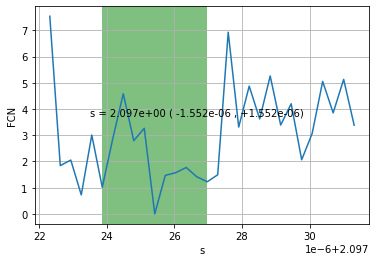

.. code:: ipython3

    #migrad contour
    #access the data
    contour_migrad=model_minimizer_minuit.minimizer.contour('beam_obj','B')
    
    #make the plot(no need to run the previous command)
    contour_plot_migrad=model_minimizer_minuit.minimizer.draw_contour('beam_obj','B')

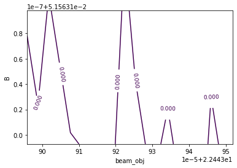

you can use also minos contour and profile, in this case the
computational time is longer:

.. highlight:: python
    
   profile_migrad=model_minimizer_minuit.minimizer.mnprofile('s')
   profile_plot_migrad=model_minimizer_minuit.minimizer.draw_mnprofile('s')
    
   contour_migrad=model_minimizer_minuit.minimizer.mncontour('r','s')
   contour_plot_migrad=model_minimizer_minuit.minimizer.draw_mncontour('r','s')

.. code:: ipython3

    %matplotlib inline
    fit_model_minuit.eval()
    p2=fit_model_minuit.plot_model(sed_data=sed_data)
    p2.rescale(y_min=-13,x_min=6,x_max=28.5)

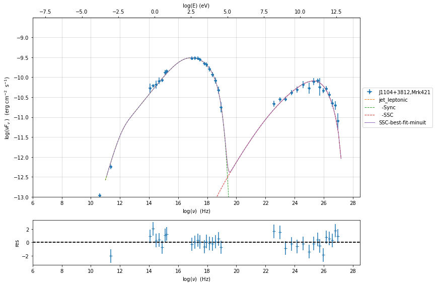

.. code:: ipython3

    %matplotlib inline
    from jetset.plot_sedfit import PlotSED
    fit_model_minuit.set_nu_grid(1E6,1E30,200)
    fit_model_lsb.set_nu_grid(1E6,1E30,500)
    fit_model_lsb.eval()
    fit_model_minuit.eval()
    p2=PlotSED()
    p2.add_data_plot(sed_data,fit_range=[ 11.,29.])
    p2.add_model_plot(fit_model_minuit,color='black')
    p2.add_residual_plot(fit_model_minuit,sed_data,fit_range=[ 11.,29.],color='black')
    p2.add_model_plot(fit_model_lsb,color='red')
    p2.add_residual_plot(fit_model_lsb,sed_data,fit_range=[ 11.,29.],color='red')
    p2.rescale(y_min=-13,x_min=6,x_max=28.5)

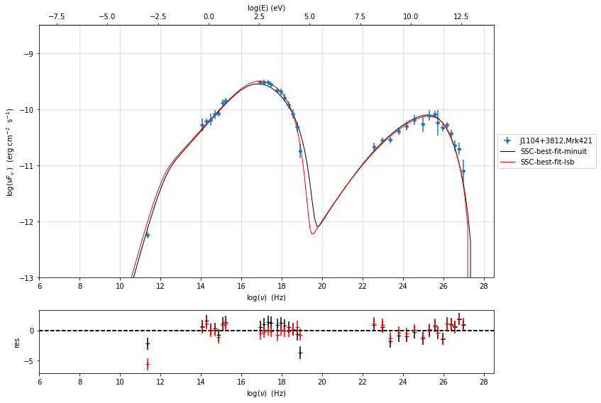

MCMC sampling
-------------

.. code:: ipython3

    from jetset.mcmc import McmcSampler
    from jetset.minimizer import ModelMinimizer

We used a flat prior centered on the best fit value. Setting
``bound=5.0`` and ``bound_rel=True`` means that:

1) the prior interval will be defined as [best_fit_val - delta_m ,
   best_fit_val + delta_p]

2) with delta_p=delta_m=best_fit_val*bound

If we set ``bound_rel=False`` then delta_p = delta_m =
best_fit_err*bound

It is possible to define asymmetric boundaries e.g. ``bound=[2.0,5.0]``
meaning that

1) for ``bound_rel=True``

   delta_p = best_fit_val*bound[1]

   delta_m =b est_fit_val*bound[0]

2) for ``bound_rel=False``

   delta_p = best_fit_err*bound[1]

   delta_m = best_fit_err*bound[0]

In the next release a more flexible prior interface will be added,
including different type of priors

Given the large parameter space, we select a sub sample of parameters
using the ``use_labels_dict``. If we do not pass the ‘use_labels_dict’
the full set of free parameters will be used

.. code:: ipython3

    from tqdm.auto import tqdm
    
    model_minimizer_minuit = ModelMinimizer.load_model('model_minimizer_minuit.pkl')
    
    mcmc=McmcSampler(model_minimizer_minuit)
    
    labels=['N','B','beam_obj','s','gamma0_log_parab']
    model_name='jet_leptonic'
    use_labels_dict={model_name:labels}
    
    mcmc.run_sampler(nwalkers=128,burnin=10,steps=50,bound=5.0,bound_rel=True,threads=None,walker_start_bound=0.005,use_labels_dict=use_labels_dict,progress='notebook')

.. parsed-literal::

    mcmc run starting
    

.. parsed-literal::

      0%|          | 0/50 [00:00<?, ?it/s]

.. parsed-literal::

    mcmc run done, with 1 threads took 438.89 seconds

.. code:: ipython3

    print(mcmc.acceptance_fraction)

.. parsed-literal::

    0.5603125

.. code:: ipython3

    p=mcmc.plot_model(sed_data=sed_data,fit_range=[11.,27.4],size=50)
    p.rescale(y_min=-13,x_min=6,x_max=28.5)

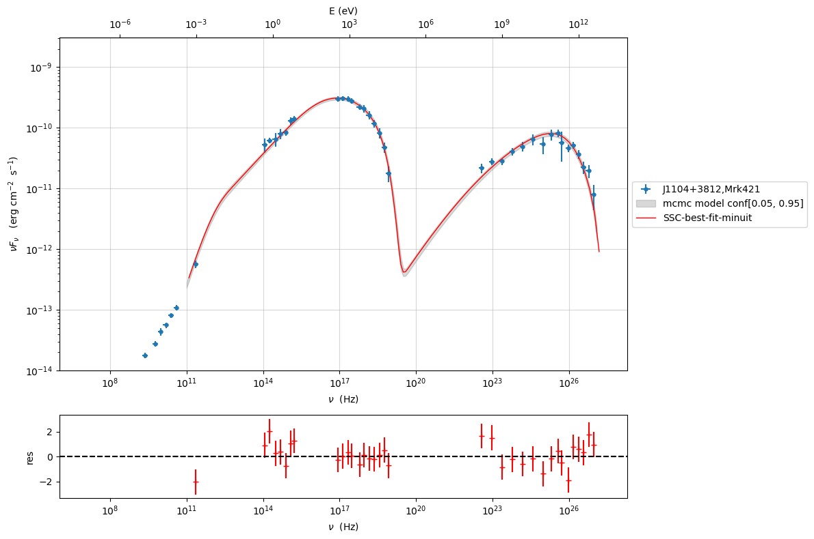

.. code:: ipython3

    f=mcmc.plot_chain('s',log_plot=False)

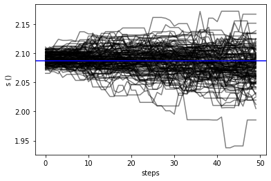

.. code:: ipython3

    f=mcmc.corner_plot()

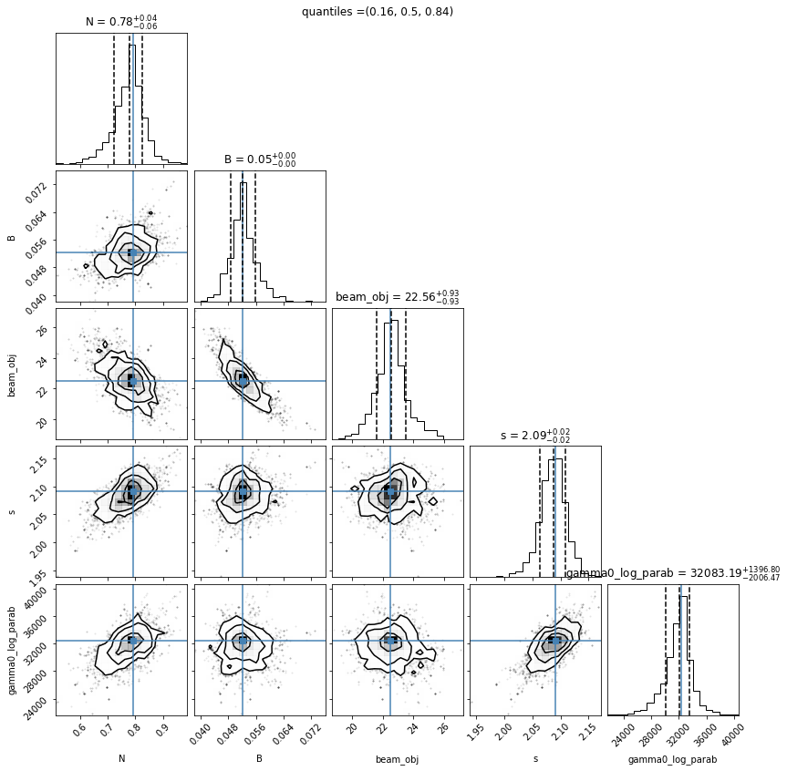

.. code:: ipython3

    mcmc.get_par('N')

.. parsed-literal::

    (array([2.03985989, 1.97347471, 1.88059101, ..., 2.17080728, 2.16236303,
            1.91671546]),
     0)

.. code:: ipython3

    f=mcmc.plot_par('beam_obj')

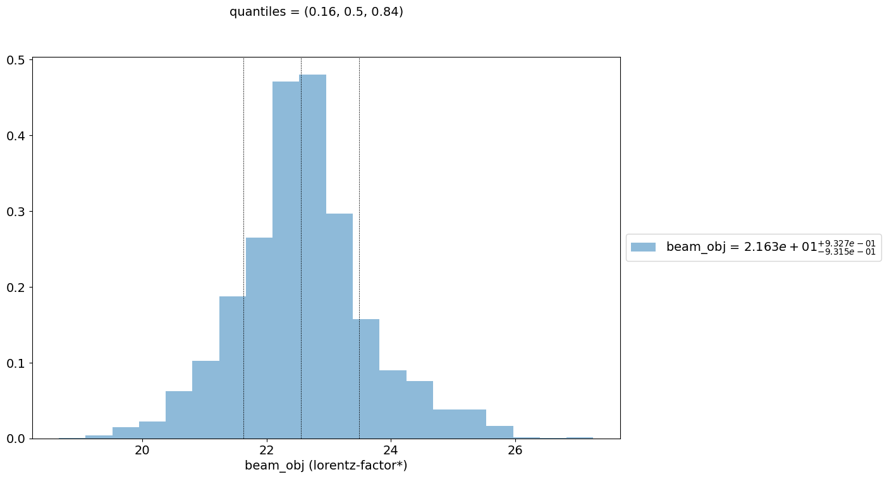

.. code:: ipython3

    f=mcmc.plot_par('gamma0_log_parab',log_plot=True)

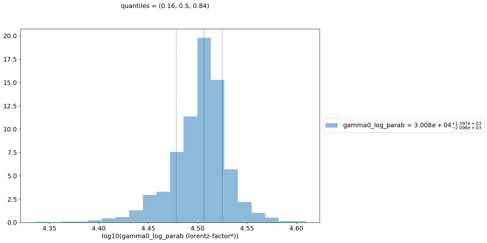

Save and reuse MCMC
-------------------

.. code:: ipython3

    mcmc.save('mcmc_sampler.pkl')

.. code:: ipython3

    from jetset.mcmc import McmcSampler
    from jetset.data_loader import ObsData
    from jetset.plot_sedfit import PlotSED
    from jetset.test_data_helper import  test_SEDs
    
    sed_data=ObsData.load('Mrk_401.pkl')
    
    ms=McmcSampler.load('mcmc_sampler.pkl')

.. code:: ipython3

    ms.model.name

.. parsed-literal::

    'SSC-best-fit-minuit'

.. code:: ipython3

    p=ms.plot_model(sed_data=sed_data,fit_range=[11., 27.4],size=50)
    p.rescale(y_min=-13,x_min=6,x_max=28.5)

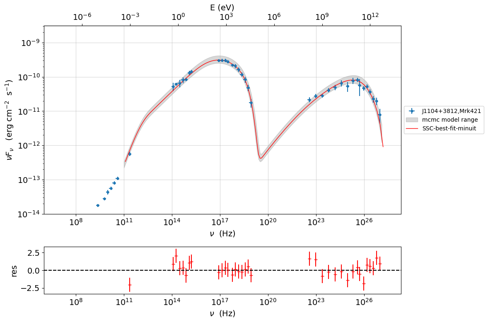

.. code:: ipython3

    f=ms.plot_par('beam_obj',log_plot=False)

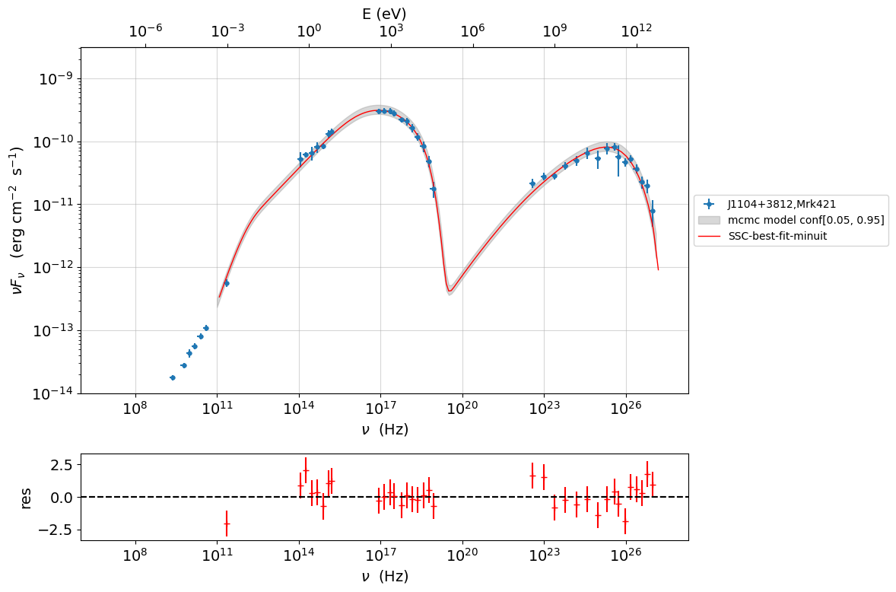

.. code:: ipython3

    f=ms.plot_par('B',log_plot=True)

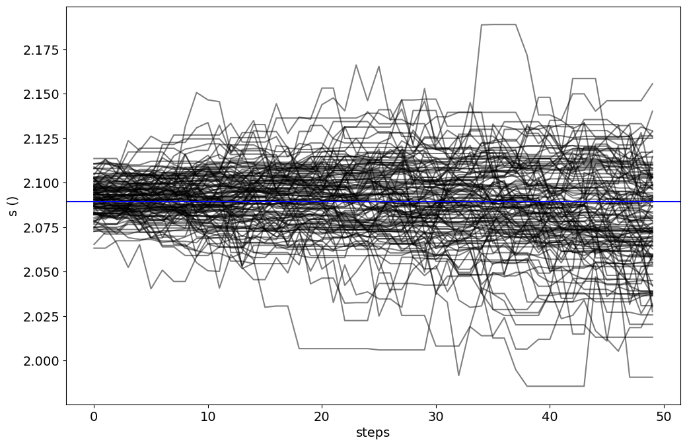

.. code:: ipython3

    f=ms.plot_chain('s',log_plot=False)

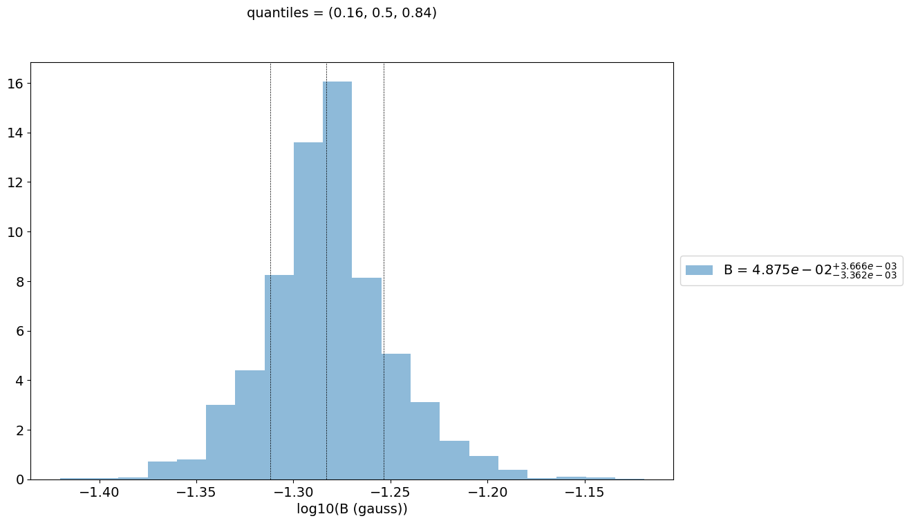

.. code:: ipython3

    f=ms.corner_plot()

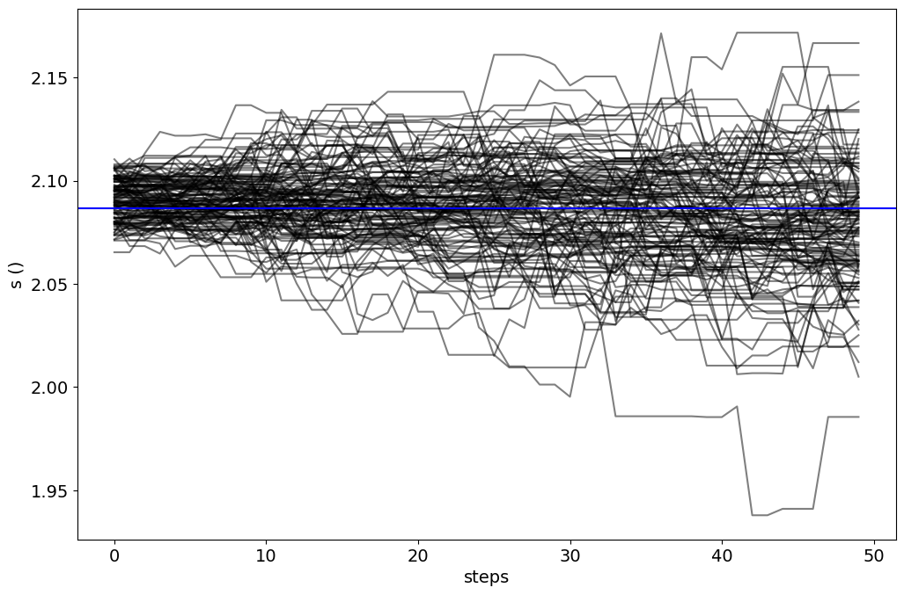

