.. _model_fitting_2:

Model fitting 2: SSC + galaxy template
======================================

.. code:: ipython3

    import warnings
    warnings.filterwarnings('ignore')
    
    import matplotlib.pylab as plt
    import jetset
    from jetset.test_data_helper import  test_SEDs
    from jetset.data_loader import ObsData,Data
    from jetset.plot_sedfit import PlotSED
    from jetset.test_data_helper import  test_SEDs

.. code:: ipython3

    test_SEDs

.. parsed-literal::

    ['/Users/orion/anaconda3/envs/jetset/lib/python3.8/site-packages/jetset/test_data/SEDs_data/SED_3C345.ecsv',
     '/Users/orion/anaconda3/envs/jetset/lib/python3.8/site-packages/jetset/test_data/SEDs_data/SED_MW_Mrk421_EBL_DEABS.ecsv',
     '/Users/orion/anaconda3/envs/jetset/lib/python3.8/site-packages/jetset/test_data/SEDs_data/SED_MW_Mrk501_EBL_ABS.ecsv',
     '/Users/orion/anaconda3/envs/jetset/lib/python3.8/site-packages/jetset/test_data/SEDs_data/SED_MW_Mrk501_EBL_DEABS.ecsv']

Loading data
------------

see the :ref:`data_format` user guide for further information about loading data 

.. code:: ipython3

    data=Data.from_file(test_SEDs[3])

.. code:: ipython3

    %matplotlib inline
    sed_data=ObsData(data_table=data)
    sed_data.group_data(bin_width=0.2)
    
    sed_data.add_systematics(0.1,[10.**6,10.**29])
    p=sed_data.plot_sed()

.. parsed-literal::

    ================================================================================
    
    ***  binning data  ***
    ---> N bins= 90
    ---> bin_widht= 0.2
    ================================================================================
    

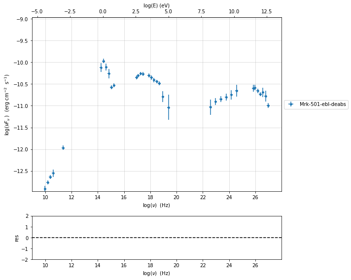

.. code:: ipython3

    sed_data.save('Mrk_501.pkl')

Phenomenological model constraining
-----------------------------------

see the :ref:`phenom_constr` user guide for further information about loading data 

Spectral indices
~~~~~~~~~~~~~~~~

.. code:: ipython3

    from jetset.sed_shaper import  SEDShape
    my_shape=SEDShape(sed_data)
    my_shape.eval_indices(silent=True)
    p=my_shape.plot_indices()
    p.rescale(y_min=-15,y_max=-6)

.. parsed-literal::

    ================================================================================
    
    *** evaluating spectral indices for data ***
    ================================================================================
    

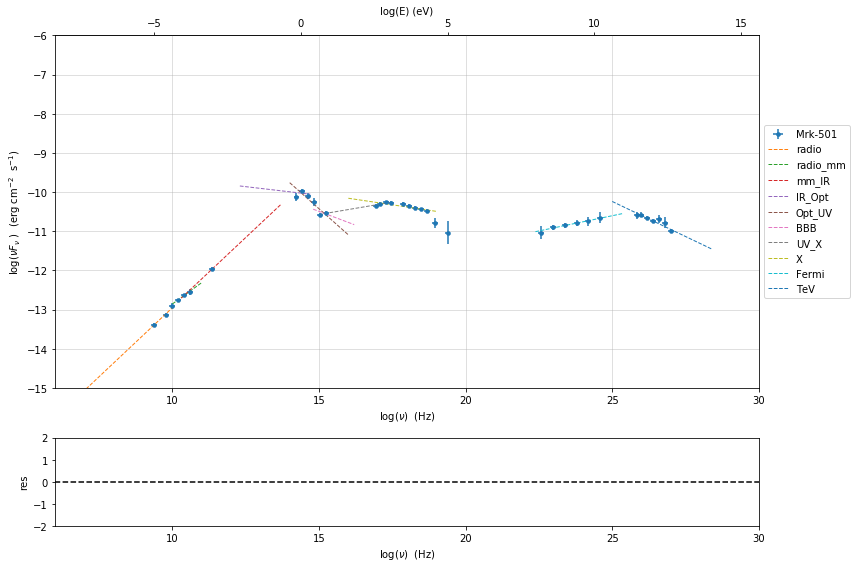

Sed shaper
~~~~~~~~~~

.. code:: ipython3

    mm,best_fit=my_shape.sync_fit(check_host_gal_template=True,
                      Ep_start=None,
                      minimizer='lsb',
                      silent=True,
                      fit_range=[10. , 21.])

.. parsed-literal::

    ================================================================================
    
    *** Log-Polynomial fitting of the synchrotron component ***
    ---> first blind fit run,  fit range: [10.0, 21.0]
    ---> class:  HSP
    
    ---> class:  HSP
    
    

.. raw:: html

    <i>Table length=6</i>
    <table id="table140346783864000-892923" class="table-striped table-bordered table-condensed">
    <thead><tr><th>model name</th><th>name</th><th>val</th><th>bestfit val</th><th>err +</th><th>err -</th><th>start val</th><th>fit range min</th><th>fit range max</th><th>frozen</th></tr></thead>
    <tr><td>LogCubic</td><td>b</td><td>-6.411144e-02</td><td>-6.411144e-02</td><td>7.838965e-03</td><td>--</td><td>-4.778764e-02</td><td>-1.000000e+01</td><td>0.000000e+00</td><td>False</td></tr>
    <tr><td>LogCubic</td><td>c</td><td>-1.751721e-03</td><td>-1.751721e-03</td><td>1.127030e-03</td><td>--</td><td>3.576201e-03</td><td>-1.000000e+01</td><td>1.000000e+01</td><td>False</td></tr>
    <tr><td>LogCubic</td><td>Ep</td><td>1.703747e+01</td><td>1.703747e+01</td><td>9.437354e-02</td><td>--</td><td>1.626870e+01</td><td>0.000000e+00</td><td>3.000000e+01</td><td>False</td></tr>
    <tr><td>LogCubic</td><td>Sp</td><td>-1.030068e+01</td><td>-1.030068e+01</td><td>1.884114e-02</td><td>--</td><td>-1.025412e+01</td><td>-3.000000e+01</td><td>0.000000e+00</td><td>False</td></tr>
    <tr><td>host_galaxy</td><td>nuFnu_p_host</td><td>-1.006557e+01</td><td>-1.006557e+01</td><td>5.462528e-02</td><td>--</td><td>-1.025412e+01</td><td>-1.225412e+01</td><td>-8.254123e+00</td><td>False</td></tr>
    <tr><td>host_galaxy</td><td>nu_scale</td><td>1.730764e-02</td><td>1.730764e-02</td><td>3.694887e-03</td><td>--</td><td>0.000000e+00</td><td>-5.000000e-01</td><td>5.000000e-01</td><td>False</td></tr>
    </table>
    

.. parsed-literal::

    ---> sync       nu_p=+1.703747e+01 (err=+9.437354e-02)  nuFnu_p=-1.030068e+01 (err=+1.884114e-02) curv.=-6.411144e-02 (err=+7.838965e-03)
    ================================================================================
    

.. code:: ipython3

    my_shape.IC_fit(fit_range=[23., 29.],minimizer='minuit',silent=True)
    p=my_shape.plot_shape_fit()
    p.rescale(y_min=-15)

.. parsed-literal::

    ================================================================================
    
    *** Log-Polynomial fitting of the IC component ***
    ---> fit range: [23.0, 29.0]
    ---> LogCubic fit
    
    

.. raw:: html

    <i>Table length=4</i>
    <table id="table140346784448416-85390" class="table-striped table-bordered table-condensed">
    <thead><tr><th>model name</th><th>name</th><th>val</th><th>bestfit val</th><th>err +</th><th>err -</th><th>start val</th><th>fit range min</th><th>fit range max</th><th>frozen</th></tr></thead>
    <tr><td>LogCubic</td><td>b</td><td>-1.310993e-01</td><td>-1.310993e-01</td><td>3.244188e-02</td><td>--</td><td>-1.000000e+00</td><td>-1.000000e+01</td><td>0.000000e+00</td><td>False</td></tr>
    <tr><td>LogCubic</td><td>c</td><td>-3.300446e-02</td><td>-3.300446e-02</td><td>2.072521e-02</td><td>--</td><td>-1.000000e+00</td><td>-1.000000e+01</td><td>1.000000e+01</td><td>False</td></tr>
    <tr><td>LogCubic</td><td>Ep</td><td>2.549603e+01</td><td>2.549603e+01</td><td>2.235473e-01</td><td>--</td><td>2.556357e+01</td><td>0.000000e+00</td><td>3.000000e+01</td><td>False</td></tr>
    <tr><td>LogCubic</td><td>Sp</td><td>-1.057945e+01</td><td>-1.057945e+01</td><td>4.332978e-02</td><td>--</td><td>-1.000000e+01</td><td>-3.000000e+01</td><td>0.000000e+00</td><td>False</td></tr>
    </table>
    

.. parsed-literal::

    ---> IC         nu_p=+2.549603e+01 (err=+2.235473e-01)  nuFnu_p=-1.057945e+01 (err=+4.332978e-02) curv.=-1.310993e-01 (err=+3.244188e-02)
    ================================================================================
    

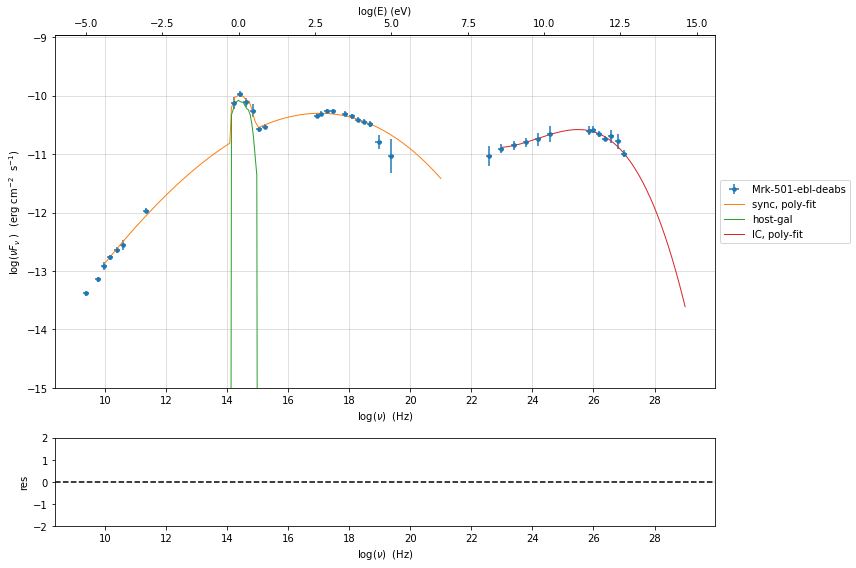

Model constraining
~~~~~~~~~~~~~~~~~~

In this step we are not fitting the model, we are just obtaining the
phenomenological ``pre_fit`` model, that will be fitted in using minuit
ore least-square bound, as shown below

.. code:: ipython3

    from jetset.obs_constrain import ObsConstrain
    from jetset.model_manager import  FitModel
    from jetset.minimizer import fit_SED
    sed_obspar=ObsConstrain(beaming=25,
                            B_range=[0.001,0.1],
                            distr_e='lppl',
                            t_var_sec=3*86400,
                            nu_cut_IR=1E11,
                            SEDShape=my_shape)
    
    
    prefit_jet=sed_obspar.constrain_SSC_model(electron_distribution_log_values=False,silent=True)
    prefit_jet.save_model('prefit_jet_gal_templ.pkl')

.. parsed-literal::

    ================================================================================
    
    ***  constrains parameters from observable ***
    

.. raw:: html

    <i>Table length=11</i>
    <table id="table140346790186288-756025" class="table-striped table-bordered table-condensed">
    <thead><tr><th>model name</th><th>name</th><th>par type</th><th>units</th><th>val</th><th>phys. bound. min</th><th>phys. bound. max</th><th>log</th><th>frozen</th></tr></thead>
    <tr><td>jet_leptonic</td><td>R</td><td>region_size</td><td>cm</td><td>1.046425e+16</td><td>1.000000e+03</td><td>1.000000e+30</td><td>False</td><td>False</td></tr>
    <tr><td>jet_leptonic</td><td>R_H</td><td>region_position</td><td>cm</td><td>1.000000e+17</td><td>0.000000e+00</td><td>--</td><td>False</td><td>True</td></tr>
    <tr><td>jet_leptonic</td><td>B</td><td>magnetic_field</td><td>gauss</td><td>5.050000e-02</td><td>0.000000e+00</td><td>--</td><td>False</td><td>False</td></tr>
    <tr><td>jet_leptonic</td><td>beam_obj</td><td>beaming</td><td>lorentz-factor*</td><td>2.500000e+01</td><td>1.000000e-04</td><td>--</td><td>False</td><td>False</td></tr>
    <tr><td>jet_leptonic</td><td>z_cosm</td><td>redshift</td><td></td><td>3.360000e-02</td><td>0.000000e+00</td><td>--</td><td>False</td><td>False</td></tr>
    <tr><td>jet_leptonic</td><td>gmin</td><td>low-energy-cut-off</td><td>lorentz-factor*</td><td>1.487509e+02</td><td>1.000000e+00</td><td>1.000000e+09</td><td>False</td><td>False</td></tr>
    <tr><td>jet_leptonic</td><td>gmax</td><td>high-energy-cut-off</td><td>lorentz-factor*</td><td>2.310708e+06</td><td>1.000000e+00</td><td>1.000000e+15</td><td>False</td><td>False</td></tr>
    <tr><td>jet_leptonic</td><td>N</td><td>emitters_density</td><td>1 / cm3</td><td>3.082278e+01</td><td>0.000000e+00</td><td>--</td><td>False</td><td>False</td></tr>
    <tr><td>jet_leptonic</td><td>gamma0_log_parab</td><td>turn-over-energy</td><td>lorentz-factor*</td><td>1.045843e+04</td><td>1.000000e+00</td><td>1.000000e+09</td><td>False</td><td>False</td></tr>
    <tr><td>jet_leptonic</td><td>s</td><td>LE_spectral_slope</td><td></td><td>2.248787e+00</td><td>-1.000000e+01</td><td>1.000000e+01</td><td>False</td><td>False</td></tr>
    <tr><td>jet_leptonic</td><td>r</td><td>spectral_curvature</td><td></td><td>3.205572e-01</td><td>-1.500000e+01</td><td>1.500000e+01</td><td>False</td><td>False</td></tr>
    </table>
    

.. parsed-literal::

    
    ================================================================================
    

.. code:: ipython3

    pl=prefit_jet.plot_model(sed_data=sed_data)
    pl.add_residual_plot(prefit_jet,sed_data)
    pl.rescale(y_min=-15,x_min=7,x_max=29)

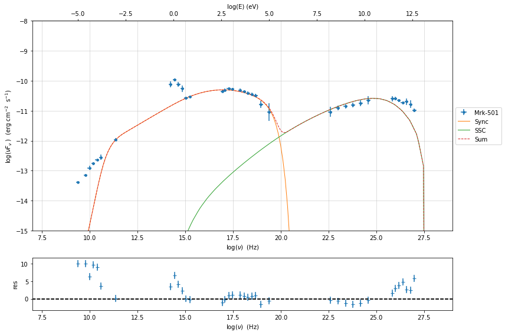

Model fitting
-------------

We remind that we can use different ``minimizers`` for the model fitting. In the following we will use the ``minuit`` minimizer and the ``lsb`` (least square bound scipy minimizer). Using ``minuit`` we notice that sometimes the fit will converge, but the quality  will not be enough (``valid==false``) to run ``minos``. Anyhow, as shown in the :ref:`MCMC sampling`, it still possible to estimate asymmetric errors by means of MCMC sampling

We freeze some parameters, and we also set some `fit_range` values. Setting fit_range can speed-up the fit convergence but should be judged by the user each time according to the physics of the particular source.

When using ``minuit`` the best strategy is to set the `fit_range` for most of the free parameters

A good strategy is to run first a `lsb` fit and then, using the same `fit_model`, run a fit with `minuit`

.. note::
   With the new implementation of composite model  (`FitModel` class) to set parameters you have to specify the model component, this is different from versions<1.1.2,
   and this holds also for the `freeze` method and for setting  `fit_range` intervals, and for the methods relate to parameters setting in general.
   See the :ref:`composite_models` user guide for further information about the new implementation of `FitModel`, in particular for parameter setting

Model fitting with LSB
~~~~~~~~~~~~~~~~~~~~~~

see the :ref:`composite_models` user guide for further information about the new implementation of `FitModel`, in particular for parameter setting

.. code:: ipython3

    from jetset.model_manager import  FitModel
    from jetset.jet_model import Jet
    
    jet_lsb=Jet.load_model('prefit_jet_gal_templ.pkl')
    jet_lsb.set_gamma_grid_size(200)

.. raw:: html

    <i>Table length=11</i>
    <table id="table140346810325552-236777" class="table-striped table-bordered table-condensed">
    <thead><tr><th>model name</th><th>name</th><th>par type</th><th>units</th><th>val</th><th>phys. bound. min</th><th>phys. bound. max</th><th>log</th><th>frozen</th></tr></thead>
    <tr><td>jet_leptonic</td><td>gmin</td><td>low-energy-cut-off</td><td>lorentz-factor*</td><td>1.487509e+02</td><td>1.000000e+00</td><td>1.000000e+09</td><td>False</td><td>False</td></tr>
    <tr><td>jet_leptonic</td><td>gmax</td><td>high-energy-cut-off</td><td>lorentz-factor*</td><td>2.310708e+06</td><td>1.000000e+00</td><td>1.000000e+15</td><td>False</td><td>False</td></tr>
    <tr><td>jet_leptonic</td><td>N</td><td>emitters_density</td><td>1 / cm3</td><td>3.082278e+01</td><td>0.000000e+00</td><td>--</td><td>False</td><td>False</td></tr>
    <tr><td>jet_leptonic</td><td>gamma0_log_parab</td><td>turn-over-energy</td><td>lorentz-factor*</td><td>1.045843e+04</td><td>1.000000e+00</td><td>1.000000e+09</td><td>False</td><td>False</td></tr>
    <tr><td>jet_leptonic</td><td>s</td><td>LE_spectral_slope</td><td></td><td>2.248787e+00</td><td>-1.000000e+01</td><td>1.000000e+01</td><td>False</td><td>False</td></tr>
    <tr><td>jet_leptonic</td><td>r</td><td>spectral_curvature</td><td></td><td>3.205572e-01</td><td>-1.500000e+01</td><td>1.500000e+01</td><td>False</td><td>False</td></tr>
    <tr><td>jet_leptonic</td><td>R</td><td>region_size</td><td>cm</td><td>1.046425e+16</td><td>1.000000e+03</td><td>1.000000e+30</td><td>False</td><td>False</td></tr>
    <tr><td>jet_leptonic</td><td>R_H</td><td>region_position</td><td>cm</td><td>1.000000e+17</td><td>0.000000e+00</td><td>--</td><td>False</td><td>True</td></tr>
    <tr><td>jet_leptonic</td><td>B</td><td>magnetic_field</td><td>gauss</td><td>5.050000e-02</td><td>0.000000e+00</td><td>--</td><td>False</td><td>False</td></tr>
    <tr><td>jet_leptonic</td><td>beam_obj</td><td>beaming</td><td>lorentz-factor*</td><td>2.500000e+01</td><td>1.000000e-04</td><td>--</td><td>False</td><td>False</td></tr>
    <tr><td>jet_leptonic</td><td>z_cosm</td><td>redshift</td><td></td><td>3.360000e-02</td><td>0.000000e+00</td><td>--</td><td>False</td><td>False</td></tr>
    </table>
    

.. code:: ipython3

    fit_model_lsb=FitModel( jet=jet_lsb, name='SSC-best-fit-lsb',template=my_shape.host_gal) 
    fit_model_lsb.show_model()

.. parsed-literal::

    
    --------------------------------------------------------------------------------
    Composite model description
    --------------------------------------------------------------------------------
    name: SSC-best-fit-lsb  
    type: composite_model  
    components models:
     -model name: jet_leptonic model type: jet
     -model name: host_galaxy model type: template
    
    --------------------------------------------------------------------------------
    individual component description
    
    --------------------------------------------------------------------------------
    jet model description
    --------------------------------------------------------------------------------
    name: jet_leptonic  
    
    electrons distribution:
     type: lppl  
     gamma energy grid size:  201
     gmin grid : 1.487509e+02
     gmax grid : 2.310708e+06
     normalization  True
     log-values  False
    
    radiative fields:
     seed photons grid size:  100
     IC emission grid size:  100
     source emissivity lower bound :  1.000000e-120
     spectral components:
       name:Sum, state: on
       name:Sync, state: self-abs
       name:SSC, state: on
    external fields transformation method: blob
    
    SED info:
     nu grid size jetkernel: 1000
     nu grid size: 500
     nu mix (Hz): 1.000000e+06
     nu max (Hz): 1.000000e+30
    
    flux plot lower bound   :  1.000000e-120
    
    --------------------------------------------------------------------------------

.. raw:: html

    <i>Table length=11</i>
    <table id="table140346809872928-413284" class="table-striped table-bordered table-condensed">
    <thead><tr><th>model name</th><th>name</th><th>par type</th><th>units</th><th>val</th><th>phys. bound. min</th><th>phys. bound. max</th><th>log</th><th>frozen</th></tr></thead>
    <tr><td>jet_leptonic</td><td>gmin</td><td>low-energy-cut-off</td><td>lorentz-factor*</td><td>1.487509e+02</td><td>1.000000e+00</td><td>1.000000e+09</td><td>False</td><td>False</td></tr>
    <tr><td>jet_leptonic</td><td>gmax</td><td>high-energy-cut-off</td><td>lorentz-factor*</td><td>2.310708e+06</td><td>1.000000e+00</td><td>1.000000e+15</td><td>False</td><td>False</td></tr>
    <tr><td>jet_leptonic</td><td>N</td><td>emitters_density</td><td>1 / cm3</td><td>3.082278e+01</td><td>0.000000e+00</td><td>--</td><td>False</td><td>False</td></tr>
    <tr><td>jet_leptonic</td><td>gamma0_log_parab</td><td>turn-over-energy</td><td>lorentz-factor*</td><td>1.045843e+04</td><td>1.000000e+00</td><td>1.000000e+09</td><td>False</td><td>False</td></tr>
    <tr><td>jet_leptonic</td><td>s</td><td>LE_spectral_slope</td><td></td><td>2.248787e+00</td><td>-1.000000e+01</td><td>1.000000e+01</td><td>False</td><td>False</td></tr>
    <tr><td>jet_leptonic</td><td>r</td><td>spectral_curvature</td><td></td><td>3.205572e-01</td><td>-1.500000e+01</td><td>1.500000e+01</td><td>False</td><td>False</td></tr>
    <tr><td>jet_leptonic</td><td>R</td><td>region_size</td><td>cm</td><td>1.046425e+16</td><td>1.000000e+03</td><td>1.000000e+30</td><td>False</td><td>False</td></tr>
    <tr><td>jet_leptonic</td><td>R_H</td><td>region_position</td><td>cm</td><td>1.000000e+17</td><td>0.000000e+00</td><td>--</td><td>False</td><td>True</td></tr>
    <tr><td>jet_leptonic</td><td>B</td><td>magnetic_field</td><td>gauss</td><td>5.050000e-02</td><td>0.000000e+00</td><td>--</td><td>False</td><td>False</td></tr>
    <tr><td>jet_leptonic</td><td>beam_obj</td><td>beaming</td><td>lorentz-factor*</td><td>2.500000e+01</td><td>1.000000e-04</td><td>--</td><td>False</td><td>False</td></tr>
    <tr><td>jet_leptonic</td><td>z_cosm</td><td>redshift</td><td></td><td>3.360000e-02</td><td>0.000000e+00</td><td>--</td><td>False</td><td>False</td></tr>
    </table>
    

.. parsed-literal::

    --------------------------------------------------------------------------------
    
    --------------------------------------------------------------------------------
    model description
    --------------------------------------------------------------------------------
    name: host_galaxy  
    type: template  
    
    --------------------------------------------------------------------------------

.. raw:: html

    <i>Table length=2</i>
    <table id="table140346810852832-592657" class="table-striped table-bordered table-condensed">
    <thead><tr><th>model name</th><th>name</th><th>par type</th><th>units</th><th>val</th><th>phys. bound. min</th><th>phys. bound. max</th><th>log</th><th>frozen</th></tr></thead>
    <tr><td>host_galaxy</td><td>nuFnu_p_host</td><td>nuFnu-scale</td><td>erg / (cm2 s)</td><td>-1.006557e+01</td><td>-2.000000e+01</td><td>2.000000e+01</td><td>False</td><td>False</td></tr>
    <tr><td>host_galaxy</td><td>nu_scale</td><td>nu-scale</td><td>Hz</td><td>1.730764e-02</td><td>-2.000000e+00</td><td>2.000000e+00</td><td>False</td><td>False</td></tr>
    </table>
    

.. parsed-literal::

    --------------------------------------------------------------------------------
    --------------------------------------------------------------------------------

.. note::
   Since the `jet_leptonic to model` has to be summed to the `host_galaxy` model, we do not need to define the functional form for the composite model, because
   the default compostion is the sum of all the components
   (see the :ref:`composite_models` user guide for further information about the new implementation of `FitModel`, in particular for parameter setting).
   Anyhow, we show here the definition of the model composition  for purpose of clarity

.. code:: ipython3

    fit_model_lsb.composite_expr='jet_leptonic + host_galaxy '

.. code:: ipython3

    fit_model_lsb.freeze('jet_leptonic','z_cosm')
    fit_model_lsb.freeze('jet_leptonic','R_H')
    fit_model_lsb.jet_leptonic.parameters.beam_obj.fit_range=[5., 50.]
    fit_model_lsb.jet_leptonic.parameters.R.fit_range=[10**15.5,10**17.5]
    fit_model_lsb.jet_leptonic.parameters.gmax.fit_range=[1E4,1E8]
    fit_model_lsb.host_galaxy.parameters.nuFnu_p_host.frozen=False
    fit_model_lsb.host_galaxy.parameters.nu_scale.frozen=True

.. code:: ipython3

    from jetset.minimizer import fit_SED,ModelMinimizer
    
    model_minimizer_lsb=ModelMinimizer('lsb')
    best_fit_lsb=model_minimizer_lsb.fit(fit_model_lsb,sed_data,10.0**11,10**29.0,fitname='SSC-best-fit-lsb',repeat=3)

.. parsed-literal::

    filtering data in fit range = [1.000000e+11,1.000000e+29]
    data length 31
    ================================================================================
    
    *** start fit process ***
    ----- 
    fit run: 0

.. parsed-literal::

    0it [00:00, ?it/s]

.. parsed-literal::

    
    - best chisq=8.40104e+00
    fit run: 1
    - old chisq=8.40104e+00

.. parsed-literal::

    0it [00:00, ?it/s]

.. parsed-literal::

    
    - best chisq=8.31095e+00
    fit run: 2
    - old chisq=8.31095e+00

.. parsed-literal::

    0it [00:00, ?it/s]

.. parsed-literal::

    
    - best chisq=8.31095e+00
    -------------------------------------------------------------------------
    Fit report
    
    Model: SSC-best-fit-lsb

.. raw:: html

    <i>Table length=13</i>
    <table id="table140346809872928-144046" class="table-striped table-bordered table-condensed">
    <thead><tr><th>model name</th><th>name</th><th>par type</th><th>units</th><th>val</th><th>phys. bound. min</th><th>phys. bound. max</th><th>log</th><th>frozen</th></tr></thead>
    <tr><td>jet_leptonic</td><td>gmin</td><td>low-energy-cut-off</td><td>lorentz-factor*</td><td>9.296480e+01</td><td>1.000000e+00</td><td>1.000000e+09</td><td>False</td><td>False</td></tr>
    <tr><td>jet_leptonic</td><td>gmax</td><td>high-energy-cut-off</td><td>lorentz-factor*</td><td>2.076505e+06</td><td>1.000000e+00</td><td>1.000000e+15</td><td>False</td><td>False</td></tr>
    <tr><td>jet_leptonic</td><td>N</td><td>emitters_density</td><td>1 / cm3</td><td>2.785727e+01</td><td>0.000000e+00</td><td>--</td><td>False</td><td>False</td></tr>
    <tr><td>jet_leptonic</td><td>gamma0_log_parab</td><td>turn-over-energy</td><td>lorentz-factor*</td><td>5.741810e+03</td><td>1.000000e+00</td><td>1.000000e+09</td><td>False</td><td>False</td></tr>
    <tr><td>jet_leptonic</td><td>s</td><td>LE_spectral_slope</td><td></td><td>2.178384e+00</td><td>-1.000000e+01</td><td>1.000000e+01</td><td>False</td><td>False</td></tr>
    <tr><td>jet_leptonic</td><td>r</td><td>spectral_curvature</td><td></td><td>2.281633e-01</td><td>-1.500000e+01</td><td>1.500000e+01</td><td>False</td><td>False</td></tr>
    <tr><td>jet_leptonic</td><td>R</td><td>region_size</td><td>cm</td><td>1.354274e+16</td><td>1.000000e+03</td><td>1.000000e+30</td><td>False</td><td>False</td></tr>
    <tr><td>jet_leptonic</td><td>R_H</td><td>region_position</td><td>cm</td><td>1.000000e+17</td><td>0.000000e+00</td><td>--</td><td>False</td><td>True</td></tr>
    <tr><td>jet_leptonic</td><td>B</td><td>magnetic_field</td><td>gauss</td><td>1.250348e-02</td><td>0.000000e+00</td><td>--</td><td>False</td><td>False</td></tr>
    <tr><td>jet_leptonic</td><td>beam_obj</td><td>beaming</td><td>lorentz-factor*</td><td>4.364376e+01</td><td>1.000000e-04</td><td>--</td><td>False</td><td>False</td></tr>
    <tr><td>jet_leptonic</td><td>z_cosm</td><td>redshift</td><td></td><td>3.360000e-02</td><td>0.000000e+00</td><td>--</td><td>False</td><td>True</td></tr>
    <tr><td>host_galaxy</td><td>nuFnu_p_host</td><td>nuFnu-scale</td><td>erg / (cm2 s)</td><td>-1.005782e+01</td><td>-2.000000e+01</td><td>2.000000e+01</td><td>False</td><td>False</td></tr>
    <tr><td>host_galaxy</td><td>nu_scale</td><td>nu-scale</td><td>Hz</td><td>1.730764e-02</td><td>-2.000000e+00</td><td>2.000000e+00</td><td>False</td><td>True</td></tr>
    </table>
    

.. parsed-literal::

    
    converged=True
    calls=22
    mesg=

.. parsed-literal::

    'The relative error between two consecutive iterates is at most 0.000000'

.. parsed-literal::

    dof=21
    chisq=8.310950, chisq/red=0.395760 null hypothesis sig=0.993679
    
    best fit pars

.. raw:: html

    <i>Table length=13</i>
    <table id="table140346810815056-68852" class="table-striped table-bordered table-condensed">
    <thead><tr><th>model name</th><th>name</th><th>val</th><th>bestfit val</th><th>err +</th><th>err -</th><th>start val</th><th>fit range min</th><th>fit range max</th><th>frozen</th></tr></thead>
    <tr><td>jet_leptonic</td><td>gmin</td><td>9.296480e+01</td><td>9.296480e+01</td><td>1.556202e+02</td><td>--</td><td>1.487509e+02</td><td>1.000000e+00</td><td>1.000000e+09</td><td>False</td></tr>
    <tr><td>jet_leptonic</td><td>gmax</td><td>2.076505e+06</td><td>2.076505e+06</td><td>1.226398e+06</td><td>--</td><td>2.310708e+06</td><td>1.000000e+04</td><td>1.000000e+08</td><td>False</td></tr>
    <tr><td>jet_leptonic</td><td>N</td><td>2.785727e+01</td><td>2.785727e+01</td><td>8.168846e+01</td><td>--</td><td>3.082278e+01</td><td>0.000000e+00</td><td>--</td><td>False</td></tr>
    <tr><td>jet_leptonic</td><td>gamma0_log_parab</td><td>5.741810e+03</td><td>5.741810e+03</td><td>9.834144e+03</td><td>--</td><td>1.045843e+04</td><td>1.000000e+00</td><td>1.000000e+09</td><td>False</td></tr>
    <tr><td>jet_leptonic</td><td>s</td><td>2.178384e+00</td><td>2.178384e+00</td><td>1.873598e-01</td><td>--</td><td>2.248787e+00</td><td>-1.000000e+01</td><td>1.000000e+01</td><td>False</td></tr>
    <tr><td>jet_leptonic</td><td>r</td><td>2.281633e-01</td><td>2.281633e-01</td><td>4.564839e-02</td><td>--</td><td>3.205572e-01</td><td>-1.500000e+01</td><td>1.500000e+01</td><td>False</td></tr>
    <tr><td>jet_leptonic</td><td>R</td><td>1.354274e+16</td><td>1.354274e+16</td><td>2.281064e+16</td><td>--</td><td>1.046425e+16</td><td>3.162278e+15</td><td>3.162278e+17</td><td>False</td></tr>
    <tr><td>jet_leptonic</td><td>R_H</td><td>1.000000e+17</td><td>--</td><td>--</td><td>--</td><td>1.000000e+17</td><td>0.000000e+00</td><td>--</td><td>True</td></tr>
    <tr><td>jet_leptonic</td><td>B</td><td>1.250348e-02</td><td>1.250348e-02</td><td>7.877401e-03</td><td>--</td><td>5.050000e-02</td><td>0.000000e+00</td><td>--</td><td>False</td></tr>
    <tr><td>jet_leptonic</td><td>beam_obj</td><td>4.364376e+01</td><td>4.364376e+01</td><td>2.642363e+01</td><td>--</td><td>2.500000e+01</td><td>5.000000e+00</td><td>5.000000e+01</td><td>False</td></tr>
    <tr><td>jet_leptonic</td><td>z_cosm</td><td>3.360000e-02</td><td>--</td><td>--</td><td>--</td><td>3.360000e-02</td><td>0.000000e+00</td><td>--</td><td>True</td></tr>
    <tr><td>host_galaxy</td><td>nuFnu_p_host</td><td>-1.005782e+01</td><td>-1.005782e+01</td><td>3.300740e-02</td><td>--</td><td>-1.006557e+01</td><td>-1.225412e+01</td><td>-8.254123e+00</td><td>False</td></tr>
    <tr><td>host_galaxy</td><td>nu_scale</td><td>1.730764e-02</td><td>--</td><td>--</td><td>--</td><td>1.730764e-02</td><td>-5.000000e-01</td><td>5.000000e-01</td><td>True</td></tr>
    </table>
    

.. parsed-literal::

    -------------------------------------------------------------------------
    
    ================================================================================
    

.. code:: ipython3

    best_fit_lsb.save_report('SSC-best-fit-lsb.txt')
    model_minimizer_lsb.save_model('model_minimizer_lsb.pkl')
    fit_model_lsb.save_model('fit_model_lsb.pkl')
    
    best_fit_lsb.bestfit_table

.. raw:: html

    <i>Table length=13</i>
    <table id="table140346290608496" class="table-striped table-bordered table-condensed">
    <thead><tr><th>model name</th><th>name</th><th>val</th><th>bestfit val</th><th>err +</th><th>err -</th><th>start val</th><th>fit range min</th><th>fit range max</th><th>frozen</th></tr></thead>
    <thead><tr><th>str12</th><th>str16</th><th>float64</th><th>float64</th><th>float64</th><th>float64</th><th>float64</th><th>float64</th><th>float64</th><th>bool</th></tr></thead>
    <tr><td>jet_leptonic</td><td>gmin</td><td>9.296480e+01</td><td>9.296480e+01</td><td>1.556202e+02</td><td>--</td><td>1.487509e+02</td><td>1.000000e+00</td><td>1.000000e+09</td><td>False</td></tr>
    <tr><td>jet_leptonic</td><td>gmax</td><td>2.076505e+06</td><td>2.076505e+06</td><td>1.226398e+06</td><td>--</td><td>2.310708e+06</td><td>1.000000e+04</td><td>1.000000e+08</td><td>False</td></tr>
    <tr><td>jet_leptonic</td><td>N</td><td>2.785727e+01</td><td>2.785727e+01</td><td>8.168846e+01</td><td>--</td><td>3.082278e+01</td><td>0.000000e+00</td><td>--</td><td>False</td></tr>
    <tr><td>jet_leptonic</td><td>gamma0_log_parab</td><td>5.741810e+03</td><td>5.741810e+03</td><td>9.834144e+03</td><td>--</td><td>1.045843e+04</td><td>1.000000e+00</td><td>1.000000e+09</td><td>False</td></tr>
    <tr><td>jet_leptonic</td><td>s</td><td>2.178384e+00</td><td>2.178384e+00</td><td>1.873598e-01</td><td>--</td><td>2.248787e+00</td><td>-1.000000e+01</td><td>1.000000e+01</td><td>False</td></tr>
    <tr><td>jet_leptonic</td><td>r</td><td>2.281633e-01</td><td>2.281633e-01</td><td>4.564839e-02</td><td>--</td><td>3.205572e-01</td><td>-1.500000e+01</td><td>1.500000e+01</td><td>False</td></tr>
    <tr><td>jet_leptonic</td><td>R</td><td>1.354274e+16</td><td>1.354274e+16</td><td>2.281064e+16</td><td>--</td><td>1.046425e+16</td><td>3.162278e+15</td><td>3.162278e+17</td><td>False</td></tr>
    <tr><td>jet_leptonic</td><td>R_H</td><td>1.000000e+17</td><td>--</td><td>--</td><td>--</td><td>1.000000e+17</td><td>0.000000e+00</td><td>--</td><td>True</td></tr>
    <tr><td>jet_leptonic</td><td>B</td><td>1.250348e-02</td><td>1.250348e-02</td><td>7.877401e-03</td><td>--</td><td>5.050000e-02</td><td>0.000000e+00</td><td>--</td><td>False</td></tr>
    <tr><td>jet_leptonic</td><td>beam_obj</td><td>4.364376e+01</td><td>4.364376e+01</td><td>2.642363e+01</td><td>--</td><td>2.500000e+01</td><td>5.000000e+00</td><td>5.000000e+01</td><td>False</td></tr>
    <tr><td>jet_leptonic</td><td>z_cosm</td><td>3.360000e-02</td><td>--</td><td>--</td><td>--</td><td>3.360000e-02</td><td>0.000000e+00</td><td>--</td><td>True</td></tr>
    <tr><td>host_galaxy</td><td>nuFnu_p_host</td><td>-1.006235e+01</td><td>-1.006235e+01</td><td>4.269333e-02</td><td>--</td><td>-1.006354e+01</td><td>-1.225412e+01</td><td>-8.254123e+00</td><td>False</td></tr>
    <tr><td>host_galaxy</td><td>nu_scale</td><td>1.730764e-02</td><td>--</td><td>--</td><td>--</td><td>1.730764e-02</td><td>-5.000000e-01</td><td>5.000000e-01</td><td>True</td></tr>
    </table>

.. code:: ipython3

    %matplotlib inline
    fit_model_lsb.set_nu_grid(1E6,1E30,200)
    fit_model_lsb.eval()
    p2=fit_model_lsb.plot_model(sed_data=sed_data)
    p2.rescale(y_min=-13,x_min=6,x_max=28.5)

Model fitting with Minuit
~~~~~~~~~~~~~~~~~~~~~~~~~

.. code:: ipython3

    jet_minuit=Jet.load_model('prefit_jet_gal_templ.pkl')
    jet_minuit.set_gamma_grid_size(200)

.. raw:: html

    <i>Table length=11</i>
    <table id="table140346784576080-441386" class="table-striped table-bordered table-condensed">
    <thead><tr><th>model name</th><th>name</th><th>par type</th><th>units</th><th>val</th><th>phys. bound. min</th><th>phys. bound. max</th><th>log</th><th>frozen</th></tr></thead>
    <tr><td>jet_leptonic</td><td>gmin</td><td>low-energy-cut-off</td><td>lorentz-factor*</td><td>1.487509e+02</td><td>1.000000e+00</td><td>1.000000e+09</td><td>False</td><td>False</td></tr>
    <tr><td>jet_leptonic</td><td>gmax</td><td>high-energy-cut-off</td><td>lorentz-factor*</td><td>2.310708e+06</td><td>1.000000e+00</td><td>1.000000e+15</td><td>False</td><td>False</td></tr>
    <tr><td>jet_leptonic</td><td>N</td><td>emitters_density</td><td>1 / cm3</td><td>3.082278e+01</td><td>0.000000e+00</td><td>--</td><td>False</td><td>False</td></tr>
    <tr><td>jet_leptonic</td><td>gamma0_log_parab</td><td>turn-over-energy</td><td>lorentz-factor*</td><td>1.045843e+04</td><td>1.000000e+00</td><td>1.000000e+09</td><td>False</td><td>False</td></tr>
    <tr><td>jet_leptonic</td><td>s</td><td>LE_spectral_slope</td><td></td><td>2.248787e+00</td><td>-1.000000e+01</td><td>1.000000e+01</td><td>False</td><td>False</td></tr>
    <tr><td>jet_leptonic</td><td>r</td><td>spectral_curvature</td><td></td><td>3.205572e-01</td><td>-1.500000e+01</td><td>1.500000e+01</td><td>False</td><td>False</td></tr>
    <tr><td>jet_leptonic</td><td>R</td><td>region_size</td><td>cm</td><td>1.046425e+16</td><td>1.000000e+03</td><td>1.000000e+30</td><td>False</td><td>False</td></tr>
    <tr><td>jet_leptonic</td><td>R_H</td><td>region_position</td><td>cm</td><td>1.000000e+17</td><td>0.000000e+00</td><td>--</td><td>False</td><td>True</td></tr>
    <tr><td>jet_leptonic</td><td>B</td><td>magnetic_field</td><td>gauss</td><td>5.050000e-02</td><td>0.000000e+00</td><td>--</td><td>False</td><td>False</td></tr>
    <tr><td>jet_leptonic</td><td>beam_obj</td><td>beaming</td><td>lorentz-factor*</td><td>2.500000e+01</td><td>1.000000e-04</td><td>--</td><td>False</td><td>False</td></tr>
    <tr><td>jet_leptonic</td><td>z_cosm</td><td>redshift</td><td></td><td>3.360000e-02</td><td>0.000000e+00</td><td>--</td><td>False</td><td>False</td></tr>
    </table>
    

To run the ``minuit`` minimizer we will use the best-fit results from
``lsb`` to set the boundaries for our parameters.

.. code:: ipython3

    fit_model_minuit=FitModel( jet=jet_minuit, name='SSC-best-fit-minuit',template=my_shape.host_gal) 
    fit_model_minuit.show_model_components()
    fit_model_minuit.freeze('jet_leptonic','z_cosm')
    fit_model_minuit.freeze('jet_leptonic','R_H')
    fit_model_minuit.jet_leptonic.parameters.beam_obj.fit_range=[5., 50.]
    fit_model_minuit.jet_leptonic.parameters.R.fit_range=[10**15.5,10**17.5]
    fit_model_minuit.host_galaxy.parameters.nuFnu_p_host.frozen=False
    fit_model_minuit.host_galaxy.parameters.nu_scale.frozen=True
    fit_model_minuit.jet_leptonic.parameters.gmin.fit_range=[10,1000]
    fit_model_minuit.jet_leptonic.parameters.gmax.fit_range=[5E5,1E8]
    fit_model_minuit.jet_leptonic.parameters.gamma0_log_parab.fit_range=[1E3,5E5]
    
    model_minimizer_minuit=ModelMinimizer('minuit')
    best_fit_minuit=model_minimizer_minuit.fit(fit_model_minuit,sed_data,10.0**11,10**29.0,fitname='SSC-best-fit-minuit',repeat=3)

.. parsed-literal::

    
    --------------------------------------------------------------------------------
    Composite model description
    --------------------------------------------------------------------------------
    name: SSC-best-fit-minuit  
    type: composite_model  
    components models:
     -model name: jet_leptonic model type: jet
     -model name: host_galaxy model type: template
    
    --------------------------------------------------------------------------------
    filtering data in fit range = [1.000000e+11,1.000000e+29]
    data length 31
    ================================================================================
    
    *** start fit process ***
    ----- 
    fit run: 0

.. parsed-literal::

    0it [00:00, ?it/s]

.. parsed-literal::

    
    - best chisq=8.10845e+00
    fit run: 1
    - old chisq=8.10845e+00

.. parsed-literal::

    0it [00:00, ?it/s]

.. parsed-literal::

    
    - best chisq=8.10841e+00
    fit run: 2
    - old chisq=8.10841e+00

.. parsed-literal::

    0it [00:00, ?it/s]

.. parsed-literal::

    
    - best chisq=8.10836e+00
    -------------------------------------------------------------------------
    Fit report
    
    Model: SSC-best-fit-minuit

.. raw:: html

    <i>Table length=13</i>
    <table id="table140346784576080-871276" class="table-striped table-bordered table-condensed">
    <thead><tr><th>model name</th><th>name</th><th>par type</th><th>units</th><th>val</th><th>phys. bound. min</th><th>phys. bound. max</th><th>log</th><th>frozen</th></tr></thead>
    <tr><td>jet_leptonic</td><td>gmin</td><td>low-energy-cut-off</td><td>lorentz-factor*</td><td>7.999238e+01</td><td>1.000000e+00</td><td>1.000000e+09</td><td>False</td><td>False</td></tr>
    <tr><td>jet_leptonic</td><td>gmax</td><td>high-energy-cut-off</td><td>lorentz-factor*</td><td>2.206678e+06</td><td>1.000000e+00</td><td>1.000000e+15</td><td>False</td><td>False</td></tr>
    <tr><td>jet_leptonic</td><td>N</td><td>emitters_density</td><td>1 / cm3</td><td>2.351730e+01</td><td>0.000000e+00</td><td>--</td><td>False</td><td>False</td></tr>
    <tr><td>jet_leptonic</td><td>gamma0_log_parab</td><td>turn-over-energy</td><td>lorentz-factor*</td><td>3.370578e+03</td><td>1.000000e+00</td><td>1.000000e+09</td><td>False</td><td>False</td></tr>
    <tr><td>jet_leptonic</td><td>s</td><td>LE_spectral_slope</td><td></td><td>2.122821e+00</td><td>-1.000000e+01</td><td>1.000000e+01</td><td>False</td><td>False</td></tr>
    <tr><td>jet_leptonic</td><td>r</td><td>spectral_curvature</td><td></td><td>2.093787e-01</td><td>-1.500000e+01</td><td>1.500000e+01</td><td>False</td><td>False</td></tr>
    <tr><td>jet_leptonic</td><td>R</td><td>region_size</td><td>cm</td><td>1.640643e+16</td><td>1.000000e+03</td><td>1.000000e+30</td><td>False</td><td>False</td></tr>
    <tr><td>jet_leptonic</td><td>R_H</td><td>region_position</td><td>cm</td><td>1.000000e+17</td><td>0.000000e+00</td><td>--</td><td>False</td><td>True</td></tr>
    <tr><td>jet_leptonic</td><td>B</td><td>magnetic_field</td><td>gauss</td><td>1.087639e-02</td><td>0.000000e+00</td><td>--</td><td>False</td><td>False</td></tr>
    <tr><td>jet_leptonic</td><td>beam_obj</td><td>beaming</td><td>lorentz-factor*</td><td>4.265225e+01</td><td>1.000000e-04</td><td>--</td><td>False</td><td>False</td></tr>
    <tr><td>jet_leptonic</td><td>z_cosm</td><td>redshift</td><td></td><td>3.360000e-02</td><td>0.000000e+00</td><td>--</td><td>False</td><td>True</td></tr>
    <tr><td>host_galaxy</td><td>nuFnu_p_host</td><td>nuFnu-scale</td><td>erg / (cm2 s)</td><td>-1.006235e+01</td><td>-2.000000e+01</td><td>2.000000e+01</td><td>False</td><td>False</td></tr>
    <tr><td>host_galaxy</td><td>nu_scale</td><td>nu-scale</td><td>Hz</td><td>1.730764e-02</td><td>-2.000000e+00</td><td>2.000000e+00</td><td>False</td><td>True</td></tr>
    </table>
    

.. parsed-literal::

    
    converged=True
    calls=232
    mesg=

.. raw:: html

    <table>
        <tr>
            <td colspan="2" style="text-align:left" title="Minimum value of function"> FCN = 8.108 </td>
            <td colspan="3" style="text-align:center" title="No. of calls in last algorithm and total number of calls"> Ncalls = 232 (232 total) </td>
        </tr>
        <tr>
            <td colspan="2" style="text-align:left" title="Estimated distance to minimum and goal"> EDM = 2.77e-05 (Goal: 0.0002) </td>
            <td colspan="3" style="text-align:center" title="Increase in FCN which corresponds to 1 standard deviation"> up = 1.0 </td>
        </tr>
        <tr>
            <td style="text-align:center;background-color:#92CCA6;color:black"> Valid Minimum </td>
            <td style="text-align:center;background-color:#92CCA6;color:black"> Valid Parameters </td>
            <td colspan="3" style="text-align:center;background-color:#FFF79A;color:black"> SOME Parameters at limit </td>
        </tr>
        <tr>
            <td colspan="2" style="text-align:center;background-color:#92CCA6;color:black"> Below EDM threshold (goal x 10) </td>
            <td colspan="3" style="text-align:center;background-color:#92CCA6;color:black"> Below call limit </td>
        </tr>
        <tr>
            <td style="text-align:center;background-color:#92CCA6;color:black"> Hesse ok </td>
            <td style="text-align:center;background-color:#92CCA6;color:black"> Has Covariance </td>
            <td style="text-align:center;background-color:#FFF79A;color:black" title="Is covariance matrix accurate?"> APPROXIMATE </td>
            <td style="text-align:center;background-color:#c15ef7;color:black" title="Is covariance matrix positive definite?"> NOT pos. def. </td>
            <td style="text-align:center;background-color:#c15ef7;color:black" title="Was positive definiteness enforced by Minuit?"> FORCED </td>
        </tr>
    </table><table>
        <tr>
            <td></td>
            <th title="Variable name"> Name </th>
            <th title="Value of parameter"> Value </th>
            <th title="Hesse error"> Hesse Error </th>
            <th title="Minos lower error"> Minos Error- </th>
            <th title="Minos upper error"> Minos Error+ </th>
            <th title="Lower limit of the parameter"> Limit- </th>
            <th title="Upper limit of the parameter"> Limit+ </th>
            <th title="Is the parameter fixed in the fit"> Fixed </th>
        </tr>
        <tr>
            <th> 0 </th>
            <td> par_0 </td>
            <td> 80.0 </td>
            <td> 2.6 </td>
            <td>  </td>
            <td>  </td>
            <td> 10 </td>
            <td> 1E+03 </td>
            <td>  </td>
        </tr>
        <tr>
            <th> 1 </th>
            <td> par_1 </td>
            <td> 2.2e6 </td>
            <td> 1.0e6 </td>
            <td>  </td>
            <td>  </td>
            <td> 5E+05 </td>
            <td> 1E+08 </td>
            <td>  </td>
        </tr>
        <tr>
            <th> 2 </th>
            <td> par_2 </td>
            <td> 23.5 </td>
            <td> 0.8 </td>
            <td>  </td>
            <td>  </td>
            <td> 0 </td>
            <td>  </td>
            <td>  </td>
        </tr>
        <tr>
            <th> 3 </th>
            <td> par_3 </td>
            <td> 3.37e3 </td>
            <td> 0.13e3 </td>
            <td>  </td>
            <td>  </td>
            <td> 1E+03 </td>
            <td> 5E+05 </td>
            <td>  </td>
        </tr>
        <tr>
            <th> 4 </th>
            <td> par_4 </td>
            <td> 2.123 </td>
            <td> 0.004 </td>
            <td>  </td>
            <td>  </td>
            <td> -10 </td>
            <td> 10 </td>
            <td>  </td>
        </tr>
        <tr>
            <th> 5 </th>
            <td> par_5 </td>
            <td> 0.2094 </td>
            <td> 0.0035 </td>
            <td>  </td>
            <td>  </td>
            <td> -15 </td>
            <td> 15 </td>
            <td>  </td>
        </tr>
        <tr>
            <th> 6 </th>
            <td> par_6 </td>
            <td> 16.41e15 </td>
            <td> 0.31e15 </td>
            <td>  </td>
            <td>  </td>
            <td> 3.16E+15 </td>
            <td> 3.16E+17 </td>
            <td>  </td>
        </tr>
        <tr>
            <th> 7 </th>
            <td> par_7 </td>
            <td> 0.0109 </td>
            <td> 0.0012 </td>
            <td>  </td>
            <td>  </td>
            <td> 0 </td>
            <td>  </td>
            <td>  </td>
        </tr>
        <tr>
            <th> 8 </th>
            <td> par_8 </td>
            <td> 42.7 </td>
            <td> 0.5 </td>
            <td>  </td>
            <td>  </td>
            <td> 5 </td>
            <td> 50 </td>
            <td>  </td>
        </tr>
        <tr>
            <th> 9 </th>
            <td> par_9 </td>
            <td> -10.06 </td>
            <td> 0.04 </td>
            <td>  </td>
            <td>  </td>
            <td> -12.3 </td>
            <td> -8.25 </td>
            <td>  </td>
        </tr>
    </table>

.. parsed-literal::

    dof=21
    chisq=8.108363, chisq/red=0.386113 null hypothesis sig=0.994668
    
    best fit pars

.. raw:: html

    <i>Table length=13</i>
    <table id="table140346303520976-960613" class="table-striped table-bordered table-condensed">
    <thead><tr><th>model name</th><th>name</th><th>val</th><th>bestfit val</th><th>err +</th><th>err -</th><th>start val</th><th>fit range min</th><th>fit range max</th><th>frozen</th></tr></thead>
    <tr><td>jet_leptonic</td><td>gmin</td><td>7.999238e+01</td><td>7.999238e+01</td><td>2.641099e+00</td><td>--</td><td>1.487509e+02</td><td>1.000000e+01</td><td>1.000000e+03</td><td>False</td></tr>
    <tr><td>jet_leptonic</td><td>gmax</td><td>2.206678e+06</td><td>2.206678e+06</td><td>9.946212e+05</td><td>--</td><td>2.310708e+06</td><td>5.000000e+05</td><td>1.000000e+08</td><td>False</td></tr>
    <tr><td>jet_leptonic</td><td>N</td><td>2.351730e+01</td><td>2.351730e+01</td><td>7.973007e-01</td><td>--</td><td>3.082278e+01</td><td>0.000000e+00</td><td>--</td><td>False</td></tr>
    <tr><td>jet_leptonic</td><td>gamma0_log_parab</td><td>3.370578e+03</td><td>3.370578e+03</td><td>1.303130e+02</td><td>--</td><td>1.045843e+04</td><td>1.000000e+03</td><td>5.000000e+05</td><td>False</td></tr>
    <tr><td>jet_leptonic</td><td>s</td><td>2.122821e+00</td><td>2.122821e+00</td><td>4.406770e-03</td><td>--</td><td>2.248787e+00</td><td>-1.000000e+01</td><td>1.000000e+01</td><td>False</td></tr>
    <tr><td>jet_leptonic</td><td>r</td><td>2.093787e-01</td><td>2.093787e-01</td><td>3.530476e-03</td><td>--</td><td>3.205572e-01</td><td>-1.500000e+01</td><td>1.500000e+01</td><td>False</td></tr>
    <tr><td>jet_leptonic</td><td>R</td><td>1.640643e+16</td><td>1.640643e+16</td><td>3.105900e+14</td><td>--</td><td>1.046425e+16</td><td>3.162278e+15</td><td>3.162278e+17</td><td>False</td></tr>
    <tr><td>jet_leptonic</td><td>R_H</td><td>1.000000e+17</td><td>--</td><td>--</td><td>--</td><td>1.000000e+17</td><td>0.000000e+00</td><td>--</td><td>True</td></tr>
    <tr><td>jet_leptonic</td><td>B</td><td>1.087639e-02</td><td>1.087639e-02</td><td>1.229448e-03</td><td>--</td><td>5.050000e-02</td><td>0.000000e+00</td><td>--</td><td>False</td></tr>
    <tr><td>jet_leptonic</td><td>beam_obj</td><td>4.265225e+01</td><td>4.265225e+01</td><td>4.800473e-01</td><td>--</td><td>2.500000e+01</td><td>5.000000e+00</td><td>5.000000e+01</td><td>False</td></tr>
    <tr><td>jet_leptonic</td><td>z_cosm</td><td>3.360000e-02</td><td>--</td><td>--</td><td>--</td><td>3.360000e-02</td><td>0.000000e+00</td><td>--</td><td>True</td></tr>
    <tr><td>host_galaxy</td><td>nuFnu_p_host</td><td>-1.006235e+01</td><td>-1.006235e+01</td><td>4.269333e-02</td><td>--</td><td>-1.006354e+01</td><td>-1.225412e+01</td><td>-8.254123e+00</td><td>False</td></tr>
    <tr><td>host_galaxy</td><td>nu_scale</td><td>1.730764e-02</td><td>--</td><td>--</td><td>--</td><td>1.730764e-02</td><td>-5.000000e-01</td><td>5.000000e-01</td><td>True</td></tr>
    </table>
    

.. parsed-literal::

    -------------------------------------------------------------------------
    
    ================================================================================
    

for further information regardin minuit please refer to
https://iminuit.readthedocs.io/en/v1.5.4/

.. code:: ipython3

    %matplotlib inline
    fit_model_minuit.set_nu_grid(1E6,1E30,200)
    fit_model_minuit.eval()
    p2=fit_model_minuit.plot_model(sed_data=sed_data)
    p2.rescale(y_min=-13,x_min=6,x_max=28.5)

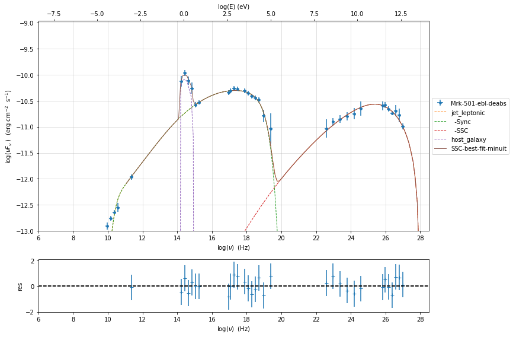

.. code:: ipython3

    best_fit_minuit.save_report('SSC-best-fit-minuit.txt')
    model_minimizer_minuit.save_model('model_minimizer_minuit.pkl')
    fit_model_minuit.save_model('fit_model_minuit.pkl')
    
    best_fit_lsb.bestfit_table

.. raw:: html

    <i>Table length=13</i>
    <table id="table140346291927456" class="table-striped table-bordered table-condensed">
    <thead><tr><th>model name</th><th>name</th><th>val</th><th>bestfit val</th><th>err +</th><th>err -</th><th>start val</th><th>fit range min</th><th>fit range max</th><th>frozen</th></tr></thead>
    <thead><tr><th>str12</th><th>str16</th><th>float64</th><th>float64</th><th>float64</th><th>float64</th><th>float64</th><th>float64</th><th>float64</th><th>bool</th></tr></thead>
    <tr><td>jet_leptonic</td><td>gmin</td><td>9.296480e+01</td><td>9.296480e+01</td><td>1.556202e+02</td><td>--</td><td>1.487509e+02</td><td>1.000000e+00</td><td>1.000000e+09</td><td>False</td></tr>
    <tr><td>jet_leptonic</td><td>gmax</td><td>2.076505e+06</td><td>2.076505e+06</td><td>1.226398e+06</td><td>--</td><td>2.310708e+06</td><td>1.000000e+04</td><td>1.000000e+08</td><td>False</td></tr>
    <tr><td>jet_leptonic</td><td>N</td><td>2.785727e+01</td><td>2.785727e+01</td><td>8.168846e+01</td><td>--</td><td>3.082278e+01</td><td>0.000000e+00</td><td>--</td><td>False</td></tr>
    <tr><td>jet_leptonic</td><td>gamma0_log_parab</td><td>5.741810e+03</td><td>5.741810e+03</td><td>9.834144e+03</td><td>--</td><td>1.045843e+04</td><td>1.000000e+00</td><td>1.000000e+09</td><td>False</td></tr>
    <tr><td>jet_leptonic</td><td>s</td><td>2.178384e+00</td><td>2.178384e+00</td><td>1.873598e-01</td><td>--</td><td>2.248787e+00</td><td>-1.000000e+01</td><td>1.000000e+01</td><td>False</td></tr>
    <tr><td>jet_leptonic</td><td>r</td><td>2.281633e-01</td><td>2.281633e-01</td><td>4.564839e-02</td><td>--</td><td>3.205572e-01</td><td>-1.500000e+01</td><td>1.500000e+01</td><td>False</td></tr>
    <tr><td>jet_leptonic</td><td>R</td><td>1.354274e+16</td><td>1.354274e+16</td><td>2.281064e+16</td><td>--</td><td>1.046425e+16</td><td>3.162278e+15</td><td>3.162278e+17</td><td>False</td></tr>
    <tr><td>jet_leptonic</td><td>R_H</td><td>1.000000e+17</td><td>--</td><td>--</td><td>--</td><td>1.000000e+17</td><td>0.000000e+00</td><td>--</td><td>True</td></tr>
    <tr><td>jet_leptonic</td><td>B</td><td>1.250348e-02</td><td>1.250348e-02</td><td>7.877401e-03</td><td>--</td><td>5.050000e-02</td><td>0.000000e+00</td><td>--</td><td>False</td></tr>
    <tr><td>jet_leptonic</td><td>beam_obj</td><td>4.364376e+01</td><td>4.364376e+01</td><td>2.642363e+01</td><td>--</td><td>2.500000e+01</td><td>5.000000e+00</td><td>5.000000e+01</td><td>False</td></tr>
    <tr><td>jet_leptonic</td><td>z_cosm</td><td>3.360000e-02</td><td>--</td><td>--</td><td>--</td><td>3.360000e-02</td><td>0.000000e+00</td><td>--</td><td>True</td></tr>
    <tr><td>host_galaxy</td><td>nuFnu_p_host</td><td>-1.006235e+01</td><td>-1.006235e+01</td><td>4.269333e-02</td><td>--</td><td>-1.006354e+01</td><td>-1.225412e+01</td><td>-8.254123e+00</td><td>False</td></tr>
    <tr><td>host_galaxy</td><td>nu_scale</td><td>1.730764e-02</td><td>--</td><td>--</td><td>--</td><td>1.730764e-02</td><td>-5.000000e-01</td><td>5.000000e-01</td><td>True</td></tr>
    </table>

.. code:: ipython3

    %matplotlib inline
    from jetset.plot_sedfit import PlotSED
    fit_model_minuit.set_nu_grid(1E6,1E30,200)
    fit_model_minuit.eval()
    fit_model_lsb.set_nu_grid(1E6,1E30,200)
    fit_model_lsb.eval()
    p2=PlotSED()
    p2.add_data_plot(sed_data,fit_range=[ 11., 29.])
    p2.add_model_plot(fit_model_minuit,color='black')
    p2.add_residual_plot(fit_model_minuit,sed_data,fit_range=[ 11., 29.],color='black')
    p2.add_model_plot(fit_model_lsb,color='red')
    p2.add_residual_plot(fit_model_lsb,sed_data,fit_range=[ 11., 29.],color='red')
    p2.rescale(y_min=-13,y_max=-9,x_min=9,x_max=29.5)

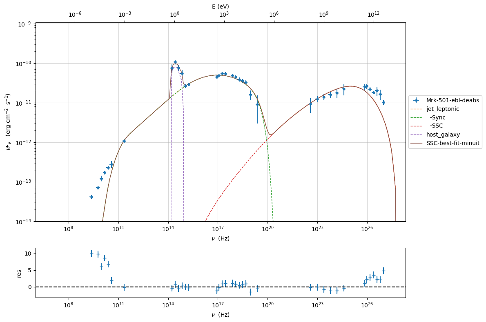

Model fitting with a bkn pl
~~~~~~~~~~~~~~~~~~~~~~~~~~~

.. code:: ipython3

    from jetset.obs_constrain import ObsConstrain
    from jetset.model_manager import  FitModel
    from jetset.minimizer import fit_SED
    sed_obspar=ObsConstrain(beaming=25,
                            B_range=[0.001,0.1],
                            distr_e='bkn',
                            t_var_sec=3*86400,
                            nu_cut_IR=1E11,
                            SEDShape=my_shape)
    
    
    prefit_jet=sed_obspar.constrain_SSC_model(electron_distribution_log_values=False,silent=True)
    prefit_jet.save_model('prefit_jet_bkn_gal_templ.pkl')

.. parsed-literal::

    ================================================================================
    
    ***  constrains parameters from observable ***
    

.. raw:: html

    <i>Table length=11</i>
    <table id="table140346335385632-671721" class="table-striped table-bordered table-condensed">
    <thead><tr><th>model name</th><th>name</th><th>par type</th><th>units</th><th>val</th><th>phys. bound. min</th><th>phys. bound. max</th><th>log</th><th>frozen</th></tr></thead>
    <tr><td>jet_leptonic</td><td>R</td><td>region_size</td><td>cm</td><td>1.092459e+16</td><td>1.000000e+03</td><td>1.000000e+30</td><td>False</td><td>False</td></tr>
    <tr><td>jet_leptonic</td><td>R_H</td><td>region_position</td><td>cm</td><td>1.000000e+17</td><td>0.000000e+00</td><td>--</td><td>False</td><td>True</td></tr>
    <tr><td>jet_leptonic</td><td>B</td><td>magnetic_field</td><td>gauss</td><td>3.008910e-02</td><td>0.000000e+00</td><td>--</td><td>False</td><td>False</td></tr>
    <tr><td>jet_leptonic</td><td>beam_obj</td><td>beaming</td><td>lorentz-factor*</td><td>2.500000e+01</td><td>1.000000e-04</td><td>--</td><td>False</td><td>False</td></tr>
    <tr><td>jet_leptonic</td><td>z_cosm</td><td>redshift</td><td></td><td>3.360000e-02</td><td>0.000000e+00</td><td>--</td><td>False</td><td>False</td></tr>
    <tr><td>jet_leptonic</td><td>gmin</td><td>low-energy-cut-off</td><td>lorentz-factor*</td><td>1.927085e+02</td><td>1.000000e+00</td><td>1.000000e+09</td><td>False</td><td>False</td></tr>
    <tr><td>jet_leptonic</td><td>gmax</td><td>high-energy-cut-off</td><td>lorentz-factor*</td><td>2.993548e+06</td><td>1.000000e+00</td><td>1.000000e+15</td><td>False</td><td>False</td></tr>
    <tr><td>jet_leptonic</td><td>N</td><td>emitters_density</td><td>1 / cm3</td><td>2.003808e+01</td><td>0.000000e+00</td><td>--</td><td>False</td><td>False</td></tr>
    <tr><td>jet_leptonic</td><td>gamma_break</td><td>turn-over-energy</td><td>lorentz-factor*</td><td>2.012047e+05</td><td>1.000000e+00</td><td>1.000000e+09</td><td>False</td><td>False</td></tr>
    <tr><td>jet_leptonic</td><td>p</td><td>LE_spectral_slope</td><td></td><td>2.248787e+00</td><td>-1.000000e+01</td><td>1.000000e+01</td><td>False</td><td>False</td></tr>
    <tr><td>jet_leptonic</td><td>p_1</td><td>HE_spectral_slope</td><td></td><td>3.500000e+00</td><td>-1.000000e+01</td><td>1.000000e+01</td><td>False</td><td>False</td></tr>
    </table>
    

.. parsed-literal::

    
    ================================================================================
    

.. code:: ipython3

    pl=prefit_jet.plot_model(sed_data=sed_data)
    pl.add_residual_plot(prefit_jet,sed_data)
    pl.rescale(y_min=-15,x_min=7,x_max=29)

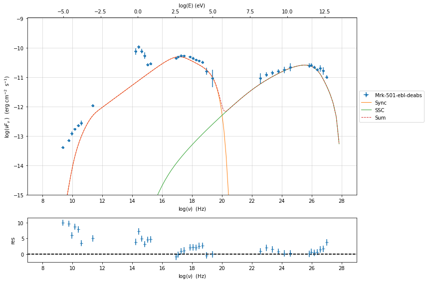

.. code:: ipython3

    jet_minuit_bkn=Jet.load_model('prefit_jet_bkn_gal_templ.pkl')
    jet_minuit_bkn.set_gamma_grid_size(200)
    
    fit_model_lsb_bkn=FitModel( jet=jet_minuit_bkn, name='SSC-best-fit-bkn-lsb',template=my_shape.host_gal) 
    
    
    fit_model_lsb_bkn.freeze(jet_lsb,'z_cosm')
    fit_model_lsb_bkn.freeze(jet_lsb,'R_H')
    fit_model_lsb_bkn.jet_leptonic.parameters.beam_obj.fit_range=[5,50]
    fit_model_lsb_bkn.jet_leptonic.parameters.R.fit_range=[10**15.5,10**17.5]
    fit_model_lsb_bkn.jet_leptonic.parameters.gmax.fit_range=[1E4,1E8]
    fit_model_lsb_bkn.host_galaxy.parameters.nuFnu_p_host.frozen=False
    fit_model_lsb_bkn.host_galaxy.parameters.nu_scale.frozen=True
    
    model_minimizer_lsb_bkn=ModelMinimizer('lsb')
    best_fit_lsb_bkn=model_minimizer_lsb_bkn.fit(fit_model_lsb_bkn,sed_data,1E11,1E29,fitname='SSC-best-fit-lsb',repeat=3)

.. raw:: html

    <i>Table length=11</i>
    <table id="table140346303577728-837681" class="table-striped table-bordered table-condensed">
    <thead><tr><th>model name</th><th>name</th><th>par type</th><th>units</th><th>val</th><th>phys. bound. min</th><th>phys. bound. max</th><th>log</th><th>frozen</th></tr></thead>
    <tr><td>jet_leptonic</td><td>gmin</td><td>low-energy-cut-off</td><td>lorentz-factor*</td><td>1.927085e+02</td><td>1.000000e+00</td><td>1.000000e+09</td><td>False</td><td>False</td></tr>
    <tr><td>jet_leptonic</td><td>gmax</td><td>high-energy-cut-off</td><td>lorentz-factor*</td><td>2.993548e+06</td><td>1.000000e+00</td><td>1.000000e+15</td><td>False</td><td>False</td></tr>
    <tr><td>jet_leptonic</td><td>N</td><td>emitters_density</td><td>1 / cm3</td><td>2.003808e+01</td><td>0.000000e+00</td><td>--</td><td>False</td><td>False</td></tr>
    <tr><td>jet_leptonic</td><td>gamma_break</td><td>turn-over-energy</td><td>lorentz-factor*</td><td>2.012047e+05</td><td>1.000000e+00</td><td>1.000000e+09</td><td>False</td><td>False</td></tr>
    <tr><td>jet_leptonic</td><td>p</td><td>LE_spectral_slope</td><td></td><td>2.248787e+00</td><td>-1.000000e+01</td><td>1.000000e+01</td><td>False</td><td>False</td></tr>
    <tr><td>jet_leptonic</td><td>p_1</td><td>HE_spectral_slope</td><td></td><td>3.500000e+00</td><td>-1.000000e+01</td><td>1.000000e+01</td><td>False</td><td>False</td></tr>
    <tr><td>jet_leptonic</td><td>R</td><td>region_size</td><td>cm</td><td>1.092459e+16</td><td>1.000000e+03</td><td>1.000000e+30</td><td>False</td><td>False</td></tr>
    <tr><td>jet_leptonic</td><td>R_H</td><td>region_position</td><td>cm</td><td>1.000000e+17</td><td>0.000000e+00</td><td>--</td><td>False</td><td>True</td></tr>
    <tr><td>jet_leptonic</td><td>B</td><td>magnetic_field</td><td>gauss</td><td>3.008910e-02</td><td>0.000000e+00</td><td>--</td><td>False</td><td>False</td></tr>
    <tr><td>jet_leptonic</td><td>beam_obj</td><td>beaming</td><td>lorentz-factor*</td><td>2.500000e+01</td><td>1.000000e-04</td><td>--</td><td>False</td><td>False</td></tr>
    <tr><td>jet_leptonic</td><td>z_cosm</td><td>redshift</td><td></td><td>3.360000e-02</td><td>0.000000e+00</td><td>--</td><td>False</td><td>False</td></tr>
    </table>
    

.. parsed-literal::

    filtering data in fit range = [1.000000e+11,1.000000e+29]
    data length 31
    ================================================================================
    
    *** start fit process ***
    ----- 
    fit run: 0

.. parsed-literal::

    0it [00:00, ?it/s]

.. parsed-literal::

    
    - best chisq=1.03910e+01
    fit run: 1
    - old chisq=1.03910e+01

.. parsed-literal::

    0it [00:00, ?it/s]

.. parsed-literal::

    
    - best chisq=1.03712e+01
    fit run: 2
    - old chisq=1.03712e+01

.. parsed-literal::

    0it [00:00, ?it/s]

.. parsed-literal::

    
    - best chisq=1.03712e+01
    -------------------------------------------------------------------------
    Fit report
    
    Model: SSC-best-fit-lsb

.. raw:: html

    <i>Table length=13</i>
    <table id="table140346787817408-878007" class="table-striped table-bordered table-condensed">
    <thead><tr><th>model name</th><th>name</th><th>par type</th><th>units</th><th>val</th><th>phys. bound. min</th><th>phys. bound. max</th><th>log</th><th>frozen</th></tr></thead>
    <tr><td>jet_leptonic</td><td>gmin</td><td>low-energy-cut-off</td><td>lorentz-factor*</td><td>1.508123e+02</td><td>1.000000e+00</td><td>1.000000e+09</td><td>False</td><td>False</td></tr>
    <tr><td>jet_leptonic</td><td>gmax</td><td>high-energy-cut-off</td><td>lorentz-factor*</td><td>1.731131e+06</td><td>1.000000e+00</td><td>1.000000e+15</td><td>False</td><td>False</td></tr>
    <tr><td>jet_leptonic</td><td>N</td><td>emitters_density</td><td>1 / cm3</td><td>1.742838e+01</td><td>0.000000e+00</td><td>--</td><td>False</td><td>False</td></tr>
    <tr><td>jet_leptonic</td><td>gamma_break</td><td>turn-over-energy</td><td>lorentz-factor*</td><td>5.481682e+04</td><td>1.000000e+00</td><td>1.000000e+09</td><td>False</td><td>False</td></tr>
    <tr><td>jet_leptonic</td><td>p</td><td>LE_spectral_slope</td><td></td><td>2.245314e+00</td><td>-1.000000e+01</td><td>1.000000e+01</td><td>False</td><td>False</td></tr>
    <tr><td>jet_leptonic</td><td>p_1</td><td>HE_spectral_slope</td><td></td><td>2.955656e+00</td><td>-1.000000e+01</td><td>1.000000e+01</td><td>False</td><td>False</td></tr>
    <tr><td>jet_leptonic</td><td>R</td><td>region_size</td><td>cm</td><td>1.340182e+16</td><td>1.000000e+03</td><td>1.000000e+30</td><td>False</td><td>False</td></tr>
    <tr><td>jet_leptonic</td><td>R_H</td><td>region_position</td><td>cm</td><td>1.000000e+17</td><td>0.000000e+00</td><td>--</td><td>False</td><td>True</td></tr>
    <tr><td>jet_leptonic</td><td>B</td><td>magnetic_field</td><td>gauss</td><td>1.410984e-02</td><td>0.000000e+00</td><td>--</td><td>False</td><td>False</td></tr>
    <tr><td>jet_leptonic</td><td>beam_obj</td><td>beaming</td><td>lorentz-factor*</td><td>4.093266e+01</td><td>1.000000e-04</td><td>--</td><td>False</td><td>False</td></tr>
    <tr><td>jet_leptonic</td><td>z_cosm</td><td>redshift</td><td></td><td>3.360000e-02</td><td>0.000000e+00</td><td>--</td><td>False</td><td>True</td></tr>
    <tr><td>host_galaxy</td><td>nuFnu_p_host</td><td>nuFnu-scale</td><td>erg / (cm2 s)</td><td>-1.004895e+01</td><td>-2.000000e+01</td><td>2.000000e+01</td><td>False</td><td>False</td></tr>
    <tr><td>host_galaxy</td><td>nu_scale</td><td>nu-scale</td><td>Hz</td><td>1.730764e-02</td><td>-2.000000e+00</td><td>2.000000e+00</td><td>False</td><td>True</td></tr>
    </table>
    

.. parsed-literal::

    
    converged=True
    calls=21
    mesg=

.. parsed-literal::

    'The relative error between two consecutive iterates is at most 0.000000'

.. parsed-literal::

    dof=21
    chisq=10.371200, chisq/red=0.493867 null hypothesis sig=0.973678
    
    best fit pars

.. raw:: html

    <i>Table length=13</i>
    <table id="table140346811316688-646218" class="table-striped table-bordered table-condensed">
    <thead><tr><th>model name</th><th>name</th><th>val</th><th>bestfit val</th><th>err +</th><th>err -</th><th>start val</th><th>fit range min</th><th>fit range max</th><th>frozen</th></tr></thead>
    <tr><td>jet_leptonic</td><td>gmin</td><td>1.508123e+02</td><td>1.508123e+02</td><td>1.352894e+02</td><td>--</td><td>1.927085e+02</td><td>1.000000e+00</td><td>1.000000e+09</td><td>False</td></tr>
    <tr><td>jet_leptonic</td><td>gmax</td><td>1.731131e+06</td><td>1.731131e+06</td><td>7.971782e+05</td><td>--</td><td>2.993548e+06</td><td>1.000000e+04</td><td>1.000000e+08</td><td>False</td></tr>
    <tr><td>jet_leptonic</td><td>N</td><td>1.742838e+01</td><td>1.742838e+01</td><td>1.817798e+01</td><td>--</td><td>2.003808e+01</td><td>0.000000e+00</td><td>--</td><td>False</td></tr>
    <tr><td>jet_leptonic</td><td>gamma_break</td><td>5.481682e+04</td><td>5.481682e+04</td><td>3.559044e+04</td><td>--</td><td>2.012047e+05</td><td>1.000000e+00</td><td>1.000000e+09</td><td>False</td></tr>
    <tr><td>jet_leptonic</td><td>p</td><td>2.245314e+00</td><td>2.245314e+00</td><td>1.406859e-01</td><td>--</td><td>2.248787e+00</td><td>-1.000000e+01</td><td>1.000000e+01</td><td>False</td></tr>
    <tr><td>jet_leptonic</td><td>p_1</td><td>2.955656e+00</td><td>2.955656e+00</td><td>5.714302e-02</td><td>--</td><td>3.500000e+00</td><td>-1.000000e+01</td><td>1.000000e+01</td><td>False</td></tr>
    <tr><td>jet_leptonic</td><td>R</td><td>1.340182e+16</td><td>1.340182e+16</td><td>1.616766e+16</td><td>--</td><td>1.092459e+16</td><td>3.162278e+15</td><td>3.162278e+17</td><td>False</td></tr>
    <tr><td>jet_leptonic</td><td>R_H</td><td>1.000000e+17</td><td>--</td><td>--</td><td>--</td><td>1.000000e+17</td><td>0.000000e+00</td><td>--</td><td>True</td></tr>
    <tr><td>jet_leptonic</td><td>B</td><td>1.410984e-02</td><td>1.410984e-02</td><td>8.428057e-03</td><td>--</td><td>3.008910e-02</td><td>0.000000e+00</td><td>--</td><td>False</td></tr>
    <tr><td>jet_leptonic</td><td>beam_obj</td><td>4.093266e+01</td><td>4.093266e+01</td><td>1.815767e+01</td><td>--</td><td>2.500000e+01</td><td>5.000000e+00</td><td>5.000000e+01</td><td>False</td></tr>
    <tr><td>jet_leptonic</td><td>z_cosm</td><td>3.360000e-02</td><td>--</td><td>--</td><td>--</td><td>3.360000e-02</td><td>0.000000e+00</td><td>--</td><td>True</td></tr>
    <tr><td>host_galaxy</td><td>nuFnu_p_host</td><td>-1.004895e+01</td><td>-1.004895e+01</td><td>3.564742e-02</td><td>--</td><td>-1.006235e+01</td><td>-1.225412e+01</td><td>-8.254123e+00</td><td>False</td></tr>
    <tr><td>host_galaxy</td><td>nu_scale</td><td>1.730764e-02</td><td>--</td><td>--</td><td>--</td><td>1.730764e-02</td><td>-5.000000e-01</td><td>5.000000e-01</td><td>True</td></tr>
    </table>
    

.. parsed-literal::

    -------------------------------------------------------------------------
    
    ================================================================================
    

.. code:: ipython3

    %matplotlib inline
    fit_model_lsb_bkn.set_nu_grid(1E6,1E30,200)
    fit_model_lsb_bkn.eval()
    p2=fit_model_lsb_bkn.plot_model(sed_data=sed_data)
    p2.rescale(y_min=-13,x_min=6,x_max=28.5)

.. code:: ipython3

    jet_minuit_bkn=Jet.load_model('prefit_jet_bkn_gal_templ.pkl')
    jet_minuit_bkn.set_gamma_grid_size(200)
    
    
    fit_model_minuit_bkn=FitModel( jet=jet_minuit_bkn, name='SSC-best-fit-minuit-bkn',template=my_shape.host_gal) 
    fit_model_minuit_bkn.show_model_components()
    fit_model_minuit_bkn.freeze('jet_leptonic','z_cosm')
    fit_model_minuit_bkn.freeze('jet_leptonic','R_H')
    fit_model_minuit_bkn.jet_leptonic.parameters.beam_obj.fit_range=[5,50]
    fit_model_minuit_bkn.jet_leptonic.parameters.R.fit_range=[10**15.5,10**17.5]
    fit_model_minuit_bkn.host_galaxy.parameters.nuFnu_p_host.frozen=False
    fit_model_minuit_bkn.host_galaxy.parameters.nu_scale.frozen=True
    fit_model_minuit_bkn.jet_leptonic.parameters.gmin.fit_range=[10,1000]
    fit_model_minuit_bkn.jet_leptonic.parameters.gmax.fit_range=[5E5,1E8]
    fit_model_minuit_bkn.jet_leptonic.parameters.gamma_break.fit_range=[1E3,1E6]
    fit_model_minuit_bkn.jet_leptonic.parameters.p.fit_range=[1,3]
    fit_model_minuit_bkn.jet_leptonic.parameters.p_1.fit_range=[2,5]
    
    
    model_minimizer_minuit_bkn=ModelMinimizer('minuit')
    best_fit_minuit_bkn=model_minimizer_minuit.fit(fit_model_minuit_bkn,sed_data,1E11,1E29,fitname='SSC-best-fit-minuit-bkn',repeat=3)

.. raw:: html

    <i>Table length=11</i>
    <table id="table140346351729104-956195" class="table-striped table-bordered table-condensed">
    <thead><tr><th>model name</th><th>name</th><th>par type</th><th>units</th><th>val</th><th>phys. bound. min</th><th>phys. bound. max</th><th>log</th><th>frozen</th></tr></thead>
    <tr><td>jet_leptonic</td><td>gmin</td><td>low-energy-cut-off</td><td>lorentz-factor*</td><td>1.927085e+02</td><td>1.000000e+00</td><td>1.000000e+09</td><td>False</td><td>False</td></tr>
    <tr><td>jet_leptonic</td><td>gmax</td><td>high-energy-cut-off</td><td>lorentz-factor*</td><td>2.993548e+06</td><td>1.000000e+00</td><td>1.000000e+15</td><td>False</td><td>False</td></tr>
    <tr><td>jet_leptonic</td><td>N</td><td>emitters_density</td><td>1 / cm3</td><td>2.003808e+01</td><td>0.000000e+00</td><td>--</td><td>False</td><td>False</td></tr>
    <tr><td>jet_leptonic</td><td>gamma_break</td><td>turn-over-energy</td><td>lorentz-factor*</td><td>2.012047e+05</td><td>1.000000e+00</td><td>1.000000e+09</td><td>False</td><td>False</td></tr>
    <tr><td>jet_leptonic</td><td>p</td><td>LE_spectral_slope</td><td></td><td>2.248787e+00</td><td>-1.000000e+01</td><td>1.000000e+01</td><td>False</td><td>False</td></tr>
    <tr><td>jet_leptonic</td><td>p_1</td><td>HE_spectral_slope</td><td></td><td>3.500000e+00</td><td>-1.000000e+01</td><td>1.000000e+01</td><td>False</td><td>False</td></tr>
    <tr><td>jet_leptonic</td><td>R</td><td>region_size</td><td>cm</td><td>1.092459e+16</td><td>1.000000e+03</td><td>1.000000e+30</td><td>False</td><td>False</td></tr>
    <tr><td>jet_leptonic</td><td>R_H</td><td>region_position</td><td>cm</td><td>1.000000e+17</td><td>0.000000e+00</td><td>--</td><td>False</td><td>True</td></tr>
    <tr><td>jet_leptonic</td><td>B</td><td>magnetic_field</td><td>gauss</td><td>3.008910e-02</td><td>0.000000e+00</td><td>--</td><td>False</td><td>False</td></tr>
    <tr><td>jet_leptonic</td><td>beam_obj</td><td>beaming</td><td>lorentz-factor*</td><td>2.500000e+01</td><td>1.000000e-04</td><td>--</td><td>False</td><td>False</td></tr>
    <tr><td>jet_leptonic</td><td>z_cosm</td><td>redshift</td><td></td><td>3.360000e-02</td><td>0.000000e+00</td><td>--</td><td>False</td><td>False</td></tr>
    </table>
    

.. parsed-literal::

    
    --------------------------------------------------------------------------------
    Composite model description
    --------------------------------------------------------------------------------
    name: SSC-best-fit-minuit-bkn  
    type: composite_model  
    components models:
     -model name: jet_leptonic model type: jet
     -model name: host_galaxy model type: template
    
    --------------------------------------------------------------------------------
    filtering data in fit range = [1.000000e+11,1.000000e+29]
    data length 31
    ================================================================================
    
    *** start fit process ***
    ----- 
    fit run: 0

.. parsed-literal::

    0it [00:00, ?it/s]

.. parsed-literal::

    
    - best chisq=1.04693e+01
    fit run: 1
    - old chisq=1.04693e+01

.. parsed-literal::

    0it [00:00, ?it/s]

.. parsed-literal::

    
    - best chisq=1.04383e+01
    fit run: 2
    - old chisq=1.04383e+01

.. parsed-literal::

    0it [00:00, ?it/s]

.. parsed-literal::

    
    - best chisq=1.04383e+01
    -------------------------------------------------------------------------
    Fit report
    
    Model: SSC-best-fit-minuit-bkn

.. raw:: html

    <i>Table length=13</i>
    <table id="table140346361970752-427685" class="table-striped table-bordered table-condensed">
    <thead><tr><th>model name</th><th>name</th><th>par type</th><th>units</th><th>val</th><th>phys. bound. min</th><th>phys. bound. max</th><th>log</th><th>frozen</th></tr></thead>
    <tr><td>jet_leptonic</td><td>gmin</td><td>low-energy-cut-off</td><td>lorentz-factor*</td><td>1.347072e+02</td><td>1.000000e+00</td><td>1.000000e+09</td><td>False</td><td>False</td></tr>
    <tr><td>jet_leptonic</td><td>gmax</td><td>high-energy-cut-off</td><td>lorentz-factor*</td><td>1.789881e+06</td><td>1.000000e+00</td><td>1.000000e+15</td><td>False</td><td>False</td></tr>
    <tr><td>jet_leptonic</td><td>N</td><td>emitters_density</td><td>1 / cm3</td><td>1.890036e+01</td><td>0.000000e+00</td><td>--</td><td>False</td><td>False</td></tr>
    <tr><td>jet_leptonic</td><td>gamma_break</td><td>turn-over-energy</td><td>lorentz-factor*</td><td>5.700211e+04</td><td>1.000000e+00</td><td>1.000000e+09</td><td>False</td><td>False</td></tr>
    <tr><td>jet_leptonic</td><td>p</td><td>LE_spectral_slope</td><td></td><td>2.244991e+00</td><td>-1.000000e+01</td><td>1.000000e+01</td><td>False</td><td>False</td></tr>
    <tr><td>jet_leptonic</td><td>p_1</td><td>HE_spectral_slope</td><td></td><td>2.963614e+00</td><td>-1.000000e+01</td><td>1.000000e+01</td><td>False</td><td>False</td></tr>
    <tr><td>jet_leptonic</td><td>R</td><td>region_size</td><td>cm</td><td>1.399196e+16</td><td>1.000000e+03</td><td>1.000000e+30</td><td>False</td><td>False</td></tr>
    <tr><td>jet_leptonic</td><td>R_H</td><td>region_position</td><td>cm</td><td>1.000000e+17</td><td>0.000000e+00</td><td>--</td><td>False</td><td>True</td></tr>
    <tr><td>jet_leptonic</td><td>B</td><td>magnetic_field</td><td>gauss</td><td>1.359199e-02</td><td>0.000000e+00</td><td>--</td><td>False</td><td>False</td></tr>
    <tr><td>jet_leptonic</td><td>beam_obj</td><td>beaming</td><td>lorentz-factor*</td><td>4.080182e+01</td><td>1.000000e-04</td><td>--</td><td>False</td><td>False</td></tr>
    <tr><td>jet_leptonic</td><td>z_cosm</td><td>redshift</td><td></td><td>3.360000e-02</td><td>0.000000e+00</td><td>--</td><td>False</td><td>True</td></tr>
    <tr><td>host_galaxy</td><td>nuFnu_p_host</td><td>nuFnu-scale</td><td>erg / (cm2 s)</td><td>-1.004888e+01</td><td>-2.000000e+01</td><td>2.000000e+01</td><td>False</td><td>False</td></tr>
    <tr><td>host_galaxy</td><td>nu_scale</td><td>nu-scale</td><td>Hz</td><td>1.730764e-02</td><td>-2.000000e+00</td><td>2.000000e+00</td><td>False</td><td>True</td></tr>
    </table>
    

.. parsed-literal::

    
    converged=True
    calls=177
    mesg=

.. raw:: html

    <table>
        <tr>
            <td colspan="2" style="text-align:left" title="Minimum value of function"> FCN = 10.44 </td>
            <td colspan="3" style="text-align:center" title="No. of calls in last algorithm and total number of calls"> Ncalls = 177 (177 total) </td>
        </tr>
        <tr>
            <td colspan="2" style="text-align:left" title="Estimated distance to minimum and goal"> EDM = 4.1e-05 (Goal: 0.0002) </td>
            <td colspan="3" style="text-align:center" title="Increase in FCN which corresponds to 1 standard deviation"> up = 1.0 </td>
        </tr>
        <tr>
            <td style="text-align:center;background-color:#92CCA6;color:black"> Valid Minimum </td>
            <td style="text-align:center;background-color:#92CCA6;color:black"> Valid Parameters </td>
            <td colspan="3" style="text-align:center;background-color:#FFF79A;color:black"> SOME Parameters at limit </td>
        </tr>
        <tr>
            <td colspan="2" style="text-align:center;background-color:#92CCA6;color:black"> Below EDM threshold (goal x 10) </td>
            <td colspan="3" style="text-align:center;background-color:#92CCA6;color:black"> Below call limit </td>
        </tr>
        <tr>
            <td style="text-align:center;background-color:#92CCA6;color:black"> Hesse ok </td>
            <td style="text-align:center;background-color:#92CCA6;color:black"> Has Covariance </td>
            <td style="text-align:center;background-color:#FFF79A;color:black" title="Is covariance matrix accurate?"> APPROXIMATE </td>
            <td style="text-align:center;background-color:#c15ef7;color:black" title="Is covariance matrix positive definite?"> NOT pos. def. </td>
            <td style="text-align:center;background-color:#c15ef7;color:black" title="Was positive definiteness enforced by Minuit?"> FORCED </td>
        </tr>
    </table><table>
        <tr>
            <td></td>
            <th title="Variable name"> Name </th>
            <th title="Value of parameter"> Value </th>
            <th title="Hesse error"> Hesse Error </th>
            <th title="Minos lower error"> Minos Error- </th>
            <th title="Minos upper error"> Minos Error+ </th>
            <th title="Lower limit of the parameter"> Limit- </th>
            <th title="Upper limit of the parameter"> Limit+ </th>
            <th title="Is the parameter fixed in the fit"> Fixed </th>
        </tr>
        <tr>
            <th> 0 </th>
            <td> par_0 </td>
            <td> 135 </td>
            <td> 7 </td>
            <td>  </td>
            <td>  </td>
            <td> 10 </td>
            <td> 1E+03 </td>
            <td>  </td>
        </tr>
        <tr>
            <th> 1 </th>
            <td> par_1 </td>
            <td> 1.790e6 </td>
            <td> 0.031e6 </td>
            <td>  </td>
            <td>  </td>
            <td> 5E+05 </td>
            <td> 1E+08 </td>
            <td>  </td>
        </tr>
        <tr>
            <th> 2 </th>
            <td> par_2 </td>
            <td> 18.9 </td>
            <td> 2.5 </td>
            <td>  </td>
            <td>  </td>
            <td> 0 </td>
            <td>  </td>
            <td>  </td>
        </tr>
        <tr>
            <th> 3 </th>
            <td> par_3 </td>
            <td> 57e3 </td>
            <td> 7e3 </td>
            <td>  </td>
            <td>  </td>
            <td> 1E+03 </td>
            <td> 1E+06 </td>
            <td>  </td>
        </tr>
        <tr>
            <th> 4 </th>
            <td> par_4 </td>
            <td> 2.245 </td>
            <td> 0.021 </td>
            <td>  </td>
            <td>  </td>
            <td> 1 </td>
            <td> 3 </td>
            <td>  </td>
        </tr>
        <tr>
            <th> 5 </th>
            <td> par_5 </td>
            <td> 2.96 </td>
            <td> 0.04 </td>
            <td>  </td>
            <td>  </td>
            <td> 2 </td>
            <td> 5 </td>
            <td>  </td>
        </tr>
        <tr>
            <th> 6 </th>
            <td> par_6 </td>
            <td> 14.0e15 </td>
            <td> 0.8e15 </td>
            <td>  </td>
            <td>  </td>
            <td> 3.16E+15 </td>
            <td> 3.16E+17 </td>
            <td>  </td>
        </tr>
        <tr>
            <th> 7 </th>
            <td> par_7 </td>
            <td> 13.6e-3 </td>
            <td> 0.9e-3 </td>
            <td>  </td>
            <td>  </td>
            <td> 0 </td>
            <td>  </td>
            <td>  </td>
        </tr>
        <tr>
            <th> 8 </th>
            <td> par_8 </td>
            <td> 40.8 </td>
            <td> 1.0 </td>
            <td>  </td>
            <td>  </td>
            <td> 5 </td>
            <td> 50 </td>
            <td>  </td>
        </tr>
        <tr>
            <th> 9 </th>
            <td> par_9 </td>
            <td> -10.05 </td>
            <td> 0.05 </td>
            <td>  </td>
            <td>  </td>
            <td> -12.3 </td>
            <td> -8.25 </td>
            <td>  </td>
        </tr>
    </table>

.. parsed-literal::

    dof=21
    chisq=10.438272, chisq/red=0.497061 null hypothesis sig=0.972641
    
    best fit pars

.. raw:: html

    <i>Table length=13</i>
    <table id="table140346290500080-634241" class="table-striped table-bordered table-condensed">
    <thead><tr><th>model name</th><th>name</th><th>val</th><th>bestfit val</th><th>err +</th><th>err -</th><th>start val</th><th>fit range min</th><th>fit range max</th><th>frozen</th></tr></thead>
    <tr><td>jet_leptonic</td><td>gmin</td><td>1.347072e+02</td><td>1.347072e+02</td><td>7.387719e+00</td><td>--</td><td>1.927085e+02</td><td>1.000000e+01</td><td>1.000000e+03</td><td>False</td></tr>
    <tr><td>jet_leptonic</td><td>gmax</td><td>1.789881e+06</td><td>1.789881e+06</td><td>3.102305e+04</td><td>--</td><td>2.993548e+06</td><td>5.000000e+05</td><td>1.000000e+08</td><td>False</td></tr>
    <tr><td>jet_leptonic</td><td>N</td><td>1.890036e+01</td><td>1.890036e+01</td><td>2.508897e+00</td><td>--</td><td>2.003808e+01</td><td>0.000000e+00</td><td>--</td><td>False</td></tr>
    <tr><td>jet_leptonic</td><td>gamma_break</td><td>5.700211e+04</td><td>5.700211e+04</td><td>6.618752e+03</td><td>--</td><td>2.012047e+05</td><td>1.000000e+03</td><td>1.000000e+06</td><td>False</td></tr>
    <tr><td>jet_leptonic</td><td>p</td><td>2.244991e+00</td><td>2.244991e+00</td><td>2.143237e-02</td><td>--</td><td>2.248787e+00</td><td>1.000000e+00</td><td>3.000000e+00</td><td>False</td></tr>
    <tr><td>jet_leptonic</td><td>p_1</td><td>2.963614e+00</td><td>2.963614e+00</td><td>3.787257e-02</td><td>--</td><td>3.500000e+00</td><td>2.000000e+00</td><td>5.000000e+00</td><td>False</td></tr>
    <tr><td>jet_leptonic</td><td>R</td><td>1.399196e+16</td><td>1.399196e+16</td><td>8.007647e+14</td><td>--</td><td>1.092459e+16</td><td>3.162278e+15</td><td>3.162278e+17</td><td>False</td></tr>
    <tr><td>jet_leptonic</td><td>R_H</td><td>1.000000e+17</td><td>--</td><td>--</td><td>--</td><td>1.000000e+17</td><td>0.000000e+00</td><td>--</td><td>True</td></tr>
    <tr><td>jet_leptonic</td><td>B</td><td>1.359199e-02</td><td>1.359199e-02</td><td>9.193824e-04</td><td>--</td><td>3.008910e-02</td><td>0.000000e+00</td><td>--</td><td>False</td></tr>
    <tr><td>jet_leptonic</td><td>beam_obj</td><td>4.080182e+01</td><td>4.080182e+01</td><td>9.887688e-01</td><td>--</td><td>2.500000e+01</td><td>5.000000e+00</td><td>5.000000e+01</td><td>False</td></tr>
    <tr><td>jet_leptonic</td><td>z_cosm</td><td>3.360000e-02</td><td>--</td><td>--</td><td>--</td><td>3.360000e-02</td><td>0.000000e+00</td><td>--</td><td>True</td></tr>
    <tr><td>host_galaxy</td><td>nuFnu_p_host</td><td>-1.004888e+01</td><td>-1.004888e+01</td><td>4.808028e-02</td><td>--</td><td>-1.004895e+01</td><td>-1.225412e+01</td><td>-8.254123e+00</td><td>False</td></tr>
    <tr><td>host_galaxy</td><td>nu_scale</td><td>1.730764e-02</td><td>--</td><td>--</td><td>--</td><td>1.730764e-02</td><td>-5.000000e-01</td><td>5.000000e-01</td><td>True</td></tr>
    </table>
    

.. parsed-literal::

    -------------------------------------------------------------------------
    
    ================================================================================
    

.. code:: ipython3

    %matplotlib inline
    fit_model_minuit_bkn.set_nu_grid(1E6,1E30,200)
    fit_model_minuit_bkn.eval()
    p2=fit_model_minuit_bkn.plot_model(sed_data=sed_data)
    p2.rescale(y_min=-13,x_min=6,x_max=28.5)

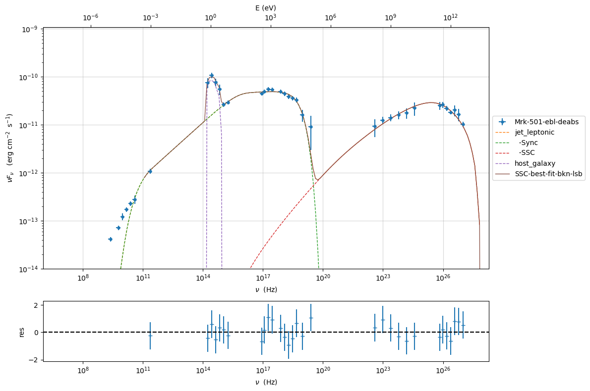

.. code:: ipython3

    %matplotlib inline
    from jetset.plot_sedfit import PlotSED
    fit_model_minuit_bkn.set_nu_grid(1E6,1E30,200)
    fit_model_minuit_bkn.eval()
    fit_model_minuit.set_nu_grid(1E6,1E30,200)
    fit_model_minuit.eval()
    fit_model_lsb.set_nu_grid(1E6,1E30,200)
    fit_model_lsb.eval()
    fit_model_lsb_bkn.set_nu_grid(1E6,1E30,200)
    fit_model_lsb_bkn.eval()
    p2=PlotSED()
    p2.add_data_plot(sed_data,fit_range=[ 11., 29.])
    p2.add_model_plot(fit_model_minuit,color='black')
    p2.add_residual_plot(fit_model_minuit,sed_data,fit_range=[ 11. ,29.],color='black')
    p2.add_model_plot(fit_model_lsb,color='red')
    p2.add_residual_plot(fit_model_lsb,sed_data,fit_range=[ 11., 29.],color='red')
    p2.add_model_plot(fit_model_minuit_bkn,color='green')
    p2.add_residual_plot(fit_model_minuit_bkn,sed_data,fit_range=[ 11., 29.],color='green')
    p2.add_model_plot(fit_model_lsb_bkn,color='orange')
    p2.add_residual_plot(fit_model_lsb_bkn,sed_data,fit_range=[ 11., 29.],color='orange')
    p2.rescale(y_min=-13,x_min=6,x_max=28.5)

.. image:: Jet_example_model_fit_wiht_gal_template_files/Jet_example_model_fit_wiht_gal_template_48_0.png

MCMC sampling
-------------

.. code:: ipython3

    from jetset.mcmc import McmcSampler
    from jetset.minimizer import ModelMinimizer

We used a flat prior centered on the best fit value. Setting
``bound=5.0`` and ``bound_rel=True`` means that:

1) the prior interval will be defined as [best_fit_val - delta_m ,
   best_fit_val + delta_p]

2) with delta_p=delta_m=best_fit_val*bound

If we set ``bound_rel=False`` then delta_p = delta_m =
best_fit_err*bound

It is possible to define asymmetric boundaries e.g. ``bound=[2.0,5.0]``
meaning that

1) for ``bound_rel=True``

   delta_p = best_fit_val*bound[1]

   delta_m =b est_fit_val*bound[0]

2) for ``bound_rel=False``

   delta_p = best_fit_err*bound[1]

   delta_m = best_fit_err*bound[0]

In the next release a more flexible prior interface will be added,
including different type of priors

Given the large parameter space, we select a sub sample of parameters
using the ``use_labels_dict``. If we do not pass the ‘use_labels_dict’
the full set of free parameters will be used

.. code:: ipython3

    model_minimizer_lsb = ModelMinimizer.load_model('model_minimizer_lsb.pkl')
    
    
    mcmc=McmcSampler(model_minimizer_lsb)
    
    labels=['N','B','beam_obj','s','gamma0_log_parab']
    model_name='jet_leptonic'
    use_labels_dict={model_name:labels}
    
    mcmc.run_sampler(nwalkers=128,burnin=10,steps=50,bound=5.0,bound_rel=True,threads=None,walker_start_bound=0.005,use_labels_dict=use_labels_dict)

.. parsed-literal::

    mcmc run starting
    

.. parsed-literal::

      0%|          | 0/50 [00:00<?, ?it/s]

.. parsed-literal::

    mcmc run done, with 1 threads took 441.46 seconds

.. code:: ipython3

    print(mcmc.acceptance_fraction)

.. parsed-literal::

    0.5528124999999999

.. code:: ipython3

    p=mcmc.plot_model(sed_data=sed_data,fit_range=[11., 27.],size=50)
    p.rescale(y_min=-13,x_min=6,x_max=28.5)

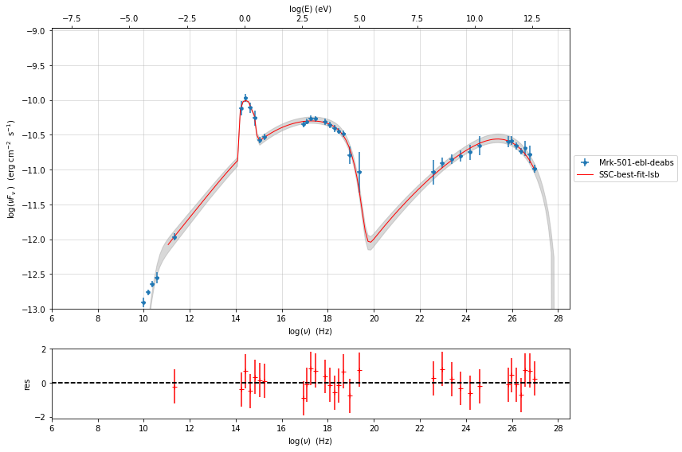

.. code:: ipython3

    f=mcmc.plot_chain('s',log_plot=False)

.. image:: Jet_example_model_fit_wiht_gal_template_files/Jet_example_model_fit_wiht_gal_template_55_0.png

.. code:: ipython3

    f=mcmc.corner_plot()

.. image:: Jet_example_model_fit_wiht_gal_template_files/Jet_example_model_fit_wiht_gal_template_56_0.png

.. code:: ipython3

    mcmc.get_par('N')

.. parsed-literal::

    (array([27.13365648, 27.56888754, 27.44743786, ..., 31.04123012,
            20.41634151, 31.10457229]),
     0)

.. code:: ipython3

    f=mcmc.plot_par('beam_obj')

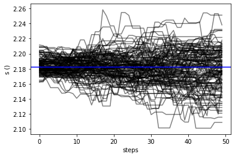

The posterior of the beaming factor is clearly truncated, so we should
rerun the fit changing the constrain on ``beam_obj`` parameter.

.. code:: ipython3

    from jetset.model_manager import  FitModel
    from jetset.jet_model import Jet
    
    jet_lsb=Jet.load_model('prefit_jet_gal_templ.pkl')
    jet_lsb.set_gamma_grid_size(200)

.. raw:: html

    <i>Table length=11</i>
    <table id="table140346331534624-517401" class="table-striped table-bordered table-condensed">
    <thead><tr><th>model name</th><th>name</th><th>par type</th><th>units</th><th>val</th><th>phys. bound. min</th><th>phys. bound. max</th><th>log</th><th>frozen</th></tr></thead>
    <tr><td>jet_leptonic</td><td>gmin</td><td>low-energy-cut-off</td><td>lorentz-factor*</td><td>1.487509e+02</td><td>1.000000e+00</td><td>1.000000e+09</td><td>False</td><td>False</td></tr>
    <tr><td>jet_leptonic</td><td>gmax</td><td>high-energy-cut-off</td><td>lorentz-factor*</td><td>2.310708e+06</td><td>1.000000e+00</td><td>1.000000e+15</td><td>False</td><td>False</td></tr>
    <tr><td>jet_leptonic</td><td>N</td><td>emitters_density</td><td>1 / cm3</td><td>3.082278e+01</td><td>0.000000e+00</td><td>--</td><td>False</td><td>False</td></tr>
    <tr><td>jet_leptonic</td><td>gamma0_log_parab</td><td>turn-over-energy</td><td>lorentz-factor*</td><td>1.045843e+04</td><td>1.000000e+00</td><td>1.000000e+09</td><td>False</td><td>False</td></tr>
    <tr><td>jet_leptonic</td><td>s</td><td>LE_spectral_slope</td><td></td><td>2.248787e+00</td><td>-1.000000e+01</td><td>1.000000e+01</td><td>False</td><td>False</td></tr>
    <tr><td>jet_leptonic</td><td>r</td><td>spectral_curvature</td><td></td><td>3.205572e-01</td><td>-1.500000e+01</td><td>1.500000e+01</td><td>False</td><td>False</td></tr>
    <tr><td>jet_leptonic</td><td>R</td><td>region_size</td><td>cm</td><td>1.046425e+16</td><td>1.000000e+03</td><td>1.000000e+30</td><td>False</td><td>False</td></tr>
    <tr><td>jet_leptonic</td><td>R_H</td><td>region_position</td><td>cm</td><td>1.000000e+17</td><td>0.000000e+00</td><td>--</td><td>False</td><td>True</td></tr>
    <tr><td>jet_leptonic</td><td>B</td><td>magnetic_field</td><td>gauss</td><td>5.050000e-02</td><td>0.000000e+00</td><td>--</td><td>False</td><td>False</td></tr>
    <tr><td>jet_leptonic</td><td>beam_obj</td><td>beaming</td><td>lorentz-factor*</td><td>2.500000e+01</td><td>1.000000e-04</td><td>--</td><td>False</td><td>False</td></tr>
    <tr><td>jet_leptonic</td><td>z_cosm</td><td>redshift</td><td></td><td>3.360000e-02</td><td>0.000000e+00</td><td>--</td><td>False</td><td>False</td></tr>
    </table>
    

.. code:: ipython3

    fit_model_lsb=FitModel( jet=jet_lsb, name='SSC-best-fit-lsb',template=my_shape.host_gal) 

.. code:: ipython3

    fit_model_lsb.freeze('jet_leptonic','z_cosm')
    fit_model_lsb.freeze('jet_leptonic','R_H')
    fit_model_lsb.jet_leptonic.parameters.beam_obj.fit_range=[5., 100.]
    fit_model_lsb.jet_leptonic.parameters.R.fit_range=[10**15.5,10**17.5]
    fit_model_lsb.jet_leptonic.parameters.gmax.fit_range=[1E4,1E8]
    fit_model_lsb.host_galaxy.parameters.nuFnu_p_host.frozen=False
    fit_model_lsb.host_galaxy.parameters.nu_scale.frozen=True

.. code:: ipython3

    model_minimizer_lsb=ModelMinimizer('lsb')
    best_fit_lsb=model_minimizer_lsb.fit(fit_model_lsb,sed_data,10.0**11,10**29.0,fitname='SSC-best-fit-lsb',repeat=3,silent=True)

.. code:: ipython3

    %matplotlib inline
    fit_model_lsb.set_nu_grid(1E6,1E30,200)
    fit_model_lsb.eval()
    p2=fit_model_lsb.plot_model(sed_data=sed_data)
    p2.rescale(y_min=-13,x_min=6,x_max=28.5)

.. image:: Jet_example_model_fit_wiht_gal_template_files/Jet_example_model_fit_wiht_gal_template_64_0.png

.. code:: ipython3

    best_fit_lsb.save_report('SSC-best-fit-lsb.txt')
    model_minimizer_lsb.save_model('model_minimizer_lsb.pkl')
    fit_model_lsb.save_model('fit_model_lsb.pkl')

.. code:: ipython3

    model_minimizer_lsb = ModelMinimizer.load_model('model_minimizer_lsb.pkl')
    
    
    mcmc=McmcSampler(model_minimizer_lsb)
    
    labels=['N','B','beam_obj','s','gamma0_log_parab']
    model_name='jet_leptonic'
    use_labels_dict={model_name:labels}
    
    mcmc.run_sampler(nwalkers=128,burnin=10,steps=50,bound=5.0,bound_rel=True,threads=None,walker_start_bound=0.005,use_labels_dict=use_labels_dict)

.. parsed-literal::

    mcmc run starting
    

.. parsed-literal::

      0%|          | 0/50 [00:00<?, ?it/s]

.. parsed-literal::

    mcmc run done, with 1 threads took 452.72 seconds

.. code:: ipython3

    f=mcmc.corner_plot()

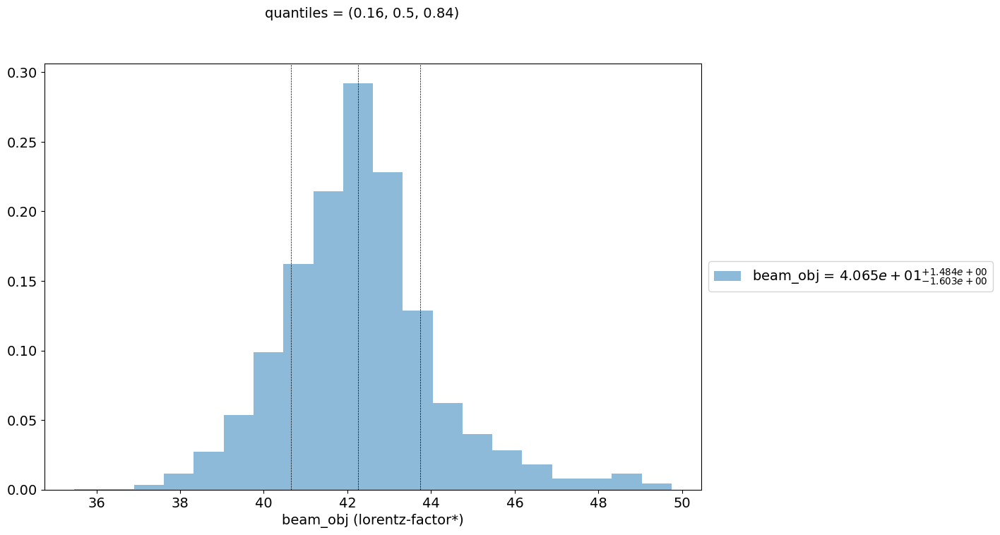

Save and reuse MCMC
-------------------

.. code:: ipython3

    mcmc.save('mcmc_sampler.pkl')

.. code:: ipython3

    from jetset.mcmc import McmcSampler
    from jetset.data_loader import ObsData
    from jetset.plot_sedfit import PlotSED
    from jetset.test_data_helper import  test_SEDs
    
    sed_data=ObsData.load('Mrk_501.pkl')
    
    ms=McmcSampler.load('mcmc_sampler.pkl')

.. code:: ipython3

    p=ms.plot_model(sed_data=sed_data,fit_range=[11., 27.4],size=50)
    p.rescale(y_min=-13,x_min=6,x_max=28.5)

.. image:: Jet_example_model_fit_wiht_gal_template_files/Jet_example_model_fit_wiht_gal_template_71_0.png

.. code:: ipython3

    f=ms.plot_par('beam_obj',log_plot=False)

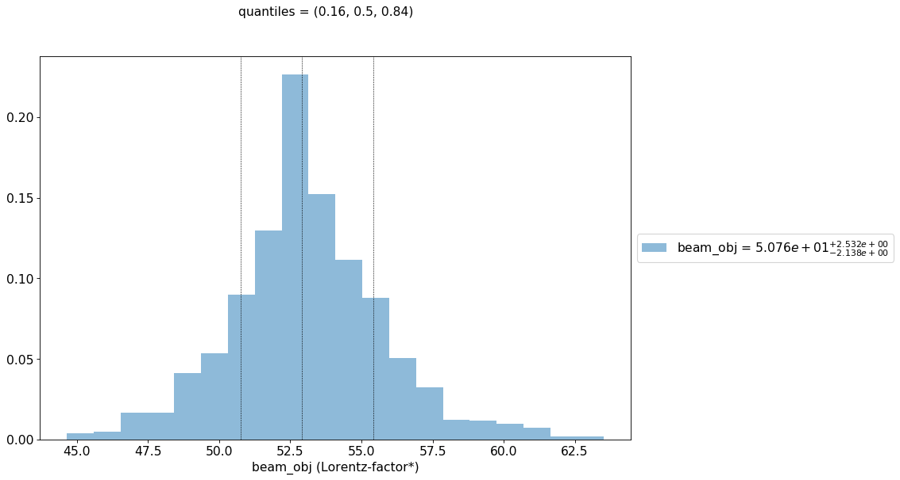

.. code:: ipython3

    f=ms.plot_chain('s',log_plot=False)

.. image:: Jet_example_model_fit_wiht_gal_template_files/Jet_example_model_fit_wiht_gal_template_73_0.png

