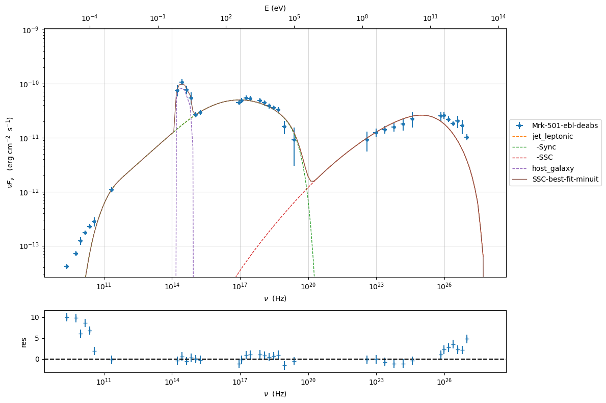
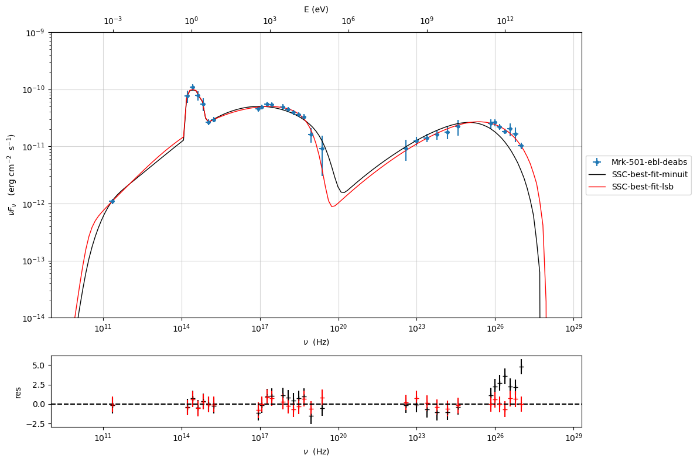
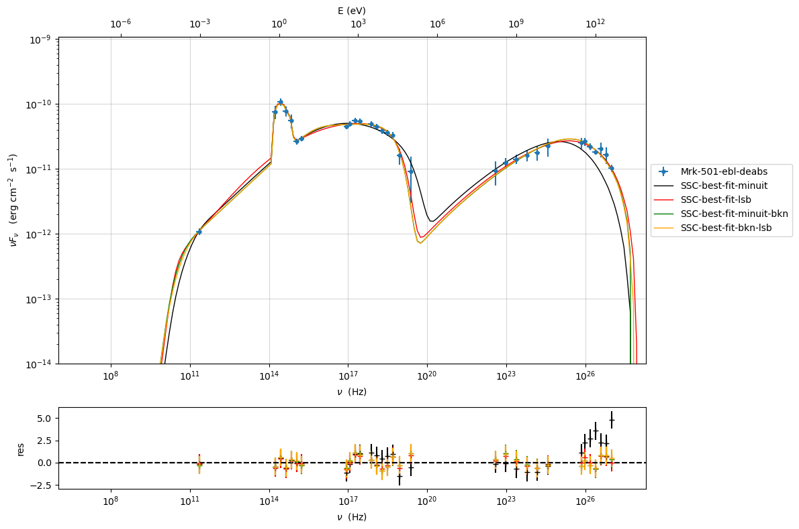

.. _model_fitting_2:

Model fitting 2: SSC + galaxy template
======================================

.. code:: ipython3

    import warnings
    warnings.filterwarnings('ignore')
    
    import matplotlib.pylab as plt
    import jetset
    from jetset.test_data_helper import  test_SEDs
    from jetset.data_loader import ObsData,Data
    from jetset.plot_sedfit import PlotSED
    from jetset.test_data_helper import  test_SEDs

.. code:: ipython3

    print(jetset.__version__)

.. parsed-literal::

    1.2.2

.. code:: ipython3

    test_SEDs

.. parsed-literal::

    ['/Users/orion/anaconda3/envs/jetset/lib/python3.8/site-packages/jetset/test_data/SEDs_data/SED_3C345.ecsv',
     '/Users/orion/anaconda3/envs/jetset/lib/python3.8/site-packages/jetset/test_data/SEDs_data/SED_MW_Mrk421_EBL_DEABS.ecsv',
     '/Users/orion/anaconda3/envs/jetset/lib/python3.8/site-packages/jetset/test_data/SEDs_data/SED_MW_Mrk501_EBL_ABS.ecsv',
     '/Users/orion/anaconda3/envs/jetset/lib/python3.8/site-packages/jetset/test_data/SEDs_data/SED_MW_Mrk501_EBL_DEABS.ecsv']

Loading data
------------

see the :ref:`data_format` user guide for further information about loading data 

.. code:: ipython3

    data=Data.from_file(test_SEDs[3])

.. code:: ipython3

    %matplotlib inline
    sed_data=ObsData(data_table=data)
    sed_data.group_data(bin_width=0.2)
    
    sed_data.add_systematics(0.1,[10.**6,10.**29])
    p=sed_data.plot_sed()

.. parsed-literal::

    ================================================================================
    
    ***  binning data  ***
    ---> N bins= 90
    ---> bin_widht= 0.2
    ================================================================================
    

.. image:: Jet_example_model_fit_wiht_gal_template_files/Jet_example_model_fit_wiht_gal_template_8_1.png

.. code:: ipython3

    sed_data.save('Mrk_501.pkl')

Phenomenological model constraining
-----------------------------------

see the :ref:`phenom_constr` user guide for further information about loading data 

Spectral indices
~~~~~~~~~~~~~~~~

.. code:: ipython3

    from jetset.sed_shaper import  SEDShape
    my_shape=SEDShape(sed_data)
    my_shape.eval_indices(silent=True)
    p=my_shape.plot_indices()
    p.setlim(y_min=1E-15,y_max=1E-6)

.. parsed-literal::

    ================================================================================
    
    *** evaluating spectral indices for data ***
    ================================================================================
    

.. image:: Jet_example_model_fit_wiht_gal_template_files/Jet_example_model_fit_wiht_gal_template_13_1.png

Sed shaper
~~~~~~~~~~

.. code:: ipython3

    mm,best_fit=my_shape.sync_fit(check_host_gal_template=True,
                      Ep_start=None,
                      minimizer='lsb',
                      silent=True,
                      fit_range=[10. , 21.])

.. parsed-literal::

    ================================================================================
    
    *** Log-Polynomial fitting of the synchrotron component ***
    ---> first blind fit run,  fit range: [10.0, 21.0]
    ---> class:  HSP
    
    ---> class:  HSP
    
    

.. raw:: html

    <i>Table length=6</i>
    <table id="table140474835582736-92339" class="table-striped table-bordered table-condensed">
    <thead><tr><th>model name</th><th>name</th><th>val</th><th>bestfit val</th><th>err +</th><th>err -</th><th>start val</th><th>fit range min</th><th>fit range max</th><th>frozen</th></tr></thead>
    <tr><td>LogCubic</td><td>b</td><td>-6.411143e-02</td><td>-6.411143e-02</td><td>7.838958e-03</td><td>--</td><td>-4.778764e-02</td><td>-1.000000e+01</td><td>0.000000e+00</td><td>False</td></tr>
    <tr><td>LogCubic</td><td>c</td><td>-1.751705e-03</td><td>-1.751705e-03</td><td>1.127020e-03</td><td>--</td><td>3.576201e-03</td><td>-1.000000e+01</td><td>1.000000e+01</td><td>False</td></tr>
    <tr><td>LogCubic</td><td>Ep</td><td>1.703747e+01</td><td>1.703747e+01</td><td>9.437333e-02</td><td>--</td><td>1.626870e+01</td><td>0.000000e+00</td><td>3.000000e+01</td><td>False</td></tr>
    <tr><td>LogCubic</td><td>Sp</td><td>-1.030068e+01</td><td>-1.030068e+01</td><td>1.884116e-02</td><td>--</td><td>-1.025412e+01</td><td>-3.000000e+01</td><td>0.000000e+00</td><td>False</td></tr>
    <tr><td>host_galaxy</td><td>nuFnu_p_host</td><td>-1.006556e+01</td><td>-1.006556e+01</td><td>5.462500e-02</td><td>--</td><td>-1.025412e+01</td><td>-1.225412e+01</td><td>-8.254123e+00</td><td>False</td></tr>
    <tr><td>host_galaxy</td><td>nu_scale</td><td>1.730750e-02</td><td>1.730750e-02</td><td>3.694838e-03</td><td>--</td><td>0.000000e+00</td><td>-5.000000e-01</td><td>5.000000e-01</td><td>False</td></tr>
    </table>
    

.. parsed-literal::

    ---> sync       nu_p=+1.703747e+01 (err=+9.437333e-02)  nuFnu_p=-1.030068e+01 (err=+1.884116e-02) curv.=-6.411143e-02 (err=+7.838958e-03)
    ================================================================================
    

.. code:: ipython3

    my_shape.IC_fit(fit_range=[23., 29.],minimizer='minuit',silent=True)
    p=my_shape.plot_shape_fit()
    p.setlim(y_min=1E-15)

.. parsed-literal::

    ================================================================================
    
    *** Log-Polynomial fitting of the IC component ***
    ---> fit range: [23.0, 29.0]
    ---> LogCubic fit
    
    

.. raw:: html

    <i>Table length=4</i>
    <table id="table140474831268256-245803" class="table-striped table-bordered table-condensed">
    <thead><tr><th>model name</th><th>name</th><th>val</th><th>bestfit val</th><th>err +</th><th>err -</th><th>start val</th><th>fit range min</th><th>fit range max</th><th>frozen</th></tr></thead>
    <tr><td>LogCubic</td><td>b</td><td>-1.310993e-01</td><td>-1.310993e-01</td><td>3.244183e-02</td><td>--</td><td>-1.000000e+00</td><td>-1.000000e+01</td><td>0.000000e+00</td><td>False</td></tr>
    <tr><td>LogCubic</td><td>c</td><td>-3.300446e-02</td><td>-3.300446e-02</td><td>2.072517e-02</td><td>--</td><td>-1.000000e+00</td><td>-1.000000e+01</td><td>1.000000e+01</td><td>False</td></tr>
    <tr><td>LogCubic</td><td>Ep</td><td>2.549603e+01</td><td>2.549603e+01</td><td>2.235468e-01</td><td>--</td><td>2.556357e+01</td><td>0.000000e+00</td><td>3.000000e+01</td><td>False</td></tr>
    <tr><td>LogCubic</td><td>Sp</td><td>-1.057945e+01</td><td>-1.057945e+01</td><td>4.332976e-02</td><td>--</td><td>-1.000000e+01</td><td>-3.000000e+01</td><td>0.000000e+00</td><td>False</td></tr>
    </table>
    

.. parsed-literal::

    ---> IC         nu_p=+2.549603e+01 (err=+2.235468e-01)  nuFnu_p=-1.057945e+01 (err=+4.332976e-02) curv.=-1.310993e-01 (err=+3.244183e-02)
    ================================================================================
    

.. image:: Jet_example_model_fit_wiht_gal_template_files/Jet_example_model_fit_wiht_gal_template_16_3.png

Model constraining
~~~~~~~~~~~~~~~~~~

In this step we are not fitting the model, we are just obtaining the
phenomenological ``pre_fit`` model, that will be fitted in using minuit
ore least-square bound, as shown below

.. code:: ipython3

    from jetset.obs_constrain import ObsConstrain
    from jetset.model_manager import  FitModel
    from jetset.minimizer import fit_SED
    sed_obspar=ObsConstrain(beaming=25,
                            B_range=[0.001,0.1],
                            distr_e='lppl',
                            t_var_sec=3*86400,
                            nu_cut_IR=1E11,
                            SEDShape=my_shape)
    
    
    prefit_jet=sed_obspar.constrain_SSC_model(electron_distribution_log_values=False,silent=True)
    prefit_jet.save_model('prefit_jet_gal_templ.pkl')

.. parsed-literal::

    ================================================================================
    
    ***  constrains parameters from observable ***
    

.. raw:: html

    <i>Table length=12</i>
    <table id="table140474827384576-467091" class="table-striped table-bordered table-condensed">
    <thead><tr><th>model name</th><th>name</th><th>par type</th><th>units</th><th>val</th><th>phys. bound. min</th><th>phys. bound. max</th><th>log</th><th>frozen</th></tr></thead>
    <tr><td>jet_leptonic</td><td>R</td><td>region_size</td><td>cm</td><td>1.046428e+16</td><td>1.000000e+03</td><td>1.000000e+30</td><td>False</td><td>False</td></tr>
    <tr><td>jet_leptonic</td><td>R_H</td><td>region_position</td><td>cm</td><td>1.000000e+17</td><td>0.000000e+00</td><td>--</td><td>False</td><td>True</td></tr>
    <tr><td>jet_leptonic</td><td>B</td><td>magnetic_field</td><td>gauss</td><td>5.050000e-02</td><td>0.000000e+00</td><td>--</td><td>False</td><td>False</td></tr>
    <tr><td>jet_leptonic</td><td>NH_cold_to_rel_e</td><td>cold_p_to_rel_e_ratio</td><td></td><td>1.000000e-01</td><td>0.000000e+00</td><td>--</td><td>False</td><td>True</td></tr>
    <tr><td>jet_leptonic</td><td>beam_obj</td><td>beaming</td><td>lorentz-factor*</td><td>2.500000e+01</td><td>1.000000e-04</td><td>--</td><td>False</td><td>False</td></tr>
    <tr><td>jet_leptonic</td><td>z_cosm</td><td>redshift</td><td></td><td>3.360000e-02</td><td>0.000000e+00</td><td>--</td><td>False</td><td>False</td></tr>
    <tr><td>jet_leptonic</td><td>gmin</td><td>low-energy-cut-off</td><td>lorentz-factor*</td><td>1.487509e+02</td><td>1.000000e+00</td><td>1.000000e+09</td><td>False</td><td>False</td></tr>
    <tr><td>jet_leptonic</td><td>gmax</td><td>high-energy-cut-off</td><td>lorentz-factor*</td><td>2.310708e+06</td><td>1.000000e+00</td><td>1.000000e+15</td><td>False</td><td>False</td></tr>
    <tr><td>jet_leptonic</td><td>N</td><td>emitters_density</td><td>1 / cm3</td><td>3.082271e+01</td><td>0.000000e+00</td><td>--</td><td>False</td><td>False</td></tr>
    <tr><td>jet_leptonic</td><td>gamma0_log_parab</td><td>turn-over-energy</td><td>lorentz-factor*</td><td>1.045836e+04</td><td>1.000000e+00</td><td>1.000000e+09</td><td>False</td><td>False</td></tr>
    <tr><td>jet_leptonic</td><td>s</td><td>LE_spectral_slope</td><td></td><td>2.248787e+00</td><td>-1.000000e+01</td><td>1.000000e+01</td><td>False</td><td>False</td></tr>
    <tr><td>jet_leptonic</td><td>r</td><td>spectral_curvature</td><td></td><td>3.205571e-01</td><td>-1.500000e+01</td><td>1.500000e+01</td><td>False</td><td>False</td></tr>
    </table>
    

.. parsed-literal::

    
    ================================================================================
    

.. code:: ipython3

    pl=prefit_jet.plot_model(sed_data=sed_data)
    pl.add_residual_plot(prefit_jet,sed_data)
    pl.setlim(y_min=1E-14,x_min=1E7,x_max=1E29)

.. image:: Jet_example_model_fit_wiht_gal_template_files/Jet_example_model_fit_wiht_gal_template_20_0.png

Model fitting
-------------

We remind that we can use different ``minimizers`` for the model fitting. In the following we will use the ``minuit`` minimizer and the ``lsb`` (least square bound scipy minimizer). Using ``minuit`` we notice that sometimes the fit will converge, but the quality  will not be enough (``valid==false``) to run ``minos``. Anyhow, as shown in the :ref:`MCMC sampling`, it still possible to estimate asymmetric errors by means of MCMC sampling

We freeze some parameters, and we also set some `fit_range` values. Setting fit_range can speed-up the fit convergence but should be judged by the user each time according to the physics of the particular source.

When using ``minuit`` the best strategy is to set the `fit_range` for most of the free parameters

A good strategy is to run first a `lsb` fit and then, using the same `fit_model`, run a fit with `minuit`

.. note::
   With the new implementation of composite model  (`FitModel` class) to set parameters you have to specify the model component, this is different from versions<1.1.2,
   and this holds also for the `freeze` method and for setting  `fit_range` intervals, and for the methods relate to parameters setting in general.
   See the :ref:`composite_models` user guide for further information about the new implementation of `FitModel`, in particular for parameter setting

Model fitting with LSB
~~~~~~~~~~~~~~~~~~~~~~

see the :ref:`composite_models` user guide for further information about the new implementation of `FitModel`, in particular for parameter setting

.. code:: ipython3

    from jetset.model_manager import  FitModel
    from jetset.jet_model import Jet
    
    jet_lsb=Jet.load_model('prefit_jet_gal_templ.pkl')
    jet_lsb.set_gamma_grid_size(200)

.. raw:: html

    <i>Table length=12</i>
    <table id="table140474824208336-206515" class="table-striped table-bordered table-condensed">
    <thead><tr><th>model name</th><th>name</th><th>par type</th><th>units</th><th>val</th><th>phys. bound. min</th><th>phys. bound. max</th><th>log</th><th>frozen</th></tr></thead>
    <tr><td>jet_leptonic</td><td>gmin</td><td>low-energy-cut-off</td><td>lorentz-factor*</td><td>1.487509e+02</td><td>1.000000e+00</td><td>1.000000e+09</td><td>False</td><td>False</td></tr>
    <tr><td>jet_leptonic</td><td>gmax</td><td>high-energy-cut-off</td><td>lorentz-factor*</td><td>2.310708e+06</td><td>1.000000e+00</td><td>1.000000e+15</td><td>False</td><td>False</td></tr>
    <tr><td>jet_leptonic</td><td>N</td><td>emitters_density</td><td>1 / cm3</td><td>3.082271e+01</td><td>0.000000e+00</td><td>--</td><td>False</td><td>False</td></tr>
    <tr><td>jet_leptonic</td><td>gamma0_log_parab</td><td>turn-over-energy</td><td>lorentz-factor*</td><td>1.045836e+04</td><td>1.000000e+00</td><td>1.000000e+09</td><td>False</td><td>False</td></tr>
    <tr><td>jet_leptonic</td><td>s</td><td>LE_spectral_slope</td><td></td><td>2.248787e+00</td><td>-1.000000e+01</td><td>1.000000e+01</td><td>False</td><td>False</td></tr>
    <tr><td>jet_leptonic</td><td>r</td><td>spectral_curvature</td><td></td><td>3.205571e-01</td><td>-1.500000e+01</td><td>1.500000e+01</td><td>False</td><td>False</td></tr>
    <tr><td>jet_leptonic</td><td>R</td><td>region_size</td><td>cm</td><td>1.046428e+16</td><td>1.000000e+03</td><td>1.000000e+30</td><td>False</td><td>False</td></tr>
    <tr><td>jet_leptonic</td><td>R_H</td><td>region_position</td><td>cm</td><td>1.000000e+17</td><td>0.000000e+00</td><td>--</td><td>False</td><td>True</td></tr>
    <tr><td>jet_leptonic</td><td>B</td><td>magnetic_field</td><td>gauss</td><td>5.050000e-02</td><td>0.000000e+00</td><td>--</td><td>False</td><td>False</td></tr>
    <tr><td>jet_leptonic</td><td>NH_cold_to_rel_e</td><td>cold_p_to_rel_e_ratio</td><td></td><td>1.000000e-01</td><td>0.000000e+00</td><td>--</td><td>False</td><td>True</td></tr>
    <tr><td>jet_leptonic</td><td>beam_obj</td><td>beaming</td><td>lorentz-factor*</td><td>2.500000e+01</td><td>1.000000e-04</td><td>--</td><td>False</td><td>False</td></tr>
    <tr><td>jet_leptonic</td><td>z_cosm</td><td>redshift</td><td></td><td>3.360000e-02</td><td>0.000000e+00</td><td>--</td><td>False</td><td>False</td></tr>
    </table>
    

.. code:: ipython3

    fit_model_lsb=FitModel( jet=jet_lsb, name='SSC-best-fit-lsb',template=my_shape.host_gal) 
    fit_model_lsb.show_model()

.. parsed-literal::

    
    --------------------------------------------------------------------------------
    Composite model description
    --------------------------------------------------------------------------------
    name: SSC-best-fit-lsb  
    type: composite_model  
    components models:
     -model name: jet_leptonic model type: jet
     -model name: host_galaxy model type: template
    
    --------------------------------------------------------------------------------
    individual component description
    
    --------------------------------------------------------------------------------
    model description: 
    --------------------------------------------------------------------------------
    type: Jet
    name: jet_leptonic  
    
    electrons distribution:
     type: lppl  
     gamma energy grid size:  201
     gmin grid : 1.487509e+02
     gmax grid : 2.310708e+06
     normalization:  True
     log-values:  False
     ratio of cold protons to relativistic electrons: 1.000000e-01
    
    radiative fields:
     seed photons grid size:  100
     IC emission grid size:  100
     source emissivity lower bound :  1.000000e-120
     spectral components:
       name:Sum, state: on
       name:Sync, state: self-abs
       name:SSC, state: on
    external fields transformation method: blob
    
    SED info:
     nu grid size jetkernel: 1000
     nu size: 500
     nu mix (Hz): 1.000000e+06
     nu max (Hz): 1.000000e+30
    
    flux plot lower bound   :  1.000000e-30
    
    --------------------------------------------------------------------------------

.. raw:: html

    <i>Table length=12</i>
    <table id="table140474853453632-132599" class="table-striped table-bordered table-condensed">
    <thead><tr><th>model name</th><th>name</th><th>par type</th><th>units</th><th>val</th><th>phys. bound. min</th><th>phys. bound. max</th><th>log</th><th>frozen</th></tr></thead>
    <tr><td>jet_leptonic</td><td>gmin</td><td>low-energy-cut-off</td><td>lorentz-factor*</td><td>1.487509e+02</td><td>1.000000e+00</td><td>1.000000e+09</td><td>False</td><td>False</td></tr>
    <tr><td>jet_leptonic</td><td>gmax</td><td>high-energy-cut-off</td><td>lorentz-factor*</td><td>2.310708e+06</td><td>1.000000e+00</td><td>1.000000e+15</td><td>False</td><td>False</td></tr>
    <tr><td>jet_leptonic</td><td>N</td><td>emitters_density</td><td>1 / cm3</td><td>3.082271e+01</td><td>0.000000e+00</td><td>--</td><td>False</td><td>False</td></tr>
    <tr><td>jet_leptonic</td><td>gamma0_log_parab</td><td>turn-over-energy</td><td>lorentz-factor*</td><td>1.045836e+04</td><td>1.000000e+00</td><td>1.000000e+09</td><td>False</td><td>False</td></tr>
    <tr><td>jet_leptonic</td><td>s</td><td>LE_spectral_slope</td><td></td><td>2.248787e+00</td><td>-1.000000e+01</td><td>1.000000e+01</td><td>False</td><td>False</td></tr>
    <tr><td>jet_leptonic</td><td>r</td><td>spectral_curvature</td><td></td><td>3.205571e-01</td><td>-1.500000e+01</td><td>1.500000e+01</td><td>False</td><td>False</td></tr>
    <tr><td>jet_leptonic</td><td>R</td><td>region_size</td><td>cm</td><td>1.046428e+16</td><td>1.000000e+03</td><td>1.000000e+30</td><td>False</td><td>False</td></tr>
    <tr><td>jet_leptonic</td><td>R_H</td><td>region_position</td><td>cm</td><td>1.000000e+17</td><td>0.000000e+00</td><td>--</td><td>False</td><td>True</td></tr>
    <tr><td>jet_leptonic</td><td>B</td><td>magnetic_field</td><td>gauss</td><td>5.050000e-02</td><td>0.000000e+00</td><td>--</td><td>False</td><td>False</td></tr>
    <tr><td>jet_leptonic</td><td>NH_cold_to_rel_e</td><td>cold_p_to_rel_e_ratio</td><td></td><td>1.000000e-01</td><td>0.000000e+00</td><td>--</td><td>False</td><td>True</td></tr>
    <tr><td>jet_leptonic</td><td>beam_obj</td><td>beaming</td><td>lorentz-factor*</td><td>2.500000e+01</td><td>1.000000e-04</td><td>--</td><td>False</td><td>False</td></tr>
    <tr><td>jet_leptonic</td><td>z_cosm</td><td>redshift</td><td></td><td>3.360000e-02</td><td>0.000000e+00</td><td>--</td><td>False</td><td>False</td></tr>
    </table>
    

.. parsed-literal::

    --------------------------------------------------------------------------------
    
    --------------------------------------------------------------------------------
    model description
    --------------------------------------------------------------------------------
    name: host_galaxy  
    type: template  
    
    --------------------------------------------------------------------------------

.. raw:: html

    <i>Table length=2</i>
    <table id="table140474835581248-968527" class="table-striped table-bordered table-condensed">
    <thead><tr><th>model name</th><th>name</th><th>par type</th><th>units</th><th>val</th><th>phys. bound. min</th><th>phys. bound. max</th><th>log</th><th>frozen</th></tr></thead>
    <tr><td>host_galaxy</td><td>nuFnu_p_host</td><td>nuFnu-scale</td><td>erg / (cm2 s)</td><td>-1.006556e+01</td><td>-2.000000e+01</td><td>2.000000e+01</td><td>False</td><td>False</td></tr>
    <tr><td>host_galaxy</td><td>nu_scale</td><td>nu-scale</td><td>Hz</td><td>1.730750e-02</td><td>-2.000000e+00</td><td>2.000000e+00</td><td>False</td><td>False</td></tr>
    </table>
    

.. parsed-literal::

    --------------------------------------------------------------------------------
    --------------------------------------------------------------------------------

.. note::
   Since the `jet_leptonic to model` has to be summed to the `host_galaxy` model, we do not need to define the functional form for the composite model, because
   the default compostion is the sum of all the components
   (see the :ref:`composite_models` user guide for further information about the new implementation of `FitModel`, in particular for parameter setting).
   Anyhow, we show here the definition of the model composition  for purpose of clarity

.. code:: ipython3

    fit_model_lsb.composite_expr='jet_leptonic + host_galaxy'

.. code:: ipython3

    fit_model_lsb.freeze('jet_leptonic','z_cosm')
    fit_model_lsb.freeze('jet_leptonic','R_H')
    fit_model_lsb.jet_leptonic.parameters.N.fit_range=[1E-10, 1E5]
    fit_model_lsb.jet_leptonic.parameters.B.fit_range=[1E-3, 1]
    
    fit_model_lsb.jet_leptonic.parameters.beam_obj.fit_range=[5., 50.]
    fit_model_lsb.jet_leptonic.parameters.R.fit_range=[10**15.5,10**17.5]
    fit_model_lsb.jet_leptonic.parameters.gmax.fit_range=[1E4,1E8]
    fit_model_lsb.host_galaxy.parameters.nuFnu_p_host.frozen=False
    fit_model_lsb.host_galaxy.parameters.nu_scale.frozen=True

.. code:: ipython3

    from jetset.minimizer import fit_SED,ModelMinimizer
    
    model_minimizer_lsb=ModelMinimizer('lsb')
    best_fit_lsb=model_minimizer_lsb.fit(fit_model_lsb,sed_data,10.0**11,10**29.0,fitname='SSC-best-fit-lsb',repeat=3)

.. parsed-literal::

    filtering data in fit range = [1.000000e+11,1.000000e+29]
    data length 31
    ================================================================================
    
    *** start fit process ***
    ----- 
    fit run: 0

.. parsed-literal::

    0it [00:00, ?it/s]

.. parsed-literal::

    - best chisq=8.38525e+00
    
    fit run: 1
    - old chisq=8.38525e+00

.. parsed-literal::

    0it [00:00, ?it/s]

.. parsed-literal::

    - best chisq=8.38525e+00
    
    fit run: 2
    - old chisq=8.38525e+00

.. parsed-literal::

    0it [00:00, ?it/s]

.. parsed-literal::

    - best chisq=8.38525e+00
    
    -------------------------------------------------------------------------
    Fit report
    
    Model: SSC-best-fit-lsb

.. raw:: html

    <i>Table length=14</i>
    <table id="table140474853453632-51472" class="table-striped table-bordered table-condensed">
    <thead><tr><th>model name</th><th>name</th><th>par type</th><th>units</th><th>val</th><th>phys. bound. min</th><th>phys. bound. max</th><th>log</th><th>frozen</th></tr></thead>
    <tr><td>jet_leptonic</td><td>gmin</td><td>low-energy-cut-off</td><td>lorentz-factor*</td><td>1.035366e+02</td><td>1.000000e+00</td><td>1.000000e+09</td><td>False</td><td>False</td></tr>
    <tr><td>jet_leptonic</td><td>gmax</td><td>high-energy-cut-off</td><td>lorentz-factor*</td><td>2.110441e+06</td><td>1.000000e+00</td><td>1.000000e+15</td><td>False</td><td>False</td></tr>
    <tr><td>jet_leptonic</td><td>N</td><td>emitters_density</td><td>1 / cm3</td><td>2.378511e+01</td><td>0.000000e+00</td><td>--</td><td>False</td><td>False</td></tr>
    <tr><td>jet_leptonic</td><td>gamma0_log_parab</td><td>turn-over-energy</td><td>lorentz-factor*</td><td>6.124079e+03</td><td>1.000000e+00</td><td>1.000000e+09</td><td>False</td><td>False</td></tr>
    <tr><td>jet_leptonic</td><td>s</td><td>LE_spectral_slope</td><td></td><td>2.183323e+00</td><td>-1.000000e+01</td><td>1.000000e+01</td><td>False</td><td>False</td></tr>
    <tr><td>jet_leptonic</td><td>r</td><td>spectral_curvature</td><td></td><td>2.298521e-01</td><td>-1.500000e+01</td><td>1.500000e+01</td><td>False</td><td>False</td></tr>
    <tr><td>jet_leptonic</td><td>R</td><td>region_size</td><td>cm</td><td>1.416426e+16</td><td>1.000000e+03</td><td>1.000000e+30</td><td>False</td><td>False</td></tr>
    <tr><td>jet_leptonic</td><td>R_H</td><td>region_position</td><td>cm</td><td>1.000000e+17</td><td>0.000000e+00</td><td>--</td><td>False</td><td>True</td></tr>
    <tr><td>jet_leptonic</td><td>B</td><td>magnetic_field</td><td>gauss</td><td>1.264063e-02</td><td>0.000000e+00</td><td>--</td><td>False</td><td>False</td></tr>
    <tr><td>jet_leptonic</td><td>NH_cold_to_rel_e</td><td>cold_p_to_rel_e_ratio</td><td></td><td>1.000000e-01</td><td>0.000000e+00</td><td>--</td><td>False</td><td>True</td></tr>
    <tr><td>jet_leptonic</td><td>beam_obj</td><td>beaming</td><td>lorentz-factor*</td><td>4.225409e+01</td><td>1.000000e-04</td><td>--</td><td>False</td><td>False</td></tr>
    <tr><td>jet_leptonic</td><td>z_cosm</td><td>redshift</td><td></td><td>3.360000e-02</td><td>0.000000e+00</td><td>--</td><td>False</td><td>True</td></tr>
    <tr><td>host_galaxy</td><td>nuFnu_p_host</td><td>nuFnu-scale</td><td>erg / (cm2 s)</td><td>-1.005711e+01</td><td>-2.000000e+01</td><td>2.000000e+01</td><td>False</td><td>False</td></tr>
    <tr><td>host_galaxy</td><td>nu_scale</td><td>nu-scale</td><td>Hz</td><td>1.730750e-02</td><td>-2.000000e+00</td><td>2.000000e+00</td><td>False</td><td>True</td></tr>
    </table>
    

.. parsed-literal::

    
    converged=True
    calls=21
    mesg=

.. parsed-literal::

    'The relative error between two consecutive iterates is at most 0.000000'

.. parsed-literal::

    dof=21
    chisq=8.385251, chisq/red=0.399298 null hypothesis sig=0.993283
    
    best fit pars

.. raw:: html

    <i>Table length=14</i>
    <table id="table140474835581488-976139" class="table-striped table-bordered table-condensed">
    <thead><tr><th>model name</th><th>name</th><th>val</th><th>bestfit val</th><th>err +</th><th>err -</th><th>start val</th><th>fit range min</th><th>fit range max</th><th>frozen</th></tr></thead>
    <tr><td>jet_leptonic</td><td>gmin</td><td>1.035366e+02</td><td>1.035366e+02</td><td>3.138045e+02</td><td>--</td><td>1.487509e+02</td><td>1.000000e+00</td><td>1.000000e+09</td><td>False</td></tr>
    <tr><td>jet_leptonic</td><td>gmax</td><td>2.110441e+06</td><td>2.110441e+06</td><td>1.851406e+06</td><td>--</td><td>2.310708e+06</td><td>1.000000e+04</td><td>1.000000e+08</td><td>False</td></tr>
    <tr><td>jet_leptonic</td><td>N</td><td>2.378511e+01</td><td>2.378511e+01</td><td>1.413286e+02</td><td>--</td><td>3.082271e+01</td><td>1.000000e-10</td><td>1.000000e+05</td><td>False</td></tr>
    <tr><td>jet_leptonic</td><td>gamma0_log_parab</td><td>6.124079e+03</td><td>6.124079e+03</td><td>9.244801e+03</td><td>--</td><td>1.045836e+04</td><td>1.000000e+00</td><td>1.000000e+09</td><td>False</td></tr>
    <tr><td>jet_leptonic</td><td>s</td><td>2.183323e+00</td><td>2.183323e+00</td><td>1.197420e-01</td><td>--</td><td>2.248787e+00</td><td>-1.000000e+01</td><td>1.000000e+01</td><td>False</td></tr>
    <tr><td>jet_leptonic</td><td>r</td><td>2.298521e-01</td><td>2.298521e-01</td><td>4.200536e-02</td><td>--</td><td>3.205571e-01</td><td>-1.500000e+01</td><td>1.500000e+01</td><td>False</td></tr>
    <tr><td>jet_leptonic</td><td>R</td><td>1.416426e+16</td><td>1.416426e+16</td><td>3.597031e+16</td><td>--</td><td>1.046428e+16</td><td>3.162278e+15</td><td>3.162278e+17</td><td>False</td></tr>
    <tr><td>jet_leptonic</td><td>R_H</td><td>1.000000e+17</td><td>--</td><td>--</td><td>--</td><td>1.000000e+17</td><td>0.000000e+00</td><td>--</td><td>True</td></tr>
    <tr><td>jet_leptonic</td><td>B</td><td>1.264063e-02</td><td>1.264063e-02</td><td>9.772826e-03</td><td>--</td><td>5.050000e-02</td><td>1.000000e-03</td><td>1.000000e+00</td><td>False</td></tr>
    <tr><td>jet_leptonic</td><td>NH_cold_to_rel_e</td><td>1.000000e-01</td><td>--</td><td>--</td><td>--</td><td>1.000000e-01</td><td>0.000000e+00</td><td>--</td><td>True</td></tr>
    <tr><td>jet_leptonic</td><td>beam_obj</td><td>4.225409e+01</td><td>4.225409e+01</td><td>4.269309e+01</td><td>--</td><td>2.500000e+01</td><td>5.000000e+00</td><td>5.000000e+01</td><td>False</td></tr>
    <tr><td>jet_leptonic</td><td>z_cosm</td><td>3.360000e-02</td><td>--</td><td>--</td><td>--</td><td>3.360000e-02</td><td>0.000000e+00</td><td>--</td><td>True</td></tr>
    <tr><td>host_galaxy</td><td>nuFnu_p_host</td><td>-1.005711e+01</td><td>-1.005711e+01</td><td>3.290067e-02</td><td>--</td><td>-1.006556e+01</td><td>-1.225412e+01</td><td>-8.254123e+00</td><td>False</td></tr>
    <tr><td>host_galaxy</td><td>nu_scale</td><td>1.730750e-02</td><td>--</td><td>--</td><td>--</td><td>1.730750e-02</td><td>-5.000000e-01</td><td>5.000000e-01</td><td>True</td></tr>
    </table>
    

.. parsed-literal::

    -------------------------------------------------------------------------
    
    ================================================================================
    

.. code:: ipython3

    best_fit_lsb.save_report('SSC-best-fit-lsb.pkl')
    model_minimizer_lsb.save_model('model_minimizer_lsb.pkl')
    fit_model_lsb.save_model('fit_model_lsb.pkl')
    
    best_fit_lsb.bestfit_table

.. raw:: html

    <i>Table length=14</i>
    <table id="table140474827334512" class="table-striped table-bordered table-condensed">
    <thead><tr><th>model name</th><th>name</th><th>val</th><th>bestfit val</th><th>err +</th><th>err -</th><th>start val</th><th>fit range min</th><th>fit range max</th><th>frozen</th></tr></thead>
    <thead><tr><th>str12</th><th>str16</th><th>float64</th><th>float64</th><th>float64</th><th>float64</th><th>float64</th><th>float64</th><th>float64</th><th>bool</th></tr></thead>
    <tr><td>jet_leptonic</td><td>gmin</td><td>1.035366e+02</td><td>1.035366e+02</td><td>3.138045e+02</td><td>--</td><td>1.487509e+02</td><td>1.000000e+00</td><td>1.000000e+09</td><td>False</td></tr>
    <tr><td>jet_leptonic</td><td>gmax</td><td>2.110441e+06</td><td>2.110441e+06</td><td>1.851406e+06</td><td>--</td><td>2.310708e+06</td><td>1.000000e+04</td><td>1.000000e+08</td><td>False</td></tr>
    <tr><td>jet_leptonic</td><td>N</td><td>2.378511e+01</td><td>2.378511e+01</td><td>1.413286e+02</td><td>--</td><td>3.082271e+01</td><td>1.000000e-10</td><td>1.000000e+05</td><td>False</td></tr>
    <tr><td>jet_leptonic</td><td>gamma0_log_parab</td><td>6.124079e+03</td><td>6.124079e+03</td><td>9.244801e+03</td><td>--</td><td>1.045836e+04</td><td>1.000000e+00</td><td>1.000000e+09</td><td>False</td></tr>
    <tr><td>jet_leptonic</td><td>s</td><td>2.183323e+00</td><td>2.183323e+00</td><td>1.197420e-01</td><td>--</td><td>2.248787e+00</td><td>-1.000000e+01</td><td>1.000000e+01</td><td>False</td></tr>
    <tr><td>jet_leptonic</td><td>r</td><td>2.298521e-01</td><td>2.298521e-01</td><td>4.200536e-02</td><td>--</td><td>3.205571e-01</td><td>-1.500000e+01</td><td>1.500000e+01</td><td>False</td></tr>
    <tr><td>jet_leptonic</td><td>R</td><td>1.416426e+16</td><td>1.416426e+16</td><td>3.597031e+16</td><td>--</td><td>1.046428e+16</td><td>3.162278e+15</td><td>3.162278e+17</td><td>False</td></tr>
    <tr><td>jet_leptonic</td><td>R_H</td><td>1.000000e+17</td><td>--</td><td>--</td><td>--</td><td>1.000000e+17</td><td>0.000000e+00</td><td>--</td><td>True</td></tr>
    <tr><td>jet_leptonic</td><td>B</td><td>1.264063e-02</td><td>1.264063e-02</td><td>9.772826e-03</td><td>--</td><td>5.050000e-02</td><td>1.000000e-03</td><td>1.000000e+00</td><td>False</td></tr>
    <tr><td>jet_leptonic</td><td>NH_cold_to_rel_e</td><td>1.000000e-01</td><td>--</td><td>--</td><td>--</td><td>1.000000e-01</td><td>0.000000e+00</td><td>--</td><td>True</td></tr>
    <tr><td>jet_leptonic</td><td>beam_obj</td><td>4.225409e+01</td><td>4.225409e+01</td><td>4.269309e+01</td><td>--</td><td>2.500000e+01</td><td>5.000000e+00</td><td>5.000000e+01</td><td>False</td></tr>
    <tr><td>jet_leptonic</td><td>z_cosm</td><td>3.360000e-02</td><td>--</td><td>--</td><td>--</td><td>3.360000e-02</td><td>0.000000e+00</td><td>--</td><td>True</td></tr>
    <tr><td>host_galaxy</td><td>nuFnu_p_host</td><td>-1.005711e+01</td><td>-1.005711e+01</td><td>3.290067e-02</td><td>--</td><td>-1.006556e+01</td><td>-1.225412e+01</td><td>-8.254123e+00</td><td>False</td></tr>
    <tr><td>host_galaxy</td><td>nu_scale</td><td>1.730750e-02</td><td>--</td><td>--</td><td>--</td><td>1.730750e-02</td><td>-5.000000e-01</td><td>5.000000e-01</td><td>True</td></tr>
    </table>

.. code:: ipython3

    %matplotlib inline
    fit_model_lsb.set_nu_grid(1E6,1E30,200)
    fit_model_lsb.eval()
    p2=fit_model_lsb.plot_model(sed_data=sed_data)
    p2.setlim(y_min=1E-14,x_min=1E6,x_max=2E28)

.. image:: Jet_example_model_fit_wiht_gal_template_files/Jet_example_model_fit_wiht_gal_template_33_0.png

Model fitting with Minuit
~~~~~~~~~~~~~~~~~~~~~~~~~

.. code:: ipython3

    jet_minuit=Jet.load_model('prefit_jet_gal_templ.pkl')
    jet_minuit.set_gamma_grid_size(200)

.. raw:: html

    <i>Table length=12</i>
    <table id="table140474343479568-966373" class="table-striped table-bordered table-condensed">
    <thead><tr><th>model name</th><th>name</th><th>par type</th><th>units</th><th>val</th><th>phys. bound. min</th><th>phys. bound. max</th><th>log</th><th>frozen</th></tr></thead>
    <tr><td>jet_leptonic</td><td>gmin</td><td>low-energy-cut-off</td><td>lorentz-factor*</td><td>1.487509e+02</td><td>1.000000e+00</td><td>1.000000e+09</td><td>False</td><td>False</td></tr>
    <tr><td>jet_leptonic</td><td>gmax</td><td>high-energy-cut-off</td><td>lorentz-factor*</td><td>2.310708e+06</td><td>1.000000e+00</td><td>1.000000e+15</td><td>False</td><td>False</td></tr>
    <tr><td>jet_leptonic</td><td>N</td><td>emitters_density</td><td>1 / cm3</td><td>3.082271e+01</td><td>0.000000e+00</td><td>--</td><td>False</td><td>False</td></tr>
    <tr><td>jet_leptonic</td><td>gamma0_log_parab</td><td>turn-over-energy</td><td>lorentz-factor*</td><td>1.045836e+04</td><td>1.000000e+00</td><td>1.000000e+09</td><td>False</td><td>False</td></tr>
    <tr><td>jet_leptonic</td><td>s</td><td>LE_spectral_slope</td><td></td><td>2.248787e+00</td><td>-1.000000e+01</td><td>1.000000e+01</td><td>False</td><td>False</td></tr>
    <tr><td>jet_leptonic</td><td>r</td><td>spectral_curvature</td><td></td><td>3.205571e-01</td><td>-1.500000e+01</td><td>1.500000e+01</td><td>False</td><td>False</td></tr>
    <tr><td>jet_leptonic</td><td>R</td><td>region_size</td><td>cm</td><td>1.046428e+16</td><td>1.000000e+03</td><td>1.000000e+30</td><td>False</td><td>False</td></tr>
    <tr><td>jet_leptonic</td><td>R_H</td><td>region_position</td><td>cm</td><td>1.000000e+17</td><td>0.000000e+00</td><td>--</td><td>False</td><td>True</td></tr>
    <tr><td>jet_leptonic</td><td>B</td><td>magnetic_field</td><td>gauss</td><td>5.050000e-02</td><td>0.000000e+00</td><td>--</td><td>False</td><td>False</td></tr>
    <tr><td>jet_leptonic</td><td>NH_cold_to_rel_e</td><td>cold_p_to_rel_e_ratio</td><td></td><td>1.000000e-01</td><td>0.000000e+00</td><td>--</td><td>False</td><td>True</td></tr>
    <tr><td>jet_leptonic</td><td>beam_obj</td><td>beaming</td><td>lorentz-factor*</td><td>2.500000e+01</td><td>1.000000e-04</td><td>--</td><td>False</td><td>False</td></tr>
    <tr><td>jet_leptonic</td><td>z_cosm</td><td>redshift</td><td></td><td>3.360000e-02</td><td>0.000000e+00</td><td>--</td><td>False</td><td>False</td></tr>
    </table>
    

To run the ``minuit`` minimizer we will use the best-fit results from
``lsb`` to set the boundaries for our parameters.

.. code:: ipython3

    fit_model_minuit=FitModel( jet=jet_minuit, name='SSC-best-fit-minuit',template=my_shape.host_gal) 
    fit_model_minuit.show_model_components()
    fit_model_minuit.freeze('jet_leptonic','z_cosm')
    fit_model_minuit.freeze('jet_leptonic','R_H')
    fit_model_minuit.jet_leptonic.parameters.beam_obj.fit_range=[5., 50.]
    fit_model_minuit.jet_leptonic.parameters.R.fit_range=[10**15.5,10**17.5]
    fit_model_minuit.host_galaxy.parameters.nuFnu_p_host.frozen=False
    fit_model_minuit.host_galaxy.parameters.nu_scale.frozen=True
    fit_model_minuit.jet_leptonic.parameters.gmin.fit_range=[10,1000]
    fit_model_minuit.jet_leptonic.parameters.gmax.fit_range=[5E5,1E8]
    fit_model_minuit.jet_leptonic.parameters.gamma0_log_parab.fit_range=[1E3,5E5]
    fit_model_minuit.composite_expr='jet_leptonic + host_galaxy'
    fit_model_minuit.eval()
    fit_model_minuit.plot_model(sed_data=sed_data)

.. parsed-literal::

    
    --------------------------------------------------------------------------------
    Composite model description
    --------------------------------------------------------------------------------
    name: SSC-best-fit-minuit  
    type: composite_model  
    components models:
     -model name: jet_leptonic model type: jet
     -model name: host_galaxy model type: template
    
    --------------------------------------------------------------------------------

.. parsed-literal::

    <jetset.plot_sedfit.PlotSED at 0x7fc2bb52e1c0>

.. code:: ipython3

    model_minimizer_minuit=ModelMinimizer('minuit')
    best_fit_minuit=model_minimizer_minuit.fit(fit_model_lsb,sed_data,1E11,1E29,fitname='SSC-best-fit-minuit',repeat=3)

.. parsed-literal::

    filtering data in fit range = [1.000000e+11,1.000000e+29]
    data length 31
    ================================================================================
    
    *** start fit process ***
    ----- 
    fit run: 0

.. parsed-literal::

    0it [00:00, ?it/s]

.. parsed-literal::

    - best chisq=8.00875e+00
    
    fit run: 1
    - old chisq=8.00875e+00

.. parsed-literal::

    0it [00:00, ?it/s]

.. parsed-literal::

    - best chisq=8.00874e+00
    
    fit run: 2
    - old chisq=8.00874e+00

.. parsed-literal::

    0it [00:00, ?it/s]

.. parsed-literal::

    - best chisq=8.00873e+00
    
    -------------------------------------------------------------------------
    Fit report
    
    Model: SSC-best-fit-minuit

.. raw:: html

    <i>Table length=14</i>
    <table id="table140474826877728-833738" class="table-striped table-bordered table-condensed">
    <thead><tr><th>model name</th><th>name</th><th>par type</th><th>units</th><th>val</th><th>phys. bound. min</th><th>phys. bound. max</th><th>log</th><th>frozen</th></tr></thead>
    <tr><td>jet_leptonic</td><td>gmin</td><td>low-energy-cut-off</td><td>lorentz-factor*</td><td>8.051831e+01</td><td>1.000000e+00</td><td>1.000000e+09</td><td>False</td><td>False</td></tr>
    <tr><td>jet_leptonic</td><td>gmax</td><td>high-energy-cut-off</td><td>lorentz-factor*</td><td>2.078830e+06</td><td>1.000000e+00</td><td>1.000000e+15</td><td>False</td><td>False</td></tr>
    <tr><td>jet_leptonic</td><td>N</td><td>emitters_density</td><td>1 / cm3</td><td>2.450394e+01</td><td>0.000000e+00</td><td>--</td><td>False</td><td>False</td></tr>
    <tr><td>jet_leptonic</td><td>gamma0_log_parab</td><td>turn-over-energy</td><td>lorentz-factor*</td><td>2.011401e+03</td><td>1.000000e+00</td><td>1.000000e+09</td><td>False</td><td>False</td></tr>
    <tr><td>jet_leptonic</td><td>s</td><td>LE_spectral_slope</td><td></td><td>2.075539e+00</td><td>-1.000000e+01</td><td>1.000000e+01</td><td>False</td><td>False</td></tr>
    <tr><td>jet_leptonic</td><td>r</td><td>spectral_curvature</td><td></td><td>1.982898e-01</td><td>-1.500000e+01</td><td>1.500000e+01</td><td>False</td><td>False</td></tr>
    <tr><td>jet_leptonic</td><td>R</td><td>region_size</td><td>cm</td><td>1.461156e+16</td><td>1.000000e+03</td><td>1.000000e+30</td><td>False</td><td>False</td></tr>
    <tr><td>jet_leptonic</td><td>R_H</td><td>region_position</td><td>cm</td><td>1.000000e+17</td><td>0.000000e+00</td><td>--</td><td>False</td><td>True</td></tr>
    <tr><td>jet_leptonic</td><td>B</td><td>magnetic_field</td><td>gauss</td><td>1.079074e-02</td><td>0.000000e+00</td><td>--</td><td>False</td><td>False</td></tr>
    <tr><td>jet_leptonic</td><td>NH_cold_to_rel_e</td><td>cold_p_to_rel_e_ratio</td><td></td><td>1.000000e-01</td><td>0.000000e+00</td><td>--</td><td>False</td><td>True</td></tr>
    <tr><td>jet_leptonic</td><td>beam_obj</td><td>beaming</td><td>lorentz-factor*</td><td>4.586743e+01</td><td>1.000000e-04</td><td>--</td><td>False</td><td>False</td></tr>
    <tr><td>jet_leptonic</td><td>z_cosm</td><td>redshift</td><td></td><td>3.360000e-02</td><td>0.000000e+00</td><td>--</td><td>False</td><td>True</td></tr>
    <tr><td>host_galaxy</td><td>nuFnu_p_host</td><td>nuFnu-scale</td><td>erg / (cm2 s)</td><td>-1.006429e+01</td><td>-2.000000e+01</td><td>2.000000e+01</td><td>False</td><td>False</td></tr>
    <tr><td>host_galaxy</td><td>nu_scale</td><td>nu-scale</td><td>Hz</td><td>1.730750e-02</td><td>-2.000000e+00</td><td>2.000000e+00</td><td>False</td><td>True</td></tr>
    </table>
    

.. parsed-literal::

    
    converged=True
    calls=151
    mesg=

.. raw:: html

    <table>
        <tr>
            <td colspan="2" style="text-align:left" title="Minimum value of function"> FCN = 8.009 </td>
            <td colspan="3" style="text-align:center" title="No. of function evaluations in last call and total number"> Nfcn = 151 </td>
        </tr>
        <tr>
            <td colspan="2" style="text-align:left" title="Estimated distance to minimum and goal"> EDM = 2.53e-05 (Goal: 0.0002) </td>
            <td colspan="3" style="text-align:center" title="No. of gradient evaluations in last call and total number">  </td>
        </tr>
        <tr>
            <td style="text-align:center;background-color:#92CCA6;color:black"> Valid Minimum </td>
            <td style="text-align:center;background-color:#92CCA6;color:black"> Valid Parameters </td>
            <td colspan="3" style="text-align:center;background-color:#92CCA6;color:black"> No Parameters at limit </td>
        </tr>
        <tr>
            <td colspan="2" style="text-align:center;background-color:#92CCA6;color:black"> Below EDM threshold (goal x 10) </td>
            <td colspan="3" style="text-align:center;background-color:#92CCA6;color:black"> Below call limit </td>
        </tr>
        <tr>
            <td style="text-align:center;background-color:#92CCA6;color:black"> Covariance </td>
            <td style="text-align:center;background-color:#92CCA6;color:black"> Hesse ok </td>
            <td style="text-align:center;background-color:#FFF79A;color:black" title="Is covariance matrix accurate?"> APPROXIMATE </td>
            <td style="text-align:center;background-color:#c15ef7;color:black" title="Is covariance matrix positive definite?"> NOT pos. def. </td>
            <td style="text-align:center;background-color:#c15ef7;color:black" title="Was positive definiteness enforced by Minuit?"> FORCED </td>
        </tr>
    </table><table>
        <tr>
            <td></td>
            <th title="Variable name"> Name </th>
            <th title="Value of parameter"> Value </th>
            <th title="Hesse error"> Hesse Error </th>
            <th title="Minos lower error"> Minos Error- </th>
            <th title="Minos upper error"> Minos Error+ </th>
            <th title="Lower limit of the parameter"> Limit- </th>
            <th title="Upper limit of the parameter"> Limit+ </th>
            <th title="Is the parameter fixed in the fit"> Fixed </th>
        </tr>
        <tr>
            <th> 0 </th>
            <td> par_0 </td>
            <td> 81 </td>
            <td> 12 </td>
            <td>  </td>
            <td>  </td>
            <td> 1 </td>
            <td> 1E+09 </td>
            <td>  </td>
        </tr>
        <tr>
            <th> 1 </th>
            <td> par_1 </td>
            <td> 2.08e6 </td>
            <td> 0.13e6 </td>
            <td>  </td>
            <td>  </td>
            <td> 1E+04 </td>
            <td> 1E+08 </td>
            <td>  </td>
        </tr>
        <tr>
            <th> 2 </th>
            <td> par_2 </td>
            <td> 24.5 </td>
            <td> 3.0 </td>
            <td>  </td>
            <td>  </td>
            <td> 1E-10 </td>
            <td> 1E+05 </td>
            <td>  </td>
        </tr>
        <tr>
            <th> 3 </th>
            <td> par_3 </td>
            <td> 2.01e3 </td>
            <td> 0.30e3 </td>
            <td>  </td>
            <td>  </td>
            <td> 1 </td>
            <td> 1E+09 </td>
            <td>  </td>
        </tr>
        <tr>
            <th> 4 </th>
            <td> par_4 </td>
            <td> 2.076 </td>
            <td> 0.021 </td>
            <td>  </td>
            <td>  </td>
            <td> -10 </td>
            <td> 10 </td>
            <td>  </td>
        </tr>
        <tr>
            <th> 5 </th>
            <td> par_5 </td>
            <td> 0.198 </td>
            <td> 0.010 </td>
            <td>  </td>
            <td>  </td>
            <td> -15 </td>
            <td> 15 </td>
            <td>  </td>
        </tr>
        <tr>
            <th> 6 </th>
            <td> par_6 </td>
            <td> 14.6e15 </td>
            <td> 0.7e15 </td>
            <td>  </td>
            <td>  </td>
            <td> 3.16E+15 </td>
            <td> 3.16E+17 </td>
            <td>  </td>
        </tr>
        <tr>
            <th> 7 </th>
            <td> par_7 </td>
            <td> 10.8e-3 </td>
            <td> 0.7e-3 </td>
            <td>  </td>
            <td>  </td>
            <td> 0.001 </td>
            <td> 1 </td>
            <td>  </td>
        </tr>
        <tr>
            <th> 8 </th>
            <td> par_8 </td>
            <td> 45.9 </td>
            <td> 1.6 </td>
            <td>  </td>
            <td>  </td>
            <td> 5 </td>
            <td> 50 </td>
            <td>  </td>
        </tr>
        <tr>
            <th> 9 </th>
            <td> par_9 </td>
            <td> -10.06 </td>
            <td> 0.05 </td>
            <td>  </td>
            <td>  </td>
            <td> -12.3 </td>
            <td> -8.25 </td>
            <td>  </td>
        </tr>
    </table><table>
        <tr>
            <td></td>
            <th> par_0 </th>
            <th> par_1 </th>
            <th> par_2 </th>
            <th> par_3 </th>
            <th> par_4 </th>
            <th> par_5 </th>
            <th> par_6 </th>
            <th> par_7 </th>
            <th> par_8 </th>
            <th> par_9 </th>
        </tr>
        <tr>
            <th> par_0 </th>
            <td> 150 </td>
            <td style="background-color:rgb(250,168,168);color:black"> 8.37e+05 <strong>(0.544)</strong> </td>
            <td style="background-color:rgb(156,156,250);color:black"> -26.4 <strong>(-0.727)</strong> </td>
            <td style="background-color:rgb(250,244,244);color:black"> 151 <strong>(0.042)</strong> </td>
            <td style="background-color:rgb(250,185,185);color:black"> 0.112 <strong>(0.435)</strong> </td>
            <td style="background-color:rgb(240,240,250);color:black"> -0.00959 <strong>(-0.076)</strong> </td>
            <td style="background-color:rgb(194,194,250);color:black"> -3.52e+15 <strong>(-0.428)</strong> </td>
            <td style="background-color:rgb(250,211,211);color:black"> 0.0023 <strong>(0.259)</strong> </td>
            <td style="background-color:rgb(239,239,250);color:black"> -1.76 <strong>(-0.087)</strong> </td>
            <td style="background-color:rgb(250,250,250);color:black"> 0.00179 <strong>(0.003)</strong> </td>
        </tr>
        <tr>
            <th> par_1 </th>
            <td style="background-color:rgb(250,168,168);color:black"> 8.37e+05 <strong>(0.544)</strong> </td>
            <td> 1.58e+10 </td>
            <td style="background-color:rgb(195,195,250);color:black"> -1.57e+05 <strong>(-0.421)</strong> </td>
            <td style="background-color:rgb(248,248,250);color:black"> -6.42e+05 <strong>(-0.017)</strong> </td>
            <td style="background-color:rgb(250,230,230);color:black"> 353 <strong>(0.134)</strong> </td>
            <td style="background-color:rgb(250,233,233);color:black"> 147 <strong>(0.113)</strong> </td>
            <td style="background-color:rgb(229,229,250);color:black"> -1.38e+19 <strong>(-0.164)</strong> </td>
            <td style="background-color:rgb(250,247,247);color:black"> 1.89 <strong>(0.021)</strong> </td>
            <td style="background-color:rgb(250,248,248);color:black"> 2.29e+03 <strong>(0.011)</strong> </td>
            <td style="background-color:rgb(249,249,250);color:black"> -57.1 <strong>(-0.009)</strong> </td>
        </tr>
        <tr>
            <th> par_2 </th>
            <td style="background-color:rgb(156,156,250);color:black"> -26.4 <strong>(-0.727)</strong> </td>
            <td style="background-color:rgb(195,195,250);color:black"> -1.57e+05 <strong>(-0.421)</strong> </td>
            <td> 8.8 </td>
            <td style="background-color:rgb(226,226,250);color:black"> -165 <strong>(-0.188)</strong> </td>
            <td style="background-color:rgb(248,248,250);color:black"> -0.00082 <strong>(-0.013)</strong> </td>
            <td style="background-color:rgb(218,218,250);color:black"> -0.00766 <strong>(-0.250)</strong> </td>
            <td style="background-color:rgb(250,238,238);color:black"> 1.53e+14 <strong>(0.077)</strong> </td>
            <td style="background-color:rgb(237,237,250);color:black"> -0.000221 <strong>(-0.103)</strong> </td>
            <td style="background-color:rgb(248,248,250);color:black"> -0.0911 <strong>(-0.019)</strong> </td>
            <td style="background-color:rgb(250,248,248);color:black"> 0.00208 <strong>(0.014)</strong> </td>
        </tr>
        <tr>
            <th> par_3 </th>
            <td style="background-color:rgb(250,244,244);color:black"> 151 <strong>(0.042)</strong> </td>
            <td style="background-color:rgb(248,248,250);color:black"> -6.42e+05 <strong>(-0.017)</strong> </td>
            <td style="background-color:rgb(226,226,250);color:black"> -165 <strong>(-0.188)</strong> </td>
            <td> 8.74e+04 </td>
            <td style="background-color:rgb(250,208,208);color:black"> 1.73 <strong>(0.278)</strong> </td>
            <td style="background-color:rgb(250,175,175);color:black"> 1.52 <strong>(0.498)</strong> </td>
            <td style="background-color:rgb(240,240,250);color:black"> -1.57e+16 <strong>(-0.079)</strong> </td>
            <td style="background-color:rgb(250,244,244);color:black"> 0.00919 <strong>(0.043)</strong> </td>
            <td style="background-color:rgb(250,250,250);color:black"> -1.2 <strong>(-0.002)</strong> </td>
            <td style="background-color:rgb(250,248,248);color:black"> 0.195 <strong>(0.013)</strong> </td>
        </tr>
        <tr>
            <th> par_4 </th>
            <td style="background-color:rgb(250,185,185);color:black"> 0.112 <strong>(0.435)</strong> </td>
            <td style="background-color:rgb(250,230,230);color:black"> 353 <strong>(0.134)</strong> </td>
            <td style="background-color:rgb(248,248,250);color:black"> -0.00082 <strong>(-0.013)</strong> </td>
            <td style="background-color:rgb(250,208,208);color:black"> 1.73 <strong>(0.278)</strong> </td>
            <td> 0.000441 </td>
            <td style="background-color:rgb(185,185,250);color:black"> -0.000108 <strong>(-0.497)</strong> </td>
            <td style="background-color:rgb(241,241,250);color:black"> -1.02e+12 <strong>(-0.073)</strong> </td>
            <td style="background-color:rgb(250,248,248);color:black"> 2.53e-07 <strong>(0.017)</strong> </td>
            <td style="background-color:rgb(243,243,250);color:black"> -0.00178 <strong>(-0.052)</strong> </td>
            <td style="background-color:rgb(250,245,245);color:black"> 3.34e-05 <strong>(0.031)</strong> </td>
        </tr>
        <tr>
            <th> par_5 </th>
            <td style="background-color:rgb(240,240,250);color:black"> -0.00959 <strong>(-0.076)</strong> </td>
            <td style="background-color:rgb(250,233,233);color:black"> 147 <strong>(0.113)</strong> </td>
            <td style="background-color:rgb(218,218,250);color:black"> -0.00766 <strong>(-0.250)</strong> </td>
            <td style="background-color:rgb(250,175,175);color:black"> 1.52 <strong>(0.498)</strong> </td>
            <td style="background-color:rgb(185,185,250);color:black"> -0.000108 <strong>(-0.497)</strong> </td>
            <td> 0.000107 </td>
            <td style="background-color:rgb(232,232,250);color:black"> -9.71e+11 <strong>(-0.140)</strong> </td>
            <td style="background-color:rgb(250,216,216);color:black"> 1.68e-06 <strong>(0.224)</strong> </td>
            <td style="background-color:rgb(250,236,236);color:black"> 0.00164 <strong>(0.096)</strong> </td>
            <td style="background-color:rgb(241,241,250);color:black"> -3.65e-05 <strong>(-0.070)</strong> </td>
        </tr>
        <tr>
            <th> par_6 </th>
            <td style="background-color:rgb(194,194,250);color:black"> -3.52e+15 <strong>(-0.428)</strong> </td>
            <td style="background-color:rgb(229,229,250);color:black"> -1.38e+19 <strong>(-0.164)</strong> </td>
            <td style="background-color:rgb(250,238,238);color:black"> 1.53e+14 <strong>(0.077)</strong> </td>
            <td style="background-color:rgb(240,240,250);color:black"> -1.57e+16 <strong>(-0.079)</strong> </td>
            <td style="background-color:rgb(241,241,250);color:black"> -1.02e+12 <strong>(-0.073)</strong> </td>
            <td style="background-color:rgb(232,232,250);color:black"> -9.71e+11 <strong>(-0.140)</strong> </td>
            <td> 4.5e+29 </td>
            <td style="background-color:rgb(202,202,250);color:black"> -1.8e+11 <strong>(-0.370)</strong> </td>
            <td style="background-color:rgb(215,215,250);color:black"> -2.99e+14 <strong>(-0.271)</strong> </td>
            <td style="background-color:rgb(249,249,250);color:black"> -2.74e+11 <strong>(-0.008)</strong> </td>
        </tr>
        <tr>
            <th> par_7 </th>
            <td style="background-color:rgb(250,211,211);color:black"> 0.0023 <strong>(0.259)</strong> </td>
            <td style="background-color:rgb(250,247,247);color:black"> 1.89 <strong>(0.021)</strong> </td>
            <td style="background-color:rgb(237,237,250);color:black"> -0.000221 <strong>(-0.103)</strong> </td>
            <td style="background-color:rgb(250,244,244);color:black"> 0.00919 <strong>(0.043)</strong> </td>
            <td style="background-color:rgb(250,248,248);color:black"> 2.53e-07 <strong>(0.017)</strong> </td>
            <td style="background-color:rgb(250,216,216);color:black"> 1.68e-06 <strong>(0.224)</strong> </td>
            <td style="background-color:rgb(202,202,250);color:black"> -1.8e+11 <strong>(-0.370)</strong> </td>
            <td> 5.25e-07 </td>
            <td style="background-color:rgb(172,172,250);color:black"> -0.00072 <strong>(-0.603)</strong> </td>
            <td style="background-color:rgb(247,247,250);color:black"> -9.23e-07 <strong>(-0.025)</strong> </td>
        </tr>
        <tr>
            <th> par_8 </th>
            <td style="background-color:rgb(239,239,250);color:black"> -1.76 <strong>(-0.087)</strong> </td>
            <td style="background-color:rgb(250,248,248);color:black"> 2.29e+03 <strong>(0.011)</strong> </td>
            <td style="background-color:rgb(248,248,250);color:black"> -0.0911 <strong>(-0.019)</strong> </td>
            <td style="background-color:rgb(250,250,250);color:black"> -1.2 <strong>(-0.002)</strong> </td>
            <td style="background-color:rgb(243,243,250);color:black"> -0.00178 <strong>(-0.052)</strong> </td>
            <td style="background-color:rgb(250,236,236);color:black"> 0.00164 <strong>(0.096)</strong> </td>
            <td style="background-color:rgb(215,215,250);color:black"> -2.99e+14 <strong>(-0.271)</strong> </td>
            <td style="background-color:rgb(172,172,250);color:black"> -0.00072 <strong>(-0.603)</strong> </td>
            <td> 2.71 </td>
            <td style="background-color:rgb(246,246,250);color:black"> -0.00261 <strong>(-0.031)</strong> </td>
        </tr>
        <tr>
            <th> par_9 </th>
            <td style="background-color:rgb(250,250,250);color:black"> 0.00179 <strong>(0.003)</strong> </td>
            <td style="background-color:rgb(249,249,250);color:black"> -57.1 <strong>(-0.009)</strong> </td>
            <td style="background-color:rgb(250,248,248);color:black"> 0.00208 <strong>(0.014)</strong> </td>
            <td style="background-color:rgb(250,248,248);color:black"> 0.195 <strong>(0.013)</strong> </td>
            <td style="background-color:rgb(250,245,245);color:black"> 3.34e-05 <strong>(0.031)</strong> </td>
            <td style="background-color:rgb(241,241,250);color:black"> -3.65e-05 <strong>(-0.070)</strong> </td>
            <td style="background-color:rgb(249,249,250);color:black"> -2.74e+11 <strong>(-0.008)</strong> </td>
            <td style="background-color:rgb(247,247,250);color:black"> -9.23e-07 <strong>(-0.025)</strong> </td>
            <td style="background-color:rgb(246,246,250);color:black"> -0.00261 <strong>(-0.031)</strong> </td>
            <td> 0.00258 </td>
        </tr>
    </table>

.. parsed-literal::

    dof=21
    chisq=8.008735, chisq/red=0.381368 null hypothesis sig=0.995107
    
    best fit pars

.. raw:: html

    <i>Table length=14</i>
    <table id="table140474824562048-346716" class="table-striped table-bordered table-condensed">
    <thead><tr><th>model name</th><th>name</th><th>val</th><th>bestfit val</th><th>err +</th><th>err -</th><th>start val</th><th>fit range min</th><th>fit range max</th><th>frozen</th></tr></thead>
    <tr><td>jet_leptonic</td><td>gmin</td><td>8.051831e+01</td><td>8.051831e+01</td><td>1.225345e+01</td><td>--</td><td>1.035366e+02</td><td>1.000000e+00</td><td>1.000000e+09</td><td>False</td></tr>
    <tr><td>jet_leptonic</td><td>gmax</td><td>2.078830e+06</td><td>2.078830e+06</td><td>1.255638e+05</td><td>--</td><td>2.110441e+06</td><td>1.000000e+04</td><td>1.000000e+08</td><td>False</td></tr>
    <tr><td>jet_leptonic</td><td>N</td><td>2.450394e+01</td><td>2.450394e+01</td><td>2.966631e+00</td><td>--</td><td>2.378511e+01</td><td>1.000000e-10</td><td>1.000000e+05</td><td>False</td></tr>
    <tr><td>jet_leptonic</td><td>gamma0_log_parab</td><td>2.011401e+03</td><td>2.011401e+03</td><td>2.957005e+02</td><td>--</td><td>6.124079e+03</td><td>1.000000e+00</td><td>1.000000e+09</td><td>False</td></tr>
    <tr><td>jet_leptonic</td><td>s</td><td>2.075539e+00</td><td>2.075539e+00</td><td>2.099835e-02</td><td>--</td><td>2.183323e+00</td><td>-1.000000e+01</td><td>1.000000e+01</td><td>False</td></tr>
    <tr><td>jet_leptonic</td><td>r</td><td>1.982898e-01</td><td>1.982898e-01</td><td>1.034803e-02</td><td>--</td><td>2.298521e-01</td><td>-1.500000e+01</td><td>1.500000e+01</td><td>False</td></tr>
    <tr><td>jet_leptonic</td><td>R</td><td>1.461156e+16</td><td>1.461156e+16</td><td>6.705147e+14</td><td>--</td><td>1.416426e+16</td><td>3.162278e+15</td><td>3.162278e+17</td><td>False</td></tr>
    <tr><td>jet_leptonic</td><td>R_H</td><td>1.000000e+17</td><td>--</td><td>--</td><td>--</td><td>1.000000e+17</td><td>0.000000e+00</td><td>--</td><td>True</td></tr>
    <tr><td>jet_leptonic</td><td>B</td><td>1.079074e-02</td><td>1.079074e-02</td><td>7.243462e-04</td><td>--</td><td>1.264063e-02</td><td>1.000000e-03</td><td>1.000000e+00</td><td>False</td></tr>
    <tr><td>jet_leptonic</td><td>NH_cold_to_rel_e</td><td>1.000000e-01</td><td>--</td><td>--</td><td>--</td><td>1.000000e-01</td><td>0.000000e+00</td><td>--</td><td>True</td></tr>
    <tr><td>jet_leptonic</td><td>beam_obj</td><td>4.586743e+01</td><td>4.586743e+01</td><td>1.643203e+00</td><td>--</td><td>4.225409e+01</td><td>5.000000e+00</td><td>5.000000e+01</td><td>False</td></tr>
    <tr><td>jet_leptonic</td><td>z_cosm</td><td>3.360000e-02</td><td>--</td><td>--</td><td>--</td><td>3.360000e-02</td><td>0.000000e+00</td><td>--</td><td>True</td></tr>
    <tr><td>host_galaxy</td><td>nuFnu_p_host</td><td>-1.006429e+01</td><td>-1.006429e+01</td><td>5.074540e-02</td><td>--</td><td>-1.005711e+01</td><td>-1.225412e+01</td><td>-8.254123e+00</td><td>False</td></tr>
    <tr><td>host_galaxy</td><td>nu_scale</td><td>1.730750e-02</td><td>--</td><td>--</td><td>--</td><td>1.730750e-02</td><td>-5.000000e-01</td><td>5.000000e-01</td><td>True</td></tr>
    </table>
    

.. parsed-literal::

    -------------------------------------------------------------------------
    
    ================================================================================
    

for further information regardin minuit please refer to
https://iminuit.readthedocs.io/en/stable/

.. code:: ipython3

    %matplotlib inline
    #fit_model_minuit.set_nu_grid(1E6,1E30,200)
    fit_model_minuit.eval()
    p2=fit_model_minuit.plot_model(sed_data=sed_data)
    p2.setlim(y_min=1E-14,x_min=1E6,x_max=2E28)

.. image:: Jet_example_model_fit_wiht_gal_template_files/Jet_example_model_fit_wiht_gal_template_40_0.png

.. code:: ipython3

    best_fit_minuit.save_report('SSC-best-fit-minuit.pkl')
    model_minimizer_minuit.save_model('model_minimizer_minuit.pkl')
    fit_model_minuit.save_model('fit_model_minuit.pkl')
    
    best_fit_lsb.bestfit_table

.. raw:: html

    <i>Table length=14</i>
    <table id="table140474353003056" class="table-striped table-bordered table-condensed">
    <thead><tr><th>model name</th><th>name</th><th>val</th><th>bestfit val</th><th>err +</th><th>err -</th><th>start val</th><th>fit range min</th><th>fit range max</th><th>frozen</th></tr></thead>
    <thead><tr><th>str12</th><th>str16</th><th>float64</th><th>float64</th><th>float64</th><th>float64</th><th>float64</th><th>float64</th><th>float64</th><th>bool</th></tr></thead>
    <tr><td>jet_leptonic</td><td>gmin</td><td>8.051831e+01</td><td>8.051831e+01</td><td>1.225345e+01</td><td>--</td><td>1.035366e+02</td><td>1.000000e+00</td><td>1.000000e+09</td><td>False</td></tr>
    <tr><td>jet_leptonic</td><td>gmax</td><td>2.078830e+06</td><td>2.078830e+06</td><td>1.255638e+05</td><td>--</td><td>2.110441e+06</td><td>1.000000e+04</td><td>1.000000e+08</td><td>False</td></tr>
    <tr><td>jet_leptonic</td><td>N</td><td>2.450394e+01</td><td>2.450394e+01</td><td>2.966631e+00</td><td>--</td><td>2.378511e+01</td><td>1.000000e-10</td><td>1.000000e+05</td><td>False</td></tr>
    <tr><td>jet_leptonic</td><td>gamma0_log_parab</td><td>2.011401e+03</td><td>2.011401e+03</td><td>2.957005e+02</td><td>--</td><td>6.124079e+03</td><td>1.000000e+00</td><td>1.000000e+09</td><td>False</td></tr>
    <tr><td>jet_leptonic</td><td>s</td><td>2.075539e+00</td><td>2.075539e+00</td><td>2.099835e-02</td><td>--</td><td>2.183323e+00</td><td>-1.000000e+01</td><td>1.000000e+01</td><td>False</td></tr>
    <tr><td>jet_leptonic</td><td>r</td><td>1.982898e-01</td><td>1.982898e-01</td><td>1.034803e-02</td><td>--</td><td>2.298521e-01</td><td>-1.500000e+01</td><td>1.500000e+01</td><td>False</td></tr>
    <tr><td>jet_leptonic</td><td>R</td><td>1.461156e+16</td><td>1.461156e+16</td><td>6.705147e+14</td><td>--</td><td>1.416426e+16</td><td>3.162278e+15</td><td>3.162278e+17</td><td>False</td></tr>
    <tr><td>jet_leptonic</td><td>R_H</td><td>1.000000e+17</td><td>--</td><td>--</td><td>--</td><td>1.000000e+17</td><td>0.000000e+00</td><td>--</td><td>True</td></tr>
    <tr><td>jet_leptonic</td><td>B</td><td>1.079074e-02</td><td>1.079074e-02</td><td>7.243462e-04</td><td>--</td><td>1.264063e-02</td><td>1.000000e-03</td><td>1.000000e+00</td><td>False</td></tr>
    <tr><td>jet_leptonic</td><td>NH_cold_to_rel_e</td><td>1.000000e-01</td><td>--</td><td>--</td><td>--</td><td>1.000000e-01</td><td>0.000000e+00</td><td>--</td><td>True</td></tr>
    <tr><td>jet_leptonic</td><td>beam_obj</td><td>4.586743e+01</td><td>4.586743e+01</td><td>1.643203e+00</td><td>--</td><td>4.225409e+01</td><td>5.000000e+00</td><td>5.000000e+01</td><td>False</td></tr>
    <tr><td>jet_leptonic</td><td>z_cosm</td><td>3.360000e-02</td><td>--</td><td>--</td><td>--</td><td>3.360000e-02</td><td>0.000000e+00</td><td>--</td><td>True</td></tr>
    <tr><td>host_galaxy</td><td>nuFnu_p_host</td><td>-1.006429e+01</td><td>-1.006429e+01</td><td>5.074540e-02</td><td>--</td><td>-1.005711e+01</td><td>-1.225412e+01</td><td>-8.254123e+00</td><td>False</td></tr>
    <tr><td>host_galaxy</td><td>nu_scale</td><td>1.730750e-02</td><td>--</td><td>--</td><td>--</td><td>1.730750e-02</td><td>-5.000000e-01</td><td>5.000000e-01</td><td>True</td></tr>
    </table>

.. code:: ipython3

    %matplotlib inline
    from jetset.plot_sedfit import PlotSED
    fit_model_minuit.set_nu_grid(1E6,1E30,200)
    fit_model_minuit.eval()
    fit_model_lsb.set_nu_grid(1E6,1E30,200)
    fit_model_lsb.eval()
    p2=PlotSED()
    p2.add_data_plot(sed_data,fit_range=[ 1E11, 1E29])
    p2.add_model_plot(fit_model_minuit,color='black')
    p2.add_residual_plot(fit_model_minuit,sed_data,fit_range=[ 1E11, 1E29],color='black')
    p2.add_model_plot(fit_model_lsb,color='red')
    p2.add_residual_plot(fit_model_lsb,sed_data,fit_range=[ 1E11, 1E29],color='red')
    p2.setlim(y_min=1E-14,y_max=1E-9,x_min=1E9,x_max=2E29)

Model fitting with a bkn pl
~~~~~~~~~~~~~~~~~~~~~~~~~~~

.. code:: ipython3

    from jetset.obs_constrain import ObsConstrain
    from jetset.model_manager import  FitModel
    from jetset.minimizer import fit_SED
    sed_obspar=ObsConstrain(beaming=25,
                            B_range=[0.001,0.1],
                            distr_e='bkn',
                            t_var_sec=3*86400,
                            nu_cut_IR=1E11,
                            SEDShape=my_shape)
    
    
    prefit_jet=sed_obspar.constrain_SSC_model(electron_distribution_log_values=False,silent=True)
    prefit_jet.save_model('prefit_jet_bkn_gal_templ.pkl')

.. parsed-literal::

    ================================================================================
    
    ***  constrains parameters from observable ***
    

.. raw:: html

    <i>Table length=12</i>
    <table id="table140474364063360-749522" class="table-striped table-bordered table-condensed">
    <thead><tr><th>model name</th><th>name</th><th>par type</th><th>units</th><th>val</th><th>phys. bound. min</th><th>phys. bound. max</th><th>log</th><th>frozen</th></tr></thead>
    <tr><td>jet_leptonic</td><td>R</td><td>region_size</td><td>cm</td><td>1.092462e+16</td><td>1.000000e+03</td><td>1.000000e+30</td><td>False</td><td>False</td></tr>
    <tr><td>jet_leptonic</td><td>R_H</td><td>region_position</td><td>cm</td><td>1.000000e+17</td><td>0.000000e+00</td><td>--</td><td>False</td><td>True</td></tr>
    <tr><td>jet_leptonic</td><td>B</td><td>magnetic_field</td><td>gauss</td><td>3.008910e-02</td><td>0.000000e+00</td><td>--</td><td>False</td><td>False</td></tr>
    <tr><td>jet_leptonic</td><td>NH_cold_to_rel_e</td><td>cold_p_to_rel_e_ratio</td><td></td><td>1.000000e-01</td><td>0.000000e+00</td><td>--</td><td>False</td><td>True</td></tr>
    <tr><td>jet_leptonic</td><td>beam_obj</td><td>beaming</td><td>lorentz-factor*</td><td>2.500000e+01</td><td>1.000000e-04</td><td>--</td><td>False</td><td>False</td></tr>
    <tr><td>jet_leptonic</td><td>z_cosm</td><td>redshift</td><td></td><td>3.360000e-02</td><td>0.000000e+00</td><td>--</td><td>False</td><td>False</td></tr>
    <tr><td>jet_leptonic</td><td>gmin</td><td>low-energy-cut-off</td><td>lorentz-factor*</td><td>1.927085e+02</td><td>1.000000e+00</td><td>1.000000e+09</td><td>False</td><td>False</td></tr>
    <tr><td>jet_leptonic</td><td>gmax</td><td>high-energy-cut-off</td><td>lorentz-factor*</td><td>2.993548e+06</td><td>1.000000e+00</td><td>1.000000e+15</td><td>False</td><td>False</td></tr>
    <tr><td>jet_leptonic</td><td>N</td><td>emitters_density</td><td>1 / cm3</td><td>2.003802e+01</td><td>0.000000e+00</td><td>--</td><td>False</td><td>False</td></tr>
    <tr><td>jet_leptonic</td><td>gamma_break</td><td>turn-over-energy</td><td>lorentz-factor*</td><td>2.012034e+05</td><td>1.000000e+00</td><td>1.000000e+09</td><td>False</td><td>False</td></tr>
    <tr><td>jet_leptonic</td><td>p</td><td>LE_spectral_slope</td><td></td><td>2.248787e+00</td><td>-1.000000e+01</td><td>1.000000e+01</td><td>False</td><td>False</td></tr>
    <tr><td>jet_leptonic</td><td>p_1</td><td>HE_spectral_slope</td><td></td><td>3.500000e+00</td><td>-1.000000e+01</td><td>1.000000e+01</td><td>False</td><td>False</td></tr>
    </table>
    

.. parsed-literal::

    
    ================================================================================
    

.. code:: ipython3

    pl=prefit_jet.plot_model(sed_data=sed_data)
    pl.add_residual_plot(prefit_jet,sed_data)
    pl.setlim(y_min=1E-14,x_min=1E7,x_max=1E29)

.. image:: Jet_example_model_fit_wiht_gal_template_files/Jet_example_model_fit_wiht_gal_template_45_0.png

.. code:: ipython3

    jet_minuit_bkn=Jet.load_model('prefit_jet_bkn_gal_templ.pkl')
    jet_minuit_bkn.set_gamma_grid_size(200)
    
    fit_model_lsb_bkn=FitModel( jet=jet_minuit_bkn, name='SSC-best-fit-bkn-lsb',template=my_shape.host_gal) 
    
    
    fit_model_lsb_bkn.freeze(jet_lsb,'z_cosm')
    fit_model_lsb_bkn.freeze(jet_lsb,'R_H')
    fit_model_lsb_bkn.jet_leptonic.parameters.beam_obj.fit_range=[5,50]
    fit_model_lsb_bkn.jet_leptonic.parameters.R.fit_range=[10**15.5,10**17.5]
    fit_model_lsb_bkn.jet_leptonic.parameters.gmax.fit_range=[1E4,1E8]
    fit_model_lsb_bkn.host_galaxy.parameters.nuFnu_p_host.frozen=False
    fit_model_lsb_bkn.host_galaxy.parameters.nu_scale.frozen=True
    
    model_minimizer_lsb_bkn=ModelMinimizer('lsb')
    best_fit_lsb_bkn=model_minimizer_lsb_bkn.fit(fit_model_lsb_bkn,sed_data,1E11,1E29,fitname='SSC-best-fit-lsb',repeat=3)

.. raw:: html

    <i>Table length=12</i>
    <table id="table140474364062688-873786" class="table-striped table-bordered table-condensed">
    <thead><tr><th>model name</th><th>name</th><th>par type</th><th>units</th><th>val</th><th>phys. bound. min</th><th>phys. bound. max</th><th>log</th><th>frozen</th></tr></thead>
    <tr><td>jet_leptonic</td><td>gmin</td><td>low-energy-cut-off</td><td>lorentz-factor*</td><td>1.927085e+02</td><td>1.000000e+00</td><td>1.000000e+09</td><td>False</td><td>False</td></tr>
    <tr><td>jet_leptonic</td><td>gmax</td><td>high-energy-cut-off</td><td>lorentz-factor*</td><td>2.993548e+06</td><td>1.000000e+00</td><td>1.000000e+15</td><td>False</td><td>False</td></tr>
    <tr><td>jet_leptonic</td><td>N</td><td>emitters_density</td><td>1 / cm3</td><td>2.003802e+01</td><td>0.000000e+00</td><td>--</td><td>False</td><td>False</td></tr>
    <tr><td>jet_leptonic</td><td>gamma_break</td><td>turn-over-energy</td><td>lorentz-factor*</td><td>2.012034e+05</td><td>1.000000e+00</td><td>1.000000e+09</td><td>False</td><td>False</td></tr>
    <tr><td>jet_leptonic</td><td>p</td><td>LE_spectral_slope</td><td></td><td>2.248787e+00</td><td>-1.000000e+01</td><td>1.000000e+01</td><td>False</td><td>False</td></tr>
    <tr><td>jet_leptonic</td><td>p_1</td><td>HE_spectral_slope</td><td></td><td>3.500000e+00</td><td>-1.000000e+01</td><td>1.000000e+01</td><td>False</td><td>False</td></tr>
    <tr><td>jet_leptonic</td><td>R</td><td>region_size</td><td>cm</td><td>1.092462e+16</td><td>1.000000e+03</td><td>1.000000e+30</td><td>False</td><td>False</td></tr>
    <tr><td>jet_leptonic</td><td>R_H</td><td>region_position</td><td>cm</td><td>1.000000e+17</td><td>0.000000e+00</td><td>--</td><td>False</td><td>True</td></tr>
    <tr><td>jet_leptonic</td><td>B</td><td>magnetic_field</td><td>gauss</td><td>3.008910e-02</td><td>0.000000e+00</td><td>--</td><td>False</td><td>False</td></tr>
    <tr><td>jet_leptonic</td><td>NH_cold_to_rel_e</td><td>cold_p_to_rel_e_ratio</td><td></td><td>1.000000e-01</td><td>0.000000e+00</td><td>--</td><td>False</td><td>True</td></tr>
    <tr><td>jet_leptonic</td><td>beam_obj</td><td>beaming</td><td>lorentz-factor*</td><td>2.500000e+01</td><td>1.000000e-04</td><td>--</td><td>False</td><td>False</td></tr>
    <tr><td>jet_leptonic</td><td>z_cosm</td><td>redshift</td><td></td><td>3.360000e-02</td><td>0.000000e+00</td><td>--</td><td>False</td><td>False</td></tr>
    </table>
    

.. parsed-literal::

    filtering data in fit range = [1.000000e+11,1.000000e+29]
    data length 31
    ================================================================================
    
    *** start fit process ***
    ----- 
    fit run: 0

.. parsed-literal::

    0it [00:00, ?it/s]

.. parsed-literal::

    - best chisq=1.04227e+01
    
    fit run: 1
    - old chisq=1.04227e+01

.. parsed-literal::

    0it [00:00, ?it/s]

.. parsed-literal::

    - best chisq=1.04227e+01
    
    fit run: 2
    - old chisq=1.04227e+01

.. parsed-literal::

    0it [00:00, ?it/s]

.. parsed-literal::

    - best chisq=1.04227e+01
    
    -------------------------------------------------------------------------
    Fit report
    
    Model: SSC-best-fit-lsb

.. raw:: html

    <i>Table length=14</i>
    <table id="table140474363953264-202673" class="table-striped table-bordered table-condensed">
    <thead><tr><th>model name</th><th>name</th><th>par type</th><th>units</th><th>val</th><th>phys. bound. min</th><th>phys. bound. max</th><th>log</th><th>frozen</th></tr></thead>
    <tr><td>jet_leptonic</td><td>gmin</td><td>low-energy-cut-off</td><td>lorentz-factor*</td><td>1.578063e+02</td><td>1.000000e+00</td><td>1.000000e+09</td><td>False</td><td>False</td></tr>
    <tr><td>jet_leptonic</td><td>gmax</td><td>high-energy-cut-off</td><td>lorentz-factor*</td><td>1.737075e+06</td><td>1.000000e+00</td><td>1.000000e+15</td><td>False</td><td>False</td></tr>
    <tr><td>jet_leptonic</td><td>N</td><td>emitters_density</td><td>1 / cm3</td><td>1.607005e+01</td><td>0.000000e+00</td><td>--</td><td>False</td><td>False</td></tr>
    <tr><td>jet_leptonic</td><td>gamma_break</td><td>turn-over-energy</td><td>lorentz-factor*</td><td>5.609071e+04</td><td>1.000000e+00</td><td>1.000000e+09</td><td>False</td><td>False</td></tr>
    <tr><td>jet_leptonic</td><td>p</td><td>LE_spectral_slope</td><td></td><td>2.248350e+00</td><td>-1.000000e+01</td><td>1.000000e+01</td><td>False</td><td>False</td></tr>
    <tr><td>jet_leptonic</td><td>p_1</td><td>HE_spectral_slope</td><td></td><td>2.954875e+00</td><td>-1.000000e+01</td><td>1.000000e+01</td><td>False</td><td>False</td></tr>
    <tr><td>jet_leptonic</td><td>R</td><td>region_size</td><td>cm</td><td>1.396671e+16</td><td>1.000000e+03</td><td>1.000000e+30</td><td>False</td><td>False</td></tr>
    <tr><td>jet_leptonic</td><td>R_H</td><td>region_position</td><td>cm</td><td>1.000000e+17</td><td>0.000000e+00</td><td>--</td><td>False</td><td>True</td></tr>
    <tr><td>jet_leptonic</td><td>B</td><td>magnetic_field</td><td>gauss</td><td>1.426935e-02</td><td>0.000000e+00</td><td>--</td><td>False</td><td>False</td></tr>
    <tr><td>jet_leptonic</td><td>NH_cold_to_rel_e</td><td>cold_p_to_rel_e_ratio</td><td></td><td>1.000000e-01</td><td>0.000000e+00</td><td>--</td><td>False</td><td>True</td></tr>
    <tr><td>jet_leptonic</td><td>beam_obj</td><td>beaming</td><td>lorentz-factor*</td><td>3.970422e+01</td><td>1.000000e-04</td><td>--</td><td>False</td><td>False</td></tr>
    <tr><td>jet_leptonic</td><td>z_cosm</td><td>redshift</td><td></td><td>3.360000e-02</td><td>0.000000e+00</td><td>--</td><td>False</td><td>True</td></tr>
    <tr><td>host_galaxy</td><td>nuFnu_p_host</td><td>nuFnu-scale</td><td>erg / (cm2 s)</td><td>-1.004850e+01</td><td>-2.000000e+01</td><td>2.000000e+01</td><td>False</td><td>False</td></tr>
    <tr><td>host_galaxy</td><td>nu_scale</td><td>nu-scale</td><td>Hz</td><td>1.730750e-02</td><td>-2.000000e+00</td><td>2.000000e+00</td><td>False</td><td>True</td></tr>
    </table>
    

.. parsed-literal::

    
    converged=True
    calls=22
    mesg=

.. parsed-literal::

    'The relative error between two consecutive iterates is at most 0.000000'

.. parsed-literal::

    dof=21
    chisq=10.422729, chisq/red=0.496320 null hypothesis sig=0.972884
    
    best fit pars

.. raw:: html

    <i>Table length=14</i>
    <table id="table140474827326512-924398" class="table-striped table-bordered table-condensed">
    <thead><tr><th>model name</th><th>name</th><th>val</th><th>bestfit val</th><th>err +</th><th>err -</th><th>start val</th><th>fit range min</th><th>fit range max</th><th>frozen</th></tr></thead>
    <tr><td>jet_leptonic</td><td>gmin</td><td>1.578063e+02</td><td>1.578063e+02</td><td>1.116631e+02</td><td>--</td><td>1.927085e+02</td><td>1.000000e+00</td><td>1.000000e+09</td><td>False</td></tr>
    <tr><td>jet_leptonic</td><td>gmax</td><td>1.737075e+06</td><td>1.737075e+06</td><td>4.856857e+05</td><td>--</td><td>2.993548e+06</td><td>1.000000e+04</td><td>1.000000e+08</td><td>False</td></tr>
    <tr><td>jet_leptonic</td><td>N</td><td>1.607005e+01</td><td>1.607005e+01</td><td>8.186096e+00</td><td>--</td><td>2.003802e+01</td><td>0.000000e+00</td><td>--</td><td>False</td></tr>
    <tr><td>jet_leptonic</td><td>gamma_break</td><td>5.609071e+04</td><td>5.609071e+04</td><td>2.169650e+04</td><td>--</td><td>2.012034e+05</td><td>1.000000e+00</td><td>1.000000e+09</td><td>False</td></tr>
    <tr><td>jet_leptonic</td><td>p</td><td>2.248350e+00</td><td>2.248350e+00</td><td>1.045397e-01</td><td>--</td><td>2.248787e+00</td><td>-1.000000e+01</td><td>1.000000e+01</td><td>False</td></tr>
    <tr><td>jet_leptonic</td><td>p_1</td><td>2.954875e+00</td><td>2.954875e+00</td><td>5.967235e-02</td><td>--</td><td>3.500000e+00</td><td>-1.000000e+01</td><td>1.000000e+01</td><td>False</td></tr>
    <tr><td>jet_leptonic</td><td>R</td><td>1.396671e+16</td><td>1.396671e+16</td><td>1.159594e+16</td><td>--</td><td>1.092462e+16</td><td>3.162278e+15</td><td>3.162278e+17</td><td>False</td></tr>
    <tr><td>jet_leptonic</td><td>R_H</td><td>1.000000e+17</td><td>--</td><td>--</td><td>--</td><td>1.000000e+17</td><td>0.000000e+00</td><td>--</td><td>True</td></tr>
    <tr><td>jet_leptonic</td><td>B</td><td>1.426935e-02</td><td>1.426935e-02</td><td>4.253832e-03</td><td>--</td><td>3.008910e-02</td><td>0.000000e+00</td><td>--</td><td>False</td></tr>
    <tr><td>jet_leptonic</td><td>NH_cold_to_rel_e</td><td>1.000000e-01</td><td>--</td><td>--</td><td>--</td><td>1.000000e-01</td><td>0.000000e+00</td><td>--</td><td>True</td></tr>
    <tr><td>jet_leptonic</td><td>beam_obj</td><td>3.970422e+01</td><td>3.970422e+01</td><td>1.567533e+01</td><td>--</td><td>2.500000e+01</td><td>5.000000e+00</td><td>5.000000e+01</td><td>False</td></tr>
    <tr><td>jet_leptonic</td><td>z_cosm</td><td>3.360000e-02</td><td>--</td><td>--</td><td>--</td><td>3.360000e-02</td><td>0.000000e+00</td><td>--</td><td>True</td></tr>
    <tr><td>host_galaxy</td><td>nuFnu_p_host</td><td>-1.004850e+01</td><td>-1.004850e+01</td><td>3.527378e-02</td><td>--</td><td>-1.006429e+01</td><td>-1.225412e+01</td><td>-8.254123e+00</td><td>False</td></tr>
    <tr><td>host_galaxy</td><td>nu_scale</td><td>1.730750e-02</td><td>--</td><td>--</td><td>--</td><td>1.730750e-02</td><td>-5.000000e-01</td><td>5.000000e-01</td><td>True</td></tr>
    </table>
    

.. parsed-literal::

    -------------------------------------------------------------------------
    
    ================================================================================
    

.. code:: ipython3

    %matplotlib inline
    fit_model_lsb_bkn.set_nu_grid(1E6,1E30,200)
    fit_model_lsb_bkn.eval()
    p2=fit_model_lsb_bkn.plot_model(sed_data=sed_data)
    p2.setlim(y_min=1E-14,x_min=1E6,x_max=2E28)

.. image:: Jet_example_model_fit_wiht_gal_template_files/Jet_example_model_fit_wiht_gal_template_47_0.png

.. code:: ipython3

    jet_minuit_bkn=Jet.load_model('prefit_jet_bkn_gal_templ.pkl')
    jet_minuit_bkn.set_gamma_grid_size(200)
    
    
    fit_model_minuit_bkn=FitModel( jet=jet_minuit_bkn, name='SSC-best-fit-minuit-bkn',template=my_shape.host_gal) 
    fit_model_minuit_bkn.show_model_components()
    fit_model_minuit_bkn.freeze('jet_leptonic','z_cosm')
    fit_model_minuit_bkn.freeze('jet_leptonic','R_H')
    fit_model_minuit_bkn.jet_leptonic.parameters.beam_obj.fit_range=[5,50]
    fit_model_minuit_bkn.jet_leptonic.parameters.R.fit_range=[10**15.5,10**17.5]
    fit_model_minuit_bkn.host_galaxy.parameters.nuFnu_p_host.frozen=False
    fit_model_minuit_bkn.host_galaxy.parameters.nu_scale.frozen=True
    fit_model_minuit_bkn.jet_leptonic.parameters.gmin.fit_range=[10,1000]
    fit_model_minuit_bkn.jet_leptonic.parameters.gmax.fit_range=[5E5,1E8]
    fit_model_minuit_bkn.jet_leptonic.parameters.gamma_break.fit_range=[1E3,1E6]
    fit_model_minuit_bkn.jet_leptonic.parameters.p.fit_range=[1,3]
    fit_model_minuit_bkn.jet_leptonic.parameters.p_1.fit_range=[2,5]
    
    
    model_minimizer_minuit_bkn=ModelMinimizer('minuit')
    best_fit_minuit_bkn=model_minimizer_minuit.fit(fit_model_minuit_bkn,sed_data,1E11,1E29,fitname='SSC-best-fit-minuit-bkn',repeat=3)

.. raw:: html

    <i>Table length=12</i>
    <table id="table140474323280560-175218" class="table-striped table-bordered table-condensed">
    <thead><tr><th>model name</th><th>name</th><th>par type</th><th>units</th><th>val</th><th>phys. bound. min</th><th>phys. bound. max</th><th>log</th><th>frozen</th></tr></thead>
    <tr><td>jet_leptonic</td><td>gmin</td><td>low-energy-cut-off</td><td>lorentz-factor*</td><td>1.927085e+02</td><td>1.000000e+00</td><td>1.000000e+09</td><td>False</td><td>False</td></tr>
    <tr><td>jet_leptonic</td><td>gmax</td><td>high-energy-cut-off</td><td>lorentz-factor*</td><td>2.993548e+06</td><td>1.000000e+00</td><td>1.000000e+15</td><td>False</td><td>False</td></tr>
    <tr><td>jet_leptonic</td><td>N</td><td>emitters_density</td><td>1 / cm3</td><td>2.003802e+01</td><td>0.000000e+00</td><td>--</td><td>False</td><td>False</td></tr>
    <tr><td>jet_leptonic</td><td>gamma_break</td><td>turn-over-energy</td><td>lorentz-factor*</td><td>2.012034e+05</td><td>1.000000e+00</td><td>1.000000e+09</td><td>False</td><td>False</td></tr>
    <tr><td>jet_leptonic</td><td>p</td><td>LE_spectral_slope</td><td></td><td>2.248787e+00</td><td>-1.000000e+01</td><td>1.000000e+01</td><td>False</td><td>False</td></tr>
    <tr><td>jet_leptonic</td><td>p_1</td><td>HE_spectral_slope</td><td></td><td>3.500000e+00</td><td>-1.000000e+01</td><td>1.000000e+01</td><td>False</td><td>False</td></tr>
    <tr><td>jet_leptonic</td><td>R</td><td>region_size</td><td>cm</td><td>1.092462e+16</td><td>1.000000e+03</td><td>1.000000e+30</td><td>False</td><td>False</td></tr>
    <tr><td>jet_leptonic</td><td>R_H</td><td>region_position</td><td>cm</td><td>1.000000e+17</td><td>0.000000e+00</td><td>--</td><td>False</td><td>True</td></tr>
    <tr><td>jet_leptonic</td><td>B</td><td>magnetic_field</td><td>gauss</td><td>3.008910e-02</td><td>0.000000e+00</td><td>--</td><td>False</td><td>False</td></tr>
    <tr><td>jet_leptonic</td><td>NH_cold_to_rel_e</td><td>cold_p_to_rel_e_ratio</td><td></td><td>1.000000e-01</td><td>0.000000e+00</td><td>--</td><td>False</td><td>True</td></tr>
    <tr><td>jet_leptonic</td><td>beam_obj</td><td>beaming</td><td>lorentz-factor*</td><td>2.500000e+01</td><td>1.000000e-04</td><td>--</td><td>False</td><td>False</td></tr>
    <tr><td>jet_leptonic</td><td>z_cosm</td><td>redshift</td><td></td><td>3.360000e-02</td><td>0.000000e+00</td><td>--</td><td>False</td><td>False</td></tr>
    </table>
    

.. parsed-literal::

    
    --------------------------------------------------------------------------------
    Composite model description
    --------------------------------------------------------------------------------
    name: SSC-best-fit-minuit-bkn  
    type: composite_model  
    components models:
     -model name: jet_leptonic model type: jet
     -model name: host_galaxy model type: template
    
    --------------------------------------------------------------------------------
    filtering data in fit range = [1.000000e+11,1.000000e+29]
    data length 31
    ================================================================================
    
    *** start fit process ***
    ----- 
    fit run: 0

.. parsed-literal::

    0it [00:00, ?it/s]

.. parsed-literal::

    - best chisq=1.04631e+01
    
    fit run: 1
    - old chisq=1.04631e+01

.. parsed-literal::

    0it [00:00, ?it/s]

.. parsed-literal::

    - best chisq=1.04631e+01
    
    fit run: 2
    - old chisq=1.04631e+01

.. parsed-literal::

    0it [00:00, ?it/s]

.. parsed-literal::

    - best chisq=1.04631e+01
    
    -------------------------------------------------------------------------
    Fit report
    
    Model: SSC-best-fit-minuit-bkn

.. raw:: html

    <i>Table length=14</i>
    <table id="table140474826489568-679460" class="table-striped table-bordered table-condensed">
    <thead><tr><th>model name</th><th>name</th><th>par type</th><th>units</th><th>val</th><th>phys. bound. min</th><th>phys. bound. max</th><th>log</th><th>frozen</th></tr></thead>
    <tr><td>jet_leptonic</td><td>gmin</td><td>low-energy-cut-off</td><td>lorentz-factor*</td><td>1.392405e+02</td><td>1.000000e+00</td><td>1.000000e+09</td><td>False</td><td>False</td></tr>
    <tr><td>jet_leptonic</td><td>gmax</td><td>high-energy-cut-off</td><td>lorentz-factor*</td><td>1.810998e+06</td><td>1.000000e+00</td><td>1.000000e+15</td><td>False</td><td>False</td></tr>
    <tr><td>jet_leptonic</td><td>N</td><td>emitters_density</td><td>1 / cm3</td><td>1.681699e+01</td><td>0.000000e+00</td><td>--</td><td>False</td><td>False</td></tr>
    <tr><td>jet_leptonic</td><td>gamma_break</td><td>turn-over-energy</td><td>lorentz-factor*</td><td>5.725944e+04</td><td>1.000000e+00</td><td>1.000000e+09</td><td>False</td><td>False</td></tr>
    <tr><td>jet_leptonic</td><td>p</td><td>LE_spectral_slope</td><td></td><td>2.244497e+00</td><td>-1.000000e+01</td><td>1.000000e+01</td><td>False</td><td>False</td></tr>
    <tr><td>jet_leptonic</td><td>p_1</td><td>HE_spectral_slope</td><td></td><td>2.955462e+00</td><td>-1.000000e+01</td><td>1.000000e+01</td><td>False</td><td>False</td></tr>
    <tr><td>jet_leptonic</td><td>R</td><td>region_size</td><td>cm</td><td>1.504347e+16</td><td>1.000000e+03</td><td>1.000000e+30</td><td>False</td><td>False</td></tr>
    <tr><td>jet_leptonic</td><td>R_H</td><td>region_position</td><td>cm</td><td>1.000000e+17</td><td>0.000000e+00</td><td>--</td><td>False</td><td>True</td></tr>
    <tr><td>jet_leptonic</td><td>B</td><td>magnetic_field</td><td>gauss</td><td>1.327360e-02</td><td>0.000000e+00</td><td>--</td><td>False</td><td>False</td></tr>
    <tr><td>jet_leptonic</td><td>NH_cold_to_rel_e</td><td>cold_p_to_rel_e_ratio</td><td></td><td>1.000000e-01</td><td>0.000000e+00</td><td>--</td><td>False</td><td>True</td></tr>
    <tr><td>jet_leptonic</td><td>beam_obj</td><td>beaming</td><td>lorentz-factor*</td><td>3.964940e+01</td><td>1.000000e-04</td><td>--</td><td>False</td><td>False</td></tr>
    <tr><td>jet_leptonic</td><td>z_cosm</td><td>redshift</td><td></td><td>3.360000e-02</td><td>0.000000e+00</td><td>--</td><td>False</td><td>True</td></tr>
    <tr><td>host_galaxy</td><td>nuFnu_p_host</td><td>nuFnu-scale</td><td>erg / (cm2 s)</td><td>-1.004896e+01</td><td>-2.000000e+01</td><td>2.000000e+01</td><td>False</td><td>False</td></tr>
    <tr><td>host_galaxy</td><td>nu_scale</td><td>nu-scale</td><td>Hz</td><td>1.730750e-02</td><td>-2.000000e+00</td><td>2.000000e+00</td><td>False</td><td>True</td></tr>
    </table>
    

.. parsed-literal::

    
    converged=True
    calls=153
    mesg=

.. raw:: html

    <table>
        <tr>
            <td colspan="2" style="text-align:left" title="Minimum value of function"> FCN = 10.46 </td>
            <td colspan="3" style="text-align:center" title="No. of function evaluations in last call and total number"> Nfcn = 153 </td>
        </tr>
        <tr>
            <td colspan="2" style="text-align:left" title="Estimated distance to minimum and goal"> EDM = 2.49e-05 (Goal: 0.0002) </td>
            <td colspan="3" style="text-align:center" title="No. of gradient evaluations in last call and total number">  </td>
        </tr>
        <tr>
            <td style="text-align:center;background-color:#92CCA6;color:black"> Valid Minimum </td>
            <td style="text-align:center;background-color:#92CCA6;color:black"> Valid Parameters </td>
            <td colspan="3" style="text-align:center;background-color:#92CCA6;color:black"> No Parameters at limit </td>
        </tr>
        <tr>
            <td colspan="2" style="text-align:center;background-color:#92CCA6;color:black"> Below EDM threshold (goal x 10) </td>
            <td colspan="3" style="text-align:center;background-color:#92CCA6;color:black"> Below call limit </td>
        </tr>
        <tr>
            <td style="text-align:center;background-color:#92CCA6;color:black"> Covariance </td>
            <td style="text-align:center;background-color:#92CCA6;color:black"> Hesse ok </td>
            <td style="text-align:center;background-color:#FFF79A;color:black" title="Is covariance matrix accurate?"> APPROXIMATE </td>
            <td style="text-align:center;background-color:#c15ef7;color:black" title="Is covariance matrix positive definite?"> NOT pos. def. </td>
            <td style="text-align:center;background-color:#c15ef7;color:black" title="Was positive definiteness enforced by Minuit?"> FORCED </td>
        </tr>
    </table><table>
        <tr>
            <td></td>
            <th title="Variable name"> Name </th>
            <th title="Value of parameter"> Value </th>
            <th title="Hesse error"> Hesse Error </th>
            <th title="Minos lower error"> Minos Error- </th>
            <th title="Minos upper error"> Minos Error+ </th>
            <th title="Lower limit of the parameter"> Limit- </th>
            <th title="Upper limit of the parameter"> Limit+ </th>
            <th title="Is the parameter fixed in the fit"> Fixed </th>
        </tr>
        <tr>
            <th> 0 </th>
            <td> par_0 </td>
            <td> 139 </td>
            <td> 9 </td>
            <td>  </td>
            <td>  </td>
            <td> 10 </td>
            <td> 1E+03 </td>
            <td>  </td>
        </tr>
        <tr>
            <th> 1 </th>
            <td> par_1 </td>
            <td> 1.81e6 </td>
            <td> 0.14e6 </td>
            <td>  </td>
            <td>  </td>
            <td> 5E+05 </td>
            <td> 1E+08 </td>
            <td>  </td>
        </tr>
        <tr>
            <th> 2 </th>
            <td> par_2 </td>
            <td> 16.8 </td>
            <td> 1.0 </td>
            <td>  </td>
            <td>  </td>
            <td> 0 </td>
            <td>  </td>
            <td>  </td>
        </tr>
        <tr>
            <th> 3 </th>
            <td> par_3 </td>
            <td> 57e3 </td>
            <td> 9e3 </td>
            <td>  </td>
            <td>  </td>
            <td> 1E+03 </td>
            <td> 1E+06 </td>
            <td>  </td>
        </tr>
        <tr>
            <th> 4 </th>
            <td> par_4 </td>
            <td> 2.244 </td>
            <td> 0.022 </td>
            <td>  </td>
            <td>  </td>
            <td> 1 </td>
            <td> 3 </td>
            <td>  </td>
        </tr>
        <tr>
            <th> 5 </th>
            <td> par_5 </td>
            <td> 2.955 </td>
            <td> 0.031 </td>
            <td>  </td>
            <td>  </td>
            <td> 2 </td>
            <td> 5 </td>
            <td>  </td>
        </tr>
        <tr>
            <th> 6 </th>
            <td> par_6 </td>
            <td> 15.0e15 </td>
            <td> 0.4e15 </td>
            <td>  </td>
            <td>  </td>
            <td> 3.16E+15 </td>
            <td> 3.16E+17 </td>
            <td>  </td>
        </tr>
        <tr>
            <th> 7 </th>
            <td> par_7 </td>
            <td> 0.0133 </td>
            <td> 0.0013 </td>
            <td>  </td>
            <td>  </td>
            <td> 0 </td>
            <td>  </td>
            <td>  </td>
        </tr>
        <tr>
            <th> 8 </th>
            <td> par_8 </td>
            <td> 39.6 </td>
            <td> 0.9 </td>
            <td>  </td>
            <td>  </td>
            <td> 5 </td>
            <td> 50 </td>
            <td>  </td>
        </tr>
        <tr>
            <th> 9 </th>
            <td> par_9 </td>
            <td> -10.05 </td>
            <td> 0.05 </td>
            <td>  </td>
            <td>  </td>
            <td> -12.3 </td>
            <td> -8.25 </td>
            <td>  </td>
        </tr>
    </table><table>
        <tr>
            <td></td>
            <th> par_0 </th>
            <th> par_1 </th>
            <th> par_2 </th>
            <th> par_3 </th>
            <th> par_4 </th>
            <th> par_5 </th>
            <th> par_6 </th>
            <th> par_7 </th>
            <th> par_8 </th>
            <th> par_9 </th>
        </tr>
        <tr>
            <th> par_0 </th>
            <td> 87.8 </td>
            <td style="background-color:rgb(250,131,131);color:black"> 1.01e+06 <strong>(0.792)</strong> </td>
            <td style="background-color:rgb(250,209,209);color:black"> 2.45 <strong>(0.270)</strong> </td>
            <td style="background-color:rgb(250,153,153);color:black"> 5.39e+04 <strong>(0.647)</strong> </td>
            <td style="background-color:rgb(250,126,126);color:black"> 0.173 <strong>(0.829)</strong> </td>
            <td style="background-color:rgb(250,189,189);color:black"> 0.12 <strong>(0.407)</strong> </td>
            <td style="background-color:rgb(250,191,191);color:black"> 1.4e+15 <strong>(0.394)</strong> </td>
            <td style="background-color:rgb(149,149,250);color:black"> -0.0094 <strong>(-0.781)</strong> </td>
            <td style="background-color:rgb(250,190,190);color:black"> 3.55 <strong>(0.399)</strong> </td>
            <td style="background-color:rgb(250,240,240);color:black"> 0.0304 <strong>(0.068)</strong> </td>
        </tr>
        <tr>
            <th> par_1 </th>
            <td style="background-color:rgb(250,131,131);color:black"> 1.01e+06 <strong>(0.792)</strong> </td>
            <td> 1.85e+10 </td>
            <td style="background-color:rgb(250,176,176);color:black"> 6.51e+04 <strong>(0.494)</strong> </td>
            <td style="background-color:rgb(250,139,139);color:black"> 8.93e+08 <strong>(0.738)</strong> </td>
            <td style="background-color:rgb(250,127,127);color:black"> 2.49e+03 <strong>(0.821)</strong> </td>
            <td style="background-color:rgb(250,172,172);color:black"> 2.22e+03 <strong>(0.519)</strong> </td>
            <td style="background-color:rgb(250,178,178);color:black"> 2.49e+19 <strong>(0.480)</strong> </td>
            <td style="background-color:rgb(131,131,250);color:black"> -160 <strong>(-0.917)</strong> </td>
            <td style="background-color:rgb(250,166,166);color:black"> 7.21e+04 <strong>(0.558)</strong> </td>
            <td style="background-color:rgb(250,238,238);color:black"> 507 <strong>(0.078)</strong> </td>
        </tr>
        <tr>
            <th> par_2 </th>
            <td style="background-color:rgb(250,209,209);color:black"> 2.45 <strong>(0.270)</strong> </td>
            <td style="background-color:rgb(250,176,176);color:black"> 6.51e+04 <strong>(0.494)</strong> </td>
            <td> 0.938 </td>
            <td style="background-color:rgb(250,185,185);color:black"> 3.75e+03 <strong>(0.436)</strong> </td>
            <td style="background-color:rgb(250,168,168);color:black"> 0.0119 <strong>(0.550)</strong> </td>
            <td style="background-color:rgb(250,204,204);color:black"> 0.0093 <strong>(0.306)</strong> </td>
            <td style="background-color:rgb(250,238,238);color:black"> 3.01e+13 <strong>(0.082)</strong> </td>
            <td style="background-color:rgb(180,180,250);color:black"> -0.000669 <strong>(-0.537)</strong> </td>
            <td style="background-color:rgb(250,207,207);color:black"> 0.261 <strong>(0.284)</strong> </td>
            <td style="background-color:rgb(250,243,243);color:black"> 0.00215 <strong>(0.047)</strong> </td>
        </tr>
        <tr>
            <th> par_3 </th>
            <td style="background-color:rgb(250,153,153);color:black"> 5.39e+04 <strong>(0.647)</strong> </td>
            <td style="background-color:rgb(250,139,139);color:black"> 8.93e+08 <strong>(0.738)</strong> </td>
            <td style="background-color:rgb(250,185,185);color:black"> 3.75e+03 <strong>(0.436)</strong> </td>
            <td> 7.9e+07 </td>
            <td style="background-color:rgb(250,131,131);color:black"> 157 <strong>(0.794)</strong> </td>
            <td style="background-color:rgb(250,147,147);color:black"> 192 <strong>(0.690)</strong> </td>
            <td style="background-color:rgb(250,200,200);color:black"> 1.12e+18 <strong>(0.331)</strong> </td>
            <td style="background-color:rgb(154,154,250);color:black"> -8.46 <strong>(-0.741)</strong> </td>
            <td style="background-color:rgb(250,189,189);color:black"> 3.41e+03 <strong>(0.404)</strong> </td>
            <td style="background-color:rgb(250,236,236);color:black"> 40.7 <strong>(0.096)</strong> </td>
        </tr>
        <tr>
            <th> par_4 </th>
            <td style="background-color:rgb(250,126,126);color:black"> 0.173 <strong>(0.829)</strong> </td>
            <td style="background-color:rgb(250,127,127);color:black"> 2.49e+03 <strong>(0.821)</strong> </td>
            <td style="background-color:rgb(250,168,168);color:black"> 0.0119 <strong>(0.550)</strong> </td>
            <td style="background-color:rgb(250,131,131);color:black"> 157 <strong>(0.794)</strong> </td>
            <td> 0.000496 </td>
            <td style="background-color:rgb(250,179,179);color:black"> 0.000331 <strong>(0.474)</strong> </td>
            <td style="background-color:rgb(250,173,173);color:black"> 4.34e+12 <strong>(0.512)</strong> </td>
            <td style="background-color:rgb(141,141,250);color:black"> -2.4e-05 <strong>(-0.840)</strong> </td>
            <td style="background-color:rgb(250,174,174);color:black"> 0.0107 <strong>(0.505)</strong> </td>
            <td style="background-color:rgb(250,238,238);color:black"> 8.18e-05 <strong>(0.077)</strong> </td>
        </tr>
        <tr>
            <th> par_5 </th>
            <td style="background-color:rgb(250,189,189);color:black"> 0.12 <strong>(0.407)</strong> </td>
            <td style="background-color:rgb(250,172,172);color:black"> 2.22e+03 <strong>(0.519)</strong> </td>
            <td style="background-color:rgb(250,204,204);color:black"> 0.0093 <strong>(0.306)</strong> </td>
            <td style="background-color:rgb(250,147,147);color:black"> 192 <strong>(0.690)</strong> </td>
            <td style="background-color:rgb(250,179,179);color:black"> 0.000331 <strong>(0.474)</strong> </td>
            <td> 0.000985 </td>
            <td style="background-color:rgb(250,221,221);color:black"> 2.28e+12 <strong>(0.191)</strong> </td>
            <td style="background-color:rgb(193,193,250);color:black"> -1.78e-05 <strong>(-0.440)</strong> </td>
            <td style="background-color:rgb(250,191,191);color:black"> 0.0118 <strong>(0.395)</strong> </td>
            <td style="background-color:rgb(250,247,247);color:black"> 2.89e-05 <strong>(0.019)</strong> </td>
        </tr>
        <tr>
            <th> par_6 </th>
            <td style="background-color:rgb(250,191,191);color:black"> 1.4e+15 <strong>(0.394)</strong> </td>
            <td style="background-color:rgb(250,178,178);color:black"> 2.49e+19 <strong>(0.480)</strong> </td>
            <td style="background-color:rgb(250,238,238);color:black"> 3.01e+13 <strong>(0.082)</strong> </td>
            <td style="background-color:rgb(250,200,200);color:black"> 1.12e+18 <strong>(0.331)</strong> </td>
            <td style="background-color:rgb(250,173,173);color:black"> 4.34e+12 <strong>(0.512)</strong> </td>
            <td style="background-color:rgb(250,221,221);color:black"> 2.28e+12 <strong>(0.191)</strong> </td>
            <td> 1.45e+29 </td>
            <td style="background-color:rgb(184,184,250);color:black"> -2.49e+11 <strong>(-0.508)</strong> </td>
            <td style="background-color:rgb(250,247,247);color:black"> 8.15e+12 <strong>(0.023)</strong> </td>
            <td style="background-color:rgb(250,247,247);color:black"> 3.86e+11 <strong>(0.021)</strong> </td>
        </tr>
        <tr>
            <th> par_7 </th>
            <td style="background-color:rgb(149,149,250);color:black"> -0.0094 <strong>(-0.781)</strong> </td>
            <td style="background-color:rgb(131,131,250);color:black"> -160 <strong>(-0.917)</strong> </td>
            <td style="background-color:rgb(180,180,250);color:black"> -0.000669 <strong>(-0.537)</strong> </td>
            <td style="background-color:rgb(154,154,250);color:black"> -8.46 <strong>(-0.741)</strong> </td>
            <td style="background-color:rgb(141,141,250);color:black"> -2.4e-05 <strong>(-0.840)</strong> </td>
            <td style="background-color:rgb(193,193,250);color:black"> -1.78e-05 <strong>(-0.440)</strong> </td>
            <td style="background-color:rgb(184,184,250);color:black"> -2.49e+11 <strong>(-0.508)</strong> </td>
            <td> 1.65e-06 </td>
            <td style="background-color:rgb(164,164,250);color:black"> -0.000807 <strong>(-0.662)</strong> </td>
            <td style="background-color:rgb(239,239,250);color:black"> -5.07e-06 <strong>(-0.082)</strong> </td>
        </tr>
        <tr>
            <th> par_8 </th>
            <td style="background-color:rgb(250,190,190);color:black"> 3.55 <strong>(0.399)</strong> </td>
            <td style="background-color:rgb(250,166,166);color:black"> 7.21e+04 <strong>(0.558)</strong> </td>
            <td style="background-color:rgb(250,207,207);color:black"> 0.261 <strong>(0.284)</strong> </td>
            <td style="background-color:rgb(250,189,189);color:black"> 3.41e+03 <strong>(0.404)</strong> </td>
            <td style="background-color:rgb(250,174,174);color:black"> 0.0107 <strong>(0.505)</strong> </td>
            <td style="background-color:rgb(250,191,191);color:black"> 0.0118 <strong>(0.395)</strong> </td>
            <td style="background-color:rgb(250,247,247);color:black"> 8.15e+12 <strong>(0.023)</strong> </td>
            <td style="background-color:rgb(164,164,250);color:black"> -0.000807 <strong>(-0.662)</strong> </td>
            <td> 0.899 </td>
            <td style="background-color:rgb(250,247,247);color:black"> 0.001 <strong>(0.022)</strong> </td>
        </tr>
        <tr>
            <th> par_9 </th>
            <td style="background-color:rgb(250,240,240);color:black"> 0.0304 <strong>(0.068)</strong> </td>
            <td style="background-color:rgb(250,238,238);color:black"> 507 <strong>(0.078)</strong> </td>
            <td style="background-color:rgb(250,243,243);color:black"> 0.00215 <strong>(0.047)</strong> </td>
            <td style="background-color:rgb(250,236,236);color:black"> 40.7 <strong>(0.096)</strong> </td>
            <td style="background-color:rgb(250,238,238);color:black"> 8.18e-05 <strong>(0.077)</strong> </td>
            <td style="background-color:rgb(250,247,247);color:black"> 2.89e-05 <strong>(0.019)</strong> </td>
            <td style="background-color:rgb(250,247,247);color:black"> 3.86e+11 <strong>(0.021)</strong> </td>
            <td style="background-color:rgb(239,239,250);color:black"> -5.07e-06 <strong>(-0.082)</strong> </td>
            <td style="background-color:rgb(250,247,247);color:black"> 0.001 <strong>(0.022)</strong> </td>
            <td> 0.00229 </td>
        </tr>
    </table>

.. parsed-literal::

    dof=21
    chisq=10.463081, chisq/red=0.498242 null hypothesis sig=0.972251
    
    best fit pars

.. raw:: html

    <i>Table length=14</i>
    <table id="table140474343683936-110881" class="table-striped table-bordered table-condensed">
    <thead><tr><th>model name</th><th>name</th><th>val</th><th>bestfit val</th><th>err +</th><th>err -</th><th>start val</th><th>fit range min</th><th>fit range max</th><th>frozen</th></tr></thead>
    <tr><td>jet_leptonic</td><td>gmin</td><td>1.392405e+02</td><td>1.392405e+02</td><td>9.368492e+00</td><td>--</td><td>1.927085e+02</td><td>1.000000e+01</td><td>1.000000e+03</td><td>False</td></tr>
    <tr><td>jet_leptonic</td><td>gmax</td><td>1.810998e+06</td><td>1.810998e+06</td><td>1.361533e+05</td><td>--</td><td>2.993548e+06</td><td>5.000000e+05</td><td>1.000000e+08</td><td>False</td></tr>
    <tr><td>jet_leptonic</td><td>N</td><td>1.681699e+01</td><td>1.681699e+01</td><td>9.685337e-01</td><td>--</td><td>2.003802e+01</td><td>0.000000e+00</td><td>--</td><td>False</td></tr>
    <tr><td>jet_leptonic</td><td>gamma_break</td><td>5.725944e+04</td><td>5.725944e+04</td><td>8.884218e+03</td><td>--</td><td>2.012034e+05</td><td>1.000000e+03</td><td>1.000000e+06</td><td>False</td></tr>
    <tr><td>jet_leptonic</td><td>p</td><td>2.244497e+00</td><td>2.244497e+00</td><td>2.226013e-02</td><td>--</td><td>2.248787e+00</td><td>1.000000e+00</td><td>3.000000e+00</td><td>False</td></tr>
    <tr><td>jet_leptonic</td><td>p_1</td><td>2.955462e+00</td><td>2.955462e+00</td><td>3.138381e-02</td><td>--</td><td>3.500000e+00</td><td>2.000000e+00</td><td>5.000000e+00</td><td>False</td></tr>
    <tr><td>jet_leptonic</td><td>R</td><td>1.504347e+16</td><td>1.504347e+16</td><td>3.808209e+14</td><td>--</td><td>1.092462e+16</td><td>3.162278e+15</td><td>3.162278e+17</td><td>False</td></tr>
    <tr><td>jet_leptonic</td><td>R_H</td><td>1.000000e+17</td><td>--</td><td>--</td><td>--</td><td>1.000000e+17</td><td>0.000000e+00</td><td>--</td><td>True</td></tr>
    <tr><td>jet_leptonic</td><td>B</td><td>1.327360e-02</td><td>1.327360e-02</td><td>1.285580e-03</td><td>--</td><td>3.008910e-02</td><td>0.000000e+00</td><td>--</td><td>False</td></tr>
    <tr><td>jet_leptonic</td><td>NH_cold_to_rel_e</td><td>1.000000e-01</td><td>--</td><td>--</td><td>--</td><td>1.000000e-01</td><td>0.000000e+00</td><td>--</td><td>True</td></tr>
    <tr><td>jet_leptonic</td><td>beam_obj</td><td>3.964940e+01</td><td>3.964940e+01</td><td>9.475948e-01</td><td>--</td><td>2.500000e+01</td><td>5.000000e+00</td><td>5.000000e+01</td><td>False</td></tr>
    <tr><td>jet_leptonic</td><td>z_cosm</td><td>3.360000e-02</td><td>--</td><td>--</td><td>--</td><td>3.360000e-02</td><td>0.000000e+00</td><td>--</td><td>True</td></tr>
    <tr><td>host_galaxy</td><td>nuFnu_p_host</td><td>-1.004896e+01</td><td>-1.004896e+01</td><td>4.780893e-02</td><td>--</td><td>-1.004850e+01</td><td>-1.225412e+01</td><td>-8.254123e+00</td><td>False</td></tr>
    <tr><td>host_galaxy</td><td>nu_scale</td><td>1.730750e-02</td><td>--</td><td>--</td><td>--</td><td>1.730750e-02</td><td>-5.000000e-01</td><td>5.000000e-01</td><td>True</td></tr>
    </table>
    

.. parsed-literal::

    -------------------------------------------------------------------------
    
    ================================================================================
    

.. code:: ipython3

    %matplotlib inline
    fit_model_minuit_bkn.set_nu_grid(1E6,1E30,200)
    fit_model_minuit_bkn.eval()
    p2=fit_model_minuit_bkn.plot_model(sed_data=sed_data)
    p2.setlim(y_min=1E-14,x_min=1E6,x_max=2E28)

.. image:: Jet_example_model_fit_wiht_gal_template_files/Jet_example_model_fit_wiht_gal_template_49_0.png

.. code:: ipython3

    %matplotlib inline
    from jetset.plot_sedfit import PlotSED
    fit_model_minuit_bkn.set_nu_grid(1E6,1E30,200)
    fit_model_minuit_bkn.eval()
    fit_model_minuit.set_nu_grid(1E6,1E30,200)
    fit_model_minuit.eval()
    fit_model_lsb.set_nu_grid(1E6,1E30,200)
    fit_model_lsb.eval()
    fit_model_lsb_bkn.set_nu_grid(1E6,1E30,200)
    fit_model_lsb_bkn.eval()
    p2=PlotSED()
    p2.add_data_plot(sed_data,fit_range=[ 1E11, 1E29])
    p2.add_model_plot(fit_model_minuit,color='black')
    p2.add_residual_plot(fit_model_minuit,sed_data,fit_range=[ 1E11, 1E29],color='black')
    p2.add_model_plot(fit_model_lsb,color='red')
    p2.add_residual_plot(fit_model_lsb,sed_data,fit_range=[ 1E11, 1E29],color='red')
    p2.add_model_plot(fit_model_minuit_bkn,color='green')
    p2.add_residual_plot(fit_model_minuit_bkn,sed_data,fit_range=[ 1E11, 1E29],color='green')
    p2.add_model_plot(fit_model_lsb_bkn,color='orange')
    p2.add_residual_plot(fit_model_lsb_bkn,sed_data,fit_range=[ 1E11, 1E29],color='orange')
    p2.setlim(y_min=1E-14,x_min=1E6,x_max=2E28)

MCMC sampling
-------------

.. code:: ipython3

    from jetset.mcmc import McmcSampler
    from jetset.minimizer import ModelMinimizer

We used a flat prior centered on the best fit value. Setting
``bound=5.0`` and ``bound_rel=True`` means that:

1) the prior interval will be defined as [best_fit_val - delta_m ,
   best_fit_val + delta_p]

2) with delta_p=delta_m=best_fit_val*bound

If we set ``bound_rel=False`` then delta_p = delta_m =
best_fit_err*bound

It is possible to define asymmetric boundaries e.g. ``bound=[2.0,5.0]``
meaning that

1) for ``bound_rel=True``

   delta_p = best_fit_val*bound[1]

   delta_m =b est_fit_val*bound[0]

2) for ``bound_rel=False``

   delta_p = best_fit_err*bound[1]

   delta_m = best_fit_err*bound[0]

In the next release a more flexible prior interface will be added,
including different type of priors

Given the large parameter space, we select a sub sample of parameters
using the ``use_labels_dict``. If we do not pass the ‘use_labels_dict’
the full set of free parameters will be used

.. code:: ipython3

    model_minimizer_lsb = ModelMinimizer.load_model('model_minimizer_lsb.pkl')
    
    
    mcmc=McmcSampler(model_minimizer_lsb)
    
    labels=['N','B','beam_obj','s','gamma0_log_parab']
    model_name='jet_leptonic'
    use_labels_dict={model_name:labels}
    
    mcmc.run_sampler(nwalkers=128,burnin=10,steps=50,bound=5.0,bound_rel=True,threads=None,walker_start_bound=0.005,use_labels_dict=use_labels_dict)

.. parsed-literal::

    mcmc run starting
    

.. parsed-literal::

      0%|          | 0/50 [00:00<?, ?it/s]

.. parsed-literal::

    mcmc run done, with 1 threads took 341.68 seconds

.. code:: ipython3

    print(mcmc.acceptance_fraction)

.. parsed-literal::

    0.55296875

.. code:: ipython3

    mcmc.model.jet_leptonic.nu_min=1E6
    mcmc.model.nu_min=1E6
    p=mcmc.plot_model(sed_data=sed_data,fit_range=[1E11, 2E28],size=100)
    p.setlim(y_min=1E-14,x_min=1E6,x_max=2E28)

.. image:: Jet_example_model_fit_wiht_gal_template_files/Jet_example_model_fit_wiht_gal_template_56_0.png

.. code:: ipython3

    p=ms.plot_model(sed_data=sed_data,fit_range=[2E11, 2E28],quantiles=[0.05,0.95])
    p.setlim(y_min=1E-14,x_min=1E6,x_max=2E28)

::

    ---------------------------------------------------------------------------

    NameError                                 Traceback (most recent call last)

    <ipython-input-36-47716ef9ce44> in <module>
    ----> 1 p=ms.plot_model(sed_data=sed_data,fit_range=[2E11, 2E28],quantiles=[0.05,0.95])
          2 p.setlim(y_min=1E-14,x_min=1E6,x_max=2E28)

    NameError: name 'ms' is not defined

.. code:: ipython3

    f=mcmc.plot_chain('s',log_plot=False)

.. code:: ipython3

    f=mcmc.corner_plot()

.. code:: ipython3

    mcmc.get_par('N')

.. code:: ipython3

    f=mcmc.plot_par('beam_obj')

Save and reuse MCMC
-------------------

.. code:: ipython3

    mcmc.save('mcmc_sampler.pkl')

.. code:: ipython3

    from jetset.mcmc import McmcSampler
    from jetset.data_loader import ObsData
    from jetset.plot_sedfit import PlotSED
    from jetset.test_data_helper import  test_SEDs
    
    sed_data=ObsData.load('Mrk_501.pkl')
    
    ms=McmcSampler.load('mcmc_sampler.pkl')

.. code:: ipython3

    ms.model.nu_min=1E6
    ms.model.jet_leptonic.nu_min=1E6
    p=ms.plot_model(sed_data=sed_data,fit_range=[2E11, 2E28],size=100)
    p.setlim(y_min=1E-14,x_min=1E6,x_max=2E28)

.. code:: ipython3

    p=ms.plot_model(sed_data=sed_data,fit_range=[2E11, 2E28],quantiles=[0.05,0.95])
    p.setlim(y_min=1E-14,x_min=1E6,x_max=2E28)

.. code:: ipython3

    f=ms.plot_par('beam_obj',log_plot=False)

.. code:: ipython3

    f=ms.plot_chain('s',log_plot=False)

