.. _model_fitting_2:

Model fitting 2: SSC + galaxy template
======================================

.. code:: ipython3

    import warnings
    warnings.filterwarnings('ignore')
    
    import matplotlib.pylab as plt
    import jetset
    from jetset.test_data_helper import  test_SEDs
    from jetset.data_loader import ObsData,Data
    from jetset.plot_sedfit import PlotSED
    from jetset.test_data_helper import  test_SEDs

.. code:: ipython3

    print(jetset.__version__)

.. parsed-literal::

    1.2.0

.. code:: ipython3

    test_SEDs

.. parsed-literal::

    ['/Users/orion/anaconda3/envs/jetset/lib/python3.8/site-packages/jetset/test_data/SEDs_data/SED_3C345.ecsv',
     '/Users/orion/anaconda3/envs/jetset/lib/python3.8/site-packages/jetset/test_data/SEDs_data/SED_MW_Mrk421_EBL_DEABS.ecsv',
     '/Users/orion/anaconda3/envs/jetset/lib/python3.8/site-packages/jetset/test_data/SEDs_data/SED_MW_Mrk501_EBL_ABS.ecsv',
     '/Users/orion/anaconda3/envs/jetset/lib/python3.8/site-packages/jetset/test_data/SEDs_data/SED_MW_Mrk501_EBL_DEABS.ecsv']

Loading data
------------

see the :ref:`data_format` user guide for further information about loading data 

.. code:: ipython3

    data=Data.from_file(test_SEDs[3])

.. code:: ipython3

    %matplotlib inline
    sed_data=ObsData(data_table=data)
    sed_data.group_data(bin_width=0.2)
    
    sed_data.add_systematics(0.1,[10.**6,10.**29])
    p=sed_data.plot_sed()

.. parsed-literal::

    ================================================================================
    
    ***  binning data  ***
    ---> N bins= 90
    ---> bin_widht= 0.2
    ================================================================================
    

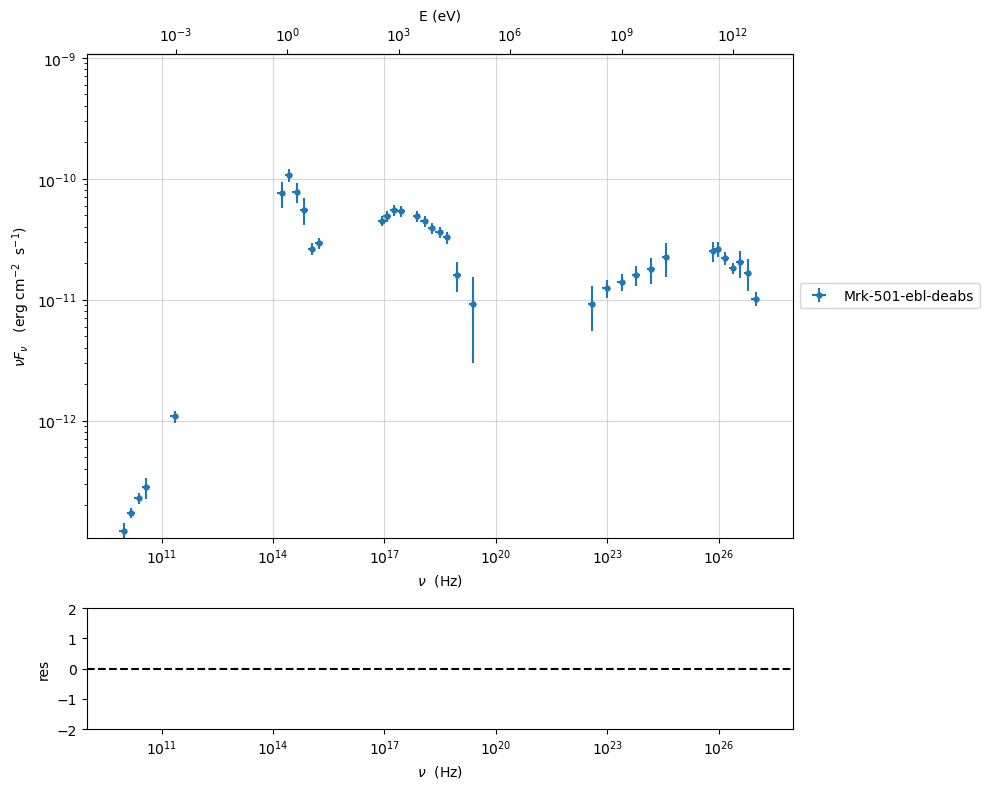

.. code:: ipython3

    sed_data.save('Mrk_501.pkl')

Phenomenological model constraining
-----------------------------------

see the :ref:`phenom_constr` user guide for further information about loading data 

Spectral indices
~~~~~~~~~~~~~~~~

.. code:: ipython3

    from jetset.sed_shaper import  SEDShape
    my_shape=SEDShape(sed_data)
    my_shape.eval_indices(silent=True)
    p=my_shape.plot_indices()
    p.setlim(y_min=1E-15,y_max=1E-6)

.. parsed-literal::

    ================================================================================
    
    *** evaluating spectral indices for data ***
    ================================================================================
    

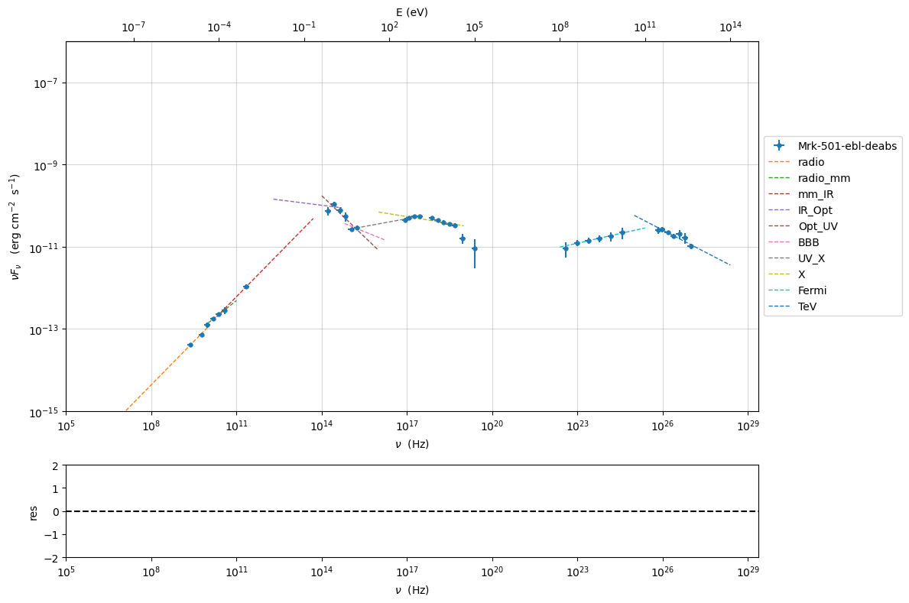

Sed shaper
~~~~~~~~~~

.. code:: ipython3

    mm,best_fit=my_shape.sync_fit(check_host_gal_template=True,
                      Ep_start=None,
                      minimizer='lsb',
                      silent=True,
                      fit_range=[10. , 21.])

.. parsed-literal::

    ================================================================================
    
    *** Log-Polynomial fitting of the synchrotron component ***
    ---> first blind fit run,  fit range: [10.0, 21.0]
    ---> class:  HSP
    
    ---> class:  HSP
    
    

.. raw:: html

    <i>Table length=6</i>
    <table id="table140622746681408-161444" class="table-striped table-bordered table-condensed">
    <thead><tr><th>model name</th><th>name</th><th>val</th><th>bestfit val</th><th>err +</th><th>err -</th><th>start val</th><th>fit range min</th><th>fit range max</th><th>frozen</th></tr></thead>
    <tr><td>LogCubic</td><td>b</td><td>-6.411143e-02</td><td>-6.411143e-02</td><td>7.838958e-03</td><td>--</td><td>-4.778764e-02</td><td>-1.000000e+01</td><td>0.000000e+00</td><td>False</td></tr>
    <tr><td>LogCubic</td><td>c</td><td>-1.751705e-03</td><td>-1.751705e-03</td><td>1.127020e-03</td><td>--</td><td>3.576201e-03</td><td>-1.000000e+01</td><td>1.000000e+01</td><td>False</td></tr>
    <tr><td>LogCubic</td><td>Ep</td><td>1.703747e+01</td><td>1.703747e+01</td><td>9.437333e-02</td><td>--</td><td>1.626870e+01</td><td>0.000000e+00</td><td>3.000000e+01</td><td>False</td></tr>
    <tr><td>LogCubic</td><td>Sp</td><td>-1.030068e+01</td><td>-1.030068e+01</td><td>1.884116e-02</td><td>--</td><td>-1.025412e+01</td><td>-3.000000e+01</td><td>0.000000e+00</td><td>False</td></tr>
    <tr><td>host_galaxy</td><td>nuFnu_p_host</td><td>-1.006556e+01</td><td>-1.006556e+01</td><td>5.462500e-02</td><td>--</td><td>-1.025412e+01</td><td>-1.225412e+01</td><td>-8.254123e+00</td><td>False</td></tr>
    <tr><td>host_galaxy</td><td>nu_scale</td><td>1.730750e-02</td><td>1.730750e-02</td><td>3.694838e-03</td><td>--</td><td>0.000000e+00</td><td>-5.000000e-01</td><td>5.000000e-01</td><td>False</td></tr>
    </table>
    

.. parsed-literal::

    ---> sync       nu_p=+1.703747e+01 (err=+9.437333e-02)  nuFnu_p=-1.030068e+01 (err=+1.884116e-02) curv.=-6.411143e-02 (err=+7.838958e-03)
    ================================================================================
    

.. code:: ipython3

    my_shape.IC_fit(fit_range=[23., 29.],minimizer='minuit',silent=True)
    p=my_shape.plot_shape_fit()
    p.setlim(y_min=1E-15)

.. parsed-literal::

    ================================================================================
    
    *** Log-Polynomial fitting of the IC component ***
    ---> fit range: [23.0, 29.0]
    ---> LogCubic fit
    
    

.. raw:: html

    <i>Table length=4</i>
    <table id="table140622746908848-580906" class="table-striped table-bordered table-condensed">
    <thead><tr><th>model name</th><th>name</th><th>val</th><th>bestfit val</th><th>err +</th><th>err -</th><th>start val</th><th>fit range min</th><th>fit range max</th><th>frozen</th></tr></thead>
    <tr><td>LogCubic</td><td>b</td><td>-1.310993e-01</td><td>-1.310993e-01</td><td>3.244183e-02</td><td>--</td><td>-1.000000e+00</td><td>-1.000000e+01</td><td>0.000000e+00</td><td>False</td></tr>
    <tr><td>LogCubic</td><td>c</td><td>-3.300446e-02</td><td>-3.300446e-02</td><td>2.072517e-02</td><td>--</td><td>-1.000000e+00</td><td>-1.000000e+01</td><td>1.000000e+01</td><td>False</td></tr>
    <tr><td>LogCubic</td><td>Ep</td><td>2.549603e+01</td><td>2.549603e+01</td><td>2.235468e-01</td><td>--</td><td>2.556357e+01</td><td>0.000000e+00</td><td>3.000000e+01</td><td>False</td></tr>
    <tr><td>LogCubic</td><td>Sp</td><td>-1.057945e+01</td><td>-1.057945e+01</td><td>4.332976e-02</td><td>--</td><td>-1.000000e+01</td><td>-3.000000e+01</td><td>0.000000e+00</td><td>False</td></tr>
    </table>
    

.. parsed-literal::

    ---> IC         nu_p=+2.549603e+01 (err=+2.235468e-01)  nuFnu_p=-1.057945e+01 (err=+4.332976e-02) curv.=-1.310993e-01 (err=+3.244183e-02)
    ================================================================================
    

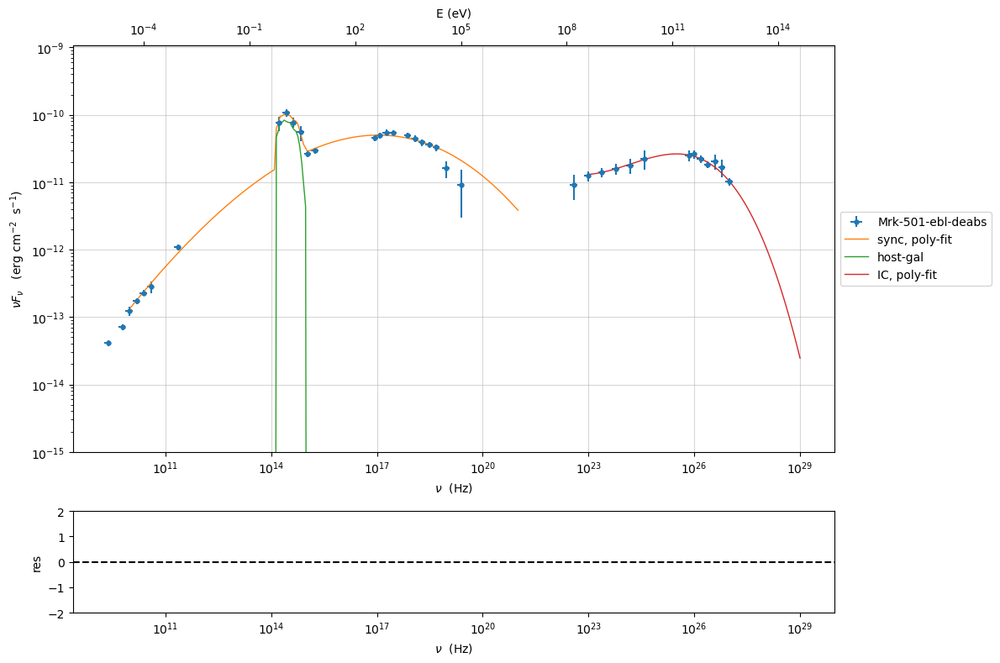

Model constraining
~~~~~~~~~~~~~~~~~~

In this step we are not fitting the model, we are just obtaining the
phenomenological ``pre_fit`` model, that will be fitted in using minuit
ore least-square bound, as shown below

.. code:: ipython3

    from jetset.obs_constrain import ObsConstrain
    from jetset.model_manager import  FitModel
    from jetset.minimizer import fit_SED
    sed_obspar=ObsConstrain(beaming=25,
                            B_range=[0.001,0.1],
                            distr_e='lppl',
                            t_var_sec=3*86400,
                            nu_cut_IR=1E11,
                            SEDShape=my_shape)
    
    
    prefit_jet=sed_obspar.constrain_SSC_model(electron_distribution_log_values=False,silent=True)
    prefit_jet.save_model('prefit_jet_gal_templ.pkl')

.. parsed-literal::

    ================================================================================
    
    ***  constrains parameters from observable ***
    

.. raw:: html

    <i>Table length=11</i>
    <table id="table140622747321488-263599" class="table-striped table-bordered table-condensed">
    <thead><tr><th>model name</th><th>name</th><th>par type</th><th>units</th><th>val</th><th>phys. bound. min</th><th>phys. bound. max</th><th>log</th><th>frozen</th></tr></thead>
    <tr><td>jet_leptonic</td><td>R</td><td>region_size</td><td>cm</td><td>1.046428e+16</td><td>1.000000e+03</td><td>1.000000e+30</td><td>False</td><td>False</td></tr>
    <tr><td>jet_leptonic</td><td>R_H</td><td>region_position</td><td>cm</td><td>1.000000e+17</td><td>0.000000e+00</td><td>--</td><td>False</td><td>True</td></tr>
    <tr><td>jet_leptonic</td><td>B</td><td>magnetic_field</td><td>gauss</td><td>5.050000e-02</td><td>0.000000e+00</td><td>--</td><td>False</td><td>False</td></tr>
    <tr><td>jet_leptonic</td><td>beam_obj</td><td>beaming</td><td>lorentz-factor*</td><td>2.500000e+01</td><td>1.000000e-04</td><td>--</td><td>False</td><td>False</td></tr>
    <tr><td>jet_leptonic</td><td>z_cosm</td><td>redshift</td><td></td><td>3.360000e-02</td><td>0.000000e+00</td><td>--</td><td>False</td><td>False</td></tr>
    <tr><td>jet_leptonic</td><td>gmin</td><td>low-energy-cut-off</td><td>lorentz-factor*</td><td>1.487509e+02</td><td>1.000000e+00</td><td>1.000000e+09</td><td>False</td><td>False</td></tr>
    <tr><td>jet_leptonic</td><td>gmax</td><td>high-energy-cut-off</td><td>lorentz-factor*</td><td>2.310708e+06</td><td>1.000000e+00</td><td>1.000000e+15</td><td>False</td><td>False</td></tr>
    <tr><td>jet_leptonic</td><td>N</td><td>emitters_density</td><td>1 / cm3</td><td>3.082271e+01</td><td>0.000000e+00</td><td>--</td><td>False</td><td>False</td></tr>
    <tr><td>jet_leptonic</td><td>gamma0_log_parab</td><td>turn-over-energy</td><td>lorentz-factor*</td><td>1.045836e+04</td><td>1.000000e+00</td><td>1.000000e+09</td><td>False</td><td>False</td></tr>
    <tr><td>jet_leptonic</td><td>s</td><td>LE_spectral_slope</td><td></td><td>2.248787e+00</td><td>-1.000000e+01</td><td>1.000000e+01</td><td>False</td><td>False</td></tr>
    <tr><td>jet_leptonic</td><td>r</td><td>spectral_curvature</td><td></td><td>3.205571e-01</td><td>-1.500000e+01</td><td>1.500000e+01</td><td>False</td><td>False</td></tr>
    </table>
    

.. parsed-literal::

    
    ================================================================================
    

.. code:: ipython3

    pl=prefit_jet.plot_model(sed_data=sed_data)
    pl.add_residual_plot(prefit_jet,sed_data)
    pl.setlim(y_min=1E-14,x_min=1E7,x_max=1E29)

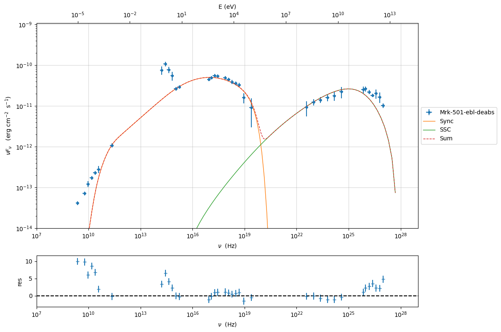

Model fitting
-------------

We remind that we can use different ``minimizers`` for the model fitting. In the following we will use the ``minuit`` minimizer and the ``lsb`` (least square bound scipy minimizer). Using ``minuit`` we notice that sometimes the fit will converge, but the quality  will not be enough (``valid==false``) to run ``minos``. Anyhow, as shown in the :ref:`MCMC sampling`, it still possible to estimate asymmetric errors by means of MCMC sampling

We freeze some parameters, and we also set some `fit_range` values. Setting fit_range can speed-up the fit convergence but should be judged by the user each time according to the physics of the particular source.

When using ``minuit`` the best strategy is to set the `fit_range` for most of the free parameters

A good strategy is to run first a `lsb` fit and then, using the same `fit_model`, run a fit with `minuit`

.. note::
   With the new implementation of composite model  (`FitModel` class) to set parameters you have to specify the model component, this is different from versions<1.1.2,
   and this holds also for the `freeze` method and for setting  `fit_range` intervals, and for the methods relate to parameters setting in general.
   See the :ref:`composite_models` user guide for further information about the new implementation of `FitModel`, in particular for parameter setting

Model fitting with LSB
~~~~~~~~~~~~~~~~~~~~~~

see the :ref:`composite_models` user guide for further information about the new implementation of `FitModel`, in particular for parameter setting

.. code:: ipython3

    from jetset.model_manager import  FitModel
    from jetset.jet_model import Jet
    
    jet_lsb=Jet.load_model('prefit_jet_gal_templ.pkl')
    jet_lsb.set_gamma_grid_size(200)

.. raw:: html

    <i>Table length=11</i>
    <table id="table140622232698352-904734" class="table-striped table-bordered table-condensed">
    <thead><tr><th>model name</th><th>name</th><th>par type</th><th>units</th><th>val</th><th>phys. bound. min</th><th>phys. bound. max</th><th>log</th><th>frozen</th></tr></thead>
    <tr><td>jet_leptonic</td><td>gmin</td><td>low-energy-cut-off</td><td>lorentz-factor*</td><td>1.487509e+02</td><td>1.000000e+00</td><td>1.000000e+09</td><td>False</td><td>False</td></tr>
    <tr><td>jet_leptonic</td><td>gmax</td><td>high-energy-cut-off</td><td>lorentz-factor*</td><td>2.310708e+06</td><td>1.000000e+00</td><td>1.000000e+15</td><td>False</td><td>False</td></tr>
    <tr><td>jet_leptonic</td><td>N</td><td>emitters_density</td><td>1 / cm3</td><td>3.082271e+01</td><td>0.000000e+00</td><td>--</td><td>False</td><td>False</td></tr>
    <tr><td>jet_leptonic</td><td>gamma0_log_parab</td><td>turn-over-energy</td><td>lorentz-factor*</td><td>1.045836e+04</td><td>1.000000e+00</td><td>1.000000e+09</td><td>False</td><td>False</td></tr>
    <tr><td>jet_leptonic</td><td>s</td><td>LE_spectral_slope</td><td></td><td>2.248787e+00</td><td>-1.000000e+01</td><td>1.000000e+01</td><td>False</td><td>False</td></tr>
    <tr><td>jet_leptonic</td><td>r</td><td>spectral_curvature</td><td></td><td>3.205571e-01</td><td>-1.500000e+01</td><td>1.500000e+01</td><td>False</td><td>False</td></tr>
    <tr><td>jet_leptonic</td><td>R</td><td>region_size</td><td>cm</td><td>1.046428e+16</td><td>1.000000e+03</td><td>1.000000e+30</td><td>False</td><td>False</td></tr>
    <tr><td>jet_leptonic</td><td>R_H</td><td>region_position</td><td>cm</td><td>1.000000e+17</td><td>0.000000e+00</td><td>--</td><td>False</td><td>True</td></tr>
    <tr><td>jet_leptonic</td><td>B</td><td>magnetic_field</td><td>gauss</td><td>5.050000e-02</td><td>0.000000e+00</td><td>--</td><td>False</td><td>False</td></tr>
    <tr><td>jet_leptonic</td><td>beam_obj</td><td>beaming</td><td>lorentz-factor*</td><td>2.500000e+01</td><td>1.000000e-04</td><td>--</td><td>False</td><td>False</td></tr>
    <tr><td>jet_leptonic</td><td>z_cosm</td><td>redshift</td><td></td><td>3.360000e-02</td><td>0.000000e+00</td><td>--</td><td>False</td><td>False</td></tr>
    </table>
    

.. code:: ipython3

    fit_model_lsb=FitModel( jet=jet_lsb, name='SSC-best-fit-lsb',template=my_shape.host_gal) 
    fit_model_lsb.show_model()

.. parsed-literal::

    
    --------------------------------------------------------------------------------
    Composite model description
    --------------------------------------------------------------------------------
    name: SSC-best-fit-lsb  
    type: composite_model  
    components models:
     -model name: jet_leptonic model type: jet
     -model name: host_galaxy model type: template
    
    --------------------------------------------------------------------------------
    individual component description
    
    --------------------------------------------------------------------------------
    jet model description
    --------------------------------------------------------------------------------
    name: jet_leptonic  
    
    electrons distribution:
     type: lppl  
     gamma energy grid size:  201
     gmin grid : 1.487509e+02
     gmax grid : 2.310708e+06
     normalization  True
     log-values  False
    
    radiative fields:
     seed photons grid size:  100
     IC emission grid size:  100
     source emissivity lower bound :  1.000000e-120
     spectral components:
       name:Sum, state: on
       name:Sync, state: self-abs
       name:SSC, state: on
    external fields transformation method: blob
    
    SED info:
     nu grid size jetkernel: 1000
     nu size: 500
     nu mix (Hz): 1.000000e+06
     nu max (Hz): 1.000000e+30
    
    flux plot lower bound   :  1.000000e-30
    
    --------------------------------------------------------------------------------

.. raw:: html

    <i>Table length=11</i>
    <table id="table140622742679504-68841" class="table-striped table-bordered table-condensed">
    <thead><tr><th>model name</th><th>name</th><th>par type</th><th>units</th><th>val</th><th>phys. bound. min</th><th>phys. bound. max</th><th>log</th><th>frozen</th></tr></thead>
    <tr><td>jet_leptonic</td><td>gmin</td><td>low-energy-cut-off</td><td>lorentz-factor*</td><td>1.487509e+02</td><td>1.000000e+00</td><td>1.000000e+09</td><td>False</td><td>False</td></tr>
    <tr><td>jet_leptonic</td><td>gmax</td><td>high-energy-cut-off</td><td>lorentz-factor*</td><td>2.310708e+06</td><td>1.000000e+00</td><td>1.000000e+15</td><td>False</td><td>False</td></tr>
    <tr><td>jet_leptonic</td><td>N</td><td>emitters_density</td><td>1 / cm3</td><td>3.082271e+01</td><td>0.000000e+00</td><td>--</td><td>False</td><td>False</td></tr>
    <tr><td>jet_leptonic</td><td>gamma0_log_parab</td><td>turn-over-energy</td><td>lorentz-factor*</td><td>1.045836e+04</td><td>1.000000e+00</td><td>1.000000e+09</td><td>False</td><td>False</td></tr>
    <tr><td>jet_leptonic</td><td>s</td><td>LE_spectral_slope</td><td></td><td>2.248787e+00</td><td>-1.000000e+01</td><td>1.000000e+01</td><td>False</td><td>False</td></tr>
    <tr><td>jet_leptonic</td><td>r</td><td>spectral_curvature</td><td></td><td>3.205571e-01</td><td>-1.500000e+01</td><td>1.500000e+01</td><td>False</td><td>False</td></tr>
    <tr><td>jet_leptonic</td><td>R</td><td>region_size</td><td>cm</td><td>1.046428e+16</td><td>1.000000e+03</td><td>1.000000e+30</td><td>False</td><td>False</td></tr>
    <tr><td>jet_leptonic</td><td>R_H</td><td>region_position</td><td>cm</td><td>1.000000e+17</td><td>0.000000e+00</td><td>--</td><td>False</td><td>True</td></tr>
    <tr><td>jet_leptonic</td><td>B</td><td>magnetic_field</td><td>gauss</td><td>5.050000e-02</td><td>0.000000e+00</td><td>--</td><td>False</td><td>False</td></tr>
    <tr><td>jet_leptonic</td><td>beam_obj</td><td>beaming</td><td>lorentz-factor*</td><td>2.500000e+01</td><td>1.000000e-04</td><td>--</td><td>False</td><td>False</td></tr>
    <tr><td>jet_leptonic</td><td>z_cosm</td><td>redshift</td><td></td><td>3.360000e-02</td><td>0.000000e+00</td><td>--</td><td>False</td><td>False</td></tr>
    </table>
    

.. parsed-literal::

    --------------------------------------------------------------------------------
    
    --------------------------------------------------------------------------------
    model description
    --------------------------------------------------------------------------------
    name: host_galaxy  
    type: template  
    
    --------------------------------------------------------------------------------

.. raw:: html

    <i>Table length=2</i>
    <table id="table140622746684624-943581" class="table-striped table-bordered table-condensed">
    <thead><tr><th>model name</th><th>name</th><th>par type</th><th>units</th><th>val</th><th>phys. bound. min</th><th>phys. bound. max</th><th>log</th><th>frozen</th></tr></thead>
    <tr><td>host_galaxy</td><td>nuFnu_p_host</td><td>nuFnu-scale</td><td>erg / (cm2 s)</td><td>-1.006556e+01</td><td>-2.000000e+01</td><td>2.000000e+01</td><td>False</td><td>False</td></tr>
    <tr><td>host_galaxy</td><td>nu_scale</td><td>nu-scale</td><td>Hz</td><td>1.730750e-02</td><td>-2.000000e+00</td><td>2.000000e+00</td><td>False</td><td>False</td></tr>
    </table>
    

.. parsed-literal::

    --------------------------------------------------------------------------------
    --------------------------------------------------------------------------------

.. note::
   Since the `jet_leptonic to model` has to be summed to the `host_galaxy` model, we do not need to define the functional form for the composite model, because
   the default compostion is the sum of all the components
   (see the :ref:`composite_models` user guide for further information about the new implementation of `FitModel`, in particular for parameter setting).
   Anyhow, we show here the definition of the model composition  for purpose of clarity

.. code:: ipython3

    fit_model_lsb.composite_expr='jet_leptonic + host_galaxy '

.. code:: ipython3

    fit_model_lsb.freeze('jet_leptonic','z_cosm')
    fit_model_lsb.freeze('jet_leptonic','R_H')
    fit_model_lsb.jet_leptonic.parameters.beam_obj.fit_range=[5., 50.]
    fit_model_lsb.jet_leptonic.parameters.R.fit_range=[10**15.5,10**17.5]
    fit_model_lsb.jet_leptonic.parameters.gmax.fit_range=[1E4,1E8]
    fit_model_lsb.host_galaxy.parameters.nuFnu_p_host.frozen=False
    fit_model_lsb.host_galaxy.parameters.nu_scale.frozen=True

.. code:: ipython3

    from jetset.minimizer import fit_SED,ModelMinimizer
    
    model_minimizer_lsb=ModelMinimizer('lsb')
    best_fit_lsb=model_minimizer_lsb.fit(fit_model_lsb,sed_data,10.0**11,10**29.0,fitname='SSC-best-fit-lsb',repeat=3)

.. parsed-literal::

    filtering data in fit range = [1.000000e+11,1.000000e+29]
    data length 31
    ================================================================================
    
    *** start fit process ***
    ----- 
    fit run: 0

.. parsed-literal::

    0it [00:00, ?it/s]

.. parsed-literal::

    - best chisq=8.37724e+00
    
    fit run: 1
    - old chisq=8.37724e+00

.. parsed-literal::

    0it [00:00, ?it/s]

.. parsed-literal::

    - best chisq=8.27149e+00
    
    fit run: 2
    - old chisq=8.27149e+00

.. parsed-literal::

    0it [00:00, ?it/s]

.. parsed-literal::

    - best chisq=8.20543e+00
    
    -------------------------------------------------------------------------
    Fit report
    
    Model: SSC-best-fit-lsb

.. raw:: html

    <i>Table length=13</i>
    <table id="table140622746683952-697915" class="table-striped table-bordered table-condensed">
    <thead><tr><th>model name</th><th>name</th><th>par type</th><th>units</th><th>val</th><th>phys. bound. min</th><th>phys. bound. max</th><th>log</th><th>frozen</th></tr></thead>
    <tr><td>jet_leptonic</td><td>gmin</td><td>low-energy-cut-off</td><td>lorentz-factor*</td><td>9.979718e+01</td><td>1.000000e+00</td><td>1.000000e+09</td><td>False</td><td>False</td></tr>
    <tr><td>jet_leptonic</td><td>gmax</td><td>high-energy-cut-off</td><td>lorentz-factor*</td><td>2.027394e+06</td><td>1.000000e+00</td><td>1.000000e+15</td><td>False</td><td>False</td></tr>
    <tr><td>jet_leptonic</td><td>N</td><td>emitters_density</td><td>1 / cm3</td><td>2.497564e+01</td><td>0.000000e+00</td><td>--</td><td>False</td><td>False</td></tr>
    <tr><td>jet_leptonic</td><td>gamma0_log_parab</td><td>turn-over-energy</td><td>lorentz-factor*</td><td>4.875701e+03</td><td>1.000000e+00</td><td>1.000000e+09</td><td>False</td><td>False</td></tr>
    <tr><td>jet_leptonic</td><td>s</td><td>LE_spectral_slope</td><td></td><td>2.163916e+00</td><td>-1.000000e+01</td><td>1.000000e+01</td><td>False</td><td>False</td></tr>
    <tr><td>jet_leptonic</td><td>r</td><td>spectral_curvature</td><td></td><td>2.218463e-01</td><td>-1.500000e+01</td><td>1.500000e+01</td><td>False</td><td>False</td></tr>
    <tr><td>jet_leptonic</td><td>R</td><td>region_size</td><td>cm</td><td>1.335860e+16</td><td>1.000000e+03</td><td>1.000000e+30</td><td>False</td><td>False</td></tr>
    <tr><td>jet_leptonic</td><td>R_H</td><td>region_position</td><td>cm</td><td>1.000000e+17</td><td>0.000000e+00</td><td>--</td><td>False</td><td>True</td></tr>
    <tr><td>jet_leptonic</td><td>B</td><td>magnetic_field</td><td>gauss</td><td>1.222382e-02</td><td>0.000000e+00</td><td>--</td><td>False</td><td>False</td></tr>
    <tr><td>jet_leptonic</td><td>beam_obj</td><td>beaming</td><td>lorentz-factor*</td><td>4.467144e+01</td><td>1.000000e-04</td><td>--</td><td>False</td><td>False</td></tr>
    <tr><td>jet_leptonic</td><td>z_cosm</td><td>redshift</td><td></td><td>3.360000e-02</td><td>0.000000e+00</td><td>--</td><td>False</td><td>True</td></tr>
    <tr><td>host_galaxy</td><td>nuFnu_p_host</td><td>nuFnu-scale</td><td>erg / (cm2 s)</td><td>-1.005911e+01</td><td>-2.000000e+01</td><td>2.000000e+01</td><td>False</td><td>False</td></tr>
    <tr><td>host_galaxy</td><td>nu_scale</td><td>nu-scale</td><td>Hz</td><td>1.730750e-02</td><td>-2.000000e+00</td><td>2.000000e+00</td><td>False</td><td>True</td></tr>
    </table>
    

.. parsed-literal::

    
    converged=True
    calls=75
    mesg=

.. parsed-literal::

    'The relative error between two consecutive iterates is at most 0.000000'

.. parsed-literal::

    dof=21
    chisq=8.205429, chisq/red=0.390735 null hypothesis sig=0.994210
    
    best fit pars

.. raw:: html

    <i>Table length=13</i>
    <table id="table140622734811680-75568" class="table-striped table-bordered table-condensed">
    <thead><tr><th>model name</th><th>name</th><th>val</th><th>bestfit val</th><th>err +</th><th>err -</th><th>start val</th><th>fit range min</th><th>fit range max</th><th>frozen</th></tr></thead>
    <tr><td>jet_leptonic</td><td>gmin</td><td>9.979718e+01</td><td>9.979718e+01</td><td>1.973688e+02</td><td>--</td><td>1.487509e+02</td><td>1.000000e+00</td><td>1.000000e+09</td><td>False</td></tr>
    <tr><td>jet_leptonic</td><td>gmax</td><td>2.027394e+06</td><td>2.027394e+06</td><td>1.339381e+06</td><td>--</td><td>2.310708e+06</td><td>1.000000e+04</td><td>1.000000e+08</td><td>False</td></tr>
    <tr><td>jet_leptonic</td><td>N</td><td>2.497564e+01</td><td>2.497564e+01</td><td>7.243329e+01</td><td>--</td><td>3.082271e+01</td><td>0.000000e+00</td><td>--</td><td>False</td></tr>
    <tr><td>jet_leptonic</td><td>gamma0_log_parab</td><td>4.875701e+03</td><td>4.875701e+03</td><td>1.519095e+04</td><td>--</td><td>1.045836e+04</td><td>1.000000e+00</td><td>1.000000e+09</td><td>False</td></tr>
    <tr><td>jet_leptonic</td><td>s</td><td>2.163916e+00</td><td>2.163916e+00</td><td>4.165962e-01</td><td>--</td><td>2.248787e+00</td><td>-1.000000e+01</td><td>1.000000e+01</td><td>False</td></tr>
    <tr><td>jet_leptonic</td><td>r</td><td>2.218463e-01</td><td>2.218463e-01</td><td>4.038740e-02</td><td>--</td><td>3.205571e-01</td><td>-1.500000e+01</td><td>1.500000e+01</td><td>False</td></tr>
    <tr><td>jet_leptonic</td><td>R</td><td>1.335860e+16</td><td>1.335860e+16</td><td>2.449660e+16</td><td>--</td><td>1.046428e+16</td><td>3.162278e+15</td><td>3.162278e+17</td><td>False</td></tr>
    <tr><td>jet_leptonic</td><td>R_H</td><td>1.000000e+17</td><td>--</td><td>--</td><td>--</td><td>1.000000e+17</td><td>0.000000e+00</td><td>--</td><td>True</td></tr>
    <tr><td>jet_leptonic</td><td>B</td><td>1.222382e-02</td><td>1.222382e-02</td><td>8.321098e-03</td><td>--</td><td>5.050000e-02</td><td>0.000000e+00</td><td>--</td><td>False</td></tr>
    <tr><td>jet_leptonic</td><td>beam_obj</td><td>4.467144e+01</td><td>4.467144e+01</td><td>2.951759e+01</td><td>--</td><td>2.500000e+01</td><td>5.000000e+00</td><td>5.000000e+01</td><td>False</td></tr>
    <tr><td>jet_leptonic</td><td>z_cosm</td><td>3.360000e-02</td><td>--</td><td>--</td><td>--</td><td>3.360000e-02</td><td>0.000000e+00</td><td>--</td><td>True</td></tr>
    <tr><td>host_galaxy</td><td>nuFnu_p_host</td><td>-1.005911e+01</td><td>-1.005911e+01</td><td>3.263911e-02</td><td>--</td><td>-1.006556e+01</td><td>-1.225412e+01</td><td>-8.254123e+00</td><td>False</td></tr>
    <tr><td>host_galaxy</td><td>nu_scale</td><td>1.730750e-02</td><td>--</td><td>--</td><td>--</td><td>1.730750e-02</td><td>-5.000000e-01</td><td>5.000000e-01</td><td>True</td></tr>
    </table>
    

.. parsed-literal::

    -------------------------------------------------------------------------
    
    ================================================================================
    

.. code:: ipython3

    best_fit_lsb.save_report('SSC-best-fit-lsb.pkl')
    model_minimizer_lsb.save_model('model_minimizer_lsb.pkl')
    fit_model_lsb.save_model('fit_model_lsb.pkl')
    
    best_fit_lsb.bestfit_table

.. raw:: html

    <i>Table length=13</i>
    <table id="table140622742679360" class="table-striped table-bordered table-condensed">
    <thead><tr><th>model name</th><th>name</th><th>val</th><th>bestfit val</th><th>err +</th><th>err -</th><th>start val</th><th>fit range min</th><th>fit range max</th><th>frozen</th></tr></thead>
    <thead><tr><th>str12</th><th>str16</th><th>float64</th><th>float64</th><th>float64</th><th>float64</th><th>float64</th><th>float64</th><th>float64</th><th>bool</th></tr></thead>
    <tr><td>jet_leptonic</td><td>gmin</td><td>9.979718e+01</td><td>9.979718e+01</td><td>1.973688e+02</td><td>--</td><td>1.487509e+02</td><td>1.000000e+00</td><td>1.000000e+09</td><td>False</td></tr>
    <tr><td>jet_leptonic</td><td>gmax</td><td>2.027394e+06</td><td>2.027394e+06</td><td>1.339381e+06</td><td>--</td><td>2.310708e+06</td><td>1.000000e+04</td><td>1.000000e+08</td><td>False</td></tr>
    <tr><td>jet_leptonic</td><td>N</td><td>2.497564e+01</td><td>2.497564e+01</td><td>7.243329e+01</td><td>--</td><td>3.082271e+01</td><td>0.000000e+00</td><td>--</td><td>False</td></tr>
    <tr><td>jet_leptonic</td><td>gamma0_log_parab</td><td>4.875701e+03</td><td>4.875701e+03</td><td>1.519095e+04</td><td>--</td><td>1.045836e+04</td><td>1.000000e+00</td><td>1.000000e+09</td><td>False</td></tr>
    <tr><td>jet_leptonic</td><td>s</td><td>2.163916e+00</td><td>2.163916e+00</td><td>4.165962e-01</td><td>--</td><td>2.248787e+00</td><td>-1.000000e+01</td><td>1.000000e+01</td><td>False</td></tr>
    <tr><td>jet_leptonic</td><td>r</td><td>2.218463e-01</td><td>2.218463e-01</td><td>4.038740e-02</td><td>--</td><td>3.205571e-01</td><td>-1.500000e+01</td><td>1.500000e+01</td><td>False</td></tr>
    <tr><td>jet_leptonic</td><td>R</td><td>1.335860e+16</td><td>1.335860e+16</td><td>2.449660e+16</td><td>--</td><td>1.046428e+16</td><td>3.162278e+15</td><td>3.162278e+17</td><td>False</td></tr>
    <tr><td>jet_leptonic</td><td>R_H</td><td>1.000000e+17</td><td>--</td><td>--</td><td>--</td><td>1.000000e+17</td><td>0.000000e+00</td><td>--</td><td>True</td></tr>
    <tr><td>jet_leptonic</td><td>B</td><td>1.222382e-02</td><td>1.222382e-02</td><td>8.321098e-03</td><td>--</td><td>5.050000e-02</td><td>0.000000e+00</td><td>--</td><td>False</td></tr>
    <tr><td>jet_leptonic</td><td>beam_obj</td><td>4.467144e+01</td><td>4.467144e+01</td><td>2.951759e+01</td><td>--</td><td>2.500000e+01</td><td>5.000000e+00</td><td>5.000000e+01</td><td>False</td></tr>
    <tr><td>jet_leptonic</td><td>z_cosm</td><td>3.360000e-02</td><td>--</td><td>--</td><td>--</td><td>3.360000e-02</td><td>0.000000e+00</td><td>--</td><td>True</td></tr>
    <tr><td>host_galaxy</td><td>nuFnu_p_host</td><td>-1.005911e+01</td><td>-1.005911e+01</td><td>3.263911e-02</td><td>--</td><td>-1.006556e+01</td><td>-1.225412e+01</td><td>-8.254123e+00</td><td>False</td></tr>
    <tr><td>host_galaxy</td><td>nu_scale</td><td>1.730750e-02</td><td>--</td><td>--</td><td>--</td><td>1.730750e-02</td><td>-5.000000e-01</td><td>5.000000e-01</td><td>True</td></tr>
    </table>

.. code:: ipython3

    %matplotlib inline
    fit_model_lsb.set_nu_grid(1E6,1E30,200)
    fit_model_lsb.eval()
    p2=fit_model_lsb.plot_model(sed_data=sed_data)
    p2.setlim(y_min=1E-14,x_min=1E6,x_max=2E28)

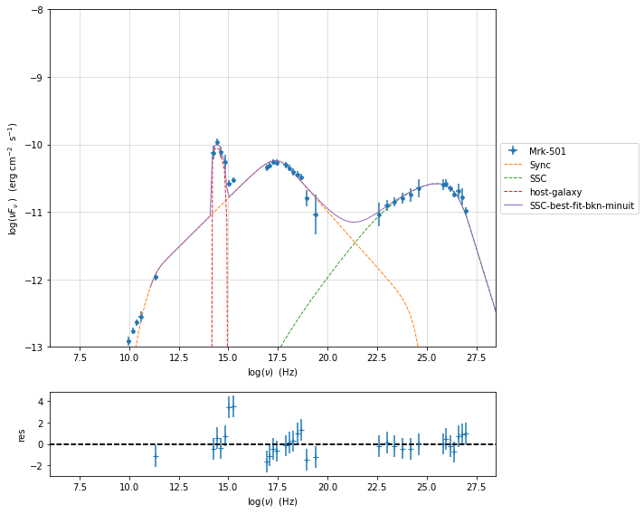

Model fitting with Minuit
~~~~~~~~~~~~~~~~~~~~~~~~~

.. code:: ipython3

    jet_minuit=Jet.load_model('prefit_jet_gal_templ.pkl')
    jet_minuit.set_gamma_grid_size(200)

.. raw:: html

    <i>Table length=11</i>
    <table id="table140622254955440-253927" class="table-striped table-bordered table-condensed">
    <thead><tr><th>model name</th><th>name</th><th>par type</th><th>units</th><th>val</th><th>phys. bound. min</th><th>phys. bound. max</th><th>log</th><th>frozen</th></tr></thead>
    <tr><td>jet_leptonic</td><td>gmin</td><td>low-energy-cut-off</td><td>lorentz-factor*</td><td>1.487509e+02</td><td>1.000000e+00</td><td>1.000000e+09</td><td>False</td><td>False</td></tr>
    <tr><td>jet_leptonic</td><td>gmax</td><td>high-energy-cut-off</td><td>lorentz-factor*</td><td>2.310708e+06</td><td>1.000000e+00</td><td>1.000000e+15</td><td>False</td><td>False</td></tr>
    <tr><td>jet_leptonic</td><td>N</td><td>emitters_density</td><td>1 / cm3</td><td>3.082271e+01</td><td>0.000000e+00</td><td>--</td><td>False</td><td>False</td></tr>
    <tr><td>jet_leptonic</td><td>gamma0_log_parab</td><td>turn-over-energy</td><td>lorentz-factor*</td><td>1.045836e+04</td><td>1.000000e+00</td><td>1.000000e+09</td><td>False</td><td>False</td></tr>
    <tr><td>jet_leptonic</td><td>s</td><td>LE_spectral_slope</td><td></td><td>2.248787e+00</td><td>-1.000000e+01</td><td>1.000000e+01</td><td>False</td><td>False</td></tr>
    <tr><td>jet_leptonic</td><td>r</td><td>spectral_curvature</td><td></td><td>3.205571e-01</td><td>-1.500000e+01</td><td>1.500000e+01</td><td>False</td><td>False</td></tr>
    <tr><td>jet_leptonic</td><td>R</td><td>region_size</td><td>cm</td><td>1.046428e+16</td><td>1.000000e+03</td><td>1.000000e+30</td><td>False</td><td>False</td></tr>
    <tr><td>jet_leptonic</td><td>R_H</td><td>region_position</td><td>cm</td><td>1.000000e+17</td><td>0.000000e+00</td><td>--</td><td>False</td><td>True</td></tr>
    <tr><td>jet_leptonic</td><td>B</td><td>magnetic_field</td><td>gauss</td><td>5.050000e-02</td><td>0.000000e+00</td><td>--</td><td>False</td><td>False</td></tr>
    <tr><td>jet_leptonic</td><td>beam_obj</td><td>beaming</td><td>lorentz-factor*</td><td>2.500000e+01</td><td>1.000000e-04</td><td>--</td><td>False</td><td>False</td></tr>
    <tr><td>jet_leptonic</td><td>z_cosm</td><td>redshift</td><td></td><td>3.360000e-02</td><td>0.000000e+00</td><td>--</td><td>False</td><td>False</td></tr>
    </table>
    

To run the ``minuit`` minimizer we will use the best-fit results from
``lsb`` to set the boundaries for our parameters.

.. code:: ipython3

    fit_model_minuit=FitModel( jet=jet_minuit, name='SSC-best-fit-minuit',template=my_shape.host_gal) 
    fit_model_minuit.show_model_components()
    fit_model_minuit.freeze('jet_leptonic','z_cosm')
    fit_model_minuit.freeze('jet_leptonic','R_H')
    fit_model_minuit.jet_leptonic.parameters.beam_obj.fit_range=[5., 50.]
    fit_model_minuit.jet_leptonic.parameters.R.fit_range=[10**15.5,10**17.5]
    fit_model_minuit.host_galaxy.parameters.nuFnu_p_host.frozen=False
    fit_model_minuit.host_galaxy.parameters.nu_scale.frozen=True
    fit_model_minuit.jet_leptonic.parameters.gmin.fit_range=[10,1000]
    fit_model_minuit.jet_leptonic.parameters.gmax.fit_range=[5E5,1E8]
    fit_model_minuit.jet_leptonic.parameters.gamma0_log_parab.fit_range=[1E3,5E5]
    
    model_minimizer_minuit=ModelMinimizer('minuit')
    best_fit_minuit=model_minimizer_minuit.fit(fit_model_minuit,sed_data,10.0**11,10**29.0,fitname='SSC-best-fit-minuit',repeat=3)

.. parsed-literal::

    
    --------------------------------------------------------------------------------
    Composite model description
    --------------------------------------------------------------------------------
    name: SSC-best-fit-minuit  
    type: composite_model  
    components models:
     -model name: jet_leptonic model type: jet
     -model name: host_galaxy model type: template
    
    --------------------------------------------------------------------------------
    filtering data in fit range = [1.000000e+11,1.000000e+29]
    data length 31
    ================================================================================
    
    *** start fit process ***
    ----- 
    fit run: 0

.. parsed-literal::

    0it [00:00, ?it/s]

.. parsed-literal::

    - best chisq=8.12554e+00
    
    fit run: 1
    - old chisq=8.12554e+00

.. parsed-literal::

    0it [00:00, ?it/s]

.. parsed-literal::

    - best chisq=8.12546e+00
    
    fit run: 2
    - old chisq=8.12546e+00

.. parsed-literal::

    0it [00:00, ?it/s]

.. parsed-literal::

    - best chisq=8.12543e+00
    
    -------------------------------------------------------------------------
    Fit report
    
    Model: SSC-best-fit-minuit

.. raw:: html

    <i>Table length=13</i>
    <table id="table140622254443872-362960" class="table-striped table-bordered table-condensed">
    <thead><tr><th>model name</th><th>name</th><th>par type</th><th>units</th><th>val</th><th>phys. bound. min</th><th>phys. bound. max</th><th>log</th><th>frozen</th></tr></thead>
    <tr><td>jet_leptonic</td><td>gmin</td><td>low-energy-cut-off</td><td>lorentz-factor*</td><td>7.837482e+01</td><td>1.000000e+00</td><td>1.000000e+09</td><td>False</td><td>False</td></tr>
    <tr><td>jet_leptonic</td><td>gmax</td><td>high-energy-cut-off</td><td>lorentz-factor*</td><td>2.168678e+06</td><td>1.000000e+00</td><td>1.000000e+15</td><td>False</td><td>False</td></tr>
    <tr><td>jet_leptonic</td><td>N</td><td>emitters_density</td><td>1 / cm3</td><td>2.553272e+01</td><td>0.000000e+00</td><td>--</td><td>False</td><td>False</td></tr>
    <tr><td>jet_leptonic</td><td>gamma0_log_parab</td><td>turn-over-energy</td><td>lorentz-factor*</td><td>3.124494e+03</td><td>1.000000e+00</td><td>1.000000e+09</td><td>False</td><td>False</td></tr>
    <tr><td>jet_leptonic</td><td>s</td><td>LE_spectral_slope</td><td></td><td>2.115881e+00</td><td>-1.000000e+01</td><td>1.000000e+01</td><td>False</td><td>False</td></tr>
    <tr><td>jet_leptonic</td><td>r</td><td>spectral_curvature</td><td></td><td>2.090576e-01</td><td>-1.500000e+01</td><td>1.500000e+01</td><td>False</td><td>False</td></tr>
    <tr><td>jet_leptonic</td><td>R</td><td>region_size</td><td>cm</td><td>1.530522e+16</td><td>1.000000e+03</td><td>1.000000e+30</td><td>False</td><td>False</td></tr>
    <tr><td>jet_leptonic</td><td>R_H</td><td>region_position</td><td>cm</td><td>1.000000e+17</td><td>0.000000e+00</td><td>--</td><td>False</td><td>True</td></tr>
    <tr><td>jet_leptonic</td><td>B</td><td>magnetic_field</td><td>gauss</td><td>1.099348e-02</td><td>0.000000e+00</td><td>--</td><td>False</td><td>False</td></tr>
    <tr><td>jet_leptonic</td><td>beam_obj</td><td>beaming</td><td>lorentz-factor*</td><td>4.413328e+01</td><td>1.000000e-04</td><td>--</td><td>False</td><td>False</td></tr>
    <tr><td>jet_leptonic</td><td>z_cosm</td><td>redshift</td><td></td><td>3.360000e-02</td><td>0.000000e+00</td><td>--</td><td>False</td><td>True</td></tr>
    <tr><td>host_galaxy</td><td>nuFnu_p_host</td><td>nuFnu-scale</td><td>erg / (cm2 s)</td><td>-1.006274e+01</td><td>-2.000000e+01</td><td>2.000000e+01</td><td>False</td><td>False</td></tr>
    <tr><td>host_galaxy</td><td>nu_scale</td><td>nu-scale</td><td>Hz</td><td>1.730750e-02</td><td>-2.000000e+00</td><td>2.000000e+00</td><td>False</td><td>True</td></tr>
    </table>
    

.. parsed-literal::

    
    converged=True
    calls=196
    mesg=

.. raw:: html

    <table>
        <tr>
            <td colspan="2" style="text-align:left" title="Minimum value of function"> FCN = 8.125 </td>
            <td colspan="3" style="text-align:center" title="No. of function evaluations in last call and total number"> Nfcn = 196 </td>
        </tr>
        <tr>
            <td colspan="2" style="text-align:left" title="Estimated distance to minimum and goal"> EDM = 0.000148 (Goal: 0.0002) </td>
            <td colspan="3" style="text-align:center" title="No. of gradient evaluations in last call and total number">  </td>
        </tr>
        <tr>
            <td style="text-align:center;background-color:#92CCA6;color:black"> Valid Minimum </td>
            <td style="text-align:center;background-color:#92CCA6;color:black"> Valid Parameters </td>
            <td colspan="3" style="text-align:center;background-color:#92CCA6;color:black"> No Parameters at limit </td>
        </tr>
        <tr>
            <td colspan="2" style="text-align:center;background-color:#92CCA6;color:black"> Below EDM threshold (goal x 10) </td>
            <td colspan="3" style="text-align:center;background-color:#92CCA6;color:black"> Below call limit </td>
        </tr>
        <tr>
            <td style="text-align:center;background-color:#92CCA6;color:black"> Covariance </td>
            <td style="text-align:center;background-color:#92CCA6;color:black"> Hesse ok </td>
            <td style="text-align:center;background-color:#FFF79A;color:black" title="Is covariance matrix accurate?"> APPROXIMATE </td>
            <td style="text-align:center;background-color:#c15ef7;color:black" title="Is covariance matrix positive definite?"> NOT pos. def. </td>
            <td style="text-align:center;background-color:#c15ef7;color:black" title="Was positive definiteness enforced by Minuit?"> FORCED </td>
        </tr>
    </table><table>
        <tr>
            <td></td>
            <th title="Variable name"> Name </th>
            <th title="Value of parameter"> Value </th>
            <th title="Hesse error"> Hesse Error </th>
            <th title="Minos lower error"> Minos Error- </th>
            <th title="Minos upper error"> Minos Error+ </th>
            <th title="Lower limit of the parameter"> Limit- </th>
            <th title="Upper limit of the parameter"> Limit+ </th>
            <th title="Is the parameter fixed in the fit"> Fixed </th>
        </tr>
        <tr>
            <th> 0 </th>
            <td> par_0 </td>
            <td> 78 </td>
            <td> 8 </td>
            <td>  </td>
            <td>  </td>
            <td> 10 </td>
            <td> 1E+03 </td>
            <td>  </td>
        </tr>
        <tr>
            <th> 1 </th>
            <td> par_1 </td>
            <td> 2.17e6 </td>
            <td> 0.04e6 </td>
            <td>  </td>
            <td>  </td>
            <td> 5E+05 </td>
            <td> 1E+08 </td>
            <td>  </td>
        </tr>
        <tr>
            <th> 2 </th>
            <td> par_2 </td>
            <td> 25.5 </td>
            <td> 2.0 </td>
            <td>  </td>
            <td>  </td>
            <td> 0 </td>
            <td>  </td>
            <td>  </td>
        </tr>
        <tr>
            <th> 3 </th>
            <td> par_3 </td>
            <td> 3.1e3 </td>
            <td> 0.4e3 </td>
            <td>  </td>
            <td>  </td>
            <td> 1E+03 </td>
            <td> 5E+05 </td>
            <td>  </td>
        </tr>
        <tr>
            <th> 4 </th>
            <td> par_4 </td>
            <td> 2.116 </td>
            <td> 0.017 </td>
            <td>  </td>
            <td>  </td>
            <td> -10 </td>
            <td> 10 </td>
            <td>  </td>
        </tr>
        <tr>
            <th> 5 </th>
            <td> par_5 </td>
            <td> 0.209 </td>
            <td> 0.008 </td>
            <td>  </td>
            <td>  </td>
            <td> -15 </td>
            <td> 15 </td>
            <td>  </td>
        </tr>
        <tr>
            <th> 6 </th>
            <td> par_6 </td>
            <td> 15.3e15 </td>
            <td> 0.7e15 </td>
            <td>  </td>
            <td>  </td>
            <td> 3.16E+15 </td>
            <td> 3.16E+17 </td>
            <td>  </td>
        </tr>
        <tr>
            <th> 7 </th>
            <td> par_7 </td>
            <td> 11.0e-3 </td>
            <td> 0.6e-3 </td>
            <td>  </td>
            <td>  </td>
            <td> 0 </td>
            <td>  </td>
            <td>  </td>
        </tr>
        <tr>
            <th> 8 </th>
            <td> par_8 </td>
            <td> 44.1 </td>
            <td> 1.1 </td>
            <td>  </td>
            <td>  </td>
            <td> 5 </td>
            <td> 50 </td>
            <td>  </td>
        </tr>
        <tr>
            <th> 9 </th>
            <td> par_9 </td>
            <td> -10.06 </td>
            <td> 0.05 </td>
            <td>  </td>
            <td>  </td>
            <td> -12.3 </td>
            <td> -8.25 </td>
            <td>  </td>
        </tr>
    </table><table>
        <tr>
            <td></td>
            <th> par_0 </th>
            <th> par_1 </th>
            <th> par_2 </th>
            <th> par_3 </th>
            <th> par_4 </th>
            <th> par_5 </th>
            <th> par_6 </th>
            <th> par_7 </th>
            <th> par_8 </th>
            <th> par_9 </th>
        </tr>
        <tr>
            <th> par_0 </th>
            <td> 61.3 </td>
            <td style="background-color:rgb(250,109,109);color:black"> 2.83e+05 <strong>(0.937)</strong> </td>
            <td style="background-color:rgb(196,196,250);color:black"> -6.49 <strong>(-0.414)</strong> </td>
            <td style="background-color:rgb(250,198,198);color:black"> 1.19e+03 <strong>(0.346)</strong> </td>
            <td style="background-color:rgb(250,180,180);color:black"> 0.0606 <strong>(0.469)</strong> </td>
            <td style="background-color:rgb(250,183,183);color:black"> 0.0279 <strong>(0.449)</strong> </td>
            <td style="background-color:rgb(155,155,250);color:black"> -4.01e+15 <strong>(-0.731)</strong> </td>
            <td style="background-color:rgb(250,106,106);color:black"> 0.00477 <strong>(0.957)</strong> </td>
            <td style="background-color:rgb(193,193,250);color:black"> -3.79 <strong>(-0.441)</strong> </td>
            <td style="background-color:rgb(247,247,250);color:black"> -0.00799 <strong>(-0.020)</strong> </td>
        </tr>
        <tr>
            <th> par_1 </th>
            <td style="background-color:rgb(250,109,109);color:black"> 2.83e+05 <strong>(0.937)</strong> </td>
            <td> 1.49e+09 </td>
            <td style="background-color:rgb(200,200,250);color:black"> -2.96e+04 <strong>(-0.383)</strong> </td>
            <td style="background-color:rgb(250,201,201);color:black"> 5.54e+06 <strong>(0.326)</strong> </td>
            <td style="background-color:rgb(250,184,184);color:black"> 282 <strong>(0.443)</strong> </td>
            <td style="background-color:rgb(250,187,187);color:black"> 128 <strong>(0.418)</strong> </td>
            <td style="background-color:rgb(161,161,250);color:black"> -1.85e+19 <strong>(-0.685)</strong> </td>
            <td style="background-color:rgb(250,119,119);color:black"> 21.4 <strong>(0.871)</strong> </td>
            <td style="background-color:rgb(199,199,250);color:black"> -1.66e+04 <strong>(-0.392)</strong> </td>
            <td style="background-color:rgb(248,248,250);color:black"> -34.8 <strong>(-0.018)</strong> </td>
        </tr>
        <tr>
            <th> par_2 </th>
            <td style="background-color:rgb(196,196,250);color:black"> -6.49 <strong>(-0.414)</strong> </td>
            <td style="background-color:rgb(200,200,250);color:black"> -2.96e+04 <strong>(-0.383)</strong> </td>
            <td> 4.01 </td>
            <td style="background-color:rgb(250,236,236);color:black"> 85.2 <strong>(0.097)</strong> </td>
            <td style="background-color:rgb(250,207,207);color:black"> 0.00939 <strong>(0.284)</strong> </td>
            <td style="background-color:rgb(232,232,250);color:black"> -0.00219 <strong>(-0.138)</strong> </td>
            <td style="background-color:rgb(247,247,250);color:black"> -3.45e+13 <strong>(-0.025)</strong> </td>
            <td style="background-color:rgb(199,199,250);color:black"> -0.000505 <strong>(-0.396)</strong> </td>
            <td style="background-color:rgb(250,215,215);color:black"> 0.515 <strong>(0.234)</strong> </td>
            <td style="background-color:rgb(250,248,248);color:black"> 0.00106 <strong>(0.011)</strong> </td>
        </tr>
        <tr>
            <th> par_3 </th>
            <td style="background-color:rgb(250,198,198);color:black"> 1.19e+03 <strong>(0.346)</strong> </td>
            <td style="background-color:rgb(250,201,201);color:black"> 5.54e+06 <strong>(0.326)</strong> </td>
            <td style="background-color:rgb(250,236,236);color:black"> 85.2 <strong>(0.097)</strong> </td>
            <td> 1.94e+05 </td>
            <td style="background-color:rgb(250,140,140);color:black"> 5.33 <strong>(0.733)</strong> </td>
            <td style="background-color:rgb(250,149,149);color:black"> 2.36 <strong>(0.676)</strong> </td>
            <td style="background-color:rgb(208,208,250);color:black"> -9.98e+16 <strong>(-0.324)</strong> </td>
            <td style="background-color:rgb(250,200,200);color:black"> 0.0937 <strong>(0.334)</strong> </td>
            <td style="background-color:rgb(226,226,250);color:black"> -90.9 <strong>(-0.188)</strong> </td>
            <td style="background-color:rgb(250,250,250);color:black"> 0.0499 <strong>(0.002)</strong> </td>
        </tr>
        <tr>
            <th> par_4 </th>
            <td style="background-color:rgb(250,180,180);color:black"> 0.0606 <strong>(0.469)</strong> </td>
            <td style="background-color:rgb(250,184,184);color:black"> 282 <strong>(0.443)</strong> </td>
            <td style="background-color:rgb(250,207,207);color:black"> 0.00939 <strong>(0.284)</strong> </td>
            <td style="background-color:rgb(250,140,140);color:black"> 5.33 <strong>(0.733)</strong> </td>
            <td> 0.000273 </td>
            <td style="background-color:rgb(250,198,198);color:black"> 4.51e-05 <strong>(0.344)</strong> </td>
            <td style="background-color:rgb(199,199,250);color:black"> -4.53e+12 <strong>(-0.392)</strong> </td>
            <td style="background-color:rgb(250,184,184);color:black"> 4.64e-06 <strong>(0.441)</strong> </td>
            <td style="background-color:rgb(232,232,250);color:black"> -0.00244 <strong>(-0.135)</strong> </td>
            <td style="background-color:rgb(248,248,250);color:black"> -1.15e-05 <strong>(-0.014)</strong> </td>
        </tr>
        <tr>
            <th> par_5 </th>
            <td style="background-color:rgb(250,183,183);color:black"> 0.0279 <strong>(0.449)</strong> </td>
            <td style="background-color:rgb(250,187,187);color:black"> 128 <strong>(0.418)</strong> </td>
            <td style="background-color:rgb(232,232,250);color:black"> -0.00219 <strong>(-0.138)</strong> </td>
            <td style="background-color:rgb(250,149,149);color:black"> 2.36 <strong>(0.676)</strong> </td>
            <td style="background-color:rgb(250,198,198);color:black"> 4.51e-05 <strong>(0.344)</strong> </td>
            <td> 6.3e-05 </td>
            <td style="background-color:rgb(201,201,250);color:black"> -2.11e+12 <strong>(-0.381)</strong> </td>
            <td style="background-color:rgb(250,181,181);color:black"> 2.32e-06 <strong>(0.458)</strong> </td>
            <td style="background-color:rgb(245,245,250);color:black"> -0.000316 <strong>(-0.036)</strong> </td>
            <td style="background-color:rgb(243,243,250);color:black"> -2.11e-05 <strong>(-0.053)</strong> </td>
        </tr>
        <tr>
            <th> par_6 </th>
            <td style="background-color:rgb(155,155,250);color:black"> -4.01e+15 <strong>(-0.731)</strong> </td>
            <td style="background-color:rgb(161,161,250);color:black"> -1.85e+19 <strong>(-0.685)</strong> </td>
            <td style="background-color:rgb(247,247,250);color:black"> -3.45e+13 <strong>(-0.025)</strong> </td>
            <td style="background-color:rgb(208,208,250);color:black"> -9.98e+16 <strong>(-0.324)</strong> </td>
            <td style="background-color:rgb(199,199,250);color:black"> -4.53e+12 <strong>(-0.392)</strong> </td>
            <td style="background-color:rgb(201,201,250);color:black"> -2.11e+12 <strong>(-0.381)</strong> </td>
            <td> 4.89e+29 </td>
            <td style="background-color:rgb(156,156,250);color:black"> -3.22e+11 <strong>(-0.724)</strong> </td>
            <td style="background-color:rgb(248,248,250);color:black"> -1.38e+13 <strong>(-0.018)</strong> </td>
            <td style="background-color:rgb(250,250,250);color:black"> 6.25e+10 <strong>(0.002)</strong> </td>
        </tr>
        <tr>
            <th> par_7 </th>
            <td style="background-color:rgb(250,106,106);color:black"> 0.00477 <strong>(0.957)</strong> </td>
            <td style="background-color:rgb(250,119,119);color:black"> 21.4 <strong>(0.871)</strong> </td>
            <td style="background-color:rgb(199,199,250);color:black"> -0.000505 <strong>(-0.396)</strong> </td>
            <td style="background-color:rgb(250,200,200);color:black"> 0.0937 <strong>(0.334)</strong> </td>
            <td style="background-color:rgb(250,184,184);color:black"> 4.64e-06 <strong>(0.441)</strong> </td>
            <td style="background-color:rgb(250,181,181);color:black"> 2.32e-06 <strong>(0.458)</strong> </td>
            <td style="background-color:rgb(156,156,250);color:black"> -3.22e+11 <strong>(-0.724)</strong> </td>
            <td> 4.05e-07 </td>
            <td style="background-color:rgb(189,189,250);color:black"> -0.000327 <strong>(-0.468)</strong> </td>
            <td style="background-color:rgb(247,247,250);color:black"> -7.07e-07 <strong>(-0.022)</strong> </td>
        </tr>
        <tr>
            <th> par_8 </th>
            <td style="background-color:rgb(193,193,250);color:black"> -3.79 <strong>(-0.441)</strong> </td>
            <td style="background-color:rgb(199,199,250);color:black"> -1.66e+04 <strong>(-0.392)</strong> </td>
            <td style="background-color:rgb(250,215,215);color:black"> 0.515 <strong>(0.234)</strong> </td>
            <td style="background-color:rgb(226,226,250);color:black"> -90.9 <strong>(-0.188)</strong> </td>
            <td style="background-color:rgb(232,232,250);color:black"> -0.00244 <strong>(-0.135)</strong> </td>
            <td style="background-color:rgb(245,245,250);color:black"> -0.000316 <strong>(-0.036)</strong> </td>
            <td style="background-color:rgb(248,248,250);color:black"> -1.38e+13 <strong>(-0.018)</strong> </td>
            <td style="background-color:rgb(189,189,250);color:black"> -0.000327 <strong>(-0.468)</strong> </td>
            <td> 1.2 </td>
            <td style="background-color:rgb(245,245,250);color:black"> -0.00197 <strong>(-0.036)</strong> </td>
        </tr>
        <tr>
            <th> par_9 </th>
            <td style="background-color:rgb(247,247,250);color:black"> -0.00799 <strong>(-0.020)</strong> </td>
            <td style="background-color:rgb(248,248,250);color:black"> -34.8 <strong>(-0.018)</strong> </td>
            <td style="background-color:rgb(250,248,248);color:black"> 0.00106 <strong>(0.011)</strong> </td>
            <td style="background-color:rgb(250,250,250);color:black"> 0.0499 <strong>(0.002)</strong> </td>
            <td style="background-color:rgb(248,248,250);color:black"> -1.15e-05 <strong>(-0.014)</strong> </td>
            <td style="background-color:rgb(243,243,250);color:black"> -2.11e-05 <strong>(-0.053)</strong> </td>
            <td style="background-color:rgb(250,250,250);color:black"> 6.25e+10 <strong>(0.002)</strong> </td>
            <td style="background-color:rgb(247,247,250);color:black"> -7.07e-07 <strong>(-0.022)</strong> </td>
            <td style="background-color:rgb(245,245,250);color:black"> -0.00197 <strong>(-0.036)</strong> </td>
            <td> 0.00249 </td>
        </tr>
    </table>

.. parsed-literal::

    dof=21
    chisq=8.125430, chisq/red=0.386925 null hypothesis sig=0.994589
    
    best fit pars

.. raw:: html

    <i>Table length=13</i>
    <table id="table140622734715104-459326" class="table-striped table-bordered table-condensed">
    <thead><tr><th>model name</th><th>name</th><th>val</th><th>bestfit val</th><th>err +</th><th>err -</th><th>start val</th><th>fit range min</th><th>fit range max</th><th>frozen</th></tr></thead>
    <tr><td>jet_leptonic</td><td>gmin</td><td>7.837482e+01</td><td>7.837482e+01</td><td>7.830642e+00</td><td>--</td><td>1.487509e+02</td><td>1.000000e+01</td><td>1.000000e+03</td><td>False</td></tr>
    <tr><td>jet_leptonic</td><td>gmax</td><td>2.168678e+06</td><td>2.168678e+06</td><td>3.860903e+04</td><td>--</td><td>2.310708e+06</td><td>5.000000e+05</td><td>1.000000e+08</td><td>False</td></tr>
    <tr><td>jet_leptonic</td><td>N</td><td>2.553272e+01</td><td>2.553272e+01</td><td>2.002717e+00</td><td>--</td><td>3.082271e+01</td><td>0.000000e+00</td><td>--</td><td>False</td></tr>
    <tr><td>jet_leptonic</td><td>gamma0_log_parab</td><td>3.124494e+03</td><td>3.124494e+03</td><td>4.402149e+02</td><td>--</td><td>1.045836e+04</td><td>1.000000e+03</td><td>5.000000e+05</td><td>False</td></tr>
    <tr><td>jet_leptonic</td><td>s</td><td>2.115881e+00</td><td>2.115881e+00</td><td>1.651203e-02</td><td>--</td><td>2.248787e+00</td><td>-1.000000e+01</td><td>1.000000e+01</td><td>False</td></tr>
    <tr><td>jet_leptonic</td><td>r</td><td>2.090576e-01</td><td>2.090576e-01</td><td>7.935095e-03</td><td>--</td><td>3.205571e-01</td><td>-1.500000e+01</td><td>1.500000e+01</td><td>False</td></tr>
    <tr><td>jet_leptonic</td><td>R</td><td>1.530522e+16</td><td>1.530522e+16</td><td>6.992587e+14</td><td>--</td><td>1.046428e+16</td><td>3.162278e+15</td><td>3.162278e+17</td><td>False</td></tr>
    <tr><td>jet_leptonic</td><td>R_H</td><td>1.000000e+17</td><td>--</td><td>--</td><td>--</td><td>1.000000e+17</td><td>0.000000e+00</td><td>--</td><td>True</td></tr>
    <tr><td>jet_leptonic</td><td>B</td><td>1.099348e-02</td><td>1.099348e-02</td><td>6.367776e-04</td><td>--</td><td>5.050000e-02</td><td>0.000000e+00</td><td>--</td><td>False</td></tr>
    <tr><td>jet_leptonic</td><td>beam_obj</td><td>4.413328e+01</td><td>4.413328e+01</td><td>1.096092e+00</td><td>--</td><td>2.500000e+01</td><td>5.000000e+00</td><td>5.000000e+01</td><td>False</td></tr>
    <tr><td>jet_leptonic</td><td>z_cosm</td><td>3.360000e-02</td><td>--</td><td>--</td><td>--</td><td>3.360000e-02</td><td>0.000000e+00</td><td>--</td><td>True</td></tr>
    <tr><td>host_galaxy</td><td>nuFnu_p_host</td><td>-1.006274e+01</td><td>-1.006274e+01</td><td>4.992526e-02</td><td>--</td><td>-1.005911e+01</td><td>-1.225412e+01</td><td>-8.254123e+00</td><td>False</td></tr>
    <tr><td>host_galaxy</td><td>nu_scale</td><td>1.730750e-02</td><td>--</td><td>--</td><td>--</td><td>1.730750e-02</td><td>-5.000000e-01</td><td>5.000000e-01</td><td>True</td></tr>
    </table>
    

.. parsed-literal::

    -------------------------------------------------------------------------
    
    ================================================================================
    

for further information regardin minuit please refer to
https://iminuit.readthedocs.io/en/v1.5.4/

.. code:: ipython3

    %matplotlib inline
    fit_model_minuit.set_nu_grid(1E6,1E30,200)
    fit_model_minuit.eval()
    p2=fit_model_minuit.plot_model(sed_data=sed_data)
    p2.setlim(y_min=1E-14,x_min=1E6,x_max=2E28)

.. image:: Jet_example_model_fit_wiht_gal_template_files/Jet_example_model_fit_wiht_gal_template_39_0.png

.. code:: ipython3

    best_fit_minuit.save_report('SSC-best-fit-minuit.pkl')
    model_minimizer_minuit.save_model('model_minimizer_minuit.pkl')
    fit_model_minuit.save_model('fit_model_minuit.pkl')
    
    best_fit_lsb.bestfit_table

.. raw:: html

    <i>Table length=13</i>
    <table id="table140622734715104" class="table-striped table-bordered table-condensed">
    <thead><tr><th>model name</th><th>name</th><th>val</th><th>bestfit val</th><th>err +</th><th>err -</th><th>start val</th><th>fit range min</th><th>fit range max</th><th>frozen</th></tr></thead>
    <thead><tr><th>str12</th><th>str16</th><th>float64</th><th>float64</th><th>float64</th><th>float64</th><th>float64</th><th>float64</th><th>float64</th><th>bool</th></tr></thead>
    <tr><td>jet_leptonic</td><td>gmin</td><td>9.979718e+01</td><td>9.979718e+01</td><td>1.973688e+02</td><td>--</td><td>1.487509e+02</td><td>1.000000e+00</td><td>1.000000e+09</td><td>False</td></tr>
    <tr><td>jet_leptonic</td><td>gmax</td><td>2.027394e+06</td><td>2.027394e+06</td><td>1.339381e+06</td><td>--</td><td>2.310708e+06</td><td>1.000000e+04</td><td>1.000000e+08</td><td>False</td></tr>
    <tr><td>jet_leptonic</td><td>N</td><td>2.497564e+01</td><td>2.497564e+01</td><td>7.243329e+01</td><td>--</td><td>3.082271e+01</td><td>0.000000e+00</td><td>--</td><td>False</td></tr>
    <tr><td>jet_leptonic</td><td>gamma0_log_parab</td><td>4.875701e+03</td><td>4.875701e+03</td><td>1.519095e+04</td><td>--</td><td>1.045836e+04</td><td>1.000000e+00</td><td>1.000000e+09</td><td>False</td></tr>
    <tr><td>jet_leptonic</td><td>s</td><td>2.163916e+00</td><td>2.163916e+00</td><td>4.165962e-01</td><td>--</td><td>2.248787e+00</td><td>-1.000000e+01</td><td>1.000000e+01</td><td>False</td></tr>
    <tr><td>jet_leptonic</td><td>r</td><td>2.218463e-01</td><td>2.218463e-01</td><td>4.038740e-02</td><td>--</td><td>3.205571e-01</td><td>-1.500000e+01</td><td>1.500000e+01</td><td>False</td></tr>
    <tr><td>jet_leptonic</td><td>R</td><td>1.335860e+16</td><td>1.335860e+16</td><td>2.449660e+16</td><td>--</td><td>1.046428e+16</td><td>3.162278e+15</td><td>3.162278e+17</td><td>False</td></tr>
    <tr><td>jet_leptonic</td><td>R_H</td><td>1.000000e+17</td><td>--</td><td>--</td><td>--</td><td>1.000000e+17</td><td>0.000000e+00</td><td>--</td><td>True</td></tr>
    <tr><td>jet_leptonic</td><td>B</td><td>1.222382e-02</td><td>1.222382e-02</td><td>8.321098e-03</td><td>--</td><td>5.050000e-02</td><td>0.000000e+00</td><td>--</td><td>False</td></tr>
    <tr><td>jet_leptonic</td><td>beam_obj</td><td>4.467144e+01</td><td>4.467144e+01</td><td>2.951759e+01</td><td>--</td><td>2.500000e+01</td><td>5.000000e+00</td><td>5.000000e+01</td><td>False</td></tr>
    <tr><td>jet_leptonic</td><td>z_cosm</td><td>3.360000e-02</td><td>--</td><td>--</td><td>--</td><td>3.360000e-02</td><td>0.000000e+00</td><td>--</td><td>True</td></tr>
    <tr><td>host_galaxy</td><td>nuFnu_p_host</td><td>-1.006274e+01</td><td>-1.006274e+01</td><td>4.992526e-02</td><td>--</td><td>-1.005911e+01</td><td>-1.225412e+01</td><td>-8.254123e+00</td><td>False</td></tr>
    <tr><td>host_galaxy</td><td>nu_scale</td><td>1.730750e-02</td><td>--</td><td>--</td><td>--</td><td>1.730750e-02</td><td>-5.000000e-01</td><td>5.000000e-01</td><td>True</td></tr>
    </table>

.. code:: ipython3

    %matplotlib inline
    from jetset.plot_sedfit import PlotSED
    fit_model_minuit.set_nu_grid(1E6,1E30,200)
    fit_model_minuit.eval()
    fit_model_lsb.set_nu_grid(1E6,1E30,200)
    fit_model_lsb.eval()
    p2=PlotSED()
    p2.add_data_plot(sed_data,fit_range=[ 1E11, 1E29])
    p2.add_model_plot(fit_model_minuit,color='black')
    p2.add_residual_plot(fit_model_minuit,sed_data,fit_range=[ 1E11, 1E29],color='black')
    p2.add_model_plot(fit_model_lsb,color='red')
    p2.add_residual_plot(fit_model_lsb,sed_data,fit_range=[ 1E11, 1E29],color='red')
    p2.setlim(y_min=1E-14,y_max=1E-9,x_min=1E9,x_max=2E29)

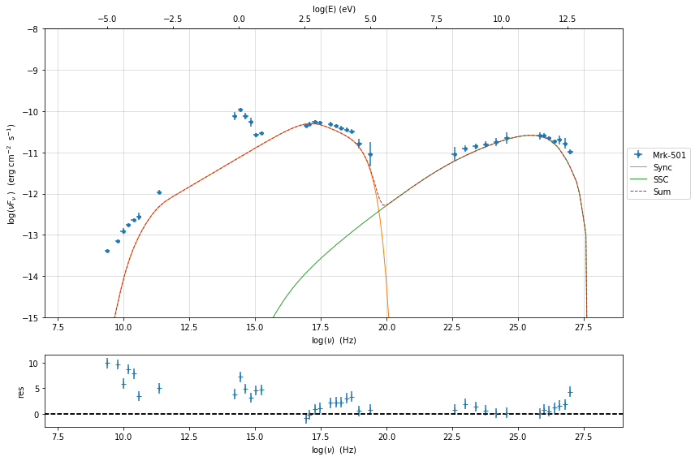

Model fitting with a bkn pl
~~~~~~~~~~~~~~~~~~~~~~~~~~~

.. code:: ipython3

    from jetset.obs_constrain import ObsConstrain
    from jetset.model_manager import  FitModel
    from jetset.minimizer import fit_SED
    sed_obspar=ObsConstrain(beaming=25,
                            B_range=[0.001,0.1],
                            distr_e='bkn',
                            t_var_sec=3*86400,
                            nu_cut_IR=1E11,
                            SEDShape=my_shape)
    
    
    prefit_jet=sed_obspar.constrain_SSC_model(electron_distribution_log_values=False,silent=True)
    prefit_jet.save_model('prefit_jet_bkn_gal_templ.pkl')

.. parsed-literal::

    ================================================================================
    
    ***  constrains parameters from observable ***
    

.. raw:: html

    <i>Table length=11</i>
    <table id="table140622278007776-107858" class="table-striped table-bordered table-condensed">
    <thead><tr><th>model name</th><th>name</th><th>par type</th><th>units</th><th>val</th><th>phys. bound. min</th><th>phys. bound. max</th><th>log</th><th>frozen</th></tr></thead>
    <tr><td>jet_leptonic</td><td>R</td><td>region_size</td><td>cm</td><td>1.092462e+16</td><td>1.000000e+03</td><td>1.000000e+30</td><td>False</td><td>False</td></tr>
    <tr><td>jet_leptonic</td><td>R_H</td><td>region_position</td><td>cm</td><td>1.000000e+17</td><td>0.000000e+00</td><td>--</td><td>False</td><td>True</td></tr>
    <tr><td>jet_leptonic</td><td>B</td><td>magnetic_field</td><td>gauss</td><td>3.008910e-02</td><td>0.000000e+00</td><td>--</td><td>False</td><td>False</td></tr>
    <tr><td>jet_leptonic</td><td>beam_obj</td><td>beaming</td><td>lorentz-factor*</td><td>2.500000e+01</td><td>1.000000e-04</td><td>--</td><td>False</td><td>False</td></tr>
    <tr><td>jet_leptonic</td><td>z_cosm</td><td>redshift</td><td></td><td>3.360000e-02</td><td>0.000000e+00</td><td>--</td><td>False</td><td>False</td></tr>
    <tr><td>jet_leptonic</td><td>gmin</td><td>low-energy-cut-off</td><td>lorentz-factor*</td><td>1.927085e+02</td><td>1.000000e+00</td><td>1.000000e+09</td><td>False</td><td>False</td></tr>
    <tr><td>jet_leptonic</td><td>gmax</td><td>high-energy-cut-off</td><td>lorentz-factor*</td><td>2.993548e+06</td><td>1.000000e+00</td><td>1.000000e+15</td><td>False</td><td>False</td></tr>
    <tr><td>jet_leptonic</td><td>N</td><td>emitters_density</td><td>1 / cm3</td><td>2.003802e+01</td><td>0.000000e+00</td><td>--</td><td>False</td><td>False</td></tr>
    <tr><td>jet_leptonic</td><td>gamma_break</td><td>turn-over-energy</td><td>lorentz-factor*</td><td>2.012034e+05</td><td>1.000000e+00</td><td>1.000000e+09</td><td>False</td><td>False</td></tr>
    <tr><td>jet_leptonic</td><td>p</td><td>LE_spectral_slope</td><td></td><td>2.248787e+00</td><td>-1.000000e+01</td><td>1.000000e+01</td><td>False</td><td>False</td></tr>
    <tr><td>jet_leptonic</td><td>p_1</td><td>HE_spectral_slope</td><td></td><td>3.500000e+00</td><td>-1.000000e+01</td><td>1.000000e+01</td><td>False</td><td>False</td></tr>
    </table>
    

.. parsed-literal::

    
    ================================================================================
    

.. code:: ipython3

    pl=prefit_jet.plot_model(sed_data=sed_data)
    pl.add_residual_plot(prefit_jet,sed_data)
    pl.setlim(y_min=1E-14,x_min=1E7,x_max=1E29)

.. code:: ipython3

    jet_minuit_bkn=Jet.load_model('prefit_jet_bkn_gal_templ.pkl')
    jet_minuit_bkn.set_gamma_grid_size(200)
    
    fit_model_lsb_bkn=FitModel( jet=jet_minuit_bkn, name='SSC-best-fit-bkn-lsb',template=my_shape.host_gal) 
    
    
    fit_model_lsb_bkn.freeze(jet_lsb,'z_cosm')
    fit_model_lsb_bkn.freeze(jet_lsb,'R_H')
    fit_model_lsb_bkn.jet_leptonic.parameters.beam_obj.fit_range=[5,50]
    fit_model_lsb_bkn.jet_leptonic.parameters.R.fit_range=[10**15.5,10**17.5]
    fit_model_lsb_bkn.jet_leptonic.parameters.gmax.fit_range=[1E4,1E8]
    fit_model_lsb_bkn.host_galaxy.parameters.nuFnu_p_host.frozen=False
    fit_model_lsb_bkn.host_galaxy.parameters.nu_scale.frozen=True
    
    model_minimizer_lsb_bkn=ModelMinimizer('lsb')
    best_fit_lsb_bkn=model_minimizer_lsb_bkn.fit(fit_model_lsb_bkn,sed_data,1E11,1E29,fitname='SSC-best-fit-lsb',repeat=3)

.. raw:: html

    <i>Table length=11</i>
    <table id="table140622741150640-936751" class="table-striped table-bordered table-condensed">
    <thead><tr><th>model name</th><th>name</th><th>par type</th><th>units</th><th>val</th><th>phys. bound. min</th><th>phys. bound. max</th><th>log</th><th>frozen</th></tr></thead>
    <tr><td>jet_leptonic</td><td>gmin</td><td>low-energy-cut-off</td><td>lorentz-factor*</td><td>1.927085e+02</td><td>1.000000e+00</td><td>1.000000e+09</td><td>False</td><td>False</td></tr>
    <tr><td>jet_leptonic</td><td>gmax</td><td>high-energy-cut-off</td><td>lorentz-factor*</td><td>2.993548e+06</td><td>1.000000e+00</td><td>1.000000e+15</td><td>False</td><td>False</td></tr>
    <tr><td>jet_leptonic</td><td>N</td><td>emitters_density</td><td>1 / cm3</td><td>2.003802e+01</td><td>0.000000e+00</td><td>--</td><td>False</td><td>False</td></tr>
    <tr><td>jet_leptonic</td><td>gamma_break</td><td>turn-over-energy</td><td>lorentz-factor*</td><td>2.012034e+05</td><td>1.000000e+00</td><td>1.000000e+09</td><td>False</td><td>False</td></tr>
    <tr><td>jet_leptonic</td><td>p</td><td>LE_spectral_slope</td><td></td><td>2.248787e+00</td><td>-1.000000e+01</td><td>1.000000e+01</td><td>False</td><td>False</td></tr>
    <tr><td>jet_leptonic</td><td>p_1</td><td>HE_spectral_slope</td><td></td><td>3.500000e+00</td><td>-1.000000e+01</td><td>1.000000e+01</td><td>False</td><td>False</td></tr>
    <tr><td>jet_leptonic</td><td>R</td><td>region_size</td><td>cm</td><td>1.092462e+16</td><td>1.000000e+03</td><td>1.000000e+30</td><td>False</td><td>False</td></tr>
    <tr><td>jet_leptonic</td><td>R_H</td><td>region_position</td><td>cm</td><td>1.000000e+17</td><td>0.000000e+00</td><td>--</td><td>False</td><td>True</td></tr>
    <tr><td>jet_leptonic</td><td>B</td><td>magnetic_field</td><td>gauss</td><td>3.008910e-02</td><td>0.000000e+00</td><td>--</td><td>False</td><td>False</td></tr>
    <tr><td>jet_leptonic</td><td>beam_obj</td><td>beaming</td><td>lorentz-factor*</td><td>2.500000e+01</td><td>1.000000e-04</td><td>--</td><td>False</td><td>False</td></tr>
    <tr><td>jet_leptonic</td><td>z_cosm</td><td>redshift</td><td></td><td>3.360000e-02</td><td>0.000000e+00</td><td>--</td><td>False</td><td>False</td></tr>
    </table>
    

.. parsed-literal::

    filtering data in fit range = [1.000000e+11,1.000000e+29]
    data length 31
    ================================================================================
    
    *** start fit process ***
    ----- 
    fit run: 0

.. parsed-literal::

    0it [00:00, ?it/s]

.. parsed-literal::

    - best chisq=1.03828e+01
    
    fit run: 1
    - old chisq=1.03828e+01

.. parsed-literal::

    0it [00:00, ?it/s]

.. parsed-literal::

    - best chisq=1.03828e+01
    
    fit run: 2
    - old chisq=1.03828e+01

.. parsed-literal::

    0it [00:00, ?it/s]

.. parsed-literal::

    - best chisq=1.03828e+01
    
    -------------------------------------------------------------------------
    Fit report
    
    Model: SSC-best-fit-lsb

.. raw:: html

    <i>Table length=13</i>
    <table id="table140622734521296-167518" class="table-striped table-bordered table-condensed">
    <thead><tr><th>model name</th><th>name</th><th>par type</th><th>units</th><th>val</th><th>phys. bound. min</th><th>phys. bound. max</th><th>log</th><th>frozen</th></tr></thead>
    <tr><td>jet_leptonic</td><td>gmin</td><td>low-energy-cut-off</td><td>lorentz-factor*</td><td>1.535419e+02</td><td>1.000000e+00</td><td>1.000000e+09</td><td>False</td><td>False</td></tr>
    <tr><td>jet_leptonic</td><td>gmax</td><td>high-energy-cut-off</td><td>lorentz-factor*</td><td>1.736794e+06</td><td>1.000000e+00</td><td>1.000000e+15</td><td>False</td><td>False</td></tr>
    <tr><td>jet_leptonic</td><td>N</td><td>emitters_density</td><td>1 / cm3</td><td>1.675841e+01</td><td>0.000000e+00</td><td>--</td><td>False</td><td>False</td></tr>
    <tr><td>jet_leptonic</td><td>gamma_break</td><td>turn-over-energy</td><td>lorentz-factor*</td><td>5.524307e+04</td><td>1.000000e+00</td><td>1.000000e+09</td><td>False</td><td>False</td></tr>
    <tr><td>jet_leptonic</td><td>p</td><td>LE_spectral_slope</td><td></td><td>2.245760e+00</td><td>-1.000000e+01</td><td>1.000000e+01</td><td>False</td><td>False</td></tr>
    <tr><td>jet_leptonic</td><td>p_1</td><td>HE_spectral_slope</td><td></td><td>2.955323e+00</td><td>-1.000000e+01</td><td>1.000000e+01</td><td>False</td><td>False</td></tr>
    <tr><td>jet_leptonic</td><td>R</td><td>region_size</td><td>cm</td><td>1.362590e+16</td><td>1.000000e+03</td><td>1.000000e+30</td><td>False</td><td>False</td></tr>
    <tr><td>jet_leptonic</td><td>R_H</td><td>region_position</td><td>cm</td><td>1.000000e+17</td><td>0.000000e+00</td><td>--</td><td>False</td><td>True</td></tr>
    <tr><td>jet_leptonic</td><td>B</td><td>magnetic_field</td><td>gauss</td><td>1.402504e-02</td><td>0.000000e+00</td><td>--</td><td>False</td><td>False</td></tr>
    <tr><td>jet_leptonic</td><td>beam_obj</td><td>beaming</td><td>lorentz-factor*</td><td>4.068522e+01</td><td>1.000000e-04</td><td>--</td><td>False</td><td>False</td></tr>
    <tr><td>jet_leptonic</td><td>z_cosm</td><td>redshift</td><td></td><td>3.360000e-02</td><td>0.000000e+00</td><td>--</td><td>False</td><td>True</td></tr>
    <tr><td>host_galaxy</td><td>nuFnu_p_host</td><td>nuFnu-scale</td><td>erg / (cm2 s)</td><td>-1.004890e+01</td><td>-2.000000e+01</td><td>2.000000e+01</td><td>False</td><td>False</td></tr>
    <tr><td>host_galaxy</td><td>nu_scale</td><td>nu-scale</td><td>Hz</td><td>1.730750e-02</td><td>-2.000000e+00</td><td>2.000000e+00</td><td>False</td><td>True</td></tr>
    </table>
    

.. parsed-literal::

    
    converged=True
    calls=22
    mesg=

.. parsed-literal::

    'The relative error between two consecutive iterates is at most 0.000000'

.. parsed-literal::

    dof=21
    chisq=10.382757, chisq/red=0.494417 null hypothesis sig=0.973502
    
    best fit pars

.. raw:: html

    <i>Table length=13</i>
    <table id="table140622746683952-84048" class="table-striped table-bordered table-condensed">
    <thead><tr><th>model name</th><th>name</th><th>val</th><th>bestfit val</th><th>err +</th><th>err -</th><th>start val</th><th>fit range min</th><th>fit range max</th><th>frozen</th></tr></thead>
    <tr><td>jet_leptonic</td><td>gmin</td><td>1.535419e+02</td><td>1.535419e+02</td><td>1.172176e+02</td><td>--</td><td>1.927085e+02</td><td>1.000000e+00</td><td>1.000000e+09</td><td>False</td></tr>
    <tr><td>jet_leptonic</td><td>gmax</td><td>1.736794e+06</td><td>1.736794e+06</td><td>7.155313e+05</td><td>--</td><td>2.993548e+06</td><td>1.000000e+04</td><td>1.000000e+08</td><td>False</td></tr>
    <tr><td>jet_leptonic</td><td>N</td><td>1.675841e+01</td><td>1.675841e+01</td><td>1.737861e+01</td><td>--</td><td>2.003802e+01</td><td>0.000000e+00</td><td>--</td><td>False</td></tr>
    <tr><td>jet_leptonic</td><td>gamma_break</td><td>5.524307e+04</td><td>5.524307e+04</td><td>3.483584e+04</td><td>--</td><td>2.012034e+05</td><td>1.000000e+00</td><td>1.000000e+09</td><td>False</td></tr>
    <tr><td>jet_leptonic</td><td>p</td><td>2.245760e+00</td><td>2.245760e+00</td><td>1.466694e-01</td><td>--</td><td>2.248787e+00</td><td>-1.000000e+01</td><td>1.000000e+01</td><td>False</td></tr>
    <tr><td>jet_leptonic</td><td>p_1</td><td>2.955323e+00</td><td>2.955323e+00</td><td>5.912349e-02</td><td>--</td><td>3.500000e+00</td><td>-1.000000e+01</td><td>1.000000e+01</td><td>False</td></tr>
    <tr><td>jet_leptonic</td><td>R</td><td>1.362590e+16</td><td>1.362590e+16</td><td>1.380750e+16</td><td>--</td><td>1.092462e+16</td><td>3.162278e+15</td><td>3.162278e+17</td><td>False</td></tr>
    <tr><td>jet_leptonic</td><td>R_H</td><td>1.000000e+17</td><td>--</td><td>--</td><td>--</td><td>1.000000e+17</td><td>0.000000e+00</td><td>--</td><td>True</td></tr>
    <tr><td>jet_leptonic</td><td>B</td><td>1.402504e-02</td><td>1.402504e-02</td><td>8.377099e-03</td><td>--</td><td>3.008910e-02</td><td>0.000000e+00</td><td>--</td><td>False</td></tr>
    <tr><td>jet_leptonic</td><td>beam_obj</td><td>4.068522e+01</td><td>4.068522e+01</td><td>1.345542e+01</td><td>--</td><td>2.500000e+01</td><td>5.000000e+00</td><td>5.000000e+01</td><td>False</td></tr>
    <tr><td>jet_leptonic</td><td>z_cosm</td><td>3.360000e-02</td><td>--</td><td>--</td><td>--</td><td>3.360000e-02</td><td>0.000000e+00</td><td>--</td><td>True</td></tr>
    <tr><td>host_galaxy</td><td>nuFnu_p_host</td><td>-1.004890e+01</td><td>-1.004890e+01</td><td>3.573242e-02</td><td>--</td><td>-1.006274e+01</td><td>-1.225412e+01</td><td>-8.254123e+00</td><td>False</td></tr>
    <tr><td>host_galaxy</td><td>nu_scale</td><td>1.730750e-02</td><td>--</td><td>--</td><td>--</td><td>1.730750e-02</td><td>-5.000000e-01</td><td>5.000000e-01</td><td>True</td></tr>
    </table>
    

.. parsed-literal::

    -------------------------------------------------------------------------
    
    ================================================================================
    

.. code:: ipython3

    %matplotlib inline
    fit_model_lsb_bkn.set_nu_grid(1E6,1E30,200)
    fit_model_lsb_bkn.eval()
    p2=fit_model_lsb_bkn.plot_model(sed_data=sed_data)
    p2.setlim(y_min=1E-14,x_min=1E6,x_max=2E28)

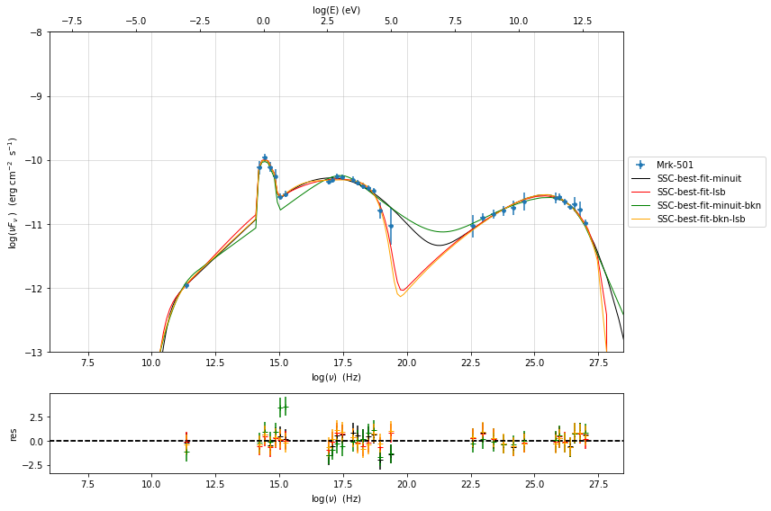

.. code:: ipython3

    jet_minuit_bkn=Jet.load_model('prefit_jet_bkn_gal_templ.pkl')
    jet_minuit_bkn.set_gamma_grid_size(200)
    
    
    fit_model_minuit_bkn=FitModel( jet=jet_minuit_bkn, name='SSC-best-fit-minuit-bkn',template=my_shape.host_gal) 
    fit_model_minuit_bkn.show_model_components()
    fit_model_minuit_bkn.freeze('jet_leptonic','z_cosm')
    fit_model_minuit_bkn.freeze('jet_leptonic','R_H')
    fit_model_minuit_bkn.jet_leptonic.parameters.beam_obj.fit_range=[5,50]
    fit_model_minuit_bkn.jet_leptonic.parameters.R.fit_range=[10**15.5,10**17.5]
    fit_model_minuit_bkn.host_galaxy.parameters.nuFnu_p_host.frozen=False
    fit_model_minuit_bkn.host_galaxy.parameters.nu_scale.frozen=True
    fit_model_minuit_bkn.jet_leptonic.parameters.gmin.fit_range=[10,1000]
    fit_model_minuit_bkn.jet_leptonic.parameters.gmax.fit_range=[5E5,1E8]
    fit_model_minuit_bkn.jet_leptonic.parameters.gamma_break.fit_range=[1E3,1E6]
    fit_model_minuit_bkn.jet_leptonic.parameters.p.fit_range=[1,3]
    fit_model_minuit_bkn.jet_leptonic.parameters.p_1.fit_range=[2,5]
    
    
    model_minimizer_minuit_bkn=ModelMinimizer('minuit')
    best_fit_minuit_bkn=model_minimizer_minuit.fit(fit_model_minuit_bkn,sed_data,1E11,1E29,fitname='SSC-best-fit-minuit-bkn',repeat=3)

.. raw:: html

    <i>Table length=11</i>
    <table id="table140622734335664-661329" class="table-striped table-bordered table-condensed">
    <thead><tr><th>model name</th><th>name</th><th>par type</th><th>units</th><th>val</th><th>phys. bound. min</th><th>phys. bound. max</th><th>log</th><th>frozen</th></tr></thead>
    <tr><td>jet_leptonic</td><td>gmin</td><td>low-energy-cut-off</td><td>lorentz-factor*</td><td>1.927085e+02</td><td>1.000000e+00</td><td>1.000000e+09</td><td>False</td><td>False</td></tr>
    <tr><td>jet_leptonic</td><td>gmax</td><td>high-energy-cut-off</td><td>lorentz-factor*</td><td>2.993548e+06</td><td>1.000000e+00</td><td>1.000000e+15</td><td>False</td><td>False</td></tr>
    <tr><td>jet_leptonic</td><td>N</td><td>emitters_density</td><td>1 / cm3</td><td>2.003802e+01</td><td>0.000000e+00</td><td>--</td><td>False</td><td>False</td></tr>
    <tr><td>jet_leptonic</td><td>gamma_break</td><td>turn-over-energy</td><td>lorentz-factor*</td><td>2.012034e+05</td><td>1.000000e+00</td><td>1.000000e+09</td><td>False</td><td>False</td></tr>
    <tr><td>jet_leptonic</td><td>p</td><td>LE_spectral_slope</td><td></td><td>2.248787e+00</td><td>-1.000000e+01</td><td>1.000000e+01</td><td>False</td><td>False</td></tr>
    <tr><td>jet_leptonic</td><td>p_1</td><td>HE_spectral_slope</td><td></td><td>3.500000e+00</td><td>-1.000000e+01</td><td>1.000000e+01</td><td>False</td><td>False</td></tr>
    <tr><td>jet_leptonic</td><td>R</td><td>region_size</td><td>cm</td><td>1.092462e+16</td><td>1.000000e+03</td><td>1.000000e+30</td><td>False</td><td>False</td></tr>
    <tr><td>jet_leptonic</td><td>R_H</td><td>region_position</td><td>cm</td><td>1.000000e+17</td><td>0.000000e+00</td><td>--</td><td>False</td><td>True</td></tr>
    <tr><td>jet_leptonic</td><td>B</td><td>magnetic_field</td><td>gauss</td><td>3.008910e-02</td><td>0.000000e+00</td><td>--</td><td>False</td><td>False</td></tr>
    <tr><td>jet_leptonic</td><td>beam_obj</td><td>beaming</td><td>lorentz-factor*</td><td>2.500000e+01</td><td>1.000000e-04</td><td>--</td><td>False</td><td>False</td></tr>
    <tr><td>jet_leptonic</td><td>z_cosm</td><td>redshift</td><td></td><td>3.360000e-02</td><td>0.000000e+00</td><td>--</td><td>False</td><td>False</td></tr>
    </table>
    

.. parsed-literal::

    
    --------------------------------------------------------------------------------
    Composite model description
    --------------------------------------------------------------------------------
    name: SSC-best-fit-minuit-bkn  
    type: composite_model  
    components models:
     -model name: jet_leptonic model type: jet
     -model name: host_galaxy model type: template
    
    --------------------------------------------------------------------------------
    filtering data in fit range = [1.000000e+11,1.000000e+29]
    data length 31
    ================================================================================
    
    *** start fit process ***
    ----- 
    fit run: 0

.. parsed-literal::

    0it [00:00, ?it/s]

.. parsed-literal::

    - best chisq=1.05187e+01
    
    fit run: 1
    - old chisq=1.05187e+01

.. parsed-literal::

    0it [00:00, ?it/s]

.. parsed-literal::

    - best chisq=1.05186e+01
    
    fit run: 2
    - old chisq=1.05186e+01

.. parsed-literal::

    0it [00:00, ?it/s]

.. parsed-literal::

    - best chisq=1.05142e+01
    
    -------------------------------------------------------------------------
    Fit report
    
    Model: SSC-best-fit-minuit-bkn

.. raw:: html

    <i>Table length=13</i>
    <table id="table140622266774720-211909" class="table-striped table-bordered table-condensed">
    <thead><tr><th>model name</th><th>name</th><th>par type</th><th>units</th><th>val</th><th>phys. bound. min</th><th>phys. bound. max</th><th>log</th><th>frozen</th></tr></thead>
    <tr><td>jet_leptonic</td><td>gmin</td><td>low-energy-cut-off</td><td>lorentz-factor*</td><td>1.187507e+02</td><td>1.000000e+00</td><td>1.000000e+09</td><td>False</td><td>False</td></tr>
    <tr><td>jet_leptonic</td><td>gmax</td><td>high-energy-cut-off</td><td>lorentz-factor*</td><td>1.814606e+06</td><td>1.000000e+00</td><td>1.000000e+15</td><td>False</td><td>False</td></tr>
    <tr><td>jet_leptonic</td><td>N</td><td>emitters_density</td><td>1 / cm3</td><td>2.001152e+01</td><td>0.000000e+00</td><td>--</td><td>False</td><td>False</td></tr>
    <tr><td>jet_leptonic</td><td>gamma_break</td><td>turn-over-energy</td><td>lorentz-factor*</td><td>5.668605e+04</td><td>1.000000e+00</td><td>1.000000e+09</td><td>False</td><td>False</td></tr>
    <tr><td>jet_leptonic</td><td>p</td><td>LE_spectral_slope</td><td></td><td>2.243450e+00</td><td>-1.000000e+01</td><td>1.000000e+01</td><td>False</td><td>False</td></tr>
    <tr><td>jet_leptonic</td><td>p_1</td><td>HE_spectral_slope</td><td></td><td>2.949816e+00</td><td>-1.000000e+01</td><td>1.000000e+01</td><td>False</td><td>False</td></tr>
    <tr><td>jet_leptonic</td><td>R</td><td>region_size</td><td>cm</td><td>1.531435e+16</td><td>1.000000e+03</td><td>1.000000e+30</td><td>False</td><td>False</td></tr>
    <tr><td>jet_leptonic</td><td>R_H</td><td>region_position</td><td>cm</td><td>1.000000e+17</td><td>0.000000e+00</td><td>--</td><td>False</td><td>True</td></tr>
    <tr><td>jet_leptonic</td><td>B</td><td>magnetic_field</td><td>gauss</td><td>1.299676e-02</td><td>0.000000e+00</td><td>--</td><td>False</td><td>False</td></tr>
    <tr><td>jet_leptonic</td><td>beam_obj</td><td>beaming</td><td>lorentz-factor*</td><td>3.968243e+01</td><td>1.000000e-04</td><td>--</td><td>False</td><td>False</td></tr>
    <tr><td>jet_leptonic</td><td>z_cosm</td><td>redshift</td><td></td><td>3.360000e-02</td><td>0.000000e+00</td><td>--</td><td>False</td><td>True</td></tr>
    <tr><td>host_galaxy</td><td>nuFnu_p_host</td><td>nuFnu-scale</td><td>erg / (cm2 s)</td><td>-1.004918e+01</td><td>-2.000000e+01</td><td>2.000000e+01</td><td>False</td><td>False</td></tr>
    <tr><td>host_galaxy</td><td>nu_scale</td><td>nu-scale</td><td>Hz</td><td>1.730750e-02</td><td>-2.000000e+00</td><td>2.000000e+00</td><td>False</td><td>True</td></tr>
    </table>
    

.. parsed-literal::

    
    converged=True
    calls=537
    mesg=

.. raw:: html

    <table>
        <tr>
            <td colspan="2" style="text-align:left" title="Minimum value of function"> FCN = 10.51 </td>
            <td colspan="3" style="text-align:center" title="No. of function evaluations in last call and total number"> Nfcn = 537 </td>
        </tr>
        <tr>
            <td colspan="2" style="text-align:left" title="Estimated distance to minimum and goal"> EDM = 6.68e-05 (Goal: 0.0002) </td>
            <td colspan="3" style="text-align:center" title="No. of gradient evaluations in last call and total number">  </td>
        </tr>
        <tr>
            <td style="text-align:center;background-color:#92CCA6;color:black"> Valid Minimum </td>
            <td style="text-align:center;background-color:#92CCA6;color:black"> Valid Parameters </td>
            <td colspan="3" style="text-align:center;background-color:#92CCA6;color:black"> No Parameters at limit </td>
        </tr>
        <tr>
            <td colspan="2" style="text-align:center;background-color:#92CCA6;color:black"> Below EDM threshold (goal x 10) </td>
            <td colspan="3" style="text-align:center;background-color:#92CCA6;color:black"> Below call limit </td>
        </tr>
        <tr>
            <td style="text-align:center;background-color:#92CCA6;color:black"> Covariance </td>
            <td style="text-align:center;background-color:#92CCA6;color:black"> Hesse ok </td>
            <td style="text-align:center;background-color:#92CCA6;color:black" title="Is covariance matrix accurate?"> Accurate </td>
            <td style="text-align:center;background-color:#92CCA6;color:black" title="Is covariance matrix positive definite?"> Pos. def. </td>
            <td style="text-align:center;background-color:#92CCA6;color:black" title="Was positive definiteness enforced by Minuit?"> Not forced </td>
        </tr>
    </table><table>
        <tr>
            <td></td>
            <th title="Variable name"> Name </th>
            <th title="Value of parameter"> Value </th>
            <th title="Hesse error"> Hesse Error </th>
            <th title="Minos lower error"> Minos Error- </th>
            <th title="Minos upper error"> Minos Error+ </th>
            <th title="Lower limit of the parameter"> Limit- </th>
            <th title="Upper limit of the parameter"> Limit+ </th>
            <th title="Is the parameter fixed in the fit"> Fixed </th>
        </tr>
        <tr>
            <th> 0 </th>
            <td> par_0 </td>
            <td> 118.75 </td>
            <td> 0.08 </td>
            <td>  </td>
            <td>  </td>
            <td> 10 </td>
            <td> 1E+03 </td>
            <td>  </td>
        </tr>
        <tr>
            <th> 1 </th>
            <td> par_1 </td>
            <td> 1.81e6 </td>
            <td> 0.04e6 </td>
            <td>  </td>
            <td>  </td>
            <td> 5E+05 </td>
            <td> 1E+08 </td>
            <td>  </td>
        </tr>
        <tr>
            <th> 2 </th>
            <td> par_2 </td>
            <td> 20.0115 </td>
            <td> 0.0004 </td>
            <td>  </td>
            <td>  </td>
            <td> 0 </td>
            <td>  </td>
            <td>  </td>
        </tr>
        <tr>
            <th> 3 </th>
            <td> par_3 </td>
            <td> 56.69e3 </td>
            <td> 0.07e3 </td>
            <td>  </td>
            <td>  </td>
            <td> 1E+03 </td>
            <td> 1E+06 </td>
            <td>  </td>
        </tr>
        <tr>
            <th> 4 </th>
            <td> par_4 </td>
            <td> 2.24345 </td>
            <td> 0.00018 </td>
            <td>  </td>
            <td>  </td>
            <td> 1 </td>
            <td> 3 </td>
            <td>  </td>
        </tr>
        <tr>
            <th> 5 </th>
            <td> par_5 </td>
            <td> 2.9498 </td>
            <td> 0.0004 </td>
            <td>  </td>
            <td>  </td>
            <td> 2 </td>
            <td> 5 </td>
            <td>  </td>
        </tr>
        <tr>
            <th> 6 </th>
            <td> par_6 </td>
            <td> 15.314e15 </td>
            <td> 0.006e15 </td>
            <td>  </td>
            <td>  </td>
            <td> 3.16E+15 </td>
            <td> 3.16E+17 </td>
            <td>  </td>
        </tr>
        <tr>
            <th> 7 </th>
            <td> par_7 </td>
            <td> 12.997e-3 </td>
            <td> 0.009e-3 </td>
            <td>  </td>
            <td>  </td>
            <td> 0 </td>
            <td>  </td>
            <td>  </td>
        </tr>
        <tr>
            <th> 8 </th>
            <td> par_8 </td>
            <td> 39.682 </td>
            <td> 0.006 </td>
            <td>  </td>
            <td>  </td>
            <td> 5 </td>
            <td> 50 </td>
            <td>  </td>
        </tr>
        <tr>
            <th> 9 </th>
            <td> par_9 </td>
            <td> -10.0492 </td>
            <td> 0.0007 </td>
            <td>  </td>
            <td>  </td>
            <td> -12.3 </td>
            <td> -8.25 </td>
            <td>  </td>
        </tr>
    </table><table>
        <tr>
            <td></td>
            <th> par_0 </th>
            <th> par_1 </th>
            <th> par_2 </th>
            <th> par_3 </th>
            <th> par_4 </th>
            <th> par_5 </th>
            <th> par_6 </th>
            <th> par_7 </th>
            <th> par_8 </th>
            <th> par_9 </th>
        </tr>
        <tr>
            <th> par_0 </th>
            <td> 0.00562 </td>
            <td style="background-color:rgb(248,248,250);color:black"> -40.3 <strong>(-0.013)</strong> </td>
            <td style="background-color:rgb(250,250,250);color:black"> -4.81e-09 </td>
            <td style="background-color:rgb(249,249,250);color:black"> -0.0337 <strong>(-0.006)</strong> </td>
            <td style="background-color:rgb(250,249,249);color:black"> 1.08e-07 <strong>(0.008)</strong> </td>
            <td style="background-color:rgb(250,249,249);color:black"> 2.31e-07 <strong>(0.007)</strong> </td>
            <td style="background-color:rgb(249,249,250);color:black"> -4.29e+09 <strong>(-0.009)</strong> </td>
            <td style="background-color:rgb(249,249,250);color:black"> -6.22e-09 <strong>(-0.009)</strong> </td>
            <td style="background-color:rgb(249,249,250);color:black"> -2.3e-06 <strong>(-0.005)</strong> </td>
            <td style="background-color:rgb(250,250,250);color:black"> -1.31e-09 </td>
        </tr>
        <tr>
            <th> par_1 </th>
            <td style="background-color:rgb(248,248,250);color:black"> -40.3 <strong>(-0.013)</strong> </td>
            <td> 1.83e+09 </td>
            <td style="background-color:rgb(250,250,250);color:black"> -0.0102 <strong>(-0.001)</strong> </td>
            <td style="background-color:rgb(247,247,250);color:black"> -7.25e+04 <strong>(-0.024)</strong> </td>
            <td style="background-color:rgb(250,245,245);color:black"> 0.235 <strong>(0.031)</strong> </td>
            <td style="background-color:rgb(250,245,245);color:black"> 0.56 <strong>(0.031)</strong> </td>
            <td style="background-color:rgb(246,246,250);color:black"> -8.67e+15 <strong>(-0.033)</strong> </td>
            <td style="background-color:rgb(243,243,250);color:black"> -0.0193 <strong>(-0.051)</strong> </td>
            <td style="background-color:rgb(248,248,250);color:black"> -5.07 <strong>(-0.019)</strong> </td>
            <td style="background-color:rgb(250,250,250);color:black"> 0.000225 </td>
        </tr>
        <tr>
            <th> par_2 </th>
            <td style="background-color:rgb(250,250,250);color:black"> -4.81e-09 </td>
            <td style="background-color:rgb(250,250,250);color:black"> -0.0102 <strong>(-0.001)</strong> </td>
            <td> 1.45e-07 </td>
            <td style="background-color:rgb(250,250,250);color:black"> -4.12e-06 </td>
            <td style="background-color:rgb(250,250,250);color:black"> 1.32e-11 </td>
            <td style="background-color:rgb(250,250,250);color:black"> 2.86e-11 </td>
            <td style="background-color:rgb(250,250,250);color:black"> -5.25e+05 <strong>(-0.000)</strong> </td>
            <td style="background-color:rgb(250,250,250);color:black"> -7.42e-13 </td>
            <td style="background-color:rgb(250,250,250);color:black"> -2.82e-10 </td>
            <td style="background-color:rgb(250,250,250);color:black"> -1.6e-13 </td>
        </tr>
        <tr>
            <th> par_3 </th>
            <td style="background-color:rgb(249,249,250);color:black"> -0.0337 <strong>(-0.006)</strong> </td>
            <td style="background-color:rgb(247,247,250);color:black"> -7.25e+04 <strong>(-0.024)</strong> </td>
            <td style="background-color:rgb(250,250,250);color:black"> -4.12e-06 </td>
            <td> 4.85e+03 </td>
            <td style="background-color:rgb(250,249,249);color:black"> 9.38e-05 <strong>(0.008)</strong> </td>
            <td style="background-color:rgb(250,249,249);color:black"> 0.000212 <strong>(0.007)</strong> </td>
            <td style="background-color:rgb(249,249,250);color:black"> -3.73e+12 <strong>(-0.009)</strong> </td>
            <td style="background-color:rgb(249,249,250);color:black"> -5.35e-06 <strong>(-0.009)</strong> </td>
            <td style="background-color:rgb(249,249,250);color:black"> -0.00202 <strong>(-0.005)</strong> </td>
            <td style="background-color:rgb(250,250,250);color:black"> 3.11e-08 </td>
        </tr>
        <tr>
            <th> par_4 </th>
            <td style="background-color:rgb(250,249,249);color:black"> 1.08e-07 <strong>(0.008)</strong> </td>
            <td style="background-color:rgb(250,245,245);color:black"> 0.235 <strong>(0.031)</strong> </td>
            <td style="background-color:rgb(250,250,250);color:black"> 1.32e-11 </td>
            <td style="background-color:rgb(250,249,249);color:black"> 9.38e-05 <strong>(0.008)</strong> </td>
            <td> 3.15e-08 </td>
            <td style="background-color:rgb(249,249,250);color:black"> -6.56e-10 <strong>(-0.009)</strong> </td>
            <td style="background-color:rgb(250,248,248);color:black"> 1.19e+07 <strong>(0.011)</strong> </td>
            <td style="background-color:rgb(250,248,248);color:black"> 1.71e-11 <strong>(0.011)</strong> </td>
            <td style="background-color:rgb(250,249,249);color:black"> 6.41e-09 <strong>(0.006)</strong> </td>
            <td style="background-color:rgb(250,250,250);color:black"> 2.92e-12 </td>
        </tr>
        <tr>
            <th> par_5 </th>
            <td style="background-color:rgb(250,249,249);color:black"> 2.31e-07 <strong>(0.007)</strong> </td>
            <td style="background-color:rgb(250,245,245);color:black"> 0.56 <strong>(0.031)</strong> </td>
            <td style="background-color:rgb(250,250,250);color:black"> 2.86e-11 </td>
            <td style="background-color:rgb(250,249,249);color:black"> 0.000212 <strong>(0.007)</strong> </td>
            <td style="background-color:rgb(249,249,250);color:black"> -6.56e-10 <strong>(-0.009)</strong> </td>
            <td> 1.79e-07 </td>
            <td style="background-color:rgb(250,248,248);color:black"> 2.62e+07 <strong>(0.010)</strong> </td>
            <td style="background-color:rgb(250,248,248);color:black"> 3.85e-11 <strong>(0.010)</strong> </td>
            <td style="background-color:rgb(250,249,249);color:black"> 1.45e-08 <strong>(0.005)</strong> </td>
            <td style="background-color:rgb(250,250,250);color:black"> -7.51e-13 </td>
        </tr>
        <tr>
            <th> par_6 </th>
            <td style="background-color:rgb(249,249,250);color:black"> -4.29e+09 <strong>(-0.009)</strong> </td>
            <td style="background-color:rgb(246,246,250);color:black"> -8.67e+15 <strong>(-0.033)</strong> </td>
            <td style="background-color:rgb(250,250,250);color:black"> -5.25e+05 <strong>(-0.000)</strong> </td>
            <td style="background-color:rgb(249,249,250);color:black"> -3.73e+12 <strong>(-0.009)</strong> </td>
            <td style="background-color:rgb(250,248,248);color:black"> 1.19e+07 <strong>(0.011)</strong> </td>
            <td style="background-color:rgb(250,248,248);color:black"> 2.62e+07 <strong>(0.010)</strong> </td>
            <td> 3.72e+25 </td>
            <td style="background-color:rgb(248,248,250);color:black"> -6.85e+05 <strong>(-0.013)</strong> </td>
            <td style="background-color:rgb(249,249,250);color:black"> -2.58e+08 <strong>(-0.007)</strong> </td>
            <td style="background-color:rgb(250,250,250);color:black"> -1.65e+05 <strong>(-0.000)</strong> </td>
        </tr>
        <tr>
            <th> par_7 </th>
            <td style="background-color:rgb(249,249,250);color:black"> -6.22e-09 <strong>(-0.009)</strong> </td>
            <td style="background-color:rgb(243,243,250);color:black"> -0.0193 <strong>(-0.051)</strong> </td>
            <td style="background-color:rgb(250,250,250);color:black"> -7.42e-13 </td>
            <td style="background-color:rgb(249,249,250);color:black"> -5.35e-06 <strong>(-0.009)</strong> </td>
            <td style="background-color:rgb(250,248,248);color:black"> 1.71e-11 <strong>(0.011)</strong> </td>
            <td style="background-color:rgb(250,248,248);color:black"> 3.85e-11 <strong>(0.010)</strong> </td>
            <td style="background-color:rgb(248,248,250);color:black"> -6.85e+05 <strong>(-0.013)</strong> </td>
            <td> 7.91e-11 </td>
            <td style="background-color:rgb(249,249,250);color:black"> -3.75e-10 <strong>(-0.007)</strong> </td>
            <td style="background-color:rgb(250,250,250);color:black"> -2.25e-13 </td>
        </tr>
        <tr>
            <th> par_8 </th>
            <td style="background-color:rgb(249,249,250);color:black"> -2.3e-06 <strong>(-0.005)</strong> </td>
            <td style="background-color:rgb(248,248,250);color:black"> -5.07 <strong>(-0.019)</strong> </td>
            <td style="background-color:rgb(250,250,250);color:black"> -2.82e-10 </td>
            <td style="background-color:rgb(249,249,250);color:black"> -0.00202 <strong>(-0.005)</strong> </td>
            <td style="background-color:rgb(250,249,249);color:black"> 6.41e-09 <strong>(0.006)</strong> </td>
            <td style="background-color:rgb(250,249,249);color:black"> 1.45e-08 <strong>(0.005)</strong> </td>
            <td style="background-color:rgb(249,249,250);color:black"> -2.58e+08 <strong>(-0.007)</strong> </td>
            <td style="background-color:rgb(249,249,250);color:black"> -3.75e-10 <strong>(-0.007)</strong> </td>
            <td> 4.03e-05 </td>
            <td style="background-color:rgb(250,250,250);color:black"> -8.22e-11 </td>
        </tr>
        <tr>
            <th> par_9 </th>
            <td style="background-color:rgb(250,250,250);color:black"> -1.31e-09 </td>
            <td style="background-color:rgb(250,250,250);color:black"> 0.000225 </td>
            <td style="background-color:rgb(250,250,250);color:black"> -1.6e-13 </td>
            <td style="background-color:rgb(250,250,250);color:black"> 3.11e-08 </td>
            <td style="background-color:rgb(250,250,250);color:black"> 2.92e-12 </td>
            <td style="background-color:rgb(250,250,250);color:black"> -7.51e-13 </td>
            <td style="background-color:rgb(250,250,250);color:black"> -1.65e+05 <strong>(-0.000)</strong> </td>
            <td style="background-color:rgb(250,250,250);color:black"> -2.25e-13 </td>
            <td style="background-color:rgb(250,250,250);color:black"> -8.22e-11 </td>
            <td> 5.33e-07 </td>
        </tr>
    </table>

.. parsed-literal::

    dof=21
    chisq=10.514167, chisq/red=0.500675 null hypothesis sig=0.971433
    
    best fit pars

.. raw:: html

    <i>Table length=13</i>
    <table id="table140622266774864-676616" class="table-striped table-bordered table-condensed">
    <thead><tr><th>model name</th><th>name</th><th>val</th><th>bestfit val</th><th>err +</th><th>err -</th><th>start val</th><th>fit range min</th><th>fit range max</th><th>frozen</th></tr></thead>
    <tr><td>jet_leptonic</td><td>gmin</td><td>1.187507e+02</td><td>1.187507e+02</td><td>7.495853e-02</td><td>--</td><td>1.927085e+02</td><td>1.000000e+01</td><td>1.000000e+03</td><td>False</td></tr>
    <tr><td>jet_leptonic</td><td>gmax</td><td>1.814606e+06</td><td>1.814606e+06</td><td>4.278641e+04</td><td>--</td><td>2.993548e+06</td><td>5.000000e+05</td><td>1.000000e+08</td><td>False</td></tr>
    <tr><td>jet_leptonic</td><td>N</td><td>2.001152e+01</td><td>2.001152e+01</td><td>3.805966e-04</td><td>--</td><td>2.003802e+01</td><td>0.000000e+00</td><td>--</td><td>False</td></tr>
    <tr><td>jet_leptonic</td><td>gamma_break</td><td>5.668605e+04</td><td>5.668605e+04</td><td>6.964003e+01</td><td>--</td><td>2.012034e+05</td><td>1.000000e+03</td><td>1.000000e+06</td><td>False</td></tr>
    <tr><td>jet_leptonic</td><td>p</td><td>2.243450e+00</td><td>2.243450e+00</td><td>1.775963e-04</td><td>--</td><td>2.248787e+00</td><td>1.000000e+00</td><td>3.000000e+00</td><td>False</td></tr>
    <tr><td>jet_leptonic</td><td>p_1</td><td>2.949816e+00</td><td>2.949816e+00</td><td>4.229235e-04</td><td>--</td><td>3.500000e+00</td><td>2.000000e+00</td><td>5.000000e+00</td><td>False</td></tr>
    <tr><td>jet_leptonic</td><td>R</td><td>1.531435e+16</td><td>1.531435e+16</td><td>6.102693e+12</td><td>--</td><td>1.092462e+16</td><td>3.162278e+15</td><td>3.162278e+17</td><td>False</td></tr>
    <tr><td>jet_leptonic</td><td>R_H</td><td>1.000000e+17</td><td>--</td><td>--</td><td>--</td><td>1.000000e+17</td><td>0.000000e+00</td><td>--</td><td>True</td></tr>
    <tr><td>jet_leptonic</td><td>B</td><td>1.299676e-02</td><td>1.299676e-02</td><td>8.893765e-06</td><td>--</td><td>3.008910e-02</td><td>0.000000e+00</td><td>--</td><td>False</td></tr>
    <tr><td>jet_leptonic</td><td>beam_obj</td><td>3.968243e+01</td><td>3.968243e+01</td><td>6.348264e-03</td><td>--</td><td>2.500000e+01</td><td>5.000000e+00</td><td>5.000000e+01</td><td>False</td></tr>
    <tr><td>jet_leptonic</td><td>z_cosm</td><td>3.360000e-02</td><td>--</td><td>--</td><td>--</td><td>3.360000e-02</td><td>0.000000e+00</td><td>--</td><td>True</td></tr>
    <tr><td>host_galaxy</td><td>nuFnu_p_host</td><td>-1.004918e+01</td><td>-1.004918e+01</td><td>7.303118e-04</td><td>--</td><td>-1.004890e+01</td><td>-1.225412e+01</td><td>-8.254123e+00</td><td>False</td></tr>
    <tr><td>host_galaxy</td><td>nu_scale</td><td>1.730750e-02</td><td>--</td><td>--</td><td>--</td><td>1.730750e-02</td><td>-5.000000e-01</td><td>5.000000e-01</td><td>True</td></tr>
    </table>
    

.. parsed-literal::

    -------------------------------------------------------------------------
    
    ================================================================================
    

.. code:: ipython3

    %matplotlib inline
    fit_model_minuit_bkn.set_nu_grid(1E6,1E30,200)
    fit_model_minuit_bkn.eval()
    p2=fit_model_minuit_bkn.plot_model(sed_data=sed_data)
    p2.setlim(y_min=1E-14,x_min=1E6,x_max=2E28)

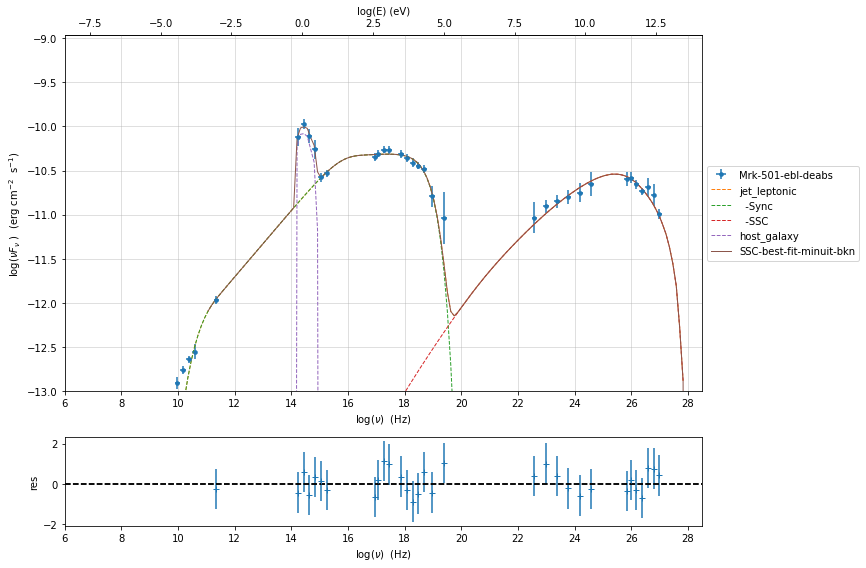

.. code:: ipython3

    %matplotlib inline
    from jetset.plot_sedfit import PlotSED
    fit_model_minuit_bkn.set_nu_grid(1E6,1E30,200)
    fit_model_minuit_bkn.eval()
    fit_model_minuit.set_nu_grid(1E6,1E30,200)
    fit_model_minuit.eval()
    fit_model_lsb.set_nu_grid(1E6,1E30,200)
    fit_model_lsb.eval()
    fit_model_lsb_bkn.set_nu_grid(1E6,1E30,200)
    fit_model_lsb_bkn.eval()
    p2=PlotSED()
    p2.add_data_plot(sed_data,fit_range=[ 1E11, 1E29])
    p2.add_model_plot(fit_model_minuit,color='black')
    p2.add_residual_plot(fit_model_minuit,sed_data,fit_range=[ 1E11, 1E29],color='black')
    p2.add_model_plot(fit_model_lsb,color='red')
    p2.add_residual_plot(fit_model_lsb,sed_data,fit_range=[ 1E11, 1E29],color='red')
    p2.add_model_plot(fit_model_minuit_bkn,color='green')
    p2.add_residual_plot(fit_model_minuit_bkn,sed_data,fit_range=[ 1E11, 1E29],color='green')
    p2.add_model_plot(fit_model_lsb_bkn,color='orange')
    p2.add_residual_plot(fit_model_lsb_bkn,sed_data,fit_range=[ 1E11, 1E29],color='orange')
    p2.setlim(y_min=1E-14,x_min=1E6,x_max=2E28)

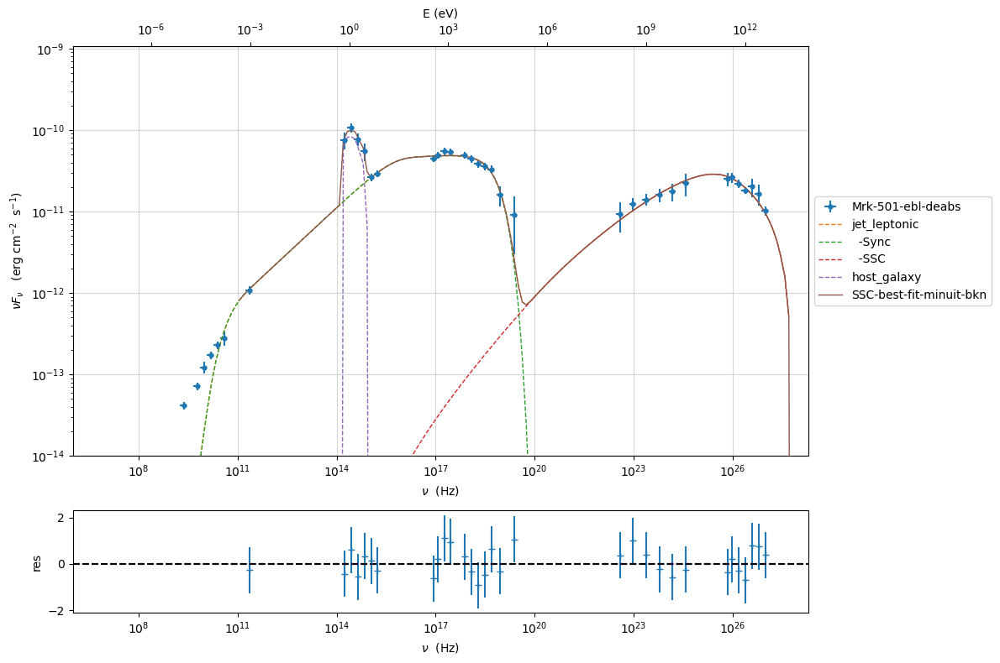

MCMC sampling
-------------

.. code:: ipython3

    from jetset.mcmc import McmcSampler
    from jetset.minimizer import ModelMinimizer

We used a flat prior centered on the best fit value. Setting
``bound=5.0`` and ``bound_rel=True`` means that:

1) the prior interval will be defined as [best_fit_val - delta_m ,
   best_fit_val + delta_p]

2) with delta_p=delta_m=best_fit_val*bound

If we set ``bound_rel=False`` then delta_p = delta_m =
best_fit_err*bound

It is possible to define asymmetric boundaries e.g. ``bound=[2.0,5.0]``
meaning that

1) for ``bound_rel=True``

   delta_p = best_fit_val*bound[1]

   delta_m =b est_fit_val*bound[0]

2) for ``bound_rel=False``

   delta_p = best_fit_err*bound[1]

   delta_m = best_fit_err*bound[0]

In the next release a more flexible prior interface will be added,
including different type of priors

Given the large parameter space, we select a sub sample of parameters
using the ``use_labels_dict``. If we do not pass the ‘use_labels_dict’
the full set of free parameters will be used

.. code:: ipython3

    model_minimizer_lsb = ModelMinimizer.load_model('model_minimizer_lsb.pkl')
    
    
    mcmc=McmcSampler(model_minimizer_lsb)
    
    labels=['N','B','beam_obj','s','gamma0_log_parab']
    model_name='jet_leptonic'
    use_labels_dict={model_name:labels}
    
    mcmc.run_sampler(nwalkers=128,burnin=10,steps=50,bound=5.0,bound_rel=True,threads=None,walker_start_bound=0.005,use_labels_dict=use_labels_dict)

.. parsed-literal::

    mcmc run starting
    

.. parsed-literal::

      0%|          | 0/50 [00:00<?, ?it/s]

.. parsed-literal::

    mcmc run done, with 1 threads took 279.97 seconds

.. code:: ipython3

    print(mcmc.acceptance_fraction)

.. parsed-literal::

    0.56578125

.. code:: ipython3

    mcmc.model.jet_leptonic.nu_min=1E6
    mcmc.model.nu_min=1E6
    p=mcmc.plot_model(sed_data=sed_data,fit_range=[1E11, 2E28],size=50)
    p.setlim(y_min=1E-14,x_min=1E6,x_max=2E28)

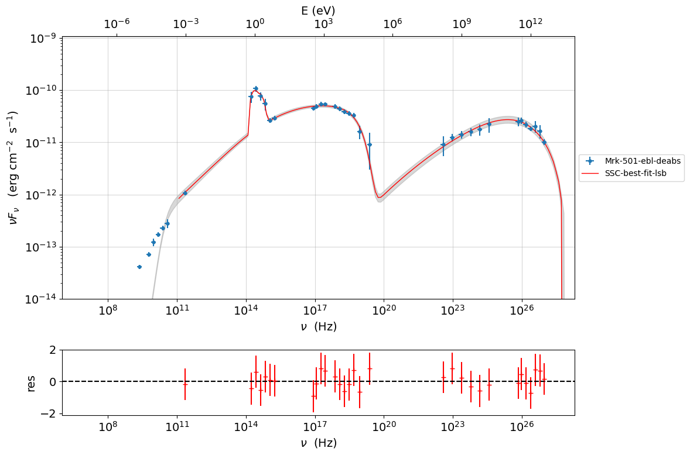

.. code:: ipython3

    f=mcmc.plot_chain('s',log_plot=False)

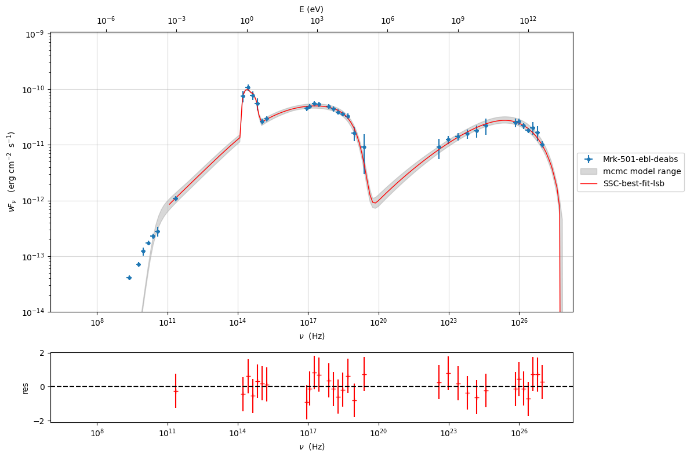

.. code:: ipython3

    f=mcmc.corner_plot()

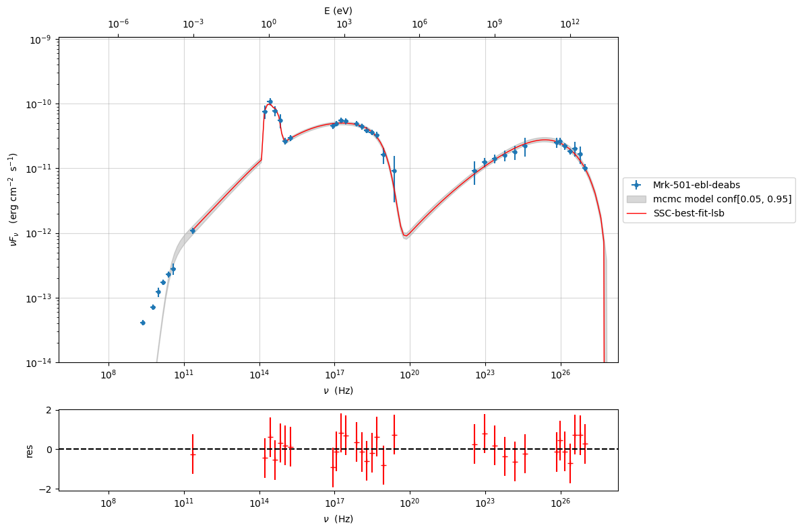

.. code:: ipython3

    mcmc.get_par('N')

.. parsed-literal::

    (array([24.21849323, 24.65218497, 24.38593037, ..., 22.71420676,
            26.93932893, 26.27969979]),
     0)

.. code:: ipython3

    f=mcmc.plot_par('beam_obj')

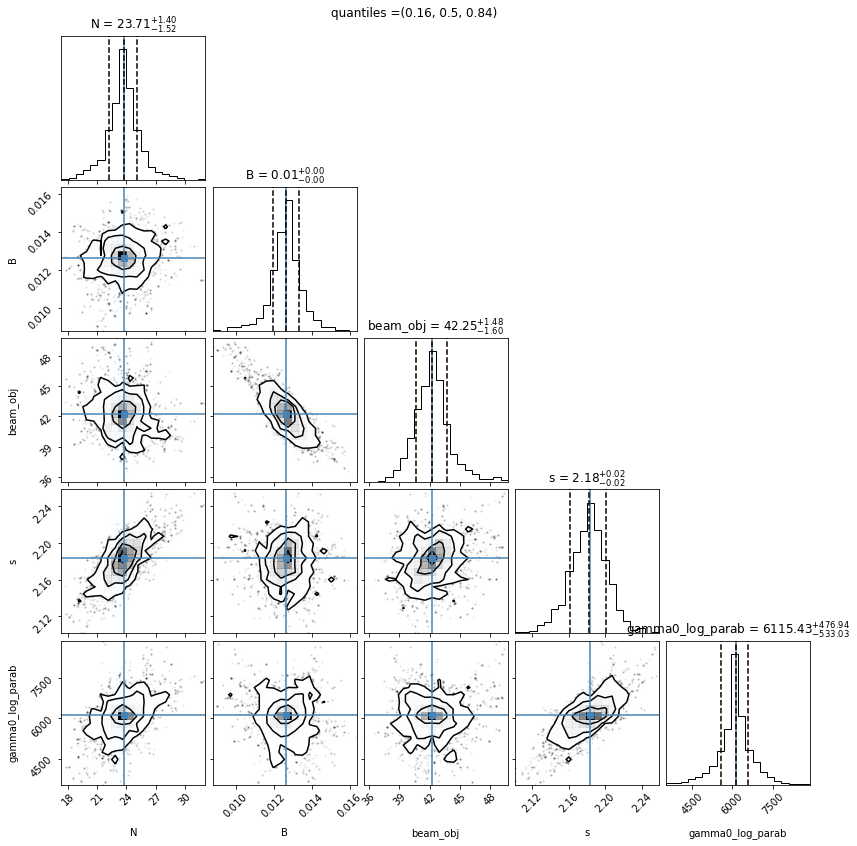

Save and reuse MCMC
-------------------

.. code:: ipython3

    mcmc.save('mcmc_sampler.pkl')

.. code:: ipython3

    from jetset.mcmc import McmcSampler
    from jetset.data_loader import ObsData
    from jetset.plot_sedfit import PlotSED
    from jetset.test_data_helper import  test_SEDs
    
    sed_data=ObsData.load('Mrk_501.pkl')
    
    ms=McmcSampler.load('mcmc_sampler.pkl')

.. code:: ipython3

    ms.model.nu_min=1E6
    ms.model.jet_leptonic.nu_min=1E6
    p=ms.plot_model(sed_data=sed_data,fit_range=[2E11, 2E28],size=50)
    p.setlim(y_min=1E-14,x_min=1E6,x_max=2E28)

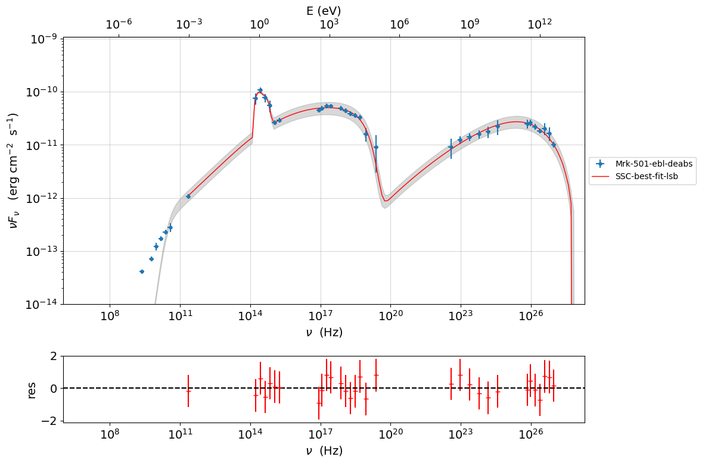

.. code:: ipython3

    f=ms.plot_par('beam_obj',log_plot=False)

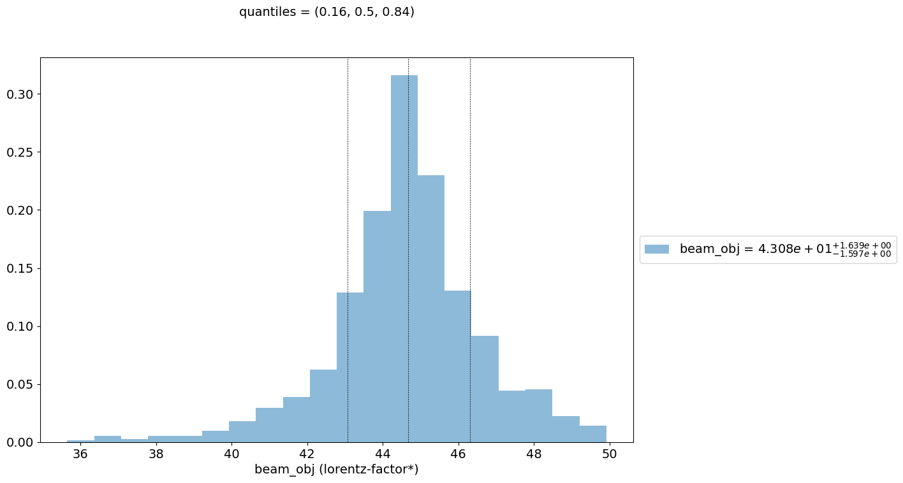

.. code:: ipython3

    f=ms.plot_chain('s',log_plot=False)

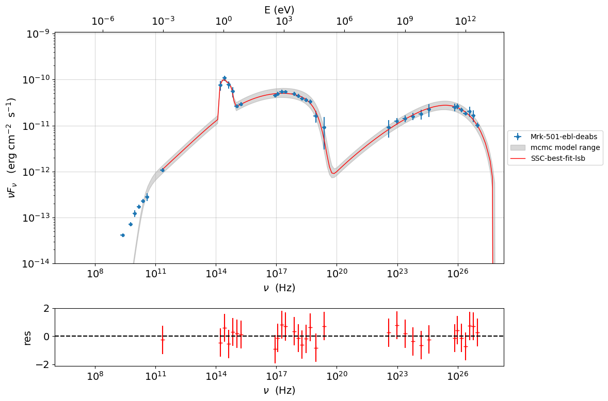

