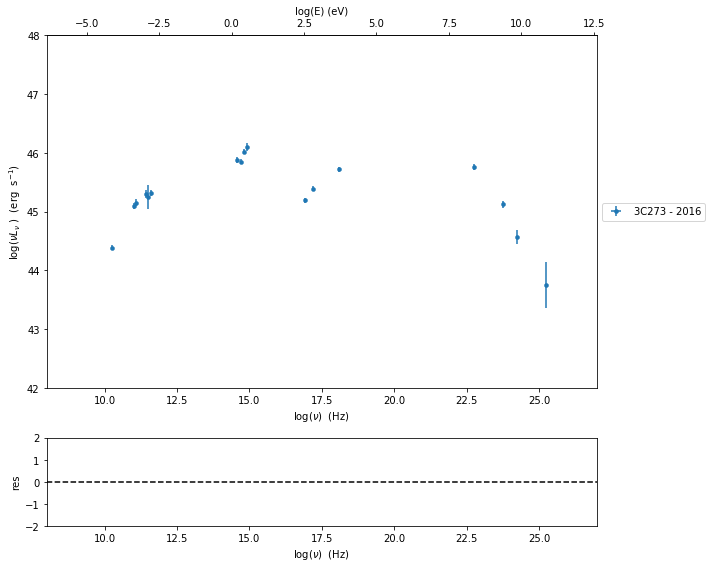
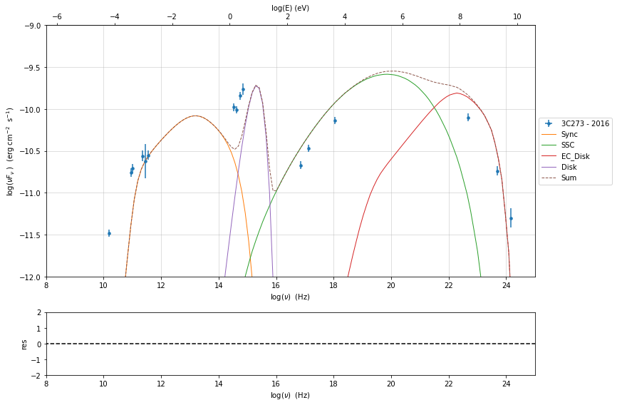
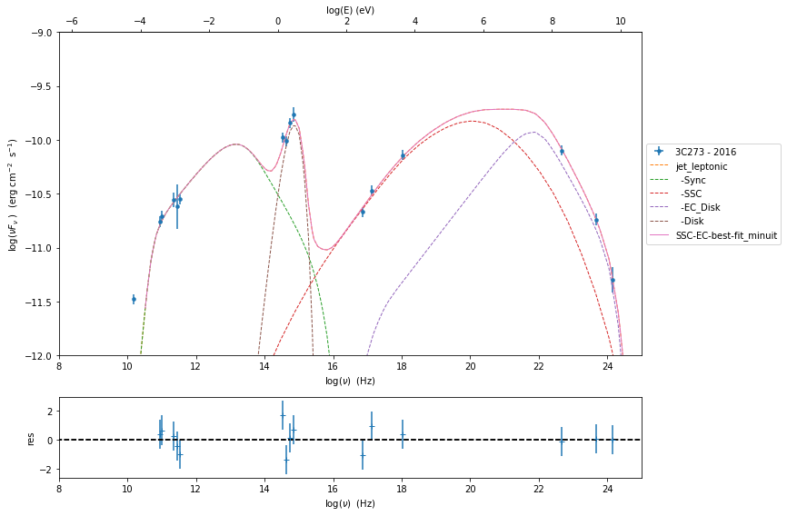
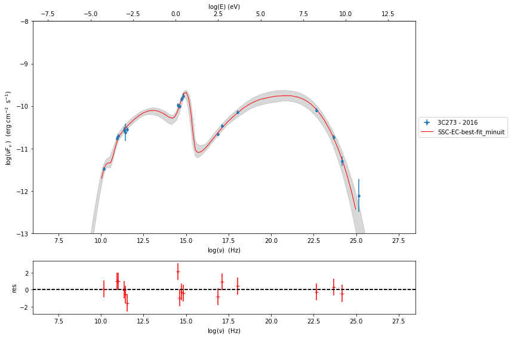

.. code:: ipython3

    import matplotlib.pylab as plt
    import jetset
    from jetset.data_loader import ObsData,Data
    from jetset.plot_sedfit import PlotSED
    import numpy as np

3C 273
======

Data
----

.. code:: ipython3

    d=np.genfromtxt('3C273_2012_2016.txt')
    data=Data(n_rows=d.shape[0])
    data.set_field('x',d[:,0])
    data.set_field('y',d[:,1])
    data.set_field('dy',value=d[:,2])

.. code:: ipython3

    data.set_meta_data('z',0.15834)
    data.set_meta_data('restframe','obs')
    data.set_meta_data('data_scale','log-log')
    data.set_meta_data('obj_name','3C273 - 2016')

.. code:: ipython3

    data.table

.. raw:: html

    <i>Table length=17</i>
    <table id="table4809671696" class="table-striped table-bordered table-condensed">
    <thead><tr><th>x</th><th>dx</th><th>y</th><th>dy</th><th>T_start</th><th>T_stop</th><th>UL</th><th>data_set</th></tr></thead>
    <thead><tr><th>Hz</th><th>Hz</th><th>erg / (cm2 s)</th><th>erg / (cm2 s)</th><th>MJD</th><th>MJD</th><th></th><th></th></tr></thead>
    <thead><tr><th>float64</th><th>float64</th><th>float64</th><th>float64</th><th>float64</th><th>float64</th><th>bool</th><th>bytes16</th></tr></thead>
    <tr><td>10.18</td><td>0.0</td><td>-11.48</td><td>0.008901</td><td>0.0</td><td>0.0</td><td>False</td><td>0.0</td></tr>
    <tr><td>10.96</td><td>0.0</td><td>-10.76</td><td>0.02835</td><td>0.0</td><td>0.0</td><td>False</td><td>0.0</td></tr>
    <tr><td>11.01</td><td>0.0</td><td>-10.71</td><td>0.03215</td><td>0.0</td><td>0.0</td><td>False</td><td>0.0</td></tr>
    <tr><td>11.35</td><td>0.0</td><td>-10.56</td><td>0.05016</td><td>0.0</td><td>0.0</td><td>False</td><td>0.0</td></tr>
    <tr><td>11.44</td><td>0.0</td><td>-10.62</td><td>0.2</td><td>0.0</td><td>0.0</td><td>False</td><td>0.0</td></tr>
    <tr><td>11.54</td><td>0.0</td><td>-10.55</td><td>0.03041</td><td>0.0</td><td>0.0</td><td>False</td><td>0.0</td></tr>
    <tr><td>14.52</td><td>0.0</td><td>-9.979</td><td>0.02222</td><td>0.0</td><td>0.0</td><td>False</td><td>0.0</td></tr>
    <tr><td>14.84</td><td>0.0</td><td>-9.762</td><td>0.05242</td><td>0.0</td><td>0.0</td><td>False</td><td>0.0</td></tr>
    <tr><td>14.74</td><td>0.0</td><td>-9.842</td><td>0.01894</td><td>0.0</td><td>0.0</td><td>False</td><td>0.0</td></tr>
    <tr><td>14.63</td><td>0.0</td><td>-10.01</td><td>0.01327</td><td>0.0</td><td>0.0</td><td>False</td><td>0.0</td></tr>
    <tr><td>16.86</td><td>0.0</td><td>-10.67</td><td>0.00353</td><td>0.0</td><td>0.0</td><td>False</td><td>0.0</td></tr>
    <tr><td>17.12</td><td>0.0</td><td>-10.47</td><td>0.006101</td><td>0.0</td><td>0.0</td><td>False</td><td>0.0</td></tr>
    <tr><td>18.03</td><td>0.0</td><td>-10.14</td><td>0.006328</td><td>0.0</td><td>0.0</td><td>False</td><td>0.0</td></tr>
    <tr><td>22.68</td><td>0.0</td><td>-10.1</td><td>0.01615</td><td>0.0</td><td>0.0</td><td>False</td><td>0.0</td></tr>
    <tr><td>23.68</td><td>0.0</td><td>-10.74</td><td>0.03565</td><td>0.0</td><td>0.0</td><td>False</td><td>0.0</td></tr>
    <tr><td>24.16</td><td>0.0</td><td>-11.3</td><td>0.1081</td><td>0.0</td><td>0.0</td><td>False</td><td>0.0</td></tr>
    <tr><td>25.16</td><td>0.0</td><td>-12.11</td><td>0.386</td><td>0.0</td><td>0.0</td><td>False</td><td>0.0</td></tr>
    </table>

.. code:: ipython3

    #Obs
    %matplotlib inline
    sed_data=ObsData(data_table=data)
    
    sed_data.add_systematics(0.1,[10.**6,10.**29])
    p=sed_data.plot_sed(frame='obs')
    p.rescale(x_min=8,x_max=27,y_min=-14,y_max=-8)
    p.sedplot.grid(False)
    p.fig.savefig('3C273_obs_frame.png')

.. image:: 3C273_bkn_files/3C273_bkn_6_0.png

.. code:: ipython3

    #Restframe
    p_src=sed_data.plot_sed(frame='src')
    p_src.rescale(x_min=8,x_max=27,y_min=42,y_max=48)
    p_src.sedplot.grid(False)
    p_src.fig.savefig('3C273_rest_frame.png')

.. code:: ipython3

    sed_data.save('3C273.pkl')

Phenomenological model constraining
-----------------------------------

.. code:: ipython3

    from jetset.sed_shaper import  SEDShape
    my_shape=SEDShape(sed_data)
    my_shape.eval_indices(silent=True)
    p=my_shape.plot_indices()
    p.rescale(x_min=8,x_max=25,y_min=-12,y_max=-8)
    p.sedplot.grid(False)

.. parsed-literal::

    ===================================================================================================================
    
    *** evaluating spectral indices for data ***
    ===================================================================================================================
    

.. image:: 3C273_bkn_files/3C273_bkn_10_1.png

.. code:: ipython3

    # SYNCHROTRON 
    mm,best_fit=my_shape.sync_fit(check_BBB_template=True,
                                  check_host_gal_template=False,
                                  use_log_par=True,
                                  Ep_start=None,
                                  minimizer='minuit',
                                  silent=True,
                                  fit_range=[10,16])

.. parsed-literal::

    ===================================================================================================================
    
    *** Log-Polynomial fitting of the synchrotron component ***
    ---> first blind fit run,  fit range: [10, 16]
    --> class:  LSP
    
    --> class:  LSP
    
    
      model name      name     bestfit val     err +     err -   start val   fit range min fit range max frozen
    ------------- ----------- ------------- ------------ ----- ------------- ------------- ------------- ------
    LogParabolaEp           b -1.636749e-01 2.151319e-02    -- -1.145592e-01 -1.000000e+01  0.000000e+00  False
    LogParabolaEp          Ep  1.307566e+01 2.455866e-01    --  1.389217e+01  0.000000e+00  3.000000e+01  False
    LogParabolaEp          Sp -1.008000e+01 9.491327e-02    -- -9.846109e+00 -3.000000e+01  0.000000e+00  False
              BBB nuFnu_p_BBB -9.566368e+00 1.011334e-01    -- -9.846109e+00 -1.184611e+01 -7.846109e+00  False
              BBB    nu_scale  1.360524e-04 3.263365e-07    --  0.000000e+00 -5.000000e-01  5.000000e-01  False
    ---> sync       nu_p=+1.307566e+01 (err=+2.455866e-01)  nuFnu_p=-1.008000e+01 (err=+9.491327e-02) curv.=-1.636749e-01 (err=+2.151319e-02)
    ===================================================================================================================
    

.. code:: ipython3

    # INVERSE COMPTON
    my_shape.IC_fit(fit_range=[16,26],minimizer='lsb', silent=True)

.. parsed-literal::

    ===================================================================================================================
    
    *** Log-Polynomial fitting of the IC component ***
    ---> fit range: [16, 26]
    ---> LogCubic fit
    
    
    model name name  bestfit val     err +     err -   start val   fit range min fit range max frozen
    ---------- ---- ------------- ------------ ----- ------------- ------------- ------------- ------
      LogCubic    b -1.007154e-01 7.271402e-03    -- -1.000000e+00 -1.000000e+01  0.000000e+00  False
      LogCubic    c -6.423257e-03 2.291142e-03    -- -1.000000e+00 -1.000000e+01  1.000000e+01  False
      LogCubic   Ep  2.055866e+01 1.199822e-01    --  2.037447e+01  0.000000e+00  3.000000e+01  False
      LogCubic   Sp -9.585524e+00 6.225231e-02    -- -1.000000e+01 -3.000000e+01  0.000000e+00  False
    ---> IC         nu_p=+2.055866e+01 (err=+1.199822e-01)  nuFnu_p=-9.585524e+00 (err=+6.225231e-02) curv.=-1.007154e-01 (err=+7.271402e-03)
    ===================================================================================================================
    

.. parsed-literal::

    (<jetset.minimizer.ModelMinimizer at 0x1a22876f50>,
     <jetset.minimizer.FitResults at 0x1a227a2550>)

.. code:: ipython3

    p=my_shape.plot_shape_fit()
    p.rescale(x_min=8,x_max=25,y_min=-12,y_max=-8)
    p.sedplot.grid(False)

.. image:: 3C273_bkn_files/3C273_bkn_13_0.png

Model
=====

.. code:: ipython3

    #Constrain_SS_EC
    from jetset.obs_constrain import ObsConstrain
    from jetset.model_manager import  FitModel
    from jetset.minimizer import fit_SED
    sed_obspar=ObsConstrain(beaming=14,
                            B_range=[0.089,2.5],
                            distr_e='bkn',
                            t_var_sec=1*86400,
                            nu_cut_IR=1E10,
                            SEDShape=my_shape)
    
    
    prefit_jet=sed_obspar.constrain_SSC_EC_model(electron_distribution_log_values=True,EC_componets_list=['EC_Disk'],R_H=1E18,silent=True)

.. parsed-literal::

    ===================================================================================================================
    
    ***  constrains parameters from observable ***
    
        name          par type           units          val      phys. bound. min phys. bound. max  log  frozen
    ----------- ------------------- --------------- ------------ ---------------- ---------------- ----- ------
           gmin  low-energy-cut-off lorentz-factor* 1.700058e+00     0.000000e+00     9.000000e+00  True  False
           gmax high-energy-cut-off lorentz-factor* 3.943967e+00     0.000000e+00     1.500000e+01  True  False
              N    emitters_density         1 / cm3 9.312423e+02     0.000000e+00               -- False  False
              p   LE_spectral_slope                 2.140556e+00    -1.000000e+01     1.000000e+01 False  False
            p_1   HE_spectral_slope                 3.500000e+00    -1.000000e+01     1.000000e+01 False  False
    gamma_break    turn-over-energy lorentz-factor* 3.237887e+00     0.000000e+00     9.000000e+00  True  False
              R         region_size              cm 5.884391e+16     1.000000e+03     1.000000e+30 False  False
            R_H     region_position              cm 1.000000e+18     0.000000e+00               -- False   True
              B      magnetic_field               G 8.900000e-02     0.000000e+00               -- False  False
       beam_obj             beaming Lorentz-factor* 1.400000e+01     1.000000e-04               -- False  False
         z_cosm            redshift                 1.583400e-01     0.000000e+00               -- False  False
         L_Disk                Disk         erg / s 1.980042e+46     0.000000e+00               -- False  False
         T_Disk                Disk               K 3.018434e+04     0.000000e+00               -- False  False
    
    ===================================================================================================================
    

.. code:: ipython3

    prefit_jet.eval()
    p=prefit_jet.plot_model(sed_data=sed_data)
    prefit_jet.save_model('prefit_jet_EC_model.pkl')
    p.rescale(x_min=8,x_max=25,y_min=-12,y_max=-9)

Model fitting with Minuit
-------------------------

.. code:: ipython3

    from jetset.jet_model import Jet
    jet_minuit=Jet.load_model('prefit_jet_EC_model.pkl')
    jet_minuit.set_gamma_grid_size(300)
    fit_model_minuit=FitModel( jet=jet_minuit, name='SSC-EC-best-fit_minuit')
    fit_model_minuit.show_model_components()

.. parsed-literal::

        name          par type           units          val      phys. bound. min phys. bound. max  log  frozen
    ----------- ------------------- --------------- ------------ ---------------- ---------------- ----- ------
           gmin  low-energy-cut-off lorentz-factor* 1.700058e+00     0.000000e+00     9.000000e+00  True  False
           gmax high-energy-cut-off lorentz-factor* 3.943967e+00     0.000000e+00     1.500000e+01  True  False
              N    emitters_density         1 / cm3 9.312423e+02     0.000000e+00               -- False  False
              p   LE_spectral_slope                 2.140556e+00    -1.000000e+01     1.000000e+01 False  False
            p_1   HE_spectral_slope                 3.500000e+00    -1.000000e+01     1.000000e+01 False  False
    gamma_break    turn-over-energy lorentz-factor* 3.237887e+00     0.000000e+00     9.000000e+00  True  False
         L_Disk                Disk         erg / s 1.980042e+46     0.000000e+00               -- False  False
         T_Disk                Disk               K 3.018434e+04     0.000000e+00               -- False  False
              R         region_size              cm 5.884391e+16     1.000000e+03     1.000000e+30 False  False
            R_H     region_position              cm 1.000000e+18     0.000000e+00               -- False   True
              B      magnetic_field               G 8.900000e-02     0.000000e+00               -- False  False
       beam_obj             beaming Lorentz-factor* 1.400000e+01     1.000000e-04               -- False  False
         z_cosm            redshift                 1.583400e-01     0.000000e+00               -- False  False
    
    -------------------------------------------------------------------------------------------------------------------
    Composite model description
    -------------------------------------------------------------------------------------------------------------------
    name: SSC-EC-best-fit_minuit  
    type: composite_model  
    components models:
     -model name: jet_leptonic model type: jet
    
    -------------------------------------------------------------------------------------------------------------------

.. parsed-literal::

    /opt/anaconda3/lib/python3.7/site-packages/jetset-1.1.2-py3.7-macosx-10.9-x86_64.egg/jetset/model_manager.py:160: UserWarning: no cosmology defined, using default FlatLambdaCDM(name="Planck13", H0=67.8 km / (Mpc s), Om0=0.307, Tcmb0=2.725 K, Neff=3.05, m_nu=[0.   0.   0.06] eV, Ob0=0.0483)
      warnings.warn('no cosmology defined, using default %s'%self.cosmo)

.. code:: ipython3

    fit_model_minuit.freeze('jet_leptonic','z_cosm')
    fit_model_minuit.freeze('jet_leptonic','R_H')
    #fit_model_minuit.freeze('jet_leptonic','T_Disk')
    
    fit_model_minuit.jet_leptonic.parameters.beam_obj.fit_range=[7., 20.]
    fit_model_minuit.jet_leptonic.parameters.R.fit_range=[1E15,1E18]
    fit_model_minuit.jet_leptonic.parameters.B.fit_range=[0.089,2]
    fit_model_minuit.jet_leptonic.parameters.T_Disk.val=1.6E4

.. code:: ipython3

    from jetset.minimizer import ModelMinimizer
    model_minimizer_minuit=ModelMinimizer('minuit')
    best_fit_minuit=model_minimizer_minuit.fit(fit_model_minuit,sed_data,3E10,1E25,fitname='SSC-EC-best-fit_minuit',repeat=3)

.. parsed-literal::

    filtering data in fit range = [3.000000e+10,1.000000e+25]
    data length 15
    ===================================================================================================================
    
    *** start fit process ***
    ----- 
    fit run: 0
    | minim function calls=730, chisq=9.126531 UL part=-0.000000000
    fit run: 1
    / minim function calls=210, chisq=9.096704 UL part=-0.000000
    fit run: 2
    | minim function calls=150, chisq=9.123039 UL part=-0.000000
    **************************************************************************************************
    Fit report
    
    Model: SSC-EC-best-fit_minuit
     model name      name          par type           units          val      phys. bound. min phys. bound. max  log  frozen
    ------------ ----------- ------------------- --------------- ------------ ---------------- ---------------- ----- ------
    jet_leptonic        gmin  low-energy-cut-off lorentz-factor* 1.054560e+00     0.000000e+00     9.000000e+00  True  False
    jet_leptonic        gmax high-energy-cut-off lorentz-factor* 4.574573e+00     0.000000e+00     1.500000e+01  True  False
    jet_leptonic           N    emitters_density         1 / cm3 4.276541e+02     0.000000e+00               -- False  False
    jet_leptonic           p   LE_spectral_slope                 2.175180e+00    -1.000000e+01     1.000000e+01 False  False
    jet_leptonic         p_1   HE_spectral_slope                 4.078331e+00    -1.000000e+01     1.000000e+01 False  False
    jet_leptonic gamma_break    turn-over-energy lorentz-factor* 3.447802e+00     0.000000e+00     9.000000e+00  True  False
    jet_leptonic      L_Disk                Disk         erg / s 1.391911e+46     0.000000e+00               -- False  False
    jet_leptonic      T_Disk                Disk               K 1.059566e+04     0.000000e+00               -- False  False
    jet_leptonic           R         region_size              cm 3.293456e+17     1.000000e+03     1.000000e+30 False  False
    jet_leptonic         R_H     region_position              cm 1.000000e+18     0.000000e+00               -- False   True
    jet_leptonic           B      magnetic_field               G 9.032049e-02     0.000000e+00               -- False  False
    jet_leptonic    beam_obj             beaming Lorentz-factor* 7.000004e+00     1.000000e-04               -- False  False
    jet_leptonic      z_cosm            redshift                 1.583400e-01     0.000000e+00               -- False   True
    
    converged=True
    calls=153
    ------------------------------------------------------------------
    | FCN = 9.097                   |     Ncalls=147 (152 total)     |
    | EDM = 0.0564 (Goal: 1E-05)    |            up = 1.0            |
    ------------------------------------------------------------------
    |  Valid Min.   | Valid Param.  | Above EDM | Reached call limit |
    ------------------------------------------------------------------
    |     False     |     True      |   True    |       False        |
    ------------------------------------------------------------------
    | Hesse failed  |   Has cov.    | Accurate  | Pos. def. | Forced |
    ------------------------------------------------------------------
    |     False     |     True      |   False   |   False   |  True  |
    ------------------------------------------------------------------
    --------------------------------------------------------------------------------------------
    |   | Name   |   Value   | Hesse Err | Minos Err- | Minos Err+ | Limit-  | Limit+  | Fixed |
    --------------------------------------------------------------------------------------------
    | 0 | par_0  |   1.055   |   0.003   |            |            |    0    |    9    |       |
    | 1 | par_1  |  0.457E1  |  0.000E1  |            |            |    0    |   15    |       |
    | 2 | par_2  |    428    |    17     |            |            |    0    |         |       |
    | 3 | par_3  |   2.18    |   0.05    |            |            |   -10   |   10    |       |
    | 4 | par_4  |    4.1    |    0.4    |            |            |   -10   |   10    |       |
    | 5 | par_5  |   3.45    |   0.12    |            |            |    0    |    9    |       |
    | 6 | par_6  |  1.39E46  |  0.30E46  |            |            |    0    |         |       |
    | 7 | par_7  |  1.06E4   |  0.16E4   |            |            |    0    |         |       |
    | 8 | par_8  | 0.329E18  | 0.002E18  |            |            |  1e+15  |  1e+18  |       |
    | 9 | par_9  |   0.090   |   0.012   |            |            |  0.089  |    2    |       |
    | 10| par_10 |    7.0    |    1.1    |            |            |    7    |   20    |       |
    --------------------------------------------------------------------------------------------
    dof=4
    chisq=9.096734, chisq/red=2.274183 null hypothesis sig=0.058727
    
    best fit pars
     model name      name    bestfit val     err +     err -  start val   fit range min fit range max frozen
    ------------ ----------- ------------ ------------ ----- ------------ ------------- ------------- ------
    jet_leptonic        gmin 1.054560e+00 2.903022e-03    -- 9.744852e-01  0.000000e+00  9.000000e+00  False
    jet_leptonic        gmax 4.574573e+00 2.901963e-03    -- 4.576266e+00  0.000000e+00  1.500000e+01  False
    jet_leptonic           N 4.276541e+02 1.720360e+01    -- 3.441715e+02  0.000000e+00            --  False
    jet_leptonic           p 2.175180e+00 4.735248e-02    -- 2.081664e+00 -1.000000e+01  1.000000e+01  False
    jet_leptonic         p_1 4.078331e+00 3.610726e-01    -- 4.091054e+00 -1.000000e+01  1.000000e+01  False
    jet_leptonic gamma_break 3.447802e+00 1.244699e-01    -- 3.413210e+00  0.000000e+00  9.000000e+00  False
    jet_leptonic      L_Disk 1.391911e+46 2.968917e+45    -- 1.357684e+46  0.000000e+00            --  False
    jet_leptonic      T_Disk 1.059566e+04 1.646329e+03    -- 1.038852e+04  0.000000e+00            --  False
    jet_leptonic           R 3.293456e+17 2.108897e+15    -- 3.542353e+17  1.000000e+15  1.000000e+18  False
    jet_leptonic         R_H           --           --    -- 1.000000e+18  0.000000e+00            --   True
    jet_leptonic           B 9.032049e-02 1.188099e-02    -- 8.900035e-02  8.900000e-02  2.000000e+00  False
    jet_leptonic    beam_obj 7.000004e+00 1.121005e+00    -- 7.000000e+00  7.000000e+00  2.000000e+01  False
    jet_leptonic      z_cosm           --           --    -- 1.583400e-01  0.000000e+00            --   True
    **************************************************************************************************
    
    ===================================================================================================================
    

.. code:: ipython3

    #best_fit_minuit.bestfit_table

.. code:: ipython3

    %matplotlib inline
    fit_model_minuit.set_nu_grid(1E3,1E30,500)
    fit_model_minuit.eval()
    p=fit_model_minuit.plot_model(sed_data=sed_data)
    p.rescale(x_min=8,x_max=25,y_min=-12,y_max=-9)
    p.sedplot.grid(False)
    p.fig.savefig('fit_EC_3c273_2016_minuit.png')

.. code:: ipython3

    best_fit_minuit.save_report('EC-best-fit-minuit_2016.txt')
    model_minimizer_minuit.save_model('EC-best-fit-minuit_2016.pkl')

MCMC
----

.. code:: ipython3

    from jetset.mcmc import McmcSampler
    from jetset.minimizer import ModelMinimizer

.. code:: ipython3

    model_minimizer_minuit = ModelMinimizer.load_model('EC-best-fit-minuit_2016.pkl')
    
    mcmc=McmcSampler(model_minimizer_minuit)
    
    labels=['N','B','beam_obj','s','gamma0_log_parab']
    model_name='jet_leptonic'
    use_labels_dict={model_name:labels}
    
    mcmc.run_sampler(nwalkers=128,burnin=10,steps=50,bound=5.0,bound_rel=True,threads=None,walker_start_bound=0.005,use_labels_dict=None)

.. parsed-literal::

    mcmc run starting

.. parsed-literal::

      0%|          | 0/50 [00:00<?, ?it/s]/opt/anaconda3/lib/python3.7/site-packages/emcee/moves/red_blue.py:99: RuntimeWarning: invalid value encountered in double_scalars
      lnpdiff = f + nlp - state.log_prob[j]
    100%|██████████| 50/50 [09:21<00:00, 11.22s/it]

.. parsed-literal::

    mcmc run done, with 1 threads took 574.24 seconds

.. parsed-literal::

    

.. code:: ipython3

    print(mcmc.acceptance_fraction)

.. parsed-literal::

    0.3690625

.. code:: ipython3

    p=mcmc.plot_model(sed_data=sed_data,fit_range=[10.,25],size=50)
    p.rescale(y_min=-13,x_min=6,x_max=28.5)
    p.sedplot.grid(False)
    #p.fig.savefig('fit_EC_mcmc_3c273_2016.png')

.. code:: ipython3

    mcmc.save('mcmc_sampler_model_2016.pkl')

.. code:: ipython3

    #f=mcmc.corner_plot()

