.. _model_fitting_EC:

.. code:: ipython3

    import warnings
    warnings.filterwarnings('ignore')

Model fitting 3: External Compton
=================================

Loading data
------------

see the :ref:`data_format` user guide for further information about loading data and :ref:`jet_physical_guide_EC` for the information regarding the implementation of the external Conpton model

.. code:: ipython3

    from jetset.jet_model import Jet
    from jetset.data_loader import Data,ObsData
    from jetset.test_data_helper import  test_SEDs
    test_SEDs

.. parsed-literal::

    ['/Users/orion/anaconda3/envs/jetset/lib/python3.8/site-packages/jetset/test_data/SEDs_data/SED_3C345.ecsv',
     '/Users/orion/anaconda3/envs/jetset/lib/python3.8/site-packages/jetset/test_data/SEDs_data/SED_MW_Mrk421_EBL_DEABS.ecsv',
     '/Users/orion/anaconda3/envs/jetset/lib/python3.8/site-packages/jetset/test_data/SEDs_data/SED_MW_Mrk501_EBL_ABS.ecsv',
     '/Users/orion/anaconda3/envs/jetset/lib/python3.8/site-packages/jetset/test_data/SEDs_data/SED_MW_Mrk501_EBL_DEABS.ecsv']

.. code:: ipython3

    data=Data.from_file(test_SEDs[0])

.. code:: ipython3

    sed_data=ObsData(data_table=data)

.. code:: ipython3

    %matplotlib inline
    p=sed_data.plot_sed(show_dataset=True)

.. image:: Jet_example_model_fit_EC_files/Jet_example_model_fit_EC_8_0.png

we filter out the data set ``-1``

.. code:: ipython3

    sed_data.show_data_sets()
    sed_data.filter_data_set('-1',exclude=True)
    sed_data.show_data_sets()
    p=sed_data.plot_sed()

.. parsed-literal::

    current datasets
    dataset -1
    dataset 0
    dataset 1
    dataset 2
    ---> excluding  data_set/s ['-1']
    filter -1 192
    current datasets
    dataset 0
    dataset 1
    dataset 2
    ---> data sets left after filtering None
    ---> data len after filtering=192
    current datasets
    dataset 0
    dataset 1
    dataset 2

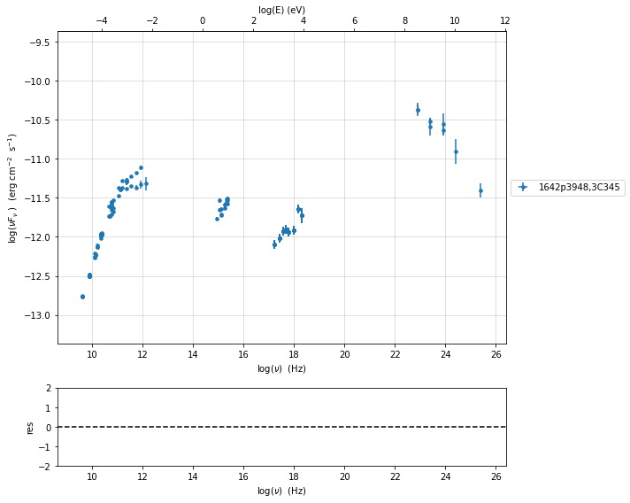

.. code:: ipython3

    sed_data.group_data(bin_width=.2)
    sed_data.add_systematics(0.2,[10.**6,10.**29])
    p=sed_data.plot_sed()

.. parsed-literal::

    ================================================================================
    
    ***  binning data  ***
    ---> N bins= 80
    ---> bin_widht= 0.2
    ================================================================================
    

.. image:: Jet_example_model_fit_EC_files/Jet_example_model_fit_EC_11_1.png

.. code:: ipython3

    sed_data.save('3C454_data.pkl')

Phenomenological model constraining
-----------------------------------

see the :ref:`phenom_constr` user guide for further information about phenomenological model constraining

.. code:: ipython3

    from jetset.sed_shaper import  SEDShape
    my_shape=SEDShape(sed_data)
    my_shape.eval_indices(silent=True)
    p=my_shape.plot_indices()
    p.rescale(y_min=-15,y_max=-6)

.. parsed-literal::

    ================================================================================
    
    *** evaluating spectral indices for data ***
    ================================================================================
    

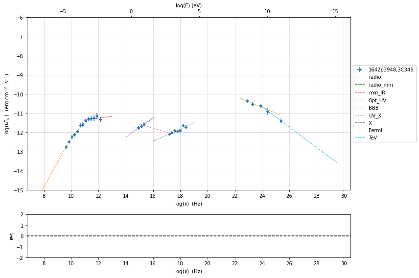

for the synchrotron sed_shaping we include the check for Big Blue Bump
(BBB) component. Moreover, we force the model to use a pure
log-parabolic function and not a log-cubic one in order to get a better
estimation of the BBB component. The fit values of the BBB component
will be used in the ``ObsConstrain`` to guess the accretion disk
luminosity and temperature

.. code:: ipython3

    mm,best_fit=my_shape.sync_fit(check_BBB_template=True,
                                  check_host_gal_template=False,
                                  use_log_par=True,
                                  Ep_start=None,
                                  minimizer='lsb',
                                  silent=True,
                                  fit_range=[9,16])

.. parsed-literal::

    ================================================================================
    
    *** Log-Polynomial fitting of the synchrotron component ***
    ---> first blind fit run,  fit range: [9, 16]
    --> class:  LSP
    
    --> class:  LSP
    
    

.. raw:: html

    <i>Table length=5</i>
    <table id="table140242212242240-356215" class="table-striped table-bordered table-condensed">
    <thead><tr><th>model name</th><th>name</th><th>val</th><th>bestfit val</th><th>err +</th><th>err -</th><th>start val</th><th>fit range min</th><th>fit range max</th><th>frozen</th></tr></thead>
    <tr><td>LogParabolaEp</td><td>b</td><td>-2.984653e-01</td><td>-2.984653e-01</td><td>5.631694e-02</td><td>--</td><td>-1.527892e-01</td><td>-1.000000e+01</td><td>0.000000e+00</td><td>False</td></tr>
    <tr><td>LogParabolaEp</td><td>Ep</td><td>1.190850e+01</td><td>1.190850e+01</td><td>2.238841e-01</td><td>--</td><td>1.298338e+01</td><td>0.000000e+00</td><td>3.000000e+01</td><td>False</td></tr>
    <tr><td>LogParabolaEp</td><td>Sp</td><td>-1.123366e+01</td><td>-1.123366e+01</td><td>7.306404e-02</td><td>--</td><td>-1.095506e+01</td><td>-3.000000e+01</td><td>0.000000e+00</td><td>False</td></tr>
    <tr><td>BBB</td><td>nuFnu_p_BBB</td><td>-1.155965e+01</td><td>-1.155965e+01</td><td>6.791135e-02</td><td>--</td><td>-1.095506e+01</td><td>-1.295506e+01</td><td>-8.955061e+00</td><td>False</td></tr>
    <tr><td>BBB</td><td>nu_scale</td><td>7.058302e-02</td><td>7.058302e-02</td><td>2.539034e-03</td><td>--</td><td>0.000000e+00</td><td>-5.000000e-01</td><td>5.000000e-01</td><td>False</td></tr>
    </table>
    

.. parsed-literal::

    ---> sync       nu_p=+1.190850e+01 (err=+2.238841e-01)  nuFnu_p=-1.123366e+01 (err=+7.306404e-02) curv.=-2.984653e-01 (err=+5.631694e-02)
    ================================================================================
    

.. code:: ipython3

    my_shape.IC_fit(fit_range=[16,26],minimizer='minuit', silent=True)
    p=my_shape.plot_shape_fit()
    p.rescale(y_min=-15)

.. parsed-literal::

    ================================================================================
    
    *** Log-Polynomial fitting of the IC component ***
    ---> fit range: [16, 26]
    ---> LogCubic fit
    
    

.. raw:: html

    <i>Table length=4</i>
    <table id="table140242212443664-458478" class="table-striped table-bordered table-condensed">
    <thead><tr><th>model name</th><th>name</th><th>val</th><th>bestfit val</th><th>err +</th><th>err -</th><th>start val</th><th>fit range min</th><th>fit range max</th><th>frozen</th></tr></thead>
    <tr><td>LogCubic</td><td>b</td><td>-1.128690e-01</td><td>-1.128690e-01</td><td>1.241604e-02</td><td>--</td><td>-1.000000e+00</td><td>-1.000000e+01</td><td>0.000000e+00</td><td>False</td></tr>
    <tr><td>LogCubic</td><td>c</td><td>-1.064758e-02</td><td>-1.064758e-02</td><td>2.396209e-03</td><td>--</td><td>-1.000000e+00</td><td>-1.000000e+01</td><td>1.000000e+01</td><td>False</td></tr>
    <tr><td>LogCubic</td><td>Ep</td><td>2.273377e+01</td><td>2.273377e+01</td><td>1.454766e-01</td><td>--</td><td>2.270678e+01</td><td>0.000000e+00</td><td>3.000000e+01</td><td>False</td></tr>
    <tr><td>LogCubic</td><td>Sp</td><td>-1.043099e+01</td><td>-1.043099e+01</td><td>6.086309e-02</td><td>--</td><td>-1.000000e+01</td><td>-3.000000e+01</td><td>0.000000e+00</td><td>False</td></tr>
    </table>
    

.. parsed-literal::

    ---> IC         nu_p=+2.273377e+01 (err=+1.454766e-01)  nuFnu_p=-1.043099e+01 (err=+6.086309e-02) curv.=-1.128690e-01 (err=+1.241604e-02)
    ================================================================================
    

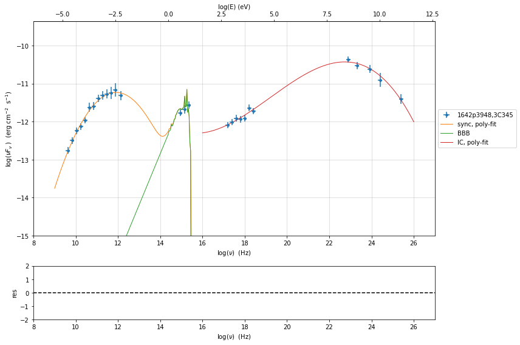

In this case we use the ``constrain_SSC_EC_model``, and we ask to use a
dusty torus and BLR component external component

read the section :ref:`jet_physical_guide_EC`  for more information regarding the EC model

.. code:: ipython3

    from jetset.obs_constrain import ObsConstrain
    from jetset.model_manager import  FitModel
    from jetset.minimizer import fit_SED
    sed_obspar=ObsConstrain(beaming=25,
                            B_range=[0.1,0.2],
                            distr_e='bkn',
                            t_var_sec=7*86400,
                            nu_cut_IR=1E9,
                            SEDShape=my_shape)
    
    
    prefit_jet=sed_obspar.constrain_SSC_EC_model(electron_distribution_log_values=False,EC_componets_list=['EC_DT','EC_BLR'],R_H=1E18,silent=True)

.. parsed-literal::

    ================================================================================
    
    ***  constrains parameters from observable ***
    

.. raw:: html

    <i>Table length=19</i>
    <table id="table140242182551200-938951" class="table-striped table-bordered table-condensed">
    <thead><tr><th>model name</th><th>name</th><th>par type</th><th>units</th><th>val</th><th>phys. bound. min</th><th>phys. bound. max</th><th>log</th><th>frozen</th></tr></thead>
    <tr><td>jet_leptonic</td><td>R</td><td>region_size</td><td>cm</td><td>2.845488e+17</td><td>1.000000e+03</td><td>1.000000e+30</td><td>False</td><td>False</td></tr>
    <tr><td>jet_leptonic</td><td>R_H</td><td>region_position</td><td>cm</td><td>1.000000e+18</td><td>0.000000e+00</td><td>--</td><td>False</td><td>True</td></tr>
    <tr><td>jet_leptonic</td><td>B</td><td>magnetic_field</td><td>gauss</td><td>1.500000e-01</td><td>0.000000e+00</td><td>--</td><td>False</td><td>False</td></tr>
    <tr><td>jet_leptonic</td><td>beam_obj</td><td>beaming</td><td>lorentz-factor*</td><td>2.500000e+01</td><td>1.000000e-04</td><td>--</td><td>False</td><td>False</td></tr>
    <tr><td>jet_leptonic</td><td>z_cosm</td><td>redshift</td><td></td><td>5.930000e-01</td><td>0.000000e+00</td><td>--</td><td>False</td><td>False</td></tr>
    <tr><td>jet_leptonic</td><td>gmin</td><td>low-energy-cut-off</td><td>lorentz-factor*</td><td>1.071498e+01</td><td>1.000000e+00</td><td>1.000000e+09</td><td>False</td><td>False</td></tr>
    <tr><td>jet_leptonic</td><td>gmax</td><td>high-energy-cut-off</td><td>lorentz-factor*</td><td>1.601124e+04</td><td>1.000000e+00</td><td>1.000000e+15</td><td>False</td><td>False</td></tr>
    <tr><td>jet_leptonic</td><td>N</td><td>emitters_density</td><td>1 / cm3</td><td>1.846756e+01</td><td>0.000000e+00</td><td>--</td><td>False</td><td>False</td></tr>
    <tr><td>jet_leptonic</td><td>gamma_break</td><td>turn-over-energy</td><td>lorentz-factor*</td><td>3.049588e+02</td><td>1.000000e+00</td><td>1.000000e+09</td><td>False</td><td>False</td></tr>
    <tr><td>jet_leptonic</td><td>p</td><td>LE_spectral_slope</td><td></td><td>2.357911e+00</td><td>-1.000000e+01</td><td>1.000000e+01</td><td>False</td><td>False</td></tr>
    <tr><td>jet_leptonic</td><td>p_1</td><td>HE_spectral_slope</td><td></td><td>3.500000e+00</td><td>-1.000000e+01</td><td>1.000000e+01</td><td>False</td><td>False</td></tr>
    <tr><td>jet_leptonic</td><td>T_DT</td><td>DT</td><td>K</td><td>1.000000e+02</td><td>0.000000e+00</td><td>--</td><td>False</td><td>False</td></tr>
    <tr><td>jet_leptonic</td><td>R_DT</td><td>DT</td><td>cm</td><td>5.143375e+18</td><td>0.000000e+00</td><td>--</td><td>False</td><td>False</td></tr>
    <tr><td>jet_leptonic</td><td>tau_DT</td><td>DT</td><td></td><td>1.000000e-01</td><td>0.000000e+00</td><td>1.000000e+00</td><td>False</td><td>False</td></tr>
    <tr><td>jet_leptonic</td><td>tau_BLR</td><td>BLR</td><td></td><td>1.000000e-01</td><td>0.000000e+00</td><td>1.000000e+00</td><td>False</td><td>False</td></tr>
    <tr><td>jet_leptonic</td><td>R_BLR_in</td><td>BLR</td><td>cm</td><td>2.057350e+17</td><td>0.000000e+00</td><td>--</td><td>False</td><td>True</td></tr>
    <tr><td>jet_leptonic</td><td>R_BLR_out</td><td>BLR</td><td>cm</td><td>4.114700e+17</td><td>0.000000e+00</td><td>--</td><td>False</td><td>True</td></tr>
    <tr><td>jet_leptonic</td><td>L_Disk</td><td>Disk</td><td>erg / s</td><td>4.232688e+45</td><td>0.000000e+00</td><td>--</td><td>False</td><td>False</td></tr>
    <tr><td>jet_leptonic</td><td>T_Disk</td><td>Disk</td><td>K</td><td>3.018434e+04</td><td>0.000000e+00</td><td>--</td><td>False</td><td>False</td></tr>
    </table>
    

.. parsed-literal::

    
    ================================================================================
    

.. code:: ipython3

    prefit_jet.eval()
    p=prefit_jet.plot_model(sed_data=sed_data)
    prefit_jet.save_model('prefit_jet_EC.pkl')

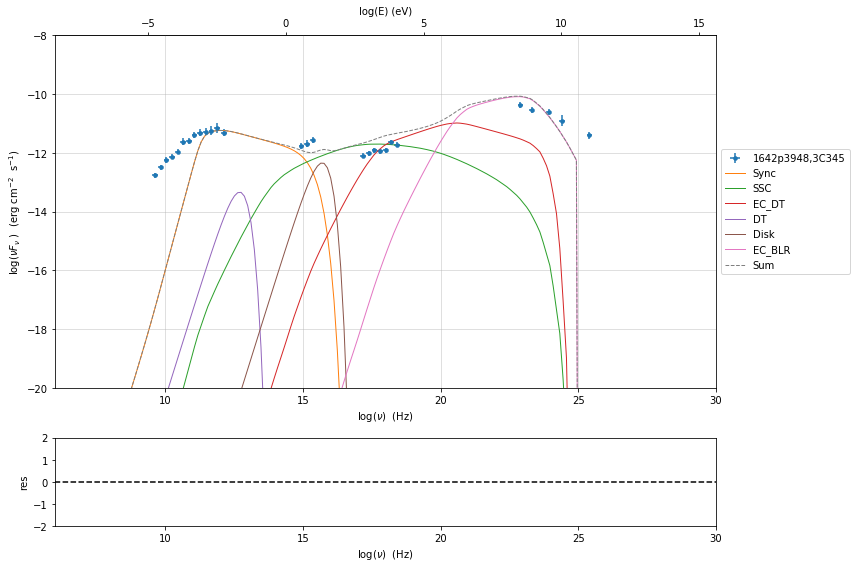

The prefit model should works well for the synchrotron component, but
the EC one is a bit problematic. We can set as starting values a
slightly harder value of ``p``, and a larger value of ``gamma_break``
and ``gmax``. We freeze some parameters, and we also set some
``fit_range`` values. Setting fit_range can speed-up the fit convergence
but should be judged by the user each time according to the physics of
the particular source

.. note::
   With the new implementation of composite model  (`FitModel` class) to set parameters you have to specify the model component, this is different from versions<1.1.2,
   and this holds also for the `freeze` method and for setting  `fit_range` intervals, and for the methods relate to parameters setting in general.
   See the :ref:`composite_models` user guide for further information about the new implementation of `FitModel`, in particular for parameter setting

EC model fit
------------

.. code:: ipython3

    jet=Jet.load_model('prefit_jet_EC.pkl')
    jet.set_gamma_grid_size(100)
    fit_model=FitModel( jet=jet, name='EC-best-fit-lsb')
    fit_model.show_model_components()

.. raw:: html

    <i>Table length=19</i>
    <table id="table140242218255024-683217" class="table-striped table-bordered table-condensed">
    <thead><tr><th>model name</th><th>name</th><th>par type</th><th>units</th><th>val</th><th>phys. bound. min</th><th>phys. bound. max</th><th>log</th><th>frozen</th></tr></thead>
    <tr><td>jet_leptonic</td><td>gmin</td><td>low-energy-cut-off</td><td>lorentz-factor*</td><td>1.071498e+01</td><td>1.000000e+00</td><td>1.000000e+09</td><td>False</td><td>False</td></tr>
    <tr><td>jet_leptonic</td><td>gmax</td><td>high-energy-cut-off</td><td>lorentz-factor*</td><td>1.601124e+04</td><td>1.000000e+00</td><td>1.000000e+15</td><td>False</td><td>False</td></tr>
    <tr><td>jet_leptonic</td><td>N</td><td>emitters_density</td><td>1 / cm3</td><td>1.846756e+01</td><td>0.000000e+00</td><td>--</td><td>False</td><td>False</td></tr>
    <tr><td>jet_leptonic</td><td>gamma_break</td><td>turn-over-energy</td><td>lorentz-factor*</td><td>3.049588e+02</td><td>1.000000e+00</td><td>1.000000e+09</td><td>False</td><td>False</td></tr>
    <tr><td>jet_leptonic</td><td>p</td><td>LE_spectral_slope</td><td></td><td>2.357911e+00</td><td>-1.000000e+01</td><td>1.000000e+01</td><td>False</td><td>False</td></tr>
    <tr><td>jet_leptonic</td><td>p_1</td><td>HE_spectral_slope</td><td></td><td>3.500000e+00</td><td>-1.000000e+01</td><td>1.000000e+01</td><td>False</td><td>False</td></tr>
    <tr><td>jet_leptonic</td><td>T_DT</td><td>DT</td><td>K</td><td>1.000000e+02</td><td>0.000000e+00</td><td>--</td><td>False</td><td>False</td></tr>
    <tr><td>jet_leptonic</td><td>R_DT</td><td>DT</td><td>cm</td><td>5.143375e+18</td><td>0.000000e+00</td><td>--</td><td>False</td><td>False</td></tr>
    <tr><td>jet_leptonic</td><td>tau_DT</td><td>DT</td><td></td><td>1.000000e-01</td><td>0.000000e+00</td><td>1.000000e+00</td><td>False</td><td>False</td></tr>
    <tr><td>jet_leptonic</td><td>tau_BLR</td><td>BLR</td><td></td><td>1.000000e-01</td><td>0.000000e+00</td><td>1.000000e+00</td><td>False</td><td>False</td></tr>
    <tr><td>jet_leptonic</td><td>R_BLR_in</td><td>BLR</td><td>cm</td><td>2.057350e+17</td><td>0.000000e+00</td><td>--</td><td>False</td><td>True</td></tr>
    <tr><td>jet_leptonic</td><td>R_BLR_out</td><td>BLR</td><td>cm</td><td>4.114700e+17</td><td>0.000000e+00</td><td>--</td><td>False</td><td>True</td></tr>
    <tr><td>jet_leptonic</td><td>L_Disk</td><td>Disk</td><td>erg / s</td><td>4.232688e+45</td><td>0.000000e+00</td><td>--</td><td>False</td><td>False</td></tr>
    <tr><td>jet_leptonic</td><td>T_Disk</td><td>Disk</td><td>K</td><td>3.018434e+04</td><td>0.000000e+00</td><td>--</td><td>False</td><td>False</td></tr>
    <tr><td>jet_leptonic</td><td>R</td><td>region_size</td><td>cm</td><td>2.845488e+17</td><td>1.000000e+03</td><td>1.000000e+30</td><td>False</td><td>False</td></tr>
    <tr><td>jet_leptonic</td><td>R_H</td><td>region_position</td><td>cm</td><td>1.000000e+18</td><td>0.000000e+00</td><td>--</td><td>False</td><td>True</td></tr>
    <tr><td>jet_leptonic</td><td>B</td><td>magnetic_field</td><td>gauss</td><td>1.500000e-01</td><td>0.000000e+00</td><td>--</td><td>False</td><td>False</td></tr>
    <tr><td>jet_leptonic</td><td>beam_obj</td><td>beaming</td><td>lorentz-factor*</td><td>2.500000e+01</td><td>1.000000e-04</td><td>--</td><td>False</td><td>False</td></tr>
    <tr><td>jet_leptonic</td><td>z_cosm</td><td>redshift</td><td></td><td>5.930000e-01</td><td>0.000000e+00</td><td>--</td><td>False</td><td>False</td></tr>
    </table>
    

.. parsed-literal::

    
    --------------------------------------------------------------------------------
    Composite model description
    --------------------------------------------------------------------------------
    name: EC-best-fit-lsb  
    type: composite_model  
    components models:
     -model name: jet_leptonic model type: jet
    
    --------------------------------------------------------------------------------

.. code:: ipython3

    
    fit_model.freeze('jet_leptonic','z_cosm')
    fit_model.free('jet_leptonic','R_H')
    fit_model.freeze('jet_leptonic','L_Disk')
    fit_model.freeze('jet_leptonic','R_DT')
    fit_model.freeze('jet_leptonic','R_BLR_in')
    fit_model.freeze('jet_leptonic','R_BLR_out')
    
    fit_model.jet_leptonic.parameters.R.fit_range=[1E16,5E18]
    fit_model.jet_leptonic.parameters.gamma_break.fit_range=[300,3000]
    fit_model.jet_leptonic.parameters.gmin.fit_range=[2,100]
    fit_model.jet_leptonic.parameters.gmax.fit_range=[1000,1E6]

.. code:: ipython3

    from jetset.minimizer import ModelMinimizer
    model_minimizer_lsb=ModelMinimizer('lsb')
    best_fit_lsb=model_minimizer_lsb.fit(fit_model,sed_data,1E11,1E29,fitname='EC-best-fit-lsb',repeat=3)

.. parsed-literal::

    filtering data in fit range = [1.000000e+11,1.000000e+29]
    data length 21
    ================================================================================
    
    *** start fit process ***
    ----- 
    fit run: 0

.. parsed-literal::

    0it [00:00, ?it/s]

.. parsed-literal::

    
    - best chisq=1.93395e+01
    fit run: 1
    - old chisq=1.93395e+01

.. parsed-literal::

    0it [00:00, ?it/s]

.. parsed-literal::

    
    - best chisq=1.93395e+01
    fit run: 2
    - old chisq=1.93395e+01

.. parsed-literal::

    0it [00:00, ?it/s]

.. parsed-literal::

    
    - best chisq=1.93386e+01
    -------------------------------------------------------------------------
    Fit report
    
    Model: EC-best-fit-lsb

.. raw:: html

    <i>Table length=19</i>
    <table id="table140242214573824-960696" class="table-striped table-bordered table-condensed">
    <thead><tr><th>model name</th><th>name</th><th>par type</th><th>units</th><th>val</th><th>phys. bound. min</th><th>phys. bound. max</th><th>log</th><th>frozen</th></tr></thead>
    <tr><td>jet_leptonic</td><td>gmin</td><td>low-energy-cut-off</td><td>lorentz-factor*</td><td>4.297117e+00</td><td>1.000000e+00</td><td>1.000000e+09</td><td>False</td><td>False</td></tr>
    <tr><td>jet_leptonic</td><td>gmax</td><td>high-energy-cut-off</td><td>lorentz-factor*</td><td>2.822712e+04</td><td>1.000000e+00</td><td>1.000000e+15</td><td>False</td><td>False</td></tr>
    <tr><td>jet_leptonic</td><td>N</td><td>emitters_density</td><td>1 / cm3</td><td>2.258362e+01</td><td>0.000000e+00</td><td>--</td><td>False</td><td>False</td></tr>
    <tr><td>jet_leptonic</td><td>gamma_break</td><td>turn-over-energy</td><td>lorentz-factor*</td><td>3.008818e+02</td><td>1.000000e+00</td><td>1.000000e+09</td><td>False</td><td>False</td></tr>
    <tr><td>jet_leptonic</td><td>p</td><td>LE_spectral_slope</td><td></td><td>1.034138e+00</td><td>-1.000000e+01</td><td>1.000000e+01</td><td>False</td><td>False</td></tr>
    <tr><td>jet_leptonic</td><td>p_1</td><td>HE_spectral_slope</td><td></td><td>3.639483e+00</td><td>-1.000000e+01</td><td>1.000000e+01</td><td>False</td><td>False</td></tr>
    <tr><td>jet_leptonic</td><td>T_DT</td><td>DT</td><td>K</td><td>4.580689e+02</td><td>0.000000e+00</td><td>--</td><td>False</td><td>False</td></tr>
    <tr><td>jet_leptonic</td><td>R_DT</td><td>DT</td><td>cm</td><td>5.143375e+18</td><td>0.000000e+00</td><td>--</td><td>False</td><td>True</td></tr>
    <tr><td>jet_leptonic</td><td>tau_DT</td><td>DT</td><td></td><td>1.781413e-01</td><td>0.000000e+00</td><td>1.000000e+00</td><td>False</td><td>False</td></tr>
    <tr><td>jet_leptonic</td><td>tau_BLR</td><td>BLR</td><td></td><td>2.089862e-04</td><td>0.000000e+00</td><td>1.000000e+00</td><td>False</td><td>False</td></tr>
    <tr><td>jet_leptonic</td><td>R_BLR_in</td><td>BLR</td><td>cm</td><td>2.057350e+17</td><td>0.000000e+00</td><td>--</td><td>False</td><td>True</td></tr>
    <tr><td>jet_leptonic</td><td>R_BLR_out</td><td>BLR</td><td>cm</td><td>4.114700e+17</td><td>0.000000e+00</td><td>--</td><td>False</td><td>True</td></tr>
    <tr><td>jet_leptonic</td><td>L_Disk</td><td>Disk</td><td>erg / s</td><td>4.232688e+45</td><td>0.000000e+00</td><td>--</td><td>False</td><td>True</td></tr>
    <tr><td>jet_leptonic</td><td>T_Disk</td><td>Disk</td><td>K</td><td>3.780580e+04</td><td>0.000000e+00</td><td>--</td><td>False</td><td>False</td></tr>
    <tr><td>jet_leptonic</td><td>R</td><td>region_size</td><td>cm</td><td>4.119800e+17</td><td>1.000000e+03</td><td>1.000000e+30</td><td>False</td><td>False</td></tr>
    <tr><td>jet_leptonic</td><td>R_H</td><td>region_position</td><td>cm</td><td>9.984351e+17</td><td>0.000000e+00</td><td>--</td><td>False</td><td>False</td></tr>
    <tr><td>jet_leptonic</td><td>B</td><td>magnetic_field</td><td>gauss</td><td>1.277432e-01</td><td>0.000000e+00</td><td>--</td><td>False</td><td>False</td></tr>
    <tr><td>jet_leptonic</td><td>beam_obj</td><td>beaming</td><td>lorentz-factor*</td><td>1.071574e+01</td><td>1.000000e-04</td><td>--</td><td>False</td><td>False</td></tr>
    <tr><td>jet_leptonic</td><td>z_cosm</td><td>redshift</td><td></td><td>5.930000e-01</td><td>0.000000e+00</td><td>--</td><td>False</td><td>True</td></tr>
    </table>
    

.. parsed-literal::

    
    converged=True
    calls=131
    mesg=

.. parsed-literal::

    'The relative error between two consecutive iterates is at most 0.000000'

.. parsed-literal::

    dof=7
    chisq=19.338558, chisq/red=2.762651 null hypothesis sig=0.007190
    
    best fit pars

.. raw:: html

    <i>Table length=19</i>
    <table id="table140242193488240-620815" class="table-striped table-bordered table-condensed">
    <thead><tr><th>model name</th><th>name</th><th>val</th><th>bestfit val</th><th>err +</th><th>err -</th><th>start val</th><th>fit range min</th><th>fit range max</th><th>frozen</th></tr></thead>
    <tr><td>jet_leptonic</td><td>gmin</td><td>4.297117e+00</td><td>4.297117e+00</td><td>3.882204e+01</td><td>--</td><td>1.071498e+01</td><td>2.000000e+00</td><td>1.000000e+02</td><td>False</td></tr>
    <tr><td>jet_leptonic</td><td>gmax</td><td>2.822712e+04</td><td>2.822712e+04</td><td>6.287440e+04</td><td>--</td><td>1.601124e+04</td><td>1.000000e+03</td><td>1.000000e+06</td><td>False</td></tr>
    <tr><td>jet_leptonic</td><td>N</td><td>2.258362e+01</td><td>2.258362e+01</td><td>3.495097e+01</td><td>--</td><td>1.846756e+01</td><td>0.000000e+00</td><td>--</td><td>False</td></tr>
    <tr><td>jet_leptonic</td><td>gamma_break</td><td>3.008818e+02</td><td>3.008818e+02</td><td>9.752563e+01</td><td>--</td><td>3.049588e+02</td><td>3.000000e+02</td><td>3.000000e+03</td><td>False</td></tr>
    <tr><td>jet_leptonic</td><td>p</td><td>1.034138e+00</td><td>1.034138e+00</td><td>8.354114e-01</td><td>--</td><td>2.357911e+00</td><td>-1.000000e+01</td><td>1.000000e+01</td><td>False</td></tr>
    <tr><td>jet_leptonic</td><td>p_1</td><td>3.639483e+00</td><td>3.639483e+00</td><td>5.168124e-01</td><td>--</td><td>3.500000e+00</td><td>-1.000000e+01</td><td>1.000000e+01</td><td>False</td></tr>
    <tr><td>jet_leptonic</td><td>T_DT</td><td>4.580689e+02</td><td>4.580689e+02</td><td>5.222955e+03</td><td>--</td><td>1.000000e+02</td><td>0.000000e+00</td><td>--</td><td>False</td></tr>
    <tr><td>jet_leptonic</td><td>R_DT</td><td>5.143375e+18</td><td>--</td><td>--</td><td>--</td><td>5.143375e+18</td><td>0.000000e+00</td><td>--</td><td>True</td></tr>
    <tr><td>jet_leptonic</td><td>tau_DT</td><td>1.781413e-01</td><td>1.781413e-01</td><td>3.296905e+00</td><td>--</td><td>1.000000e-01</td><td>0.000000e+00</td><td>1.000000e+00</td><td>False</td></tr>
    <tr><td>jet_leptonic</td><td>tau_BLR</td><td>2.089862e-04</td><td>2.089862e-04</td><td>2.564684e+04</td><td>--</td><td>1.000000e-01</td><td>0.000000e+00</td><td>1.000000e+00</td><td>False</td></tr>
    <tr><td>jet_leptonic</td><td>R_BLR_in</td><td>2.057350e+17</td><td>--</td><td>--</td><td>--</td><td>2.057350e+17</td><td>0.000000e+00</td><td>--</td><td>True</td></tr>
    <tr><td>jet_leptonic</td><td>R_BLR_out</td><td>4.114700e+17</td><td>--</td><td>--</td><td>--</td><td>4.114700e+17</td><td>0.000000e+00</td><td>--</td><td>True</td></tr>
    <tr><td>jet_leptonic</td><td>L_Disk</td><td>4.232688e+45</td><td>--</td><td>--</td><td>--</td><td>4.232688e+45</td><td>0.000000e+00</td><td>--</td><td>True</td></tr>
    <tr><td>jet_leptonic</td><td>T_Disk</td><td>3.780580e+04</td><td>3.780580e+04</td><td>1.660484e+04</td><td>--</td><td>3.018434e+04</td><td>0.000000e+00</td><td>--</td><td>False</td></tr>
    <tr><td>jet_leptonic</td><td>R</td><td>4.119800e+17</td><td>4.119800e+17</td><td>1.157586e+18</td><td>--</td><td>2.845488e+17</td><td>1.000000e+16</td><td>5.000000e+18</td><td>False</td></tr>
    <tr><td>jet_leptonic</td><td>R_H</td><td>9.984351e+17</td><td>9.984351e+17</td><td>1.675663e+22</td><td>--</td><td>1.000000e+18</td><td>0.000000e+00</td><td>--</td><td>False</td></tr>
    <tr><td>jet_leptonic</td><td>B</td><td>1.277432e-01</td><td>1.277432e-01</td><td>4.863055e-01</td><td>--</td><td>1.500000e-01</td><td>0.000000e+00</td><td>--</td><td>False</td></tr>
    <tr><td>jet_leptonic</td><td>beam_obj</td><td>1.071574e+01</td><td>1.071574e+01</td><td>3.382188e+01</td><td>--</td><td>2.500000e+01</td><td>1.000000e-04</td><td>--</td><td>False</td></tr>
    <tr><td>jet_leptonic</td><td>z_cosm</td><td>5.930000e-01</td><td>--</td><td>--</td><td>--</td><td>5.930000e-01</td><td>0.000000e+00</td><td>--</td><td>True</td></tr>
    </table>
    

.. parsed-literal::

    -------------------------------------------------------------------------
    
    ================================================================================
    

.. code:: ipython3

    %matplotlib inline
    fit_model.set_nu_grid(1E6,1E30,200)
    fit_model.eval()
    p2=fit_model.plot_model(sed_data=sed_data)
    p2.rescale(y_min=-15,y_max=-9.5,x_min=6,x_max=28.5)

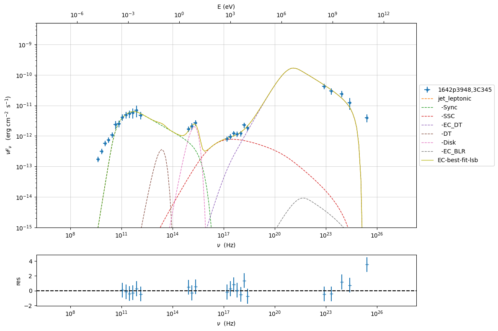

.. code:: ipython3

    from jetset.minimizer import ModelMinimizer
    model_minimizer_minuit=ModelMinimizer('minuit')
    fit_model.freeze('jet_leptonic','R_H')
    fit_model.jet_leptonic.parameters.gmax.val=1E5
    best_fit_minuit=model_minimizer_minuit.fit(fit_model,sed_data,1E11,1E29,fitname='EC-best-fit-minuit',repeat=2)

.. parsed-literal::

    filtering data in fit range = [1.000000e+11,1.000000e+29]
    data length 21
    ================================================================================
    
    *** start fit process ***
    ----- 
    fit run: 0

.. parsed-literal::

    0it [00:00, ?it/s]

.. parsed-literal::

    
    - best chisq=7.44585e+00
    fit run: 1
    - old chisq=7.44585e+00

.. parsed-literal::

    0it [00:00, ?it/s]

.. parsed-literal::

    
    - best chisq=5.24530e+00
    -------------------------------------------------------------------------
    Fit report
    
    Model: EC-best-fit-minuit

.. raw:: html

    <i>Table length=19</i>
    <table id="table140241729549552-228508" class="table-striped table-bordered table-condensed">
    <thead><tr><th>model name</th><th>name</th><th>par type</th><th>units</th><th>val</th><th>phys. bound. min</th><th>phys. bound. max</th><th>log</th><th>frozen</th></tr></thead>
    <tr><td>jet_leptonic</td><td>gmin</td><td>low-energy-cut-off</td><td>lorentz-factor*</td><td>4.347846e+00</td><td>1.000000e+00</td><td>1.000000e+09</td><td>False</td><td>False</td></tr>
    <tr><td>jet_leptonic</td><td>gmax</td><td>high-energy-cut-off</td><td>lorentz-factor*</td><td>1.485428e+05</td><td>1.000000e+00</td><td>1.000000e+15</td><td>False</td><td>False</td></tr>
    <tr><td>jet_leptonic</td><td>N</td><td>emitters_density</td><td>1 / cm3</td><td>2.241585e+01</td><td>0.000000e+00</td><td>--</td><td>False</td><td>False</td></tr>
    <tr><td>jet_leptonic</td><td>gamma_break</td><td>turn-over-energy</td><td>lorentz-factor*</td><td>3.001769e+02</td><td>1.000000e+00</td><td>1.000000e+09</td><td>False</td><td>False</td></tr>
    <tr><td>jet_leptonic</td><td>p</td><td>LE_spectral_slope</td><td></td><td>1.041515e+00</td><td>-1.000000e+01</td><td>1.000000e+01</td><td>False</td><td>False</td></tr>
    <tr><td>jet_leptonic</td><td>p_1</td><td>HE_spectral_slope</td><td></td><td>3.457395e+00</td><td>-1.000000e+01</td><td>1.000000e+01</td><td>False</td><td>False</td></tr>
    <tr><td>jet_leptonic</td><td>T_DT</td><td>DT</td><td>K</td><td>3.398520e+02</td><td>0.000000e+00</td><td>--</td><td>False</td><td>False</td></tr>
    <tr><td>jet_leptonic</td><td>R_DT</td><td>DT</td><td>cm</td><td>5.143375e+18</td><td>0.000000e+00</td><td>--</td><td>False</td><td>True</td></tr>
    <tr><td>jet_leptonic</td><td>tau_DT</td><td>DT</td><td></td><td>1.012248e-01</td><td>0.000000e+00</td><td>1.000000e+00</td><td>False</td><td>False</td></tr>
    <tr><td>jet_leptonic</td><td>tau_BLR</td><td>BLR</td><td></td><td>7.350812e-03</td><td>0.000000e+00</td><td>1.000000e+00</td><td>False</td><td>False</td></tr>
    <tr><td>jet_leptonic</td><td>R_BLR_in</td><td>BLR</td><td>cm</td><td>2.057350e+17</td><td>0.000000e+00</td><td>--</td><td>False</td><td>True</td></tr>
    <tr><td>jet_leptonic</td><td>R_BLR_out</td><td>BLR</td><td>cm</td><td>4.114700e+17</td><td>0.000000e+00</td><td>--</td><td>False</td><td>True</td></tr>
    <tr><td>jet_leptonic</td><td>L_Disk</td><td>Disk</td><td>erg / s</td><td>4.232688e+45</td><td>0.000000e+00</td><td>--</td><td>False</td><td>True</td></tr>
    <tr><td>jet_leptonic</td><td>T_Disk</td><td>Disk</td><td>K</td><td>5.246771e+04</td><td>0.000000e+00</td><td>--</td><td>False</td><td>False</td></tr>
    <tr><td>jet_leptonic</td><td>R</td><td>region_size</td><td>cm</td><td>4.140526e+17</td><td>1.000000e+03</td><td>1.000000e+30</td><td>False</td><td>False</td></tr>
    <tr><td>jet_leptonic</td><td>R_H</td><td>region_position</td><td>cm</td><td>9.984351e+17</td><td>0.000000e+00</td><td>--</td><td>False</td><td>True</td></tr>
    <tr><td>jet_leptonic</td><td>B</td><td>magnetic_field</td><td>gauss</td><td>1.142916e-01</td><td>0.000000e+00</td><td>--</td><td>False</td><td>False</td></tr>
    <tr><td>jet_leptonic</td><td>beam_obj</td><td>beaming</td><td>lorentz-factor*</td><td>1.094358e+01</td><td>1.000000e-04</td><td>--</td><td>False</td><td>False</td></tr>
    <tr><td>jet_leptonic</td><td>z_cosm</td><td>redshift</td><td></td><td>5.930000e-01</td><td>0.000000e+00</td><td>--</td><td>False</td><td>True</td></tr>
    </table>
    

.. parsed-literal::

    
    converged=True
    calls=2766
    mesg=

.. raw:: html

    <table>
        <tr>
            <td colspan="2" style="text-align:left" title="Minimum value of function"> FCN = 5.245 </td>
            <td colspan="3" style="text-align:center" title="No. of calls in last algorithm and total number of calls"> Ncalls = 2766 (2766 total) </td>
        </tr>
        <tr>
            <td colspan="2" style="text-align:left" title="Estimated distance to minimum and goal"> EDM = 2.67e-06 (Goal: 0.0002) </td>
            <td colspan="3" style="text-align:center" title="Increase in FCN which corresponds to 1 standard deviation"> up = 1.0 </td>
        </tr>
        <tr>
            <td style="text-align:center;background-color:#92CCA6;color:black"> Valid Minimum </td>
            <td style="text-align:center;background-color:#92CCA6;color:black"> Valid Parameters </td>
            <td colspan="3" style="text-align:center;background-color:#FFF79A;color:black"> SOME Parameters at limit </td>
        </tr>
        <tr>
            <td colspan="2" style="text-align:center;background-color:#92CCA6;color:black"> Below EDM threshold (goal x 10) </td>
            <td colspan="3" style="text-align:center;background-color:#92CCA6;color:black"> Below call limit </td>
        </tr>
        <tr>
            <td style="text-align:center;background-color:#92CCA6;color:black"> Hesse ok </td>
            <td style="text-align:center;background-color:#92CCA6;color:black"> Has Covariance </td>
            <td style="text-align:center;background-color:#92CCA6;color:black" title="Is covariance matrix accurate?"> Accurate </td>
            <td style="text-align:center;background-color:#92CCA6;color:black" title="Is covariance matrix positive definite?"> Pos. def. </td>
            <td style="text-align:center;background-color:#92CCA6;color:black" title="Was positive definiteness enforced by Minuit?"> Not forced </td>
        </tr>
    </table><table>
        <tr>
            <td></td>
            <th title="Variable name"> Name </th>
            <th title="Value of parameter"> Value </th>
            <th title="Hesse error"> Hesse Error </th>
            <th title="Minos lower error"> Minos Error- </th>
            <th title="Minos upper error"> Minos Error+ </th>
            <th title="Lower limit of the parameter"> Limit- </th>
            <th title="Upper limit of the parameter"> Limit+ </th>
            <th title="Is the parameter fixed in the fit"> Fixed </th>
        </tr>
        <tr>
            <th> 0 </th>
            <td> par_0 </td>
            <td> 4.347846 </td>
            <td> 0.000027 </td>
            <td>  </td>
            <td>  </td>
            <td> 2 </td>
            <td> 100 </td>
            <td>  </td>
        </tr>
        <tr>
            <th> 1 </th>
            <td> par_1 </td>
            <td> 148.5428e3 </td>
            <td> 0.0006e3 </td>
            <td>  </td>
            <td>  </td>
            <td> 1E+03 </td>
            <td> 1E+06 </td>
            <td>  </td>
        </tr>
        <tr>
            <th> 2 </th>
            <td> par_2 </td>
            <td> 22.4158540 </td>
            <td> 0.0000018 </td>
            <td>  </td>
            <td>  </td>
            <td> 0 </td>
            <td>  </td>
            <td>  </td>
        </tr>
        <tr>
            <th> 3 </th>
            <td> par_3 </td>
            <td> 300.17691 </td>
            <td> 0.00005 </td>
            <td>  </td>
            <td>  </td>
            <td> 300 </td>
            <td> 3E+03 </td>
            <td>  </td>
        </tr>
        <tr>
            <th> 4 </th>
            <td> par_4 </td>
            <td> 1.0415148 </td>
            <td> 0.0000014 </td>
            <td>  </td>
            <td>  </td>
            <td> -10 </td>
            <td> 10 </td>
            <td>  </td>
        </tr>
        <tr>
            <th> 5 </th>
            <td> par_5 </td>
            <td> 3.457395 </td>
            <td> 0.000017 </td>
            <td>  </td>
            <td>  </td>
            <td> -10 </td>
            <td> 10 </td>
            <td>  </td>
        </tr>
        <tr>
            <th> 6 </th>
            <td> par_6 </td>
            <td> 339.8520270 </td>
            <td> 0.0000018 </td>
            <td>  </td>
            <td>  </td>
            <td> 0 </td>
            <td>  </td>
            <td>  </td>
        </tr>
        <tr>
            <th> 7 </th>
            <td> par_7 </td>
            <td> 101.2248e-3 </td>
            <td> 0.0006e-3 </td>
            <td>  </td>
            <td>  </td>
            <td> 0 </td>
            <td> 1 </td>
            <td>  </td>
        </tr>
        <tr>
            <th> 8 </th>
            <td> par_8 </td>
            <td> 7.35081e-3 </td>
            <td> 0.00016e-3 </td>
            <td>  </td>
            <td>  </td>
            <td> 0 </td>
            <td> 1 </td>
            <td>  </td>
        </tr>
        <tr>
            <th> 9 </th>
            <td> par_9 </td>
            <td> 52.4677081549e3 </td>
            <td> 0.0000000018e3 </td>
            <td>  </td>
            <td>  </td>
            <td> 0 </td>
            <td>  </td>
            <td>  </td>
        </tr>
        <tr>
            <th> 10 </th>
            <td> par_10 </td>
            <td> 414.0526e15 </td>
            <td> 0.0025e15 </td>
            <td>  </td>
            <td>  </td>
            <td> 1E+16 </td>
            <td> 5E+18 </td>
            <td>  </td>
        </tr>
        <tr>
            <th> 11 </th>
            <td> par_11 </td>
            <td> 114.29e-3 </td>
            <td> 0.11e-3 </td>
            <td>  </td>
            <td>  </td>
            <td> 0 </td>
            <td>  </td>
            <td>  </td>
        </tr>
        <tr>
            <th> 12 </th>
            <td> par_12 </td>
            <td> 10.9435833 </td>
            <td> 0.0000018 </td>
            <td>  </td>
            <td>  </td>
            <td> 0.0001 </td>
            <td>  </td>
            <td>  </td>
        </tr>
    </table>

.. parsed-literal::

    dof=8
    chisq=5.245296, chisq/red=0.655662 null hypothesis sig=0.731066
    
    best fit pars

.. raw:: html

    <i>Table length=19</i>
    <table id="table140241729524928-611349" class="table-striped table-bordered table-condensed">
    <thead><tr><th>model name</th><th>name</th><th>val</th><th>bestfit val</th><th>err +</th><th>err -</th><th>start val</th><th>fit range min</th><th>fit range max</th><th>frozen</th></tr></thead>
    <tr><td>jet_leptonic</td><td>gmin</td><td>4.347846e+00</td><td>4.347846e+00</td><td>2.744442e-05</td><td>--</td><td>4.297117e+00</td><td>2.000000e+00</td><td>1.000000e+02</td><td>False</td></tr>
    <tr><td>jet_leptonic</td><td>gmax</td><td>1.485428e+05</td><td>1.485428e+05</td><td>6.490992e-01</td><td>--</td><td>1.000000e+05</td><td>1.000000e+03</td><td>1.000000e+06</td><td>False</td></tr>
    <tr><td>jet_leptonic</td><td>N</td><td>2.241585e+01</td><td>2.241585e+01</td><td>1.826625e-06</td><td>--</td><td>2.258362e+01</td><td>0.000000e+00</td><td>--</td><td>False</td></tr>
    <tr><td>jet_leptonic</td><td>gamma_break</td><td>3.001769e+02</td><td>3.001769e+02</td><td>4.849093e-05</td><td>--</td><td>3.008818e+02</td><td>3.000000e+02</td><td>3.000000e+03</td><td>False</td></tr>
    <tr><td>jet_leptonic</td><td>p</td><td>1.041515e+00</td><td>1.041515e+00</td><td>1.391149e-06</td><td>--</td><td>1.034138e+00</td><td>-1.000000e+01</td><td>1.000000e+01</td><td>False</td></tr>
    <tr><td>jet_leptonic</td><td>p_1</td><td>3.457395e+00</td><td>3.457395e+00</td><td>1.708928e-05</td><td>--</td><td>3.639483e+00</td><td>-1.000000e+01</td><td>1.000000e+01</td><td>False</td></tr>
    <tr><td>jet_leptonic</td><td>T_DT</td><td>3.398520e+02</td><td>3.398520e+02</td><td>1.831386e-06</td><td>--</td><td>4.580689e+02</td><td>0.000000e+00</td><td>--</td><td>False</td></tr>
    <tr><td>jet_leptonic</td><td>R_DT</td><td>5.143375e+18</td><td>--</td><td>--</td><td>--</td><td>5.143375e+18</td><td>0.000000e+00</td><td>--</td><td>True</td></tr>
    <tr><td>jet_leptonic</td><td>tau_DT</td><td>1.012248e-01</td><td>1.012248e-01</td><td>5.523753e-07</td><td>--</td><td>1.781413e-01</td><td>0.000000e+00</td><td>1.000000e+00</td><td>False</td></tr>
    <tr><td>jet_leptonic</td><td>tau_BLR</td><td>7.350812e-03</td><td>7.350812e-03</td><td>1.564399e-07</td><td>--</td><td>2.089862e-04</td><td>0.000000e+00</td><td>1.000000e+00</td><td>False</td></tr>
    <tr><td>jet_leptonic</td><td>R_BLR_in</td><td>2.057350e+17</td><td>--</td><td>--</td><td>--</td><td>2.057350e+17</td><td>0.000000e+00</td><td>--</td><td>True</td></tr>
    <tr><td>jet_leptonic</td><td>R_BLR_out</td><td>4.114700e+17</td><td>--</td><td>--</td><td>--</td><td>4.114700e+17</td><td>0.000000e+00</td><td>--</td><td>True</td></tr>
    <tr><td>jet_leptonic</td><td>L_Disk</td><td>4.232688e+45</td><td>--</td><td>--</td><td>--</td><td>4.232688e+45</td><td>0.000000e+00</td><td>--</td><td>True</td></tr>
    <tr><td>jet_leptonic</td><td>T_Disk</td><td>5.246771e+04</td><td>5.246771e+04</td><td>1.831395e-06</td><td>--</td><td>3.780580e+04</td><td>0.000000e+00</td><td>--</td><td>False</td></tr>
    <tr><td>jet_leptonic</td><td>R</td><td>4.140526e+17</td><td>4.140526e+17</td><td>2.488394e+12</td><td>--</td><td>4.119800e+17</td><td>1.000000e+16</td><td>5.000000e+18</td><td>False</td></tr>
    <tr><td>jet_leptonic</td><td>R_H</td><td>9.984351e+17</td><td>--</td><td>--</td><td>--</td><td>9.984351e+17</td><td>0.000000e+00</td><td>--</td><td>True</td></tr>
    <tr><td>jet_leptonic</td><td>B</td><td>1.142916e-01</td><td>1.142916e-01</td><td>1.060216e-04</td><td>--</td><td>1.277432e-01</td><td>0.000000e+00</td><td>--</td><td>False</td></tr>
    <tr><td>jet_leptonic</td><td>beam_obj</td><td>1.094358e+01</td><td>1.094358e+01</td><td>1.824959e-06</td><td>--</td><td>1.071574e+01</td><td>1.000000e-04</td><td>--</td><td>False</td></tr>
    <tr><td>jet_leptonic</td><td>z_cosm</td><td>5.930000e-01</td><td>--</td><td>--</td><td>--</td><td>5.930000e-01</td><td>0.000000e+00</td><td>--</td><td>True</td></tr>
    </table>
    

.. parsed-literal::

    -------------------------------------------------------------------------
    
    ================================================================================
    

.. code:: ipython3

    %matplotlib inline
    fit_model.set_nu_grid(1E6,1E30,500)
    fit_model.eval()
    p2=fit_model.plot_model(sed_data=sed_data)
    p2.rescale(y_min=-15,y_max=-9.5,x_min=6,x_max=28.5)

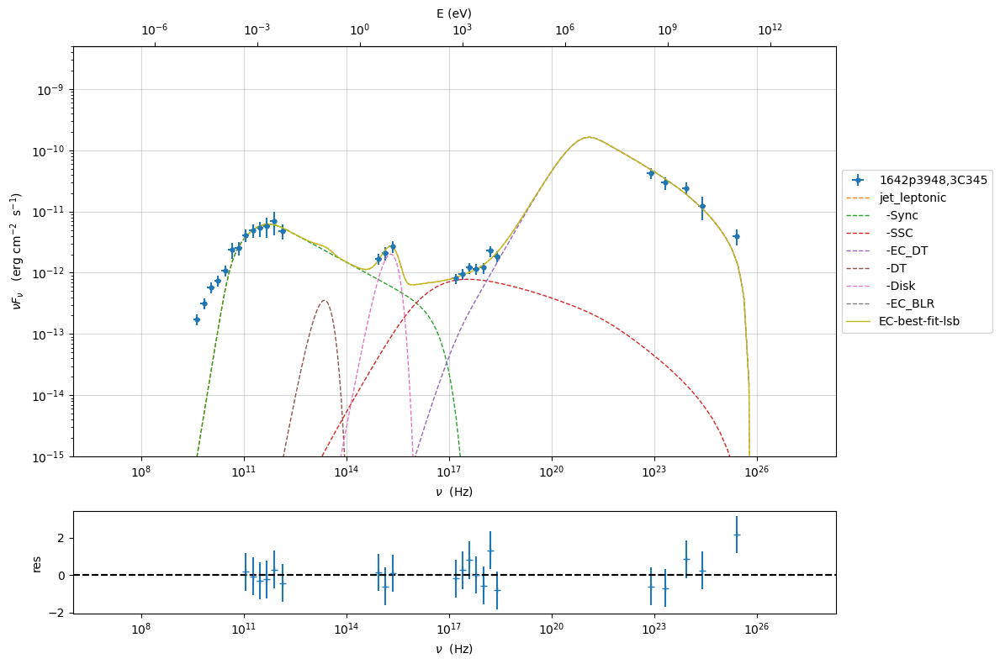

.. code:: ipython3

    jet.energetic_report()

.. raw:: html

    <i>Table length=37</i>
    <table id="table140241738783184-604788" class="table-striped table-bordered table-condensed">
    <thead><tr><th>name</th><th>type</th><th>units</th><th>val</th></tr></thead>
    <tr><td>U_e</td><td>Energy dens. blob rest. frame</td><td>erg / cm3</td><td>1.863896e-03</td></tr>
    <tr><td>U_p_cold</td><td>Energy dens. blob rest. frame</td><td>erg / cm3</td><td>0.000000e+00</td></tr>
    <tr><td>U_B</td><td>Energy dens. blob rest. frame</td><td>erg / cm3</td><td>5.197429e-04</td></tr>
    <tr><td>U_p</td><td>Energy dens. blob rest. frame</td><td>erg / cm3</td><td>0.000000e+00</td></tr>
    <tr><td>U_p_target</td><td>Energy dens. blob rest. frame</td><td>erg / cm3</td><td>0.000000e+00</td></tr>
    <tr><td>U_Synch</td><td>Energy dens. blob rest. frame</td><td>erg / cm3</td><td>1.870816e-04</td></tr>
    <tr><td>U_Synch_DRF</td><td>Energy dens. disk rest. frame</td><td>erg / cm3</td><td>2.683300e+00</td></tr>
    <tr><td>U_Disk</td><td>Energy dens. blob rest. frame</td><td>erg / cm3</td><td>1.335830e-04</td></tr>
    <tr><td>U_BLR</td><td>Energy dens. blob rest. frame</td><td>erg / cm3</td><td>3.630718e-05</td></tr>
    <tr><td>U_DT</td><td>Energy dens. blob rest. frame</td><td>erg / cm3</td><td>1.034262e-02</td></tr>
    <tr><td>U_CMB</td><td>Energy dens. blob rest. frame</td><td>erg / cm3</td><td>0.000000e+00</td></tr>
    <tr><td>U_Disk_DRF</td><td>Energy dens. disk rest. frame</td><td>erg / cm3</td><td>1.112494e-02</td></tr>
    <tr><td>U_BLR_DRF</td><td>Energy dens. disk rest. frame</td><td>erg / cm3</td><td>8.548400e-05</td></tr>
    <tr><td>U_DT_DRF</td><td>Energy dens. disk rest. frame</td><td>erg / cm3</td><td>4.327039e-05</td></tr>
    <tr><td>U_CMB_DRF</td><td>Energy dens. disk rest. frame</td><td>erg / cm3</td><td>0.000000e+00</td></tr>
    <tr><td>L_Sync_rf</td><td>Lum. blob rest. frme.</td><td>erg / s</td><td>3.998270e+42</td></tr>
    <tr><td>L_SSC_rf</td><td>Lum. blob rest. frme.</td><td>erg / s</td><td>1.056464e+42</td></tr>
    <tr><td>L_EC_Disk_rf</td><td>Lum. blob rest. frme.</td><td>erg / s</td><td>0.000000e+00</td></tr>
    <tr><td>L_EC_BLR_rf</td><td>Lum. blob rest. frme.</td><td>erg / s</td><td>2.113164e+41</td></tr>
    <tr><td>L_EC_DT_rf</td><td>Lum. blob rest. frme.</td><td>erg / s</td><td>7.397052e+43</td></tr>
    <tr><td>L_EC_CMB_rf</td><td>Lum. blob rest. frme.</td><td>erg / s</td><td>0.000000e+00</td></tr>
    <tr><td>L_pp_gamma_rf</td><td>Lum. blob rest. frme.</td><td>erg / s</td><td>0.000000e+00</td></tr>
    <tr><td>jet_L_Sync</td><td>jet Lum.</td><td>erg / s</td><td>1.197102e+44</td></tr>
    <tr><td>jet_L_SSC</td><td>jet Lum.</td><td>erg / s</td><td>3.163106e+43</td></tr>
    <tr><td>jet_L_EC_Disk</td><td>jet Lum.</td><td>erg / s</td><td>0.000000e+00</td></tr>
    <tr><td>jet_L_EC_BLR</td><td>jet Lum.</td><td>erg / s</td><td>6.326920e+42</td></tr>
    <tr><td>jet_L_EC_DT</td><td>jet Lum.</td><td>erg / s</td><td>2.214715e+45</td></tr>
    <tr><td>jet_L_EC_CMB</td><td>jet Lum.</td><td>erg / s</td><td>0.000000e+00</td></tr>
    <tr><td>jet_L_pp_gamma</td><td>jet Lum.</td><td>erg / s</td><td>0.000000e+00</td></tr>
    <tr><td>jet_L_rad</td><td>jet Lum.</td><td>erg / s</td><td>2.372383e+45</td></tr>
    <tr><td>jet_L_kin</td><td>jet Lum.</td><td>erg / s</td><td>3.589231e+45</td></tr>
    <tr><td>jet_L_tot</td><td>jet Lum.</td><td>erg / s</td><td>6.962463e+45</td></tr>
    <tr><td>jet_L_e</td><td>jet Lum.</td><td>erg / s</td><td>3.589231e+45</td></tr>
    <tr><td>jet_L_B</td><td>jet Lum.</td><td>erg / s</td><td>1.000849e+45</td></tr>
    <tr><td>jet_L_p_cold</td><td>jet Lum.</td><td>erg / s</td><td>0.000000e+00</td></tr>
    <tr><td>jet_L_p</td><td>jet Lum.</td><td>erg / s</td><td>0.000000e+00</td></tr>
    <tr><td>BulkLorentzFactor</td><td></td><td></td><td>1.094358e+01</td></tr>
    </table>
    

.. code:: ipython3

    best_fit_minuit.save_report('EC-best-fit-minuit.pkl')
    model_minimizer_minuit.save_model('EC_model_minimizer_minuit.pkl')
    fit_model.save_model('EC_fit_model_minuit.pkl')

MCMC
----

.. code:: ipython3

    from jetset.mcmc import McmcSampler
    from jetset.minimizer import ModelMinimizer
    model_minimizer_minuit = ModelMinimizer.load_model('EC_model_minimizer_minuit.pkl')

We use a flat prior centered on the best fit value. Setting
``bound=5.0`` and ``bound_rel=True`` means that:

1) the prior interval will be defined as [best_fit_val - delta_m ,
   best_fit_val + delta_p]

2) with delta_p=delta_m=best_fit_val*bound

If we set ``bound_rel=False`` then delta_p = delta_m =
best_fit_err*bound

It is possible to define asymmetric boundaries e.g. ``bound=[2.0,5.0]``
meaning that

1) for ``bound_rel=True``

   delta_p = best_fit_val*bound[1]

   delta_m =b est_fit_val*bound[0]

2) for ``bound_rel=False``

   delta_p = best_fit_err*bound[1]

   delta_m = best_fit_err*bound[0]

In the next release a more flexible prior interface will be added,
including different type of priors

Given the large parameter space, we select a sub sample of parameters
using the ``use_labels_dict``. If we do not pass the ‘use_labels_dict’
the full set of free parameters will be used

.. code:: ipython3

    mcmc=McmcSampler(model_minimizer_minuit)
    
    labels=['N','B','beam_obj','p_1','gamma_break']
    model_name='jet_leptonic'
    use_labels_dict={model_name:labels}
    
    mcmc.run_sampler(nwalkers=128,burnin=10,steps=50,bound=5.0,bound_rel=True,threads=None,walker_start_bound=0.005,use_labels_dict=use_labels_dict)

.. parsed-literal::

    mcmc run starting
    

.. parsed-literal::

      0%|          | 0/50 [00:00<?, ?it/s]

.. parsed-literal::

    mcmc run done, with 1 threads took 411.97 seconds

.. code:: ipython3

    print(mcmc.acceptance_fraction)

.. parsed-literal::

    0.49484375

.. code:: ipython3

    mcmc.model.set_nu_grid(1E6,1E30,200)
    
    p=mcmc.plot_model(sed_data=sed_data,fit_range=[11., 27.4],size=50)
    p.rescale(y_min=-13,x_min=6,x_max=28.5)

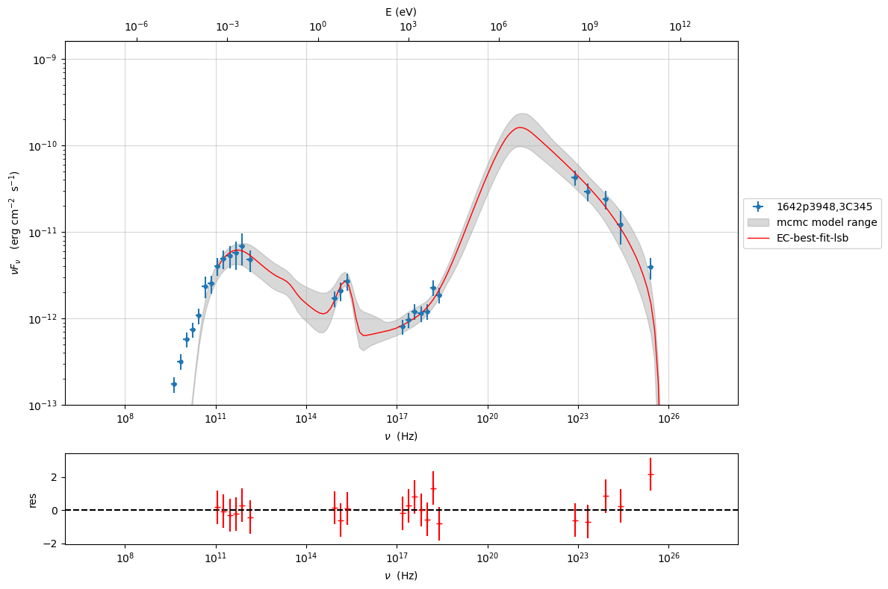

.. code:: ipython3

    f=mcmc.corner_plot()

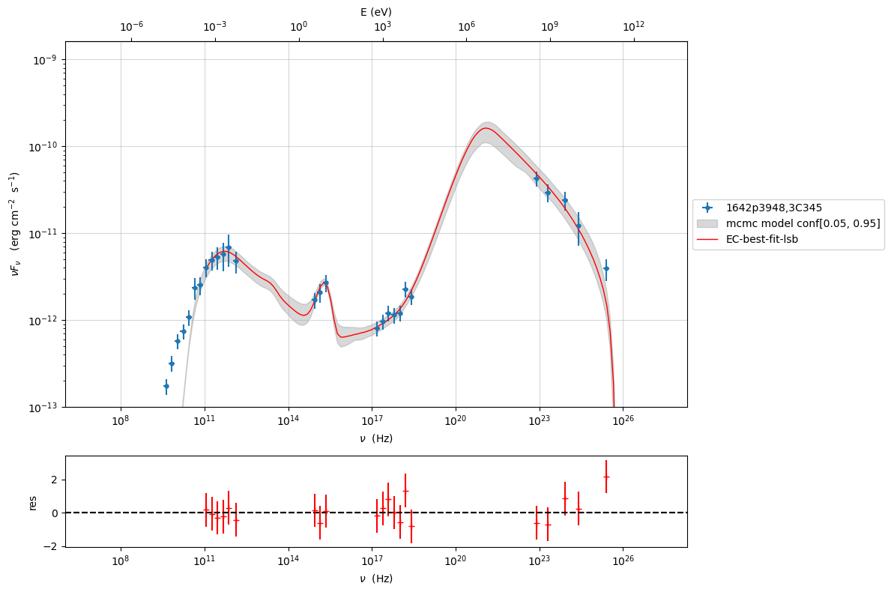

.. code:: ipython3

    f=mcmc.plot_chain('p_1',log_plot=False)

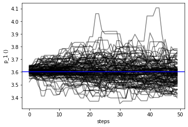

Save and reuse MCMC
-------------------

.. code:: ipython3

    mcmc.save('mcmc_sampler.pkl')

.. code:: ipython3

    from jetset.mcmc import McmcSampler
    from jetset.data_loader import ObsData
    from jetset.plot_sedfit import PlotSED
    from jetset.test_data_helper import  test_SEDs
    
    sed_data=ObsData.load('3C454_data.pkl')
    
    ms=McmcSampler.load('mcmc_sampler.pkl')

.. code:: ipython3

    ms.model.set_nu_grid(1E6,1E30,200)
    
    p=ms.plot_model(sed_data=sed_data,fit_range=[11., 27.4],size=50)
    p.rescale(y_min=-13,x_min=6,x_max=28.5)

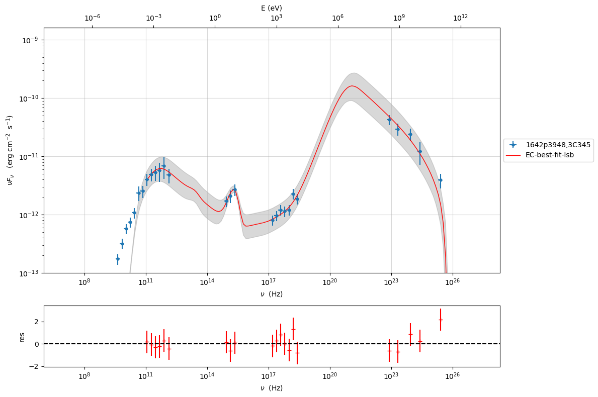

.. code:: ipython3

    f=ms.plot_par('beam_obj',log_plot=False)

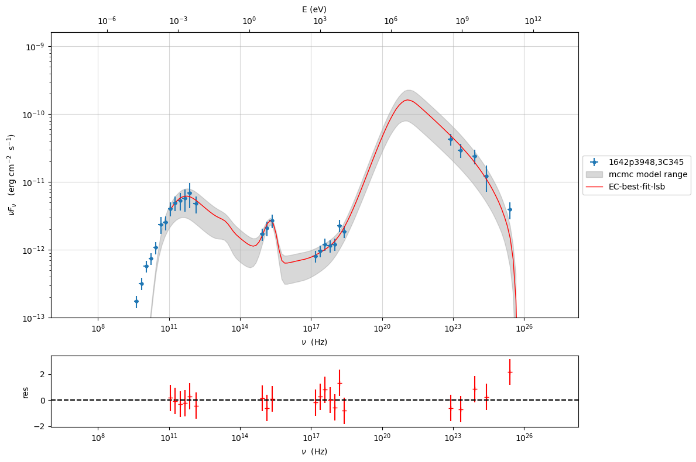

.. code:: ipython3

    f=ms.corner_plot()

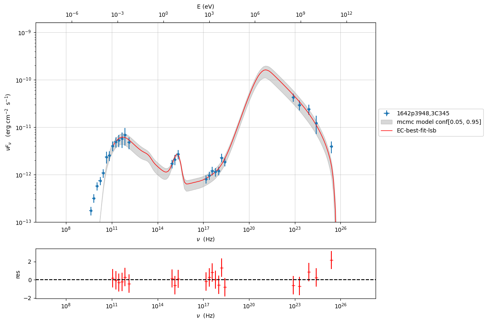

