.. _model_fitting_3:

Model fitting 4: Only Synchrotron
=================================

.. code:: ipython3

    import warnings
    warnings.filterwarnings('ignore')
    
    import matplotlib.pylab as plt
    import jetset
    from jetset.test_data_helper import  test_SEDs
    from jetset.data_loader import ObsData,Data
    from jetset.plot_sedfit import PlotSED
    from jetset.test_data_helper import  test_SEDs

.. code:: ipython3

    print(jetset.__version__)

.. parsed-literal::

    1.2.0rc13

.. code:: ipython3

    test_SEDs

.. parsed-literal::

    ['/Users/orion/anaconda3/envs/jetset/lib/python3.8/site-packages/jetset/test_data/SEDs_data/SED_3C345.ecsv',
     '/Users/orion/anaconda3/envs/jetset/lib/python3.8/site-packages/jetset/test_data/SEDs_data/SED_MW_Mrk421_EBL_DEABS.ecsv',
     '/Users/orion/anaconda3/envs/jetset/lib/python3.8/site-packages/jetset/test_data/SEDs_data/SED_MW_Mrk501_EBL_ABS.ecsv',
     '/Users/orion/anaconda3/envs/jetset/lib/python3.8/site-packages/jetset/test_data/SEDs_data/SED_MW_Mrk501_EBL_DEABS.ecsv']

Loading data
------------

see the :ref:`data_format` user guide for further information about loading data 

.. code:: ipython3

    print(test_SEDs[1])
    data=Data.from_file(test_SEDs[1])

.. parsed-literal::

    /Users/orion/anaconda3/envs/jetset/lib/python3.8/site-packages/jetset/test_data/SEDs_data/SED_MW_Mrk421_EBL_DEABS.ecsv

.. code:: ipython3

    %matplotlib inline
    sed_data=ObsData(data_table=data)
    sed_data.group_data(bin_width=0.2)
    
    sed_data.add_systematics(0.1,[10.**6,10.**29])
    p=sed_data.plot_sed()

.. parsed-literal::

    ================================================================================
    
    ***  binning data  ***
    ---> N bins= 89
    ---> bin_widht= 0.2
    ================================================================================
    

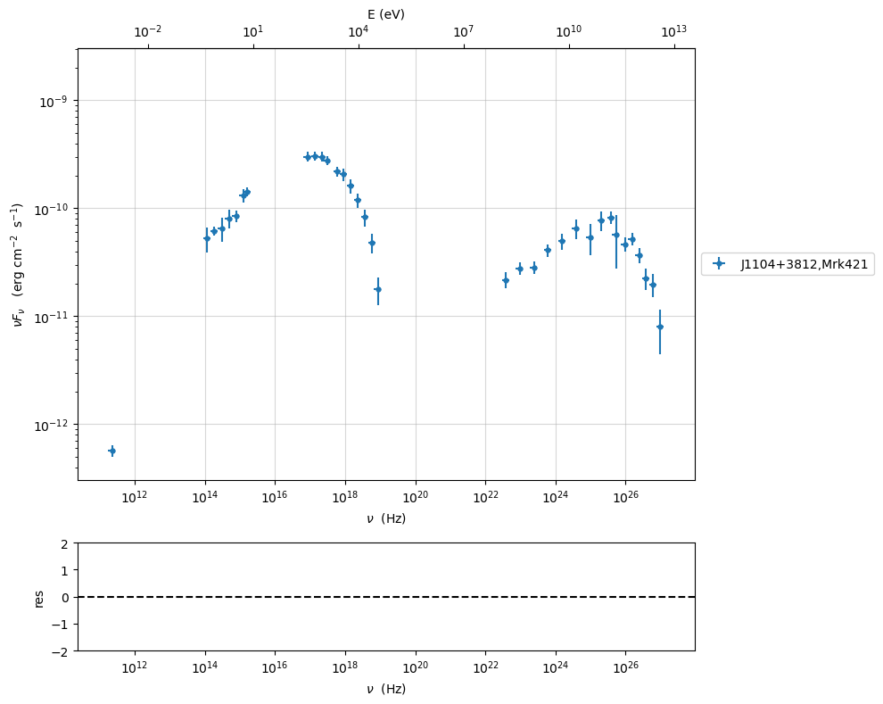

.. code:: ipython3

    sed_data.save('Mrk_401.pkl')

Phenomenological model constraining
-----------------------------------

see the :ref:`phenom_constr` user guide for further information about loading data 

Spectral indices
~~~~~~~~~~~~~~~~

.. code:: ipython3

    from jetset.sed_shaper import  SEDShape
    my_shape=SEDShape(sed_data)
    my_shape.eval_indices(silent=True)
    p=my_shape.plot_indices()
    p.setlim(y_min=1E-15,y_max=1E-6)

.. parsed-literal::

    ================================================================================
    
    *** evaluating spectral indices for data ***
    ================================================================================
    

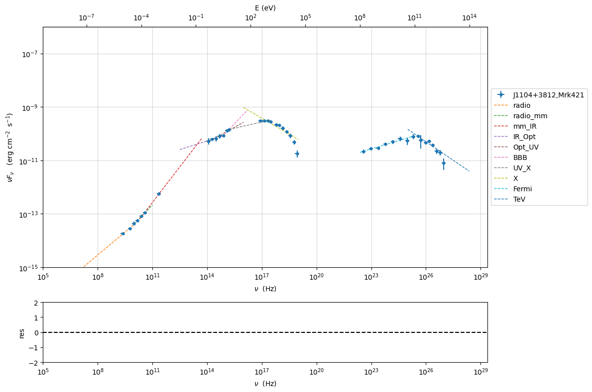

Sed shaper
~~~~~~~~~~

.. code:: ipython3

    mm,best_fit=my_shape.sync_fit(check_host_gal_template=False,
                      Ep_start=None,
                      minimizer='lsb',
                      silent=True,
                      fit_range=[10., 21.])

.. parsed-literal::

    ================================================================================
    
    *** Log-Polynomial fitting of the synchrotron component ***
    ---> first blind fit run,  fit range: [10.0, 21.0]
    ---> class:  HSP
    
    
    

.. raw:: html

    <i>Table length=4</i>
    <table id="table140678961306640-699611" class="table-striped table-bordered table-condensed">
    <thead><tr><th>model name</th><th>name</th><th>val</th><th>bestfit val</th><th>err +</th><th>err -</th><th>start val</th><th>fit range min</th><th>fit range max</th><th>frozen</th></tr></thead>
    <tr><td>LogCubic</td><td>b</td><td>-1.545300e-01</td><td>-1.545300e-01</td><td>9.534795e-03</td><td>--</td><td>-1.000000e+00</td><td>-1.000000e+01</td><td>0.000000e+00</td><td>False</td></tr>
    <tr><td>LogCubic</td><td>c</td><td>-1.023245e-02</td><td>-1.023245e-02</td><td>1.433073e-03</td><td>--</td><td>-1.000000e+00</td><td>-1.000000e+01</td><td>1.000000e+01</td><td>False</td></tr>
    <tr><td>LogCubic</td><td>Ep</td><td>1.672267e+01</td><td>1.672267e+01</td><td>4.139942e-02</td><td>--</td><td>1.667039e+01</td><td>0.000000e+00</td><td>3.000000e+01</td><td>False</td></tr>
    <tr><td>LogCubic</td><td>Sp</td><td>-9.491659e+00</td><td>-9.491659e+00</td><td>2.515285e-02</td><td>--</td><td>-1.000000e+01</td><td>-3.000000e+01</td><td>0.000000e+00</td><td>False</td></tr>
    </table>
    

.. parsed-literal::

    ---> sync       nu_p=+1.672267e+01 (err=+4.139942e-02)  nuFnu_p=-9.491659e+00 (err=+2.515285e-02) curv.=-1.545300e-01 (err=+9.534795e-03)
    ================================================================================
    

.. code:: ipython3

    my_shape.IC_fit(fit_range=[23., 29.],minimizer='minuit',silent=True)
    p=my_shape.plot_shape_fit()
    p.setlim(y_min=1E-15)

.. parsed-literal::

    ================================================================================
    
    *** Log-Polynomial fitting of the IC component ***
    ---> fit range: [23.0, 29.0]
    ---> LogCubic fit
    
    

.. raw:: html

    <i>Table length=4</i>
    <table id="table140678961307408-21252" class="table-striped table-bordered table-condensed">
    <thead><tr><th>model name</th><th>name</th><th>val</th><th>bestfit val</th><th>err +</th><th>err -</th><th>start val</th><th>fit range min</th><th>fit range max</th><th>frozen</th></tr></thead>
    <tr><td>LogCubic</td><td>b</td><td>-2.098186e-01</td><td>-2.098186e-01</td><td>3.133032e-02</td><td>--</td><td>-1.000000e+00</td><td>-1.000000e+01</td><td>0.000000e+00</td><td>False</td></tr>
    <tr><td>LogCubic</td><td>c</td><td>-4.661868e-02</td><td>-4.661868e-02</td><td>2.178352e-02</td><td>--</td><td>-1.000000e+00</td><td>-1.000000e+01</td><td>1.000000e+01</td><td>False</td></tr>
    <tr><td>LogCubic</td><td>Ep</td><td>2.524926e+01</td><td>2.524926e+01</td><td>1.147759e-01</td><td>--</td><td>2.529412e+01</td><td>0.000000e+00</td><td>3.000000e+01</td><td>False</td></tr>
    <tr><td>LogCubic</td><td>Sp</td><td>-1.011085e+01</td><td>-1.011085e+01</td><td>3.498963e-02</td><td>--</td><td>-1.000000e+01</td><td>-3.000000e+01</td><td>0.000000e+00</td><td>False</td></tr>
    </table>
    

.. parsed-literal::

    ---> IC         nu_p=+2.524926e+01 (err=+1.147759e-01)  nuFnu_p=-1.011085e+01 (err=+3.498963e-02) curv.=-2.098186e-01 (err=+3.133032e-02)
    ================================================================================
    

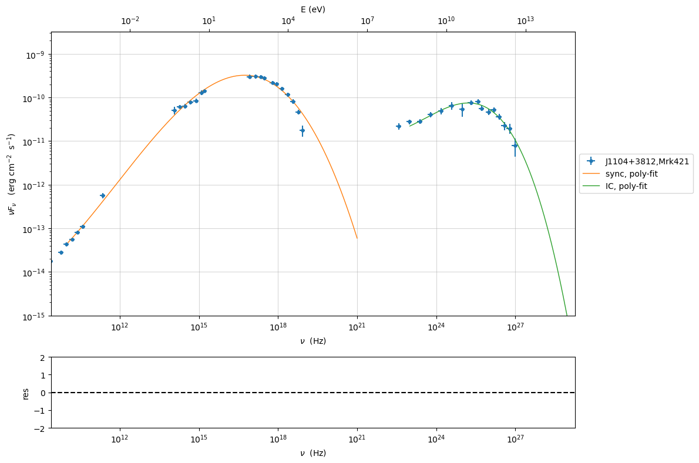

Model constraining
~~~~~~~~~~~~~~~~~~

.. code:: ipython3

    from jetset.obs_constrain import ObsConstrain
    from jetset.model_manager import  FitModel
    from jetset.minimizer import fit_SED
    sed_obspar=ObsConstrain(beaming=25,
                            B_range=[0.001,0.1],
                            distr_e='lppl',
                            t_var_sec=3*86400,
                            nu_cut_IR=1E12,
                            SEDShape=my_shape)
    
    
    prefit_jet=sed_obspar.constrain_SSC_model(electron_distribution_log_values=False,silent=True)
    prefit_jet.save_model('prefit_jet.pkl')

.. parsed-literal::

    ================================================================================
    
    ***  constrains parameters from observable ***
    

.. raw:: html

    <i>Table length=11</i>
    <table id="table140678958229056-577967" class="table-striped table-bordered table-condensed">
    <thead><tr><th>model name</th><th>name</th><th>par type</th><th>units</th><th>val</th><th>phys. bound. min</th><th>phys. bound. max</th><th>log</th><th>frozen</th></tr></thead>
    <tr><td>jet_leptonic</td><td>R</td><td>region_size</td><td>cm</td><td>3.112712e+16</td><td>1.000000e+03</td><td>1.000000e+30</td><td>False</td><td>False</td></tr>
    <tr><td>jet_leptonic</td><td>R_H</td><td>region_position</td><td>cm</td><td>1.000000e+17</td><td>0.000000e+00</td><td>--</td><td>False</td><td>True</td></tr>
    <tr><td>jet_leptonic</td><td>B</td><td>magnetic_field</td><td>gauss</td><td>5.050000e-02</td><td>0.000000e+00</td><td>--</td><td>False</td><td>False</td></tr>
    <tr><td>jet_leptonic</td><td>beam_obj</td><td>beaming</td><td>lorentz-factor*</td><td>2.500000e+01</td><td>1.000000e-04</td><td>--</td><td>False</td><td>False</td></tr>
    <tr><td>jet_leptonic</td><td>z_cosm</td><td>redshift</td><td></td><td>3.080000e-02</td><td>0.000000e+00</td><td>--</td><td>False</td><td>False</td></tr>
    <tr><td>jet_leptonic</td><td>gmin</td><td>low-energy-cut-off</td><td>lorentz-factor*</td><td>4.697542e+02</td><td>1.000000e+00</td><td>1.000000e+09</td><td>False</td><td>False</td></tr>
    <tr><td>jet_leptonic</td><td>gmax</td><td>high-energy-cut-off</td><td>lorentz-factor*</td><td>1.373160e+06</td><td>1.000000e+00</td><td>1.000000e+15</td><td>False</td><td>False</td></tr>
    <tr><td>jet_leptonic</td><td>N</td><td>emitters_density</td><td>1 / cm3</td><td>9.060842e-01</td><td>0.000000e+00</td><td>--</td><td>False</td><td>False</td></tr>
    <tr><td>jet_leptonic</td><td>gamma0_log_parab</td><td>turn-over-energy</td><td>lorentz-factor*</td><td>3.188500e+04</td><td>1.000000e+00</td><td>1.000000e+09</td><td>False</td><td>False</td></tr>
    <tr><td>jet_leptonic</td><td>s</td><td>LE_spectral_slope</td><td></td><td>2.181578e+00</td><td>-1.000000e+01</td><td>1.000000e+01</td><td>False</td><td>False</td></tr>
    <tr><td>jet_leptonic</td><td>r</td><td>spectral_curvature</td><td></td><td>7.726502e-01</td><td>-1.500000e+01</td><td>1.500000e+01</td><td>False</td><td>False</td></tr>
    </table>
    

.. parsed-literal::

    
    ================================================================================
    

.. code:: ipython3

    pl=prefit_jet.plot_model(sed_data=sed_data)
    pl.add_residual_plot(prefit_jet,sed_data)
    pl.setlim(y_min=1E-15,x_min=1E7,x_max=1E29)

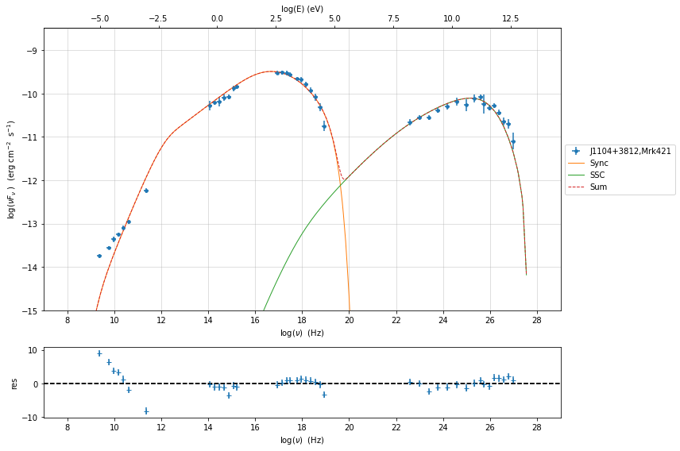

Model fitting only Synchorotron component
-----------------------------------------

.. note::
   With the new implementation of composite model  (`FitModel` class) to set parameters you have to specify the model component, this is different from versions<1.1.2,
   and this holds also for the `freeze` method and for setting  `fit_range` intervals, and for the methods relate to parameters setting in general.
   See the :ref:`composite_models` user guide for further information about the new implementation of `FitModel`, in particular for parameter setting

Model fitting with Minuit
~~~~~~~~~~~~~~~~~~~~~~~~~

.. code:: ipython3

    from jetset.jet_model import Jet
    jet_minuit=Jet.load_model('prefit_jet.pkl')
    jet_minuit.set_gamma_grid_size(200)

.. raw:: html

    <i>Table length=11</i>
    <table id="table140678950357264-202940" class="table-striped table-bordered table-condensed">
    <thead><tr><th>model name</th><th>name</th><th>par type</th><th>units</th><th>val</th><th>phys. bound. min</th><th>phys. bound. max</th><th>log</th><th>frozen</th></tr></thead>
    <tr><td>jet_leptonic</td><td>gmin</td><td>low-energy-cut-off</td><td>lorentz-factor*</td><td>4.697542e+02</td><td>1.000000e+00</td><td>1.000000e+09</td><td>False</td><td>False</td></tr>
    <tr><td>jet_leptonic</td><td>gmax</td><td>high-energy-cut-off</td><td>lorentz-factor*</td><td>1.373160e+06</td><td>1.000000e+00</td><td>1.000000e+15</td><td>False</td><td>False</td></tr>
    <tr><td>jet_leptonic</td><td>N</td><td>emitters_density</td><td>1 / cm3</td><td>9.060842e-01</td><td>0.000000e+00</td><td>--</td><td>False</td><td>False</td></tr>
    <tr><td>jet_leptonic</td><td>gamma0_log_parab</td><td>turn-over-energy</td><td>lorentz-factor*</td><td>3.188500e+04</td><td>1.000000e+00</td><td>1.000000e+09</td><td>False</td><td>False</td></tr>
    <tr><td>jet_leptonic</td><td>s</td><td>LE_spectral_slope</td><td></td><td>2.181578e+00</td><td>-1.000000e+01</td><td>1.000000e+01</td><td>False</td><td>False</td></tr>
    <tr><td>jet_leptonic</td><td>r</td><td>spectral_curvature</td><td></td><td>7.726502e-01</td><td>-1.500000e+01</td><td>1.500000e+01</td><td>False</td><td>False</td></tr>
    <tr><td>jet_leptonic</td><td>R</td><td>region_size</td><td>cm</td><td>3.112712e+16</td><td>1.000000e+03</td><td>1.000000e+30</td><td>False</td><td>False</td></tr>
    <tr><td>jet_leptonic</td><td>R_H</td><td>region_position</td><td>cm</td><td>1.000000e+17</td><td>0.000000e+00</td><td>--</td><td>False</td><td>True</td></tr>
    <tr><td>jet_leptonic</td><td>B</td><td>magnetic_field</td><td>gauss</td><td>5.050000e-02</td><td>0.000000e+00</td><td>--</td><td>False</td><td>False</td></tr>
    <tr><td>jet_leptonic</td><td>beam_obj</td><td>beaming</td><td>lorentz-factor*</td><td>2.500000e+01</td><td>1.000000e-04</td><td>--</td><td>False</td><td>False</td></tr>
    <tr><td>jet_leptonic</td><td>z_cosm</td><td>redshift</td><td></td><td>3.080000e-02</td><td>0.000000e+00</td><td>--</td><td>False</td><td>False</td></tr>
    </table>
    

we switch off the IC component

.. code:: ipython3

    
    jet_minuit.spectral_components.SSC.state='off'
    jet_minuit.show_model()

.. parsed-literal::

    
    --------------------------------------------------------------------------------
    jet model description
    --------------------------------------------------------------------------------
    name: jet_leptonic  
    
    electrons distribution:
     type: lppl  
     gamma energy grid size:  201
     gmin grid : 4.697542e+02
     gmax grid : 1.373160e+06
     normalization  True
     log-values  False
    
    radiative fields:
     seed photons grid size:  100
     IC emission grid size:  100
     source emissivity lower bound :  1.000000e-120
     spectral components:
       name:Sum, state: on
       name:Sync, state: self-abs
       name:SSC, state: off
    external fields transformation method: blob
    
    SED info:
     nu grid size jetkernel: 1000
     nu size: 500
     nu mix (Hz): 1.000000e+06
     nu max (Hz): 1.000000e+30
    
    flux plot lower bound   :  1.000000e-30
    
    --------------------------------------------------------------------------------

.. raw:: html

    <i>Table length=11</i>
    <table id="table140678961274400-777062" class="table-striped table-bordered table-condensed">
    <thead><tr><th>model name</th><th>name</th><th>par type</th><th>units</th><th>val</th><th>phys. bound. min</th><th>phys. bound. max</th><th>log</th><th>frozen</th></tr></thead>
    <tr><td>jet_leptonic</td><td>gmin</td><td>low-energy-cut-off</td><td>lorentz-factor*</td><td>4.697542e+02</td><td>1.000000e+00</td><td>1.000000e+09</td><td>False</td><td>False</td></tr>
    <tr><td>jet_leptonic</td><td>gmax</td><td>high-energy-cut-off</td><td>lorentz-factor*</td><td>1.373160e+06</td><td>1.000000e+00</td><td>1.000000e+15</td><td>False</td><td>False</td></tr>
    <tr><td>jet_leptonic</td><td>N</td><td>emitters_density</td><td>1 / cm3</td><td>9.060842e-01</td><td>0.000000e+00</td><td>--</td><td>False</td><td>False</td></tr>
    <tr><td>jet_leptonic</td><td>gamma0_log_parab</td><td>turn-over-energy</td><td>lorentz-factor*</td><td>3.188500e+04</td><td>1.000000e+00</td><td>1.000000e+09</td><td>False</td><td>False</td></tr>
    <tr><td>jet_leptonic</td><td>s</td><td>LE_spectral_slope</td><td></td><td>2.181578e+00</td><td>-1.000000e+01</td><td>1.000000e+01</td><td>False</td><td>False</td></tr>
    <tr><td>jet_leptonic</td><td>r</td><td>spectral_curvature</td><td></td><td>7.726502e-01</td><td>-1.500000e+01</td><td>1.500000e+01</td><td>False</td><td>False</td></tr>
    <tr><td>jet_leptonic</td><td>R</td><td>region_size</td><td>cm</td><td>3.112712e+16</td><td>1.000000e+03</td><td>1.000000e+30</td><td>False</td><td>False</td></tr>
    <tr><td>jet_leptonic</td><td>R_H</td><td>region_position</td><td>cm</td><td>1.000000e+17</td><td>0.000000e+00</td><td>--</td><td>False</td><td>True</td></tr>
    <tr><td>jet_leptonic</td><td>B</td><td>magnetic_field</td><td>gauss</td><td>5.050000e-02</td><td>0.000000e+00</td><td>--</td><td>False</td><td>False</td></tr>
    <tr><td>jet_leptonic</td><td>beam_obj</td><td>beaming</td><td>lorentz-factor*</td><td>2.500000e+01</td><td>1.000000e-04</td><td>--</td><td>False</td><td>False</td></tr>
    <tr><td>jet_leptonic</td><td>z_cosm</td><td>redshift</td><td></td><td>3.080000e-02</td><td>0.000000e+00</td><td>--</td><td>False</td><td>False</td></tr>
    </table>
    

.. parsed-literal::

    --------------------------------------------------------------------------------

.. code:: ipython3

    fit_model_minuit=FitModel( jet=jet_minuit, name='Only-Synch-best-fit-minuit') 
    
    fit_model_minuit.freeze('jet_leptonic','z_cosm')
    fit_model_minuit.freeze('jet_leptonic','R_H')
    fit_model_minuit.freeze('jet_leptonic','R')
    fit_model_minuit.freeze('jet_leptonic','gmax')
    fit_model_minuit.jet_leptonic.parameters.R.fit_range=[10**15.5, 10**17.5]
    fit_model_minuit.jet_leptonic.parameters.beam_obj.fit_range=[5., 50.]

.. code:: ipython3

    from jetset.minimizer import fit_SED,ModelMinimizer
    
    model_minimizer_minuit=ModelMinimizer('minuit')
    best_fit_minuit=model_minimizer_minuit.fit(fit_model_minuit,sed_data,10.0**15,10**20.0,fitname='SSC-best-fit-minuit',repeat=3)

.. parsed-literal::

    filtering data in fit range = [1.000000e+15,1.000000e+20]
    data length 13
    ================================================================================
    
    *** start fit process ***
    ----- 
    fit run: 0

.. parsed-literal::

    0it [00:00, ?it/s]

.. parsed-literal::

    - best chisq=1.36478e+00
    
    fit run: 1
    - old chisq=1.36478e+00

.. parsed-literal::

    0it [00:00, ?it/s]

.. parsed-literal::

    - best chisq=1.36477e+00
    
    fit run: 2
    - old chisq=1.36477e+00

.. parsed-literal::

    0it [00:00, ?it/s]

.. parsed-literal::

    - best chisq=1.36477e+00
    
    -------------------------------------------------------------------------
    Fit report
    
    Model: SSC-best-fit-minuit

.. raw:: html

    <i>Table length=11</i>
    <table id="table140678960808960-887499" class="table-striped table-bordered table-condensed">
    <thead><tr><th>model name</th><th>name</th><th>par type</th><th>units</th><th>val</th><th>phys. bound. min</th><th>phys. bound. max</th><th>log</th><th>frozen</th></tr></thead>
    <tr><td>jet_leptonic</td><td>gmin</td><td>low-energy-cut-off</td><td>lorentz-factor*</td><td>9.157430e+02</td><td>1.000000e+00</td><td>1.000000e+09</td><td>False</td><td>False</td></tr>
    <tr><td>jet_leptonic</td><td>gmax</td><td>high-energy-cut-off</td><td>lorentz-factor*</td><td>1.373160e+06</td><td>1.000000e+00</td><td>1.000000e+15</td><td>False</td><td>True</td></tr>
    <tr><td>jet_leptonic</td><td>N</td><td>emitters_density</td><td>1 / cm3</td><td>1.850602e+00</td><td>0.000000e+00</td><td>--</td><td>False</td><td>False</td></tr>
    <tr><td>jet_leptonic</td><td>gamma0_log_parab</td><td>turn-over-energy</td><td>lorentz-factor*</td><td>4.329106e+04</td><td>1.000000e+00</td><td>1.000000e+09</td><td>False</td><td>False</td></tr>
    <tr><td>jet_leptonic</td><td>s</td><td>LE_spectral_slope</td><td></td><td>2.159322e+00</td><td>-1.000000e+01</td><td>1.000000e+01</td><td>False</td><td>False</td></tr>
    <tr><td>jet_leptonic</td><td>r</td><td>spectral_curvature</td><td></td><td>6.029154e-01</td><td>-1.500000e+01</td><td>1.500000e+01</td><td>False</td><td>False</td></tr>
    <tr><td>jet_leptonic</td><td>R</td><td>region_size</td><td>cm</td><td>3.112712e+16</td><td>1.000000e+03</td><td>1.000000e+30</td><td>False</td><td>True</td></tr>
    <tr><td>jet_leptonic</td><td>R_H</td><td>region_position</td><td>cm</td><td>1.000000e+17</td><td>0.000000e+00</td><td>--</td><td>False</td><td>True</td></tr>
    <tr><td>jet_leptonic</td><td>B</td><td>magnetic_field</td><td>gauss</td><td>2.090652e-02</td><td>0.000000e+00</td><td>--</td><td>False</td><td>False</td></tr>
    <tr><td>jet_leptonic</td><td>beam_obj</td><td>beaming</td><td>lorentz-factor*</td><td>2.326797e+01</td><td>1.000000e-04</td><td>--</td><td>False</td><td>False</td></tr>
    <tr><td>jet_leptonic</td><td>z_cosm</td><td>redshift</td><td></td><td>3.080000e-02</td><td>0.000000e+00</td><td>--</td><td>False</td><td>True</td></tr>
    </table>
    

.. parsed-literal::

    
    converged=True
    calls=95
    mesg=

.. raw:: html

    <table>
        <tr>
            <td colspan="2" style="text-align:left" title="Minimum value of function"> FCN = 1.365 </td>
            <td colspan="3" style="text-align:center" title="No. of function evaluations in last call and total number"> Nfcn = 95 </td>
        </tr>
        <tr>
            <td colspan="2" style="text-align:left" title="Estimated distance to minimum and goal"> EDM = 2.08e-05 (Goal: 0.0002) </td>
            <td colspan="3" style="text-align:center" title="No. of gradient evaluations in last call and total number">  </td>
        </tr>
        <tr>
            <td style="text-align:center;background-color:#92CCA6;color:black"> Valid Minimum </td>
            <td style="text-align:center;background-color:#92CCA6;color:black"> Valid Parameters </td>
            <td colspan="3" style="text-align:center;background-color:#92CCA6;color:black"> No Parameters at limit </td>
        </tr>
        <tr>
            <td colspan="2" style="text-align:center;background-color:#92CCA6;color:black"> Below EDM threshold (goal x 10) </td>
            <td colspan="3" style="text-align:center;background-color:#92CCA6;color:black"> Below call limit </td>
        </tr>
        <tr>
            <td style="text-align:center;background-color:#92CCA6;color:black"> Covariance </td>
            <td style="text-align:center;background-color:#92CCA6;color:black"> Hesse ok </td>
            <td style="text-align:center;background-color:#FFF79A;color:black" title="Is covariance matrix accurate?"> APPROXIMATE </td>
            <td style="text-align:center;background-color:#c15ef7;color:black" title="Is covariance matrix positive definite?"> NOT pos. def. </td>
            <td style="text-align:center;background-color:#c15ef7;color:black" title="Was positive definiteness enforced by Minuit?"> FORCED </td>
        </tr>
    </table><table>
        <tr>
            <td></td>
            <th title="Variable name"> Name </th>
            <th title="Value of parameter"> Value </th>
            <th title="Hesse error"> Hesse Error </th>
            <th title="Minos lower error"> Minos Error- </th>
            <th title="Minos upper error"> Minos Error+ </th>
            <th title="Lower limit of the parameter"> Limit- </th>
            <th title="Upper limit of the parameter"> Limit+ </th>
            <th title="Is the parameter fixed in the fit"> Fixed </th>
        </tr>
        <tr>
            <th> 0 </th>
            <td> par_0 </td>
            <td> 0.92e3 </td>
            <td> 0.27e3 </td>
            <td>  </td>
            <td>  </td>
            <td> 1 </td>
            <td> 1E+09 </td>
            <td>  </td>
        </tr>
        <tr>
            <th> 1 </th>
            <td> par_1 </td>
            <td> 1.9 </td>
            <td> 0.5 </td>
            <td>  </td>
            <td>  </td>
            <td> 0 </td>
            <td>  </td>
            <td>  </td>
        </tr>
        <tr>
            <th> 2 </th>
            <td> par_2 </td>
            <td> 43e3 </td>
            <td> 8e3 </td>
            <td>  </td>
            <td>  </td>
            <td> 1 </td>
            <td> 1E+09 </td>
            <td>  </td>
        </tr>
        <tr>
            <th> 3 </th>
            <td> par_3 </td>
            <td> 2.16 </td>
            <td> 0.06 </td>
            <td>  </td>
            <td>  </td>
            <td> -10 </td>
            <td> 10 </td>
            <td>  </td>
        </tr>
        <tr>
            <th> 4 </th>
            <td> par_4 </td>
            <td> 0.60 </td>
            <td> 0.08 </td>
            <td>  </td>
            <td>  </td>
            <td> -15 </td>
            <td> 15 </td>
            <td>  </td>
        </tr>
        <tr>
            <th> 5 </th>
            <td> par_5 </td>
            <td> 0.0209 </td>
            <td> 0.0023 </td>
            <td>  </td>
            <td>  </td>
            <td> 0 </td>
            <td>  </td>
            <td>  </td>
        </tr>
        <tr>
            <th> 6 </th>
            <td> par_6 </td>
            <td> 23.3 </td>
            <td> 1.6 </td>
            <td>  </td>
            <td>  </td>
            <td> 5 </td>
            <td> 50 </td>
            <td>  </td>
        </tr>
    </table><table>
        <tr>
            <td></td>
            <th> par_0 </th>
            <th> par_1 </th>
            <th> par_2 </th>
            <th> par_3 </th>
            <th> par_4 </th>
            <th> par_5 </th>
            <th> par_6 </th>
        </tr>
        <tr>
            <th> par_0 </th>
            <td> 7.19e+04 </td>
            <td style="background-color:rgb(172,172,250);color:black"> -87.1 <strong>(-0.604)</strong> </td>
            <td style="background-color:rgb(250,243,243);color:black"> 9.91e+04 <strong>(0.044)</strong> </td>
            <td style="background-color:rgb(250,205,205);color:black"> 4.55 <strong>(0.297)</strong> </td>
            <td style="background-color:rgb(220,220,250);color:black"> -4.59 <strong>(-0.228)</strong> </td>
            <td style="background-color:rgb(246,246,250);color:black"> -0.0167 <strong>(-0.028)</strong> </td>
            <td style="background-color:rgb(198,198,250);color:black"> -174 <strong>(-0.398)</strong> </td>
        </tr>
        <tr>
            <th> par_1 </th>
            <td style="background-color:rgb(172,172,250);color:black"> -87.1 <strong>(-0.604)</strong> </td>
            <td> 0.289 </td>
            <td style="background-color:rgb(250,247,247);color:black"> 90.4 <strong>(0.020)</strong> </td>
            <td style="background-color:rgb(250,229,229);color:black"> 0.00427 <strong>(0.139)</strong> </td>
            <td style="background-color:rgb(229,229,250);color:black"> -0.00639 <strong>(-0.159)</strong> </td>
            <td style="background-color:rgb(229,229,250);color:black"> -0.000193 <strong>(-0.160)</strong> </td>
            <td style="background-color:rgb(234,234,250);color:black"> -0.105 <strong>(-0.120)</strong> </td>
        </tr>
        <tr>
            <th> par_2 </th>
            <td style="background-color:rgb(250,243,243);color:black"> 9.91e+04 <strong>(0.044)</strong> </td>
            <td style="background-color:rgb(250,247,247);color:black"> 90.4 <strong>(0.020)</strong> </td>
            <td> 7.15e+07 </td>
            <td style="background-color:rgb(250,180,180);color:black"> 224 <strong>(0.464)</strong> </td>
            <td style="background-color:rgb(250,149,149);color:black"> 427 <strong>(0.674)</strong> </td>
            <td style="background-color:rgb(250,244,244);color:black"> 0.75 <strong>(0.039)</strong> </td>
            <td style="background-color:rgb(250,247,247);color:black"> 294 <strong>(0.021)</strong> </td>
        </tr>
        <tr>
            <th> par_3 </th>
            <td style="background-color:rgb(250,205,205);color:black"> 4.55 <strong>(0.297)</strong> </td>
            <td style="background-color:rgb(250,229,229);color:black"> 0.00427 <strong>(0.139)</strong> </td>
            <td style="background-color:rgb(250,180,180);color:black"> 224 <strong>(0.464)</strong> </td>
            <td> 0.00327 </td>
            <td style="background-color:rgb(238,238,250);color:black"> -0.000393 <strong>(-0.092)</strong> </td>
            <td style="background-color:rgb(250,241,241);color:black"> 7.76e-06 <strong>(0.060)</strong> </td>
            <td style="background-color:rgb(250,241,241);color:black"> 0.00549 <strong>(0.059)</strong> </td>
        </tr>
        <tr>
            <th> par_4 </th>
            <td style="background-color:rgb(220,220,250);color:black"> -4.59 <strong>(-0.228)</strong> </td>
            <td style="background-color:rgb(229,229,250);color:black"> -0.00639 <strong>(-0.159)</strong> </td>
            <td style="background-color:rgb(250,149,149);color:black"> 427 <strong>(0.674)</strong> </td>
            <td style="background-color:rgb(238,238,250);color:black"> -0.000393 <strong>(-0.092)</strong> </td>
            <td> 0.00562 </td>
            <td style="background-color:rgb(250,195,195);color:black"> 6.13e-05 <strong>(0.364)</strong> </td>
            <td style="background-color:rgb(250,233,233);color:black"> 0.0139 <strong>(0.114)</strong> </td>
        </tr>
        <tr>
            <th> par_5 </th>
            <td style="background-color:rgb(246,246,250);color:black"> -0.0167 <strong>(-0.028)</strong> </td>
            <td style="background-color:rgb(229,229,250);color:black"> -0.000193 <strong>(-0.160)</strong> </td>
            <td style="background-color:rgb(250,244,244);color:black"> 0.75 <strong>(0.039)</strong> </td>
            <td style="background-color:rgb(250,241,241);color:black"> 7.76e-06 <strong>(0.060)</strong> </td>
            <td style="background-color:rgb(250,195,195);color:black"> 6.13e-05 <strong>(0.364)</strong> </td>
            <td> 5.06e-06 </td>
            <td style="background-color:rgb(198,198,250);color:black"> -0.00146 <strong>(-0.397)</strong> </td>
        </tr>
        <tr>
            <th> par_6 </th>
            <td style="background-color:rgb(198,198,250);color:black"> -174 <strong>(-0.398)</strong> </td>
            <td style="background-color:rgb(234,234,250);color:black"> -0.105 <strong>(-0.120)</strong> </td>
            <td style="background-color:rgb(250,247,247);color:black"> 294 <strong>(0.021)</strong> </td>
            <td style="background-color:rgb(250,241,241);color:black"> 0.00549 <strong>(0.059)</strong> </td>
            <td style="background-color:rgb(250,233,233);color:black"> 0.0139 <strong>(0.114)</strong> </td>
            <td style="background-color:rgb(198,198,250);color:black"> -0.00146 <strong>(-0.397)</strong> </td>
            <td> 2.66 </td>
        </tr>
    </table>

.. parsed-literal::

    dof=6
    chisq=1.364771, chisq/red=0.227462 null hypothesis sig=0.967966
    
    best fit pars

.. raw:: html

    <i>Table length=11</i>
    <table id="table140678955623616-507351" class="table-striped table-bordered table-condensed">
    <thead><tr><th>model name</th><th>name</th><th>val</th><th>bestfit val</th><th>err +</th><th>err -</th><th>start val</th><th>fit range min</th><th>fit range max</th><th>frozen</th></tr></thead>
    <tr><td>jet_leptonic</td><td>gmin</td><td>9.157430e+02</td><td>9.157430e+02</td><td>2.681484e+02</td><td>--</td><td>4.697542e+02</td><td>1.000000e+00</td><td>1.000000e+09</td><td>False</td></tr>
    <tr><td>jet_leptonic</td><td>gmax</td><td>1.373160e+06</td><td>--</td><td>--</td><td>--</td><td>1.373160e+06</td><td>1.000000e+00</td><td>1.000000e+15</td><td>True</td></tr>
    <tr><td>jet_leptonic</td><td>N</td><td>1.850602e+00</td><td>1.850602e+00</td><td>5.363195e-01</td><td>--</td><td>9.060842e-01</td><td>0.000000e+00</td><td>--</td><td>False</td></tr>
    <tr><td>jet_leptonic</td><td>gamma0_log_parab</td><td>4.329106e+04</td><td>4.329106e+04</td><td>8.457976e+03</td><td>--</td><td>3.188500e+04</td><td>1.000000e+00</td><td>1.000000e+09</td><td>False</td></tr>
    <tr><td>jet_leptonic</td><td>s</td><td>2.159322e+00</td><td>2.159322e+00</td><td>5.717871e-02</td><td>--</td><td>2.181578e+00</td><td>-1.000000e+01</td><td>1.000000e+01</td><td>False</td></tr>
    <tr><td>jet_leptonic</td><td>r</td><td>6.029154e-01</td><td>6.029154e-01</td><td>7.496457e-02</td><td>--</td><td>7.726502e-01</td><td>-1.500000e+01</td><td>1.500000e+01</td><td>False</td></tr>
    <tr><td>jet_leptonic</td><td>R</td><td>3.112712e+16</td><td>--</td><td>--</td><td>--</td><td>3.112712e+16</td><td>3.162278e+15</td><td>3.162278e+17</td><td>True</td></tr>
    <tr><td>jet_leptonic</td><td>R_H</td><td>1.000000e+17</td><td>--</td><td>--</td><td>--</td><td>1.000000e+17</td><td>0.000000e+00</td><td>--</td><td>True</td></tr>
    <tr><td>jet_leptonic</td><td>B</td><td>2.090652e-02</td><td>2.090652e-02</td><td>2.250326e-03</td><td>--</td><td>5.050000e-02</td><td>0.000000e+00</td><td>--</td><td>False</td></tr>
    <tr><td>jet_leptonic</td><td>beam_obj</td><td>2.326797e+01</td><td>2.326797e+01</td><td>1.628276e+00</td><td>--</td><td>2.500000e+01</td><td>5.000000e+00</td><td>5.000000e+01</td><td>False</td></tr>
    <tr><td>jet_leptonic</td><td>z_cosm</td><td>3.080000e-02</td><td>--</td><td>--</td><td>--</td><td>3.080000e-02</td><td>0.000000e+00</td><td>--</td><td>True</td></tr>
    </table>
    

.. parsed-literal::

    -------------------------------------------------------------------------
    
    ================================================================================
    

.. code:: ipython3

    %matplotlib inline
    fit_model_minuit.set_nu_grid(1E6,1E30,200)
    fit_model_minuit.eval()
    p2=fit_model_minuit.plot_model(sed_data=sed_data)
    p2.setlim(y_min=1E-11,x_min=1E15,y_max=1E-9,x_max=3E19)

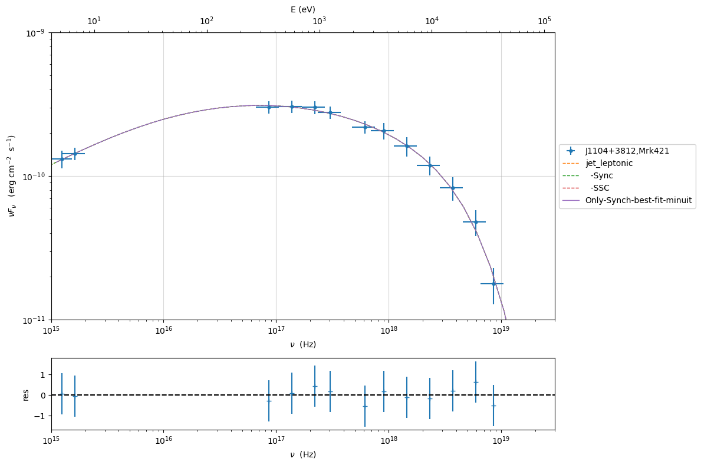

.. code:: ipython3

    try:
        c=model_minimizer_minuit.minimizer.draw_contour('r','s')
    except:
        pass

.. code:: ipython3

    m=model_minimizer_minuit.minimizer.draw_profile('r')

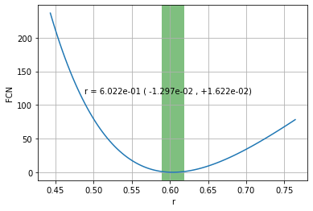

.. code:: ipython3

    best_fit_minuit.save_report('SSC-best-fit-minuit.pkl')
    model_minimizer_minuit.save_model('model_minimizer_minuit.pkl')
    fit_model_minuit.save_model('fit_model_minuit.pkl')

MCMC sampling
-------------

.. code:: ipython3

    from jetset.mcmc import McmcSampler
    from jetset.minimizer import ModelMinimizer

We used a flat prior centered on the best fit value. Setting
``bound=5.0`` and ``bound_rel=True`` means that:

1) the prior interval will be defined as [best_fit_val - delta_m ,
   best_fit_val + delta_p]

2) with delta_p=delta_m=best_fit_val*bound

If we set ``bound_rel=False`` then delta_p = delta_m =
best_fit_err*bound

It is possible to define asymmetric boundaries e.g. ``bound=[2.0,5.0]``
meaning that

1) for ``bound_rel=True``

   delta_p = best_fit_val*bound[1]

   delta_m =b est_fit_val*bound[0]

2) for ``bound_rel=False``

   delta_p = best_fit_err*bound[1]

   delta_m = best_fit_err*bound[0]

In the next release a more flexible prior interface will be added,
including different type of priors

Given the large parameter space, we select a sub sample of parameters
using the ``use_labels_dict``. If we do not pass the ‘use_labels_dict’
the full set of free parameters will be used

.. code:: ipython3

    model_minimizer_minuit = ModelMinimizer.load_model('model_minimizer_minuit.pkl')
    
    mcmc=McmcSampler(model_minimizer_minuit)
    
    labels=['N','B','beam_obj','s','gamma0_log_parab']
    model_name='jet_leptonic'
    use_labels_dict={model_name:labels}
    
    mcmc.run_sampler(nwalkers=128,burnin=10,steps=50,bound=5.0,bound_rel=True,threads=None,walker_start_bound=0.005,use_labels_dict=use_labels_dict)

.. parsed-literal::

    mcmc run starting
    

.. parsed-literal::

      0%|          | 0/50 [00:00<?, ?it/s]

.. parsed-literal::

    mcmc run done, with 1 threads took 180.34 seconds

.. code:: ipython3

    print(mcmc.acceptance_fraction)

.. parsed-literal::

    0.53

.. code:: ipython3

    p=mcmc.plot_model(sed_data=sed_data,fit_range=[1E15, 1E20],size=50)
    p.setlim(y_min=1E-14,x_min=1E6,x_max=2E20)

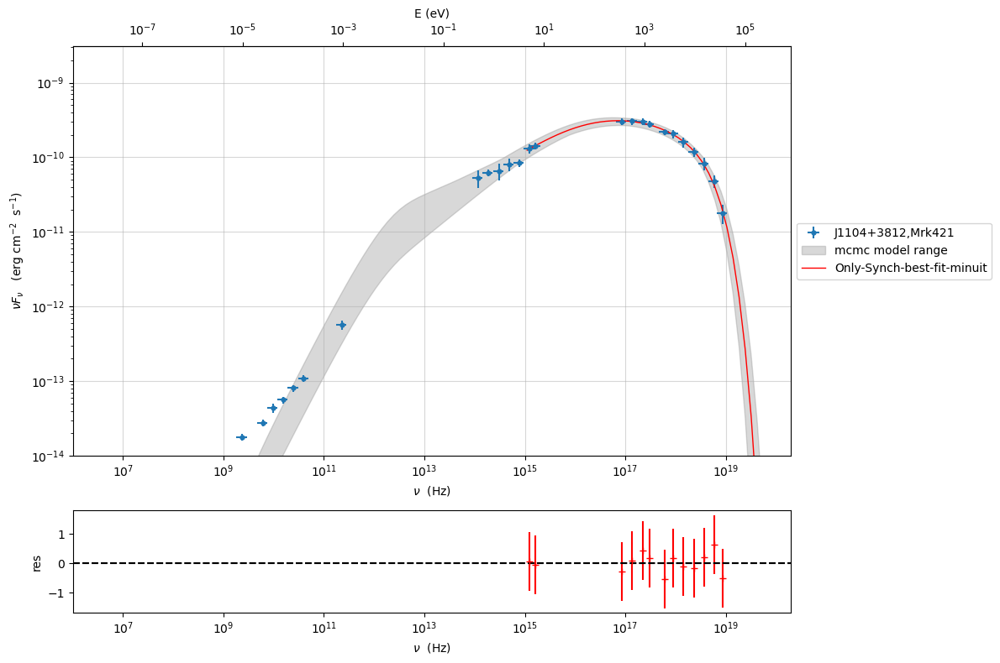

f=mcmc.plot_chain(‘s’,log_plot=False)

.. code:: ipython3

    f=mcmc.corner_plot()

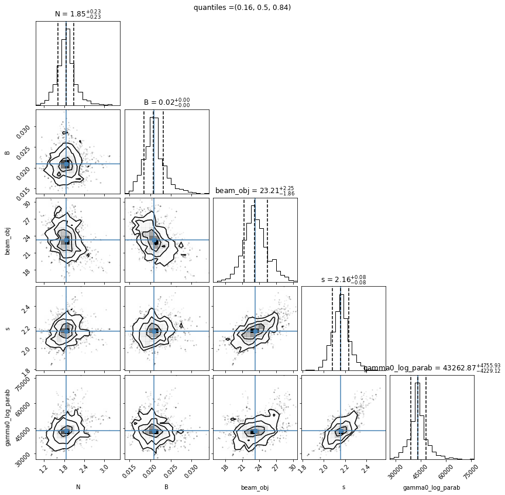

.. code:: ipython3

    mcmc.get_par('N')

.. parsed-literal::

    (array([1.86715271, 1.82682887, 1.8699941 , ..., 2.02290304, 1.90952071,
            2.4641022 ]),
     0)

.. code:: ipython3

    f=mcmc.plot_par('beam_obj')

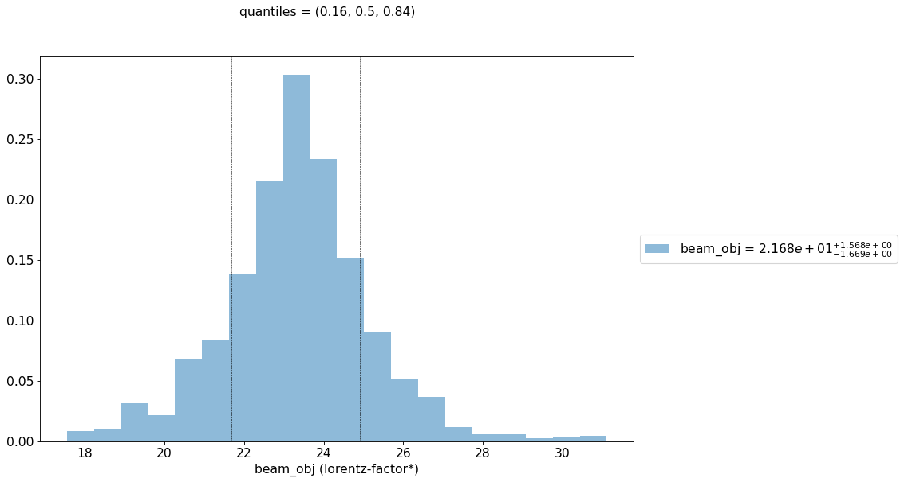

.. code:: ipython3

    f=mcmc.plot_par('gamma0_log_parab',log_plot=True)

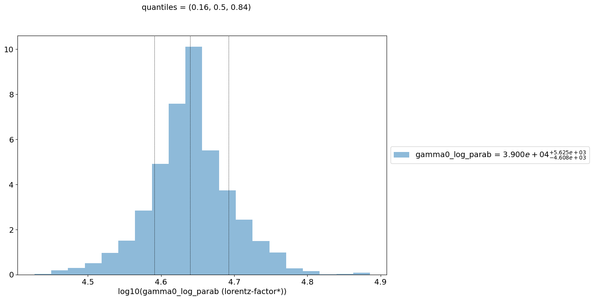

Save and reuse MCMC
-------------------

.. code:: ipython3

    mcmc.save('mcmc_sampler.pkl')

.. code:: ipython3

    from jetset.mcmc import McmcSampler
    from jetset.data_loader import ObsData
    from jetset.plot_sedfit import PlotSED
    from jetset.test_data_helper import  test_SEDs
    
    sed_data=ObsData.load('Mrk_401.pkl')
    
    ms=McmcSampler.load('mcmc_sampler.pkl')

.. code:: ipython3

    ms.model.name

.. parsed-literal::

    'Only-Synch-best-fit-minuit'

.. code:: ipython3

    p=ms.plot_model(sed_data=sed_data,fit_range=[1E15, 1E20],size=50)
    p.setlim(y_min=1E-14,x_min=1E6,x_max=2E20)

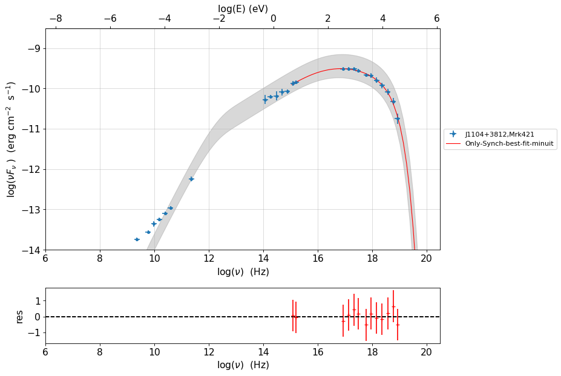

.. code:: ipython3

    f=ms.plot_par('beam_obj',log_plot=False)

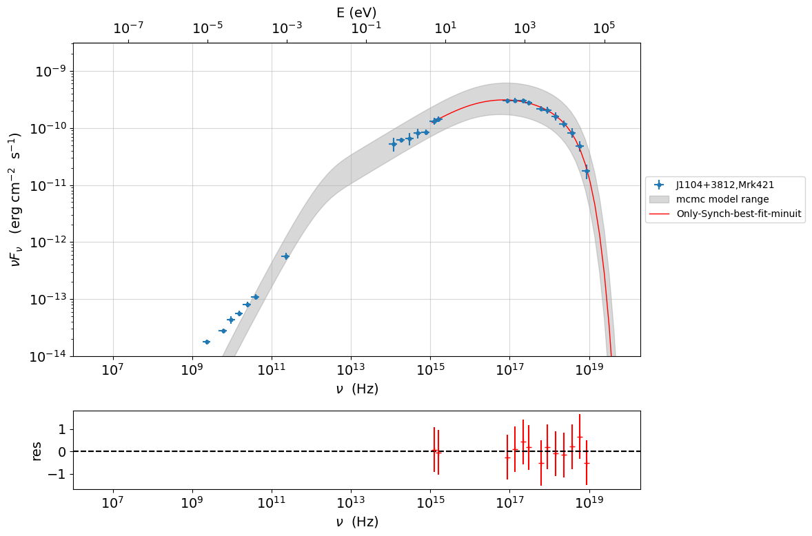

.. code:: ipython3

    f=ms.plot_par('B',log_plot=True)

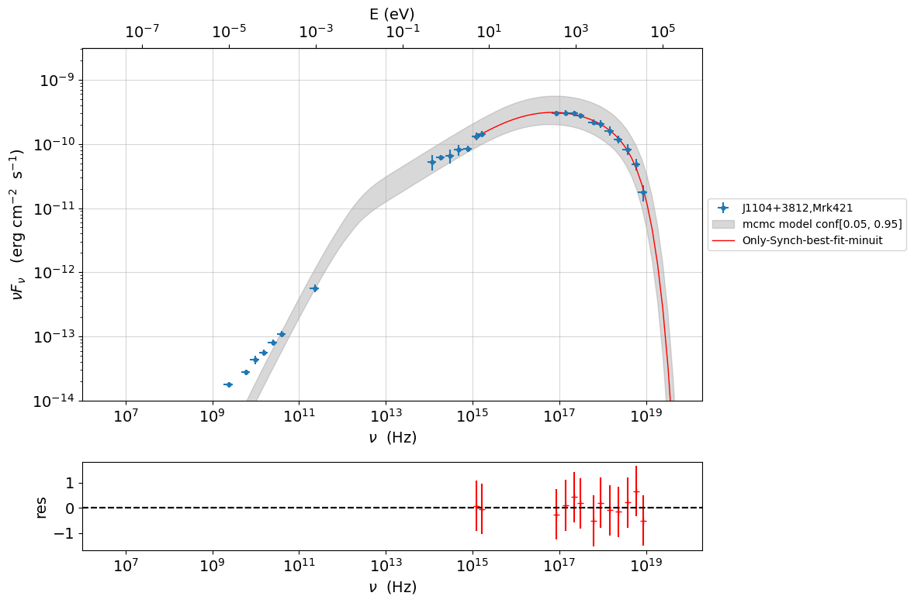

.. code:: ipython3

    f=mcmc.plot_chain('s',log_plot=False)

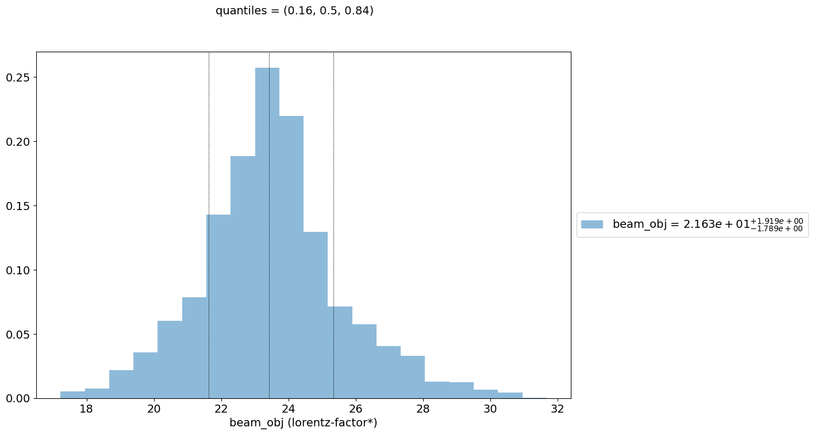

.. code:: ipython3

    f=mcmc.corner_plot()

.. image:: Jet_example_only_synchrotron_files/Jet_example_only_synchrotron_51_0.png

