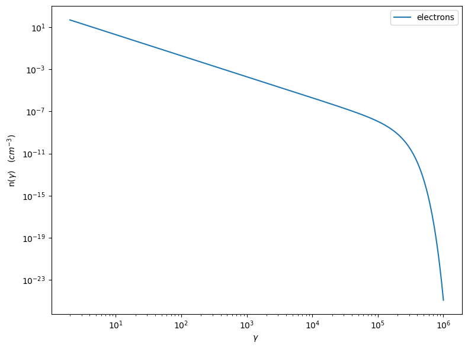
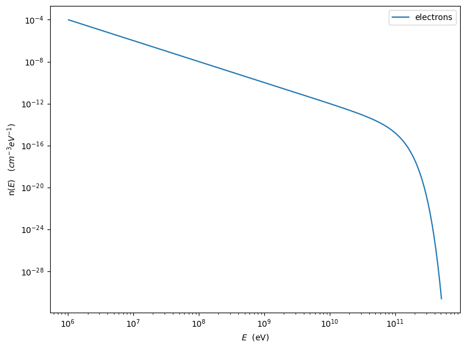
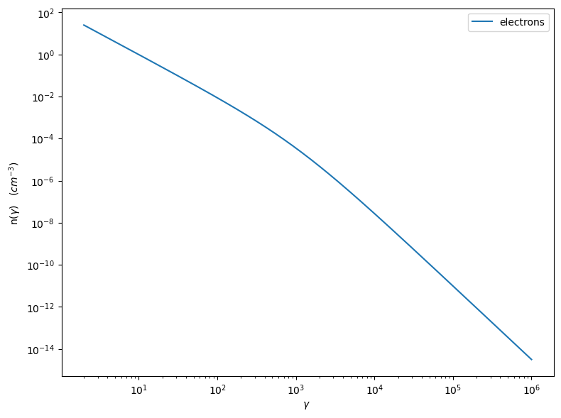
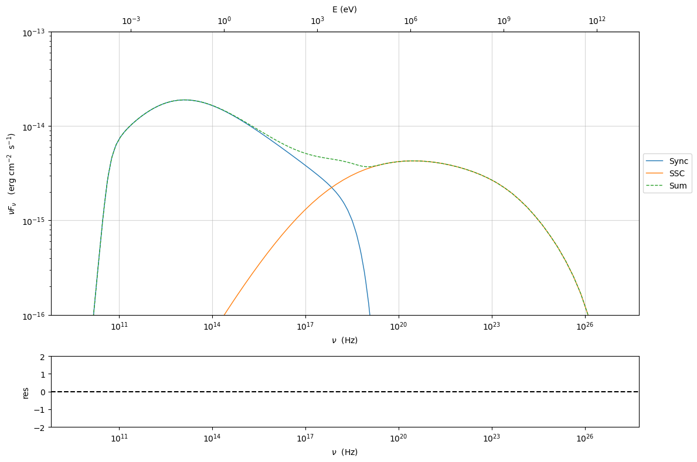
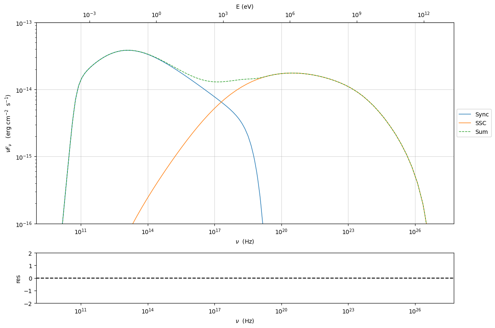
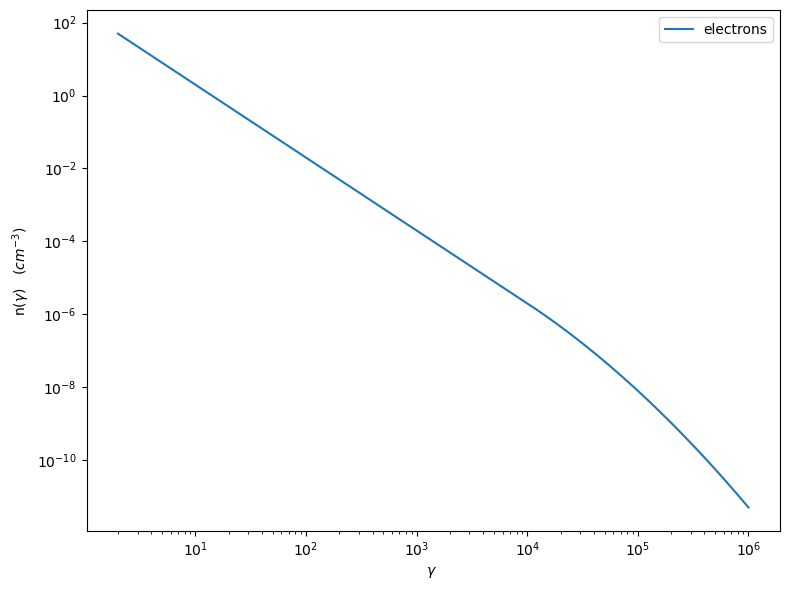
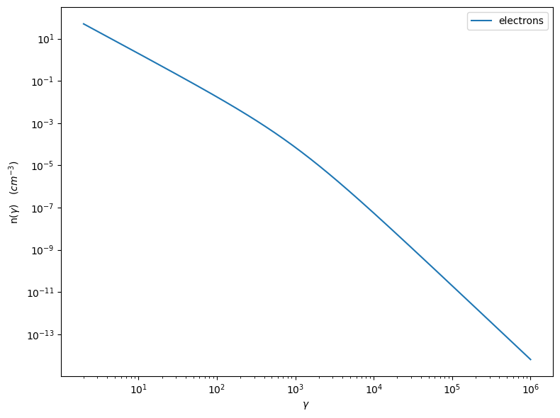
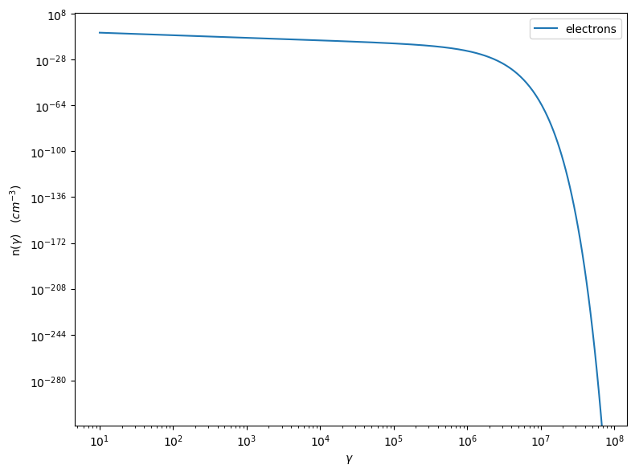
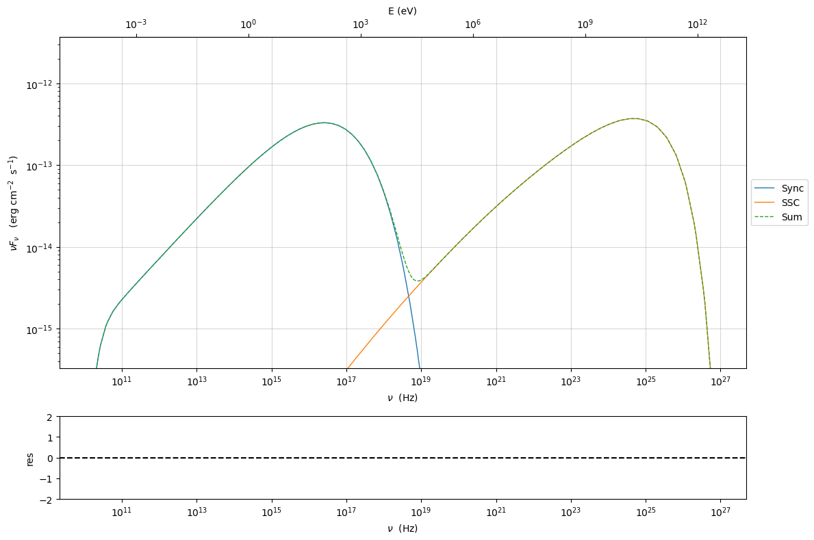
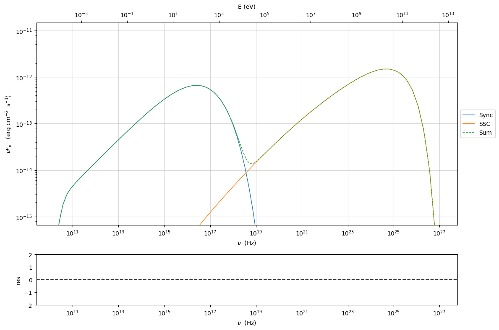

.. _custom_emitters_guide:


Custom emitters distribution
============================

.. code:: ipython3

    import numpy as np

.. code:: ipython3

    import jetset
    print('tested on jetset',jetset.__version__)


.. parsed-literal::

    tested on jetset 1.3.0rc7


The user can build custom emitters distributions using the :class:`.EmittersDistribution` class. The following examples show how to implement it

Building the custom distribution
--------------------------------

.. code:: ipython3

    from jetset.jet_emitters import EmittersDistribution

you need to define a function that describes your functional form (use
numpy functions to make the code more performant)

.. code:: ipython3

    def distr_func_super_exp(gamma,gamma_cut,s,a):
        return np.power(gamma,-s)*np.exp(-(1/a)*(gamma/gamma_cut)**a)

then you have to link the parmeters in your funtcion to a paramters of
the ``EmittersDistribution`` class.

.. note::
   It is important to note that each parameter has the proper `par_type` string, and it is important to properly set this ``par_type`` if you want to have good results using the phenomenological constraining process.
   Have a look at the predefined model to understand how to set the ``par_type``` string. As a general rule:
   
   1) the slope of the power law that starts from ``gmin`` should be defined ``LE_spectral_slope``
   
   2) any slope of the power law above the break should be defined as ``HE_spectral_slope``
   
   3) values of gamma defining the transition from a power law trend toward a curved trend (including cut-off)  should be defined as ``turn-over-energy``
   
   4) curvature in log-parabolic trends and/or super-exp exponent, should be defined as 'spectral_curvature'
   
   4) the spectral_type=``user_defined`` *will not work* for phenomenological constraining: 

.. code:: ipython3

    print('allowed_sepctral types for phenomenological constraining',EmittersDistribution.spectral_types_obs_constrain())


.. parsed-literal::

    allowed_sepctral types for phenomenological constraining ['bkn', 'plc', 'lp', 'lppl', 'pl', 'lpep', 'array']


.. code:: ipython3

    n_e_super_exp=EmittersDistribution('super_exp',spectral_type='user_defined')
    n_e_super_exp.add_par('gamma_cut',par_type='turn-over-energy',val=50000.,vmin=1., vmax=None, unit='lorentz-factor')
    n_e_super_exp.add_par('s',par_type='LE_spectral_slope',val=2.3,vmin=-10., vmax=10, unit='')
    n_e_super_exp.add_par('a',par_type='spectral_curvature',val=1.8,vmin=0., vmax=100., unit='')


now you have to link your defined functional form to the
``EmittersDistribution`` class.

.. code:: ipython3

    n_e_super_exp.set_distr_func(distr_func_super_exp)

parameters can be easily set

.. code:: ipython3

    n_e_super_exp.parameters.s.val=.4
    n_e_super_exp.parameters.s.val=2.0
    n_e_super_exp.parameters.gamma_cut.val=1E5
    n_e_super_exp.normalize=True
    n_e_super_exp.parameters.gmax.val=1E6

.. code:: ipython3

    n_e_super_exp.parameters.show_pars()


.. raw:: html

    <i>Table length=6</i>
    <table id="table4566782528-258223" class="table-striped table-bordered table-condensed">
    <thead><tr><th>name</th><th>par type</th><th>units</th><th>val</th><th>phys. bound. min</th><th>phys. bound. max</th><th>log</th><th>frozen</th></tr></thead>
    <tr><td>gmin</td><td>low-energy-cut-off</td><td>lorentz-factor*</td><td>2.000000e+00</td><td>1.000000e+00</td><td>1.000000e+09</td><td>False</td><td>False</td></tr>
    <tr><td>gmax</td><td>high-energy-cut-off</td><td>lorentz-factor*</td><td>1.000000e+06</td><td>1.000000e+00</td><td>1.000000e+15</td><td>False</td><td>False</td></tr>
    <tr><td>N</td><td>emitters_density</td><td>1 / cm3</td><td>1.000000e+02</td><td>0.000000e+00</td><td>--</td><td>False</td><td>False</td></tr>
    <tr><td>gamma_cut</td><td>turn-over-energy</td><td>lorentz-factor*</td><td>1.000000e+05</td><td>1.000000e+00</td><td>--</td><td>False</td><td>False</td></tr>
    <tr><td>s</td><td>LE_spectral_slope</td><td></td><td>2.000000e+00</td><td>-1.000000e+01</td><td>1.000000e+01</td><td>False</td><td>False</td></tr>
    <tr><td>a</td><td>spectral_curvature</td><td></td><td>1.800000e+00</td><td>0.000000e+00</td><td>1.000000e+02</td><td>False</td><td>False</td></tr>
    </table><style>table.dataTable {clear: both; width: auto !important; margin: 0 !important;}
    .dataTables_info, .dataTables_length, .dataTables_filter, .dataTables_paginate{
    display: inline-block; margin-right: 1em; }
    .paginate_button { margin-right: 5px; }
    </style>
    <script>
    
    var astropy_sort_num = function(a, b) {
        var a_num = parseFloat(a);
        var b_num = parseFloat(b);
    
        if (isNaN(a_num) && isNaN(b_num))
            return ((a < b) ? -1 : ((a > b) ? 1 : 0));
        else if (!isNaN(a_num) && !isNaN(b_num))
            return ((a_num < b_num) ? -1 : ((a_num > b_num) ? 1 : 0));
        else
            return isNaN(a_num) ? -1 : 1;
    }
    
    require.config({paths: {
        datatables: 'https://cdn.datatables.net/1.10.12/js/jquery.dataTables.min'
    }});
    require(["datatables"], function(){
        console.log("$('#table4566782528-258223').dataTable()");
    
    jQuery.extend( jQuery.fn.dataTableExt.oSort, {
        "optionalnum-asc": astropy_sort_num,
        "optionalnum-desc": function (a,b) { return -astropy_sort_num(a, b); }
    });
    
        $('#table4566782528-258223').dataTable({
            order: [],
            pageLength: 100,
            lengthMenu: [[10, 25, 50, 100, 500, 1000, -1], [10, 25, 50, 100, 500, 1000, 'All']],
            pagingType: "full_numbers",
            columnDefs: [{targets: [3, 4, 5], type: "optionalnum"}]
        });
    });
    </script>


.. code:: ipython3

    p=n_e_super_exp.plot()





.. code:: ipython3

    p=n_e_super_exp.plot(energy_unit='eV')





here we define a bkn power-law

.. code:: ipython3

    
    def distr_func_bkn(gamma_break,gamma,s1,s2):
        return np.power(gamma,-s1)*(1.+(gamma/gamma_break))**(-(s2-s1))
    
    n_e_bkn=EmittersDistribution('bkn',spectral_type='bkn')
    n_e_bkn.add_par('gamma_break',par_type='turn-over-energy',val=1E3,vmin=1., vmax=None, unit='lorentz-factor')
    n_e_bkn.add_par('s1',par_type='LE_spectral_slope',val=2.5,vmin=-10., vmax=10, unit='')
    n_e_bkn.add_par('s2',par_type='HE_spectral_slope',val=3.2,vmin=-10., vmax=10, unit='')
    n_e_bkn.set_distr_func(distr_func_bkn)
    n_e_bkn.parameters.show_pars()
    n_e_bkn.parameters.s1.val=2.0
    n_e_bkn.parameters.s2.val=3.5
    p=n_e_bkn.plot()


.. raw:: html

    <i>Table length=6</i>
    <table id="table5582873184-749882" class="table-striped table-bordered table-condensed">
    <thead><tr><th>name</th><th>par type</th><th>units</th><th>val</th><th>phys. bound. min</th><th>phys. bound. max</th><th>log</th><th>frozen</th></tr></thead>
    <tr><td>gmin</td><td>low-energy-cut-off</td><td>lorentz-factor*</td><td>2.000000e+00</td><td>1.000000e+00</td><td>1.000000e+09</td><td>False</td><td>False</td></tr>
    <tr><td>gmax</td><td>high-energy-cut-off</td><td>lorentz-factor*</td><td>1.000000e+06</td><td>1.000000e+00</td><td>1.000000e+15</td><td>False</td><td>False</td></tr>
    <tr><td>N</td><td>emitters_density</td><td>1 / cm3</td><td>1.000000e+02</td><td>0.000000e+00</td><td>--</td><td>False</td><td>False</td></tr>
    <tr><td>gamma_break</td><td>turn-over-energy</td><td>lorentz-factor*</td><td>1.000000e+03</td><td>1.000000e+00</td><td>--</td><td>False</td><td>False</td></tr>
    <tr><td>s1</td><td>LE_spectral_slope</td><td></td><td>2.500000e+00</td><td>-1.000000e+01</td><td>1.000000e+01</td><td>False</td><td>False</td></tr>
    <tr><td>s2</td><td>HE_spectral_slope</td><td></td><td>3.200000e+00</td><td>-1.000000e+01</td><td>1.000000e+01</td><td>False</td><td>False</td></tr>
    </table><style>table.dataTable {clear: both; width: auto !important; margin: 0 !important;}
    .dataTables_info, .dataTables_length, .dataTables_filter, .dataTables_paginate{
    display: inline-block; margin-right: 1em; }
    .paginate_button { margin-right: 5px; }
    </style>
    <script>
    
    var astropy_sort_num = function(a, b) {
        var a_num = parseFloat(a);
        var b_num = parseFloat(b);
    
        if (isNaN(a_num) && isNaN(b_num))
            return ((a < b) ? -1 : ((a > b) ? 1 : 0));
        else if (!isNaN(a_num) && !isNaN(b_num))
            return ((a_num < b_num) ? -1 : ((a_num > b_num) ? 1 : 0));
        else
            return isNaN(a_num) ? -1 : 1;
    }
    
    require.config({paths: {
        datatables: 'https://cdn.datatables.net/1.10.12/js/jquery.dataTables.min'
    }});
    require(["datatables"], function(){
        console.log("$('#table5582873184-749882').dataTable()");
    
    jQuery.extend( jQuery.fn.dataTableExt.oSort, {
        "optionalnum-asc": astropy_sort_num,
        "optionalnum-desc": function (a,b) { return -astropy_sort_num(a, b); }
    });
    
        $('#table5582873184-749882').dataTable({
            order: [],
            pageLength: 100,
            lengthMenu: [[10, 25, 50, 100, 500, 1000, -1], [10, 25, 50, 100, 500, 1000, 'All']],
            pagingType: "full_numbers",
            columnDefs: [{targets: [3, 4, 5], type: "optionalnum"}]
        });
    });
    </script>





Passing the custom distribution to the Jet class
------------------------------------------------

The user created distribution can be passed the :class:`.Jet` object, when the object is instantiated, or after

Passing the custom distribution to the Jet class at instantiation time
~~~~~~~~~~~~~~~~~~~~~~~~~~~~~~~~~~~~~~~~~~~~~~~~~~~~~~~~~~~~~~~~~~~~~~

.. code:: ipython3

    from jetset.jet_model import Jet
    my_jet=Jet(electron_distribution=n_e_bkn)


.. parsed-literal::

    ===> setting C threads to 12


.. note:: now the ``n_e_bkn`` will be deep copied, so changes applied to the one passed to the model will not affect the original one

.. code:: ipython3

    my_jet.parameters.N.val=5E4
    my_jet.show_model()
    my_jet.IC_nu_size=100
    my_jet.eval()


.. parsed-literal::

    
    --------------------------------------------------------------------------------
    model description: 
    --------------------------------------------------------------------------------
    type: Jet
    name: jet_leptonic  
    geometry: spherical  
    
    electrons distribution:
     type: bkn  
     gamma energy grid size:  201
     gmin grid : 2.000000e+00
     gmax grid : 1.000000e+06
     normalization:  False
     log-values:  False
     ratio of cold protons to relativistic electrons: 1.000000e+00
    
    radiative fields:
     seed photons grid size:  100
     IC emission grid size:  100
     source emissivity lower bound :  1.000000e-120
     spectral components:
       name:Sum, state: on
       name:Sum, hidden: False
       name:Sync, state: self-abs
       name:Sync, hidden: False
       name:SSC, state: on
       name:SSC, hidden: False
    external fields transformation method: blob
    
    SED info:
     nu grid size jetkernel: 1000
     nu size: 500
     nu mix (Hz): 1.000000e+06
     nu max (Hz): 1.000000e+30
    
    flux plot lower bound   :  1.000000e-30
    
    --------------------------------------------------------------------------------


.. raw:: html

    <i>Table length=12</i>
    <table id="table5583050192-64257" class="table-striped table-bordered table-condensed">
    <thead><tr><th>model name</th><th>name</th><th>par type</th><th>units</th><th>val</th><th>phys. bound. min</th><th>phys. bound. max</th><th>log</th><th>frozen</th></tr></thead>
    <tr><td>jet_leptonic</td><td>R</td><td>region_size</td><td>cm</td><td>5.000000e+15</td><td>1.000000e+03</td><td>1.000000e+30</td><td>False</td><td>False</td></tr>
    <tr><td>jet_leptonic</td><td>R_H</td><td>region_position</td><td>cm</td><td>1.000000e+17</td><td>0.000000e+00</td><td>--</td><td>False</td><td>True</td></tr>
    <tr><td>jet_leptonic</td><td>B</td><td>magnetic_field</td><td>gauss</td><td>1.000000e-01</td><td>0.000000e+00</td><td>--</td><td>False</td><td>False</td></tr>
    <tr><td>jet_leptonic</td><td>NH_cold_to_rel_e</td><td>cold_p_to_rel_e_ratio</td><td></td><td>1.000000e+00</td><td>0.000000e+00</td><td>--</td><td>False</td><td>True</td></tr>
    <tr><td>jet_leptonic</td><td>beam_obj</td><td>beaming</td><td></td><td>1.000000e+01</td><td>1.000000e-04</td><td>--</td><td>False</td><td>False</td></tr>
    <tr><td>jet_leptonic</td><td>z_cosm</td><td>redshift</td><td></td><td>1.000000e-01</td><td>0.000000e+00</td><td>--</td><td>False</td><td>False</td></tr>
    <tr><td>jet_leptonic</td><td>gmin</td><td>low-energy-cut-off</td><td>lorentz-factor*</td><td>2.000000e+00</td><td>1.000000e+00</td><td>1.000000e+09</td><td>False</td><td>False</td></tr>
    <tr><td>jet_leptonic</td><td>gmax</td><td>high-energy-cut-off</td><td>lorentz-factor*</td><td>1.000000e+06</td><td>1.000000e+00</td><td>1.000000e+15</td><td>False</td><td>False</td></tr>
    <tr><td>jet_leptonic</td><td>N</td><td>emitters_density</td><td>1 / cm3</td><td>5.000000e+04</td><td>0.000000e+00</td><td>--</td><td>False</td><td>False</td></tr>
    <tr><td>jet_leptonic</td><td>gamma_break</td><td>turn-over-energy</td><td>lorentz-factor*</td><td>1.000000e+03</td><td>1.000000e+00</td><td>--</td><td>False</td><td>False</td></tr>
    <tr><td>jet_leptonic</td><td>s1</td><td>LE_spectral_slope</td><td></td><td>2.000000e+00</td><td>-1.000000e+01</td><td>1.000000e+01</td><td>False</td><td>False</td></tr>
    <tr><td>jet_leptonic</td><td>s2</td><td>HE_spectral_slope</td><td></td><td>3.500000e+00</td><td>-1.000000e+01</td><td>1.000000e+01</td><td>False</td><td>False</td></tr>
    </table><style>table.dataTable {clear: both; width: auto !important; margin: 0 !important;}
    .dataTables_info, .dataTables_length, .dataTables_filter, .dataTables_paginate{
    display: inline-block; margin-right: 1em; }
    .paginate_button { margin-right: 5px; }
    </style>
    <script>
    
    var astropy_sort_num = function(a, b) {
        var a_num = parseFloat(a);
        var b_num = parseFloat(b);
    
        if (isNaN(a_num) && isNaN(b_num))
            return ((a < b) ? -1 : ((a > b) ? 1 : 0));
        else if (!isNaN(a_num) && !isNaN(b_num))
            return ((a_num < b_num) ? -1 : ((a_num > b_num) ? 1 : 0));
        else
            return isNaN(a_num) ? -1 : 1;
    }
    
    require.config({paths: {
        datatables: 'https://cdn.datatables.net/1.10.12/js/jquery.dataTables.min'
    }});
    require(["datatables"], function(){
        console.log("$('#table5583050192-64257').dataTable()");
    
    jQuery.extend( jQuery.fn.dataTableExt.oSort, {
        "optionalnum-asc": astropy_sort_num,
        "optionalnum-desc": function (a,b) { return -astropy_sort_num(a, b); }
    });
    
        $('#table5583050192-64257').dataTable({
            order: [],
            pageLength: 100,
            lengthMenu: [[10, 25, 50, 100, 500, 1000, -1], [10, 25, 50, 100, 500, 1000, 'All']],
            pagingType: "full_numbers",
            columnDefs: [{targets: [4, 5, 6], type: "optionalnum"}]
        });
    });
    </script>


.. parsed-literal::

    --------------------------------------------------------------------------------


Since as default, the ``Nomralization`` is false, let’s check the actual
number density of particles and conpare it to the parameter ``N``

.. code:: ipython3

    print('N_particle=',my_jet.emitters_distribution.eval_N(),'N parameter=',my_jet.parameters.N.val)


.. parsed-literal::

    N_particle= 24608.46344775512 N parameter= 50000.0


.. note::
   N_particle is different from N, because the distribution is not normalized 

.. code:: ipython3

    my_jet.eval()


.. code:: ipython3

    p=my_jet.plot_model()
    p.setlim(y_min=1E-16,y_max=1E-13)





Now we switch on the normalization for the emetters distribtuion, and we
keep all the parameters unchanged, including N

.. code:: ipython3

    my_jet.Norm_distr = True
    my_jet.parameters.N.val=5E4
    my_jet.show_model()
    my_jet.IC_nu_size=100
    my_jet.eval()


.. parsed-literal::

    
    --------------------------------------------------------------------------------
    model description: 
    --------------------------------------------------------------------------------
    type: Jet
    name: jet_leptonic  
    geometry: spherical  
    
    electrons distribution:
     type: bkn  
     gamma energy grid size:  201
     gmin grid : 2.000000e+00
     gmax grid : 1.000000e+06
     normalization:  True
     log-values:  False
     ratio of cold protons to relativistic electrons: 1.000000e+00
    
    radiative fields:
     seed photons grid size:  100
     IC emission grid size:  100
     source emissivity lower bound :  1.000000e-120
     spectral components:
       name:Sum, state: on
       name:Sum, hidden: False
       name:Sync, state: self-abs
       name:Sync, hidden: False
       name:SSC, state: on
       name:SSC, hidden: False
    external fields transformation method: blob
    
    SED info:
     nu grid size jetkernel: 1000
     nu size: 500
     nu mix (Hz): 1.000000e+06
     nu max (Hz): 1.000000e+30
    
    flux plot lower bound   :  1.000000e-30
    
    --------------------------------------------------------------------------------


.. raw:: html

    <i>Table length=12</i>
    <table id="table5609722528-154668" class="table-striped table-bordered table-condensed">
    <thead><tr><th>model name</th><th>name</th><th>par type</th><th>units</th><th>val</th><th>phys. bound. min</th><th>phys. bound. max</th><th>log</th><th>frozen</th></tr></thead>
    <tr><td>jet_leptonic</td><td>R</td><td>region_size</td><td>cm</td><td>5.000000e+15</td><td>1.000000e+03</td><td>1.000000e+30</td><td>False</td><td>False</td></tr>
    <tr><td>jet_leptonic</td><td>R_H</td><td>region_position</td><td>cm</td><td>1.000000e+17</td><td>0.000000e+00</td><td>--</td><td>False</td><td>True</td></tr>
    <tr><td>jet_leptonic</td><td>B</td><td>magnetic_field</td><td>gauss</td><td>1.000000e-01</td><td>0.000000e+00</td><td>--</td><td>False</td><td>False</td></tr>
    <tr><td>jet_leptonic</td><td>NH_cold_to_rel_e</td><td>cold_p_to_rel_e_ratio</td><td></td><td>1.000000e+00</td><td>0.000000e+00</td><td>--</td><td>False</td><td>True</td></tr>
    <tr><td>jet_leptonic</td><td>beam_obj</td><td>beaming</td><td></td><td>1.000000e+01</td><td>1.000000e-04</td><td>--</td><td>False</td><td>False</td></tr>
    <tr><td>jet_leptonic</td><td>z_cosm</td><td>redshift</td><td></td><td>1.000000e-01</td><td>0.000000e+00</td><td>--</td><td>False</td><td>False</td></tr>
    <tr><td>jet_leptonic</td><td>gmin</td><td>low-energy-cut-off</td><td>lorentz-factor*</td><td>2.000000e+00</td><td>1.000000e+00</td><td>1.000000e+09</td><td>False</td><td>False</td></tr>
    <tr><td>jet_leptonic</td><td>gmax</td><td>high-energy-cut-off</td><td>lorentz-factor*</td><td>1.000000e+06</td><td>1.000000e+00</td><td>1.000000e+15</td><td>False</td><td>False</td></tr>
    <tr><td>jet_leptonic</td><td>N</td><td>emitters_density</td><td>1 / cm3</td><td>5.000000e+04</td><td>0.000000e+00</td><td>--</td><td>False</td><td>False</td></tr>
    <tr><td>jet_leptonic</td><td>gamma_break</td><td>turn-over-energy</td><td>lorentz-factor*</td><td>1.000000e+03</td><td>1.000000e+00</td><td>--</td><td>False</td><td>False</td></tr>
    <tr><td>jet_leptonic</td><td>s1</td><td>LE_spectral_slope</td><td></td><td>2.000000e+00</td><td>-1.000000e+01</td><td>1.000000e+01</td><td>False</td><td>False</td></tr>
    <tr><td>jet_leptonic</td><td>s2</td><td>HE_spectral_slope</td><td></td><td>3.500000e+00</td><td>-1.000000e+01</td><td>1.000000e+01</td><td>False</td><td>False</td></tr>
    </table><style>table.dataTable {clear: both; width: auto !important; margin: 0 !important;}
    .dataTables_info, .dataTables_length, .dataTables_filter, .dataTables_paginate{
    display: inline-block; margin-right: 1em; }
    .paginate_button { margin-right: 5px; }
    </style>
    <script>
    
    var astropy_sort_num = function(a, b) {
        var a_num = parseFloat(a);
        var b_num = parseFloat(b);
    
        if (isNaN(a_num) && isNaN(b_num))
            return ((a < b) ? -1 : ((a > b) ? 1 : 0));
        else if (!isNaN(a_num) && !isNaN(b_num))
            return ((a_num < b_num) ? -1 : ((a_num > b_num) ? 1 : 0));
        else
            return isNaN(a_num) ? -1 : 1;
    }
    
    require.config({paths: {
        datatables: 'https://cdn.datatables.net/1.10.12/js/jquery.dataTables.min'
    }});
    require(["datatables"], function(){
        console.log("$('#table5609722528-154668').dataTable()");
    
    jQuery.extend( jQuery.fn.dataTableExt.oSort, {
        "optionalnum-asc": astropy_sort_num,
        "optionalnum-desc": function (a,b) { return -astropy_sort_num(a, b); }
    });
    
        $('#table5609722528-154668').dataTable({
            order: [],
            pageLength: 100,
            lengthMenu: [[10, 25, 50, 100, 500, 1000, -1], [10, 25, 50, 100, 500, 1000, 'All']],
            pagingType: "full_numbers",
            columnDefs: [{targets: [4, 5, 6], type: "optionalnum"}]
        });
    });
    </script>


.. parsed-literal::

    --------------------------------------------------------------------------------


and we check again the actual number density of particles and conpare it
to the parameter N

.. code:: ipython3

    
    print('N_particle=',my_jet.emitters_distribution.eval_N(),'N parameter=',my_jet.parameters.N.val)


.. parsed-literal::

    N_particle= 50000.0 N parameter= 50000.0


.. note::
   N_particle and N now are the same, because the distribution is normalized

.. code:: ipython3

    p=my_jet.plot_model()
    p.setlim(y_min=1E-16,y_max=1E-13)





Passing the custom distribution to an already existing Jet object
~~~~~~~~~~~~~~~~~~~~~~~~~~~~~~~~~~~~~~~~~~~~~~~~~~~~~~~~~~~~~~~~~

.. code:: ipython3

    from jetset.jet_model import Jet
    import copy
    my_jet=Jet(electron_distribution='lppl')


.. parsed-literal::

    ===> setting C threads to 12


.. code:: ipython3

    my_jet.emitters_distribution.parameters


.. raw:: html

    <i>Table length=6</i>
    <table id="table5615219328-839815" class="table-striped table-bordered table-condensed">
    <thead><tr><th>name</th><th>par type</th><th>units</th><th>val</th><th>phys. bound. min</th><th>phys. bound. max</th><th>log</th><th>frozen</th></tr></thead>
    <tr><td>gmin</td><td>low-energy-cut-off</td><td>lorentz-factor*</td><td>2.000000e+00</td><td>1.000000e+00</td><td>1.000000e+09</td><td>False</td><td>False</td></tr>
    <tr><td>gmax</td><td>high-energy-cut-off</td><td>lorentz-factor*</td><td>1.000000e+06</td><td>1.000000e+00</td><td>1.000000e+15</td><td>False</td><td>False</td></tr>
    <tr><td>N</td><td>emitters_density</td><td>1 / cm3</td><td>1.000000e+02</td><td>0.000000e+00</td><td>--</td><td>False</td><td>False</td></tr>
    <tr><td>gamma0_log_parab</td><td>turn-over-energy</td><td>lorentz-factor*</td><td>1.000000e+04</td><td>1.000000e+00</td><td>1.000000e+09</td><td>False</td><td>False</td></tr>
    <tr><td>s</td><td>LE_spectral_slope</td><td></td><td>2.000000e+00</td><td>-1.000000e+01</td><td>1.000000e+01</td><td>False</td><td>False</td></tr>
    <tr><td>r</td><td>spectral_curvature</td><td></td><td>4.000000e-01</td><td>-1.500000e+01</td><td>1.500000e+01</td><td>False</td><td>False</td></tr>
    </table><style>table.dataTable {clear: both; width: auto !important; margin: 0 !important;}
    .dataTables_info, .dataTables_length, .dataTables_filter, .dataTables_paginate{
    display: inline-block; margin-right: 1em; }
    .paginate_button { margin-right: 5px; }
    </style>
    <script>
    
    var astropy_sort_num = function(a, b) {
        var a_num = parseFloat(a);
        var b_num = parseFloat(b);
    
        if (isNaN(a_num) && isNaN(b_num))
            return ((a < b) ? -1 : ((a > b) ? 1 : 0));
        else if (!isNaN(a_num) && !isNaN(b_num))
            return ((a_num < b_num) ? -1 : ((a_num > b_num) ? 1 : 0));
        else
            return isNaN(a_num) ? -1 : 1;
    }
    
    require.config({paths: {
        datatables: 'https://cdn.datatables.net/1.10.12/js/jquery.dataTables.min'
    }});
    require(["datatables"], function(){
        console.log("$('#table5615219328-839815').dataTable()");
    
    jQuery.extend( jQuery.fn.dataTableExt.oSort, {
        "optionalnum-asc": astropy_sort_num,
        "optionalnum-desc": function (a,b) { return -astropy_sort_num(a, b); }
    });
    
        $('#table5615219328-839815').dataTable({
            order: [],
            pageLength: 100,
            lengthMenu: [[10, 25, 50, 100, 500, 1000, -1], [10, 25, 50, 100, 500, 1000, 'All']],
            pagingType: "full_numbers",
            columnDefs: [{targets: [3, 4, 5], type: "optionalnum"}]
        });
    });
    </script>


.. parsed-literal::

    None


.. code:: ipython3

    my_jet.emitters_distribution.plot()


.. parsed-literal::

    <jetset.plot_sedfit.PlotPdistr at 0x14eb17190>





Now we update the ``emitters_distribution`` member with our custom
distribution

.. code:: ipython3

    my_jet.emitters_distribution=n_e_bkn
    my_jet.Norm_distr = True

.. code:: ipython3

    my_jet.emitters_distribution.parameters


.. raw:: html

    <i>Table length=6</i>
    <table id="table5606949024-291111" class="table-striped table-bordered table-condensed">
    <thead><tr><th>name</th><th>par type</th><th>units</th><th>val</th><th>phys. bound. min</th><th>phys. bound. max</th><th>log</th><th>frozen</th></tr></thead>
    <tr><td>gmin</td><td>low-energy-cut-off</td><td>lorentz-factor*</td><td>2.000000e+00</td><td>1.000000e+00</td><td>1.000000e+09</td><td>False</td><td>False</td></tr>
    <tr><td>gmax</td><td>high-energy-cut-off</td><td>lorentz-factor*</td><td>1.000000e+06</td><td>1.000000e+00</td><td>1.000000e+15</td><td>False</td><td>False</td></tr>
    <tr><td>N</td><td>emitters_density</td><td>1 / cm3</td><td>1.000000e+02</td><td>0.000000e+00</td><td>--</td><td>False</td><td>False</td></tr>
    <tr><td>gamma_break</td><td>turn-over-energy</td><td>lorentz-factor*</td><td>1.000000e+03</td><td>1.000000e+00</td><td>--</td><td>False</td><td>False</td></tr>
    <tr><td>s1</td><td>LE_spectral_slope</td><td></td><td>2.000000e+00</td><td>-1.000000e+01</td><td>1.000000e+01</td><td>False</td><td>False</td></tr>
    <tr><td>s2</td><td>HE_spectral_slope</td><td></td><td>3.500000e+00</td><td>-1.000000e+01</td><td>1.000000e+01</td><td>False</td><td>False</td></tr>
    </table><style>table.dataTable {clear: both; width: auto !important; margin: 0 !important;}
    .dataTables_info, .dataTables_length, .dataTables_filter, .dataTables_paginate{
    display: inline-block; margin-right: 1em; }
    .paginate_button { margin-right: 5px; }
    </style>
    <script>
    
    var astropy_sort_num = function(a, b) {
        var a_num = parseFloat(a);
        var b_num = parseFloat(b);
    
        if (isNaN(a_num) && isNaN(b_num))
            return ((a < b) ? -1 : ((a > b) ? 1 : 0));
        else if (!isNaN(a_num) && !isNaN(b_num))
            return ((a_num < b_num) ? -1 : ((a_num > b_num) ? 1 : 0));
        else
            return isNaN(a_num) ? -1 : 1;
    }
    
    require.config({paths: {
        datatables: 'https://cdn.datatables.net/1.10.12/js/jquery.dataTables.min'
    }});
    require(["datatables"], function(){
        console.log("$('#table5606949024-291111').dataTable()");
    
    jQuery.extend( jQuery.fn.dataTableExt.oSort, {
        "optionalnum-asc": astropy_sort_num,
        "optionalnum-desc": function (a,b) { return -astropy_sort_num(a, b); }
    });
    
        $('#table5606949024-291111').dataTable({
            order: [],
            pageLength: 100,
            lengthMenu: [[10, 25, 50, 100, 500, 1000, -1], [10, 25, 50, 100, 500, 1000, 'All']],
            pagingType: "full_numbers",
            columnDefs: [{targets: [3, 4, 5], type: "optionalnum"}]
        });
    });
    </script>


.. parsed-literal::

    None


.. code:: ipython3

    my_jet.emitters_distribution.plot()


.. parsed-literal::

    <jetset.plot_sedfit.PlotPdistr at 0x14e334ee0>





Building a distribution from an external array
==============================================

Here we just build two arrays, but you can pass any ``n_gamma`` and
``gamma`` array wit the same size, and with ``gamma>1`` and
``n_gamma>0``

.. code:: ipython3

    from jetset.jet_emitters import EmittersArrayDistribution
    import numpy as np
    
    # gamma array
    gamma = np.logspace(1, 8, 500)
    
    # gamma array this is n(\gamma) in 1/cm^3/gamma
    n_gamma = gamma ** -2 * 1E-5 * np.exp(-gamma / 1E5)
    
    N1 = np.trapz(n_gamma, gamma)
    
    n_distr = EmittersArrayDistribution(name='array_distr', emitters_type='electrons', gamma_array=gamma, n_gamma_array=n_gamma,normalize=False)
    
    N2 = np.trapz(n_distr._array_n_gamma, n_distr._array_gamma)

``N1`` and ``N2`` are used only for the purpose of checking, you can
skip them

.. code:: ipython3

    p=n_distr.plot()





.. code:: ipython3

    my_jet = Jet(emitters_distribution=n_distr, verbose=False)
    my_jet.show_model()


.. parsed-literal::

    ===> setting C threads to 12
    
    --------------------------------------------------------------------------------
    model description: 
    --------------------------------------------------------------------------------
    type: Jet
    name: jet_leptonic  
    geometry: spherical  
    
    electrons distribution:
     type: array_distr  
     gamma energy grid size:  501
     gmin grid : 1.000000e+01
     gmax grid : 1.000000e+08
     normalization:  False
     log-values:  False
     ratio of cold protons to relativistic electrons: 1.000000e+00
    
    radiative fields:
     seed photons grid size:  100
     IC emission grid size:  100
     source emissivity lower bound :  1.000000e-120
     spectral components:
       name:Sum, state: on
       name:Sum, hidden: False
       name:Sync, state: self-abs
       name:Sync, hidden: False
       name:SSC, state: on
       name:SSC, hidden: False
    external fields transformation method: blob
    
    SED info:
     nu grid size jetkernel: 1000
     nu size: 500
     nu mix (Hz): 1.000000e+06
     nu max (Hz): 1.000000e+30
    
    flux plot lower bound   :  1.000000e-30
    
    --------------------------------------------------------------------------------


.. raw:: html

    <i>Table length=9</i>
    <table id="table5614682560-729180" class="table-striped table-bordered table-condensed">
    <thead><tr><th>model name</th><th>name</th><th>par type</th><th>units</th><th>val</th><th>phys. bound. min</th><th>phys. bound. max</th><th>log</th><th>frozen</th></tr></thead>
    <tr><td>jet_leptonic</td><td>R</td><td>region_size</td><td>cm</td><td>5.000000e+15</td><td>1.000000e+03</td><td>1.000000e+30</td><td>False</td><td>False</td></tr>
    <tr><td>jet_leptonic</td><td>R_H</td><td>region_position</td><td>cm</td><td>1.000000e+17</td><td>0.000000e+00</td><td>--</td><td>False</td><td>True</td></tr>
    <tr><td>jet_leptonic</td><td>B</td><td>magnetic_field</td><td>gauss</td><td>1.000000e-01</td><td>0.000000e+00</td><td>--</td><td>False</td><td>False</td></tr>
    <tr><td>jet_leptonic</td><td>NH_cold_to_rel_e</td><td>cold_p_to_rel_e_ratio</td><td></td><td>1.000000e+00</td><td>0.000000e+00</td><td>--</td><td>False</td><td>True</td></tr>
    <tr><td>jet_leptonic</td><td>beam_obj</td><td>beaming</td><td></td><td>1.000000e+01</td><td>1.000000e-04</td><td>--</td><td>False</td><td>False</td></tr>
    <tr><td>jet_leptonic</td><td>z_cosm</td><td>redshift</td><td></td><td>1.000000e-01</td><td>0.000000e+00</td><td>--</td><td>False</td><td>False</td></tr>
    <tr><td>jet_leptonic</td><td>gmin</td><td>low-energy-cut-off</td><td>lorentz-factor*</td><td>1.000000e+01</td><td>1.000000e+00</td><td>1.000000e+09</td><td>False</td><td>False</td></tr>
    <tr><td>jet_leptonic</td><td>gmax</td><td>high-energy-cut-off</td><td>lorentz-factor*</td><td>1.000000e+08</td><td>1.000000e+00</td><td>1.000000e+15</td><td>False</td><td>False</td></tr>
    <tr><td>jet_leptonic</td><td>N</td><td>scaling_factor</td><td></td><td>1.000000e+00</td><td>0.000000e+00</td><td>--</td><td>False</td><td>False</td></tr>
    </table><style>table.dataTable {clear: both; width: auto !important; margin: 0 !important;}
    .dataTables_info, .dataTables_length, .dataTables_filter, .dataTables_paginate{
    display: inline-block; margin-right: 1em; }
    .paginate_button { margin-right: 5px; }
    </style>
    <script>
    
    var astropy_sort_num = function(a, b) {
        var a_num = parseFloat(a);
        var b_num = parseFloat(b);
    
        if (isNaN(a_num) && isNaN(b_num))
            return ((a < b) ? -1 : ((a > b) ? 1 : 0));
        else if (!isNaN(a_num) && !isNaN(b_num))
            return ((a_num < b_num) ? -1 : ((a_num > b_num) ? 1 : 0));
        else
            return isNaN(a_num) ? -1 : 1;
    }
    
    require.config({paths: {
        datatables: 'https://cdn.datatables.net/1.10.12/js/jquery.dataTables.min'
    }});
    require(["datatables"], function(){
        console.log("$('#table5614682560-729180').dataTable()");
    
    jQuery.extend( jQuery.fn.dataTableExt.oSort, {
        "optionalnum-asc": astropy_sort_num,
        "optionalnum-desc": function (a,b) { return -astropy_sort_num(a, b); }
    });
    
        $('#table5614682560-729180').dataTable({
            order: [],
            pageLength: 100,
            lengthMenu: [[10, 25, 50, 100, 500, 1000, -1], [10, 25, 50, 100, 500, 1000, 'All']],
            pagingType: "full_numbers",
            columnDefs: [{targets: [4, 5, 6], type: "optionalnum"}]
        });
    });
    </script>


.. parsed-literal::

    --------------------------------------------------------------------------------


you can also skip the next cell, it is just to check

.. code:: ipython3

    
    N3 = np.trapz(my_jet.emitters_distribution.n_gamma_e, my_jet.emitters_distribution.gamma_e)
    
    np.testing.assert_allclose(N1, N2, rtol=1E-5)
    np.testing.assert_allclose(N1, N3, rtol=1E-2)
    np.testing.assert_allclose(N1, my_jet.emitters_distribution.eval_N(), rtol=1E-2)


``N`` will act as a scaling factor for the array when normalization is
set to ``False``

.. code:: ipython3

    my_jet.parameters.N.val=1E9
    print('this is the actual number of emitters dendisty %2.2f'%my_jet.emitters_distribution.eval_N(),'this the scaling factor',my_jet.parameters.N.val)


.. parsed-literal::

    this is the actual number of emitters dendisty 999.56 this the scaling factor 1000000000.0


.. code:: ipython3

    my_jet.eval()
    p=my_jet.plot_model()





you can still normalize the distribution

.. code:: ipython3

    my_jet.Norm_distr = True
    my_jet.parameters.N.val=2000
    print('this is the actaul number of emitters dendisty %2.2f'%my_jet.emitters_distribution.eval_N(),'this the scaling factor',my_jet.parameters.N.val)


.. parsed-literal::

    this is the actaul number of emitters dendisty 2000.00 this the scaling factor 2000


.. code:: ipython3

    my_jet.eval()
    p=my_jet.plot_model()


.. image:: custom_emitters_files/custom_emitters_60_0.png


.. code:: ipython3

    my_jet.save_model('test_jet_custom_emitters_array.pkl')
    new_jet = Jet.load_model('test_jet_custom_emitters_array.pkl')


.. parsed-literal::

    ===> setting C threads to 12


.. code:: ipython3

    new_jet.eval()
    p=new_jet.plot_model()




