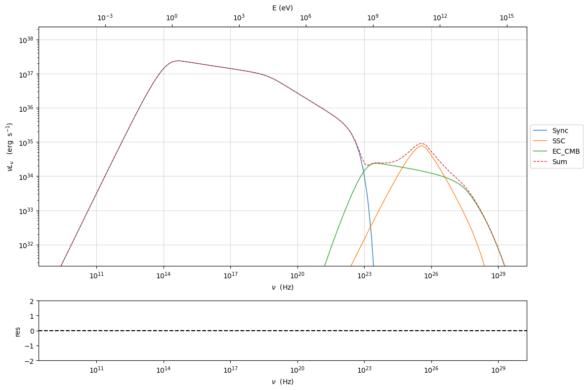

.. _galactic_guide:

Galactic object models
======================

Tow models have been added to handle galactic objects:
1) :class:`.GalacticBeamed` to hadle galatcit objects that are not beamed
2) :class:`.GalacticUnbeamed` to hadle galatcit objects that are  beamed

The redshift will be set 0, and not used, and a new parameter, ``DL_cm``
will be used in place.

The only difference, is that the ``GalacticBeamed`` has beaming set as
default to 10 and set free, whilst ``GalacticUnbeamed`` has beaming set
as default to 1 and frozen

.. code:: ipython3

    from jetset.jet_model import GalacticUnbeamed,GalacticBeamed
    from astropy import constants as const
    from astropy import units as u
    import matplotlib.pyplot as plt
    import numpy as np

.. code:: ipython3

    import jetset
    print('tested on jetset',jetset.__version__)

.. parsed-literal::

    tested on jetset 1.2.2

Galactic Unbeamed leptonic example
----------------------------------

This is an example for a PWN.

**Please notice, that for a realistic model you should build a composite
model with Radio and Wind region, and define a custom emitting region. A
proper thermal external field will be provided in the next version. The
``CMB`` is the same used for jets**

.. code:: ipython3

    pwn=GalacticUnbeamed(emitters_distribution='bkn',verbose=False,emitters_type='electrons',distance=2*u.kpc,name='pwn')
    pwn.add_EC_component(['EC_CMB'])
    pwn.parameters.R.val=(2*u.pc).to('cm').value
    pwn.parameters.B.val=1E-4
    pwn.parameters.gamma_break.val=1E8
    pwn.parameters.gmax.val=8E9
    pwn.parameters.gmin.val=5E5
    pwn.parameters.p.val=3.2
    pwn.parameters.p_1.val=3.8
    pwn.parameters.N.val=1E-8
    pwn.show_model()

.. parsed-literal::

    
    --------------------------------------------------------------------------------
    model description: 
    --------------------------------------------------------------------------------
    type: GalacticUnbeamed
    name: pwn  
    
    electrons distribution:
     type: bkn  
     gamma energy grid size:  201
     gmin grid : 2.000000e+00
     gmax grid : 1.000000e+06
     normalization:  True
     log-values:  False
     ratio of cold protons to relativistic electrons: 1.000000e-01
    
    radiative fields:
     seed photons grid size:  100
     IC emission grid size:  100
     source emissivity lower bound :  1.000000e-120
     spectral components:
       name:Sum, state: on
       name:Sync, state: self-abs
       name:SSC, state: on
       name:EC_CMB, state: on
    external fields transformation method: disk
    
    SED info:
     nu grid size jetkernel: 1000
     nu size: 500
     nu mix (Hz): 1.000000e+06
     nu max (Hz): 1.000000e+30
    
    flux plot lower bound   :  1.000000e-30
    
    --------------------------------------------------------------------------------

.. raw:: html

    <i>Table length=10</i>
    <table id="table140323068502992-142566" class="table-striped table-bordered table-condensed">
    <thead><tr><th>model name</th><th>name</th><th>par type</th><th>units</th><th>val</th><th>phys. bound. min</th><th>phys. bound. max</th><th>log</th><th>frozen</th></tr></thead>
    <tr><td>pwn</td><td>R</td><td>region_size</td><td>cm</td><td>6.171355e+18</td><td>1.000000e+03</td><td>1.000000e+30</td><td>False</td><td>False</td></tr>
    <tr><td>pwn</td><td>B</td><td>magnetic_field</td><td>gauss</td><td>1.000000e-04</td><td>0.000000e+00</td><td>--</td><td>False</td><td>False</td></tr>
    <tr><td>pwn</td><td>NH_cold_to_rel_e</td><td>cold_p_to_rel_e_ratio</td><td></td><td>1.000000e-01</td><td>0.000000e+00</td><td>--</td><td>False</td><td>True</td></tr>
    <tr><td>pwn</td><td>gmin</td><td>low-energy-cut-off</td><td>lorentz-factor*</td><td>5.000000e+05</td><td>1.000000e+00</td><td>1.000000e+09</td><td>False</td><td>False</td></tr>
    <tr><td>pwn</td><td>gmax</td><td>high-energy-cut-off</td><td>lorentz-factor*</td><td>8.000000e+09</td><td>1.000000e+00</td><td>1.000000e+15</td><td>False</td><td>False</td></tr>
    <tr><td>pwn</td><td>N</td><td>emitters_density</td><td>1 / cm3</td><td>1.000000e-08</td><td>0.000000e+00</td><td>--</td><td>False</td><td>False</td></tr>
    <tr><td>pwn</td><td>gamma_break</td><td>turn-over-energy</td><td>lorentz-factor*</td><td>1.000000e+08</td><td>1.000000e+00</td><td>1.000000e+09</td><td>False</td><td>False</td></tr>
    <tr><td>pwn</td><td>p</td><td>LE_spectral_slope</td><td></td><td>3.200000e+00</td><td>-1.000000e+01</td><td>1.000000e+01</td><td>False</td><td>False</td></tr>
    <tr><td>pwn</td><td>p_1</td><td>HE_spectral_slope</td><td></td><td>3.800000e+00</td><td>-1.000000e+01</td><td>1.000000e+01</td><td>False</td><td>False</td></tr>
    <tr><td>pwn</td><td>DL_cm(M)</td><td>distance</td><td>cm</td><td>6.171355e+21</td><td>0.000000e+00</td><td>3.085678e+24</td><td>False</td><td>False</td></tr>
    </table>
    

.. parsed-literal::

    --------------------------------------------------------------------------------

.. code:: ipython3

    pwn.eval()
    p=pwn.plot_model(frame='src')

.. code:: ipython3

    pwn.save_model('pwn.pkl')

.. raw:: html

    <i>Table length=10</i>
    <table id="table140322592814896-152199" class="table-striped table-bordered table-condensed">
    <thead><tr><th>model name</th><th>name</th><th>par type</th><th>units</th><th>val</th><th>phys. bound. min</th><th>phys. bound. max</th><th>log</th><th>frozen</th></tr></thead>
    <tr><td>pwn</td><td>R</td><td>region_size</td><td>cm</td><td>6.171355e+18</td><td>1.000000e+03</td><td>1.000000e+30</td><td>False</td><td>False</td></tr>
    <tr><td>pwn</td><td>B</td><td>magnetic_field</td><td>gauss</td><td>1.000000e-04</td><td>0.000000e+00</td><td>--</td><td>False</td><td>False</td></tr>
    <tr><td>pwn</td><td>NH_cold_to_rel_e</td><td>cold_p_to_rel_e_ratio</td><td></td><td>1.000000e-01</td><td>0.000000e+00</td><td>--</td><td>False</td><td>True</td></tr>
    <tr><td>pwn</td><td>gmin</td><td>low-energy-cut-off</td><td>lorentz-factor*</td><td>5.000000e+05</td><td>1.000000e+00</td><td>1.000000e+09</td><td>False</td><td>False</td></tr>
    <tr><td>pwn</td><td>gmax</td><td>high-energy-cut-off</td><td>lorentz-factor*</td><td>8.000000e+09</td><td>1.000000e+00</td><td>1.000000e+15</td><td>False</td><td>False</td></tr>
    <tr><td>pwn</td><td>N</td><td>emitters_density</td><td>1 / cm3</td><td>1.000000e-08</td><td>0.000000e+00</td><td>--</td><td>False</td><td>False</td></tr>
    <tr><td>pwn</td><td>gamma_break</td><td>turn-over-energy</td><td>lorentz-factor*</td><td>1.000000e+08</td><td>1.000000e+00</td><td>1.000000e+09</td><td>False</td><td>False</td></tr>
    <tr><td>pwn</td><td>p</td><td>LE_spectral_slope</td><td></td><td>3.200000e+00</td><td>-1.000000e+01</td><td>1.000000e+01</td><td>False</td><td>False</td></tr>
    <tr><td>pwn</td><td>p_1</td><td>HE_spectral_slope</td><td></td><td>3.800000e+00</td><td>-1.000000e+01</td><td>1.000000e+01</td><td>False</td><td>False</td></tr>
    <tr><td>pwn</td><td>DL_cm(M)</td><td>distance</td><td>cm</td><td>6.171355e+21</td><td>0.000000e+00</td><td>3.085678e+24</td><td>False</td><td>False</td></tr>
    </table>
    

.. code:: ipython3

    GalacticUnbeamed.load_model("pwn.pkl")

.. parsed-literal::

    ==> par z_cosm is now depending on ['DL_cm'] according to expr:z_cosm =
        def _dummy_z_par_func(self,DL_cm):
                self.cosmo._DL_cm=DL_cm*u.cm
                return 0
    

.. raw:: html

    <i>Table length=12</i>
    <table id="table140323100657408-368626" class="table-striped table-bordered table-condensed">
    <thead><tr><th>model name</th><th>name</th><th>par type</th><th>units</th><th>val</th><th>phys. bound. min</th><th>phys. bound. max</th><th>log</th><th>frozen</th></tr></thead>
    <tr><td>pwn</td><td>gmin</td><td>low-energy-cut-off</td><td>lorentz-factor*</td><td>5.000000e+05</td><td>1.000000e+00</td><td>1.000000e+09</td><td>False</td><td>False</td></tr>
    <tr><td>pwn</td><td>gmax</td><td>high-energy-cut-off</td><td>lorentz-factor*</td><td>8.000000e+09</td><td>1.000000e+00</td><td>1.000000e+15</td><td>False</td><td>False</td></tr>
    <tr><td>pwn</td><td>N</td><td>emitters_density</td><td>1 / cm3</td><td>1.000000e-08</td><td>0.000000e+00</td><td>--</td><td>False</td><td>False</td></tr>
    <tr><td>pwn</td><td>gamma_break</td><td>turn-over-energy</td><td>lorentz-factor*</td><td>1.000000e+08</td><td>1.000000e+00</td><td>1.000000e+09</td><td>False</td><td>False</td></tr>
    <tr><td>pwn</td><td>p</td><td>LE_spectral_slope</td><td></td><td>3.200000e+00</td><td>-1.000000e+01</td><td>1.000000e+01</td><td>False</td><td>False</td></tr>
    <tr><td>pwn</td><td>p_1</td><td>HE_spectral_slope</td><td></td><td>3.800000e+00</td><td>-1.000000e+01</td><td>1.000000e+01</td><td>False</td><td>False</td></tr>
    <tr><td>pwn</td><td>R</td><td>region_size</td><td>cm</td><td>6.171355e+18</td><td>1.000000e+03</td><td>1.000000e+30</td><td>False</td><td>False</td></tr>
    <tr><td>pwn</td><td>R_H</td><td>region_position</td><td>cm</td><td>1.000000e+17</td><td>0.000000e+00</td><td>--</td><td>False</td><td>True</td></tr>
    <tr><td>pwn</td><td>B</td><td>magnetic_field</td><td>gauss</td><td>1.000000e-04</td><td>0.000000e+00</td><td>--</td><td>False</td><td>False</td></tr>
    <tr><td>pwn</td><td>NH_cold_to_rel_e</td><td>cold_p_to_rel_e_ratio</td><td></td><td>1.000000e-01</td><td>0.000000e+00</td><td>--</td><td>False</td><td>True</td></tr>
    <tr><td>pwn</td><td>beam_obj</td><td>beaming</td><td>lorentz-factor*</td><td>1.000000e+00</td><td>1.000000e-04</td><td>--</td><td>False</td><td>False</td></tr>
    <tr><td>pwn</td><td>DL_cm(M)</td><td>distance</td><td>cm</td><td>6.171355e+21</td><td>0.000000e+00</td><td>3.085678e+24</td><td>False</td><td>False</td></tr>
    </table>
    

.. parsed-literal::

    
    --------------------------------------------------------------------------------
    model description: 
    --------------------------------------------------------------------------------
    type: GalacticUnbeamed
    name: pwn  
    
    electrons distribution:
     type: bkn  
     gamma energy grid size:  201
     gmin grid : 5.000000e+05
     gmax grid : 8.000000e+09
     normalization:  True
     log-values:  False
     ratio of cold protons to relativistic electrons: 1.000000e-01
    
    radiative fields:
     seed photons grid size:  100
     IC emission grid size:  100
     source emissivity lower bound :  1.000000e-120
     spectral components:
       name:Sum, state: on
       name:Sync, state: self-abs
       name:SSC, state: on
       name:EC_CMB, state: on
    external fields transformation method: disk
    
    SED info:
     nu grid size jetkernel: 1000
     nu size: 500
     nu mix (Hz): 1.000000e+06
     nu max (Hz): 1.000000e+30
    
    flux plot lower bound   :  1.000000e-30
    
    --------------------------------------------------------------------------------

.. raw:: html

    <i>Table length=12</i>
    <table id="table140323076860560-169439" class="table-striped table-bordered table-condensed">
    <thead><tr><th>model name</th><th>name</th><th>par type</th><th>units</th><th>val</th><th>phys. bound. min</th><th>phys. bound. max</th><th>log</th><th>frozen</th></tr></thead>
    <tr><td>pwn</td><td>gmin</td><td>low-energy-cut-off</td><td>lorentz-factor*</td><td>5.000000e+05</td><td>1.000000e+00</td><td>1.000000e+09</td><td>False</td><td>False</td></tr>
    <tr><td>pwn</td><td>gmax</td><td>high-energy-cut-off</td><td>lorentz-factor*</td><td>8.000000e+09</td><td>1.000000e+00</td><td>1.000000e+15</td><td>False</td><td>False</td></tr>
    <tr><td>pwn</td><td>N</td><td>emitters_density</td><td>1 / cm3</td><td>1.000000e-08</td><td>0.000000e+00</td><td>--</td><td>False</td><td>False</td></tr>
    <tr><td>pwn</td><td>gamma_break</td><td>turn-over-energy</td><td>lorentz-factor*</td><td>1.000000e+08</td><td>1.000000e+00</td><td>1.000000e+09</td><td>False</td><td>False</td></tr>
    <tr><td>pwn</td><td>p</td><td>LE_spectral_slope</td><td></td><td>3.200000e+00</td><td>-1.000000e+01</td><td>1.000000e+01</td><td>False</td><td>False</td></tr>
    <tr><td>pwn</td><td>p_1</td><td>HE_spectral_slope</td><td></td><td>3.800000e+00</td><td>-1.000000e+01</td><td>1.000000e+01</td><td>False</td><td>False</td></tr>
    <tr><td>pwn</td><td>R</td><td>region_size</td><td>cm</td><td>6.171355e+18</td><td>1.000000e+03</td><td>1.000000e+30</td><td>False</td><td>False</td></tr>
    <tr><td>pwn</td><td>R_H</td><td>region_position</td><td>cm</td><td>1.000000e+17</td><td>0.000000e+00</td><td>--</td><td>False</td><td>True</td></tr>
    <tr><td>pwn</td><td>B</td><td>magnetic_field</td><td>gauss</td><td>1.000000e-04</td><td>0.000000e+00</td><td>--</td><td>False</td><td>False</td></tr>
    <tr><td>pwn</td><td>NH_cold_to_rel_e</td><td>cold_p_to_rel_e_ratio</td><td></td><td>1.000000e-01</td><td>0.000000e+00</td><td>--</td><td>False</td><td>True</td></tr>
    <tr><td>pwn</td><td>beam_obj</td><td>beaming</td><td>lorentz-factor*</td><td>1.000000e+00</td><td>1.000000e-04</td><td>--</td><td>False</td><td>False</td></tr>
    <tr><td>pwn</td><td>DL_cm(M)</td><td>distance</td><td>cm</td><td>6.171355e+21</td><td>0.000000e+00</td><td>3.085678e+24</td><td>False</td><td>False</td></tr>
    </table>
    

.. parsed-literal::

    --------------------------------------------------------------------------------

.. parsed-literal::

    None

.. code:: ipython3

    pwn.energetic_report()

.. raw:: html

    <i>Table length=16</i>
    <table id="table140323095595856-269528" class="table-striped table-bordered table-condensed">
    <thead><tr><th>name</th><th>type</th><th>units</th><th>val</th></tr></thead>
    <tr><td>BulkLorentzFactor</td><td>jet-bulk-factor</td><td></td><td>1.000000e+00</td></tr>
    <tr><td>U_e</td><td>Energy dens.  rest. frame</td><td>erg / cm3</td><td>7.480812e-09</td></tr>
    <tr><td>U_p_cold</td><td>Energy dens.  rest. frame</td><td>erg / cm3</td><td>1.503276e-12</td></tr>
    <tr><td>U_B</td><td>Energy dens.  rest. frame</td><td>erg / cm3</td><td>3.978874e-10</td></tr>
    <tr><td>U_Synch</td><td>Energy dens.  rest. frame</td><td>erg / cm3</td><td>4.538190e-11</td></tr>
    <tr><td>U_Disk</td><td>Energy dens.  rest. frame</td><td>erg / cm3</td><td>0.000000e+00</td></tr>
    <tr><td>U_BLR</td><td>Energy dens.  rest. frame</td><td>erg / cm3</td><td>0.000000e+00</td></tr>
    <tr><td>U_DT</td><td>Energy dens.  rest. frame</td><td>erg / cm3</td><td>0.000000e+00</td></tr>
    <tr><td>U_CMB</td><td>Energy dens.  rest. frame</td><td>erg / cm3</td><td>4.185297e-13</td></tr>
    <tr><td>L_Sync</td><td>Lum.  rest. frame.</td><td>erg / s</td><td>2.170466e+38</td></tr>
    <tr><td>L_SSC</td><td>Lum.  rest. frame.</td><td>erg / s</td><td>2.161006e+35</td></tr>
    <tr><td>L_EC_Disk</td><td>Lum.  rest. frame.</td><td>erg / s</td><td>0.000000e+00</td></tr>
    <tr><td>L_EC_BLR</td><td>Lum.  rest. frame.</td><td>erg / s</td><td>0.000000e+00</td></tr>
    <tr><td>L_EC_DT</td><td>Lum.  rest. frame.</td><td>erg / s</td><td>0.000000e+00</td></tr>
    <tr><td>L_EC_CMB</td><td>Lum.  rest. frame.</td><td>erg / s</td><td>1.785622e+35</td></tr>
    <tr><td>NH_cold_to_rel_e</td><td>cold_p_to_rel_e_ratio</td><td></td><td>1.000000e-01</td></tr>
    </table>
    

Galactic Unbeamed hadronic pp example
-------------------------------------

This is an example for a galactic unbeamed hadronic (pp) object

.. code:: ipython3

    gal_hadronic=GalacticUnbeamed(emitters_distribution='plc',verbose=False,emitters_type='protons',distance=2*u.kpc,name='gal_hadronic_unbeamed')
    gal_hadronic.parameters.R.val=1E18
    gal_hadronic.parameters.N.val=1000
    gal_hadronic.parameters.B.val=1E-3
    
    gal_hadronic.show_model()

.. parsed-literal::

    
    --------------------------------------------------------------------------------
    model description: 
    --------------------------------------------------------------------------------
    type: GalacticUnbeamed
    name: gal_hadronic_unbeamed  
    
    protons distribution:
     type: plc  
     gamma energy grid size:  201
     gmin grid : 2.000000e+00
     gmax grid : 1.000000e+06
     normalization:  True
     log-values:  False
    
    radiative fields:
     seed photons grid size:  100
     IC emission grid size:  100
     source emissivity lower bound :  1.000000e-120
     spectral components:
       name:Sum, state: on
       name:Sync, state: self-abs
       name:SSC, state: on
       name:PP_gamma, state: on
       name:PP_neutrino_tot, state: on
       name:PP_neutrino_mu, state: on
       name:PP_neutrino_e, state: on
       name:Bremss_ep, state: on
    external fields transformation method: disk
    
    SED info:
     nu grid size jetkernel: 1000
     nu size: 500
     nu mix (Hz): 1.000000e+06
     nu max (Hz): 1.000000e+30
    
    flux plot lower bound   :  1.000000e-30
    
    --------------------------------------------------------------------------------

.. raw:: html

    <i>Table length=9</i>
    <table id="table140323095595520-520041" class="table-striped table-bordered table-condensed">
    <thead><tr><th>model name</th><th>name</th><th>par type</th><th>units</th><th>val</th><th>phys. bound. min</th><th>phys. bound. max</th><th>log</th><th>frozen</th></tr></thead>
    <tr><td>gal_hadronic_unbeamed</td><td>R</td><td>region_size</td><td>cm</td><td>1.000000e+18</td><td>1.000000e+03</td><td>1.000000e+30</td><td>False</td><td>False</td></tr>
    <tr><td>gal_hadronic_unbeamed</td><td>B</td><td>magnetic_field</td><td>gauss</td><td>1.000000e-03</td><td>0.000000e+00</td><td>--</td><td>False</td><td>False</td></tr>
    <tr><td>gal_hadronic_unbeamed</td><td>gmin</td><td>low-energy-cut-off</td><td>lorentz-factor*</td><td>2.000000e+00</td><td>1.000000e+00</td><td>1.000000e+09</td><td>False</td><td>False</td></tr>
    <tr><td>gal_hadronic_unbeamed</td><td>gmax</td><td>high-energy-cut-off</td><td>lorentz-factor*</td><td>1.000000e+06</td><td>1.000000e+00</td><td>1.000000e+15</td><td>False</td><td>False</td></tr>
    <tr><td>gal_hadronic_unbeamed</td><td>N</td><td>emitters_density</td><td>1 / cm3</td><td>1.000000e+03</td><td>0.000000e+00</td><td>--</td><td>False</td><td>False</td></tr>
    <tr><td>gal_hadronic_unbeamed</td><td>NH_pp</td><td>target_density</td><td>1 / cm3</td><td>1.000000e+00</td><td>0.000000e+00</td><td>--</td><td>False</td><td>False</td></tr>
    <tr><td>gal_hadronic_unbeamed</td><td>gamma_cut</td><td>turn-over-energy</td><td>lorentz-factor*</td><td>1.000000e+04</td><td>1.000000e+00</td><td>1.000000e+09</td><td>False</td><td>False</td></tr>
    <tr><td>gal_hadronic_unbeamed</td><td>p</td><td>LE_spectral_slope</td><td></td><td>2.000000e+00</td><td>-1.000000e+01</td><td>1.000000e+01</td><td>False</td><td>False</td></tr>
    <tr><td>gal_hadronic_unbeamed</td><td>DL_cm(M)</td><td>distance</td><td>cm</td><td>6.171355e+21</td><td>0.000000e+00</td><td>3.085678e+24</td><td>False</td><td>False</td></tr>
    </table>
    

.. parsed-literal::

    --------------------------------------------------------------------------------

.. code:: ipython3

    gal_hadronic.eval()
    p=gal_hadronic.plot_model(frame='src')
    p.setlim(y_min=1E33)

.. image:: galactic_files/galactic_18_0.png

.. code:: ipython3

    gal_hadronic.energetic_report()

.. raw:: html

    <i>Table length=17</i>
    <table id="table140323100289152-530168" class="table-striped table-bordered table-condensed">
    <thead><tr><th>name</th><th>type</th><th>units</th><th>val</th></tr></thead>
    <tr><td>BulkLorentzFactor</td><td>jet-bulk-factor</td><td></td><td>1.000000e+00</td></tr>
    <tr><td>U_e</td><td>Energy dens.  rest. frame</td><td>erg / cm3</td><td>4.252875e-06</td></tr>
    <tr><td>U_B</td><td>Energy dens.  rest. frame</td><td>erg / cm3</td><td>3.978874e-08</td></tr>
    <tr><td>U_p</td><td>Energy dens.  rest. frame</td><td>erg / cm3</td><td>2.386056e+01</td></tr>
    <tr><td>U_p_target</td><td>Energy dens.  rest. frame</td><td>erg / cm3</td><td>1.503276e-03</td></tr>
    <tr><td>U_Synch</td><td>Energy dens.  rest. frame</td><td>erg / cm3</td><td>4.851771e-10</td></tr>
    <tr><td>U_Disk</td><td>Energy dens.  rest. frame</td><td>erg / cm3</td><td>0.000000e+00</td></tr>
    <tr><td>U_BLR</td><td>Energy dens.  rest. frame</td><td>erg / cm3</td><td>0.000000e+00</td></tr>
    <tr><td>U_DT</td><td>Energy dens.  rest. frame</td><td>erg / cm3</td><td>0.000000e+00</td></tr>
    <tr><td>U_CMB</td><td>Energy dens.  rest. frame</td><td>erg / cm3</td><td>0.000000e+00</td></tr>
    <tr><td>L_Sync</td><td>Lum.  rest. frame.</td><td>erg / s</td><td>6.085926e+37</td></tr>
    <tr><td>L_SSC</td><td>Lum.  rest. frame.</td><td>erg / s</td><td>2.273252e+35</td></tr>
    <tr><td>L_EC_Disk</td><td>Lum.  rest. frame.</td><td>erg / s</td><td>0.000000e+00</td></tr>
    <tr><td>L_EC_BLR</td><td>Lum.  rest. frame.</td><td>erg / s</td><td>0.000000e+00</td></tr>
    <tr><td>L_EC_DT</td><td>Lum.  rest. frame.</td><td>erg / s</td><td>0.000000e+00</td></tr>
    <tr><td>L_EC_CMB</td><td>Lum.  rest. frame.</td><td>erg / s</td><td>0.000000e+00</td></tr>
    <tr><td>L_pp_gamma</td><td>Lum.  rest. frame.</td><td>erg / s</td><td>1.217784e+40</td></tr>
    </table>
    

Galactic Beamed hadronic pp example
-----------------------------------

.. code:: ipython3

    from jetset.jet_model import GalacticUnbeamed,GalacticBeamed
    from astropy import constants as const
    from astropy import units as u
    import matplotlib.pyplot as plt
    import numpy as np
    
    gal_hadronic=GalacticBeamed(emitters_distribution='plc',verbose=False,emitters_type='protons',distance=2*u.kpc,name='gal_hadronic_beamed')
    gal_hadronic.parameters.R.val=1E18
    gal_hadronic.parameters.N.val=1000
    gal_hadronic.parameters.B.val=1E-3
    
    gal_hadronic.show_model()

.. parsed-literal::

    
    --------------------------------------------------------------------------------
    model description: 
    --------------------------------------------------------------------------------
    type: GalacticBeamed
    name: gal_hadronic_beamed  
    
    protons distribution:
     type: plc  
     gamma energy grid size:  201
     gmin grid : 2.000000e+00
     gmax grid : 1.000000e+06
     normalization:  True
     log-values:  False
    
    radiative fields:
     seed photons grid size:  100
     IC emission grid size:  100
     source emissivity lower bound :  1.000000e-120
     spectral components:
       name:Sum, state: on
       name:Sync, state: self-abs
       name:SSC, state: on
       name:PP_gamma, state: on
       name:PP_neutrino_tot, state: on
       name:PP_neutrino_mu, state: on
       name:PP_neutrino_e, state: on
       name:Bremss_ep, state: on
    external fields transformation method: blob
    
    SED info:
     nu grid size jetkernel: 1000
     nu size: 500
     nu mix (Hz): 1.000000e+06
     nu max (Hz): 1.000000e+30
    
    flux plot lower bound   :  1.000000e-30
    
    --------------------------------------------------------------------------------

.. raw:: html

    <i>Table length=11</i>
    <table id="table140323099842256-921144" class="table-striped table-bordered table-condensed">
    <thead><tr><th>model name</th><th>name</th><th>par type</th><th>units</th><th>val</th><th>phys. bound. min</th><th>phys. bound. max</th><th>log</th><th>frozen</th></tr></thead>
    <tr><td>gal_hadronic_beamed</td><td>R</td><td>region_size</td><td>cm</td><td>1.000000e+18</td><td>1.000000e+03</td><td>1.000000e+30</td><td>False</td><td>False</td></tr>
    <tr><td>gal_hadronic_beamed</td><td>R_H</td><td>region_position</td><td>cm</td><td>1.000000e+17</td><td>0.000000e+00</td><td>--</td><td>False</td><td>True</td></tr>
    <tr><td>gal_hadronic_beamed</td><td>B</td><td>magnetic_field</td><td>gauss</td><td>1.000000e-03</td><td>0.000000e+00</td><td>--</td><td>False</td><td>False</td></tr>
    <tr><td>gal_hadronic_beamed</td><td>beam_obj</td><td>beaming</td><td>lorentz-factor*</td><td>1.000000e+01</td><td>1.000000e-04</td><td>--</td><td>False</td><td>False</td></tr>
    <tr><td>gal_hadronic_beamed</td><td>gmin</td><td>low-energy-cut-off</td><td>lorentz-factor*</td><td>2.000000e+00</td><td>1.000000e+00</td><td>1.000000e+09</td><td>False</td><td>False</td></tr>
    <tr><td>gal_hadronic_beamed</td><td>gmax</td><td>high-energy-cut-off</td><td>lorentz-factor*</td><td>1.000000e+06</td><td>1.000000e+00</td><td>1.000000e+15</td><td>False</td><td>False</td></tr>
    <tr><td>gal_hadronic_beamed</td><td>N</td><td>emitters_density</td><td>1 / cm3</td><td>1.000000e+03</td><td>0.000000e+00</td><td>--</td><td>False</td><td>False</td></tr>
    <tr><td>gal_hadronic_beamed</td><td>NH_pp</td><td>target_density</td><td>1 / cm3</td><td>1.000000e+00</td><td>0.000000e+00</td><td>--</td><td>False</td><td>False</td></tr>
    <tr><td>gal_hadronic_beamed</td><td>gamma_cut</td><td>turn-over-energy</td><td>lorentz-factor*</td><td>1.000000e+04</td><td>1.000000e+00</td><td>1.000000e+09</td><td>False</td><td>False</td></tr>
    <tr><td>gal_hadronic_beamed</td><td>p</td><td>LE_spectral_slope</td><td></td><td>2.000000e+00</td><td>-1.000000e+01</td><td>1.000000e+01</td><td>False</td><td>False</td></tr>
    <tr><td>gal_hadronic_beamed</td><td>DL_cm(M)</td><td>distance</td><td>cm</td><td>6.171355e+21</td><td>0.000000e+00</td><td>3.085678e+24</td><td>False</td><td>False</td></tr>
    </table>
    

.. parsed-literal::

    --------------------------------------------------------------------------------

.. code:: ipython3

    gal_hadronic.eval()
    p=gal_hadronic.plot_model(frame='src')
    p.setlim(y_min=1E36)

.. image:: galactic_files/galactic_22_0.png

.. code:: ipython3

    gal_hadronic.energetic_report()

.. raw:: html

    <i>Table length=35</i>
    <table id="table140322594133088-526294" class="table-striped table-bordered table-condensed">
    <thead><tr><th>name</th><th>type</th><th>units</th><th>val</th></tr></thead>
    <tr><td>BulkLorentzFactor</td><td>jet-bulk-factor</td><td></td><td>1.000000e+01</td></tr>
    <tr><td>U_e</td><td>Energy dens. blob rest. frame</td><td>erg / cm3</td><td>4.252875e-06</td></tr>
    <tr><td>U_B</td><td>Energy dens. blob rest. frame</td><td>erg / cm3</td><td>3.978874e-08</td></tr>
    <tr><td>U_p</td><td>Energy dens. blob rest. frame</td><td>erg / cm3</td><td>2.386056e+01</td></tr>
    <tr><td>U_p_target</td><td>Energy dens. blob rest. frame</td><td>erg / cm3</td><td>1.503276e-03</td></tr>
    <tr><td>U_Synch</td><td>Energy dens. blob rest. frame</td><td>erg / cm3</td><td>4.851771e-10</td></tr>
    <tr><td>U_Synch_DRF</td><td>Energy dens. disk rest. frame</td><td>erg / cm3</td><td>4.851771e-06</td></tr>
    <tr><td>U_Disk</td><td>Energy dens. blob rest. frame</td><td>erg / cm3</td><td>0.000000e+00</td></tr>
    <tr><td>U_BLR</td><td>Energy dens. blob rest. frame</td><td>erg / cm3</td><td>0.000000e+00</td></tr>
    <tr><td>U_DT</td><td>Energy dens. blob rest. frame</td><td>erg / cm3</td><td>0.000000e+00</td></tr>
    <tr><td>U_CMB</td><td>Energy dens. blob rest. frame</td><td>erg / cm3</td><td>0.000000e+00</td></tr>
    <tr><td>U_Disk_DRF</td><td>Energy dens. disk rest. frame</td><td>erg / cm3</td><td>0.000000e+00</td></tr>
    <tr><td>U_BLR_DRF</td><td>Energy dens. disk rest. frame</td><td>erg / cm3</td><td>0.000000e+00</td></tr>
    <tr><td>U_DT_DRF</td><td>Energy dens. disk rest. frame</td><td>erg / cm3</td><td>0.000000e+00</td></tr>
    <tr><td>U_CMB_DRF</td><td>Energy dens. disk rest. frame</td><td>erg / cm3</td><td>0.000000e+00</td></tr>
    <tr><td>L_Sync_rf</td><td>Lum. blob rest. frame.</td><td>erg / s</td><td>6.085926e+37</td></tr>
    <tr><td>L_SSC_rf</td><td>Lum. blob rest. frame.</td><td>erg / s</td><td>2.273252e+35</td></tr>
    <tr><td>L_EC_Disk_rf</td><td>Lum. blob rest. frame.</td><td>erg / s</td><td>0.000000e+00</td></tr>
    <tr><td>L_EC_BLR_rf</td><td>Lum. blob rest. frame.</td><td>erg / s</td><td>0.000000e+00</td></tr>
    <tr><td>L_EC_DT_rf</td><td>Lum. blob rest. frame.</td><td>erg / s</td><td>0.000000e+00</td></tr>
    <tr><td>L_EC_CMB_rf</td><td>Lum. blob rest. frame.</td><td>erg / s</td><td>0.000000e+00</td></tr>
    <tr><td>L_pp_gamma_rf</td><td>Lum. blob rest. frame.</td><td>erg / s</td><td>1.217784e+40</td></tr>
    <tr><td>jet_L_Sync</td><td>jet Lum.</td><td>erg / s</td><td>1.521482e+39</td></tr>
    <tr><td>jet_L_SSC</td><td>jet Lum.</td><td>erg / s</td><td>5.683129e+36</td></tr>
    <tr><td>jet_L_EC_Disk</td><td>jet Lum.</td><td>erg / s</td><td>0.000000e+00</td></tr>
    <tr><td>jet_L_EC_BLR</td><td>jet Lum.</td><td>erg / s</td><td>0.000000e+00</td></tr>
    <tr><td>jet_L_EC_DT</td><td>jet Lum.</td><td>erg / s</td><td>0.000000e+00</td></tr>
    <tr><td>jet_L_EC_CMB</td><td>jet Lum.</td><td>erg / s</td><td>0.000000e+00</td></tr>
    <tr><td>jet_L_pp_gamma</td><td>jet Lum.</td><td>erg / s</td><td>3.044459e+41</td></tr>
    <tr><td>jet_L_rad</td><td>jet Lum.</td><td>erg / s</td><td>3.059730e+41</td></tr>
    <tr><td>jet_L_kin</td><td>jet Lum.</td><td>erg / s</td><td>2.235985e+50</td></tr>
    <tr><td>jet_L_tot</td><td>jet Lum.</td><td>erg / s</td><td>2.235985e+50</td></tr>
    <tr><td>jet_L_e</td><td>jet Lum.</td><td>erg / s</td><td>3.985390e+43</td></tr>
    <tr><td>jet_L_B</td><td>jet Lum.</td><td>erg / s</td><td>3.728622e+41</td></tr>
    <tr><td>jet_L_p</td><td>jet Lum.</td><td>erg / s</td><td>2.235985e+50</td></tr>
    </table>
    

.. code:: ipython3

    gal_hadronic.save_model('gal_hadronic_beamed.pkl')

.. raw:: html

    <i>Table length=11</i>
    <table id="table140322593439072-632410" class="table-striped table-bordered table-condensed">
    <thead><tr><th>model name</th><th>name</th><th>par type</th><th>units</th><th>val</th><th>phys. bound. min</th><th>phys. bound. max</th><th>log</th><th>frozen</th></tr></thead>
    <tr><td>gal_hadronic_beamed</td><td>R</td><td>region_size</td><td>cm</td><td>1.000000e+18</td><td>1.000000e+03</td><td>1.000000e+30</td><td>False</td><td>False</td></tr>
    <tr><td>gal_hadronic_beamed</td><td>R_H</td><td>region_position</td><td>cm</td><td>1.000000e+17</td><td>0.000000e+00</td><td>--</td><td>False</td><td>True</td></tr>
    <tr><td>gal_hadronic_beamed</td><td>B</td><td>magnetic_field</td><td>gauss</td><td>1.000000e-03</td><td>0.000000e+00</td><td>--</td><td>False</td><td>False</td></tr>
    <tr><td>gal_hadronic_beamed</td><td>beam_obj</td><td>beaming</td><td>lorentz-factor*</td><td>1.000000e+01</td><td>1.000000e-04</td><td>--</td><td>False</td><td>False</td></tr>
    <tr><td>gal_hadronic_beamed</td><td>gmin</td><td>low-energy-cut-off</td><td>lorentz-factor*</td><td>2.000000e+00</td><td>1.000000e+00</td><td>1.000000e+09</td><td>False</td><td>False</td></tr>
    <tr><td>gal_hadronic_beamed</td><td>gmax</td><td>high-energy-cut-off</td><td>lorentz-factor*</td><td>1.000000e+06</td><td>1.000000e+00</td><td>1.000000e+15</td><td>False</td><td>False</td></tr>
    <tr><td>gal_hadronic_beamed</td><td>N</td><td>emitters_density</td><td>1 / cm3</td><td>1.000000e+03</td><td>0.000000e+00</td><td>--</td><td>False</td><td>False</td></tr>
    <tr><td>gal_hadronic_beamed</td><td>NH_pp</td><td>target_density</td><td>1 / cm3</td><td>1.000000e+00</td><td>0.000000e+00</td><td>--</td><td>False</td><td>False</td></tr>
    <tr><td>gal_hadronic_beamed</td><td>gamma_cut</td><td>turn-over-energy</td><td>lorentz-factor*</td><td>1.000000e+04</td><td>1.000000e+00</td><td>1.000000e+09</td><td>False</td><td>False</td></tr>
    <tr><td>gal_hadronic_beamed</td><td>p</td><td>LE_spectral_slope</td><td></td><td>2.000000e+00</td><td>-1.000000e+01</td><td>1.000000e+01</td><td>False</td><td>False</td></tr>
    <tr><td>gal_hadronic_beamed</td><td>DL_cm(M)</td><td>distance</td><td>cm</td><td>6.171355e+21</td><td>0.000000e+00</td><td>3.085678e+24</td><td>False</td><td>False</td></tr>
    </table>
    

.. code:: ipython3

    gal_hadronic_new=GalacticBeamed.load_model('gal_hadronic_beamed.pkl')

.. parsed-literal::

    ==> par z_cosm is now depending on ['DL_cm'] according to expr:z_cosm =
        def _dummy_z_par_func(self,DL_cm):
                self.cosmo._DL_cm=DL_cm*u.cm
                return 0
    

.. raw:: html

    <i>Table length=11</i>
    <table id="table140323076830208-368201" class="table-striped table-bordered table-condensed">
    <thead><tr><th>model name</th><th>name</th><th>par type</th><th>units</th><th>val</th><th>phys. bound. min</th><th>phys. bound. max</th><th>log</th><th>frozen</th></tr></thead>
    <tr><td>gal_hadronic_beamed</td><td>gmin</td><td>low-energy-cut-off</td><td>lorentz-factor*</td><td>2.000000e+00</td><td>1.000000e+00</td><td>1.000000e+09</td><td>False</td><td>False</td></tr>
    <tr><td>gal_hadronic_beamed</td><td>gmax</td><td>high-energy-cut-off</td><td>lorentz-factor*</td><td>1.000000e+06</td><td>1.000000e+00</td><td>1.000000e+15</td><td>False</td><td>False</td></tr>
    <tr><td>gal_hadronic_beamed</td><td>N</td><td>emitters_density</td><td>1 / cm3</td><td>1.000000e+03</td><td>0.000000e+00</td><td>--</td><td>False</td><td>False</td></tr>
    <tr><td>gal_hadronic_beamed</td><td>NH_pp</td><td>target_density</td><td>1 / cm3</td><td>1.000000e+00</td><td>0.000000e+00</td><td>--</td><td>False</td><td>False</td></tr>
    <tr><td>gal_hadronic_beamed</td><td>gamma_cut</td><td>turn-over-energy</td><td>lorentz-factor*</td><td>1.000000e+04</td><td>1.000000e+00</td><td>1.000000e+09</td><td>False</td><td>False</td></tr>
    <tr><td>gal_hadronic_beamed</td><td>p</td><td>LE_spectral_slope</td><td></td><td>2.000000e+00</td><td>-1.000000e+01</td><td>1.000000e+01</td><td>False</td><td>False</td></tr>
    <tr><td>gal_hadronic_beamed</td><td>R</td><td>region_size</td><td>cm</td><td>1.000000e+18</td><td>1.000000e+03</td><td>1.000000e+30</td><td>False</td><td>False</td></tr>
    <tr><td>gal_hadronic_beamed</td><td>R_H</td><td>region_position</td><td>cm</td><td>1.000000e+17</td><td>0.000000e+00</td><td>--</td><td>False</td><td>True</td></tr>
    <tr><td>gal_hadronic_beamed</td><td>B</td><td>magnetic_field</td><td>gauss</td><td>1.000000e-03</td><td>0.000000e+00</td><td>--</td><td>False</td><td>False</td></tr>
    <tr><td>gal_hadronic_beamed</td><td>beam_obj</td><td>beaming</td><td>lorentz-factor*</td><td>1.000000e+01</td><td>1.000000e-04</td><td>--</td><td>False</td><td>False</td></tr>
    <tr><td>gal_hadronic_beamed</td><td>DL_cm(M)</td><td>distance</td><td>cm</td><td>6.171355e+21</td><td>0.000000e+00</td><td>3.085678e+24</td><td>False</td><td>False</td></tr>
    </table>
    

