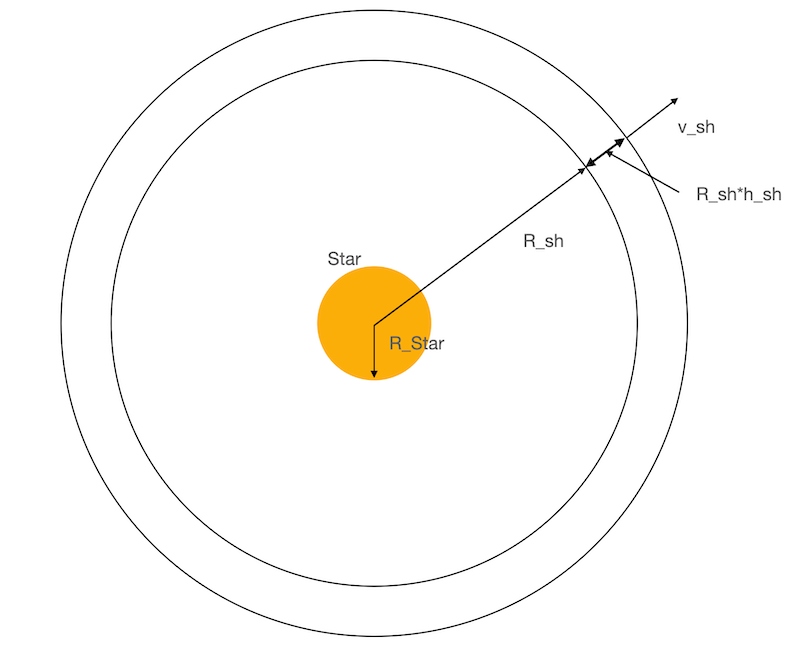
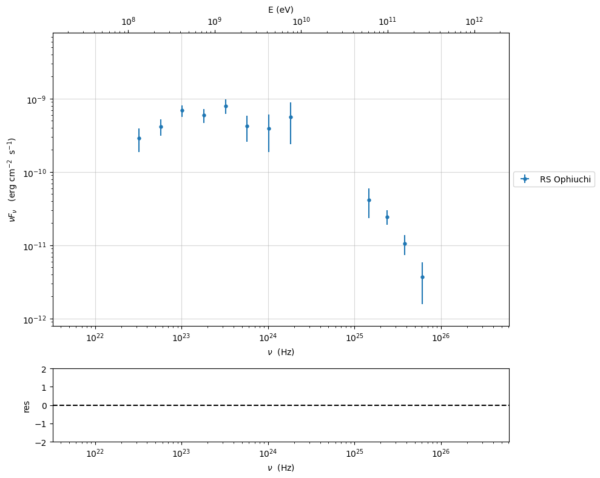
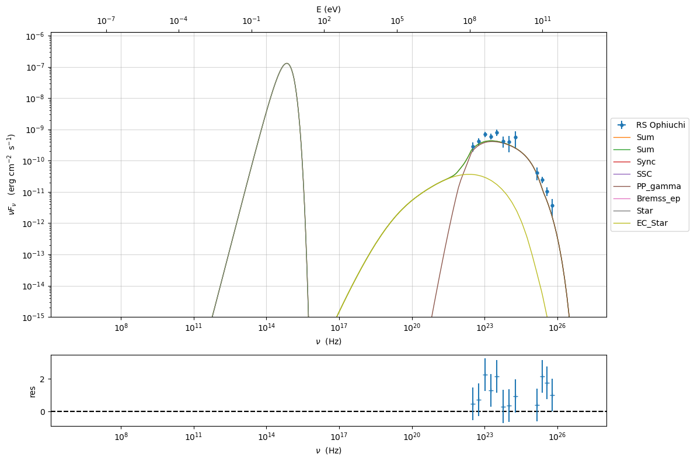
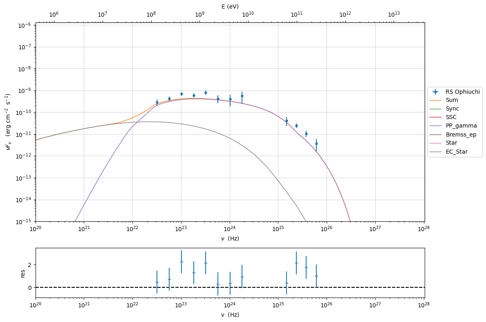
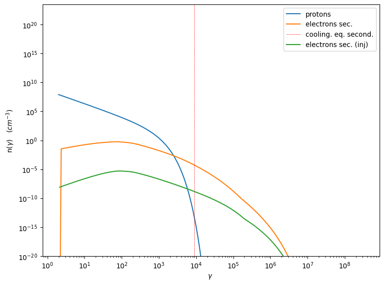

.. _galactic_nova:

Implement recurrent nova with using the Galactic class
======================================================

This is a preliminary documentation for an example showing a fully user
implemented/modified model for a recurrent nova.

loading test data
-----------------

In the following we reproduce the results published in the MAGIC
`paper <https://ui.adsabs.harvard.edu/abs/2022NatAs...6..689A/abstract>`__
 Nature Astronomy, Volume 6, p. 689-697

.. code:: ipython3

    from jetset.jet_model import GalacticUnbeamed
    from astropy import constants
    from astropy import units as u

   non relativistic expanding shell

.. code:: ipython3

    from jetset.data_loader import Data
    data_fermi=Data.from_file(data_table='./data/fermi_day3.ecsv')
    data_magic=Data.from_file(data_table='./data/magic_day3.ecsv')

.. code:: ipython3

    from astropy.table import Table, vstack
    data_table=vstack([data_fermi.table,data_magic.table])
    data=Data(n_rows=len(data_table))

.. code:: ipython3

    from jetset.data_loader import ObsData
    sed_data=ObsData(data_table=data_table)

.. code:: ipython3

    sed_data.plot_sed()

.. parsed-literal::

    <jetset.plot_sedfit.PlotSED at 0x155391390>

setting up an expanding shell
-----------------------------

.. code:: ipython3

    def build_expanding_spherical_shell(sync='on',add_EC_star=False,emitters_type='electrons',emitters_distribution='bkn'):
        j=GalacticUnbeamed(emitters_distribution=emitters_distribution,geometry='spherical_shell',emitters_type=emitters_type)
        
        if add_EC_star is True:
            j.add_EC_component('EC_Star')
            j.parameters.theta_Star.val=0
            
        j.add_user_par(name='v_sh',units='km s-1',val=1E3,val_min=0,val_max=None)
        j.add_user_par(name='t',units='d',val=3,val_min=0,val_max=None)
    
        def par_func(t,v_sh):
            return 1.2E14*(v_sh/4500)*(t/3)
    
        j.make_dependent_par(par='R_sh', depends_on=['t', 'v_sh'], par_expr=par_func)
        j.make_dependent_par(par='R_H_Star', depends_on=['t', 'v_sh'], par_expr=par_func)
        j.spectral_components.Sync.state=sync
        return j

.. code:: ipython3

    def build_nova_expanding_shell(E_k=1E40,emitters_type='electrons',emitters_distribution='bkn'):
        j_spherical_shell=build_expanding_spherical_shell(add_EC_star=True,sync='self-abs',emitters_type=emitters_type,emitters_distribution=emitters_distribution)
       
        j_spherical_shell.parameters.B.val=1E-3
        j_spherical_shell.parameters.T_Star.val=6000
        j_spherical_shell.parameters.gmax.val=1E3
        j_spherical_shell.parameters.v_sh.val=4500
        j_spherical_shell.parameters.L_Star.val=4E43
    
        j_spherical_shell.set_external_field_transf('disk')
        x=u.M_sun
        j_spherical_shell.add_user_par(name='M_ej',units=x,val=0.1,val_min=0,val_max=None)
    
       
        def par_func_N(M_ej,R_sh,h_sh):
            """ 
            determines the accelerated proton density from M_ej and shell volume
            Eq. 4 in the paper
            
            """
            vol=4/3*np.pi*R_sh**3*((1+h_sh)**3 -1)*u.Unit('cm3')
    
            N= M_ej.cgs/(vol*constants.m_p.cgs)
            
            return N
        
        if emitters_type == 'protons':
            j_spherical_shell.add_user_par('NH_pp_ratio',val=1E-5,val_min=0, val_max=1000)
            
            def par_func_NH_pp(N,NH_pp_ratio):
                """
                This should come form Eq. 5, but I did not find the relevant parameters in the paper.
                Anyhow, the n_ej>>n_target, I paramtrize it as function of n_je i.e. accelerated proton density
                """
                return N*NH_pp_ratio
            
            j_spherical_shell.make_dependent_par(par='NH_pp', depends_on=['N','NH_pp_ratio'], par_expr=par_func_NH_pp)
            
        j_spherical_shell.make_dependent_par(par='N', depends_on=['M_ej', 'R_sh','h_sh'], par_expr=par_func_N)
        
        def par_func_M_ej(E_k,v_sh):
            """
            mass of the ejecta from Eq. 11
            """
            return (2*E_k*u.erg/(v_sh.cgs)**2)/((u.M_sun).to('g'))
    
        j_spherical_shell.add_user_par(name='E_k',units='erg',val=1E40,val_min=0,val_max=None)
    
    
        j_spherical_shell.make_dependent_par(par='M_ej', depends_on=['E_k','v_sh'], par_expr=par_func_M_ej)
        j_spherical_shell.parameters.E_k.val=1E42
        return j_spherical_shell
    

.. code:: ipython3

    %matplotlib inline
    exp_nov_pp=build_nova_expanding_shell(emitters_type='protons',emitters_distribution='plc')
    p=None
    for t in [3]:
        exp_nov_pp.T_esc_e_second=1*86400 #from Extended Data Fig. 5
        exp_nov_pp.parameters.t.val=t
        exp_nov_pp.parameters.T_Star.val=8460
        exp_nov_pp.parameters.L_Star.val = .5E5*constants.L_sun.cgs.value
        exp_nov_pp.parameters.DL_cm.val=2.45*u.Unit('kpc').to('cm')
        exp_nov_pp.parameters.B.val=1E-3
        exp_nov_pp.parameters.p.val=2.25
        exp_nov_pp.parameters.gamma_cut.val=300
        exp_nov_pp.parameters.gmax.val=1E6
        exp_nov_pp.parameters.NH_pp_ratio.val=0.3E-4
        exp_nov_pp.parameters.E_k.val=5E43
        exp_nov_pp.eval()
        p=exp_nov_pp.plot_model(plot_obj=p,sed_data=sed_data,comp='Sum')
        #I am removing the plot of the neutrino emission
        for c in exp_nov_pp.spectral_components_list:
            if 'neutrino' not in c.name:
                p=exp_nov_pp.plot_model(plot_obj=p,sed_data=sed_data,comp=c.name)
        exp_nov_pp.energetic_report()
        exp_nov_pp.show_pars()
       
        p.add_residual_plot(model=exp_nov_pp,data=sed_data)
        p.setlim(y_min=1E-15)

.. parsed-literal::

    ===> setting C threads to 12
    adding par: t to  R_sh
    adding par: v_sh to  R_sh
    ==> par R_sh is depending on ['t', 'v_sh'] according to expr:   R_sh =
        def par_func(t,v_sh):
            return 1.2E14*(v_sh/4500)*(t/3)
    
    adding par: t to  R_H_Star
    adding par: v_sh to  R_H_Star
    ==> par R_H_Star is depending on ['t', 'v_sh'] according to expr:   R_H_Star =
        def par_func(t,v_sh):
            return 1.2E14*(v_sh/4500)*(t/3)
    
    adding par: N to  NH_pp
    adding par: NH_pp_ratio to  NH_pp
    ==> par NH_pp is depending on ['N', 'NH_pp_ratio'] according to expr:   NH_pp =
            def par_func_NH_pp(N,NH_pp_ratio):
                """
                This should come form Eq. 5, but I did not find the relevant parameters in the paper.
                Anyhow, the n_ej>>n_target, I paramtrize it as function of n_je i.e. accelerated proton density
                """
                return N*NH_pp_ratio
    
    adding par: M_ej to  N
    adding par: R_sh to  N
    adding par: h_sh to  N
    ==> par N is depending on ['M_ej', 'R_sh', 'h_sh'] according to expr:   N =
        def par_func_N(M_ej,R_sh,h_sh):
            """ 
            determines the accelerated proton density from M_ej and shell volume
            Eq. 4 in the paper
            
            """
            vol=4/3*np.pi*R_sh**3*((1+h_sh)**3 -1)*u.Unit('cm3')
    
            N= M_ej.cgs/(vol*constants.m_p.cgs)
            
            return N
    
    adding par: E_k to  M_ej
    adding par: v_sh to  M_ej
    ==> par M_ej is depending on ['E_k', 'v_sh'] according to expr:   M_ej =
        def par_func_M_ej(E_k,v_sh):
            """
            mass of the ejecta from Eq. 11
            """
            return (2*E_k*u.erg/(v_sh.cgs)**2)/((u.M_sun).to('g'))
    

.. raw:: html

    <i>Table length=20</i>
    <table id="table5742998000-216668" class="table-striped table-bordered table-condensed">
    <thead><tr><th>name</th><th>type</th><th>units</th><th>val</th></tr></thead>
    <tr><td>BulkLorentzFactor</td><td>jet-bulk-factor</td><td></td><td>1.000000e+00</td></tr>
    <tr><td>U_e</td><td>Energy dens.  rest. frame</td><td>erg / cm3</td><td>5.019236e-02</td></tr>
    <tr><td>U_B</td><td>Energy dens.  rest. frame</td><td>erg / cm3</td><td>3.978874e-08</td></tr>
    <tr><td>U_p</td><td>Energy dens.  rest. frame</td><td>erg / cm3</td><td>1.234015e+06</td></tr>
    <tr><td>U_p_target</td><td>Energy dens.  rest. frame</td><td>erg / cm3</td><td>5.557468e+00</td></tr>
    <tr><td>U_Synch</td><td>Energy dens.  rest. frame</td><td>erg / cm3</td><td>3.531297e-14</td></tr>
    <tr><td>U_Disk</td><td>Energy dens.  rest. frame</td><td>erg / cm3</td><td>0.000000e+00</td></tr>
    <tr><td>U_BLR</td><td>Energy dens.  rest. frame</td><td>erg / cm3</td><td>0.000000e+00</td></tr>
    <tr><td>U_DT</td><td>Energy dens.  rest. frame</td><td>erg / cm3</td><td>0.000000e+00</td></tr>
    <tr><td>U_CMB</td><td>Energy dens.  rest. frame</td><td>erg / cm3</td><td>0.000000e+00</td></tr>
    <tr><td>U_Star</td><td>Energy dens.  rest. frame</td><td>erg / cm3</td><td>3.539616e-02</td></tr>
    <tr><td>U_seed_tot</td><td>Energy dens.  rest. frame</td><td>erg / cm3</td><td>4.069699e-02</td></tr>
    <tr><td>L_Sync</td><td>Lum.  rest. frame.</td><td>erg / s</td><td>3.325866e+29</td></tr>
    <tr><td>L_SSC</td><td>Lum.  rest. frame.</td><td>erg / s</td><td>1.695546e+27</td></tr>
    <tr><td>L_EC_Disk</td><td>Lum.  rest. frame.</td><td>erg / s</td><td>0.000000e+00</td></tr>
    <tr><td>L_EC_BLR</td><td>Lum.  rest. frame.</td><td>erg / s</td><td>0.000000e+00</td></tr>
    <tr><td>L_EC_DT</td><td>Lum.  rest. frame.</td><td>erg / s</td><td>0.000000e+00</td></tr>
    <tr><td>L_EC_CMB</td><td>Lum.  rest. frame.</td><td>erg / s</td><td>0.000000e+00</td></tr>
    <tr><td>L_EC_Star</td><td>Lum.  rest. frame.</td><td>erg / s</td><td>2.727993e+35</td></tr>
    <tr><td>L_pp_gamma</td><td>Lum.  rest. frame.</td><td>erg / s</td><td>1.962508e+36</td></tr>
    </table>
    

.. raw:: html

    <i>Table length=19</i>
    <table id="table5743448928-349226" class="table-striped table-bordered table-condensed">
    <thead><tr><th>model name</th><th>name</th><th>par type</th><th>units</th><th>val</th><th>phys. bound. min</th><th>phys. bound. max</th><th>log</th><th>frozen</th></tr></thead>
    <tr><td>galactic_unbeamed_hadronic_pp</td><td>B</td><td>magnetic_field</td><td>gauss</td><td>1.000000e-03</td><td>0.000000e+00</td><td>--</td><td>False</td><td>False</td></tr>
    <tr><td>galactic_unbeamed_hadronic_pp</td><td>*R_sh(D,v_sh)</td><td>region_size</td><td>cm</td><td>1.200000e+14</td><td>1.000000e+03</td><td>1.000000e+30</td><td>False</td><td>True</td></tr>
    <tr><td>galactic_unbeamed_hadronic_pp</td><td>h_sh(M)</td><td>scaling_factor</td><td></td><td>1.000000e-01</td><td>0.000000e+00</td><td>1.000000e+00</td><td>False</td><td>False</td></tr>
    <tr><td>galactic_unbeamed_hadronic_pp</td><td>gmin</td><td>low-energy-cut-off</td><td>lorentz-factor*</td><td>2.000000e+00</td><td>1.000000e+00</td><td>1.000000e+09</td><td>False</td><td>False</td></tr>
    <tr><td>galactic_unbeamed_hadronic_pp</td><td>gmax</td><td>high-energy-cut-off</td><td>lorentz-factor*</td><td>1.000000e+06</td><td>1.000000e+00</td><td>1.000000e+15</td><td>False</td><td>False</td></tr>
    <tr><td>galactic_unbeamed_hadronic_pp</td><td>*N(D,h_sh)</td><td>emitters_density</td><td>1 / cm3</td><td>1.232301e+08</td><td>0.000000e+00</td><td>--</td><td>False</td><td>True</td></tr>
    <tr><td>galactic_unbeamed_hadronic_pp</td><td>*NH_pp(D,NH_pp_ratio)</td><td>target_density</td><td>1 / cm3</td><td>3.696903e+03</td><td>0.000000e+00</td><td>--</td><td>False</td><td>True</td></tr>
    <tr><td>galactic_unbeamed_hadronic_pp</td><td>gamma_cut</td><td>turn-over-energy</td><td>lorentz-factor*</td><td>3.000000e+02</td><td>1.000000e+00</td><td>1.000000e+09</td><td>False</td><td>False</td></tr>
    <tr><td>galactic_unbeamed_hadronic_pp</td><td>p</td><td>LE_spectral_slope</td><td></td><td>2.250000e+00</td><td>-1.000000e+01</td><td>1.000000e+01</td><td>False</td><td>False</td></tr>
    <tr><td>galactic_unbeamed_hadronic_pp</td><td>DL_cm</td><td>distance</td><td>cm</td><td>7.559910e+21</td><td>0.000000e+00</td><td>3.085678e+24</td><td>False</td><td>False</td></tr>
    <tr><td>galactic_unbeamed_hadronic_pp</td><td>L_Star</td><td>Star</td><td>erg / s</td><td>1.914000e+38</td><td>0.000000e+00</td><td>--</td><td>False</td><td>False</td></tr>
    <tr><td>galactic_unbeamed_hadronic_pp</td><td>T_Star</td><td>Star</td><td>K</td><td>8.460000e+03</td><td>0.000000e+00</td><td>--</td><td>False</td><td>False</td></tr>
    <tr><td>galactic_unbeamed_hadronic_pp</td><td>theta_Star</td><td>Star</td><td>deg</td><td>0.000000e+00</td><td>0.000000e+00</td><td>1.800000e+02</td><td>False</td><td>False</td></tr>
    <tr><td>galactic_unbeamed_hadronic_pp</td><td>*R_H_Star(D,v_sh)</td><td>Star</td><td>cm</td><td>1.200000e+14</td><td>0.000000e+00</td><td>--</td><td>False</td><td>True</td></tr>
    <tr><td>galactic_unbeamed_hadronic_pp</td><td>v_sh(M)</td><td>user_defined</td><td>km / s</td><td>4.500000e+03</td><td>0.000000e+00</td><td>--</td><td>False</td><td>False</td></tr>
    <tr><td>galactic_unbeamed_hadronic_pp</td><td>t(M)</td><td>user_defined</td><td>d</td><td>3.000000e+00</td><td>0.000000e+00</td><td>--</td><td>False</td><td>False</td></tr>
    <tr><td>galactic_unbeamed_hadronic_pp</td><td>*M_ej(D,v_sh)</td><td>user_defined</td><td>solMass</td><td>2.483528e-07</td><td>0.000000e+00</td><td>--</td><td>False</td><td>True</td></tr>
    <tr><td>galactic_unbeamed_hadronic_pp</td><td>NH_pp_ratio(M)</td><td>user_defined</td><td></td><td>3.000000e-05</td><td>0.000000e+00</td><td>1.000000e+03</td><td>False</td><td>False</td></tr>
    <tr><td>galactic_unbeamed_hadronic_pp</td><td>E_k(M)</td><td>user_defined</td><td>erg</td><td>5.000000e+43</td><td>0.000000e+00</td><td>--</td><td>False</td><td>False</td></tr>
    </table>
    

.. code:: ipython3

    p=None
    exp_nov_pp.eval()
    for c in exp_nov_pp.spectral_components_list:
        if 'neutrino' not in c.name:
            p=exp_nov_pp.plot_model(plot_obj=p,sed_data=sed_data,comp=c.name)
    
    p.add_residual_plot(model=exp_nov_pp,data=sed_data)
    p.setlim(y_min=1E-15,x_min=1E20)

**The EC spectrum is a bit different from the one in the paper, because
we are doing quick computation (no solution of the FP equation, but only
integral evaluation)of the IC cooling, and we are ignoring the IC
suppression. I will try to fix this (by the way, in the jet time evol we
do accurate IC cooling with KN suppression)**

.. code:: ipython3

    p=exp_nov_pp.emitters_distribution.plot(loglog=False)
    p.setlim(y_min=1E-20)

.. code:: ipython3

    exp_nov_pp.save_model('test.pkl')

.. code:: ipython3

    from jetset.jet_model import Jet

.. code:: ipython3

    j=GalacticUnbeamed.load_model('test.pkl')

.. parsed-literal::

    ===> setting C threads to 12
    adding par: M_ej to  N
    adding par: R_sh to  N
    adding par: h_sh to  N
    ==> par N is depending on ['M_ej', 'R_sh', 'h_sh'] according to expr:   N =
        def par_func_N(M_ej,R_sh,h_sh):
            """ 
            determines the accelerated proton density from M_ej and shell volume
            Eq. 4 in the paper
            
            """
            vol=4/3*np.pi*R_sh**3*((1+h_sh)**3 -1)*u.Unit('cm3')
    
            N= M_ej.cgs/(vol*constants.m_p.cgs)
            
            return N
    
    adding par: N to  NH_pp
    adding par: NH_pp_ratio to  NH_pp
    ==> par NH_pp is depending on ['N', 'NH_pp_ratio'] according to expr:   NH_pp =
            def par_func_NH_pp(N,NH_pp_ratio):
                """
                This should come form Eq. 5, but I did not find the relevant parameters in the paper.
                Anyhow, the n_ej>>n_target, I paramtrize it as function of n_je i.e. accelerated proton density
                """
                return N*NH_pp_ratio
    
    adding par: t to  R_H_Star
    adding par: v_sh to  R_H_Star
    ==> par R_H_Star is depending on ['t', 'v_sh'] according to expr:   R_H_Star =
        def par_func(t,v_sh):
            return 1.2E14*(v_sh/4500)*(t/3)
    
    adding par: t to  R_sh
    adding par: v_sh to  R_sh
    ==> par R_sh is depending on ['t', 'v_sh'] according to expr:   R_sh =
        def par_func(t,v_sh):
            return 1.2E14*(v_sh/4500)*(t/3)
    
    adding par: E_k to  M_ej
    adding par: v_sh to  M_ej
    ==> par M_ej is depending on ['E_k', 'v_sh'] according to expr:   M_ej =
        def par_func_M_ej(E_k,v_sh):
            """
            mass of the ejecta from Eq. 11
            """
            return (2*E_k*u.erg/(v_sh.cgs)**2)/((u.M_sun).to('g'))
    

.. code:: ipython3

    j.eval()
    p=None
    p=j.plot_model(plot_obj=p,sed_data=sed_data,comp='Sum')
    #I am removing the plot of the neutrino emission
    for c in j.spectral_components_list:
        if 'neutrino' not in c.name:
            p=j.plot_model(plot_obj=p,sed_data=sed_data,comp=c.name)
    j.energetic_report()
    j.show_pars()
    
    p.add_residual_plot(model=j,data=sed_data)
    p.setlim(y_min=1E-15)

.. raw:: html

    <i>Table length=20</i>
    <table id="table5763583904-885795" class="table-striped table-bordered table-condensed">
    <thead><tr><th>name</th><th>type</th><th>units</th><th>val</th></tr></thead>
    <tr><td>BulkLorentzFactor</td><td>jet-bulk-factor</td><td></td><td>1.000000e+00</td></tr>
    <tr><td>U_e</td><td>Energy dens.  rest. frame</td><td>erg / cm3</td><td>5.019236e-02</td></tr>
    <tr><td>U_B</td><td>Energy dens.  rest. frame</td><td>erg / cm3</td><td>3.978874e-08</td></tr>
    <tr><td>U_p</td><td>Energy dens.  rest. frame</td><td>erg / cm3</td><td>1.234015e+06</td></tr>
    <tr><td>U_p_target</td><td>Energy dens.  rest. frame</td><td>erg / cm3</td><td>5.557468e+00</td></tr>
    <tr><td>U_Synch</td><td>Energy dens.  rest. frame</td><td>erg / cm3</td><td>3.531297e-14</td></tr>
    <tr><td>U_Disk</td><td>Energy dens.  rest. frame</td><td>erg / cm3</td><td>0.000000e+00</td></tr>
    <tr><td>U_BLR</td><td>Energy dens.  rest. frame</td><td>erg / cm3</td><td>0.000000e+00</td></tr>
    <tr><td>U_DT</td><td>Energy dens.  rest. frame</td><td>erg / cm3</td><td>0.000000e+00</td></tr>
    <tr><td>U_CMB</td><td>Energy dens.  rest. frame</td><td>erg / cm3</td><td>0.000000e+00</td></tr>
    <tr><td>U_Star</td><td>Energy dens.  rest. frame</td><td>erg / cm3</td><td>3.539616e-02</td></tr>
    <tr><td>U_seed_tot</td><td>Energy dens.  rest. frame</td><td>erg / cm3</td><td>4.069699e-02</td></tr>
    <tr><td>L_Sync</td><td>Lum.  rest. frame.</td><td>erg / s</td><td>3.325866e+29</td></tr>
    <tr><td>L_SSC</td><td>Lum.  rest. frame.</td><td>erg / s</td><td>1.695546e+27</td></tr>
    <tr><td>L_EC_Disk</td><td>Lum.  rest. frame.</td><td>erg / s</td><td>0.000000e+00</td></tr>
    <tr><td>L_EC_BLR</td><td>Lum.  rest. frame.</td><td>erg / s</td><td>0.000000e+00</td></tr>
    <tr><td>L_EC_DT</td><td>Lum.  rest. frame.</td><td>erg / s</td><td>0.000000e+00</td></tr>
    <tr><td>L_EC_CMB</td><td>Lum.  rest. frame.</td><td>erg / s</td><td>0.000000e+00</td></tr>
    <tr><td>L_EC_Star</td><td>Lum.  rest. frame.</td><td>erg / s</td><td>2.727993e+35</td></tr>
    <tr><td>L_pp_gamma</td><td>Lum.  rest. frame.</td><td>erg / s</td><td>1.962508e+36</td></tr>
    </table>
    

.. raw:: html

    <i>Table length=21</i>
    <table id="table5762518320-378766" class="table-striped table-bordered table-condensed">
    <thead><tr><th>model name</th><th>name</th><th>par type</th><th>units</th><th>val</th><th>phys. bound. min</th><th>phys. bound. max</th><th>log</th><th>frozen</th></tr></thead>
    <tr><td>galactic_unbeamed_hadronic_pp</td><td>gmin</td><td>low-energy-cut-off</td><td>lorentz-factor*</td><td>2.000000e+00</td><td>1.000000e+00</td><td>1.000000e+09</td><td>False</td><td>False</td></tr>
    <tr><td>galactic_unbeamed_hadronic_pp</td><td>gmax</td><td>high-energy-cut-off</td><td>lorentz-factor*</td><td>1.000000e+06</td><td>1.000000e+00</td><td>1.000000e+15</td><td>False</td><td>False</td></tr>
    <tr><td>galactic_unbeamed_hadronic_pp</td><td>*N(D,h_sh)</td><td>emitters_density</td><td>1 / cm3</td><td>1.232301e+08</td><td>0.000000e+00</td><td>--</td><td>False</td><td>True</td></tr>
    <tr><td>galactic_unbeamed_hadronic_pp</td><td>*NH_pp(D,NH_pp_ratio)</td><td>target_density</td><td>1 / cm3</td><td>3.696903e+03</td><td>0.000000e+00</td><td>--</td><td>False</td><td>True</td></tr>
    <tr><td>galactic_unbeamed_hadronic_pp</td><td>gamma_cut</td><td>turn-over-energy</td><td>lorentz-factor*</td><td>3.000000e+02</td><td>1.000000e+00</td><td>1.000000e+09</td><td>False</td><td>False</td></tr>
    <tr><td>galactic_unbeamed_hadronic_pp</td><td>p</td><td>LE_spectral_slope</td><td></td><td>2.250000e+00</td><td>-1.000000e+01</td><td>1.000000e+01</td><td>False</td><td>False</td></tr>
    <tr><td>galactic_unbeamed_hadronic_pp</td><td>L_Star</td><td>Star</td><td>erg / s</td><td>1.914000e+38</td><td>0.000000e+00</td><td>--</td><td>False</td><td>False</td></tr>
    <tr><td>galactic_unbeamed_hadronic_pp</td><td>T_Star</td><td>Star</td><td>K</td><td>8.460000e+03</td><td>0.000000e+00</td><td>--</td><td>False</td><td>False</td></tr>
    <tr><td>galactic_unbeamed_hadronic_pp</td><td>theta_Star</td><td>Star</td><td>deg</td><td>0.000000e+00</td><td>0.000000e+00</td><td>1.800000e+02</td><td>False</td><td>False</td></tr>
    <tr><td>galactic_unbeamed_hadronic_pp</td><td>*R_H_Star(D,v_sh)</td><td>Star</td><td>cm</td><td>1.200000e+14</td><td>0.000000e+00</td><td>--</td><td>False</td><td>True</td></tr>
    <tr><td>galactic_unbeamed_hadronic_pp</td><td>R_H</td><td>region_position</td><td>cm</td><td>1.000000e+17</td><td>0.000000e+00</td><td>--</td><td>False</td><td>True</td></tr>
    <tr><td>galactic_unbeamed_hadronic_pp</td><td>B</td><td>magnetic_field</td><td>gauss</td><td>1.000000e-03</td><td>0.000000e+00</td><td>--</td><td>False</td><td>False</td></tr>
    <tr><td>galactic_unbeamed_hadronic_pp</td><td>beam_obj</td><td>beaming</td><td></td><td>1.000000e+00</td><td>1.000000e-04</td><td>--</td><td>False</td><td>False</td></tr>
    <tr><td>galactic_unbeamed_hadronic_pp</td><td>*R_sh(D,v_sh)</td><td>region_size</td><td>cm</td><td>1.200000e+14</td><td>1.000000e+03</td><td>1.000000e+30</td><td>False</td><td>True</td></tr>
    <tr><td>galactic_unbeamed_hadronic_pp</td><td>h_sh(M)</td><td>scaling_factor</td><td></td><td>1.000000e-01</td><td>0.000000e+00</td><td>1.000000e+00</td><td>False</td><td>False</td></tr>
    <tr><td>galactic_unbeamed_hadronic_pp</td><td>DL_cm</td><td>distance</td><td>cm</td><td>7.559910e+21</td><td>0.000000e+00</td><td>3.085678e+24</td><td>False</td><td>False</td></tr>
    <tr><td>galactic_unbeamed_hadronic_pp</td><td>v_sh(M)</td><td>user_defined</td><td>km / s</td><td>4.500000e+03</td><td>0.000000e+00</td><td>--</td><td>False</td><td>False</td></tr>
    <tr><td>galactic_unbeamed_hadronic_pp</td><td>t(M)</td><td>user_defined</td><td>d</td><td>3.000000e+00</td><td>0.000000e+00</td><td>--</td><td>False</td><td>False</td></tr>
    <tr><td>galactic_unbeamed_hadronic_pp</td><td>*M_ej(D,v_sh)</td><td>user_defined</td><td>Msun</td><td>2.483528e-07</td><td>0.000000e+00</td><td>--</td><td>False</td><td>True</td></tr>
    <tr><td>galactic_unbeamed_hadronic_pp</td><td>NH_pp_ratio(M)</td><td>user_defined</td><td></td><td>3.000000e-05</td><td>0.000000e+00</td><td>1.000000e+03</td><td>False</td><td>False</td></tr>
    <tr><td>galactic_unbeamed_hadronic_pp</td><td>E_k(M)</td><td>user_defined</td><td>erg</td><td>5.000000e+43</td><td>0.000000e+00</td><td>--</td><td>False</td><td>False</td></tr>
    </table>
    

.. image:: galactic_nova_files/galactic_nova_21_2.png

