.. _jet_physical_guide:

Physical setup
==============

.. code:: ipython3

    import jetset
    print('tested on jetset',jetset.__version__)

.. parsed-literal::

    tested on jetset 1.3.0rc7

In this section we describe how  to build a model of jet able to reproduce SSC/EC emission processes, using the :class:`.Jet` class from the :mod:`.jet_model` module.  
This class, through a flexible and intuitive interface, allows access to the C numerical code which provides an accurate and fast computation of the synchrotron and inverse Compton processes.  

Basic setup and C threads
-------------------------

A jet instance can be built using the  the :class:`.Jet` class, instantiating the object in the following way:

.. code:: ipython3

    from jetset.jet_model import Jet
    my_jet=Jet(name='test',electron_distribution='lppl')

.. parsed-literal::

    ===> setting C threads to 12

This instruction will create:
    * a ``Jet`` object with ``name`` **test**,
    * using as electron distribution the **lppl** model, that is a log-parabola with a low-energy power-law branch.

(a  working directory ``jet_wd`` will be created, this directory can be deleted when all the processes of your script are done, and will be removed in next versions)

C threads
~~~~~~~~~

.. important::
    Starting from version 1.3.0 the  :class:`.Jet` class, and all the derived classes, perform the C computation using threads. 
    This increases. the computational speed Each time you create a new Jet object, you will get a log message reporting how many C threads have been created.
    The number of threads is automatically determined according to the number of cores and threads of your computation. You can revert back to a single thread using the ``set_num_c_threads`` and      passing the number of threads by your CPU.   Increasing the number of threads above the number of threads supported by your CPU will not improve the performance. 

Switch back to a single C thread

.. code:: ipython3

    my_jet.set_num_c_threads(1)

.. parsed-literal::

    ===> setting C threads to 1

Set a custom number of C treads

.. code:: ipython3

    my_jet.set_num_c_threads(8)

.. parsed-literal::

    ===> setting C threads to 8

let’s try how changes the computational speed with the number of threads

.. code:: ipython3

    my_jet.set_num_c_threads(1)

.. parsed-literal::

    ===> setting C threads to 1

.. code:: ipython3

    %timeit my_jet.eval()

.. parsed-literal::

    71.8 ms ± 430 µs per loop (mean ± std. dev. of 7 runs, 10 loops each)

.. code:: ipython3

    my_jet.set_num_c_threads(8)

.. parsed-literal::

    ===> setting C threads to 8

.. code:: ipython3

    %timeit my_jet.eval()

.. parsed-literal::

    26.7 ms ± 139 µs per loop (mean ± std. dev. of 7 runs, 10 loops each)

.. code:: ipython3

    my_jet.set_num_c_threads(10)

.. parsed-literal::

    ===> setting C threads to 10

.. code:: ipython3

    %timeit my_jet.eval()

.. parsed-literal::

    29.9 ms ± 11.3 ms per loop (mean ± std. dev. of 7 runs, 10 loops each)

.. code:: ipython3

    my_jet.set_num_c_threads(20)

.. parsed-literal::

    ===> setting C threads to 20

.. code:: ipython3

    %timeit my_jet.eval()

.. parsed-literal::

    24.9 ms ± 456 µs per loop (mean ± std. dev. of 7 runs, 10 loops each)

as you can see, the computational speed saturates at 8 threads, to a
value fo ~ 20 ms per computation ~50 computation per second, on an 2/6
GHz 6-Core Intel Core i7 (I7-9750H)

basic configurations
~~~~~~~~~~~~~~~~~~~~

For a list of possible electron distributions you can run the command

.. code:: ipython3

    Jet.available_electron_distributions()

.. parsed-literal::

    lp: log-parabola
    pl: powerlaw
    lppl: log-parabola with low-energy powerlaw branch
    lpep: log-parabola defined by peak energy
    plc: powerlaw with cut-off
    bkn: broken powerlaw
    superexp: powerlaw with super-exp cut-off

to view all the paramters of the jet model:

.. code:: ipython3

    my_jet.show_pars()

.. raw:: html

    <i>Table length=12</i>
    <table id="table4782800752-772301" class="table-striped table-bordered table-condensed">
    <thead><tr><th>model name</th><th>name</th><th>par type</th><th>units</th><th>val</th><th>phys. bound. min</th><th>phys. bound. max</th><th>log</th><th>frozen</th></tr></thead>
    <tr><td>test</td><td>R</td><td>region_size</td><td>cm</td><td>5.000000e+15</td><td>1.000000e+03</td><td>1.000000e+30</td><td>False</td><td>False</td></tr>
    <tr><td>test</td><td>R_H</td><td>region_position</td><td>cm</td><td>1.000000e+17</td><td>0.000000e+00</td><td>--</td><td>False</td><td>True</td></tr>
    <tr><td>test</td><td>B</td><td>magnetic_field</td><td>gauss</td><td>1.000000e-01</td><td>0.000000e+00</td><td>--</td><td>False</td><td>False</td></tr>
    <tr><td>test</td><td>NH_cold_to_rel_e</td><td>cold_p_to_rel_e_ratio</td><td></td><td>1.000000e+00</td><td>0.000000e+00</td><td>--</td><td>False</td><td>True</td></tr>
    <tr><td>test</td><td>beam_obj</td><td>beaming</td><td></td><td>1.000000e+01</td><td>1.000000e-04</td><td>--</td><td>False</td><td>False</td></tr>
    <tr><td>test</td><td>z_cosm</td><td>redshift</td><td></td><td>1.000000e-01</td><td>0.000000e+00</td><td>--</td><td>False</td><td>False</td></tr>
    <tr><td>test</td><td>gmin</td><td>low-energy-cut-off</td><td>lorentz-factor*</td><td>2.000000e+00</td><td>1.000000e+00</td><td>1.000000e+09</td><td>False</td><td>False</td></tr>
    <tr><td>test</td><td>gmax</td><td>high-energy-cut-off</td><td>lorentz-factor*</td><td>1.000000e+06</td><td>1.000000e+00</td><td>1.000000e+15</td><td>False</td><td>False</td></tr>
    <tr><td>test</td><td>N</td><td>emitters_density</td><td>1 / cm3</td><td>1.000000e+02</td><td>0.000000e+00</td><td>--</td><td>False</td><td>False</td></tr>
    <tr><td>test</td><td>gamma0_log_parab</td><td>turn-over-energy</td><td>lorentz-factor*</td><td>1.000000e+04</td><td>1.000000e+00</td><td>1.000000e+09</td><td>False</td><td>False</td></tr>
    <tr><td>test</td><td>s</td><td>LE_spectral_slope</td><td></td><td>2.000000e+00</td><td>-1.000000e+01</td><td>1.000000e+01</td><td>False</td><td>False</td></tr>
    <tr><td>test</td><td>r</td><td>spectral_curvature</td><td></td><td>4.000000e-01</td><td>-1.500000e+01</td><td>1.500000e+01</td><td>False</td><td>False</td></tr>
    </table>
    

custom electron distributions can be created by the user as described in this section of the tutorial :ref:`custom_emitters_guide` 

Each parameter has a default value. All the parameters listed are handled by :class:`.ModelParameterArray`, and each parameter is an instance of the the :class:`.JetParameter`. class. These parameters can be visualized by the command 

.. code:: ipython3

    my_jet.parameters

.. raw:: html

    <i>Table length=12</i>
    <table id="table4782800752-2345" class="table-striped table-bordered table-condensed">
    <thead><tr><th>model name</th><th>name</th><th>par type</th><th>units</th><th>val</th><th>phys. bound. min</th><th>phys. bound. max</th><th>log</th><th>frozen</th></tr></thead>
    <tr><td>test</td><td>R</td><td>region_size</td><td>cm</td><td>5.000000e+15</td><td>1.000000e+03</td><td>1.000000e+30</td><td>False</td><td>False</td></tr>
    <tr><td>test</td><td>R_H</td><td>region_position</td><td>cm</td><td>1.000000e+17</td><td>0.000000e+00</td><td>--</td><td>False</td><td>True</td></tr>
    <tr><td>test</td><td>B</td><td>magnetic_field</td><td>gauss</td><td>1.000000e-01</td><td>0.000000e+00</td><td>--</td><td>False</td><td>False</td></tr>
    <tr><td>test</td><td>NH_cold_to_rel_e</td><td>cold_p_to_rel_e_ratio</td><td></td><td>1.000000e+00</td><td>0.000000e+00</td><td>--</td><td>False</td><td>True</td></tr>
    <tr><td>test</td><td>beam_obj</td><td>beaming</td><td></td><td>1.000000e+01</td><td>1.000000e-04</td><td>--</td><td>False</td><td>False</td></tr>
    <tr><td>test</td><td>z_cosm</td><td>redshift</td><td></td><td>1.000000e-01</td><td>0.000000e+00</td><td>--</td><td>False</td><td>False</td></tr>
    <tr><td>test</td><td>gmin</td><td>low-energy-cut-off</td><td>lorentz-factor*</td><td>2.000000e+00</td><td>1.000000e+00</td><td>1.000000e+09</td><td>False</td><td>False</td></tr>
    <tr><td>test</td><td>gmax</td><td>high-energy-cut-off</td><td>lorentz-factor*</td><td>1.000000e+06</td><td>1.000000e+00</td><td>1.000000e+15</td><td>False</td><td>False</td></tr>
    <tr><td>test</td><td>N</td><td>emitters_density</td><td>1 / cm3</td><td>1.000000e+02</td><td>0.000000e+00</td><td>--</td><td>False</td><td>False</td></tr>
    <tr><td>test</td><td>gamma0_log_parab</td><td>turn-over-energy</td><td>lorentz-factor*</td><td>1.000000e+04</td><td>1.000000e+00</td><td>1.000000e+09</td><td>False</td><td>False</td></tr>
    <tr><td>test</td><td>s</td><td>LE_spectral_slope</td><td></td><td>2.000000e+00</td><td>-1.000000e+01</td><td>1.000000e+01</td><td>False</td><td>False</td></tr>
    <tr><td>test</td><td>r</td><td>spectral_curvature</td><td></td><td>4.000000e-01</td><td>-1.500000e+01</td><td>1.500000e+01</td><td>False</td><td>False</td></tr>
    </table>
    

.. parsed-literal::

    None

and the corresponding astropy table with units can be accessed by:
``my_jet.parameters.par_table``

This means that you can easily convert the values in the table using the units module of astropy. 

.. warning::
    Please note, that the table is built on the fly from the  :class:`.ModelParameterArray` and each modification you do to this table will not be reflected on the actual parameters values

To get a full description of the model you can use the instruction

.. code:: ipython3

    my_jet.show_model()

.. parsed-literal::

    
    --------------------------------------------------------------------------------
    model description: 
    --------------------------------------------------------------------------------
    type: Jet
    name: test  
    geometry: spherical  
    
    electrons distribution:
     type: lppl  
     gamma energy grid size:  201
     gmin grid : 2.000000e+00
     gmax grid : 1.000000e+06
     normalization:  True
     log-values:  False
     ratio of cold protons to relativistic electrons: 1.000000e+00
    
    radiative fields:
     seed photons grid size:  100
     IC emission grid size:  100
     source emissivity lower bound :  1.000000e-120
     spectral components:
       name:Sum, state: on
       name:Sum, hidden: False
       name:Sync, state: self-abs
       name:Sync, hidden: False
       name:SSC, state: on
       name:SSC, hidden: False
    external fields transformation method: blob
    
    SED info:
     nu grid size jetkernel: 1000
     nu size: 500
     nu mix (Hz): 1.000000e+06
     nu max (Hz): 1.000000e+30
    
    flux plot lower bound   :  1.000000e-30
    
    --------------------------------------------------------------------------------

.. raw:: html

    <i>Table length=12</i>
    <table id="table4801834208-817811" class="table-striped table-bordered table-condensed">
    <thead><tr><th>model name</th><th>name</th><th>par type</th><th>units</th><th>val</th><th>phys. bound. min</th><th>phys. bound. max</th><th>log</th><th>frozen</th></tr></thead>
    <tr><td>test</td><td>R</td><td>region_size</td><td>cm</td><td>5.000000e+15</td><td>1.000000e+03</td><td>1.000000e+30</td><td>False</td><td>False</td></tr>
    <tr><td>test</td><td>R_H</td><td>region_position</td><td>cm</td><td>1.000000e+17</td><td>0.000000e+00</td><td>--</td><td>False</td><td>True</td></tr>
    <tr><td>test</td><td>B</td><td>magnetic_field</td><td>gauss</td><td>1.000000e-01</td><td>0.000000e+00</td><td>--</td><td>False</td><td>False</td></tr>
    <tr><td>test</td><td>NH_cold_to_rel_e</td><td>cold_p_to_rel_e_ratio</td><td></td><td>1.000000e+00</td><td>0.000000e+00</td><td>--</td><td>False</td><td>True</td></tr>
    <tr><td>test</td><td>beam_obj</td><td>beaming</td><td></td><td>1.000000e+01</td><td>1.000000e-04</td><td>--</td><td>False</td><td>False</td></tr>
    <tr><td>test</td><td>z_cosm</td><td>redshift</td><td></td><td>1.000000e-01</td><td>0.000000e+00</td><td>--</td><td>False</td><td>False</td></tr>
    <tr><td>test</td><td>gmin</td><td>low-energy-cut-off</td><td>lorentz-factor*</td><td>2.000000e+00</td><td>1.000000e+00</td><td>1.000000e+09</td><td>False</td><td>False</td></tr>
    <tr><td>test</td><td>gmax</td><td>high-energy-cut-off</td><td>lorentz-factor*</td><td>1.000000e+06</td><td>1.000000e+00</td><td>1.000000e+15</td><td>False</td><td>False</td></tr>
    <tr><td>test</td><td>N</td><td>emitters_density</td><td>1 / cm3</td><td>1.000000e+02</td><td>0.000000e+00</td><td>--</td><td>False</td><td>False</td></tr>
    <tr><td>test</td><td>gamma0_log_parab</td><td>turn-over-energy</td><td>lorentz-factor*</td><td>1.000000e+04</td><td>1.000000e+00</td><td>1.000000e+09</td><td>False</td><td>False</td></tr>
    <tr><td>test</td><td>s</td><td>LE_spectral_slope</td><td></td><td>2.000000e+00</td><td>-1.000000e+01</td><td>1.000000e+01</td><td>False</td><td>False</td></tr>
    <tr><td>test</td><td>r</td><td>spectral_curvature</td><td></td><td>4.000000e-01</td><td>-1.500000e+01</td><td>1.500000e+01</td><td>False</td><td>False</td></tr>
    </table>
    

.. parsed-literal::

    --------------------------------------------------------------------------------

.. warning::
    Starting from version 1.1.0, the ``R`` parameter as default is linear and not logarithmic, please update your old scripts
    setting ``R`` with linear values.   
   

as you can notice, you can now access further information regarding the model, such as numerical configuration of the grid. These numerical parameters will be discussed in the :ref:`jet_numerical_guide' section

If you want to use a cosmology model different from the default one please read the :ref:`cosmology` section.
To get information regarding the current cosmological model:

.. code:: ipython3

    my_jet.cosmo

.. parsed-literal::

    FlatLambdaCDM(name="Planck13", H0=67.77 km / (Mpc s), Om0=0.30712, Tcmb0=2.7255 K, Neff=3.046, m_nu=[0.   0.   0.06] eV, Ob0=0.048252)

Setting the parameters
----------------------

Assume you want to change some of the parameters in your model, you can use two methods: 

1) using the :class:`.Jet.set_par()` method 

.. code:: ipython3

    my_jet.set_par('B',val=0.2)
    my_jet.set_par('gamma0_log_parab',val=5E3)
    my_jet.set_par('gmin',val=1E2)
    my_jet.set_par('gmax',val=1E8)
    my_jet.set_par('R',val=1E15)
    my_jet.set_par('N',val=1E3)

2) accessing directly the parameter 

.. code:: ipython3

    my_jet.parameters.B.val=0.2
    my_jet.parameters.r.val=0.4

Investigating the electron distribution
---------------------------------------

for setting custom electron distributions can be created by the user as described in this section of the tutorial :ref:`custom_emitters_guide` 

.. code:: ipython3

    my_jet.show_electron_distribution()

.. parsed-literal::

    --------------------------------------------------------------------------------
    electrons distribution:
     type: lppl  
     gamma energy grid size:  201
     gmin grid : 2.000000e+00
     gmax grid : 1.000000e+06
     normalization  True
     log-values  False
    

.. raw:: html

    <i>Table length=12</i>
    <table id="table4801834208-419432" class="table-striped table-bordered table-condensed">
    <thead><tr><th>model name</th><th>name</th><th>par type</th><th>units</th><th>val</th><th>phys. bound. min</th><th>phys. bound. max</th><th>log</th><th>frozen</th></tr></thead>
    <tr><td>test</td><td>B</td><td>magnetic_field</td><td>gauss</td><td>2.000000e-01</td><td>0.000000e+00</td><td>--</td><td>False</td><td>False</td></tr>
    <tr><td>test</td><td>N</td><td>emitters_density</td><td>1 / cm3</td><td>1.000000e+03</td><td>0.000000e+00</td><td>--</td><td>False</td><td>False</td></tr>
    <tr><td>test</td><td>NH_cold_to_rel_e</td><td>cold_p_to_rel_e_ratio</td><td></td><td>1.000000e+00</td><td>0.000000e+00</td><td>--</td><td>False</td><td>True</td></tr>
    <tr><td>test</td><td>R</td><td>region_size</td><td>cm</td><td>1.000000e+15</td><td>1.000000e+03</td><td>1.000000e+30</td><td>False</td><td>False</td></tr>
    <tr><td>test</td><td>R_H</td><td>region_position</td><td>cm</td><td>1.000000e+17</td><td>0.000000e+00</td><td>--</td><td>False</td><td>True</td></tr>
    <tr><td>test</td><td>beam_obj</td><td>beaming</td><td></td><td>1.000000e+01</td><td>1.000000e-04</td><td>--</td><td>False</td><td>False</td></tr>
    <tr><td>test</td><td>gamma0_log_parab</td><td>turn-over-energy</td><td>lorentz-factor*</td><td>5.000000e+03</td><td>1.000000e+00</td><td>1.000000e+09</td><td>False</td><td>False</td></tr>
    <tr><td>test</td><td>gmax</td><td>high-energy-cut-off</td><td>lorentz-factor*</td><td>1.000000e+08</td><td>1.000000e+00</td><td>1.000000e+15</td><td>False</td><td>False</td></tr>
    <tr><td>test</td><td>gmin</td><td>low-energy-cut-off</td><td>lorentz-factor*</td><td>1.000000e+02</td><td>1.000000e+00</td><td>1.000000e+09</td><td>False</td><td>False</td></tr>
    <tr><td>test</td><td>r</td><td>spectral_curvature</td><td></td><td>4.000000e-01</td><td>-1.500000e+01</td><td>1.500000e+01</td><td>False</td><td>False</td></tr>
    <tr><td>test</td><td>s</td><td>LE_spectral_slope</td><td></td><td>2.000000e+00</td><td>-1.000000e+01</td><td>1.000000e+01</td><td>False</td><td>False</td></tr>
    <tr><td>test</td><td>z_cosm</td><td>redshift</td><td></td><td>1.000000e-01</td><td>0.000000e+00</td><td>--</td><td>False</td><td>False</td></tr>
    </table>
    

.. code:: ipython3

    p=my_jet.electron_distribution.plot3p()

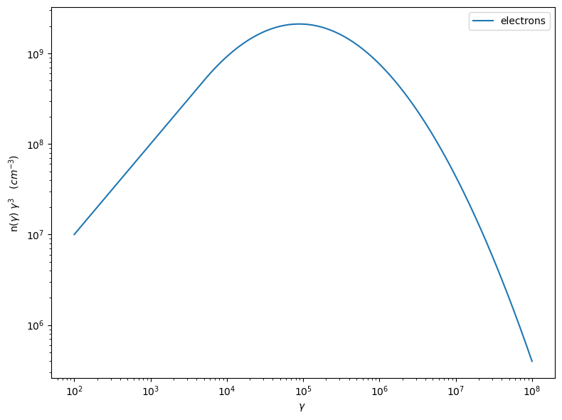

.. code:: ipython3

    p=my_jet.electron_distribution.plot3p(energy_unit='eV')

.. image:: Jet_example_phys_SSC_files/Jet_example_phys_SSC_50_0.png

.. code:: ipython3

    p=my_jet.electron_distribution.plot2p(energy_unit='erg')

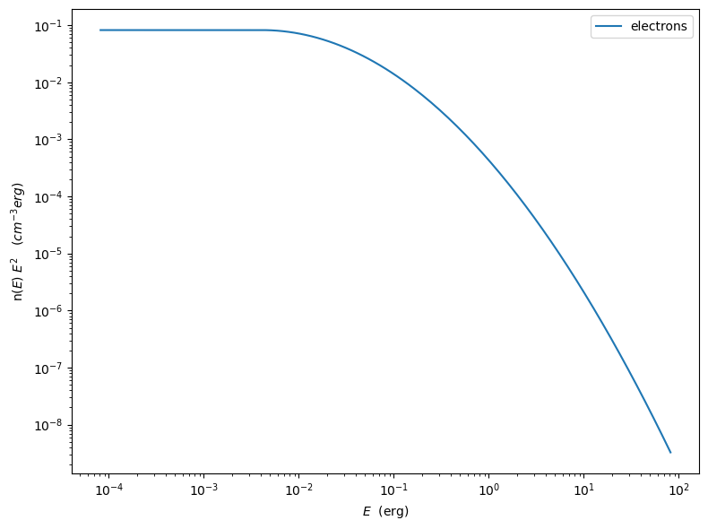

to obtain a loglog plot, pass ``loglog=True`` to the ``plot`` method

.. code:: ipython3

    p=my_jet.electron_distribution.plot(energy_unit='erg',loglog=True)

.. image:: Jet_example_phys_SSC_files/Jet_example_phys_SSC_53_0.png

.. code:: ipython3

    import numpy as np
    p=None
    for r in np.linspace(0.3,1,10):
        my_jet.parameters.r.val=r
        _l='r=%2.2f'%r
        if p is None:
            p=my_jet.electron_distribution.plot3p(label=_l)
        else:
            p=my_jet.electron_distribution.plot3p(p,label=_l)

.. image:: Jet_example_phys_SSC_files/Jet_example_phys_SSC_54_0.png

Using log values for electron distribution parameters
~~~~~~~~~~~~~~~~~~~~~~~~~~~~~~~~~~~~~~~~~~~~~~~~~~~~~

.. code:: ipython3

    my_jet=Jet(name='test',electron_distribution='lppl',electron_distribution_log_values=True)
    my_jet.show_model()

.. parsed-literal::

    ===> setting C threads to 12
    
    --------------------------------------------------------------------------------
    model description: 
    --------------------------------------------------------------------------------
    type: Jet
    name: test  
    geometry: spherical  
    
    electrons distribution:
     type: lppl  
     gamma energy grid size:  201
     gmin grid : 2.000000e+00
     gmax grid : 1.000000e+06
     normalization:  True
     log-values:  True
     ratio of cold protons to relativistic electrons: 1.000000e+00
    
    radiative fields:
     seed photons grid size:  100
     IC emission grid size:  100
     source emissivity lower bound :  1.000000e-120
     spectral components:
       name:Sum, state: on
       name:Sum, hidden: False
       name:Sync, state: self-abs
       name:Sync, hidden: False
       name:SSC, state: on
       name:SSC, hidden: False
    external fields transformation method: blob
    
    SED info:
     nu grid size jetkernel: 1000
     nu size: 500
     nu mix (Hz): 1.000000e+06
     nu max (Hz): 1.000000e+30
    
    flux plot lower bound   :  1.000000e-30
    
    --------------------------------------------------------------------------------

.. raw:: html

    <i>Table length=12</i>
    <table id="table4811393824-904126" class="table-striped table-bordered table-condensed">
    <thead><tr><th>model name</th><th>name</th><th>par type</th><th>units</th><th>val</th><th>phys. bound. min</th><th>phys. bound. max</th><th>log</th><th>frozen</th></tr></thead>
    <tr><td>test</td><td>R</td><td>region_size</td><td>cm</td><td>5.000000e+15</td><td>1.000000e+03</td><td>1.000000e+30</td><td>False</td><td>False</td></tr>
    <tr><td>test</td><td>R_H</td><td>region_position</td><td>cm</td><td>1.000000e+17</td><td>0.000000e+00</td><td>--</td><td>False</td><td>True</td></tr>
    <tr><td>test</td><td>B</td><td>magnetic_field</td><td>gauss</td><td>1.000000e-01</td><td>0.000000e+00</td><td>--</td><td>False</td><td>False</td></tr>
    <tr><td>test</td><td>NH_cold_to_rel_e</td><td>cold_p_to_rel_e_ratio</td><td></td><td>1.000000e+00</td><td>0.000000e+00</td><td>--</td><td>False</td><td>True</td></tr>
    <tr><td>test</td><td>beam_obj</td><td>beaming</td><td></td><td>1.000000e+01</td><td>1.000000e-04</td><td>--</td><td>False</td><td>False</td></tr>
    <tr><td>test</td><td>z_cosm</td><td>redshift</td><td></td><td>1.000000e-01</td><td>0.000000e+00</td><td>--</td><td>False</td><td>False</td></tr>
    <tr><td>test</td><td>gmin</td><td>low-energy-cut-off</td><td>lorentz-factor*</td><td>3.010300e-01</td><td>0.000000e+00</td><td>9.000000e+00</td><td>True</td><td>False</td></tr>
    <tr><td>test</td><td>gmax</td><td>high-energy-cut-off</td><td>lorentz-factor*</td><td>6.000000e+00</td><td>0.000000e+00</td><td>1.500000e+01</td><td>True</td><td>False</td></tr>
    <tr><td>test</td><td>N</td><td>emitters_density</td><td>1 / cm3</td><td>1.000000e+02</td><td>0.000000e+00</td><td>--</td><td>False</td><td>False</td></tr>
    <tr><td>test</td><td>gamma0_log_parab</td><td>turn-over-energy</td><td>lorentz-factor*</td><td>4.000000e+00</td><td>0.000000e+00</td><td>9.000000e+00</td><td>True</td><td>False</td></tr>
    <tr><td>test</td><td>s</td><td>LE_spectral_slope</td><td></td><td>2.000000e+00</td><td>-1.000000e+01</td><td>1.000000e+01</td><td>False</td><td>False</td></tr>
    <tr><td>test</td><td>r</td><td>spectral_curvature</td><td></td><td>4.000000e-01</td><td>-1.500000e+01</td><td>1.500000e+01</td><td>False</td><td>False</td></tr>
    </table>
    

.. parsed-literal::

    --------------------------------------------------------------------------------

Evaluate and plot the model
---------------------------

At this point we can evaluate the emission for this jet model using the
instruction

.. code:: ipython3

    my_jet.eval()

.. code:: ipython3

    my_jet.show_pars()

.. raw:: html

    <i>Table length=12</i>
    <table id="table4795583696-764339" class="table-striped table-bordered table-condensed">
    <thead><tr><th>model name</th><th>name</th><th>par type</th><th>units</th><th>val</th><th>phys. bound. min</th><th>phys. bound. max</th><th>log</th><th>frozen</th></tr></thead>
    <tr><td>test</td><td>R</td><td>region_size</td><td>cm</td><td>5.000000e+15</td><td>1.000000e+03</td><td>1.000000e+30</td><td>False</td><td>False</td></tr>
    <tr><td>test</td><td>R_H</td><td>region_position</td><td>cm</td><td>1.000000e+17</td><td>0.000000e+00</td><td>--</td><td>False</td><td>True</td></tr>
    <tr><td>test</td><td>B</td><td>magnetic_field</td><td>gauss</td><td>1.000000e-01</td><td>0.000000e+00</td><td>--</td><td>False</td><td>False</td></tr>
    <tr><td>test</td><td>NH_cold_to_rel_e</td><td>cold_p_to_rel_e_ratio</td><td></td><td>1.000000e+00</td><td>0.000000e+00</td><td>--</td><td>False</td><td>True</td></tr>
    <tr><td>test</td><td>beam_obj</td><td>beaming</td><td></td><td>1.000000e+01</td><td>1.000000e-04</td><td>--</td><td>False</td><td>False</td></tr>
    <tr><td>test</td><td>z_cosm</td><td>redshift</td><td></td><td>1.000000e-01</td><td>0.000000e+00</td><td>--</td><td>False</td><td>False</td></tr>
    <tr><td>test</td><td>gmin</td><td>low-energy-cut-off</td><td>lorentz-factor*</td><td>3.010300e-01</td><td>0.000000e+00</td><td>9.000000e+00</td><td>True</td><td>False</td></tr>
    <tr><td>test</td><td>gmax</td><td>high-energy-cut-off</td><td>lorentz-factor*</td><td>6.000000e+00</td><td>0.000000e+00</td><td>1.500000e+01</td><td>True</td><td>False</td></tr>
    <tr><td>test</td><td>N</td><td>emitters_density</td><td>1 / cm3</td><td>1.000000e+02</td><td>0.000000e+00</td><td>--</td><td>False</td><td>False</td></tr>
    <tr><td>test</td><td>gamma0_log_parab</td><td>turn-over-energy</td><td>lorentz-factor*</td><td>4.000000e+00</td><td>0.000000e+00</td><td>9.000000e+00</td><td>True</td><td>False</td></tr>
    <tr><td>test</td><td>s</td><td>LE_spectral_slope</td><td></td><td>2.000000e+00</td><td>-1.000000e+01</td><td>1.000000e+01</td><td>False</td><td>False</td></tr>
    <tr><td>test</td><td>r</td><td>spectral_curvature</td><td></td><td>4.000000e-01</td><td>-1.500000e+01</td><td>1.500000e+01</td><td>False</td><td>False</td></tr>
    </table>
    

and plot the corresponding SED:

.. warning::
    Starting from version 1.2.0  The rescale method as been replaced by the setlim methd. Please notice, that now jetset uses as defualt logarthmic axis rather than loglog plots, so, the correct way to use it is rescale(x_min=8)->setlim(x_min=1E8)

.. code:: ipython3

    from jetset.plot_sedfit import PlotSED
    my_plot=PlotSED()
    my_jet.plot_model(plot_obj=my_plot)
    my_plot.setlim(y_min=10**-17.5)

.. image:: Jet_example_phys_SSC_files/Jet_example_phys_SSC_63_0.png

alternatively, you can call the ``plot_model`` method without passing a
``Plot`` object

.. code:: ipython3

    my_plot=my_jet.plot_model()
    my_plot.setlim(y_min=10**-17.5)

.. image:: Jet_example_phys_SSC_files/Jet_example_phys_SSC_65_0.png

If you want to have more points on the IC spectrum you can set the numerical  parameters for radiative fields(see :ref:`jet_numerical_guide' section for more details):

.. code:: ipython3

    my_jet.set_IC_nu_size(100)

.. code:: ipython3

    my_jet.eval()
    my_plot=my_jet.plot_model()
    my_plot.setlim(y_min=10**-17.5)

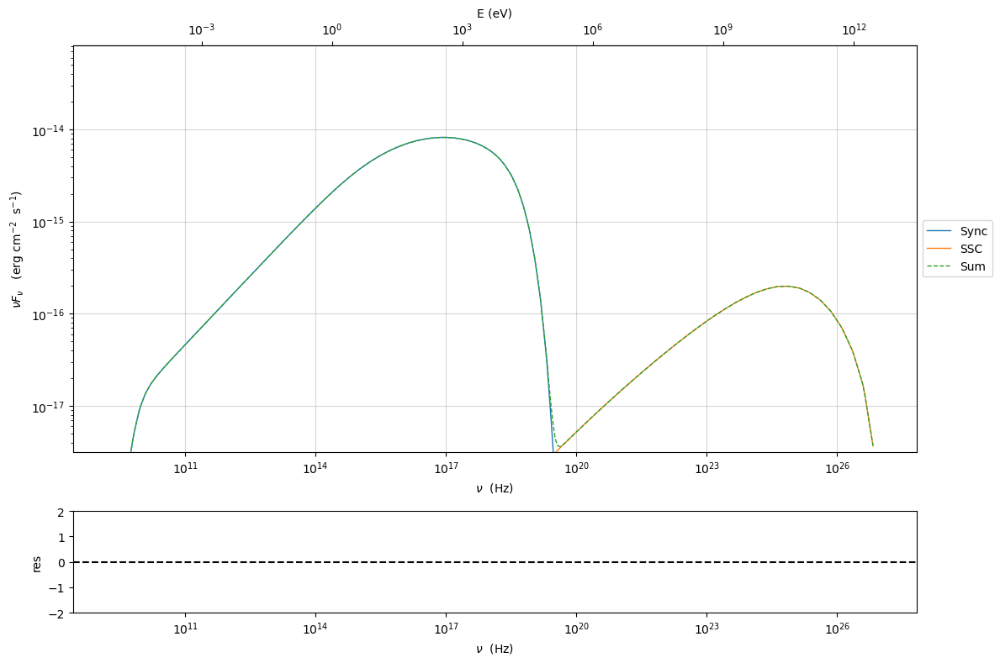

you can access the same plot, but in the rest frame of the black hole,
or accretion disk, hence plotting the isotropic luminosity, by simply
passing the ``frame`` kw to ``src``

.. code:: ipython3

    my_plot=my_jet.plot_model(frame='src')
    my_plot.setlim(y_max=1E42,y_min=1E38)

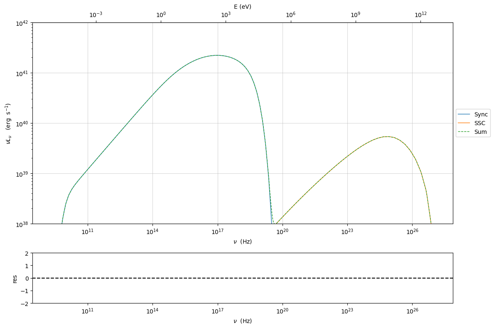

the ``my_plot`` object returned will be built on the fly by the
``plot_model`` method

Starting from version 1.2.0 you can also plot in the ``Fnu`` or ``Lnu``
representation adding the ``density=True`` keyword to the
``plot_model command``

.. code:: ipython3

    my_plot=my_jet.plot_model(frame='src',density=True)
    my_plot.setlim(y_max=1E29,y_min=1E11,x_min=1E8,x_max=1E28)

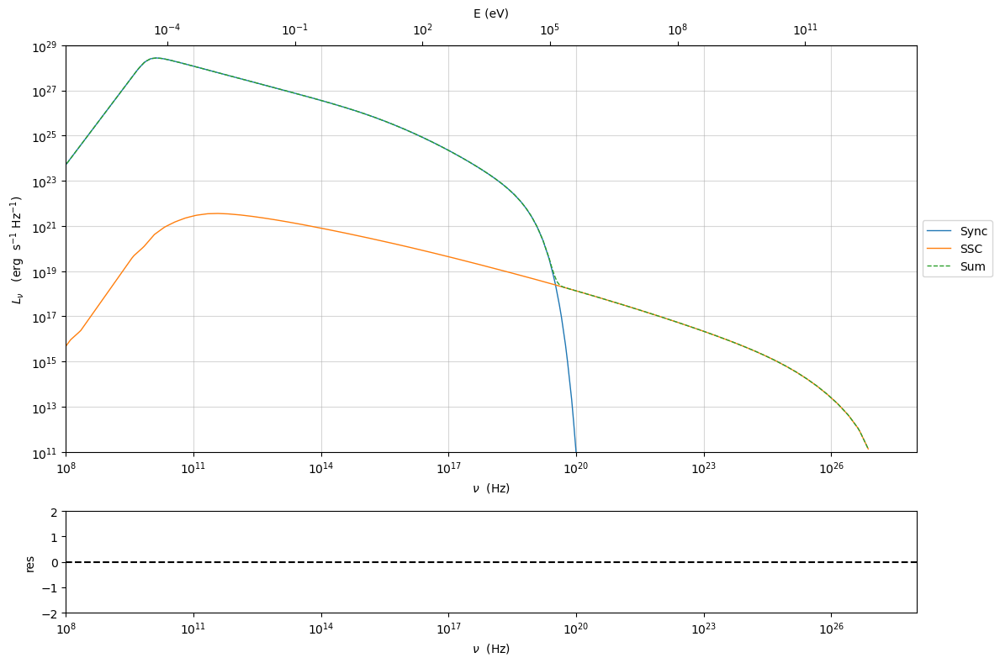

Changing the nu grid
~~~~~~~~~~~~~~~~~~~~

The ``SED info`` header displayed by the :meth:``.Jet.show_model()``
method reports information for the SED ``nu_min``, ``nu_max``,
``nu_size`` and ``nu_grid_size``.

-  The ``nu_grid_size`` is the internal interpolation grid used by
   ``jetkernel`` C code, and it should not be changed

-  The ``nu_size`` is the Python interpolation grid used by the Python
   wrapper on top of the ``jetkernel`` one, and is used only for the
   SEDs production and plotting.

-  ``nu_min`` and ``nu_max``, are used for the boundaries of the model,
   and can be changed if the custom value does not cover your expected
   range.

.. note:: if the model is below the source emissivity or flux plot lower bound, then your changes on ``nu_min``/``nu_max`` will have no effect, and you have to decrease the source emissivity or flux plot lower bound eg:

  - ``my_jet.flux_plot_lim=1E-40``
  
  - ``my_jet.set_emiss_lim(1E-200)``

.. code:: ipython3

    my_jet.nu_min=1E5
    my_jet.nu_size=400
    my_jet.nu_max=1E30

.. code:: ipython3

    my_jet.show_model()

.. parsed-literal::

    
    --------------------------------------------------------------------------------
    model description: 
    --------------------------------------------------------------------------------
    type: Jet
    name: test  
    geometry: spherical  
    
    electrons distribution:
     type: lppl  
     gamma energy grid size:  201
     gmin grid : 2.000000e+00
     gmax grid : 1.000000e+06
     normalization:  True
     log-values:  True
     ratio of cold protons to relativistic electrons: 1.000000e+00
    
    radiative fields:
     seed photons grid size:  100
     IC emission grid size:  100
     source emissivity lower bound :  1.000000e-120
     spectral components:
       name:Sum, state: on
       name:Sum, hidden: False
       name:Sync, state: self-abs
       name:Sync, hidden: False
       name:SSC, state: on
       name:SSC, hidden: False
    external fields transformation method: blob
    
    SED info:
     nu grid size jetkernel: 1000
     nu size: 400
     nu mix (Hz): 1.000000e+05
     nu max (Hz): 1.000000e+30
    
    flux plot lower bound   :  1.000000e-30
    
    --------------------------------------------------------------------------------

.. raw:: html

    <i>Table length=12</i>
    <table id="table4799605072-720551" class="table-striped table-bordered table-condensed">
    <thead><tr><th>model name</th><th>name</th><th>par type</th><th>units</th><th>val</th><th>phys. bound. min</th><th>phys. bound. max</th><th>log</th><th>frozen</th></tr></thead>
    <tr><td>test</td><td>R</td><td>region_size</td><td>cm</td><td>5.000000e+15</td><td>1.000000e+03</td><td>1.000000e+30</td><td>False</td><td>False</td></tr>
    <tr><td>test</td><td>R_H</td><td>region_position</td><td>cm</td><td>1.000000e+17</td><td>0.000000e+00</td><td>--</td><td>False</td><td>True</td></tr>
    <tr><td>test</td><td>B</td><td>magnetic_field</td><td>gauss</td><td>1.000000e-01</td><td>0.000000e+00</td><td>--</td><td>False</td><td>False</td></tr>
    <tr><td>test</td><td>NH_cold_to_rel_e</td><td>cold_p_to_rel_e_ratio</td><td></td><td>1.000000e+00</td><td>0.000000e+00</td><td>--</td><td>False</td><td>True</td></tr>
    <tr><td>test</td><td>beam_obj</td><td>beaming</td><td></td><td>1.000000e+01</td><td>1.000000e-04</td><td>--</td><td>False</td><td>False</td></tr>
    <tr><td>test</td><td>z_cosm</td><td>redshift</td><td></td><td>1.000000e-01</td><td>0.000000e+00</td><td>--</td><td>False</td><td>False</td></tr>
    <tr><td>test</td><td>gmin</td><td>low-energy-cut-off</td><td>lorentz-factor*</td><td>3.010300e-01</td><td>0.000000e+00</td><td>9.000000e+00</td><td>True</td><td>False</td></tr>
    <tr><td>test</td><td>gmax</td><td>high-energy-cut-off</td><td>lorentz-factor*</td><td>6.000000e+00</td><td>0.000000e+00</td><td>1.500000e+01</td><td>True</td><td>False</td></tr>
    <tr><td>test</td><td>N</td><td>emitters_density</td><td>1 / cm3</td><td>1.000000e+02</td><td>0.000000e+00</td><td>--</td><td>False</td><td>False</td></tr>
    <tr><td>test</td><td>gamma0_log_parab</td><td>turn-over-energy</td><td>lorentz-factor*</td><td>4.000000e+00</td><td>0.000000e+00</td><td>9.000000e+00</td><td>True</td><td>False</td></tr>
    <tr><td>test</td><td>s</td><td>LE_spectral_slope</td><td></td><td>2.000000e+00</td><td>-1.000000e+01</td><td>1.000000e+01</td><td>False</td><td>False</td></tr>
    <tr><td>test</td><td>r</td><td>spectral_curvature</td><td></td><td>4.000000e-01</td><td>-1.500000e+01</td><td>1.500000e+01</td><td>False</td><td>False</td></tr>
    </table>
    

.. parsed-literal::

    --------------------------------------------------------------------------------

.. code:: ipython3

    my_jet.eval()
    import matplotlib.ticker as ticker
    p=my_jet.plot_model()
    p.setlim(x_min=1E5,x_max=1E16,y_min=10**-29)
    plt.show()

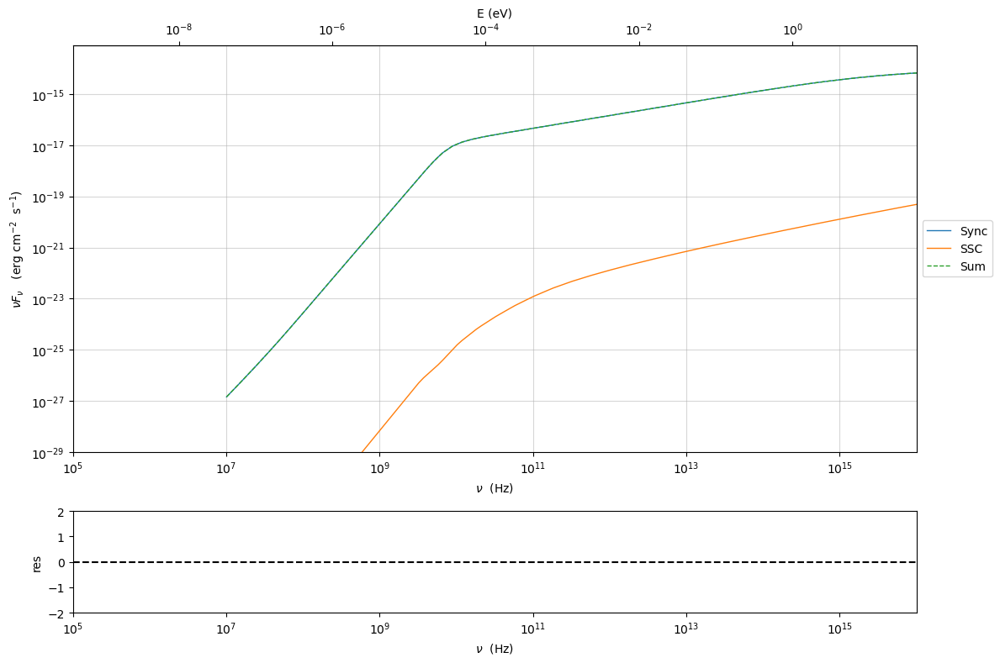

if you want to to have interacitve plot:

1) in a jupyter notebook use:

.. code-block:: no

    %matplotlib notebook

2) in jupyter lab:
  .. code-block:: no

    %matplotlib widget
    (visit this url to setup and install: https://github.com/matplotlib/ipympl)

3) in an ipython terminal

.. code-block:: python
    
    from matplotlib import pylab as plt
    plt.ion()

Comparing models on the same plot
---------------------------------

to compare the same model after changing a parameter

.. code:: ipython3

    my_jet=Jet(name='test',electron_distribution='lppl',)
    my_jet.set_par('B',val=0.2)
    my_jet.set_par('gamma0_log_parab',val=5E3)
    my_jet.set_par('gmin',val=1E2)
    my_jet.set_par('gmax',val=1E8)
    my_jet.set_par('R',val=10**14.5)
    my_jet.set_par('N',val=1E3)
    
    my_jet.parameters.gamma0_log_parab.val=1E4
    my_jet.eval()
    my_plot=my_jet.plot_model(label='gamma0_log_parab=1E4',comp='Sum')
    my_jet.set_par('gamma0_log_parab',val=1.0E5)
    my_jet.eval()
    my_plot=my_jet.plot_model(my_plot,label='gamma0_log_parab=1E5',comp='Sum')
    my_plot.setlim(y_max=1E-13,y_min=2E-17,x_min=1E8)

.. parsed-literal::

    ===> setting C threads to 12

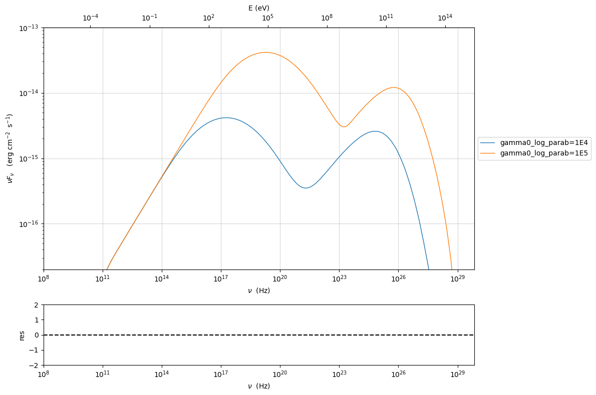

Saving a plot
-------------

to save the plot

.. code:: ipython3

    my_plot.save('jet1.png')

Saving and loading a model
--------------------------

.. important::
    version 1.3.0 has changed the serialization of models, to be independent from changes in imported libraries, hence, models saved with previous versions might not be possible.

.. code:: ipython3

    my_jet.save_model('test_model.pkl')

.. code:: ipython3

    my_jet_new=Jet.load_model('test_model.pkl')

.. parsed-literal::

    ===> setting C threads to 12

Switching on/off the particle distribution normalization
--------------------------------------------------------

As default the electron distributions are normalized, i.e. are multiplied by a constant ``N_0``, in such a way that :

:math:`\int_{\gamma_{min}}^{\gamma_{max}} n(\gamma) d\gamma =1`, 

it means the the value `N`, refers to the actual density of emitters.
If you want to chance this behavior, you can start looking at the sate of ``Norm_distr`` flag with the following command

.. code:: ipython3

    my_jet.Norm_distr

.. parsed-literal::

    True

and then you can switch off the normalization withe command

.. code:: ipython3

    my_jet.switch_Norm_distr_OFF()

OR

.. code:: ipython3

    my_jet.Norm_distr=0

.. code:: ipython3

    my_jet.switch_Norm_distr_ON()

OR

.. code:: ipython3

    my_jet.Norm_distr=1

Setting the particle density from observed Fluxes or Luminosities
-----------------------------------------------------------------

It is possible to set the density of emitting particles starting from some observed luminosity or flux (see the method  :meth:`.Jet.set_N_from_nuFnu`, and  :meth:`.Jet.set_N_from_nuLnu`)

.. code:: ipython3

    my_jet=Jet(name='test',electron_distribution='lppl')

.. parsed-literal::

    ===> setting C threads to 12

this is the initial value of N

.. code:: ipython3

    my_jet.parameters.N.val

.. parsed-literal::

    100

we now want to set the value of ``N`` in order that the observed synchrotron flux at a given frequency matches a target value. 
For example, assume that we wish to set ``N`` in order that  the synchrotron flux at :math:`10^{15}` Hz is exactly matching the desired value of :math:`10^{-14}` ergs cm-2 s-1. We can accomplish this by using the  method :meth:`.Jet.set_N_from_nuFnu()` as follows: 

.. code:: ipython3

    
    my_jet.set_N_from_nuFnu(nuFnu_obs=1E-14,nu_obs=1E15)

This is the updated value of ``N``, obtained in order to match the given
flux at the given frequency

.. code:: ipython3

    my_jet.get_par_by_name('N').val

.. parsed-literal::

    272.4

OR

.. code:: ipython3

    my_jet.parameters.N.val

.. parsed-literal::

    272.4

.. code:: ipython3

    my_jet.parameters.show_pars()

.. raw:: html

    <i>Table length=12</i>
    <table id="table4795987280-616192" class="table-striped table-bordered table-condensed">
    <thead><tr><th>model name</th><th>name</th><th>par type</th><th>units</th><th>val</th><th>phys. bound. min</th><th>phys. bound. max</th><th>log</th><th>frozen</th></tr></thead>
    <tr><td>test</td><td>R</td><td>region_size</td><td>cm</td><td>5.000000e+15</td><td>1.000000e+03</td><td>1.000000e+30</td><td>False</td><td>False</td></tr>
    <tr><td>test</td><td>R_H</td><td>region_position</td><td>cm</td><td>1.000000e+17</td><td>0.000000e+00</td><td>--</td><td>False</td><td>True</td></tr>
    <tr><td>test</td><td>B</td><td>magnetic_field</td><td>gauss</td><td>1.000000e-01</td><td>0.000000e+00</td><td>--</td><td>False</td><td>False</td></tr>
    <tr><td>test</td><td>NH_cold_to_rel_e</td><td>cold_p_to_rel_e_ratio</td><td></td><td>1.000000e+00</td><td>0.000000e+00</td><td>--</td><td>False</td><td>True</td></tr>
    <tr><td>test</td><td>beam_obj</td><td>beaming</td><td></td><td>1.000000e+01</td><td>1.000000e-04</td><td>--</td><td>False</td><td>False</td></tr>
    <tr><td>test</td><td>z_cosm</td><td>redshift</td><td></td><td>1.000000e-01</td><td>0.000000e+00</td><td>--</td><td>False</td><td>False</td></tr>
    <tr><td>test</td><td>gmin</td><td>low-energy-cut-off</td><td>lorentz-factor*</td><td>2.000000e+00</td><td>1.000000e+00</td><td>1.000000e+09</td><td>False</td><td>False</td></tr>
    <tr><td>test</td><td>gmax</td><td>high-energy-cut-off</td><td>lorentz-factor*</td><td>1.000000e+06</td><td>1.000000e+00</td><td>1.000000e+15</td><td>False</td><td>False</td></tr>
    <tr><td>test</td><td>N</td><td>emitters_density</td><td>1 / cm3</td><td>2.723756e+02</td><td>0.000000e+00</td><td>--</td><td>False</td><td>False</td></tr>
    <tr><td>test</td><td>gamma0_log_parab</td><td>turn-over-energy</td><td>lorentz-factor*</td><td>1.000000e+04</td><td>1.000000e+00</td><td>1.000000e+09</td><td>False</td><td>False</td></tr>
    <tr><td>test</td><td>s</td><td>LE_spectral_slope</td><td></td><td>2.000000e+00</td><td>-1.000000e+01</td><td>1.000000e+01</td><td>False</td><td>False</td></tr>
    <tr><td>test</td><td>r</td><td>spectral_curvature</td><td></td><td>4.000000e-01</td><td>-1.500000e+01</td><td>1.500000e+01</td><td>False</td><td>False</td></tr>
    </table>
    

.. code:: ipython3

    my_jet.eval()
    my_plot=my_jet.plot_model(label='set N from F=1E-14')
    my_plot.setlim(y_max=1E-13,y_min=2E-17,x_min=1E8)

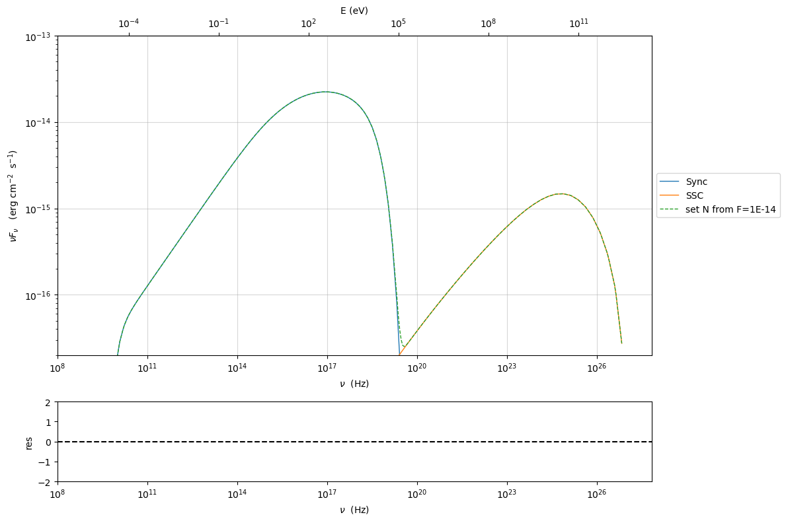

as you can see, the synchrotron flux at :math:`10^{15}` Hz, now exactly matches the desired value of :math:`10^{-14}` ergs cm-2 s-1.
Alternatively, the value of N  can be obtained using the rest-frame luminosity and  frequency, using the method :meth:`.Jet.set_N_from_nuLnu`

.. code:: ipython3

    my_jet.set_N_from_nuLnu(nuLnu_src=1E43,nu_src=1E15)

where ``nuLnu_src`` is the source rest-frame isotropic luminosity in erg/s at the rest-frame frequency ``nu_src`` in Hz.

Setting the beaming factor and expression
-----------------------------------------

.. important::
    Starting from version 1.2.0, when using the ``delta`` expression, the value of delta used to compute jet luminosity will be set to ``beam_obj``. In the previous versions, a reference value of 10 was used. In any case, if you are interested in evaluating jet  luminosity you should use the ``beaming_expr`` method

It is possible to set the beaming factor according to the relativistic BulkFactor and viewing angle, this can be done by setting the ``beaming_expr`` kw in the Jet constructor, possible choices are

* ``delta`` (default) to provide directly the beaming factor  
* ``bulk_theta`` to provide the BulkFactor and the jet  viewing angle 

.. code:: ipython3

    my_jet=Jet(name='test',electron_distribution='lppl',beaming_expr='bulk_theta')

.. parsed-literal::

    ===> setting C threads to 12

.. code:: ipython3

    my_jet.parameters.show_pars()

.. raw:: html

    <i>Table length=13</i>
    <table id="table4811790544-236513" class="table-striped table-bordered table-condensed">
    <thead><tr><th>model name</th><th>name</th><th>par type</th><th>units</th><th>val</th><th>phys. bound. min</th><th>phys. bound. max</th><th>log</th><th>frozen</th></tr></thead>
    <tr><td>test</td><td>R</td><td>region_size</td><td>cm</td><td>5.000000e+15</td><td>1.000000e+03</td><td>1.000000e+30</td><td>False</td><td>False</td></tr>
    <tr><td>test</td><td>R_H</td><td>region_position</td><td>cm</td><td>1.000000e+17</td><td>0.000000e+00</td><td>--</td><td>False</td><td>True</td></tr>
    <tr><td>test</td><td>B</td><td>magnetic_field</td><td>gauss</td><td>1.000000e-01</td><td>0.000000e+00</td><td>--</td><td>False</td><td>False</td></tr>
    <tr><td>test</td><td>NH_cold_to_rel_e</td><td>cold_p_to_rel_e_ratio</td><td></td><td>1.000000e+00</td><td>0.000000e+00</td><td>--</td><td>False</td><td>True</td></tr>
    <tr><td>test</td><td>theta</td><td>jet-viewing-angle</td><td>deg</td><td>1.000000e-01</td><td>0.000000e+00</td><td>9.000000e+01</td><td>False</td><td>False</td></tr>
    <tr><td>test</td><td>BulkFactor</td><td>jet-bulk-factor</td><td>lorentz-factor*</td><td>1.000000e+01</td><td>1.000000e+00</td><td>1.000000e+05</td><td>False</td><td>False</td></tr>
    <tr><td>test</td><td>z_cosm</td><td>redshift</td><td></td><td>1.000000e-01</td><td>0.000000e+00</td><td>--</td><td>False</td><td>False</td></tr>
    <tr><td>test</td><td>gmin</td><td>low-energy-cut-off</td><td>lorentz-factor*</td><td>2.000000e+00</td><td>1.000000e+00</td><td>1.000000e+09</td><td>False</td><td>False</td></tr>
    <tr><td>test</td><td>gmax</td><td>high-energy-cut-off</td><td>lorentz-factor*</td><td>1.000000e+06</td><td>1.000000e+00</td><td>1.000000e+15</td><td>False</td><td>False</td></tr>
    <tr><td>test</td><td>N</td><td>emitters_density</td><td>1 / cm3</td><td>1.000000e+02</td><td>0.000000e+00</td><td>--</td><td>False</td><td>False</td></tr>
    <tr><td>test</td><td>gamma0_log_parab</td><td>turn-over-energy</td><td>lorentz-factor*</td><td>1.000000e+04</td><td>1.000000e+00</td><td>1.000000e+09</td><td>False</td><td>False</td></tr>
    <tr><td>test</td><td>s</td><td>LE_spectral_slope</td><td></td><td>2.000000e+00</td><td>-1.000000e+01</td><td>1.000000e+01</td><td>False</td><td>False</td></tr>
    <tr><td>test</td><td>r</td><td>spectral_curvature</td><td></td><td>4.000000e-01</td><td>-1.500000e+01</td><td>1.500000e+01</td><td>False</td><td>False</td></tr>
    </table>
    

the actual value of the beaming factor can be obtained using the :meth:`.Jet.get_beaming`

.. code:: ipython3

    my_jet.get_beaming()

.. parsed-literal::

    19.94

We can change the value of ``theta`` and get the updated value of the beaming factor

.. code:: ipython3

    my_jet.set_par('theta',val=10.)

.. code:: ipython3

    my_jet.get_beaming()

.. parsed-literal::

    4.968

of course setting ``beaming_expr=delta`` we get the same beaming
expression as in the default case

.. code:: ipython3

    my_jet=Jet(name='test',electron_distribution='lppl',beaming_expr='delta')

.. parsed-literal::

    ===> setting C threads to 12

.. code:: ipython3

    my_jet.parameters.show_pars()

.. raw:: html

    <i>Table length=12</i>
    <table id="table5757282448-29189" class="table-striped table-bordered table-condensed">
    <thead><tr><th>model name</th><th>name</th><th>par type</th><th>units</th><th>val</th><th>phys. bound. min</th><th>phys. bound. max</th><th>log</th><th>frozen</th></tr></thead>
    <tr><td>test</td><td>R</td><td>region_size</td><td>cm</td><td>5.000000e+15</td><td>1.000000e+03</td><td>1.000000e+30</td><td>False</td><td>False</td></tr>
    <tr><td>test</td><td>R_H</td><td>region_position</td><td>cm</td><td>1.000000e+17</td><td>0.000000e+00</td><td>--</td><td>False</td><td>True</td></tr>
    <tr><td>test</td><td>B</td><td>magnetic_field</td><td>gauss</td><td>1.000000e-01</td><td>0.000000e+00</td><td>--</td><td>False</td><td>False</td></tr>
    <tr><td>test</td><td>NH_cold_to_rel_e</td><td>cold_p_to_rel_e_ratio</td><td></td><td>1.000000e+00</td><td>0.000000e+00</td><td>--</td><td>False</td><td>True</td></tr>
    <tr><td>test</td><td>beam_obj</td><td>beaming</td><td></td><td>1.000000e+01</td><td>1.000000e-04</td><td>--</td><td>False</td><td>False</td></tr>
    <tr><td>test</td><td>z_cosm</td><td>redshift</td><td></td><td>1.000000e-01</td><td>0.000000e+00</td><td>--</td><td>False</td><td>False</td></tr>
    <tr><td>test</td><td>gmin</td><td>low-energy-cut-off</td><td>lorentz-factor*</td><td>2.000000e+00</td><td>1.000000e+00</td><td>1.000000e+09</td><td>False</td><td>False</td></tr>
    <tr><td>test</td><td>gmax</td><td>high-energy-cut-off</td><td>lorentz-factor*</td><td>1.000000e+06</td><td>1.000000e+00</td><td>1.000000e+15</td><td>False</td><td>False</td></tr>
    <tr><td>test</td><td>N</td><td>emitters_density</td><td>1 / cm3</td><td>1.000000e+02</td><td>0.000000e+00</td><td>--</td><td>False</td><td>False</td></tr>
    <tr><td>test</td><td>gamma0_log_parab</td><td>turn-over-energy</td><td>lorentz-factor*</td><td>1.000000e+04</td><td>1.000000e+00</td><td>1.000000e+09</td><td>False</td><td>False</td></tr>
    <tr><td>test</td><td>s</td><td>LE_spectral_slope</td><td></td><td>2.000000e+00</td><td>-1.000000e+01</td><td>1.000000e+01</td><td>False</td><td>False</td></tr>
    <tr><td>test</td><td>r</td><td>spectral_curvature</td><td></td><td>4.000000e-01</td><td>-1.500000e+01</td><td>1.500000e+01</td><td>False</td><td>False</td></tr>
    </table>
    

Switch ON/OFF Synchrotron sefl-absorption and IC emission
---------------------------------------------------------

.. code:: ipython3

    my_jet.show_model()

.. parsed-literal::

    
    --------------------------------------------------------------------------------
    model description: 
    --------------------------------------------------------------------------------
    type: Jet
    name: test  
    geometry: spherical  
    
    electrons distribution:
     type: lppl  
     gamma energy grid size:  201
     gmin grid : 2.000000e+00
     gmax grid : 1.000000e+06
     normalization:  True
     log-values:  False
     ratio of cold protons to relativistic electrons: 1.000000e+00
    
    radiative fields:
     seed photons grid size:  100
     IC emission grid size:  100
     source emissivity lower bound :  1.000000e-120
     spectral components:
       name:Sum, state: on
       name:Sum, hidden: False
       name:Sync, state: self-abs
       name:Sync, hidden: False
       name:SSC, state: on
       name:SSC, hidden: False
    external fields transformation method: blob
    
    SED info:
     nu grid size jetkernel: 1000
     nu size: 500
     nu mix (Hz): 1.000000e+06
     nu max (Hz): 1.000000e+30
    
    flux plot lower bound   :  1.000000e-30
    
    --------------------------------------------------------------------------------

.. raw:: html

    <i>Table length=12</i>
    <table id="table4813310080-534754" class="table-striped table-bordered table-condensed">
    <thead><tr><th>model name</th><th>name</th><th>par type</th><th>units</th><th>val</th><th>phys. bound. min</th><th>phys. bound. max</th><th>log</th><th>frozen</th></tr></thead>
    <tr><td>test</td><td>R</td><td>region_size</td><td>cm</td><td>5.000000e+15</td><td>1.000000e+03</td><td>1.000000e+30</td><td>False</td><td>False</td></tr>
    <tr><td>test</td><td>R_H</td><td>region_position</td><td>cm</td><td>1.000000e+17</td><td>0.000000e+00</td><td>--</td><td>False</td><td>True</td></tr>
    <tr><td>test</td><td>B</td><td>magnetic_field</td><td>gauss</td><td>1.000000e-01</td><td>0.000000e+00</td><td>--</td><td>False</td><td>False</td></tr>
    <tr><td>test</td><td>NH_cold_to_rel_e</td><td>cold_p_to_rel_e_ratio</td><td></td><td>1.000000e+00</td><td>0.000000e+00</td><td>--</td><td>False</td><td>True</td></tr>
    <tr><td>test</td><td>beam_obj</td><td>beaming</td><td></td><td>1.000000e+01</td><td>1.000000e-04</td><td>--</td><td>False</td><td>False</td></tr>
    <tr><td>test</td><td>z_cosm</td><td>redshift</td><td></td><td>1.000000e-01</td><td>0.000000e+00</td><td>--</td><td>False</td><td>False</td></tr>
    <tr><td>test</td><td>gmin</td><td>low-energy-cut-off</td><td>lorentz-factor*</td><td>2.000000e+00</td><td>1.000000e+00</td><td>1.000000e+09</td><td>False</td><td>False</td></tr>
    <tr><td>test</td><td>gmax</td><td>high-energy-cut-off</td><td>lorentz-factor*</td><td>1.000000e+06</td><td>1.000000e+00</td><td>1.000000e+15</td><td>False</td><td>False</td></tr>
    <tr><td>test</td><td>N</td><td>emitters_density</td><td>1 / cm3</td><td>1.000000e+02</td><td>0.000000e+00</td><td>--</td><td>False</td><td>False</td></tr>
    <tr><td>test</td><td>gamma0_log_parab</td><td>turn-over-energy</td><td>lorentz-factor*</td><td>1.000000e+04</td><td>1.000000e+00</td><td>1.000000e+09</td><td>False</td><td>False</td></tr>
    <tr><td>test</td><td>s</td><td>LE_spectral_slope</td><td></td><td>2.000000e+00</td><td>-1.000000e+01</td><td>1.000000e+01</td><td>False</td><td>False</td></tr>
    <tr><td>test</td><td>r</td><td>spectral_curvature</td><td></td><td>4.000000e-01</td><td>-1.500000e+01</td><td>1.500000e+01</td><td>False</td><td>False</td></tr>
    </table>
    

.. parsed-literal::

    --------------------------------------------------------------------------------

as you see the state of Sync emission is ``self-abs``, we can check
accessing the specific spectral component state, and get the allowed
states value

.. code:: ipython3

    my_jet.spectral_components.Sync.show()

.. parsed-literal::

    name                : Sync
    var name            : do_Sync
    state               : self-abs
    allowed states : ['on', 'off', 'self-abs']

.. code:: ipython3

    my_jet.spectral_components.Sync.state='on'

now the sate is ‘on’ with no ‘self-abs’

.. code:: ipython3

    my_jet.eval()
    p=my_jet.plot_model()
    p.setlim(y_max=1E-13,y_min=5E-18,x_min=1E8)

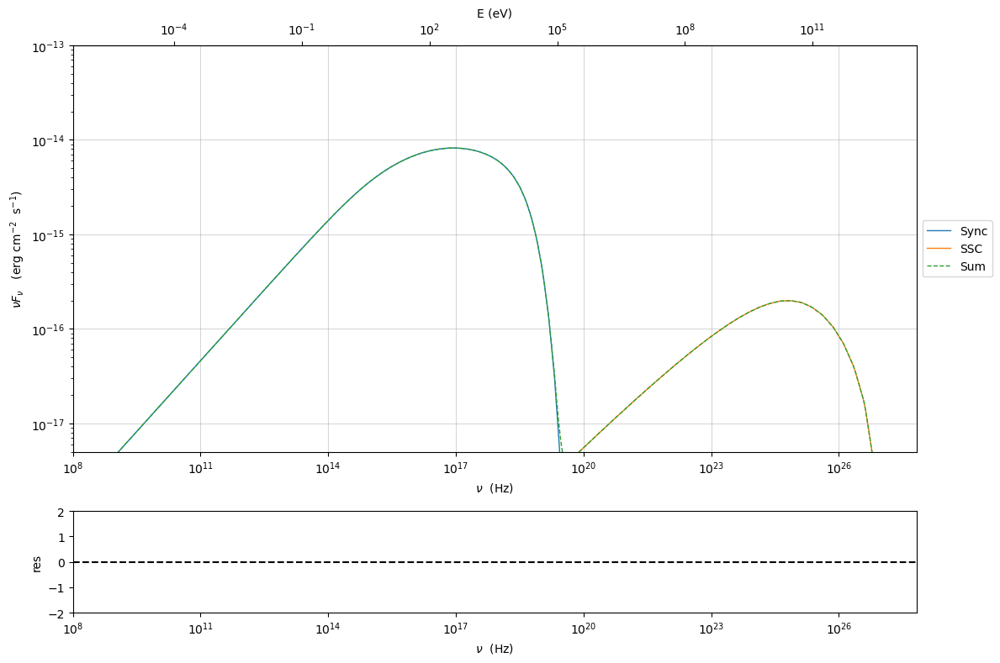

to re-enable

.. code:: ipython3

    my_jet.spectral_components.Sync.state='self-abs'
    my_jet.eval()
    p=my_jet.plot_model()
    p.setlim(y_max=1E-13,y_min=5E-18,x_min=1E8)

.. code:: ipython3

    my_jet.spectral_components.SSC.show()

.. parsed-literal::

    name                : SSC
    var name            : do_SSC
    state               : on
    allowed states : ['on', 'off']

.. code:: ipython3

    my_jet.spectral_components.SSC.state='off'
    my_jet.eval()
    p=my_jet.plot_model()
    p.setlim(y_max=1E-13,y_min=8E-18,x_min=1E8)

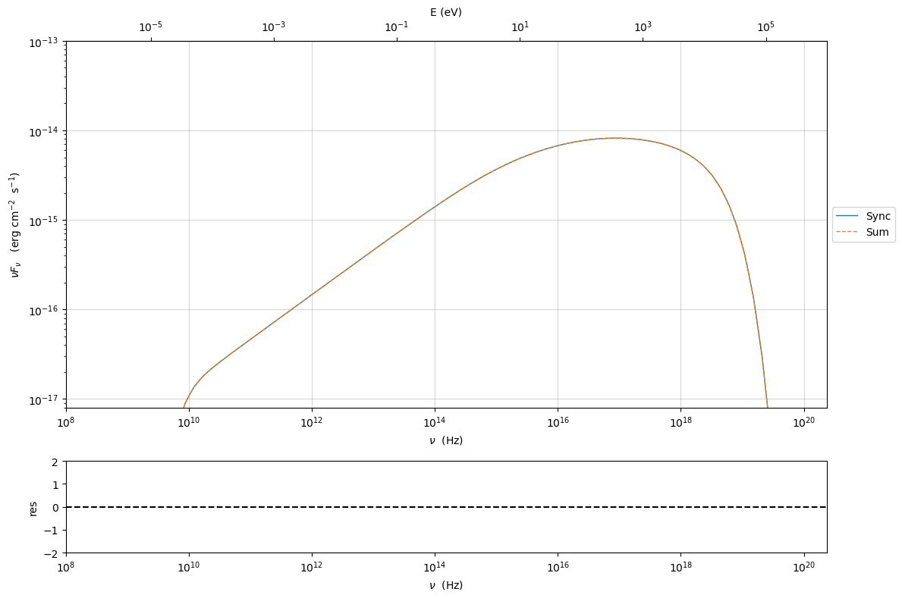

to re-enable

.. code:: ipython3

    my_jet.spectral_components.SSC.state='on'
    my_jet.eval()
    p=my_jet.plot_model()
    p.setlim(y_max=1E-13,y_min=8E-18,x_min=1E8)

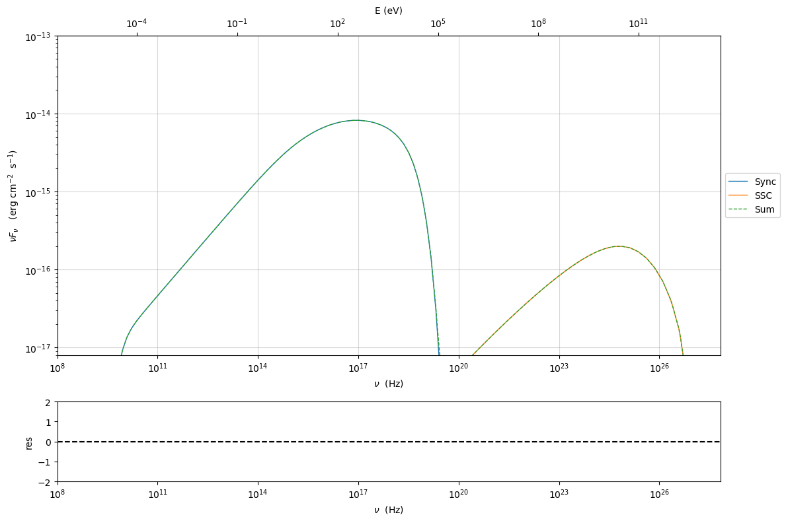

Accessing individual spectral components
----------------------------------------

It is possible to access specific spectral components of our model

.. code:: ipython3

    my_jet=Jet(name='test',electron_distribution='lppl',beaming_expr='bulk_theta')
    my_jet.eval()

.. parsed-literal::

    ===> setting C threads to 12

We can obtain this information anytime using the :meth:`.Jet.list_spectral_components` method

.. code:: ipython3

    
    my_jet.list_spectral_components()

.. parsed-literal::

    Sum
    Sync
    SSC

the on-screen message is telling us which components have been
evaluated.

and we cann access a specific component using the :meth:`.Jet.get_spectral_component_by_name` method

.. code:: ipython3

    Sync=my_jet.get_spectral_component_by_name('Sync')

OR

.. code:: ipython3

    Sync=my_jet.spectral_components.Sync

and from the ``SED`` object we can extract both the nu and nuFnu array

.. code:: ipython3

    nu_sync=Sync.SED.nu
    nuFnu_sync=Sync.SED.nuFnu

.. code:: ipython3

    plt.loglog(nu_sync,nuFnu_sync)
    plt.ylim(1E-20,1E-10)

.. parsed-literal::

    (1e-20, 1e-10)

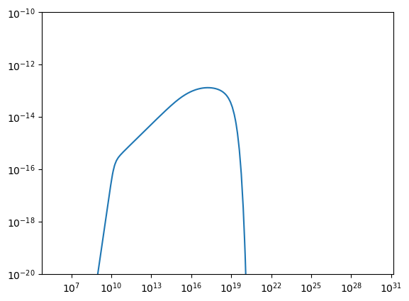

.. code:: ipython3

    print (nuFnu_sync[::10])

.. parsed-literal::

    [0.00000000e+00 0.00000000e+00 0.00000000e+00 6.04250670e-26
     2.16351829e-24 9.84432972e-23 4.74613296e-21 2.28931297e-19
     1.09662087e-17 1.83733916e-16 4.11135769e-16 7.21745036e-16
     1.25581697e-15 2.18363181e-15 3.79383567e-15 6.57833387e-15
     1.13501032e-14 1.93585563e-14 3.21429895e-14 5.06938061e-14
     7.36908738e-14 9.77112603e-14 1.17645633e-13 1.28621805e-13
     1.26850509e-13 1.10646286e-13 7.82537850e-14 3.17631756e-14
     2.39710785e-15 8.88519981e-19 7.47780581e-29 0.00000000e+00
     0.00000000e+00 0.00000000e+00 0.00000000e+00 0.00000000e+00
     0.00000000e+00 0.00000000e+00 0.00000000e+00 0.00000000e+00
     0.00000000e+00 0.00000000e+00 0.00000000e+00 0.00000000e+00
     0.00000000e+00 0.00000000e+00 0.00000000e+00 0.00000000e+00
     0.00000000e+00 0.00000000e+00] erg / (s cm2)

or for the ``src`` rest frame (isotropic luminosity)

.. code:: ipython3

    nu_sync_src=Sync.SED.nu_src
    nuLnu_sync_src=Sync.SED.nuLnu_src

.. code:: ipython3

    print (nuLnu_sync_src[::10])

.. parsed-literal::

    [0.00000000e+00 0.00000000e+00 0.00000000e+00 1.63219228e+30
     5.84406112e+31 2.65913465e+33 1.28201787e+35 6.18385569e+36
     2.96217481e+38 4.96299126e+39 1.11055338e+40 1.94956618e+40
     3.39219277e+40 5.89839143e+40 1.02478484e+41 1.77692906e+41
     3.06587177e+41 5.22910236e+41 8.68241307e+41 1.36933301e+42
     1.99052613e+42 2.63936099e+42 3.17782509e+42 3.47431170e+42
     3.42646573e+42 2.98875984e+42 2.11377876e+42 8.57981835e+41
     6.47502951e+40 2.40005601e+37 2.01989298e+27 0.00000000e+00
     0.00000000e+00 0.00000000e+00 0.00000000e+00 0.00000000e+00
     0.00000000e+00 0.00000000e+00 0.00000000e+00 0.00000000e+00
     0.00000000e+00 0.00000000e+00 0.00000000e+00 0.00000000e+00
     0.00000000e+00 0.00000000e+00 0.00000000e+00 0.00000000e+00
     0.00000000e+00 0.00000000e+00] erg / s

Moreover, you can access the corresponding astropy table

.. code:: ipython3

    my_jet.spectral_components.build_table(restframe='obs')
    t_obs=my_jet.spectral_components.table

.. code:: ipython3

    t_obs[::10]

.. raw:: html

    
<i>Table length=50</i>
    <table id="table5757874192" class="table-striped table-bordered table-condensed">
    <thead><tr><th>nu</th><th>Sum</th><th>Sync</th><th>SSC</th></tr></thead>
    <thead><tr><th>Hz</th><th>erg / (s cm2)</th><th>erg / (s cm2)</th><th>erg / (s cm2)</th></tr></thead>
    <thead><tr><th>float64</th><th>float64</th><th>float64</th><th>float64</th></tr></thead>
    <tr><td>1000000.0</td><td>0.0</td><td>0.0</td><td>0.0</td></tr>
    <tr><td>3026648.059395689</td><td>0.0</td><td>0.0</td><td>0.0</td></tr>
    <tr><td>9160598.47544371</td><td>0.0</td><td>0.0</td><td>0.0</td></tr>
    <tr><td>27725907.59860481</td><td>6.042506698961876e-26</td><td>6.042506698961876e-26</td><td>0.0</td></tr>
    <tr><td>83916564.42830162</td><td>2.163518310314854e-24</td><td>2.1635182921864927e-24</td><td>1.812816291990128e-32</td></tr>
    <tr><td>253985906.87807292</td><td>9.844329807737109e-23</td><td>9.844329720868366e-23</td><td>8.68551689841149e-31</td></tr>
    <tr><td>768725952.1663721</td><td>4.746132990060179e-21</td><td>4.746132957910235e-21</td><td>3.2149712394627884e-29</td></tr>
    <tr><td>2326662911.331458</td><td>2.2893129865238557e-19</td><td>2.289312967845199e-19</td><td>1.8678480792336018e-27</td></tr>
    <tr><td>7041989785.449296</td><td>1.0966208792227018e-17</td><td>1.0966208685756238e-17</td><td>1.064527310710398e-25</td></tr>
    <tr><td>21313624718.414333</td><td>1.8373391925984397e-16</td><td>1.837339164979042e-16</td><td>2.7594342970944333e-24</td></tr>
    <tr><td>64508840892.677124</td><td>4.1113579939584686e-16</td><td>4.111357687244127e-16</td><td>3.0649001085072766e-23</td></tr>
    <tr><td>195245558101.6861</td><td>7.217452173223052e-16</td><td>7.21745035518903e-16</td><td>1.8173910289576096e-22</td></tr>
    <tr><td>590939589534.0952</td><td>1.2558176489278755e-15</td><td>1.2558169671503148e-15</td><td>6.81696111297198e-22</td></tr>
    <tr><td>1788566161883.4656</td><td>2.1836336700477045e-15</td><td>2.1836318098746114e-15</td><td>1.860089446152923e-21</td></tr>
    <tr><td>5413360302965.376</td><td>3.793840076222717e-15</td><td>3.7938356685683746e-15</td><td>4.407555713355863e-21</td></tr>
    <tr><td>16384336455779.848</td><td>6.578343589533983e-15</td><td>6.578333874972737e-15</td><td>9.71442266567319e-21</td></tr>
    <tr><td>49589620138372.22</td><td>1.1350123615308075e-14</td><td>1.1350103170723414e-14</td><td>2.0444378457089687e-20</td></tr>
    <tr><td>150090327557973.34</td><td>1.9358597962143978e-14</td><td>1.935855628475884e-14</td><td>4.1677039471748554e-20</td></tr>
    <tr><td>454270598637404.3</td><td>3.214307262226785e-14</td><td>3.214298947301396e-14</td><td>8.31484748695644e-20</td></tr>
    <tr><td>1374917225806420.5</td><td>5.069396875263241e-14</td><td>5.0693806110657886e-14</td><td>1.626398766134844e-19</td></tr>
    <tr><td>4161390553316715.5</td><td>7.369118641741149e-14</td><td>7.369087378064904e-14</td><td>3.126306533382791e-19</td></tr>
    <tr><td>1.2595064642583616e+16</td><td>9.771185152606807e-14</td><td>9.771126033092245e-14</td><td>5.9117995952915085e-19</td></tr>
    <tr><td>...</td><td>...</td><td>...</td><td>...</td></tr>
    <tr><td>9.682153059967095e+18</td><td>3.178273076119708e-14</td><td>3.17631756023561e-14</td><td>1.9547232856585933e-17</td></tr>
    <tr><td>2.9304469769721385e+19</td><td>2.4307606323607617e-15</td><td>2.397107852227158e-15</td><td>3.3553024123860876e-17</td></tr>
    <tr><td>8.869431656014668e+19</td><td>5.758868946575589e-17</td><td>8.885199812705549e-19</td><td>5.667587332078147e-17</td></tr>
    <tr><td>2.6844648109619652e+20</td><td>9.407943419173862e-17</td><td>7.477805809126e-29</td><td>9.40794341916455e-17</td></tr>
    <tr><td>8.124930210614097e+20</td><td>1.5343997652657038e-16</td><td>0.0</td><td>1.5343997652657038e-16</td></tr>
    <tr><td>2.459130425468051e+21</td><td>2.459603692212681e-16</td><td>0.0</td><td>2.459603692212681e-16</td></tr>
    <tr><td>7.442922330043758e+21</td><td>3.874834760928319e-16</td><td>0.0</td><td>3.874834760928319e-16</td></tr>
    <tr><td>2.2527106426459734e+22</td><td>5.98977072597333e-16</td><td>0.0</td><td>5.98977072597333e-16</td></tr>
    <tr><td>6.818162294944493e+22</td><td>9.050491218484525e-16</td><td>0.0</td><td>9.050491218484525e-16</td></tr>
    <tr><td>2.0636177678638565e+23</td><td>1.328146971768062e-15</td><td>0.0</td><td>1.328146971768062e-15</td></tr>
    <tr><td>6.245844712439592e+23</td><td>1.8718853701304056e-15</td><td>0.0</td><td>1.8718853701304056e-15</td></tr>
    <tr><td>1.8903973778192233e+24</td><td>2.4815350094970205e-15</td><td>0.0</td><td>2.4815350094970205e-15</td></tr>
    <tr><td>5.72156755506324e+24</td><td>2.9948879213537642e-15</td><td>0.0</td><td>2.9948879213537642e-15</td></tr>
    <tr><td>1.7317171337233599e+25</td><td>3.1108073206153626e-15</td><td>0.0</td><td>3.1108073206153626e-15</td></tr>
    <tr><td>5.2412983022060615e+25</td><td>2.583262880430937e-15</td><td>0.0</td><td>2.583262880430937e-15</td></tr>
    <tr><td>1.5863565335085865e+26</td><td>1.5673161713761437e-15</td><td>0.0</td><td>1.5673161713761437e-15</td></tr>
    <tr><td>4.801342923653465e+26</td><td>5.732736267795347e-16</td><td>0.0</td><td>5.732736267795347e-16</td></tr>
    <tr><td>1.4531975242368953e+27</td><td>3.3493374925730033e-96</td><td>0.0</td><td>3.3493374925730033e-96</td></tr>
    <tr><td>4.3983174666502106e+27</td><td>0.0</td><td>0.0</td><td>0.0</td></tr>
    <tr><td>1.3312159025043105e+28</td><td>0.0</td><td>0.0</td><td>0.0</td></tr>
    <tr><td>4.029122027951344e+28</td><td>0.0</td><td>0.0</td><td>0.0</td></tr>
    <tr><td>1.2194734366967333e+29</td><td>0.0</td><td>0.0</td><td>0.0</td></tr>
    <tr><td>3.690916910662782e+29</td><td>0.0</td><td>0.0</td><td>0.0</td></tr>
    </table>

and also in the ``src`` restframe

.. code:: ipython3

    my_jet.spectral_components.build_table(restframe='src')
    t_src=my_jet.spectral_components.table

.. code:: ipython3

    t_src[::10]

.. raw:: html

    
<i>Table length=50</i>
    <table id="table5757868192" class="table-striped table-bordered table-condensed">
    <thead><tr><th>nu</th><th>Sum</th><th>Sync</th><th>SSC</th></tr></thead>
    <thead><tr><th>Hz</th><th>erg / s</th><th>erg / s</th><th>erg / s</th></tr></thead>
    <thead><tr><th>float64</th><th>float64</th><th>float64</th><th>float64</th></tr></thead>
    <tr><td>1100000.0</td><td>0.0</td><td>0.0</td><td>0.0</td></tr>
    <tr><td>3329312.865335258</td><td>0.0</td><td>0.0</td><td>0.0</td></tr>
    <tr><td>10076658.322988082</td><td>0.0</td><td>0.0</td><td>0.0</td></tr>
    <tr><td>30498498.35846529</td><td>1.6321922754264707e+30</td><td>1.6321922754264707e+30</td><td>0.0</td></tr>
    <tr><td>92308220.8711318</td><td>5.84406116495712e+31</td><td>5.84406111598908e+31</td><td>4.896750464607491e+23</td></tr>
    <tr><td>279384497.56588024</td><td>2.6591346719896186e+33</td><td>2.659134648524772e+33</td><td>2.3461179765193927e+25</td></tr>
    <tr><td>845598547.3830093</td><td>1.2820178760999728e+35</td><td>1.2820178674156813e+35</td><td>8.684229052937516e+26</td></tr>
    <tr><td>2559329202.464604</td><td>6.183855738678291e+36</td><td>6.183855688223801e+36</td><td>5.045401450889629e+28</td></tr>
    <tr><td>7746188763.994226</td><td>2.9621748345702107e+38</td><td>2.9621748058104933e+38</td><td>2.875484199000618e+30</td></tr>
    <tr><td>23444987190.255768</td><td>4.962991332740602e+39</td><td>4.962991258135525e+39</td><td>7.453739927236154e+31</td></tr>
    <tr><td>70959724981.94484</td><td>1.1105534662302938e+40</td><td>1.110553383381105e+40</td><td>8.278859306715832e+32</td></tr>
    <tr><td>214770113911.85474</td><td>1.9495666736155294e+40</td><td>1.9495661825310782e+40</td><td>4.9091076711650177e+33</td></tr>
    <tr><td>650033548487.5048</td><td>3.392194610684439e+40</td><td>3.3921927690777626e+40</td><td>1.841386666958448e+34</td></tr>
    <tr><td>1967422778071.8123</td><td>5.898396453950717e+40</td><td>5.898391429280816e+40</td><td>5.024443954914775e+34</td></tr>
    <tr><td>5954696333261.914</td><td>1.0247860325381098e+41</td><td>1.0247848419495463e+41</td><td>1.1905619219399787e+35</td></tr>
    <tr><td>18022770101357.832</td><td>1.7769316819761714e+41</td><td>1.776929057894376e+41</td><td>2.6240443618976355e+35</td></tr>
    <tr><td>54548582152209.445</td><td>3.065877294471873e+41</td><td>3.065871772013261e+41</td><td>5.5224029125677384e+35</td></tr>
    <tr><td>165099360313770.7</td><td>5.229113616427845e+41</td><td>5.229102358599022e+41</td><td>1.1257735452758212e+36</td></tr>
    <tr><td>499697658501144.8</td><td>8.682435528213993e+41</td><td>8.682413068070106e+41</td><td>2.2459933460878286e+36</td></tr>
    <tr><td>1512408948387062.8</td><td>1.3693374013631282e+42</td><td>1.3693330081040437e+42</td><td>4.393202415984916e+36</td></tr>
    <tr><td>4577529608648387.0</td><td>1.990534578276517e+42</td><td>1.9905261333821364e+42</td><td>8.444729362533213e+36</td></tr>
    <tr><td>1.3854571106841978e+16</td><td>2.639376954366745e+42</td><td>2.6393609850977307e+42</td><td>1.5968858809808022e+37</td></tr>
    <tr><td>...</td><td>...</td><td>...</td><td>...</td></tr>
    <tr><td>1.0650368365963805e+19</td><td>8.585100559226115e+41</td><td>8.579818350898489e+41</td><td>5.2800673733573894e+38</td></tr>
    <tr><td>3.2234916746693526e+19</td><td>6.5659318643893655e+40</td><td>6.475029511248192e+40</td><td>9.06328937981526e+38</td></tr>
    <tr><td>9.756374821616135e+19</td><td>1.5555764979803717e+39</td><td>2.4000560069565626e+37</td><td>1.5309196538105874e+39</td></tr>
    <tr><td>2.952911292058162e+20</td><td>2.5412586764799147e+39</td><td>2.019892982641053e+27</td><td>2.5412586764773993e+39</td></tr>
    <tr><td>8.937423231675508e+20</td><td>4.1446961816577584e+39</td><td>0.0</td><td>4.1446961816577584e+39</td></tr>
    <tr><td>2.7050434680148564e+21</td><td>6.643842277791231e+39</td><td>0.0</td><td>6.643842277791231e+39</td></tr>
    <tr><td>8.187214563048134e+21</td><td>1.0466641876338746e+40</td><td>0.0</td><td>1.0466641876338746e+40</td></tr>
    <tr><td>2.477981706910571e+22</td><td>1.6179473184843802e+40</td><td>0.0</td><td>1.6179473184843802e+40</td></tr>
    <tr><td>7.499978524438943e+22</td><td>2.4447042579470295e+40</td><td>0.0</td><td>2.4447042579470295e+40</td></tr>
    <tr><td>2.2699795446502424e+23</td><td>3.5875694243306733e+40</td><td>0.0</td><td>3.5875694243306733e+40</td></tr>
    <tr><td>6.870429183683552e+23</td><td>5.056306916690014e+40</td><td>0.0</td><td>5.056306916690014e+40</td></tr>
    <tr><td>2.0794371156011458e+24</td><td>6.703082802369509e+40</td><td>0.0</td><td>6.703082802369509e+40</td></tr>
    <tr><td>6.293724310569564e+24</td><td>8.08974350304232e+40</td><td>0.0</td><td>8.08974350304232e+40</td></tr>
    <tr><td>1.904888847095696e+25</td><td>8.402863136123344e+40</td><td>0.0</td><td>8.402863136123344e+40</td></tr>
    <tr><td>5.765428132426668e+25</td><td>6.977868505399752e+40</td><td>0.0</td><td>6.977868505399752e+40</td></tr>
    <tr><td>1.744992186859445e+26</td><td>4.2336094530282163e+40</td><td>0.0</td><td>4.2336094530282163e+40</td></tr>
    <tr><td>5.2814772160188116e+26</td><td>1.5485175804538692e+40</td><td>0.0</td><td>1.5485175804538692e+40</td></tr>
    <tr><td>1.598517276660585e+27</td><td>9.047177033520093e-41</td><td>0.0</td><td>9.047177033520093e-41</td></tr>
    <tr><td>4.838149213315232e+27</td><td>0.0</td><td>0.0</td><td>0.0</td></tr>
    <tr><td>1.4643374927547416e+28</td><td>0.0</td><td>0.0</td><td>0.0</td></tr>
    <tr><td>4.432034230746478e+28</td><td>0.0</td><td>0.0</td><td>0.0</td></tr>
    <tr><td>1.3414207803664067e+29</td><td>0.0</td><td>0.0</td><td>0.0</td></tr>
    <tr><td>4.060008601729061e+29</td><td>0.0</td><td>0.0</td><td>0.0</td></tr>
    </table>

Of cousrse, since these colums have units, you can easily convert the
units of the Synchrotron luminostity form erg/s to GeV/s

.. code:: ipython3

    t_src['Sync'][::10].to('GeV/s')

.. math::

    [0,~0,~0,~1.0187343 \times 10^{33},~3.647576 \times 10^{34},~1.6597013 \times 10^{36},~8.0017262 \times 10^{37},~3.8596591 \times 10^{39},~1.8488441 \times 10^{41},~3.0976555 \times 10^{42},~6.931529 \times 10^{42},~1.2168235 \times 10^{43},~2.1172402 \times 10^{43},~3.6814864 \times 10^{43},~6.3962039 \times 10^{43},~1.1090719 \times 10^{44},~1.9135666 \times 10^{44},~3.263749 \times 10^{44},~5.419136 \times 10^{44},~8.5467044 \times 10^{44},~1.2423887 \times 10^{45},~1.6473596 \times 10^{45},~1.9834424 \times 10^{45},~2.1684948 \times 10^{45},~2.1386317 \times 10^{45},~1.8654372 \times 10^{45},~1.3193169 \times 10^{45},~5.3551014 \times 10^{44},~4.0413955 \times 10^{43},~1.4979971 \times 10^{40},~1.260718 \times 10^{30},~0,~0,~0,~0,~0,~0,~0,~0,~0,~0,~0,~0,~0,~0,~0,~0,~0,~0,~0] \; \mathrm{\frac{GeV}{s}}

the table can be easily saved as an ascii file

.. code:: ipython3

    t_src.write('test_SED.txt',format='ascii.ecsv',overwrite=True)

or in fits format

.. code:: ipython3

    t_src.write('test_SED.fits',format='fits',overwrite=True)

.. parsed-literal::

    WARNING: VerifyWarning: Keyword name 'model_name' is greater than 8 characters or contains characters not allowed by the FITS standard; a HIERARCH card will be created. [astropy.io.fits.card]
    WARNING: VerifyWarning: Keyword name 'restframe' is greater than 8 characters or contains characters not allowed by the FITS standard; a HIERARCH card will be created. [astropy.io.fits.card]

Energetic report
----------------

It is possible to get an energetic report of the jet model (updated each
time that you evaluate the model). This report gives energy densities
(``U_``) (both in the blob end disk restframe), the luminosities of the
emitted components in the blob restframe (``L_``), and the luminosity
carried by the jet (``jet_L``) for the radiative components, the
electrons, the magnetic fields, and for the cold protons in the jet.

case of beaming expression ‘bulk_theta’
~~~~~~~~~~~~~~~~~~~~~~~~~~~~~~~~~~~~~~~

.. note::
    In this case, the  ``BulkFactor`` used for the energetic report will be the one taken from the jet parameters, in this case we set ``BulkFactor=15``

.. code:: ipython3

    my_jet=Jet(name='test',electron_distribution='lppl',beaming_expr='bulk_theta')
    my_jet.parameters.BulkFactor.val=15

.. parsed-literal::

    ===> setting C threads to 12

.. code:: ipython3

    my_jet

.. parsed-literal::

    
    --------------------------------------------------------------------------------
    model description: 
    --------------------------------------------------------------------------------
    type: Jet
    name: test  
    geometry: spherical  
    
    electrons distribution:
     type: lppl  
     gamma energy grid size:  201
     gmin grid : 2.000000e+00
     gmax grid : 1.000000e+06
     normalization:  True
     log-values:  False
     ratio of cold protons to relativistic electrons: 1.000000e+00
    
    radiative fields:
     seed photons grid size:  100
     IC emission grid size:  100
     source emissivity lower bound :  1.000000e-120
     spectral components:
       name:Sum, state: on
       name:Sum, hidden: False
       name:Sync, state: self-abs
       name:Sync, hidden: False
       name:SSC, state: on
       name:SSC, hidden: False
    external fields transformation method: blob
    
    SED info:
     nu grid size jetkernel: 1000
     nu size: 500
     nu mix (Hz): 1.000000e+06
     nu max (Hz): 1.000000e+30
    
    flux plot lower bound   :  1.000000e-30
    
    --------------------------------------------------------------------------------

.. raw:: html

    <i>Table length=13</i>
    <table id="table4800128496-894632" class="table-striped table-bordered table-condensed">
    <thead><tr><th>model name</th><th>name</th><th>par type</th><th>units</th><th>val</th><th>phys. bound. min</th><th>phys. bound. max</th><th>log</th><th>frozen</th></tr></thead>
    <tr><td>test</td><td>R</td><td>region_size</td><td>cm</td><td>5.000000e+15</td><td>1.000000e+03</td><td>1.000000e+30</td><td>False</td><td>False</td></tr>
    <tr><td>test</td><td>R_H</td><td>region_position</td><td>cm</td><td>1.000000e+17</td><td>0.000000e+00</td><td>--</td><td>False</td><td>True</td></tr>
    <tr><td>test</td><td>B</td><td>magnetic_field</td><td>gauss</td><td>1.000000e-01</td><td>0.000000e+00</td><td>--</td><td>False</td><td>False</td></tr>
    <tr><td>test</td><td>NH_cold_to_rel_e</td><td>cold_p_to_rel_e_ratio</td><td></td><td>1.000000e+00</td><td>0.000000e+00</td><td>--</td><td>False</td><td>True</td></tr>
    <tr><td>test</td><td>theta</td><td>jet-viewing-angle</td><td>deg</td><td>1.000000e-01</td><td>0.000000e+00</td><td>9.000000e+01</td><td>False</td><td>False</td></tr>
    <tr><td>test</td><td>BulkFactor</td><td>jet-bulk-factor</td><td>lorentz-factor*</td><td>1.500000e+01</td><td>1.000000e+00</td><td>1.000000e+05</td><td>False</td><td>False</td></tr>
    <tr><td>test</td><td>z_cosm</td><td>redshift</td><td></td><td>1.000000e-01</td><td>0.000000e+00</td><td>--</td><td>False</td><td>False</td></tr>
    <tr><td>test</td><td>gmin</td><td>low-energy-cut-off</td><td>lorentz-factor*</td><td>2.000000e+00</td><td>1.000000e+00</td><td>1.000000e+09</td><td>False</td><td>False</td></tr>
    <tr><td>test</td><td>gmax</td><td>high-energy-cut-off</td><td>lorentz-factor*</td><td>1.000000e+06</td><td>1.000000e+00</td><td>1.000000e+15</td><td>False</td><td>False</td></tr>
    <tr><td>test</td><td>N</td><td>emitters_density</td><td>1 / cm3</td><td>1.000000e+02</td><td>0.000000e+00</td><td>--</td><td>False</td><td>False</td></tr>
    <tr><td>test</td><td>gamma0_log_parab</td><td>turn-over-energy</td><td>lorentz-factor*</td><td>1.000000e+04</td><td>1.000000e+00</td><td>1.000000e+09</td><td>False</td><td>False</td></tr>
    <tr><td>test</td><td>s</td><td>LE_spectral_slope</td><td></td><td>2.000000e+00</td><td>-1.000000e+01</td><td>1.000000e+01</td><td>False</td><td>False</td></tr>
    <tr><td>test</td><td>r</td><td>spectral_curvature</td><td></td><td>4.000000e-01</td><td>-1.500000e+01</td><td>1.500000e+01</td><td>False</td><td>False</td></tr>
    </table>
    

.. parsed-literal::

    --------------------------------------------------------------------------------

.. parsed-literal::

    None

.. code:: ipython3

    my_jet.eval()

.. code:: ipython3

    my_jet.energetic_report()

.. raw:: html

    <i>Table length=39</i>
    <table id="table4805465072-602791" class="table-striped table-bordered table-condensed">
    <thead><tr><th>name</th><th>type</th><th>units</th><th>val</th></tr></thead>
    <tr><td>BulkLorentzFactor</td><td>jet-bulk-factor</td><td></td><td>1.500000e+01</td></tr>
    <tr><td>U_e</td><td>Energy dens. blob rest. frame</td><td>erg / cm3</td><td>1.736635e-03</td></tr>
    <tr><td>U_p_cold</td><td>Energy dens. blob rest. frame</td><td>erg / cm3</td><td>1.503276e-01</td></tr>
    <tr><td>U_B</td><td>Energy dens. blob rest. frame</td><td>erg / cm3</td><td>3.978874e-04</td></tr>
    <tr><td>U_Synch</td><td>Energy dens. blob rest. frame</td><td>erg / cm3</td><td>1.831568e-05</td></tr>
    <tr><td>U_Synch_DRF</td><td>Energy dens. disk rest. frame</td><td>erg / cm3</td><td>1.472951e+01</td></tr>
    <tr><td>U_Disk</td><td>Energy dens. blob rest. frame</td><td>erg / cm3</td><td>0.000000e+00</td></tr>
    <tr><td>U_BLR</td><td>Energy dens. blob rest. frame</td><td>erg / cm3</td><td>0.000000e+00</td></tr>
    <tr><td>U_DT</td><td>Energy dens. blob rest. frame</td><td>erg / cm3</td><td>0.000000e+00</td></tr>
    <tr><td>U_CMB</td><td>Energy dens. blob rest. frame</td><td>erg / cm3</td><td>0.000000e+00</td></tr>
    <tr><td>U_Star</td><td>Energy dens. blob rest. frame</td><td>erg / cm3</td><td>0.000000e+00</td></tr>
    <tr><td>U_Disk_DRF</td><td>Energy dens. disk rest. frame</td><td>erg / cm3</td><td>0.000000e+00</td></tr>
    <tr><td>U_BLR_DRF</td><td>Energy dens. disk rest. frame</td><td>erg / cm3</td><td>0.000000e+00</td></tr>
    <tr><td>U_DT_DRF</td><td>Energy dens. disk rest. frame</td><td>erg / cm3</td><td>0.000000e+00</td></tr>
    <tr><td>U_CMB_DRF</td><td>Energy dens. disk rest. frame</td><td>erg / cm3</td><td>0.000000e+00</td></tr>
    <tr><td>U_Star_DRF</td><td>Energy dens. disk rest. frame</td><td>erg / cm3</td><td>0.000000e+00</td></tr>
    <tr><td>U_seed_tot</td><td>Energy dens. blob rest. frame</td><td>erg / cm3</td><td>1.831568e-05</td></tr>
    <tr><td>L_Sync_rf</td><td>Lum. blob rest. frame.</td><td>erg / s</td><td>1.725018e+38</td></tr>
    <tr><td>L_SSC_rf</td><td>Lum. blob rest. frame.</td><td>erg / s</td><td>3.823311e+36</td></tr>
    <tr><td>L_EC_Disk_rf</td><td>Lum. blob rest. frame.</td><td>erg / s</td><td>0.000000e+00</td></tr>
    <tr><td>L_EC_BLR_rf</td><td>Lum. blob rest. frame.</td><td>erg / s</td><td>0.000000e+00</td></tr>
    <tr><td>L_EC_DT_rf</td><td>Lum. blob rest. frame.</td><td>erg / s</td><td>0.000000e+00</td></tr>
    <tr><td>L_EC_CMB_rf</td><td>Lum. blob rest. frame.</td><td>erg / s</td><td>0.000000e+00</td></tr>
    <tr><td>L_EC_Star_rf</td><td>Lum. blob rest. frame.</td><td>erg / s</td><td>0.000000e+00</td></tr>
    <tr><td>jet_L_Sync</td><td>jet Lum.</td><td>erg / s</td><td>9.681638e+39</td></tr>
    <tr><td>jet_L_SSC</td><td>jet Lum.</td><td>erg / s</td><td>2.145828e+38</td></tr>
    <tr><td>jet_L_EC_Disk</td><td>jet Lum.</td><td>erg / s</td><td>0.000000e+00</td></tr>
    <tr><td>jet_L_EC_BLR</td><td>jet Lum.</td><td>erg / s</td><td>0.000000e+00</td></tr>
    <tr><td>jet_L_EC_Star</td><td>jet Lum.</td><td>erg / s</td><td>0.000000e+00</td></tr>
    <tr><td>jet_L_EC_DT</td><td>jet Lum.</td><td>erg / s</td><td>0.000000e+00</td></tr>
    <tr><td>jet_L_EC_CMB</td><td>jet Lum.</td><td>erg / s</td><td>0.000000e+00</td></tr>
    <tr><td>jet_L_pp_gamma</td><td>jet Lum.</td><td>erg / s</td><td>0.000000e+00</td></tr>
    <tr><td>jet_L_rad</td><td>jet Lum.</td><td>erg / s</td><td>9.896221e+39</td></tr>
    <tr><td>jet_L_kin</td><td>jet Lum.</td><td>erg / s</td><td>8.038094e+43</td></tr>
    <tr><td>jet_L_tot</td><td>jet Lum.</td><td>erg / s</td><td>8.060115e+43</td></tr>
    <tr><td>jet_L_e</td><td>jet Lum.</td><td>erg / s</td><td>9.179824e+41</td></tr>
    <tr><td>jet_L_B</td><td>jet Lum.</td><td>erg / s</td><td>2.103226e+41</td></tr>
    <tr><td>jet_L_p_cold</td><td>jet Lum.</td><td>erg / s</td><td>7.946295e+43</td></tr>
    <tr><td>NH_cold_to_rel_e</td><td>cold_p_to_rel_e_ratio</td><td></td><td>1.000000e+00</td></tr>
    </table>
    

.. note::
   ``NH_cold_to_rel_e`` represents the ratio of cold protons to relativistic electrons used to compute the cold protons energetic

If you want to evaluate the energetic report in non verbose mode:

.. code:: ipython3

    my_jet.energetic_report(verbose=False)

.. code:: ipython3

    my_jet.energetic_dict

.. parsed-literal::

    {'BulkLorentzFactor': 15,
     'U_e': 0.001737,
     'U_p_cold': 0.1503,
     'U_B': 0.0003979,
     'U_Synch': 1.832e-05,
     'U_Synch_DRF': 14.73,
     'U_Disk': 0,
     'U_BLR': 0,
     'U_DT': 0,
     'U_CMB': 0,
     'U_Star': 0,
     'U_Disk_DRF': 0,
     'U_BLR_DRF': 0,
     'U_DT_DRF': 0,
     'U_CMB_DRF': 0,
     'U_Star_DRF': 0,
     'U_seed_tot': 1.832e-05,
     'L_Sync_rf': 1.725e+38,
     'L_SSC_rf': 3.823e+36,
     'L_EC_Disk_rf': 0,
     'L_EC_BLR_rf': 0,
     'L_EC_DT_rf': 0,
     'L_EC_CMB_rf': 0,
     'L_EC_Star_rf': 0,
     'jet_L_Sync': 9.682e+39,
     'jet_L_SSC': 2.146e+38,
     'jet_L_EC_Disk': 0,
     'jet_L_EC_BLR': 0,
     'jet_L_EC_Star': 0,
     'jet_L_EC_DT': 0,
     'jet_L_EC_CMB': 0,
     'jet_L_pp_gamma': 0,
     'jet_L_rad': 9.896e+39,
     'jet_L_kin': 8.038e+43,
     'jet_L_tot': 8.06e+43,
     'jet_L_e': 9.18e+41,
     'jet_L_B': 2.103e+41,
     'jet_L_p_cold': 7.946e+43,
     'NH_cold_to_rel_e': 1}

.. code:: ipython3

    my_jet.energetic_report_table

.. raw:: html

    
<i>Table length=39</i>
    <table id="table4805464448" class="table-striped table-bordered table-condensed">
    <thead><tr><th>name</th><th>type</th><th>units</th><th>val</th></tr></thead>
    <thead><tr><th>str17</th><th>str29</th><th>object</th><th>float64</th></tr></thead>
    <tr><td>BulkLorentzFactor</td><td>jet-bulk-factor</td><td></td><td>1.500000e+01</td></tr>
    <tr><td>U_e</td><td>Energy dens. blob rest. frame</td><td>erg / cm3</td><td>1.736635e-03</td></tr>
    <tr><td>U_p_cold</td><td>Energy dens. blob rest. frame</td><td>erg / cm3</td><td>1.503276e-01</td></tr>
    <tr><td>U_B</td><td>Energy dens. blob rest. frame</td><td>erg / cm3</td><td>3.978874e-04</td></tr>
    <tr><td>U_Synch</td><td>Energy dens. blob rest. frame</td><td>erg / cm3</td><td>1.831568e-05</td></tr>
    <tr><td>U_Synch_DRF</td><td>Energy dens. disk rest. frame</td><td>erg / cm3</td><td>1.472951e+01</td></tr>
    <tr><td>U_Disk</td><td>Energy dens. blob rest. frame</td><td>erg / cm3</td><td>0.000000e+00</td></tr>
    <tr><td>U_BLR</td><td>Energy dens. blob rest. frame</td><td>erg / cm3</td><td>0.000000e+00</td></tr>
    <tr><td>U_DT</td><td>Energy dens. blob rest. frame</td><td>erg / cm3</td><td>0.000000e+00</td></tr>
    <tr><td>U_CMB</td><td>Energy dens. blob rest. frame</td><td>erg / cm3</td><td>0.000000e+00</td></tr>
    <tr><td>U_Star</td><td>Energy dens. blob rest. frame</td><td>erg / cm3</td><td>0.000000e+00</td></tr>
    <tr><td>U_Disk_DRF</td><td>Energy dens. disk rest. frame</td><td>erg / cm3</td><td>0.000000e+00</td></tr>
    <tr><td>U_BLR_DRF</td><td>Energy dens. disk rest. frame</td><td>erg / cm3</td><td>0.000000e+00</td></tr>
    <tr><td>U_DT_DRF</td><td>Energy dens. disk rest. frame</td><td>erg / cm3</td><td>0.000000e+00</td></tr>
    <tr><td>U_CMB_DRF</td><td>Energy dens. disk rest. frame</td><td>erg / cm3</td><td>0.000000e+00</td></tr>
    <tr><td>U_Star_DRF</td><td>Energy dens. disk rest. frame</td><td>erg / cm3</td><td>0.000000e+00</td></tr>
    <tr><td>U_seed_tot</td><td>Energy dens. blob rest. frame</td><td>erg / cm3</td><td>1.831568e-05</td></tr>
    <tr><td>L_Sync_rf</td><td>Lum. blob rest. frame.</td><td>erg / s</td><td>1.725018e+38</td></tr>
    <tr><td>L_SSC_rf</td><td>Lum. blob rest. frame.</td><td>erg / s</td><td>3.823311e+36</td></tr>
    <tr><td>L_EC_Disk_rf</td><td>Lum. blob rest. frame.</td><td>erg / s</td><td>0.000000e+00</td></tr>
    <tr><td>L_EC_BLR_rf</td><td>Lum. blob rest. frame.</td><td>erg / s</td><td>0.000000e+00</td></tr>
    <tr><td>L_EC_DT_rf</td><td>Lum. blob rest. frame.</td><td>erg / s</td><td>0.000000e+00</td></tr>
    <tr><td>L_EC_CMB_rf</td><td>Lum. blob rest. frame.</td><td>erg / s</td><td>0.000000e+00</td></tr>
    <tr><td>L_EC_Star_rf</td><td>Lum. blob rest. frame.</td><td>erg / s</td><td>0.000000e+00</td></tr>
    <tr><td>jet_L_Sync</td><td>jet Lum.</td><td>erg / s</td><td>9.681638e+39</td></tr>
    <tr><td>jet_L_SSC</td><td>jet Lum.</td><td>erg / s</td><td>2.145828e+38</td></tr>
    <tr><td>jet_L_EC_Disk</td><td>jet Lum.</td><td>erg / s</td><td>0.000000e+00</td></tr>
    <tr><td>jet_L_EC_BLR</td><td>jet Lum.</td><td>erg / s</td><td>0.000000e+00</td></tr>
    <tr><td>jet_L_EC_Star</td><td>jet Lum.</td><td>erg / s</td><td>0.000000e+00</td></tr>
    <tr><td>jet_L_EC_DT</td><td>jet Lum.</td><td>erg / s</td><td>0.000000e+00</td></tr>
    <tr><td>jet_L_EC_CMB</td><td>jet Lum.</td><td>erg / s</td><td>0.000000e+00</td></tr>
    <tr><td>jet_L_pp_gamma</td><td>jet Lum.</td><td>erg / s</td><td>0.000000e+00</td></tr>
    <tr><td>jet_L_rad</td><td>jet Lum.</td><td>erg / s</td><td>9.896221e+39</td></tr>
    <tr><td>jet_L_kin</td><td>jet Lum.</td><td>erg / s</td><td>8.038094e+43</td></tr>
    <tr><td>jet_L_tot</td><td>jet Lum.</td><td>erg / s</td><td>8.060115e+43</td></tr>
    <tr><td>jet_L_e</td><td>jet Lum.</td><td>erg / s</td><td>9.179824e+41</td></tr>
    <tr><td>jet_L_B</td><td>jet Lum.</td><td>erg / s</td><td>2.103226e+41</td></tr>
    <tr><td>jet_L_p_cold</td><td>jet Lum.</td><td>erg / s</td><td>7.946295e+43</td></tr>
    <tr><td>NH_cold_to_rel_e</td><td>cold_p_to_rel_e_ratio</td><td></td><td>1.000000e+00</td></tr>
    </table>

.. code:: ipython3

    my_jet.show_model()

.. parsed-literal::

    
    --------------------------------------------------------------------------------
    model description: 
    --------------------------------------------------------------------------------
    type: Jet
    name: test  
    geometry: spherical  
    
    electrons distribution:
     type: lppl  
     gamma energy grid size:  201
     gmin grid : 2.000000e+00
     gmax grid : 1.000000e+06
     normalization:  True
     log-values:  False
     ratio of cold protons to relativistic electrons: 1.000000e+00
    
    radiative fields:
     seed photons grid size:  100
     IC emission grid size:  100
     source emissivity lower bound :  1.000000e-120
     spectral components:
       name:Sum, state: on
       name:Sum, hidden: False
       name:Sync, state: self-abs
       name:Sync, hidden: False
       name:SSC, state: on
       name:SSC, hidden: False
    external fields transformation method: blob
    
    SED info:
     nu grid size jetkernel: 1000
     nu size: 500
     nu mix (Hz): 1.000000e+06
     nu max (Hz): 1.000000e+30
    
    flux plot lower bound   :  1.000000e-30
    
    --------------------------------------------------------------------------------

.. raw:: html

    <i>Table length=13</i>
    <table id="table4813130816-685826" class="table-striped table-bordered table-condensed">
    <thead><tr><th>model name</th><th>name</th><th>par type</th><th>units</th><th>val</th><th>phys. bound. min</th><th>phys. bound. max</th><th>log</th><th>frozen</th></tr></thead>
    <tr><td>test</td><td>R</td><td>region_size</td><td>cm</td><td>5.000000e+15</td><td>1.000000e+03</td><td>1.000000e+30</td><td>False</td><td>False</td></tr>
    <tr><td>test</td><td>R_H</td><td>region_position</td><td>cm</td><td>1.000000e+17</td><td>0.000000e+00</td><td>--</td><td>False</td><td>True</td></tr>
    <tr><td>test</td><td>B</td><td>magnetic_field</td><td>gauss</td><td>1.000000e-01</td><td>0.000000e+00</td><td>--</td><td>False</td><td>False</td></tr>
    <tr><td>test</td><td>NH_cold_to_rel_e</td><td>cold_p_to_rel_e_ratio</td><td></td><td>1.000000e+00</td><td>0.000000e+00</td><td>--</td><td>False</td><td>True</td></tr>
    <tr><td>test</td><td>theta</td><td>jet-viewing-angle</td><td>deg</td><td>1.000000e-01</td><td>0.000000e+00</td><td>9.000000e+01</td><td>False</td><td>False</td></tr>
    <tr><td>test</td><td>BulkFactor</td><td>jet-bulk-factor</td><td>lorentz-factor*</td><td>1.500000e+01</td><td>1.000000e+00</td><td>1.000000e+05</td><td>False</td><td>False</td></tr>
    <tr><td>test</td><td>z_cosm</td><td>redshift</td><td></td><td>1.000000e-01</td><td>0.000000e+00</td><td>--</td><td>False</td><td>False</td></tr>
    <tr><td>test</td><td>gmin</td><td>low-energy-cut-off</td><td>lorentz-factor*</td><td>2.000000e+00</td><td>1.000000e+00</td><td>1.000000e+09</td><td>False</td><td>False</td></tr>
    <tr><td>test</td><td>gmax</td><td>high-energy-cut-off</td><td>lorentz-factor*</td><td>1.000000e+06</td><td>1.000000e+00</td><td>1.000000e+15</td><td>False</td><td>False</td></tr>
    <tr><td>test</td><td>N</td><td>emitters_density</td><td>1 / cm3</td><td>1.000000e+02</td><td>0.000000e+00</td><td>--</td><td>False</td><td>False</td></tr>
    <tr><td>test</td><td>gamma0_log_parab</td><td>turn-over-energy</td><td>lorentz-factor*</td><td>1.000000e+04</td><td>1.000000e+00</td><td>1.000000e+09</td><td>False</td><td>False</td></tr>
    <tr><td>test</td><td>s</td><td>LE_spectral_slope</td><td></td><td>2.000000e+00</td><td>-1.000000e+01</td><td>1.000000e+01</td><td>False</td><td>False</td></tr>
    <tr><td>test</td><td>r</td><td>spectral_curvature</td><td></td><td>4.000000e-01</td><td>-1.500000e+01</td><td>1.500000e+01</td><td>False</td><td>False</td></tr>
    </table>
    

.. parsed-literal::

    --------------------------------------------------------------------------------

case of beaming expression ‘delta’
~~~~~~~~~~~~~~~~~~~~~~~~~~~~~~~~~~

.. note::
    In this case, the  ``BulkFactor`` used for the energetic report will be the beaming factor parameter ``beam_obj``

.. code:: ipython3

    my_jet=Jet(name='test',electron_distribution='lppl',beaming_expr='delta')
    my_jet.parameters.beam_obj.val=25
    my_jet.eval()

.. parsed-literal::

    ===> setting C threads to 12

.. code:: ipython3

    my_jet.energetic_report()

.. raw:: html

    <i>Table length=39</i>
    <table id="table4808790448-178254" class="table-striped table-bordered table-condensed">
    <thead><tr><th>name</th><th>type</th><th>units</th><th>val</th></tr></thead>
    <tr><td>BulkLorentzFactor</td><td>jet-bulk-factor</td><td></td><td>2.500000e+01</td></tr>
    <tr><td>U_e</td><td>Energy dens. blob rest. frame</td><td>erg / cm3</td><td>1.736635e-03</td></tr>
    <tr><td>U_p_cold</td><td>Energy dens. blob rest. frame</td><td>erg / cm3</td><td>1.503276e-01</td></tr>
    <tr><td>U_B</td><td>Energy dens. blob rest. frame</td><td>erg / cm3</td><td>3.978874e-04</td></tr>
    <tr><td>U_Synch</td><td>Energy dens. blob rest. frame</td><td>erg / cm3</td><td>1.831568e-05</td></tr>
    <tr><td>U_Synch_DRF</td><td>Energy dens. disk rest. frame</td><td>erg / cm3</td><td>7.154561e+00</td></tr>
    <tr><td>U_Disk</td><td>Energy dens. blob rest. frame</td><td>erg / cm3</td><td>0.000000e+00</td></tr>
    <tr><td>U_BLR</td><td>Energy dens. blob rest. frame</td><td>erg / cm3</td><td>0.000000e+00</td></tr>
    <tr><td>U_DT</td><td>Energy dens. blob rest. frame</td><td>erg / cm3</td><td>0.000000e+00</td></tr>
    <tr><td>U_CMB</td><td>Energy dens. blob rest. frame</td><td>erg / cm3</td><td>0.000000e+00</td></tr>
    <tr><td>U_Star</td><td>Energy dens. blob rest. frame</td><td>erg / cm3</td><td>0.000000e+00</td></tr>
    <tr><td>U_Disk_DRF</td><td>Energy dens. disk rest. frame</td><td>erg / cm3</td><td>0.000000e+00</td></tr>
    <tr><td>U_BLR_DRF</td><td>Energy dens. disk rest. frame</td><td>erg / cm3</td><td>0.000000e+00</td></tr>
    <tr><td>U_DT_DRF</td><td>Energy dens. disk rest. frame</td><td>erg / cm3</td><td>0.000000e+00</td></tr>
    <tr><td>U_CMB_DRF</td><td>Energy dens. disk rest. frame</td><td>erg / cm3</td><td>0.000000e+00</td></tr>
    <tr><td>U_Star_DRF</td><td>Energy dens. disk rest. frame</td><td>erg / cm3</td><td>0.000000e+00</td></tr>
    <tr><td>U_seed_tot</td><td>Energy dens. blob rest. frame</td><td>erg / cm3</td><td>1.831568e-05</td></tr>
    <tr><td>L_Sync_rf</td><td>Lum. blob rest. frame.</td><td>erg / s</td><td>1.725018e+38</td></tr>
    <tr><td>L_SSC_rf</td><td>Lum. blob rest. frame.</td><td>erg / s</td><td>3.823311e+36</td></tr>
    <tr><td>L_EC_Disk_rf</td><td>Lum. blob rest. frame.</td><td>erg / s</td><td>0.000000e+00</td></tr>
    <tr><td>L_EC_BLR_rf</td><td>Lum. blob rest. frame.</td><td>erg / s</td><td>0.000000e+00</td></tr>
    <tr><td>L_EC_DT_rf</td><td>Lum. blob rest. frame.</td><td>erg / s</td><td>0.000000e+00</td></tr>
    <tr><td>L_EC_CMB_rf</td><td>Lum. blob rest. frame.</td><td>erg / s</td><td>0.000000e+00</td></tr>
    <tr><td>L_EC_Star_rf</td><td>Lum. blob rest. frame.</td><td>erg / s</td><td>0.000000e+00</td></tr>
    <tr><td>jet_L_Sync</td><td>jet Lum.</td><td>erg / s</td><td>2.693183e+40</td></tr>
    <tr><td>jet_L_SSC</td><td>jet Lum.</td><td>erg / s</td><td>5.969143e+38</td></tr>
    <tr><td>jet_L_EC_Disk</td><td>jet Lum.</td><td>erg / s</td><td>0.000000e+00</td></tr>
    <tr><td>jet_L_EC_BLR</td><td>jet Lum.</td><td>erg / s</td><td>0.000000e+00</td></tr>
    <tr><td>jet_L_EC_Star</td><td>jet Lum.</td><td>erg / s</td><td>0.000000e+00</td></tr>
    <tr><td>jet_L_EC_DT</td><td>jet Lum.</td><td>erg / s</td><td>0.000000e+00</td></tr>
    <tr><td>jet_L_EC_CMB</td><td>jet Lum.</td><td>erg / s</td><td>0.000000e+00</td></tr>
    <tr><td>jet_L_pp_gamma</td><td>jet Lum.</td><td>erg / s</td><td>0.000000e+00</td></tr>
    <tr><td>jet_L_rad</td><td>jet Lum.</td><td>erg / s</td><td>2.752874e+40</td></tr>
    <tr><td>jet_L_kin</td><td>jet Lum.</td><td>erg / s</td><td>2.235991e+44</td></tr>
    <tr><td>jet_L_tot</td><td>jet Lum.</td><td>erg / s</td><td>2.242117e+44</td></tr>
    <tr><td>jet_L_e</td><td>jet Lum.</td><td>erg / s</td><td>2.553591e+42</td></tr>
    <tr><td>jet_L_B</td><td>jet Lum.</td><td>erg / s</td><td>5.850635e+41</td></tr>
    <tr><td>jet_L_p_cold</td><td>jet Lum.</td><td>erg / s</td><td>2.210455e+44</td></tr>
    <tr><td>NH_cold_to_rel_e</td><td>cold_p_to_rel_e_ratio</td><td></td><td>1.000000e+00</td></tr>
    </table>
    

