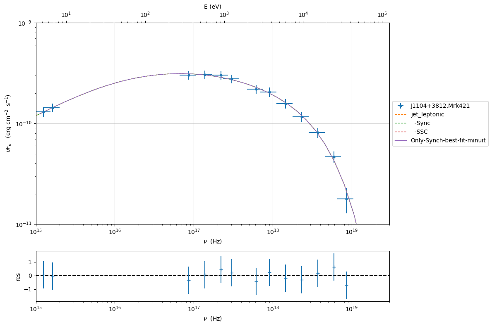
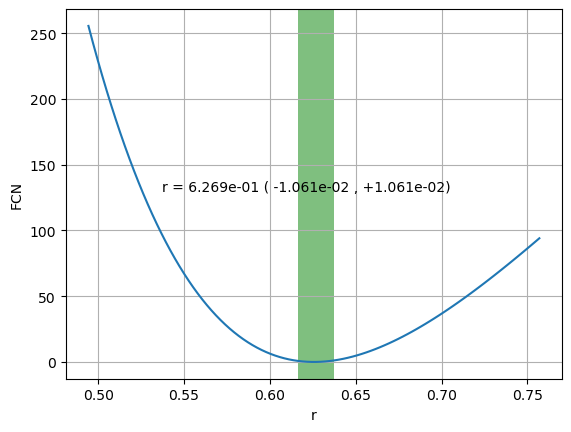
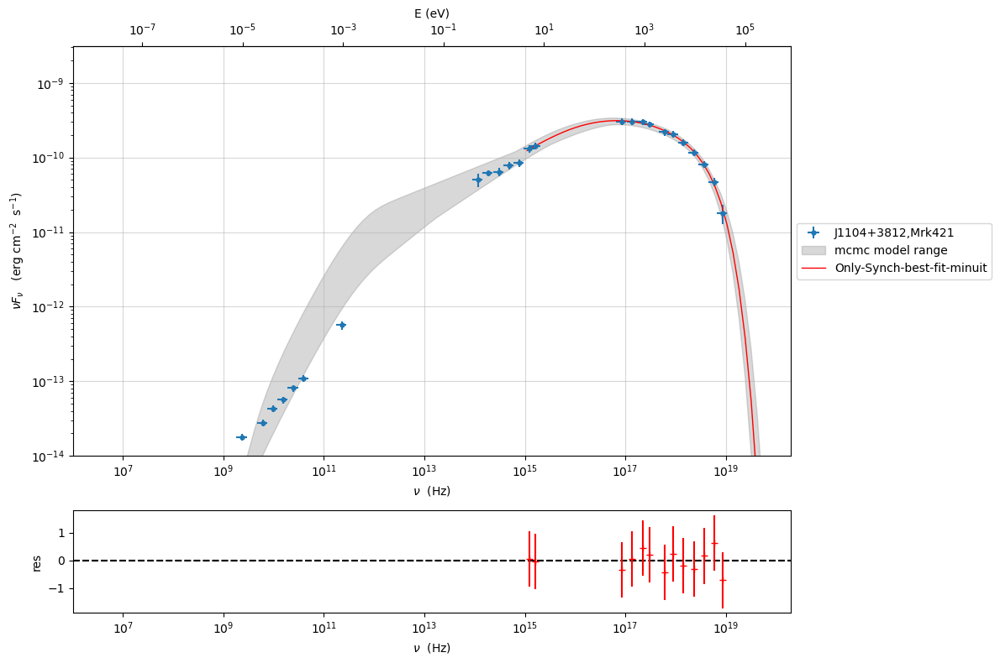
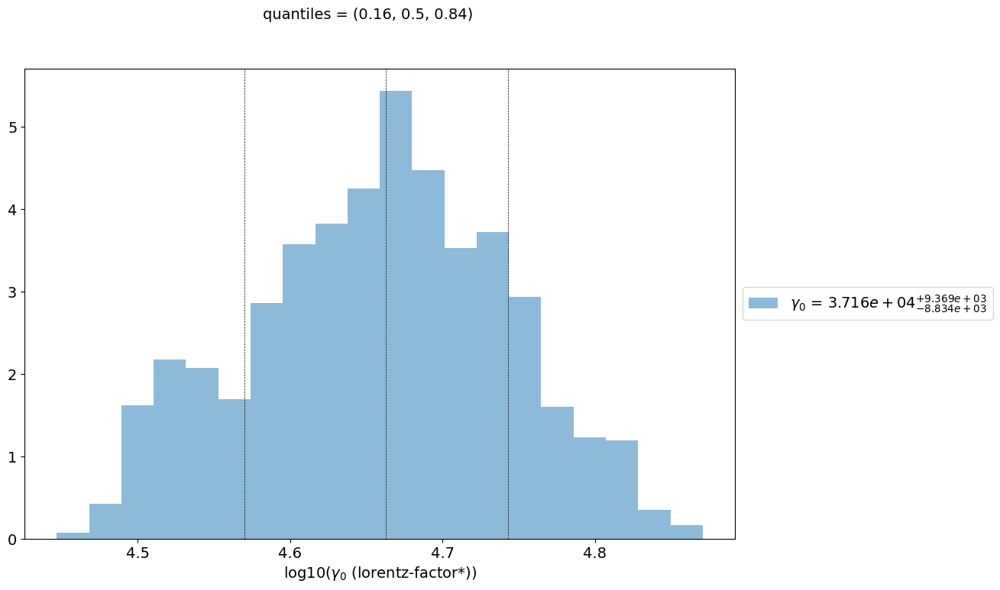
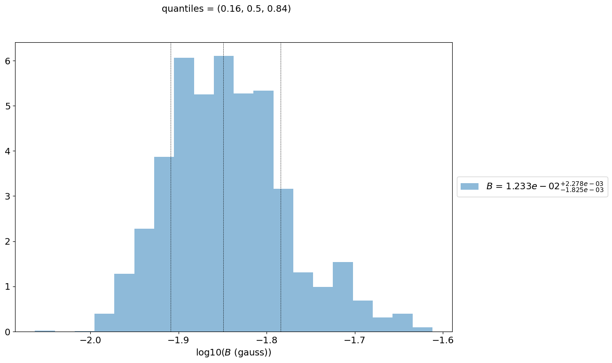
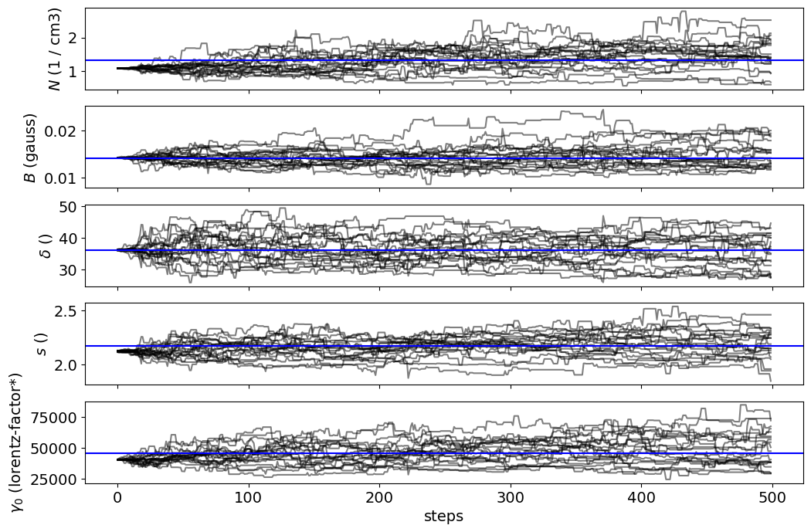

.. _model_fitting_3:

Model fitting 4: Only Synchrotron
=================================

.. code:: ipython3

    import warnings
    warnings.filterwarnings('ignore')
    
    import matplotlib.pylab as plt
    import jetset
    from jetset.test_data_helper import  test_SEDs
    from jetset.data_loader import ObsData,Data
    from jetset.plot_sedfit import PlotSED
    from jetset.test_data_helper import  test_SEDs

.. code:: ipython3

    print(jetset.__version__)

.. parsed-literal::

    1.3.0rc7

.. code:: ipython3

    test_SEDs

.. parsed-literal::

    ['/Users/orion/miniforge3/envs/jetset/lib/python3.10/site-packages/jetset/test_data/SEDs_data/SED_3C345.ecsv',
     '/Users/orion/miniforge3/envs/jetset/lib/python3.10/site-packages/jetset/test_data/SEDs_data/SED_MW_Mrk421_EBL_DEABS.ecsv',
     '/Users/orion/miniforge3/envs/jetset/lib/python3.10/site-packages/jetset/test_data/SEDs_data/SED_MW_Mrk501_EBL_ABS.ecsv',
     '/Users/orion/miniforge3/envs/jetset/lib/python3.10/site-packages/jetset/test_data/SEDs_data/SED_MW_Mrk501_EBL_DEABS.ecsv']

Loading data
------------

see the :ref:`data_format` user guide for further information about loading data 

.. code:: ipython3

    print(test_SEDs[1])
    data=Data.from_file(test_SEDs[1])

.. parsed-literal::

    /Users/orion/miniforge3/envs/jetset/lib/python3.10/site-packages/jetset/test_data/SEDs_data/SED_MW_Mrk421_EBL_DEABS.ecsv

.. code:: ipython3

    %matplotlib inline
    sed_data=ObsData(data_table=data)
    sed_data.group_data(bin_width=0.2)
    
    sed_data.add_systematics(0.1,[10.**6,10.**29])
    p=sed_data.plot_sed()

.. parsed-literal::

    ================================================================================
    
    ***  binning data  ***
    ---> N bins= 89
    ---> bin_widht= 0.2
    msk [False  True False  True  True  True  True  True False False False  True
     False False False False False False False False False False False False
      True  True  True  True  True  True  True False False False False False
     False False  True  True  True  True  True  True  True  True  True  True
      True False False False False False False False False False False False
     False False False False False False  True False  True False  True False
      True  True False  True False  True False  True  True  True  True  True
      True  True  True  True False]
    ================================================================================
    

.. image:: Jet_example_only_synchrotron_files/Jet_example_only_synchrotron_8_1.png

.. code:: ipython3

    sed_data.save('Mrk_401.pkl')

Phenomenological model constraining
-----------------------------------

see the :ref:`phenom_constr` user guide for further information about loading data 

Spectral indices
~~~~~~~~~~~~~~~~

.. code:: ipython3

    from jetset.sed_shaper import  SEDShape
    my_shape=SEDShape(sed_data)
    my_shape.eval_indices(silent=True)
    p=my_shape.plot_indices()
    p.setlim(y_min=1E-15,y_max=1E-6)

.. parsed-literal::

    ================================================================================
    
    *** evaluating spectral indices for data ***
    ================================================================================
    

.. image:: Jet_example_only_synchrotron_files/Jet_example_only_synchrotron_13_1.png

Sed shaper
~~~~~~~~~~

.. code:: ipython3

    mm,best_fit=my_shape.sync_fit(check_host_gal_template=False,
                      Ep_start=None,
                      minimizer='lsb',
                      silent=True,
                      fit_range=[10., 21.])

.. parsed-literal::

    ================================================================================
    
    *** Log-Polynomial fitting of the synchrotron component ***
    ---> first blind fit run,  fit range: [10.0, 21.0]
    ---> class:  HSP
    
    
    

.. raw:: html

    <i>Table length=4</i>
    <table id="table5577330400-578265" class="table-striped table-bordered table-condensed">
    <thead><tr><th>model name</th><th>name</th><th>val</th><th>bestfit val</th><th>err +</th><th>err -</th><th>start val</th><th>fit range min</th><th>fit range max</th><th>frozen</th></tr></thead>
    <tr><td>LogCubic</td><td>b</td><td>-1.585748e-01</td><td>-1.585748e-01</td><td>6.470535e-03</td><td>--</td><td>-1.000000e+00</td><td>-1.000000e+01</td><td>0.000000e+00</td><td>False</td></tr>
    <tr><td>LogCubic</td><td>c</td><td>-1.089513e-02</td><td>-1.089513e-02</td><td>9.764985e-04</td><td>--</td><td>-1.000000e+00</td><td>-1.000000e+01</td><td>1.000000e+01</td><td>False</td></tr>
    <tr><td>LogCubic</td><td>Ep</td><td>1.673177e+01</td><td>1.673177e+01</td><td>2.478677e-02</td><td>--</td><td>1.667298e+01</td><td>0.000000e+00</td><td>3.000000e+01</td><td>False</td></tr>
    <tr><td>LogCubic</td><td>Sp</td><td>-9.489417e+00</td><td>-9.489417e+00</td><td>1.853260e-02</td><td>--</td><td>-1.000000e+01</td><td>-3.000000e+01</td><td>0.000000e+00</td><td>False</td></tr>
    </table>
    

.. parsed-literal::

    ---> sync       nu_p=+1.673177e+01 (err=+2.478677e-02)  nuFnu_p=-9.489417e+00 (err=+1.853260e-02) curv.=-1.585748e-01 (err=+6.470535e-03)
    ================================================================================
    

.. code:: ipython3

    my_shape.IC_fit(fit_range=[23., 29.],minimizer='minuit',silent=True)
    p=my_shape.plot_shape_fit()
    p.setlim(y_min=1E-15)

.. parsed-literal::

    ================================================================================
    
    *** Log-Polynomial fitting of the IC component ***
    ---> fit range: [23.0, 29.0]
    ---> LogCubic fit
    ====> simplex
    ====> migrad
    ====> simplex
    ====> migrad
    ====> simplex
    ====> migrad
    
    

.. raw:: html

    <i>Table length=4</i>
    <table id="table5579977728-719338" class="table-striped table-bordered table-condensed">
    <thead><tr><th>model name</th><th>name</th><th>val</th><th>bestfit val</th><th>err +</th><th>err -</th><th>start val</th><th>fit range min</th><th>fit range max</th><th>frozen</th></tr></thead>
    <tr><td>LogCubic</td><td>b</td><td>-1.971111e-01</td><td>-1.971111e-01</td><td>2.679732e-02</td><td>--</td><td>-1.000000e+00</td><td>-1.000000e+01</td><td>0.000000e+00</td><td>False</td></tr>
    <tr><td>LogCubic</td><td>c</td><td>-4.037544e-02</td><td>-4.037544e-02</td><td>2.119803e-02</td><td>--</td><td>-1.000000e+00</td><td>-1.000000e+01</td><td>1.000000e+01</td><td>False</td></tr>
    <tr><td>LogCubic</td><td>Ep</td><td>2.521789e+01</td><td>2.521789e+01</td><td>1.198160e-01</td><td>--</td><td>2.529262e+01</td><td>0.000000e+00</td><td>3.000000e+01</td><td>False</td></tr>
    <tr><td>LogCubic</td><td>Sp</td><td>-1.012535e+01</td><td>-1.012535e+01</td><td>2.996508e-02</td><td>--</td><td>-1.000000e+01</td><td>-3.000000e+01</td><td>0.000000e+00</td><td>False</td></tr>
    </table>
    

.. parsed-literal::

    ---> IC         nu_p=+2.521789e+01 (err=+1.198160e-01)  nuFnu_p=-1.012535e+01 (err=+2.996508e-02) curv.=-1.971111e-01 (err=+2.679732e-02)
    ================================================================================
    

.. image:: Jet_example_only_synchrotron_files/Jet_example_only_synchrotron_16_3.png

Model constraining
~~~~~~~~~~~~~~~~~~

.. code:: ipython3

    from jetset.obs_constrain import ObsConstrain
    from jetset.model_manager import  FitModel
    from jetset.minimizer import fit_SED
    sed_obspar=ObsConstrain(beaming=25,
                            B_range=[0.001,0.1],
                            distr_e='lppl',
                            t_var_sec=3*86400,
                            nu_cut_IR=1E12,
                            SEDShape=my_shape)
    
    
    prefit_jet=sed_obspar.constrain_SSC_model(electron_distribution_log_values=False,silent=True)
    prefit_jet.save_model('prefit_jet.pkl')

.. parsed-literal::

    ================================================================================
    
    ***  constrains parameters from observable ***
    
    ===> setting C threads to 12

.. raw:: html

    <i>Table length=12</i>
    <table id="table5589548672-75611" class="table-striped table-bordered table-condensed">
    <thead><tr><th>model name</th><th>name</th><th>par type</th><th>units</th><th>val</th><th>phys. bound. min</th><th>phys. bound. max</th><th>log</th><th>frozen</th></tr></thead>
    <tr><td>jet_leptonic</td><td>R</td><td>region_size</td><td>cm</td><td>3.460321e+16</td><td>1.000000e+03</td><td>1.000000e+30</td><td>False</td><td>False</td></tr>
    <tr><td>jet_leptonic</td><td>R_H</td><td>region_position</td><td>cm</td><td>1.000000e+17</td><td>0.000000e+00</td><td>--</td><td>False</td><td>True</td></tr>
    <tr><td>jet_leptonic</td><td>B</td><td>magnetic_field</td><td>gauss</td><td>5.050000e-02</td><td>0.000000e+00</td><td>--</td><td>False</td><td>False</td></tr>
    <tr><td>jet_leptonic</td><td>NH_cold_to_rel_e</td><td>cold_p_to_rel_e_ratio</td><td></td><td>1.000000e+00</td><td>0.000000e+00</td><td>--</td><td>False</td><td>True</td></tr>
    <tr><td>jet_leptonic</td><td>beam_obj</td><td>beaming</td><td></td><td>2.500000e+01</td><td>1.000000e-04</td><td>--</td><td>False</td><td>False</td></tr>
    <tr><td>jet_leptonic</td><td>z_cosm</td><td>redshift</td><td></td><td>3.080000e-02</td><td>0.000000e+00</td><td>--</td><td>False</td><td>False</td></tr>
    <tr><td>jet_leptonic</td><td>gmin</td><td>low-energy-cut-off</td><td>lorentz-factor*</td><td>4.697542e+02</td><td>1.000000e+00</td><td>1.000000e+09</td><td>False</td><td>False</td></tr>
    <tr><td>jet_leptonic</td><td>gmax</td><td>high-energy-cut-off</td><td>lorentz-factor*</td><td>1.373160e+06</td><td>1.000000e+00</td><td>1.000000e+15</td><td>False</td><td>False</td></tr>
    <tr><td>jet_leptonic</td><td>N</td><td>emitters_density</td><td>1 / cm3</td><td>6.545152e-01</td><td>0.000000e+00</td><td>--</td><td>False</td><td>False</td></tr>
    <tr><td>jet_leptonic</td><td>gamma0_log_parab</td><td>turn-over-energy</td><td>lorentz-factor*</td><td>3.333017e+04</td><td>1.000000e+00</td><td>1.000000e+09</td><td>False</td><td>False</td></tr>
    <tr><td>jet_leptonic</td><td>s</td><td>LE_spectral_slope</td><td></td><td>2.183468e+00</td><td>-1.000000e+01</td><td>1.000000e+01</td><td>False</td><td>False</td></tr>
    <tr><td>jet_leptonic</td><td>r</td><td>spectral_curvature</td><td></td><td>7.928739e-01</td><td>-1.500000e+01</td><td>1.500000e+01</td><td>False</td><td>False</td></tr>
    </table>
    

.. parsed-literal::

    
    ================================================================================
    

.. code:: ipython3

    pl=prefit_jet.plot_model(sed_data=sed_data)
    pl.add_residual_plot(prefit_jet,sed_data)
    pl.setlim(y_min=1E-15,x_min=1E7,x_max=1E29)

.. image:: Jet_example_only_synchrotron_files/Jet_example_only_synchrotron_19_0.png

Model fitting only Synchorotron component
-----------------------------------------

.. note::
    Please, read the introduction and the caveat :ref:`for the frequentist model fitting <frequentist_model_fitting>` to understand the frequentist fitting workflow
    see the :ref:`composite_models` user guide for further information about the implementation of :class:`.FitModel`, in particular for parameter setting

Model fitting with Minuit
~~~~~~~~~~~~~~~~~~~~~~~~~

.. code:: ipython3

    from jetset.jet_model import Jet
    jet_minuit=Jet.load_model('prefit_jet.pkl')
    jet_minuit.set_gamma_grid_size(200)

.. parsed-literal::

    ===> setting C threads to 12

we switch off the IC component

.. code:: ipython3

    
    jet_minuit.spectral_components.SSC.state='off'
    jet_minuit.show_model()

.. parsed-literal::

    
    --------------------------------------------------------------------------------
    model description: 
    --------------------------------------------------------------------------------
    type: Jet
    name: jet_leptonic  
    geometry: spherical  
    
    electrons distribution:
     type: lppl  
     gamma energy grid size:  201
     gmin grid : 4.697542e+02
     gmax grid : 1.373160e+06
     normalization:  True
     log-values:  False
     ratio of cold protons to relativistic electrons: 1.000000e+00
    
    radiative fields:
     seed photons grid size:  100
     IC emission grid size:  100
     source emissivity lower bound :  1.000000e-120
     spectral components:
       name:Sum, state: on
       name:Sum, hidden: False
       name:Sync, state: self-abs
       name:Sync, hidden: False
       name:SSC, state: off
       name:SSC, hidden: False
    external fields transformation method: blob
    
    SED info:
     nu grid size jetkernel: 1000
     nu size: 500
     nu mix (Hz): 1.000000e+06
     nu max (Hz): 1.000000e+30
    
    flux plot lower bound   :  1.000000e-30
    
    --------------------------------------------------------------------------------

.. raw:: html

    <i>Table length=12</i>
    <table id="table4473374944-78733" class="table-striped table-bordered table-condensed">
    <thead><tr><th>model name</th><th>name</th><th>par type</th><th>units</th><th>val</th><th>phys. bound. min</th><th>phys. bound. max</th><th>log</th><th>frozen</th></tr></thead>
    <tr><td>jet_leptonic</td><td>gmin</td><td>low-energy-cut-off</td><td>lorentz-factor*</td><td>4.697542e+02</td><td>1.000000e+00</td><td>1.000000e+09</td><td>False</td><td>False</td></tr>
    <tr><td>jet_leptonic</td><td>gmax</td><td>high-energy-cut-off</td><td>lorentz-factor*</td><td>1.373160e+06</td><td>1.000000e+00</td><td>1.000000e+15</td><td>False</td><td>False</td></tr>
    <tr><td>jet_leptonic</td><td>N</td><td>emitters_density</td><td>1 / cm3</td><td>6.545152e-01</td><td>0.000000e+00</td><td>--</td><td>False</td><td>False</td></tr>
    <tr><td>jet_leptonic</td><td>gamma0_log_parab</td><td>turn-over-energy</td><td>lorentz-factor*</td><td>3.333017e+04</td><td>1.000000e+00</td><td>1.000000e+09</td><td>False</td><td>False</td></tr>
    <tr><td>jet_leptonic</td><td>s</td><td>LE_spectral_slope</td><td></td><td>2.183468e+00</td><td>-1.000000e+01</td><td>1.000000e+01</td><td>False</td><td>False</td></tr>
    <tr><td>jet_leptonic</td><td>r</td><td>spectral_curvature</td><td></td><td>7.928739e-01</td><td>-1.500000e+01</td><td>1.500000e+01</td><td>False</td><td>False</td></tr>
    <tr><td>jet_leptonic</td><td>R</td><td>region_size</td><td>cm</td><td>3.460321e+16</td><td>1.000000e+03</td><td>1.000000e+30</td><td>False</td><td>False</td></tr>
    <tr><td>jet_leptonic</td><td>R_H</td><td>region_position</td><td>cm</td><td>1.000000e+17</td><td>0.000000e+00</td><td>--</td><td>False</td><td>True</td></tr>
    <tr><td>jet_leptonic</td><td>B</td><td>magnetic_field</td><td>gauss</td><td>5.050000e-02</td><td>0.000000e+00</td><td>--</td><td>False</td><td>False</td></tr>
    <tr><td>jet_leptonic</td><td>NH_cold_to_rel_e</td><td>cold_p_to_rel_e_ratio</td><td></td><td>1.000000e+00</td><td>0.000000e+00</td><td>--</td><td>False</td><td>True</td></tr>
    <tr><td>jet_leptonic</td><td>beam_obj</td><td>beaming</td><td></td><td>2.500000e+01</td><td>1.000000e-04</td><td>--</td><td>False</td><td>False</td></tr>
    <tr><td>jet_leptonic</td><td>z_cosm</td><td>redshift</td><td></td><td>3.080000e-02</td><td>0.000000e+00</td><td>--</td><td>False</td><td>False</td></tr>
    </table>
    

.. parsed-literal::

    --------------------------------------------------------------------------------

.. code:: ipython3

    fit_model_minuit=FitModel( jet=jet_minuit, name='Only-Synch-best-fit-minuit') 
    
    fit_model_minuit.freeze('jet_leptonic','z_cosm')
    fit_model_minuit.freeze('jet_leptonic','R_H')
    fit_model_minuit.freeze('jet_leptonic','R')
    fit_model_minuit.freeze('jet_leptonic','gmax')
    fit_model_minuit.jet_leptonic.parameters.R.fit_range=[10**15.5, 10**17.5]
    fit_model_minuit.jet_leptonic.parameters.beam_obj.fit_range=[5., 50.]

.. code:: ipython3

    from jetset.minimizer import fit_SED,ModelMinimizer
    
    model_minimizer_minuit=ModelMinimizer('minuit')
    best_fit_minuit=model_minimizer_minuit.fit(fit_model_minuit,sed_data,10.0**15,10**20.0,fitname='SSC-best-fit-minuit',repeat=3)

.. parsed-literal::

    filtering data in fit range = [1.000000e+15,1.000000e+20]
    data length 13
    ================================================================================
    
    *** start fit process ***
    ----- 
    fit run: 0

.. parsed-literal::

    0it [00:00, ?it/s]

.. parsed-literal::

    ====> simplex
    ====> migrad
    - best chisq=1.66861e+00
    
    fit run: 1
    - old chisq=1.66861e+00

.. parsed-literal::

    0it [00:00, ?it/s]

.. parsed-literal::

    ====> simplex
    ====> migrad
    - best chisq=1.66861e+00
    
    fit run: 2
    - old chisq=1.66861e+00

.. parsed-literal::

    0it [00:00, ?it/s]

.. parsed-literal::

    ====> simplex
    ====> migrad
    - best chisq=1.66860e+00
    
    -------------------------------------------------------------------------
    Fit report
    
    Model: SSC-best-fit-minuit

.. raw:: html

    <i>Table length=12</i>
    <table id="table4473374944-426683" class="table-striped table-bordered table-condensed">
    <thead><tr><th>model name</th><th>name</th><th>par type</th><th>units</th><th>val</th><th>phys. bound. min</th><th>phys. bound. max</th><th>log</th><th>frozen</th></tr></thead>
    <tr><td>jet_leptonic</td><td>gmin</td><td>low-energy-cut-off</td><td>lorentz-factor*</td><td>4.226997e+02</td><td>1.000000e+00</td><td>1.000000e+09</td><td>False</td><td>False</td></tr>
    <tr><td>jet_leptonic</td><td>gmax</td><td>high-energy-cut-off</td><td>lorentz-factor*</td><td>1.373160e+06</td><td>1.000000e+00</td><td>1.000000e+15</td><td>False</td><td>True</td></tr>
    <tr><td>jet_leptonic</td><td>N</td><td>emitters_density</td><td>1 / cm3</td><td>1.083644e+00</td><td>0.000000e+00</td><td>--</td><td>False</td><td>False</td></tr>
    <tr><td>jet_leptonic</td><td>gamma0_log_parab</td><td>turn-over-energy</td><td>lorentz-factor*</td><td>4.047533e+04</td><td>1.000000e+00</td><td>1.000000e+09</td><td>False</td><td>False</td></tr>
    <tr><td>jet_leptonic</td><td>s</td><td>LE_spectral_slope</td><td></td><td>2.121360e+00</td><td>-1.000000e+01</td><td>1.000000e+01</td><td>False</td><td>False</td></tr>
    <tr><td>jet_leptonic</td><td>r</td><td>spectral_curvature</td><td></td><td>6.256219e-01</td><td>-1.500000e+01</td><td>1.500000e+01</td><td>False</td><td>False</td></tr>
    <tr><td>jet_leptonic</td><td>R</td><td>region_size</td><td>cm</td><td>3.460321e+16</td><td>1.000000e+03</td><td>1.000000e+30</td><td>False</td><td>True</td></tr>
    <tr><td>jet_leptonic</td><td>R_H</td><td>region_position</td><td>cm</td><td>1.000000e+17</td><td>0.000000e+00</td><td>--</td><td>False</td><td>True</td></tr>
    <tr><td>jet_leptonic</td><td>B</td><td>magnetic_field</td><td>gauss</td><td>1.422387e-02</td><td>0.000000e+00</td><td>--</td><td>False</td><td>False</td></tr>
    <tr><td>jet_leptonic</td><td>NH_cold_to_rel_e</td><td>cold_p_to_rel_e_ratio</td><td></td><td>1.000000e+00</td><td>0.000000e+00</td><td>--</td><td>False</td><td>True</td></tr>
    <tr><td>jet_leptonic</td><td>beam_obj</td><td>beaming</td><td></td><td>3.627168e+01</td><td>1.000000e-04</td><td>--</td><td>False</td><td>False</td></tr>
    <tr><td>jet_leptonic</td><td>z_cosm</td><td>redshift</td><td></td><td>3.080000e-02</td><td>0.000000e+00</td><td>--</td><td>False</td><td>True</td></tr>
    </table>
    

.. parsed-literal::

    
    converged=True
    calls=165
    mesg=

.. raw:: html

    <table>
        <tr>
            <th colspan="5" style="text-align:center" title="Minimizer"> Migrad </th>
        </tr>
        <tr>
            <td colspan="2" style="text-align:left" title="Minimum value of function"> FCN = 1.669 </td>
            <td colspan="3" style="text-align:center" title="Total number of function and (optional) gradient evaluations"> Nfcn = 165 </td>
        </tr>
        <tr>
            <td colspan="2" style="text-align:left" title="Estimated distance to minimum and goal"> EDM = 3.3e-05 (Goal: 0.0002) </td>
            <td colspan="3" style="text-align:center" title="Total run time of algorithms"> time = 2.0 sec </td>
        </tr>
        <tr>
            <td colspan="2" style="text-align:center;background-color:#92CCA6;color:black"> Valid Minimum </td>
            <td colspan="3" style="text-align:center;background-color:#92CCA6;color:black"> No Parameters at limit </td>
        </tr>
        <tr>
            <td colspan="2" style="text-align:center;background-color:#92CCA6;color:black"> Below EDM threshold (goal x 10) </td>
            <td colspan="3" style="text-align:center;background-color:#92CCA6;color:black"> Below call limit </td>
        </tr>
        <tr>
            <td style="text-align:center;background-color:#92CCA6;color:black"> Covariance </td>
            <td style="text-align:center;background-color:#92CCA6;color:black"> Hesse ok </td>
            <td style="text-align:center;background-color:#FFF79A;color:black" title="Is covariance matrix accurate?"> APPROXIMATE </td>
            <td style="text-align:center;background-color:#c15ef7;color:black" title="Is covariance matrix positive definite?"> NOT pos. def. </td>
            <td style="text-align:center;background-color:#c15ef7;color:black" title="Was positive definiteness enforced by Minuit?"> FORCED </td>
        </tr>
    </table><table>
        <tr>
            <td></td>
            <th title="Variable name"> Name </th>
            <th title="Value of parameter"> Value </th>
            <th title="Hesse error"> Hesse Error </th>
            <th title="Minos lower error"> Minos Error- </th>
            <th title="Minos upper error"> Minos Error+ </th>
            <th title="Lower limit of the parameter"> Limit- </th>
            <th title="Upper limit of the parameter"> Limit+ </th>
            <th title="Is the parameter fixed in the fit"> Fixed </th>
        </tr>
        <tr>
            <th> 0 </th>
            <td> par_0 </td>
            <td> 0.42e3 </td>
            <td> 0.11e3 </td>
            <td>  </td>
            <td>  </td>
            <td> 1 </td>
            <td> 1E+09 </td>
            <td>  </td>
        </tr>
        <tr>
            <th> 1 </th>
            <td> par_1 </td>
            <td> 1.08 </td>
            <td> 0.30 </td>
            <td>  </td>
            <td>  </td>
            <td> 0 </td>
            <td>  </td>
            <td>  </td>
        </tr>
        <tr>
            <th> 2 </th>
            <td> par_2 </td>
            <td> 40e3 </td>
            <td> 7e3 </td>
            <td>  </td>
            <td>  </td>
            <td> 1 </td>
            <td> 1E+09 </td>
            <td>  </td>
        </tr>
        <tr>
            <th> 3 </th>
            <td> par_3 </td>
            <td> 2.12 </td>
            <td> 0.05 </td>
            <td>  </td>
            <td>  </td>
            <td> -10 </td>
            <td> 10 </td>
            <td>  </td>
        </tr>
        <tr>
            <th> 4 </th>
            <td> par_4 </td>
            <td> 0.63 </td>
            <td> 0.07 </td>
            <td>  </td>
            <td>  </td>
            <td> -15 </td>
            <td> 15 </td>
            <td>  </td>
        </tr>
        <tr>
            <th> 5 </th>
            <td> par_5 </td>
            <td> 0.0142 </td>
            <td> 0.0014 </td>
            <td>  </td>
            <td>  </td>
            <td> 0 </td>
            <td>  </td>
            <td>  </td>
        </tr>
        <tr>
            <th> 6 </th>
            <td> par_6 </td>
            <td> 36.3 </td>
            <td> 2.4 </td>
            <td>  </td>
            <td>  </td>
            <td> 5 </td>
            <td> 50 </td>
            <td>  </td>
        </tr>
    </table>

.. parsed-literal::

    dof=6
    chisq=1.668605, chisq/red=0.278101 null hypothesis sig=0.947519
    
    best fit pars

.. raw:: html

    <i>Table length=12</i>
    <table id="table5596513232-566396" class="table-striped table-bordered table-condensed">
    <thead><tr><th>model name</th><th>name</th><th>val</th><th>bestfit val</th><th>err +</th><th>err -</th><th>start val</th><th>fit range min</th><th>fit range max</th><th>frozen</th></tr></thead>
    <tr><td>jet_leptonic</td><td>gmin</td><td>4.226997e+02</td><td>4.226997e+02</td><td>1.139513e+02</td><td>--</td><td>4.697542e+02</td><td>1.000000e+00</td><td>1.000000e+09</td><td>False</td></tr>
    <tr><td>jet_leptonic</td><td>gmax</td><td>1.373160e+06</td><td>--</td><td>--</td><td>--</td><td>1.373160e+06</td><td>1.000000e+00</td><td>1.000000e+15</td><td>True</td></tr>
    <tr><td>jet_leptonic</td><td>N</td><td>1.083644e+00</td><td>1.083644e+00</td><td>3.031713e-01</td><td>--</td><td>6.545152e-01</td><td>0.000000e+00</td><td>--</td><td>False</td></tr>
    <tr><td>jet_leptonic</td><td>gamma0_log_parab</td><td>4.047533e+04</td><td>4.047533e+04</td><td>6.973433e+03</td><td>--</td><td>3.333017e+04</td><td>1.000000e+00</td><td>1.000000e+09</td><td>False</td></tr>
    <tr><td>jet_leptonic</td><td>s</td><td>2.121360e+00</td><td>2.121360e+00</td><td>4.939483e-02</td><td>--</td><td>2.183468e+00</td><td>-1.000000e+01</td><td>1.000000e+01</td><td>False</td></tr>
    <tr><td>jet_leptonic</td><td>r</td><td>6.256219e-01</td><td>6.256219e-01</td><td>6.567015e-02</td><td>--</td><td>7.928739e-01</td><td>-1.500000e+01</td><td>1.500000e+01</td><td>False</td></tr>
    <tr><td>jet_leptonic</td><td>R</td><td>3.460321e+16</td><td>--</td><td>--</td><td>--</td><td>3.460321e+16</td><td>3.162278e+15</td><td>3.162278e+17</td><td>True</td></tr>
    <tr><td>jet_leptonic</td><td>R_H</td><td>1.000000e+17</td><td>--</td><td>--</td><td>--</td><td>1.000000e+17</td><td>0.000000e+00</td><td>--</td><td>True</td></tr>
    <tr><td>jet_leptonic</td><td>B</td><td>1.422387e-02</td><td>1.422387e-02</td><td>1.433089e-03</td><td>--</td><td>5.050000e-02</td><td>0.000000e+00</td><td>--</td><td>False</td></tr>
    <tr><td>jet_leptonic</td><td>NH_cold_to_rel_e</td><td>1.000000e+00</td><td>--</td><td>--</td><td>--</td><td>1.000000e+00</td><td>0.000000e+00</td><td>--</td><td>True</td></tr>
    <tr><td>jet_leptonic</td><td>beam_obj</td><td>3.627168e+01</td><td>3.627168e+01</td><td>2.427675e+00</td><td>--</td><td>2.500000e+01</td><td>5.000000e+00</td><td>5.000000e+01</td><td>False</td></tr>
    <tr><td>jet_leptonic</td><td>z_cosm</td><td>3.080000e-02</td><td>--</td><td>--</td><td>--</td><td>3.080000e-02</td><td>0.000000e+00</td><td>--</td><td>True</td></tr>
    </table>
    

.. parsed-literal::

    -------------------------------------------------------------------------
    
    ================================================================================
    

.. code:: ipython3

    %matplotlib inline
    fit_model_minuit.set_nu_grid(1E6,1E30,200)
    fit_model_minuit.eval()
    p2=fit_model_minuit.plot_model(sed_data=sed_data)
    p2.setlim(y_min=1E-11,x_min=1E15,y_max=1E-9,x_max=3E19)

.. code:: ipython3

    try:
        c=model_minimizer_minuit.minimizer.draw_contour('r','s')
    except:
        pass

.. code:: ipython3

    m=model_minimizer_minuit.minimizer.draw_profile('r')

.. code:: ipython3

    best_fit_minuit.save_report('SSC-best-fit-minuit.pkl')
    model_minimizer_minuit.save_model('model_minimizer_minuit.pkl')
    fit_model_minuit.save_model('fit_model_minuit.pkl')

MCMC sampling
-------------

.. note::
    Please, read the introduction and the caveat :ref:`for the Bayesian model fitting <bayesian_model_fitting>` to understand the MCMC sampler workflow.

.. code:: ipython3

    from jetset.mcmc import McmcSampler
    from jetset.minimizer import ModelMinimizer

.. code:: ipython3

    model_minimizer_minuit = ModelMinimizer.load_model('model_minimizer_minuit.pkl')
    mcmc=McmcSampler(model_minimizer_minuit)

.. parsed-literal::

    ===> setting C threads to 12

.. code:: ipython3

    labels=['N','B','beam_obj','s','gamma0_log_parab']
    model_name='jet_leptonic'
    use_labels_dict={model_name:labels}
    
    mcmc.set_labels(use_labels_dict=use_labels_dict)

.. code:: ipython3

    mcmc.set_bounds(bound=5.0,bound_rel=True)

.. parsed-literal::

    par: N  best fit value:  1.08364419186145  mcmc bounds: [0, 6.501865151168699]
    par: B  best fit value:  0.014223870997614777  mcmc bounds: [0, 0.08534322598568866]
    par: beam_obj  best fit value:  36.271677271204155  mcmc bounds: [5.0, 50.0]
    par: s  best fit value:  2.1213601289476283  mcmc bounds: [-8.485440515790513, 10]
    par: gamma0_log_parab  best fit value:  40475.33090501091  mcmc bounds: [1, 242851.98543006548]

.. code:: ipython3

    mcmc.run_sampler(nwalkers=20, burnin=50,steps=500,progress='notebook')

.. parsed-literal::

    ===> setting C threads to 12
    mcmc run starting
    

.. parsed-literal::

      0%|          | 0/500 [00:00<?, ?it/s]

.. parsed-literal::

    mcmc run done, with 1 threads took 227.12 seconds

.. code:: ipython3

    print(mcmc.acceptance_fraction)

.. parsed-literal::

    0.3519

.. code:: ipython3

    p=mcmc.plot_model(sed_data=sed_data,fit_range=[1E15, 1E20],size=100)
    p.setlim(y_min=1E-14,x_min=1E6,x_max=2E20)

.. code:: ipython3

    p=mcmc.plot_model(sed_data=sed_data,fit_range=[1E15, 1E20],size=100,quantiles=[0.05,0.95])
    p.setlim(y_min=1E-14,x_min=1E6,x_max=2E20)

.. image:: Jet_example_only_synchrotron_files/Jet_example_only_synchrotron_41_0.png

.. code:: ipython3

    mcmc.labels

.. parsed-literal::

    ['N', 'B', 'beam_obj', 's', 'gamma0_log_parab']

To have a better rendering on the scatter plot, we redefine the plot
labels

.. code:: ipython3

    mcmc.set_plot_label('N',r'$N$')
    mcmc.set_plot_label('B',r'$B$')
    mcmc.set_plot_label('beam_obj',r'$\delta$')
    mcmc.set_plot_label('s',r'$s$')
    mcmc.set_plot_label('gamma0_log_parab',r'$\gamma_0$')

the code below lets you tuning the output

1) mpl.rcParams[‘figure.dpi’] if you increase it you get a better
   definition
2) title_fmt=“.2E” this is the format for python, 2 significant digits,
   scientific notation
3) title_kwargs=dict(fontsize=12) you can change the
   fontsizef=mcmc.plot_chain(‘s’,log_plot=False)

.. code:: ipython3

    import matplotlib as mpl
    mpl.rcParams['figure.dpi'] = 80
    f=mcmc.corner_plot(quantiles=(0.16, 0.5, 0.84),title_kwargs=dict(fontsize=12),title_fmt=".2E",use_math_text=True)

.. image:: Jet_example_only_synchrotron_files/Jet_example_only_synchrotron_46_0.png

.. code:: ipython3

    mcmc.get_par('N')

.. parsed-literal::

    (array([1.21353916, 1.15178803, 1.0995533 , ..., 1.9475931 , 0.59723078,
            1.90069347]),
     0)

.. code:: ipython3

    f=mcmc.plot_par('beam_obj')

.. image:: Jet_example_only_synchrotron_files/Jet_example_only_synchrotron_48_0.png

.. code:: ipython3

    f=mcmc.plot_par('gamma0_log_parab',log_plot=True)

.. image:: Jet_example_only_synchrotron_files/Jet_example_only_synchrotron_49_0.png

Save and reuse MCMC
-------------------

.. code:: ipython3

    mcmc.save('mcmc_sampler.pkl')

.. code:: ipython3

    from jetset.mcmc import McmcSampler
    from jetset.data_loader import ObsData
    from jetset.plot_sedfit import PlotSED
    from jetset.test_data_helper import  test_SEDs
    
    sed_data=ObsData.load('Mrk_401.pkl')
    
    ms=McmcSampler.load('mcmc_sampler.pkl')

.. parsed-literal::

    ===> setting C threads to 12
    ===> setting C threads to 12

.. code:: ipython3

    ms.model.name

.. parsed-literal::

    'Only-Synch-best-fit-minuit'

.. code:: ipython3

    p=ms.plot_model(sed_data=sed_data,fit_range=[1E15, 1E20],size=50)
    p.setlim(y_min=1E-14,x_min=1E6,x_max=2E20)

.. image:: Jet_example_only_synchrotron_files/Jet_example_only_synchrotron_54_0.png

.. code:: ipython3

    p=ms.plot_model(sed_data=sed_data,fit_range=[1E15, 1E20],size=100,quantiles=[0.05,0.95])
    p.setlim(y_min=1E-14,x_min=1E6,x_max=2E20)

.. code:: ipython3

    f=ms.plot_par('beam_obj',log_plot=False)

.. image:: Jet_example_only_synchrotron_files/Jet_example_only_synchrotron_56_0.png

.. code:: ipython3

    f=ms.plot_par('B',log_plot=True)

.. code:: ipython3

    f=mcmc.plot_chain(log_plot=False)

.. code:: ipython3

    f=mcmc.corner_plot()

.. image:: Jet_example_only_synchrotron_files/Jet_example_only_synchrotron_59_0.png

