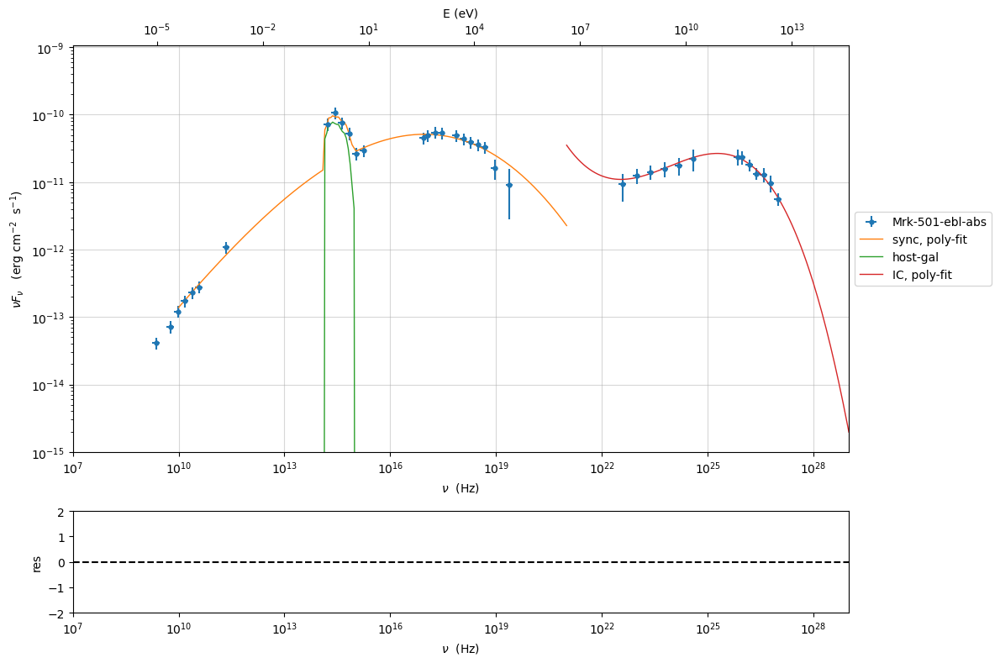
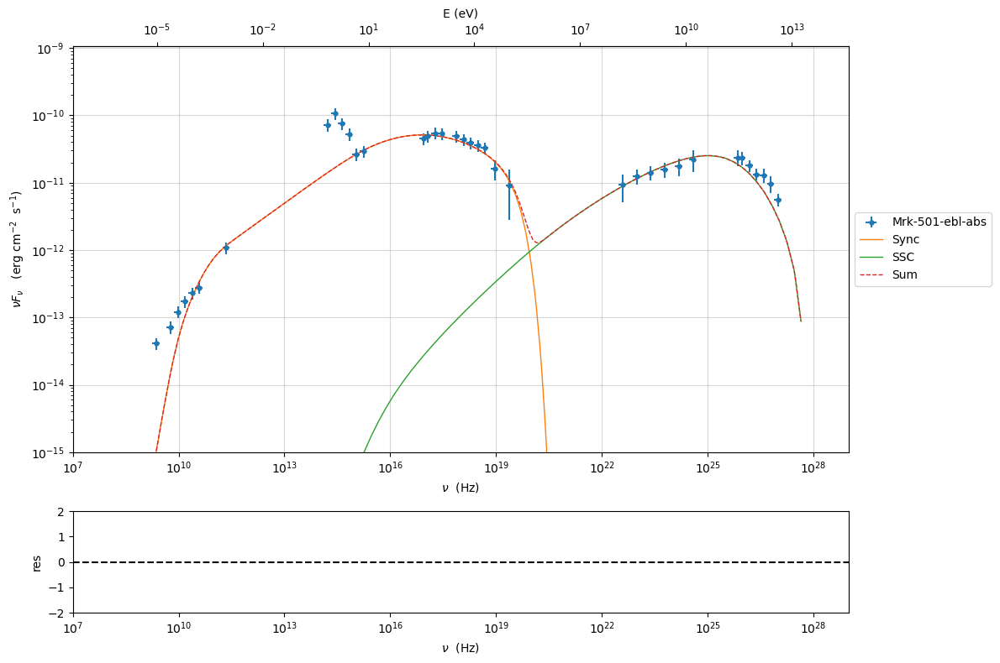

.. _phenom_constr:

Phenomenological model constraining: application
================================================

.. figure:: ../../slides/jetset_slides/jetset_slides.025.png
   :alt: image.png

   image.png

.. code:: ipython3

    import warnings
    warnings.filterwarnings('ignore')
    
    import matplotlib.pylab as plt
    from jetset.test_data_helper import  test_SEDs
    from jetset.data_loader import ObsData,Data
    from jetset.plot_sedfit import PlotSED
    from jetset.test_data_helper import  test_SEDs

.. code:: ipython3

    import jetset
    print('tested on jetset',jetset.__version__)

.. parsed-literal::

    tested on jetset 1.3.0rc7

.. code:: ipython3

    print(test_SEDs[1])
    data=Data.from_file(test_SEDs[2])

.. parsed-literal::

    /Users/orion/miniforge3/envs/jetset/lib/python3.10/site-packages/jetset/test_data/SEDs_data/SED_MW_Mrk421_EBL_DEABS.ecsv

.. code:: ipython3

    %matplotlib inline
    from jetset.cosmo_tools import Cosmo
    c=Cosmo()
    sed_data=ObsData(data_table=data,cosmo=c)
    sed_data.group_data(bin_width=0.2)
    sed_data.add_systematics(0.2,[10.**6,10.**29])

.. parsed-literal::

    ================================================================================
    
    ***  binning data  ***
    ---> N bins= 90
    ---> bin_widht= 0.2
    msk [False  True False  True  True  True  True  True False False False  True
     False False False False False False False False False False False False
     False  True  True  True  True  True  True False False False False False
     False False  True  True  True  True False  True  True  True  True  True
      True False  True False False False False False False False False False
     False False False False False False  True False  True False  True False
      True False  True False  True False False False False False  True  True
      True  True  True  True  True False]
    ================================================================================
    

.. code:: ipython3

    sed_data.save('Mrk_501.pkl')

.. code:: ipython3

    p=sed_data.plot_sed()

.. image:: Jet_example_phenom_constr_files/Jet_example_phenom_constr_8_0.png

.. code:: ipython3

    from jetset.sed_shaper import  SEDShape
    my_shape=SEDShape(sed_data)
    my_shape.eval_indices()
    p=my_shape.plot_indices()
    p.setlim(y_min=1E-15,y_max=1E-6)

.. parsed-literal::

    ================================================================================
    
    *** evaluating spectral indices for data ***
    ================================================================================
    

.. image:: Jet_example_phenom_constr_files/Jet_example_phenom_constr_9_1.png

.. code:: ipython3

    mm,best_fit=my_shape.sync_fit(check_host_gal_template=True,
                      Ep_start=None,
                      minimizer='minuit',
                      silent=True,
                      fit_range=[10,21])
    
    try:
        x,y,z,fig,ax=mm.minimizer.draw_contour('Ep','b')
    except:
        pass
    
    try:
        x,y,fig,ax=mm.minimizer.draw_profile('Ep')
    except:
        pass

.. parsed-literal::

    ================================================================================
    
    *** Log-Polynomial fitting of the synchrotron component ***
    ---> first blind fit run,  fit range: [10, 21]
    ====> simplex
    ====> migrad
    ====> simplex
    ====> migrad
    ====> simplex
    ====> migrad
    ---> class:  HSP
    
    ====> simplex
    ====> migrad
    ====> simplex
    ====> migrad
    ====> simplex
    ====> migrad
    ---> class:  HSP
    
    

.. raw:: html

    <i>Table length=6</i>
    <table id="table5505131056-904222" class="table-striped table-bordered table-condensed">
    <thead><tr><th>model name</th><th>name</th><th>val</th><th>bestfit val</th><th>err +</th><th>err -</th><th>start val</th><th>fit range min</th><th>fit range max</th><th>frozen</th></tr></thead>
    <tr><td>LogCubic</td><td>b</td><td>-7.213716e-02</td><td>-7.213716e-02</td><td>1.339097e-02</td><td>--</td><td>-5.519776e-02</td><td>-1.000000e+01</td><td>0.000000e+00</td><td>False</td></tr>
    <tr><td>LogCubic</td><td>c</td><td>-2.760462e-03</td><td>-2.760462e-03</td><td>2.010488e-03</td><td>--</td><td>4.628271e-03</td><td>-1.000000e+01</td><td>1.000000e+01</td><td>False</td></tr>
    <tr><td>LogCubic</td><td>Ep</td><td>1.696716e+01</td><td>1.696716e+01</td><td>1.472490e-01</td><td>--</td><td>1.591347e+01</td><td>0.000000e+00</td><td>3.000000e+01</td><td>False</td></tr>
    <tr><td>LogCubic</td><td>Sp</td><td>-1.029016e+01</td><td>-1.029016e+01</td><td>3.628120e-02</td><td>--</td><td>-1.019697e+01</td><td>-3.000000e+01</td><td>0.000000e+00</td><td>False</td></tr>
    <tr><td>host_galaxy</td><td>nuFnu_p_host</td><td>-1.009709e+01</td><td>-1.009709e+01</td><td>6.789409e-02</td><td>--</td><td>-1.019697e+01</td><td>-1.219697e+01</td><td>-8.196966e+00</td><td>False</td></tr>
    <tr><td>host_galaxy</td><td>nu_scale</td><td>1.730798e-02</td><td>1.730798e-02</td><td>1.787557e-04</td><td>--</td><td>0.000000e+00</td><td>-5.000000e-01</td><td>5.000000e-01</td><td>False</td></tr>
    </table>
    

.. parsed-literal::

    ---> sync       nu_p=+1.696716e+01 (err=+1.472490e-01)  nuFnu_p=-1.029016e+01 (err=+3.628120e-02) curv.=-7.213716e-02 (err=+1.339097e-02)
    ================================================================================
    

.. image:: Jet_example_phenom_constr_files/Jet_example_phenom_constr_10_3.png

.. code:: ipython3

    help(mm.minimizer.minos_errors)

.. parsed-literal::

    Help on method minos_errors in module jetset.minimizer:
    
    minos_errors(par=None) method of jetset.minimizer.MinuitMinimizer instance
    

.. code:: ipython3

    my_shape.IC_fit(fit_range=[21,29],minimizer='lsb')
    p=my_shape.plot_shape_fit()
    p.setlim(y_min=1E-15,x_min=1E7,x_max=1E29)

.. parsed-literal::

    ================================================================================
    
    *** Log-Polynomial fitting of the IC component ***
    ---> fit range: [21, 29]
    ---> LogCubic fit
    -------------------------------------------------------------------------
    Fit report
    
    Model: IC-shape-fit

.. raw:: html

    <i>Table length=4</i>
    <table id="table5508168912-921020" class="table-striped table-bordered table-condensed">
    <thead><tr><th>model name</th><th>name</th><th>par type</th><th>units</th><th>val</th><th>phys. bound. min</th><th>phys. bound. max</th><th>log</th><th>frozen</th></tr></thead>
    <tr><td>LogCubic</td><td>b</td><td>curvature</td><td></td><td>-1.552140e-01</td><td>-1.000000e+01</td><td>0.000000e+00</td><td>False</td><td>False</td></tr>
    <tr><td>LogCubic</td><td>c</td><td>third-degree</td><td></td><td>-3.792906e-02</td><td>-1.000000e+01</td><td>1.000000e+01</td><td>False</td><td>False</td></tr>
    <tr><td>LogCubic</td><td>Ep</td><td>peak freq</td><td>Hz</td><td>2.526850e+01</td><td>0.000000e+00</td><td>3.000000e+01</td><td>True</td><td>False</td></tr>
    <tr><td>LogCubic</td><td>Sp</td><td>peak flux</td><td>erg / (s cm2)</td><td>-1.057441e+01</td><td>-3.000000e+01</td><td>0.000000e+00</td><td>True</td><td>False</td></tr>
    </table>
    

.. parsed-literal::

    
    converged=True
    calls=261
    mesg=

.. parsed-literal::

    '`ftol` termination condition is satisfied.'

.. parsed-literal::

    dof=9
    chisq=1.362624, chisq/red=0.151403 null hypothesis sig=0.998043
    
    stats without the UL
    dof  UL=9
    chisq=1.362624, chisq/red=0.151403 null hypothesis sig=0.998043
    
    
    best fit pars

.. raw:: html

    <i>Table length=4</i>
    <table id="table5508163152-390376" class="table-striped table-bordered table-condensed">
    <thead><tr><th>model name</th><th>name</th><th>val</th><th>bestfit val</th><th>err +</th><th>err -</th><th>start val</th><th>fit range min</th><th>fit range max</th><th>frozen</th></tr></thead>
    <tr><td>LogCubic</td><td>b</td><td>-1.552140e-01</td><td>-1.552140e-01</td><td>1.002820e-02</td><td>--</td><td>-1.000000e+00</td><td>-1.000000e+01</td><td>0.000000e+00</td><td>False</td></tr>
    <tr><td>LogCubic</td><td>c</td><td>-3.792906e-02</td><td>-3.792906e-02</td><td>4.394177e-03</td><td>--</td><td>-1.000000e+00</td><td>-1.000000e+01</td><td>1.000000e+01</td><td>False</td></tr>
    <tr><td>LogCubic</td><td>Ep</td><td>2.526850e+01</td><td>2.526850e+01</td><td>4.574679e-02</td><td>--</td><td>2.526355e+01</td><td>0.000000e+00</td><td>3.000000e+01</td><td>False</td></tr>
    <tr><td>LogCubic</td><td>Sp</td><td>-1.057441e+01</td><td>-1.057441e+01</td><td>1.597434e-02</td><td>--</td><td>-1.000000e+01</td><td>-3.000000e+01</td><td>0.000000e+00</td><td>False</td></tr>
    </table>
    

.. parsed-literal::

    -------------------------------------------------------------------------
    
    
    

.. raw:: html

    <i>Table length=4</i>
    <table id="table5508168096-790403" class="table-striped table-bordered table-condensed">
    <thead><tr><th>model name</th><th>name</th><th>val</th><th>bestfit val</th><th>err +</th><th>err -</th><th>start val</th><th>fit range min</th><th>fit range max</th><th>frozen</th></tr></thead>
    <tr><td>LogCubic</td><td>b</td><td>-1.552140e-01</td><td>-1.552140e-01</td><td>1.002820e-02</td><td>--</td><td>-1.000000e+00</td><td>-1.000000e+01</td><td>0.000000e+00</td><td>False</td></tr>
    <tr><td>LogCubic</td><td>c</td><td>-3.792906e-02</td><td>-3.792906e-02</td><td>4.394177e-03</td><td>--</td><td>-1.000000e+00</td><td>-1.000000e+01</td><td>1.000000e+01</td><td>False</td></tr>
    <tr><td>LogCubic</td><td>Ep</td><td>2.526850e+01</td><td>2.526850e+01</td><td>4.574679e-02</td><td>--</td><td>2.526355e+01</td><td>0.000000e+00</td><td>3.000000e+01</td><td>False</td></tr>
    <tr><td>LogCubic</td><td>Sp</td><td>-1.057441e+01</td><td>-1.057441e+01</td><td>1.597434e-02</td><td>--</td><td>-1.000000e+01</td><td>-3.000000e+01</td><td>0.000000e+00</td><td>False</td></tr>
    </table>
    

.. parsed-literal::

    ---> IC         nu_p=+2.526850e+01 (err=+4.574679e-02)  nuFnu_p=-1.057441e+01 (err=+1.597434e-02) curv.=-1.552140e-01 (err=+1.002820e-02)
    ================================================================================
    

.. code:: ipython3

    from jetset.obs_constrain import ObsConstrain
    from jetset.model_manager import  FitModel
    from jetset.minimizer import fit_SED
    sed_obspar=ObsConstrain(beaming=15,
                            B_range=[0.01,0.1],
                            distr_e='lppl',
                            t_var_sec=1*86400,
                            nu_cut_IR=5E10,
                            SEDShape=my_shape)
    
    
    jet=sed_obspar.constrain_SSC_model(electron_distribution_log_values=True,silent=False)

.. parsed-literal::

    ================================================================================
    
    ***  constrains parameters from observable ***
    
    ================================================================================
    
    ---> ***  emitting region parameters  ***
    ===> setting C threads to 12
    
    ---> setting par type redshift, corresponding to par z_cosm
    
    ---> setting par type magnetic_field, corresponding to par B=5.500000e-02
    
    ---> setting par type region_size, corresponding to par R=3.759008e+16
    ---> completed True
    
    
    ---> *** electron distribution parameters ***
    ---> emitters distribution spectral type lp
    ---> emitters distribution name lppl
    
    ---> r elec. spec. curvature =3.606858e-01
    ---> setting par type curvature, corresponding to par r
    
    ---> s_radio_mm -0.4883795409812349 1.9767590819624699
    ---> s_X 3.2701902417476614
    ---> s_Fermi 1.742749326553211
    ---> s_UV_X 2.7453721195379277
    ---> s_Opt_UV -1.5681956535053265 4.136391307010653
    ---> s from synch log-log fit -1.0
    ---> s from (s_Fermi + s_UV)/2
    ---> power-law index s, class obj=HSP s chosen is 2.244061
    ---> setting par type LE_spectral_slope, corresponding to par s
    ---> task completed True
    
    ---> setting gamma_3p_Sync= 1.771852e+05, assuming B=5.500000e-02
    ---> task completed True
    
    ---> gamma_max=2.858471e+06 from nu_max_Sync= 2.413075e+19, using B=5.500000e-02
    ---> task completed True
    ---> setting par type high-energy-cut-off, corresponding to par gmax=6.456134e+00
    
    ---> setting par type low-energy-cut-off, corresponding to par gmin=2.114333e+00
    ---> task completed True
    
    ---> setting par type turn-over energy, corresponding to par gamma0_log_parab=4.200508e+00
    ---> task completed True
    ---> using gamma_3p_Sync= 177185.1766628722
    
    ---> nu_p_seed_blob=6.388798e+15
    ---> COMPTON FACTOR=9.161620e+00 18863.059764927286
    ---> determine gamma_3p_SSCc= 2.555463e+05
    ---> task completed True
    
    ---> setting par type turn-over energy, corresponding to par gamma0_log_parab=4.359550e+00
    ---> task completed True
    ---> using gamma_3p_SSC=2.555463e+05
    
    
    ---> setting par type emitters_density, corresponding to par N
    ---> to N=3.208503e+00
    ---> task completed (None, True)
    
    ---> setting B from nu_p_S to B=1.000000e+00
    ---> to B=1.000000e+00
    ---> setting B from best matching of nu_p_IC
    
         Best B=3.371158e-02
    ---> setting par type magnetic_field, corresponding to par B
    ---> task completed  True
    ---> best B found: 3.371158e-02
    
    ---> update pars for new B 
    ---> setting par type low-energy-cut-off, corresponding to par gmin
    ---> task completed True
    ---> set to 2.220625e+00
    
    ---> setting par type low-energy-cut-off, corresponding to par gamma0_log_parab
    ---> task completed True
    ---> task completed  True
    ---> using gamma_3p_Sync= 226318.03753775885
    ---> to 4.306800e+00
    
    ---> gamma_max=3.651116e+06 from nu_max_Sync= 2.413075e+19, using B=3.371158e-02
    ---> task completed True
    ---> setting par type high-energy-cut-off, corresponding to par gmax
    ---> set to 6.562426e+00
    
    ---> setting par type emitters_density, corresponding to par N
    ---> to N=6.817559e+00
    ---> task completed (None, True)
    
    ---> setting R from Compton Dominance (CD)
         Best R=4.264578e+16
    ---> setting par type region_size, corresponding to par R
    ---> set to 4.264578e+16
    ---> task completed True
    ---> updating setting par type emitters_density, corresponding to par N
    ---> set to 4.668962e+00
    ---> task completed (None, True)
    ---> t_var (days) 1.1344957565409766
    
    show pars

.. raw:: html

    <i>Table length=12</i>
    <table id="table5511635936-548295" class="table-striped table-bordered table-condensed">
    <thead><tr><th>model name</th><th>name</th><th>par type</th><th>units</th><th>val</th><th>phys. bound. min</th><th>phys. bound. max</th><th>log</th><th>frozen</th></tr></thead>
    <tr><td>jet_leptonic</td><td>R</td><td>region_size</td><td>cm</td><td>4.264578e+16</td><td>1.000000e+03</td><td>1.000000e+30</td><td>False</td><td>False</td></tr>
    <tr><td>jet_leptonic</td><td>R_H</td><td>region_position</td><td>cm</td><td>1.000000e+17</td><td>0.000000e+00</td><td>--</td><td>False</td><td>True</td></tr>
    <tr><td>jet_leptonic</td><td>B</td><td>magnetic_field</td><td>gauss</td><td>3.371158e-02</td><td>0.000000e+00</td><td>--</td><td>False</td><td>False</td></tr>
    <tr><td>jet_leptonic</td><td>NH_cold_to_rel_e</td><td>cold_p_to_rel_e_ratio</td><td></td><td>1.000000e+00</td><td>0.000000e+00</td><td>--</td><td>False</td><td>True</td></tr>
    <tr><td>jet_leptonic</td><td>beam_obj</td><td>beaming</td><td></td><td>1.500000e+01</td><td>1.000000e-04</td><td>--</td><td>False</td><td>False</td></tr>
    <tr><td>jet_leptonic</td><td>z_cosm</td><td>redshift</td><td></td><td>3.360000e-02</td><td>0.000000e+00</td><td>--</td><td>False</td><td>False</td></tr>
    <tr><td>jet_leptonic</td><td>gmin</td><td>low-energy-cut-off</td><td>lorentz-factor*</td><td>2.220625e+00</td><td>0.000000e+00</td><td>9.000000e+00</td><td>True</td><td>False</td></tr>
    <tr><td>jet_leptonic</td><td>gmax</td><td>high-energy-cut-off</td><td>lorentz-factor*</td><td>6.562426e+00</td><td>0.000000e+00</td><td>1.500000e+01</td><td>True</td><td>False</td></tr>
    <tr><td>jet_leptonic</td><td>N</td><td>emitters_density</td><td>1 / cm3</td><td>4.668962e+00</td><td>0.000000e+00</td><td>--</td><td>False</td><td>False</td></tr>
    <tr><td>jet_leptonic</td><td>gamma0_log_parab</td><td>turn-over-energy</td><td>lorentz-factor*</td><td>4.306800e+00</td><td>0.000000e+00</td><td>9.000000e+00</td><td>True</td><td>False</td></tr>
    <tr><td>jet_leptonic</td><td>s</td><td>LE_spectral_slope</td><td></td><td>2.244061e+00</td><td>-1.000000e+01</td><td>1.000000e+01</td><td>False</td><td>False</td></tr>
    <tr><td>jet_leptonic</td><td>r</td><td>spectral_curvature</td><td></td><td>3.606858e-01</td><td>-1.500000e+01</td><td>1.500000e+01</td><td>False</td><td>False</td></tr>
    </table>
    

.. parsed-literal::

    eval_model
    
    ================================================================================
    

.. code:: ipython3

    pl=jet.plot_model(sed_data=sed_data)
    pl.setlim(y_min=1E-15,x_min=1E7,x_max=1E29)
    jet.save_model('constrained_jet.pkl')

