Phenomenological model constraining: SSC theory
===============================================

.. code:: ipython3

    import jetset
    print('tested on jetset',jetset.__version__)

.. parsed-literal::

    tested on jetset 1.3.0rc7

.. code:: ipython3

    import matplotlib
    
    from matplotlib import pyplot as plt
    
    import matplotlib.colors as mcolors
    
    font = {'family' : 'sans-serif',
            'weight' : 'normal',
            'size'   : 18}
    
    matplotlib.rc('font', **font)
    matplotlib.pyplot.rc('font', **font)
    
    
    colors=list(mcolors.TABLEAU_COLORS)
    
    
    import numpy as np
    import warnings
    warnings.filterwarnings('ignore')

.. code:: ipython3

    
    
    from jetset.poly_fit_tools import get_SED_pl_fit, get_SED_log_par_fit, get_nu_p_S_delta_approx, get_n_gamma_log_par_fit, get_nu_p_S_delta_approx

.. code:: ipython3

    def n_distr_plot(j,ax,c=None,gmin=None):
        x=j.electron_distribution.gamma_e
        y=j.electron_distribution.n_gamma_e
        ax.plot(np.log10(x),np.log10(y*x*x*x),color=c)
        if gmin is not None:
            ymax=np.log10(y[0]*x[0]*x[0]*x[0])
            ymin=np.log10(y[-1]*x[-1]*x[-1]*x[-1])
        
            ax.vlines(np.log10(gmin),ymin=ymin,ymax=ymax,color=c)
            

This section is based on the work presented in  

- Tramacere et al. (2009) [Tramacere2009]_

- Massaro et al. (2006) [Massaro2006]_ 

- Jones (1968) [Jones1968]_

- Blumenthal & Gould (1970) [BG1970]_ 

- Rybicki & Lightman (1986) [RL1986]_ 

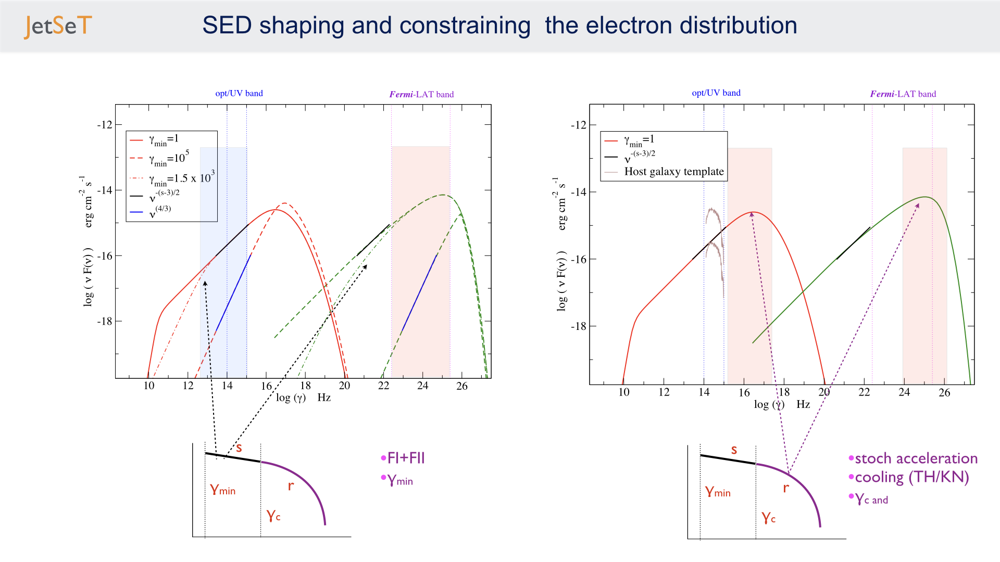

   image.png

.. code:: ipython3

    from jetset.plot_sedfit import PlotSED,PlotPdistr,PlotSpecComp
    from jetset.jet_model import Jet

.. code:: ipython3

    my_jet=Jet(electron_distribution='lppl')
    my_jet.parameters.r.val=1.0
    my_jet.show_model()

.. parsed-literal::

    ===> setting C threads to 12
    
    --------------------------------------------------------------------------------
    model description: 
    --------------------------------------------------------------------------------
    type: Jet
    name: jet_leptonic  
    geometry: spherical  
    
    electrons distribution:
     type: lppl  
     gamma energy grid size:  201
     gmin grid : 2.000000e+00
     gmax grid : 1.000000e+06
     normalization:  True
     log-values:  False
     ratio of cold protons to relativistic electrons: 1.000000e+00
    
    radiative fields:
     seed photons grid size:  100
     IC emission grid size:  100
     source emissivity lower bound :  1.000000e-120
     spectral components:
       name:Sum, state: on
       name:Sum, hidden: False
       name:Sync, state: self-abs
       name:Sync, hidden: False
       name:SSC, state: on
       name:SSC, hidden: False
    external fields transformation method: blob
    
    SED info:
     nu grid size jetkernel: 1000
     nu size: 500
     nu mix (Hz): 1.000000e+06
     nu max (Hz): 1.000000e+30
    
    flux plot lower bound   :  1.000000e-30
    
    --------------------------------------------------------------------------------

.. raw:: html

    <i>Table length=12</i>
    <table id="table5658746768-799854" class="table-striped table-bordered table-condensed">
    <thead><tr><th>model name</th><th>name</th><th>par type</th><th>units</th><th>val</th><th>phys. bound. min</th><th>phys. bound. max</th><th>log</th><th>frozen</th></tr></thead>
    <tr><td>jet_leptonic</td><td>R</td><td>region_size</td><td>cm</td><td>5.000000e+15</td><td>1.000000e+03</td><td>1.000000e+30</td><td>False</td><td>False</td></tr>
    <tr><td>jet_leptonic</td><td>R_H</td><td>region_position</td><td>cm</td><td>1.000000e+17</td><td>0.000000e+00</td><td>--</td><td>False</td><td>True</td></tr>
    <tr><td>jet_leptonic</td><td>B</td><td>magnetic_field</td><td>gauss</td><td>1.000000e-01</td><td>0.000000e+00</td><td>--</td><td>False</td><td>False</td></tr>
    <tr><td>jet_leptonic</td><td>NH_cold_to_rel_e</td><td>cold_p_to_rel_e_ratio</td><td></td><td>1.000000e+00</td><td>0.000000e+00</td><td>--</td><td>False</td><td>True</td></tr>
    <tr><td>jet_leptonic</td><td>beam_obj</td><td>beaming</td><td></td><td>1.000000e+01</td><td>1.000000e-04</td><td>--</td><td>False</td><td>False</td></tr>
    <tr><td>jet_leptonic</td><td>z_cosm</td><td>redshift</td><td></td><td>1.000000e-01</td><td>0.000000e+00</td><td>--</td><td>False</td><td>False</td></tr>
    <tr><td>jet_leptonic</td><td>gmin</td><td>low-energy-cut-off</td><td>lorentz-factor*</td><td>2.000000e+00</td><td>1.000000e+00</td><td>1.000000e+09</td><td>False</td><td>False</td></tr>
    <tr><td>jet_leptonic</td><td>gmax</td><td>high-energy-cut-off</td><td>lorentz-factor*</td><td>1.000000e+06</td><td>1.000000e+00</td><td>1.000000e+15</td><td>False</td><td>False</td></tr>
    <tr><td>jet_leptonic</td><td>N</td><td>emitters_density</td><td>1 / cm3</td><td>1.000000e+02</td><td>0.000000e+00</td><td>--</td><td>False</td><td>False</td></tr>
    <tr><td>jet_leptonic</td><td>gamma0_log_parab</td><td>turn-over-energy</td><td>lorentz-factor*</td><td>1.000000e+04</td><td>1.000000e+00</td><td>1.000000e+09</td><td>False</td><td>False</td></tr>
    <tr><td>jet_leptonic</td><td>s</td><td>LE_spectral_slope</td><td></td><td>2.000000e+00</td><td>-1.000000e+01</td><td>1.000000e+01</td><td>False</td><td>False</td></tr>
    <tr><td>jet_leptonic</td><td>r</td><td>spectral_curvature</td><td></td><td>1.000000e+00</td><td>-1.500000e+01</td><td>1.500000e+01</td><td>False</td><td>False</td></tr>
    </table>
    

.. parsed-literal::

    --------------------------------------------------------------------------------

.. code:: ipython3

    my_jet.set_par('B',val=0.2)
    my_jet.set_par('gamma0_log_parab',val=5E3)
    my_jet.set_par('gmin',val=1E2)
    my_jet.set_par('gmax',val=1E8)
    my_jet.set_par('R',val=1E15)
    my_jet.set_par('N',val=1E3)
    my_jet.set_par('r',val=0.4)

.. code:: ipython3

    my_jet.eval()
    p=my_jet.electron_distribution.plot()
    my_jet.set_par('r',val=2.4)
    my_jet.eval()
    p=my_jet.electron_distribution.plot(p=p)
    p.ax.axvline(my_jet.parameters.gamma0_log_parab.val,ls='--',c='black',label=r'$\gamma_0$')
    p.setlim(y_min=1E-20)
    p.ax.legend()

.. parsed-literal::

    <matplotlib.legend.Legend at 0x151f07bb0>

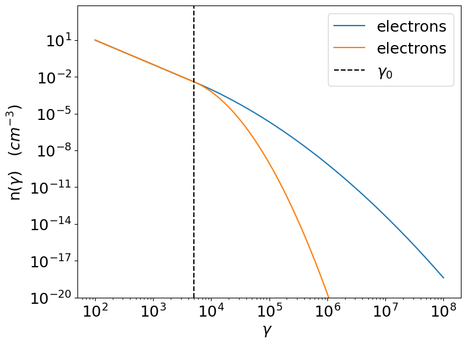

.. code:: ipython3

    p=my_jet.electron_distribution.plot3p()
    p.ax.axvline(4.0,ls='--',c='black',label=r'$\gamma_0$')
    p.ax.legend()

.. parsed-literal::

    <matplotlib.legend.Legend at 0x152a7af80>

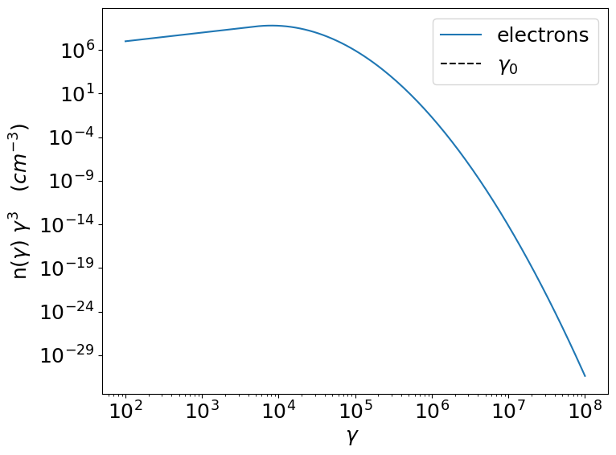

.. code:: ipython3

    my_plot=my_jet.plot_model()
    my_plot.setlim(y_max=1E-11,y_min=3E-17,x_min=1E9)

.. image:: SSC_th_bkg_files/SSC_th_bkg_12_0.png

.. code:: ipython3

    my_plot=my_jet.plot_model(frame='src')
    my_plot.setlim(y_max=1E44,y_min=1E38,x_min=1e9)

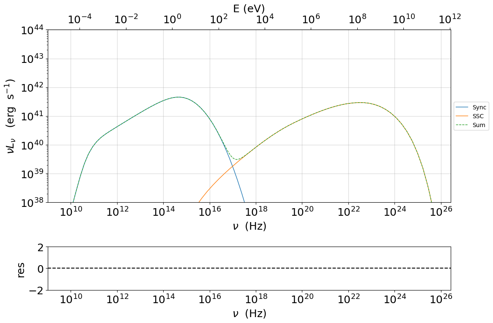

Synchrotron trends: full computation and :math:`\delta`-approx comparison
-------------------------------------------------------------------------

|image.png| |image1| |image2| |image3| |image4|

.. |image.png| image:: ../../slides/jetset_slides/jetset_slides.008.png
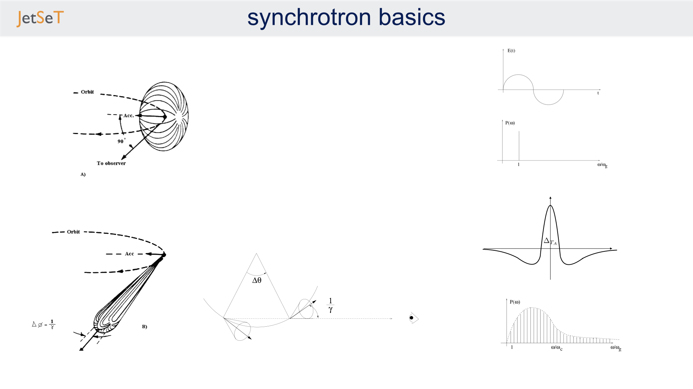
.. |image2| image:: ../../slides/jetset_slides/jetset_slides.010.png
.. |image3| image:: ../../slides/jetset_slides/jetset_slides.011.png
.. |image4| image:: ../../slides/jetset_slides/jetset_slides.014.png

Synchrotron trend for :math:`\gamma_{min}`
~~~~~~~~~~~~~~~~~~~~~~~~~~~~~~~~~~~~~~~~~~

.. code:: ipython3

    #matplotlib.rc('font', **font)
    my_jet=Jet(electron_distribution='lppl')
    
    p=PlotSED(figsize=(18,12))
    ax=p.fig.add_subplot(222)
    my_jet.parameters.gmax.val=1E7
    my_jet.parameters.r.val=1.0
    my_jet.parameters.s.val=2.0
    my_jet.parameters.N.val=500
    my_jet.parameters.z_cosm.val=0.05
    
    my_jet.nu_grid_size=500
    my_jet.set_gamma_grid_size(100)
    my_jet.set_IC_nu_size(100)
    
    size=10
    
    
    #Synch
    nu_p_S=np.zeros(size)
    nuFnu_p_S=np.zeros(size)
    
    
    
    S_index=np.zeros(size)
    S_index_err=np.zeros(size)
    
    #Switch off SSC emission
    my_jet.spectral_components.SSC.state='off'
    
    #Switch off sych self-abs
    my_jet.spectral_components.Sync.state='on'
    
    gmin_values=np.logspace(0.1,4.5,size)
    
    
     
    for ID,gmin in enumerate(gmin_values):
       
       
        my_jet.parameters.gmin.val=gmin
        my_jet.set_N_from_nuFnu(nu_obs=1E18,nuFnu_obs=1E-12)
        my_jet.eval()
        x_p,y_p=my_jet.get_component_peak('Sync',log_log=True)
        S_index[ID],S_index_err[ID],loglog_pl=get_SED_pl_fit(my_jet,'Sync',[10,13])
    
        
        
        my_jet.plot_model(p,label=r'$\gamma_{min}$=%2.2e'%gmin,color=colors[ID],auto_label=False,comp='Sync',line_style='--')
        p.add_model_plot(loglog_pl,label=r'pl fit for $\gamma_{min}$=%2.2e'%gmin,color=colors[ID],line_style='-')
        n_distr_plot(my_jet,ax,c=colors[ID],gmin=gmin)
        
    
    ax.set_xlabel(r'log($\gamma$)')
    ax.set_ylabel(r'log(n($\gamma$) $\gamma^3$)')
    
    p.sedplot.axvline([10],ls='--',c='black')
    p.sedplot.axvline([13],ls='--',c='black')
    
    p.sedplot.scatter(nu_p_S,nuFnu_p_S)
    
    p.setlim(y_min=1E-18,y_max=1E-9,x_min=1E7,x_max=1E32)

.. parsed-literal::

    ===> setting C threads to 12

.. image:: SSC_th_bkg_files/SSC_th_bkg_17_1.png

.. code:: ipython3

    S_spectral_index=S_index-1
    
    matplotlib.rc('font', **font)
    
    fig = plt.figure(figsize=(12,8))
    
    ax=fig.add_subplot(111)
    ax.plot(np.log10(gmin_values),S_spectral_index,'-o',label=r'Synch index from fit')
    ax.fill_between(np.log10(gmin_values), S_spectral_index - S_index_err, S_spectral_index + S_index_err,
                     color='gray', alpha=0.2)
    ax.set_ylabel('Synch index')
    ax.set_xlabel(r'log($\gamma_{min}$)')
    ax.axhline(-(my_jet.parameters.s.val-1)/2,ls='--',c='green',label='-(s-1)/2 Synch. theory')
    ax.axhline(1/3,ls='--',c='red',label='1/3 Synch. theory asymp.')
    ax.legend()
    

.. parsed-literal::

    <matplotlib.legend.Legend at 0x150f9f4c0>

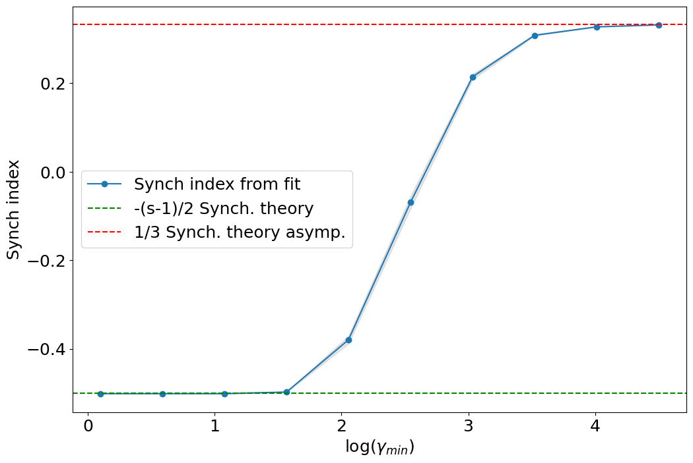

Synchrotron trend for the low-energy spectral slope
~~~~~~~~~~~~~~~~~~~~~~~~~~~~~~~~~~~~~~~~~~~~~~~~~~~

.. figure:: ../../slides/jetset_slides/jetset_slides.012.png
   :alt: image.png

   image.png

.. code:: ipython3

    matplotlib.rc('font', **font)
    
    p=PlotSED(figsize=(18,12))
    ax=p.fig.add_subplot(222)
    
    my_jet.parameters.gmax.val=1E7
    my_jet.parameters.gmin.val=2
    
    my_jet.parameters.r.val=1.0
    my_jet.parameters.s.val=2.0
    my_jet.parameters.N.val=500
    my_jet.parameters.z_cosm.val=0.05
    
    my_jet.nu_grid_size=500
    my_jet.set_gamma_grid_size(100)
    my_jet.set_IC_nu_size(100)
    
    size=10
    
    
    #Synch
    nu_p_S=np.zeros(size)
    nuFnu_p_S=np.zeros(size)
    
    
    
    S_index=np.zeros(size)
    S_index_err=np.zeros(size)
    
    #Switch off SSC emission
    my_jet.spectral_components.SSC.state='off'
    
    #Switch off sych self-abs
    my_jet.spectral_components.Sync.state='on'
    
    s_values=np.linspace(1.5,2.5,size)
    
    
     
    for ID,s in enumerate(s_values):
       
       
        my_jet.parameters.s.val=s
        my_jet.set_N_from_nuFnu(nu_obs=5E13,nuFnu_obs=1E-11)
        my_jet.eval()
        x_p,y_p=my_jet.get_component_peak('Sync',log_log=True)
        S_index[ID],S_index_err[ID],loglog_pl=get_SED_pl_fit(my_jet,'Sync',[10,13])
    
        
        
        my_jet.plot_model(p,label=r'$\gamma_{min}$=%2.2e'%gmin,color=colors[ID],auto_label=False,comp='Sync',line_style='--')
        p.add_model_plot(loglog_pl,label=r'pl fit for $\gamma_{min}$=%2.2e'%gmin,color=colors[ID],line_style='-')
        n_distr_plot(my_jet,ax,c=colors[ID])
    
    
    ax.set_xlabel(r'log($\gamma$)')
    ax.set_ylabel(r'log(n($\gamma$) $\gamma^3$)')
    p.sedplot.axvline([10],ls='--',c='black')
    
    p.sedplot.axvline([13],ls='--',c='black')
    
    p.sedplot.scatter(nu_p_S,nuFnu_p_S)
    
    p.setlim(y_min=1E-18,y_max=1E-9,x_min=1E7,x_max=1E34)
    

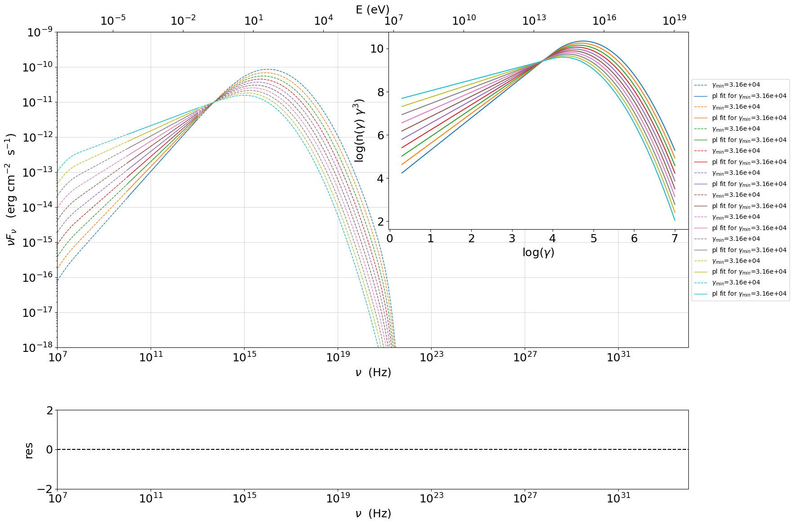

.. code:: ipython3

    S_spectral_index=S_index-1
    
    matplotlib.rc('font', **font)
    
    fig = plt.figure(figsize=(12,8))
    
    ax=fig.add_subplot(111)
    ax.plot(s_values,S_spectral_index,'-o',label=r'Synch index from fit')
    ax.fill_between(s_values, S_spectral_index - S_index_err, S_spectral_index + S_index_err,
                     color='gray', alpha=0.2)
    ax.set_ylabel('Synch index')
    ax.set_xlabel(r's')
    ax.plot(s_values,-(s_values-1)/2,ls='--',c='green',label='-(s-1)/2 Synch. theory')
    ax.legend()
    
    

.. parsed-literal::

    <matplotlib.legend.Legend at 0x15274b430>

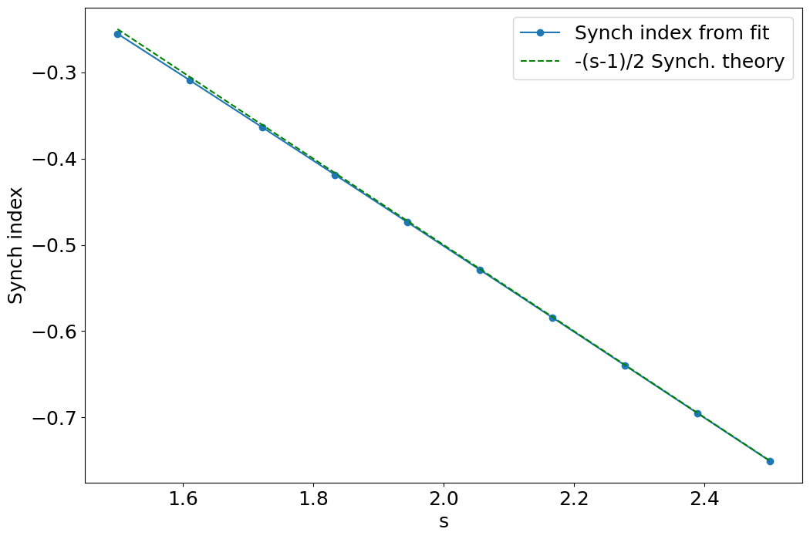

Change in the peak frequency of the SED
~~~~~~~~~~~~~~~~~~~~~~~~~~~~~~~~~~~~~~~

.. figure:: ../../slides/jetset_slides/jetset_slides.013.png
   :alt: image.png

   image.png

.. code:: ipython3

    matplotlib.rc('font', **font)
    
    p=PlotSED(figsize=(18,12))
    ax=p.fig.add_subplot(222)
    
    my_jet.parameters.gmax.val=1E8
    my_jet.parameters.r.val=1.0
    my_jet.parameters.s.val=2.0
    my_jet.parameters.N.val=500
    my_jet.parameters.z_cosm.val=0.05
    
    
    size=10
    
    
    #Synch
    nu_p_S=np.zeros(size)
    nuFnu_p_S=np.zeros(size)
    nu_p_S_delta=np.zeros(size)
    
    
    #e- distr 
    g_p_e=np.zeros(size)
    n3g_p_e=np.zeros(size)
    
    
    #Switch off SSC emission
    my_jet.spectral_components.SSC.state='off'
    
    for ID,gamma0_log_parab in enumerate(np.logspace(2.5,4,size)):
       
        my_jet.nu_grid_size=100
        my_jet.set_gamma_grid_size(200)
        my_jet.parameters.gamma0_log_parab.val=gamma0_log_parab
        my_jet.eval()
        x_p,y_p=my_jet.get_component_peak('Sync',log_log=True)
        (nu_p_S[ID],nuFnu_p_S[ID],_),err=get_SED_log_par_fit(x_p,y_p,my_jet,'Sync')
        my_jet.electron_distribution.update()
        pars,err=get_n_gamma_log_par_fit(my_jet.electron_distribution,power=3,delta_p=[-0.25,0.25])
        g_p_e[ID] = pars[0]
        n3g_p_e[ID] = pars[1]
        nu_p_S_delta[ID]=get_nu_p_S_delta_approx(my_jet,g_p_e[ID])
        
        my_jet.plot_model(p,label=r'$\gamma 0$=%2.2e'%gamma0_log_parab,color=colors[ID],auto_label=False,comp='Sync')
        
        n_distr_plot(my_jet,ax,c=colors[ID])
        
        
    ax.set_xlabel(r'log($\gamma$)')
    ax.set_ylabel(r'log(n($\gamma$) $\gamma^3$)')
    
    p.sedplot.scatter(nu_p_S,nuFnu_p_S)
    ax.scatter(g_p_e,n3g_p_e)
    
    p.setlim(y_min=1E-18,y_max=1E-11,x_min=1E9,x_max=1E30)
    ax.set_ylim(2,9)

.. parsed-literal::

    (2, 9)

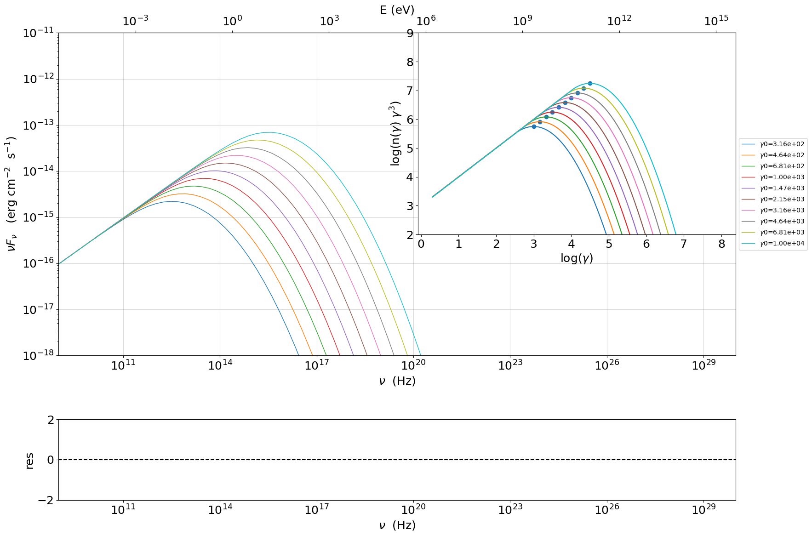

.. code:: ipython3

    matplotlib.rc('font', **font)
    
    fig = plt.figure(figsize=(12,8))
    
    ax=fig.add_subplot(111)
    ax.plot(nu_p_S,10**(nu_p_S - nu_p_S_delta),'-o',label=r'$\nu_p$ S from $\delta$-approx / $\nu_p$ S peak from SED fit')
    
    ax.set_ylabel('ratio')
    ax.set_xlabel(r'log($\gamma_{3p}$ e-)')
    #ax.axvline(4.0,ls='--',c='black')
    ax.axhline(1.0,ls='--',c='red')
    ax.legend(fontsize='large',loc='best')
    ax.set_ylim(0,1.5)

.. parsed-literal::

    (0, 1.5)

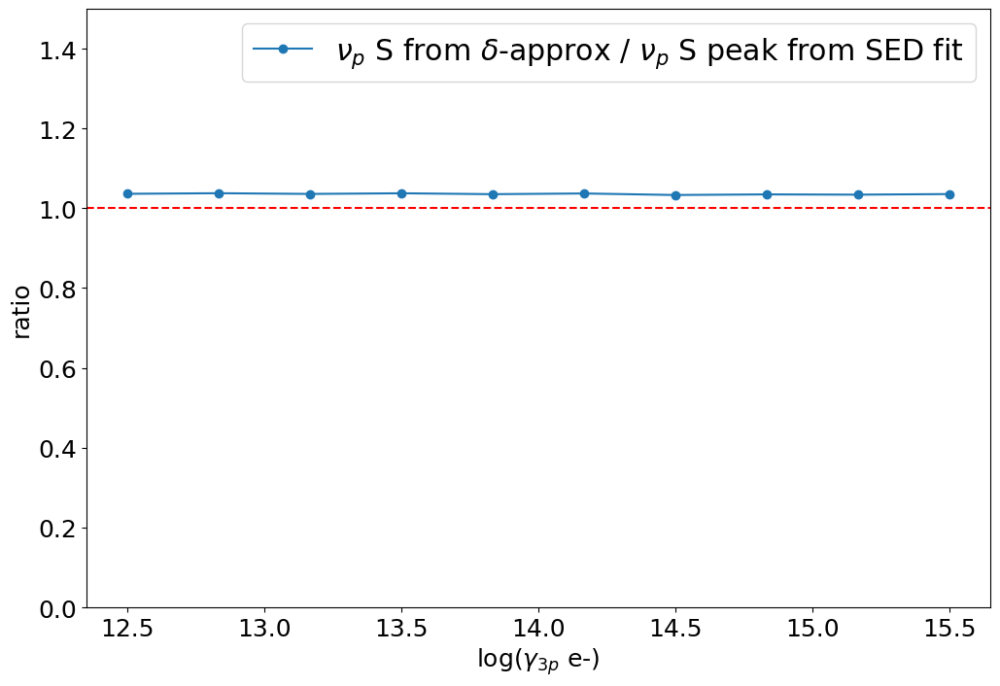

Trends for the inverse Compton and synchrotron emission
-------------------------------------------------------

.. figure:: ../../slides/jetset_slides/jetset_slides.015.png
   :alt: image.png

   image.png

Changing :math:`\gamma_{min}`
~~~~~~~~~~~~~~~~~~~~~~~~~~~~~

.. code:: ipython3

    matplotlib.rc('font', **font)
    p=PlotSED(figsize=(12,9))
    
    
    my_jet=Jet(electron_distribution='lppl')
    
    my_jet.parameters.gmax.val=1E8
    my_jet.parameters.r.val=1.0
    
    
    for ID,gmin in enumerate([10,5000,10000]):
       
        my_jet.set_gamma_grid_size(200)
        my_jet.set_IC_nu_size(100)
        my_jet.parameters.gmin.val=gmin
        my_jet.set_N_from_nuFnu(nu_obs=1E17,nuFnu_obs=1E-13)
        my_jet.eval()
        my_jet.plot_model(p,label='gmin=%2.2e'%gmin,color=colors[ID])

.. parsed-literal::

    ===> setting C threads to 12

.. image:: SSC_th_bkg_files/SSC_th_bkg_30_1.png

Changing the turn-over energy
~~~~~~~~~~~~~~~~~~~~~~~~~~~~~

.. code:: ipython3

    my_jet=Jet(electron_distribution='lppl')
    
    matplotlib.rc('font', **font)
    p=PlotSED(figsize=(12,9))
    
    my_jet.parameters.gmax.val=1E8
    my_jet.parameters.r.val=1.0
    my_jet.parameters.s.val=2.0
    my_jet.parameters.N.val=500
    my_jet.parameters.z_cosm.val=0.05
    
    
    my_jet.nu_grid_size=1000
    my_jet.set_gamma_grid_size(200)
    my_jet.set_IC_nu_size(100)
    for ID,gamma0_log_parab in enumerate(np.logspace(3,5,5)):
       
        
        my_jet.parameters.gamma0_log_parab.val=gamma0_log_parab
        my_jet.eval()
        my_jet.plot_model(p,label='gammma_0=%2.2e'%gamma0_log_parab,color=colors[ID])
        
    p.setlim(y_min=1E-20,y_max=1E-11,x_min=1E9)

.. parsed-literal::

    ===> setting C threads to 12

.. image:: SSC_th_bkg_files/SSC_th_bkg_32_1.png

The IC redistribution function
~~~~~~~~~~~~~~~~~~~~~~~~~~~~~~

.. figure:: ../../slides/jetset_slides/jetset_slides.016.png
   :alt: image.png

   image.png

.. code:: ipython3

    from jetset.jetkernel import jetkernel
    
    def eval_nu_min_max(nu_compton_0,g):
        epsilon_0 = jetkernel.HPLANCK * nu_compton_0*jetkernel.one_by_MEC2
        nu_1_max = 4.0 * nu_compton_0 * g*g / (1.0 + 4.0*g*epsilon_0)
        nu_1_min = nu_compton_0/(4.0*g*g)
        Gamma=4*nu_compton_0*g*jetkernel.one_by_MEC2*jetkernel.HPLANCK
        return nu_1_min, nu_1_max,Gamma

.. code:: ipython3

    # Compare with fig. 4 in BLUMENTHAL, GEORGE R. GOULD, ROBERT J. 1970
    # https://ui.adsabs.harvard.edu/abs/1970RvMP...42..237B/abstract
    plt.figure(figsize=(10,8))
    my_jet=Jet()
    nu_0=1E15
    size=1000
    
    rate=np.zeros(size)
    my_jet._blob.do_IC_down_scattering=1
    for g in [1E1,1E4,1E5,3E5,3E6]:
        nu_1_min,nu_1_max,Gamma=eval_nu_min_max(nu_0,g)
        nu_1_range=np.linspace( nu_1_min , nu_1_max,size)
        rate=np.zeros(size)
        for ID,nu_1 in enumerate(nu_1_range):
            my_jet._blob.nu_compton_0=nu_0
            my_jet._blob.nu_1=nu_1   
            try:
                rate[ID]=jetkernel.f_compton_K1(my_jet._blob,g)
            except:
                rate[ID]=jetkernel.f_compton_K1(my_jet._blob,g,nu_1,nu_0)
        
        x=nu_1_range/nu_1_max
        y=rate
        c=np.trapz(y,x)
        plt.plot(x, rate/c,label=r'$\Gamma=%2.2e$'%(Gamma))
        plt.axvline(1.0,ls='--',lw=0.5)
        plt.legend()
        plt.xlabel(r'$\nu_{out}/\nu_{out max}$')
        plt.ylabel(r'$Fc(\nu_{out},\nu_{in},\gamma)$')

.. parsed-literal::

    ===> setting C threads to 12

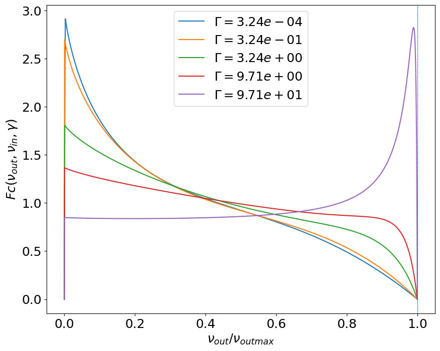

.. code:: ipython3

    plt.figure(figsize=(10,8))
    x=np.logspace(0,8,1000)
    _,y,_=eval_nu_min_max(1E15,x)
    plt.loglog(x,jetkernel.HPLANCK*y*jetkernel.one_by_MEC2/x)
    plt.xlabel(r'${\gamma_e}$')
    plt.ylabel(r'$\frac{h\nu_{out}}{\gamma_e m_ec^2}$')

.. parsed-literal::

    Text(0, 0.5, '$\\frac{h\\nu_{out}}{\\gamma_e m_ec^2}$')

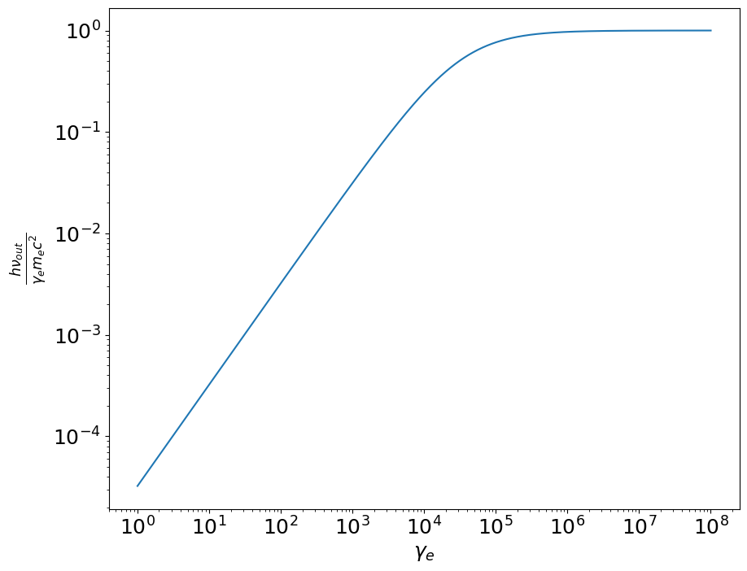

Transition from TH to KN regime for the IC emission: changing the curvature in the high-enegy branch of the emitters
~~~~~~~~~~~~~~~~~~~~~~~~~~~~~~~~~~~~~~~~~~~~~~~~~~~~~~~~~~~~~~~~~~~~~~~~~~~~~~~~~~~~~~~~~~~~~~~~~~~~~~~~~~~~~~~~~~~~

.. figure:: ../slides/jetset_slides/jetset_slides.018.png
   :alt: image.png

   image.png

.. code:: ipython3

    my_jet=Jet(electron_distribution='lppl')
    
    matplotlib.rc('font', **font)
    p=PlotSED(figsize=(12,9))
    pe=PlotPdistr()
    pe.fig.set_size_inches(8,6)
    my_jet.parameters.gmax.val=1E8
    my_jet.parameters.gamma0_log_parab.val=5E3
    my_jet.parameters.B.val=.5
    
    my_jet.nu_max=1E30
    my_jet.set_gamma_grid_size(100)
    my_jet.set_IC_nu_size(100)
    
    size=10
    
    nu_p_S=np.zeros(size)
    nu_p_IC=np.zeros(size)
    nuFnu_p_S=np.zeros(size)
    nuFnu_p_IC=np.zeros(size)
    r_S=np.zeros(size)
    r_S_err=np.zeros(size)
    r_IC=np.zeros(size)
    r_IC_err=np.zeros(size)
    r_values=np.linspace(2.0,0.5,size)
    
    
    
    for ID,r in enumerate(r_values):
       
        
        my_jet.parameters.r.val=r
        my_jet.set_N_from_nuFnu(nu_obs=1E10,nuFnu_obs=1E-14)
        my_jet.eval()
        my_jet.plot_model(p,label='r=%2.2e'%r,color=colors[ID])
        x_p,y_p=my_jet.get_component_peak('Sync',log_log=True)
        (nu_p_S[ID],nuFnu_p_S[ID],r_S[ID]),err=get_SED_log_par_fit(x_p,y_p,my_jet,'Sync',delta_p=[0,1])
        r_S_err[ID]=err[2]
        
        x_p,y_p=my_jet.get_component_peak('SSC',log_log=True)
        (nu_p_IC[ID],nuFnu_p_IC[ID],r_IC[ID]),err=get_SED_log_par_fit(x_p,y_p,my_jet,'SSC',delta_p=[0,1])
        r_IC_err[ID]=err[2]
        my_jet.electron_distribution.plot3p(pe,label='r=%2.2f'%r)
        
        
    p.setlim(y_min=1E-14,y_max=3E-10,x_min=1E10,x_max=1E29)
    pe.setlim(y_min=0)

.. parsed-literal::

    ===> setting C threads to 12

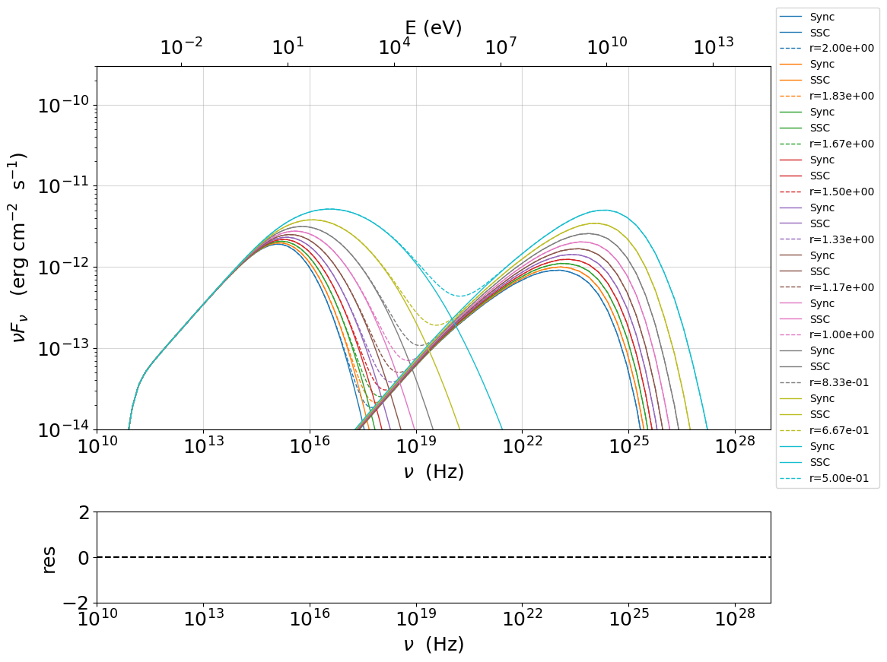

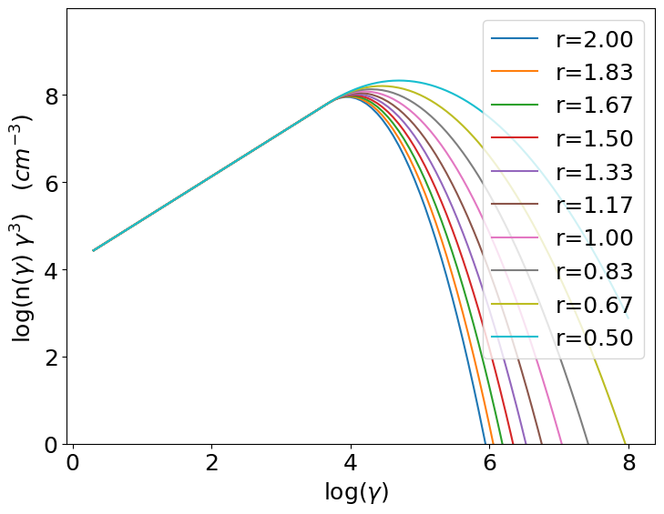

the following plot shows the trend for the S curvature (b) and the IC
curvature (both measured over one decade starting from the peak) versus
the curvature of the electron distribution (r)

.. code:: ipython3

    fig = plt.figure(figsize=(12,8))
    
    ax=fig.add_subplot(111)
    ax.errorbar(r_values,r_S,yerr=r_S_err,fmt='-o',label='S curvature')
    ax.fill_between(r_values, r_S - r_S_err, r_S + r_S_err,
                     color='gray', alpha=0.2)
    ax.errorbar(r_values,r_IC,yerr=r_IC_err,fmt='-o',label='IC curvature')
    ax.fill_between(r_values, r_IC - r_IC_err, r_IC + r_IC_err,
                     color='gray', alpha=0.2)
    
    ax.plot(r_values,-r_values/5, label='b = r/5')
    ax.set_ylabel('spectral curvature')
    ax.set_xlabel(r'e- curvature r')
    #ax.axvline(,ls='--',c='black')
    #ax.axhline(-0.2,ls='--',c='red',label='sync theor. b~r/5')
    ax.legend(fontsize='large')

.. parsed-literal::

    <matplotlib.legend.Legend at 0x15363db40>

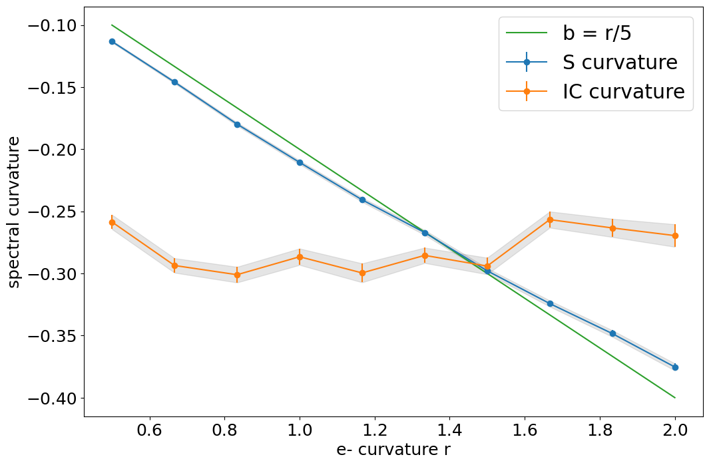

Transition from TH to KN regime for the IC emission: changing the turnover energy
~~~~~~~~~~~~~~~~~~~~~~~~~~~~~~~~~~~~~~~~~~~~~~~~~~~~~~~~~~~~~~~~~~~~~~~~~~~~~~~~~

.. figure:: ../../slides/jetset_slides/jetset_slides.019.png
   :alt: image.png

   image.png

.. code:: ipython3

        
    my_jet=Jet(electron_distribution='lppl')
    my_jet._blob.IC_adaptive_e_binning=0
    matplotlib.rc('font', **font)
    p=PlotSED(figsize=(12,9))
    
    size=10
    
    my_jet.parameters.gmax.val=1E8
    my_jet.parameters.r.val=1.0
    my_jet.parameters.s.val=2.0
    my_jet.parameters.N.val=500
    my_jet.parameters.z_cosm.val=0.05
    
    my_jet.nu_grid_size=200
    my_jet.set_gamma_grid_size(200)
    my_jet.set_IC_nu_size(200)
    my_jet.set_seed_nu_size(100)
    
    nu_p_S=np.zeros(size)
    nu_p_IC=np.zeros(size)
    nuFnu_p_S=np.zeros(size)
    nuFnu_p_IC=np.zeros(size)
    r_S=np.zeros(size)
    r_S_err=np.zeros(size)
    r_IC=np.zeros(size)
    r_IC_err=np.zeros(size)
    g_p_e=np.zeros(size)
    n3g_p_e=np.zeros(size)
    
    #colors=list(mcolors.CSS4_COLORS)
    
    
    for ID,gamma0_log_parab in enumerate(np.logspace(2.5,5,size)):
       
       
        my_jet.parameters.gamma0_log_parab.val=gamma0_log_parab
        my_jet._blob.IC_adaptive_e_binning=0
        my_jet._blob.do_IC_down_scattering=0
        my_jet.eval()
        p=my_jet.plot_model(p,comp='Sum',label='$\gamma0$_log_parab = %2.2e'%gamma0_log_parab)
        #with log_log=True, the values are already logarthmic
        x_p,y_p=my_jet.get_component_peak('Sync',log_log=True)
        (nu_p_S[ID],nuFnu_p_S[ID],r_S[ID]),err=get_SED_log_par_fit(x_p,y_p,my_jet,'Sync', delta_p=[0,1])
        r_S_err[ID]=err[2]
        p.sedplot.plot(10**x_p,10**y_p,'o',c='blue')
        
        x_p,y_p=my_jet.get_component_peak('SSC',log_log=True)
        (nu_p_IC[ID],nuFnu_p_IC[ID],r_IC[ID]),err=get_SED_log_par_fit(x_p,y_p,my_jet,'SSC', delta_p=[0,1])
        r_IC_err[ID]=err[2]
        pars,err=get_n_gamma_log_par_fit(my_jet.electron_distribution,power=3,delta_p=[-0.5,0.5])
        g_p_e[ID] = pars[0]
        n3g_p_e[ID] = pars[1]
        p.sedplot.plot(10**x_p,10**y_p,'o',c='orange')
        
    p.setlim(y_min=1E-18,y_max=3E-11,x_min=1E9)
    
    p.sedplot.scatter(nu_p_S,nuFnu_p_S)
    p.sedplot.scatter(nu_p_IC,nuFnu_p_IC)

.. parsed-literal::

    ===> setting C threads to 12

.. parsed-literal::

    <matplotlib.collections.PathCollection at 0x1537e4550>

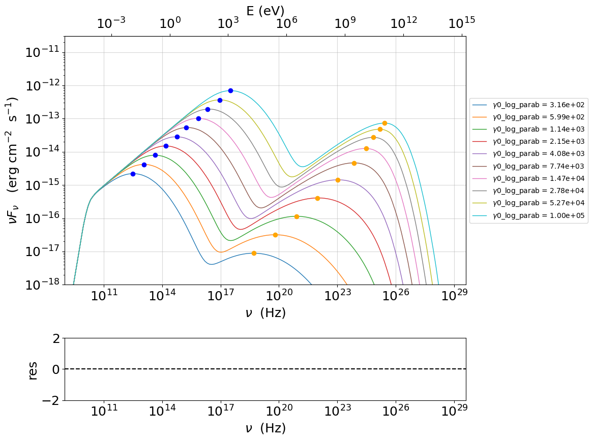

.. code:: ipython3

    matplotlib.rc('font', **font)
    
    fig = plt.figure(figsize=(12,8))
    
    ax=fig.add_subplot(111)
    ax.plot(g_p_e,(nu_p_IC-nu_p_S)-2*g_p_e,'-o')
    ax.set_ylabel(r'log($ \frac{(\nu_p^{IC} / \nu_p^{S})}{\gamma_{3p}^2} $)''')
    ax.set_xlabel(r'log($\gamma_{3p}$ e-)')
    ax.axvline(4.0,ls='--',c='black')
    ax.axhline(np.log10(4/3),ls='--',c='red',label=r"$ \frac{(\nu_p^{IC} / \nu_p^{S})}{\gamma_{3p}^2} =4/3 $")
    ax.legend(fontsize='large',loc='lower left')

.. parsed-literal::

    <matplotlib.legend.Legend at 0x1524fac50>

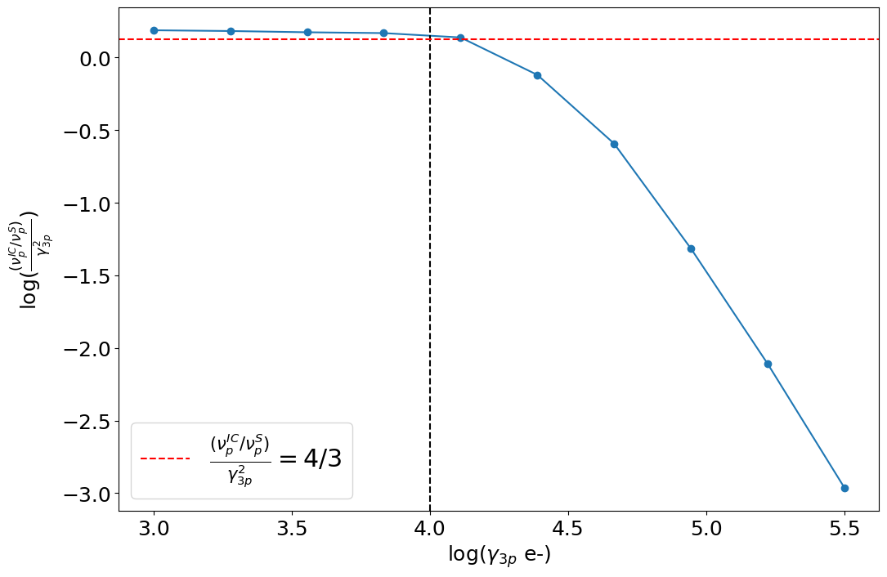

.. code:: ipython3

    fig = plt.figure(figsize=(12,8))
    
    ax=fig.add_subplot(111)
    ax.errorbar(g_p_e,r_S,yerr=r_S_err,fmt='-o',label='S')
    ax.fill_between(g_p_e, r_S - r_S_err, r_S + r_S_err,
                     color='gray', alpha=0.2)
    ax.errorbar(g_p_e,r_IC,yerr=r_IC_err,fmt='-o',label='IC')
    ax.fill_between(g_p_e, r_IC - r_IC_err, r_IC + r_IC_err,
                     color='gray', alpha=0.2)
    ax.set_ylabel('spectral curvature')
    ax.set_xlabel(r'log($\gamma_{3p}$ e-)')
    ax.axvline(4.0,ls='--',c='black')
    ax.axhline(-0.2,ls='--',c='red',label='sync theor. b~r/5')
    ax.legend(fontsize='large')

.. parsed-literal::

    <matplotlib.legend.Legend at 0x1534e2aa0>

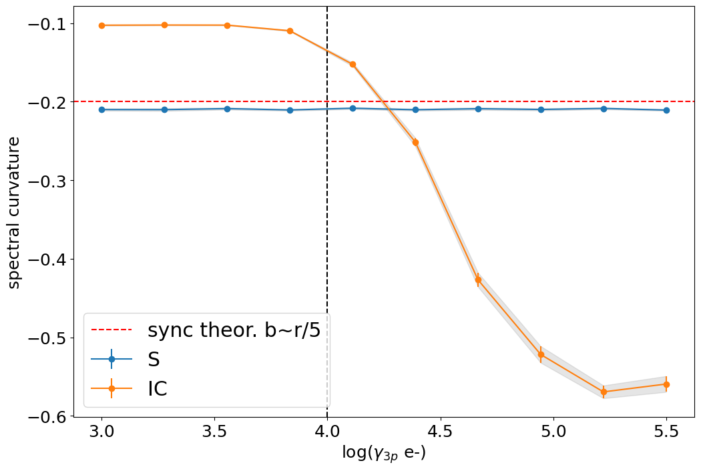

Exercise
--------

derive the trend for the Compton dominance (CD) as a function of N a
gamma0_log_parab

hint: use the get_component_peak to extract the peak of the SED for each
component

