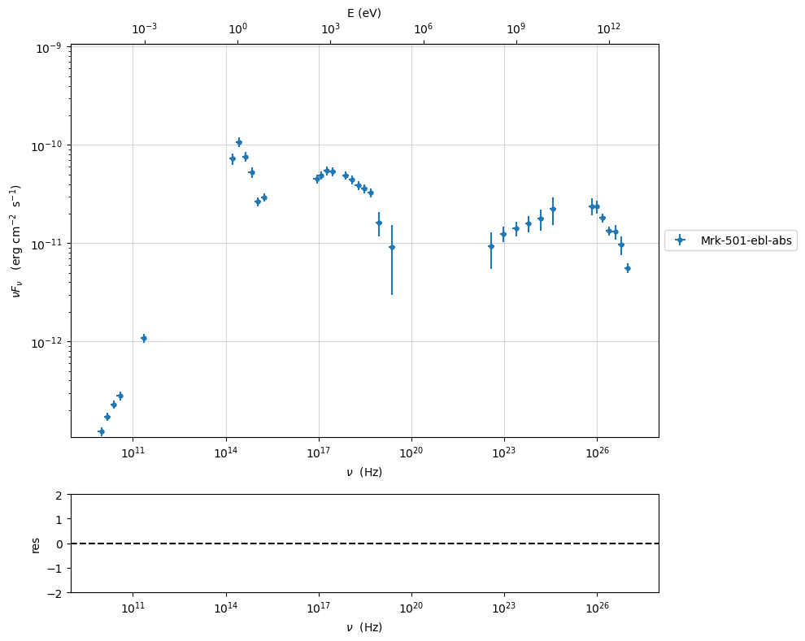
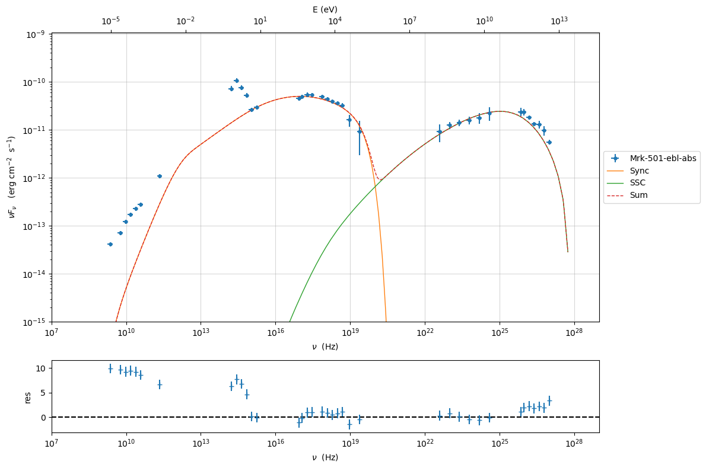
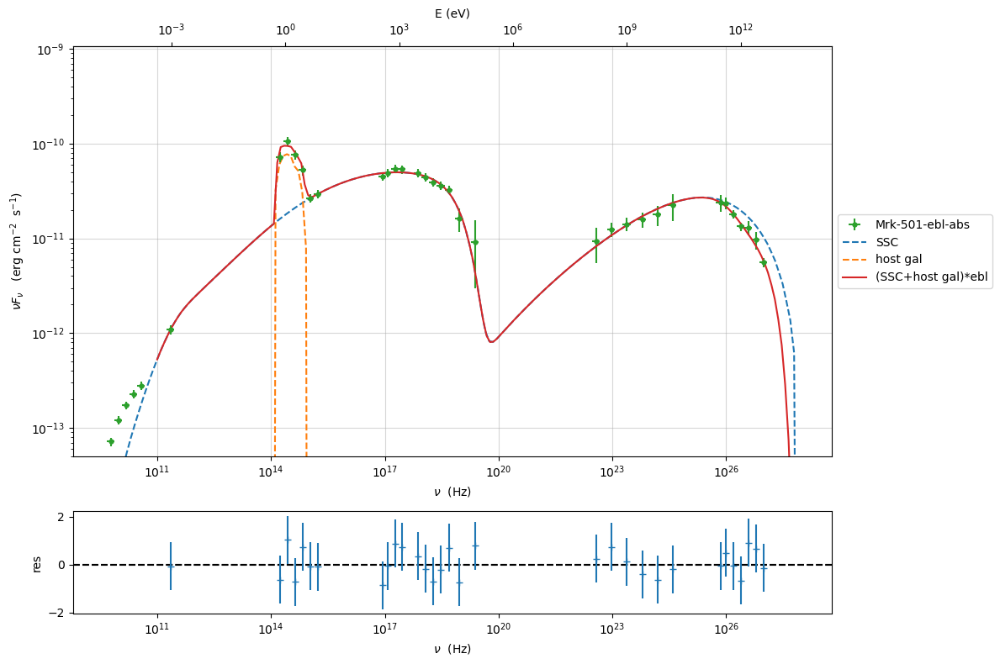

.. _sherpa_plugin:

Example to use the Sherpa plugin with the sherpa interface
==========================================================

.. code:: ipython3

    import jetset
    print('tested on jetset',jetset.__version__)

.. parsed-literal::

    tested on jetset 1.3.0rc8

In this tutorial we show how to import a jetset model into Sherpa, and
finally we perform a model fitting with Sherpa. To run this plugin you
have to install Sherpa:
https://sherpa.readthedocs.io/en/latest/install.html

.. code:: ipython3

    import warnings
    warnings.filterwarnings('ignore')
    
    import matplotlib.pylab as plt
    import jetset
    from jetset.test_data_helper import  test_SEDs
    from jetset.data_loader import ObsData,Data
    from jetset.plot_sedfit import PlotSED
    from jetset.test_data_helper import  test_SEDs

.. code:: ipython3

    from jetset.test_data_helper import test_SEDs

.. code:: ipython3

    test_SEDs

.. parsed-literal::

    ['/Users/orion/miniforge3/envs/jetset/lib/python3.10/site-packages/jetset/test_data/SEDs_data/SED_3C345.ecsv',
     '/Users/orion/miniforge3/envs/jetset/lib/python3.10/site-packages/jetset/test_data/SEDs_data/SED_MW_Mrk421_EBL_DEABS.ecsv',
     '/Users/orion/miniforge3/envs/jetset/lib/python3.10/site-packages/jetset/test_data/SEDs_data/SED_MW_Mrk501_EBL_ABS.ecsv',
     '/Users/orion/miniforge3/envs/jetset/lib/python3.10/site-packages/jetset/test_data/SEDs_data/SED_MW_Mrk501_EBL_DEABS.ecsv']

Loading data
------------

see the :ref:`data_format` user guide for further information about loading data 

.. code:: ipython3

    print(test_SEDs[2])
    data=Data.from_file(test_SEDs[2])

.. parsed-literal::

    /Users/orion/miniforge3/envs/jetset/lib/python3.10/site-packages/jetset/test_data/SEDs_data/SED_MW_Mrk501_EBL_ABS.ecsv

.. code:: ipython3

    %matplotlib inline
    sed_data=ObsData(data_table=data)
    sed_data.group_data(bin_width=0.2)
    
    sed_data.add_systematics(0.1,[10.**6,10.**29])
    p=sed_data.plot_sed()

.. parsed-literal::

    ================================================================================
    
    ***  binning data  ***
    ---> N bins= 90
    ---> bin_widht= 0.2
    ================================================================================
    

.. code:: ipython3

    sed_data.save('Mrk_501.pkl')

phenomenological model constraining
-----------------------------------

see the :ref:`phenom_constr` user guide for further information about phenomenological constraining 

spectral indices
~~~~~~~~~~~~~~~~

.. code:: ipython3

    from jetset.sed_shaper import  SEDShape
    my_shape=SEDShape(sed_data)
    my_shape.eval_indices(minimizer='lsb',silent=True)
    p=my_shape.plot_indices()
    p.setlim(y_min=1E-15,y_max=1E-6)

.. parsed-literal::

    ================================================================================
    
    *** evaluating spectral indices for data ***
    ================================================================================
    

.. image:: sherpa-plugin-sherpa-interface_files/sherpa-plugin-sherpa-interface_15_1.png

sed shaper
~~~~~~~~~~

.. code:: ipython3

    mm,best_fit=my_shape.sync_fit(check_host_gal_template=True,
                      Ep_start=None,
                      minimizer='lsb',
                      silent=True,
                      fit_range=[10.,21.])

.. parsed-literal::

    ================================================================================
    
    *** Log-Polynomial fitting of the synchrotron component ***
    ---> first blind fit run,  fit range: [10.0, 21.0]
    ---> class:  HSP
    
    ---> class:  HSP
    
    

.. raw:: html

    <i>Table length=6</i>
    <table id="table4697601744-632938" class="table-striped table-bordered table-condensed">
    <thead><tr><th>model name</th><th>name</th><th>val</th><th>bestfit val</th><th>err +</th><th>err -</th><th>start val</th><th>fit range min</th><th>fit range max</th><th>frozen</th></tr></thead>
    <tr><td>LogCubic</td><td>b</td><td>-6.522794e-02</td><td>-6.522794e-02</td><td>5.892905e-03</td><td>--</td><td>-4.913172e-02</td><td>-1.000000e+01</td><td>0.000000e+00</td><td>False</td></tr>
    <tr><td>LogCubic</td><td>c</td><td>-1.908748e-03</td><td>-1.908748e-03</td><td>8.488797e-04</td><td>--</td><td>5.440153e-03</td><td>-1.000000e+01</td><td>1.000000e+01</td><td>False</td></tr>
    <tr><td>LogCubic</td><td>Ep</td><td>1.704833e+01</td><td>1.704833e+01</td><td>6.858392e-02</td><td>--</td><td>1.593204e+01</td><td>0.000000e+00</td><td>3.000000e+01</td><td>False</td></tr>
    <tr><td>LogCubic</td><td>Sp</td><td>-1.030052e+01</td><td>-1.030052e+01</td><td>1.424853e-02</td><td>--</td><td>-1.022242e+01</td><td>-3.000000e+01</td><td>0.000000e+00</td><td>False</td></tr>
    <tr><td>host_galaxy</td><td>nuFnu_p_host</td><td>-1.008538e+01</td><td>-1.008538e+01</td><td>2.900917e-02</td><td>--</td><td>-1.022242e+01</td><td>-1.222242e+01</td><td>-8.222416e+00</td><td>False</td></tr>
    <tr><td>host_galaxy</td><td>nu_scale</td><td>1.934519e-02</td><td>1.934519e-02</td><td>1.919833e-03</td><td>--</td><td>0.000000e+00</td><td>-5.000000e-01</td><td>5.000000e-01</td><td>False</td></tr>
    </table>
    

.. parsed-literal::

    ---> sync       nu_p=+1.704833e+01 (err=+6.858392e-02)  nuFnu_p=-1.030052e+01 (err=+1.424853e-02) curv.=-6.522794e-02 (err=+5.892905e-03)
    ================================================================================
    

.. code:: ipython3

    my_shape.IC_fit(fit_range=[23.,29.],minimizer='minuit',silent=True)
    p=my_shape.plot_shape_fit()
    p.setlim(y_min=1E-15)

.. parsed-literal::

    ================================================================================
    
    *** Log-Polynomial fitting of the IC component ***
    ---> fit range: [23.0, 29.0]
    ---> LogCubic fit
    ====> simplex
    ====> migrad
    ====> simplex
    ====> migrad
    ====> simplex
    ====> migrad
    
    

.. raw:: html

    <i>Table length=4</i>
    <table id="table4697599056-205664" class="table-striped table-bordered table-condensed">
    <thead><tr><th>model name</th><th>name</th><th>val</th><th>bestfit val</th><th>err +</th><th>err -</th><th>start val</th><th>fit range min</th><th>fit range max</th><th>frozen</th></tr></thead>
    <tr><td>LogCubic</td><td>b</td><td>-1.569967e-01</td><td>-1.569967e-01</td><td>2.511269e-02</td><td>--</td><td>-1.000000e+00</td><td>-1.000000e+01</td><td>0.000000e+00</td><td>False</td></tr>
    <tr><td>LogCubic</td><td>c</td><td>-4.422595e-02</td><td>-4.422595e-02</td><td>2.000320e-02</td><td>--</td><td>-1.000000e+00</td><td>-1.000000e+01</td><td>1.000000e+01</td><td>False</td></tr>
    <tr><td>LogCubic</td><td>Ep</td><td>2.530691e+01</td><td>2.530691e+01</td><td>1.798034e-01</td><td>--</td><td>2.536233e+01</td><td>0.000000e+00</td><td>3.000000e+01</td><td>False</td></tr>
    <tr><td>LogCubic</td><td>Sp</td><td>-1.058920e+01</td><td>-1.058920e+01</td><td>4.983735e-02</td><td>--</td><td>-1.000000e+01</td><td>-3.000000e+01</td><td>0.000000e+00</td><td>False</td></tr>
    </table>
    

.. parsed-literal::

    ---> IC         nu_p=+2.530691e+01 (err=+1.798034e-01)  nuFnu_p=-1.058920e+01 (err=+4.983735e-02) curv.=-1.569967e-01 (err=+2.511269e-02)
    ================================================================================
    

.. image:: sherpa-plugin-sherpa-interface_files/sherpa-plugin-sherpa-interface_18_3.png

Model constraining
~~~~~~~~~~~~~~~~~~

In this step we are not fitting the model, we are just obtaining the
phenomenological ``pre_fit`` model, that will be fitted in using minuit
ore least-square bound, as shown below

.. code:: ipython3

    from jetset.obs_constrain import ObsConstrain
    from jetset.model_manager import  FitModel
    sed_obspar=ObsConstrain(beaming=25,
                            B_range=[0.001,0.1],
                            distr_e='lppl',
                            t_var_sec=3*86400,
                            nu_cut_IR=1E12,
                            SEDShape=my_shape)
    
    
    prefit_jet=sed_obspar.constrain_SSC_model(electron_distribution_log_values=False,silent=True)
    prefit_jet.save_model('prefit_jet.pkl')

.. parsed-literal::

    ================================================================================
    
    ***  constrains parameters from observable ***
    
    ===> setting C threads to 12

.. raw:: html

    <i>Table length=12</i>
    <table id="table5709998992-320430" class="table-striped table-bordered table-condensed">
    <thead><tr><th>model name</th><th>name</th><th>par type</th><th>units</th><th>val</th><th>phys. bound. min</th><th>phys. bound. max</th><th>log</th><th>frozen</th></tr></thead>
    <tr><td>jet_leptonic</td><td>R</td><td>region_size</td><td>cm</td><td>1.153385e+16</td><td>1.000000e+03</td><td>1.000000e+30</td><td>False</td><td>False</td></tr>
    <tr><td>jet_leptonic</td><td>R_H</td><td>region_position</td><td>cm</td><td>1.000000e+17</td><td>0.000000e+00</td><td>--</td><td>False</td><td>True</td></tr>
    <tr><td>jet_leptonic</td><td>B</td><td>magnetic_field</td><td>gauss</td><td>5.050000e-02</td><td>0.000000e+00</td><td>--</td><td>False</td><td>False</td></tr>
    <tr><td>jet_leptonic</td><td>NH_cold_to_rel_e</td><td>cold_p_to_rel_e_ratio</td><td></td><td>1.000000e+00</td><td>0.000000e+00</td><td>--</td><td>False</td><td>True</td></tr>
    <tr><td>jet_leptonic</td><td>beam_obj</td><td>beaming</td><td></td><td>2.500000e+01</td><td>1.000000e-04</td><td>--</td><td>False</td><td>False</td></tr>
    <tr><td>jet_leptonic</td><td>z_cosm</td><td>redshift</td><td></td><td>3.360000e-02</td><td>0.000000e+00</td><td>--</td><td>False</td><td>False</td></tr>
    <tr><td>jet_leptonic</td><td>gmin</td><td>low-energy-cut-off</td><td>lorentz-factor*</td><td>4.703917e+02</td><td>1.000000e+00</td><td>1.000000e+09</td><td>False</td><td>False</td></tr>
    <tr><td>jet_leptonic</td><td>gmax</td><td>high-energy-cut-off</td><td>lorentz-factor*</td><td>2.310708e+06</td><td>1.000000e+00</td><td>1.000000e+15</td><td>False</td><td>False</td></tr>
    <tr><td>jet_leptonic</td><td>N</td><td>emitters_density</td><td>1 / cm3</td><td>5.311204e+00</td><td>0.000000e+00</td><td>--</td><td>False</td><td>False</td></tr>
    <tr><td>jet_leptonic</td><td>gamma0_log_parab</td><td>turn-over-energy</td><td>lorentz-factor*</td><td>1.107634e+04</td><td>1.000000e+00</td><td>1.000000e+09</td><td>False</td><td>False</td></tr>
    <tr><td>jet_leptonic</td><td>s</td><td>LE_spectral_slope</td><td></td><td>2.248426e+00</td><td>-1.000000e+01</td><td>1.000000e+01</td><td>False</td><td>False</td></tr>
    <tr><td>jet_leptonic</td><td>r</td><td>spectral_curvature</td><td></td><td>3.261397e-01</td><td>-1.500000e+01</td><td>1.500000e+01</td><td>False</td><td>False</td></tr>
    </table>
    

.. parsed-literal::

    
    ================================================================================
    

.. code:: ipython3

    pl=prefit_jet.plot_model(sed_data=sed_data)
    pl.add_model_residual_plot(prefit_jet,sed_data)
    pl.setlim(y_min=1E-15,x_min=1E7,x_max=1E29)

Model fitting with using a Sherpa model
---------------------------------------

we show now, how to import a jetset model into a Sherpa model

.. code:: ipython3

    from jetset.sherpa_plugin import JetsetSherpaModel
    from jetset.sherpa_plugin import sherpa_model_to_table

.. code:: ipython3

    from jetset.template_2Dmodel import EBLAbsorptionTemplate
    ebl_franceschini=EBLAbsorptionTemplate.from_name('Franceschini_2008')

.. code:: ipython3

    from jetset.jet_model import Jet
    prefit_jet=Jet.load_model('prefit_jet.pkl')

.. parsed-literal::

    ===> setting C threads to 12

We remove the paramter ``NH_cold_to_rel_e``, not used in the fit,
because of problem encountered with the ``IntervalProjection`` Sherpa
method

.. code:: ipython3

    p=prefit_jet.parameters.get_par_by_name('NH_cold_to_rel_e')
    prefit_jet.parameters.del_par(p)

The following instructions create a Sherpa model for each of the
existing jetset models.

.. code:: ipython3

    sherpa_model_jet=JetsetSherpaModel(prefit_jet)
    sherpa_model_gal=JetsetSherpaModel(my_shape.host_gal)
    sherpa_model_ebl=JetsetSherpaModel(ebl_franceschini)
    

.. parsed-literal::

    jetset model name R renamed to  R_sh due to sherpa internal naming convention

.. code:: ipython3

    sherpa_model=(sherpa_model_jet+sherpa_model_gal)*sherpa_model_ebl

.. code:: ipython3

    sherpa_model

.. raw:: html

    
&lt;BinaryOpModel model instance &#x27;((jet_leptonic + host_galaxy) * Franceschini_2008)&#x27;&gt;

Model
<table class="model"><caption>Expression: (jet_leptonic + host_galaxy) * Franceschini_2008</caption><thead><tr><th>Component</th><th>Parameter</th><th>Thawed</th><th>Value</th><th>Min</th><th>Max</th><th>Units</th></tr></thead><tbody><tr><th class="model-odd" scope="rowgroup" rowspan=11>jet_leptonic</th><td>gmin</td><td><input disabled type="checkbox" checked></input></td><td>470.39174855643597</td><td>1.0</td><td>1000000000.0</td><td>lorentz-factor*</td></tr><tr><td>gmax</td><td><input disabled type="checkbox" checked></input></td><td>2310708.197406515</td><td>1.0</td><td>1000000000000000.0</td><td>lorentz-factor*</td></tr><tr><td>N</td><td><input disabled type="checkbox" checked></input></td><td>5.311204487986871</td><td>0.0</td><td>MAX</td><td>1 / cm3</td></tr><tr><td>gamma0_log_parab</td><td><input disabled type="checkbox" checked></input></td><td>11076.340602997107</td><td>1.0</td><td>1000000000.0</td><td>lorentz-factor*</td></tr><tr><td>s</td><td><input disabled type="checkbox" checked></input></td><td>2.2484255877578905</td><td>-10.0</td><td>10.0</td><td></td></tr><tr><td>r</td><td><input disabled type="checkbox" checked></input></td><td>0.32613967983928843</td><td>-15.0</td><td>15.0</td><td></td></tr><tr><td>R_sh</td><td><input disabled type="checkbox" checked></input></td><td>1.1533854456877508e+16</td><td>1000.0</td><td>1e+30</td><td>cm</td></tr><tr><td>R_H</td><td><input disabled type="checkbox"></input></td><td>1e+17</td><td>0.0</td><td>MAX</td><td>cm</td></tr><tr><td>B</td><td><input disabled type="checkbox" checked></input></td><td>0.0505</td><td>0.0</td><td>MAX</td><td>gauss</td></tr><tr><td>beam_obj</td><td><input disabled type="checkbox" checked></input></td><td>25.0</td><td>0.0001</td><td>MAX</td><td></td></tr><tr><td>z_cosm</td><td><input disabled type="checkbox" checked></input></td><td>0.0336</td><td>0.0</td><td>MAX</td><td></td></tr><tr class="block"><th class="model-even" scope="rowgroup" rowspan=2>host_galaxy</th><td>nuFnu_p_host</td><td><input disabled type="checkbox" checked></input></td><td>-10.085378806019135</td><td>-12.222416264353637</td><td>-8.222416264353637</td><td>erg / (s cm2)</td></tr><tr><td>nu_scale</td><td><input disabled type="checkbox" checked></input></td><td>0.019345186313740312</td><td>-0.5</td><td>0.5</td><td>Hz</td></tr><tr class="block"><th class="model-odd" scope="rowgroup" rowspan=2>Franceschini_2008</th><td>scale_factor</td><td><input disabled type="checkbox"></input></td><td>1.0</td><td>0.0</td><td>MAX</td><td></td></tr><tr><td>z_cosm</td><td><input disabled type="checkbox"></input></td><td>1.0</td><td>0.0</td><td>MAX</td><td></td></tr></tbody></table>

.. code:: ipython3

    sherpa_model_to_table(sherpa_model)

.. raw:: html

    
<i>Table length=15</i>
    <table id="table5727253696" class="table-striped table-bordered table-condensed">
    <thead><tr><th>model name</th><th>name</th><th>val</th><th>min</th><th>max</th><th>frozen</th><th>units</th><th>linked</th><th>linked par</th><th>linked model</th></tr></thead>
    <thead><tr><th>str17</th><th>str16</th><th>float64</th><th>float64</th><th>float64</th><th>bool</th><th>object</th><th>bool</th><th>str1</th><th>str1</th></tr></thead>
    <tr><td>jet_leptonic</td><td>gmin</td><td>470.39174855643597</td><td>1.0</td><td>1000000000.0</td><td>False</td><td>lorentz-factor*</td><td>False</td><td></td><td></td></tr>
    <tr><td>jet_leptonic</td><td>gmax</td><td>2310708.197406515</td><td>1.0</td><td>1000000000000000.0</td><td>False</td><td>lorentz-factor*</td><td>False</td><td></td><td></td></tr>
    <tr><td>jet_leptonic</td><td>N</td><td>5.311204487986871</td><td>0.0</td><td>3.4028234663852886e+38</td><td>False</td><td>1 / cm3</td><td>False</td><td></td><td></td></tr>
    <tr><td>jet_leptonic</td><td>gamma0_log_parab</td><td>11076.340602997107</td><td>1.0</td><td>1000000000.0</td><td>False</td><td>lorentz-factor*</td><td>False</td><td></td><td></td></tr>
    <tr><td>jet_leptonic</td><td>s</td><td>2.2484255877578905</td><td>-10.0</td><td>10.0</td><td>False</td><td></td><td>False</td><td></td><td></td></tr>
    <tr><td>jet_leptonic</td><td>r</td><td>0.32613967983928843</td><td>-15.0</td><td>15.0</td><td>False</td><td></td><td>False</td><td></td><td></td></tr>
    <tr><td>jet_leptonic</td><td>R_sh</td><td>1.1533854456877508e+16</td><td>1000.0</td><td>1e+30</td><td>False</td><td>cm</td><td>False</td><td></td><td></td></tr>
    <tr><td>jet_leptonic</td><td>R_H</td><td>1e+17</td><td>0.0</td><td>3.4028234663852886e+38</td><td>True</td><td>cm</td><td>False</td><td></td><td></td></tr>
    <tr><td>jet_leptonic</td><td>B</td><td>0.0505</td><td>0.0</td><td>3.4028234663852886e+38</td><td>False</td><td>gauss</td><td>False</td><td></td><td></td></tr>
    <tr><td>jet_leptonic</td><td>beam_obj</td><td>25.0</td><td>0.0001</td><td>3.4028234663852886e+38</td><td>False</td><td></td><td>False</td><td></td><td></td></tr>
    <tr><td>jet_leptonic</td><td>z_cosm</td><td>0.0336</td><td>0.0</td><td>3.4028234663852886e+38</td><td>False</td><td></td><td>False</td><td></td><td></td></tr>
    <tr><td>host_galaxy</td><td>nuFnu_p_host</td><td>-10.085378806019135</td><td>-12.222416264353637</td><td>-8.222416264353637</td><td>False</td><td>erg / (s cm2)</td><td>False</td><td></td><td></td></tr>
    <tr><td>host_galaxy</td><td>nu_scale</td><td>0.019345186313740312</td><td>-0.5</td><td>0.5</td><td>False</td><td>Hz</td><td>False</td><td></td><td></td></tr>
    <tr><td>Franceschini_2008</td><td>scale_factor</td><td>1.0</td><td>0.0</td><td>3.4028234663852886e+38</td><td>True</td><td></td><td>False</td><td></td><td></td></tr>
    <tr><td>Franceschini_2008</td><td>z_cosm</td><td>1.0</td><td>0.0</td><td>3.4028234663852886e+38</td><td>True</td><td></td><td>False</td><td></td><td></td></tr>
    </table>

.. code:: ipython3

    sherpa_model_ebl.z_cosm  = sherpa_model_jet.z_cosm

.. code:: ipython3

    sherpa_model

.. raw:: html

    
&lt;BinaryOpModel model instance &#x27;((jet_leptonic + host_galaxy) * Franceschini_2008)&#x27;&gt;

Model
<table class="model"><caption>Expression: (jet_leptonic + host_galaxy) * Franceschini_2008</caption><thead><tr><th>Component</th><th>Parameter</th><th>Thawed</th><th>Value</th><th>Min</th><th>Max</th><th>Units</th></tr></thead><tbody><tr><th class="model-odd" scope="rowgroup" rowspan=11>jet_leptonic</th><td>gmin</td><td><input disabled type="checkbox" checked></input></td><td>470.39174855643597</td><td>1.0</td><td>1000000000.0</td><td>lorentz-factor*</td></tr><tr><td>gmax</td><td><input disabled type="checkbox" checked></input></td><td>2310708.197406515</td><td>1.0</td><td>1000000000000000.0</td><td>lorentz-factor*</td></tr><tr><td>N</td><td><input disabled type="checkbox" checked></input></td><td>5.311204487986871</td><td>0.0</td><td>MAX</td><td>1 / cm3</td></tr><tr><td>gamma0_log_parab</td><td><input disabled type="checkbox" checked></input></td><td>11076.340602997107</td><td>1.0</td><td>1000000000.0</td><td>lorentz-factor*</td></tr><tr><td>s</td><td><input disabled type="checkbox" checked></input></td><td>2.2484255877578905</td><td>-10.0</td><td>10.0</td><td></td></tr><tr><td>r</td><td><input disabled type="checkbox" checked></input></td><td>0.32613967983928843</td><td>-15.0</td><td>15.0</td><td></td></tr><tr><td>R_sh</td><td><input disabled type="checkbox" checked></input></td><td>1.1533854456877508e+16</td><td>1000.0</td><td>1e+30</td><td>cm</td></tr><tr><td>R_H</td><td><input disabled type="checkbox"></input></td><td>1e+17</td><td>0.0</td><td>MAX</td><td>cm</td></tr><tr><td>B</td><td><input disabled type="checkbox" checked></input></td><td>0.0505</td><td>0.0</td><td>MAX</td><td>gauss</td></tr><tr><td>beam_obj</td><td><input disabled type="checkbox" checked></input></td><td>25.0</td><td>0.0001</td><td>MAX</td><td></td></tr><tr><td>z_cosm</td><td><input disabled type="checkbox" checked></input></td><td>0.0336</td><td>0.0</td><td>MAX</td><td></td></tr><tr class="block"><th class="model-even" scope="rowgroup" rowspan=2>host_galaxy</th><td>nuFnu_p_host</td><td><input disabled type="checkbox" checked></input></td><td>-10.085378806019135</td><td>-12.222416264353637</td><td>-8.222416264353637</td><td>erg / (s cm2)</td></tr><tr><td>nu_scale</td><td><input disabled type="checkbox" checked></input></td><td>0.019345186313740312</td><td>-0.5</td><td>0.5</td><td>Hz</td></tr><tr class="block"><th class="model-odd" scope="rowgroup" rowspan=2>Franceschini_2008</th><td>scale_factor</td><td><input disabled type="checkbox"></input></td><td>1.0</td><td>0.0</td><td>MAX</td><td></td></tr><tr><td>z_cosm</td><td>linked</td><td>0.0336</td><td colspan=2>&#8656; jet_leptonic.z_cosm</td><td></td></tr></tbody></table>

.. code:: ipython3

    sherpa_model_to_table(sherpa_model)

.. raw:: html

    
<i>Table length=15</i>
    <table id="table5727252016" class="table-striped table-bordered table-condensed">
    <thead><tr><th>model name</th><th>name</th><th>val</th><th>min</th><th>max</th><th>frozen</th><th>units</th><th>linked</th><th>linked par</th><th>linked model</th></tr></thead>
    <thead><tr><th>str17</th><th>str16</th><th>float64</th><th>float64</th><th>float64</th><th>bool</th><th>object</th><th>bool</th><th>str6</th><th>str12</th></tr></thead>
    <tr><td>jet_leptonic</td><td>gmin</td><td>470.39174855643597</td><td>1.0</td><td>1000000000.0</td><td>False</td><td>lorentz-factor*</td><td>False</td><td></td><td></td></tr>
    <tr><td>jet_leptonic</td><td>gmax</td><td>2310708.197406515</td><td>1.0</td><td>1000000000000000.0</td><td>False</td><td>lorentz-factor*</td><td>False</td><td></td><td></td></tr>
    <tr><td>jet_leptonic</td><td>N</td><td>5.311204487986871</td><td>0.0</td><td>3.4028234663852886e+38</td><td>False</td><td>1 / cm3</td><td>False</td><td></td><td></td></tr>
    <tr><td>jet_leptonic</td><td>gamma0_log_parab</td><td>11076.340602997107</td><td>1.0</td><td>1000000000.0</td><td>False</td><td>lorentz-factor*</td><td>False</td><td></td><td></td></tr>
    <tr><td>jet_leptonic</td><td>s</td><td>2.2484255877578905</td><td>-10.0</td><td>10.0</td><td>False</td><td></td><td>False</td><td></td><td></td></tr>
    <tr><td>jet_leptonic</td><td>r</td><td>0.32613967983928843</td><td>-15.0</td><td>15.0</td><td>False</td><td></td><td>False</td><td></td><td></td></tr>
    <tr><td>jet_leptonic</td><td>R_sh</td><td>1.1533854456877508e+16</td><td>1000.0</td><td>1e+30</td><td>False</td><td>cm</td><td>False</td><td></td><td></td></tr>
    <tr><td>jet_leptonic</td><td>R_H</td><td>1e+17</td><td>0.0</td><td>3.4028234663852886e+38</td><td>True</td><td>cm</td><td>False</td><td></td><td></td></tr>
    <tr><td>jet_leptonic</td><td>B</td><td>0.0505</td><td>0.0</td><td>3.4028234663852886e+38</td><td>False</td><td>gauss</td><td>False</td><td></td><td></td></tr>
    <tr><td>jet_leptonic</td><td>beam_obj</td><td>25.0</td><td>0.0001</td><td>3.4028234663852886e+38</td><td>False</td><td></td><td>False</td><td></td><td></td></tr>
    <tr><td>jet_leptonic</td><td>z_cosm</td><td>0.0336</td><td>0.0</td><td>3.4028234663852886e+38</td><td>False</td><td></td><td>False</td><td></td><td></td></tr>
    <tr><td>host_galaxy</td><td>nuFnu_p_host</td><td>-10.085378806019135</td><td>-12.222416264353637</td><td>-8.222416264353637</td><td>False</td><td>erg / (s cm2)</td><td>False</td><td></td><td></td></tr>
    <tr><td>host_galaxy</td><td>nu_scale</td><td>0.019345186313740312</td><td>-0.5</td><td>0.5</td><td>False</td><td>Hz</td><td>False</td><td></td><td></td></tr>
    <tr><td>Franceschini_2008</td><td>scale_factor</td><td>1.0</td><td>0.0</td><td>3.4028234663852886e+38</td><td>True</td><td></td><td>False</td><td></td><td></td></tr>
    <tr><td>Franceschini_2008</td><td>z_cosm</td><td>0.0336</td><td>0.0</td><td>3.4028234663852886e+38</td><td>True</td><td></td><td>True</td><td>z_cosm</td><td>jet_leptonic</td></tr>
    </table>

.. note:: as you can notice the JetSet frozen state of the parameters has been inherited in sherpa, the line below shows how to freeze parameters   in the sherpa model once the sherpa model has already been created 

.. code:: ipython3

    sherpa_model_jet.R_H.freeze()
    sherpa_model_jet.z_cosm.freeze()
    sherpa_model_gal.nu_scale.freeze()
    sherpa_model_ebl.scale_factor.freeze()

.. code:: ipython3

    
    sherpa_model_jet.beam_obj.min = 5 
    sherpa_model_jet.beam_obj.max = 50.
    
    sherpa_model_jet.R_sh.min = 10**15. 
    sherpa_model_jet.R_sh.max = 10**17.5
    
    sherpa_model_jet.gmax.min = 1E5 
    sherpa_model_jet.gmax.max = 1E7
    
    sherpa_model_jet.gmin.min = 2
    sherpa_model_jet.gmin.max = 1E3
    
    sherpa_model_jet.s.min = 1.5
    sherpa_model_jet.s.max = 3
    
    
    sherpa_model_jet.r.min = 0.1
    sherpa_model_jet.r.max = 2

.. code:: ipython3

    sherpa_model

.. raw:: html

    
&lt;BinaryOpModel model instance &#x27;((jet_leptonic + host_galaxy) * Franceschini_2008)&#x27;&gt;

Model
<table class="model"><caption>Expression: (jet_leptonic + host_galaxy) * Franceschini_2008</caption><thead><tr><th>Component</th><th>Parameter</th><th>Thawed</th><th>Value</th><th>Min</th><th>Max</th><th>Units</th></tr></thead><tbody><tr><th class="model-odd" scope="rowgroup" rowspan=11>jet_leptonic</th><td>gmin</td><td><input disabled type="checkbox" checked></input></td><td>470.39174855643597</td><td>2.0</td><td>1000.0</td><td>lorentz-factor*</td></tr><tr><td>gmax</td><td><input disabled type="checkbox" checked></input></td><td>2310708.197406515</td><td>100000.0</td><td>10000000.0</td><td>lorentz-factor*</td></tr><tr><td>N</td><td><input disabled type="checkbox" checked></input></td><td>5.311204487986871</td><td>0.0</td><td>MAX</td><td>1 / cm3</td></tr><tr><td>gamma0_log_parab</td><td><input disabled type="checkbox" checked></input></td><td>11076.340602997107</td><td>1.0</td><td>1000000000.0</td><td>lorentz-factor*</td></tr><tr><td>s</td><td><input disabled type="checkbox" checked></input></td><td>2.2484255877578905</td><td>1.5</td><td>3.0</td><td></td></tr><tr><td>r</td><td><input disabled type="checkbox" checked></input></td><td>0.32613967983928843</td><td>0.1</td><td>2.0</td><td></td></tr><tr><td>R_sh</td><td><input disabled type="checkbox" checked></input></td><td>1.1533854456877508e+16</td><td>1000000000000000.0</td><td>3.1622776601683795e+17</td><td>cm</td></tr><tr><td>R_H</td><td><input disabled type="checkbox"></input></td><td>1e+17</td><td>0.0</td><td>MAX</td><td>cm</td></tr><tr><td>B</td><td><input disabled type="checkbox" checked></input></td><td>0.0505</td><td>0.0</td><td>MAX</td><td>gauss</td></tr><tr><td>beam_obj</td><td><input disabled type="checkbox" checked></input></td><td>25.0</td><td>5.0</td><td>50.0</td><td></td></tr><tr><td>z_cosm</td><td><input disabled type="checkbox"></input></td><td>0.0336</td><td>0.0</td><td>MAX</td><td></td></tr><tr class="block"><th class="model-even" scope="rowgroup" rowspan=2>host_galaxy</th><td>nuFnu_p_host</td><td><input disabled type="checkbox" checked></input></td><td>-10.085378806019135</td><td>-12.222416264353637</td><td>-8.222416264353637</td><td>erg / (s cm2)</td></tr><tr><td>nu_scale</td><td><input disabled type="checkbox"></input></td><td>0.019345186313740312</td><td>-0.5</td><td>0.5</td><td>Hz</td></tr><tr class="block"><th class="model-odd" scope="rowgroup" rowspan=2>Franceschini_2008</th><td>scale_factor</td><td><input disabled type="checkbox"></input></td><td>1.0</td><td>0.0</td><td>MAX</td><td></td></tr><tr><td>z_cosm</td><td>linked</td><td>0.0336</td><td colspan=2>&#8656; jet_leptonic.z_cosm</td><td></td></tr></tbody></table>

.. code:: ipython3

    sherpa_model_to_table(sherpa_model)

.. raw:: html

    
<i>Table length=15</i>
    <table id="table5727244144" class="table-striped table-bordered table-condensed">
    <thead><tr><th>model name</th><th>name</th><th>val</th><th>min</th><th>max</th><th>frozen</th><th>units</th><th>linked</th><th>linked par</th><th>linked model</th></tr></thead>
    <thead><tr><th>str17</th><th>str16</th><th>float64</th><th>float64</th><th>float64</th><th>bool</th><th>object</th><th>bool</th><th>str6</th><th>str12</th></tr></thead>
    <tr><td>jet_leptonic</td><td>gmin</td><td>470.39174855643597</td><td>2.0</td><td>1000.0</td><td>False</td><td>lorentz-factor*</td><td>False</td><td></td><td></td></tr>
    <tr><td>jet_leptonic</td><td>gmax</td><td>2310708.197406515</td><td>100000.0</td><td>10000000.0</td><td>False</td><td>lorentz-factor*</td><td>False</td><td></td><td></td></tr>
    <tr><td>jet_leptonic</td><td>N</td><td>5.311204487986871</td><td>0.0</td><td>3.4028234663852886e+38</td><td>False</td><td>1 / cm3</td><td>False</td><td></td><td></td></tr>
    <tr><td>jet_leptonic</td><td>gamma0_log_parab</td><td>11076.340602997107</td><td>1.0</td><td>1000000000.0</td><td>False</td><td>lorentz-factor*</td><td>False</td><td></td><td></td></tr>
    <tr><td>jet_leptonic</td><td>s</td><td>2.2484255877578905</td><td>1.5</td><td>3.0</td><td>False</td><td></td><td>False</td><td></td><td></td></tr>
    <tr><td>jet_leptonic</td><td>r</td><td>0.32613967983928843</td><td>0.1</td><td>2.0</td><td>False</td><td></td><td>False</td><td></td><td></td></tr>
    <tr><td>jet_leptonic</td><td>R_sh</td><td>1.1533854456877508e+16</td><td>1000000000000000.0</td><td>3.1622776601683795e+17</td><td>False</td><td>cm</td><td>False</td><td></td><td></td></tr>
    <tr><td>jet_leptonic</td><td>R_H</td><td>1e+17</td><td>0.0</td><td>3.4028234663852886e+38</td><td>True</td><td>cm</td><td>False</td><td></td><td></td></tr>
    <tr><td>jet_leptonic</td><td>B</td><td>0.0505</td><td>0.0</td><td>3.4028234663852886e+38</td><td>False</td><td>gauss</td><td>False</td><td></td><td></td></tr>
    <tr><td>jet_leptonic</td><td>beam_obj</td><td>25.0</td><td>5.0</td><td>50.0</td><td>False</td><td></td><td>False</td><td></td><td></td></tr>
    <tr><td>jet_leptonic</td><td>z_cosm</td><td>0.0336</td><td>0.0</td><td>3.4028234663852886e+38</td><td>True</td><td></td><td>False</td><td></td><td></td></tr>
    <tr><td>host_galaxy</td><td>nuFnu_p_host</td><td>-10.085378806019135</td><td>-12.222416264353637</td><td>-8.222416264353637</td><td>False</td><td>erg / (s cm2)</td><td>False</td><td></td><td></td></tr>
    <tr><td>host_galaxy</td><td>nu_scale</td><td>0.019345186313740312</td><td>-0.5</td><td>0.5</td><td>True</td><td>Hz</td><td>False</td><td></td><td></td></tr>
    <tr><td>Franceschini_2008</td><td>scale_factor</td><td>1.0</td><td>0.0</td><td>3.4028234663852886e+38</td><td>True</td><td></td><td>False</td><td></td><td></td></tr>
    <tr><td>Franceschini_2008</td><td>z_cosm</td><td>0.0336</td><td>0.0</td><td>3.4028234663852886e+38</td><td>True</td><td></td><td>True</td><td>z_cosm</td><td>jet_leptonic</td></tr>
    </table>

.. code:: ipython3

    from sherpa import data
    from sherpa.fit import Fit
    from sherpa.stats import Chi2
    from sherpa.optmethods import LevMar, NelderMead

.. code:: ipython3

    
    sherpa_data=data.Data1D("sed", sed_data.table['nu_data'], sed_data.table['nuFnu_data'], staterror=sed_data.table['dnuFnu_data'])

.. code:: ipython3

    fitter = Fit(sherpa_data, sherpa_model, stat=Chi2(), method=LevMar())
    fit_range=[1e11,1e29]
    
    sherpa_data.notice(fit_range[0], fit_range[1])

.. code:: ipython3

    results = fitter.fit()

.. code:: ipython3

    print("fit succeeded", results.succeeded)

.. parsed-literal::

    fit succeeded True

.. code:: ipython3

    results

.. raw:: html

    
&lt;Fit results instance&gt;

Fit parameters
<table class="fit"><thead><tr><th>Parameter</th><th>Best-fit value</th><th>Approximate error</th></tr></thead><tbody><tr><td>jet_leptonic.gmin</td><td>      291.65</td><td>&#177;      184.611</td></tr><tr><td>jet_leptonic.gmax</td><td> 2.12031e+06</td><td>&#177;            0</td></tr><tr><td>jet_leptonic.N</td><td>      6.2424</td><td>&#177;      3.40544</td></tr><tr><td>jet_leptonic.gamma0_log_parab</td><td>     5833.24</td><td>&#177;            0</td></tr><tr><td>jet_leptonic.s</td><td>     2.22829</td><td>&#177;     0.113879</td></tr><tr><td>jet_leptonic.r</td><td>    0.211095</td><td>&#177;    0.0432467</td></tr><tr><td>jet_leptonic.R_sh</td><td> 1.52236e+16</td><td>&#177;            0</td></tr><tr><td>jet_leptonic.B</td><td>   0.0109925</td><td>&#177;   0.00346977</td></tr><tr><td>jet_leptonic.beam_obj</td><td>     46.1322</td><td>&#177;      8.84873</td></tr><tr><td>host_galaxy.nuFnu_p_host</td><td>    -10.0879</td><td>&#177;    0.0372766</td></tr></tbody></table>

Summary (10)

Method

levmar

Statistic

chi2

Final statistic

10.1646

Number of evaluations

518

Reduced statistic

0.484027

Probability (Q-value)

0.976695

Initial statistic

150.185

&#916; statistic

140.02

Number of data points

31

Degrees of freedom

21

.. code:: ipython3

    print(results)

.. parsed-literal::

    datasets       = None
    itermethodname = none
    methodname     = levmar
    statname       = chi2
    succeeded      = True
    parnames       = ('jet_leptonic.gmin', 'jet_leptonic.gmax', 'jet_leptonic.N', 'jet_leptonic.gamma0_log_parab', 'jet_leptonic.s', 'jet_leptonic.r', 'jet_leptonic.R_sh', 'jet_leptonic.B', 'jet_leptonic.beam_obj', 'host_galaxy.nuFnu_p_host')
    parvals        = (291.6499464653698, 2120309.6935340483, 6.242402775289576, 5833.243562765084, 2.2282877776397654, 0.21109486885579326, 1.522360147351114e+16, 0.010992485980136604, 46.13218103893106, -10.087892968658732)
    statval        = 10.164560870252343
    istatval       = 150.18491728848977
    dstatval       = 140.02035641823744
    numpoints      = 31
    dof            = 21
    qval           = 0.9766952215501674
    rstat          = 0.4840267081072544
    message        = successful termination
    nfev           = 518

.. code:: ipython3

    sherpa_model

.. raw:: html

    
&lt;BinaryOpModel model instance &#x27;((jet_leptonic + host_galaxy) * Franceschini_2008)&#x27;&gt;

Model
<table class="model"><caption>Expression: (jet_leptonic + host_galaxy) * Franceschini_2008</caption><thead><tr><th>Component</th><th>Parameter</th><th>Thawed</th><th>Value</th><th>Min</th><th>Max</th><th>Units</th></tr></thead><tbody><tr><th class="model-odd" scope="rowgroup" rowspan=11>jet_leptonic</th><td>gmin</td><td><input disabled type="checkbox" checked></input></td><td>291.6499464653698</td><td>2.0</td><td>1000.0</td><td>lorentz-factor*</td></tr><tr><td>gmax</td><td><input disabled type="checkbox" checked></input></td><td>2120309.6935340483</td><td>100000.0</td><td>10000000.0</td><td>lorentz-factor*</td></tr><tr><td>N</td><td><input disabled type="checkbox" checked></input></td><td>6.242402775289576</td><td>0.0</td><td>MAX</td><td>1 / cm3</td></tr><tr><td>gamma0_log_parab</td><td><input disabled type="checkbox" checked></input></td><td>5833.243562765084</td><td>1.0</td><td>1000000000.0</td><td>lorentz-factor*</td></tr><tr><td>s</td><td><input disabled type="checkbox" checked></input></td><td>2.2282877776397654</td><td>1.5</td><td>3.0</td><td></td></tr><tr><td>r</td><td><input disabled type="checkbox" checked></input></td><td>0.21109486885579326</td><td>0.1</td><td>2.0</td><td></td></tr><tr><td>R_sh</td><td><input disabled type="checkbox" checked></input></td><td>1.522360147351114e+16</td><td>1000000000000000.0</td><td>3.1622776601683795e+17</td><td>cm</td></tr><tr><td>R_H</td><td><input disabled type="checkbox"></input></td><td>1e+17</td><td>0.0</td><td>MAX</td><td>cm</td></tr><tr><td>B</td><td><input disabled type="checkbox" checked></input></td><td>0.010992485980136604</td><td>0.0</td><td>MAX</td><td>gauss</td></tr><tr><td>beam_obj</td><td><input disabled type="checkbox" checked></input></td><td>46.13218103893106</td><td>5.0</td><td>50.0</td><td></td></tr><tr><td>z_cosm</td><td><input disabled type="checkbox"></input></td><td>0.0336</td><td>0.0</td><td>MAX</td><td></td></tr><tr class="block"><th class="model-even" scope="rowgroup" rowspan=2>host_galaxy</th><td>nuFnu_p_host</td><td><input disabled type="checkbox" checked></input></td><td>-10.087892968658732</td><td>-12.222416264353637</td><td>-8.222416264353637</td><td>erg / (s cm2)</td></tr><tr><td>nu_scale</td><td><input disabled type="checkbox"></input></td><td>0.019345186313740312</td><td>-0.5</td><td>0.5</td><td>Hz</td></tr><tr class="block"><th class="model-odd" scope="rowgroup" rowspan=2>Franceschini_2008</th><td>scale_factor</td><td><input disabled type="checkbox"></input></td><td>1.0</td><td>0.0</td><td>MAX</td><td></td></tr><tr><td>z_cosm</td><td>linked</td><td>0.0336</td><td colspan=2>&#8656; jet_leptonic.z_cosm</td><td></td></tr></tbody></table>

.. code:: ipython3

    sherpa_model_to_table(sherpa_model)

.. raw:: html

    
<i>Table length=15</i>
    <table id="table5722418976" class="table-striped table-bordered table-condensed">
    <thead><tr><th>model name</th><th>name</th><th>val</th><th>min</th><th>max</th><th>frozen</th><th>units</th><th>linked</th><th>linked par</th><th>linked model</th></tr></thead>
    <thead><tr><th>str17</th><th>str16</th><th>float64</th><th>float64</th><th>float64</th><th>bool</th><th>object</th><th>bool</th><th>str6</th><th>str12</th></tr></thead>
    <tr><td>jet_leptonic</td><td>gmin</td><td>291.6499464653698</td><td>2.0</td><td>1000.0</td><td>False</td><td>lorentz-factor*</td><td>False</td><td></td><td></td></tr>
    <tr><td>jet_leptonic</td><td>gmax</td><td>2120309.6935340483</td><td>100000.0</td><td>10000000.0</td><td>False</td><td>lorentz-factor*</td><td>False</td><td></td><td></td></tr>
    <tr><td>jet_leptonic</td><td>N</td><td>6.242402775289576</td><td>0.0</td><td>3.4028234663852886e+38</td><td>False</td><td>1 / cm3</td><td>False</td><td></td><td></td></tr>
    <tr><td>jet_leptonic</td><td>gamma0_log_parab</td><td>5833.243562765084</td><td>1.0</td><td>1000000000.0</td><td>False</td><td>lorentz-factor*</td><td>False</td><td></td><td></td></tr>
    <tr><td>jet_leptonic</td><td>s</td><td>2.2282877776397654</td><td>1.5</td><td>3.0</td><td>False</td><td></td><td>False</td><td></td><td></td></tr>
    <tr><td>jet_leptonic</td><td>r</td><td>0.21109486885579326</td><td>0.1</td><td>2.0</td><td>False</td><td></td><td>False</td><td></td><td></td></tr>
    <tr><td>jet_leptonic</td><td>R_sh</td><td>1.522360147351114e+16</td><td>1000000000000000.0</td><td>3.1622776601683795e+17</td><td>False</td><td>cm</td><td>False</td><td></td><td></td></tr>
    <tr><td>jet_leptonic</td><td>R_H</td><td>1e+17</td><td>0.0</td><td>3.4028234663852886e+38</td><td>True</td><td>cm</td><td>False</td><td></td><td></td></tr>
    <tr><td>jet_leptonic</td><td>B</td><td>0.010992485980136604</td><td>0.0</td><td>3.4028234663852886e+38</td><td>False</td><td>gauss</td><td>False</td><td></td><td></td></tr>
    <tr><td>jet_leptonic</td><td>beam_obj</td><td>46.13218103893106</td><td>5.0</td><td>50.0</td><td>False</td><td></td><td>False</td><td></td><td></td></tr>
    <tr><td>jet_leptonic</td><td>z_cosm</td><td>0.0336</td><td>0.0</td><td>3.4028234663852886e+38</td><td>True</td><td></td><td>False</td><td></td><td></td></tr>
    <tr><td>host_galaxy</td><td>nuFnu_p_host</td><td>-10.087892968658732</td><td>-12.222416264353637</td><td>-8.222416264353637</td><td>False</td><td>erg / (s cm2)</td><td>False</td><td></td><td></td></tr>
    <tr><td>host_galaxy</td><td>nu_scale</td><td>0.019345186313740312</td><td>-0.5</td><td>0.5</td><td>True</td><td>Hz</td><td>False</td><td></td><td></td></tr>
    <tr><td>Franceschini_2008</td><td>scale_factor</td><td>1.0</td><td>0.0</td><td>3.4028234663852886e+38</td><td>True</td><td></td><td>False</td><td></td><td></td></tr>
    <tr><td>Franceschini_2008</td><td>z_cosm</td><td>0.0336</td><td>0.0</td><td>3.4028234663852886e+38</td><td>True</td><td></td><td>True</td><td>z_cosm</td><td>jet_leptonic</td></tr>
    </table>

.. code:: ipython3

    from jetset.sherpa_plugin import plot_sherpa_model

.. code:: ipython3

    p=plot_sherpa_model(sherpa_model_jet,label='SSC',line_style='--')
    p=plot_sherpa_model(sherpa_model_gal,plot_obj=p,label='host gal',line_style='--')
    p=plot_sherpa_model(sherpa_model=sherpa_model,plot_obj=p,sed_data=sed_data,fit_range=fit_range,add_res=True,label='(SSC+host gal)*ebl')
    

You can access all the sherpa fetarues
https://sherpa.readthedocs.io/en/latest/fit/index.html

.. code:: ipython3

    from sherpa.plot import IntervalProjection
    iproj = IntervalProjection()
    iproj.prepare(fac=5, nloop=15)
    iproj.calc(fitter, sherpa_model_jet.s)
    iproj.plot()

.. image:: sherpa-plugin-sherpa-interface_files/sherpa-plugin-sherpa-interface_55_0.png

