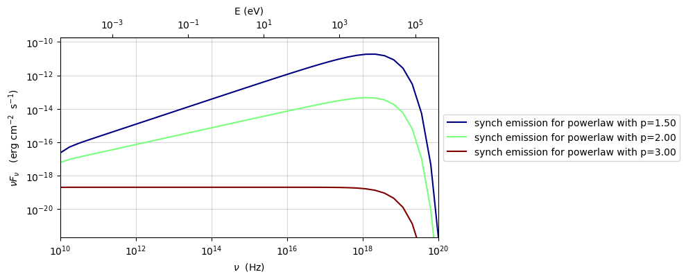
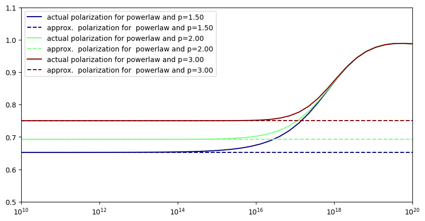
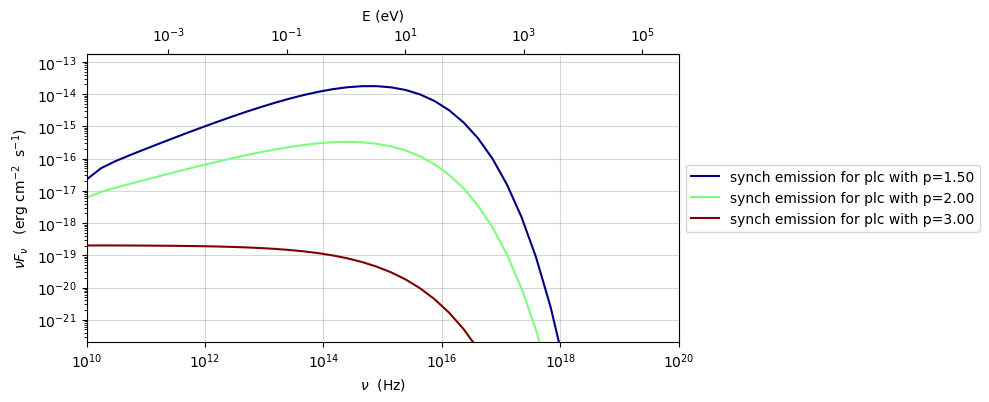
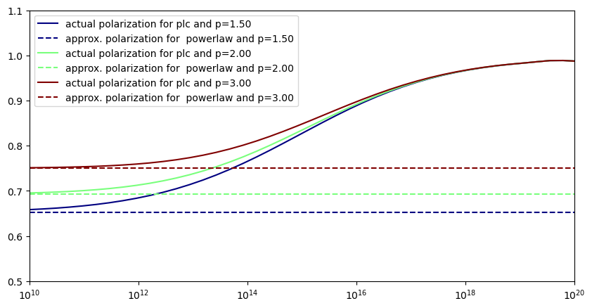

.. _jet_physical_synch_pol:

Synchrotron Polarization For Leptons
====================================

An initial support for leptonic synchrotro polarization has been
introduced. A standard interface, as for the other emitted components,
will be introduced in the next release. For the time being you can use
the code below to evaluate the polarization for a given electron
distribution for a ``nu_range`` range of frequencies

.. code:: ipython3

    def asymp_sync_pol(p):
        """
        polarization expected for a pure powerlaw
        see Rybicki & Lightman
        """
        return (p+1)/(p+7/3)

.. code:: ipython3

    from jetset.jet_model import Jet
    import numpy as np
    
    import matplotlib.pyplot as plt
    from jetset.plot_sedfit import PlotSED
    jet=Jet(name='test',electron_distribution='pl')
    jet.spectral_components.SSC.state='off'

.. parsed-literal::

    ===> setting C threads to 12

.. code:: ipython3

    sed_plot=PlotSED(figsize=(10,5))
    sed_plot.fig.delaxes(sed_plot.resplot)
    f,ax=plt.subplots(1,1,figsize=(10,5))
    nu_range=np.logspace(10,22,50)
    p_nu=np.zeros(nu_range.size)
    plot_obj=None
    colors = plt.cm.jet.reversed()(np.linspace(1,0,3))
    
    for ID_c,p in enumerate([1.5,2,3]):
        jet.parameters.p.val=p
        jet.parameters.gmin.val=1
        p_nu,nuF_nu=jet.eval_synch_pol(nu_range)
        sed_plot.add_xy_plot(nu_range,nuF_nu,color=colors[ID_c],label='synch emission for powerlaw with p=%2.2f'%p)
        ax.semilogx(nu_range,p_nu,c=colors[ID_c],label='actual polarization for powerlaw and p=%2.2f'%p)
        ax.axhline(asymp_sync_pol(p),ls='--',label='approx.  polarization for  powerlaw and p=%2.2f'%p,c=colors[ID_c])
    ax.legend()
    ax.set_xlim(1E10,1E20)
    ax.set_ylim(0.5,1.1)
    sed_plot.setlim(x_min=1E10,x_max=1E20)

.. code:: ipython3

    from jetset.jet_model import Jet
    import numpy as np
    
    import matplotlib.pyplot as plt
    from jetset.plot_sedfit import PlotSED
    jet=Jet(name='test',electron_distribution='plc')
    jet.spectral_components.SSC.state='off'

.. parsed-literal::

    ===> setting C threads to 12

.. code:: ipython3

    sed_plot=PlotSED(figsize=(10,5))
    sed_plot.fig.delaxes(sed_plot.resplot)
    f,ax=plt.subplots(1,1,figsize=(10,5))
    nu_range=np.logspace(10,22,50)
    p_nu=np.zeros(nu_range.size)
    plot_obj=None
    colors = plt.cm.jet.reversed()(np.linspace(1,0,3))
    
    for ID_c,p in enumerate([1.5,2,3]):
        jet.parameters.p.val=p
        jet.parameters.gmin.val=1
        p_nu,nuF_nu=jet.eval_synch_pol(nu_range)
        sed_plot.add_xy_plot(nu_range,nuF_nu,color=colors[ID_c],label='synch emission for plc with p=%2.2f'%p)
        ax.semilogx(nu_range,p_nu,c=colors[ID_c],label='actual polarization for plc and p=%2.2f'%p)
        ax.axhline(asymp_sync_pol(p),ls='--',label='approx. polarization for  powerlaw and p=%2.2f'%p,c=colors[ID_c])
    ax.legend()
    ax.set_xlim(1E10,1E20)
    ax.set_ylim(0.5,1.1)
    sed_plot.setlim(x_min=1E10,x_max=1E20)

