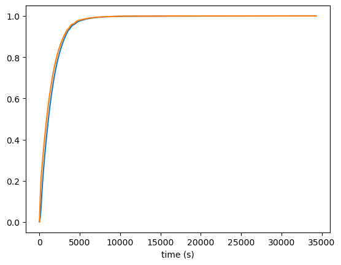
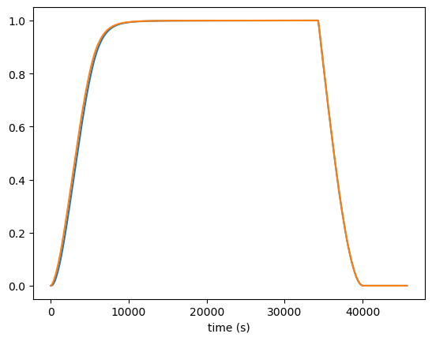
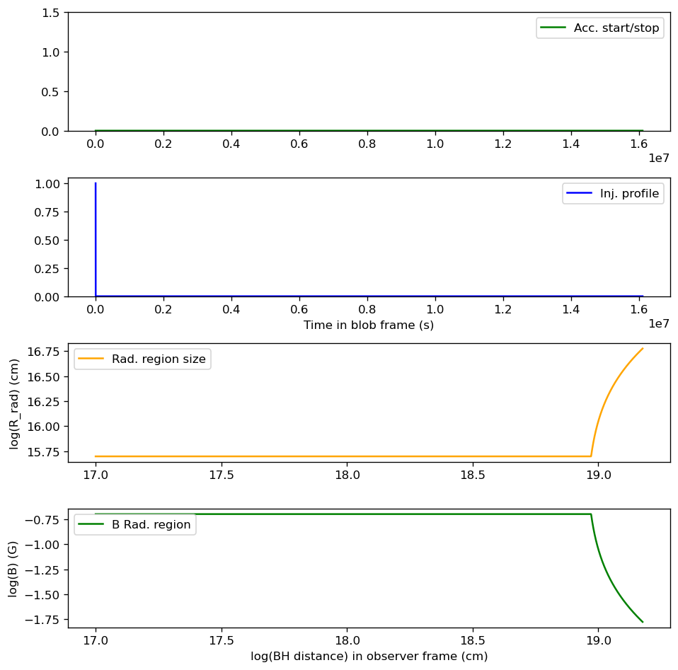
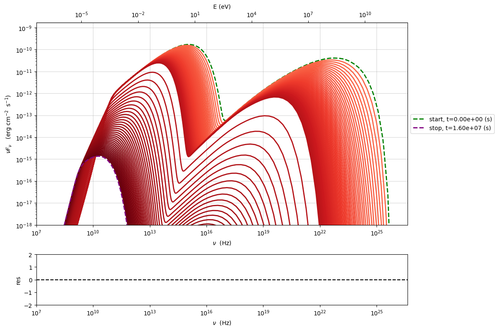

.. _temp_ev_two_zone_cooling_acc:

Temporal evolution, two zones, cooling+acc+adb exp
==================================================

.. code:: ipython3

    import warnings
    warnings.filterwarnings('ignore')

.. code:: ipython3

    import matplotlib.pyplot as plt
    import numpy as np

.. code:: ipython3

    import jetset
    print('tested on jetset',jetset.__version__)

.. parsed-literal::

    tested on jetset 1.3.0rc9

In this tutorial I show how to perform a full acc+radiative+adiabatic expansion simulation. To have full understanding of the analysis presented in this tutorial, it is advised to read the paper Tramacere et al (2022) [Tramacere2022]_.

We load the model of the flare simulated in
:ref:``temp_ev_two_zone_cooling_acc``. And the we evolve the radiative
region under the effect of radiative plus adiabatic cooling

.. code:: ipython3

    from jetset.jet_timedep import JetTimeEvol
    
    temp_ev_acc=JetTimeEvol.load_model('two_zone_rad_acc.pkl')

.. parsed-literal::

    ===> setting C threads to 12
    ===> setting C threads to 12

.. code:: ipython3

    temp_ev_acc.show_model()

.. parsed-literal::

    --------------------------------------------------------------------------------
    JetTimeEvol model description
    --------------------------------------------------------------------------------
     
    physical setup: 
    
    --------------------------------------------------------------------------------

.. raw:: html

    <i>Table length=29</i>
    <table id="table4603005872-569995" class="table-striped table-bordered table-condensed">
    <thead><tr><th>name</th><th>par type</th><th>val</th><th>units</th><th>val*</th><th>units*</th><th>log</th></tr></thead>
    <tr><td>delta t</td><td>time</td><td>5.000000e+01</td><td>s</td><td>0.00029979245799999996</td><td>R/c</td><td>False</td></tr>
    <tr><td>log. sampling</td><td>time</td><td>0.000000e+00</td><td></td><td>None</td><td></td><td>False</td></tr>
    <tr><td>R/c</td><td>time</td><td>1.667820e+05</td><td>s</td><td>1.0</td><td>R/c</td><td>False</td></tr>
    <tr><td>IC cooling</td><td></td><td>off</td><td></td><td>None</td><td></td><td>False</td></tr>
    <tr><td>Sync cooling</td><td></td><td>on</td><td></td><td>None</td><td></td><td>False</td></tr>
    <tr><td>Adiab. cooling</td><td></td><td>on</td><td></td><td>None</td><td></td><td>False</td></tr>
    <tr><td>Reg. expansion</td><td></td><td>off</td><td></td><td>None</td><td></td><td>False</td></tr>
    <tr><td>Diff coeff</td><td></td><td>6.666667e-06</td><td>s-1</td><td>None</td><td></td><td>False</td></tr>
    <tr><td>Acc coeff</td><td></td><td>4.000000e-05</td><td>s-1</td><td>None</td><td></td><td>False</td></tr>
    <tr><td>Diff index</td><td></td><td>2.000000e+00</td><td></td><td>None</td><td></td><td>False</td></tr>
    <tr><td>Acc index</td><td></td><td>1.000000e+00</td><td>s-1</td><td>None</td><td></td><td>False</td></tr>
    <tr><td>Tesc acc</td><td>time</td><td>5.003461e+04</td><td>s</td><td>3.0</td><td>R_acc/c</td><td>False</td></tr>
    <tr><td>Eacc max</td><td>energy</td><td>4.000000e+60</td><td>erg</td><td>None</td><td></td><td>False</td></tr>
    <tr><td>Tesc rad</td><td>time</td><td>1.667820e+65</td><td>s</td><td>1e+60</td><td>R/c</td><td>False</td></tr>
    <tr><td>Delta R acc</td><td>accelerator_width</td><td>5.000000e+14</td><td>cm</td><td>None</td><td></td><td>False</td></tr>
    <tr><td>B acc</td><td>magnetic field</td><td>2.000000e-01</td><td>cm</td><td>None</td><td></td><td>False</td></tr>
    <tr><td>R_rad rad start</td><td>region_position</td><td>5.000000e+15</td><td>cm</td><td>None</td><td></td><td>False</td></tr>
    <tr><td>R_H rad start</td><td>region_position</td><td>1.000000e+17</td><td>cm</td><td>None</td><td></td><td>False</td></tr>
    <tr><td>T_A0=1/ACC_COEFF</td><td>time</td><td>2.500000e+04</td><td>s</td><td>0.149896229</td><td>R/c</td><td>False</td></tr>
    <tr><td>T_D0=1/DIFF_COEFF</td><td>time</td><td>1.500000e+05</td><td>s</td><td>0.899377374</td><td>R/c</td><td>False</td></tr>
    <tr><td>T_DA0=1/(2*DIFF_COEFF)</td><td>time</td><td>7.500000e+04</td><td>s</td><td>0.449688687</td><td>R/c</td><td>False</td></tr>
    <tr><td>gamma Lambda Turb.  max</td><td></td><td>1.173358e+11</td><td></td><td>None</td><td></td><td>False</td></tr>
    <tr><td>gamma Lambda Coher. max</td><td></td><td>1.173358e+10</td><td></td><td>None</td><td></td><td>False</td></tr>
    <tr><td>gamma eq Syst. Acc (synch. cool)</td><td></td><td>7.832383e+05</td><td></td><td>None</td><td></td><td>False</td></tr>
    <tr><td>gamma eq Diff. Acc (synch. cool)</td><td></td><td>1.309535e+05</td><td></td><td>None</td><td></td><td>False</td></tr>
    <tr><td>T cooling(gamma_eq=gamma_eq_Diff)</td><td></td><td>1.477242e+05</td><td>s</td><td>None</td><td></td><td>False</td></tr>
    <tr><td>T cooling(gamma_eq=gamma_eq_Sys)</td><td></td><td>2.469874e+04</td><td>s</td><td>None</td><td></td><td>False</td></tr>
    <tr><td>T min. synch. cooling</td><td></td><td>1.934500e+02</td><td>s</td><td>None</td><td></td><td>False</td></tr>
    <tr><td>L inj (electrons)</td><td>injected lum.</td><td>5.000000e+39</td><td>erg/s</td><td>None</td><td></td><td>False</td></tr>
    </table>
    

.. parsed-literal::

    
    model parameters: 
    
    --------------------------------------------------------------------------------

.. raw:: html

    <i>Table length=30</i>
    <table id="table4602829056-946452" class="table-striped table-bordered table-condensed">
    <thead><tr><th>model name</th><th>name</th><th>par type</th><th>units</th><th>val</th><th>phys. bound. min</th><th>phys. bound. max</th><th>log</th><th>frozen</th></tr></thead>
    <tr><td>jet_time_ev</td><td>duration</td><td>time_grid</td><td>s</td><td>1.000000e+06</td><td>0.000000e+00</td><td>--</td><td>False</td><td>True</td></tr>
    <tr><td>jet_time_ev</td><td>gmin_grid</td><td>gamma_grid</td><td></td><td>1.000000e+00</td><td>0.000000e+00</td><td>--</td><td>False</td><td>True</td></tr>
    <tr><td>jet_time_ev</td><td>gmax_grid</td><td>gamma_grid</td><td></td><td>1.000000e+08</td><td>0.000000e+00</td><td>--</td><td>False</td><td>True</td></tr>
    <tr><td>jet_time_ev</td><td>gamma_grid_size</td><td>gamma_grid</td><td></td><td>1.500000e+03</td><td>0.000000e+00</td><td>--</td><td>False</td><td>True</td></tr>
    <tr><td>jet_time_ev</td><td>TStart_Acc</td><td>time_grid</td><td>s</td><td>0.000000e+00</td><td>0.000000e+00</td><td>--</td><td>False</td><td>True</td></tr>
    <tr><td>jet_time_ev</td><td>TStop_Acc</td><td>time_grid</td><td>s</td><td>1.000000e+05</td><td>0.000000e+00</td><td>--</td><td>False</td><td>True</td></tr>
    <tr><td>jet_time_ev</td><td>TStart_Inj</td><td>time_grid</td><td>s</td><td>0.000000e+00</td><td>0.000000e+00</td><td>--</td><td>False</td><td>True</td></tr>
    <tr><td>jet_time_ev</td><td>TStop_Inj</td><td>time_grid</td><td>s</td><td>1.000000e+05</td><td>0.000000e+00</td><td>--</td><td>False</td><td>True</td></tr>
    <tr><td>jet_time_ev</td><td>T_esc_acc</td><td>escape_time</td><td>(R_acc/c)*</td><td>3.000000e+00</td><td>--</td><td>--</td><td>False</td><td>True</td></tr>
    <tr><td>jet_time_ev</td><td>Esc_Index_acc</td><td>fp_coeff_index</td><td></td><td>0.000000e+00</td><td>--</td><td>--</td><td>False</td><td>True</td></tr>
    <tr><td>jet_time_ev</td><td>t_D0</td><td>acceleration_time</td><td>s</td><td>1.500000e+05</td><td>0.000000e+00</td><td>--</td><td>False</td><td>True</td></tr>
    <tr><td>jet_time_ev</td><td>t_A0</td><td>acceleration_time</td><td>s</td><td>2.500000e+04</td><td>0.000000e+00</td><td>--</td><td>False</td><td>True</td></tr>
    <tr><td>jet_time_ev</td><td>Diff_Index</td><td>fp_coeff_index</td><td>s</td><td>2.000000e+00</td><td>0.000000e+00</td><td>--</td><td>False</td><td>True</td></tr>
    <tr><td>jet_time_ev</td><td>Acc_Index</td><td>fp_coeff_index</td><td></td><td>1.000000e+00</td><td>--</td><td>--</td><td>False</td><td>True</td></tr>
    <tr><td>jet_time_ev</td><td>Delta_R_acc</td><td>accelerator_width</td><td>cm</td><td>5.000000e+14</td><td>0.000000e+00</td><td>--</td><td>False</td><td>True</td></tr>
    <tr><td>jet_time_ev</td><td>B_acc</td><td>magnetic_field</td><td>G</td><td>2.000000e-01</td><td>0.000000e+00</td><td>--</td><td>False</td><td>True</td></tr>
    <tr><td>jet_time_ev</td><td>E_acc_max</td><td>acc_energy</td><td>erg</td><td>4.000000e+60</td><td>0.000000e+00</td><td>--</td><td>False</td><td>True</td></tr>
    <tr><td>jet_time_ev</td><td>Lambda_max_Turb</td><td>turbulence_scale</td><td>cm</td><td>1.000000e+15</td><td>0.000000e+00</td><td>--</td><td>False</td><td>True</td></tr>
    <tr><td>jet_time_ev</td><td>Lambda_choer_Turb_factor</td><td>turbulence_scale</td><td>cm</td><td>1.000000e-01</td><td>0.000000e+00</td><td>--</td><td>False</td><td>True</td></tr>
    <tr><td>jet_time_ev</td><td>T_esc_rad</td><td>escape_time</td><td>(R/c)*</td><td>1.000000e+60</td><td>--</td><td>--</td><td>False</td><td>True</td></tr>
    <tr><td>jet_time_ev</td><td>Esc_Index_rad</td><td>fp_coeff_index</td><td></td><td>0.000000e+00</td><td>--</td><td>--</td><td>False</td><td>True</td></tr>
    <tr><td>jet_time_ev</td><td>R_rad_start</td><td>region_size</td><td>cm</td><td>5.000000e+15</td><td>0.000000e+00</td><td>--</td><td>False</td><td>True</td></tr>
    <tr><td>jet_time_ev</td><td>R_H_rad_start</td><td>region_position</td><td>cm</td><td>1.000000e+17</td><td>0.000000e+00</td><td>--</td><td>False</td><td>True</td></tr>
    <tr><td>jet_time_ev</td><td>m_B</td><td>magnetic_field_index</td><td></td><td>1.000000e+00</td><td>1.000000e+00</td><td>2.000000e+00</td><td>False</td><td>True</td></tr>
    <tr><td>jet_time_ev</td><td>t_jet_exp</td><td>exp_start_time</td><td>s</td><td>1.000000e+05</td><td>0.000000e+00</td><td>--</td><td>False</td><td>True</td></tr>
    <tr><td>jet_time_ev</td><td>beta_exp_R</td><td>beta_expansion</td><td>v/c*</td><td>1.000000e+00</td><td>0.000000e+00</td><td>1.000000e+00</td><td>False</td><td>True</td></tr>
    <tr><td>jet_time_ev</td><td>B_rad</td><td>magnetic_field</td><td>G</td><td>2.000000e-01</td><td>0.000000e+00</td><td>--</td><td>False</td><td>True</td></tr>
    <tr><td>jet_time_ev</td><td>t_size</td><td>time_grid</td><td></td><td>2.000000e+04</td><td>0.000000e+00</td><td>--</td><td>False</td><td>True</td></tr>
    <tr><td>jet_time_ev</td><td>num_samples</td><td>time_ev_output</td><td></td><td>5.000000e+02</td><td>0.000000e+00</td><td>--</td><td>False</td><td>True</td></tr>
    <tr><td>jet_time_ev</td><td>L_inj</td><td>inj_luminosity</td><td>erg / s</td><td>5.000000e+39</td><td>0.000000e+00</td><td>--</td><td>False</td><td>True</td></tr>
    </table>
    

here we set some relevant parameters that will be described in detail in
the next version of the documentation

.. code:: ipython3

    temp_ev_acc.plot_time_profile()

.. parsed-literal::

    <jetset.plot_sedfit.PlotTempEvDiagram at 0x11259a4d0>

.. image:: Temp_Ev_two_zones_acc_and_cooling_adb_exp_files/Temp_Ev_two_zones_acc_and_cooling_adb_exp_11_1.png

Particle spectrum in the radiative region

.. code:: ipython3

    p=temp_ev_acc.plot_tempev_emitters(region='rad',loglog=False,energy_unit='gamma',pow=0)
    p.ax.axvline(temp_ev_acc.temp_ev.gamma_eq_t_A, ls='--')
    p.ax.axvline(temp_ev_acc.temp_ev.gamma_eq_t_DA, ls='--')
    p.setlim(x_max=1E7,x_min=1,y_min=1E-18,y_max=100)

.. image:: Temp_Ev_two_zones_acc_and_cooling_adb_exp_files/Temp_Ev_two_zones_acc_and_cooling_adb_exp_13_0.png

SEDs in the radiation region

.. code:: ipython3

    p=temp_ev_acc.plot_tempev_model(region='rad',sed_data=None, use_cached = True)
    p.setlim(y_min=1E-18,x_min=1E7)

.. image:: Temp_Ev_two_zones_acc_and_cooling_adb_exp_files/Temp_Ev_two_zones_acc_and_cooling_adb_exp_15_0.png

We generate a lightcurve in the range nu1=2.4E22 Hz, nu2=7.2E25 Hz,
without the effect of the light crossing time, in the observer frame

.. code:: ipython3

    lg=temp_ev_acc.rad_region.make_lc(nu1=2.4E22,nu2=7.2E25,name='gamma',eval_cross_time=False,delta_t_out=100,use_cached=True,frame='obs')

.. code:: ipython3

    plt.plot(lg['time'],lg['flux'])
    plt.xlabel('time (%s)'%lg['time'].unit)
    plt.ylabel('flux (%s)'%lg['flux'].unit)

.. parsed-literal::

    Text(0, 0.5, 'flux (erg / (s cm2))')

.. image:: Temp_Ev_two_zones_acc_and_cooling_adb_exp_files/Temp_Ev_two_zones_acc_and_cooling_adb_exp_18_1.png

We generate a lightcurve in the range nu1=2.4E22 Hz, nu2=7.2E25 Hz, with
the effect of the light crossing time, in the observer frame

.. code:: ipython3

    lg_cross=temp_ev_acc.rad_region.make_lc(nu1=2.4E22,nu2=7.2E25,name='gamma',eval_cross_time=True,delta_t_out=100,use_cached=True,frame='obs',cross_time_slices=100)

.. code:: ipython3

    plt.plot(lg['time'],lg['flux'])
    plt.plot(lg_cross['time'],lg_cross['flux'])
    
    plt.xlabel('time (%s)'%lg['time'].unit)
    plt.ylabel('flux (%s)'%lg['flux'].unit)

.. parsed-literal::

    Text(0, 0.5, 'flux (erg / (s cm2))')

.. image:: Temp_Ev_two_zones_acc_and_cooling_adb_exp_files/Temp_Ev_two_zones_acc_and_cooling_adb_exp_21_1.png

.. code:: ipython3

    lr_1=temp_ev_acc.rad_region.make_lc(nu1=1E10,name='1E10 Hz',eval_cross_time=False,delta_t_out=100,use_cached=True,frame='obs')
    lr_2=temp_ev_acc.rad_region.make_lc(nu1=5E9,name='1E9 Hz',eval_cross_time=False,delta_t_out=100,use_cached=True,frame='obs')

.. code:: ipython3

    plt.plot(lr_1['time'],lr_1['flux']/lr_1['flux'].max())
    plt.plot(lr_2['time'],lr_2['flux']/lr_2['flux'].max())
    
    plt.xlabel('time (%s)'%lr_1['time'].unit)
    

.. parsed-literal::

    Text(0.5, 0, 'time (s)')

.. code:: ipython3

    lr_1_cross=temp_ev_acc.rad_region.make_lc(nu1=1E10,name='gamma',eval_cross_time=True,delta_t_out=100,use_cached=True,frame='obs',cross_time_slices=100)
    lr_2_cross=temp_ev_acc.rad_region.make_lc(nu1=5E9,name='gamma',eval_cross_time=True,delta_t_out=100,use_cached=True,frame='obs',cross_time_slices=100)
    

.. code:: ipython3

    plt.plot(lr_1_cross['time'],lr_1_cross['flux']/lr_1_cross['flux'].max())
    plt.plot(lr_2_cross['time'],lr_2_cross['flux']/lr_2_cross['flux'].max())
    
    plt.xlabel('time (%s)'%lr_1_cross['time'].unit)
    

.. parsed-literal::

    Text(0.5, 0, 'time (s)')

Expanding the radiative region
------------------------------

We now plug the radiative region from ``temp_ev_acc`` to new model with
adiabatic expansion

the following two functions define an estimate of the total extent of
the simulation to follow the expansion

.. important:: 
   if you use a ``jet`` model with ``R`` depending (i.e. you used :meth:`.JetBase.make_conical_jet`) to perform a temporal evolution (in the :class:`.JetTimeEvol` class), the dependencies on ``R`` will be removed, and to have ``R`` dependent on the position across the jet axis, use the parameter ``beta_exp_R`` in the :class:`.JetTimeEvol` instead. In the next release a more flexible and direct approach will be provided.

.. code:: ipython3

    def delta_t_est(t_exp,R0,beta_exp):
        return t_exp+R0/(beta_exp*3E10)
    
    def t_dec_est(R0,a,beta_exp):
        return ((R0+beta_exp*3E10)*np.power(beta_exp*3E10,a))

we set the initial radius equal to the radius of the radiative region of
the ``temp_ev_acc`` model

.. code:: ipython3

    t_exp=1E7
    beta_exp=0.3
    R0=temp_ev_acc.rad_region.jet.parameters.R.val
    duration=delta_t_est(t_exp,R0,beta_exp)+10*t_dec_est(R0,-1,beta_exp)

we build the ``temp_ev_expansion`` expansion model

.. code:: ipython3

    from jetset.jet_timedep import JetTimeEvol
    temp_ev_expansion=JetTimeEvol(jet_rad=temp_ev_acc.rad_region.jet,inplace=True,only_radiation=True,Q_inj=None)
    
    temp_ev_expansion.rad_region.jet.nu_min=1E8
    T_SIZE=np.int32(duration/1000)
    NUM_SET=np.int32(T_SIZE)
    NUM_SET=min(5000,NUM_SET)
    
    
    temp_ev_expansion.parameters.TStart_Inj.val=-0
    temp_ev_expansion.parameters.TStop_Inj.val=-0
    
    temp_ev_expansion.parameters.duration.val=duration
    temp_ev_expansion.parameters.T_esc_rad.val=1E60
    temp_ev_expansion.parameters.Esc_Index_rad.val=0
    temp_ev_expansion.parameters.t_size.val=T_SIZE
    temp_ev_expansion.parameters.num_samples.val=NUM_SET
    
    
    temp_ev_expansion.parameters.gmin_grid.val=1.0
    temp_ev_expansion.parameters.gmax_grid.val=1E8
    temp_ev_expansion.parameters.gamma_grid_size.val=1500
    
    

.. parsed-literal::

    ===> setting C threads to 12
    ===> setting C threads to 12
    ===> setting C threads to 12
    ===> setting C threads to 12

we set to ``'on'`` the region expansion, and we set the relevant
paramters

.. code:: ipython3

    temp_ev_expansion.region_expansion='on'
    temp_ev_expansion.parameters.t_jet_exp.val=t_exp
    temp_ev_expansion.parameters.beta_exp_R.val = beta_exp
    temp_ev_expansion.parameters.R_rad_start.val = R0

.. code:: ipython3

    temp_ev_expansion.init_TempEv()
    temp_ev_expansion.show_model()

.. parsed-literal::

    --------------------------------------------------------------------------------
    JetTimeEvol model description
    --------------------------------------------------------------------------------
     
    physical setup: 
    
    --------------------------------------------------------------------------------

.. raw:: html

    <i>Table length=12</i>
    <table id="table4514274832-38200" class="table-striped table-bordered table-condensed">
    <thead><tr><th>name</th><th>par type</th><th>val</th><th>units</th><th>val*</th><th>units*</th><th>log</th></tr></thead>
    <tr><td>delta t</td><td>time</td><td>1.000008e+03</td><td>s</td><td>0.005995894232556255</td><td>R/c</td><td>False</td></tr>
    <tr><td>log. sampling</td><td>time</td><td>0.000000e+00</td><td></td><td>None</td><td></td><td>False</td></tr>
    <tr><td>R/c</td><td>time</td><td>1.667820e+05</td><td>s</td><td>1.0</td><td>R/c</td><td>False</td></tr>
    <tr><td>IC cooling</td><td></td><td>off</td><td></td><td>None</td><td></td><td>False</td></tr>
    <tr><td>Sync cooling</td><td></td><td>on</td><td></td><td>None</td><td></td><td>False</td></tr>
    <tr><td>Adiab. cooling</td><td></td><td>on</td><td></td><td>None</td><td></td><td>False</td></tr>
    <tr><td>Reg. expansion</td><td></td><td>on</td><td></td><td>None</td><td></td><td>False</td></tr>
    <tr><td>Tesc rad</td><td>time</td><td>1.667820e+65</td><td>s</td><td>1e+60</td><td>R/c</td><td>False</td></tr>
    <tr><td>R_rad rad start</td><td>region_position</td><td>5.000000e+15</td><td>cm</td><td>None</td><td></td><td>False</td></tr>
    <tr><td>R_H rad start</td><td>region_position</td><td>1.000000e+17</td><td>cm</td><td>None</td><td></td><td>False</td></tr>
    <tr><td>beta exp.</td><td>region_position</td><td>3.000000e-01</td><td>v/c</td><td>8993773740.0 cm / s</td><td>cm/s</td><td>False</td></tr>
    <tr><td>T min. synch. cooling</td><td></td><td>1.934500e+02</td><td>s</td><td>None</td><td></td><td>False</td></tr>
    </table>
    

.. parsed-literal::

    
    model parameters: 
    
    --------------------------------------------------------------------------------

.. raw:: html

    <i>Table length=17</i>
    <table id="table4514275984-516874" class="table-striped table-bordered table-condensed">
    <thead><tr><th>model name</th><th>name</th><th>par type</th><th>units</th><th>val</th><th>phys. bound. min</th><th>phys. bound. max</th><th>log</th><th>frozen</th></tr></thead>
    <tr><td>jet_time_ev</td><td>duration</td><td>time_grid</td><td>s</td><td>1.611112e+07</td><td>0.000000e+00</td><td>--</td><td>False</td><td>True</td></tr>
    <tr><td>jet_time_ev</td><td>gmin_grid</td><td>gamma_grid</td><td></td><td>1.000000e+00</td><td>0.000000e+00</td><td>--</td><td>False</td><td>True</td></tr>
    <tr><td>jet_time_ev</td><td>gmax_grid</td><td>gamma_grid</td><td></td><td>1.000000e+08</td><td>0.000000e+00</td><td>--</td><td>False</td><td>True</td></tr>
    <tr><td>jet_time_ev</td><td>gamma_grid_size</td><td>gamma_grid</td><td></td><td>1.500000e+03</td><td>0.000000e+00</td><td>--</td><td>False</td><td>True</td></tr>
    <tr><td>jet_time_ev</td><td>TStart_Inj</td><td>time_grid</td><td>s</td><td>0.000000e+00</td><td>0.000000e+00</td><td>--</td><td>False</td><td>True</td></tr>
    <tr><td>jet_time_ev</td><td>TStop_Inj</td><td>time_grid</td><td>s</td><td>0.000000e+00</td><td>0.000000e+00</td><td>--</td><td>False</td><td>True</td></tr>
    <tr><td>jet_time_ev</td><td>T_esc_rad</td><td>escape_time</td><td>(R/c)*</td><td>1.000000e+60</td><td>--</td><td>--</td><td>False</td><td>True</td></tr>
    <tr><td>jet_time_ev</td><td>Esc_Index_rad</td><td>fp_coeff_index</td><td></td><td>0.000000e+00</td><td>--</td><td>--</td><td>False</td><td>True</td></tr>
    <tr><td>jet_time_ev</td><td>R_rad_start</td><td>region_size</td><td>cm</td><td>5.000000e+15</td><td>0.000000e+00</td><td>--</td><td>False</td><td>True</td></tr>
    <tr><td>jet_time_ev</td><td>R_H_rad_start</td><td>region_position</td><td>cm</td><td>1.000000e+17</td><td>0.000000e+00</td><td>--</td><td>False</td><td>True</td></tr>
    <tr><td>jet_time_ev</td><td>m_B</td><td>magnetic_field_index</td><td></td><td>1.000000e+00</td><td>1.000000e+00</td><td>2.000000e+00</td><td>False</td><td>True</td></tr>
    <tr><td>jet_time_ev</td><td>t_jet_exp</td><td>exp_start_time</td><td>s</td><td>1.000000e+07</td><td>0.000000e+00</td><td>--</td><td>False</td><td>True</td></tr>
    <tr><td>jet_time_ev</td><td>beta_exp_R</td><td>beta_expansion</td><td>v/c*</td><td>3.000000e-01</td><td>0.000000e+00</td><td>1.000000e+00</td><td>False</td><td>True</td></tr>
    <tr><td>jet_time_ev</td><td>B_rad</td><td>magnetic_field</td><td>G</td><td>2.000000e-01</td><td>0.000000e+00</td><td>--</td><td>False</td><td>True</td></tr>
    <tr><td>jet_time_ev</td><td>t_size</td><td>time_grid</td><td></td><td>1.611100e+04</td><td>0.000000e+00</td><td>--</td><td>False</td><td>True</td></tr>
    <tr><td>jet_time_ev</td><td>num_samples</td><td>time_ev_output</td><td></td><td>5.000000e+03</td><td>0.000000e+00</td><td>--</td><td>False</td><td>True</td></tr>
    <tr><td>jet_time_ev</td><td>L_inj</td><td>inj_luminosity</td><td>erg / s</td><td>1.000000e+39</td><td>0.000000e+00</td><td>--</td><td>False</td><td>True</td></tr>
    </table>
    

.. code:: ipython3

    temp_ev_expansion.plot_time_profile()

.. parsed-literal::

    <jetset.plot_sedfit.PlotTempEvDiagram at 0x15156bf40>

.. note::  we set ``do_injection=False`` because we want only to evolve the particle already injected and evolved in the radiative region of the ``temp_ev_acc`` model. Setting ``cache_SEDs_rad=True`` will generate and cache all the SED at any time of the ``NUM_SET``. **This will increase the computational time during the run. Anyhow, will speed up the computation of SEDs and light curves. Moreover, these SEDs will be saved in the model, and will be read if once you will load the model in the future**.

.. code:: ipython3

    temp_ev_expansion.run(cache_SEDs_rad=True,do_injection=False)

.. parsed-literal::

    temporal evolution running

.. parsed-literal::

      0%|          | 0/16111 [00:00<?, ?it/s]

.. parsed-literal::

    temporal evolution completed
    caching SED for each saved distribution: start

.. parsed-literal::

      0%|          | 0/5000 [00:00<?, ?it/s]

.. parsed-literal::

    caching SED for each saved distribution: done

we now evaluate light curves, and plot the combination of the flare and
adiabatic expansion simulations, for both the radio and gamma

.. code:: ipython3

    lr_1_exp=temp_ev_expansion.rad_region.make_lc(nu1=1E10,name='1E10 Hz',eval_cross_time=False,delta_t_out=100,use_cached=True,frame='obs')
    lr_2_exp=temp_ev_expansion.rad_region.make_lc(nu1=5E9,name='1E9 Hz',eval_cross_time=False,delta_t_out=100,use_cached=True,frame='obs')
    lr_1_exp['time']+=lr_1['time'][-1]
    lr_2_exp['time']+=lr_2['time'][-1]

.. code:: ipython3

    lg_exp=temp_ev_expansion.rad_region.make_lc(nu1=2.4E22,nu2=7.2E25,name='gamma',eval_cross_time=False,delta_t_out=100,use_cached=True,frame='obs')
    lg=temp_ev_acc.rad_region.make_lc(nu1=2.4E22,nu2=7.2E25,name='gamma',eval_cross_time=False,delta_t_out=100,use_cached=True,frame='obs')
    lg_exp['time']+=lg['time'][-1]

.. code:: ipython3

    plt.plot(lr_1['time'],lr_1['flux']/lr_1_exp['flux'].max(),c='b')
    plt.plot(lr_2['time'],lr_2['flux']/lr_2_exp['flux'].max(),c='g')
    
    plt.plot(lr_1_exp['time'],lr_1_exp['flux']/lr_1_exp['flux'].max(),label='10 GHz',c='b')
    plt.plot(lr_2_exp['time'],lr_2_exp['flux']/lr_2_exp['flux'].max(),label='1 GHz',c='g')
    plt.plot(lg['time'],lg['flux']/lg['flux'].max(),c='purple',label='gamma')
    plt.plot(lg_exp['time'],lg_exp['flux']/lg['flux'].max(),c='purple')
    plt.xlabel('time (%s)'%lr_1['time'].unit)
    plt.legend()

.. parsed-literal::

    <matplotlib.legend.Legend at 0x10d0dfb80>

.. image:: Temp_Ev_two_zones_acc_and_cooling_adb_exp_files/Temp_Ev_two_zones_acc_and_cooling_adb_exp_44_1.png

we notice the two peaks in the radio lightcurves, due to transition of the SSA frequency generated by the expansion (see [Tramacere2022]_ for more details)

.. code:: ipython3

    p=temp_ev_expansion.plot_tempev_model(region='rad',sed_data=None, use_cached = True,time_slice_bin=50)
    p.setlim(y_min=1E-18,x_min=1E7)

.. code:: ipython3

    from jetset.plot_sedfit import PlotSED
    
    p=PlotSED(frame='obs',density=False)
    p.resplot.remove()
    skip_label=False
    
    step=int(temp_ev_expansion.parameters.num_samples.val/50)
    
    for i in  range(0,NUM_SET,step):
        t=temp_ev_expansion.rad_region.time_sampled_emitters._get_time_samples(time_slice=i)
        s=temp_ev_expansion.rad_region.get_SED(comp='Sum',time_slice=i,frame='obs',use_cached=True)
        s_sync=temp_ev_expansion.rad_region.get_SED(comp='Sync',time_slice=i,frame='obs',use_cached=True)
        s_IC=temp_ev_expansion.rad_region.get_SED(comp='SSC',time_slice=i,frame='obs',use_cached=True)
    
        if t[0][0]<temp_ev_expansion.parameters.t_jet_exp.val:
            c='C0'
        else:
            c='C1'
        label=None
        if i==0:
            label='pre expansion'
        if t[0][0]>=temp_ev_expansion.parameters.t_jet_exp.val and skip_label is False:
            label='expansion'
            skip_label=True
        p.add_model_plot(model=s,label=label,color=c,density=False,auto_label=False)
    
    p.setlim(y_min=1E-18,x_min=1E7)
    

.. image:: Temp_Ev_two_zones_acc_and_cooling_adb_exp_files/Temp_Ev_two_zones_acc_and_cooling_adb_exp_47_0.png

