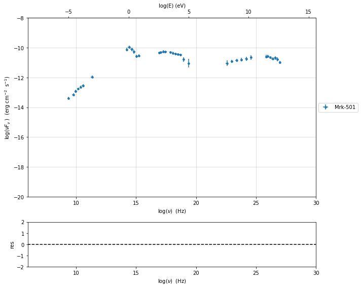
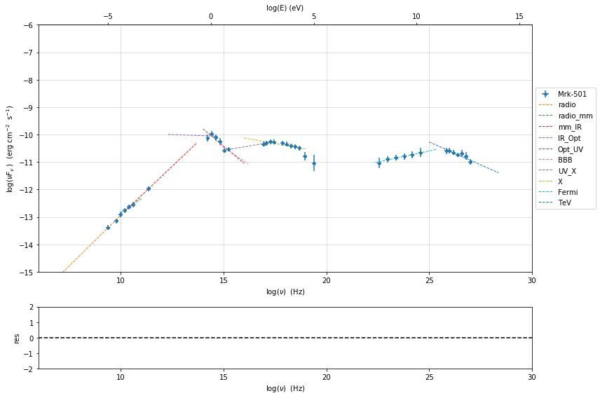
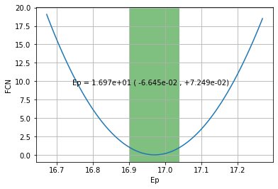
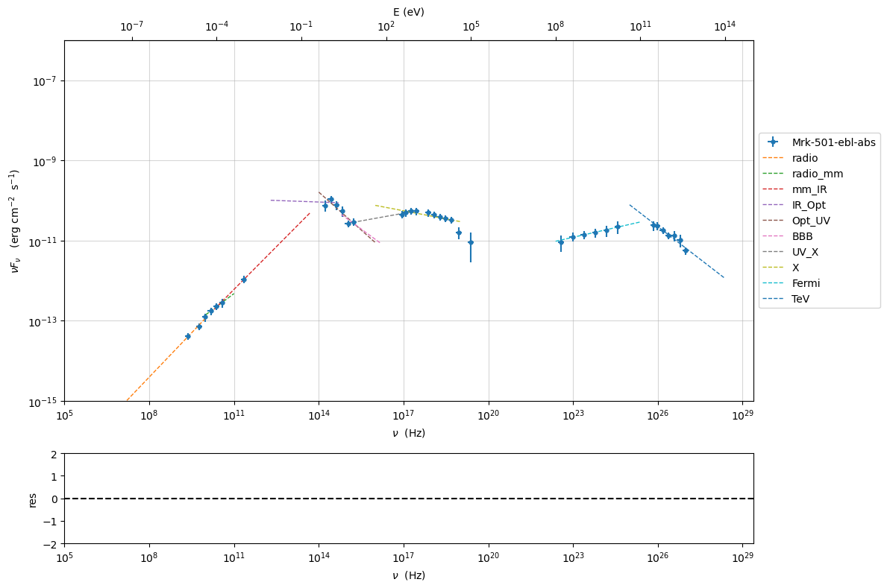
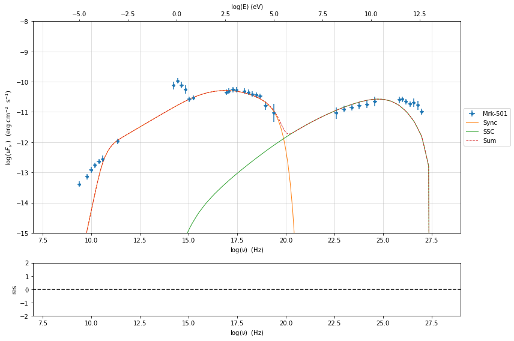

.. _phenom_constr:

Phenomenological model constraining
===================================

.. code:: ipython3

    import warnings
    warnings.filterwarnings('ignore')
    
    import matplotlib.pylab as plt
    from jetset.test_data_helper import  test_SEDs
    from jetset.data_loader import ObsData,Data
    from jetset.plot_sedfit import PlotSED
    from jetset.test_data_helper import  test_SEDs

.. code:: ipython3

    print(test_SEDs[1])
    data=Data.from_file(test_SEDs[2])

.. parsed-literal::

    /Users/orion/anaconda3/envs/jetset/lib/python3.7/site-packages/jetset-1.1.2-py3.7-macosx-10.9-x86_64.egg/jetset/test_data/SEDs_data/SED_MW_Mrk421_EBL_DEABS.ecsv

.. code:: ipython3

    %matplotlib inline
    from jetset.cosmo_tools import Cosmo
    c=Cosmo()
    sed_data=ObsData(data_table=data,cosmo=c)
    sed_data.group_data(bin_width=0.2)
    sed_data.add_systematics(0.2,[10.**6,10.**29])

.. parsed-literal::

    ===================================================================================================================
    
    ***  binning data  ***
    ---> N bins= 90
    ---> bin_widht= 0.2
    ===================================================================================================================
    

.. code:: ipython3

    sed_data.save('Mrk_501.pkl')

.. code:: ipython3

    p=sed_data.plot_sed()

.. code:: ipython3

    from jetset.sed_shaper import  SEDShape
    my_shape=SEDShape(sed_data)
    my_shape.eval_indices()
    p=my_shape.plot_indices()
    p.rescale(y_min=-15,y_max=-6)

.. parsed-literal::

    ===================================================================================================================
    
    *** evaluating spectral indices for data ***
    ===================================================================================================================
    

.. code:: ipython3

    mm,best_fit=my_shape.sync_fit(check_host_gal_template=True,
                      Ep_start=None,
                      minimizer='minuit',
                      silent=True,
                      fit_range=[10,21])
    
    
    mm.minimizer.minos_errors()
    x,y,z,fig,ax=mm.minimizer.draw_contour('Ep','b')
    x,y,fig,ax=mm.minimizer.draw_profile('Ep')

.. parsed-literal::

    ===================================================================================================================
    
    *** Log-Polynomial fitting of the synchrotron component ***
    ---> first blind fit run,  fit range: [10, 21]
    ---> class:  HSP
    
    ---> class:  HSP
    
    
     model name     name      bestfit val     err +     err -   start val   fit range min fit range max frozen
    ----------- ------------ ------------- ------------ ----- ------------- ------------- ------------- ------
       LogCubic            b -7.192333e-02 1.382165e-02    -- -5.476187e-02 -1.000000e+01  0.000000e+00  False
       LogCubic            c -2.757549e-03 2.075296e-03    --  3.835964e-03 -1.000000e+01  1.000000e+01  False
       LogCubic           Ep  1.697013e+01 1.495082e-01    --  1.603696e+01  0.000000e+00  3.000000e+01  False
       LogCubic           Sp -1.029110e+01 3.685184e-02    -- -1.021047e+01 -3.000000e+01  0.000000e+00  False
    host_galaxy nuFnu_p_host -1.007762e+01 7.831960e-02    -- -1.021047e+01 -1.221047e+01 -8.210473e+00  False
    host_galaxy     nu_scale  3.438156e-02 1.030235e-03    --  0.000000e+00 -5.000000e-01  5.000000e-01  False
    ---> sync       nu_p=+1.697013e+01 (err=+1.495082e-01)  nuFnu_p=-1.029110e+01 (err=+3.685184e-02) curv.=-7.192333e-02 (err=+1.382165e-02)
    ===================================================================================================================
    
    -------------------------------------------------------------------------------------------
    |   | Name  |   Value   | Hesse Err | Minos Err- | Minos Err+ | Limit-  | Limit+  | Fixed |
    -------------------------------------------------------------------------------------------
    | 0 | par_0 |  -0.072   |   0.014   |   -0.014   |    0.014   |   -10   |    0    |       |
    | 1 | par_1 |  -2.8E-3  |   2.1E-3  |  -2.0E-3   |   2.0E-3   |   -10   |   10    |       |
    | 2 | par_2 |   16.97   |    0.15   |   -0.15    |    0.15    |    0    |   30    |       |
    | 3 | par_3 |  -10.29   |    0.04   |   -0.04    |    0.04    |   -30   |    0    |       |
    | 4 | par_4 |  -10.08   |    0.08   |   -0.08    |    0.08    |-12.2105 |-8.21047 |       |
    | 5 | par_5 |  0.344E-1 |  0.010E-1 | -0.010E-1  |  0.010E-1  |  -0.5   |   0.5   |       |
    -------------------------------------------------------------------------------------------

.. image:: Jet_example_phenom_constr_files/Jet_example_phenom_constr_8_1.png

.. code:: ipython3

    my_shape.IC_fit(fit_range=[21,29],minimizer='lsb')
    p=my_shape.plot_shape_fit()
    p.rescale(y_min=-15,x_min=7,x_max=29)

.. parsed-literal::

    ===================================================================================================================
    
    *** Log-Polynomial fitting of the IC component ***
    ---> fit range: [21, 29]
    ---> LogCubic fit
    
    **************************************************************************************************
    Fit report
    
    Model: IC-shape-fit
    model name name   par type       units          val      phys. bound. min phys. bound. max  log  frozen
    ---------- ---- ------------ ------------- ------------- ---------------- ---------------- ----- ------
      LogCubic    b    curvature               -1.239376e-01    -1.000000e+01     0.000000e+00 False  False
      LogCubic    c third-degree               -2.636682e-02    -1.000000e+01     1.000000e+01 False  False
      LogCubic   Ep    peak freq            Hz  2.545172e+01     0.000000e+00     3.000000e+01  True  False
      LogCubic   Sp    peak flux erg / (cm2 s) -1.057063e+01    -3.000000e+01     0.000000e+00  True  False
    
    converged=True
    calls=33
    Both actual and predicted relative reductions in the sum of squares
      are at most 0.000000 and the relative error between two consecutive iterates is at 
      most 0.000000
    dof=9
    chisq=1.256424, chisq/red=0.139603 null hypothesis sig=0.998583
    
    best fit pars
    model name name  bestfit val     err +     err -   start val   fit range min fit range max frozen
    ---------- ---- ------------- ------------ ----- ------------- ------------- ------------- ------
      LogCubic    b -1.239376e-01 1.501286e-02    -- -1.000000e+00 -1.000000e+01  0.000000e+00  False
      LogCubic    c -2.636682e-02 6.064144e-03    -- -1.000000e+00 -1.000000e+01  1.000000e+01  False
      LogCubic   Ep  2.545172e+01 7.473138e-02    --  2.546097e+01  0.000000e+00  3.000000e+01  False
      LogCubic   Sp -1.057063e+01 2.131005e-02    -- -1.000000e+01 -3.000000e+01  0.000000e+00  False
    **************************************************************************************************
    
    
    
    model name name  bestfit val     err +     err -   start val   fit range min fit range max frozen
    ---------- ---- ------------- ------------ ----- ------------- ------------- ------------- ------
      LogCubic    b -1.239376e-01 1.501286e-02    -- -1.000000e+00 -1.000000e+01  0.000000e+00  False
      LogCubic    c -2.636682e-02 6.064144e-03    -- -1.000000e+00 -1.000000e+01  1.000000e+01  False
      LogCubic   Ep  2.545172e+01 7.473138e-02    --  2.546097e+01  0.000000e+00  3.000000e+01  False
      LogCubic   Sp -1.057063e+01 2.131005e-02    -- -1.000000e+01 -3.000000e+01  0.000000e+00  False
    ---> IC         nu_p=+2.545172e+01 (err=+7.473138e-02)  nuFnu_p=-1.057063e+01 (err=+2.131005e-02) curv.=-1.239376e-01 (err=+1.501286e-02)
    ===================================================================================================================
    

.. code:: ipython3

    from jetset.obs_constrain import ObsConstrain
    from jetset.model_manager import  FitModel
    from jetset.minimizer import fit_SED
    sed_obspar=ObsConstrain(beaming=15,
                            B_range=[0.01,0.1],
                            distr_e='lppl',
                            t_var_sec=1*86400,
                            nu_cut_IR=5E10,
                            SEDShape=my_shape)
    
    
    jet=sed_obspar.constrain_SSC_model(electron_distribution_log_values=True,silent=False)

.. parsed-literal::

    ===================================================================================================================
    
    ***  constrains parameters from observable ***
    
    ---> ***  emitting region parameters  ***
    ---> name = beam_obj          type = beaming               units = Lorentz-factor*   val = +1.500000e+01  phys-bounds = [+1.000000e-04,No           ] islog = False  froze= False 
    ---> setting par type redshift, corresponding to par z_cosm
    --->  name = z_cosm            type = redshift              units =                   val = +3.360000e-02  phys-bounds = [+0.000000e+00,No           ] islog = False  froze= False 
    
    ---> setting par type magnetic_field, corresponding to par B
    --->  name = B                 type = magnetic_field        units = G                 val = +5.500000e-02  phys-bounds = [+0.000000e+00,No           ] islog = False  froze= False 
    
    ---> setting par type region_size, corresponding to par R
    --->  name = R                 type = region_size           units = cm                val = +3.759008e+16  phys-bounds = [+1.000000e+03,+1.000000e+30] islog = False  froze= False 
    
    
    ---> *** electron distribution parameters ***
    ---> distribution type:  lppl
    ---> r elec. spec. curvature =3.596166e-01
    ---> setting par type curvature, corresponding to par r
    --->  name = r                 type = spectral_curvature    units =                   val = +3.596166e-01  phys-bounds = [-1.500000e+01,+1.500000e+01] islog = False  froze= False 
    
    ---> s_radio_mm -0.47152657988709734 1.9430531597741947
    ---> s_X 3.2697987439778373
    ---> s_Fermi 1.742749327549109
    ---> s_UV_X 2.745697034461969
    ---> s_Opt_UV -1.6299328530633286 4.259865706126657
    ---> s from synch log-log fit -1.0
    ---> s from (s_Fermi + s_UV)/2
    ---> power-law index s, class obj=HSP s chosen is 2.244223
    ---> setting par type LE_spectral_slope, corresponding to par s
    --->  name = s                 type = LE_spectral_slope     units =                   val = +2.244223e+00  phys-bounds = [-1.000000e+01,+1.000000e+01] islog = False  froze= False 
    
    ---> gamma_3p_Sync= 1.777932e+05, assuming B=5.500000e-02
    ---> gamma_max=2.858471e+06 from nu_max_Sync= 2.413075e+19, using B=5.500000e-02
    ---> setting par type high-energy-cut-off, corresponding to par gmax
    --->  name = gmax              type = high-energy-cut-off   units = lorentz-factor*   val = +6.456134e+00  phys-bounds = [+0.000000e+00,+1.500000e+01] islog = True  froze= False 
    
    ---> setting par type low-energy-cut-off, corresponding to par gmin
    --->  name = gmin              type = low-energy-cut-off    units = lorentz-factor*   val = +2.114333e+00  phys-bounds = [+0.000000e+00,+9.000000e+00] islog = True  froze= False 
    
    ---> setting par type turn-over energy, corresponding to par gamma0_log_parab
    ---> using gamma_3p_Sync= 177793.17843886977
    --->  name = gamma0_log_parab  type = turn-over-energy      units = lorentz-factor*   val = +4.199106e+00  phys-bounds = [+0.000000e+00,+9.000000e+00] islog = True  froze= False 
    
    nu_p_seed_blob 6432719309927042.0
    COMP FACTOR 9.256256900025962 23213.162343496708
    ---> gamma_3p_SSCc= %e 315936.8202363262
    ---> setting par type turn-over energy, corresponding to par gamma0_log_parab
    ---> using gamma_3p_SSC= 315936.8202363262
    --->  name = gamma0_log_parab  type = turn-over-energy      units = lorentz-factor*   val = +4.448791e+00  phys-bounds = [+0.000000e+00,+9.000000e+00] islog = True  froze= False 
    
    
    ---> setting par type emitters_density, corresponding to par N
    ---> name = N                 type = emitters_density      units = 1 / cm3           val = +2.705773e+00  phys-bounds = [+0.000000e+00,No           ] islog = False  froze= False 
    ---> B from nu_p_S=1.741776e-02
    ---> get B from best matching of nu_p_IC
    ---> B=1.042631e-01, out of boundaries 1.000000e-02 1.000000e-01, rejected
         Best B not found, (temporary set to 1.000000e-01)
    ---> setting par type magnetic_field, corresponding to par B
    --->  name = B                 type = magnetic_field        units = G                 val = +1.000000e-01  phys-bounds = [+0.000000e+00,No           ] islog = False  froze= False 
    
    ---> constrain failed, B set to:  name = B                 type = magnetic_field        units = G                 val = +1.000000e-01  phys-bounds = [+0.000000e+00,No           ] islog = False  froze= False 
    
    
    ---> update pars for new B 
    ---> setting par type low-energy-cut-off, corresponding to par gmin
    --->  name = gmin              type = low-energy-cut-off    units = lorentz-factor*   val = +1.984515e+00  phys-bounds = [+0.000000e+00,+9.000000e+00] islog = True  froze= False 
    
    ---> setting par type low-energy-cut-off, corresponding to par gamma0_log_parab
    ---> using gamma_3p_Sync= 131854.9500954275
    --->  name = gamma0_log_parab  type = turn-over-energy      units = lorentz-factor*   val = +4.069287e+00  phys-bounds = [+0.000000e+00,+9.000000e+00] islog = True  froze= False 
    
    ---> gamma_max=2.119899e+06 from nu_max_Sync= 2.413075e+19, using B=1.000000e-01
    ---> setting par type high-energy-cut-off, corresponding to par gmax
    --->  name = gmax              type = high-energy-cut-off   units = lorentz-factor*   val = +6.326315e+00  phys-bounds = [+0.000000e+00,+1.500000e+01] islog = True  froze= False 
    
    ---> setting par type emitters_density, corresponding to par N
    ---> get R from Compoton Dominance (CD)
         Best R=1.390058e+16
    ---> setting par type region_size, corresponding to par R
    --->  name = R                 type = region_size           units = cm                val = +1.390058e+16  phys-bounds = [+1.000000e+03,+1.000000e+30] islog = False  froze= False 
    
    ---> setting par type emitters_density, corresponding to par N
    ---> t_var (days) 0.36979382052626786
    
    show pars
          name             par type           units          val      phys. bound. min phys. bound. max  log  frozen
    ---------------- ------------------- --------------- ------------ ---------------- ---------------- ----- ------
                gmin  low-energy-cut-off lorentz-factor* 1.984515e+00     0.000000e+00     9.000000e+00  True  False
                gmax high-energy-cut-off lorentz-factor* 6.326315e+00     0.000000e+00     1.500000e+01  True  False
                   N    emitters_density         1 / cm3 4.529281e+01     0.000000e+00               -- False  False
                   s   LE_spectral_slope                 2.244223e+00    -1.000000e+01     1.000000e+01 False  False
                   r  spectral_curvature                 3.596166e-01    -1.500000e+01     1.500000e+01 False  False
    gamma0_log_parab    turn-over-energy lorentz-factor* 4.069287e+00     0.000000e+00     9.000000e+00  True  False
                   R         region_size              cm 1.390058e+16     1.000000e+03     1.000000e+30 False  False
                 R_H     region_position              cm 1.000000e+17     0.000000e+00               -- False   True
                   B      magnetic_field               G 1.000000e-01     0.000000e+00               -- False  False
            beam_obj             beaming Lorentz-factor* 1.500000e+01     1.000000e-04               -- False  False
              z_cosm            redshift                 3.360000e-02     0.000000e+00               -- False  False
    eval_model
    
    ===================================================================================================================
    

.. code:: ipython3

    pl=jet.plot_model(sed_data=sed_data)
    pl.rescale(y_min=-15,x_min=7,x_max=29)
    jet.save_model('constrained_jet.pkl')

