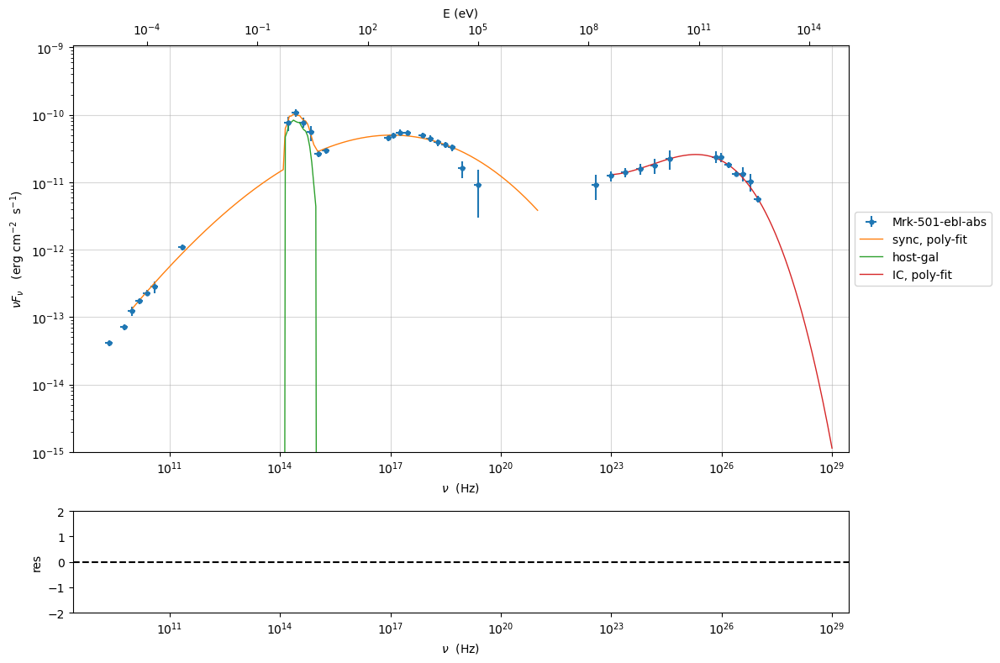
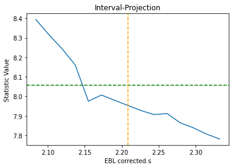

.. _sherpa_plugin:

Example to use the Sherpa minimizer plugin with a JeSeT model
=============================================================

In this tutorial we show how to import a jetset model into sherpa, and
finally we perform a model fitting. To run this plugin you have to
install Sherpa: https://sherpa.readthedocs.io/en/latest/install.html

.. code:: ipython3

    import warnings
    warnings.filterwarnings('ignore')
    
    import matplotlib.pylab as plt
    import jetset
    from jetset.test_data_helper import  test_SEDs
    from jetset.data_loader import ObsData,Data
    from jetset.plot_sedfit import PlotSED
    from jetset.test_data_helper import  test_SEDs

.. code:: ipython3

    test_SEDs

.. parsed-literal::

    ['/Users/orion/anaconda3/envs/jetset/lib/python3.8/site-packages/jetset/test_data/SEDs_data/SED_3C345.ecsv',
     '/Users/orion/anaconda3/envs/jetset/lib/python3.8/site-packages/jetset/test_data/SEDs_data/SED_MW_Mrk421_EBL_DEABS.ecsv',
     '/Users/orion/anaconda3/envs/jetset/lib/python3.8/site-packages/jetset/test_data/SEDs_data/SED_MW_Mrk501_EBL_ABS.ecsv',
     '/Users/orion/anaconda3/envs/jetset/lib/python3.8/site-packages/jetset/test_data/SEDs_data/SED_MW_Mrk501_EBL_DEABS.ecsv']

Loading data
------------

see the :ref:`data_format` user guide for further information about loading data 

.. code:: ipython3

    print(test_SEDs[2])
    data=Data.from_file(test_SEDs[2])

.. parsed-literal::

    /Users/orion/anaconda3/envs/jetset/lib/python3.8/site-packages/jetset/test_data/SEDs_data/SED_MW_Mrk501_EBL_ABS.ecsv

.. code:: ipython3

    %matplotlib inline
    sed_data=ObsData(data_table=data)
    sed_data.group_data(bin_width=0.2)
    
    sed_data.add_systematics(0.1,[10.**6,10.**29])
    p=sed_data.plot_sed()

.. parsed-literal::

    ================================================================================
    
    ***  binning data  ***
    ---> N bins= 90
    ---> bin_widht= 0.2
    ================================================================================
    

.. image:: sherpa-plugin-jetset-interface_files/sherpa-plugin-jetset-interface_9_1.png

.. code:: ipython3

    sed_data.save('Mrk_501.pkl')

phenomenological model constraining
-----------------------------------

see the :ref:`phenom_constr` user guide for further information about phenomenological constraining 

spectral indices
~~~~~~~~~~~~~~~~

.. code:: ipython3

    from jetset.sed_shaper import  SEDShape
    my_shape=SEDShape(sed_data)
    my_shape.eval_indices(minimizer='lsb',silent=True)
    p=my_shape.plot_indices()
    p.setlim(y_min=1E-15,y_max=1E-6)

.. parsed-literal::

    ================================================================================
    
    *** evaluating spectral indices for data ***
    ================================================================================
    

.. image:: sherpa-plugin-jetset-interface_files/sherpa-plugin-jetset-interface_14_1.png

sed shaper
~~~~~~~~~~

.. code:: ipython3

    mm,best_fit=my_shape.sync_fit(check_host_gal_template=True,
                      Ep_start=None,
                      minimizer='lsb',
                      silent=True,
                      fit_range=[10.,21.])

.. parsed-literal::

    ================================================================================
    
    *** Log-Polynomial fitting of the synchrotron component ***
    ---> first blind fit run,  fit range: [10.0, 21.0]
    ---> class:  HSP
    
    ---> class:  HSP
    
    

.. raw:: html

    <i>Table length=6</i>
    <table id="table140536530961072-3746" class="table-striped table-bordered table-condensed">
    <thead><tr><th>model name</th><th>name</th><th>val</th><th>bestfit val</th><th>err +</th><th>err -</th><th>start val</th><th>fit range min</th><th>fit range max</th><th>frozen</th></tr></thead>
    <tr><td>LogCubic</td><td>b</td><td>-6.411143e-02</td><td>-6.411143e-02</td><td>7.838958e-03</td><td>--</td><td>-4.778764e-02</td><td>-1.000000e+01</td><td>0.000000e+00</td><td>False</td></tr>
    <tr><td>LogCubic</td><td>c</td><td>-1.751705e-03</td><td>-1.751705e-03</td><td>1.127020e-03</td><td>--</td><td>3.576201e-03</td><td>-1.000000e+01</td><td>1.000000e+01</td><td>False</td></tr>
    <tr><td>LogCubic</td><td>Ep</td><td>1.703747e+01</td><td>1.703747e+01</td><td>9.437333e-02</td><td>--</td><td>1.626870e+01</td><td>0.000000e+00</td><td>3.000000e+01</td><td>False</td></tr>
    <tr><td>LogCubic</td><td>Sp</td><td>-1.030068e+01</td><td>-1.030068e+01</td><td>1.884116e-02</td><td>--</td><td>-1.025412e+01</td><td>-3.000000e+01</td><td>0.000000e+00</td><td>False</td></tr>
    <tr><td>host_galaxy</td><td>nuFnu_p_host</td><td>-1.006556e+01</td><td>-1.006556e+01</td><td>5.462500e-02</td><td>--</td><td>-1.025412e+01</td><td>-1.225412e+01</td><td>-8.254123e+00</td><td>False</td></tr>
    <tr><td>host_galaxy</td><td>nu_scale</td><td>1.730750e-02</td><td>1.730750e-02</td><td>3.694838e-03</td><td>--</td><td>0.000000e+00</td><td>-5.000000e-01</td><td>5.000000e-01</td><td>False</td></tr>
    </table>
    

.. parsed-literal::

    ---> sync       nu_p=+1.703747e+01 (err=+9.437333e-02)  nuFnu_p=-1.030068e+01 (err=+1.884116e-02) curv.=-6.411143e-02 (err=+7.838958e-03)
    ================================================================================
    

.. code:: ipython3

    my_shape.IC_fit(fit_range=[23.,29.],minimizer='minuit',silent=True)
    p=my_shape.plot_shape_fit()
    p.setlim(y_min=1E-15)

.. parsed-literal::

    ================================================================================
    
    *** Log-Polynomial fitting of the IC component ***
    ---> fit range: [23.0, 29.0]
    ---> LogCubic fit
    
    

.. raw:: html

    <i>Table length=4</i>
    <table id="table140536535202688-727593" class="table-striped table-bordered table-condensed">
    <thead><tr><th>model name</th><th>name</th><th>val</th><th>bestfit val</th><th>err +</th><th>err -</th><th>start val</th><th>fit range min</th><th>fit range max</th><th>frozen</th></tr></thead>
    <tr><td>LogCubic</td><td>b</td><td>-1.565399e-01</td><td>-1.565399e-01</td><td>2.551779e-02</td><td>--</td><td>-1.000000e+00</td><td>-1.000000e+01</td><td>0.000000e+00</td><td>False</td></tr>
    <tr><td>LogCubic</td><td>c</td><td>-4.351917e-02</td><td>-4.351917e-02</td><td>2.032066e-02</td><td>--</td><td>-1.000000e+00</td><td>-1.000000e+01</td><td>1.000000e+01</td><td>False</td></tr>
    <tr><td>LogCubic</td><td>Ep</td><td>2.529709e+01</td><td>2.529709e+01</td><td>1.817241e-01</td><td>--</td><td>2.536916e+01</td><td>0.000000e+00</td><td>3.000000e+01</td><td>False</td></tr>
    <tr><td>LogCubic</td><td>Sp</td><td>-1.058825e+01</td><td>-1.058825e+01</td><td>5.046950e-02</td><td>--</td><td>-1.000000e+01</td><td>-3.000000e+01</td><td>0.000000e+00</td><td>False</td></tr>
    </table>
    

.. parsed-literal::

    ---> IC         nu_p=+2.529709e+01 (err=+1.817241e-01)  nuFnu_p=-1.058825e+01 (err=+5.046950e-02) curv.=-1.565399e-01 (err=+2.551779e-02)
    ================================================================================
    

Model constraining
~~~~~~~~~~~~~~~~~~

In this step we are not fitting the model, we are just obtaining the
phenomenological ``pre_fit`` model, that will be fitted in using minuit
ore least-square bound, as shown below

.. code:: ipython3

    from jetset.obs_constrain import ObsConstrain
    from jetset.model_manager import  FitModel
    sed_obspar=ObsConstrain(beaming=25,
                            B_range=[0.001,0.1],
                            distr_e='lppl',
                            t_var_sec=3*86400,
                            nu_cut_IR=1E12,
                            SEDShape=my_shape)
    
    
    prefit_jet=sed_obspar.constrain_SSC_model(electron_distribution_log_values=False,silent=True)
    prefit_jet.save_model('prefit_jet.pkl')

.. parsed-literal::

    ================================================================================
    
    ***  constrains parameters from observable ***
    

.. raw:: html

    <i>Table length=11</i>
    <table id="table140536530962080-263442" class="table-striped table-bordered table-condensed">
    <thead><tr><th>model name</th><th>name</th><th>par type</th><th>units</th><th>val</th><th>phys. bound. min</th><th>phys. bound. max</th><th>log</th><th>frozen</th></tr></thead>
    <tr><td>jet_leptonic</td><td>R</td><td>region_size</td><td>cm</td><td>1.056958e+16</td><td>1.000000e+03</td><td>1.000000e+30</td><td>False</td><td>False</td></tr>
    <tr><td>jet_leptonic</td><td>R_H</td><td>region_position</td><td>cm</td><td>1.000000e+17</td><td>0.000000e+00</td><td>--</td><td>False</td><td>True</td></tr>
    <tr><td>jet_leptonic</td><td>B</td><td>magnetic_field</td><td>gauss</td><td>5.050000e-02</td><td>0.000000e+00</td><td>--</td><td>False</td><td>False</td></tr>
    <tr><td>jet_leptonic</td><td>beam_obj</td><td>beaming</td><td>lorentz-factor*</td><td>2.500000e+01</td><td>1.000000e-04</td><td>--</td><td>False</td><td>False</td></tr>
    <tr><td>jet_leptonic</td><td>z_cosm</td><td>redshift</td><td></td><td>3.360000e-02</td><td>0.000000e+00</td><td>--</td><td>False</td><td>False</td></tr>
    <tr><td>jet_leptonic</td><td>gmin</td><td>low-energy-cut-off</td><td>lorentz-factor*</td><td>4.703917e+02</td><td>1.000000e+00</td><td>1.000000e+09</td><td>False</td><td>False</td></tr>
    <tr><td>jet_leptonic</td><td>gmax</td><td>high-energy-cut-off</td><td>lorentz-factor*</td><td>2.310708e+06</td><td>1.000000e+00</td><td>1.000000e+15</td><td>False</td><td>False</td></tr>
    <tr><td>jet_leptonic</td><td>N</td><td>emitters_density</td><td>1 / cm3</td><td>7.087120e+00</td><td>0.000000e+00</td><td>--</td><td>False</td><td>False</td></tr>
    <tr><td>jet_leptonic</td><td>gamma0_log_parab</td><td>turn-over-energy</td><td>lorentz-factor*</td><td>1.045836e+04</td><td>1.000000e+00</td><td>1.000000e+09</td><td>False</td><td>False</td></tr>
    <tr><td>jet_leptonic</td><td>s</td><td>LE_spectral_slope</td><td></td><td>2.248787e+00</td><td>-1.000000e+01</td><td>1.000000e+01</td><td>False</td><td>False</td></tr>
    <tr><td>jet_leptonic</td><td>r</td><td>spectral_curvature</td><td></td><td>3.205571e-01</td><td>-1.500000e+01</td><td>1.500000e+01</td><td>False</td><td>False</td></tr>
    </table>
    

.. parsed-literal::

    
    ================================================================================
    

.. code:: ipython3

    pl=prefit_jet.plot_model(sed_data=sed_data)
    pl.add_model_residual_plot(prefit_jet,sed_data)
    pl.setlim(y_min=1E-15,x_min=1E7,x_max=1E29)

.. image:: sherpa-plugin-jetset-interface_files/sherpa-plugin-jetset-interface_21_0.png

Model fitting with Sherpa
-------------------------

.. code:: ipython3

    from jetset.template_2Dmodel import EBLAbsorptionTemplate
    ebl_franceschini=EBLAbsorptionTemplate.from_name('Franceschini_2008')

.. code:: ipython3

    from jetset.jet_model import Jet
    prefit_jet=Jet.load_model('prefit_jet.pkl')

.. raw:: html

    <i>Table length=11</i>
    <table id="table140536020501936-263157" class="table-striped table-bordered table-condensed">
    <thead><tr><th>model name</th><th>name</th><th>par type</th><th>units</th><th>val</th><th>phys. bound. min</th><th>phys. bound. max</th><th>log</th><th>frozen</th></tr></thead>
    <tr><td>jet_leptonic</td><td>gmin</td><td>low-energy-cut-off</td><td>lorentz-factor*</td><td>4.703917e+02</td><td>1.000000e+00</td><td>1.000000e+09</td><td>False</td><td>False</td></tr>
    <tr><td>jet_leptonic</td><td>gmax</td><td>high-energy-cut-off</td><td>lorentz-factor*</td><td>2.310708e+06</td><td>1.000000e+00</td><td>1.000000e+15</td><td>False</td><td>False</td></tr>
    <tr><td>jet_leptonic</td><td>N</td><td>emitters_density</td><td>1 / cm3</td><td>7.087120e+00</td><td>0.000000e+00</td><td>--</td><td>False</td><td>False</td></tr>
    <tr><td>jet_leptonic</td><td>gamma0_log_parab</td><td>turn-over-energy</td><td>lorentz-factor*</td><td>1.045836e+04</td><td>1.000000e+00</td><td>1.000000e+09</td><td>False</td><td>False</td></tr>
    <tr><td>jet_leptonic</td><td>s</td><td>LE_spectral_slope</td><td></td><td>2.248787e+00</td><td>-1.000000e+01</td><td>1.000000e+01</td><td>False</td><td>False</td></tr>
    <tr><td>jet_leptonic</td><td>r</td><td>spectral_curvature</td><td></td><td>3.205571e-01</td><td>-1.500000e+01</td><td>1.500000e+01</td><td>False</td><td>False</td></tr>
    <tr><td>jet_leptonic</td><td>R</td><td>region_size</td><td>cm</td><td>1.056958e+16</td><td>1.000000e+03</td><td>1.000000e+30</td><td>False</td><td>False</td></tr>
    <tr><td>jet_leptonic</td><td>R_H</td><td>region_position</td><td>cm</td><td>1.000000e+17</td><td>0.000000e+00</td><td>--</td><td>False</td><td>True</td></tr>
    <tr><td>jet_leptonic</td><td>B</td><td>magnetic_field</td><td>gauss</td><td>5.050000e-02</td><td>0.000000e+00</td><td>--</td><td>False</td><td>False</td></tr>
    <tr><td>jet_leptonic</td><td>beam_obj</td><td>beaming</td><td>lorentz-factor*</td><td>2.500000e+01</td><td>1.000000e-04</td><td>--</td><td>False</td><td>False</td></tr>
    <tr><td>jet_leptonic</td><td>z_cosm</td><td>redshift</td><td></td><td>3.360000e-02</td><td>0.000000e+00</td><td>--</td><td>False</td><td>False</td></tr>
    </table>
    

.. code:: ipython3

    composite_model=FitModel(nu_size=500,name='EBL corrected',template=my_shape.host_gal)
    composite_model.add_component(prefit_jet)
    composite_model.add_component(ebl_franceschini)
    composite_model.link_par(par_name='z_cosm', from_model='Franceschini_2008', to_model='jet_leptonic')
    composite_model.composite_expr='(jet_leptonic+host_galaxy)*Franceschini_2008'
    composite_model.eval()
    composite_model.plot_model()

.. parsed-literal::

    ==> par: z_cosm from model: Franceschini_2008 linked to same parameter in model jet_leptonic

.. parsed-literal::

    <jetset.plot_sedfit.PlotSED at 0x7fd117a0c5b0>

.. image:: sherpa-plugin-jetset-interface_files/sherpa-plugin-jetset-interface_25_2.png

.. code:: ipython3

    composite_model.freeze('jet_leptonic','z_cosm')
    composite_model.freeze('jet_leptonic','R_H')
    composite_model.jet_leptonic.parameters.beam_obj.fit_range=[5., 50.]
    composite_model.jet_leptonic.parameters.R.fit_range=[10**15.5,10**17.5]
    composite_model.jet_leptonic.parameters.gmax.fit_range=[1E5,1E7]
    composite_model.host_galaxy.parameters.nuFnu_p_host.frozen=False
    composite_model.host_galaxy.parameters.nu_scale.frozen=True

.. code:: ipython3

    from jetset.minimizer import ModelMinimizer
    composite_model.jet_leptonic.parameters.z_cosm.frozen=True
    
    model_minimizer_lsb=ModelMinimizer('sherpa')
    best_fit=model_minimizer_lsb.fit(composite_model,sed_data,1E11,1E29,fitname='SSC-best-fit-sherpa',repeat=1)

.. parsed-literal::

    filtering data in fit range = [1.000000e+11,1.000000e+29]
    data length 31
    ================================================================================
    
    *** start fit process ***
    ----- 

.. parsed-literal::

    0it [00:00, ?it/s]

.. parsed-literal::

    jetset model name R renamed to  R_sh due to sherpa internal naming convention
    - best chisq=8.05341e+00
    
    -------------------------------------------------------------------------
    Fit report
    
    Model: SSC-best-fit-sherpa

.. raw:: html

    <i>Table length=14</i>
    <table id="table140536021303600-657892" class="table-striped table-bordered table-condensed">
    <thead><tr><th>model name</th><th>name</th><th>par type</th><th>units</th><th>val</th><th>phys. bound. min</th><th>phys. bound. max</th><th>log</th><th>frozen</th></tr></thead>
    <tr><td>host_galaxy</td><td>nuFnu_p_host</td><td>nuFnu-scale</td><td>erg / (cm2 s)</td><td>-1.006056e+01</td><td>-2.000000e+01</td><td>2.000000e+01</td><td>False</td><td>False</td></tr>
    <tr><td>host_galaxy</td><td>nu_scale</td><td>nu-scale</td><td>Hz</td><td>1.730750e-02</td><td>-2.000000e+00</td><td>2.000000e+00</td><td>False</td><td>True</td></tr>
    <tr><td>jet_leptonic</td><td>gmin</td><td>low-energy-cut-off</td><td>lorentz-factor*</td><td>2.556574e+02</td><td>1.000000e+00</td><td>1.000000e+09</td><td>False</td><td>False</td></tr>
    <tr><td>jet_leptonic</td><td>gmax</td><td>high-energy-cut-off</td><td>lorentz-factor*</td><td>2.077993e+06</td><td>1.000000e+00</td><td>1.000000e+15</td><td>False</td><td>False</td></tr>
    <tr><td>jet_leptonic</td><td>N</td><td>emitters_density</td><td>1 / cm3</td><td>8.512524e+00</td><td>0.000000e+00</td><td>--</td><td>False</td><td>False</td></tr>
    <tr><td>jet_leptonic</td><td>gamma0_log_parab</td><td>turn-over-energy</td><td>lorentz-factor*</td><td>5.659107e+03</td><td>1.000000e+00</td><td>1.000000e+09</td><td>False</td><td>False</td></tr>
    <tr><td>jet_leptonic</td><td>s</td><td>LE_spectral_slope</td><td></td><td>2.208208e+00</td><td>-1.000000e+01</td><td>1.000000e+01</td><td>False</td><td>False</td></tr>
    <tr><td>jet_leptonic</td><td>r</td><td>spectral_curvature</td><td></td><td>2.145295e-01</td><td>-1.500000e+01</td><td>1.500000e+01</td><td>False</td><td>False</td></tr>
    <tr><td>jet_leptonic</td><td>R</td><td>region_size</td><td>cm</td><td>1.449139e+16</td><td>1.000000e+03</td><td>1.000000e+30</td><td>False</td><td>False</td></tr>
    <tr><td>jet_leptonic</td><td>R_H</td><td>region_position</td><td>cm</td><td>1.000000e+17</td><td>0.000000e+00</td><td>--</td><td>False</td><td>True</td></tr>
    <tr><td>jet_leptonic</td><td>B</td><td>magnetic_field</td><td>gauss</td><td>1.175386e-02</td><td>0.000000e+00</td><td>--</td><td>False</td><td>False</td></tr>
    <tr><td>jet_leptonic</td><td>beam_obj</td><td>beaming</td><td>lorentz-factor*</td><td>4.377160e+01</td><td>1.000000e-04</td><td>--</td><td>False</td><td>False</td></tr>
    <tr><td>jet_leptonic</td><td>z_cosm(M)</td><td>redshift</td><td></td><td>3.360000e-02</td><td>0.000000e+00</td><td>--</td><td>False</td><td>True</td></tr>
    <tr><td>Franceschini_2008</td><td>z_cosm(L,jet_leptonic)</td><td>redshift</td><td></td><td>--</td><td>--</td><td>--</td><td>False</td><td>True</td></tr>
    </table>
    

.. parsed-literal::

    
    converged=True
    calls=328
    mesg=

.. raw:: html

    
&lt;Fit results instance&gt;

Fit parameters
<table class="fit"><thead><tr><th>Parameter</th><th>Best-fit value</th><th>Approximate error</th></tr></thead><tbody><tr><td>EBL corrected.nuFnu_p_host</td><td>    -10.0606</td><td>&#177;    0.0521133</td></tr><tr><td>EBL corrected.gmin</td><td>     255.657</td><td>&#177;      294.461</td></tr><tr><td>EBL corrected.gmax</td><td> 2.07799e+06</td><td>&#177;            0</td></tr><tr><td>EBL corrected.N</td><td>     8.51252</td><td>&#177;      8.88032</td></tr><tr><td>EBL corrected.gamma0_log_parab</td><td>     5659.11</td><td>&#177;            0</td></tr><tr><td>EBL corrected.s</td><td>     2.20821</td><td>&#177;     0.163168</td></tr><tr><td>EBL corrected.r</td><td>    0.214529</td><td>&#177;    0.0609965</td></tr><tr><td>EBL corrected.R_sh</td><td> 1.44914e+16</td><td>&#177;            0</td></tr><tr><td>EBL corrected.B</td><td>   0.0117539</td><td>&#177;   0.00491693</td></tr><tr><td>EBL corrected.beam_obj</td><td>     43.7716</td><td>&#177;       11.429</td></tr></tbody></table>

Summary (10)

Method

levmar

Statistic

chi2

Final statistic

8.05341

Number of evaluations

324

Reduced statistic

0.383496

Probability (Q-value)

0.994914

Initial statistic

124.614

&#916; statistic

116.561

Number of data points

31

Degrees of freedom

21

.. parsed-literal::

    dof=21
    chisq=8.053410, chisq/red=0.383496 null hypothesis sig=0.994914
    
    best fit pars

.. raw:: html

    <i>Table length=14</i>
    <table id="table140536455120304-78273" class="table-striped table-bordered table-condensed">
    <thead><tr><th>model name</th><th>name</th><th>val</th><th>bestfit val</th><th>err +</th><th>err -</th><th>start val</th><th>fit range min</th><th>fit range max</th><th>frozen</th></tr></thead>
    <tr><td>host_galaxy</td><td>nuFnu_p_host</td><td>-1.006056e+01</td><td>-1.006056e+01</td><td>5.211328e-02</td><td>--</td><td>-1.006556e+01</td><td>-1.225412e+01</td><td>-8.254123e+00</td><td>False</td></tr>
    <tr><td>host_galaxy</td><td>nu_scale</td><td>1.730750e-02</td><td>--</td><td>--</td><td>--</td><td>1.730750e-02</td><td>-5.000000e-01</td><td>5.000000e-01</td><td>True</td></tr>
    <tr><td>jet_leptonic</td><td>gmin</td><td>2.556574e+02</td><td>2.556574e+02</td><td>2.944608e+02</td><td>--</td><td>4.703917e+02</td><td>1.000000e+00</td><td>1.000000e+09</td><td>False</td></tr>
    <tr><td>jet_leptonic</td><td>gmax</td><td>2.077993e+06</td><td>2.077993e+06</td><td>0.000000e+00</td><td>--</td><td>2.310708e+06</td><td>1.000000e+05</td><td>1.000000e+07</td><td>False</td></tr>
    <tr><td>jet_leptonic</td><td>N</td><td>8.512524e+00</td><td>8.512524e+00</td><td>8.880316e+00</td><td>--</td><td>7.087120e+00</td><td>0.000000e+00</td><td>--</td><td>False</td></tr>
    <tr><td>jet_leptonic</td><td>gamma0_log_parab</td><td>5.659107e+03</td><td>5.659107e+03</td><td>0.000000e+00</td><td>--</td><td>1.045836e+04</td><td>1.000000e+00</td><td>1.000000e+09</td><td>False</td></tr>
    <tr><td>jet_leptonic</td><td>s</td><td>2.208208e+00</td><td>2.208208e+00</td><td>1.631683e-01</td><td>--</td><td>2.248787e+00</td><td>-1.000000e+01</td><td>1.000000e+01</td><td>False</td></tr>
    <tr><td>jet_leptonic</td><td>r</td><td>2.145295e-01</td><td>2.145295e-01</td><td>6.099654e-02</td><td>--</td><td>3.205571e-01</td><td>-1.500000e+01</td><td>1.500000e+01</td><td>False</td></tr>
    <tr><td>jet_leptonic</td><td>R</td><td>1.449139e+16</td><td>1.449139e+16</td><td>0.000000e+00</td><td>--</td><td>1.056958e+16</td><td>3.162278e+15</td><td>3.162278e+17</td><td>False</td></tr>
    <tr><td>jet_leptonic</td><td>R_H</td><td>1.000000e+17</td><td>--</td><td>--</td><td>--</td><td>1.000000e+17</td><td>0.000000e+00</td><td>--</td><td>True</td></tr>
    <tr><td>jet_leptonic</td><td>B</td><td>1.175386e-02</td><td>1.175386e-02</td><td>4.916935e-03</td><td>--</td><td>5.050000e-02</td><td>0.000000e+00</td><td>--</td><td>False</td></tr>
    <tr><td>jet_leptonic</td><td>beam_obj</td><td>4.377160e+01</td><td>4.377160e+01</td><td>1.142901e+01</td><td>--</td><td>2.500000e+01</td><td>5.000000e+00</td><td>5.000000e+01</td><td>False</td></tr>
    <tr><td>jet_leptonic</td><td>z_cosm(M)</td><td>3.360000e-02</td><td>--</td><td>--</td><td>--</td><td>3.360000e-02</td><td>0.000000e+00</td><td>--</td><td>True</td></tr>
    <tr><td>Franceschini_2008</td><td>z_cosm(L,jet_leptonic)</td><td>3.360000e-02</td><td>--</td><td>--</td><td>--</td><td>--</td><td>0.000000e+00</td><td>--</td><td>True</td></tr>
    </table>
    

.. parsed-literal::

    -------------------------------------------------------------------------
    
    ================================================================================
    

.. code:: ipython3

    composite_model.set_nu_grid(1E6,1E30,200)
    composite_model.eval()
    p=composite_model.plot_model(sed_data=sed_data)

.. image:: sherpa-plugin-jetset-interface_files/sherpa-plugin-jetset-interface_28_0.png

Using the ``sherpa_fitter`` you can access all the sherpa fetarues
https://sherpa.readthedocs.io/en/latest/fit/index.html

.. code:: ipython3

    model_minimizer_lsb.minimizer.sherpa_fitter.est_errors()

.. parsed-literal::

    WARNING: hard minimum hit for parameter EBL corrected.gmin
    WARNING: hard maximum hit for parameter EBL corrected.gmin
    WARNING: hard minimum hit for parameter EBL corrected.gmax
    WARNING: hard maximum hit for parameter EBL corrected.gmax
    WARNING: hard minimum hit for parameter EBL corrected.B
    WARNING: hard maximum hit for parameter EBL corrected.B

.. raw:: html

    
&lt;covariance results instance&gt;

covariance 1&#963; (68.2689%) bounds
<table><thead><tr><th>Parameter</th><th>Best-fit value</th><th>Lower Bound</th><th>Upper Bound</th></tr></thead><tbody><tr><td>EBL corrected.nuFnu_p_host</td><td>    -10.0606</td><td>  -0.0509997</td><td>   0.0509997</td></tr><tr><td>EBL corrected.gmin</td><td>     255.657</td><td>-----</td><td>-----</td></tr><tr><td>EBL corrected.gmax</td><td> 2.07799e+06</td><td>-----</td><td>-----</td></tr><tr><td>EBL corrected.N</td><td>     8.51252</td><td>    -2.52709</td><td>     2.52709</td></tr><tr><td>EBL corrected.gamma0_log_parab</td><td>     5659.11</td><td>    -1064.69</td><td>     1064.69</td></tr><tr><td>EBL corrected.s</td><td>     2.20821</td><td>  -0.0248637</td><td>   0.0248637</td></tr><tr><td>EBL corrected.r</td><td>    0.214529</td><td>  -0.0197456</td><td>   0.0197456</td></tr><tr><td>EBL corrected.R_sh</td><td> 1.44914e+16</td><td>-4.11409e+15</td><td> 4.11409e+15</td></tr><tr><td>EBL corrected.B</td><td>   0.0117539</td><td>-----</td><td>-----</td></tr><tr><td>EBL corrected.beam_obj</td><td>     43.7716</td><td>    -4.81248</td><td>     4.81248</td></tr></tbody></table>

Summary (2)

Fitting Method

levmar

Statistic

chi2

.. code:: ipython3

    from sherpa.plot import IntervalProjection
    iproj = IntervalProjection()
    iproj.prepare(fac=5, nloop=15)
    iproj.calc(model_minimizer_lsb.minimizer.sherpa_fitter, model_minimizer_lsb.minimizer._sherpa_model.s)
    iproj.plot()

.. parsed-literal::

    WARNING: hard minimum hit for parameter EBL corrected.gmin
    WARNING: hard maximum hit for parameter EBL corrected.gmin
    WARNING: hard minimum hit for parameter EBL corrected.gmax
    WARNING: hard maximum hit for parameter EBL corrected.gmax
    WARNING: hard minimum hit for parameter EBL corrected.B
    WARNING: hard maximum hit for parameter EBL corrected.B

