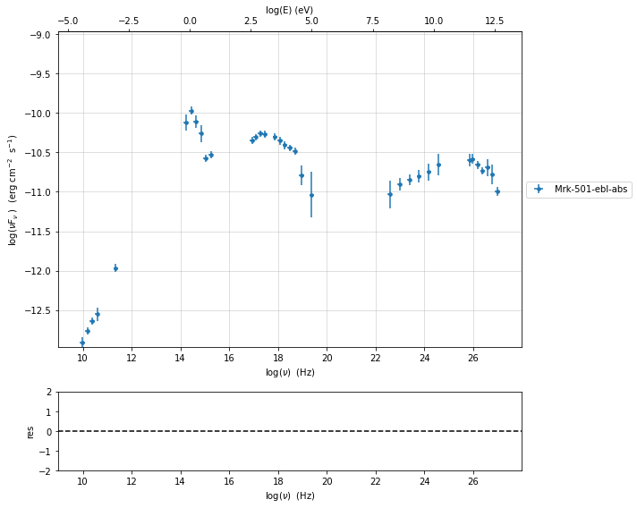
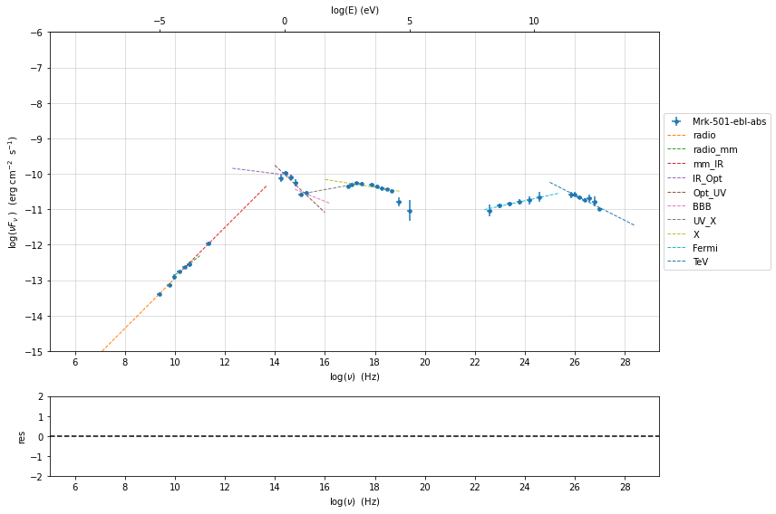
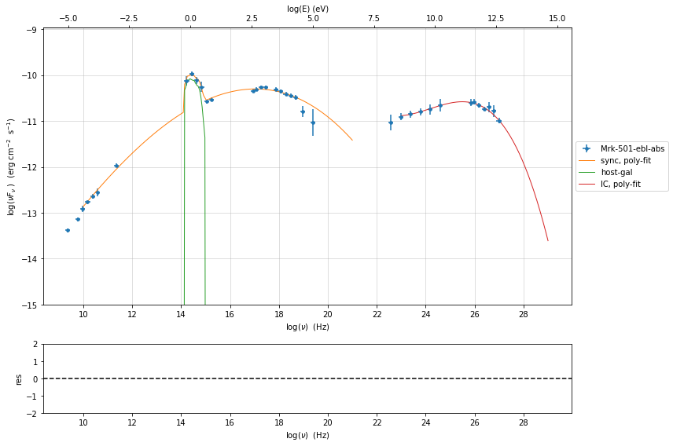
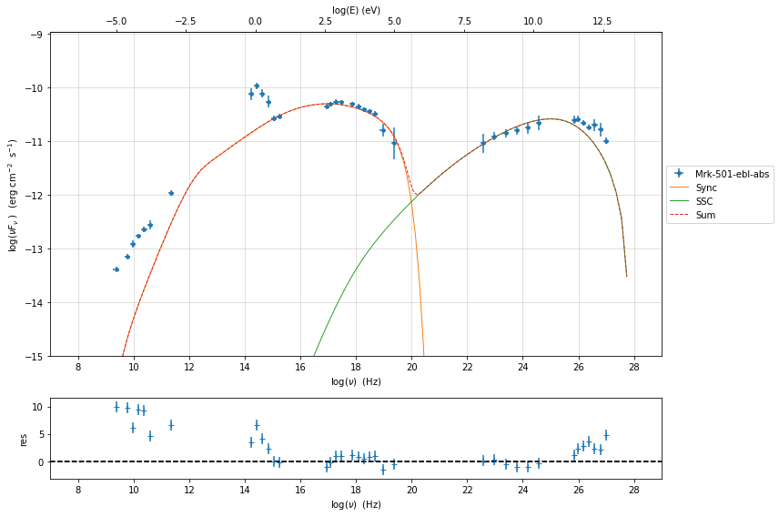
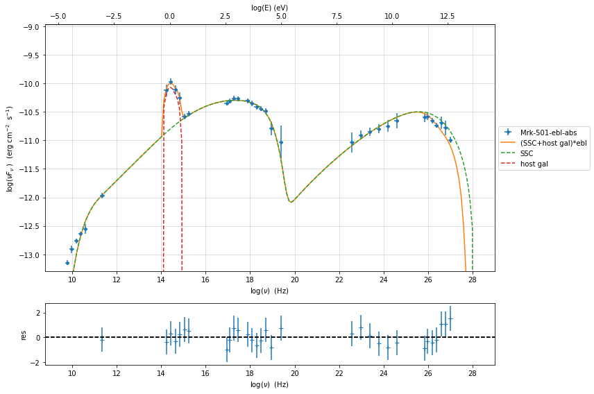
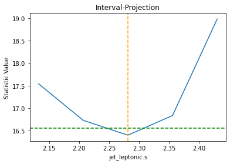
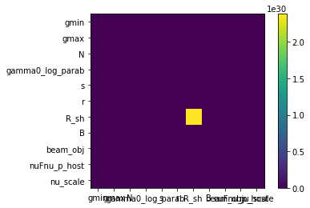

.. _sherpa_plugin:

Example to use the sherpa plugin
================================

.. code:: ipython3

    import warnings
    warnings.filterwarnings('ignore')
    
    import matplotlib.pylab as plt
    import jetset
    from jetset.test_data_helper import  test_SEDs
    from jetset.data_loader import ObsData,Data
    from jetset.plot_sedfit import PlotSED
    from jetset.test_data_helper import  test_SEDs

.. code:: ipython3

    test_SEDs

.. parsed-literal::

    ['/Users/orion/anaconda3/envs/jetset/lib/python3.8/site-packages/jetset/test_data/SEDs_data/SED_3C345.ecsv',
     '/Users/orion/anaconda3/envs/jetset/lib/python3.8/site-packages/jetset/test_data/SEDs_data/SED_MW_Mrk421_EBL_DEABS.ecsv',
     '/Users/orion/anaconda3/envs/jetset/lib/python3.8/site-packages/jetset/test_data/SEDs_data/SED_MW_Mrk501_EBL_ABS.ecsv',
     '/Users/orion/anaconda3/envs/jetset/lib/python3.8/site-packages/jetset/test_data/SEDs_data/SED_MW_Mrk501_EBL_DEABS.ecsv']

Loading data
------------

see the :ref:`data_format` user guide for further information about loading data 

.. code:: ipython3

    print(test_SEDs[2])
    data=Data.from_file(test_SEDs[2])

.. parsed-literal::

    /Users/orion/anaconda3/envs/jetset/lib/python3.8/site-packages/jetset/test_data/SEDs_data/SED_MW_Mrk501_EBL_ABS.ecsv

.. code:: ipython3

    %matplotlib inline
    sed_data=ObsData(data_table=data)
    sed_data.group_data(bin_width=0.2)
    
    sed_data.add_systematics(0.1,[10.**6,10.**29])
    p=sed_data.plot_sed()

.. parsed-literal::

    ================================================================================
    
    ***  binning data  ***
    ---> N bins= 90
    ---> bin_widht= 0.2
    ================================================================================
    

.. code:: ipython3

    sed_data.save('Mrk_501.pkl')

phenomenological model constraining
-----------------------------------

see the :ref:`phenom_constr` user guide for further information about phenomenological constraining 

spectral indices
~~~~~~~~~~~~~~~~

.. code:: ipython3

    from jetset.sed_shaper import  SEDShape
    my_shape=SEDShape(sed_data)
    my_shape.eval_indices(minimizer='lsb',silent=True)
    p=my_shape.plot_indices()
    p.rescale(y_min=-15,y_max=-6)

.. parsed-literal::

    ================================================================================
    
    *** evaluating spectral indices for data ***
    ================================================================================
    

sed shaper
~~~~~~~~~~

.. code:: ipython3

    mm,best_fit=my_shape.sync_fit(check_host_gal_template=True,
                      Ep_start=None,
                      minimizer='lsb',
                      silent=True,
                      fit_range=[10.,21.])

.. parsed-literal::

    ================================================================================
    
    *** Log-Polynomial fitting of the synchrotron component ***
    ---> first blind fit run,  fit range: [10.0, 21.0]
    ---> class:  HSP
    
    ---> class:  HSP
    
    

.. raw:: html

    <i>Table length=6</i>
    <table id="table140246293456064-979710" class="table-striped table-bordered table-condensed">
    <thead><tr><th>model name</th><th>name</th><th>val</th><th>bestfit val</th><th>err +</th><th>err -</th><th>start val</th><th>fit range min</th><th>fit range max</th><th>frozen</th></tr></thead>
    <tr><td>LogCubic</td><td>b</td><td>-6.411144e-02</td><td>-6.411144e-02</td><td>7.838965e-03</td><td>--</td><td>-4.778764e-02</td><td>-1.000000e+01</td><td>0.000000e+00</td><td>False</td></tr>
    <tr><td>LogCubic</td><td>c</td><td>-1.751721e-03</td><td>-1.751721e-03</td><td>1.127030e-03</td><td>--</td><td>3.576201e-03</td><td>-1.000000e+01</td><td>1.000000e+01</td><td>False</td></tr>
    <tr><td>LogCubic</td><td>Ep</td><td>1.703747e+01</td><td>1.703747e+01</td><td>9.437354e-02</td><td>--</td><td>1.626870e+01</td><td>0.000000e+00</td><td>3.000000e+01</td><td>False</td></tr>
    <tr><td>LogCubic</td><td>Sp</td><td>-1.030068e+01</td><td>-1.030068e+01</td><td>1.884114e-02</td><td>--</td><td>-1.025412e+01</td><td>-3.000000e+01</td><td>0.000000e+00</td><td>False</td></tr>
    <tr><td>host_galaxy</td><td>nuFnu_p_host</td><td>-1.006557e+01</td><td>-1.006557e+01</td><td>5.462528e-02</td><td>--</td><td>-1.025412e+01</td><td>-1.225412e+01</td><td>-8.254123e+00</td><td>False</td></tr>
    <tr><td>host_galaxy</td><td>nu_scale</td><td>1.730764e-02</td><td>1.730764e-02</td><td>3.694887e-03</td><td>--</td><td>0.000000e+00</td><td>-5.000000e-01</td><td>5.000000e-01</td><td>False</td></tr>
    </table>
    

.. parsed-literal::

    ---> sync       nu_p=+1.703747e+01 (err=+9.437354e-02)  nuFnu_p=-1.030068e+01 (err=+1.884114e-02) curv.=-6.411144e-02 (err=+7.838965e-03)
    ================================================================================
    

.. code:: ipython3

    my_shape.IC_fit(fit_range=[23.,29.],minimizer='minuit',silent=True)
    p=my_shape.plot_shape_fit()
    p.rescale(y_min=-15)

.. parsed-literal::

    ================================================================================
    
    *** Log-Polynomial fitting of the IC component ***
    ---> fit range: [23.0, 29.0]
    ---> LogCubic fit
    
    

.. raw:: html

    <i>Table length=4</i>
    <table id="table140246288857840-150460" class="table-striped table-bordered table-condensed">
    <thead><tr><th>model name</th><th>name</th><th>val</th><th>bestfit val</th><th>err +</th><th>err -</th><th>start val</th><th>fit range min</th><th>fit range max</th><th>frozen</th></tr></thead>
    <tr><td>LogCubic</td><td>b</td><td>-1.310993e-01</td><td>-1.310993e-01</td><td>3.244188e-02</td><td>--</td><td>-1.000000e+00</td><td>-1.000000e+01</td><td>0.000000e+00</td><td>False</td></tr>
    <tr><td>LogCubic</td><td>c</td><td>-3.300446e-02</td><td>-3.300446e-02</td><td>2.072521e-02</td><td>--</td><td>-1.000000e+00</td><td>-1.000000e+01</td><td>1.000000e+01</td><td>False</td></tr>
    <tr><td>LogCubic</td><td>Ep</td><td>2.549603e+01</td><td>2.549603e+01</td><td>2.235473e-01</td><td>--</td><td>2.556357e+01</td><td>0.000000e+00</td><td>3.000000e+01</td><td>False</td></tr>
    <tr><td>LogCubic</td><td>Sp</td><td>-1.057945e+01</td><td>-1.057945e+01</td><td>4.332978e-02</td><td>--</td><td>-1.000000e+01</td><td>-3.000000e+01</td><td>0.000000e+00</td><td>False</td></tr>
    </table>
    

.. parsed-literal::

    ---> IC         nu_p=+2.549603e+01 (err=+2.235473e-01)  nuFnu_p=-1.057945e+01 (err=+4.332978e-02) curv.=-1.310993e-01 (err=+3.244188e-02)
    ================================================================================
    

Model constraining
~~~~~~~~~~~~~~~~~~

In this step we are not fitting the model, we are just obtaining the
phenomenological ``pre_fit`` model, that will be fitted in using minuit
ore least-square bound, as shown below

.. code:: ipython3

    from jetset.obs_constrain import ObsConstrain
    from jetset.model_manager import  FitModel
    sed_obspar=ObsConstrain(beaming=25,
                            B_range=[0.001,0.1],
                            distr_e='lppl',
                            t_var_sec=3*86400,
                            nu_cut_IR=1E12,
                            SEDShape=my_shape)
    
    
    prefit_jet=sed_obspar.constrain_SSC_model(electron_distribution_log_values=False,silent=True)
    prefit_jet.save_model('prefit_jet.pkl')

.. parsed-literal::

    ================================================================================
    
    ***  constrains parameters from observable ***
    

.. raw:: html

    <i>Table length=11</i>
    <table id="table140246293705056-205166" class="table-striped table-bordered table-condensed">
    <thead><tr><th>model name</th><th>name</th><th>par type</th><th>units</th><th>val</th><th>phys. bound. min</th><th>phys. bound. max</th><th>log</th><th>frozen</th></tr></thead>
    <tr><td>jet_leptonic</td><td>R</td><td>region_size</td><td>cm</td><td>1.046299e+16</td><td>1.000000e+03</td><td>1.000000e+30</td><td>False</td><td>False</td></tr>
    <tr><td>jet_leptonic</td><td>R_H</td><td>region_position</td><td>cm</td><td>1.000000e+17</td><td>0.000000e+00</td><td>--</td><td>False</td><td>True</td></tr>
    <tr><td>jet_leptonic</td><td>B</td><td>magnetic_field</td><td>gauss</td><td>5.050000e-02</td><td>0.000000e+00</td><td>--</td><td>False</td><td>False</td></tr>
    <tr><td>jet_leptonic</td><td>beam_obj</td><td>beaming</td><td>lorentz-factor*</td><td>2.500000e+01</td><td>1.000000e-04</td><td>--</td><td>False</td><td>False</td></tr>
    <tr><td>jet_leptonic</td><td>z_cosm</td><td>redshift</td><td></td><td>3.360000e-02</td><td>0.000000e+00</td><td>--</td><td>False</td><td>False</td></tr>
    <tr><td>jet_leptonic</td><td>gmin</td><td>low-energy-cut-off</td><td>lorentz-factor*</td><td>4.703917e+02</td><td>1.000000e+00</td><td>1.000000e+09</td><td>False</td><td>False</td></tr>
    <tr><td>jet_leptonic</td><td>gmax</td><td>high-energy-cut-off</td><td>lorentz-factor*</td><td>2.310708e+06</td><td>1.000000e+00</td><td>1.000000e+15</td><td>False</td><td>False</td></tr>
    <tr><td>jet_leptonic</td><td>N</td><td>emitters_density</td><td>1 / cm3</td><td>7.305900e+00</td><td>0.000000e+00</td><td>--</td><td>False</td><td>False</td></tr>
    <tr><td>jet_leptonic</td><td>gamma0_log_parab</td><td>turn-over-energy</td><td>lorentz-factor*</td><td>1.045843e+04</td><td>1.000000e+00</td><td>1.000000e+09</td><td>False</td><td>False</td></tr>
    <tr><td>jet_leptonic</td><td>s</td><td>LE_spectral_slope</td><td></td><td>2.248787e+00</td><td>-1.000000e+01</td><td>1.000000e+01</td><td>False</td><td>False</td></tr>
    <tr><td>jet_leptonic</td><td>r</td><td>spectral_curvature</td><td></td><td>3.205572e-01</td><td>-1.500000e+01</td><td>1.500000e+01</td><td>False</td><td>False</td></tr>
    </table>
    

.. parsed-literal::

    
    ================================================================================
    

.. code:: ipython3

    pl=prefit_jet.plot_model(sed_data=sed_data)
    pl.add_model_residual_plot(prefit_jet,sed_data)
    pl.rescale(y_min=-15,x_min=7,x_max=29)

Model fitting with Sherpa
-------------------------

.. code:: ipython3

    from jetset.sherpa_plugin import JetsetSherpaModel

.. code:: ipython3

    from jetset.template_2Dmodel import EBLAbsorptionTemplate
    ebl_franceschini=EBLAbsorptionTemplate.from_name('Franceschini_2008')

.. code:: ipython3

    from jetset.jet_model import Jet
    prefit_jet=Jet.load_model('prefit_jet.pkl')

.. raw:: html

    <i>Table length=11</i>
    <table id="table140246291439920-188043" class="table-striped table-bordered table-condensed">
    <thead><tr><th>model name</th><th>name</th><th>par type</th><th>units</th><th>val</th><th>phys. bound. min</th><th>phys. bound. max</th><th>log</th><th>frozen</th></tr></thead>
    <tr><td>jet_leptonic</td><td>gmin</td><td>low-energy-cut-off</td><td>lorentz-factor*</td><td>4.703917e+02</td><td>1.000000e+00</td><td>1.000000e+09</td><td>False</td><td>False</td></tr>
    <tr><td>jet_leptonic</td><td>gmax</td><td>high-energy-cut-off</td><td>lorentz-factor*</td><td>2.310708e+06</td><td>1.000000e+00</td><td>1.000000e+15</td><td>False</td><td>False</td></tr>
    <tr><td>jet_leptonic</td><td>N</td><td>emitters_density</td><td>1 / cm3</td><td>7.305900e+00</td><td>0.000000e+00</td><td>--</td><td>False</td><td>False</td></tr>
    <tr><td>jet_leptonic</td><td>gamma0_log_parab</td><td>turn-over-energy</td><td>lorentz-factor*</td><td>1.045843e+04</td><td>1.000000e+00</td><td>1.000000e+09</td><td>False</td><td>False</td></tr>
    <tr><td>jet_leptonic</td><td>s</td><td>LE_spectral_slope</td><td></td><td>2.248787e+00</td><td>-1.000000e+01</td><td>1.000000e+01</td><td>False</td><td>False</td></tr>
    <tr><td>jet_leptonic</td><td>r</td><td>spectral_curvature</td><td></td><td>3.205572e-01</td><td>-1.500000e+01</td><td>1.500000e+01</td><td>False</td><td>False</td></tr>
    <tr><td>jet_leptonic</td><td>R</td><td>region_size</td><td>cm</td><td>1.046299e+16</td><td>1.000000e+03</td><td>1.000000e+30</td><td>False</td><td>False</td></tr>
    <tr><td>jet_leptonic</td><td>R_H</td><td>region_position</td><td>cm</td><td>1.000000e+17</td><td>0.000000e+00</td><td>--</td><td>False</td><td>True</td></tr>
    <tr><td>jet_leptonic</td><td>B</td><td>magnetic_field</td><td>gauss</td><td>5.050000e-02</td><td>0.000000e+00</td><td>--</td><td>False</td><td>False</td></tr>
    <tr><td>jet_leptonic</td><td>beam_obj</td><td>beaming</td><td>lorentz-factor*</td><td>2.500000e+01</td><td>1.000000e-04</td><td>--</td><td>False</td><td>False</td></tr>
    <tr><td>jet_leptonic</td><td>z_cosm</td><td>redshift</td><td></td><td>3.360000e-02</td><td>0.000000e+00</td><td>--</td><td>False</td><td>False</td></tr>
    </table>
    

.. code:: ipython3

    sherpa_model_jet=JetsetSherpaModel(prefit_jet)
    sherpa_model_gal=JetsetSherpaModel(my_shape.host_gal)
    sherpa_model_ebl=JetsetSherpaModel(ebl_franceschini)
    

.. parsed-literal::

    jetset model name R renamed to  R_sh due to sherpa internal naming convention

.. code:: ipython3

    sherpa_model=(sherpa_model_jet+sherpa_model_gal)*sherpa_model_ebl

.. code:: ipython3

    sherpa_model

.. raw:: html

    
&lt;BinaryOpModel model instance &#x27;((jet_leptonic + host_galaxy) * Franceschini_2008)&#x27;&gt;

Model
<table class="model"><caption>Expression: (jet_leptonic + host_galaxy) * Franceschini_2008</caption><thead><tr><th>Component</th><th>Parameter</th><th>Thawed</th><th>Value</th><th>Min</th><th>Max</th><th>Units</th></tr></thead><tbody><tr><th class="model-odd" scope="rowgroup" rowspan=11>jet_leptonic</th><td>gmin</td><td><input disabled type="checkbox" checked></input></td><td>470.39174855643597</td><td>1.0</td><td>1000000000.0</td><td>lorentz-factor*</td></tr><tr><td>gmax</td><td><input disabled type="checkbox" checked></input></td><td>2310708.197406515</td><td>1.0</td><td>1000000000000000.0</td><td>lorentz-factor*</td></tr><tr><td>N</td><td><input disabled type="checkbox" checked></input></td><td>7.305900046565794</td><td>0.0</td><td>MAX</td><td>1 / cm3</td></tr><tr><td>gamma0_log_parab</td><td><input disabled type="checkbox" checked></input></td><td>10458.433237258416</td><td>1.0</td><td>1000000000.0</td><td>lorentz-factor*</td></tr><tr><td>s</td><td><input disabled type="checkbox" checked></input></td><td>2.2487867709713574</td><td>-10.0</td><td>10.0</td><td></td></tr><tr><td>r</td><td><input disabled type="checkbox" checked></input></td><td>0.32055721323507314</td><td>-15.0</td><td>15.0</td><td></td></tr><tr><td>R_sh</td><td><input disabled type="checkbox" checked></input></td><td>1.046298751763524e+16</td><td>1000.0</td><td>1e+30</td><td>cm</td></tr><tr><td>R_H</td><td><input disabled type="checkbox" checked></input></td><td>1e+17</td><td>0.0</td><td>MAX</td><td>cm</td></tr><tr><td>B</td><td><input disabled type="checkbox" checked></input></td><td>0.0505</td><td>0.0</td><td>MAX</td><td>gauss</td></tr><tr><td>beam_obj</td><td><input disabled type="checkbox" checked></input></td><td>25.0</td><td>0.0001</td><td>MAX</td><td>lorentz-factor*</td></tr><tr><td>z_cosm</td><td><input disabled type="checkbox" checked></input></td><td>0.0336</td><td>0.0</td><td>MAX</td><td></td></tr><tr class="block"><th class="model-even" scope="rowgroup" rowspan=2>host_galaxy</th><td>nuFnu_p_host</td><td><input disabled type="checkbox" checked></input></td><td>-10.065573840795157</td><td>-20.0</td><td>20.0</td><td>erg / (cm2 s)</td></tr><tr><td>nu_scale</td><td><input disabled type="checkbox" checked></input></td><td>0.01730764400081941</td><td>-2.0</td><td>2.0</td><td>Hz</td></tr><tr class="block"><th class="model-odd" scope="rowgroup" rowspan=1>Franceschini_2008</th><td>z_cosm</td><td><input disabled type="checkbox" checked></input></td><td>1.0</td><td>0.0</td><td>MAX</td><td></td></tr></tbody></table>

.. code:: ipython3

    sherpa_model_ebl.z_cosm  = sherpa_model_jet.z_cosm

.. code:: ipython3

    sherpa_model

.. raw:: html

    
&lt;BinaryOpModel model instance &#x27;((jet_leptonic + host_galaxy) * Franceschini_2008)&#x27;&gt;

Model
<table class="model"><caption>Expression: (jet_leptonic + host_galaxy) * Franceschini_2008</caption><thead><tr><th>Component</th><th>Parameter</th><th>Thawed</th><th>Value</th><th>Min</th><th>Max</th><th>Units</th></tr></thead><tbody><tr><th class="model-odd" scope="rowgroup" rowspan=11>jet_leptonic</th><td>gmin</td><td><input disabled type="checkbox" checked></input></td><td>470.39174855643597</td><td>1.0</td><td>1000000000.0</td><td>lorentz-factor*</td></tr><tr><td>gmax</td><td><input disabled type="checkbox" checked></input></td><td>2310708.197406515</td><td>1.0</td><td>1000000000000000.0</td><td>lorentz-factor*</td></tr><tr><td>N</td><td><input disabled type="checkbox" checked></input></td><td>7.305900046565794</td><td>0.0</td><td>MAX</td><td>1 / cm3</td></tr><tr><td>gamma0_log_parab</td><td><input disabled type="checkbox" checked></input></td><td>10458.433237258416</td><td>1.0</td><td>1000000000.0</td><td>lorentz-factor*</td></tr><tr><td>s</td><td><input disabled type="checkbox" checked></input></td><td>2.2487867709713574</td><td>-10.0</td><td>10.0</td><td></td></tr><tr><td>r</td><td><input disabled type="checkbox" checked></input></td><td>0.32055721323507314</td><td>-15.0</td><td>15.0</td><td></td></tr><tr><td>R_sh</td><td><input disabled type="checkbox" checked></input></td><td>1.046298751763524e+16</td><td>1000.0</td><td>1e+30</td><td>cm</td></tr><tr><td>R_H</td><td><input disabled type="checkbox" checked></input></td><td>1e+17</td><td>0.0</td><td>MAX</td><td>cm</td></tr><tr><td>B</td><td><input disabled type="checkbox" checked></input></td><td>0.0505</td><td>0.0</td><td>MAX</td><td>gauss</td></tr><tr><td>beam_obj</td><td><input disabled type="checkbox" checked></input></td><td>25.0</td><td>0.0001</td><td>MAX</td><td>lorentz-factor*</td></tr><tr><td>z_cosm</td><td><input disabled type="checkbox" checked></input></td><td>0.0336</td><td>0.0</td><td>MAX</td><td></td></tr><tr class="block"><th class="model-even" scope="rowgroup" rowspan=2>host_galaxy</th><td>nuFnu_p_host</td><td><input disabled type="checkbox" checked></input></td><td>-10.065573840795157</td><td>-20.0</td><td>20.0</td><td>erg / (cm2 s)</td></tr><tr><td>nu_scale</td><td><input disabled type="checkbox" checked></input></td><td>0.01730764400081941</td><td>-2.0</td><td>2.0</td><td>Hz</td></tr><tr class="block"><th class="model-odd" scope="rowgroup" rowspan=1>Franceschini_2008</th><td>z_cosm</td><td>linked</td><td>0.0336</td><td colspan=2>&#8656; jet_leptonic.z_cosm</td><td></td></tr></tbody></table>

.. code:: ipython3

    sherpa_model_jet.R_H.freeze()
    sherpa_model_jet.z_cosm.freeze()

.. code:: ipython3

    sherpa_model

.. raw:: html

    
&lt;BinaryOpModel model instance &#x27;((jet_leptonic + host_galaxy) * Franceschini_2008)&#x27;&gt;

Model
<table class="model"><caption>Expression: (jet_leptonic + host_galaxy) * Franceschini_2008</caption><thead><tr><th>Component</th><th>Parameter</th><th>Thawed</th><th>Value</th><th>Min</th><th>Max</th><th>Units</th></tr></thead><tbody><tr><th class="model-odd" scope="rowgroup" rowspan=11>jet_leptonic</th><td>gmin</td><td><input disabled type="checkbox" checked></input></td><td>470.39174855643597</td><td>1.0</td><td>1000000000.0</td><td>lorentz-factor*</td></tr><tr><td>gmax</td><td><input disabled type="checkbox" checked></input></td><td>2310708.197406515</td><td>1.0</td><td>1000000000000000.0</td><td>lorentz-factor*</td></tr><tr><td>N</td><td><input disabled type="checkbox" checked></input></td><td>7.305900046565794</td><td>0.0</td><td>MAX</td><td>1 / cm3</td></tr><tr><td>gamma0_log_parab</td><td><input disabled type="checkbox" checked></input></td><td>10458.433237258416</td><td>1.0</td><td>1000000000.0</td><td>lorentz-factor*</td></tr><tr><td>s</td><td><input disabled type="checkbox" checked></input></td><td>2.2487867709713574</td><td>-10.0</td><td>10.0</td><td></td></tr><tr><td>r</td><td><input disabled type="checkbox" checked></input></td><td>0.32055721323507314</td><td>-15.0</td><td>15.0</td><td></td></tr><tr><td>R_sh</td><td><input disabled type="checkbox" checked></input></td><td>1.046298751763524e+16</td><td>1000.0</td><td>1e+30</td><td>cm</td></tr><tr><td>R_H</td><td><input disabled type="checkbox"></input></td><td>1e+17</td><td>0.0</td><td>MAX</td><td>cm</td></tr><tr><td>B</td><td><input disabled type="checkbox" checked></input></td><td>0.0505</td><td>0.0</td><td>MAX</td><td>gauss</td></tr><tr><td>beam_obj</td><td><input disabled type="checkbox" checked></input></td><td>25.0</td><td>0.0001</td><td>MAX</td><td>lorentz-factor*</td></tr><tr><td>z_cosm</td><td><input disabled type="checkbox"></input></td><td>0.0336</td><td>0.0</td><td>MAX</td><td></td></tr><tr class="block"><th class="model-even" scope="rowgroup" rowspan=2>host_galaxy</th><td>nuFnu_p_host</td><td><input disabled type="checkbox" checked></input></td><td>-10.065573840795157</td><td>-20.0</td><td>20.0</td><td>erg / (cm2 s)</td></tr><tr><td>nu_scale</td><td><input disabled type="checkbox" checked></input></td><td>0.01730764400081941</td><td>-2.0</td><td>2.0</td><td>Hz</td></tr><tr class="block"><th class="model-odd" scope="rowgroup" rowspan=1>Franceschini_2008</th><td>z_cosm</td><td>linked</td><td>0.0336</td><td colspan=2>&#8656; jet_leptonic.z_cosm</td><td></td></tr></tbody></table>

.. code:: ipython3

    from sherpa import data
    from sherpa.fit import Fit
    from sherpa.stats import Chi2
    from sherpa.optmethods import LevMar, NelderMead

.. code:: ipython3

    
    sherpa_data=data.Data1D("sed", sed_data.table['nu_data'], sed_data.table['nuFnu_data'], staterror=sed_data.table['dnuFnu_data'])

.. code:: ipython3

    fitter = Fit(sherpa_data, sherpa_model, stat=Chi2(), method=LevMar())
    fit_range=[1e11,1e29]
    
    sherpa_data.notice(fit_range[0], fit_range[1])

.. code:: ipython3

    results = fitter.fit()
    print("-- fit succesful?", results.succeeded)
    print(results.format())

.. parsed-literal::

    -- fit succesful? True
    Method                = levmar
    Statistic             = chi2
    Initial fit statistic = 159.009
    Final fit statistic   = 12.8563 at function evaluation 379
    Data points           = 31
    Degrees of freedom    = 20
    Probability [Q-value] = 0.883462
    Reduced statistic     = 0.642817
    Change in statistic   = 146.152
       jet_leptonic.gmin   161.587      +/- 537.608     
       jet_leptonic.gmax   2.6044e+06   +/- 0           
       jet_leptonic.N   12.4908      +/- 49.9373     
       jet_leptonic.gamma0_log_parab   12476.6      +/- 0           
       jet_leptonic.s   2.22409      +/- 0.0334469   
       jet_leptonic.r   0.246937     +/- 0.0213915   
       jet_leptonic.R_sh   1.69738e+16  +/- 0           
       jet_leptonic.B   0.00724202   +/- 0.00193696  
       jet_leptonic.beam_obj   48.2305      +/- 6.91246     
       host_galaxy.nuFnu_p_host   -10.0495     +/- 0.0846434   
       host_galaxy.nu_scale   0.0235454    +/- 0.00763641  

.. code:: ipython3

    sherpa_model

.. raw:: html

    
&lt;BinaryOpModel model instance &#x27;((jet_leptonic + host_galaxy) * Franceschini_2008)&#x27;&gt;

Model
<table class="model"><caption>Expression: (jet_leptonic + host_galaxy) * Franceschini_2008</caption><thead><tr><th>Component</th><th>Parameter</th><th>Thawed</th><th>Value</th><th>Min</th><th>Max</th><th>Units</th></tr></thead><tbody><tr><th class="model-odd" scope="rowgroup" rowspan=11>jet_leptonic</th><td>gmin</td><td><input disabled type="checkbox" checked></input></td><td>161.58718772367948</td><td>1.0</td><td>1000000000.0</td><td>lorentz-factor*</td></tr><tr><td>gmax</td><td><input disabled type="checkbox" checked></input></td><td>2604402.6487550396</td><td>1.0</td><td>1000000000000000.0</td><td>lorentz-factor*</td></tr><tr><td>N</td><td><input disabled type="checkbox" checked></input></td><td>12.490793758971192</td><td>0.0</td><td>MAX</td><td>1 / cm3</td></tr><tr><td>gamma0_log_parab</td><td><input disabled type="checkbox" checked></input></td><td>12476.58647443473</td><td>1.0</td><td>1000000000.0</td><td>lorentz-factor*</td></tr><tr><td>s</td><td><input disabled type="checkbox" checked></input></td><td>2.2240928430873117</td><td>-10.0</td><td>10.0</td><td></td></tr><tr><td>r</td><td><input disabled type="checkbox" checked></input></td><td>0.24693749268885934</td><td>-15.0</td><td>15.0</td><td></td></tr><tr><td>R_sh</td><td><input disabled type="checkbox" checked></input></td><td>1.6973782230807432e+16</td><td>1000.0</td><td>1e+30</td><td>cm</td></tr><tr><td>R_H</td><td><input disabled type="checkbox"></input></td><td>1e+17</td><td>0.0</td><td>MAX</td><td>cm</td></tr><tr><td>B</td><td><input disabled type="checkbox" checked></input></td><td>0.00724201775285936</td><td>0.0</td><td>MAX</td><td>gauss</td></tr><tr><td>beam_obj</td><td><input disabled type="checkbox" checked></input></td><td>48.23048000534593</td><td>0.0001</td><td>MAX</td><td>lorentz-factor*</td></tr><tr><td>z_cosm</td><td><input disabled type="checkbox"></input></td><td>0.0336</td><td>0.0</td><td>MAX</td><td></td></tr><tr class="block"><th class="model-even" scope="rowgroup" rowspan=2>host_galaxy</th><td>nuFnu_p_host</td><td><input disabled type="checkbox" checked></input></td><td>-10.04953502514069</td><td>-20.0</td><td>20.0</td><td>erg / (cm2 s)</td></tr><tr><td>nu_scale</td><td><input disabled type="checkbox" checked></input></td><td>0.02354535123290668</td><td>-2.0</td><td>2.0</td><td>Hz</td></tr><tr class="block"><th class="model-odd" scope="rowgroup" rowspan=1>Franceschini_2008</th><td>z_cosm</td><td>linked</td><td>0.0336</td><td colspan=2>&#8656; jet_leptonic.z_cosm</td><td></td></tr></tbody></table>

.. code:: ipython3

    from jetset.sherpa_plugin import plot_sherpa_model

.. code:: ipython3

    def plot_sherpa_model(sherpa_model, fit_range=None, model_range=[1E10, 1E30], nu_grid_size=200, sed_data=None,add_res=False,plot_obj=None,label=None,line_style=None):
    
        x = np.logspace(np.log10(model_range[0]), np.log10(model_range[1]), nu_grid_size)
        y = sherpa_model(x)
        if plot_obj is None:
            plot_obj = PlotSED(sed_data=sed_data, frame='obs', density=False)
        
        plot_obj.add_xy_plot(np.log10(x), np.log10(y),label=label,line_style=line_style)
    
        if add_res is True and fit_range is not None:
            nufnu_res = sherpa_model(sed_data.data['nu_data'])
            y_res = (sed_data.data['nuFnu_data'] - nufnu_res) / sed_data.data['dnuFnu_data']
            x_res = sed_data.data['nu_data']
            plot_obj.add_xy_residual_plot(x=np.log10(x_res), y=y_res, fit_range=np.log10([fit_range[0], fit_range[1]]))
    
        return  plot_obj

.. code:: ipython3

    p=plot_sherpa_model(sherpa_model=sherpa_model,sed_data=sed_data,fit_range=fit_range,add_res=True,label='(SSC+host gal)*ebl')
    p=plot_sherpa_model(sherpa_model_jet,plot_obj=p,label='SSC',line_style='--')
    p=plot_sherpa_model(sherpa_model_gal,plot_obj=p,label='host gal',line_style='--')

.. code:: ipython3

    from sherpa.plot import IntervalProjection
    iproj = IntervalProjection()
    iproj.prepare(fac=5, nloop=15)
    iproj.calc(fitter, sherpa_model.s)
    iproj.plot()

.. code:: ipython3

    from sherpa.sim import MCMC

.. code:: ipython3

    mcmc = MCMC()

.. code:: ipython3

    mcmc.get_sampler_name()

.. parsed-literal::

    'MetropolisMH'

.. code:: ipython3

    fitter.estmethod

.. parsed-literal::

    <Covariance error-estimation method instance 'covariance'>

.. code:: ipython3

    eres = fitter.est_errors()

.. parsed-literal::

    WARNING: hard minimum hit for parameter jet_leptonic.gmax
    WARNING: hard maximum hit for parameter jet_leptonic.gmax
    WARNING: hard minimum hit for parameter jet_leptonic.beam_obj
    WARNING: hard maximum hit for parameter jet_leptonic.beam_obj
    WARNING: hard minimum hit for parameter host_galaxy.nuFnu_p_host
    WARNING: hard maximum hit for parameter host_galaxy.nuFnu_p_host
    WARNING: hard minimum hit for parameter host_galaxy.nu_scale
    WARNING: hard maximum hit for parameter host_galaxy.nu_scale

.. code:: ipython3

    print(eres.format())

.. parsed-literal::

    Confidence Method     = covariance
    Iterative Fit Method  = None
    Fitting Method        = levmar
    Statistic             = chi2
    covariance 1-sigma (68.2689%) bounds:
       Param            Best-Fit  Lower Bound  Upper Bound
       -----            --------  -----------  -----------
       jet_leptonic.gmin      161.587     -17.2539      17.2539
       jet_leptonic.gmax   2.6044e+06        -----        -----
       jet_leptonic.N      12.4908     -2.43741      2.43741
       jet_leptonic.gamma0_log_parab      12476.6     -1835.53      1835.53
       jet_leptonic.s      2.22409    -0.018924     0.018924
       jet_leptonic.r     0.246937   -0.0231805    0.0231805
       jet_leptonic.R_sh  1.69738e+16 -1.54339e+15  1.54339e+15
       jet_leptonic.B   0.00724202 -0.000565301  0.000565301
       jet_leptonic.beam_obj      48.2305        -----        -----
       host_galaxy.nuFnu_p_host     -10.0495        -----        -----
       host_galaxy.nu_scale    0.0235454        -----        -----

.. code:: ipython3

    cmatrix = eres.extra_output
    pnames = [p.split('.')[1] for p in eres.parnames]
    plt.imshow(cmatrix, interpolation='nearest', cmap='viridis')
    plt.xticks(np.arange(len(pnames)), pnames)
    plt.yticks(np.arange(len(pnames)), pnames)
    plt.colorbar()

.. parsed-literal::

    <matplotlib.colorbar.Colorbar at 0x7f8d86c26700>

.. code:: ipython3

    draws = mcmc.get_draws(fitter, cmatrix, niter=200)

::

    ---------------------------------------------------------------------------

    ValueError                                Traceback (most recent call last)

    <ipython-input-40-e4874d746f87> in <module>
    ----> 1 draws = mcmc.get_draws(fitter, cmatrix, niter=200)
    

    ~/anaconda3/envs/jetset/lib/python3.8/site-packages/sherpa/sim/__init__.py in get_draws(self, fit, sigma, niter, cache)
        685         """
        686         if not isinstance(fit.stat, (Cash, CStat, WStat)):
    --> 687             raise ValueError("Fit statistic must be cash, cstat or " +
        688                              "wstat, not %s" % fit.stat.name)
        689 

    ValueError: Fit statistic must be cash, cstat or wstat, not chi2

