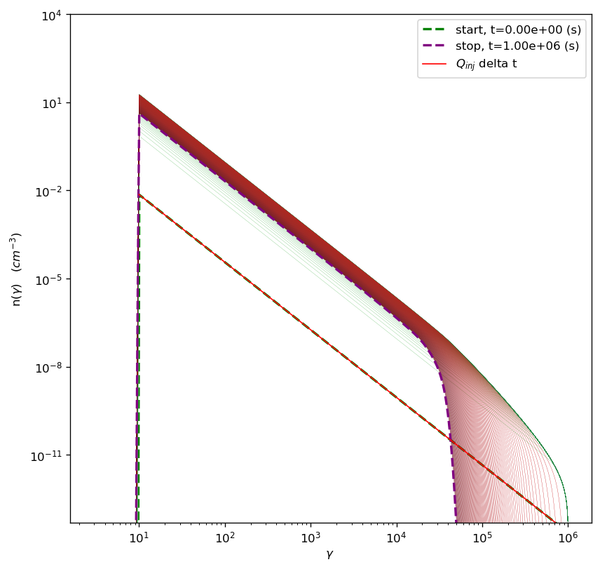
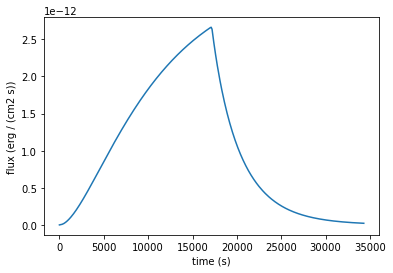
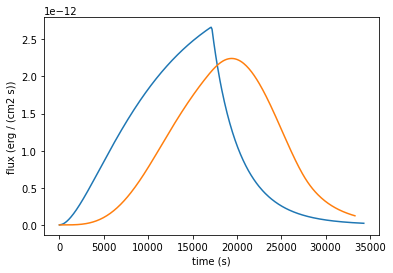

.. _temp_ev_one_zone_cooling:

Temporal evolution, one zone, only cooling
==========================================

Cooling only the newly injecting electrons
------------------------------------------

.. code:: ipython3

    import warnings
    warnings.filterwarnings('ignore')

.. code:: ipython3

    import jetset
    print('tested on jetset',jetset.__version__)

.. parsed-literal::

    tested on jetset 1.2.0

This is a very preliminary documentation for the temporal evolution
capabilities of jetset. Here we show how to create a a radiativeregion,
and how to evolve the system in order to generate both particle spectra,
SEDs, and lightcurves

definition of the injected particle distributio,, and of the jet model
for the radiative region

.. code:: ipython3

    from jetset.jet_model import Jet
    jet_model=Jet()

.. code:: ipython3

    from jetset.jet_emitters_factory import InjEmittersFactory
    
    q_inj=InjEmittersFactory().create_inj_emitters('pl',emitters_type='electrons',normalize=True)
    q_inj.parameters.gmin.val=10
    q_inj.parameters.gmax.val=1E6
    q_inj.parameters.p.val=2.3
    
    jet_model.parameters.beam_obj.val=30
    jet_model.parameters.B.val=0.2
    jet_model.parameters.z_cosm.val=0.03
    

here we set some relevant parameters taht will be described in detail in
the next version of the documentation

.. code:: ipython3

    inj_duration=5E5 #This is in seconds in the blob rest frame
    duration=inj_duration*2
    
    T_esc_rad=2 #This is in units of R/c
    L_inj=1.0E40 #This is in erg/s
    T_SIZE=1E4
    NUM_SET=200

Here, we instantiate the ``JetTimeEvol`` object, passing the radiative
region jet model, and the injected particle class.
``only_radiation=True`` **will disable the accleration region, and only
the radiative region will be used.**

.. code:: ipython3

    from jetset.jet_timedep import JetTimeEvol
    temp_ev=JetTimeEvol(jet_rad=jet_model,Q_inj=q_inj,inplace=True,only_radiation=True)

**The IC cooling is switched off, as default, to make the process
faster**. to switch on the IC cooling ``temp_ev_acc.IC_cooling='on'``

Now, we setup some relevant parameters

.. code:: ipython3

    
    temp_ev.rad_region.jet.nu_min=1E8
    T_SIZE=np.int(T_SIZE)
    
    
    
    
    temp_ev.parameters.duration.val=duration
    temp_ev.parameters.TStart_Inj.val=0
    temp_ev.parameters.TStop_Inj.val=inj_duration
    temp_ev.parameters.T_esc_rad.val=T_esc_rad
    temp_ev.parameters.Esc_Index_rad.val=0
    temp_ev.parameters.t_size.val=T_SIZE
    temp_ev.parameters.num_samples.val=NUM_SET
    temp_ev.parameters.L_inj.val=L_inj
    
    
    temp_ev.parameters.gmin_grid.val=1.0
    temp_ev.parameters.gmax_grid.val=1E8
    temp_ev.parameters.gamma_grid_size.val=1500
    temp_ev.init_TempEv()
    temp_ev.show_model()

.. parsed-literal::

    --------------------------------------------------------------------------------
    JetTimeEvol model description
    --------------------------------------------------------------------------------
     
    physical setup: 
    
    --------------------------------------------------------------------------------

.. raw:: html

    <i>Table length=12</i>
    <table id="table140201300056384-9674" class="table-striped table-bordered table-condensed">
    <thead><tr><th>name</th><th>par type</th><th>val</th><th>units</th><th>val*</th><th>units*</th><th>log</th></tr></thead>
    <tr><td>delta t</td><td>time</td><td>1.000000e+02</td><td>s</td><td>0.0005995849159999999</td><td>R/c</td><td>False</td></tr>
    <tr><td>log. sampling</td><td>time</td><td>0.000000e+00</td><td></td><td>None</td><td></td><td>False</td></tr>
    <tr><td>R/c</td><td>time</td><td>1.667820e+05</td><td>s</td><td>1.0</td><td>R/c</td><td>False</td></tr>
    <tr><td>IC cooling</td><td></td><td>off</td><td></td><td>None</td><td></td><td>False</td></tr>
    <tr><td>Sync cooling</td><td></td><td>on</td><td></td><td>None</td><td></td><td>False</td></tr>
    <tr><td>Adiab. cooling</td><td></td><td>on</td><td></td><td>None</td><td></td><td>False</td></tr>
    <tr><td>Reg. expansion</td><td></td><td>off</td><td></td><td>None</td><td></td><td>False</td></tr>
    <tr><td>Tesc rad</td><td>time</td><td>3.335641e+05</td><td>s</td><td>2.0</td><td>R/c</td><td>False</td></tr>
    <tr><td>R_rad rad start</td><td>region_position</td><td>5.000000e+15</td><td>cm</td><td>None</td><td></td><td>False</td></tr>
    <tr><td>R_H rad start</td><td>region_position</td><td>1.000000e+17</td><td>cm</td><td>None</td><td></td><td>False</td></tr>
    <tr><td>T min. synch. cooling</td><td></td><td>1.934500e+02</td><td>s</td><td>None</td><td></td><td>False</td></tr>
    <tr><td>L inj (electrons)</td><td>injected lum.</td><td>1.000000e+40</td><td>erg/s</td><td>None</td><td></td><td>False</td></tr>
    </table>
    

.. parsed-literal::

    
    model parameters: 
    
    --------------------------------------------------------------------------------

.. raw:: html

    <i>Table length=17</i>
    <table id="table140201302281616-340507" class="table-striped table-bordered table-condensed">
    <thead><tr><th>model name</th><th>name</th><th>par type</th><th>units</th><th>val</th><th>phys. bound. min</th><th>phys. bound. max</th><th>log</th><th>frozen</th></tr></thead>
    <tr><td>jet_time_ev</td><td>duration</td><td>time_grid</td><td>s</td><td>1.000000e+06</td><td>0.000000e+00</td><td>--</td><td>False</td><td>True</td></tr>
    <tr><td>jet_time_ev</td><td>gmin_grid</td><td>gamma_grid</td><td></td><td>1.000000e+00</td><td>0.000000e+00</td><td>--</td><td>False</td><td>True</td></tr>
    <tr><td>jet_time_ev</td><td>gmax_grid</td><td>gamma_grid</td><td></td><td>1.000000e+08</td><td>0.000000e+00</td><td>--</td><td>False</td><td>True</td></tr>
    <tr><td>jet_time_ev</td><td>gamma_grid_size</td><td>gamma_grid</td><td></td><td>1.500000e+03</td><td>0.000000e+00</td><td>--</td><td>False</td><td>True</td></tr>
    <tr><td>jet_time_ev</td><td>TStart_Inj</td><td>time_grid</td><td>s</td><td>0.000000e+00</td><td>0.000000e+00</td><td>--</td><td>False</td><td>True</td></tr>
    <tr><td>jet_time_ev</td><td>TStop_Inj</td><td>time_grid</td><td>s</td><td>5.000000e+05</td><td>0.000000e+00</td><td>--</td><td>False</td><td>True</td></tr>
    <tr><td>jet_time_ev</td><td>T_esc_rad</td><td>escape_time</td><td>(R/c)*</td><td>2.000000e+00</td><td>--</td><td>--</td><td>False</td><td>True</td></tr>
    <tr><td>jet_time_ev</td><td>Esc_Index_rad</td><td>fp_coeff_index</td><td></td><td>0.000000e+00</td><td>--</td><td>--</td><td>False</td><td>True</td></tr>
    <tr><td>jet_time_ev</td><td>R_rad_start</td><td>region_size</td><td>cm</td><td>5.000000e+15</td><td>0.000000e+00</td><td>--</td><td>False</td><td>True</td></tr>
    <tr><td>jet_time_ev</td><td>R_H_rad_start</td><td>region_position</td><td>cm</td><td>1.000000e+17</td><td>0.000000e+00</td><td>--</td><td>False</td><td>True</td></tr>
    <tr><td>jet_time_ev</td><td>m_B</td><td>magnetic_field_index</td><td></td><td>1.000000e+00</td><td>1.000000e+00</td><td>2.000000e+00</td><td>False</td><td>True</td></tr>
    <tr><td>jet_time_ev</td><td>t_jet_exp</td><td>exp_start_time</td><td>s</td><td>1.000000e+05</td><td>0.000000e+00</td><td>--</td><td>False</td><td>True</td></tr>
    <tr><td>jet_time_ev</td><td>beta_exp_R</td><td>beta_expansion</td><td>v/c*</td><td>1.000000e+00</td><td>0.000000e+00</td><td>1.000000e+00</td><td>False</td><td>True</td></tr>
    <tr><td>jet_time_ev</td><td>B_rad</td><td>magnetic_field</td><td>G</td><td>2.000000e-01</td><td>0.000000e+00</td><td>--</td><td>False</td><td>True</td></tr>
    <tr><td>jet_time_ev</td><td>t_size</td><td>time_grid</td><td></td><td>1.000000e+04</td><td>0.000000e+00</td><td>--</td><td>False</td><td>True</td></tr>
    <tr><td>jet_time_ev</td><td>num_samples</td><td>time_ev_output</td><td></td><td>2.000000e+02</td><td>0.000000e+00</td><td>--</td><td>False</td><td>True</td></tr>
    <tr><td>jet_time_ev</td><td>L_inj</td><td>inj_luminosity</td><td>erg / s</td><td>1.000000e+40</td><td>0.000000e+00</td><td>--</td><td>False</td><td>True</td></tr>
    </table>
    

.. code:: ipython3

    temp_ev.plot_time_profile()

.. parsed-literal::

    <jetset.plot_sedfit.PlotTempEvDiagram at 0x7f8328d30250>

.. image:: Temp_Ev_one_zone_only_cooling_files/Temp_Ev_one_zone_only_cooling_16_1.png

.. code:: ipython3

    p=temp_ev.plot_pre_run_plot(dpi=100)

.. image:: Temp_Ev_one_zone_only_cooling_files/Temp_Ev_one_zone_only_cooling_17_0.png

setting ``cache_SEDs_rad=True`` will generate and cache all the SED at
any time of the ``NUM_SET``. **This will increase the computational time
during the run. Anyhow, will speed up the computation of SEDs and light
curves. Moreover, these SEDs will be saved in the model, and read if you
will reload the model in the future**.

.. code:: ipython3

    only_injection=True
    do_injection=True
    eval_cross_time=False
    rest_frame='obs'
    temp_ev.run(only_injection=only_injection,
                do_injection=do_injection,
                cache_SEDs_rad=True)

.. parsed-literal::

    temporal evolution running

.. parsed-literal::

      0%|          | 0/10000 [00:00<?, ?it/s]

.. parsed-literal::

    temporal evolution completed
    caching SED for each saved distribution: start

.. parsed-literal::

      0%|          | 0/200 [00:00<?, ?it/s]

.. parsed-literal::

    caching SED for each saved distribution: done

Particle spectrum in the radiative region

.. code:: ipython3

    p=temp_ev.plot_tempev_emitters(region='rad',loglog=False,energy_unit='gamma',pow=0)
    p.setlim(y_min=5E-14,y_max=1E4)

SEDs in the radiative region

.. code:: ipython3

    p=temp_ev.plot_tempev_model(region='rad',sed_data=None, use_cached = True)

.. image:: Temp_Ev_one_zone_only_cooling_files/Temp_Ev_one_zone_only_cooling_23_0.png

We generate a lightcurve in the range nu1=2.4E22 Hz, nu2=7.2E25 Hz,
without the effect of the light crossing time, in the observer frame

.. code:: ipython3

    lg=temp_ev.rad_region.make_lc(nu1=2.4E22,nu2=7.2E25,name='gamma',eval_cross_time=False,delta_t_out=100,use_cached=True,frame='obs')

.. code:: ipython3

    lg

.. raw:: html

    <i>Table length=344</i>
    <table id="table140200830948592" class="table-striped table-bordered table-condensed">
    <thead><tr><th>time</th><th>flux</th></tr></thead>
    <thead><tr><th>s</th><th>erg / (cm2 s)</th></tr></thead>
    <thead><tr><th>float64</th><th>float64</th></tr></thead>
    <tr><td>0.0</td><td>1.0025312073439857e-18</td></tr>
    <tr><td>100.0</td><td>2.721071237898974e-15</td></tr>
    <tr><td>200.0</td><td>5.441139944590604e-15</td></tr>
    <tr><td>300.0</td><td>8.161208651282235e-15</td></tr>
    <tr><td>400.0</td><td>1.2857452255742743e-14</td></tr>
    <tr><td>500.0</td><td>1.9064888429085333e-14</td></tr>
    <tr><td>600.0</td><td>2.6938015030327216e-14</td></tr>
    <tr><td>700.0</td><td>3.53370922516786e-14</td></tr>
    <tr><td>800.0</td><td>4.524420360115135e-14</td></tr>
    <tr><td>...</td><td>...</td></tr>
    <tr><td>33400.0</td><td>2.7653273627251138e-14</td></tr>
    <tr><td>33500.0</td><td>2.6951267478504774e-14</td></tr>
    <tr><td>33600.0</td><td>2.627278245468649e-14</td></tr>
    <tr><td>33700.0</td><td>2.56102578769332e-14</td></tr>
    <tr><td>33800.0</td><td>2.4961698689486774e-14</td></tr>
    <tr><td>33900.0</td><td>2.4336458732562352e-14</td></tr>
    <tr><td>34000.0</td><td>2.3719178229843572e-14</td></tr>
    <tr><td>34100.0</td><td>2.3126418451267855e-14</td></tr>
    <tr><td>34200.0</td><td>2.2543527909109737e-14</td></tr>
    <tr><td>34300.0</td><td>2.197651396466689e-14</td></tr>
    </table>

.. code:: ipython3

    plt.plot(lg['time'],lg['flux'])
    plt.xlabel('time (%s)'%lg['time'].unit)
    plt.ylabel('flux (%s)'%lg['flux'].unit)

.. parsed-literal::

    Text(0, 0.5, 'flux (erg / (cm2 s))')

We generate a lightcurve in the range nu1=2.4E22 Hz, nu2=7.2E25 Hz, with
the effect of the **light crossing time**, in the observer frame,
setting ``eval_cross_time=True``

.. code:: ipython3

    lg_cross=temp_ev.rad_region.make_lc(nu1=2.4E22,nu2=7.2E25,name='gamma',eval_cross_time=True,delta_t_out=1E2,use_cached=True,frame='obs',cross_time_slices=1000)

.. code:: ipython3

    plt.plot(lg['time'],lg['flux'])
    plt.plot(lg_cross['time'],lg_cross['flux'])
    
    plt.xlabel('time (%s)'%lg['time'].unit)
    plt.ylabel('flux (%s)'%lg['flux'].unit)

.. parsed-literal::

    Text(0, 0.5, 'flux (erg / (cm2 s))')

.. code:: ipython3

    np.trapz(lg['flux'],lg['time']),np.trapz(lg_cross['flux'],lg_cross['time'])

.. parsed-literal::

    (3.3654423005727297e-08, 3.227116810070242e-08)

We can save the model and reuse it later for plotting lightcurcves,
SEDs, and electron distributions

.. code:: ipython3

    temp_ev.save_model('temp_ev_only_rad.pkl')

.. code:: ipython3

    temp_ev_1=JetTimeEvol.load_model('temp_ev_only_rad.pkl')

.. code:: ipython3

    temp_ev_1.show_model()

.. parsed-literal::

    --------------------------------------------------------------------------------
    JetTimeEvol model description
    --------------------------------------------------------------------------------
     
    physical setup: 
    
    --------------------------------------------------------------------------------

.. raw:: html

    <i>Table length=12</i>
    <table id="table140200868245952-29339" class="table-striped table-bordered table-condensed">
    <thead><tr><th>name</th><th>par type</th><th>val</th><th>units</th><th>val*</th><th>units*</th><th>log</th></tr></thead>
    <tr><td>delta t</td><td>time</td><td>1.000000e+02</td><td>s</td><td>0.0005995849159999999</td><td>R/c</td><td>False</td></tr>
    <tr><td>log. sampling</td><td>time</td><td>0.000000e+00</td><td></td><td>None</td><td></td><td>False</td></tr>
    <tr><td>R/c</td><td>time</td><td>1.667820e+05</td><td>s</td><td>1.0</td><td>R/c</td><td>False</td></tr>
    <tr><td>IC cooling</td><td></td><td>off</td><td></td><td>None</td><td></td><td>False</td></tr>
    <tr><td>Sync cooling</td><td></td><td>on</td><td></td><td>None</td><td></td><td>False</td></tr>
    <tr><td>Adiab. cooling</td><td></td><td>on</td><td></td><td>None</td><td></td><td>False</td></tr>
    <tr><td>Reg. expansion</td><td></td><td>off</td><td></td><td>None</td><td></td><td>False</td></tr>
    <tr><td>Tesc rad</td><td>time</td><td>3.335641e+05</td><td>s</td><td>2.0</td><td>R/c</td><td>False</td></tr>
    <tr><td>R_rad rad start</td><td>region_position</td><td>5.000000e+15</td><td>cm</td><td>None</td><td></td><td>False</td></tr>
    <tr><td>R_H rad start</td><td>region_position</td><td>1.000000e+17</td><td>cm</td><td>None</td><td></td><td>False</td></tr>
    <tr><td>T min. synch. cooling</td><td></td><td>1.934500e+02</td><td>s</td><td>None</td><td></td><td>False</td></tr>
    <tr><td>L inj (electrons)</td><td>injected lum.</td><td>1.000000e+40</td><td>erg/s</td><td>None</td><td></td><td>False</td></tr>
    </table>
    

.. parsed-literal::

    
    model parameters: 
    
    --------------------------------------------------------------------------------

.. raw:: html

    <i>Table length=17</i>
    <table id="table140200874797520-910618" class="table-striped table-bordered table-condensed">
    <thead><tr><th>model name</th><th>name</th><th>par type</th><th>units</th><th>val</th><th>phys. bound. min</th><th>phys. bound. max</th><th>log</th><th>frozen</th></tr></thead>
    <tr><td>jet_time_ev</td><td>duration</td><td>time_grid</td><td>s</td><td>1.000000e+06</td><td>0.000000e+00</td><td>--</td><td>False</td><td>True</td></tr>
    <tr><td>jet_time_ev</td><td>gmin_grid</td><td>gamma_grid</td><td></td><td>1.000000e+00</td><td>0.000000e+00</td><td>--</td><td>False</td><td>True</td></tr>
    <tr><td>jet_time_ev</td><td>gmax_grid</td><td>gamma_grid</td><td></td><td>1.000000e+08</td><td>0.000000e+00</td><td>--</td><td>False</td><td>True</td></tr>
    <tr><td>jet_time_ev</td><td>gamma_grid_size</td><td>gamma_grid</td><td></td><td>1.500000e+03</td><td>0.000000e+00</td><td>--</td><td>False</td><td>True</td></tr>
    <tr><td>jet_time_ev</td><td>TStart_Inj</td><td>time_grid</td><td>s</td><td>0.000000e+00</td><td>0.000000e+00</td><td>--</td><td>False</td><td>True</td></tr>
    <tr><td>jet_time_ev</td><td>TStop_Inj</td><td>time_grid</td><td>s</td><td>5.000000e+05</td><td>0.000000e+00</td><td>--</td><td>False</td><td>True</td></tr>
    <tr><td>jet_time_ev</td><td>T_esc_rad</td><td>escape_time</td><td>(R/c)*</td><td>2.000000e+00</td><td>--</td><td>--</td><td>False</td><td>True</td></tr>
    <tr><td>jet_time_ev</td><td>Esc_Index_rad</td><td>fp_coeff_index</td><td></td><td>0.000000e+00</td><td>--</td><td>--</td><td>False</td><td>True</td></tr>
    <tr><td>jet_time_ev</td><td>R_rad_start</td><td>region_size</td><td>cm</td><td>5.000000e+15</td><td>0.000000e+00</td><td>--</td><td>False</td><td>True</td></tr>
    <tr><td>jet_time_ev</td><td>R_H_rad_start</td><td>region_position</td><td>cm</td><td>1.000000e+17</td><td>0.000000e+00</td><td>--</td><td>False</td><td>True</td></tr>
    <tr><td>jet_time_ev</td><td>m_B</td><td>magnetic_field_index</td><td></td><td>1.000000e+00</td><td>1.000000e+00</td><td>2.000000e+00</td><td>False</td><td>True</td></tr>
    <tr><td>jet_time_ev</td><td>t_jet_exp</td><td>exp_start_time</td><td>s</td><td>1.000000e+05</td><td>0.000000e+00</td><td>--</td><td>False</td><td>True</td></tr>
    <tr><td>jet_time_ev</td><td>beta_exp_R</td><td>beta_expansion</td><td>v/c*</td><td>1.000000e+00</td><td>0.000000e+00</td><td>1.000000e+00</td><td>False</td><td>True</td></tr>
    <tr><td>jet_time_ev</td><td>B_rad</td><td>magnetic_field</td><td>G</td><td>2.000000e-01</td><td>0.000000e+00</td><td>--</td><td>False</td><td>True</td></tr>
    <tr><td>jet_time_ev</td><td>t_size</td><td>time_grid</td><td></td><td>1.000000e+04</td><td>0.000000e+00</td><td>--</td><td>False</td><td>True</td></tr>
    <tr><td>jet_time_ev</td><td>num_samples</td><td>time_ev_output</td><td></td><td>2.000000e+02</td><td>0.000000e+00</td><td>--</td><td>False</td><td>True</td></tr>
    <tr><td>jet_time_ev</td><td>L_inj</td><td>inj_luminosity</td><td>erg / s</td><td>1.000000e+40</td><td>0.000000e+00</td><td>--</td><td>False</td><td>True</td></tr>
    </table>
    

.. code:: ipython3

    p=temp_ev_1.plot_tempev_model(region='rad',sed_data=None, use_cached = True)

.. image:: Temp_Ev_one_zone_only_cooling_files/Temp_Ev_one_zone_only_cooling_36_0.png

.. code:: ipython3

    lx=temp_ev_1.rad_region.make_lc(nu1=1E17,nu2=1E18,name='X',eval_cross_time=False,delta_t_out=100,use_cached=True,frame='obs')
    plt.plot(lx['time'],lx['flux'])
    plt.xlabel('time (%s)'%lg['time'].unit)
    plt.ylabel('flux (%s)'%lg['flux'].unit)

.. parsed-literal::

    Text(0, 0.5, 'flux (erg / (cm2 s))')

.. image:: Temp_Ev_one_zone_only_cooling_files/Temp_Ev_one_zone_only_cooling_37_1.png

