.. _temp_ev:

Temporal evolution
==================

.. code:: ipython3

    import warnings
    warnings.filterwarnings('ignore')

.. code:: ipython3

    import jetset
    print('tested on jetset',jetset.__version__)

.. parsed-literal::

    tested on jetset 1.2.0rc4

.. code:: ipython3

    def t_adiab(R_H,BulckFactor,vs=3E10):
        return R_H/(vs*BulckFactor)

.. code:: ipython3

    from jetset.jet_model import Jet
    
    def build_jet():
        my_jet_acc = Jet(beaming_expr='bulk_theta',electron_distribution='plc',name='jet_acc')
        my_jet_acc.parameters.BulkFactor.val=15
        my_jet_acc.parameters.theta.val=5
        my_jet_acc.parameters.z_cosm.val=0.001
        my_jet_acc.parameters.gmin.val=1
        my_jet_acc.parameters.gmax.val=1E5
        my_jet_acc.parameters.R.val=1E14
        my_jet_acc.parameters.R_H.val=1E17
        my_jet_acc.parameters.B.val=1
        my_jet_acc.parameters.gamma_cut.val=1E4
        my_jet_acc.parameters.p.val=2
        return my_jet_acc

.. code:: ipython3

    my_jet_acc=build_jet()
    my_jet_acc

.. parsed-literal::

    
    --------------------------------------------------------------------------------
    jet model description
    --------------------------------------------------------------------------------
    name: jet_acc  
    
    electrons distribution:
     type: plc  
     gamma energy grid size:  201
     gmin grid : 2.000000e+00
     gmax grid : 1.000000e+06
     normalization  True
     log-values  False
    
    radiative fields:
     seed photons grid size:  100
     IC emission grid size:  100
     source emissivity lower bound :  1.000000e-120
     spectral components:
       name:Sum, state: on
       name:Sync, state: self-abs
       name:SSC, state: on
    external fields transformation method: blob
    
    SED info:
     nu grid size jetkernel: 1000
     nu grid size: 500
     nu mix (Hz): 1.000000e+06
     nu max (Hz): 1.000000e+30
    
    flux plot lower bound   :  1.000000e-120
    
    --------------------------------------------------------------------------------

.. raw:: html

    <i>Table length=11</i>
    <table id="table140194436884752-261284" class="table-striped table-bordered table-condensed">
    <thead><tr><th>model name</th><th>name</th><th>par type</th><th>units</th><th>val</th><th>phys. bound. min</th><th>phys. bound. max</th><th>log</th><th>frozen</th></tr></thead>
    <tr><td>jet_acc</td><td>R</td><td>region_size</td><td>cm</td><td>1.000000e+14</td><td>1.000000e+03</td><td>1.000000e+30</td><td>False</td><td>False</td></tr>
    <tr><td>jet_acc</td><td>R_H</td><td>region_position</td><td>cm</td><td>1.000000e+17</td><td>0.000000e+00</td><td>--</td><td>False</td><td>True</td></tr>
    <tr><td>jet_acc</td><td>B</td><td>magnetic_field</td><td>gauss</td><td>1.000000e+00</td><td>0.000000e+00</td><td>--</td><td>False</td><td>False</td></tr>
    <tr><td>jet_acc</td><td>theta</td><td>jet-viewing-angle</td><td>deg</td><td>5.000000e+00</td><td>0.000000e+00</td><td>--</td><td>False</td><td>False</td></tr>
    <tr><td>jet_acc</td><td>BulkFactor</td><td>jet-bulk-factor</td><td>lorentz-factor*</td><td>1.500000e+01</td><td>1.000000e+00</td><td>--</td><td>False</td><td>False</td></tr>
    <tr><td>jet_acc</td><td>z_cosm</td><td>redshift</td><td></td><td>1.000000e-03</td><td>0.000000e+00</td><td>--</td><td>False</td><td>False</td></tr>
    <tr><td>jet_acc</td><td>gmin</td><td>low-energy-cut-off</td><td>lorentz-factor*</td><td>1.000000e+00</td><td>1.000000e+00</td><td>1.000000e+09</td><td>False</td><td>False</td></tr>
    <tr><td>jet_acc</td><td>gmax</td><td>high-energy-cut-off</td><td>lorentz-factor*</td><td>1.000000e+05</td><td>1.000000e+00</td><td>1.000000e+15</td><td>False</td><td>False</td></tr>
    <tr><td>jet_acc</td><td>N</td><td>emitters_density</td><td>1 / cm3</td><td>1.000000e+02</td><td>0.000000e+00</td><td>--</td><td>False</td><td>False</td></tr>
    <tr><td>jet_acc</td><td>gamma_cut</td><td>turn-over-energy</td><td>lorentz-factor*</td><td>1.000000e+04</td><td>1.000000e+00</td><td>1.000000e+09</td><td>False</td><td>False</td></tr>
    <tr><td>jet_acc</td><td>p</td><td>LE_spectral_slope</td><td></td><td>2.000000e+00</td><td>-1.000000e+01</td><td>1.000000e+01</td><td>False</td><td>False</td></tr>
    </table>
    

.. parsed-literal::

    --------------------------------------------------------------------------------

.. parsed-literal::

    None

setting the injection distribution
----------------------------------

1) using the EmittersFactory

.. code:: ipython3

    from jetset.jet_emitters_factory import EmittersFactory
    q_inj=InjEmittersFactory().create_inj_emitters('pl',emitters_type='electrons',normalize=True)
    q_inj.parameters.gmax.val=5

.. code:: ipython3

    q_inj.parameters

.. raw:: html

    <i>Table length=4</i>
    <table id="table140193922665344-708448" class="table-striped table-bordered table-condensed">
    <thead><tr><th>name</th><th>par type</th><th>units</th><th>val</th><th>phys. bound. min</th><th>phys. bound. max</th><th>log</th><th>frozen</th></tr></thead>
    <tr><td>gmin</td><td>low-energy-cut-off</td><td>lorentz-factor*</td><td>2.000000e+00</td><td>1.000000e+00</td><td>1.000000e+09</td><td>False</td><td>False</td></tr>
    <tr><td>gmax</td><td>high-energy-cut-off</td><td>lorentz-factor*</td><td>5.000000e+00</td><td>1.000000e+00</td><td>1.000000e+15</td><td>False</td><td>False</td></tr>
    <tr><td>Q</td><td>emitters_density</td><td>1 / (cm3 s)</td><td>1.000000e-03</td><td>0.000000e+00</td><td>--</td><td>False</td><td>False</td></tr>
    <tr><td>p</td><td>LE_spectral_slope</td><td></td><td>2.000000e+00</td><td>-1.000000e+01</td><td>1.000000e+01</td><td>False</td><td>False</td></tr>
    </table>
    

.. parsed-literal::

    None

.. code:: ipython3

    p=q_inj.plot()

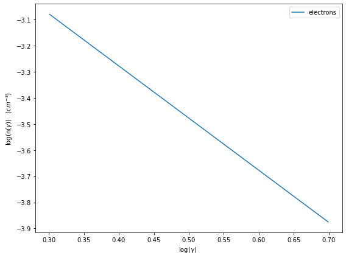

2) using a custom array distribution

.. code:: ipython3

    gamma=np.logspace(np.log10(2),np.log10(5),100)
    
    #gamma array this is n(\gamma) in 1/cm^3/gamma 
    n_gamma=gamma**-2

.. code:: ipython3

    from jetset.jet_emitters import InjEmittersArrayDistribution
    q_inj_array=InjEmittersArrayDistribution(name='array_distr',emitters_type='electrons',gamma_array=gamma,n_gamma_array=n_gamma,normalize=True)

.. code:: ipython3

    q_inj_array.parameters

.. raw:: html

    <i>Table length=3</i>
    <table id="table140193923028640-269509" class="table-striped table-bordered table-condensed">
    <thead><tr><th>name</th><th>par type</th><th>units</th><th>val</th><th>phys. bound. min</th><th>phys. bound. max</th><th>log</th><th>frozen</th></tr></thead>
    <tr><td>gmin</td><td>low-energy-cut-off</td><td>lorentz-factor*</td><td>2.000000e+00</td><td>1.000000e+00</td><td>1.000000e+09</td><td>False</td><td>False</td></tr>
    <tr><td>gmax</td><td>high-energy-cut-off</td><td>lorentz-factor*</td><td>5.000000e+00</td><td>1.000000e+00</td><td>1.000000e+15</td><td>False</td><td>False</td></tr>
    <tr><td>Q</td><td>emitters_density</td><td>1 / (cm3 s)</td><td>1.000000e+00</td><td>0.000000e+00</td><td>--</td><td>False</td><td>False</td></tr>
    </table>
    

.. parsed-literal::

    None

.. code:: ipython3

    p=q_inj_array.plot()

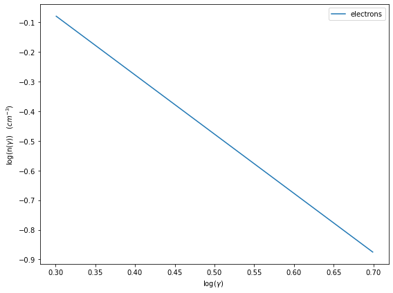

In this section we describe how  to perform the temporal evolution of a Jet, using the :class:`.JetTimeEvol` class from the :mod:`.jet_timedep` module.  

.. code:: ipython3

    from jetset.jet_timedep import  JetTimeEvol

.. code:: ipython3

    my_jet_acc=build_jet()
    temp_ev_acc=JetTimeEvol(jet=my_jet_acc,Q_inj=q_inj_array,inplace=True)
    
    
    
    
    duration=1E4
    duration_acc=1E4
    T_SIZE=np.int(1E4)
    
    temp_ev_acc.parameters.duration.val=duration
    temp_ev_acc.parameters.TStart_Acc.val=0
    temp_ev_acc.parameters.TStop_Acc.val=duration*0.5
    temp_ev_acc.parameters.TStart_Inj.val=0
    temp_ev_acc.parameters.TStop_Inj.val=duration*0.5
    temp_ev_acc.parameters.T_esc.val=3
    temp_ev_acc.parameters.t_D0.val=4000
    temp_ev_acc.parameters.t_A0.val=2000
    temp_ev_acc.parameters.Esc_Index.val=0
    temp_ev_acc.parameters.Acc_Index.val=1
    temp_ev_acc.parameters.Diff_Index.val=2
    temp_ev_acc.parameters.T_SIZE.val=T_SIZE
    temp_ev_acc.parameters.NUM_SET.val=200
    temp_ev_acc._temp_ev.do_Compton_cooling=0
    temp_ev_acc.parameters.L_inj.val=4E37
    temp_ev_acc.parameters.LOG_SET.val=0
    
    temp_ev_acc.parameters.gmin_grid.val=1.1
    temp_ev_acc.parameters.gmax_grid.val=1E7
    temp_ev_acc.parameters.gamma_grid_size.val=1000
    temp_ev_acc.init_TempEv()
    
    temp_ev_acc.show_model()

.. parsed-literal::

    --------------------------------------------------------------------------------
    JetTimeEvol model description
    --------------------------------------------------------------------------------
     
    physical setup: 
    
    --------------------------------------------------------------------------------

.. raw:: html

    <i>Table length=19</i>
    <table id="table140193922039664-159322" class="table-striped table-bordered table-condensed">
    <thead><tr><th>name</th><th>par type</th><th>val</th><th>units</th><th>val*</th><th>units*</th><th>log</th></tr></thead>
    <tr><td>delta t</td><td>time</td><td>1.0</td><td>s</td><td>0.00029979245799999996</td><td>R/c</td><td>False</td></tr>
    <tr><td>R/c</td><td>time</td><td>3335.6409519815206</td><td>s</td><td>1.0</td><td>R/c</td><td>False</td></tr>
    <tr><td>Diff coeff</td><td></td><td>0.00025</td><td>s-1</td><td>None</td><td></td><td>False</td></tr>
    <tr><td>Acc coeff</td><td></td><td>0.0005</td><td>s-1</td><td>None</td><td></td><td>False</td></tr>
    <tr><td>Diff index</td><td></td><td>2.0</td><td></td><td>None</td><td></td><td>False</td></tr>
    <tr><td>Acc index</td><td></td><td>1.0</td><td>s-1</td><td>None</td><td></td><td>False</td></tr>
    <tr><td>Tesc</td><td>time</td><td>10006.922855944562</td><td>s</td><td>3.0</td><td>R/c</td><td>False</td></tr>
    <tr><td>T_A0=1/ACC_COEFF</td><td>time</td><td>2000.0</td><td>s</td><td>0.599584916</td><td>R/c</td><td>False</td></tr>
    <tr><td>T_D0=1/DIFF_COEFF</td><td>time</td><td>4000.0</td><td>s</td><td>1.199169832</td><td>R/c</td><td>False</td></tr>
    <tr><td>T_DA0=1/(2*DIFF_COEFF)</td><td>time</td><td>2000.0</td><td>s</td><td>0.599584916</td><td>R/c</td><td>False</td></tr>
    <tr><td>gamma Lambda Turb.  max</td><td></td><td>586679088020.182</td><td></td><td>None</td><td></td><td>False</td></tr>
    <tr><td>gamma Lambda Coher. max</td><td></td><td>58667908802.018196</td><td></td><td>None</td><td></td><td>False</td></tr>
    <tr><td>gamma eq Syst. Acc (synch. cool)</td><td></td><td>780681.5412486438</td><td></td><td>None</td><td></td><td>False</td></tr>
    <tr><td>gamma eq Diff. Acc (synch. cool)</td><td></td><td>196532.61940450914</td><td></td><td>None</td><td></td><td>False</td></tr>
    <tr><td>T cooling(gamma_eq=gamma_eq_Diff)</td><td></td><td>3937.259854652065</td><td>s</td><td>None</td><td></td><td>False</td></tr>
    <tr><td>T cooling(gamma_eq=gamma_eq_Sys)</td><td></td><td>991.1852037062209</td><td>s</td><td>None</td><td></td><td>False</td></tr>
    <tr><td>T min. synch. cooling</td><td></td><td>77.37999924909614</td><td>s</td><td>None</td><td></td><td>False</td></tr>
    <tr><td>L inj (electrons)</td><td>injected lum.</td><td>3.999999999999999e+37</td><td>erg/s</td><td>None</td><td></td><td>False</td></tr>
    <tr><td>E_inj (electrons)</td><td></td><td>3.999999999999999e+37</td><td>erg</td><td>None</td><td></td><td>False</td></tr>
    </table>
    

.. parsed-literal::

    
    model parameters: 
    
    --------------------------------------------------------------------------------

.. raw:: html

    <i>Table length=20</i>
    <table id="table140194444184304-661405" class="table-striped table-bordered table-condensed">
    <thead><tr><th>model name</th><th>name</th><th>par type</th><th>units</th><th>val</th><th>phys. bound. min</th><th>phys. bound. max</th><th>log</th><th>frozen</th></tr></thead>
    <tr><td>jet_time_ev</td><td>duration</td><td>time_grid</td><td>s</td><td>1.000000e+04</td><td>0.000000e+00</td><td>--</td><td>False</td><td>True</td></tr>
    <tr><td>jet_time_ev</td><td>gmin_grid</td><td>gamma_grid</td><td></td><td>1.100000e+00</td><td>0.000000e+00</td><td>--</td><td>False</td><td>True</td></tr>
    <tr><td>jet_time_ev</td><td>gmax_grid</td><td>gamma_grid</td><td></td><td>1.000000e+07</td><td>0.000000e+00</td><td>--</td><td>False</td><td>True</td></tr>
    <tr><td>jet_time_ev</td><td>gamma_grid_size</td><td>gamma_grid</td><td></td><td>1.000000e+03</td><td>0.000000e+00</td><td>--</td><td>False</td><td>True</td></tr>
    <tr><td>jet_time_ev</td><td>TStart_Acc</td><td>time_grid</td><td>s</td><td>0.000000e+00</td><td>0.000000e+00</td><td>--</td><td>False</td><td>True</td></tr>
    <tr><td>jet_time_ev</td><td>TStop_Acc</td><td>time_grid</td><td>s</td><td>5.000000e+03</td><td>0.000000e+00</td><td>--</td><td>False</td><td>True</td></tr>
    <tr><td>jet_time_ev</td><td>TStart_Inj</td><td>time_grid</td><td>s</td><td>0.000000e+00</td><td>0.000000e+00</td><td>--</td><td>False</td><td>True</td></tr>
    <tr><td>jet_time_ev</td><td>TStop_Inj</td><td>time_grid</td><td>s</td><td>5.000000e+03</td><td>0.000000e+00</td><td>--</td><td>False</td><td>True</td></tr>
    <tr><td>jet_time_ev</td><td>T_esc</td><td>escape_time</td><td>(R/c)*</td><td>3.000000e+00</td><td>--</td><td>--</td><td>False</td><td>True</td></tr>
    <tr><td>jet_time_ev</td><td>Esc_Index</td><td>fp_coeff_index</td><td></td><td>0.000000e+00</td><td>--</td><td>--</td><td>False</td><td>True</td></tr>
    <tr><td>jet_time_ev</td><td>t_D0</td><td>acceleration_time</td><td>s</td><td>4.000000e+03</td><td>0.000000e+00</td><td>--</td><td>False</td><td>True</td></tr>
    <tr><td>jet_time_ev</td><td>t_A0</td><td>acceleration_time</td><td>s</td><td>2.000000e+03</td><td>0.000000e+00</td><td>--</td><td>False</td><td>True</td></tr>
    <tr><td>jet_time_ev</td><td>Diff_Index</td><td>fp_coeff_index</td><td>s</td><td>2.000000e+00</td><td>0.000000e+00</td><td>--</td><td>False</td><td>True</td></tr>
    <tr><td>jet_time_ev</td><td>Acc_Index</td><td>fp_coeff_index</td><td></td><td>1.000000e+00</td><td>--</td><td>--</td><td>False</td><td>True</td></tr>
    <tr><td>jet_time_ev</td><td>Lambda_max_Turb</td><td>turbulence_scale</td><td>cm</td><td>1.000000e+15</td><td>0.000000e+00</td><td>--</td><td>False</td><td>True</td></tr>
    <tr><td>jet_time_ev</td><td>Lambda_choer_Turb_factor</td><td>turbulence_scale</td><td>cm</td><td>1.000000e-01</td><td>0.000000e+00</td><td>--</td><td>False</td><td>True</td></tr>
    <tr><td>jet_time_ev</td><td>T_SIZE</td><td>time_grid</td><td></td><td>1.000000e+04</td><td>0.000000e+00</td><td>--</td><td>False</td><td>True</td></tr>
    <tr><td>jet_time_ev</td><td>NUM_SET</td><td>time_ev_output</td><td></td><td>2.000000e+02</td><td>0.000000e+00</td><td>--</td><td>False</td><td>True</td></tr>
    <tr><td>jet_time_ev</td><td>LOG_SET</td><td>time_ev_output</td><td></td><td>0.000000e+00</td><td>0.000000e+00</td><td>--</td><td>False</td><td>True</td></tr>
    <tr><td>jet_time_ev</td><td>L_inj</td><td>inj_luminosity</td><td>erg / s</td><td>4.000000e+37</td><td>0.000000e+00</td><td>--</td><td>False</td><td>True</td></tr>
    </table>
    

.. code:: ipython3

    p=temp_ev_acc.plot_pre_run_plot(dpi=100)

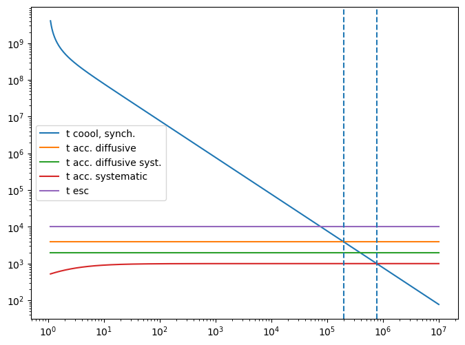

.. code:: ipython3

    t_acc_sys=1/(1/temp_ev_acc.t_A_pre_run[0] + 1/temp_ev_acc.t_DA_pre_run[0])
    z=np.logspace(6,16,100)
    t_cool_adiab=t_adiab(R_H=z,BulckFactor=my_jet_acc.parameters.BulkFactor.val)
    fig = plt.figure(dpi=120)
    ax= fig.add_subplot(111)
    ax.loglog(z,t_cool_adiab,label='$t_{cool}$ adiab.' )
    ax.axhline(t_acc_sys,c='red',label='$t_{acc}$ syst.')
    ax.axvline(my_jet_acc.parameters.R_H.val,label='jet acc $R_H$',c='g')
    ax.set_xlabel('$R_{H}$ (cm)')
    ax.set_ylabel('time (s)')
    ax.legend()
    ax.grid(linewidth=0.5,which='both')

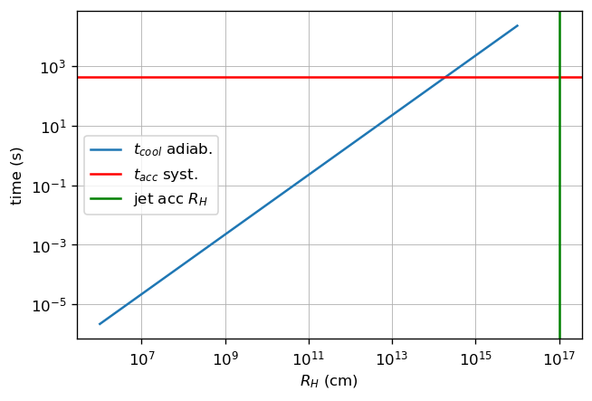

.. code:: ipython3

    p=temp_ev_acc.plot_time_profile()

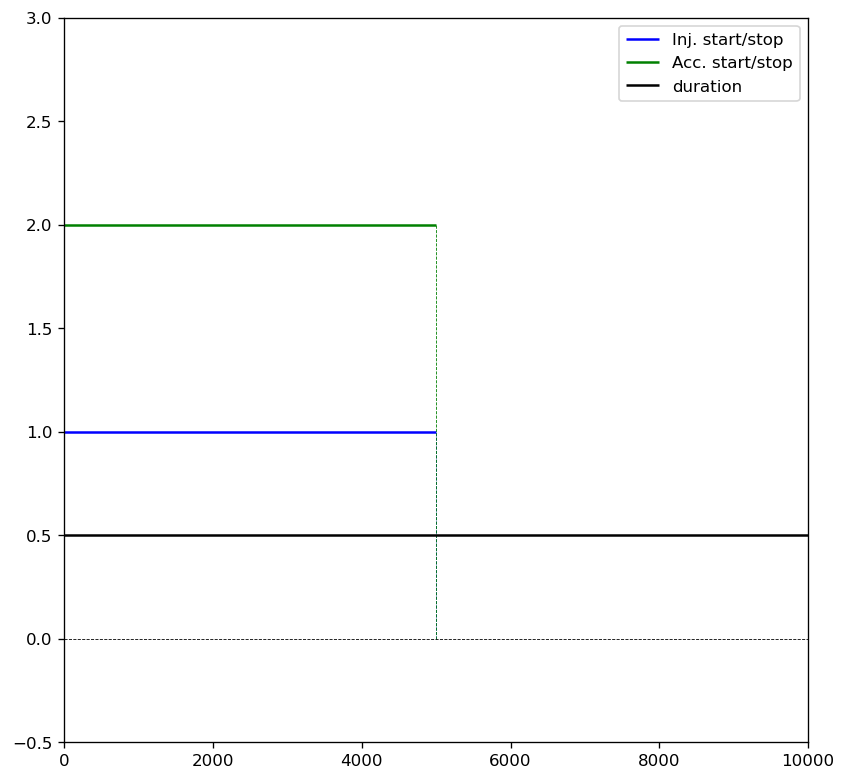

.. code:: ipython3

    #temp_ev_acc._temp_ev.Q_scaling_factor,my_jet_acc._blob.E_tot_e*temp_ev_acc._temp_ev.Q_scaling_factor

.. code:: ipython3

    p=temp_ev_acc.Q_inj.plot()

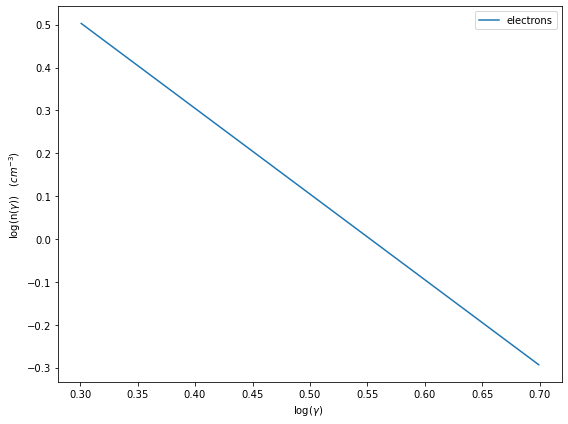

running cooling and acc using only injection
--------------------------------------------

.. code:: ipython3

    temp_ev_acc.run(only_injection=True)

.. parsed-literal::

    temporal evolution running

.. parsed-literal::

      0%|          | 0/10000 [00:00<?, ?it/s]

.. parsed-literal::

    temporal evolution completed

.. code:: ipython3

    p=temp_ev_acc.plot_TempEv_emitters(loglog=False,energy_unit='gamma',pow=1)
    p.ax.axvline(temp_ev_acc._temp_ev.gamma_eq_t_A, ls='--')
    p.ax.axvline(temp_ev_acc._temp_ev.gamma_eq_t_D, ls='--')
    p.rescale(x_max=1E8,x_min=1,y_min=1E-4,y_max=1E4)

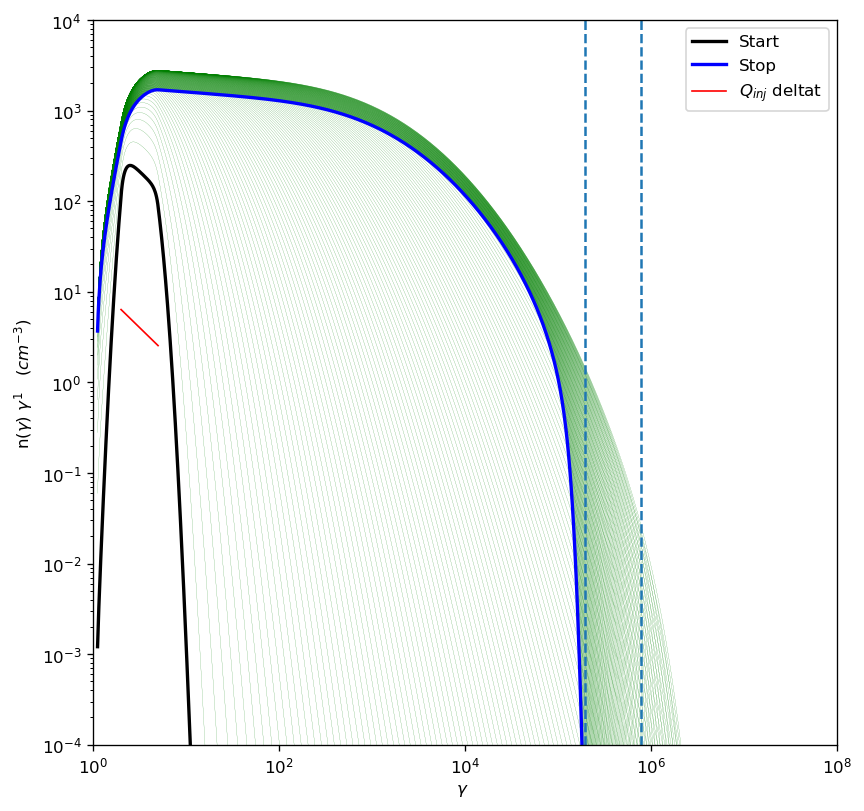

.. code:: ipython3

    p=temp_ev_acc.plot_TempEv_emitters(loglog=False,energy_unit='gamma',pow=3)
    p.ax.axvline(temp_ev_acc._temp_ev.gamma_eq_t_A, ls='--')
    p.ax.axvline(temp_ev_acc._temp_ev.gamma_eq_t_D, ls='--')
    p.rescale(x_max=1E8,x_min=1,y_min=1E-4,y_max=1E11)

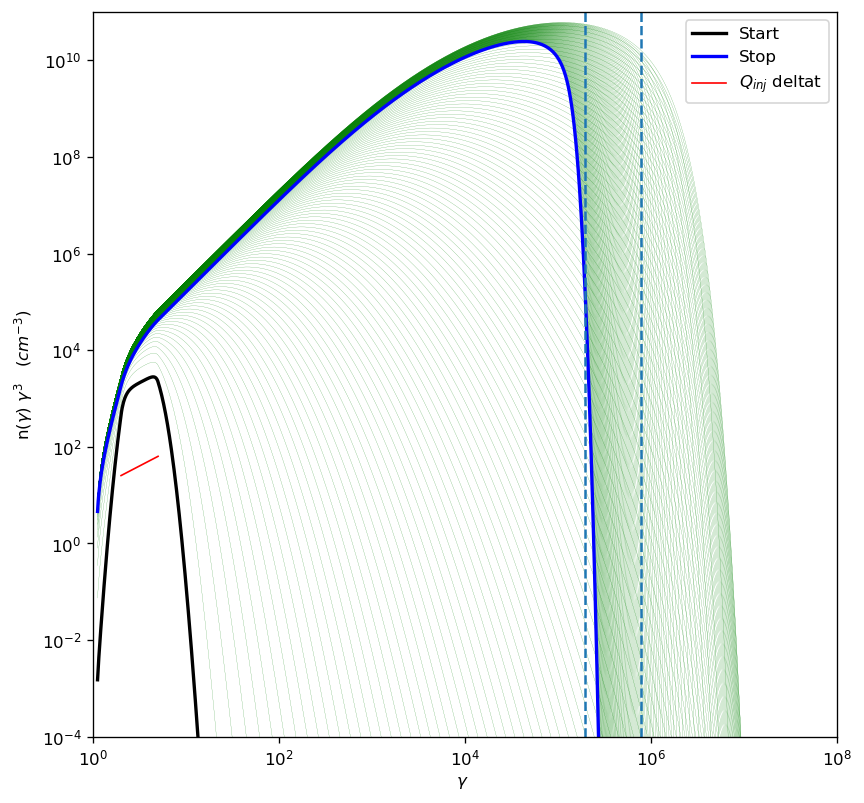

.. code:: ipython3

    temp_ev_acc.plot_model(10,199,50)

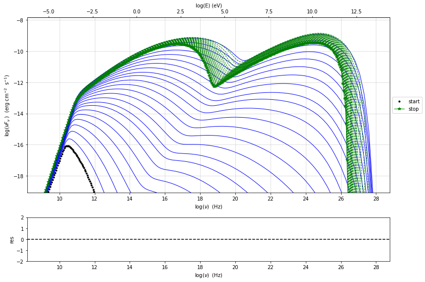

.. code:: ipython3

    fig=plt.figure(figsize=(10,5),dpi=100)
    
    xt,yt=temp_ev_acc.make_lc(10,199,1E24,1E27)
    plt.plot(xt,yt/yt.max(),label='tev')
    
    xg,yg=temp_ev_acc.make_lc(10,199,1E21,1E24)
    plt.plot(xg,yg/yg.max(),label='gamma')
    
    xrh,yrh=temp_ev_acc.make_lc(10,199,1E9,1E10)
    plt.plot(xrh,yrh/yrh.max(),label='radio 1-10 GHz')
    
    xrl,yrl=temp_ev_acc.make_lc(10,199,1E8,1E9)
    plt.plot(xrl,yrl/yrl.max(),label='radio 0.1-1 GHz')
    
    xx,yx=temp_ev_acc.make_lc(10,199,1E16,1E18)
    plt.plot(xx,yx/yx.max(),label='X')
    plt.legend()
    plt.xlabel('time s')
    plt.ylabel('flux au')

.. parsed-literal::

    Text(0, 0.5, 'flux au')

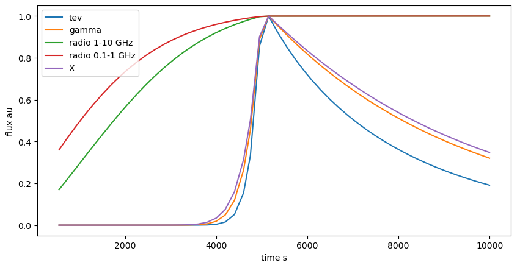

.. code:: ipython3

    fig=plt.figure(figsize=(10,5),dpi=100)
    plt.plot(yg/yg.max(),yrl/yrl.max(),label='gamma-radio l')
    plt.plot(yg/yg.max(),yrh/yrh.max(),label='gamma-radio h')
    plt.plot(yg/yg.max(),yx/yx.max(),label='gamma-x')
    plt.plot(yg/yg.max(),yt/yt.max(),label='gamma-tev')
    plt.legend()
    plt.xlabel('gamma flux/max')
    plt.ylabel('flux/max')

.. parsed-literal::

    Text(0, 0.5, 'flux/max')

.. image:: Temp_Ev_files/Temp_Ev_32_1.png

.. code:: ipython3

    temp_ev_acc.jet

.. parsed-literal::

    
    -------------------------------------------------------------------------------------------------------------------
    jet model description
    -------------------------------------------------------------------------------------------------------------------
    name: jet_acc  
    
    electrons distribution:
     type: time_dep  
     gamma energy grid size:  201
     gmin grid : 1.100000e+00
     gmax grid : 1.000000e+07
     normalization  False
     log-values  False
    
    radiative fields:
     seed photons grid size:  100
     IC emission grid size:  100
     source emissivity lower bound :  1.000000e-120
     spectral components:
       name:Sum, state: on
       name:Sync, state: self-abs
       name:SSC, state: on
    external fields transformation method: blob
    
    SED info:
     nu grid size jetkernel: 1000
     nu grid size: 500
     nu mix (Hz): 1.000000e+06
     nu max (Hz): 1.000000e+30
    
    flux plot lower bound   :  1.000000e-120
    
    -------------------------------------------------------------------------------------------------------------------

.. raw:: html

    <i>Table length=9</i>
    <table id="table140492891134896-247978" class="table-striped table-bordered table-condensed">
    <thead><tr><th>model name</th><th>name</th><th>par type</th><th>units</th><th>val</th><th>phys. bound. min</th><th>phys. bound. max</th><th>log</th><th>frozen</th></tr></thead>
    <tr><td>jet_acc</td><td>R</td><td>region_size</td><td>cm</td><td>1.000000e+14</td><td>1.000000e+03</td><td>1.000000e+30</td><td>False</td><td>False</td></tr>
    <tr><td>jet_acc</td><td>R_H</td><td>region_position</td><td>cm</td><td>1.000000e+17</td><td>0.000000e+00</td><td>--</td><td>False</td><td>True</td></tr>
    <tr><td>jet_acc</td><td>B</td><td>magnetic_field</td><td>gauss</td><td>1.000000e+00</td><td>0.000000e+00</td><td>--</td><td>False</td><td>False</td></tr>
    <tr><td>jet_acc</td><td>theta</td><td>jet-viewing-angle</td><td>deg</td><td>5.000000e+00</td><td>0.000000e+00</td><td>--</td><td>False</td><td>False</td></tr>
    <tr><td>jet_acc</td><td>BulkFactor</td><td>jet-bulk-factor</td><td>lorentz-factor*</td><td>1.500000e+01</td><td>1.000000e+00</td><td>--</td><td>False</td><td>False</td></tr>
    <tr><td>jet_acc</td><td>z_cosm</td><td>redshift</td><td></td><td>1.000000e-03</td><td>0.000000e+00</td><td>--</td><td>False</td><td>False</td></tr>
    <tr><td>jet_acc</td><td>gmin</td><td>low-energy-cut-off</td><td>lorentz-factor*</td><td>1.100000e+00</td><td>1.000000e+00</td><td>1.000000e+09</td><td>False</td><td>False</td></tr>
    <tr><td>jet_acc</td><td>gmax</td><td>high-energy-cut-off</td><td>lorentz-factor*</td><td>1.000000e+07</td><td>1.000000e+00</td><td>1.000000e+15</td><td>False</td><td>False</td></tr>
    <tr><td>jet_acc</td><td>N</td><td>scaling_factor</td><td></td><td>1.000000e+00</td><td>0.000000e+00</td><td>--</td><td>False</td><td>False</td></tr>
    </table>
    

.. parsed-literal::

    -------------------------------------------------------------------------------------------------------------------

.. parsed-literal::

    None

.. code:: ipython3

    j=Jet()

.. code:: ipython3

    j

.. parsed-literal::

    
    -------------------------------------------------------------------------------------------------------------------
    jet model description
    -------------------------------------------------------------------------------------------------------------------
    name: jet_leptonic  
    
    electrons distribution:
     type: plc  
     gamma energy grid size:  201
     gmin grid : 2.000000e+00
     gmax grid : 1.000000e+06
     normalization  True
     log-values  False
    
    radiative fields:
     seed photons grid size:  100
     IC emission grid size:  100
     source emissivity lower bound :  1.000000e-120
     spectral components:
       name:Sum, state: on
       name:Sync, state: self-abs
       name:SSC, state: on
    external fields transformation method: blob
    
    SED info:
     nu grid size jetkernel: 1000
     nu grid size: 500
     nu mix (Hz): 1.000000e+06
     nu max (Hz): 1.000000e+30
    
    flux plot lower bound   :  1.000000e-120
    
    -------------------------------------------------------------------------------------------------------------------

.. raw:: html

    <i>Table length=10</i>
    <table id="table140492939912672-754252" class="table-striped table-bordered table-condensed">
    <thead><tr><th>model name</th><th>name</th><th>par type</th><th>units</th><th>val</th><th>phys. bound. min</th><th>phys. bound. max</th><th>log</th><th>frozen</th></tr></thead>
    <tr><td>jet_leptonic</td><td>R</td><td>region_size</td><td>cm</td><td>5.000000e+15</td><td>1.000000e+03</td><td>1.000000e+30</td><td>False</td><td>False</td></tr>
    <tr><td>jet_leptonic</td><td>R_H</td><td>region_position</td><td>cm</td><td>1.000000e+17</td><td>0.000000e+00</td><td>--</td><td>False</td><td>True</td></tr>
    <tr><td>jet_leptonic</td><td>B</td><td>magnetic_field</td><td>gauss</td><td>1.000000e-01</td><td>0.000000e+00</td><td>--</td><td>False</td><td>False</td></tr>
    <tr><td>jet_leptonic</td><td>beam_obj</td><td>beaming</td><td>lorentz-factor*</td><td>1.000000e+01</td><td>1.000000e-04</td><td>--</td><td>False</td><td>False</td></tr>
    <tr><td>jet_leptonic</td><td>z_cosm</td><td>redshift</td><td></td><td>1.000000e-01</td><td>0.000000e+00</td><td>--</td><td>False</td><td>False</td></tr>
    <tr><td>jet_leptonic</td><td>gmin</td><td>low-energy-cut-off</td><td>lorentz-factor*</td><td>2.000000e+00</td><td>1.000000e+00</td><td>1.000000e+09</td><td>False</td><td>False</td></tr>
    <tr><td>jet_leptonic</td><td>gmax</td><td>high-energy-cut-off</td><td>lorentz-factor*</td><td>1.000000e+06</td><td>1.000000e+00</td><td>1.000000e+15</td><td>False</td><td>False</td></tr>
    <tr><td>jet_leptonic</td><td>N</td><td>emitters_density</td><td>1 / cm3</td><td>1.000000e+02</td><td>0.000000e+00</td><td>--</td><td>False</td><td>False</td></tr>
    <tr><td>jet_leptonic</td><td>gamma_cut</td><td>turn-over-energy</td><td>lorentz-factor*</td><td>1.000000e+04</td><td>1.000000e+00</td><td>1.000000e+09</td><td>False</td><td>False</td></tr>
    <tr><td>jet_leptonic</td><td>p</td><td>LE_spectral_slope</td><td></td><td>2.000000e+00</td><td>-1.000000e+01</td><td>1.000000e+01</td><td>False</td><td>False</td></tr>
    </table>
    

.. parsed-literal::

    -------------------------------------------------------------------------------------------------------------------

.. parsed-literal::

    None

running cooling and acc on injetcion plus input jet
---------------------------------------------------

.. code:: ipython3

    my_jet_acc=build_jet()
    temp_ev_acc=JetTimeEvol(jet=my_jet_acc,Q_inj=Q_inj,inplace=True)

.. code:: ipython3

    duration=1E4
    duration_acc=1E4
    T_SIZE=np.int(1E4)
    
    temp_ev_acc.parameters.duration.val=duration
    temp_ev_acc.parameters.TStart_Acc.val=0
    temp_ev_acc.parameters.TStop_Acc.val=duration*0.5
    temp_ev_acc.parameters.TStart_Inj.val=0
    temp_ev_acc.parameters.TStop_Inj.val=duration*0.5
    temp_ev_acc.parameters.T_esc.val=3
    temp_ev_acc.parameters.t_D0.val=4000
    temp_ev_acc.parameters.t_A0.val=2000
    temp_ev_acc.parameters.Esc_Index.val=0
    temp_ev_acc.parameters.Acc_Index.val=1
    temp_ev_acc.parameters.Diff_Index.val=2
    temp_ev_acc.parameters.T_SIZE.val=T_SIZE
    temp_ev_acc.parameters.NUM_SET.val=200
    temp_ev_acc._temp_ev.do_Compton_cooling=0
    temp_ev_acc.parameters.L_inj.val=4E37
    temp_ev_acc.parameters.LOG_SET.val=0
    
    temp_ev_acc.parameters.gmin_grid.val=1.1
    temp_ev_acc.parameters.gmax_grid.val=1E7
    temp_ev_acc.parameters.gamma_grid_size.val=1000
    temp_ev_acc.init_TempEv()
    
    temp_ev_acc.show_model()

.. parsed-literal::

    -------------------------------------------------------------------------------------------------------------------
    JetTimeEvol model description
    -------------------------------------------------------------------------------------------------------------------
     
    physical setup: 
    
    -------------------------------------------------------------------------------------------------------------------

.. raw:: html

    <i>Table length=19</i>
    <table id="table140492890195472-281577" class="table-striped table-bordered table-condensed">
    <thead><tr><th>name</th><th>par type</th><th>val</th><th>units</th><th>val*</th><th>units*</th><th>log</th></tr></thead>
    <tr><td>delta t</td><td>time</td><td>1.0</td><td>s</td><td>0.00029979245799999996</td><td>R/c</td><td>False</td></tr>
    <tr><td>R/c</td><td>time</td><td>3335.6409519815206</td><td>s</td><td>1.0</td><td>R/c</td><td>False</td></tr>
    <tr><td>Diff coeff</td><td></td><td>0.00025</td><td>s-1</td><td>None</td><td></td><td>False</td></tr>
    <tr><td>Acc coeff</td><td></td><td>0.0005</td><td>s-1</td><td>None</td><td></td><td>False</td></tr>
    <tr><td>Diff index</td><td></td><td>2.0</td><td></td><td>None</td><td></td><td>False</td></tr>
    <tr><td>Acc index</td><td></td><td>1.0</td><td>s-1</td><td>None</td><td></td><td>False</td></tr>
    <tr><td>Tesc</td><td>time</td><td>10006.922855944562</td><td>s</td><td>3.0</td><td>R/c</td><td>False</td></tr>
    <tr><td>T_A0=1/ACC_COEFF</td><td>time</td><td>2000.0</td><td>s</td><td>0.599584916</td><td>R/c</td><td>False</td></tr>
    <tr><td>T_D0=1/DIFF_COEFF</td><td>time</td><td>4000.0</td><td>s</td><td>1.199169832</td><td>R/c</td><td>False</td></tr>
    <tr><td>T_DA0=1/(2*DIFF_COEFF)</td><td>time</td><td>2000.0</td><td>s</td><td>0.599584916</td><td>R/c</td><td>False</td></tr>
    <tr><td>gamma Lambda Turb.  max</td><td></td><td>586679088020.182</td><td></td><td>None</td><td></td><td>False</td></tr>
    <tr><td>gamma Lambda Coher. max</td><td></td><td>58667908802.018196</td><td></td><td>None</td><td></td><td>False</td></tr>
    <tr><td>gamma eq Syst. Acc (synch. cool)</td><td></td><td>780681.5412486438</td><td></td><td>None</td><td></td><td>False</td></tr>
    <tr><td>gamma eq Diff. Acc (synch. cool)</td><td></td><td>196532.61940450914</td><td></td><td>None</td><td></td><td>False</td></tr>
    <tr><td>T cooling(gamma_eq=gamma_eq_Diff)</td><td></td><td>3937.259854652065</td><td>s</td><td>None</td><td></td><td>False</td></tr>
    <tr><td>T cooling(gamma_eq=gamma_eq_Sys)</td><td></td><td>991.1852037062209</td><td>s</td><td>None</td><td></td><td>False</td></tr>
    <tr><td>T min. synch. cooling</td><td></td><td>77.37999924909614</td><td>s</td><td>None</td><td></td><td>False</td></tr>
    <tr><td>L inj (electrons)</td><td>injected lum.</td><td>3.999999999999999e+37</td><td>erg/s</td><td>None</td><td></td><td>False</td></tr>
    <tr><td>E_inj (electrons)</td><td></td><td>3.999999999999999e+37</td><td>erg</td><td>None</td><td></td><td>False</td></tr>
    </table>
    

.. parsed-literal::

    
    model parameters: 
    
    -------------------------------------------------------------------------------------------------------------------

.. raw:: html

    <i>Table length=20</i>
    <table id="table140493402307888-840798" class="table-striped table-bordered table-condensed">
    <thead><tr><th>model name</th><th>name</th><th>par type</th><th>units</th><th>val</th><th>phys. bound. min</th><th>phys. bound. max</th><th>log</th><th>frozen</th></tr></thead>
    <tr><td>jet_time_ev</td><td>duration</td><td>time_grid</td><td>s</td><td>1.000000e+04</td><td>0.000000e+00</td><td>--</td><td>False</td><td>True</td></tr>
    <tr><td>jet_time_ev</td><td>gmin_grid</td><td>gamma_grid</td><td></td><td>1.100000e+00</td><td>0.000000e+00</td><td>--</td><td>False</td><td>True</td></tr>
    <tr><td>jet_time_ev</td><td>gmax_grid</td><td>gamma_grid</td><td></td><td>1.000000e+07</td><td>0.000000e+00</td><td>--</td><td>False</td><td>True</td></tr>
    <tr><td>jet_time_ev</td><td>gamma_grid_size</td><td>gamma_grid</td><td></td><td>1.000000e+03</td><td>0.000000e+00</td><td>--</td><td>False</td><td>True</td></tr>
    <tr><td>jet_time_ev</td><td>TStart_Acc</td><td>time_grid</td><td>s</td><td>0.000000e+00</td><td>0.000000e+00</td><td>--</td><td>False</td><td>True</td></tr>
    <tr><td>jet_time_ev</td><td>TStop_Acc</td><td>time_grid</td><td>s</td><td>5.000000e+03</td><td>0.000000e+00</td><td>--</td><td>False</td><td>True</td></tr>
    <tr><td>jet_time_ev</td><td>TStart_Inj</td><td>time_grid</td><td>s</td><td>0.000000e+00</td><td>0.000000e+00</td><td>--</td><td>False</td><td>True</td></tr>
    <tr><td>jet_time_ev</td><td>TStop_Inj</td><td>time_grid</td><td>s</td><td>5.000000e+03</td><td>0.000000e+00</td><td>--</td><td>False</td><td>True</td></tr>
    <tr><td>jet_time_ev</td><td>T_esc</td><td>escape_time</td><td>(R/c)*</td><td>3.000000e+00</td><td>--</td><td>--</td><td>False</td><td>True</td></tr>
    <tr><td>jet_time_ev</td><td>Esc_Index</td><td>fp_coeff_index</td><td></td><td>0.000000e+00</td><td>--</td><td>--</td><td>False</td><td>True</td></tr>
    <tr><td>jet_time_ev</td><td>t_D0</td><td>acceleration_time</td><td>s</td><td>4.000000e+03</td><td>0.000000e+00</td><td>--</td><td>False</td><td>True</td></tr>
    <tr><td>jet_time_ev</td><td>t_A0</td><td>acceleration_time</td><td>s</td><td>2.000000e+03</td><td>0.000000e+00</td><td>--</td><td>False</td><td>True</td></tr>
    <tr><td>jet_time_ev</td><td>Diff_Index</td><td>fp_coeff_index</td><td>s</td><td>2.000000e+00</td><td>0.000000e+00</td><td>--</td><td>False</td><td>True</td></tr>
    <tr><td>jet_time_ev</td><td>Acc_Index</td><td>fp_coeff_index</td><td></td><td>1.000000e+00</td><td>--</td><td>--</td><td>False</td><td>True</td></tr>
    <tr><td>jet_time_ev</td><td>Lambda_max_Turb</td><td>turbulence_scale</td><td>cm</td><td>1.000000e+15</td><td>0.000000e+00</td><td>--</td><td>False</td><td>True</td></tr>
    <tr><td>jet_time_ev</td><td>Lambda_choer_Turb_factor</td><td>turbulence_scale</td><td>cm</td><td>1.000000e-01</td><td>0.000000e+00</td><td>--</td><td>False</td><td>True</td></tr>
    <tr><td>jet_time_ev</td><td>T_SIZE</td><td>time_grid</td><td></td><td>1.000000e+04</td><td>0.000000e+00</td><td>--</td><td>False</td><td>True</td></tr>
    <tr><td>jet_time_ev</td><td>NUM_SET</td><td>time_ev_output</td><td></td><td>2.000000e+02</td><td>0.000000e+00</td><td>--</td><td>False</td><td>True</td></tr>
    <tr><td>jet_time_ev</td><td>LOG_SET</td><td>time_ev_output</td><td></td><td>0.000000e+00</td><td>0.000000e+00</td><td>--</td><td>False</td><td>True</td></tr>
    <tr><td>jet_time_ev</td><td>L_inj</td><td>inj_luminosity</td><td>erg / s</td><td>4.000000e+37</td><td>0.000000e+00</td><td>--</td><td>False</td><td>True</td></tr>
    </table>
    

.. code:: ipython3

    temp_ev_acc.run(only_injection=False)

.. parsed-literal::

    temporal evolution running

.. parsed-literal::

    HBox(children=(HTML(value=''), FloatProgress(value=0.0, max=10000.0), HTML(value='')))

.. parsed-literal::

    temporal evolution completed

.. code:: ipython3

    p=temp_ev_acc.plot_TempEv_emitters(loglog=False,energy_unit='gamma',pow=1)
    p.ax.axvline(temp_ev_acc._temp_ev.gamma_eq_t_A, ls='--')
    p.ax.axvline(temp_ev_acc._temp_ev.gamma_eq_t_D, ls='--')
    p.rescale(x_max=1E8,x_min=1,y_min=1E-4,y_max=1E4)

.. image:: Temp_Ev_files/Temp_Ev_40_0.png

running only cooling input jet
------------------------------

.. code:: ipython3

    my_jet_acc=build_jet()
    temp_ev_acc=JetTimeEvol(jet=my_jet_acc,inplace=True)

.. code:: ipython3

    duration=1E4
    duration_acc=1E4
    T_SIZE=np.int(1E4)
    
    temp_ev_acc.parameters.duration.val=duration
    temp_ev_acc.parameters.TStart_Acc.val=0
    temp_ev_acc.parameters.TStop_Acc.val=duration*0
    temp_ev_acc.parameters.TStart_Inj.val=0
    temp_ev_acc.parameters.TStop_Inj.val=0
    temp_ev_acc.parameters.T_esc.val=3
    temp_ev_acc.parameters.t_D0.val=4000
    temp_ev_acc.parameters.t_A0.val=2000
    temp_ev_acc.parameters.Esc_Index.val=0
    temp_ev_acc.parameters.Acc_Index.val=1
    temp_ev_acc.parameters.Diff_Index.val=2
    temp_ev_acc.parameters.T_SIZE.val=T_SIZE
    temp_ev_acc.parameters.NUM_SET.val=200
    temp_ev_acc._temp_ev.do_Compton_cooling=0
    temp_ev_acc.parameters.L_inj.val=4E37
    temp_ev_acc.parameters.LOG_SET.val=0
    
    temp_ev_acc.parameters.gmin_grid.val=1.1
    temp_ev_acc.parameters.gmax_grid.val=1E7
    temp_ev_acc.parameters.gamma_grid_size.val=1000
    temp_ev_acc.init_TempEv()
    
    temp_ev_acc.show_model()

.. parsed-literal::

    -------------------------------------------------------------------------------------------------------------------
    JetTimeEvol model description
    -------------------------------------------------------------------------------------------------------------------
     
    physical setup: 
    
    -------------------------------------------------------------------------------------------------------------------

.. raw:: html

    <i>Table length=17</i>
    <table id="table140492958712640-898684" class="table-striped table-bordered table-condensed">
    <thead><tr><th>name</th><th>par type</th><th>val</th><th>units</th><th>val*</th><th>units*</th><th>log</th></tr></thead>
    <tr><td>delta t</td><td>time</td><td>1.0</td><td>s</td><td>0.00029979245799999996</td><td>R/c</td><td>False</td></tr>
    <tr><td>R/c</td><td>time</td><td>3335.6409519815206</td><td>s</td><td>1.0</td><td>R/c</td><td>False</td></tr>
    <tr><td>Diff coeff</td><td></td><td>0.00025</td><td>s-1</td><td>None</td><td></td><td>False</td></tr>
    <tr><td>Acc coeff</td><td></td><td>0.0005</td><td>s-1</td><td>None</td><td></td><td>False</td></tr>
    <tr><td>Diff index</td><td></td><td>2.0</td><td></td><td>None</td><td></td><td>False</td></tr>
    <tr><td>Acc index</td><td></td><td>1.0</td><td>s-1</td><td>None</td><td></td><td>False</td></tr>
    <tr><td>Tesc</td><td>time</td><td>10006.922855944562</td><td>s</td><td>3.0</td><td>R/c</td><td>False</td></tr>
    <tr><td>T_A0=1/ACC_COEFF</td><td>time</td><td>2000.0</td><td>s</td><td>0.599584916</td><td>R/c</td><td>False</td></tr>
    <tr><td>T_D0=1/DIFF_COEFF</td><td>time</td><td>4000.0</td><td>s</td><td>1.199169832</td><td>R/c</td><td>False</td></tr>
    <tr><td>T_DA0=1/(2*DIFF_COEFF)</td><td>time</td><td>2000.0</td><td>s</td><td>0.599584916</td><td>R/c</td><td>False</td></tr>
    <tr><td>gamma Lambda Turb.  max</td><td></td><td>586679088020.182</td><td></td><td>None</td><td></td><td>False</td></tr>
    <tr><td>gamma Lambda Coher. max</td><td></td><td>58667908802.018196</td><td></td><td>None</td><td></td><td>False</td></tr>
    <tr><td>gamma eq Syst. Acc (synch. cool)</td><td></td><td>780681.5412486438</td><td></td><td>None</td><td></td><td>False</td></tr>
    <tr><td>gamma eq Diff. Acc (synch. cool)</td><td></td><td>196532.61940450914</td><td></td><td>None</td><td></td><td>False</td></tr>
    <tr><td>T cooling(gamma_eq=gamma_eq_Diff)</td><td></td><td>3937.259854652065</td><td>s</td><td>None</td><td></td><td>False</td></tr>
    <tr><td>T cooling(gamma_eq=gamma_eq_Sys)</td><td></td><td>991.1852037062209</td><td>s</td><td>None</td><td></td><td>False</td></tr>
    <tr><td>T min. synch. cooling</td><td></td><td>77.37999924909614</td><td>s</td><td>None</td><td></td><td>False</td></tr>
    </table>
    

.. parsed-literal::

    
    model parameters: 
    
    -------------------------------------------------------------------------------------------------------------------

.. raw:: html

    <i>Table length=20</i>
    <table id="table140492950281328-595742" class="table-striped table-bordered table-condensed">
    <thead><tr><th>model name</th><th>name</th><th>par type</th><th>units</th><th>val</th><th>phys. bound. min</th><th>phys. bound. max</th><th>log</th><th>frozen</th></tr></thead>
    <tr><td>jet_time_ev</td><td>duration</td><td>time_grid</td><td>s</td><td>1.000000e+04</td><td>0.000000e+00</td><td>--</td><td>False</td><td>True</td></tr>
    <tr><td>jet_time_ev</td><td>gmin_grid</td><td>gamma_grid</td><td></td><td>1.100000e+00</td><td>0.000000e+00</td><td>--</td><td>False</td><td>True</td></tr>
    <tr><td>jet_time_ev</td><td>gmax_grid</td><td>gamma_grid</td><td></td><td>1.000000e+07</td><td>0.000000e+00</td><td>--</td><td>False</td><td>True</td></tr>
    <tr><td>jet_time_ev</td><td>gamma_grid_size</td><td>gamma_grid</td><td></td><td>1.000000e+03</td><td>0.000000e+00</td><td>--</td><td>False</td><td>True</td></tr>
    <tr><td>jet_time_ev</td><td>TStart_Acc</td><td>time_grid</td><td>s</td><td>0.000000e+00</td><td>0.000000e+00</td><td>--</td><td>False</td><td>True</td></tr>
    <tr><td>jet_time_ev</td><td>TStop_Acc</td><td>time_grid</td><td>s</td><td>0.000000e+00</td><td>0.000000e+00</td><td>--</td><td>False</td><td>True</td></tr>
    <tr><td>jet_time_ev</td><td>TStart_Inj</td><td>time_grid</td><td>s</td><td>0.000000e+00</td><td>0.000000e+00</td><td>--</td><td>False</td><td>True</td></tr>
    <tr><td>jet_time_ev</td><td>TStop_Inj</td><td>time_grid</td><td>s</td><td>0.000000e+00</td><td>0.000000e+00</td><td>--</td><td>False</td><td>True</td></tr>
    <tr><td>jet_time_ev</td><td>T_esc</td><td>escape_time</td><td>(R/c)*</td><td>3.000000e+00</td><td>--</td><td>--</td><td>False</td><td>True</td></tr>
    <tr><td>jet_time_ev</td><td>Esc_Index</td><td>fp_coeff_index</td><td></td><td>0.000000e+00</td><td>--</td><td>--</td><td>False</td><td>True</td></tr>
    <tr><td>jet_time_ev</td><td>t_D0</td><td>acceleration_time</td><td>s</td><td>4.000000e+03</td><td>0.000000e+00</td><td>--</td><td>False</td><td>True</td></tr>
    <tr><td>jet_time_ev</td><td>t_A0</td><td>acceleration_time</td><td>s</td><td>2.000000e+03</td><td>0.000000e+00</td><td>--</td><td>False</td><td>True</td></tr>
    <tr><td>jet_time_ev</td><td>Diff_Index</td><td>fp_coeff_index</td><td>s</td><td>2.000000e+00</td><td>0.000000e+00</td><td>--</td><td>False</td><td>True</td></tr>
    <tr><td>jet_time_ev</td><td>Acc_Index</td><td>fp_coeff_index</td><td></td><td>1.000000e+00</td><td>--</td><td>--</td><td>False</td><td>True</td></tr>
    <tr><td>jet_time_ev</td><td>Lambda_max_Turb</td><td>turbulence_scale</td><td>cm</td><td>1.000000e+15</td><td>0.000000e+00</td><td>--</td><td>False</td><td>True</td></tr>
    <tr><td>jet_time_ev</td><td>Lambda_choer_Turb_factor</td><td>turbulence_scale</td><td>cm</td><td>1.000000e-01</td><td>0.000000e+00</td><td>--</td><td>False</td><td>True</td></tr>
    <tr><td>jet_time_ev</td><td>T_SIZE</td><td>time_grid</td><td></td><td>1.000000e+04</td><td>0.000000e+00</td><td>--</td><td>False</td><td>True</td></tr>
    <tr><td>jet_time_ev</td><td>NUM_SET</td><td>time_ev_output</td><td></td><td>2.000000e+02</td><td>0.000000e+00</td><td>--</td><td>False</td><td>True</td></tr>
    <tr><td>jet_time_ev</td><td>LOG_SET</td><td>time_ev_output</td><td></td><td>0.000000e+00</td><td>0.000000e+00</td><td>--</td><td>False</td><td>True</td></tr>
    <tr><td>jet_time_ev</td><td>L_inj</td><td>inj_luminosity</td><td>erg / s</td><td>4.000000e+37</td><td>0.000000e+00</td><td>--</td><td>False</td><td>True</td></tr>
    </table>
    

.. code:: ipython3

    p=temp_ev_acc.plot_time_profile()

.. image:: Temp_Ev_files/Temp_Ev_44_0.png

.. code:: ipython3

    temp_ev_acc.run(only_injection=False)

.. parsed-literal::

    temporal evolution running

.. parsed-literal::

    HBox(children=(HTML(value=''), FloatProgress(value=0.0, max=10000.0), HTML(value='')))

.. parsed-literal::

    temporal evolution completed

.. code:: ipython3

    p=temp_ev_acc.plot_TempEv_emitters(loglog=False,energy_unit='gamma',pow=1)
    p.ax.axvline(temp_ev_acc._temp_ev.gamma_eq_t_A, ls='--')
    p.ax.axvline(temp_ev_acc._temp_ev.gamma_eq_t_D, ls='--')
    p.rescale(x_max=1E8,x_min=1,y_min=1E-4,y_max=1E4)

.. parsed-literal::

    
    

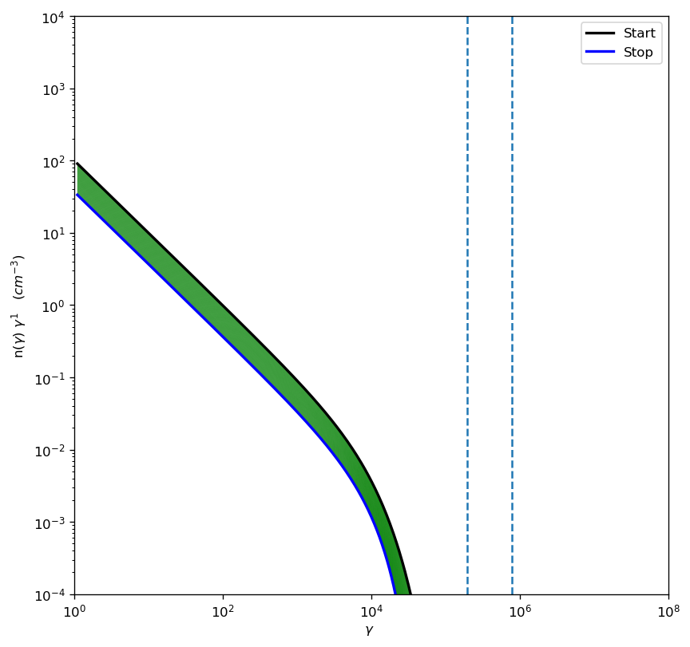

