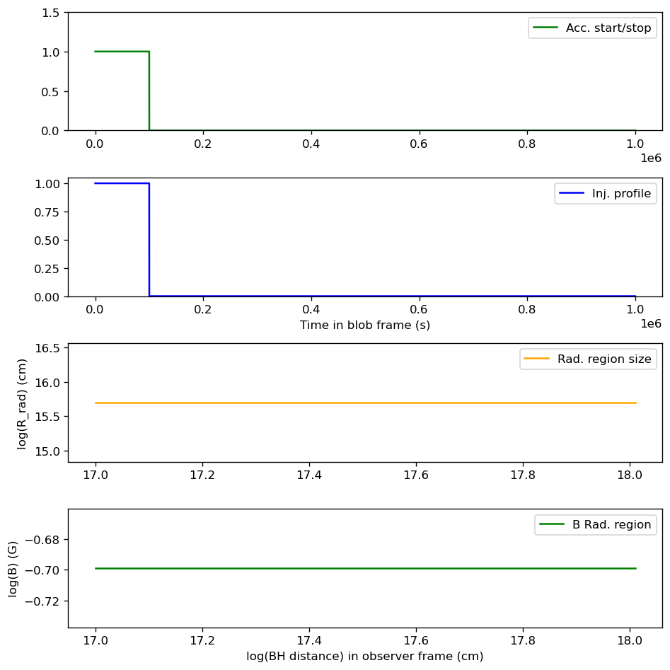
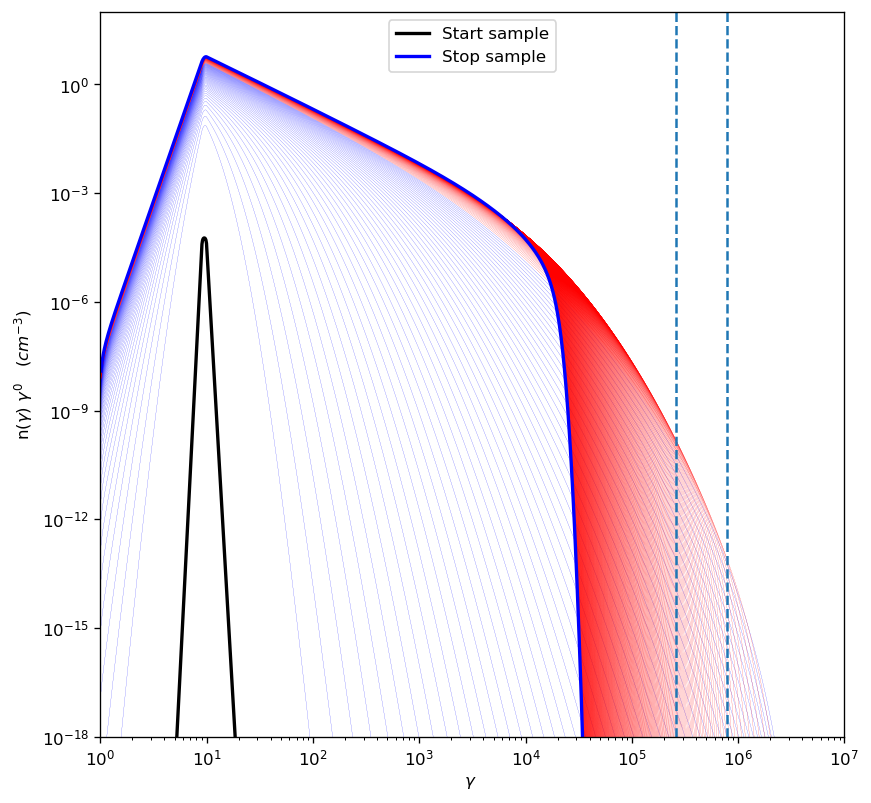
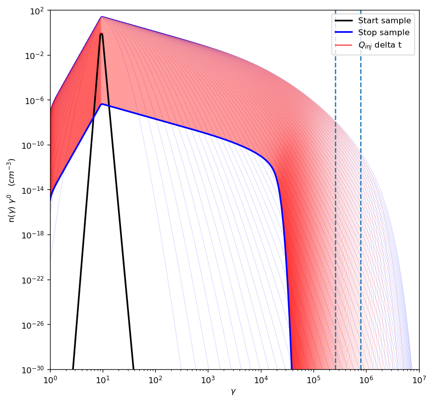
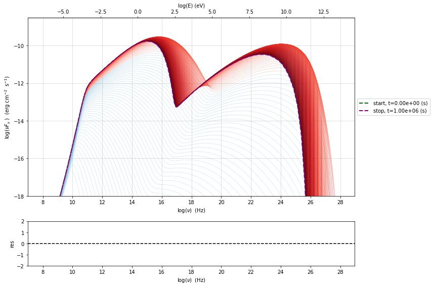
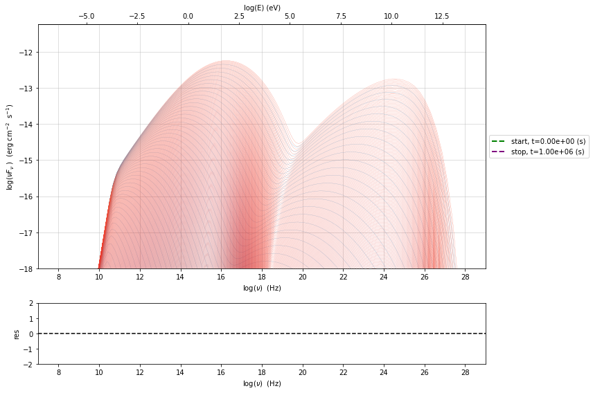
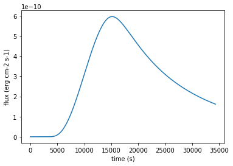

.. _temp_ev:

Temporal evolution
==================

.. code:: ipython3

    import warnings
    warnings.filterwarnings('ignore')

.. code:: ipython3

    import jetset
    print('tested on jetset',jetset.__version__)

.. parsed-literal::

    tested on jetset 1.2.0rc8

This is a very preliminary documentation for the temporal evolution
capabilities of jetset. Here we show how to create a decopuled
radiative+acceleration region, and how to evolve the system in order to
generate both particle spectra, SEDs, and lightcurves

definition of the injected particle distributio, and of the jet model
for the radiative region

.. code:: ipython3

    from jetset.jet_emitters_factory import InjEmittersFactory
    from jetset.jet_model import Jet
    jet_model=Jet()
    q_inj=InjEmittersFactory().create_inj_emitters('pl',emitters_type='electrons',normalize=True)
    q_inj.parameters.gmin.val=9
    q_inj.parameters.gmax.val=10
    q_inj.parameters.p.val=0.5
    
    jet_model.parameters.beam_obj.val=30
    jet_model.parameters.B.val=0.2
    jet_model.parameters.z_cosm.val=0.03
    jet_model.parameters.R.val=5E15
    

here we set some relevant parameters taht will be described in detail in
the next version of the documentation

.. code:: ipython3

    flare_duration=1.0E5
    duration=flare_duration*10
    t_D0=1.5E5
    t_A0=2.5E4
    T_esc_rad=1E60
    L_inj=5.0E39
    E_acc_max=4E60
    Delta_R_acc_ratio=0.1
    B_ratio=1.0
    T_SIZE=2E4
    NUM_SET=500
    Diff_Index=2.0
    Acc_Index=1.0

here we setup the ``JetTimeEvol`` class, passing the radiative region
jet model, and the injected particle class. The IC cooling is switched
off to make the process faster.

.. code:: ipython3

    from jetset.jet_timedep import JetTimeEvol
    temp_ev_acc=JetTimeEvol(jet_rad=jet_model,Q_inj=q_inj,inplace=True)
    temp_ev_acc.rad_region.jet.nu_min=1E8
    temp_ev_acc.acc_region.jet.nu_min=1E8
    T_SIZE=np.int(T_SIZE)
    
    if Delta_R_acc_ratio is not None:
        temp_ev_acc.parameters.Delta_R_acc.val=temp_ev_acc.parameters.R_rad_start.val*Delta_R_acc_ratio
    
    T_esc_acc=t_A0/(temp_ev_acc.parameters.Delta_R_acc.val/3E10)*2
    
    
    
    temp_ev_acc.parameters.duration.val=duration
    temp_ev_acc.parameters.TStart_Acc.val=0
    temp_ev_acc.parameters.TStop_Acc.val=flare_duration
    temp_ev_acc.parameters.TStart_Inj.val=0
    temp_ev_acc.parameters.TStop_Inj.val=flare_duration
    temp_ev_acc.parameters.T_esc_acc.val=T_esc_acc
    temp_ev_acc.parameters.T_esc_rad.val=T_esc_rad
    temp_ev_acc.parameters.t_D0.val=t_D0
    temp_ev_acc.parameters.t_A0.val=t_A0
    temp_ev_acc.parameters.Esc_Index_acc.val=Diff_Index-2
    temp_ev_acc.parameters.Esc_Index_rad.val=0
    temp_ev_acc.parameters.Acc_Index.val=Acc_Index
    temp_ev_acc.parameters.Diff_Index.val=Diff_Index
    temp_ev_acc.parameters.t_size.val=T_SIZE
    temp_ev_acc.parameters.num_samples.val=NUM_SET
    temp_ev_acc.parameters.E_acc_max.val=E_acc_max
    temp_ev_acc.parameters.L_inj.val=L_inj
    
    
    temp_ev_acc.parameters.gmin_grid.val=1.0
    temp_ev_acc.parameters.gmax_grid.val=1E8
    temp_ev_acc.parameters.gamma_grid_size.val=1500
    
    temp_ev_acc.parameters.B_acc.val=temp_ev_acc.rad_region.jet.parameters.B.val*B_ratio
    temp_ev_acc.init_TempEv()
    temp_ev_acc.show_model()

.. parsed-literal::

    ==> par: z_cosm from model: jet_leptonicacc_region linked to same parameter in model jet_leptonic
    --------------------------------------------------------------------------------
    JetTimeEvol model description
    --------------------------------------------------------------------------------
     
    physical setup: 
    
    --------------------------------------------------------------------------------

.. raw:: html

    <i>Table length=28</i>
    <table id="table140680707273152-760539" class="table-striped table-bordered table-condensed">
    <thead><tr><th>name</th><th>par type</th><th>val</th><th>units</th><th>val*</th><th>units*</th><th>log</th></tr></thead>
    <tr><td>delta t</td><td>time</td><td>5.000000e+01</td><td>s</td><td>0.00029979245799999996</td><td>R/c</td><td>False</td></tr>
    <tr><td>log. sampling</td><td>time</td><td>0.000000e+00</td><td></td><td>None</td><td></td><td>False</td></tr>
    <tr><td>R/c</td><td>time</td><td>1.667820e+05</td><td>s</td><td>1.0</td><td>R/c</td><td>False</td></tr>
    <tr><td>Diff coeff</td><td></td><td>6.666667e-06</td><td>s-1</td><td>None</td><td></td><td>False</td></tr>
    <tr><td>Acc coeff</td><td></td><td>4.000000e-05</td><td>s-1</td><td>None</td><td></td><td>False</td></tr>
    <tr><td>IC cooling</td><td></td><td>off</td><td></td><td>None</td><td></td><td>False</td></tr>
    <tr><td>Sync cooling</td><td></td><td>on</td><td></td><td>None</td><td></td><td>False</td></tr>
    <tr><td>Diff index</td><td></td><td>2.000000e+00</td><td></td><td>None</td><td></td><td>False</td></tr>
    <tr><td>Acc index</td><td></td><td>1.000000e+00</td><td>s-1</td><td>None</td><td></td><td>False</td></tr>
    <tr><td>Tesc acc</td><td>time</td><td>5.003461e+04</td><td>s</td><td>3.0</td><td>R_acc/c</td><td>False</td></tr>
    <tr><td>Tesc rad</td><td>time</td><td>1.667820e+65</td><td>s</td><td>1e+60</td><td>R/c</td><td>False</td></tr>
    <tr><td>Eacc max</td><td>energy</td><td>4.000000e+60</td><td>erg</td><td>None</td><td></td><td>False</td></tr>
    <tr><td>Delta R acc</td><td>accelerator_width</td><td>5.000000e+14</td><td>cm</td><td>None</td><td></td><td>False</td></tr>
    <tr><td>B acc</td><td>magnetic field</td><td>2.000000e-01</td><td>cm</td><td>None</td><td></td><td>False</td></tr>
    <tr><td>R_rad rad start</td><td>region_position</td><td>5.000000e+15</td><td>cm</td><td>None</td><td></td><td>False</td></tr>
    <tr><td>R_H rad start</td><td>region_position</td><td>1.000000e+17</td><td>cm</td><td>None</td><td></td><td>False</td></tr>
    <tr><td>R v exp.</td><td>region_position</td><td>1.000000e+00</td><td></td><td>3.33564095198152e-11 s / cm</td><td>v/c</td><td>False</td></tr>
    <tr><td>T_A0=1/ACC_COEFF</td><td>time</td><td>2.500000e+04</td><td>s</td><td>0.149896229</td><td>R/c</td><td>False</td></tr>
    <tr><td>T_D0=1/DIFF_COEFF</td><td>time</td><td>1.500000e+05</td><td>s</td><td>0.899377374</td><td>R/c</td><td>False</td></tr>
    <tr><td>T_DA0=1/(2*DIFF_COEFF)</td><td>time</td><td>7.500000e+04</td><td>s</td><td>0.449688687</td><td>R/c</td><td>False</td></tr>
    <tr><td>gamma Lambda Turb.  max</td><td></td><td>1.173358e+11</td><td></td><td>None</td><td></td><td>False</td></tr>
    <tr><td>gamma Lambda Coher. max</td><td></td><td>1.173358e+10</td><td></td><td>None</td><td></td><td>False</td></tr>
    <tr><td>gamma eq Syst. Acc (synch. cool)</td><td></td><td>7.832383e+05</td><td></td><td>None</td><td></td><td>False</td></tr>
    <tr><td>gamma eq Diff. Acc (synch. cool)</td><td></td><td>1.309535e+05</td><td></td><td>None</td><td></td><td>False</td></tr>
    <tr><td>T cooling(gamma_eq=gamma_eq_Diff)</td><td></td><td>1.477242e+05</td><td>s</td><td>None</td><td></td><td>False</td></tr>
    <tr><td>T cooling(gamma_eq=gamma_eq_Sys)</td><td></td><td>2.469874e+04</td><td>s</td><td>None</td><td></td><td>False</td></tr>
    <tr><td>T min. synch. cooling</td><td></td><td>1.934500e+02</td><td>s</td><td>None</td><td></td><td>False</td></tr>
    <tr><td>L inj (electrons)</td><td>injected lum.</td><td>5.000000e+39</td><td>erg/s</td><td>None</td><td></td><td>False</td></tr>
    </table>
    

.. parsed-literal::

    
    model parameters: 
    
    --------------------------------------------------------------------------------

.. raw:: html

    <i>Table length=30</i>
    <table id="table140680712632976-549897" class="table-striped table-bordered table-condensed">
    <thead><tr><th>model name</th><th>name</th><th>par type</th><th>units</th><th>val</th><th>phys. bound. min</th><th>phys. bound. max</th><th>log</th><th>frozen</th></tr></thead>
    <tr><td>jet_time_ev</td><td>duration</td><td>time_grid</td><td>s</td><td>1.000000e+06</td><td>0.000000e+00</td><td>--</td><td>False</td><td>True</td></tr>
    <tr><td>jet_time_ev</td><td>gmin_grid</td><td>gamma_grid</td><td></td><td>1.000000e+00</td><td>0.000000e+00</td><td>--</td><td>False</td><td>True</td></tr>
    <tr><td>jet_time_ev</td><td>gmax_grid</td><td>gamma_grid</td><td></td><td>1.000000e+08</td><td>0.000000e+00</td><td>--</td><td>False</td><td>True</td></tr>
    <tr><td>jet_time_ev</td><td>gamma_grid_size</td><td>gamma_grid</td><td></td><td>1.500000e+03</td><td>0.000000e+00</td><td>--</td><td>False</td><td>True</td></tr>
    <tr><td>jet_time_ev</td><td>TStart_Acc</td><td>time_grid</td><td>s</td><td>0.000000e+00</td><td>0.000000e+00</td><td>--</td><td>False</td><td>True</td></tr>
    <tr><td>jet_time_ev</td><td>TStop_Acc</td><td>time_grid</td><td>s</td><td>1.000000e+05</td><td>0.000000e+00</td><td>--</td><td>False</td><td>True</td></tr>
    <tr><td>jet_time_ev</td><td>TStart_Inj</td><td>time_grid</td><td>s</td><td>0.000000e+00</td><td>0.000000e+00</td><td>--</td><td>False</td><td>True</td></tr>
    <tr><td>jet_time_ev</td><td>TStop_Inj</td><td>time_grid</td><td>s</td><td>1.000000e+05</td><td>0.000000e+00</td><td>--</td><td>False</td><td>True</td></tr>
    <tr><td>jet_time_ev</td><td>T_esc_acc</td><td>escape_time</td><td>(R_acc/c)*</td><td>3.000000e+00</td><td>--</td><td>--</td><td>False</td><td>True</td></tr>
    <tr><td>jet_time_ev</td><td>T_esc_rad</td><td>escape_time</td><td>(R/c)*</td><td>1.000000e+60</td><td>--</td><td>--</td><td>False</td><td>True</td></tr>
    <tr><td>jet_time_ev</td><td>Esc_Index_acc</td><td>fp_coeff_index</td><td></td><td>0.000000e+00</td><td>--</td><td>--</td><td>False</td><td>True</td></tr>
    <tr><td>jet_time_ev</td><td>Esc_Index_rad</td><td>fp_coeff_index</td><td></td><td>0.000000e+00</td><td>--</td><td>--</td><td>False</td><td>True</td></tr>
    <tr><td>jet_time_ev</td><td>t_D0</td><td>acceleration_time</td><td>s</td><td>1.500000e+05</td><td>0.000000e+00</td><td>--</td><td>False</td><td>True</td></tr>
    <tr><td>jet_time_ev</td><td>t_A0</td><td>acceleration_time</td><td>s</td><td>2.500000e+04</td><td>0.000000e+00</td><td>--</td><td>False</td><td>True</td></tr>
    <tr><td>jet_time_ev</td><td>Diff_Index</td><td>fp_coeff_index</td><td>s</td><td>2.000000e+00</td><td>0.000000e+00</td><td>--</td><td>False</td><td>True</td></tr>
    <tr><td>jet_time_ev</td><td>Acc_Index</td><td>fp_coeff_index</td><td></td><td>1.000000e+00</td><td>--</td><td>--</td><td>False</td><td>True</td></tr>
    <tr><td>jet_time_ev</td><td>Delta_R_acc</td><td>accelerator_width</td><td>cm</td><td>5.000000e+14</td><td>0.000000e+00</td><td>--</td><td>False</td><td>True</td></tr>
    <tr><td>jet_time_ev</td><td>R_rad_start</td><td>region_size</td><td>cm</td><td>5.000000e+15</td><td>0.000000e+00</td><td>--</td><td>False</td><td>True</td></tr>
    <tr><td>jet_time_ev</td><td>R_H_rad_start</td><td>region_position</td><td>cm</td><td>1.000000e+17</td><td>0.000000e+00</td><td>--</td><td>False</td><td>True</td></tr>
    <tr><td>jet_time_ev</td><td>m_B</td><td>magnetic_field_index</td><td></td><td>1.000000e+00</td><td>1.000000e+00</td><td>2.000000e+00</td><td>False</td><td>True</td></tr>
    <tr><td>jet_time_ev</td><td>t_jet_exp</td><td>exp_start_time</td><td>s</td><td>1.000000e+05</td><td>0.000000e+00</td><td>--</td><td>False</td><td>True</td></tr>
    <tr><td>jet_time_ev</td><td>beta_exp_R</td><td>jet_base_radius</td><td>v/c*</td><td>1.000000e+00</td><td>0.000000e+00</td><td>1.000000e+00</td><td>False</td><td>True</td></tr>
    <tr><td>jet_time_ev</td><td>B_acc</td><td>magnetic_field</td><td>G</td><td>2.000000e-01</td><td>0.000000e+00</td><td>--</td><td>False</td><td>True</td></tr>
    <tr><td>jet_time_ev</td><td>B_rad</td><td>magnetic_field</td><td>G</td><td>2.000000e-01</td><td>0.000000e+00</td><td>--</td><td>False</td><td>True</td></tr>
    <tr><td>jet_time_ev</td><td>E_acc_max</td><td>acc_energy</td><td>erg</td><td>4.000000e+60</td><td>0.000000e+00</td><td>--</td><td>False</td><td>True</td></tr>
    <tr><td>jet_time_ev</td><td>Lambda_max_Turb</td><td>turbulence_scale</td><td>cm</td><td>1.000000e+15</td><td>0.000000e+00</td><td>--</td><td>False</td><td>True</td></tr>
    <tr><td>jet_time_ev</td><td>Lambda_choer_Turb_factor</td><td>turbulence_scale</td><td>cm</td><td>1.000000e-01</td><td>0.000000e+00</td><td>--</td><td>False</td><td>True</td></tr>
    <tr><td>jet_time_ev</td><td>t_size</td><td>time_grid</td><td></td><td>2.000000e+04</td><td>0.000000e+00</td><td>--</td><td>False</td><td>True</td></tr>
    <tr><td>jet_time_ev</td><td>num_samples</td><td>time_ev_output</td><td></td><td>5.000000e+02</td><td>0.000000e+00</td><td>--</td><td>False</td><td>True</td></tr>
    <tr><td>jet_time_ev</td><td>L_inj</td><td>inj_luminosity</td><td>erg / s</td><td>5.000000e+39</td><td>0.000000e+00</td><td>--</td><td>False</td><td>True</td></tr>
    </table>
    

.. code:: ipython3

    temp_ev_acc.plot_time_profile()

.. parsed-literal::

    <jetset.plot_sedfit.PlotTempEvDiagram at 0x7ff2c7a13fd0>

.. code:: ipython3

    only_injection=True
    do_injection=True
    plot_fit_model=True
    plot_fit_distr=True
    plot_emitters=True
    plot_lcs=True
    delta_t_out=1000
    eval_cross_time=False
    rest_frame='obs'
    temp_ev_acc.run(only_injection=only_injection,
                    do_injection=do_injection,
                    cache_SEDs_acc=True, 
                    cache_SEDs_rad=True)

.. parsed-literal::

    temporal evolution running

.. parsed-literal::

      0%|          | 0/20000 [00:00<?, ?it/s]

.. parsed-literal::

    temporal evolution completed
    caching SED for each saved distribution: start

.. parsed-literal::

      0%|          | 0/500 [00:00<?, ?it/s]

.. parsed-literal::

    caching SED for each saved distribution: done
    caching SED for each saved distribution: start

.. parsed-literal::

      0%|          | 0/500 [00:00<?, ?it/s]

.. parsed-literal::

    caching SED for each saved distribution: done

Particle spectrum in the radiative region

.. code:: ipython3

    p=temp_ev_acc.plot_tempev_emitters(region='rad',loglog=False,energy_unit='gamma',pow=0)
    p.ax.axvline(temp_ev_acc.temp_ev.gamma_eq_t_A, ls='--')
    p.ax.axvline(temp_ev_acc.temp_ev.gamma_eq_t_DA, ls='--')
    #x=jet_model.emitters_distribution.gamma_e
    #y=jet_model.emitters_distribution.n_gamma_e*50
    #p.ax.plot(x,y,c='g',label='best fit model')
    p.rescale(x_max=1E7,x_min=1,y_min=1E-18,y_max=100)

Particle spectrum in the acceleration region

.. code:: ipython3

    p=temp_ev_acc.plot_tempev_emitters(region='acc',loglog=False,energy_unit='gamma',pow=0)
    p.ax.axvline(temp_ev_acc.temp_ev.gamma_eq_t_A, ls='--')
    p.ax.axvline(temp_ev_acc.temp_ev.gamma_eq_t_DA, ls='--')
    p.rescale(x_max=1E7,x_min=1,y_min=1E-30,y_max=100)

SEDs in the acceleration region

.. code:: ipython3

    p=temp_ev_acc.plot_tempev_model(region='rad',sed_data=None, use_cached = True)
    p.rescale(y_min=-18,x_min=7)

SEDs in the acceleration region

.. code:: ipython3

    p=temp_ev_acc.plot_tempev_model(region='acc',sed_data=None, use_cached = True)
    p.rescale(y_min=-18,x_min=7)

We generate a lightcurve in the range nu1=2.4E22 Hz, nu2=7.2E25 Hz,
without the effect of the light crossing time, in the observer frame

.. code:: ipython3

    lg=temp_ev_acc.rad_region.make_lc(nu1=2.4E22,nu2=7.2E25,name='gamma',eval_cross_time=False,delta_t_out=100,use_cached=True,frame='obs')

.. code:: ipython3

    lg

.. raw:: html

    <i>Table length=344</i>
    <table id="table140681023713088" class="table-striped table-bordered table-condensed">
    <thead><tr><th>time</th><th>flux</th></tr></thead>
    <thead><tr><th>s</th><th>erg / (cm2 s)</th></tr></thead>
    <thead><tr><th>float64</th><th>float64</th></tr></thead>
    <tr><td>0.0</td><td>0.0</td></tr>
    <tr><td>100.0</td><td>0.0</td></tr>
    <tr><td>200.0</td><td>0.0</td></tr>
    <tr><td>300.0</td><td>4.4098133455386786e-86</td></tr>
    <tr><td>400.0</td><td>1.8338347214189153e-75</td></tr>
    <tr><td>500.0</td><td>4.619818537702253e-61</td></tr>
    <tr><td>600.0</td><td>4.074119989099911e-55</td></tr>
    <tr><td>700.0</td><td>4.480719706093064e-47</td></tr>
    <tr><td>800.0</td><td>3.859369921272289e-43</td></tr>
    <tr><td>...</td><td>...</td></tr>
    <tr><td>33400.0</td><td>1.1745865571978132e-10</td></tr>
    <tr><td>33500.0</td><td>1.1673644350909526e-10</td></tr>
    <tr><td>33600.0</td><td>1.1601953475096658e-10</td></tr>
    <tr><td>33700.0</td><td>1.1530745106216505e-10</td></tr>
    <tr><td>33800.0</td><td>1.1460037834025703e-10</td></tr>
    <tr><td>33900.0</td><td>1.1389825349049919e-10</td></tr>
    <tr><td>34000.0</td><td>1.1320085680491812e-10</td></tr>
    <tr><td>34100.0</td><td>1.1250852647156014e-10</td></tr>
    <tr><td>34200.0</td><td>1.1182065068926023e-10</td></tr>
    <tr><td>34300.0</td><td>1.1113794126859807e-10</td></tr>
    </table>

.. code:: ipython3

    plt.plot(lg['time'],lg['flux'])
    plt.xlabel('time (s)')
    plt.ylabel('flux (erg cm-2 s-1)')

.. parsed-literal::

    Text(0, 0.5, 'flux (erg cm-2 s-1)')

.. image:: Temp_Ev_files/Temp_Ev_24_1.png

We generate a lightcurve in the range nu1=2.4E22 Hz, nu2=7.2E25 Hz, with
the effect of the light crossing time, in the observer frame

.. code:: ipython3

    lg=temp_ev_acc.rad_region.make_lc(nu1=2.4E22,nu2=7.2E25,name='gamma',eval_cross_time=True,delta_t_out=100,use_cached=True,frame='obs')

.. code:: ipython3

    plt.plot(lg['time'],lg['flux'])
    plt.xlabel('time (s)')
    plt.ylabel('flux (erg cm-2 s-1)')

.. parsed-literal::

    Text(0, 0.5, 'flux (erg cm-2 s-1)')

