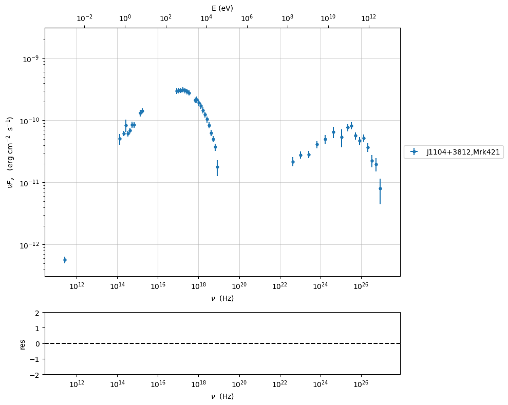
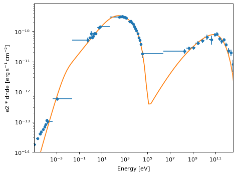

.. warning::
    
    
    **Tested against Gammapy version 1.2, please, take into account that might break if Gammapy changes interface**

.. _gammapy_plugin:

Example to use the Gamma-py plugin with the JeSeT interface
===========================================================

.. code:: ipython3

    import jetset
    print('tested with',jetset.__version__)

.. parsed-literal::

    tested with 1.4.0rc0

In this tutorial we show how to import a jetset model into Gamma-py, and
finally we perform a model fitting with Gamma-py. To run this plugin you
have to install Gamma-py
https://docs.gammapy.org/0.19/getting-started/install.html

.. code:: ipython3

    import astropy.units as u
    import  numpy as np
    import matplotlib.pyplot as plt
    import matplotlib as mpl
    mpl.rcParams['figure.dpi'] = 80
    
    from jetset.gammapy_plugin import GammapyJetsetModelFactory
    from jetset.jet_model import Jet
    from jetset.test_data_helper import  test_SEDs
    from jetset.data_loader import ObsData,Data
    from jetset.plot_sedfit import PlotSED
    from jetset.test_data_helper import  test_SEDs

Importing a jetset model into gammapy
-------------------------------------

.. code:: ipython3

    jet=Jet()

.. code:: ipython3

    jet.parameters

.. parsed-literal::

    WARNING: AstropyDeprecationWarning: 'classic' backend for show_in_notebook() is deprecated as of 6.1. Instead, use the supported backend 'ipydatagrid'. [astropy.table.table]

.. raw:: html

    <i>Table length=11</i>
    <table id="table4398238800-477232" class="table-striped table-bordered table-condensed">
    <thead><tr><th>model name</th><th>name</th><th>par type</th><th>units</th><th>val</th><th>phys. bound. min</th><th>phys. bound. max</th><th>log</th><th>frozen</th></tr></thead>
    <tr><td>jet_leptonic</td><td>R</td><td>region_size</td><td>cm</td><td>5.000000e+15</td><td>1.000000e+03</td><td>1.000000e+30</td><td>False</td><td>False</td></tr>
    <tr><td>jet_leptonic</td><td>R_H</td><td>region_position</td><td>cm</td><td>1.000000e+17</td><td>0.000000e+00</td><td>--</td><td>False</td><td>True</td></tr>
    <tr><td>jet_leptonic</td><td>B</td><td>magnetic_field</td><td>gauss</td><td>1.000000e-01</td><td>0.000000e+00</td><td>--</td><td>False</td><td>False</td></tr>
    <tr><td>jet_leptonic</td><td>NH_cold_to_rel_e</td><td>cold_p_to_rel_e_ratio</td><td></td><td>1.000000e+00</td><td>0.000000e+00</td><td>--</td><td>False</td><td>True</td></tr>
    <tr><td>jet_leptonic</td><td>beam_obj</td><td>beaming</td><td></td><td>1.000000e+01</td><td>1.000000e-04</td><td>--</td><td>False</td><td>False</td></tr>
    <tr><td>jet_leptonic</td><td>z_cosm</td><td>redshift</td><td></td><td>1.000000e-01</td><td>0.000000e+00</td><td>--</td><td>False</td><td>False</td></tr>
    <tr><td>jet_leptonic</td><td>gmin</td><td>low-energy-cut-off</td><td>lorentz-factor*</td><td>2.000000e+00</td><td>1.000000e+00</td><td>1.000000e+09</td><td>False</td><td>False</td></tr>
    <tr><td>jet_leptonic</td><td>gmax</td><td>high-energy-cut-off</td><td>lorentz-factor*</td><td>1.000000e+06</td><td>1.000000e+00</td><td>1.000000e+15</td><td>False</td><td>False</td></tr>
    <tr><td>jet_leptonic</td><td>N</td><td>emitters_density</td><td>1 / cm3</td><td>1.000000e+02</td><td>0.000000e+00</td><td>--</td><td>False</td><td>False</td></tr>
    <tr><td>jet_leptonic</td><td>gamma_cut</td><td>turn-over-energy</td><td>lorentz-factor*</td><td>1.000000e+04</td><td>1.000000e+00</td><td>1.000000e+09</td><td>False</td><td>False</td></tr>
    <tr><td>jet_leptonic</td><td>p</td><td>LE_spectral_slope</td><td></td><td>2.000000e+00</td><td>-1.000000e+01</td><td>1.000000e+01</td><td>False</td><td>False</td></tr>
    </table>
    

.. parsed-literal::

    None

.. code:: ipython3

    gammapy_jet_model=GammapyJetsetModelFactory(jet)
    gammapy_jet_model.parameters.to_table()

.. raw:: html

    
<i>Table length=11</i>
    <table id="table13711655040" class="table-striped table-bordered table-condensed">
    <thead><tr><th>type</th><th>name</th><th>value</th><th>unit</th><th>error</th><th>min</th><th>max</th><th>frozen</th><th>link</th><th>prior</th></tr></thead>
    <thead><tr><th>str1</th><th>str16</th><th>float64</th><th>str4</th><th>float64</th><th>float64</th><th>float64</th><th>bool</th><th>str1</th><th>str1</th></tr></thead>
    <tr><td></td><td>gmin</td><td>2.0000e+00</td><td></td><td>0.000e+00</td><td>1.000e+00</td><td>1.000e+09</td><td>False</td><td></td><td></td></tr>
    <tr><td></td><td>gmax</td><td>1.0000e+06</td><td></td><td>0.000e+00</td><td>1.000e+00</td><td>1.000e+15</td><td>False</td><td></td><td></td></tr>
    <tr><td></td><td>N</td><td>1.0000e+02</td><td>cm-3</td><td>0.000e+00</td><td>0.000e+00</td><td>nan</td><td>False</td><td></td><td></td></tr>
    <tr><td></td><td>gamma_cut</td><td>1.0000e+04</td><td></td><td>0.000e+00</td><td>1.000e+00</td><td>1.000e+09</td><td>False</td><td></td><td></td></tr>
    <tr><td></td><td>p</td><td>2.0000e+00</td><td></td><td>0.000e+00</td><td>-1.000e+01</td><td>1.000e+01</td><td>False</td><td></td><td></td></tr>
    <tr><td></td><td>R</td><td>5.0000e+15</td><td>cm</td><td>0.000e+00</td><td>1.000e+03</td><td>1.000e+30</td><td>False</td><td></td><td></td></tr>
    <tr><td></td><td>R_H</td><td>1.0000e+17</td><td>cm</td><td>0.000e+00</td><td>0.000e+00</td><td>nan</td><td>True</td><td></td><td></td></tr>
    <tr><td></td><td>B</td><td>1.0000e-01</td><td>G</td><td>0.000e+00</td><td>0.000e+00</td><td>nan</td><td>False</td><td></td><td></td></tr>
    <tr><td></td><td>NH_cold_to_rel_e</td><td>1.0000e+00</td><td></td><td>0.000e+00</td><td>0.000e+00</td><td>nan</td><td>True</td><td></td><td></td></tr>
    <tr><td></td><td>beam_obj</td><td>1.0000e+01</td><td></td><td>0.000e+00</td><td>1.000e-04</td><td>nan</td><td>False</td><td></td><td></td></tr>
    <tr><td></td><td>z_cosm</td><td>1.0000e-01</td><td></td><td>0.000e+00</td><td>0.000e+00</td><td>nan</td><td>False</td><td></td><td></td></tr>
    </table>

let’s verify that parameters are updated

.. code:: ipython3

    gammapy_jet_model.R.value=1E15
    gammapy_jet_model.N.value=1E4
    
    gammapy_jet_model.p.value=1.5

.. code:: ipython3

    gammapy_jet_model.parameters.to_table()

.. raw:: html

    
<i>Table length=11</i>
    <table id="table13711353632" class="table-striped table-bordered table-condensed">
    <thead><tr><th>type</th><th>name</th><th>value</th><th>unit</th><th>error</th><th>min</th><th>max</th><th>frozen</th><th>link</th><th>prior</th></tr></thead>
    <thead><tr><th>str1</th><th>str16</th><th>float64</th><th>str4</th><th>float64</th><th>float64</th><th>float64</th><th>bool</th><th>str1</th><th>str1</th></tr></thead>
    <tr><td></td><td>gmin</td><td>2.0000e+00</td><td></td><td>0.000e+00</td><td>1.000e+00</td><td>1.000e+09</td><td>False</td><td></td><td></td></tr>
    <tr><td></td><td>gmax</td><td>1.0000e+06</td><td></td><td>0.000e+00</td><td>1.000e+00</td><td>1.000e+15</td><td>False</td><td></td><td></td></tr>
    <tr><td></td><td>N</td><td>1.0000e+04</td><td>cm-3</td><td>0.000e+00</td><td>0.000e+00</td><td>nan</td><td>False</td><td></td><td></td></tr>
    <tr><td></td><td>gamma_cut</td><td>1.0000e+04</td><td></td><td>0.000e+00</td><td>1.000e+00</td><td>1.000e+09</td><td>False</td><td></td><td></td></tr>
    <tr><td></td><td>p</td><td>1.5000e+00</td><td></td><td>0.000e+00</td><td>-1.000e+01</td><td>1.000e+01</td><td>False</td><td></td><td></td></tr>
    <tr><td></td><td>R</td><td>1.0000e+15</td><td>cm</td><td>0.000e+00</td><td>1.000e+03</td><td>1.000e+30</td><td>False</td><td></td><td></td></tr>
    <tr><td></td><td>R_H</td><td>1.0000e+17</td><td>cm</td><td>0.000e+00</td><td>0.000e+00</td><td>nan</td><td>True</td><td></td><td></td></tr>
    <tr><td></td><td>B</td><td>1.0000e-01</td><td>G</td><td>0.000e+00</td><td>0.000e+00</td><td>nan</td><td>False</td><td></td><td></td></tr>
    <tr><td></td><td>NH_cold_to_rel_e</td><td>1.0000e+00</td><td></td><td>0.000e+00</td><td>0.000e+00</td><td>nan</td><td>True</td><td></td><td></td></tr>
    <tr><td></td><td>beam_obj</td><td>1.0000e+01</td><td></td><td>0.000e+00</td><td>1.000e-04</td><td>nan</td><td>False</td><td></td><td></td></tr>
    <tr><td></td><td>z_cosm</td><td>1.0000e-01</td><td></td><td>0.000e+00</td><td>0.000e+00</td><td>nan</td><td>False</td><td></td><td></td></tr>
    </table>

plotting with gammapy
~~~~~~~~~~~~~~~~~~~~~

.. code:: ipython3

    p=gammapy_jet_model.plot(energy_bounds=[1E-18, 10] * u.TeV,energy_power=2)

.. image:: gammapy_plugin_files/gammapy_plugin_14_0.png

plotting with jetset
~~~~~~~~~~~~~~~~~~~~

.. code:: ipython3

    gammapy_jet_model.jetset_model.plot_model()

.. parsed-literal::

    <jetset.plot_sedfit.PlotSED at 0x3314eb800>

.. image:: gammapy_plugin_files/gammapy_plugin_16_1.png

Model fitting with gammapy
--------------------------

.. code:: ipython3

    %matplotlib inline
    data=Data.from_file(test_SEDs[1])
    sed_data=ObsData(data_table=data)
    sed_data.group_data(bin_width=0.1)
    
    sed_data.add_systematics(0.1,[10.**6,10.**29])
    p=sed_data.plot_sed()

.. parsed-literal::

    ================================================================================
    
    ***  binning data  ***
    ---> N bins= 176
    ---> bin_width= 0.1
    ================================================================================
    

.. code:: ipython3

    from jetset.sed_shaper import  SEDShape
    my_shape=SEDShape(sed_data)
    my_shape.eval_indices(minimizer='lsb',silent=True)
    p=my_shape.plot_indices()
    p.setlim(y_min=1E-15,y_max=1E-6)

.. parsed-literal::

    ================================================================================
    
    *** evaluating spectral indices for data ***
    ================================================================================
    

.. parsed-literal::

    /Users/orion/miniforge3/envs/jetset/lib/python3.12/site-packages/scipy/optimize/_lsq/common.py:115: RuntimeWarning: overflow encountered in power
      phi_prime = -np.sum(suf ** 2 / denom**3) / p_norm
    /Users/orion/miniforge3/envs/jetset/lib/python3.12/site-packages/scipy/optimize/_lsq/common.py:154: RuntimeWarning: invalid value encountered in scalar divide
      ratio = phi / phi_prime
    /Users/orion/miniforge3/envs/jetset/lib/python3.12/site-packages/scipy/optimize/_lsq/common.py:398: RuntimeWarning: invalid value encountered in cast
      return min_step, np.equal(steps, min_step) * np.sign(s).astype(int)
    /Users/orion/miniforge3/envs/jetset/lib/python3.12/site-packages/scipy/optimize/_lsq/common.py:115: RuntimeWarning: overflow encountered in power
      phi_prime = -np.sum(suf ** 2 / denom**3) / p_norm
    /Users/orion/miniforge3/envs/jetset/lib/python3.12/site-packages/scipy/optimize/_lsq/common.py:154: RuntimeWarning: divide by zero encountered in scalar divide
      ratio = phi / phi_prime
    /Users/orion/miniforge3/envs/jetset/lib/python3.12/site-packages/scipy/optimize/_lsq/common.py:166: RuntimeWarning: divide by zero encountered in scalar divide
      p *= Delta / norm(p)
    /Users/orion/miniforge3/envs/jetset/lib/python3.12/site-packages/scipy/optimize/_lsq/common.py:166: RuntimeWarning: invalid value encountered in multiply
      p *= Delta / norm(p)
    /Users/orion/miniforge3/envs/jetset/lib/python3.12/site-packages/scipy/optimize/_lsq/common.py:398: RuntimeWarning: invalid value encountered in cast
      return min_step, np.equal(steps, min_step) * np.sign(s).astype(int)
    /Users/orion/miniforge3/envs/jetset/lib/python3.12/site-packages/scipy/optimize/_lsq/common.py:115: RuntimeWarning: invalid value encountered in scalar divide
      phi_prime = -np.sum(suf ** 2 / denom**3) / p_norm

.. image:: gammapy_plugin_files/gammapy_plugin_19_2.png

.. code:: ipython3

    mm,best_fit=my_shape.sync_fit(check_host_gal_template=False,
                      Ep_start=None,
                      minimizer='lsb',
                      silent=True,
                      fit_range=[10.,21.])

.. parsed-literal::

    ================================================================================
    
    *** Log-Polynomial fitting of the synchrotron component ***
    ---> first blind fit run,  fit range: [10.0, 21.0]
    ---> class:  HSP
    
    
    

.. parsed-literal::

    WARNING: AstropyDeprecationWarning: 'classic' backend for show_in_notebook() is deprecated as of 6.1. Instead, use the supported backend 'ipydatagrid'. [astropy.table.table]

.. raw:: html

    <i>Table length=4</i>
    <table id="table13766257280-402160" class="table-striped table-bordered table-condensed">
    <thead><tr><th>model name</th><th>name</th><th>val</th><th>bestfit val</th><th>err +</th><th>err -</th><th>start val</th><th>fit range min</th><th>fit range max</th><th>frozen</th></tr></thead>
    <tr><td>LogCubic</td><td>b</td><td>-1.686248e-01</td><td>-1.686248e-01</td><td>4.358721e-03</td><td>--</td><td>-1.000000e+00</td><td>-1.000000e+01</td><td>0.000000e+00</td><td>False</td></tr>
    <tr><td>LogCubic</td><td>c</td><td>-1.240705e-02</td><td>-1.240705e-02</td><td>6.505551e-04</td><td>--</td><td>-1.000000e+00</td><td>-1.000000e+01</td><td>1.000000e+01</td><td>False</td></tr>
    <tr><td>LogCubic</td><td>Ep</td><td>1.673587e+01</td><td>1.673587e+01</td><td>1.636242e-02</td><td>--</td><td>1.668869e+01</td><td>0.000000e+00</td><td>3.000000e+01</td><td>False</td></tr>
    <tr><td>LogCubic</td><td>Sp</td><td>-9.471815e+00</td><td>-9.471815e+00</td><td>1.279268e-02</td><td>--</td><td>-1.000000e+01</td><td>-3.000000e+01</td><td>0.000000e+00</td><td>False</td></tr>
    </table>
    

.. parsed-literal::

    ---> sync       nu_p=+1.673587e+01 (err=+1.636242e-02)  nuFnu_p=-9.471815e+00 (err=+1.279268e-02) curv.=-1.686248e-01 (err=+4.358721e-03)
    ================================================================================
    

.. code:: ipython3

    my_shape.IC_fit(fit_range=[23.,29.],minimizer='minuit',silent=True)
    p=my_shape.plot_shape_fit()
    p.setlim(y_min=1E-15)

.. parsed-literal::

    ================================================================================
    
    *** Log-Polynomial fitting of the IC component ***
    ---> fit range: [23.0, 29.0]
    ---> LogCubic fit
    
    

.. parsed-literal::

    WARNING: AstropyDeprecationWarning: 'classic' backend for show_in_notebook() is deprecated as of 6.1. Instead, use the supported backend 'ipydatagrid'. [astropy.table.table]

.. raw:: html

    <i>Table length=4</i>
    <table id="table13768344688-843125" class="table-striped table-bordered table-condensed">
    <thead><tr><th>model name</th><th>name</th><th>val</th><th>bestfit val</th><th>err +</th><th>err -</th><th>start val</th><th>fit range min</th><th>fit range max</th><th>frozen</th></tr></thead>
    <tr><td>LogCubic</td><td>b</td><td>-2.164748e-01</td><td>-2.164748e-01</td><td>3.075789e-02</td><td>--</td><td>-1.000000e+00</td><td>-1.000000e+01</td><td>0.000000e+00</td><td>False</td></tr>
    <tr><td>LogCubic</td><td>c</td><td>-5.765602e-02</td><td>-5.765602e-02</td><td>1.496974e-02</td><td>--</td><td>-1.000000e+00</td><td>-1.000000e+01</td><td>1.000000e+01</td><td>False</td></tr>
    <tr><td>LogCubic</td><td>Ep</td><td>2.527374e+01</td><td>2.527374e+01</td><td>8.298538e-02</td><td>--</td><td>2.529191e+01</td><td>0.000000e+00</td><td>3.000000e+01</td><td>False</td></tr>
    <tr><td>LogCubic</td><td>Sp</td><td>-1.013481e+01</td><td>-1.013481e+01</td><td>2.786107e-02</td><td>--</td><td>-1.000000e+01</td><td>-3.000000e+01</td><td>0.000000e+00</td><td>False</td></tr>
    </table>
    

.. parsed-literal::

    ---> IC         nu_p=+2.527374e+01 (err=+8.298538e-02)  nuFnu_p=-1.013481e+01 (err=+2.786107e-02) curv.=-2.164748e-01 (err=+3.075789e-02)
    ================================================================================
    

.. image:: gammapy_plugin_files/gammapy_plugin_21_4.png

.. code:: ipython3

    from jetset.obs_constrain import ObsConstrain
    from jetset.model_manager import  FitModel
    sed_obspar=ObsConstrain(beaming=25,
                            B_range=[0.001,0.1],
                            distr_e='lppl',
                            t_var_sec=3*86400,
                            nu_cut_IR=1E12,
                            SEDShape=my_shape)
    
    
    prefit_jet=sed_obspar.constrain_SSC_model(electron_distribution_log_values=False,silent=True)
    prefit_jet.save_model('prefit_jet.pkl')

.. parsed-literal::

    ================================================================================
    
    ***  constrains parameters from observable ***
    

.. parsed-literal::

    /Users/orion/miniforge3/envs/jetset/lib/python3.12/site-packages/jetset/obs_constrain.py:1514: RankWarning: Polyfit may be poorly conditioned
      p=polyfit(nu_p_IC_model_log,B_grid_log,2)
    WARNING: AstropyDeprecationWarning: 'classic' backend for show_in_notebook() is deprecated as of 6.1. Instead, use the supported backend 'ipydatagrid'. [astropy.table.table]

.. raw:: html

    <i>Table length=12</i>
    <table id="table13782874880-349642" class="table-striped table-bordered table-condensed">
    <thead><tr><th>model name</th><th>name</th><th>par type</th><th>units</th><th>val</th><th>phys. bound. min</th><th>phys. bound. max</th><th>log</th><th>frozen</th></tr></thead>
    <tr><td>jet_leptonic</td><td>R</td><td>region_size</td><td>cm</td><td>3.578073e+16</td><td>1.000000e+03</td><td>1.000000e+30</td><td>False</td><td>False</td></tr>
    <tr><td>jet_leptonic</td><td>R_H</td><td>region_position</td><td>cm</td><td>1.000000e+17</td><td>0.000000e+00</td><td>--</td><td>False</td><td>True</td></tr>
    <tr><td>jet_leptonic</td><td>B</td><td>magnetic_field</td><td>gauss</td><td>5.050000e-02</td><td>0.000000e+00</td><td>--</td><td>False</td><td>False</td></tr>
    <tr><td>jet_leptonic</td><td>NH_cold_to_rel_e</td><td>cold_p_to_rel_e_ratio</td><td></td><td>1.000000e+00</td><td>0.000000e+00</td><td>--</td><td>False</td><td>True</td></tr>
    <tr><td>jet_leptonic</td><td>beam_obj</td><td>beaming</td><td></td><td>2.500000e+01</td><td>1.000000e-04</td><td>--</td><td>False</td><td>False</td></tr>
    <tr><td>jet_leptonic</td><td>z_cosm</td><td>redshift</td><td></td><td>3.080000e-02</td><td>0.000000e+00</td><td>--</td><td>False</td><td>False</td></tr>
    <tr><td>jet_leptonic</td><td>gmin</td><td>low-energy-cut-off</td><td>lorentz-factor*</td><td>4.697542e+02</td><td>1.000000e+00</td><td>1.000000e+09</td><td>False</td><td>False</td></tr>
    <tr><td>jet_leptonic</td><td>gmax</td><td>high-energy-cut-off</td><td>lorentz-factor*</td><td>1.364411e+06</td><td>1.000000e+00</td><td>1.000000e+15</td><td>False</td><td>False</td></tr>
    <tr><td>jet_leptonic</td><td>N</td><td>emitters_density</td><td>1 / cm3</td><td>5.746653e-01</td><td>0.000000e+00</td><td>--</td><td>False</td><td>False</td></tr>
    <tr><td>jet_leptonic</td><td>gamma0_log_parab</td><td>turn-over-energy</td><td>lorentz-factor*</td><td>3.534742e+04</td><td>1.000000e+00</td><td>1.000000e+09</td><td>False</td><td>False</td></tr>
    <tr><td>jet_leptonic</td><td>s</td><td>LE_spectral_slope</td><td></td><td>2.171300e+00</td><td>-1.000000e+01</td><td>1.000000e+01</td><td>False</td><td>False</td></tr>
    <tr><td>jet_leptonic</td><td>r</td><td>spectral_curvature</td><td></td><td>8.431239e-01</td><td>-1.500000e+01</td><td>1.500000e+01</td><td>False</td><td>False</td></tr>
    </table>
    

.. parsed-literal::

    
    ================================================================================
    

.. code:: ipython3

    pl=prefit_jet.plot_model(sed_data=sed_data)
    pl.add_model_residual_plot(prefit_jet,sed_data)
    pl.setlim(y_min=1E-15,x_min=1E7,x_max=1E29)

.. image:: gammapy_plugin_files/gammapy_plugin_23_0.png

setting gammapy jetset model
~~~~~~~~~~~~~~~~~~~~~~~~~~~~

We import the model to gammapy and we set min/max values. Notice that
gammapy has not fit_range, but uses only min/max.

We importing a jetset model with ``fit_range`` defined, these will
automatically update the gammapy min/max parameters attributes

.. code:: ipython3

    jet=Jet.load_model('prefit_jet.pkl')
    jet.parameters.z_cosm.freeze()
    jet.parameters.R_H.freeze()
    jet.parameters.R.freeze()
    jet.parameters.gmin.freeze()
    #jet.parameters.R.fit_range=[5E15,1E17]
    #jet.parameters.gmin.fit_range=[10,1000]
    jet.parameters.gmax.fit_range=[1E5,1E7]
    jet.parameters.s.fit_range=[1,3]
    jet.parameters.r.fit_range=[0,5]
    jet.parameters.B.fit_range=[1E-4,1]
    jet.parameters.N.fit_range=[1E-3,10]
    jet.parameters.gamma0_log_parab.fit_range=[1E3,1E5]
    jet.parameters.beam_obj.fit_range=[5,50]
    
    gammapy_jet_model=GammapyJetsetModelFactory(jet)

.. code:: ipython3

    gammapy_jet_model.parameters.to_table()

.. raw:: html

    
<i>Table length=12</i>
    <table id="table13739531376" class="table-striped table-bordered table-condensed">
    <thead><tr><th>type</th><th>name</th><th>value</th><th>unit</th><th>error</th><th>min</th><th>max</th><th>frozen</th><th>link</th><th>prior</th></tr></thead>
    <thead><tr><th>str1</th><th>str16</th><th>float64</th><th>str4</th><th>float64</th><th>float64</th><th>float64</th><th>bool</th><th>str1</th><th>str1</th></tr></thead>
    <tr><td></td><td>gmin</td><td>4.6975e+02</td><td></td><td>0.000e+00</td><td>1.000e+00</td><td>1.000e+09</td><td>True</td><td></td><td></td></tr>
    <tr><td></td><td>gmax</td><td>1.3644e+06</td><td></td><td>0.000e+00</td><td>1.000e+05</td><td>1.000e+07</td><td>False</td><td></td><td></td></tr>
    <tr><td></td><td>N</td><td>5.7467e-01</td><td>cm-3</td><td>0.000e+00</td><td>1.000e-03</td><td>1.000e+01</td><td>False</td><td></td><td></td></tr>
    <tr><td></td><td>gamma0_log_parab</td><td>3.5347e+04</td><td></td><td>0.000e+00</td><td>1.000e+03</td><td>1.000e+05</td><td>False</td><td></td><td></td></tr>
    <tr><td></td><td>s</td><td>2.1713e+00</td><td></td><td>0.000e+00</td><td>1.000e+00</td><td>3.000e+00</td><td>False</td><td></td><td></td></tr>
    <tr><td></td><td>r</td><td>8.4312e-01</td><td></td><td>0.000e+00</td><td>0.000e+00</td><td>5.000e+00</td><td>False</td><td></td><td></td></tr>
    <tr><td></td><td>R</td><td>3.5781e+16</td><td>cm</td><td>0.000e+00</td><td>1.000e+03</td><td>1.000e+30</td><td>True</td><td></td><td></td></tr>
    <tr><td></td><td>R_H</td><td>1.0000e+17</td><td>cm</td><td>0.000e+00</td><td>0.000e+00</td><td>nan</td><td>True</td><td></td><td></td></tr>
    <tr><td></td><td>B</td><td>5.0500e-02</td><td>G</td><td>0.000e+00</td><td>1.000e-04</td><td>1.000e+00</td><td>False</td><td></td><td></td></tr>
    <tr><td></td><td>NH_cold_to_rel_e</td><td>1.0000e+00</td><td></td><td>0.000e+00</td><td>0.000e+00</td><td>nan</td><td>True</td><td></td><td></td></tr>
    <tr><td></td><td>beam_obj</td><td>2.5000e+01</td><td></td><td>0.000e+00</td><td>5.000e+00</td><td>5.000e+01</td><td>False</td><td></td><td></td></tr>
    <tr><td></td><td>z_cosm</td><td>3.0800e-02</td><td></td><td>0.000e+00</td><td>0.000e+00</td><td>nan</td><td>True</td><td></td><td></td></tr>
    </table>

.. code:: ipython3

    _=gammapy_jet_model.evaluate()

.. code:: ipython3

    p=gammapy_jet_model.jetset_model.plot_model(sed_data=sed_data)
    p.add_model_residual_plot(data=sed_data, model=jet,fit_range=[1E11,1E30])
    p.setlim(x_min=1E8,y_min=1E-14)

.. image:: gammapy_plugin_files/gammapy_plugin_29_0.png

importing data to gammapy
~~~~~~~~~~~~~~~~~~~~~~~~~

.. code:: ipython3

    from gammapy.estimators import FluxPoints
    
    fp=FluxPoints.from_table(sed_data.gammapy_table,sed_type='e2dnde', format='gadf-sed')
    p=fp.plot(sed_type='e2dnde')
    p=gammapy_jet_model.plot(energy_bounds=[1E-18, 10] * u.TeV,energy_power=2)
    
    plt.show()

.. parsed-literal::

    No reference model set for FluxMaps. Assuming point source with E^-2 spectrum.

.. image:: gammapy_plugin_files/gammapy_plugin_31_1.png

.. code:: ipython3

    sed_data.gammapy_table.meta

.. parsed-literal::

    {'z': 0.0308,
     'obj_name': 'J1104+3812,Mrk421',
     'restframe': 'obs',
     'data_scale': 'lin-lin',
     'UL_CL': 0.95,
     'SED_TYPE': 'e2dnde'}

.. code:: ipython3

    p=fp.plot(sed_type='dnde')
    p=gammapy_jet_model.plot(energy_bounds=[1E-18, 10] * u.TeV,energy_power=0)
    
    plt.show()

.. image:: gammapy_plugin_files/gammapy_plugin_33_0.png

building gammapy SkyModel
~~~~~~~~~~~~~~~~~~~~~~~~~

we build the SkyModel, and we degrade the pre-fit model quality

.. code:: ipython3

    
    from gammapy.modeling.models import SkyModel
    sky_model = SkyModel(name="SSC model Mrk 421", spectral_model=gammapy_jet_model)
    gammapy_jet_model.N.value=2.0
    gammapy_jet_model.r.value=0.5   
    gammapy_jet_model.beam_obj.value=20
    print(sky_model)
    gammapy_jet_model.evaluate()
    p=gammapy_jet_model.jetset_model.plot_model(sed_data=sed_data)
    p.add_model_residual_plot(data=sed_data, model=gammapy_jet_model.jetset_model,fit_range=[1E11,1E30])
    

.. parsed-literal::

    SkyModel
    
      Name                      : SSC model Mrk 421
      Datasets names            : None
      Spectral model type       : GammapyJetsetModel
      Spatial  model type       : 
      Temporal model type       : 
      Parameters:
        gmin                  (frozen):    469.754                   
        gmax                          : 1364411.465  +/-    0.00             
        N                             :      2.000   +/-    0.00 1 / cm3     
        gamma0_log_parab              :  35347.416   +/-    0.00             
        s                             :      2.171   +/-    0.00             
        r                             :      0.500   +/-    0.00             
        R                     (frozen): 35780727301057516.000      cm          
        R_H                   (frozen): 100000000000000000.000       cm          
        B                             :      0.051   +/-    0.00 gauss       
        NH_cold_to_rel_e      (frozen):      1.000                   
        beam_obj                      :     20.000   +/-    0.00             
        z_cosm                (frozen):      0.031                   
    
    

.. image:: gammapy_plugin_files/gammapy_plugin_37_1.png

setting gammapy Datasets and Fit classes, and running the fit
~~~~~~~~~~~~~~~~~~~~~~~~~~~~~~~~~~~~~~~~~~~~~~~~~~~~~~~~~~~~~

.. code:: ipython3

    from gammapy.datasets import FluxPointsDataset,Datasets
    datasets = Datasets()
    E_min_fit = (1e11 * u.Hz).to("eV", equivalencies=u.spectral())
    fp=FluxPoints.from_table(sed_data.gammapy_table,sed_type='e2dnde', format='gadf-sed')
    dataset_mrk421 = FluxPointsDataset(data=fp,models=sky_model)
    
    #this workaround was needed with version 1.2
    dataset_mrk421.mask_fit= dataset_mrk421.data.energy_ref >= E_min_fit
    dataset_mrk421.mask_fit=dataset_mrk421.mask_fit.reshape(dataset_mrk421.mask_safe.shape)
    
    datasets = Datasets(dataset_mrk421)
    datasets.models=sky_model

.. parsed-literal::

    No reference model set for FluxMaps. Assuming point source with E^-2 spectrum.

.. code:: ipython3

    dataset_mrk421.mask_fit.shape

.. parsed-literal::

    (54, 1, 1)

.. code:: ipython3

    from gammapy.modeling import Fit
    
    #conf_dict=dict(tol=1E-8)
                
    
    fitter = Fit(backend='scipy')#,optimize_opts=conf_dict)

.. code:: ipython3

    results = fitter.run(datasets=datasets)
    print(results)

.. parsed-literal::

    No covariance estimate - not supported by this backend.

.. parsed-literal::

    OptimizeResult
    
    	backend    : scipy
    	method     : scipy
    	success    : True
    	message    : Optimization terminated successfully.
    	nfev       : 838
    	total stat : 40.50
    
    

.. code:: ipython3

    results.parameters.to_table()

.. raw:: html

    
<i>Table length=12</i>
    <table id="table13779418768" class="table-striped table-bordered table-condensed">
    <thead><tr><th>type</th><th>name</th><th>value</th><th>unit</th><th>error</th><th>min</th><th>max</th><th>frozen</th><th>link</th><th>prior</th></tr></thead>
    <thead><tr><th>str1</th><th>str16</th><th>float64</th><th>str4</th><th>float64</th><th>float64</th><th>float64</th><th>bool</th><th>str1</th><th>str1</th></tr></thead>
    <tr><td></td><td>gmin</td><td>4.6975e+02</td><td></td><td>0.000e+00</td><td>1.000e+00</td><td>1.000e+09</td><td>True</td><td></td><td></td></tr>
    <tr><td></td><td>gmax</td><td>8.9839e+05</td><td></td><td>0.000e+00</td><td>1.000e+05</td><td>1.000e+07</td><td>False</td><td></td><td></td></tr>
    <tr><td></td><td>N</td><td>5.2610e-01</td><td>cm-3</td><td>0.000e+00</td><td>1.000e-03</td><td>1.000e+01</td><td>False</td><td></td><td></td></tr>
    <tr><td></td><td>gamma0_log_parab</td><td>3.4405e+04</td><td></td><td>0.000e+00</td><td>1.000e+03</td><td>1.000e+05</td><td>False</td><td></td><td></td></tr>
    <tr><td></td><td>s</td><td>2.0559e+00</td><td></td><td>0.000e+00</td><td>1.000e+00</td><td>3.000e+00</td><td>False</td><td></td><td></td></tr>
    <tr><td></td><td>r</td><td>8.0992e-01</td><td></td><td>0.000e+00</td><td>0.000e+00</td><td>5.000e+00</td><td>False</td><td></td><td></td></tr>
    <tr><td></td><td>R</td><td>3.5781e+16</td><td>cm</td><td>0.000e+00</td><td>1.000e+03</td><td>1.000e+30</td><td>True</td><td></td><td></td></tr>
    <tr><td></td><td>R_H</td><td>1.0000e+17</td><td>cm</td><td>0.000e+00</td><td>0.000e+00</td><td>nan</td><td>True</td><td></td><td></td></tr>
    <tr><td></td><td>B</td><td>6.8142e-02</td><td>G</td><td>0.000e+00</td><td>1.000e-04</td><td>1.000e+00</td><td>False</td><td></td><td></td></tr>
    <tr><td></td><td>NH_cold_to_rel_e</td><td>1.0000e+00</td><td></td><td>0.000e+00</td><td>0.000e+00</td><td>nan</td><td>True</td><td></td><td></td></tr>
    <tr><td></td><td>beam_obj</td><td>1.9138e+01</td><td></td><td>0.000e+00</td><td>5.000e+00</td><td>5.000e+01</td><td>False</td><td></td><td></td></tr>
    <tr><td></td><td>z_cosm</td><td>3.0800e-02</td><td></td><td>0.000e+00</td><td>0.000e+00</td><td>nan</td><td>True</td><td></td><td></td></tr>
    </table>

.. code:: ipython3

    gammapy_jet_model.jetset_model.parameters

.. parsed-literal::

    WARNING: AstropyDeprecationWarning: 'classic' backend for show_in_notebook() is deprecated as of 6.1. Instead, use the supported backend 'ipydatagrid'. [astropy.table.table]

.. raw:: html

    <i>Table length=12</i>
    <table id="table13771430208-781268" class="table-striped table-bordered table-condensed">
    <thead><tr><th>model name</th><th>name</th><th>par type</th><th>units</th><th>val</th><th>phys. bound. min</th><th>phys. bound. max</th><th>log</th><th>frozen</th></tr></thead>
    <tr><td>jet_leptonic</td><td>gmin</td><td>low-energy-cut-off</td><td>lorentz-factor*</td><td>4.697542e+02</td><td>1.000000e+00</td><td>1.000000e+09</td><td>False</td><td>True</td></tr>
    <tr><td>jet_leptonic</td><td>gmax</td><td>high-energy-cut-off</td><td>lorentz-factor*</td><td>8.983946e+05</td><td>1.000000e+00</td><td>1.000000e+15</td><td>False</td><td>False</td></tr>
    <tr><td>jet_leptonic</td><td>N</td><td>emitters_density</td><td>1 / cm3</td><td>5.261017e-01</td><td>0.000000e+00</td><td>--</td><td>False</td><td>False</td></tr>
    <tr><td>jet_leptonic</td><td>gamma0_log_parab</td><td>turn-over-energy</td><td>lorentz-factor*</td><td>3.440529e+04</td><td>1.000000e+00</td><td>1.000000e+09</td><td>False</td><td>False</td></tr>
    <tr><td>jet_leptonic</td><td>s</td><td>LE_spectral_slope</td><td></td><td>2.055942e+00</td><td>-1.000000e+01</td><td>1.000000e+01</td><td>False</td><td>False</td></tr>
    <tr><td>jet_leptonic</td><td>r</td><td>spectral_curvature</td><td></td><td>8.099165e-01</td><td>-1.500000e+01</td><td>1.500000e+01</td><td>False</td><td>False</td></tr>
    <tr><td>jet_leptonic</td><td>R</td><td>region_size</td><td>cm</td><td>3.578073e+16</td><td>1.000000e+03</td><td>1.000000e+30</td><td>False</td><td>True</td></tr>
    <tr><td>jet_leptonic</td><td>R_H</td><td>region_position</td><td>cm</td><td>1.000000e+17</td><td>0.000000e+00</td><td>--</td><td>False</td><td>True</td></tr>
    <tr><td>jet_leptonic</td><td>B</td><td>magnetic_field</td><td>gauss</td><td>6.814163e-02</td><td>0.000000e+00</td><td>--</td><td>False</td><td>False</td></tr>
    <tr><td>jet_leptonic</td><td>NH_cold_to_rel_e</td><td>cold_p_to_rel_e_ratio</td><td></td><td>1.000000e+00</td><td>0.000000e+00</td><td>--</td><td>False</td><td>True</td></tr>
    <tr><td>jet_leptonic</td><td>beam_obj</td><td>beaming</td><td></td><td>1.913780e+01</td><td>1.000000e-04</td><td>--</td><td>False</td><td>False</td></tr>
    <tr><td>jet_leptonic</td><td>z_cosm</td><td>redshift</td><td></td><td>3.080000e-02</td><td>0.000000e+00</td><td>--</td><td>False</td><td>True</td></tr>
    </table>
    

.. parsed-literal::

    None

note that this plot refers to the latest fit trial, in case, please
consider storing the plot within a list in the fit loop

.. code:: ipython3

    gammapy_jet_model.evaluate()
    fp.plot(sed_type='e2dnde')
    gammapy_jet_model.plot(energy_bounds=[1E-18, 10] * u.TeV,energy_power=2)
    plt.ylim(1E-14)
    plt.show()

.. code:: ipython3

    gammapy_jet_model.jetset_model.eval()
    p=gammapy_jet_model.jetset_model.plot_model(sed_data=sed_data)
    p.add_model_residual_plot(data=sed_data, model=gammapy_jet_model.jetset_model,
                                             fit_range=[1E11,1E30])
    p.setlim(y_min=1E-14)

.. image:: gammapy_plugin_files/gammapy_plugin_47_0.png

.. code:: ipython3

    %timeit gammapy_jet_model.jetset_model.eval()

.. parsed-literal::

    4.13 ms ± 16.8 μs per loop (mean ± std. dev. of 7 runs, 100 loops each)

.. code:: ipython3

    %timeit gammapy_jet_model.evaluate()

.. parsed-literal::

    4.49 ms ± 84.7 μs per loop (mean ± std. dev. of 7 runs, 100 loops each)

