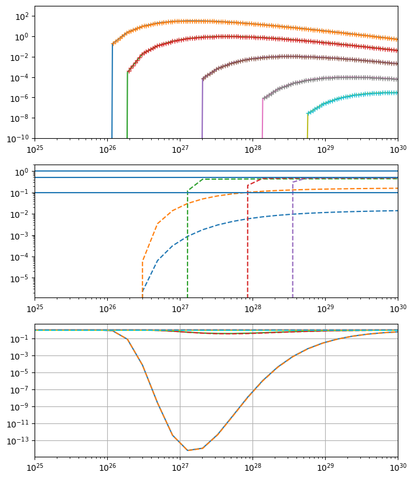

.. _int_abs_guide:

Internal absorption
===================

.. code:: ipython3

    import jetset
    print('tested with',jetset.__version__)

.. parsed-literal::

    tested with 1.4.0rc0

In this tutorial we show how to use the internal absorption for external
radiative fields.

We first create a leptonic jet model with e EC components.

.. code:: ipython3

    from jetset.jet_model import Jet
    import numpy as np
    from jetset.template_2Dmodel import EBLAbsorptionTemplate
    import astropy.units as u
    
    ebl_dominguez_2010=EBLAbsorptionTemplate.from_name('Dominguez_2010_v2011')
    ebl_dominguez_lopez=EBLAbsorptionTemplate.from_name('Dominguez_2023')
    ebl_finke=EBLAbsorptionTemplate.from_name('Finke_2010')
    ebl_franceschini=EBLAbsorptionTemplate.from_name('Franceschini_2008')
    
    
    jetset_model = Jet(name="compact_int_abs",emitters_distribution="bkn",beaming_expr='bulk_theta')
    jetset_model.add_EC_component(EC_components_list=['EC_DT','EC_BLR'],disk_type='BB')
    jetset_model.make_conical_jet(theta_open=5,R=1E16)
    jetset_model.set_EC_dependencies()
    
    jetset_model.set_par('L_Disk',val=2E45)
    jetset_model.set_par('gmax',val=5E5)
    jetset_model.set_par('gmin',val=2.)
    jetset_model.set_par('R_H',val=1E17)
    
    jetset_model.set_par('p',val=1.5)
    jetset_model.set_par('p_1',val=3.2)
    jetset_model.set_par('B',val=1.5)
    jetset_model.set_par('z_cosm',val=0.6)
    jetset_model.set_par('BulkFactor',val=10)
    jetset_model.set_par('theta',val=1)
    jetset_model.set_par('gamma_break',val=5E2)
    jetset_model.parameters.tau_DT.val=0.1
    jetset_model.parameters.T_DT.val=1000
    jetset_model.parameters.theta.freeze()
    jetset_model.parameters.R_H.val=1E18
    jetset_model.set_N_from_nuFnu(nu_obs=1E13,nuFnu_obs=1E-13)
    jetset_model.set_external_field_transf('blob')
    

.. parsed-literal::

    adding par: R_H to  R
    adding par: theta_open to  R
    ==> par R is depending on ['R_H', 'theta_open'] according to expr:   R =
    np.tan(np.radians(theta_open))*R_H
    setting R_H to 1.1430052302761344e+17
    adding par: L_Disk to  R_BLR_in
    ==> par R_BLR_in is depending on ['L_Disk'] according to expr:   R_BLR_in =
    3E17*(L_Disk/1E46)**0.5
    adding par: R_BLR_in to  R_BLR_out
    ==> par R_BLR_out is depending on ['R_BLR_in'] according to expr:   R_BLR_out =
    R_BLR_in*1.1
    adding par: L_Disk to  R_DT
    ==> par R_DT is depending on ['L_Disk'] according to expr:   R_DT =
    2E19*(L_Disk/1E46)**0.5

Now we can enable the internal absorption for the BLR and DT fields, and
evaluate the model with internal absorption applied

.. code:: ipython3

    
    jetset_model.enable_internal_absorption('DT')
    jetset_model.enable_internal_absorption('BLR')
    jetset_model.eval()
    p=jetset_model.plot_model()
    
    jetset_model.remove_internal_absorption('DT')
    jetset_model.remove_internal_absorption('BLR')
    jetset_model.eval()
    jetset_model.plot_model(plot_obj=p,comp='EC_DT',label='no DT abs',line_style='--')
    jetset_model.plot_model(plot_obj=p,comp='EC_BLR',label='no BLR abs',line_style='--')
    

.. parsed-literal::

    <jetset.plot_sedfit.PlotSED at 0x3169a6240>

.. image:: int_abs_files/int_abs_7_1.png

.. code:: ipython3

    
    jetset_model.enable_internal_absorption('DT')
    jetset_model.enable_internal_absorption('BLR')

This model can be used now for model fitting.

.. code:: ipython3

    jetset_model.show_internal_absorption_components()

.. parsed-literal::

    internal absorption  for component: DT
    ('N_hard', 50)
    ('N_soft', 50)
    ('N_theta', 50)
    ('N_R_H', 50)
    ('nu_min', 1e+20)
    ('comp', 'DT')
    ('use_R_H_profile_extrapolation', False)
    
    internal absorption  for component: BLR
    ('N_hard', 50)
    ('N_soft', 50)
    ('N_theta', 50)
    ('N_R_H', 50)
    ('nu_min', 1e+20)
    ('comp', 'BLR')
    ('use_R_H_profile_extrapolation', False)
    

Please, notice that the internal absorption will slow down a bit the
computation. Let’s quantify the effect for a single component. First we
remove the BLR absorption

.. code:: ipython3

    jetset_model.remove_internal_absorption('BLR')
    jetset_model.show_internal_absorption_components()

.. parsed-literal::

    internal absorption  for component: DT
    ('N_hard', 50)
    ('N_soft', 50)
    ('N_theta', 50)
    ('N_R_H', 50)
    ('nu_min', 1e+20)
    ('comp', 'DT')
    ('use_R_H_profile_extrapolation', False)
    

.. code:: ipython3

    %timeit jetset_model.eval()

.. parsed-literal::

    26 ms ± 2.75 ms per loop (mean ± std. dev. of 7 runs, 10 loops each)

.. code:: ipython3

    jetset_model.remove_internal_absorption('DT')

.. code:: ipython3

    %timeit jetset_model.eval()
    jetset_model.show_internal_absorption_components()

.. parsed-literal::

    7.05 ms ± 102 μs per loop (mean ± std. dev. of 7 runs, 100 loops each)
    internal absorption not enabled in this jet model

The increase in computational time, for component, compared to an EC
model without absorption, is of a factor of ~ 4.

By setting ``use_R_H_profile_extrapolation=True``, we can speed up the
process

.. code:: ipython3

    jetset_model.enable_internal_absorption('DT',use_R_H_profile_extrapolation=True)

.. code:: ipython3

    %timeit jetset_model.eval()

.. parsed-literal::

    13.9 ms ± 818 μs per loop (mean ± std. dev. of 7 runs, 100 loops each)

The increase in computational time is lower now, down to a factor of ~2
per absorption component.

In the following some plots showing the accuracy effect when using
``use_R_H_profile_extrapolation=True``, so you can choose accordingly,
if whether to use the approximation or not.

.. code:: ipython3

    from matplotlib import pylab as plt
    jetset_model.parameters.tau_BLR.val=0.1
    fig,axs=plt.subplots(3,1,figsize=(8,10))
    nu_tau=np.logspace(24,30,30)
    R_DT=jetset_model.parameters.R_DT.val
    for f in [0.1,1,2,5,10]:
        jetset_model.parameters.R_H.val=R_DT*f
        jetset_model.enable_internal_absorption('DT',N_R_H=50,N_theta=50,N_soft=50,N_hard=100,use_R_H_profile_extrapolation=False)
        y,x=jetset_model._internal_absorption_comp['DT']['obj'].eval(peak=False,lin_nu=nu_tau,get_tau=True)
        x=x*u.Hz
        x1=np.logspace(24,30,200)
        tau_interp = 10**np.interp(np.log10(x1), np.log10(x.value), np.log10(y))
     
        axs[0].loglog( x,y)
        axs[0].loglog( x1,tau_interp,'+')
    
    
        jetset_model.enable_internal_absorption('DT',N_R_H=50,N_theta=50,N_soft=50,N_hard=100,use_R_H_profile_extrapolation=True)
        y1,x=jetset_model._internal_absorption_comp['DT']['obj'].eval(peak=False,lin_nu=nu_tau,get_tau=True)
    
        x=x*u.Hz
     
    
        axs[1].loglog( x,np.fabs(y1-y)/y,'--')
    
        axs[2].loglog( x,np.exp(-y),'-')
        axs[2].loglog( x,np.exp(-y1),'--')
    axs[0].set_xlim(1E25,1E30)
    axs[1].set_xlim(1E25,1E30)
    axs[2].set_xlim(1E25,1E30)
    
    axs[1].axhline(1)   
    axs[1].axhline(.5)
    axs[1].axhline(.1)
    axs[0].set_ylim(1E-10,1E3)
    
    axs[1].set_ylim(None,2)
    plt.grid()

.. code:: ipython3

    from matplotlib import pylab as plt
    jetset_model.parameters.tau_BLR.val=0.1
    #jetset_model.parameters.T_DT.val=1000
    fig,axs=plt.subplots(3,1,figsize=(8,10))
    nu_tau=np.logspace(24,30,30)
    R_BLR=jetset_model.parameters.R_BLR_out.val
    for f in [0.1,1,2,5,10]:
        jetset_model.parameters.R_H.val=R_BLR*f
        jetset_model.eval()
        jetset_model.enable_internal_absorption('BLR',N_R_H=50,N_theta=50,N_soft=50,N_hard=50,use_R_H_profile_extrapolation=False)
        y,x=jetset_model._internal_absorption_comp['BLR']['obj'].eval(peak=False,lin_nu=nu_tau,get_tau=True)
        x=x*u.Hz
     
        axs[0].loglog( x,y)
    
        jetset_model.enable_internal_absorption('BLR',N_R_H=50,N_theta=50,N_soft=50,N_hard=50,use_R_H_profile_extrapolation=True)
        y1,x=jetset_model._internal_absorption_comp['BLR']['obj'].eval(peak=False,lin_nu=nu_tau,get_tau=True)
    
        x=x*u.Hz
     
        axs[0].loglog( x,y1,'--')
    
        axs[1].loglog( x,np.fabs(y1-y)/y,'--')
    
        axs[2].loglog( x,np.exp(-y),'-')
        axs[2].loglog( x,np.exp(-y1),'--')
    axs[0].set_xlim(1E24,1E30)
    
    axs[1].set_xlim(1E24,1E30)
    axs[2].set_xlim(1E24,1E30)
    
    #axs[1].axhline(1)   
    #axs[1].axhline(.5)
    #axs[1].axhline(.1)
    axs[0].set_ylim(1E-10,1E3)
    axs[1].set_ylim(1E-3,2)
    axs[2].set_ylim(1E-30,)
    axs[0].set_xlabel(r'$\nu$')
    axs[1].set_xlabel(r'$\nu$')
    axs[2].set_xlabel(r'$\nu$')
    
    axs[0].set_ylabel(r'$\tau$')
    axs[1].set_ylabel(r'relative error')
    axs[2].set_ylabel(r'$exp^{-\tau}$')
    plt.tight_layout()
    plt.grid()

.. image:: int_abs_files/int_abs_21_0.png

.. code:: ipython3

    jetset_model.parameters.tau_BLR.val=0.1
    R_BLR=jetset_model.parameters.R_BLR_out.val
    fig,axs=plt.subplots(3,1,figsize=(8,10))
    for f in [0.1,1,5,10,100]:
        jetset_model.parameters.R_H.val=R_BLR*f
        jetset_model.eval()
        jetset_model.enable_internal_absorption('BLR',N_R_H=50,N_theta=50,N_soft=50,N_hard=50,use_R_H_profile_extrapolation=False)
        y,x=jetset_model.eval_internal_absorption(comp="BLR",peak=False)
        x=x*u.Hz
     
        axs[0].loglog( x,y,)
        jetset_model.enable_internal_absorption('BLR',N_R_H=50,N_theta=50,N_soft=50,N_hard=50,use_R_H_profile_extrapolation=True)
        y1,x=jetset_model.eval_internal_absorption(comp="BLR",peak=False)
        x=x*u.Hz
        
        axs[0].loglog( x,y1,'--')
    
        axs[1].loglog( x,np.fabs(y1-y)/y,'--')
        axs[2].loglog( x,np.exp(-y),'-')
        axs[2].loglog( x,np.exp(-y1),'--')
    axs[0].set_xlim(1E24,1E30)
    axs[1].set_xlim(1E24,1E30)
    axs[2].set_xlim(1E24,1E30)
    
    #axs[1].axhline(1)   
    #axs[1].axhline(.5)
    #axs[1].axhline(.1)
    axs[0].set_ylim(1E-10,1E3)
    axs[1].set_ylim(1E-3,2)
    axs[2].set_ylim(1E-30,)
    axs[0].set_xlabel(r'$\nu$')
    axs[1].set_xlabel(r'$\nu$')
    axs[2].set_xlabel(r'$\nu$')
    
    axs[0].set_ylabel(r'$\tau$')
    axs[1].set_ylabel(r'relative error')
    axs[2].set_ylabel(r'$exp^{-\tau}$')
    plt.grid()

.. image:: int_abs_files/int_abs_22_0.png

