.. _model_fitting_1:

Model fitting 1: Only SSC and extended radio jet
================================================

.. code:: ipython3

    import warnings
    warnings.filterwarnings('ignore')
    
    import matplotlib.pylab as plt
    import jetset
    from jetset.test_data_helper import  test_SEDs
    from jetset.data_loader import ObsData,Data
    from jetset.plot_sedfit import PlotSED
    from jetset.test_data_helper import  test_SEDs

.. code:: ipython3

    print(jetset.__version__)

.. parsed-literal::

    1.3.1rc5

.. code:: ipython3

    test_SEDs

.. parsed-literal::

    ['/Users/orion/miniforge3/envs/py3.12/lib/python3.12/site-packages/jetset/test_data/SEDs_data/SED_3C345.ecsv',
     '/Users/orion/miniforge3/envs/py3.12/lib/python3.12/site-packages/jetset/test_data/SEDs_data/SED_MW_Mrk421_EBL_DEABS.ecsv',
     '/Users/orion/miniforge3/envs/py3.12/lib/python3.12/site-packages/jetset/test_data/SEDs_data/SED_MW_Mrk501_EBL_ABS.ecsv',
     '/Users/orion/miniforge3/envs/py3.12/lib/python3.12/site-packages/jetset/test_data/SEDs_data/SED_MW_Mrk501_EBL_DEABS.ecsv']

Loading data
------------

see the :ref:`data_format` user guide for further information about loading data 

.. code:: ipython3

    print(test_SEDs[1])
    data=Data.from_file(test_SEDs[1])

.. parsed-literal::

    /Users/orion/miniforge3/envs/py3.12/lib/python3.12/site-packages/jetset/test_data/SEDs_data/SED_MW_Mrk421_EBL_DEABS.ecsv

.. code:: ipython3

    %matplotlib inline
    sed_data=ObsData(data_table=data)
    sed_data.group_data(bin_width=0.2)
    
    sed_data.add_systematics(0.1,[10.**6,10.**29])
    p=sed_data.plot_sed()
    #p.setlim(y_min=1E-15,x_min=1E7,x_max=1E29)

.. parsed-literal::

    ================================================================================
    
    ***  binning data  ***
    ---> N bins= 88
    ---> bin_width= 0.2
    ================================================================================
    

.. image:: Jet_example_and_radio_plugin_model_fit_files/Jet_example_and_radio_plugin_model_fit_8_1.png

.. code:: ipython3

    sed_data.save('Mrk_401.pkl')

phenomenological model constraining
-----------------------------------

see the :ref:`phenom_constr` user guide for further information about phenomenological constraining 

spectral indices
~~~~~~~~~~~~~~~~

.. code:: ipython3

    from jetset.sed_shaper import  SEDShape
    my_shape=SEDShape(sed_data)
    my_shape.eval_indices(minimizer='lsb',silent=True)
    p=my_shape.plot_indices()
    p.setlim(y_min=1E-15,y_max=5E-8)

.. parsed-literal::

    ================================================================================
    
    *** evaluating spectral indices for data ***
    ================================================================================
    

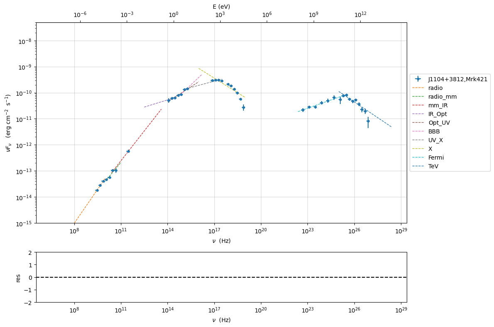

sed shaper
~~~~~~~~~~

.. code:: ipython3

    mm,best_fit=my_shape.sync_fit(check_host_gal_template=False,
                      Ep_start=None,
                      minimizer='lsb',
                      silent=True,
                      fit_range=[10.,21.])

.. parsed-literal::

    ================================================================================
    
    *** Log-Polynomial fitting of the synchrotron component ***
    ---> first blind fit run,  fit range: [10.0, 21.0]
    ---> class:  HSP
    
    
    

.. raw:: html

    <i>Table length=4</i>
    <table id="table13008609664-847824" class="table-striped table-bordered table-condensed">
    <thead><tr><th>model name</th><th>name</th><th>val</th><th>bestfit val</th><th>err +</th><th>err -</th><th>start val</th><th>fit range min</th><th>fit range max</th><th>frozen</th></tr></thead>
    <tr><td>LogCubic</td><td>b</td><td>-1.563747e-01</td><td>-1.563747e-01</td><td>5.975434e-03</td><td>--</td><td>-1.000000e+00</td><td>-1.000000e+01</td><td>0.000000e+00</td><td>False</td></tr>
    <tr><td>LogCubic</td><td>c</td><td>-1.052802e-02</td><td>-1.052802e-02</td><td>8.781942e-04</td><td>--</td><td>-1.000000e+00</td><td>-1.000000e+01</td><td>1.000000e+01</td><td>False</td></tr>
    <tr><td>LogCubic</td><td>Ep</td><td>1.675324e+01</td><td>1.675324e+01</td><td>2.396636e-02</td><td>--</td><td>1.670206e+01</td><td>0.000000e+00</td><td>3.000000e+01</td><td>False</td></tr>
    <tr><td>LogCubic</td><td>Sp</td><td>-9.494365e+00</td><td>-9.494365e+00</td><td>1.704982e-02</td><td>--</td><td>-1.000000e+01</td><td>-3.000000e+01</td><td>0.000000e+00</td><td>False</td></tr>
    </table>
    

.. parsed-literal::

    ---> sync       nu_p=+1.675324e+01 (err=+2.396636e-02)  nuFnu_p=-9.494365e+00 (err=+1.704982e-02) curv.=-1.563747e-01 (err=+5.975434e-03)
    ================================================================================
    

.. code:: ipython3

    my_shape.IC_fit(fit_range=[23.,29.],minimizer='minuit',silent=True)
    p=my_shape.plot_shape_fit()
    p.setlim(y_min=1E-15,y_max=5E-8)

.. parsed-literal::

    ================================================================================
    
    *** Log-Polynomial fitting of the IC component ***
    ---> fit range: [23.0, 29.0]
    ---> LogCubic fit
    
    

.. raw:: html

    <i>Table length=4</i>
    <table id="table13005969632-950205" class="table-striped table-bordered table-condensed">
    <thead><tr><th>model name</th><th>name</th><th>val</th><th>bestfit val</th><th>err +</th><th>err -</th><th>start val</th><th>fit range min</th><th>fit range max</th><th>frozen</th></tr></thead>
    <tr><td>LogCubic</td><td>b</td><td>-2.274590e-01</td><td>-2.274590e-01</td><td>3.262165e-02</td><td>--</td><td>-1.000000e+00</td><td>-1.000000e+01</td><td>0.000000e+00</td><td>False</td></tr>
    <tr><td>LogCubic</td><td>c</td><td>-6.259967e-02</td><td>-6.259967e-02</td><td>1.629407e-02</td><td>--</td><td>-1.000000e+00</td><td>-1.000000e+01</td><td>1.000000e+01</td><td>False</td></tr>
    <tr><td>LogCubic</td><td>Ep</td><td>2.527207e+01</td><td>2.527207e+01</td><td>8.149544e-02</td><td>--</td><td>2.528644e+01</td><td>0.000000e+00</td><td>3.000000e+01</td><td>False</td></tr>
    <tr><td>LogCubic</td><td>Sp</td><td>-1.014119e+01</td><td>-1.014119e+01</td><td>2.734754e-02</td><td>--</td><td>-1.000000e+01</td><td>-3.000000e+01</td><td>0.000000e+00</td><td>False</td></tr>
    </table>
    

.. parsed-literal::

    ---> IC         nu_p=+2.527207e+01 (err=+8.149544e-02)  nuFnu_p=-1.014119e+01 (err=+2.734754e-02) curv.=-2.274590e-01 (err=+3.262165e-02)
    ================================================================================
    

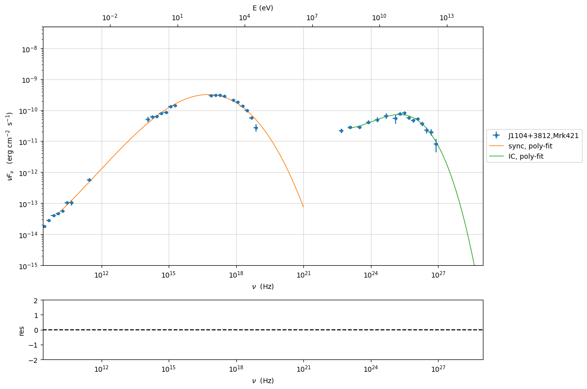

Model constraining
~~~~~~~~~~~~~~~~~~

In this step we are not fitting the model, we are just obtaining the
phenomenological ``pre_fit`` model, that will be fitted in using minuit
ore least-square bound, as shown below

.. code:: ipython3

    from jetset.obs_constrain import ObsConstrain
    from jetset.model_manager import  FitModel
    sed_obspar=ObsConstrain(beaming=25,
                            B_range=[0.001,0.1],
                            distr_e='lppl',
                            t_var_sec=3*86400,
                            nu_cut_IR=1E12,
                            SEDShape=my_shape)
    
    
    prefit_jet=sed_obspar.constrain_SSC_model(electron_distribution_log_values=False,silent=True)
    prefit_jet.save_model('prefit_jet.pkl')

.. parsed-literal::

    ================================================================================
    
    ***  constrains parameters from observable ***
    

.. parsed-literal::

    /Users/orion/miniforge3/envs/py3.12/lib/python3.12/site-packages/jetset/obs_constrain.py:1117: RankWarning: Polyfit may be poorly conditioned
      p=polyfit(nu_p_IC_model_log,B_grid_log,2)

.. raw:: html

    <i>Table length=12</i>
    <table id="table13325632576-33731" class="table-striped table-bordered table-condensed">
    <thead><tr><th>model name</th><th>name</th><th>par type</th><th>units</th><th>val</th><th>phys. bound. min</th><th>phys. bound. max</th><th>log</th><th>frozen</th></tr></thead>
    <tr><td>jet_leptonic</td><td>R</td><td>region_size</td><td>cm</td><td>3.452668e+16</td><td>1.000000e+03</td><td>1.000000e+30</td><td>False</td><td>False</td></tr>
    <tr><td>jet_leptonic</td><td>R_H</td><td>region_position</td><td>cm</td><td>1.000000e+17</td><td>0.000000e+00</td><td>--</td><td>False</td><td>True</td></tr>
    <tr><td>jet_leptonic</td><td>B</td><td>magnetic_field</td><td>gauss</td><td>5.050000e-02</td><td>0.000000e+00</td><td>--</td><td>False</td><td>False</td></tr>
    <tr><td>jet_leptonic</td><td>NH_cold_to_rel_e</td><td>cold_p_to_rel_e_ratio</td><td></td><td>1.000000e+00</td><td>0.000000e+00</td><td>--</td><td>False</td><td>True</td></tr>
    <tr><td>jet_leptonic</td><td>beam_obj</td><td>beaming</td><td></td><td>2.500000e+01</td><td>1.000000e-04</td><td>--</td><td>False</td><td>False</td></tr>
    <tr><td>jet_leptonic</td><td>z_cosm</td><td>redshift</td><td></td><td>3.080000e-02</td><td>0.000000e+00</td><td>--</td><td>False</td><td>False</td></tr>
    <tr><td>jet_leptonic</td><td>gmin</td><td>low-energy-cut-off</td><td>lorentz-factor*</td><td>4.697542e+02</td><td>1.000000e+00</td><td>1.000000e+09</td><td>False</td><td>False</td></tr>
    <tr><td>jet_leptonic</td><td>gmax</td><td>high-energy-cut-off</td><td>lorentz-factor*</td><td>1.300733e+06</td><td>1.000000e+00</td><td>1.000000e+15</td><td>False</td><td>False</td></tr>
    <tr><td>jet_leptonic</td><td>N</td><td>emitters_density</td><td>1 / cm3</td><td>6.119093e-01</td><td>0.000000e+00</td><td>--</td><td>False</td><td>False</td></tr>
    <tr><td>jet_leptonic</td><td>gamma0_log_parab</td><td>turn-over-energy</td><td>lorentz-factor*</td><td>3.290961e+04</td><td>1.000000e+00</td><td>1.000000e+09</td><td>False</td><td>False</td></tr>
    <tr><td>jet_leptonic</td><td>s</td><td>LE_spectral_slope</td><td></td><td>2.169388e+00</td><td>-1.000000e+01</td><td>1.000000e+01</td><td>False</td><td>False</td></tr>
    <tr><td>jet_leptonic</td><td>r</td><td>spectral_curvature</td><td></td><td>7.818737e-01</td><td>-1.500000e+01</td><td>1.500000e+01</td><td>False</td><td>False</td></tr>
    </table>
    

.. parsed-literal::

    
    ================================================================================
    

.. code:: ipython3

    prefit_jet.eval()
    pl=prefit_jet.plot_model(sed_data=sed_data)
    pl.add_residual_plot(prefit_jet,sed_data)
    pl.setlim(y_min=1E-15,x_min=1E7,x_max=1E29)

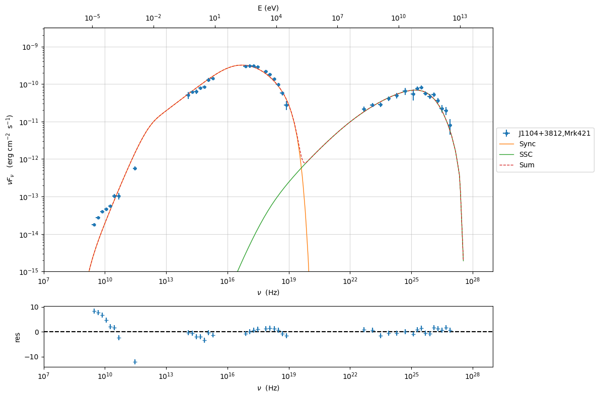

Model fitting procedure
-----------------------

.. note::
    Please, read the introduction and the caveat :ref:`for the frequentist model fitting <frequentist_model_fitting>`: to understand the frequentist fitting workflow
    see the :ref:`composite_models` user guide for further information about the implementation of :class:`.FitModel`, in particular for parameter setting

Model fitting with LSB
~~~~~~~~~~~~~~~~~~~~~~

.. code:: ipython3

    from jetset.minimizer import fit_SED,ModelMinimizer
    
    from jetset.model_manager import  FitModel
    from jetset.jet_model import Jet

.. code:: ipython3

    from jetset.jet_radio_plugin import RadioSpectrum
    radio_spectrum=RadioSpectrum()

if you want to fit the ``prefit_model`` you can load the saved one (this
allows you to save time) ad pass it to the ``FitModel`` class

.. code:: ipython3

    prefit_jet=Jet.load_model('prefit_jet.pkl')
    fit_model=FitModel( jet=prefit_jet, name='SSC-best-fit-lsb',template=None) 

.. code:: ipython3

    fit_model.add_component(radio_spectrum)

OR use the one generated above

.. code:: ipython3

    fit_model.show_model_components()

.. parsed-literal::

    
    --------------------------------------------------------------------------------
    Composite model description
    --------------------------------------------------------------------------------
    name: SSC-best-fit-lsb  
    type: composite_model  
    components models:
     -model name: jet_leptonic model type: jet
     -model name: radio_spectrum model type: radio_spectrum
    
    --------------------------------------------------------------------------------

There are now two components: ``jet_leptonic`` and ``radio_spectrum``

We now set the gamma grid size to 200, ad we set ``composite_expr``,
anyhow, since we have only one component this step could be skipped

.. code:: ipython3

    fit_model.jet_leptonic.set_gamma_grid_size(200)
    fit_model.composite_expr='(jet_leptonic+radio_spectrum)'

.. code:: ipython3

    fit_model.parameters

.. raw:: html

    <i>Table length=16</i>
    <table id="table6400160496-536700" class="table-striped table-bordered table-condensed">
    <thead><tr><th>model name</th><th>name</th><th>par type</th><th>units</th><th>val</th><th>phys. bound. min</th><th>phys. bound. max</th><th>log</th><th>frozen</th></tr></thead>
    <tr><td>jet_leptonic</td><td>gmin</td><td>low-energy-cut-off</td><td>lorentz-factor*</td><td>4.697542e+02</td><td>1.000000e+00</td><td>1.000000e+09</td><td>False</td><td>False</td></tr>
    <tr><td>jet_leptonic</td><td>gmax</td><td>high-energy-cut-off</td><td>lorentz-factor*</td><td>1.300733e+06</td><td>1.000000e+00</td><td>1.000000e+15</td><td>False</td><td>False</td></tr>
    <tr><td>jet_leptonic</td><td>N</td><td>emitters_density</td><td>1 / cm3</td><td>6.119093e-01</td><td>0.000000e+00</td><td>--</td><td>False</td><td>False</td></tr>
    <tr><td>jet_leptonic</td><td>gamma0_log_parab</td><td>turn-over-energy</td><td>lorentz-factor*</td><td>3.290961e+04</td><td>1.000000e+00</td><td>1.000000e+09</td><td>False</td><td>False</td></tr>
    <tr><td>jet_leptonic</td><td>s</td><td>LE_spectral_slope</td><td></td><td>2.169388e+00</td><td>-1.000000e+01</td><td>1.000000e+01</td><td>False</td><td>False</td></tr>
    <tr><td>jet_leptonic</td><td>r</td><td>spectral_curvature</td><td></td><td>7.818737e-01</td><td>-1.500000e+01</td><td>1.500000e+01</td><td>False</td><td>False</td></tr>
    <tr><td>jet_leptonic</td><td>R</td><td>region_size</td><td>cm</td><td>3.452668e+16</td><td>1.000000e+03</td><td>1.000000e+30</td><td>False</td><td>False</td></tr>
    <tr><td>jet_leptonic</td><td>R_H</td><td>region_position</td><td>cm</td><td>1.000000e+17</td><td>0.000000e+00</td><td>--</td><td>False</td><td>True</td></tr>
    <tr><td>jet_leptonic</td><td>B</td><td>magnetic_field</td><td>gauss</td><td>5.050000e-02</td><td>0.000000e+00</td><td>--</td><td>False</td><td>False</td></tr>
    <tr><td>jet_leptonic</td><td>NH_cold_to_rel_e</td><td>cold_p_to_rel_e_ratio</td><td></td><td>1.000000e+00</td><td>0.000000e+00</td><td>--</td><td>False</td><td>True</td></tr>
    <tr><td>jet_leptonic</td><td>beam_obj</td><td>beaming</td><td></td><td>2.500000e+01</td><td>1.000000e-04</td><td>--</td><td>False</td><td>False</td></tr>
    <tr><td>jet_leptonic</td><td>z_cosm</td><td>redshift</td><td></td><td>3.080000e-02</td><td>0.000000e+00</td><td>--</td><td>False</td><td>False</td></tr>
    <tr><td>radio_spectrum</td><td>alpha_radio</td><td>spectral-slope</td><td></td><td>0.000000e+00</td><td>-1.000000e+01</td><td>1.000000e+01</td><td>False</td><td>False</td></tr>
    <tr><td>radio_spectrum</td><td>nu_ssa</td><td>turn-over freq</td><td>Hz</td><td>1.000000e+10</td><td>1.000000e+06</td><td>1.000000e+12</td><td>False</td><td>False</td></tr>
    <tr><td>radio_spectrum</td><td>nu_cut</td><td></td><td>Hz</td><td>1.000000e+11</td><td>1.000000e+06</td><td>1.000000e+13</td><td>False</td><td>False</td></tr>
    <tr><td>radio_spectrum</td><td>nuFnu_p</td><td>flux-const</td><td>cm2 erg / s</td><td>1.000000e-13</td><td>1.000000e-30</td><td>1.000000e-05</td><td>False</td><td>False</td></tr>
    </table>
    

.. parsed-literal::

    None

Freezeing parameters and setting fit_range intervals
^^^^^^^^^^^^^^^^^^^^^^^^^^^^^^^^^^^^^^^^^^^^^^^^^^^^

These methods are alternative and equivalent ways to access a model
component for setting parameters state and values

a) passing as first argument, of the method, the model component
   ``name``

b) passing as first argument, of the method, the model component
   ``object``

c) accessing the model component member of the composite model class

.. code:: ipython3

    #a
    fit_model.freeze('jet_leptonic','z_cosm')
    fit_model.freeze('jet_leptonic','R_H')
    #b
    fit_model.freeze(prefit_jet,'R')
    #c
    fit_model.jet_leptonic.parameters.R.fit_range=[10**15.5,10**17.5]
    fit_model.jet_leptonic.parameters.beam_obj.fit_range=[5., 50.]
    
    fit_model.radio_spectrum.parameters.nuFnu_p.fit_range=[1E-14, 1E-12]
    

Building the ModelMinimizer object
^^^^^^^^^^^^^^^^^^^^^^^^^^^^^^^^^^

.. code:: ipython3

    model_minimizer=ModelMinimizer('minuit')

**Since the pre-fit model was very close to the data, we degrade the
model in order to provide a more robust benchmark to the fitter, but
this is not required!!!**

.. code:: ipython3

    fit_model.jet_leptonic.parameters.N.val=1
    fit_model.jet_leptonic.parameters.r.val=1.0
    fit_model.jet_leptonic.parameters.beam_obj.val=20
    fit_model.eval()

.. code:: ipython3

    %matplotlib inline
    fit_model.set_nu_grid(1E6,1E30,200)
    fit_model.eval()
    p2=fit_model.plot_model(sed_data=sed_data)
    p2.setlim(y_min=1E-14,x_min=1E6,x_max=2E28)

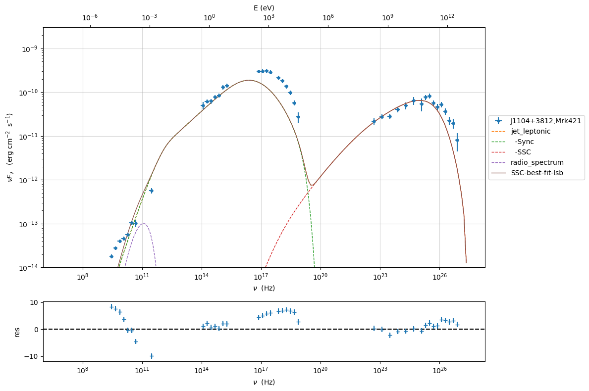

.. code:: ipython3

    best_fit_res=model_minimizer.fit(fit_model,
                                         sed_data,
                                         1E7,
                                         1E29,
                                         fitname='SSC-best-fit-minuit',
                                         repeat=1)

.. parsed-literal::

    filtering data in fit range = [1.000000e+07,1.000000e+29]
    data length 41
    ================================================================================
    
    *** start fit process ***
    ----- 

.. parsed-literal::

    0it [00:00, ?it/s]

.. parsed-literal::

    - best chisq=2.72611e+01
    
    -------------------------------------------------------------------------
    Fit report
    
    Model: SSC-best-fit-minuit

.. raw:: html

    <i>Table length=16</i>
    <table id="table13342236528-876122" class="table-striped table-bordered table-condensed">
    <thead><tr><th>model name</th><th>name</th><th>par type</th><th>units</th><th>val</th><th>phys. bound. min</th><th>phys. bound. max</th><th>log</th><th>frozen</th></tr></thead>
    <tr><td>jet_leptonic</td><td>gmin</td><td>low-energy-cut-off</td><td>lorentz-factor*</td><td>1.136575e+03</td><td>1.000000e+00</td><td>1.000000e+09</td><td>False</td><td>False</td></tr>
    <tr><td>jet_leptonic</td><td>gmax</td><td>high-energy-cut-off</td><td>lorentz-factor*</td><td>1.181852e+09</td><td>1.000000e+00</td><td>1.000000e+15</td><td>False</td><td>False</td></tr>
    <tr><td>jet_leptonic</td><td>N</td><td>emitters_density</td><td>1 / cm3</td><td>3.377911e-01</td><td>0.000000e+00</td><td>--</td><td>False</td><td>False</td></tr>
    <tr><td>jet_leptonic</td><td>gamma0_log_parab</td><td>turn-over-energy</td><td>lorentz-factor*</td><td>1.372569e+05</td><td>1.000000e+00</td><td>1.000000e+09</td><td>False</td><td>False</td></tr>
    <tr><td>jet_leptonic</td><td>s</td><td>LE_spectral_slope</td><td></td><td>2.390215e+00</td><td>-1.000000e+01</td><td>1.000000e+01</td><td>False</td><td>False</td></tr>
    <tr><td>jet_leptonic</td><td>r</td><td>spectral_curvature</td><td></td><td>1.693948e+00</td><td>-1.500000e+01</td><td>1.500000e+01</td><td>False</td><td>False</td></tr>
    <tr><td>jet_leptonic</td><td>R</td><td>region_size</td><td>cm</td><td>3.452668e+16</td><td>1.000000e+03</td><td>1.000000e+30</td><td>False</td><td>True</td></tr>
    <tr><td>jet_leptonic</td><td>R_H</td><td>region_position</td><td>cm</td><td>1.000000e+17</td><td>0.000000e+00</td><td>--</td><td>False</td><td>True</td></tr>
    <tr><td>jet_leptonic</td><td>B</td><td>magnetic_field</td><td>gauss</td><td>3.965059e-02</td><td>0.000000e+00</td><td>--</td><td>False</td><td>False</td></tr>
    <tr><td>jet_leptonic</td><td>NH_cold_to_rel_e</td><td>cold_p_to_rel_e_ratio</td><td></td><td>1.000000e+00</td><td>0.000000e+00</td><td>--</td><td>False</td><td>True</td></tr>
    <tr><td>jet_leptonic</td><td>beam_obj</td><td>beaming</td><td></td><td>2.621689e+01</td><td>1.000000e-04</td><td>--</td><td>False</td><td>False</td></tr>
    <tr><td>jet_leptonic</td><td>z_cosm</td><td>redshift</td><td></td><td>3.080000e-02</td><td>0.000000e+00</td><td>--</td><td>False</td><td>True</td></tr>
    <tr><td>radio_spectrum</td><td>alpha_radio</td><td>spectral-slope</td><td></td><td>7.964224e-01</td><td>-1.000000e+01</td><td>1.000000e+01</td><td>False</td><td>False</td></tr>
    <tr><td>radio_spectrum</td><td>nu_ssa</td><td>turn-over freq</td><td>Hz</td><td>8.500844e+08</td><td>1.000000e+06</td><td>1.000000e+12</td><td>False</td><td>False</td></tr>
    <tr><td>radio_spectrum</td><td>nu_cut</td><td></td><td>Hz</td><td>3.510080e+11</td><td>1.000000e+06</td><td>1.000000e+13</td><td>False</td><td>False</td></tr>
    <tr><td>radio_spectrum</td><td>nuFnu_p</td><td>flux-const</td><td>cm2 erg / s</td><td>3.845276e-14</td><td>1.000000e-30</td><td>1.000000e-05</td><td>False</td><td>False</td></tr>
    </table>
    

.. parsed-literal::

    
    converged=True
    calls=5065
    mesg=

.. raw:: html

    <table>
        <tr>
            <th colspan="2" style="text-align:center" title="Minimizer"> Migrad </th>
        </tr>
        <tr>
            <td style="text-align:left" title="Minimum value of function"> FCN = 27.26 </td>
            <td style="text-align:center" title="Total number of function and (optional) gradient evaluations"> Nfcn = 5065 </td>
        </tr>
        <tr>
            <td style="text-align:left" title="Estimated distance to minimum and goal"> EDM = 0.000153 (Goal: 0.0002) </td>
            <td style="text-align:center" title="Total run time of algorithms"> time = 18.1 sec </td>
        </tr>
        <tr>
            <td style="text-align:center;background-color:#92CCA6;color:black"> Valid Minimum </td>
            <td style="text-align:center;background-color:#92CCA6;color:black"> Below EDM threshold (goal x 10) </td>
        </tr>
        <tr>
            <td style="text-align:center;background-color:#92CCA6;color:black"> No parameters at limit </td>
            <td style="text-align:center;background-color:#92CCA6;color:black"> Below call limit </td>
        </tr>
        <tr>
            <td style="text-align:center;background-color:#FFF79A;color:black"> Hesse ok </td>
            <td style="text-align:center;background-color:#FFF79A;color:black"> Covariance FORCED pos. def. </td>
        </tr>
    </table><table>
        <tr>
            <td></td>
            <th title="Variable name"> Name </th>
            <th title="Value of parameter"> Value </th>
            <th title="Hesse error"> Hesse Error </th>
            <th title="Minos lower error"> Minos Error- </th>
            <th title="Minos upper error"> Minos Error+ </th>
            <th title="Lower limit of the parameter"> Limit- </th>
            <th title="Upper limit of the parameter"> Limit+ </th>
            <th title="Is the parameter fixed in the fit"> Fixed </th>
        </tr>
        <tr>
            <th> 0 </th>
            <td> par_0 </td>
            <td> 1.14e3 </td>
            <td> 0.05e3 </td>
            <td>  </td>
            <td>  </td>
            <td> 1 </td>
            <td> 1E+09 </td>
            <td>  </td>
        </tr>
        <tr>
            <th> 1 </th>
            <td> par_1 </td>
            <td> 1.18e9 </td>
            <td> 0.05e9 </td>
            <td>  </td>
            <td>  </td>
            <td> 1 </td>
            <td> 1E+15 </td>
            <td>  </td>
        </tr>
        <tr>
            <th> 2 </th>
            <td> par_2 </td>
            <td> 0.34 </td>
            <td> 0.05 </td>
            <td>  </td>
            <td>  </td>
            <td> 0 </td>
            <td>  </td>
            <td>  </td>
        </tr>
        <tr>
            <th> 3 </th>
            <td> par_3 </td>
            <td> 0.137e6 </td>
            <td> 0.011e6 </td>
            <td>  </td>
            <td>  </td>
            <td> 1 </td>
            <td> 1E+09 </td>
            <td>  </td>
        </tr>
        <tr>
            <th> 4 </th>
            <td> par_4 </td>
            <td> 2.390 </td>
            <td> 0.034 </td>
            <td>  </td>
            <td>  </td>
            <td> -10 </td>
            <td> 10 </td>
            <td>  </td>
        </tr>
        <tr>
            <th> 5 </th>
            <td> par_5 </td>
            <td> 1.69 </td>
            <td> 0.28 </td>
            <td>  </td>
            <td>  </td>
            <td> -15 </td>
            <td> 15 </td>
            <td>  </td>
        </tr>
        <tr>
            <th> 6 </th>
            <td> par_6 </td>
            <td> 0.0397 </td>
            <td> 0.0014 </td>
            <td>  </td>
            <td>  </td>
            <td> 0 </td>
            <td>  </td>
            <td>  </td>
        </tr>
        <tr>
            <th> 7 </th>
            <td> par_7 </td>
            <td> 26.2 </td>
            <td> 0.6 </td>
            <td>  </td>
            <td>  </td>
            <td> 5 </td>
            <td> 50 </td>
            <td>  </td>
        </tr>
        <tr>
            <th> 8 </th>
            <td> par_8 </td>
            <td> 0.80 </td>
            <td> 0.04 </td>
            <td>  </td>
            <td>  </td>
            <td> -10 </td>
            <td> 10 </td>
            <td>  </td>
        </tr>
        <tr>
            <th> 9 </th>
            <td> par_9 </td>
            <td> 0.85e9 </td>
            <td> 0.19e9 </td>
            <td>  </td>
            <td>  </td>
            <td> 1E+06 </td>
            <td> 1E+12 </td>
            <td>  </td>
        </tr>
        <tr>
            <th> 10 </th>
            <td> par_10 </td>
            <td> 0.35e12 </td>
            <td> 0.27e12 </td>
            <td>  </td>
            <td>  </td>
            <td> 1E+06 </td>
            <td> 1E+13 </td>
            <td>  </td>
        </tr>
        <tr>
            <th> 11 </th>
            <td> par_11 </td>
            <td> 38e-15 </td>
            <td> 5e-15 </td>
            <td>  </td>
            <td>  </td>
            <td> 1E-14 </td>
            <td> 1E-12 </td>
            <td>  </td>
        </tr>
    </table>

.. parsed-literal::

    dof=29
    chisq=27.261073, chisq/red=0.940037 null hypothesis sig=0.557622
    
    best fit pars

.. raw:: html

    <i>Table length=16</i>
    <table id="table13342241328-263138" class="table-striped table-bordered table-condensed">
    <thead><tr><th>model name</th><th>name</th><th>val</th><th>bestfit val</th><th>err +</th><th>err -</th><th>start val</th><th>fit range min</th><th>fit range max</th><th>frozen</th></tr></thead>
    <tr><td>jet_leptonic</td><td>gmin</td><td>1.136575e+03</td><td>1.136575e+03</td><td>4.533491e+01</td><td>--</td><td>4.697542e+02</td><td>1.000000e+00</td><td>1.000000e+09</td><td>False</td></tr>
    <tr><td>jet_leptonic</td><td>gmax</td><td>1.181852e+09</td><td>1.181852e+09</td><td>5.288164e+07</td><td>--</td><td>1.300733e+06</td><td>1.000000e+00</td><td>1.000000e+15</td><td>False</td></tr>
    <tr><td>jet_leptonic</td><td>N</td><td>3.377911e-01</td><td>3.377911e-01</td><td>4.790515e-02</td><td>--</td><td>1.000000e+00</td><td>0.000000e+00</td><td>--</td><td>False</td></tr>
    <tr><td>jet_leptonic</td><td>gamma0_log_parab</td><td>1.372569e+05</td><td>1.372569e+05</td><td>1.130276e+04</td><td>--</td><td>3.290961e+04</td><td>1.000000e+00</td><td>1.000000e+09</td><td>False</td></tr>
    <tr><td>jet_leptonic</td><td>s</td><td>2.390215e+00</td><td>2.390215e+00</td><td>3.394008e-02</td><td>--</td><td>2.169388e+00</td><td>-1.000000e+01</td><td>1.000000e+01</td><td>False</td></tr>
    <tr><td>jet_leptonic</td><td>r</td><td>1.693948e+00</td><td>1.693948e+00</td><td>2.772093e-01</td><td>--</td><td>1.000000e+00</td><td>-1.500000e+01</td><td>1.500000e+01</td><td>False</td></tr>
    <tr><td>jet_leptonic</td><td>R</td><td>3.452668e+16</td><td>--</td><td>--</td><td>--</td><td>3.452668e+16</td><td>3.162278e+15</td><td>3.162278e+17</td><td>True</td></tr>
    <tr><td>jet_leptonic</td><td>R_H</td><td>1.000000e+17</td><td>--</td><td>--</td><td>--</td><td>1.000000e+17</td><td>0.000000e+00</td><td>--</td><td>True</td></tr>
    <tr><td>jet_leptonic</td><td>B</td><td>3.965059e-02</td><td>3.965059e-02</td><td>1.417437e-03</td><td>--</td><td>5.050000e-02</td><td>0.000000e+00</td><td>--</td><td>False</td></tr>
    <tr><td>jet_leptonic</td><td>NH_cold_to_rel_e</td><td>1.000000e+00</td><td>--</td><td>--</td><td>--</td><td>1.000000e+00</td><td>0.000000e+00</td><td>--</td><td>True</td></tr>
    <tr><td>jet_leptonic</td><td>beam_obj</td><td>2.621689e+01</td><td>2.621689e+01</td><td>5.873150e-01</td><td>--</td><td>2.000000e+01</td><td>5.000000e+00</td><td>5.000000e+01</td><td>False</td></tr>
    <tr><td>jet_leptonic</td><td>z_cosm</td><td>3.080000e-02</td><td>--</td><td>--</td><td>--</td><td>3.080000e-02</td><td>0.000000e+00</td><td>--</td><td>True</td></tr>
    <tr><td>radio_spectrum</td><td>alpha_radio</td><td>7.964224e-01</td><td>7.964224e-01</td><td>4.121456e-02</td><td>--</td><td>0.000000e+00</td><td>-1.000000e+01</td><td>1.000000e+01</td><td>False</td></tr>
    <tr><td>radio_spectrum</td><td>nu_ssa</td><td>8.500844e+08</td><td>8.500844e+08</td><td>1.873484e+08</td><td>--</td><td>1.000000e+10</td><td>1.000000e+06</td><td>1.000000e+12</td><td>False</td></tr>
    <tr><td>radio_spectrum</td><td>nu_cut</td><td>3.510080e+11</td><td>3.510080e+11</td><td>2.710103e+11</td><td>--</td><td>1.000000e+11</td><td>1.000000e+06</td><td>1.000000e+13</td><td>False</td></tr>
    <tr><td>radio_spectrum</td><td>nuFnu_p</td><td>3.845276e-14</td><td>3.845276e-14</td><td>5.469931e-15</td><td>--</td><td>1.000000e-13</td><td>1.000000e-14</td><td>1.000000e-12</td><td>False</td></tr>
    </table>
    

.. parsed-literal::

    -------------------------------------------------------------------------
    
    ================================================================================
    

.. code:: ipython3

    %matplotlib inline
    fit_model.set_nu_grid(1E6,1E30,200)
    fit_model.eval()
    p2=fit_model.plot_model(sed_data=sed_data)
    p2.setlim(y_min=1E-15,x_min=1E6,x_max=2E28)

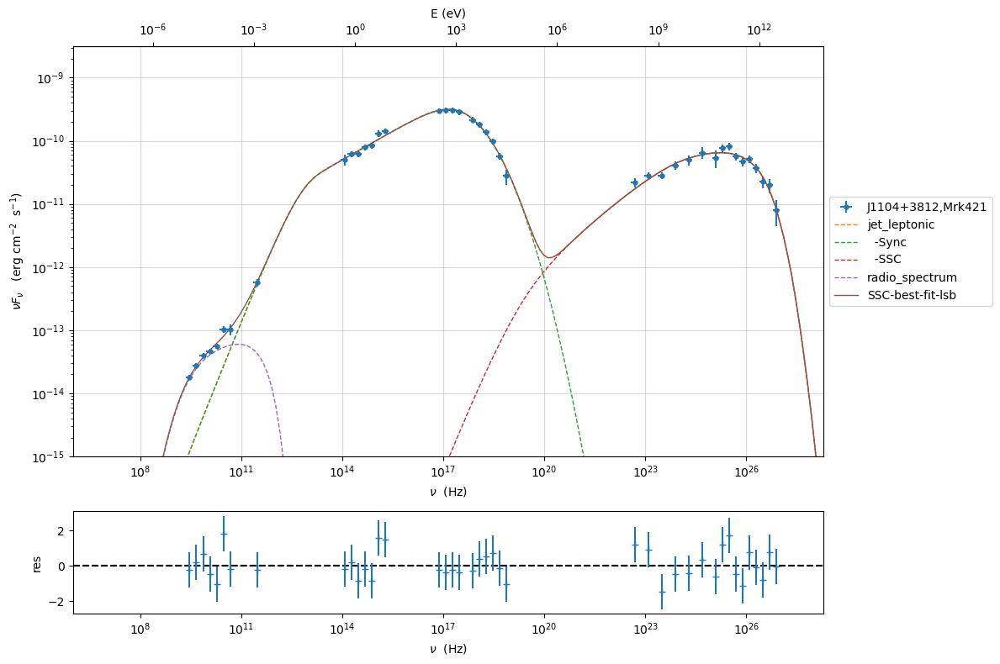

.. code:: ipython3

    p=model_minimizer.plot_corr_matrix()

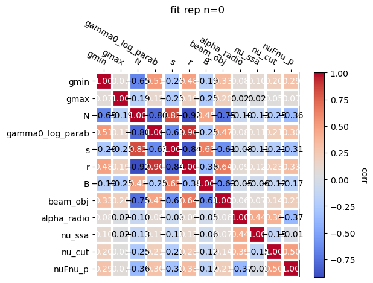

saving fit model, model minimizer
^^^^^^^^^^^^^^^^^^^^^^^^^^^^^^^^^

We can save all the fit products to be used later.

.. code:: ipython3

    
    best_fit_res.save_report('SSC-best-fit.pkl')
    model_minimizer.save_model('model_minimizer.pkl')
    fit_model.save_model('fit_model.pkl')

saving fit model, model minimizer
^^^^^^^^^^^^^^^^^^^^^^^^^^^^^^^^^

.. code:: ipython3

    best_fit.save_report('SSC-best-fit.pkl')
    model_minimizer.save_model('model_minimizer.pkl')
    fit_model.save_model('fit_model.pkl')

You can obtain profile and contours, but this is typically time
consuming. In any case, better results can be achieved using the MCMC
approach (discussed in next section). For further information regarding
minuit please refer to https://iminuit.readthedocs.io

.. code:: ipython3

    #migrad profile

    #access the data
    profile_migrad=model_minimizer_minuit.minimizer.mnprofile('s')

    #make the plot(no need to run the previous command)
    profile_plot_migrad=model_minimizer_minuit.minimizer.draw_mnprofile('s')

.. code:: ipython2

    #migrad contour
    #access the data
    contour_migrad=model_minimizer_minuit.minimizer.contour('beam_obj','B')

    #make the plot(no need to run the previous command)
    contour_plot_migrad=model_minimizer_minuit.minimizer.draw_contour('beam_obj','B')

you can use also minos contour and profile, in this case the
computational time is even longer:

.. code:: ipython3
    
   profile_migrad=model_minimizer_minuit.minimizer.mnprofile('s')
   profile_plot_migrad=model_minimizer_minuit.minimizer.draw_mnprofile('s')
        
   contour_migrad=model_minimizer_minuit.minimizer.mncontour('r','s')
   contour_plot_migrad=model_minimizer_minuit.minimizer.draw_mncontour('r','s')

MCMC sampling
-------------

.. note::
    Please, read the introduction and the caveat :ref:`for the Bayesian model fitting <bayesian_model_fitting>` to understand the MCMC sampler workflow.

creating and setting the sampler
~~~~~~~~~~~~~~~~~~~~~~~~~~~~~~~~

.. code:: ipython3

    from jetset.mcmc import McmcSampler
    from jetset.minimizer import ModelMinimizer

.. code:: ipython3

    model_minimizer = ModelMinimizer.load_model('model_minimizer.pkl')
    
    mcmc=McmcSampler(model_minimizer)

.. code:: ipython3

    labels=['N','B','beam_obj','s','gamma0_log_parab']
    model_name='jet_leptonic'
    use_labels_dict={model_name:labels}
    
    mcmc.set_labels(use_labels_dict=use_labels_dict)

.. code:: ipython3

    mcmc.set_bounds(bound=5.0,bound_rel=True)

.. parsed-literal::

    par: N  best fit value:  0.33779110271195845  mcmc bounds: [0, np.float64(2.0267466162717507)]
    par: B  best fit value:  0.0396505874846087  mcmc bounds: [0, np.float64(0.2379035249076522)]
    par: beam_obj  best fit value:  26.216890240552864  mcmc bounds: [5.0, 50.0]
    par: s  best fit value:  2.390214824875998  mcmc bounds: [np.float64(-9.560859299503992), 10]
    par: gamma0_log_parab  best fit value:  137256.91592031  mcmc bounds: [1, np.float64(823541.49552186)]

.. code:: ipython3

    mcmc.run_sampler(nwalkers=20, burnin=50,steps=500,progress='notebook')

.. parsed-literal::

    mcmc run starting
    

.. parsed-literal::

      0%|          | 0/500 [00:00<?, ?it/s]

.. parsed-literal::

    mcmc run done, with 1 threads took 42.94 seconds

plotting the posterior corner plot
~~~~~~~~~~~~~~~~~~~~~~~~~~~~~~~~~~

printout the labels

.. code:: ipython3

    mcmc.labels

.. parsed-literal::

    ['N', 'B', 'beam_obj', 's', 'gamma0_log_parab']

To have a better rendering on the scatter plot, we redefine the plot
labels

.. code:: ipython3

    mcmc.set_plot_label('N',r'$N$')
    mcmc.set_plot_label('B',r'$B$')
    mcmc.set_plot_label('beam_obj',r'$\delta$')
    mcmc.set_plot_label('s',r'$s$')
    mcmc.set_plot_label('gamma0_log_parab',r'$\gamma_0$')

the code below lets you tuning the output

1) mpl.rcParams[‘figure.dpi’] if you increase it you get a better
   definition
2) title_fmt=“.2E” this is the format for python, 2 significant digits,
   scientific notation
3) title_kwargs=dict(fontsize=12) you can change the fontsize

.. code:: ipython3

    import matplotlib as mpl
    mpl.rcParams['figure.dpi'] = 80
    f=mcmc.corner_plot(quantiles=(0.16, 0.5, 0.84),title_kwargs=dict(fontsize=12),title_fmt=".2E",use_math_text=True)

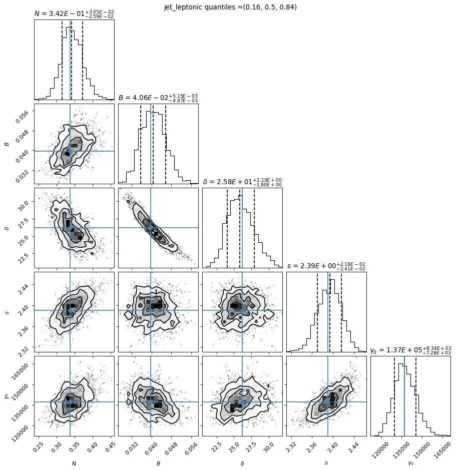

.. code:: ipython3

    print(mcmc.acceptance_fraction)

.. parsed-literal::

    0.49329999999999996

plotting the model
~~~~~~~~~~~~~~~~~~

To plot the sampled model range against the input best-fit model

.. code:: ipython3

    mpl.rcParams['figure.dpi'] = 80
    p=mcmc.plot_model(sed_data=sed_data,fit_range=[1E7,1E29],size=100)
    p.setlim(y_min=1E-14,x_min=1E6,x_max=2E28)

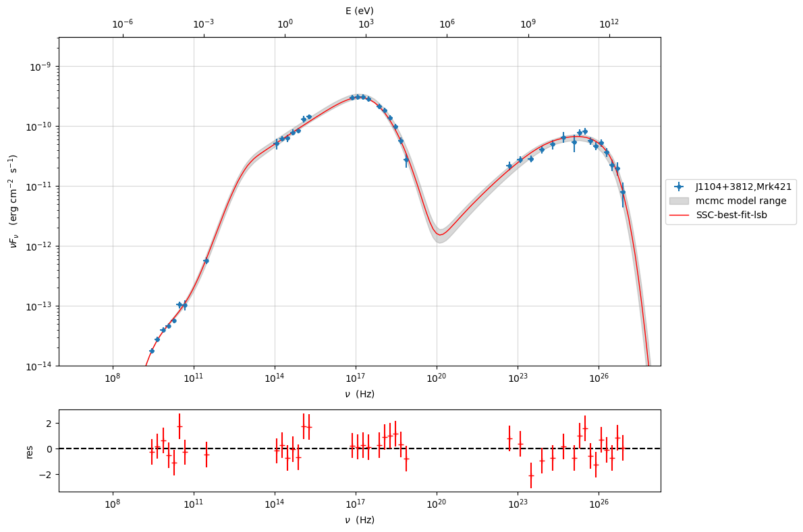

To plot the sampled model range,providing quantiles, against the input
best-fit model, providing quantiles

.. code:: ipython3

    mpl.rcParams['figure.dpi'] = 80
    p=mcmc.plot_model(sed_data=sed_data,fit_range=[1E7, 2E29],size=100,quantiles=[0.05,0.95])
    p.setlim(y_min=1E-14,x_min=1E6,x_max=2E28)

To plot the sampled model range,providing quantiles, against the mcmc
model at 0.5 quantile (``plot_mcmc_best_fit_model==True`` provides the
0.5 quantile sampled model)

.. code:: ipython3

    mpl.rcParams['figure.dpi'] = 100
    p=mcmc.plot_model(sed_data=sed_data,fit_range=[1E7, 1E29],size=100,quantiles=[0.05,0.95], plot_mcmc_best_fit_model=True)
    
    p.setlim(y_min=1E-14,x_min=1E6,x_max=2E28)

.. parsed-literal::

    ----------------------------
    MCMC best fit solution
    N: 0.33757073508257995
    B: 0.03847008564179594
    beam_obj: 26.60558676163088
    s: 2.3926602395274
    gamma0_log_parab: 138562.01249226957
    ----------------------------

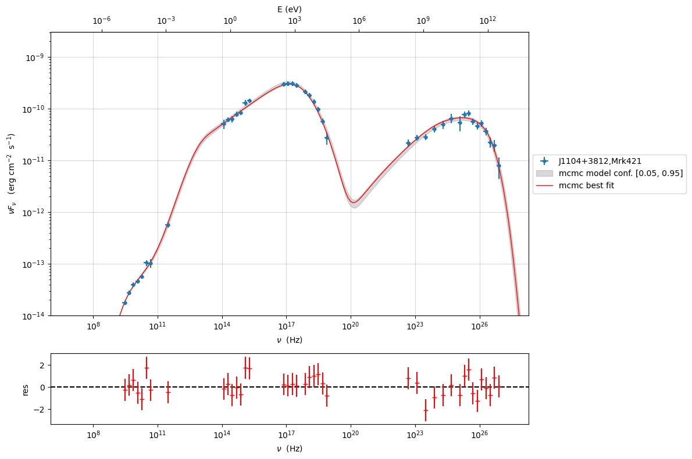

plotting chains and individual posteriors
~~~~~~~~~~~~~~~~~~~~~~~~~~~~~~~~~~~~~~~~~

.. code:: ipython3

    mpl.rcParams['figure.dpi'] = 80
    f=mcmc.plot_chain(p='s',log_plot=False)
    plt.tight_layout()

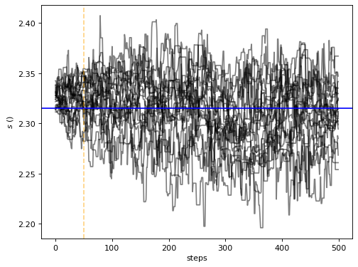

.. code:: ipython3

    mpl.rcParams['figure.dpi'] = 80
    f=mcmc.plot_chain(log_plot=False)
    plt.tight_layout()

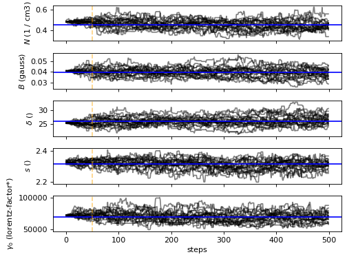

.. code:: ipython3

    
    f=mcmc.plot_par('beam_obj',figsize=(8,6))
    mpl.rcParams['figure.dpi'] = 80

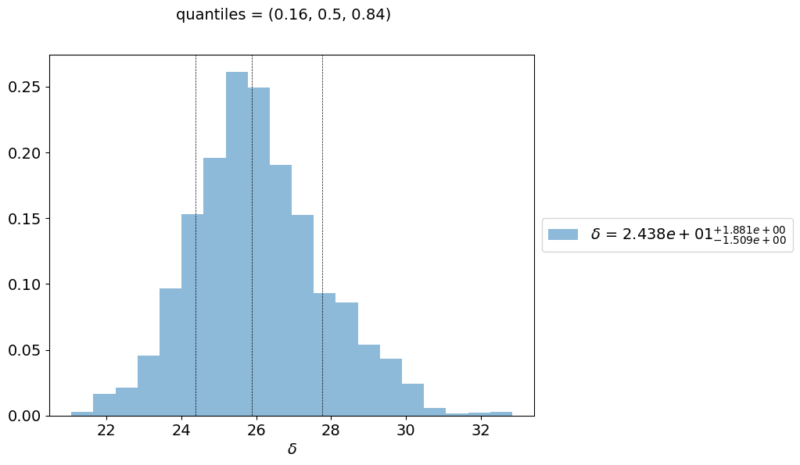

.. code:: ipython3

    mpl.rcParams['figure.dpi'] = 80
    f=mcmc.plot_par('gamma0_log_parab',log_plot=True,figsize=(8,6))

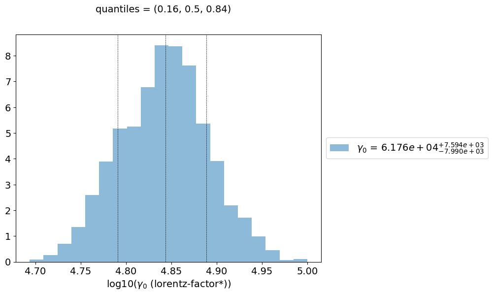

Save and reuse MCMC
-------------------

.. code:: ipython3

    mcmc.save('mcmc_sampler.pkl')

.. code:: ipython3

    from jetset.mcmc import McmcSampler
    from jetset.data_loader import ObsData
    from jetset.plot_sedfit import PlotSED
    from jetset.test_data_helper import  test_SEDs
    
    sed_data=ObsData.load('Mrk_401.pkl')
    ms=McmcSampler.load('mcmc_sampler.pkl')
    
    import matplotlib as mpl

.. parsed-literal::

    ===> setting C threads to 12
    ===> setting C threads to 12

.. code:: ipython3

    ms.model.name

.. parsed-literal::

    'SSC-best-fit-minuit'

.. code:: ipython3

    mpl.rcParams['figure.dpi'] = 80
    p=ms.plot_model(sed_data=sed_data,fit_range=[1E11, 1E29],size=100)
    p.setlim(y_min=1E-14,x_min=1E6,x_max=2E28)

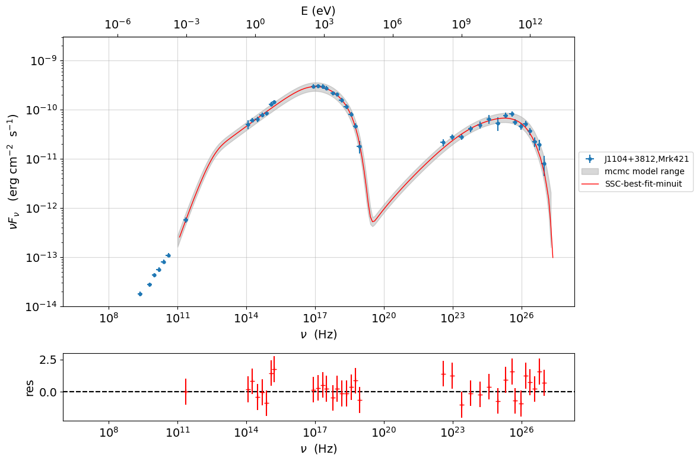

.. code:: ipython3

    mpl.rcParams['figure.dpi'] = 80
    p=ms.plot_model(sed_data=sed_data,fit_range=[1E11, 1E29],size=100,quantiles=[0.05,0.95])
    
    p.setlim(y_min=1E-14,x_min=1E6,x_max=2E28)

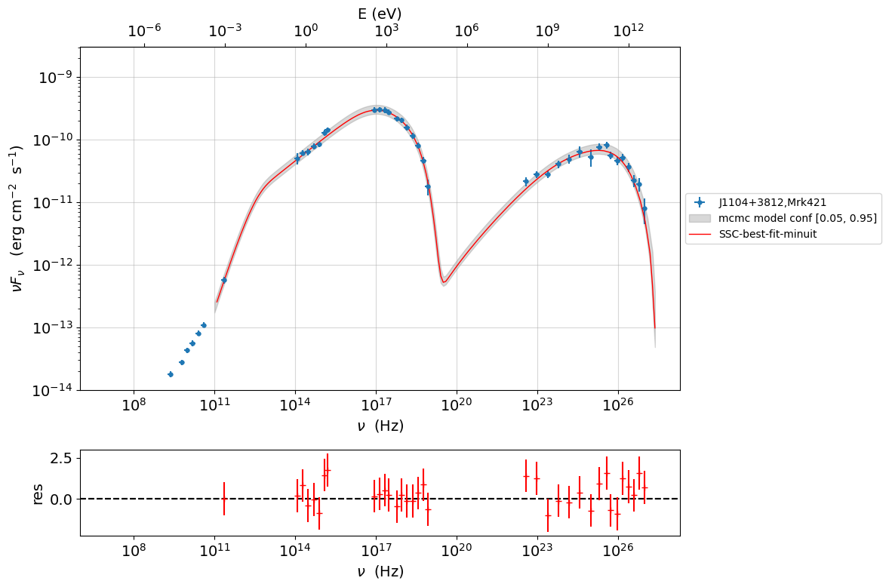

.. code:: ipython3

    mpl.rcParams['figure.dpi'] = 80
    p=ms.plot_model(sed_data=sed_data,fit_range=[1E11, 1E29],size=100,quantiles=[0.05,0.95],plot_mcmc_best_fit_model=True)
    
    p.setlim(y_min=1E-14,x_min=1E6,x_max=2E28)

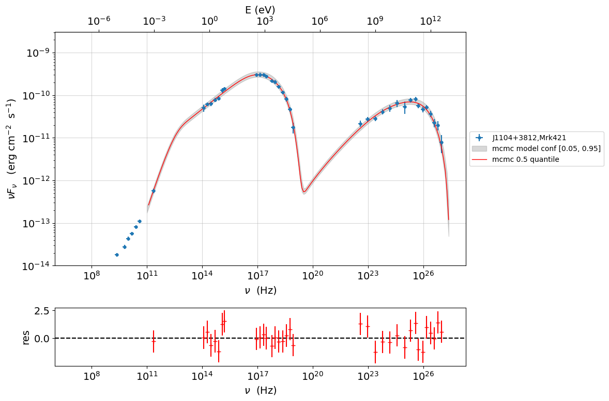

.. code:: ipython3

    mpl.rcParams['figure.dpi'] = 80
    f=ms.corner_plot(quantiles=(0.16, 0.5, 0.84),title_kwargs=dict(fontsize=12),title_fmt=".2E",use_math_text=True)

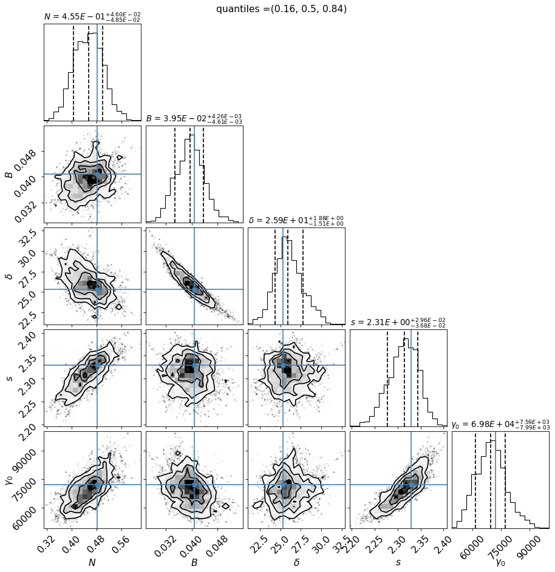

.. code:: ipython3

    mpl.rcParams['figure.dpi'] = 80
    f=ms.plot_par('beam_obj',log_plot=False,figsize=(8,6))

.. image:: Jet_example_and_radio_plugin_model_fit_files/Jet_example_and_radio_plugin_model_fit_92_0.png

.. code:: ipython3

    f=ms.plot_par('B',log_plot=True,figsize=(8,6))

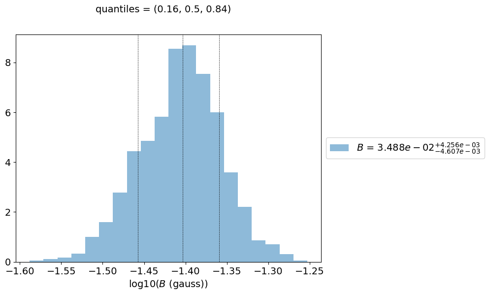

.. code:: ipython3

    mpl.rcParams['figure.dpi'] = 80
    f=ms.plot_chain(p='s',log_plot=False)
    plt.tight_layout()

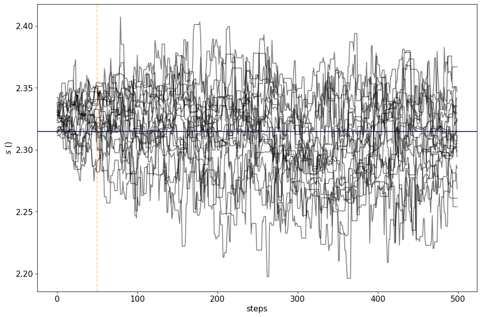

.. code:: ipython3

    f=ms.plot_chain(log_plot=False)
    plt.tight_layout()
    mpl.rcParams['figure.dpi'] = 80

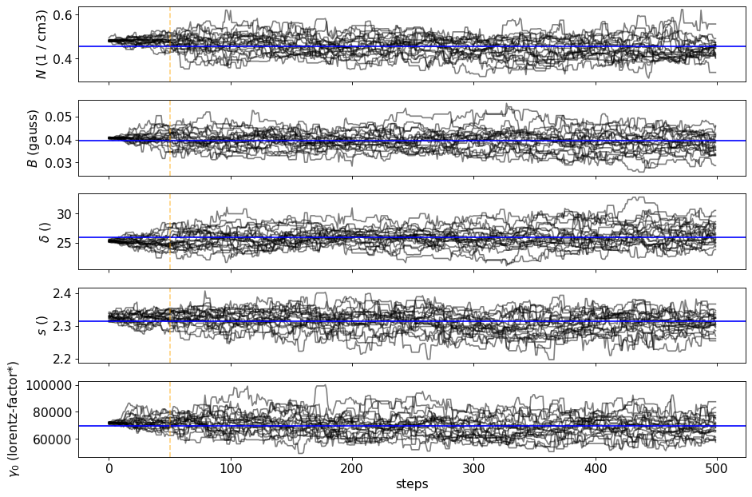

