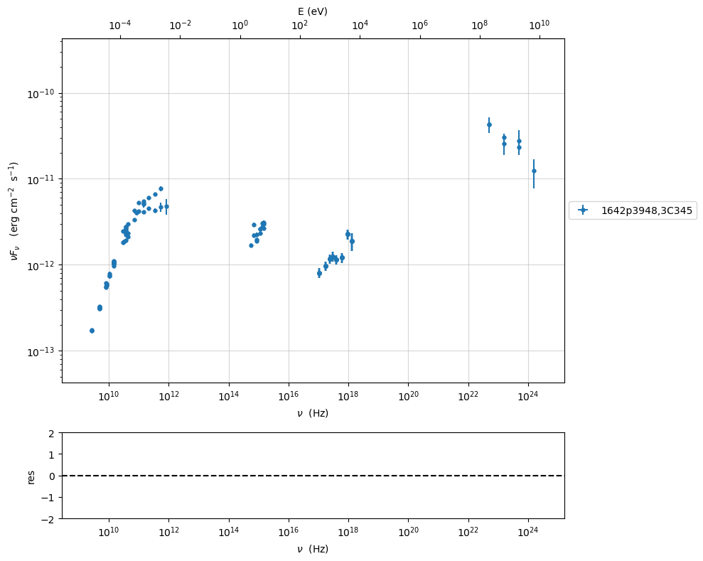
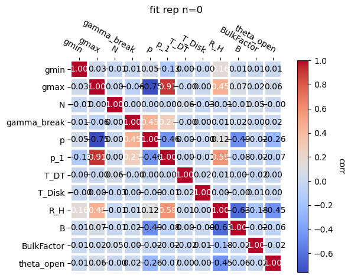
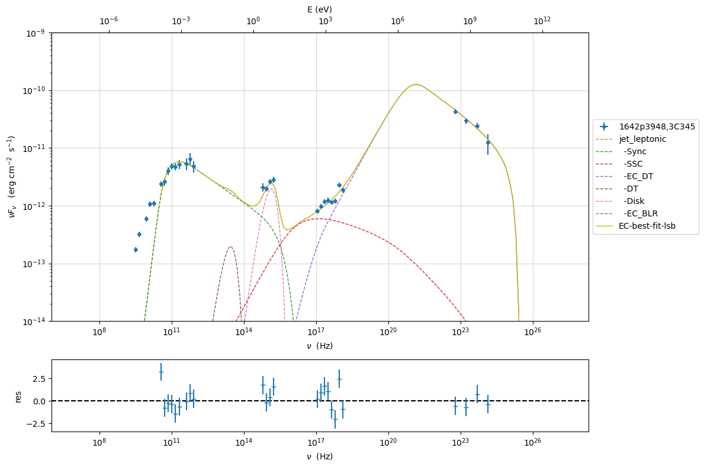
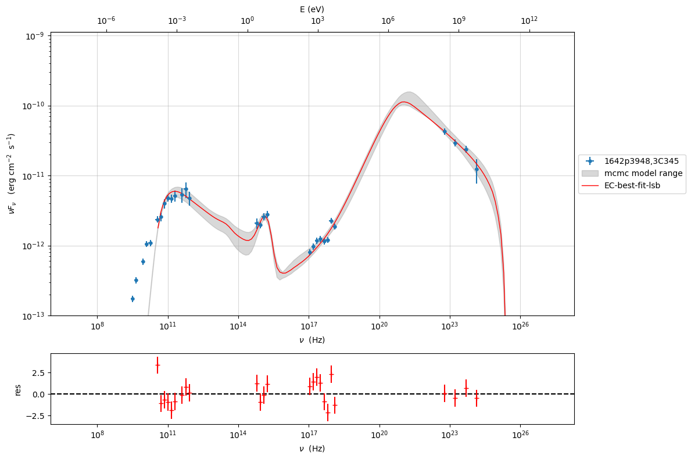
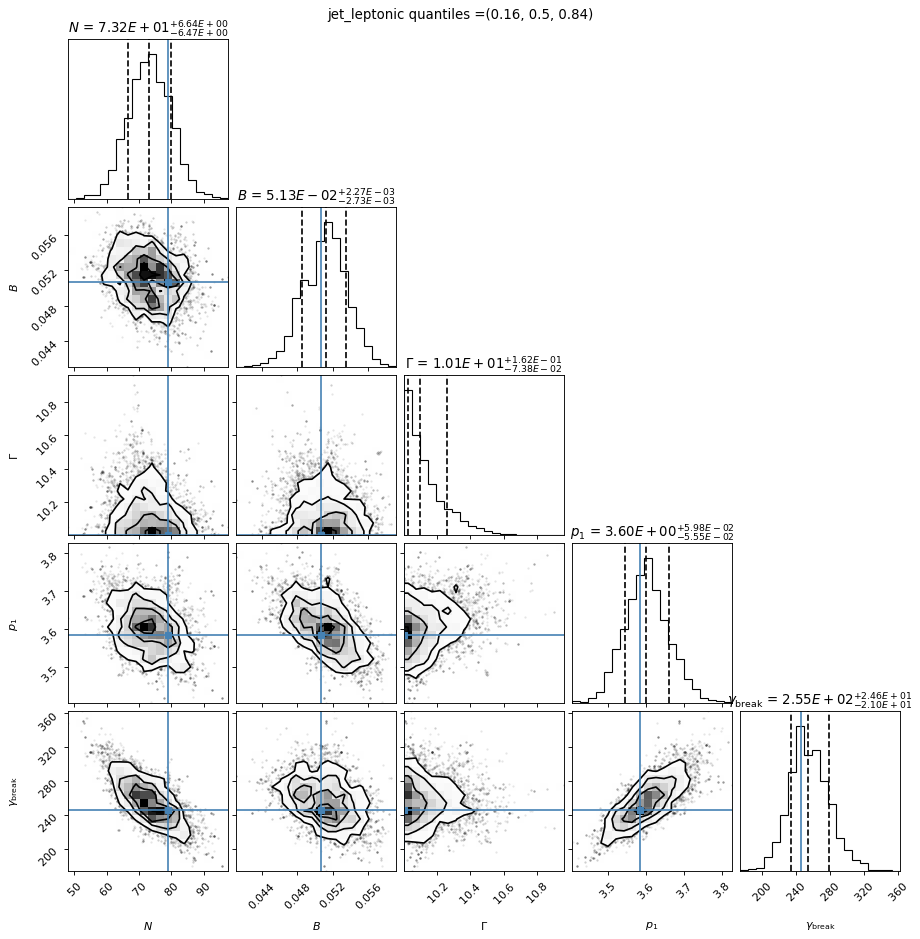
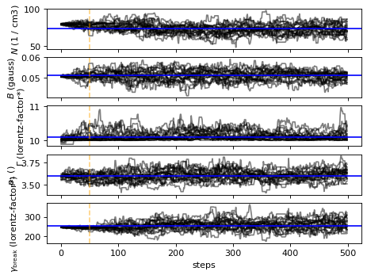
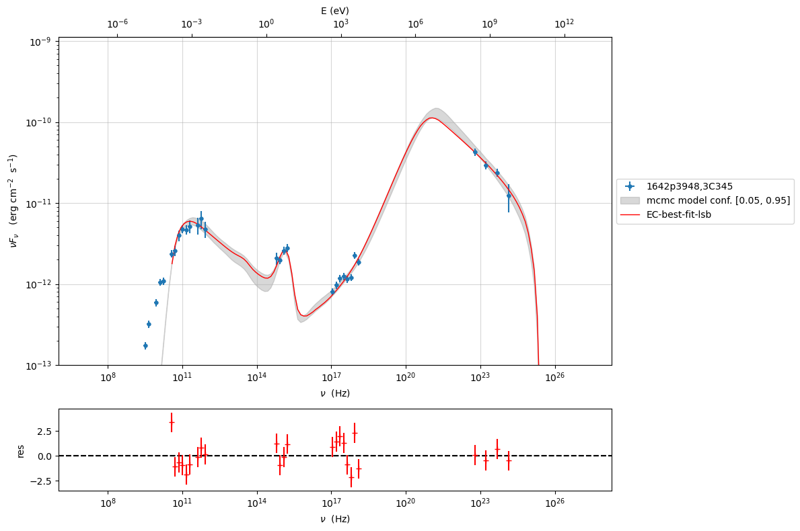
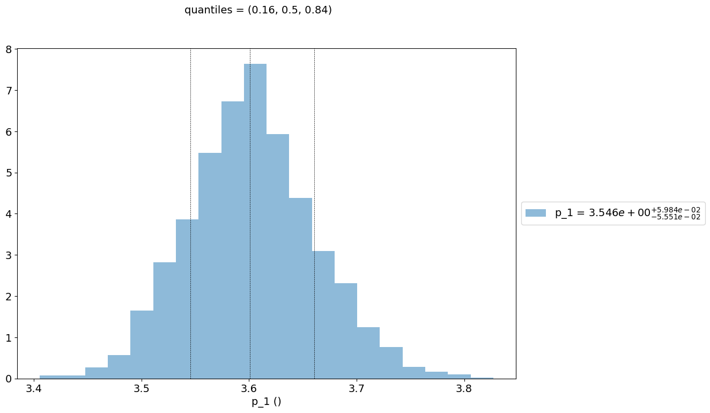

.. _model_fitting_EC:

.. code:: ipython3

    import warnings
    warnings.filterwarnings('ignore')

.. code:: ipython3

    import jetset
    print(jetset.__version__)

.. parsed-literal::

    1.4.0rc0

Model fitting 3: External Compton
=================================

Loading data
------------

see the :ref:`data_format` user guide for further information about loading data and :ref:`jet_physical_guide_EC` for the information regarding the implementation of the external Conpton model

.. code:: ipython3

    from jetset.data_loader import Data,ObsData
    from jetset.test_data_helper import  test_SEDs
    test_SEDs

.. parsed-literal::

    ['/Users/orion/miniforge3/envs/py3.12/lib/python3.12/site-packages/jetset/test_data/SEDs_data/SED_3C345.ecsv',
     '/Users/orion/miniforge3/envs/py3.12/lib/python3.12/site-packages/jetset/test_data/SEDs_data/SED_MW_Mrk421_EBL_DEABS.ecsv',
     '/Users/orion/miniforge3/envs/py3.12/lib/python3.12/site-packages/jetset/test_data/SEDs_data/SED_MW_Mrk501_EBL_ABS.ecsv',
     '/Users/orion/miniforge3/envs/py3.12/lib/python3.12/site-packages/jetset/test_data/SEDs_data/SED_MW_Mrk501_EBL_DEABS.ecsv']

.. code:: ipython3

    data=Data.from_file(test_SEDs[0])

.. code:: ipython3

    sed_data=ObsData(data_table=data)

.. code:: ipython3

    %matplotlib inline
    p=sed_data.plot_sed(show_dataset=True)

.. image:: Jet_example_model_fit_EC_files/Jet_example_model_fit_EC_9_0.png

we filter out the data set ``-1``

.. code:: ipython3

    sed_data.show_data_sets()
    sed_data.filter_data_set('-1',exclude=True)
    sed_data.filter_data_set('2',exclude=True)
    sed_data.show_data_sets()
    p=sed_data.plot_sed()

.. parsed-literal::

    current datasets
    dataset -1
    dataset 0
    dataset 1
    dataset 2
    ---> excluding  dataset/s ['-1']
    filter -1 192
    current datasets
    dataset 0
    dataset 1
    dataset 2
    ---> data sets left after filtering None
    ---> data len after filtering=192
    ---> excluding  dataset/s ['2']
    filter 2 191
    current datasets
    dataset 0
    dataset 1
    ---> data sets left after filtering None
    ---> data len after filtering=191
    current datasets
    dataset 0
    dataset 1

.. code:: ipython3

    sed_data.group_data(bin_width=.15)
    sed_data.add_systematics(0.1,[10.**6,10.**29])
    #sed_data.add_systematics(0.05,[10.**19,10.**30])
    
    p=sed_data.plot_sed()

.. parsed-literal::

    ================================================================================
    
    ***  binning data  ***
    ---> N bins= 98
    ---> bin_width= 0.15
    ================================================================================
    

.. image:: Jet_example_model_fit_EC_files/Jet_example_model_fit_EC_12_1.png

.. code:: ipython3

    sed_data.save('3C454_data.pkl')

Phenomenological model constraining
-----------------------------------

see the :ref:`phenom_constr` user guide for further information about phenomenological model constraining

.. code:: ipython3

    from jetset.sed_shaper import  SEDShape
    my_shape=SEDShape(sed_data)
    my_shape.eval_indices(silent=True)
    p=my_shape.plot_indices()
    p.setlim(y_min=1E-15,y_max=1E-9)

.. parsed-literal::

    ================================================================================
    
    *** evaluating spectral indices for data ***
    ================================================================================
    

.. image:: Jet_example_model_fit_EC_files/Jet_example_model_fit_EC_16_1.png

for the synchrotron sed_shaping we include the check for Big Blue Bump
(BBB) component. Moreover, we force the model to use a pure
log-parabolic function and not a log-cubic one in order to get a better
estimation of the BBB component. The fit values of the BBB component
will be used in the ``ObsConstrain`` to guess the accretion disk
luminosity and temperature

.. code:: ipython3

    mm,best_fit=my_shape.sync_fit(check_BBB_template=True,
                                  check_host_gal_template=False,
                                  use_log_par=True,
                                  Ep_start=None,
                                  minimizer='lsb',
                                  silent=True,
                                  fit_range=[9,16])

.. parsed-literal::

    ================================================================================
    
    *** Log-Polynomial fitting of the synchrotron component ***
    ---> first blind fit run,  fit range: [9, 16]
    --> class:  LSP
    
    --> class:  LSP
    
    

.. raw:: html

    <i>Table length=5</i>
    <table id="table6253135824-781415" class="table-striped table-bordered table-condensed">
    <thead><tr><th>model name</th><th>name</th><th>val</th><th>bestfit val</th><th>err +</th><th>err -</th><th>start val</th><th>fit range min</th><th>fit range max</th><th>frozen</th></tr></thead>
    <tr><td>LogParabolaEp</td><td>b</td><td>-3.175784e-01</td><td>-3.175784e-01</td><td>3.360071e-02</td><td>--</td><td>-1.560612e-01</td><td>-1.000000e+01</td><td>0.000000e+00</td><td>False</td></tr>
    <tr><td>LogParabolaEp</td><td>Ep</td><td>1.167956e+01</td><td>1.167956e+01</td><td>1.276551e-01</td><td>--</td><td>1.286767e+01</td><td>0.000000e+00</td><td>3.000000e+01</td><td>False</td></tr>
    <tr><td>LogParabolaEp</td><td>Sp</td><td>-1.123620e+01</td><td>-1.123620e+01</td><td>4.508176e-02</td><td>--</td><td>-1.087583e+01</td><td>-3.000000e+01</td><td>0.000000e+00</td><td>False</td></tr>
    <tr><td>BBB</td><td>nuFnu_p_BBB</td><td>-1.156569e+01</td><td>-1.156569e+01</td><td>2.922407e-02</td><td>--</td><td>-1.087583e+01</td><td>-1.287583e+01</td><td>-8.875830e+00</td><td>False</td></tr>
    <tr><td>BBB</td><td>nu_scale</td><td>8.865060e-03</td><td>8.865060e-03</td><td>3.068567e-03</td><td>--</td><td>0.000000e+00</td><td>-5.000000e-01</td><td>5.000000e-01</td><td>False</td></tr>
    </table>
    

.. parsed-literal::

    ---> sync       nu_p=+1.167956e+01 (err=+1.276551e-01)  nuFnu_p=-1.123620e+01 (err=+4.508176e-02) curv.=-3.175784e-01 (err=+3.360071e-02)
    ================================================================================
    

.. code:: ipython3

    my_shape.IC_fit(fit_range=[16,26],minimizer='minuit', silent=True)
    p=my_shape.plot_shape_fit()
    p.setlim(y_min=1E-15)

.. parsed-literal::

    ================================================================================
    
    *** Log-Polynomial fitting of the IC component ***
    ---> fit range: [16, 26]
    ---> LogCubic fit
    
    

.. raw:: html

    <i>Table length=4</i>
    <table id="table6289711488-772408" class="table-striped table-bordered table-condensed">
    <thead><tr><th>model name</th><th>name</th><th>val</th><th>bestfit val</th><th>err +</th><th>err -</th><th>start val</th><th>fit range min</th><th>fit range max</th><th>frozen</th></tr></thead>
    <tr><td>LogCubic</td><td>b</td><td>-1.332092e-01</td><td>-1.332092e-01</td><td>1.457860e-02</td><td>--</td><td>-1.000000e+00</td><td>-1.000000e+01</td><td>0.000000e+00</td><td>False</td></tr>
    <tr><td>LogCubic</td><td>c</td><td>-1.353282e-02</td><td>-1.353282e-02</td><td>2.466152e-03</td><td>--</td><td>-1.000000e+00</td><td>-1.000000e+01</td><td>1.000000e+01</td><td>False</td></tr>
    <tr><td>LogCubic</td><td>Ep</td><td>2.229988e+01</td><td>2.229988e+01</td><td>1.125980e-01</td><td>--</td><td>2.228823e+01</td><td>0.000000e+00</td><td>3.000000e+01</td><td>False</td></tr>
    <tr><td>LogCubic</td><td>Sp</td><td>-1.035577e+01</td><td>-1.035577e+01</td><td>5.105193e-02</td><td>--</td><td>-1.000000e+01</td><td>-3.000000e+01</td><td>0.000000e+00</td><td>False</td></tr>
    </table>
    

.. parsed-literal::

    ---> IC         nu_p=+2.229988e+01 (err=+1.125980e-01)  nuFnu_p=-1.035577e+01 (err=+5.105193e-02) curv.=-1.332092e-01 (err=+1.457860e-02)
    ================================================================================
    

.. image:: Jet_example_model_fit_EC_files/Jet_example_model_fit_EC_19_3.png

In this case we use the ``constrain_SSC_EC_model``, and we ask to use a
dusty torus and BLR component external component

read the section :ref:`jet_physical_guide_EC`  for more information regarding the EC model

.. code:: ipython3

    from jetset.obs_constrain import ObsConstrain
    from jetset.minimizer import fit_SED
    sed_obspar=ObsConstrain(B_range=[0.1,0.2],
                            distr_e='bkn',
                            t_var_sec=15*86400,
                            nu_cut_IR=1E9,
                            theta=2,
                            bulk_factor=20,
                            SEDShape=my_shape)
    
    
    prefit_jet=sed_obspar.constrain_SSC_EC_model(electron_distribution_log_values=False,EC_components_list=['EC_DT','EC_BLR'],R_H=2E18,silent=True,)

.. parsed-literal::

    ================================================================================
    
    ***  constrains parameters from observable ***
    
    adding par: L_Disk to  R_BLR_in
    ==> par R_BLR_in is depending on ['L_Disk'] according to expr:   R_BLR_in =
    3E17*(L_Disk/1E46)**0.5
    adding par: R_BLR_in to  R_BLR_out
    ==> par R_BLR_out is depending on ['R_BLR_in'] according to expr:   R_BLR_out =
    R_BLR_in*1.1
    adding par: L_Disk to  R_DT
    ==> par R_DT is depending on ['L_Disk'] according to expr:   R_DT =
    2E19*(L_Disk/1E46)**0.5

.. raw:: html

    <i>Table length=21</i>
    <table id="table6307459776-950856" class="table-striped table-bordered table-condensed">
    <thead><tr><th>model name</th><th>name</th><th>par type</th><th>units</th><th>val</th><th>phys. bound. min</th><th>phys. bound. max</th><th>log</th><th>frozen</th></tr></thead>
    <tr><td>jet_leptonic</td><td>R</td><td>region_size</td><td>cm</td><td>6.763042e+16</td><td>1.000000e+03</td><td>1.000000e+30</td><td>False</td><td>False</td></tr>
    <tr><td>jet_leptonic</td><td>R_H</td><td>region_position</td><td>cm</td><td>2.000000e+18</td><td>0.000000e+00</td><td>--</td><td>False</td><td>True</td></tr>
    <tr><td>jet_leptonic</td><td>B</td><td>magnetic_field</td><td>gauss</td><td>1.500000e-01</td><td>0.000000e+00</td><td>--</td><td>False</td><td>False</td></tr>
    <tr><td>jet_leptonic</td><td>NH_cold_to_rel_e</td><td>cold_p_to_rel_e_ratio</td><td></td><td>1.000000e+00</td><td>0.000000e+00</td><td>--</td><td>False</td><td>True</td></tr>
    <tr><td>jet_leptonic</td><td>theta</td><td>jet-viewing-angle</td><td>deg</td><td>2.000000e+00</td><td>0.000000e+00</td><td>9.000000e+01</td><td>False</td><td>False</td></tr>
    <tr><td>jet_leptonic</td><td>BulkFactor</td><td>jet-bulk-factor</td><td>lorentz-factor*</td><td>2.000000e+01</td><td>1.000000e+00</td><td>1.000000e+05</td><td>False</td><td>False</td></tr>
    <tr><td>jet_leptonic</td><td>z_cosm</td><td>redshift</td><td></td><td>5.930000e-01</td><td>0.000000e+00</td><td>--</td><td>False</td><td>False</td></tr>
    <tr><td>jet_leptonic</td><td>gmin</td><td>low-energy-cut-off</td><td>lorentz-factor*</td><td>1.033091e+01</td><td>1.000000e+00</td><td>1.000000e+09</td><td>False</td><td>False</td></tr>
    <tr><td>jet_leptonic</td><td>gmax</td><td>high-energy-cut-off</td><td>lorentz-factor*</td><td>1.351959e+04</td><td>1.000000e+00</td><td>1.000000e+15</td><td>False</td><td>False</td></tr>
    <tr><td>jet_leptonic</td><td>N</td><td>emitters_density</td><td>1 / cm3</td><td>1.146524e+03</td><td>0.000000e+00</td><td>--</td><td>False</td><td>False</td></tr>
    <tr><td>jet_leptonic</td><td>gamma_break</td><td>turn-over-energy</td><td>lorentz-factor*</td><td>2.259008e+02</td><td>1.000000e+00</td><td>1.000000e+09</td><td>False</td><td>False</td></tr>
    <tr><td>jet_leptonic</td><td>p</td><td>LE_spectral_slope</td><td></td><td>2.301767e+00</td><td>-1.000000e+01</td><td>1.000000e+01</td><td>False</td><td>False</td></tr>
    <tr><td>jet_leptonic</td><td>p_1</td><td>HE_spectral_slope</td><td></td><td>3.500000e+00</td><td>-1.000000e+01</td><td>1.000000e+01</td><td>False</td><td>False</td></tr>
    <tr><td>jet_leptonic</td><td>T_DT</td><td>DT</td><td>K</td><td>1.000000e+02</td><td>0.000000e+00</td><td>--</td><td>False</td><td>False</td></tr>
    <tr><td>jet_leptonic</td><td>*R_DT(D,L_Disk)</td><td>DT</td><td>cm</td><td>1.292162e+19</td><td>0.000000e+00</td><td>--</td><td>False</td><td>True</td></tr>
    <tr><td>jet_leptonic</td><td>tau_DT</td><td>DT</td><td></td><td>1.000000e-01</td><td>0.000000e+00</td><td>1.000000e+00</td><td>False</td><td>False</td></tr>
    <tr><td>jet_leptonic</td><td>tau_BLR</td><td>BLR</td><td></td><td>1.000000e-01</td><td>0.000000e+00</td><td>1.000000e+00</td><td>False</td><td>False</td></tr>
    <tr><td>jet_leptonic</td><td>*R_BLR_in(D,L_Disk)</td><td>BLR</td><td>cm</td><td>1.938243e+17</td><td>0.000000e+00</td><td>--</td><td>False</td><td>True</td></tr>
    <tr><td>jet_leptonic</td><td>*R_BLR_out(D,R_BLR_in)</td><td>BLR</td><td>cm</td><td>2.132067e+17</td><td>0.000000e+00</td><td>--</td><td>False</td><td>True</td></tr>
    <tr><td>jet_leptonic</td><td>L_Disk(M)</td><td>Disk</td><td>erg / s</td><td>4.174205e+45</td><td>0.000000e+00</td><td>--</td><td>False</td><td>False</td></tr>
    <tr><td>jet_leptonic</td><td>T_Disk</td><td>Disk</td><td>K</td><td>3.018434e+04</td><td>0.000000e+00</td><td>--</td><td>False</td><td>False</td></tr>
    </table>
    

.. parsed-literal::

    
    ================================================================================
    

.. code:: ipython3

    prefit_jet.eval()
    p=prefit_jet.plot_model(sed_data=sed_data)

.. image:: Jet_example_model_fit_EC_files/Jet_example_model_fit_EC_23_0.png

.. code:: ipython3

    prefit_jet.make_conical_jet(theta_open=5)

.. parsed-literal::

    adding par: R_H to  R
    adding par: theta_open to  R
    ==> par R is depending on ['R_H', 'theta_open'] according to expr:   R =
    np.tan(np.radians(theta_open))*R_H
    setting R_H to 7.730191914134543e+17

.. code:: ipython3

    prefit_jet.set_EC_dependencies()

.. parsed-literal::

    ==> par R_BLR_in is depending on ['L_Disk'] according to expr:   R_BLR_in =
    3E17*(L_Disk/1E46)**0.5
    ==> par R_BLR_out is depending on ['R_BLR_in'] according to expr:   R_BLR_out =
    R_BLR_in*1.1
    ==> par R_DT is depending on ['L_Disk'] according to expr:   R_DT =
    2E19*(L_Disk/1E46)**0.5

.. code:: ipython3

    prefit_jet.set_external_field_transf('disk')

.. code:: ipython3

    prefit_jet.eval()
    p=prefit_jet.plot_model(sed_data=sed_data)
    prefit_jet.save_model('prefit_jet_EC.pkl')

.. image:: Jet_example_model_fit_EC_files/Jet_example_model_fit_EC_27_0.png

The prefit model should works well for the synchrotron component, but
the EC one is a bit problematic. We can set as starting values a
slightly harder value of ``p``, and a larger value of ``gamma_break``
and ``gmax``. We freeze some parameters, and we also set some
``fit_range`` values. Setting fit_range can speed-up the fit convergence
but should be judged by the user each time according to the physics of
the particular source

EC model fit
------------

.. note::
    Please, read the introduction and the caveat :ref:`for the frequentist model fitting <frequentist_model_fitting>` to understand the frequentist fitting workflow
    see the :ref:`composite_models` user guide for further information about the implementation of :class:`.FitModel`, in particular for parameter setting

.. code:: ipython3

    from jetset.data_loader import ObsData
    sed_data=ObsData.load('3C454_data.pkl')
    from jetset.jet_model import Jet

.. code:: ipython3

    from jetset.model_manager import  FitModel
    jet=Jet.load_model('prefit_jet_EC.pkl')
    jet.set_gamma_grid_size(100)
    fit_model=FitModel( jet=jet, name='EC-best-fit-lsb')
    fit_model.show_model_components()

.. parsed-literal::

    
    --------------------------------------------------------------------------------
    Composite model description
    --------------------------------------------------------------------------------
    name: EC-best-fit-lsb  
    type: composite_model  
    components models:
     -model name: jet_leptonic model type: jet
    
    --------------------------------------------------------------------------------

.. code:: ipython3

    
    fit_model.freeze('jet_leptonic','z_cosm')
    fit_model.freeze('jet_leptonic','theta')
    
    fit_model.free('jet_leptonic','R_H')
    fit_model.freeze('jet_leptonic','L_Disk')
    fit_model.freeze('jet_leptonic','tau_DT')
    fit_model.freeze('jet_leptonic','tau_BLR')
    
    fit_model.jet_leptonic.parameters.R_H.fit_range=[5E17,5E19]
    fit_model.jet_leptonic.parameters.T_Disk.fit_range=[1E4,1E5]
    fit_model.jet_leptonic.parameters.T_DT.fit_range=[100,1000]
    fit_model.jet_leptonic.parameters.gamma_break.fit_range=[100,500]
    fit_model.jet_leptonic.parameters.gmin.fit_range=[2,100]
    fit_model.jet_leptonic.parameters.gmax.fit_range=[1E4,1E5]
    fit_model.jet_leptonic.parameters.B.fit_range=[1E-2,1]
    fit_model.jet_leptonic.parameters.p.fit_range=[1,2.5]
    fit_model.jet_leptonic.parameters.p_1.fit_range=[3,4]
    fit_model.jet_leptonic.parameters.theta_open.fit_range=[4,6]
    fit_model.jet_leptonic.parameters.BulkFactor.fit_range=[10,30]

If you want to enable the ``DT`` absorption, you can use this
instruction

.. code:: python

   fit_model.jet_leptonic.enable_internal_absorption('DT)

please read the tutorial :ref:`int_abs_guide` for more information on the internal absorption.

.. code:: ipython3

    from jetset.minimizer import ModelMinimizer
    model_minimizer=ModelMinimizer('minuit')
    best_fit=model_minimizer.fit(fit_model,sed_data,3E10,1E29,fitname='EC-best-fit-lsb',repeat=2)

.. parsed-literal::

    filtering data in fit range = [3.000000e+10,1.000000e+29]
    data length 25
    ================================================================================
    
    *** start fit process ***
    ----- 
    fit run: 0

.. parsed-literal::

    0it [00:00, ?it/s]

.. parsed-literal::

    - best chisq=7.42597e+01
    
    fit run: 1
    - old chisq=7.42597e+01

.. parsed-literal::

    0it [00:00, ?it/s]

.. parsed-literal::

    - best chisq=3.84485e+01
    
    -------------------------------------------------------------------------
    Fit report
    
    Model: EC-best-fit-lsb

.. raw:: html

    <i>Table length=22</i>
    <table id="table13309210368-182143" class="table-striped table-bordered table-condensed">
    <thead><tr><th>model name</th><th>name</th><th>par type</th><th>units</th><th>val</th><th>phys. bound. min</th><th>phys. bound. max</th><th>log</th><th>frozen</th></tr></thead>
    <tr><td>jet_leptonic</td><td>gmin</td><td>low-energy-cut-off</td><td>lorentz-factor*</td><td>2.453468e+00</td><td>1.000000e+00</td><td>1.000000e+09</td><td>False</td><td>False</td></tr>
    <tr><td>jet_leptonic</td><td>gmax</td><td>high-energy-cut-off</td><td>lorentz-factor*</td><td>3.415465e+04</td><td>1.000000e+00</td><td>1.000000e+15</td><td>False</td><td>False</td></tr>
    <tr><td>jet_leptonic</td><td>N</td><td>emitters_density</td><td>1 / cm3</td><td>7.908784e+01</td><td>0.000000e+00</td><td>--</td><td>False</td><td>False</td></tr>
    <tr><td>jet_leptonic</td><td>gamma_break</td><td>turn-over-energy</td><td>lorentz-factor*</td><td>2.460139e+02</td><td>1.000000e+00</td><td>1.000000e+09</td><td>False</td><td>False</td></tr>
    <tr><td>jet_leptonic</td><td>p</td><td>LE_spectral_slope</td><td></td><td>1.482879e+00</td><td>-1.000000e+01</td><td>1.000000e+01</td><td>False</td><td>False</td></tr>
    <tr><td>jet_leptonic</td><td>p_1</td><td>HE_spectral_slope</td><td></td><td>3.584382e+00</td><td>-1.000000e+01</td><td>1.000000e+01</td><td>False</td><td>False</td></tr>
    <tr><td>jet_leptonic</td><td>T_DT</td><td>DT</td><td>K</td><td>5.570727e+02</td><td>0.000000e+00</td><td>--</td><td>False</td><td>False</td></tr>
    <tr><td>jet_leptonic</td><td>*R_DT(D,L_Disk)</td><td>DT</td><td>cm</td><td>1.292162e+19</td><td>0.000000e+00</td><td>--</td><td>False</td><td>True</td></tr>
    <tr><td>jet_leptonic</td><td>tau_DT</td><td>DT</td><td></td><td>1.000000e-01</td><td>0.000000e+00</td><td>1.000000e+00</td><td>False</td><td>True</td></tr>
    <tr><td>jet_leptonic</td><td>tau_BLR</td><td>BLR</td><td></td><td>1.000000e-01</td><td>0.000000e+00</td><td>1.000000e+00</td><td>False</td><td>True</td></tr>
    <tr><td>jet_leptonic</td><td>*R_BLR_in(D,L_Disk)</td><td>BLR</td><td>cm</td><td>1.938243e+17</td><td>0.000000e+00</td><td>--</td><td>False</td><td>True</td></tr>
    <tr><td>jet_leptonic</td><td>*R_BLR_out(D,R_BLR_in)</td><td>BLR</td><td>cm</td><td>2.132067e+17</td><td>0.000000e+00</td><td>--</td><td>False</td><td>True</td></tr>
    <tr><td>jet_leptonic</td><td>L_Disk(M)</td><td>Disk</td><td>erg / s</td><td>4.174205e+45</td><td>0.000000e+00</td><td>--</td><td>False</td><td>True</td></tr>
    <tr><td>jet_leptonic</td><td>T_Disk</td><td>Disk</td><td>K</td><td>2.704553e+04</td><td>0.000000e+00</td><td>--</td><td>False</td><td>False</td></tr>
    <tr><td>jet_leptonic</td><td>*R(D,theta_open)</td><td>region_size</td><td>cm</td><td>4.272552e+17</td><td>1.000000e+03</td><td>1.000000e+30</td><td>False</td><td>True</td></tr>
    <tr><td>jet_leptonic</td><td>R_H(M)</td><td>region_position</td><td>cm</td><td>5.783839e+18</td><td>0.000000e+00</td><td>--</td><td>False</td><td>False</td></tr>
    <tr><td>jet_leptonic</td><td>B</td><td>magnetic_field</td><td>gauss</td><td>5.064259e-02</td><td>0.000000e+00</td><td>--</td><td>False</td><td>False</td></tr>
    <tr><td>jet_leptonic</td><td>NH_cold_to_rel_e</td><td>cold_p_to_rel_e_ratio</td><td></td><td>1.000000e+00</td><td>0.000000e+00</td><td>--</td><td>False</td><td>True</td></tr>
    <tr><td>jet_leptonic</td><td>theta</td><td>jet-viewing-angle</td><td>deg</td><td>2.000000e+00</td><td>0.000000e+00</td><td>9.000000e+01</td><td>False</td><td>True</td></tr>
    <tr><td>jet_leptonic</td><td>BulkFactor</td><td>jet-bulk-factor</td><td>lorentz-factor*</td><td>1.000054e+01</td><td>1.000000e+00</td><td>1.000000e+05</td><td>False</td><td>False</td></tr>
    <tr><td>jet_leptonic</td><td>z_cosm</td><td>redshift</td><td></td><td>5.930000e-01</td><td>0.000000e+00</td><td>--</td><td>False</td><td>True</td></tr>
    <tr><td>jet_leptonic</td><td>theta_open(M)</td><td>user_defined</td><td>deg</td><td>4.224795e+00</td><td>1.000000e+00</td><td>1.000000e+01</td><td>False</td><td>False</td></tr>
    </table>
    

.. parsed-literal::

    
    converged=True
    calls=4610
    mesg=

.. raw:: html

    <table>
        <tr>
            <th colspan="2" style="text-align:center" title="Minimizer"> Migrad </th>
        </tr>
        <tr>
            <td style="text-align:left" title="Minimum value of function"> FCN = 38.45 </td>
            <td style="text-align:center" title="Total number of function and (optional) gradient evaluations"> Nfcn = 4610 </td>
        </tr>
        <tr>
            <td style="text-align:left" title="Estimated distance to minimum and goal"> EDM = 2.35e+05 (Goal: 0.0002) </td>
            <td style="text-align:center" title="Total run time of algorithms"> time = 18.9 sec </td>
        </tr>
        <tr>
            <td style="text-align:center;background-color:#c15ef7;color:black"> INVALID Minimum </td>
            <td style="text-align:center;background-color:#c15ef7;color:black"> ABOVE EDM threshold (goal x 10) </td>
        </tr>
        <tr>
            <td style="text-align:center;background-color:#92CCA6;color:black"> No parameters at limit </td>
            <td style="text-align:center;background-color:#92CCA6;color:black"> Below call limit </td>
        </tr>
        <tr>
            <td style="text-align:center;background-color:#FFF79A;color:black"> Hesse ok </td>
            <td style="text-align:center;background-color:#FFF79A;color:black"> Covariance FORCED pos. def. </td>
        </tr>
    </table><table>
        <tr>
            <td></td>
            <th title="Variable name"> Name </th>
            <th title="Value of parameter"> Value </th>
            <th title="Hesse error"> Hesse Error </th>
            <th title="Minos lower error"> Minos Error- </th>
            <th title="Minos upper error"> Minos Error+ </th>
            <th title="Lower limit of the parameter"> Limit- </th>
            <th title="Upper limit of the parameter"> Limit+ </th>
            <th title="Is the parameter fixed in the fit"> Fixed </th>
        </tr>
        <tr>
            <th> 0 </th>
            <td> par_0 </td>
            <td> 2.4534678 </td>
            <td> 0.0000007 </td>
            <td>  </td>
            <td>  </td>
            <td> 2 </td>
            <td> 100 </td>
            <td>  </td>
        </tr>
        <tr>
            <th> 1 </th>
            <td> par_1 </td>
            <td> 34.154652e3 </td>
            <td> 0.000004e3 </td>
            <td>  </td>
            <td>  </td>
            <td> 1E+04 </td>
            <td> 1E+05 </td>
            <td>  </td>
        </tr>
        <tr>
            <th> 2 </th>
            <td> par_2 </td>
            <td> 79.08784297 </td>
            <td> 0.00000011 </td>
            <td>  </td>
            <td>  </td>
            <td> 0 </td>
            <td>  </td>
            <td>  </td>
        </tr>
        <tr>
            <th> 3 </th>
            <td> par_3 </td>
            <td> 246.013875 </td>
            <td> 0.000019 </td>
            <td>  </td>
            <td>  </td>
            <td> 100 </td>
            <td> 500 </td>
            <td>  </td>
        </tr>
        <tr>
            <th> 4 </th>
            <td> par_4 </td>
            <td> 1.48 </td>
            <td> 0.16 </td>
            <td>  </td>
            <td>  </td>
            <td> 1 </td>
            <td> 2.5 </td>
            <td>  </td>
        </tr>
        <tr>
            <th> 5 </th>
            <td> par_5 </td>
            <td> 3.5843821 </td>
            <td> 0.0000011 </td>
            <td>  </td>
            <td>  </td>
            <td> 3 </td>
            <td> 4 </td>
            <td>  </td>
        </tr>
        <tr>
            <th> 6 </th>
            <td> par_6 </td>
            <td> 557.07273 </td>
            <td> 0.00004 </td>
            <td>  </td>
            <td>  </td>
            <td> 100 </td>
            <td> 1E+03 </td>
            <td>  </td>
        </tr>
        <tr>
            <th> 7 </th>
            <td> par_7 </td>
            <td> 27.0455318e3 </td>
            <td> 0.0000035e3 </td>
            <td>  </td>
            <td>  </td>
            <td> 1E+04 </td>
            <td> 1E+05 </td>
            <td>  </td>
        </tr>
        <tr>
            <th> 8 </th>
            <td> par_8 </td>
            <td> 5.7838394e18 </td>
            <td> 0.0000015e18 </td>
            <td>  </td>
            <td>  </td>
            <td> 5E+17 </td>
            <td> 5E+19 </td>
            <td>  </td>
        </tr>
        <tr>
            <th> 9 </th>
            <td> par_9 </td>
            <td> 50.642594e-3 </td>
            <td> 0.000019e-3 </td>
            <td>  </td>
            <td>  </td>
            <td> 0.01 </td>
            <td> 1 </td>
            <td>  </td>
        </tr>
        <tr>
            <th> 10 </th>
            <td> par_10 </td>
            <td> 10.00053937 </td>
            <td> 0.00000001 </td>
            <td>  </td>
            <td>  </td>
            <td> 10 </td>
            <td> 30 </td>
            <td>  </td>
        </tr>
        <tr>
            <th> 11 </th>
            <td> par_11 </td>
            <td> 4.22479501 </td>
            <td> 0.00000007 </td>
            <td>  </td>
            <td>  </td>
            <td> 4 </td>
            <td> 6 </td>
            <td>  </td>
        </tr>
    </table>

.. parsed-literal::

    dof=13
    chisq=38.448484, chisq/red=2.957576 null hypothesis sig=0.000245
    
    best fit pars

.. raw:: html

    <i>Table length=22</i>
    <table id="table6307758160-191226" class="table-striped table-bordered table-condensed">
    <thead><tr><th>model name</th><th>name</th><th>val</th><th>bestfit val</th><th>err +</th><th>err -</th><th>start val</th><th>fit range min</th><th>fit range max</th><th>frozen</th></tr></thead>
    <tr><td>jet_leptonic</td><td>gmin</td><td>2.453468e+00</td><td>2.453468e+00</td><td>6.553807e-07</td><td>--</td><td>1.033091e+01</td><td>2.000000e+00</td><td>1.000000e+02</td><td>False</td></tr>
    <tr><td>jet_leptonic</td><td>gmax</td><td>3.415465e+04</td><td>3.415465e+04</td><td>3.929864e-03</td><td>--</td><td>1.351959e+04</td><td>1.000000e+04</td><td>1.000000e+05</td><td>False</td></tr>
    <tr><td>jet_leptonic</td><td>N</td><td>7.908784e+01</td><td>7.908784e+01</td><td>1.059854e-07</td><td>--</td><td>1.146524e+03</td><td>0.000000e+00</td><td>--</td><td>False</td></tr>
    <tr><td>jet_leptonic</td><td>gamma_break</td><td>2.460139e+02</td><td>2.460139e+02</td><td>1.897654e-05</td><td>--</td><td>2.259008e+02</td><td>1.000000e+02</td><td>5.000000e+02</td><td>False</td></tr>
    <tr><td>jet_leptonic</td><td>p</td><td>1.482879e+00</td><td>1.482879e+00</td><td>1.628268e-01</td><td>--</td><td>2.301767e+00</td><td>1.000000e+00</td><td>2.500000e+00</td><td>False</td></tr>
    <tr><td>jet_leptonic</td><td>p_1</td><td>3.584382e+00</td><td>3.584382e+00</td><td>1.085136e-06</td><td>--</td><td>3.500000e+00</td><td>3.000000e+00</td><td>4.000000e+00</td><td>False</td></tr>
    <tr><td>jet_leptonic</td><td>T_DT</td><td>5.570727e+02</td><td>5.570727e+02</td><td>4.433765e-05</td><td>--</td><td>1.000000e+02</td><td>1.000000e+02</td><td>1.000000e+03</td><td>False</td></tr>
    <tr><td>jet_leptonic</td><td>*R_DT(D,L_Disk)</td><td>1.292162e+19</td><td>--</td><td>--</td><td>--</td><td>1.292162e+19</td><td>0.000000e+00</td><td>--</td><td>True</td></tr>
    <tr><td>jet_leptonic</td><td>tau_DT</td><td>1.000000e-01</td><td>--</td><td>--</td><td>--</td><td>1.000000e-01</td><td>0.000000e+00</td><td>1.000000e+00</td><td>True</td></tr>
    <tr><td>jet_leptonic</td><td>tau_BLR</td><td>1.000000e-01</td><td>--</td><td>--</td><td>--</td><td>1.000000e-01</td><td>0.000000e+00</td><td>1.000000e+00</td><td>True</td></tr>
    <tr><td>jet_leptonic</td><td>*R_BLR_in(D,L_Disk)</td><td>1.938243e+17</td><td>--</td><td>--</td><td>--</td><td>1.938243e+17</td><td>0.000000e+00</td><td>--</td><td>True</td></tr>
    <tr><td>jet_leptonic</td><td>*R_BLR_out(D,R_BLR_in)</td><td>2.132067e+17</td><td>--</td><td>--</td><td>--</td><td>2.132067e+17</td><td>0.000000e+00</td><td>--</td><td>True</td></tr>
    <tr><td>jet_leptonic</td><td>L_Disk(M)</td><td>4.174205e+45</td><td>--</td><td>--</td><td>--</td><td>4.174205e+45</td><td>0.000000e+00</td><td>--</td><td>True</td></tr>
    <tr><td>jet_leptonic</td><td>T_Disk</td><td>2.704553e+04</td><td>2.704553e+04</td><td>3.474921e-03</td><td>--</td><td>3.018434e+04</td><td>1.000000e+04</td><td>1.000000e+05</td><td>False</td></tr>
    <tr><td>jet_leptonic</td><td>*R(D,theta_open)</td><td>4.272552e+17</td><td>--</td><td>--</td><td>--</td><td>6.763042e+16</td><td>1.000000e+03</td><td>1.000000e+30</td><td>True</td></tr>
    <tr><td>jet_leptonic</td><td>R_H(M)</td><td>5.783839e+18</td><td>5.783839e+18</td><td>1.511640e+12</td><td>--</td><td>7.730192e+17</td><td>5.000000e+17</td><td>5.000000e+19</td><td>False</td></tr>
    <tr><td>jet_leptonic</td><td>B</td><td>5.064259e-02</td><td>5.064259e-02</td><td>1.939700e-08</td><td>--</td><td>1.500000e-01</td><td>1.000000e-02</td><td>1.000000e+00</td><td>False</td></tr>
    <tr><td>jet_leptonic</td><td>NH_cold_to_rel_e</td><td>1.000000e+00</td><td>--</td><td>--</td><td>--</td><td>1.000000e+00</td><td>0.000000e+00</td><td>--</td><td>True</td></tr>
    <tr><td>jet_leptonic</td><td>theta</td><td>2.000000e+00</td><td>--</td><td>--</td><td>--</td><td>2.000000e+00</td><td>0.000000e+00</td><td>9.000000e+01</td><td>True</td></tr>
    <tr><td>jet_leptonic</td><td>BulkFactor</td><td>1.000054e+01</td><td>1.000054e+01</td><td>1.023449e-08</td><td>--</td><td>2.000000e+01</td><td>1.000000e+01</td><td>3.000000e+01</td><td>False</td></tr>
    <tr><td>jet_leptonic</td><td>z_cosm</td><td>5.930000e-01</td><td>--</td><td>--</td><td>--</td><td>5.930000e-01</td><td>0.000000e+00</td><td>--</td><td>True</td></tr>
    <tr><td>jet_leptonic</td><td>theta_open(M)</td><td>4.224795e+00</td><td>4.224795e+00</td><td>6.527132e-08</td><td>--</td><td>5.000000e+00</td><td>4.000000e+00</td><td>6.000000e+00</td><td>False</td></tr>
    </table>
    

.. parsed-literal::

    -------------------------------------------------------------------------
    
    ================================================================================
    

.. code:: ipython3

    p=model_minimizer.plot_corr_matrix()

.. image:: Jet_example_model_fit_EC_files/Jet_example_model_fit_EC_37_1.png

.. code:: ipython3

    %matplotlib inline
    fit_model.set_nu_grid(1E6,1E30,200)
    fit_model.eval()
    p2=fit_model.plot_model(sed_data=sed_data)
    p2.setlim(y_min=1E-14,y_max=1E-9,x_min=1E6,x_max=2E28)

.. code:: ipython3

    jet.energetic_report()

.. raw:: html

    <i>Table length=39</i>
    <table id="table13310314496-24875" class="table-striped table-bordered table-condensed">
    <thead><tr><th>name</th><th>type</th><th>units</th><th>val</th></tr></thead>
    <tr><td>BulkLorentzFactor</td><td>jet-bulk-factor</td><td></td><td>1.000054e+01</td></tr>
    <tr><td>U_e</td><td>Energy dens. blob rest. frame</td><td>erg / cm3</td><td>2.166316e-03</td></tr>
    <tr><td>U_p_cold</td><td>Energy dens. blob rest. frame</td><td>erg / cm3</td><td>1.188909e-01</td></tr>
    <tr><td>U_B</td><td>Energy dens. blob rest. frame</td><td>erg / cm3</td><td>1.020451e-04</td></tr>
    <tr><td>U_Synch</td><td>Energy dens. blob rest. frame</td><td>erg / cm3</td><td>6.633333e-06</td></tr>
    <tr><td>U_Synch_DRF</td><td>Energy dens. disk rest. frame</td><td>erg / cm3</td><td>6.656833e-01</td></tr>
    <tr><td>U_Disk</td><td>Energy dens. blob rest. frame</td><td>erg / cm3</td><td>9.015377e-07</td></tr>
    <tr><td>U_BLR</td><td>Energy dens. blob rest. frame</td><td>erg / cm3</td><td>7.148840e-08</td></tr>
    <tr><td>U_DT</td><td>Energy dens. blob rest. frame</td><td>erg / cm3</td><td>1.331823e-03</td></tr>
    <tr><td>U_CMB</td><td>Energy dens. blob rest. frame</td><td>erg / cm3</td><td>0.000000e+00</td></tr>
    <tr><td>U_Star</td><td>Energy dens. blob rest. frame</td><td>erg / cm3</td><td>0.000000e+00</td></tr>
    <tr><td>U_Disk_DRF</td><td>Energy dens. disk rest. frame</td><td>erg / cm3</td><td>3.321282e-04</td></tr>
    <tr><td>U_BLR_DRF</td><td>Energy dens. disk rest. frame</td><td>erg / cm3</td><td>2.338453e-05</td></tr>
    <tr><td>U_DT_DRF</td><td>Energy dens. disk rest. frame</td><td>erg / cm3</td><td>6.675126e-06</td></tr>
    <tr><td>U_CMB_DRF</td><td>Energy dens. disk rest. frame</td><td>erg / cm3</td><td>0.000000e+00</td></tr>
    <tr><td>U_Star_DRF</td><td>Energy dens. disk rest. frame</td><td>erg / cm3</td><td>0.000000e+00</td></tr>
    <tr><td>U_seed_tot</td><td>Energy dens. blob rest. frame</td><td>erg / cm3</td><td>1.339430e-03</td></tr>
    <tr><td>L_Sync_rf</td><td>Lum. blob rest. frame.</td><td>erg / s</td><td>4.561808e+41</td></tr>
    <tr><td>L_SSC_rf</td><td>Lum. blob rest. frame.</td><td>erg / s</td><td>8.823405e+40</td></tr>
    <tr><td>L_EC_Disk_rf</td><td>Lum. blob rest. frame.</td><td>erg / s</td><td>0.000000e+00</td></tr>
    <tr><td>L_EC_BLR_rf</td><td>Lum. blob rest. frame.</td><td>erg / s</td><td>3.926930e+38</td></tr>
    <tr><td>L_EC_DT_rf</td><td>Lum. blob rest. frame.</td><td>erg / s</td><td>6.945601e+42</td></tr>
    <tr><td>L_EC_CMB_rf</td><td>Lum. blob rest. frame.</td><td>erg / s</td><td>0.000000e+00</td></tr>
    <tr><td>L_EC_Star_rf</td><td>Lum. blob rest. frame.</td><td>erg / s</td><td>0.000000e+00</td></tr>
    <tr><td>jet_L_Sync</td><td>jet Lum.</td><td>erg / s</td><td>1.134858e+43</td></tr>
    <tr><td>jet_L_SSC</td><td>jet Lum.</td><td>erg / s</td><td>2.195032e+42</td></tr>
    <tr><td>jet_L_EC_Disk</td><td>jet Lum.</td><td>erg / s</td><td>0.000000e+00</td></tr>
    <tr><td>jet_L_EC_BLR</td><td>jet Lum.</td><td>erg / s</td><td>9.769175e+39</td></tr>
    <tr><td>jet_L_EC_Star</td><td>jet Lum.</td><td>erg / s</td><td>0.000000e+00</td></tr>
    <tr><td>jet_L_EC_DT</td><td>jet Lum.</td><td>erg / s</td><td>1.727884e+44</td></tr>
    <tr><td>jet_L_EC_CMB</td><td>jet Lum.</td><td>erg / s</td><td>0.000000e+00</td></tr>
    <tr><td>jet_L_pp_gamma</td><td>jet Lum.</td><td>erg / s</td><td>0.000000e+00</td></tr>
    <tr><td>jet_L_rad</td><td>jet Lum.</td><td>erg / s</td><td>1.863418e+44</td></tr>
    <tr><td>jet_L_kin</td><td>jet Lum.</td><td>erg / s</td><td>2.071098e+47</td></tr>
    <tr><td>jet_L_tot</td><td>jet Lum.</td><td>erg / s</td><td>2.074707e+47</td></tr>
    <tr><td>jet_L_e</td><td>jet Lum.</td><td>erg / s</td><td>3.706225e+45</td></tr>
    <tr><td>jet_L_B</td><td>jet Lum.</td><td>erg / s</td><td>1.745830e+44</td></tr>
    <tr><td>jet_L_p_cold</td><td>jet Lum.</td><td>erg / s</td><td>2.034035e+47</td></tr>
    <tr><td>NH_cold_to_rel_e</td><td>cold_p_to_rel_e_ratio</td><td></td><td>1.000000e+00</td></tr>
    </table>
    

.. code:: ipython3

    best_fit.save_report('EC-best-fit-minuit.pkl')
    model_minimizer.save_model('EC_model_minimizer_minuit.pkl')
    fit_model.save_model('EC_fit_model_minuit.pkl')

MCMC
----

.. note::
    Please, read the introduction and the caveat :ref:`for the Bayesian model fitting <bayesian_model_fitting>` to understand the MCMC sampler workflow.

creating and setting the sampler
~~~~~~~~~~~~~~~~~~~~~~~~~~~~~~~~

.. code:: ipython3

    from jetset.mcmc import McmcSampler
    from jetset.minimizer import ModelMinimizer
    model_minimizer_minuit = ModelMinimizer.load_model('EC_model_minimizer_minuit.pkl')

.. code:: ipython3

    mcmc=McmcSampler(model_minimizer_minuit)

.. code:: ipython3

    labels=['N','B','BulkFactor','p_1','gamma_break']
    model_name='jet_leptonic'
    use_labels_dict={model_name:labels}
    mcmc.set_labels(use_labels_dict=use_labels_dict)

.. code:: ipython3

    mcmc.set_bounds(bound=5.0,bound_rel=True)

.. parsed-literal::

    par: N  best fit value:  79.08784297133873  mcmc bounds: [0, np.float64(474.52705782803235)]
    par: B  best fit value:  0.05064259446385326  mcmc bounds: [0.01, np.float64(0.3038555667831196)]
    par: BulkFactor  best fit value:  10.000539370138876  mcmc bounds: [10, 30]
    par: p_1  best fit value:  3.584382112977288  mcmc bounds: [3, 4]
    par: gamma_break  best fit value:  246.01387479978962  mcmc bounds: [100, 500]

.. code:: ipython3

    mcmc.run_sampler(nwalkers=20, burnin=50,steps=500,progress='notebook')

.. parsed-literal::

    mcmc run starting
    

.. parsed-literal::

      0%|          | 0/500 [00:00<?, ?it/s]

.. parsed-literal::

    mcmc run done, with 1 threads took 45.42 seconds
    ----------------------------
    MCMC best fit solution
    N: 73.83678422087908
    B: 0.05120876626866659
    BulkFactor: 10.002855495643205
    p_1: 3.5974117704683413
    gamma_break: 259.88358926169315
    ----------------------------

.. code:: ipython3

    print(mcmc.acceptance_fraction)

.. parsed-literal::

    0.5123

plotting the model
~~~~~~~~~~~~~~~~~~

To plot the sampled model range against the input best-fit model

.. code:: ipython3

    mcmc.model.set_nu_grid(1E6,1E30,200)
    
    p=mcmc.plot_model(sed_data=sed_data,fit_range=[3E10, 1E29],size=100)
    p.setlim(y_min=1E-13,x_min=1E6,x_max=2E28)

To plot the sampled model range,providing quantiles, against the input
best-fit model, providing quantiles

.. code:: ipython3

    p=mcmc.plot_model(sed_data=sed_data,fit_range=[3E10, 1E29],size=100,quantiles=[0.05,0.95])
    p.setlim(y_min=1E-13,x_min=1E6,x_max=2E28)

.. image:: Jet_example_model_fit_EC_files/Jet_example_model_fit_EC_54_0.png

To plot the sampled model range,providing quantiles, against the mcmc
model at 0.5 quantile (``plot_mcmc_best_fit_model==True`` provides the
0.5 quantile sampled model)

.. code:: ipython3

    p=mcmc.plot_model(sed_data=sed_data,fit_range=[3E10, 1E29],size=100,quantiles=[0.05,0.95], plot_mcmc_best_fit_model=True)
    p.setlim(y_min=1E-13,x_min=1E6,x_max=2E28)

.. parsed-literal::

    ----------------------------
    MCMC best fit solution
    N: 73.83678422087908
    B: 0.05120876626866659
    BulkFactor: 10.002855495643205
    p_1: 3.5974117704683413
    gamma_break: 259.88358926169315
    ----------------------------

.. image:: Jet_example_model_fit_EC_files/Jet_example_model_fit_EC_56_1.png

plotting the posterior corner plot
~~~~~~~~~~~~~~~~~~~~~~~~~~~~~~~~~~

To have a better rendering on the scatter plot, we redefine the plot
labels

.. code:: ipython3

    mcmc.labels

.. raw:: html

    
<i>Table length=5</i>
    <table id="table13837371440" class="table-striped table-bordered table-condensed">
    <thead><tr><th>idx</th><th>model name</th><th>name</th><th>current val</th><th>mcmc best fit val</th><th>quantile 0.16</th><th>quantile 0.50</th><th>quantile 0.84</th><th>val min</th><th>val max</th><th>mcmc bound min</th><th>mcmc bound max</th><th>units</th><th>plot label</th></tr></thead>
    <thead><tr><th>int64</th><th>str12</th><th>str11</th><th>float64</th><th>float64</th><th>float64</th><th>float64</th><th>float64</th><th>float64</th><th>object</th><th>float64</th><th>float64</th><th>str15</th><th>str11</th></tr></thead>
    <tr><td>0</td><td>jet_leptonic</td><td>N</td><td>73.83678422087908</td><td>73.83678422087908</td><td>66.71550861650668</td><td>73.18968814622707</td><td>79.8313460212907</td><td>0.0</td><td>None</td><td>0.0</td><td>474.52705782803235</td><td>1 / cm3</td><td>N</td></tr>
    <tr><td>1</td><td>jet_leptonic</td><td>B</td><td>0.05120876626866659</td><td>0.05120876626866659</td><td>0.048526716532930225</td><td>0.05126167115758823</td><td>0.05353170440907293</td><td>0.0</td><td>None</td><td>0.01</td><td>0.3038555667831196</td><td>gauss</td><td>B</td></tr>
    <tr><td>2</td><td>jet_leptonic</td><td>BulkFactor</td><td>10.002855495643205</td><td>10.002855495643205</td><td>10.02342043351048</td><td>10.097206738009973</td><td>10.259265953948358</td><td>1.0</td><td>100000.0</td><td>10.0</td><td>30.0</td><td>lorentz-factor*</td><td>BulkFactor</td></tr>
    <tr><td>3</td><td>jet_leptonic</td><td>p_1</td><td>3.5974117704683413</td><td>3.5974117704683413</td><td>3.5455521431058727</td><td>3.601064587270401</td><td>3.6609014593235396</td><td>-10.0</td><td>10</td><td>3.0</td><td>4.0</td><td></td><td>p_1</td></tr>
    <tr><td>4</td><td>jet_leptonic</td><td>gamma_break</td><td>259.88358926169315</td><td>259.88358926169315</td><td>233.58225416258188</td><td>254.6305890354601</td><td>279.27447804746555</td><td>1.0</td><td>1000000000.0</td><td>100.0</td><td>500.0</td><td>lorentz-factor*</td><td>gamma_break</td></tr>
    </table>

.. code:: ipython3

    mcmc.set_plot_label('N',r'$N$')
    mcmc.set_plot_label('B',r'$B$')
    mcmc.set_plot_label('BulkFactor',r'$\Gamma$')
    mcmc.set_plot_label('p_1',r'$p_1$')
    mcmc.set_plot_label('gamma_break',r'$\gamma_{\rm break}$')

the code below lets you tuning the output

1) mpl.rcParams[‘figure.dpi’] if you increase it you get a better
   definition
2) title_fmt=“.2E” this is the format for python, 2 significant digits,
   scientific notation
3) title_kwargs=dict(fontsize=12) you can change the fontsize

.. code:: ipython3

    import matplotlib as mpl
    mpl.rcParams['figure.dpi'] = 80
    f=mcmc.corner_plot(quantiles=(0.16, 0.5, 0.84),title_kwargs=dict(fontsize=12),title_fmt=".2E",use_math_text=True)

.. code:: ipython3

    f=mcmc.plot_chain(log_plot=False)

Save and reuse MCMC
-------------------

.. code:: ipython3

    mcmc.save('mcmc_sampler.pkl')

.. code:: ipython3

    from jetset.mcmc import McmcSampler
    from jetset.data_loader import ObsData
    from jetset.plot_sedfit import PlotSED
    from jetset.test_data_helper import  test_SEDs
    
    sed_data=ObsData.load('3C454_data.pkl')
    
    ms=McmcSampler.load('mcmc_sampler.pkl')

.. code:: ipython3

    ms.model.set_nu_grid(1E6,1E30,200)
    
    p=ms.plot_model(sed_data=sed_data,fit_range=[3E10, 1E29],size=100)
    p.setlim(y_min=1E-13,x_min=1E6,x_max=2E28)

.. image:: Jet_example_model_fit_EC_files/Jet_example_model_fit_EC_67_0.png

.. code:: ipython3

    p=ms.plot_model(sed_data=sed_data,fit_range=[3E10, 1E29],size=100,quantiles=[0.05,0.95])
    p.setlim(y_min=1E-13,x_min=1E6,x_max=2E28)

.. code:: ipython3

    f=ms.plot_par('p_1',log_plot=False)

