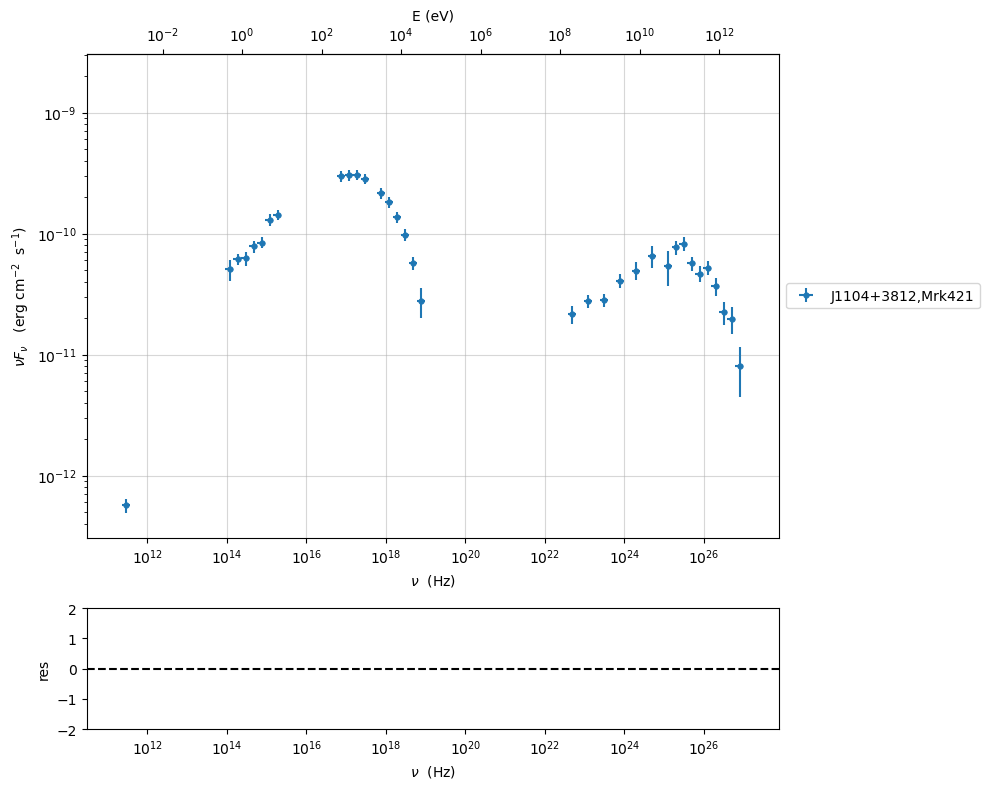
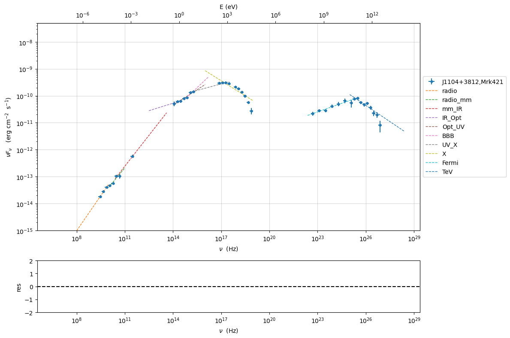
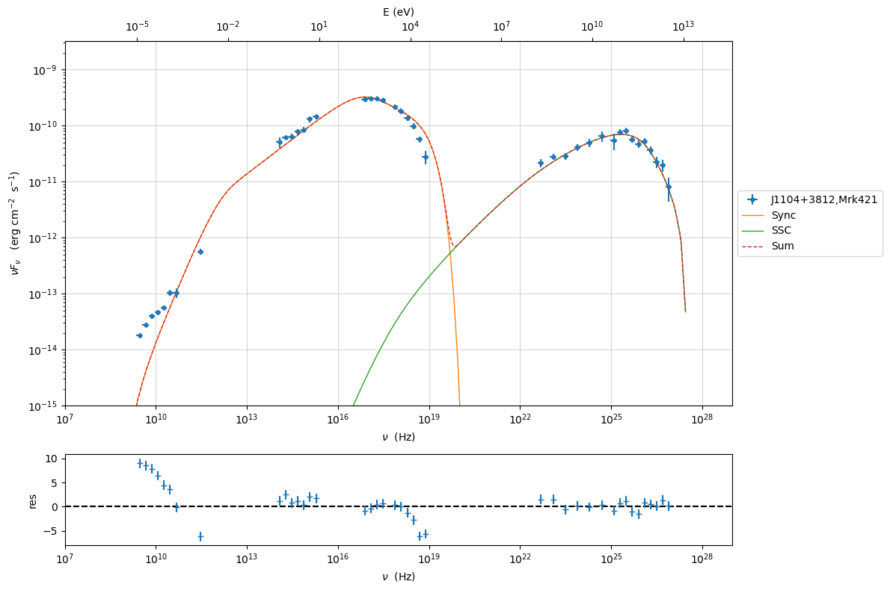
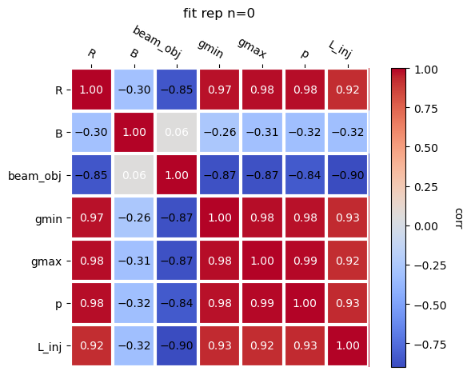
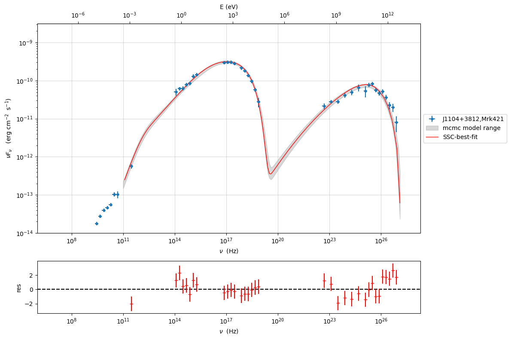
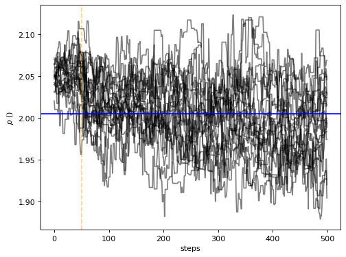
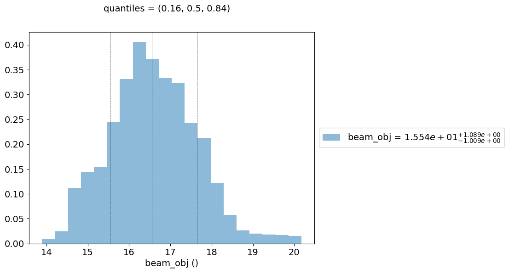
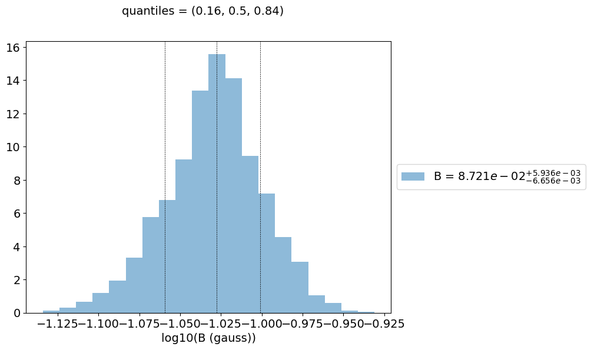
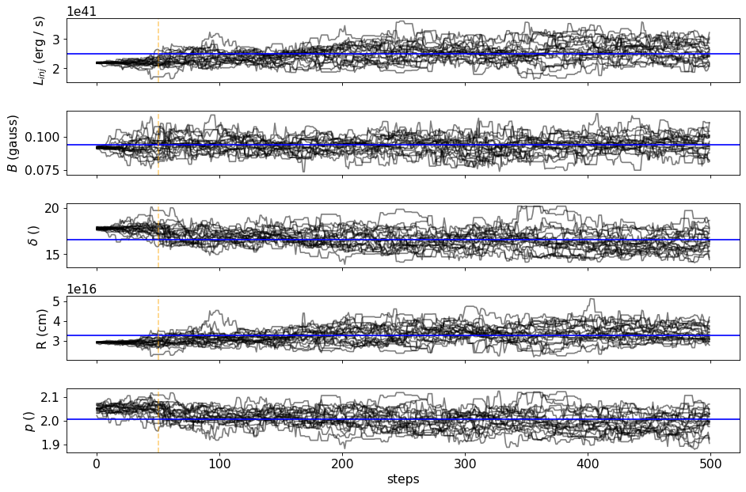

.. _model_fitting_4:

Model fitting 1: Leptonic equilibrim
====================================

.. code:: ipython3

    import warnings
    warnings.filterwarnings('ignore')
    
    import matplotlib.pylab as plt
    import jetset
    from jetset.test_data_helper import  test_SEDs
    from jetset.data_loader import ObsData,Data
    from jetset.plot_sedfit import PlotSED
    from jetset.test_data_helper import  test_SEDs

.. code:: ipython3

    print(jetset.__version__)

.. parsed-literal::

    1.4.0rc0

.. code:: ipython3

    test_SEDs

.. parsed-literal::

    ['/Users/orion/miniforge3/envs/jetset/lib/python3.12/site-packages/jetset/test_data/SEDs_data/SED_3C345.ecsv',
     '/Users/orion/miniforge3/envs/jetset/lib/python3.12/site-packages/jetset/test_data/SEDs_data/SED_MW_Mrk421_EBL_DEABS.ecsv',
     '/Users/orion/miniforge3/envs/jetset/lib/python3.12/site-packages/jetset/test_data/SEDs_data/SED_MW_Mrk501_EBL_ABS.ecsv',
     '/Users/orion/miniforge3/envs/jetset/lib/python3.12/site-packages/jetset/test_data/SEDs_data/SED_MW_Mrk501_EBL_DEABS.ecsv']

Loading data
------------

see the :ref:`data_format` user guide for further information about loading data 

.. code:: ipython3

    print(test_SEDs[1])
    data=Data.from_file(test_SEDs[1])

.. parsed-literal::

    /Users/orion/miniforge3/envs/jetset/lib/python3.12/site-packages/jetset/test_data/SEDs_data/SED_MW_Mrk421_EBL_DEABS.ecsv

.. code:: ipython3

    %matplotlib inline
    sed_data=ObsData(data_table=data)
    sed_data.group_data(bin_width=0.2)
    
    sed_data.add_systematics(0.1,[10.**6,10.**29])
    p=sed_data.plot_sed()
    #p.setlim(y_min=1E-15,x_min=1E7,x_max=1E29)

.. parsed-literal::

    ================================================================================
    
    ***  binning data  ***
    ---> N bins= 88
    ---> bin_width= 0.2
    ================================================================================
    

.. code:: ipython3

    sed_data.save('Mrk_401.pkl')

phenomenological model constraining
-----------------------------------

see the :ref:`phenom_constr` user guide for further information about phenomenological constraining 

spectral indices
~~~~~~~~~~~~~~~~

.. code:: ipython3

    from jetset.sed_shaper import  SEDShape
    my_shape=SEDShape(sed_data)
    my_shape.eval_indices(minimizer='lsb',silent=True)
    p=my_shape.plot_indices()
    p.setlim(y_min=1E-15,y_max=5E-8)

.. parsed-literal::

    ================================================================================
    
    *** evaluating spectral indices for data ***
    ================================================================================
    

sed shaper
~~~~~~~~~~

.. code:: ipython3

    mm,best_fit=my_shape.sync_fit(check_host_gal_template=False,
                      Ep_start=None,
                      minimizer='lsb',
                      silent=True,
                      fit_range=[10.,21.])

.. parsed-literal::

    ================================================================================
    
    *** Log-Polynomial fitting of the synchrotron component ***
    ---> first blind fit run,  fit range: [10.0, 21.0]
    ---> class:  HSP
    
    
    

.. raw:: html

    <i>Table length=4</i>
    <table id="table13065958992-366578" class="table-striped table-bordered table-condensed">
    <thead><tr><th>model name</th><th>name</th><th>val</th><th>bestfit val</th><th>err +</th><th>err -</th><th>start val</th><th>fit range min</th><th>fit range max</th><th>frozen</th></tr></thead>
    <tr><td>LogCubic</td><td>b</td><td>-1.563747e-01</td><td>-1.563747e-01</td><td>5.975434e-03</td><td>--</td><td>-1.000000e+00</td><td>-1.000000e+01</td><td>0.000000e+00</td><td>False</td></tr>
    <tr><td>LogCubic</td><td>c</td><td>-1.052802e-02</td><td>-1.052802e-02</td><td>8.781942e-04</td><td>--</td><td>-1.000000e+00</td><td>-1.000000e+01</td><td>1.000000e+01</td><td>False</td></tr>
    <tr><td>LogCubic</td><td>Ep</td><td>1.675324e+01</td><td>1.675324e+01</td><td>2.396636e-02</td><td>--</td><td>1.670206e+01</td><td>0.000000e+00</td><td>3.000000e+01</td><td>False</td></tr>
    <tr><td>LogCubic</td><td>Sp</td><td>-9.494365e+00</td><td>-9.494365e+00</td><td>1.704982e-02</td><td>--</td><td>-1.000000e+01</td><td>-3.000000e+01</td><td>0.000000e+00</td><td>False</td></tr>
    </table>
    

.. parsed-literal::

    ---> sync       nu_p=+1.675324e+01 (err=+2.396636e-02)  nuFnu_p=-9.494365e+00 (err=+1.704982e-02) curv.=-1.563747e-01 (err=+5.975434e-03)
    ================================================================================
    

.. code:: ipython3

    my_shape.IC_fit(fit_range=[23.,29.],minimizer='minuit',silent=True)
    p=my_shape.plot_shape_fit()
    p.setlim(y_min=1E-15,y_max=5E-8)

.. parsed-literal::

    ================================================================================
    
    *** Log-Polynomial fitting of the IC component ***
    ---> fit range: [23.0, 29.0]
    ---> LogCubic fit
    
    

.. raw:: html

    <i>Table length=4</i>
    <table id="table13065959424-478756" class="table-striped table-bordered table-condensed">
    <thead><tr><th>model name</th><th>name</th><th>val</th><th>bestfit val</th><th>err +</th><th>err -</th><th>start val</th><th>fit range min</th><th>fit range max</th><th>frozen</th></tr></thead>
    <tr><td>LogCubic</td><td>b</td><td>-2.274590e-01</td><td>-2.274590e-01</td><td>3.262165e-02</td><td>--</td><td>-1.000000e+00</td><td>-1.000000e+01</td><td>0.000000e+00</td><td>False</td></tr>
    <tr><td>LogCubic</td><td>c</td><td>-6.259967e-02</td><td>-6.259967e-02</td><td>1.629407e-02</td><td>--</td><td>-1.000000e+00</td><td>-1.000000e+01</td><td>1.000000e+01</td><td>False</td></tr>
    <tr><td>LogCubic</td><td>Ep</td><td>2.527207e+01</td><td>2.527207e+01</td><td>8.149544e-02</td><td>--</td><td>2.528644e+01</td><td>0.000000e+00</td><td>3.000000e+01</td><td>False</td></tr>
    <tr><td>LogCubic</td><td>Sp</td><td>-1.014119e+01</td><td>-1.014119e+01</td><td>2.734754e-02</td><td>--</td><td>-1.000000e+01</td><td>-3.000000e+01</td><td>0.000000e+00</td><td>False</td></tr>
    </table>
    

.. parsed-literal::

    ---> IC         nu_p=+2.527207e+01 (err=+8.149544e-02)  nuFnu_p=-1.014119e+01 (err=+2.734754e-02) curv.=-2.274590e-01 (err=+3.262165e-02)
    ================================================================================
    

.. image:: Jet_example_model_fit_leptonic_eq_files/Jet_example_model_fit_leptonic_eq_16_3.png

Model constraining
~~~~~~~~~~~~~~~~~~

In this step we are not fitting the model, we are just obtaining the
phenomenological ``pre_fit`` model, that will be fitted in using minuit
ore least-square bound, as shown below

.. code:: ipython3

    from jetset.obs_constrain import ObsConstrain
    
    
    sed_obspar=ObsConstrain(beaming=25,
                            B_range=[0.001,0.1],
                            t_var_sec=3*86400,
                            nu_cut_IR=1E12,
                            distr_e='bkn',
                            SEDShape=my_shape)
    
    
    prefit_jet=sed_obspar.constrain_SSC_model(electron_distribution_log_values=False,silent=True)
    prefit_jet.save_model('prefit_jet.pkl')

.. parsed-literal::

    ================================================================================
    
    ***  constrains parameters from observable ***
    

.. raw:: html

    <i>Table length=12</i>
    <table id="table13120889360-289901" class="table-striped table-bordered table-condensed">
    <thead><tr><th>model name</th><th>name</th><th>par type</th><th>units</th><th>val</th><th>phys. bound. min</th><th>phys. bound. max</th><th>log</th><th>frozen</th></tr></thead>
    <tr><td>jet_leptonic</td><td>R</td><td>region_size</td><td>cm</td><td>2.219270e+16</td><td>1.000000e+03</td><td>1.000000e+30</td><td>False</td><td>False</td></tr>
    <tr><td>jet_leptonic</td><td>R_H</td><td>region_position</td><td>cm</td><td>1.000000e+17</td><td>0.000000e+00</td><td>--</td><td>False</td><td>True</td></tr>
    <tr><td>jet_leptonic</td><td>B</td><td>magnetic_field</td><td>gauss</td><td>6.618390e-02</td><td>0.000000e+00</td><td>--</td><td>False</td><td>False</td></tr>
    <tr><td>jet_leptonic</td><td>NH_cold_to_rel_e</td><td>cold_p_to_rel_e_ratio</td><td></td><td>1.000000e+00</td><td>0.000000e+00</td><td>--</td><td>False</td><td>True</td></tr>
    <tr><td>jet_leptonic</td><td>beam_obj</td><td>beaming</td><td></td><td>2.500000e+01</td><td>1.000000e-04</td><td>--</td><td>False</td><td>False</td></tr>
    <tr><td>jet_leptonic</td><td>z_cosm</td><td>redshift</td><td></td><td>3.080000e-02</td><td>0.000000e+00</td><td>--</td><td>False</td><td>False</td></tr>
    <tr><td>jet_leptonic</td><td>gmin</td><td>low-energy-cut-off</td><td>lorentz-factor*</td><td>4.103365e+02</td><td>1.000000e+00</td><td>1.000000e+09</td><td>False</td><td>False</td></tr>
    <tr><td>jet_leptonic</td><td>gmax</td><td>high-energy-cut-off</td><td>lorentz-factor*</td><td>1.136207e+06</td><td>1.000000e+00</td><td>1.000000e+15</td><td>False</td><td>False</td></tr>
    <tr><td>jet_leptonic</td><td>N</td><td>emitters_density</td><td>1 / cm3</td><td>1.238758e+00</td><td>0.000000e+00</td><td>--</td><td>False</td><td>False</td></tr>
    <tr><td>jet_leptonic</td><td>gamma_break</td><td>turn-over-energy</td><td>lorentz-factor*</td><td>9.766963e+04</td><td>1.000000e+00</td><td>1.000000e+09</td><td>False</td><td>False</td></tr>
    <tr><td>jet_leptonic</td><td>p</td><td>LE_spectral_slope</td><td></td><td>2.169388e+00</td><td>-1.000000e+01</td><td>1.000000e+01</td><td>False</td><td>False</td></tr>
    <tr><td>jet_leptonic</td><td>p_1</td><td>HE_spectral_slope</td><td></td><td>3.500000e+00</td><td>-1.000000e+01</td><td>1.000000e+01</td><td>False</td><td>False</td></tr>
    </table>
    

.. parsed-literal::

    
    ================================================================================
    

.. code:: ipython3

    prefit_jet.eval()
    pl=prefit_jet.plot_model(sed_data=sed_data)
    pl.add_residual_plot(prefit_jet,sed_data)
    pl.setlim(y_min=1E-15,x_min=1E7,x_max=1E29)

Enabling the leptonic equilibrium
---------------------------------

We build a jet with the leptonic equilibrium, and we copy the relevant
parameters from the ``prefit_jet`` model

.. code:: ipython3

    from jetset.jet_emitters_factory import InjEmittersFactory
    from jetset.jet_model import Jet
    
    q_inj = InjEmittersFactory().create_inj_emitters('pl')
    
    lept_eq_jet=Jet(emitters_distribution=q_inj,name='leptonic_eq')
    lept_eq_jet.parameters.p.val=prefit_jet.parameters.p.val
    lept_eq_jet.parameters.z_cosm.val=prefit_jet.parameters.z_cosm.val
    lept_eq_jet.parameters.R.val=prefit_jet.parameters.R.val
    lept_eq_jet.parameters.B.val=prefit_jet.parameters.B.val
    lept_eq_jet.parameters.gmin.val=prefit_jet.parameters.gmin.val
    lept_eq_jet.parameters.gmax.val=prefit_jet.parameters.gmax.val
    
    lept_eq_jet.parameters.beam_obj.val=prefit_jet.parameters.beam_obj.val

for the emitters density we use the standard tool

.. code:: ipython3

    lept_eq_jet.set_N_from_nuFnu(nu_obs=1E15,nuFnu_obs=1E-10)

.. parsed-literal::

    L_out 1.6340495211662187e+43 2.3263510983670636e+44
    L_out 1.4236723356503605e+41

.. code:: ipython3

    lept_eq_jet.eval()
    lept_eq_jet.plot_model(sed_data=sed_data)

.. parsed-literal::

    <jetset.plot_sedfit.PlotSED at 0x30e106180>

.. image:: Jet_example_model_fit_leptonic_eq_files/Jet_example_model_fit_leptonic_eq_26_1.png

.. code:: ipython3

    lept_eq_jet.emitters_distribution.plot()

.. parsed-literal::

    <jetset.plot_sedfit.PlotPdistr at 0x169793d40>

.. image:: Jet_example_model_fit_leptonic_eq_files/Jet_example_model_fit_leptonic_eq_27_1.png

.. code:: ipython3

    lept_eq_jet.parameters

.. raw:: html

    <i>Table length=11</i>
    <table id="table13116160624-261346" class="table-striped table-bordered table-condensed">
    <thead><tr><th>model name</th><th>name</th><th>par type</th><th>units</th><th>val</th><th>phys. bound. min</th><th>phys. bound. max</th><th>log</th><th>frozen</th></tr></thead>
    <tr><td>leptonic_eq</td><td>R</td><td>region_size</td><td>cm</td><td>2.219270e+16</td><td>1.000000e+03</td><td>1.000000e+30</td><td>False</td><td>False</td></tr>
    <tr><td>leptonic_eq</td><td>R_H</td><td>region_position</td><td>cm</td><td>1.000000e+17</td><td>0.000000e+00</td><td>--</td><td>False</td><td>True</td></tr>
    <tr><td>leptonic_eq</td><td>B</td><td>magnetic_field</td><td>gauss</td><td>6.618390e-02</td><td>0.000000e+00</td><td>--</td><td>False</td><td>False</td></tr>
    <tr><td>leptonic_eq</td><td>NH_cold_to_rel_e</td><td>cold_p_to_rel_e_ratio</td><td></td><td>1.000000e+00</td><td>0.000000e+00</td><td>--</td><td>False</td><td>True</td></tr>
    <tr><td>leptonic_eq</td><td>beam_obj</td><td>beaming</td><td></td><td>2.500000e+01</td><td>1.000000e-04</td><td>--</td><td>False</td><td>False</td></tr>
    <tr><td>leptonic_eq</td><td>z_cosm</td><td>redshift</td><td></td><td>3.080000e-02</td><td>0.000000e+00</td><td>--</td><td>False</td><td>False</td></tr>
    <tr><td>leptonic_eq</td><td>gmin</td><td>low-energy-cut-off</td><td>lorentz-factor*</td><td>4.103365e+02</td><td>1.000000e+00</td><td>1.000000e+09</td><td>False</td><td>False</td></tr>
    <tr><td>leptonic_eq</td><td>gmax</td><td>high-energy-cut-off</td><td>lorentz-factor*</td><td>1.136207e+06</td><td>1.000000e+00</td><td>1.000000e+15</td><td>False</td><td>False</td></tr>
    <tr><td>leptonic_eq</td><td>p</td><td>LE_spectral_slope</td><td></td><td>2.169388e+00</td><td>-1.000000e+01</td><td>1.000000e+01</td><td>False</td><td>False</td></tr>
    <tr><td>leptonic_eq</td><td>T_esc_e_primaries</td><td>escape_time</td><td>R / c</td><td>1.000000e+00</td><td>1.000000e+00</td><td>--</td><td>False</td><td>False</td></tr>
    <tr><td>leptonic_eq</td><td>L_inj</td><td>L_inj</td><td>erg / s</td><td>1.423672e+41</td><td>0.000000e+00</td><td>--</td><td>False</td><td>False</td></tr>
    </table>
    

.. parsed-literal::

    None

Model fitting procedure
-----------------------

.. note::
    Please, read the introduction and the caveat :ref:`for the frequentist model fitting <frequentist_model_fitting>`: to understand the frequentist fitting workflow
    see the :ref:`composite_models` user guide for further information about the implementation of :class:`.FitModel`, in particular for parameter setting

Model fitting with LSB
~~~~~~~~~~~~~~~~~~~~~~

.. code:: ipython3

    from jetset.minimizer import ModelMinimizer
    
    from jetset.model_manager import  FitModel

We use the ``lept_eq_jet`` model to build the ``FitModel``

.. code:: ipython3

    fit_model=FitModel( jet=lept_eq_jet, name='SSC-best-fit',template=None) 

.. code:: ipython3

    fit_model.show_model_components()

.. parsed-literal::

    
    --------------------------------------------------------------------------------
    Composite model description
    --------------------------------------------------------------------------------
    name: SSC-best-fit  
    type: composite_model  
    components models:
     -model name: leptonic_eq model type: jet
    
    --------------------------------------------------------------------------------

There is only one component, whit name ``leptonic_eq``, that refers to
the ``lept_eq_jet`` model component

We now set the gamma grid size to 200, ad we set ``composite_expr``,
anyhow, since we have only one component this step could be skipped

.. code:: ipython3

    fit_model.leptonic_eq.set_gamma_grid_size(200)
    fit_model.composite_expr='leptonic_eq'

Freezeing parameters and setting fit_range intervals
^^^^^^^^^^^^^^^^^^^^^^^^^^^^^^^^^^^^^^^^^^^^^^^^^^^^

.. code:: ipython3

    
    fit_model.freeze('leptonic_eq','z_cosm')
    fit_model.freeze('leptonic_eq','R_H')
    fit_model.freeze('leptonic_eq','T_esc_e_primaries')
    
    fit_model.leptonic_eq.parameters.R.fit_range=[10**15.5,10**17.5]
    fit_model.leptonic_eq.parameters.beam_obj.fit_range=[5., 50.]
    fit_model.leptonic_eq.parameters.gmax.fit_range=[1E5, 5E6]
    fit_model.leptonic_eq.parameters.gmin.fit_range=[10, 1000]
    fit_model.leptonic_eq.parameters.T_esc_e_primaries.val=1
    fit_model.leptonic_eq.parameters.L_inj.fit_range=[1E38, 1E43]
    

.. code:: ipython3

    fit_model.parameters

.. raw:: html

    <i>Table length=11</i>
    <table id="table13116160624-297518" class="table-striped table-bordered table-condensed">
    <thead><tr><th>model name</th><th>name</th><th>par type</th><th>units</th><th>val</th><th>phys. bound. min</th><th>phys. bound. max</th><th>log</th><th>frozen</th></tr></thead>
    <tr><td>leptonic_eq</td><td>R</td><td>region_size</td><td>cm</td><td>2.219270e+16</td><td>1.000000e+03</td><td>1.000000e+30</td><td>False</td><td>False</td></tr>
    <tr><td>leptonic_eq</td><td>R_H</td><td>region_position</td><td>cm</td><td>1.000000e+17</td><td>0.000000e+00</td><td>--</td><td>False</td><td>True</td></tr>
    <tr><td>leptonic_eq</td><td>B</td><td>magnetic_field</td><td>gauss</td><td>6.618390e-02</td><td>0.000000e+00</td><td>--</td><td>False</td><td>False</td></tr>
    <tr><td>leptonic_eq</td><td>NH_cold_to_rel_e</td><td>cold_p_to_rel_e_ratio</td><td></td><td>1.000000e+00</td><td>0.000000e+00</td><td>--</td><td>False</td><td>True</td></tr>
    <tr><td>leptonic_eq</td><td>beam_obj</td><td>beaming</td><td></td><td>2.500000e+01</td><td>1.000000e-04</td><td>--</td><td>False</td><td>False</td></tr>
    <tr><td>leptonic_eq</td><td>z_cosm</td><td>redshift</td><td></td><td>3.080000e-02</td><td>0.000000e+00</td><td>--</td><td>False</td><td>True</td></tr>
    <tr><td>leptonic_eq</td><td>gmin</td><td>low-energy-cut-off</td><td>lorentz-factor*</td><td>4.103365e+02</td><td>1.000000e+00</td><td>1.000000e+09</td><td>False</td><td>False</td></tr>
    <tr><td>leptonic_eq</td><td>gmax</td><td>high-energy-cut-off</td><td>lorentz-factor*</td><td>1.136207e+06</td><td>1.000000e+00</td><td>1.000000e+15</td><td>False</td><td>False</td></tr>
    <tr><td>leptonic_eq</td><td>p</td><td>LE_spectral_slope</td><td></td><td>2.169388e+00</td><td>-1.000000e+01</td><td>1.000000e+01</td><td>False</td><td>False</td></tr>
    <tr><td>leptonic_eq</td><td>T_esc_e_primaries</td><td>escape_time</td><td>R / c</td><td>1.000000e+00</td><td>1.000000e+00</td><td>--</td><td>False</td><td>True</td></tr>
    <tr><td>leptonic_eq</td><td>L_inj</td><td>L_inj</td><td>erg / s</td><td>1.423672e+41</td><td>0.000000e+00</td><td>--</td><td>False</td><td>False</td></tr>
    </table>
    

.. parsed-literal::

    None

Building the ModelMinimizer object
^^^^^^^^^^^^^^^^^^^^^^^^^^^^^^^^^^

.. code:: ipython3

    model_minimizer_minuit=ModelMinimizer('minuit')
    best_fit_minuit=model_minimizer_minuit.fit(fit_model,
                                               sed_data,
                                               1E11,
                                               1E29,
                                               fitname='SSC-best-fit-minuit',
                                               max_ev=10000,
                                               repeat=1)

.. parsed-literal::

    filtering data in fit range = [1.000000e+11,1.000000e+29]
    data length 34
    ================================================================================
    
    *** start fit process ***
    ----- 

.. parsed-literal::

    0it [00:00, ?it/s]

.. parsed-literal::

    - best chisq=4.88440e+01
    
    -------------------------------------------------------------------------
    Fit report
    
    Model: SSC-best-fit-minuit

.. raw:: html

    <i>Table length=11</i>
    <table id="table6064844544-659505" class="table-striped table-bordered table-condensed">
    <thead><tr><th>model name</th><th>name</th><th>par type</th><th>units</th><th>val</th><th>phys. bound. min</th><th>phys. bound. max</th><th>log</th><th>frozen</th></tr></thead>
    <tr><td>leptonic_eq</td><td>R</td><td>region_size</td><td>cm</td><td>2.915423e+16</td><td>1.000000e+03</td><td>1.000000e+30</td><td>False</td><td>False</td></tr>
    <tr><td>leptonic_eq</td><td>R_H</td><td>region_position</td><td>cm</td><td>1.000000e+17</td><td>0.000000e+00</td><td>--</td><td>False</td><td>True</td></tr>
    <tr><td>leptonic_eq</td><td>B</td><td>magnetic_field</td><td>gauss</td><td>9.177237e-02</td><td>0.000000e+00</td><td>--</td><td>False</td><td>False</td></tr>
    <tr><td>leptonic_eq</td><td>NH_cold_to_rel_e</td><td>cold_p_to_rel_e_ratio</td><td></td><td>1.000000e+00</td><td>0.000000e+00</td><td>--</td><td>False</td><td>True</td></tr>
    <tr><td>leptonic_eq</td><td>beam_obj</td><td>beaming</td><td></td><td>1.774807e+01</td><td>1.000000e-04</td><td>--</td><td>False</td><td>False</td></tr>
    <tr><td>leptonic_eq</td><td>z_cosm</td><td>redshift</td><td></td><td>3.080000e-02</td><td>0.000000e+00</td><td>--</td><td>False</td><td>True</td></tr>
    <tr><td>leptonic_eq</td><td>gmin</td><td>low-energy-cut-off</td><td>lorentz-factor*</td><td>4.288467e+02</td><td>1.000000e+00</td><td>1.000000e+09</td><td>False</td><td>False</td></tr>
    <tr><td>leptonic_eq</td><td>gmax</td><td>high-energy-cut-off</td><td>lorentz-factor*</td><td>9.276581e+05</td><td>1.000000e+00</td><td>1.000000e+15</td><td>False</td><td>False</td></tr>
    <tr><td>leptonic_eq</td><td>p</td><td>LE_spectral_slope</td><td></td><td>2.048689e+00</td><td>-1.000000e+01</td><td>1.000000e+01</td><td>False</td><td>False</td></tr>
    <tr><td>leptonic_eq</td><td>T_esc_e_primaries</td><td>escape_time</td><td>R / c</td><td>1.000000e+00</td><td>1.000000e+00</td><td>--</td><td>False</td><td>True</td></tr>
    <tr><td>leptonic_eq</td><td>L_inj</td><td>L_inj</td><td>erg / s</td><td>2.181277e+41</td><td>0.000000e+00</td><td>--</td><td>False</td><td>False</td></tr>
    </table>
    

.. parsed-literal::

    
    converged=True
    calls=2679
    mesg=

.. raw:: html

    <table>
        <tr>
            <th colspan="2" style="text-align:center" title="Minimizer"> Migrad </th>
        </tr>
        <tr>
            <td style="text-align:left" title="Minimum value of function"> FCN = 48.84 </td>
            <td style="text-align:center" title="Total number of function and (optional) gradient evaluations"> Nfcn = 2679 </td>
        </tr>
        <tr>
            <td style="text-align:left" title="Estimated distance to minimum and goal"> EDM = 10.7 (Goal: 0.0002) </td>
            <td style="text-align:center" title="Total run time of algorithms"> time = 23.8 sec </td>
        </tr>
        <tr>
            <td style="text-align:center;background-color:#c15ef7;color:black"> INVALID Minimum </td>
            <td style="text-align:center;background-color:#c15ef7;color:black"> ABOVE EDM threshold (goal x 10) </td>
        </tr>
        <tr>
            <td style="text-align:center;background-color:#92CCA6;color:black"> No parameters at limit </td>
            <td style="text-align:center;background-color:#92CCA6;color:black"> Below call limit </td>
        </tr>
        <tr>
            <td style="text-align:center;background-color:#FFF79A;color:black"> Hesse ok </td>
            <td style="text-align:center;background-color:#FFF79A;color:black"> Covariance FORCED pos. def. </td>
        </tr>
    </table><table>
        <tr>
            <td></td>
            <th title="Variable name"> Name </th>
            <th title="Value of parameter"> Value </th>
            <th title="Hesse error"> Hesse Error </th>
            <th title="Minos lower error"> Minos Error- </th>
            <th title="Minos upper error"> Minos Error+ </th>
            <th title="Lower limit of the parameter"> Limit- </th>
            <th title="Upper limit of the parameter"> Limit+ </th>
            <th title="Is the parameter fixed in the fit"> Fixed </th>
        </tr>
        <tr>
            <th> 0 </th>
            <td> par_0 </td>
            <td> 29.154e15 </td>
            <td> 0.010e15 </td>
            <td>  </td>
            <td>  </td>
            <td> 3.16E+15 </td>
            <td> 3.16E+17 </td>
            <td>  </td>
        </tr>
        <tr>
            <th> 1 </th>
            <td> par_1 </td>
            <td> 0.0918 </td>
            <td> 0.0031 </td>
            <td>  </td>
            <td>  </td>
            <td> 0 </td>
            <td>  </td>
            <td>  </td>
        </tr>
        <tr>
            <th> 2 </th>
            <td> par_2 </td>
            <td> 17.7 </td>
            <td> 0.4 </td>
            <td>  </td>
            <td>  </td>
            <td> 5 </td>
            <td> 50 </td>
            <td>  </td>
        </tr>
        <tr>
            <th> 3 </th>
            <td> par_3 </td>
            <td> 428.847 </td>
            <td> 0.005 </td>
            <td>  </td>
            <td>  </td>
            <td> 10 </td>
            <td> 1E+03 </td>
            <td>  </td>
        </tr>
        <tr>
            <th> 4 </th>
            <td> par_4 </td>
            <td> 0.93e6 </td>
            <td> 0.16e6 </td>
            <td>  </td>
            <td>  </td>
            <td> 1E+05 </td>
            <td> 5E+06 </td>
            <td>  </td>
        </tr>
        <tr>
            <th> 5 </th>
            <td> par_5 </td>
            <td> 2.05 </td>
            <td> 0.07 </td>
            <td>  </td>
            <td>  </td>
            <td> -10 </td>
            <td> 10 </td>
            <td>  </td>
        </tr>
        <tr>
            <th> 6 </th>
            <td> par_6 </td>
            <td> 0.218e42 </td>
            <td> 0.014e42 </td>
            <td>  </td>
            <td>  </td>
            <td> 1E+38 </td>
            <td> 1E+43 </td>
            <td>  </td>
        </tr>
    </table>

.. parsed-literal::

    dof=27
    chisq=48.844023, chisq/red=1.809038 null hypothesis sig=0.006170
    
    best fit pars

.. raw:: html

    <i>Table length=11</i>
    <table id="table13115947968-183733" class="table-striped table-bordered table-condensed">
    <thead><tr><th>model name</th><th>name</th><th>val</th><th>bestfit val</th><th>err +</th><th>err -</th><th>start val</th><th>fit range min</th><th>fit range max</th><th>frozen</th></tr></thead>
    <tr><td>leptonic_eq</td><td>R</td><td>2.915423e+16</td><td>2.915423e+16</td><td>1.051357e+13</td><td>--</td><td>2.219270e+16</td><td>3.162278e+15</td><td>3.162278e+17</td><td>False</td></tr>
    <tr><td>leptonic_eq</td><td>R_H</td><td>1.000000e+17</td><td>--</td><td>--</td><td>--</td><td>1.000000e+17</td><td>0.000000e+00</td><td>--</td><td>True</td></tr>
    <tr><td>leptonic_eq</td><td>B</td><td>9.177237e-02</td><td>9.177237e-02</td><td>3.093967e-03</td><td>--</td><td>6.618390e-02</td><td>0.000000e+00</td><td>--</td><td>False</td></tr>
    <tr><td>leptonic_eq</td><td>NH_cold_to_rel_e</td><td>1.000000e+00</td><td>--</td><td>--</td><td>--</td><td>1.000000e+00</td><td>0.000000e+00</td><td>--</td><td>True</td></tr>
    <tr><td>leptonic_eq</td><td>beam_obj</td><td>1.774807e+01</td><td>1.774807e+01</td><td>3.756669e-01</td><td>--</td><td>2.500000e+01</td><td>5.000000e+00</td><td>5.000000e+01</td><td>False</td></tr>
    <tr><td>leptonic_eq</td><td>z_cosm</td><td>3.080000e-02</td><td>--</td><td>--</td><td>--</td><td>3.080000e-02</td><td>0.000000e+00</td><td>--</td><td>True</td></tr>
    <tr><td>leptonic_eq</td><td>gmin</td><td>4.288467e+02</td><td>4.288467e+02</td><td>4.726429e-03</td><td>--</td><td>4.103365e+02</td><td>1.000000e+01</td><td>1.000000e+03</td><td>False</td></tr>
    <tr><td>leptonic_eq</td><td>gmax</td><td>9.276581e+05</td><td>9.276581e+05</td><td>1.598030e+05</td><td>--</td><td>1.136207e+06</td><td>1.000000e+05</td><td>5.000000e+06</td><td>False</td></tr>
    <tr><td>leptonic_eq</td><td>p</td><td>2.048689e+00</td><td>2.048689e+00</td><td>6.774985e-02</td><td>--</td><td>2.169388e+00</td><td>-1.000000e+01</td><td>1.000000e+01</td><td>False</td></tr>
    <tr><td>leptonic_eq</td><td>T_esc_e_primaries</td><td>1.000000e+00</td><td>--</td><td>--</td><td>--</td><td>1.000000e+00</td><td>1.000000e+00</td><td>--</td><td>True</td></tr>
    <tr><td>leptonic_eq</td><td>L_inj</td><td>2.181277e+41</td><td>2.181277e+41</td><td>1.436004e+40</td><td>--</td><td>1.423672e+41</td><td>1.000000e+38</td><td>1.000000e+43</td><td>False</td></tr>
    </table>
    

.. parsed-literal::

    -------------------------------------------------------------------------
    
    ================================================================================
    

.. code:: ipython3

    p=model_minimizer_minuit.plot_corr_matrix()

.. code:: ipython3

    %matplotlib inline
    fit_model.eval()
    p2=fit_model.plot_model(sed_data=sed_data)
    p2.setlim(y_min=1E-14,x_min=1E6,x_max=2E28)

.. image:: Jet_example_model_fit_leptonic_eq_files/Jet_example_model_fit_leptonic_eq_45_0.png

.. code:: ipython3

    fit_model.leptonic_eq.emitters_distribution.plot()

.. parsed-literal::

    <jetset.plot_sedfit.PlotPdistr at 0x30a8ad070>

.. image:: Jet_example_model_fit_leptonic_eq_files/Jet_example_model_fit_leptonic_eq_46_1.png

saving fit model, model minimizer
^^^^^^^^^^^^^^^^^^^^^^^^^^^^^^^^^

.. code:: ipython3

    best_fit_minuit.save_report('SSC-best-fit-minuit.pkl')
    model_minimizer_minuit.save_model('model_minimizer_minuit.pkl')
    fit_model.save_model('fit_model_minuit.pkl')

MCMC sampling
-------------

.. note::
    Please, read the introduction and the caveat :ref:`for the Bayesian model fitting <bayesian_model_fitting>` to understand the MCMC sampler workflow.

creating and setting the sampler
~~~~~~~~~~~~~~~~~~~~~~~~~~~~~~~~

.. code:: ipython3

    from jetset.mcmc import McmcSampler
    from jetset.minimizer import ModelMinimizer

.. code:: ipython3

    model_minimizer_minuit = ModelMinimizer.load_model('model_minimizer_minuit.pkl')
    
    mcmc=McmcSampler(model_minimizer_minuit)

.. code:: ipython3

    labels=['L_inj','B','beam_obj','R','p']
    model_name='leptonic_eq'
    use_labels_dict={model_name:labels}
    
    mcmc.set_labels(use_labels_dict=use_labels_dict)

.. code:: ipython3

    mcmc.set_bounds(bound=5.0,bound_rel=True)

.. parsed-literal::

    par: L_inj  best fit value:  2.181277321031021e+41  mcmc bounds: [1e+38, np.float64(1.3087663926186125e+42)]
    par: B  best fit value:  0.09177236691672452  mcmc bounds: [0, np.float64(0.5506342015003471)]
    par: beam_obj  best fit value:  17.748068059424398  mcmc bounds: [5.0, 50.0]
    par: R  best fit value:  2.9154231588805704e+16  mcmc bounds: [3162277660168379.5, np.float64(1.749253895328342e+17)]
    par: p  best fit value:  2.0486894279548906  mcmc bounds: [np.float64(-8.194757711819562), 10]

.. code:: ipython3

    
    
    #NOTE: preserve_fit_range=True preserves the model fit range for each parameter used in the MCMC
    mcmc.set_bounds(bound=5.0,bound_rel=True,preserve_fit_range=True)

.. parsed-literal::

    par: L_inj  best fit value:  2.181277321031021e+41  mcmc bounds: [1e+38, np.float64(1.3087663926186125e+42)]
    par: B  best fit value:  0.09177236691672452  mcmc bounds: [0, np.float64(0.5506342015003471)]
    par: beam_obj  best fit value:  17.748068059424398  mcmc bounds: [5.0, 50.0]
    par: R  best fit value:  2.9154231588805704e+16  mcmc bounds: [3162277660168379.5, np.float64(1.749253895328342e+17)]
    par: p  best fit value:  2.0486894279548906  mcmc bounds: [np.float64(-8.194757711819562), 10]

.. code:: ipython3

    mcmc.run_sampler(nwalkers=20, burnin=50,steps=500,progress='notebook')

.. parsed-literal::

    mcmc run starting
    

.. parsed-literal::

      0%|          | 0/500 [00:00<?, ?it/s]

.. parsed-literal::

    mcmc run done, with 1 threads took 127.93 seconds
    ----------------------------
    MCMC best fit solution
    L_inj: 2.5379973193493358e+41
    B: 0.09518968755529787
    beam_obj: 16.33028232860727
    R: 3.3257247384800336e+16
    p: 1.9944227595464585
    ----------------------------

Showing the MCMC parameters. Now MCMC bestfit values are updated to the
best-fit MCMC solution

.. code:: ipython3

    mcmc.par_table

.. raw:: html

    
<i>Table length=5</i>
    <table id="table13973843952" class="table-striped table-bordered table-condensed">
    <thead><tr><th>idx</th><th>model name</th><th>name</th><th>current val</th><th>mcmc best fit val</th><th>quantile 0.16</th><th>quantile 0.50</th><th>quantile 0.84</th><th>val min</th><th>val max</th><th>mcmc bound min</th><th>mcmc bound max</th><th>units</th><th>plot label</th></tr></thead>
    <thead><tr><th>int64</th><th>str11</th><th>str8</th><th>float64</th><th>float64</th><th>float64</th><th>float64</th><th>float64</th><th>float64</th><th>object</th><th>float64</th><th>float64</th><th>str7</th><th>str8</th></tr></thead>
    <tr><td>0</td><td>leptonic_eq</td><td>L_inj</td><td>2.5379973193493358e+41</td><td>2.5379973193493358e+41</td><td>2.1867930884430712e+41</td><td>2.491540763766256e+41</td><td>2.8282280337576004e+41</td><td>0.0</td><td>None</td><td>1e+38</td><td>1.3087663926186125e+42</td><td>erg / s</td><td>L_inj</td></tr>
    <tr><td>1</td><td>leptonic_eq</td><td>B</td><td>0.09518968755529787</td><td>0.09518968755529787</td><td>0.08720791804708543</td><td>0.0938643557812696</td><td>0.09980040681544372</td><td>0.0</td><td>None</td><td>0.0</td><td>0.5506342015003471</td><td>gauss</td><td>B</td></tr>
    <tr><td>2</td><td>leptonic_eq</td><td>beam_obj</td><td>16.33028232860727</td><td>16.33028232860727</td><td>15.542674793711477</td><td>16.551971318448267</td><td>17.641402456575815</td><td>0.0001</td><td>None</td><td>5.0</td><td>50.0</td><td></td><td>beam_obj</td></tr>
    <tr><td>3</td><td>leptonic_eq</td><td>R</td><td>3.3257247384800336e+16</td><td>3.3257247384800336e+16</td><td>2.8985855002658204e+16</td><td>3.2668460989701056e+16</td><td>3.737521481393122e+16</td><td>1000.0</td><td>1e+30</td><td>3162277660168379.5</td><td>1.749253895328342e+17</td><td>cm</td><td>R</td></tr>
    <tr><td>4</td><td>leptonic_eq</td><td>p</td><td>1.9944227595464585</td><td>1.9944227595464585</td><td>1.9605747375242233</td><td>2.0048053234657277</td><td>2.04560514893497</td><td>-10.0</td><td>10</td><td>-8.194757711819562</td><td>10.0</td><td></td><td>p</td></tr>
    </table>

plotting the posterior corner plot
~~~~~~~~~~~~~~~~~~~~~~~~~~~~~~~~~~

To have a better rendering on the scatter plot, we redefine the plot
labels

.. code:: ipython3

    mcmc.set_plot_label('L_inj',r'$L_{inj}$')
    mcmc.set_plot_label('B',r'$B$')
    mcmc.set_plot_label('beam_obj',r'$\delta$')
    mcmc.set_plot_label('p',r'$p$')

the code below lets you tuning the output

1) mpl.rcParams[‘figure.dpi’] if you increase it you get a better
   definition
2) title_fmt=“.2E” this is the format for python, 2 significant digits,
   scientific notation
3) title_kwargs=dict(fontsize=12) you can change the fontsize

.. code:: ipython3

    import matplotlib as mpl
    mpl.rcParams['figure.dpi'] = 80
    f=mcmc.corner_plot(quantiles=(0.16, 0.5, 0.84),title_kwargs=dict(fontsize=12),title_fmt=".2E",use_math_text=True)

.. image:: Jet_example_model_fit_leptonic_eq_files/Jet_example_model_fit_leptonic_eq_64_0.png

.. code:: ipython3

    print(mcmc.acceptance_fraction)

.. parsed-literal::

    0.5191000000000001

plotting the model
~~~~~~~~~~~~~~~~~~

To plot the sampled model range against the input best-fit model

.. code:: ipython3

    mpl.rcParams['figure.dpi'] = 80
    p=mcmc.plot_model(sed_data=sed_data,fit_range=[1E11,1E29],size=100)
    p.setlim(y_min=1E-14,x_min=1E6,x_max=2E28)

To plot the sampled model range,providing quantiles, against the input
best-fit model, providing quantiles

.. code:: ipython3

    mpl.rcParams['figure.dpi'] = 80
    p=mcmc.plot_model(sed_data=sed_data,fit_range=[1E11, 2E29],size=100,quantiles=[0.05,0.95])
    p.setlim(y_min=1E-14,x_min=1E6,x_max=2E28)

.. image:: Jet_example_model_fit_leptonic_eq_files/Jet_example_model_fit_leptonic_eq_70_0.png

To plot the sampled model range,providing quantiles, against the mcmc
model at 0.5 quantile (``plot_mcmc_best_fit_model==True`` provides the
0.5 quantile sampled model)

.. code:: ipython3

    mpl.rcParams['figure.dpi'] = 100
    p=mcmc.plot_model(sed_data=sed_data,fit_range=[1E11, 1E29],size=100,quantiles=[0.05,0.95], plot_mcmc_best_fit_model=True)
    
    p.setlim(y_min=1E-14,x_min=1E6,x_max=2E28)

.. parsed-literal::

    ----------------------------
    MCMC best fit solution
    L_inj: 2.5379973193493358e+41
    B: 0.09518968755529787
    beam_obj: 16.33028232860727
    R: 3.3257247384800336e+16
    p: 1.9944227595464585
    ----------------------------

.. image:: Jet_example_model_fit_leptonic_eq_files/Jet_example_model_fit_leptonic_eq_72_1.png

plotting chains and individual posteriors
~~~~~~~~~~~~~~~~~~~~~~~~~~~~~~~~~~~~~~~~~

.. code:: ipython3

    mpl.rcParams['figure.dpi'] = 80
    f=mcmc.plot_chain(par_name='p',log_plot=False)
    plt.tight_layout()

.. code:: ipython3

    mpl.rcParams['figure.dpi'] = 80
    f=mcmc.plot_chain(log_plot=False)
    plt.tight_layout()

.. image:: Jet_example_model_fit_leptonic_eq_files/Jet_example_model_fit_leptonic_eq_75_0.png

.. code:: ipython3

    
    f=mcmc.plot_par('beam_obj',figsize=(8,6))
    mpl.rcParams['figure.dpi'] = 80

.. image:: Jet_example_model_fit_leptonic_eq_files/Jet_example_model_fit_leptonic_eq_76_0.png

.. code:: ipython3

    mpl.rcParams['figure.dpi'] = 80
    f=mcmc.plot_par('B',log_plot=True,figsize=(8,6))

.. image:: Jet_example_model_fit_leptonic_eq_files/Jet_example_model_fit_leptonic_eq_77_0.png

Save and reuse MCMC
-------------------

.. code:: ipython3

    mcmc.save('mcmc_sampler.pkl')

.. code:: ipython3

    from jetset.mcmc import McmcSampler
    from jetset.data_loader import ObsData
    from jetset.plot_sedfit import PlotSED
    from jetset.test_data_helper import  test_SEDs
    
    sed_data=ObsData.load('Mrk_401.pkl')
    ms=McmcSampler.load('mcmc_sampler.pkl')
    
    import matplotlib as mpl

.. code:: ipython3

    ms.model.name

.. parsed-literal::

    'SSC-best-fit'

.. code:: ipython3

    mpl.rcParams['figure.dpi'] = 80
    p=ms.plot_model(sed_data=sed_data,fit_range=[1E11, 1E29],size=100)
    p.setlim(y_min=1E-14,x_min=1E6,x_max=2E28)

.. image:: Jet_example_model_fit_leptonic_eq_files/Jet_example_model_fit_leptonic_eq_82_0.png

.. code:: ipython3

    mpl.rcParams['figure.dpi'] = 80
    p=ms.plot_model(sed_data=sed_data,fit_range=[1E11, 1E29],size=100,quantiles=[0.05,0.95])
    
    p.setlim(y_min=1E-14,x_min=1E6,x_max=2E28)

.. image:: Jet_example_model_fit_leptonic_eq_files/Jet_example_model_fit_leptonic_eq_83_0.png

.. code:: ipython3

    mpl.rcParams['figure.dpi'] = 80
    p=ms.plot_model(sed_data=sed_data,fit_range=[1E11, 1E29],size=100,quantiles=[0.05,0.95],plot_mcmc_best_fit_model=True)
    
    p.setlim(y_min=1E-14,x_min=1E6,x_max=2E28)

.. parsed-literal::

    ----------------------------
    MCMC best fit solution
    L_inj: 2.5379973193493358e+41
    B: 0.09518968755529787
    beam_obj: 16.33028232860727
    R: 3.3257247384800336e+16
    p: 1.9944227595464585
    ----------------------------

.. image:: Jet_example_model_fit_leptonic_eq_files/Jet_example_model_fit_leptonic_eq_84_1.png

.. code:: ipython3

    mpl.rcParams['figure.dpi'] = 80
    f=ms.corner_plot(quantiles=(0.16, 0.5, 0.84),title_kwargs=dict(fontsize=12),title_fmt=".2E",use_math_text=True)

.. image:: Jet_example_model_fit_leptonic_eq_files/Jet_example_model_fit_leptonic_eq_85_0.png

.. code:: ipython3

    mpl.rcParams['figure.dpi'] = 80
    f=ms.plot_par('beam_obj',log_plot=False,figsize=(8,6))

.. code:: ipython3

    f=ms.plot_par('B',log_plot=True,figsize=(8,6))

.. code:: ipython3

    mpl.rcParams['figure.dpi'] = 80
    f=ms.plot_chain(par_name='p',log_plot=False)
    plt.tight_layout()  

.. image:: Jet_example_model_fit_leptonic_eq_files/Jet_example_model_fit_leptonic_eq_88_0.png

.. code:: ipython3

    f=ms.plot_chain(log_plot=False)
    plt.tight_layout()
    mpl.rcParams['figure.dpi'] = 80

