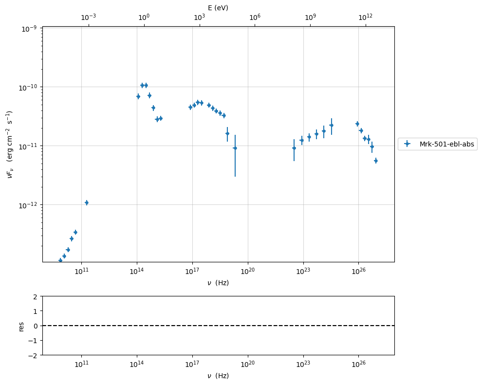
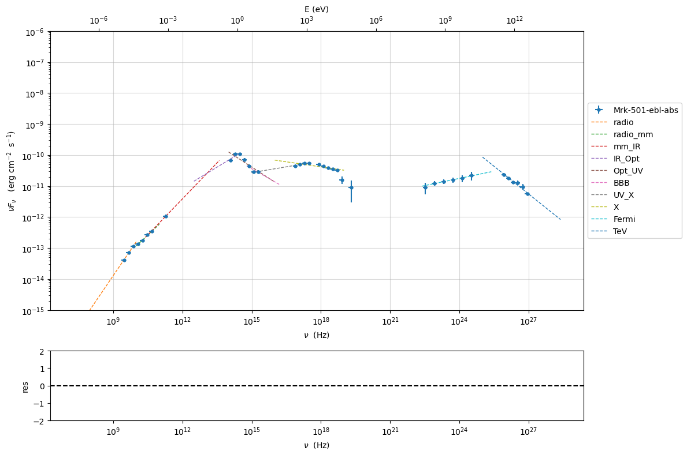
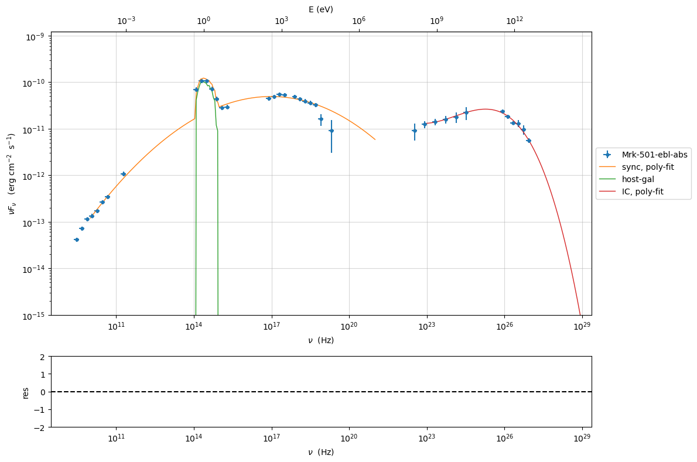
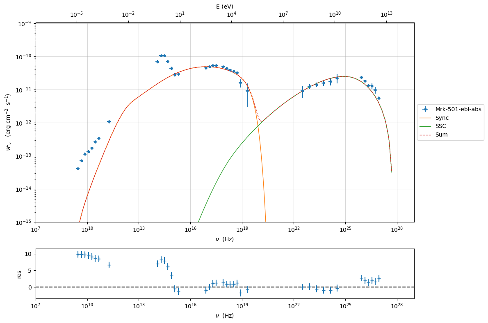
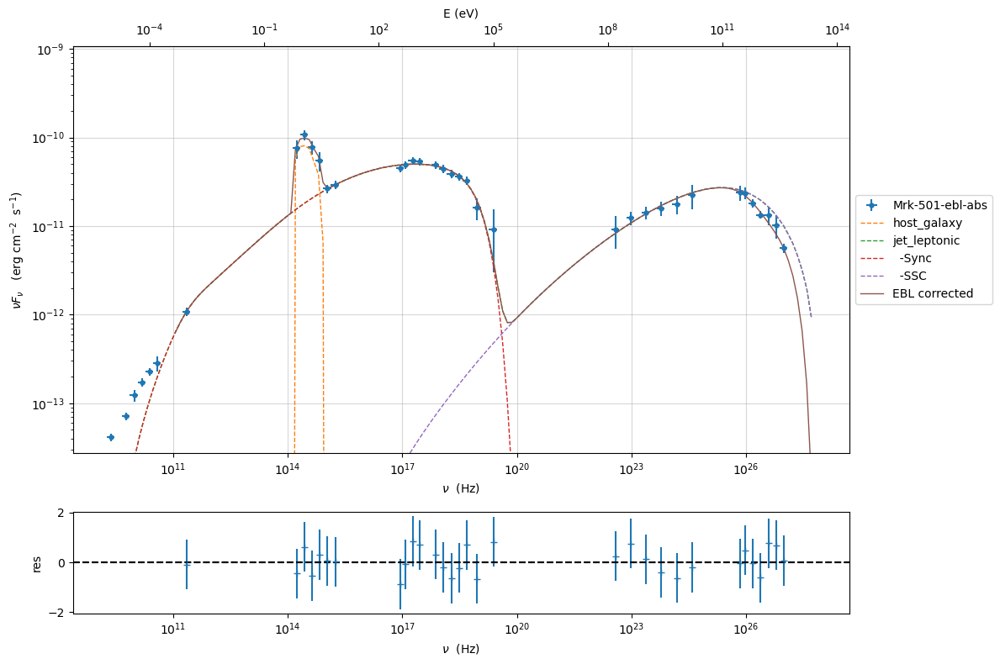
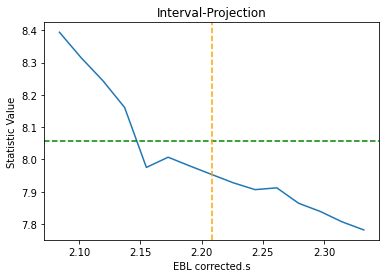

.. _sherpa_minimizer_plugin:

Example to use the Sherpa minimizer plugin with a JeSeT model
=============================================================

In this tutorial we show how to import a jetset model into sherpa, and
finally we perform a model fitting. To run this plugin you have to
install Sherpa: https://sherpa.readthedocs.io/en/latest/install.html

.. code:: ipython3

    import jetset
    print('tested with',jetset.__version__)

.. parsed-literal::

    tested with 1.4.0rc0

.. code:: ipython3

    import warnings
    warnings.filterwarnings('ignore')
    
    import matplotlib.pylab as plt
    import jetset
    from jetset.test_data_helper import  test_SEDs
    from jetset.data_loader import ObsData,Data
    from jetset.plot_sedfit import PlotSED
    from jetset.test_data_helper import  test_SEDs

.. code:: ipython3

    test_SEDs

.. parsed-literal::

    ['/Users/orion/miniforge3/envs/jetset/lib/python3.12/site-packages/jetset/test_data/SEDs_data/SED_3C345.ecsv',
     '/Users/orion/miniforge3/envs/jetset/lib/python3.12/site-packages/jetset/test_data/SEDs_data/SED_MW_Mrk421_EBL_DEABS.ecsv',
     '/Users/orion/miniforge3/envs/jetset/lib/python3.12/site-packages/jetset/test_data/SEDs_data/SED_MW_Mrk501_EBL_ABS.ecsv',
     '/Users/orion/miniforge3/envs/jetset/lib/python3.12/site-packages/jetset/test_data/SEDs_data/SED_MW_Mrk501_EBL_DEABS.ecsv']

Loading data
------------

see the :ref:`data_format` user guide for further information about loading data 

.. code:: ipython3

    print(test_SEDs[2])
    data=Data.from_file(test_SEDs[2])

.. parsed-literal::

    /Users/orion/miniforge3/envs/jetset/lib/python3.12/site-packages/jetset/test_data/SEDs_data/SED_MW_Mrk501_EBL_ABS.ecsv

.. code:: ipython3

    %matplotlib inline
    sed_data=ObsData(data_table=data)
    sed_data.group_data(bin_width=0.2)
    
    sed_data.add_systematics(0.1,[10.**6,10.**29])
    p=sed_data.plot_sed()

.. parsed-literal::

    ================================================================================
    
    ***  binning data  ***
    ---> N bins= 88
    ---> bin_width= 0.2
    ================================================================================
    

.. code:: ipython3

    sed_data.save('Mrk_501.pkl')

phenomenological model constraining
-----------------------------------

see the :ref:`phenom_constr` user guide for further information about phenomenological constraining 

spectral indices
~~~~~~~~~~~~~~~~

.. code:: ipython3

    from jetset.sed_shaper import  SEDShape
    my_shape=SEDShape(sed_data)
    my_shape.eval_indices(minimizer='lsb',silent=True)
    p=my_shape.plot_indices()
    p.setlim(y_min=1E-15,y_max=1E-6)

.. parsed-literal::

    ================================================================================
    
    *** evaluating spectral indices for data ***
    ================================================================================
    

sed shaper
~~~~~~~~~~

.. code:: ipython3

    mm,best_fit=my_shape.sync_fit(check_host_gal_template=True,
                      Ep_start=None,
                      minimizer='lsb',
                      silent=True,
                      fit_range=[10.,21.])

.. parsed-literal::

    ================================================================================
    
    *** Log-Polynomial fitting of the synchrotron component ***
    ---> first blind fit run,  fit range: [10.0, 21.0]
    ---> class:  HSP
    
    ---> class:  HSP
    
    

.. raw:: html

    <i>Table length=6</i>
    <table id="table13285491728-936507" class="table-striped table-bordered table-condensed">
    <thead><tr><th>model name</th><th>name</th><th>val</th><th>bestfit val</th><th>err +</th><th>err -</th><th>start val</th><th>fit range min</th><th>fit range max</th><th>frozen</th></tr></thead>
    <tr><td>LogCubic</td><td>b</td><td>-5.589204e-02</td><td>-5.589204e-02</td><td>6.234447e-03</td><td>--</td><td>-5.237376e-02</td><td>-1.000000e+01</td><td>0.000000e+00</td><td>False</td></tr>
    <tr><td>LogCubic</td><td>c</td><td>-3.292704e-04</td><td>-3.292704e-04</td><td>8.967926e-04</td><td>--</td><td>7.639964e-03</td><td>-1.000000e+01</td><td>1.000000e+01</td><td>False</td></tr>
    <tr><td>LogCubic</td><td>Ep</td><td>1.698160e+01</td><td>1.698160e+01</td><td>8.582826e-02</td><td>--</td><td>1.556163e+01</td><td>0.000000e+00</td><td>3.000000e+01</td><td>False</td></tr>
    <tr><td>LogCubic</td><td>Sp</td><td>-1.030620e+01</td><td>-1.030620e+01</td><td>1.607947e-02</td><td>--</td><td>-1.019011e+01</td><td>-3.000000e+01</td><td>0.000000e+00</td><td>False</td></tr>
    <tr><td>host_galaxy</td><td>nuFnu_p_host</td><td>-9.972939e+00</td><td>-9.972939e+00</td><td>3.177493e-02</td><td>--</td><td>-1.019011e+01</td><td>-1.219011e+01</td><td>-8.190114e+00</td><td>False</td></tr>
    <tr><td>host_galaxy</td><td>nu_scale</td><td>-2.290459e-03</td><td>-2.290459e-03</td><td>1.811351e-03</td><td>--</td><td>0.000000e+00</td><td>-2.908697e-03</td><td>2.908697e-03</td><td>False</td></tr>
    </table>
    

.. parsed-literal::

    ---> sync       nu_p=+1.698160e+01 (err=+8.582826e-02)  nuFnu_p=-1.030620e+01 (err=+1.607947e-02) curv.=-5.589204e-02 (err=+6.234447e-03)
    ================================================================================
    

.. code:: ipython3

    my_shape.IC_fit(fit_range=[23.,29.],minimizer='minuit',silent=True)
    p=my_shape.plot_shape_fit()
    p.setlim(y_min=1E-15)

.. parsed-literal::

    ================================================================================
    
    *** Log-Polynomial fitting of the IC component ***
    ---> fit range: [23.0, 29.0]
    ---> LogCubic fit
    
    

.. raw:: html

    <i>Table length=4</i>
    <table id="table13282026864-170548" class="table-striped table-bordered table-condensed">
    <thead><tr><th>model name</th><th>name</th><th>val</th><th>bestfit val</th><th>err +</th><th>err -</th><th>start val</th><th>fit range min</th><th>fit range max</th><th>frozen</th></tr></thead>
    <tr><td>LogCubic</td><td>b</td><td>-1.627265e-01</td><td>-1.627265e-01</td><td>2.483991e-02</td><td>--</td><td>-1.000000e+00</td><td>-1.000000e+01</td><td>0.000000e+00</td><td>False</td></tr>
    <tr><td>LogCubic</td><td>c</td><td>-4.569970e-02</td><td>-4.569970e-02</td><td>1.984551e-02</td><td>--</td><td>-1.000000e+00</td><td>-1.000000e+01</td><td>1.000000e+01</td><td>False</td></tr>
    <tr><td>LogCubic</td><td>Ep</td><td>2.526444e+01</td><td>2.526444e+01</td><td>1.736457e-01</td><td>--</td><td>2.531190e+01</td><td>0.000000e+00</td><td>3.000000e+01</td><td>False</td></tr>
    <tr><td>LogCubic</td><td>Sp</td><td>-1.057790e+01</td><td>-1.057790e+01</td><td>4.914805e-02</td><td>--</td><td>-1.000000e+01</td><td>-3.000000e+01</td><td>0.000000e+00</td><td>False</td></tr>
    </table>
    

.. parsed-literal::

    ---> IC         nu_p=+2.526444e+01 (err=+1.736457e-01)  nuFnu_p=-1.057790e+01 (err=+4.914805e-02) curv.=-1.627265e-01 (err=+2.483991e-02)
    ================================================================================
    

Model constraining
~~~~~~~~~~~~~~~~~~

In this step we are not fitting the model, we are just obtaining the
phenomenological ``pre_fit`` model, that will be fitted in using minuit
ore least-square bound, as shown below

.. code:: ipython3

    from jetset.obs_constrain import ObsConstrain
    from jetset.model_manager import  FitModel
    sed_obspar=ObsConstrain(beaming=25,
                            B_range=[0.001,0.1],
                            distr_e='lppl',
                            t_var_sec=3*86400,
                            nu_cut_IR=1E12,
                            SEDShape=my_shape)
    
    
    prefit_jet=sed_obspar.constrain_SSC_model(electron_distribution_log_values=False,silent=True)
    prefit_jet.save_model('prefit_jet.pkl')

.. parsed-literal::

    ================================================================================
    
    ***  constrains parameters from observable ***
    

.. parsed-literal::

    /Users/orion/miniforge3/envs/jetset/lib/python3.12/site-packages/jetset/obs_constrain.py:1514: RankWarning: Polyfit may be poorly conditioned
      p=polyfit(nu_p_IC_model_log,B_grid_log,2)

.. raw:: html

    <i>Table length=12</i>
    <table id="table13460737584-291954" class="table-striped table-bordered table-condensed">
    <thead><tr><th>model name</th><th>name</th><th>par type</th><th>units</th><th>val</th><th>phys. bound. min</th><th>phys. bound. max</th><th>log</th><th>frozen</th></tr></thead>
    <tr><td>jet_leptonic</td><td>R</td><td>region_size</td><td>cm</td><td>1.216622e+16</td><td>1.000000e+03</td><td>1.000000e+30</td><td>False</td><td>False</td></tr>
    <tr><td>jet_leptonic</td><td>R_H</td><td>region_position</td><td>cm</td><td>1.000000e+17</td><td>0.000000e+00</td><td>--</td><td>False</td><td>True</td></tr>
    <tr><td>jet_leptonic</td><td>B</td><td>magnetic_field</td><td>gauss</td><td>5.050000e-02</td><td>0.000000e+00</td><td>--</td><td>False</td><td>False</td></tr>
    <tr><td>jet_leptonic</td><td>NH_cold_to_rel_e</td><td>cold_p_to_rel_e_ratio</td><td></td><td>1.000000e+00</td><td>0.000000e+00</td><td>--</td><td>False</td><td>True</td></tr>
    <tr><td>jet_leptonic</td><td>beam_obj</td><td>beaming</td><td></td><td>2.500000e+01</td><td>1.000000e-04</td><td>--</td><td>False</td><td>False</td></tr>
    <tr><td>jet_leptonic</td><td>z_cosm</td><td>redshift</td><td></td><td>3.360000e-02</td><td>0.000000e+00</td><td>--</td><td>False</td><td>False</td></tr>
    <tr><td>jet_leptonic</td><td>gmin</td><td>low-energy-cut-off</td><td>lorentz-factor*</td><td>4.703917e+02</td><td>1.000000e+00</td><td>1.000000e+09</td><td>False</td><td>False</td></tr>
    <tr><td>jet_leptonic</td><td>gmax</td><td>high-energy-cut-off</td><td>lorentz-factor*</td><td>2.121873e+06</td><td>1.000000e+00</td><td>1.000000e+15</td><td>False</td><td>False</td></tr>
    <tr><td>jet_leptonic</td><td>N</td><td>emitters_density</td><td>1 / cm3</td><td>5.583988e+00</td><td>0.000000e+00</td><td>--</td><td>False</td><td>False</td></tr>
    <tr><td>jet_leptonic</td><td>gamma0_log_parab</td><td>turn-over-energy</td><td>lorentz-factor*</td><td>6.673207e+03</td><td>1.000000e+00</td><td>1.000000e+09</td><td>False</td><td>False</td></tr>
    <tr><td>jet_leptonic</td><td>s</td><td>LE_spectral_slope</td><td></td><td>2.251647e+00</td><td>-1.000000e+01</td><td>1.000000e+01</td><td>False</td><td>False</td></tr>
    <tr><td>jet_leptonic</td><td>r</td><td>spectral_curvature</td><td></td><td>2.794602e-01</td><td>-1.500000e+01</td><td>1.500000e+01</td><td>False</td><td>False</td></tr>
    </table>
    

.. parsed-literal::

    
    ================================================================================
    

.. code:: ipython3

    pl=prefit_jet.plot_model(sed_data=sed_data)
    pl.add_model_residual_plot(prefit_jet,sed_data)
    pl.setlim(y_min=1E-15,x_min=1E7,x_max=1E29)

Model fitting with Sherpa
-------------------------

.. code:: ipython3

    from jetset.template_2Dmodel import EBLAbsorptionTemplate
    ebl_franceschini=EBLAbsorptionTemplate.from_name('Franceschini_2008')

.. code:: ipython3

    from jetset.jet_model import Jet
    prefit_jet=Jet.load_model('prefit_jet.pkl')

.. code:: ipython3

    composite_model=FitModel(nu_size=500,name='EBL corrected',template=my_shape.host_gal)
    composite_model.add_component(prefit_jet)
    composite_model.add_component(ebl_franceschini)
    composite_model.link_par(par_name='z_cosm', from_model='Franceschini_2008', to_model='jet_leptonic')
    composite_model.composite_expr='(jet_leptonic+host_galaxy)*Franceschini_2008'
    composite_model.eval()
    composite_model.plot_model()

.. parsed-literal::

    <jetset.plot_sedfit.PlotSED at 0x13583a750>

.. image:: sherpa-plugin-jetset-interface_files/sherpa-plugin-jetset-interface_25_1.png

.. code:: ipython3

    composite_model.freeze('jet_leptonic','z_cosm')
    composite_model.freeze('jet_leptonic','R_H')
    composite_model.jet_leptonic.parameters.beam_obj.fit_range=[5., 50.]
    composite_model.jet_leptonic.parameters.R.fit_range=[10**15.5,10**17.5]
    composite_model.jet_leptonic.parameters.gmax.fit_range=[1E5,1E7]
    composite_model.host_galaxy.parameters.nuFnu_p_host.frozen=False
    composite_model.host_galaxy.parameters.nu_scale.frozen=True

.. code:: ipython3

    from jetset.minimizer import ModelMinimizer
    composite_model.jet_leptonic.parameters.z_cosm.frozen=True
    
    model_minimizer_lsb=ModelMinimizer('sherpa')
    best_fit=model_minimizer_lsb.fit(composite_model,sed_data,1E11,1E29,fitname='SSC-best-fit-sherpa',repeat=1)

.. parsed-literal::

    filtering data in fit range = [1.000000e+11,1.000000e+29]
    data length 31
    ================================================================================
    
    *** start fit process ***
    ----- 

.. parsed-literal::

    0it [00:00, ?it/s]

.. parsed-literal::

    jetset model name R renamed to  R_sh due to sherpa internal naming convention
    - best chisq=1.39904e+01
    
    -------------------------------------------------------------------------
    Fit report
    
    Model: SSC-best-fit-sherpa

.. raw:: html

    <i>Table length=16</i>
    <table id="table13460995968-926042" class="table-striped table-bordered table-condensed">
    <thead><tr><th>model name</th><th>name</th><th>par type</th><th>units</th><th>val</th><th>phys. bound. min</th><th>phys. bound. max</th><th>log</th><th>frozen</th></tr></thead>
    <tr><td>host_galaxy</td><td>nuFnu_p_host</td><td>nuFnu-scale</td><td>erg / (s cm2)</td><td>-9.967750e+00</td><td>-2.000000e+01</td><td>2.000000e+01</td><td>False</td><td>False</td></tr>
    <tr><td>host_galaxy</td><td>nu_scale</td><td>nu-scale</td><td>Hz</td><td>-2.290459e-03</td><td>-2.000000e+00</td><td>2.000000e+00</td><td>False</td><td>True</td></tr>
    <tr><td>jet_leptonic</td><td>gmin</td><td>low-energy-cut-off</td><td>lorentz-factor*</td><td>2.850763e+02</td><td>1.000000e+00</td><td>1.000000e+09</td><td>False</td><td>False</td></tr>
    <tr><td>jet_leptonic</td><td>gmax</td><td>high-energy-cut-off</td><td>lorentz-factor*</td><td>1.938561e+06</td><td>1.000000e+00</td><td>1.000000e+15</td><td>False</td><td>False</td></tr>
    <tr><td>jet_leptonic</td><td>N</td><td>emitters_density</td><td>1 / cm3</td><td>6.150849e+00</td><td>0.000000e+00</td><td>--</td><td>False</td><td>False</td></tr>
    <tr><td>jet_leptonic</td><td>gamma0_log_parab</td><td>turn-over-energy</td><td>lorentz-factor*</td><td>2.581035e+03</td><td>1.000000e+00</td><td>1.000000e+09</td><td>False</td><td>False</td></tr>
    <tr><td>jet_leptonic</td><td>s</td><td>LE_spectral_slope</td><td></td><td>2.195949e+00</td><td>-1.000000e+01</td><td>1.000000e+01</td><td>False</td><td>False</td></tr>
    <tr><td>jet_leptonic</td><td>r</td><td>spectral_curvature</td><td></td><td>1.773625e-01</td><td>-1.500000e+01</td><td>1.500000e+01</td><td>False</td><td>False</td></tr>
    <tr><td>jet_leptonic</td><td>R</td><td>region_size</td><td>cm</td><td>1.666152e+16</td><td>1.000000e+03</td><td>1.000000e+30</td><td>False</td><td>False</td></tr>
    <tr><td>jet_leptonic</td><td>R_H</td><td>region_position</td><td>cm</td><td>1.000000e+17</td><td>0.000000e+00</td><td>--</td><td>False</td><td>True</td></tr>
    <tr><td>jet_leptonic</td><td>B</td><td>magnetic_field</td><td>gauss</td><td>1.158370e-02</td><td>0.000000e+00</td><td>--</td><td>False</td><td>False</td></tr>
    <tr><td>jet_leptonic</td><td>NH_cold_to_rel_e</td><td>cold_p_to_rel_e_ratio</td><td></td><td>1.000000e+00</td><td>0.000000e+00</td><td>--</td><td>False</td><td>True</td></tr>
    <tr><td>jet_leptonic</td><td>beam_obj</td><td>beaming</td><td></td><td>4.369859e+01</td><td>1.000000e-04</td><td>--</td><td>False</td><td>False</td></tr>
    <tr><td>jet_leptonic</td><td>z_cosm(M)</td><td>redshift</td><td></td><td>3.360000e-02</td><td>0.000000e+00</td><td>--</td><td>False</td><td>True</td></tr>
    <tr><td>Franceschini_2008</td><td>scale_factor</td><td>scale_factor</td><td></td><td>1.000000e+00</td><td>0.000000e+00</td><td>--</td><td>False</td><td>True</td></tr>
    <tr><td>Franceschini_2008</td><td>z_cosm(L,jet_leptonic)</td><td>redshift</td><td></td><td>--</td><td>--</td><td>--</td><td>False</td><td>True</td></tr>
    </table>
    

.. parsed-literal::

    
    converged=True
    calls=365
    mesg=

.. raw:: html

    
&lt;Fit results instance&gt;

Fit parameters
<table class="fit"><thead><tr><th>Parameter</th><th>Best-fit value</th><th>Approximate error</th></tr></thead><tbody><tr><td>EBL corrected.nuFnu_p_host</td><td>    -9.96775</td><td>&#177;    0.0308451</td></tr><tr><td>EBL corrected.gmin</td><td>     285.076</td><td>&#177;      135.655</td></tr><tr><td>EBL corrected.gmax</td><td> 1.93856e+06</td><td>&#177;            0</td></tr><tr><td>EBL corrected.N</td><td>     6.15085</td><td>&#177;      2.28928</td></tr><tr><td>EBL corrected.gamma0_log_parab</td><td>     2581.04</td><td>&#177;            0</td></tr><tr><td>EBL corrected.s</td><td>     2.19595</td><td>&#177;     0.105538</td></tr><tr><td>EBL corrected.r</td><td>    0.177363</td><td>&#177;    0.0322156</td></tr><tr><td>EBL corrected.R_sh</td><td> 1.66615e+16</td><td>&#177;            0</td></tr><tr><td>EBL corrected.B</td><td>   0.0115837</td><td>&#177;   0.00276367</td></tr><tr><td>EBL corrected.beam_obj</td><td>     43.6986</td><td>&#177;      6.26993</td></tr></tbody></table>

Summary (10)

Method

levmar

Statistic

chi2

Final statistic

13.9904

Number of evaluations

361

Reduced statistic

0.66621

Probability (Q-value)

0.870011

Initial statistic

147.741

&#916; statistic

133.75

Number of data points

31

Degrees of freedom

21

.. parsed-literal::

    dof=21
    chisq=13.990405, chisq/red=0.666210 null hypothesis sig=0.870011
    
    best fit pars

.. raw:: html

    <i>Table length=16</i>
    <table id="table13281718448-109745" class="table-striped table-bordered table-condensed">
    <thead><tr><th>model name</th><th>name</th><th>val</th><th>bestfit val</th><th>err +</th><th>err -</th><th>start val</th><th>fit range min</th><th>fit range max</th><th>frozen</th></tr></thead>
    <tr><td>host_galaxy</td><td>nuFnu_p_host</td><td>-9.967750e+00</td><td>-9.967750e+00</td><td>3.084511e-02</td><td>--</td><td>-9.972939e+00</td><td>-1.219011e+01</td><td>-8.190114e+00</td><td>False</td></tr>
    <tr><td>host_galaxy</td><td>nu_scale</td><td>-2.290459e-03</td><td>--</td><td>--</td><td>--</td><td>-2.290459e-03</td><td>-2.908697e-03</td><td>2.908697e-03</td><td>True</td></tr>
    <tr><td>jet_leptonic</td><td>gmin</td><td>2.850763e+02</td><td>2.850763e+02</td><td>1.356548e+02</td><td>--</td><td>4.703917e+02</td><td>1.000000e+00</td><td>1.000000e+09</td><td>False</td></tr>
    <tr><td>jet_leptonic</td><td>gmax</td><td>1.938561e+06</td><td>1.938561e+06</td><td>0.000000e+00</td><td>--</td><td>2.121873e+06</td><td>1.000000e+05</td><td>1.000000e+07</td><td>False</td></tr>
    <tr><td>jet_leptonic</td><td>N</td><td>6.150849e+00</td><td>6.150849e+00</td><td>2.289278e+00</td><td>--</td><td>5.583988e+00</td><td>0.000000e+00</td><td>--</td><td>False</td></tr>
    <tr><td>jet_leptonic</td><td>gamma0_log_parab</td><td>2.581035e+03</td><td>2.581035e+03</td><td>0.000000e+00</td><td>--</td><td>6.673207e+03</td><td>1.000000e+00</td><td>1.000000e+09</td><td>False</td></tr>
    <tr><td>jet_leptonic</td><td>s</td><td>2.195949e+00</td><td>2.195949e+00</td><td>1.055377e-01</td><td>--</td><td>2.251647e+00</td><td>-1.000000e+01</td><td>1.000000e+01</td><td>False</td></tr>
    <tr><td>jet_leptonic</td><td>r</td><td>1.773625e-01</td><td>1.773625e-01</td><td>3.221555e-02</td><td>--</td><td>2.794602e-01</td><td>-1.500000e+01</td><td>1.500000e+01</td><td>False</td></tr>
    <tr><td>jet_leptonic</td><td>R</td><td>1.666152e+16</td><td>1.666152e+16</td><td>0.000000e+00</td><td>--</td><td>1.216622e+16</td><td>3.162278e+15</td><td>3.162278e+17</td><td>False</td></tr>
    <tr><td>jet_leptonic</td><td>R_H</td><td>1.000000e+17</td><td>--</td><td>--</td><td>--</td><td>1.000000e+17</td><td>0.000000e+00</td><td>--</td><td>True</td></tr>
    <tr><td>jet_leptonic</td><td>B</td><td>1.158370e-02</td><td>1.158370e-02</td><td>2.763668e-03</td><td>--</td><td>5.050000e-02</td><td>0.000000e+00</td><td>--</td><td>False</td></tr>
    <tr><td>jet_leptonic</td><td>NH_cold_to_rel_e</td><td>1.000000e+00</td><td>--</td><td>--</td><td>--</td><td>1.000000e+00</td><td>0.000000e+00</td><td>--</td><td>True</td></tr>
    <tr><td>jet_leptonic</td><td>beam_obj</td><td>4.369859e+01</td><td>4.369859e+01</td><td>6.269930e+00</td><td>--</td><td>2.500000e+01</td><td>5.000000e+00</td><td>5.000000e+01</td><td>False</td></tr>
    <tr><td>jet_leptonic</td><td>z_cosm(M)</td><td>3.360000e-02</td><td>--</td><td>--</td><td>--</td><td>3.360000e-02</td><td>0.000000e+00</td><td>--</td><td>True</td></tr>
    <tr><td>Franceschini_2008</td><td>scale_factor</td><td>1.000000e+00</td><td>--</td><td>--</td><td>--</td><td>1.000000e+00</td><td>0.000000e+00</td><td>--</td><td>True</td></tr>
    <tr><td>Franceschini_2008</td><td>z_cosm(L,jet_leptonic)</td><td>3.360000e-02</td><td>--</td><td>--</td><td>--</td><td>--</td><td>0.000000e+00</td><td>--</td><td>True</td></tr>
    </table>
    

.. parsed-literal::

    -------------------------------------------------------------------------
    
    ================================================================================
    

.. code:: ipython3

    composite_model.set_nu_grid(1E6,1E30,200)
    composite_model.eval()
    p=composite_model.plot_model(sed_data=sed_data)

Using the ``sherpa_fitter`` you can access all the sherpa fetarues
https://sherpa.readthedocs.io/en/latest/fit/index.html

.. code:: ipython3

    model_minimizer_lsb.minimizer.sherpa_fitter.est_errors()

.. parsed-literal::

    WARNING: hard minimum hit for parameter EBL corrected.gmax
    WARNING: hard maximum hit for parameter EBL corrected.gmax
    WARNING: hard minimum hit for parameter EBL corrected.B
    WARNING: hard maximum hit for parameter EBL corrected.B

.. raw:: html

    
&lt;covariance results instance&gt;

covariance 1&#963; (68.2689%) bounds
<table><thead><tr><th>Parameter</th><th>Best-fit value</th><th>Lower Bound</th><th>Upper Bound</th></tr></thead><tbody><tr><td>EBL corrected.nuFnu_p_host</td><td>    -9.96775</td><td>  -0.0306989</td><td>   0.0306989</td></tr><tr><td>EBL corrected.gmin</td><td>     285.076</td><td>    -29.8952</td><td>     29.8952</td></tr><tr><td>EBL corrected.gmax</td><td> 1.93856e+06</td><td>-----</td><td>-----</td></tr><tr><td>EBL corrected.N</td><td>     6.15085</td><td>    -2.27219</td><td>     2.27219</td></tr><tr><td>EBL corrected.gamma0_log_parab</td><td>     2581.04</td><td>    -663.942</td><td>     663.942</td></tr><tr><td>EBL corrected.s</td><td>     2.19595</td><td>  -0.0280905</td><td>   0.0280905</td></tr><tr><td>EBL corrected.r</td><td>    0.177363</td><td>   -0.018658</td><td>    0.018658</td></tr><tr><td>EBL corrected.R_sh</td><td> 1.66615e+16</td><td>-5.22449e+15</td><td> 5.22449e+15</td></tr><tr><td>EBL corrected.B</td><td>   0.0115837</td><td>-----</td><td>-----</td></tr><tr><td>EBL corrected.beam_obj</td><td>     43.6986</td><td>    -6.99752</td><td>     6.99752</td></tr></tbody></table>

Summary (2)

Fitting Method

levmar

Statistic

chi2

.. code:: ipython3

    from sherpa.plot import IntervalProjection
    iproj = IntervalProjection()
    iproj.prepare(fac=5, nloop=15)
    iproj.calc(model_minimizer_lsb.minimizer.sherpa_fitter, model_minimizer_lsb.minimizer._sherpa_model.s)
    iproj.plot()

.. parsed-literal::

    WARNING: hard minimum hit for parameter EBL corrected.gmax
    WARNING: hard maximum hit for parameter EBL corrected.gmax
    WARNING: hard minimum hit for parameter EBL corrected.B
    WARNING: hard maximum hit for parameter EBL corrected.B

