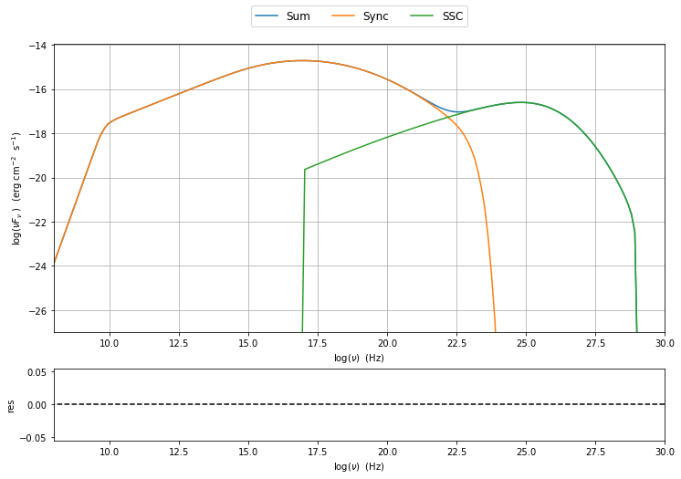

.. _jet_numerical_guide:

jet\_model user guide : Numerical setup
=======================================

Numerical computation fine-tuning
---------------------------------

Changing the grid size for the electron distribution
~~~~~~~~~~~~~~~~~~~~~~~~~~~~~~~~~~~~~~~~~~~~~~~~~~~~

.. code:: ipython3

    from jetset import jet_model
    my_jet=jet_model.Jet(name='test',electron_distribution='lppl',)

.. parsed-literal::

    blob None
    _blob <jetset.jetkernel.jetkernel.spettro; proxy of <Swig Object of type 'spettro *' at 0x108550630> >

It is possible to change the size of the grid for the electron distribution. It is worth noting that at lower values of the grid size the speed will increase, but it is not recommended to go below 100.
The acutual value of the grid size is returned by the :meth:`.Jet.get_gamma_grid_size`

.. code:: ipython3

    print (my_jet.get_gamma_grid_size())

.. parsed-literal::

    1001

and this value can be changed using the method :meth:`.Jet.set_gamma_grid_size`. In the following we show the result for a grid of size=10, as anticiapted the final integration will be not satisfactory

.. code:: ipython3

    my_jet.set_gamma_grid_size(10)
    my_jet.eval()
    sed_plot=my_jet.plot_model()
    sed_plot.rescale(x_min=8,y_min=-27)

.. image:: Jet_example_num_files/Jet_example_num_7_0.png

.. code:: ipython3

    my_jet.set_gamma_grid_size(100)
    my_jet.eval()
    sed_plot=my_jet.plot_model()
    sed_plot.rescale(x_min=8,y_min=-27)

.. image:: Jet_example_num_files/Jet_example_num_8_0.png

.. code:: ipython3

    my_jet.set_gamma_grid_size(1000)
    my_jet.eval()
    sed_plot=my_jet.plot_model()
    sed_plot.rescale(x_min=8,y_min=-27)

.. image:: Jet_example_num_files/Jet_example_num_9_0.png

.. code:: ipython3

    my_jet.set_gamma_grid_size(10000)
    my_jet.eval()
    sed_plot=my_jet.plot_model()
    sed_plot.rescale(x_min=8,y_min=-27)

.. image:: Jet_example_num_files/Jet_example_num_10_0.png

Changing the grid size for the seed photons
~~~~~~~~~~~~~~~~~~~~~~~~~~~~~~~~~~~~~~~~~~~

.. code:: ipython3

    my_jet=jet_model.Jet(name='test',electron_distribution='lppl',)

.. parsed-literal::

    blob None
    _blob <jetset.jetkernel.jetkernel.spettro; proxy of <Swig Object of type 'spettro *' at 0x112771690> >

we can get the current value of the seed photons grid size using the method :meth:`.Jet.get_seed_nu_size`

.. code:: ipython3

    print (my_jet.get_seed_nu_size())

.. parsed-literal::

    100

and this value can be changed using the method :meth:`.Jet.set_seed_nu_size`. In the following we show the result for a grid of nu_size=10

.. code:: ipython3

    my_jet.set_seed_nu_size(10)
    my_jet.eval()
    sed_plot=my_jet.plot_model()
    sed_plot.rescale(x_min=8,y_min=-27)

.. image:: Jet_example_num_files/Jet_example_num_16_0.png

Changing the grid size for the IC process spectra
~~~~~~~~~~~~~~~~~~~~~~~~~~~~~~~~~~~~~~~~~~~~~~~~~

.. code:: ipython3

    my_jet=jet_model.Jet(name='test',electron_distribution='lppl',)

.. parsed-literal::

    blob None
    _blob <jetset.jetkernel.jetkernel.spettro; proxy of <Swig Object of type 'spettro *' at 0x1126ec120> >

.. code:: ipython3

    my_jet.get_IC_nu_size()

.. parsed-literal::

    50

.. code:: ipython3

    my_jet.set_IC_nu_size(10)
    my_jet.eval()
    sed_plot=my_jet.plot_model()
    sed_plot.rescale(x_min=8,y_min=-27)

.. image:: Jet_example_num_files/Jet_example_num_20_0.png

.. code:: ipython3

    my_jet.set_IC_nu_size(100)
    my_jet.eval()
    sed_plot=my_jet.plot_model()
    sed_plot.rescale(x_min=8,y_min=-27)

