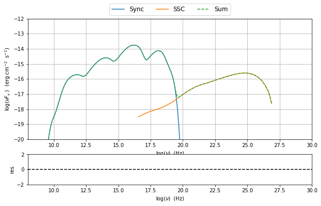
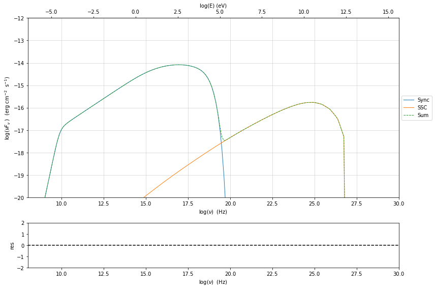
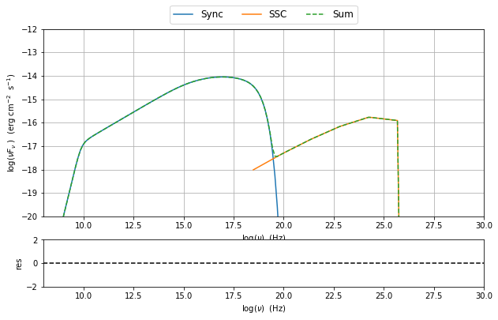

.. _jet_numerical_guide:

Numerical setup
===============

Changing the grid size for the electron distribution
----------------------------------------------------

.. code:: ipython3

    from jetset.jet_model import Jet
    my_jet=Jet(name='test',electron_distribution='lppl',)
    my_jet.show_model()

.. parsed-literal::

    
    -------------------------------------------------------------------------------------------------------------------
    jet model description
    -------------------------------------------------------------------------------------------------------------------
    name: test  
    
    electron distribution:
     type: lppl  
     electron energy grid size:  1001
     gmin grid : 2.000000e+00
     gmax grid : 1.000000e+06
     normalization  True
     log-values  False
    
    radiative fields:
     seed photons grid size:  100
     IC emission grid size:  50
     source emissivity lower bound :  1.000000e-120
     spectral components:
       name:Sum, state: on
       name:Sync, state: self-abs
       name:SSC, state: on
    external fields transformation method: blob
    
    SED info:
     nu grid size :200
     nu mix (Hz): 1.000000e+06
     nu max (Hz): 1.000000e+30
    
    flux plot lower bound   :  1.000000e-30
    
          name             par type           units             val         phys. bound. min  phys. bound. max   log  frozen
    ---------------- ------------------- --------------- ------------------ ---------------- ------------------ ----- ------
                   N    electron_density         1 / cm3              100.0              0.0               None False  False
                gmin  low-energy-cut-off lorentz-factor*                2.0              1.0       1000000000.0 False  False
                gmax high-energy-cut-off lorentz-factor*          1000000.0              1.0 1000000000000000.0 False  False
                   s   LE_spectral_slope                                2.0            -10.0               10.0 False  False
                   r  spectral_curvature                                0.4            -15.0               15.0 False  False
    gamma0_log_parab    turn-over-energy lorentz-factor*            10000.0              1.0       1000000000.0 False  False
                   R         region_size              cm 5000000000000000.0           1000.0              1e+30 False  False
                 R_H     region_position              cm              1e+17              0.0               None False   True
                   B      magnetic_field               G                0.1              0.0               None False  False
            beam_obj             beaming Lorentz-factor*               10.0           0.0001               None False  False
              z_cosm            redshift                                0.1              0.0               None False  False
    -------------------------------------------------------------------------------------------------------------------

It is possible to change the size of the grid for the electron
distributions. It is worth noting that at lower values of the grid size
the speed will increase, **but it is not recommended to go below 100**.

The actual value of the grid size is returned by the :meth:`.Jet.gamma_grid_size`

.. code:: ipython3

    print (my_jet.gamma_grid_size)

.. parsed-literal::

    1001

and this value can be changed using the method :meth:`.Jet.set_gamma_grid_size`. In the following we show the result for a grid of size=10, as anticipated the final integration will be not satisfactory

.. code:: ipython3

    my_jet.set_gamma_grid_size(10)
    my_jet.eval()
    sed_plot=my_jet.plot_model()
    sed_plot.rescale(x_min=8,y_min=-20,y_max=-12)

.. code:: ipython3

    my_jet.set_gamma_grid_size(100)
    my_jet.eval()
    sed_plot=my_jet.plot_model()
    sed_plot.rescale(x_min=8,y_min=-20,y_max=-12)

.. code:: ipython3

    my_jet.set_gamma_grid_size(1000)
    my_jet.eval()
    sed_plot=my_jet.plot_model()
    sed_plot.rescale(x_min=8,y_min=-20,y_max=-12)

Changing the grid size for the seed photons
-------------------------------------------

.. code:: ipython3

    my_jet=Jet(name='test',electron_distribution='lppl',)
    my_jet.show_model()

.. parsed-literal::

    
    -------------------------------------------------------------------------------------------------------------------
    jet model description
    -------------------------------------------------------------------------------------------------------------------
    name: test  
    
    electron distribution:
     type: lppl  
     electron energy grid size:  1001
     gmin grid : 2.000000e+00
     gmax grid : 1.000000e+06
     normalization  True
     log-values  False
    
    radiative fields:
     seed photons grid size:  100
     IC emission grid size:  50
     source emissivity lower bound :  1.000000e-120
     spectral components:
       name:Sum, state: on
       name:Sync, state: self-abs
       name:SSC, state: on
    external fields transformation method: blob
    
    SED info:
     nu grid size :200
     nu mix (Hz): 1.000000e+06
     nu max (Hz): 1.000000e+30
    
    flux plot lower bound   :  1.000000e-30
    
          name             par type           units             val         phys. bound. min  phys. bound. max   log  frozen
    ---------------- ------------------- --------------- ------------------ ---------------- ------------------ ----- ------
                   N    electron_density         1 / cm3              100.0              0.0               None False  False
                gmin  low-energy-cut-off lorentz-factor*                2.0              1.0       1000000000.0 False  False
                gmax high-energy-cut-off lorentz-factor*          1000000.0              1.0 1000000000000000.0 False  False
                   s   LE_spectral_slope                                2.0            -10.0               10.0 False  False
                   r  spectral_curvature                                0.4            -15.0               15.0 False  False
    gamma0_log_parab    turn-over-energy lorentz-factor*            10000.0              1.0       1000000000.0 False  False
                   R         region_size              cm 5000000000000000.0           1000.0              1e+30 False  False
                 R_H     region_position              cm              1e+17              0.0               None False   True
                   B      magnetic_field               G                0.1              0.0               None False  False
            beam_obj             beaming Lorentz-factor*               10.0           0.0001               None False  False
              z_cosm            redshift                                0.1              0.0               None False  False
    -------------------------------------------------------------------------------------------------------------------

we can get the current value of the seed photons grid size using attribute :meth:`.Jet.nu_seed_size`

**in the current version there is lit of the size to 1000**

.. code:: ipython3

    print (my_jet.nu_seed_size)

.. parsed-literal::

    100

and this value can be changed using the method :meth:`.Jet.set_seed_nu_size`. In the following we show the result for a grid of nu_size=10

.. code:: ipython3

    my_jet.nu_seed_size=10
    my_jet.eval()
    sed_plot=my_jet.plot_model()
    sed_plot.rescale(x_min=8,y_min=-20,y_max=-12)

.. image:: Jet_example_num_files/Jet_example_num_17_0.png

Changing the grid size for the IC process spectra
-------------------------------------------------

**in the current version there is a limit of the size to 1000**

.. code:: ipython3

    my_jet=Jet(name='test',electron_distribution='lppl',)
    my_jet.show_model()

.. parsed-literal::

    
    -------------------------------------------------------------------------------------------------------------------
    jet model description
    -------------------------------------------------------------------------------------------------------------------
    name: test  
    
    electron distribution:
     type: lppl  
     electron energy grid size:  1001
     gmin grid : 2.000000e+00
     gmax grid : 1.000000e+06
     normalization  True
     log-values  False
    
    radiative fields:
     seed photons grid size:  100
     IC emission grid size:  50
     source emissivity lower bound :  1.000000e-120
     spectral components:
       name:Sum, state: on
       name:Sync, state: self-abs
       name:SSC, state: on
    external fields transformation method: blob
    
    SED info:
     nu grid size :200
     nu mix (Hz): 1.000000e+06
     nu max (Hz): 1.000000e+30
    
    flux plot lower bound   :  1.000000e-30
    
          name             par type           units             val         phys. bound. min  phys. bound. max   log  frozen
    ---------------- ------------------- --------------- ------------------ ---------------- ------------------ ----- ------
                   N    electron_density         1 / cm3              100.0              0.0               None False  False
                gmin  low-energy-cut-off lorentz-factor*                2.0              1.0       1000000000.0 False  False
                gmax high-energy-cut-off lorentz-factor*          1000000.0              1.0 1000000000000000.0 False  False
                   s   LE_spectral_slope                                2.0            -10.0               10.0 False  False
                   r  spectral_curvature                                0.4            -15.0               15.0 False  False
    gamma0_log_parab    turn-over-energy lorentz-factor*            10000.0              1.0       1000000000.0 False  False
                   R         region_size              cm 5000000000000000.0           1000.0              1e+30 False  False
                 R_H     region_position              cm              1e+17              0.0               None False   True
                   B      magnetic_field               G                0.1              0.0               None False  False
            beam_obj             beaming Lorentz-factor*               10.0           0.0001               None False  False
              z_cosm            redshift                                0.1              0.0               None False  False
    -------------------------------------------------------------------------------------------------------------------

.. code:: ipython3

    print(my_jet.IC_nu_size)

.. parsed-literal::

    50

.. code:: ipython3

    my_jet.IC_nu_size=20
    my_jet.eval()
    sed_plot=my_jet.plot_model()
    sed_plot.rescale(x_min=8,y_min=-20,y_max=-12)

.. image:: Jet_example_num_files/Jet_example_num_22_0.png

.. code:: ipython3

    my_jet.IC_nu_size=100
    my_jet.eval()
    sed_plot=my_jet.plot_model()
    sed_plot.rescale(x_min=8,y_min=-20,y_max=-12)

