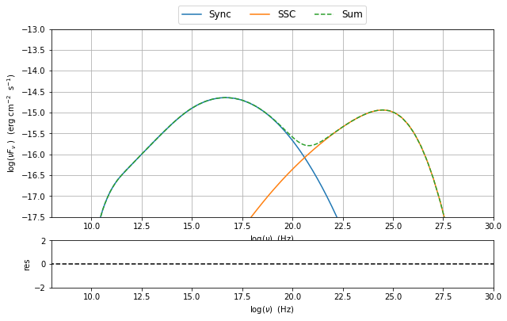
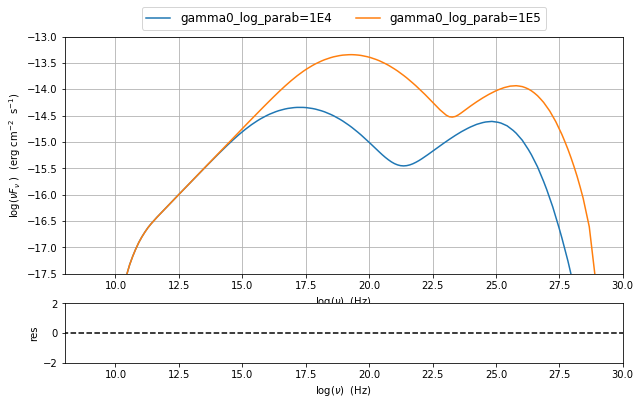

.. _jet_physical_guide:

jet\_model user guide : physical setup
======================================

In this section we describe how  to buil a model of jet able to reproduce SSC/EC emission processes, using the :class:`.Jet` class from the :mod:`.jet_model` module. to This class thorough a flexible and intuitive interface allows to access the C numerical code that provides an accurate and fast computation of the synchrotron and inverse Compoton processes.  

basic setup
-----------

A jet can be built using the  the :class:`.Jet` class, istanciating a jet object, in the following way:

.. code:: ipython3

    %matplotlib inline
    from jetset.jet_model import Jet
    my_jet=Jet(name='test',electron_distribution='lppl',)

This instruction will create:
    * a ``Jet`` object with ``name`` **test**,
    * using as electron distribution the **lppl** model, that is a log-parabola witha low-energy power-law branch.
    * using as wokring directory **test_jet_prod**

For a list of possible distribution you can run the command

.. code:: ipython3

    Jet.available_electron_distributions()

.. parsed-literal::

    lp: log-parabola
    pl: powerlaw
    lppl: log-parabola with low-energy powerlaw branch
    lpep: log-parabola defined by peak energy
    plc: powerlaw with cut-off
    bkn: broken powerlaw
    spitkov: 
    lppl_pile_up: 
    bkn_pile_up: 

The parameters of the model are accessible throug the instruction

.. code:: ipython3

    my_jet.show_pars()

.. parsed-literal::

    -------------------------------------------------------------------------------------------------------------------
    model parameters:
     Name             | Type                 | Units            | value         | phys. boundaries              | log
    -------------------------------------------------------------------------------------------------------------------
     B                | magnetic_field       | G                | +1.000000e-01 | [+0.000000e+00,No           ] | False 
     N                | electron_density     | cm^-3            | +1.000000e+02 | [+0.000000e+00,No           ] | False 
     R                | region_size          | cm               | +1.569897e+01 | [+0.000000e+00,+3.000000e+01] | True 
     beam_obj         | beaming              |                  | +1.000000e+01 | [+1.000000e+00,No           ] | False 
     gamma0_log_parab | turn-over-energy     | Lorentz-factor   | +1.000000e+04 | [+1.000000e+00,+1.000000e+08] | False 
     gmax             | high-energy-cut-off  | Lorentz-factor   | +1.000000e+06 | [+1.000000e+00,+1.000000e+15] | False 
     gmin             | low-energy-cut-off   | Lorentz-factor   | +2.000000e+00 | [+1.000000e+00,+1.000000e+05] | False 
     r                | spectral_curvature   |                  | +4.000000e-01 | [-1.500000e+01,+1.500000e+01] | False 
     s                | LE_spectral_slope    |                  | +2.000000e+00 | [-1.000000e+01,+1.000000e+01] | False 
     z_cosm           | redshift             |                  | +1.000000e-01 | [+0.000000e+00,No           ] | False 
    -------------------------------------------------------------------------------------------------------------------

Each parameter has default values. All the parameters listed are handled by :class:`.ModelParameterArray`, and each parameter is an instance of the the :class:`.JetParameter`. class

To get a full description of the model you can use the instruction

.. code:: ipython3

    my_jet.show_model()

.. parsed-literal::

    
    -------------------------------------------------------------------------------------------------------------------
    jet model description
    -------------------------------------------------------------------------------------------------------------------
    name: test  
    
    electron distribution:
     type: lppl  
     electron energy grid size:  1001
     gmin grid : 2.000000e+00
     gmax grid : 1.000000e+06
    
    radiative fields:
     seed photons grid size:  100
     IC emission grid size:  50
     source emissivity lower bound :  1.000000e-120
     spectral components:
       name:Sum, state: on
       name:Sync, state: self-abs
       name:SSC, state: on
    
    SED info:
     nu grid size :200
     nu mix (Hz): 1.000000e+06
     nu max (Hz): 1.000000e+30
    
    flux plot lower bound   :  1.000000e-30
    
    -------------------------------------------------------------------------------------------------------------------
    model parameters:
     Name             | Type                 | Units            | value         | phys. boundaries              | log
    -------------------------------------------------------------------------------------------------------------------
     B                | magnetic_field       | G                | +1.000000e-01 | [+0.000000e+00,No           ] | False 
     N                | electron_density     | cm^-3            | +1.000000e+02 | [+0.000000e+00,No           ] | False 
     R                | region_size          | cm               | +1.569897e+01 | [+0.000000e+00,+3.000000e+01] | True 
     beam_obj         | beaming              |                  | +1.000000e+01 | [+1.000000e+00,No           ] | False 
     gamma0_log_parab | turn-over-energy     | Lorentz-factor   | +1.000000e+04 | [+1.000000e+00,+1.000000e+08] | False 
     gmax             | high-energy-cut-off  | Lorentz-factor   | +1.000000e+06 | [+1.000000e+00,+1.000000e+15] | False 
     gmin             | low-energy-cut-off   | Lorentz-factor   | +2.000000e+00 | [+1.000000e+00,+1.000000e+05] | False 
     r                | spectral_curvature   |                  | +4.000000e-01 | [-1.500000e+01,+1.500000e+01] | False 
     s                | LE_spectral_slope    |                  | +2.000000e+00 | [-1.000000e+01,+1.000000e+01] | False 
     z_cosm           | redshift             |                  | +1.000000e-01 | [+0.000000e+00,No           ] | False 
    -------------------------------------------------------------------------------------------------------------------
    -------------------------------------------------------------------------------------------------------------------

as you can notice, you can now access further information regarding the
model, such as numerical configuration of the grid. These parameters
will be discussed in the :ref:\`jet\_numerical\_guide' section

setting the parameters
----------------------

assume you want to change some of the parameters in your model, you can use two methods:

1) using the :class:`.Jet.set_par()` method 

.. code:: ipython3

    my_jet.set_par('B',val=0.2)
    my_jet.set_par('gamma0_log_parab',val=5E3)
    my_jet.set_par('gmin',val=1E2)
    my_jet.set_par('gmax',val=1E8)
    my_jet.set_par('R',val=14.5)
    my_jet.set_par('N',val=1E3)

2) accessing directly the parameter 

.. code:: ipython3

    my_jet.parameters.B.val=0.2
    my_jet.parameters.r.val=0.4

evaluate and plot the model
---------------------------

At this point we can evaluate the emission for this jet model using the
instruction

.. code:: ipython3

    my_jet.eval()

.. code:: ipython3

    my_jet.show_pars()

.. parsed-literal::

    -------------------------------------------------------------------------------------------------------------------
    model parameters:
     Name             | Type                 | Units            | value         | phys. boundaries              | log
    -------------------------------------------------------------------------------------------------------------------
     B                | magnetic_field       | G                | +2.000000e-01 | [+0.000000e+00,No           ] | False 
     N                | electron_density     | cm^-3            | +1.000000e+03 | [+0.000000e+00,No           ] | False 
     R                | region_size          | cm               | +1.450000e+01 | [+0.000000e+00,+3.000000e+01] | True 
     beam_obj         | beaming              |                  | +1.000000e+01 | [+1.000000e+00,No           ] | False 
     gamma0_log_parab | turn-over-energy     | Lorentz-factor   | +5.000000e+03 | [+1.000000e+00,+1.000000e+08] | False 
     gmax             | high-energy-cut-off  | Lorentz-factor   | +1.000000e+08 | [+1.000000e+00,+1.000000e+15] | False 
     gmin             | low-energy-cut-off   | Lorentz-factor   | +1.000000e+02 | [+1.000000e+00,+1.000000e+05] | False 
     r                | spectral_curvature   |                  | +4.000000e-01 | [-1.500000e+01,+1.500000e+01] | False 
     s                | LE_spectral_slope    |                  | +2.000000e+00 | [-1.000000e+01,+1.000000e+01] | False 
     z_cosm           | redshift             |                  | +1.000000e-01 | [+0.000000e+00,No           ] | False 
    -------------------------------------------------------------------------------------------------------------------

and plot the corresponding SED:

.. code:: ipython3

    from jetset.plot_sedfit import PlotSED
    my_plot=PlotSED()
    my_jet.plot_model(plot_obj=my_plot)
    my_plot.rescale(y_max=-13,y_min=-17.5,x_min=8)

.. image:: Jet_example_phys_files/Jet_example_phys_23_0.png

alternatively, you can call the ``plot_model`` method without passing a
``Plot`` object

.. code:: ipython3

    my_plot=my_jet.plot_model()
    my_plot.rescale(y_max=-13,y_min=-17.5,x_min=8)

the ``my_plot`` objet returned will be built on the fly by the
``plot_model`` method

if you wanto to have interacitve plot:

1) in a jupyter notebook use:

.. code-block:: no

    %matplotlib notebook

2) in an ipython terminal

.. code-block:: python
    
    from matplotlib import pylab as plt
    plt.ion()

comparing models on the same plot
---------------------------------

to compare the same model after changing a parameter

.. code:: ipython3

    my_jet.parameters.gamma0_log_parab.val=1E4
    my_jet.eval()
    my_plot=my_jet.plot_model(label='gamma0_log_parab=1E4',comp='Sum')
    my_jet.set_par('gamma0_log_parab',val=1.0E5)
    my_jet.eval()
    my_plot=my_jet.plot_model(my_plot,label='gamma0_log_parab=1E5',comp='Sum')
    my_plot.rescale(y_max=-13,y_min=-17.5,x_min=8)

saving a plot
-------------

to save the plot

.. code:: ipython3

    my_plot.save('jet1.png')

saving and lodaing a model
--------------------------

.. code:: ipython3

    my_jet.save_model('test_model.dat')

.. code:: ipython3

    my_jet_new=Jet.load_model('test_model.dat')

.. parsed-literal::

    -------------------------------------------------------------------------------------------------------------------
    model parameters:
     Name             | Type                 | Units            | value         | phys. boundaries              | log
    -------------------------------------------------------------------------------------------------------------------
     B                | magnetic_field       | G                | +1.000000e-01 | [+0.000000e+00,No           ] | False 
     N                | electron_density     | cm^-3            | +1.000000e+02 | [+0.000000e+00,No           ] | False 
     R                | region_size          | cm               | +1.569897e+01 | [+0.000000e+00,+3.000000e+01] | True 
     beam_obj         | beaming              |                  | +1.000000e+01 | [+1.000000e+00,No           ] | False 
     gamma0_log_parab | turn-over-energy     | Lorentz-factor   | +1.000000e+04 | [+1.000000e+00,+1.000000e+08] | False 
     gmax             | high-energy-cut-off  | Lorentz-factor   | +1.000000e+06 | [+1.000000e+00,+1.000000e+15] | False 
     gmin             | low-energy-cut-off   | Lorentz-factor   | +2.000000e+00 | [+1.000000e+00,+1.000000e+05] | False 
     r                | spectral_curvature   |                  | +4.000000e-01 | [-1.500000e+01,+1.500000e+01] | False 
     s                | LE_spectral_slope    |                  | +2.000000e+00 | [-1.000000e+01,+1.000000e+01] | False 
     z_cosm           | redshift             |                  | +1.000000e-01 | [+0.000000e+00,No           ] | False 
    -------------------------------------------------------------------------------------------------------------------

switching on/off the particle distribution normalization
--------------------------------------------------------

As default the electron distributions are normalized, i.e. are mutliplied by a constant ``N_0``, in such a way that :

:math:`\int_{\gamma_{min}}^{\gamma_{max}} n(\gamma) d\gamma =1`, 

it means the the value `N`, refers to the actual desinty of emitters.
If you want to chance this behaviour, you can start looking at the sate of ``Norm_distr`` flag with the following command

.. code:: ipython3

    my_jet.Norm_distr

.. parsed-literal::

    1

and then you can switch off the normalization withe command

.. code:: ipython3

    my_jet.switch_Norm_distr_OFF()

or set back the normalization on with

.. code:: ipython3

    my_jet.switch_Norm_distr_ON()

setting the particle density from observed Fluxes or Luminosityes
-----------------------------------------------------------------

It is possible to set the density of emitting particle starting from some observed luminosity or flux (see the method     :meth:`.Jet.set_N_from_nuFnu`,th:`.Jet.set_N_from_nuLnu`)

.. code:: ipython3

    my_jet=Jet(name='test',electron_distribution='lppl')

this is the initial value of N

.. code:: ipython3

    my_jet.parameters.N.val

.. parsed-literal::

    100.0

we now want to set the value of ``N`` in order that the observed synchrotron flux at a given frequency matches a desired value. 
For example, assume that we whis to set ``N`` in oreder that  the sychrotron flux at math:`10^{15}` Hz is exactly matching the desired value of :math:`10^{-=14}` ergs cm-2 s-1. We can accomplish this by using the :class:`.Jet.get_par_by_name()` as follows: 

.. code:: ipython3

    
    my_jet.set_N_from_nuFnu(nuFnu_obs=1E-14,nu_obs=1E15)

This is the updated value of ``N``, obtained in order to match the given
flux at the given frequency

.. code:: ipython3

    my_jet.get_par_by_name('N').val

.. parsed-literal::

    249.04461454958587

.. code:: ipython3

    my_jet.parameters.show_pars()

.. parsed-literal::

    -------------------------------------------------------------------------------------------------------------------
    model parameters:
     Name             | Type                 | Units            | value         | phys. boundaries              | log
    -------------------------------------------------------------------------------------------------------------------
     N                | electron_density     | cm^-3            | +2.490446e+02 | [+0.000000e+00,No           ] | False 
     gmin             | low-energy-cut-off   | Lorentz-factor   | +2.000000e+00 | [+1.000000e+00,+1.000000e+05] | False 
     gmax             | high-energy-cut-off  | Lorentz-factor   | +1.000000e+06 | [+1.000000e+00,+1.000000e+15] | False 
     s                | LE_spectral_slope    |                  | +2.000000e+00 | [-1.000000e+01,+1.000000e+01] | False 
     r                | spectral_curvature   |                  | +4.000000e-01 | [-1.500000e+01,+1.500000e+01] | False 
     gamma0_log_parab | turn-over-energy     | Lorentz-factor   | +1.000000e+04 | [+1.000000e+00,+1.000000e+08] | False 
     R                | region_size          | cm               | +1.569897e+01 | [+0.000000e+00,+3.000000e+01] | True 
     B                | magnetic_field       | G                | +1.000000e-01 | [+0.000000e+00,No           ] | False 
     beam_obj         | beaming              |                  | +1.000000e+01 | [+1.000000e+00,No           ] | False 
     z_cosm           | redshift             |                  | +1.000000e-01 | [+0.000000e+00,No           ] | False 
    -------------------------------------------------------------------------------------------------------------------

.. code:: ipython3

    my_jet.eval()
    my_plot=my_jet.plot_model(label='set N from F=1E-14')
    my_plot.rescale(y_max=-13,y_min=-17.5,x_min=8)

.. image:: Jet_example_phys_files/Jet_example_phys_54_0.png

as you can see, the sychrotron flux at :math:`10^{15}` Hz is exactly matching the desired value of :math:`10^{-14}` ergs cm-2 s-1.
Alternatively, the value of N  can be obtained using the rest-frame luminosity and  freqency, using the :class:`.Jet.set_N_from_nuLnu()

.. code:: ipython3

    my_jet.set_N_from_nuLnu(L_0=1E43,nu_0=1E15)

where ``L_0`` is the rest-frame luminosity in erg/s at the rest-frame frequency ``nu_0`` in Hz.

setting the beaming factor
--------------------------

It is possible to set the bemaing factor according to the realativistic
BulkFactor and viewing angle, this can be done by setting the
``beaming_expr`` kw in the Jet constructor, possbile choiches are

-  ``delta`` to provide directly the beaming factor (default)
-  ``bulk_theta`` to provide the BulkFactor and the jet viewing angle

.. code:: ipython3

    my_jet=Jet(name='test',electron_distribution='lppl',beaming_expr='bulk_theta')

.. code:: ipython3

    my_jet.parameters.show_pars()

.. parsed-literal::

    -------------------------------------------------------------------------------------------------------------------
    model parameters:
     Name             | Type                 | Units            | value         | phys. boundaries              | log
    -------------------------------------------------------------------------------------------------------------------
     N                | electron_density     | cm^-3            | +1.000000e+02 | [+0.000000e+00,No           ] | False 
     gmin             | low-energy-cut-off   | Lorentz-factor   | +2.000000e+00 | [+1.000000e+00,+1.000000e+05] | False 
     gmax             | high-energy-cut-off  | Lorentz-factor   | +1.000000e+06 | [+1.000000e+00,+1.000000e+15] | False 
     s                | LE_spectral_slope    |                  | +2.000000e+00 | [-1.000000e+01,+1.000000e+01] | False 
     r                | spectral_curvature   |                  | +4.000000e-01 | [-1.500000e+01,+1.500000e+01] | False 
     gamma0_log_parab | turn-over-energy     | Lorentz-factor   | +1.000000e+04 | [+1.000000e+00,+1.000000e+08] | False 
     R                | region_size          | cm               | +1.569897e+01 | [+0.000000e+00,+3.000000e+01] | True 
     B                | magnetic_field       | G                | +1.000000e-01 | [+0.000000e+00,No           ] | False 
     theta            | jet-viewing-angle    | deg              | +1.000000e-01 | [+0.000000e+00,No           ] | False 
     BulkFactor       | jet-bulk-factor      | Lorentz-factor   | +1.000000e+01 | [+1.000000e+00,No           ] | False 
     z_cosm           | redshift             |                  | +1.000000e-01 | [+0.000000e+00,No           ] | False 
    -------------------------------------------------------------------------------------------------------------------

the actual value of the beaming factor che be obatained using the :meth:`.Jet.get_beaming`

.. code:: ipython3

    my_jet.get_beaming()

.. parsed-literal::

    19.943844732554165

We can change the value of ``theta`` and get the updated value of the beaming factor

.. code:: ipython3

    my_jet.set_par('theta',val=10.)

.. code:: ipython3

    my_jet.get_beaming()

.. parsed-literal::

    19.943844732554165

of course setting `beaming_expr=delta` we get the same beaming expression as in the default case

.. code:: ipython3

    my_jet=jet_model.Jet(name='test',electron_distribution='lppl',beaming_expr='delta')

.. code:: ipython3

    my_jet.parameters.show_pars()

.. parsed-literal::

    -------------------------------------------------------------------------------------------------------------------
    model parameters:
     Name             | Type                 | Units            | value         | phys. boundaries              | log
    -------------------------------------------------------------------------------------------------------------------
     N                | electron_density     | cm^-3            | +1.000000e+02 | [+0.000000e+00,No           ] | False 
     gmin             | low-energy-cut-off   | Lorentz-factor   | +2.000000e+00 | [+1.000000e+00,+1.000000e+05] | False 
     gmax             | high-energy-cut-off  | Lorentz-factor   | +1.000000e+06 | [+1.000000e+00,+1.000000e+15] | False 
     s                | LE_spectral_slope    |                  | +2.000000e+00 | [-1.000000e+01,+1.000000e+01] | False 
     r                | spectral_curvature   |                  | +4.000000e-01 | [-1.500000e+01,+1.500000e+01] | False 
     gamma0_log_parab | turn-over-energy     | Lorentz-factor   | +1.000000e+04 | [+1.000000e+00,+1.000000e+08] | False 
     R                | region_size          | cm               | +1.569897e+01 | [+0.000000e+00,+3.000000e+01] | True 
     B                | magnetic_field       | G                | +1.000000e-01 | [+0.000000e+00,No           ] | False 
     theta            | jet-viewing-angle    | deg              | +1.000000e-01 | [+0.000000e+00,No           ] | False 
     BulkFactor       | jet-bulk-factor      | Lorentz-factor   | +1.000000e+01 | [+1.000000e+00,No           ] | False 
     z_cosm           | redshift             |                  | +1.000000e-01 | [+0.000000e+00,No           ] | False 
    -------------------------------------------------------------------------------------------------------------------

accessing individual spectral components
----------------------------------------

It is possible to access specific spectral components of oura model

.. code:: ipython3

    my_jet=Jet(name='test',electron_distribution='lppl',beaming_expr='bulk_theta')
    my_jet.eval()

We can obtain this information anytime using the :meth:`.Jet.list_spectral_components` method

.. code:: ipython3

    
    my_jet.list_spectral_components()

.. parsed-literal::

    Sum
    Sync
    SSC

the on-screen message is telling us which components have been
evaluated.

and we cann access a specific component using the :meth:`.Jet.get_spectral_component_by_name` method

.. code:: ipython3

    Sync=my_jet.get_spectral_component_by_name('Sync')

OR

.. code:: ipython3

    Sync=my_jet.spectral_components.Sync

and from the ``SED`` object we can extract both the nu and nuFnu array

.. code:: ipython3

    nu_sync=Sync.SED.nu
    nuFnu_sync=Sync.SED.nuFnu

.. code:: ipython3

    print (nuFnu_sync)

.. parsed-literal::

    [1.00000000e-30 1.00000000e-30 1.00000000e-30 1.00000000e-30
     1.00000000e-30 1.00000000e-30 1.00000000e-30 1.00000000e-30
     1.00000000e-30 1.00000000e-30 1.00000000e-30 1.99195355e-26
     4.32084831e-26 9.42080231e-26 2.07796467e-25 4.64226006e-25
     1.07421835e-24 2.57262866e-24 6.33304102e-24 1.62172378e-23
     4.21830732e-23 1.10565753e-22 2.90749001e-22 7.64703810e-22
     2.01137205e-21 5.29044499e-21 1.39152631e-20 3.66005742e-20
     9.62674977e-20 2.53161731e-19 6.65135791e-19 1.74532879e-18
     4.47162406e-18 1.04798662e-17 2.22510780e-17 3.42183006e-17
     4.73795507e-17 5.98146121e-17 7.08393890e-17 8.27924884e-17
     9.58571035e-17 1.10361592e-16 1.26894305e-16 1.45793212e-16
     1.67429058e-16 1.92253041e-16 2.20741484e-16 2.53430172e-16
     2.90956596e-16 3.34034909e-16 3.83482107e-16 4.40231844e-16
     5.05364252e-16 5.80111171e-16 6.65860835e-16 7.64238867e-16
     8.77094393e-16 1.00644889e-15 1.15473841e-15 1.32470643e-15
     1.51922268e-15 1.74184487e-15 1.99657203e-15 2.28728218e-15
     2.61887108e-15 2.99699329e-15 3.42637539e-15 3.91284208e-15
     4.46398022e-15 5.08436971e-15 5.77822165e-15 6.55504712e-15
     7.41688282e-15 8.35893256e-15 9.39317225e-15 1.05162021e-14
     1.17012783e-14 1.29677483e-14 1.43077405e-14 1.56618661e-14
     1.70669190e-14 1.85140020e-14 1.99149955e-14 2.13199797e-14
     2.27192694e-14 2.40181924e-14 2.52556860e-14 2.64340055e-14
     2.74611617e-14 2.83590869e-14 2.91498397e-14 2.97544176e-14
     3.01736120e-14 3.04551553e-14 3.05414488e-14 3.04103209e-14
     3.01368848e-14 2.96892404e-14 2.90230677e-14 2.82372882e-14
     2.73248535e-14 2.62226222e-14 2.50449532e-14 2.38042485e-14
     2.24239213e-14 2.10225626e-14 1.96144574e-14 1.81447517e-14
     1.66964251e-14 1.52898970e-14 1.38900619e-14 1.25442884e-14
     1.12742894e-14 1.00574503e-14 8.91399490e-15 7.86233347e-15
     6.88692857e-15 5.99001626e-15 5.18464148e-15 4.45908613e-15
     3.80577564e-15 3.23238294e-15 2.72949108e-15 2.28586629e-15
     1.90500228e-15 1.57929305e-15 1.29769920e-15 1.06107838e-15
     8.63339561e-16 6.96082614e-16 5.58275014e-16 4.45484724e-16
     3.52308323e-16 2.76800930e-16 2.16201897e-16 1.67118893e-16
     1.27789365e-16 9.67429184e-17 7.19114364e-17 5.19813320e-17
     3.65724953e-17 2.45791387e-17 1.51568234e-17 8.62852876e-18
     4.37420009e-18 1.73809120e-18 5.58993124e-19 1.38471677e-19
     1.84044040e-20 1.46229352e-21 6.75656391e-23 6.84161407e-25
     2.05558538e-27 1.70711836e-30 1.00000000e-30 1.00000000e-30
     1.00000000e-30 1.00000000e-30 1.00000000e-30 1.00000000e-30
     1.00000000e-30 1.00000000e-30 1.00000000e-30 1.00000000e-30
     1.00000000e-30 1.00000000e-30 1.00000000e-30 1.00000000e-30
     1.00000000e-30 1.00000000e-30 1.00000000e-30 1.00000000e-30
     1.00000000e-30 1.00000000e-30 1.00000000e-30 1.00000000e-30
     1.00000000e-30 1.00000000e-30 1.00000000e-30 1.00000000e-30
     1.00000000e-30 1.00000000e-30 1.00000000e-30 1.00000000e-30
     1.00000000e-30 1.00000000e-30 1.00000000e-30 1.00000000e-30
     1.00000000e-30 1.00000000e-30 1.00000000e-30 1.00000000e-30
     1.00000000e-30 1.00000000e-30 1.00000000e-30 1.00000000e-30
     1.00000000e-30 1.00000000e-30 1.00000000e-30 1.00000000e-30]

