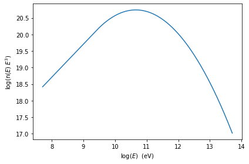
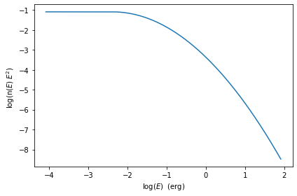
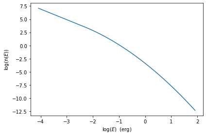
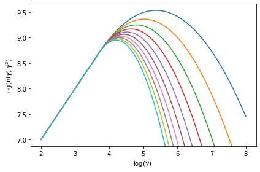
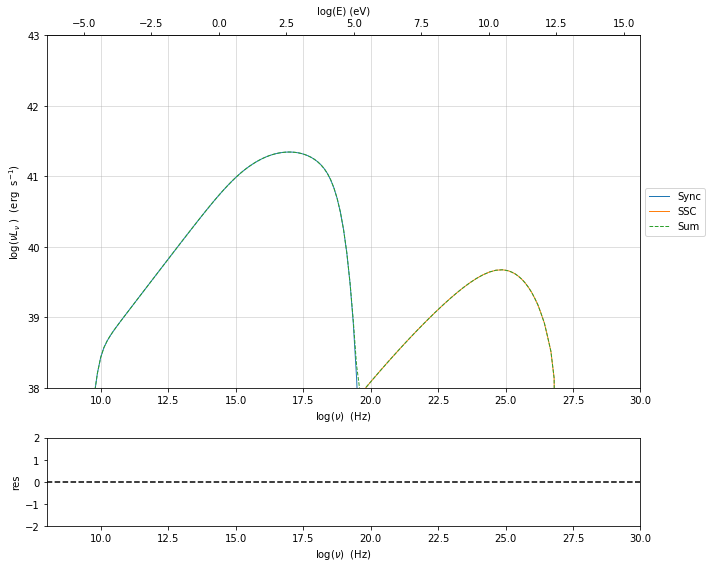
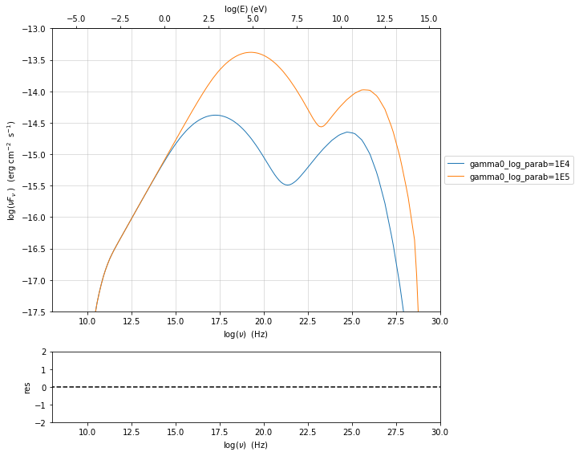
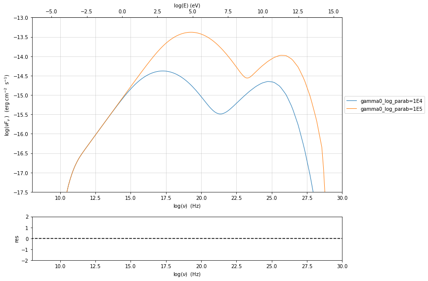

.. _jet_physical_guide:

dsad

Physical setup
==============

In this section we describe how  to build a model of jet able to reproduce SSC/EC emission processes, using the :class:`.Jet` class from the :mod:`.jet_model` module. to This class through a flexible and intuitive interface allows to access the C numerical code that provides an accurate and fast computation of the synchrotron and inverse Compton processes.  

Basic setup
-----------

A jet instance can be built using the  the :class:`.Jet` class, istanciating the object in the following way:

.. code:: ipython3

    from jetset.jet_model import Jet
    my_jet=Jet(name='test',electron_distribution='lppl',)

This instruction will create:
    * a ``Jet`` object with ``name`` **test**,
    * using as electron distribution the **lppl** model, that is a log-parabola with a low-energy power-law branch.

(a  working directory ``jet_wd`` will be created, this directory can be deleted when all the precesses of your script are done)

For a list of possible distribution you can run the command 

.. code:: ipython3

    Jet.available_electron_distributions()

.. parsed-literal::

    lp: log-parabola
    pl: powerlaw
    lppl: log-parabola with low-energy powerlaw branch
    lpep: log-parabola defined by peak energy
    plc: powerlaw with cut-off
    bkn: broken powerlaw
    spitkov: spitkov
    lppl_pile_up: log-parabola with low-energy powerlaw branch and pile-up
    bkn_pile_up: broken powerlaw and pileup

to view all the paramters:

custom electron distributions can be created by the user as described in this section of the tutorial :ref:`custom_emitters_guide` 

.. code:: ipython3

    my_jet.show_pars()

.. parsed-literal::

          name             par type           units          val      phys. bound. min phys. bound. max  log  frozen
    ---------------- ------------------- --------------- ------------ ---------------- ---------------- ----- ------
                gmin  low-energy-cut-off lorentz-factor* 2.000000e+00     1.000000e+00     1.000000e+09 False  False
                gmax high-energy-cut-off lorentz-factor* 1.000000e+06     1.000000e+00     1.000000e+15 False  False
                   N    emitters_density         1 / cm3 1.000000e+02     0.000000e+00               -- False  False
                   s   LE_spectral_slope                 2.000000e+00    -1.000000e+01     1.000000e+01 False  False
                   r  spectral_curvature                 4.000000e-01    -1.500000e+01     1.500000e+01 False  False
    gamma0_log_parab    turn-over-energy lorentz-factor* 1.000000e+04     1.000000e+00     1.000000e+09 False  False
                   R         region_size              cm 5.000000e+15     1.000000e+03     1.000000e+30 False  False
                 R_H     region_position              cm 1.000000e+17     0.000000e+00               -- False   True
                   B      magnetic_field               G 1.000000e-01     0.000000e+00               -- False  False
            beam_obj             beaming Lorentz-factor* 1.000000e+01     1.000000e-04               -- False  False
              z_cosm            redshift                 1.000000e-01     0.000000e+00               -- False  False

Each parameter has default values. All the parameters listed are handled by :class:`.ModelParameterArray`, and each parameter is an instance of the the :class:`.JetParameter`. class. These parameters are also accessible as an astropy table, with units: 

.. code:: ipython3

    my_jet.parameters.par_table

.. raw:: html

    <i>Table length=11</i>
    <table id="table4790717328" class="table-striped table-bordered table-condensed">
    <thead><tr><th>name</th><th>par type</th><th>units</th><th>val</th><th>phys. bound. min</th><th>phys. bound. max</th><th>log</th><th>frozen</th></tr></thead>
    <thead><tr><th>str16</th><th>str19</th><th>object</th><th>float64</th><th>float64</th><th>float64</th><th>bool</th><th>bool</th></tr></thead>
    <tr><td>gmin</td><td>low-energy-cut-off</td><td>lorentz-factor*</td><td>2.000000e+00</td><td>1.000000e+00</td><td>1.000000e+09</td><td>False</td><td>False</td></tr>
    <tr><td>gmax</td><td>high-energy-cut-off</td><td>lorentz-factor*</td><td>1.000000e+06</td><td>1.000000e+00</td><td>1.000000e+15</td><td>False</td><td>False</td></tr>
    <tr><td>N</td><td>emitters_density</td><td>1 / cm3</td><td>1.000000e+02</td><td>0.000000e+00</td><td>--</td><td>False</td><td>False</td></tr>
    <tr><td>s</td><td>LE_spectral_slope</td><td></td><td>2.000000e+00</td><td>-1.000000e+01</td><td>1.000000e+01</td><td>False</td><td>False</td></tr>
    <tr><td>r</td><td>spectral_curvature</td><td></td><td>4.000000e-01</td><td>-1.500000e+01</td><td>1.500000e+01</td><td>False</td><td>False</td></tr>
    <tr><td>gamma0_log_parab</td><td>turn-over-energy</td><td>lorentz-factor*</td><td>1.000000e+04</td><td>1.000000e+00</td><td>1.000000e+09</td><td>False</td><td>False</td></tr>
    <tr><td>R</td><td>region_size</td><td>cm</td><td>5.000000e+15</td><td>1.000000e+03</td><td>1.000000e+30</td><td>False</td><td>False</td></tr>
    <tr><td>R_H</td><td>region_position</td><td>cm</td><td>1.000000e+17</td><td>0.000000e+00</td><td>--</td><td>False</td><td>True</td></tr>
    <tr><td>B</td><td>magnetic_field</td><td>G</td><td>1.000000e-01</td><td>0.000000e+00</td><td>--</td><td>False</td><td>False</td></tr>
    <tr><td>beam_obj</td><td>beaming</td><td>Lorentz-factor*</td><td>1.000000e+01</td><td>1.000000e-04</td><td>--</td><td>False</td><td>False</td></tr>
    <tr><td>z_cosm</td><td>redshift</td><td></td><td>1.000000e-01</td><td>0.000000e+00</td><td>--</td><td>False</td><td>False</td></tr>
    </table>

this means that you can easily convert the values in the table using the units module of astropy. 

.. warning::
    Please note, that the table is built on the fly from the  :class:`.ModelParameterArray` and each modification you do to this table will not be reflected on the actual parameters values

To get a full description of the model you can use the instruction

.. code:: ipython3

    my_jet.show_model()

.. parsed-literal::

    
    -------------------------------------------------------------------------------------------------------------------
    jet model description
    -------------------------------------------------------------------------------------------------------------------
    name: test  
    
    electrons distribution:
     type: lppl  
     gamma energy grid size:  1001
     gmin grid : 2.000000e+00
     gmax grid : 1.000000e+06
     normalization  True
     log-values  False
    
    radiative fields:
     seed photons grid size:  100
     IC emission grid size:  50
     source emissivity lower bound :  1.000000e-120
     spectral components:
       name:Sum, state: on
       name:Sync, state: self-abs
       name:SSC, state: on
    external fields transformation method: blob
    
    SED info:
     nu grid size :200
     nu mix (Hz): 1.000000e+06
     nu max (Hz): 1.000000e+30
    
    flux plot lower bound   :  1.000000e-120
    
          name             par type           units          val      phys. bound. min phys. bound. max  log  frozen
    ---------------- ------------------- --------------- ------------ ---------------- ---------------- ----- ------
                gmin  low-energy-cut-off lorentz-factor* 2.000000e+00     1.000000e+00     1.000000e+09 False  False
                gmax high-energy-cut-off lorentz-factor* 1.000000e+06     1.000000e+00     1.000000e+15 False  False
                   N    emitters_density         1 / cm3 1.000000e+02     0.000000e+00               -- False  False
                   s   LE_spectral_slope                 2.000000e+00    -1.000000e+01     1.000000e+01 False  False
                   r  spectral_curvature                 4.000000e-01    -1.500000e+01     1.500000e+01 False  False
    gamma0_log_parab    turn-over-energy lorentz-factor* 1.000000e+04     1.000000e+00     1.000000e+09 False  False
                   R         region_size              cm 5.000000e+15     1.000000e+03     1.000000e+30 False  False
                 R_H     region_position              cm 1.000000e+17     0.000000e+00               -- False   True
                   B      magnetic_field               G 1.000000e-01     0.000000e+00               -- False  False
            beam_obj             beaming Lorentz-factor* 1.000000e+01     1.000000e-04               -- False  False
              z_cosm            redshift                 1.000000e-01     0.000000e+00               -- False  False
    -------------------------------------------------------------------------------------------------------------------

as you can notice, you can now access further information regarding the model, such as numerical configuration of the grid. These parameters will be discussed 
in the :ref:`jet_numerical_guide' section

If you want to use a cosmology model different from the default one please read the :ref:`cosmology` section.

.. warning::
    Starting from version 1.1.0, the `R` parameter as default is linear and not logarithmic, please update your old scripts
    setting `R` with linear values.   
   

Setting the parameters
----------------------

assume you want to change some of the parameters in your model, you can use two methods: 

1) using the :class:`.Jet.set_par()` method 

.. code:: ipython3

    my_jet.set_par('B',val=0.2)
    my_jet.set_par('gamma0_log_parab',val=5E3)
    my_jet.set_par('gmin',val=1E2)
    my_jet.set_par('gmax',val=1E8)
    my_jet.set_par('R',val=1E15)
    my_jet.set_par('N',val=1E3)

2) accessing directly the parameter 

.. code:: ipython3

    my_jet.parameters.B.val=0.2
    my_jet.parameters.r.val=0.4

Investigating the electron distribution
---------------------------------------

for setting custom electron distributions can be created by the user as described in this section of the tutorial :ref:`custom_emitters_guide` 

.. code:: ipython3

    my_jet.show_electron_distribution()

.. parsed-literal::

    -------------------------------------------------------------------------------------------------------------------
    electrons distribution:
     type: lppl  
     gamma energy grid size:  1001
     gmin grid : 2.000000e+00
     gmax grid : 1.000000e+06
     normalization  True
     log-values  False
    
          name             par type           units          val      phys. bound. min phys. bound. max  log  frozen
    ---------------- ------------------- --------------- ------------ ---------------- ---------------- ----- ------
                   B      magnetic_field               G 2.000000e-01     0.000000e+00               -- False  False
                   N    emitters_density         1 / cm3 1.000000e+03     0.000000e+00               -- False  False
                   R         region_size              cm 1.000000e+15     1.000000e+03     1.000000e+30 False  False
                 R_H     region_position              cm 1.000000e+17     0.000000e+00               -- False   True
            beam_obj             beaming Lorentz-factor* 1.000000e+01     1.000000e-04               -- False  False
    gamma0_log_parab    turn-over-energy lorentz-factor* 5.000000e+03     1.000000e+00     1.000000e+09 False  False
                gmax high-energy-cut-off lorentz-factor* 1.000000e+08     1.000000e+00     1.000000e+15 False  False
                gmin  low-energy-cut-off lorentz-factor* 1.000000e+02     1.000000e+00     1.000000e+09 False  False
                   r  spectral_curvature                 4.000000e-01    -1.500000e+01     1.500000e+01 False  False
                   s   LE_spectral_slope                 2.000000e+00    -1.000000e+01     1.000000e+01 False  False
              z_cosm            redshift                 1.000000e-01     0.000000e+00               -- False  False

.. code:: ipython3

    p=my_jet.electron_distribution.plot3p()

.. code:: ipython3

    p=my_jet.electron_distribution.plot3p(energy_unit='eV')

.. image:: Jet_example_phys_SSC_files/Jet_example_phys_SSC_29_0.png

.. code:: ipython3

    p=my_jet.electron_distribution.plot2p(energy_unit='erg')

.. code:: ipython3

    p=my_jet.electron_distribution.plot(energy_unit='erg')

.. code:: ipython3

    import numpy as np
    p=None
    for r in np.linspace(0.3,1,10):
        my_jet.parameters.r.val=r
        if p is None:
            p=my_jet.electron_distribution.plot3p()
        else:
            p=my_jet.electron_distribution.plot3p(p)

Using log values for electron distribution parameters
~~~~~~~~~~~~~~~~~~~~~~~~~~~~~~~~~~~~~~~~~~~~~~~~~~~~~

.. code:: ipython3

    my_jet=Jet(name='test',electron_distribution='lppl',electron_distribution_log_values=True)
    my_jet.show_model()

.. parsed-literal::

    
    -------------------------------------------------------------------------------------------------------------------
    jet model description
    -------------------------------------------------------------------------------------------------------------------
    name: test  
    
    electrons distribution:
     type: lppl  
     gamma energy grid size:  1001
     gmin grid : 2.000000e+00
     gmax grid : 1.000000e+06
     normalization  True
     log-values  True
    
    radiative fields:
     seed photons grid size:  100
     IC emission grid size:  50
     source emissivity lower bound :  1.000000e-120
     spectral components:
       name:Sum, state: on
       name:Sync, state: self-abs
       name:SSC, state: on
    external fields transformation method: blob
    
    SED info:
     nu grid size :200
     nu mix (Hz): 1.000000e+06
     nu max (Hz): 1.000000e+30
    
    flux plot lower bound   :  1.000000e-120
    
          name             par type           units          val      phys. bound. min phys. bound. max  log  frozen
    ---------------- ------------------- --------------- ------------ ---------------- ---------------- ----- ------
                gmin  low-energy-cut-off lorentz-factor* 3.010300e-01     0.000000e+00     9.000000e+00  True  False
                gmax high-energy-cut-off lorentz-factor* 6.000000e+00     0.000000e+00     1.500000e+01  True  False
                   N    emitters_density         1 / cm3 1.000000e+02     0.000000e+00               -- False  False
                   s   LE_spectral_slope                 2.000000e+00    -1.000000e+01     1.000000e+01 False  False
                   r  spectral_curvature                 4.000000e-01    -1.500000e+01     1.500000e+01 False  False
    gamma0_log_parab    turn-over-energy lorentz-factor* 4.000000e+00     0.000000e+00     9.000000e+00  True  False
                   R         region_size              cm 5.000000e+15     1.000000e+03     1.000000e+30 False  False
                 R_H     region_position              cm 1.000000e+17     0.000000e+00               -- False   True
                   B      magnetic_field               G 1.000000e-01     0.000000e+00               -- False  False
            beam_obj             beaming Lorentz-factor* 1.000000e+01     1.000000e-04               -- False  False
              z_cosm            redshift                 1.000000e-01     0.000000e+00               -- False  False
    -------------------------------------------------------------------------------------------------------------------

Evaluate and plot the model
---------------------------

At this point we can evaluate the emission for this jet model using the
instruction

.. code:: ipython3

    my_jet.eval()

.. code:: ipython3

    my_jet.show_pars()

.. parsed-literal::

          name             par type           units          val      phys. bound. min phys. bound. max  log  frozen
    ---------------- ------------------- --------------- ------------ ---------------- ---------------- ----- ------
                gmin  low-energy-cut-off lorentz-factor* 3.010300e-01     0.000000e+00     9.000000e+00  True  False
                gmax high-energy-cut-off lorentz-factor* 6.000000e+00     0.000000e+00     1.500000e+01  True  False
                   N    emitters_density         1 / cm3 1.000000e+02     0.000000e+00               -- False  False
                   s   LE_spectral_slope                 2.000000e+00    -1.000000e+01     1.000000e+01 False  False
                   r  spectral_curvature                 4.000000e-01    -1.500000e+01     1.500000e+01 False  False
    gamma0_log_parab    turn-over-energy lorentz-factor* 4.000000e+00     0.000000e+00     9.000000e+00  True  False
                   R         region_size              cm 5.000000e+15     1.000000e+03     1.000000e+30 False  False
                 R_H     region_position              cm 1.000000e+17     0.000000e+00               -- False   True
                   B      magnetic_field               G 1.000000e-01     0.000000e+00               -- False  False
            beam_obj             beaming Lorentz-factor* 1.000000e+01     1.000000e-04               -- False  False
              z_cosm            redshift                 1.000000e-01     0.000000e+00               -- False  False

and plot the corresponding SED:

.. code:: ipython3

    from jetset.plot_sedfit import PlotSED
    my_plot=PlotSED()
    my_jet.plot_model(plot_obj=my_plot)
    my_plot.rescale(y_max=-13,y_min=-17.5,x_min=8)

alternatively, you can call the ``plot_model`` method without passing a
``Plot`` object

.. code:: ipython3

    my_plot=my_jet.plot_model()
    my_plot.rescale(y_max=-13,y_min=-17.5,x_min=8)

.. image:: Jet_example_phys_SSC_files/Jet_example_phys_SSC_43_0.png

If you want to have more points on the IC spectrum you can set the numerical  parameters for radiative fields(see :ref:`jet_numerical_guide' section for more details):

.. code:: ipython3

    my_jet.set_IC_nu_size(100)

.. code:: ipython3

    my_jet.eval()
    my_plot=my_jet.plot_model()
    my_plot.rescale(y_max=-13,y_min=-17.5,x_min=8)

you can access the same plot, but in the rest frame of the black hole,
or accretion disk, hence plotting the isotropic luminosity, by simply
passing the ``frame`` kw to ``src``

.. code:: ipython3

    my_plot=my_jet.plot_model(frame='src')
    my_plot.rescale(y_max=43,y_min=38,x_min=8)

.. image:: Jet_example_phys_SSC_files/Jet_example_phys_SSC_48_0.png

the ``my_plot`` object returned will be built on the fly by the
``plot_model`` method

if you wanto to have interacitve plot:

1) in a jupyter notebook use:

.. code-block:: no

    %matplotlib notebook

2) in jupyter lab:
  .. code-block:: no

    %matplotlib notebook

3) in an ipython terminal

.. code-block:: python
    
    from matplotlib import pylab as plt
    plt.ion()

Comparing models on the same plot
---------------------------------

to compare the same model after changing a parameter

.. code:: ipython3

    my_jet=Jet(name='test',electron_distribution='lppl',)
    my_jet.set_par('B',val=0.2)
    my_jet.set_par('gamma0_log_parab',val=5E3)
    my_jet.set_par('gmin',val=1E2)
    my_jet.set_par('gmax',val=1E8)
    my_jet.set_par('R',val=10**14.5)
    my_jet.set_par('N',val=1E3)
    
    my_jet.parameters.gamma0_log_parab.val=1E4
    my_jet.eval()
    my_plot=my_jet.plot_model(label='gamma0_log_parab=1E4',comp='Sum')
    my_jet.set_par('gamma0_log_parab',val=1.0E5)
    my_jet.eval()
    my_plot=my_jet.plot_model(my_plot,label='gamma0_log_parab=1E5',comp='Sum')
    my_plot.rescale(y_max=-13,y_min=-17.5,x_min=8)

Saving a plot
-------------

to save the plot

.. code:: ipython3

    my_plot.save('jet1.png')

Saving and loading a model
--------------------------

.. warning::
    starting from version 1.1.0 the saved model format has changed, if you have models saved with version<1.1.0,  
    please update them the new models by loading the old models with the :meth:`.Jet.load_old_model`  
    and then saving them again.

.. code:: ipython3

    my_jet.save_model('test_model.pkl')

.. code:: ipython3

    my_jet_new=Jet.load_model('test_model.pkl')

.. parsed-literal::

          name             par type           units          val      phys. bound. min phys. bound. max  log  frozen
    ---------------- ------------------- --------------- ------------ ---------------- ---------------- ----- ------
                gmin  low-energy-cut-off lorentz-factor* 1.000000e+02     1.000000e+00     1.000000e+09 False  False
                gmax high-energy-cut-off lorentz-factor* 1.000000e+08     1.000000e+00     1.000000e+15 False  False
                   N    emitters_density         1 / cm3 1.000000e+03     0.000000e+00               -- False  False
                   s   LE_spectral_slope                 2.000000e+00    -1.000000e+01     1.000000e+01 False  False
                   r  spectral_curvature                 4.000000e-01    -1.500000e+01     1.500000e+01 False  False
    gamma0_log_parab    turn-over-energy lorentz-factor* 1.000000e+05     1.000000e+00     1.000000e+09 False  False
                   R         region_size              cm 3.162278e+14     1.000000e+03     1.000000e+30 False  False
                 R_H     region_position              cm 1.000000e+17     0.000000e+00               -- False   True
                   B      magnetic_field               G 2.000000e-01     0.000000e+00               -- False  False
            beam_obj             beaming Lorentz-factor* 1.000000e+01     1.000000e-04               -- False  False
              z_cosm            redshift                 1.000000e-01     0.000000e+00               -- False  False

Switching on/off the particle distribution normalization
--------------------------------------------------------

As default the electron distributions are normalized, i.e. are multiplied by a constant ``N_0``, in such a way that :

:math:`\int_{\gamma_{min}}^{\gamma_{max}} n(\gamma) d\gamma =1`, 

it means the the value `N`, refers to the actual density of emitters.
If you want to chance this behavior, you can start looking at the sate of ``Norm_distr`` flag with the following command

.. code:: ipython3

    my_jet.Norm_distr

.. parsed-literal::

    1

and then you can switch off the normalization withe command

.. code:: ipython3

    my_jet.switch_Norm_distr_OFF()

OR

.. code:: ipython3

    my_jet.Norm_distr=0

.. code:: ipython3

    my_jet.switch_Norm_distr_ON()

OR

.. code:: ipython3

    my_jet.Norm_distr=1

Setting the particle density from observed Fluxes or Luminosities
-----------------------------------------------------------------

It is possible to set the density of emitting particle starting from some observed luminosity or flux (see the method     :meth:`.Jet.set_N_from_nuFnu`, and  :meth:`.Jet.set_N_from_nuLnu`)

.. code:: ipython3

    my_jet=Jet(name='test',electron_distribution='lppl')

this is the initial value of N

.. code:: ipython3

    my_jet.parameters.N.val

.. parsed-literal::

    100.0

we now want to set the value of ``N`` in order that the observed synchrotron flux at a given frequency matches a desired value. 
For example, assume that we wish to set ``N`` in order that  the synchrotron flux at :math:`10^{15}` Hz is exactly matching the desired value of :math:`10^{-14}` ergs cm-2 s-1. We can accomplish this by using the  method :meth:`.Jet.set_N_from_nuFnu()` as follows: 

.. code:: ipython3

    
    my_jet.set_N_from_nuFnu(nuFnu_obs=1E-14,nu_obs=1E15)

This is the updated value of ``N``, obtained in order to match the given
flux at the given frequency

.. code:: ipython3

    my_jet.get_par_by_name('N').val

.. parsed-literal::

    271.77338679726086

OR

.. code:: ipython3

    my_jet.parameters.N.val

.. parsed-literal::

    271.77338679726086

.. code:: ipython3

    my_jet.parameters.show_pars()

.. parsed-literal::

          name             par type           units          val      phys. bound. min phys. bound. max  log  frozen
    ---------------- ------------------- --------------- ------------ ---------------- ---------------- ----- ------
                gmin  low-energy-cut-off lorentz-factor* 2.000000e+00     1.000000e+00     1.000000e+09 False  False
                gmax high-energy-cut-off lorentz-factor* 1.000000e+06     1.000000e+00     1.000000e+15 False  False
                   N    emitters_density         1 / cm3 2.717734e+02     0.000000e+00               -- False  False
                   s   LE_spectral_slope                 2.000000e+00    -1.000000e+01     1.000000e+01 False  False
                   r  spectral_curvature                 4.000000e-01    -1.500000e+01     1.500000e+01 False  False
    gamma0_log_parab    turn-over-energy lorentz-factor* 1.000000e+04     1.000000e+00     1.000000e+09 False  False
                   R         region_size              cm 5.000000e+15     1.000000e+03     1.000000e+30 False  False
                 R_H     region_position              cm 1.000000e+17     0.000000e+00               -- False   True
                   B      magnetic_field               G 1.000000e-01     0.000000e+00               -- False  False
            beam_obj             beaming Lorentz-factor* 1.000000e+01     1.000000e-04               -- False  False
              z_cosm            redshift                 1.000000e-01     0.000000e+00               -- False  False

.. code:: ipython3

    my_jet.eval()
    my_plot=my_jet.plot_model(label='set N from F=1E-14')
    my_plot.rescale(y_max=-13,y_min=-17.5,x_min=8)

.. image:: Jet_example_phys_SSC_files/Jet_example_phys_SSC_84_0.png

as you can see, the synchrotron flux at :math:`10^{15}` Hz is exactly matching the desired value of :math:`10^{-14}` ergs cm-2 s-1.
Alternatively, the value of N  can be obtained using the rest-frame luminosity and  frequency, using the method :meth:`.Jet.set_N_from_nuLnu`

.. code:: ipython3

    my_jet.set_N_from_nuLnu(nuLnu_src=1E43,nu_src=1E15)

where ``L_0`` is the source rest-frame isotropic luminosity in erg/s at the rest-frame frequency ``nu_0`` in Hz.

Setting the beaming factor and expression
-----------------------------------------

## 

It is possible to set the beaming factor according to the relativistic BulkFactor and viewing angle, this can be done by setting the ``beaming_expr`` kw in the Jet constructor, possible choices are

* `delta` to provide directly the beaming factor (default)
* `bulk_theta` to provide the BulkFactor and the jet  viewing angle 

.. code:: ipython3

    my_jet=Jet(name='test',electron_distribution='lppl',beaming_expr='bulk_theta')

.. code:: ipython3

    my_jet.parameters.show_pars()

.. parsed-literal::

          name             par type           units          val      phys. bound. min phys. bound. max  log  frozen
    ---------------- ------------------- --------------- ------------ ---------------- ---------------- ----- ------
                gmin  low-energy-cut-off lorentz-factor* 2.000000e+00     1.000000e+00     1.000000e+09 False  False
                gmax high-energy-cut-off lorentz-factor* 1.000000e+06     1.000000e+00     1.000000e+15 False  False
                   N    emitters_density         1 / cm3 1.000000e+02     0.000000e+00               -- False  False
                   s   LE_spectral_slope                 2.000000e+00    -1.000000e+01     1.000000e+01 False  False
                   r  spectral_curvature                 4.000000e-01    -1.500000e+01     1.500000e+01 False  False
    gamma0_log_parab    turn-over-energy lorentz-factor* 1.000000e+04     1.000000e+00     1.000000e+09 False  False
                   R         region_size              cm 5.000000e+15     1.000000e+03     1.000000e+30 False  False
                 R_H     region_position              cm 1.000000e+17     0.000000e+00               -- False   True
                   B      magnetic_field               G 1.000000e-01     0.000000e+00               -- False  False
               theta   jet-viewing-angle             deg 1.000000e-01     0.000000e+00               -- False  False
          BulkFactor     jet-bulk-factor Lorentz-factor* 1.000000e+01     1.000000e+00               -- False  False
              z_cosm            redshift                 1.000000e-01     0.000000e+00               -- False  False

the actual value of the beaming factor can be obtained using the :meth:`.Jet.get_beaming`

.. code:: ipython3

    my_jet.get_beaming()

.. parsed-literal::

    19.943844732554165

We can change the value of ``theta`` and get the updated value of the beaming factor

.. code:: ipython3

    my_jet.set_par('theta',val=10.)

.. code:: ipython3

    my_jet.get_beaming()

.. parsed-literal::

    4.968041140891955

of course setting ``beaming_expr=delta`` we get the same beaming
expression as in the default case

.. code:: ipython3

    my_jet=Jet(name='test',electron_distribution='lppl',beaming_expr='delta')

.. code:: ipython3

    my_jet.parameters.show_pars()

.. parsed-literal::

          name             par type           units          val      phys. bound. min phys. bound. max  log  frozen
    ---------------- ------------------- --------------- ------------ ---------------- ---------------- ----- ------
                gmin  low-energy-cut-off lorentz-factor* 2.000000e+00     1.000000e+00     1.000000e+09 False  False
                gmax high-energy-cut-off lorentz-factor* 1.000000e+06     1.000000e+00     1.000000e+15 False  False
                   N    emitters_density         1 / cm3 1.000000e+02     0.000000e+00               -- False  False
                   s   LE_spectral_slope                 2.000000e+00    -1.000000e+01     1.000000e+01 False  False
                   r  spectral_curvature                 4.000000e-01    -1.500000e+01     1.500000e+01 False  False
    gamma0_log_parab    turn-over-energy lorentz-factor* 1.000000e+04     1.000000e+00     1.000000e+09 False  False
                   R         region_size              cm 5.000000e+15     1.000000e+03     1.000000e+30 False  False
                 R_H     region_position              cm 1.000000e+17     0.000000e+00               -- False   True
                   B      magnetic_field               G 1.000000e-01     0.000000e+00               -- False  False
            beam_obj             beaming Lorentz-factor* 1.000000e+01     1.000000e-04               -- False  False
              z_cosm            redshift                 1.000000e-01     0.000000e+00               -- False  False

Accessing individual spectral components
----------------------------------------

It is possible to access specific spectral components of our model

.. code:: ipython3

    my_jet=Jet(name='test',electron_distribution='lppl',beaming_expr='bulk_theta')
    my_jet.eval()

We can obtain this information anytime using the :meth:`.Jet.list_spectral_components` method

.. code:: ipython3

    
    my_jet.list_spectral_components()

.. parsed-literal::

    Sum
    Sync
    SSC

the on-screen message is telling us which components have been
evaluated.

and we cann access a specific component using the :meth:`.Jet.get_spectral_component_by_name` method

.. code:: ipython3

    Sync=my_jet.get_spectral_component_by_name('Sync')

OR

.. code:: ipython3

    Sync=my_jet.spectral_components.Sync

and from the ``SED`` object we can extract both the nu and nuFnu array

.. code:: ipython3

    nu_sync=Sync.SED.nu
    nuFnu_sync=Sync.SED.nuFnu

.. code:: ipython3

    print (nuFnu_sync[::10])

.. parsed-literal::

    [1.00000000e-120 5.57619143e-116 1.19513550e-022 1.98653126e-018
     4.19702144e-016 1.69462016e-015 6.75783575e-015 2.57876150e-014
     7.52686486e-014 1.25457799e-013 1.08986752e-013 9.77921122e-015
     6.56770273e-031 1.00000000e-120 1.00000000e-120 1.00000000e-120
     1.00000000e-120 1.00000000e-120 1.00000000e-120 1.00000000e-120] erg / (cm2 s)

or for the ``src`` rest frame (isotropic luminosity)

.. code:: ipython3

    nu_sync_src=Sync.SED.nu_src
    nuLnu_sync_src=Sync.SED.nuLnu_src

.. code:: ipython3

    print (nuLnu_sync_src[::10])

.. parsed-literal::

    [2.70118406e-65 1.50623194e-60 3.22828095e+33 5.36598657e+37
     1.13369274e+40 4.57748096e+40 1.82541582e+41 6.96570944e+41
     2.03314474e+42 3.38884607e+42 2.94393276e+42 2.64154494e+41
     1.77405739e+25 2.70118406e-65 2.70118406e-65 2.70118406e-65
     2.70118406e-65 2.70118406e-65 2.70118406e-65 2.70118406e-65] erg / s

Moreover, you can access the corresponding astropy table

.. code:: ipython3

    my_jet.spectral_components.build_table(restframe='obs')
    t_obs=my_jet.spectral_components.table

.. code:: ipython3

    t_obs[::10]

.. raw:: html

    <i>Table length=20</i>
    <table id="table4834491856" class="table-striped table-bordered table-condensed">
    <thead><tr><th>nu</th><th>Sum</th><th>Sync</th><th>SSC</th></tr></thead>
    <thead><tr><th>Hz</th><th>erg / (cm2 s)</th><th>erg / (cm2 s)</th><th>erg / (cm2 s)</th></tr></thead>
    <thead><tr><th>float64</th><th>float64</th><th>float64</th><th>float64</th></tr></thead>
    <tr><td>1000000.0</td><td>1e-120</td><td>1e-120</td><td>1e-120</td></tr>
    <tr><td>16070528.182616385</td><td>5.576191428817383e-116</td><td>5.576191428817383e-116</td><td>1e-120</td></tr>
    <tr><td>258261876.06826746</td><td>1.195135512002044e-22</td><td>1.1951354961298763e-22</td><td>1.58672802592028e-30</td></tr>
    <tr><td>4150404757.8504725</td><td>1.9865312839076317e-18</td><td>1.986531260738741e-18</td><td>2.3166636103266375e-26</td></tr>
    <tr><td>66699196630.30115</td><td>4.1970218434442104e-16</td><td>4.19702144173068e-16</td><td>3.9801221901792325e-23</td></tr>
    <tr><td>1071891319205.1265</td><td>1.6946213586281682e-15</td><td>1.6946201606592805e-15</td><td>1.1971272728883229e-21</td></tr>
    <tr><td>17225859653987.84</td><td>6.757845256991403e-15</td><td>6.757835752672071e-15</td><td>9.5015570094613e-21</td></tr>
    <tr><td>276828663039206.1</td><td>2.578767194222354e-14</td><td>2.578761495869709e-14</td><td>5.697083473691172e-20</td></tr>
    <tr><td>4448782831127576.5</td><td>7.526894868696564e-14</td><td>7.526864861110227e-14</td><td>2.9984550627009144e-19</td></tr>
    <tr><td>7.1494289865975624e+16</td><td>1.254592190978971e-13</td><td>1.2545779931301105e-13</td><td>1.4168474666127227e-18</td></tr>
    <tr><td>1.1489510001873062e+18</td><td>1.0899286631883519e-13</td><td>1.0898675154805e-13</td><td>6.0849963181518424e-18</td></tr>
    <tr><td>1.8464249428955386e+19</td><td>9.805471050781945e-15</td><td>9.77921122387461e-15</td><td>2.432147557861654e-17</td></tr>
    <tr><td>2.96730240818886e+20</td><td>8.828804540046145e-17</td><td>6.56770272783107e-31</td><td>8.82880454002845e-17</td></tr>
    <tr><td>4.768611697714455e+21</td><td>2.8835930827948307e-16</td><td>1e-120</td><td>2.8835930827948307e-16</td></tr>
    <tr><td>7.663410868007432e+22</td><td>8.361583672257197e-16</td><td>1e-120</td><td>8.361583672257197e-16</td></tr>
    <tr><td>1.2315506032928211e+24</td><td>1.971793193554589e-15</td><td>1e-120</td><td>1.971793193554589e-15</td></tr>
    <tr><td>1.9791668678535492e+25</td><td>2.7085196438325807e-15</td><td>1e-120</td><td>2.7085196438325807e-15</td></tr>
    <tr><td>3.180625692794106e+26</td><td>7.483394557563393e-16</td><td>1e-120</td><td>7.483394557563393e-16</td></tr>
    <tr><td>5.111433483440145e+27</td><td>1e-120</td><td>1e-120</td><td>1e-120</td></tr>
    <tr><td>8.214343584919389e+28</td><td>1e-120</td><td>1e-120</td><td>1e-120</td></tr>
    </table>

and also in the ``src`` restframe

.. code:: ipython3

    my_jet.spectral_components.build_table(restframe='src')
    t_src=my_jet.spectral_components.table

.. code:: ipython3

    t_src[::10]

.. raw:: html

    <i>Table length=20</i>
    <table id="table4835444048" class="table-striped table-bordered table-condensed">
    <thead><tr><th>nu</th><th>Sum</th><th>Sync</th><th>SSC</th></tr></thead>
    <thead><tr><th>Hz</th><th>erg / s</th><th>erg / s</th><th>erg / s</th></tr></thead>
    <thead><tr><th>float64</th><th>float64</th><th>float64</th><th>float64</th></tr></thead>
    <tr><td>1100000.0</td><td>2.7011840560827467e-65</td><td>2.7011840560827467e-65</td><td>2.7011840560827467e-65</td></tr>
    <tr><td>17677581.000878025</td><td>1.5062319381186786e-60</td><td>1.5062319381186786e-60</td><td>2.7011840560827467e-65</td></tr>
    <tr><td>284088063.67509425</td><td>3.2282809898782117e+33</td><td>3.228280947004565e+33</td><td>4.286044444955511e+25</td></tr>
    <tr><td>4565445233.63552</td><td>5.365986631000883e+37</td><td>5.365986568417445e+37</td><td>6.257734807521406e+29</td></tr>
    <tr><td>73369116293.33127</td><td>1.133692848654252e+40</td><td>1.1336927401440334e+40</td><td>1.0751042601373284e+33</td></tr>
    <tr><td>1179080451125.6392</td><td>4.577484195023691e+40</td><td>4.577480959089232e+40</td><td>3.233661102627757e+34</td></tr>
    <tr><td>18948445619386.625</td><td>1.825418386165959e+41</td><td>1.8254158188743746e+41</td><td>2.5665454301918126e+35</td></tr>
    <tr><td>304511529343126.75</td><td>6.9657248293826625e+41</td><td>6.965709437083352e+41</td><td>1.5388871045307105e+36</td></tr>
    <tr><td>4893661114240335.0</td><td>2.0331528411134198e+42</td><td>2.0331447355120422e+42</td><td>8.099379008248303e+36</td></tr>
    <tr><td>7.86437188525732e+16</td><td>3.388884423158317e+42</td><td>3.3888460721553444e+42</td><td>3.827165786715518e+37</td></tr>
    <tr><td>1.263846100206037e+18</td><td>2.944097927271958e+42</td><td>2.943932756058443e+42</td><td>1.6436695035913973e+38</td></tr>
    <tr><td>2.031067437185093e+19</td><td>2.6486382064753125e+41</td><td>2.641544943899554e+41</td><td>6.56967820533649e+38</td></tr>
    <tr><td>3.264032649007746e+20</td><td>2.3848226057843615e+39</td><td>1.774057389350845e+25</td><td>2.3848226057795817e+39</td></tr>
    <tr><td>5.2454728674859e+21</td><td>7.789115659475893e+39</td><td>2.7011840560827467e-65</td><td>7.789115659475893e+39</td></tr>
    <tr><td>8.429751954808175e+22</td><td>2.2586176499102964e+40</td><td>2.7011840560827467e-65</td><td>2.2586176499102964e+40</td></tr>
    <tr><td>1.3547056636221034e+24</td><td>5.326176336322137e+40</td><td>2.7011840560827467e-65</td><td>5.326176336322137e+40</td></tr>
    <tr><td>2.177083554638904e+25</td><td>7.316210077507487e+40</td><td>2.7011840560827467e-65</td><td>7.316210077507487e+40</td></tr>
    <tr><td>3.498688262073517e+26</td><td>2.0214026064266637e+40</td><td>2.7011840560827467e-65</td><td>2.0214026064266637e+40</td></tr>
    <tr><td>5.62257683178416e+27</td><td>2.7011840560827467e-65</td><td>2.7011840560827467e-65</td><td>2.7011840560827467e-65</td></tr>
    <tr><td>9.035777943411329e+28</td><td>2.7011840560827467e-65</td><td>2.7011840560827467e-65</td><td>2.7011840560827467e-65</td></tr>
    </table>

Of cousrse, since these colums have units, you can easily convert the
units of the Synchrotron luminostity form erg/s to GeV/s

.. code:: ipython3

    t_src['Sync'][::10].to('GeV/s')

.. math::

    [1.6859465 \times 10^{-62},~9.4011603 \times 10^{-58},~2.0149345 \times 10^{36},~3.3491854 \times 10^{40},~7.0759535 \times 10^{42},~2.8570389 \times 10^{43},~1.1393349 \times 10^{44},~4.3476539 \times 10^{44},~1.2689891 \times 10^{45},~2.1151514 \times 10^{45},~1.8374583 \times 10^{45},~1.6487227 \times 10^{44},~1.1072795 \times 10^{28},~1.6859465 \times 10^{-62},~1.6859465 \times 10^{-62},~1.6859465 \times 10^{-62},~1.6859465 \times 10^{-62},~1.6859465 \times 10^{-62},~1.6859465 \times 10^{-62},~1.6859465 \times 10^{-62}] \; \mathrm{\frac{GeV}{s}}

the table can be easily saved as an ascii file

.. code:: ipython3

    t_src.write('test_SED.txt',format='ascii.ecsv',overwrite='True')

or in fits format

.. code:: ipython3

    t_src.write('test_SED.fits',format='fits',overwrite='True')

.. parsed-literal::

    WARNING: VerifyWarning: Keyword name 'restframe' is greater than 8 characters or contains characters not allowed by the FITS standard; a HIERARCH card will be created. [astropy.io.fits.card]

Energetic report
----------------

It is possible to get an energetic report of the jet model (updated each
time that you evaluate the model). This report gives energy densities
(``U_``) (both in the blob end disk restframe), the luminosities of the
emitted components in the blob restframe (``L_``), and the luminosity
carried by the jet (``jet_L``) for the radiative components, the
electrons, the magnetic fields, and for the cold protons in the jet.

.. code:: ipython3

    my_jet.energetic_report()

.. parsed-literal::

    -----------------------------------------------------------------------------------------
    jet eneregetic report:
         name                   type               units       val     
    -------------- ----------------------------- --------- ------------
               U_e Energy dens. blob rest. frame erg / cm3 1.740434e-03
          U_p_cold Energy dens. blob rest. frame erg / cm3 7.516095e+03
               U_B Energy dens. blob rest. frame erg / cm3 3.978874e-04
               U_p Energy dens. blob rest. frame erg / cm3 0.000000e+00
        U_p_target Energy dens. blob rest. frame erg / cm3 9.325225e-70
           U_Synch Energy dens. blob rest. frame erg / cm3 5.506770e-05
       U_Synch_DRF Energy dens. disk rest. frame erg / cm3 8.712292e+00
            U_Disk Energy dens. blob rest. frame erg / cm3 0.000000e+00
             U_BLR Energy dens. blob rest. frame erg / cm3 0.000000e+00
              U_DT Energy dens. blob rest. frame erg / cm3 0.000000e+00
             U_CMB Energy dens. blob rest. frame erg / cm3 0.000000e+00
        U_Disk_DRF Energy dens. disk rest. frame erg / cm3 0.000000e+00
         U_BLR_DRF Energy dens. disk rest. frame erg / cm3 0.000000e+00
          U_DT_DRF Energy dens. disk rest. frame erg / cm3 0.000000e+00
         U_CMB_DRF Energy dens. disk rest. frame erg / cm3 0.000000e+00
         L_Sync_rf         Lum. blob rest. frme.   erg / s 1.728764e+38
          L_SSC_rf         Lum. blob rest. frme.   erg / s 3.828879e+36
      L_EC_Disk_rf         Lum. blob rest. frme.   erg / s 0.000000e+00
       L_EC_BLR_rf         Lum. blob rest. frme.   erg / s 0.000000e+00
        L_EC_DT_rf         Lum. blob rest. frme.   erg / s 0.000000e+00
       L_EC_CMB_rf         Lum. blob rest. frme.   erg / s 0.000000e+00
     L_pp_gamma_rf         Lum. blob rest. frme.   erg / s 0.000000e+00
        jet_L_Sync                      jet Lum.   erg / s 4.321911e+39
         jet_L_SSC                      jet Lum.   erg / s 9.572198e+37
     jet_L_EC_Disk                      jet Lum.   erg / s 0.000000e+00
      jet_L_EC_BLR                      jet Lum.   erg / s 0.000000e+00
       jet_L_EC_DT                      jet Lum.   erg / s 0.000000e+00
      jet_L_EC_CMB                      jet Lum.   erg / s 0.000000e+00
    jet_L_pp_gamma                      jet Lum.   erg / s 0.000000e+00
         jet_L_rad                      jet Lum.   erg / s 4.417633e+39
         jet_L_kin                      jet Lum.   erg / s 1.769714e+48
         jet_L_tot                      jet Lum.   erg / s 1.769714e+48
           jet_L_e                      jet Lum.   erg / s 4.097965e+41
           jet_L_B                      jet Lum.   erg / s 9.368514e+40
      jet_L_p_cold                      jet Lum.   erg / s 1.769713e+48
           jet_L_p                      jet Lum.   erg / s 0.000000e+00
    -----------------------------------------------------------------------------------------

If you want to evaluate the energetic report in non verbose mode:

.. code:: ipython3

    my_jet.energetic_report(verbose=False)

.. code:: ipython3

    my_jet.energetic_dict

.. parsed-literal::

    {'U_e': 0.0017404342430246773,
     'U_p_cold': 7516.095405557231,
     'U_B': 0.00039788735772973844,
     'U_p': 0.0,
     'U_p_target': 9.325224912907575e-70,
     'U_Synch': 5.50676953212205e-05,
     'U_Synch_DRF': 8.712292317747343,
     'U_Disk': 0.0,
     'U_BLR': 0.0,
     'U_DT': 0.0,
     'U_CMB': 0.0,
     'U_Disk_DRF': 0.0,
     'U_BLR_DRF': 0.0,
     'U_DT_DRF': 0.0,
     'U_CMB_DRF': 0.0,
     'L_Sync_rf': 1.7287643525921234e+38,
     'L_SSC_rf': 3.8288790975793374e+36,
     'L_EC_Disk_rf': 0.0,
     'L_EC_BLR_rf': 0.0,
     'L_EC_DT_rf': 0.0,
     'L_EC_CMB_rf': 0.0,
     'L_pp_gamma_rf': 0.0,
     'jet_L_Sync': 4.3219108814803086e+39,
     'jet_L_SSC': 9.572197743948343e+37,
     'jet_L_EC_Disk': 0.0,
     'jet_L_EC_BLR': 0.0,
     'jet_L_EC_DT': 0.0,
     'jet_L_EC_CMB': 0.0,
     'jet_L_pp_gamma': 0.0,
     'jet_L_rad': 4.417632858919792e+39,
     'jet_L_kin': 1.769713614821698e+48,
     'jet_L_tot': 1.7697136192393307e+48,
     'jet_L_e': 4.097964612089289e+41,
     'jet_L_B': 9.368514312500004e+40,
     'jet_L_p_cold': 1.7697131113400937e+48,
     'jet_L_p': 0.0}

.. code:: ipython3

    my_jet.energetic_report_table

.. raw:: html

    <i>Table length=36</i>
    <table id="table4835580048" class="table-striped table-bordered table-condensed">
    <thead><tr><th>name</th><th>type</th><th>units</th><th>val</th></tr></thead>
    <thead><tr><th>str14</th><th>str29</th><th>object</th><th>float64</th></tr></thead>
    <tr><td>U_e</td><td>Energy dens. blob rest. frame</td><td>erg / cm3</td><td>1.740434e-03</td></tr>
    <tr><td>U_p_cold</td><td>Energy dens. blob rest. frame</td><td>erg / cm3</td><td>7.516095e+03</td></tr>
    <tr><td>U_B</td><td>Energy dens. blob rest. frame</td><td>erg / cm3</td><td>3.978874e-04</td></tr>
    <tr><td>U_p</td><td>Energy dens. blob rest. frame</td><td>erg / cm3</td><td>0.000000e+00</td></tr>
    <tr><td>U_p_target</td><td>Energy dens. blob rest. frame</td><td>erg / cm3</td><td>9.325225e-70</td></tr>
    <tr><td>U_Synch</td><td>Energy dens. blob rest. frame</td><td>erg / cm3</td><td>5.506770e-05</td></tr>
    <tr><td>U_Synch_DRF</td><td>Energy dens. disk rest. frame</td><td>erg / cm3</td><td>8.712292e+00</td></tr>
    <tr><td>U_Disk</td><td>Energy dens. blob rest. frame</td><td>erg / cm3</td><td>0.000000e+00</td></tr>
    <tr><td>U_BLR</td><td>Energy dens. blob rest. frame</td><td>erg / cm3</td><td>0.000000e+00</td></tr>
    <tr><td>U_DT</td><td>Energy dens. blob rest. frame</td><td>erg / cm3</td><td>0.000000e+00</td></tr>
    <tr><td>...</td><td>...</td><td>...</td><td>...</td></tr>
    <tr><td>jet_L_EC_DT</td><td>jet Lum.</td><td>erg / s</td><td>0.000000e+00</td></tr>
    <tr><td>jet_L_EC_CMB</td><td>jet Lum.</td><td>erg / s</td><td>0.000000e+00</td></tr>
    <tr><td>jet_L_pp_gamma</td><td>jet Lum.</td><td>erg / s</td><td>0.000000e+00</td></tr>
    <tr><td>jet_L_rad</td><td>jet Lum.</td><td>erg / s</td><td>4.417633e+39</td></tr>
    <tr><td>jet_L_kin</td><td>jet Lum.</td><td>erg / s</td><td>1.769714e+48</td></tr>
    <tr><td>jet_L_tot</td><td>jet Lum.</td><td>erg / s</td><td>1.769714e+48</td></tr>
    <tr><td>jet_L_e</td><td>jet Lum.</td><td>erg / s</td><td>4.097965e+41</td></tr>
    <tr><td>jet_L_B</td><td>jet Lum.</td><td>erg / s</td><td>9.368514e+40</td></tr>
    <tr><td>jet_L_p_cold</td><td>jet Lum.</td><td>erg / s</td><td>1.769713e+48</td></tr>
    <tr><td>jet_L_p</td><td>jet Lum.</td><td>erg / s</td><td>0.000000e+00</td></tr>
    </table>

