.. _model_fitting_1:

Model fitting 1: Only SSC
=========================

.. code:: ipython3

    import warnings
    warnings.filterwarnings('ignore')
    
    import matplotlib.pylab as plt
    import jetset
    from jetset.test_data_helper import  test_SEDs
    from jetset.data_loader import ObsData,Data
    from jetset.plot_sedfit import PlotSED
    from jetset.test_data_helper import  test_SEDs

.. code:: ipython3

    test_SEDs

.. parsed-literal::

    ['/Users/orion/anaconda3/envs/jetset/lib/python3.7/site-packages/jetset-1.1.2-py3.7-macosx-10.9-x86_64.egg/jetset/test_data/SEDs_data/SED_3C345.ecsv',
     '/Users/orion/anaconda3/envs/jetset/lib/python3.7/site-packages/jetset-1.1.2-py3.7-macosx-10.9-x86_64.egg/jetset/test_data/SEDs_data/SED_MW_Mrk421_EBL_DEABS.ecsv',
     '/Users/orion/anaconda3/envs/jetset/lib/python3.7/site-packages/jetset-1.1.2-py3.7-macosx-10.9-x86_64.egg/jetset/test_data/SEDs_data/SED_MW_Mrk501_EBL_DEABS.ecsv']

Loading data
------------

see the :ref:`data_format` user guide for further information about loading data 

.. code:: ipython3

    print(test_SEDs[1])
    data=Data.from_file(test_SEDs[1])

.. parsed-literal::

    /Users/orion/anaconda3/envs/jetset/lib/python3.7/site-packages/jetset-1.1.2-py3.7-macosx-10.9-x86_64.egg/jetset/test_data/SEDs_data/SED_MW_Mrk421_EBL_DEABS.ecsv

.. code:: ipython3

    %matplotlib inline
    sed_data=ObsData(data_table=data)
    sed_data.group_data(bin_width=0.2)
    
    sed_data.add_systematics(0.1,[10.**6,10.**29])
    p=sed_data.plot_sed()

.. parsed-literal::

    ===================================================================================================================
    
    ***  binning data  ***
    ---> N bins= 89
    ---> bin_widht= 0.2
    ===================================================================================================================
    

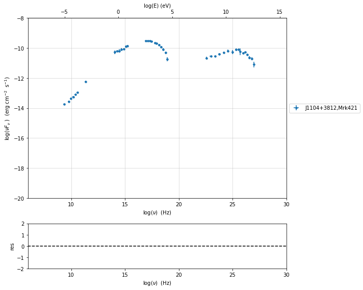

.. code:: ipython3

    sed_data.save('Mrk_401.pkl')

phenomenological model constraining
-----------------------------------

see the :ref:`phenom_constr` user guide for further information about phenomenological constraining 

spectral indices
~~~~~~~~~~~~~~~~

.. code:: ipython3

    from jetset.sed_shaper import  SEDShape
    my_shape=SEDShape(sed_data)
    my_shape.eval_indices(minimizer='lsb',silent=True)
    p=my_shape.plot_indices()
    p.rescale(y_min=-15,y_max=-6)

.. parsed-literal::

    ===================================================================================================================
    
    *** evaluating spectral indices for data ***
    ===================================================================================================================
    

.. image:: Jet_example_model_fit_files/Jet_example_model_fit_12_1.png

sed shaper
~~~~~~~~~~

.. code:: ipython3

    mm,best_fit=my_shape.sync_fit(check_host_gal_template=False,
                      Ep_start=None,
                      minimizer='lsb',
                      silent=True,
                      fit_range=[10.,21.])

.. parsed-literal::

    ===================================================================================================================
    
    *** Log-Polynomial fitting of the synchrotron component ***
    ---> first blind fit run,  fit range: [10.0, 21.0]
    ---> class:  HSP
    
    
    
    model name name  bestfit val     err +     err -   start val   fit range min fit range max frozen
    ---------- ---- ------------- ------------ ----- ------------- ------------- ------------- ------
      LogCubic    b -1.545301e-01 9.534795e-03    -- -1.000000e+00 -1.000000e+01  0.000000e+00  False
      LogCubic    c -1.023245e-02 1.433073e-03    -- -1.000000e+00 -1.000000e+01  1.000000e+01  False
      LogCubic   Ep  1.672267e+01 4.139942e-02    --  1.667039e+01  0.000000e+00  3.000000e+01  False
      LogCubic   Sp -9.491659e+00 2.515285e-02    -- -1.000000e+01 -3.000000e+01  0.000000e+00  False
    ---> sync       nu_p=+1.672267e+01 (err=+4.139942e-02)  nuFnu_p=-9.491659e+00 (err=+2.515285e-02) curv.=-1.545301e-01 (err=+9.534795e-03)
    ===================================================================================================================
    

.. code:: ipython3

    my_shape.IC_fit(fit_range=[23.,29.],minimizer='minuit',silent=True)
    p=my_shape.plot_shape_fit()
    p.rescale(y_min=-15)

.. parsed-literal::

    ===================================================================================================================
    
    *** Log-Polynomial fitting of the IC component ***
    ---> fit range: [23.0, 29.0]
    ---> LogCubic fit
    
    
    model name name  bestfit val     err +     err -   start val   fit range min fit range max frozen
    ---------- ---- ------------- ------------ ----- ------------- ------------- ------------- ------
      LogCubic    b -2.098186e-01 3.133100e-02    -- -1.000000e+00 -1.000000e+01  0.000000e+00  False
      LogCubic    c -4.661867e-02 2.178436e-02    -- -1.000000e+00 -1.000000e+01  1.000000e+01  False
      LogCubic   Ep  2.524926e+01 1.147802e-01    --  2.529412e+01  0.000000e+00  3.000000e+01  False
      LogCubic   Sp -1.011085e+01 3.498963e-02    -- -1.000000e+01 -3.000000e+01  0.000000e+00  False
    ---> IC         nu_p=+2.524926e+01 (err=+1.147802e-01)  nuFnu_p=-1.011085e+01 (err=+3.498963e-02) curv.=-2.098186e-01 (err=+3.133100e-02)
    ===================================================================================================================
    

.. image:: Jet_example_model_fit_files/Jet_example_model_fit_15_1.png

Model constraining
~~~~~~~~~~~~~~~~~~

In this step we are not fitting the model, we are just obtaining the
phenomenological ``pre_fit`` model, that will be fitted in using minuit
ore least-square bound, as shown below

.. code:: ipython3

    from jetset.obs_constrain import ObsConstrain
    from jetset.model_manager import  FitModel
    sed_obspar=ObsConstrain(beaming=25,
                            B_range=[0.001,0.1],
                            distr_e='lppl',
                            t_var_sec=3*86400,
                            nu_cut_IR=1E12,
                            SEDShape=my_shape)
    
    
    prefit_jet=sed_obspar.constrain_SSC_model(electron_distribution_log_values=False,silent=True)
    prefit_jet.save_model('prefit_jet.pkl')

.. parsed-literal::

    ===================================================================================================================
    
    ***  constrains parameters from observable ***
    
          name             par type           units          val      phys. bound. min phys. bound. max  log  frozen
    ---------------- ------------------- --------------- ------------ ---------------- ---------------- ----- ------
                gmin  low-energy-cut-off lorentz-factor* 3.338231e+02     1.000000e+00     1.000000e+09 False  False
                gmax high-energy-cut-off lorentz-factor* 9.758134e+05     1.000000e+00     1.000000e+15 False  False
                   N    emitters_density         1 / cm3 3.073134e+00     0.000000e+00               -- False  False
                   s   LE_spectral_slope                 2.181578e+00    -1.000000e+01     1.000000e+01 False  False
                   r  spectral_curvature                 7.726503e-01    -1.500000e+01     1.500000e+01 False  False
    gamma0_log_parab    turn-over-energy lorentz-factor* 2.265855e+04     1.000000e+00     1.000000e+09 False  False
                   R         region_size              cm 1.649014e+16     1.000000e+03     1.000000e+30 False  False
                 R_H     region_position              cm 1.000000e+17     0.000000e+00               -- False   True
                   B      magnetic_field               G 1.000000e-01     0.000000e+00               -- False  False
            beam_obj             beaming Lorentz-factor* 2.500000e+01     1.000000e-04               -- False  False
              z_cosm            redshift                 3.080000e-02     0.000000e+00               -- False  False
    
    ===================================================================================================================
    

.. code:: ipython3

    pl=prefit_jet.plot_model(sed_data=sed_data)
    pl.add_residual_plot(prefit_jet,sed_data)
    pl.rescale(y_min=-15,x_min=7,x_max=29)

.. image:: Jet_example_model_fit_files/Jet_example_model_fit_19_0.png

Model fitting procedure
-----------------------

We remind that we can use different ``minimizers`` for the model fitting. In the following we will use the ``minuit`` minimizer and the ``lsb`` (least square bound scipy minimizer). Using ``minuit`` we notice that sometimes (as in the case below) the fit will converge, but the quality  will not be enough (``valid==false``) to run ``minos``. Anyhow, as shown in the :ref:`MCMC sampling`, it still possible to estimate asymmetric errors by means of MCMC sampling

We freeze some parameters, and we also set some `fit_range` values. Setting fit_range can speed-up the fit convergence but should be judged by the user each time according to the physics of the particular source.

Model fitting with LSB
~~~~~~~~~~~~~~~~~~~~~~

see the :ref:`composite_models` user guide for further information about the new implementation of `FitModel`, in particular for parameter setting

.. code:: ipython3

    from jetset.minimizer import fit_SED,ModelMinimizer
    
    from jetset.model_manager import  FitModel
    from jetset.jet_model import Jet

if you want to fit the ``prefit_model`` you can load the saved one (this
allows you to save time) ad pass it to the ``FitModel`` class

.. code:: ipython3

    prefit_jet=Jet.load_model('prefit_jet.pkl')
    fit_model_lsb=FitModel( jet=prefit_jet, name='SSC-best-fit-lsb',template=None) 

.. parsed-literal::

          name             par type           units          val      phys. bound. min phys. bound. max  log  frozen
    ---------------- ------------------- --------------- ------------ ---------------- ---------------- ----- ------
                gmin  low-energy-cut-off lorentz-factor* 3.338231e+02     1.000000e+00     1.000000e+09 False  False
                gmax high-energy-cut-off lorentz-factor* 9.758134e+05     1.000000e+00     1.000000e+15 False  False
                   N    emitters_density         1 / cm3 3.073134e+00     0.000000e+00               -- False  False
                   s   LE_spectral_slope                 2.181578e+00    -1.000000e+01     1.000000e+01 False  False
                   r  spectral_curvature                 7.726503e-01    -1.500000e+01     1.500000e+01 False  False
    gamma0_log_parab    turn-over-energy lorentz-factor* 2.265855e+04     1.000000e+00     1.000000e+09 False  False
                   R         region_size              cm 1.649014e+16     1.000000e+03     1.000000e+30 False  False
                 R_H     region_position              cm 1.000000e+17     0.000000e+00               -- False   True
                   B      magnetic_field               G 1.000000e-01     0.000000e+00               -- False  False
            beam_obj             beaming Lorentz-factor* 2.500000e+01     1.000000e-04               -- False  False
              z_cosm            redshift                 3.080000e-02     0.000000e+00               -- False  False

OR use the one generated above

.. code:: ipython3

    fit_model_lsb=FitModel( jet=prefit_jet, name='SSC-best-fit-lsb',template=None) 

.. code:: ipython3

    fit_model_lsb.show_model_components()

.. parsed-literal::

    
    -------------------------------------------------------------------------------------------------------------------
    Composite model description
    -------------------------------------------------------------------------------------------------------------------
    name: SSC-best-fit-lsb  
    type: composite_model  
    components models:
     -model name: jet_leptonic model type: jet
    
    -------------------------------------------------------------------------------------------------------------------

There is only one component, whit name ``jet_leptonic``, that refers to
the ``prefit_jet`` model component

We now set the gamma grid size to 200, ad we set ``composite_expr``,
anyhow, since we have only one component this step could be skipped

.. code:: ipython3

    fit_model_lsb.jet_leptonic.set_gamma_grid_size(200)
    fit_model_lsb.composite_expr='jet_leptonic'

Freezeing parameters and setting fit_range intervals
~~~~~~~~~~~~~~~~~~~~~~~~~~~~~~~~~~~~~~~~~~~~~~~~~~~~

.. note::
   With the new implementation of composite model  (`FitModel` class) to set parameters you have to specify the model component, this is different from versions<1.1.2,
   and this holds also for the `freeze` method and for setting  `fit_range` intervals, and for the methods relate to parameters setting in general.
   See the :ref:`composite_models` user guide for further information about the new implementation of `FitModel`, in particular for parameter setting

These methods are alternative and equivalent ways to access a model
component for setting parameters state and values

a) passing as first argument, of the method, the model component
   ``name``

b) passing as first argument, of the method, the model component
   ``object``

c) accessing the model component member of the composite model class

.. code:: ipython3

    #a
    fit_model_lsb.freeze('jet_leptonic','z_cosm')
    fit_model_lsb.freeze('jet_leptonic','R_H')
    #b
    fit_model_lsb.freeze(prefit_jet,'R')
    #c
    fit_model_lsb.jet_leptonic.parameters.R.fit_range=[10**15.5,10**17.5]
    fit_model_lsb.jet_leptonic.parameters.beam_obj.fit_range=[5., 50.]

Building the ModelMinimizer object
~~~~~~~~~~~~~~~~~~~~~~~~~~~~~~~~~~

Now we build a ``lsb`` model minimizer and run the fit method

.. note::
   starting from version 1.1.2 the `fit` method allows to repeat the fit process, setting the parameter `repeat`. This will provide a better fit convergence.
   Setting `repeat=3` the fit process will be repeated 3 times

.. code:: ipython3

    model_minimizer_lsb=ModelMinimizer('lsb')
    best_fit_lsb=model_minimizer_lsb.fit(fit_model_lsb,
                                         sed_data,
                                         1E11,
                                         1E29,
                                         fitname='SSC-best-fit-minuit',
                                         repeat=3)

.. parsed-literal::

    filtering data in fit range = [1.000000e+11,1.000000e+29]
    data length 35
    ===================================================================================================================
    
    *** start fit process ***
    ----- 
    fit run: 0
    | minim function calls=50, chisq=67.700653 UL part=-0.0000000
    fit run: 1
    / minim function calls=10, chisq=67.354632 UL part=-0.000000
    fit run: 2
    \ minim function calls=20, chisq=64.996504 UL part=-0.000000
    **************************************************************************************************
    Fit report
    
    Model: SSC-best-fit-minuit
     model name        name             par type           units          val      phys. bound. min phys. bound. max  log  frozen
    ------------ ---------------- ------------------- --------------- ------------ ---------------- ---------------- ----- ------
    jet_leptonic             gmin  low-energy-cut-off lorentz-factor* 3.356628e+02     1.000000e+00     1.000000e+09 False  False
    jet_leptonic             gmax high-energy-cut-off lorentz-factor* 9.629045e+05     1.000000e+00     1.000000e+15 False  False
    jet_leptonic                N    emitters_density         1 / cm3 2.635771e+00     0.000000e+00               -- False  False
    jet_leptonic                s   LE_spectral_slope                 2.136779e+00    -1.000000e+01     1.000000e+01 False  False
    jet_leptonic                r  spectral_curvature                 8.257853e-01    -1.500000e+01     1.500000e+01 False  False
    jet_leptonic gamma0_log_parab    turn-over-energy lorentz-factor* 3.086566e+04     1.000000e+00     1.000000e+09 False  False
    jet_leptonic                R         region_size              cm 1.649014e+16     1.000000e+03     1.000000e+30 False   True
    jet_leptonic              R_H     region_position              cm 1.000000e+17     0.000000e+00               -- False   True
    jet_leptonic                B      magnetic_field               G 8.056890e-02     0.000000e+00               -- False  False
    jet_leptonic         beam_obj             beaming Lorentz-factor* 2.575200e+01     1.000000e-04               -- False  False
    jet_leptonic           z_cosm            redshift                 3.080000e-02     0.000000e+00               -- False   True
    
    converged=True
    calls=24
    The relative error between two consecutive iterates is at most 0.000000
    dof=27
    chisq=64.996500, chisq/red=2.407278 null hypothesis sig=0.000056
    
    best fit pars
     model name        name       bestfit val     err +     err -  start val   fit range min fit range max frozen
    ------------ ---------------- ------------ ------------ ----- ------------ ------------- ------------- ------
    jet_leptonic             gmin 3.356628e+02 2.308852e+02    -- 3.338231e+02  1.000000e+00  1.000000e+09  False
    jet_leptonic             gmax 9.629045e+05 2.161311e+04    -- 9.758134e+05  1.000000e+00  1.000000e+15  False
    jet_leptonic                N 2.635771e+00 2.032613e+00    -- 3.073134e+00  0.000000e+00            --  False
    jet_leptonic                s 2.136779e+00 1.362651e-01    -- 2.181578e+00 -1.000000e+01  1.000000e+01  False
    jet_leptonic                r 8.257853e-01 2.291436e-01    -- 7.726503e-01 -1.500000e+01  1.500000e+01  False
    jet_leptonic gamma0_log_parab 3.086566e+04 1.699546e+04    -- 2.265855e+04  1.000000e+00  1.000000e+09  False
    jet_leptonic                R           --           --    -- 1.649014e+16  3.162278e+15  3.162278e+17   True
    jet_leptonic              R_H           --           --    -- 1.000000e+17  0.000000e+00            --   True
    jet_leptonic                B 8.056890e-02 2.328432e-02    -- 1.000000e-01  0.000000e+00            --  False
    jet_leptonic         beam_obj 2.575200e+01 4.198739e+00    -- 2.500000e+01  5.000000e+00  5.000000e+01  False
    jet_leptonic           z_cosm           --           --    -- 3.080000e-02  0.000000e+00            --   True
    **************************************************************************************************
    
    ===================================================================================================================
    

we can obtain the best fit astropy table

.. code:: ipython3

    best_fit_lsb.bestfit_table

.. raw:: html

    <i>Table length=11</i>
    <table id="table4737575888" class="table-striped table-bordered table-condensed">
    <thead><tr><th>model name</th><th>name</th><th>bestfit val</th><th>err +</th><th>err -</th><th>start val</th><th>fit range min</th><th>fit range max</th><th>frozen</th></tr></thead>
    <thead><tr><th>str12</th><th>str16</th><th>float64</th><th>float64</th><th>float64</th><th>float64</th><th>float64</th><th>float64</th><th>bool</th></tr></thead>
    <tr><td>jet_leptonic</td><td>gmin</td><td>3.356628e+02</td><td>2.308852e+02</td><td>--</td><td>3.338231e+02</td><td>1.000000e+00</td><td>1.000000e+09</td><td>False</td></tr>
    <tr><td>jet_leptonic</td><td>gmax</td><td>9.629045e+05</td><td>2.161311e+04</td><td>--</td><td>9.758134e+05</td><td>1.000000e+00</td><td>1.000000e+15</td><td>False</td></tr>
    <tr><td>jet_leptonic</td><td>N</td><td>2.635771e+00</td><td>2.032613e+00</td><td>--</td><td>3.073134e+00</td><td>0.000000e+00</td><td>--</td><td>False</td></tr>
    <tr><td>jet_leptonic</td><td>s</td><td>2.136779e+00</td><td>1.362651e-01</td><td>--</td><td>2.181578e+00</td><td>-1.000000e+01</td><td>1.000000e+01</td><td>False</td></tr>
    <tr><td>jet_leptonic</td><td>r</td><td>8.257853e-01</td><td>2.291436e-01</td><td>--</td><td>7.726503e-01</td><td>-1.500000e+01</td><td>1.500000e+01</td><td>False</td></tr>
    <tr><td>jet_leptonic</td><td>gamma0_log_parab</td><td>3.086566e+04</td><td>1.699546e+04</td><td>--</td><td>2.265855e+04</td><td>1.000000e+00</td><td>1.000000e+09</td><td>False</td></tr>
    <tr><td>jet_leptonic</td><td>R</td><td>--</td><td>--</td><td>--</td><td>1.649014e+16</td><td>3.162278e+15</td><td>3.162278e+17</td><td>True</td></tr>
    <tr><td>jet_leptonic</td><td>R_H</td><td>--</td><td>--</td><td>--</td><td>1.000000e+17</td><td>0.000000e+00</td><td>--</td><td>True</td></tr>
    <tr><td>jet_leptonic</td><td>B</td><td>8.056890e-02</td><td>2.328432e-02</td><td>--</td><td>1.000000e-01</td><td>0.000000e+00</td><td>--</td><td>False</td></tr>
    <tr><td>jet_leptonic</td><td>beam_obj</td><td>2.575200e+01</td><td>4.198739e+00</td><td>--</td><td>2.500000e+01</td><td>5.000000e+00</td><td>5.000000e+01</td><td>False</td></tr>
    <tr><td>jet_leptonic</td><td>z_cosm</td><td>--</td><td>--</td><td>--</td><td>3.080000e-02</td><td>0.000000e+00</td><td>--</td><td>True</td></tr>
    </table>

saving fit model, model minimizer
---------------------------------

We can save all the fit products to be used later.

.. code:: ipython3

    best_fit_lsb.save_report('SSC-best-fit-lsb.txt')
    model_minimizer_lsb.save_model('model_minimizer_lsb.pkl')
    fit_model_lsb.save_model('fit_model_lsb.pkl')

.. code:: ipython3

    %matplotlib inline
    fit_model_lsb.set_nu_grid(1E6,1E30,200)
    fit_model_lsb.eval()
    p2=fit_model_lsb.plot_model(sed_data=sed_data)
    p2.rescale(y_min=-13,x_min=6,x_max=28.5)

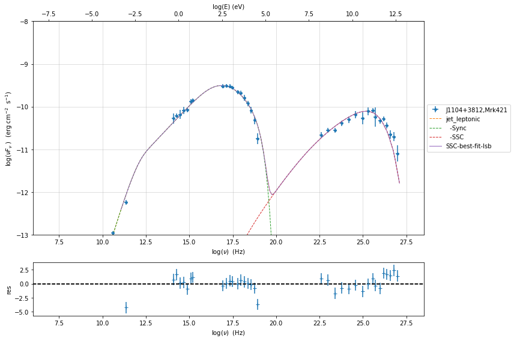

Model fitting with Minuit
-------------------------

.. code:: ipython3

    from jetset.minimizer import fit_SED,ModelMinimizer
    from jetset.model_manager import  FitModel
    from jetset.jet_model import Jet
    
    jet_minuit=Jet.load_model('prefit_jet.pkl')
    jet_minuit.set_gamma_grid_size(200)
    
    fit_model_minuit=FitModel( jet=jet_minuit, name='SSC-best-fit-minuit',template=None) 

.. parsed-literal::

          name             par type           units          val      phys. bound. min phys. bound. max  log  frozen
    ---------------- ------------------- --------------- ------------ ---------------- ---------------- ----- ------
                gmin  low-energy-cut-off lorentz-factor* 3.338231e+02     1.000000e+00     1.000000e+09 False  False
                gmax high-energy-cut-off lorentz-factor* 9.758134e+05     1.000000e+00     1.000000e+15 False  False
                   N    emitters_density         1 / cm3 3.073134e+00     0.000000e+00               -- False  False
                   s   LE_spectral_slope                 2.181578e+00    -1.000000e+01     1.000000e+01 False  False
                   r  spectral_curvature                 7.726503e-01    -1.500000e+01     1.500000e+01 False  False
    gamma0_log_parab    turn-over-energy lorentz-factor* 2.265855e+04     1.000000e+00     1.000000e+09 False  False
                   R         region_size              cm 1.649014e+16     1.000000e+03     1.000000e+30 False  False
                 R_H     region_position              cm 1.000000e+17     0.000000e+00               -- False   True
                   B      magnetic_field               G 1.000000e-01     0.000000e+00               -- False  False
            beam_obj             beaming Lorentz-factor* 2.500000e+01     1.000000e-04               -- False  False
              z_cosm            redshift                 3.080000e-02     0.000000e+00               -- False  False

.. code:: ipython3

    fit_model_minuit.show_model_components()

.. parsed-literal::

    
    -------------------------------------------------------------------------------------------------------------------
    Composite model description
    -------------------------------------------------------------------------------------------------------------------
    name: SSC-best-fit-minuit  
    type: composite_model  
    components models:
     -model name: jet_leptonic model type: jet
    
    -------------------------------------------------------------------------------------------------------------------

.. code:: ipython3

    
    fit_model_minuit.freeze('jet_leptonic','z_cosm')
    fit_model_minuit.freeze('jet_leptonic','R_H')
    fit_model_minuit.freeze('jet_leptonic','R')
    fit_model_minuit.freeze('jet_leptonic','gmax')
    fit_model_minuit.jet_leptonic.parameters.R.fit_range=[10**15.5,10**17.5]
    fit_model_minuit.jet_leptonic.parameters.beam_obj.fit_range=[5,50]

.. code:: ipython3

    model_minimizer_minuit=ModelMinimizer('minuit')
    best_fit_minuit=model_minimizer_minuit.fit(fit_model_minuit,sed_data,10**11.,10**29.0,fitname='SSC-best-fit-minuit',repeat=3)

.. parsed-literal::

    filtering data in fit range = [1.000000e+11,1.000000e+29]
    data length 35
    ===================================================================================================================
    
    *** start fit process ***
    ----- 
    fit run: 0
    \ minim function calls=400, chisq=53.606667 UL part=-0.00000000
    fit run: 1
    | minim function calls=90, chisq=50.469558 UL part=-0.000000
    fit run: 2
    / minim function calls=90, chisq=50.469558 UL part=-0.000000
    **************************************************************************************************
    Fit report
    
    Model: SSC-best-fit-minuit
     model name        name             par type           units          val      phys. bound. min phys. bound. max  log  frozen
    ------------ ---------------- ------------------- --------------- ------------ ---------------- ---------------- ----- ------
    jet_leptonic             gmin  low-energy-cut-off lorentz-factor* 3.310408e+02     1.000000e+00     1.000000e+09 False  False
    jet_leptonic             gmax high-energy-cut-off lorentz-factor* 9.758134e+05     1.000000e+00     1.000000e+15 False   True
    jet_leptonic                N    emitters_density         1 / cm3 2.026102e+00     0.000000e+00               -- False  False
    jet_leptonic                s   LE_spectral_slope                 2.041077e+00    -1.000000e+01     1.000000e+01 False  False
    jet_leptonic                r  spectral_curvature                 9.748096e-01    -1.500000e+01     1.500000e+01 False  False
    jet_leptonic gamma0_log_parab    turn-over-energy lorentz-factor* 3.065668e+04     1.000000e+00     1.000000e+09 False  False
    jet_leptonic                R         region_size              cm 1.649014e+16     1.000000e+03     1.000000e+30 False   True
    jet_leptonic              R_H     region_position              cm 1.000000e+17     0.000000e+00               -- False   True
    jet_leptonic                B      magnetic_field               G 8.688123e-02     0.000000e+00               -- False  False
    jet_leptonic         beam_obj             beaming Lorentz-factor* 2.493567e+01     1.000000e-04               -- False  False
    jet_leptonic           z_cosm            redshift                 3.080000e-02     0.000000e+00               -- False   True
    
    converged=True
    calls=96
    ------------------------------------------------------------------
    | FCN = 49.69                   |      Ncalls=84 (95 total)      |
    | EDM = 3.59E+04 (Goal: 1E-05)  |            up = 1.0            |
    ------------------------------------------------------------------
    |  Valid Min.   | Valid Param.  | Above EDM | Reached call limit |
    ------------------------------------------------------------------
    |     False     |     True      |   True    |       False        |
    ------------------------------------------------------------------
    | Hesse failed  |   Has cov.    | Accurate  | Pos. def. | Forced |
    ------------------------------------------------------------------
    |     False     |     True      |   False   |   False   |  True  |
    ------------------------------------------------------------------
    -------------------------------------------------------------------------------------------
    |   | Name  |   Value   | Hesse Err | Minos Err- | Minos Err+ | Limit-  | Limit+  | Fixed |
    -------------------------------------------------------------------------------------------
    | 0 | par_0 |   331.0   |    0.5    |            |            |    1    |  1e+09  |       |
    | 1 | par_1 |   2.03    |   0.20    |            |            |    0    |         |       |
    | 2 | par_2 |   2.041   |   0.018   |            |            |   -10   |   10    |       |
    | 3 | par_3 |   0.97    |   0.09    |            |            |   -15   |   15    |       |
    | 4 | par_4 |   3.1E4   |   0.6E4   |            |            |    1    |  1e+09  |       |
    | 5 | par_5 |   0.087   |   0.006   |            |            |    0    |         |       |
    | 6 | par_6 |   24.9    |    0.4    |            |            |    5    |   50    |       |
    -------------------------------------------------------------------------------------------
    dof=28
    chisq=49.690434, chisq/red=1.774658 null hypothesis sig=0.007001
    
    best fit pars
     model name        name       bestfit val     err +     err -  start val   fit range min fit range max frozen
    ------------ ---------------- ------------ ------------ ----- ------------ ------------- ------------- ------
    jet_leptonic             gmin 3.310408e+02 5.393358e-01    -- 3.338231e+02  1.000000e+00  1.000000e+09  False
    jet_leptonic             gmax           --           --    -- 9.758134e+05  1.000000e+00  1.000000e+15   True
    jet_leptonic                N 2.026102e+00 1.973977e-01    -- 3.073134e+00  0.000000e+00            --  False
    jet_leptonic                s 2.041077e+00 1.765315e-02    -- 2.181578e+00 -1.000000e+01  1.000000e+01  False
    jet_leptonic                r 9.748096e-01 9.440913e-02    -- 7.726503e-01 -1.500000e+01  1.500000e+01  False
    jet_leptonic gamma0_log_parab 3.065668e+04 5.849661e+03    -- 2.265855e+04  1.000000e+00  1.000000e+09  False
    jet_leptonic                R           --           --    -- 1.649014e+16  3.162278e+15  3.162278e+17   True
    jet_leptonic              R_H           --           --    -- 1.000000e+17  0.000000e+00            --   True
    jet_leptonic                B 8.688123e-02 6.019300e-03    -- 1.000000e-01  0.000000e+00            --  False
    jet_leptonic         beam_obj 2.493567e+01 3.523375e-01    -- 2.500000e+01  5.000000e+00  5.000000e+01  False
    jet_leptonic           z_cosm           --           --    -- 3.080000e-02  0.000000e+00            --   True
    **************************************************************************************************
    
    ===================================================================================================================
    

.. code:: ipython3

    model_minimizer_minuit.minimizer.mesg

.. raw:: html

    <table>
    <tr>
    <td colspan="2" title="Minimum value of function">
    FCN = 49.69
    </td>
    <td align="center" colspan="3" title="No. of calls in last algorithm and total number of calls">
    Ncalls = 84 (95 total)
    </td>
    </tr>
    <tr>
    <td colspan="2" title="Estimated distance to minimum and target threshold">
    EDM = 3.59E+04 (Goal: 1E-05)
    </td>
    <td align="center" colspan="3" title="Increase in FCN which corresponds to 1 standard deviation">
    up = 1.0
    </td>
    </tr>
    <tr>
    <td align="center" title="Validity of the migrad call">
    Valid Min.
    </td>
    <td align="center" title="Validity of parameters">
    Valid Param.
    </td>
    <td align="center" title="Is EDM above goal EDM?">
    Above EDM
    </td>
    <td align="center" colspan="2" title="Did last migrad call reach max call limit?">
    Reached call limit
    </td>
    </tr>
    <tr>
    <td align="center" style="background-color:#FF7878;">
    False
    </td>
    <td align="center" style="background-color:#92CCA6;">
    True
    </td>
    <td align="center" style="background-color:#FF7878;">
    True
    </td>
    <td align="center" colspan="2" style="background-color:#92CCA6;">
    False
    </td>
    </tr>
    <tr>
    <td align="center" title="Did Hesse fail?">
    Hesse failed
    </td>
    <td align="center" title="Has covariance matrix">
    Has cov.
    </td>
    <td align="center" title="Is covariance matrix accurate?">
    Accurate
    </td>
    <td align="center" title="Is covariance matrix positive definite?">
    Pos. def.
    </td>
    <td align="center" title="Was positive definiteness enforced by Minuit?">
    Forced
    </td>
    </tr>
    <tr>
    <td align="center" style="background-color:#92CCA6;">
    False
    </td>
    <td align="center" style="background-color:#92CCA6;">
    True
    </td>
    <td align="center" style="background-color:#FF7878;">
    False
    </td>
    <td align="center" style="background-color:#FF7878;">
    False
    </td>
    <td align="center" style="background-color:#FF7878;">
    True
    </td>
    </tr>
    </table>
    <table>
    <tr style="background-color:#F4F4F4;">
    <td/>
    <th title="Variable name">
    Name
    </th>
    <th title="Value of parameter">
    Value
    </th>
    <th title="Hesse error">
    Hesse Error
    </th>
    <th title="Minos lower error">
    Minos Error-
    </th>
    <th title="Minos upper error">
    Minos Error+
    </th>
    <th title="Lower limit of the parameter">
    Limit-
    </th>
    <th title="Upper limit of the parameter">
    Limit+
    </th>
    <th title="Is the parameter fixed in the fit">
    Fixed
    </th>
    </tr>
    <tr style="background-color:#FFFFFF;">
    <td>
    0
    </td>
    <td>
    par_0
    </td>
    <td>
    331.0
    </td>
    <td>
    0.5
    </td>
    <td>
    
    </td>
    <td>
    
    </td>
    <td>
    1
    </td>
    <td>
    1E+09
    </td>
    <td>
    
    </td>
    </tr>
    <tr style="background-color:#F4F4F4;">
    <td>
    1
    </td>
    <td>
    par_1
    </td>
    <td>
    2.03
    </td>
    <td>
    0.20
    </td>
    <td>
    
    </td>
    <td>
    
    </td>
    <td>
    0
    </td>
    <td>
    
    </td>
    <td>
    
    </td>
    </tr>
    <tr style="background-color:#FFFFFF;">
    <td>
    2
    </td>
    <td>
    par_2
    </td>
    <td>
    2.041
    </td>
    <td>
    0.018
    </td>
    <td>
    
    </td>
    <td>
    
    </td>
    <td>
    -10
    </td>
    <td>
    10
    </td>
    <td>
    
    </td>
    </tr>
    <tr style="background-color:#F4F4F4;">
    <td>
    3
    </td>
    <td>
    par_3
    </td>
    <td>
    0.97
    </td>
    <td>
    0.09
    </td>
    <td>
    
    </td>
    <td>
    
    </td>
    <td>
    -15
    </td>
    <td>
    15
    </td>
    <td>
    
    </td>
    </tr>
    <tr style="background-color:#FFFFFF;">
    <td>
    4
    </td>
    <td>
    par_4
    </td>
    <td>
    3.1E4
    </td>
    <td>
    0.6E4
    </td>
    <td>
    
    </td>
    <td>
    
    </td>
    <td>
    1
    </td>
    <td>
    1E+09
    </td>
    <td>
    
    </td>
    </tr>
    <tr style="background-color:#F4F4F4;">
    <td>
    5
    </td>
    <td>
    par_5
    </td>
    <td>
    0.087
    </td>
    <td>
    0.006
    </td>
    <td>
    
    </td>
    <td>
    
    </td>
    <td>
    0
    </td>
    <td>
    
    </td>
    <td>
    
    </td>
    </tr>
    <tr style="background-color:#FFFFFF;">
    <td>
    6
    </td>
    <td>
    par_6
    </td>
    <td>
    24.9
    </td>
    <td>
    0.4
    </td>
    <td>
    
    </td>
    <td>
    
    </td>
    <td>
    5
    </td>
    <td>
    50
    </td>
    <td>
    
    </td>
    </tr>
    </table>

you can save results collected so far

.. code:: ipython3

    best_fit_minuit.save_report('SSC-best-fit-minuit.txt')
    model_minimizer_minuit.save_model('model_minimizer_minuit.pkl')
    fit_model_minuit.save_model('fit_model_minuit.pkl')

for further informatio regardin minuit please refer to
https://iminuit.readthedocs.io/en/latest/

.. code:: ipython3

    #migrad profile
    
    #access the data
    profile_migrad=model_minimizer_minuit.minimizer.profile('s')
    
    #make the plot(no need to run the previous command)
    profile_plot_migrad=model_minimizer_minuit.minimizer.draw_profile('s')

.. parsed-literal::

    / minim function calls=100, chisq=99.129516 UL part=-0.000000

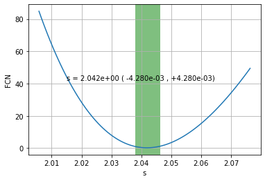

.. code:: ipython3

    #migrad contour
    
    #access the data
    contour_migrad=model_minimizer_minuit.minimizer.contour('r','s')
    
    #make the plot(no need to run the previous command)
    contour_plot_migrad=model_minimizer_minuit.minimizer.draw_contour('r','s')

.. parsed-literal::

    / minim function calls=400, chisq=225.610722 UL part=-0.000000

.. image:: Jet_example_model_fit_files/Jet_example_model_fit_57_1.png

you can use also minos contour and profile, in this case the
computational time is longer:

.. highlight:: python
    
   profile_migrad=model_minimizer_minuit.minimizer.mnprofile('s')
   profile_plot_migrad=model_minimizer_minuit.minimizer.draw_mnprofile('s')
    
   contour_migrad=model_minimizer_minuit.minimizer.mncontour('r','s')
   contour_plot_migrad=model_minimizer_minuit.minimizer.draw_mncontour('r','s')

.. code:: ipython3

    %matplotlib inline
    fit_model_minuit.eval()
    p2=fit_model_minuit.plot_model(sed_data=sed_data)
    p2.rescale(y_min=-13,x_min=6,x_max=28.5)

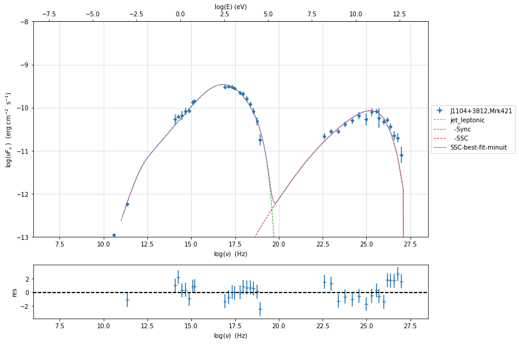

.. code:: ipython3

    %matplotlib inline
    from jetset.plot_sedfit import PlotSED
    fit_model_minuit.set_nu_grid(1E6,1E30,200)
    fit_model_lsb.set_nu_grid(1E6,1E30,500)
    fit_model_lsb.eval()
    fit_model_minuit.eval()
    p2=PlotSED()
    p2.add_data_plot(sed_data,fit_range=[ 11.,29.])
    p2.add_model_plot(fit_model_minuit,color='black')
    p2.add_residual_plot(fit_model_minuit,sed_data,fit_range=[ 11.,29.],color='black')
    p2.add_model_plot(fit_model_lsb,color='red')
    p2.add_residual_plot(fit_model_lsb,sed_data,fit_range=[ 11.,29.],color='red')
    p2.rescale(y_min=-13,x_min=6,x_max=28.5)

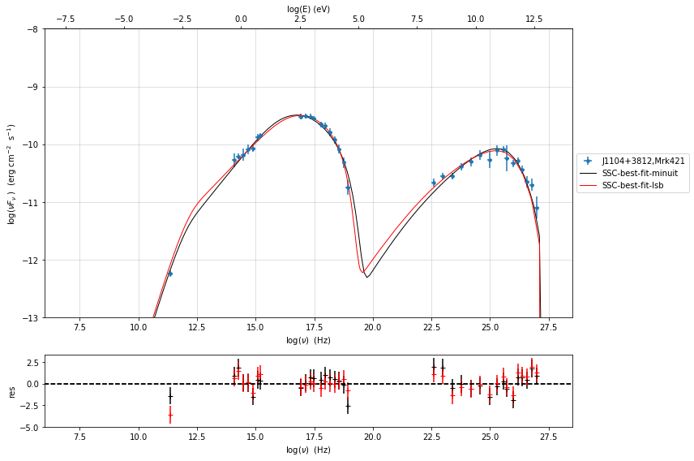

MCMC sampling
-------------

.. code:: ipython3

    from jetset.mcmc import McmcSampler
    from jetset.minimizer import ModelMinimizer

We used a flat prior centered on the best fit value. Setting
``bound=5.0`` and ``bound_rel=True`` means that:

1) the prior interval will be defined as [best_fit_val - delta_m ,
   best_fit_val + delta_p]

2) with delta_p=delta_m=best_fit_val*bound

If we set ``bound_rel=False`` then delta_p = delta_m =
best_fit_err*bound

It is possible to define asymmetric boundaries e.g. ``bound=[2.0,5.0]``
meaning that

1) for ``bound_rel=True``

   delta_p = best_fit_val*bound[1]

   delta_m =b est_fit_val*bound[0]

2) for ``bound_rel=False``

   delta_p = best_fit_err*bound[1]

   delta_m = best_fit_err*bound[0]

In the next release a more flexible prior interface will be added,
including different type of priors

Given the large parameter space, we select a sub sample of parameters
using the ``use_labels_dict``. If we do not pass the ‘use_labels_dict’
the full set of free parameters will be used

.. code:: ipython3

    model_minimizer_minuit = ModelMinimizer.load_model('model_minimizer_minuit.pkl')
    
    mcmc=McmcSampler(model_minimizer_minuit)
    
    labels=['N','B','beam_obj','s','gamma0_log_parab']
    model_name='jet_leptonic'
    use_labels_dict={model_name:labels}
    
    mcmc.run_sampler(nwalkers=128,burnin=10,steps=50,bound=5.0,bound_rel=True,threads=None,walker_start_bound=0.005,use_labels_dict=use_labels_dict)

.. parsed-literal::

    mcmc run starting

.. parsed-literal::

    100%|██████████| 50/50 [06:15<00:00,  7.51s/it]

.. parsed-literal::

    mcmc run done, with 1 threads took 382.61 seconds

.. parsed-literal::

    

.. code:: ipython3

    print(mcmc.acceptance_fraction)

.. parsed-literal::

    0.5639062499999999

.. code:: ipython3

    p=mcmc.plot_model(sed_data=sed_data,fit_range=[11.,27.4],size=50)
    p.rescale(y_min=-13,x_min=6,x_max=28.5)

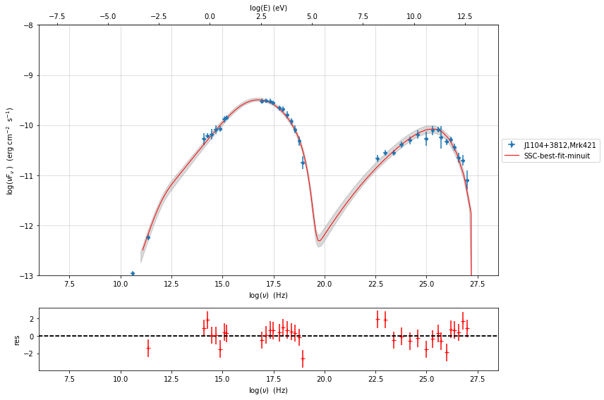

.. code:: ipython3

    f=mcmc.plot_chain('s',log_plot=False)

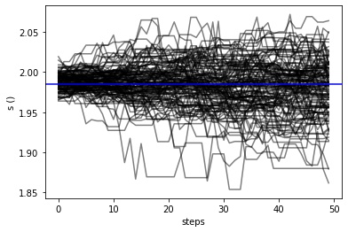

.. code:: ipython3

    f=mcmc.corner_plot()

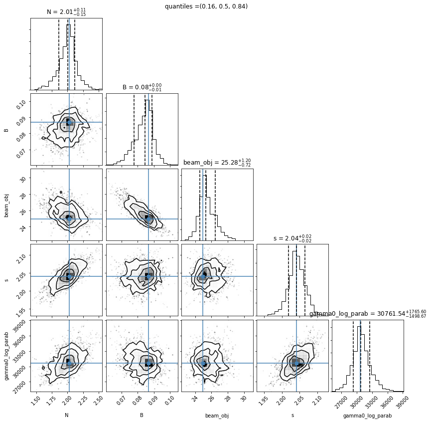

.. code:: ipython3

    mcmc.get_par('N')

.. parsed-literal::

    (array([2.03985989, 1.97347471, 1.88059101, ..., 2.17080728, 2.16236303,
            1.91671546]),
     0)

.. code:: ipython3

    f=mcmc.plot_par('beam_obj')

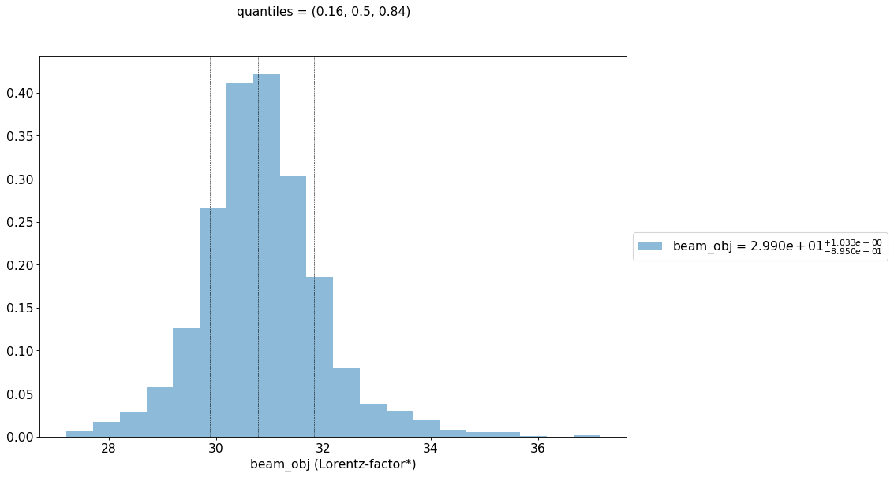

.. code:: ipython3

    f=mcmc.plot_par('gamma0_log_parab',log_plot=True)

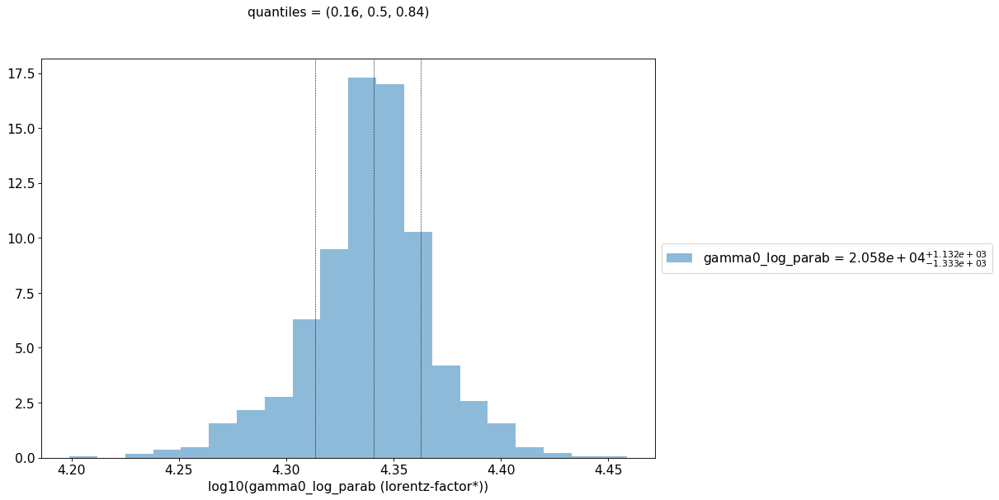

Save and reuse MCMC
-------------------

.. code:: ipython3

    mcmc.save('mcmc_sampler.pkl')

.. code:: ipython3

    from jetset.mcmc import McmcSampler
    from jetset.data_loader import ObsData
    from jetset.plot_sedfit import PlotSED
    from jetset.test_data_helper import  test_SEDs
    
    sed_data=ObsData.load('Mrk_401.pkl')
    
    ms=McmcSampler.load('mcmc_sampler.pkl')

.. code:: ipython3

    ms.model.name

.. parsed-literal::

    'SSC-best-fit-minuit'

.. code:: ipython3

    p=ms.plot_model(sed_data=sed_data,fit_range=[11., 27.4],size=50)
    p.rescale(y_min=-13,x_min=6,x_max=28.5)

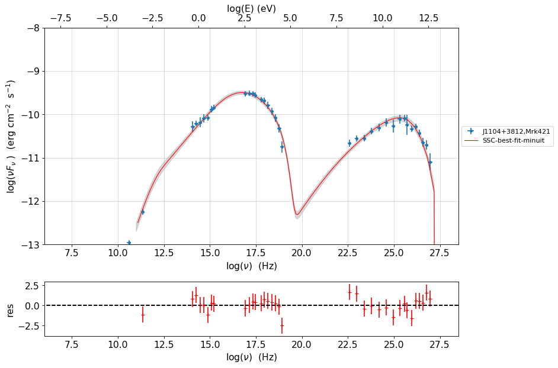

.. code:: ipython3

    f=ms.plot_par('beam_obj',log_plot=False)

.. image:: Jet_example_model_fit_files/Jet_example_model_fit_78_0.png

.. code:: ipython3

    f=ms.plot_par('B',log_plot=True)

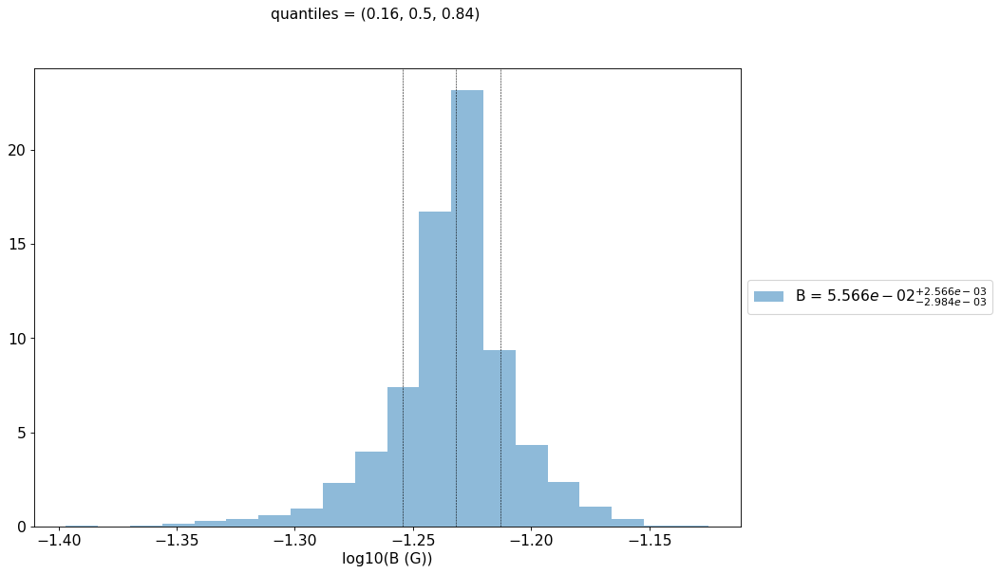

.. code:: ipython3

    f=ms.plot_chain('s',log_plot=False)

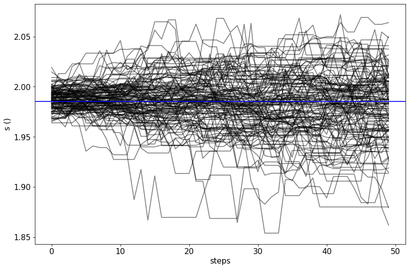

.. code:: ipython3

    f=ms.corner_plot()

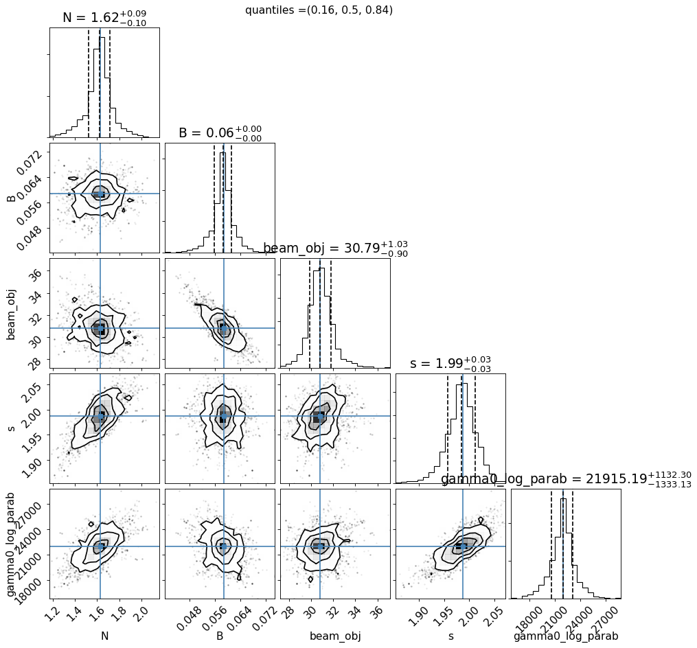

